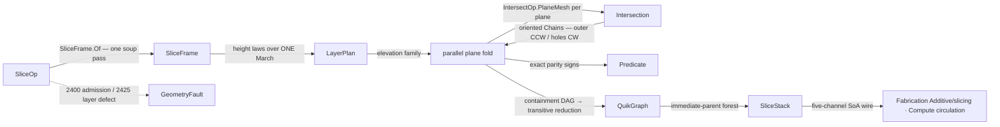

# [RASM_INTERSECTION_SLICE]

The slice-stack owner of `Rasm.Meshing` — ONE `Slicing.Apply(SliceOp, Op? key = null)` section fold composing `Intersection.Apply(IntersectOp.PlaneMesh(...))` over a parallel-plane family, never a seventh `IntersectOp` case and never a second crossing kernel: crossing existence, on-plane vertex handling, segment orientation, and chain connectivity are the intersect owner's exact machinery (`Lpi` edge×plane constructions, projected `Orient2D` straddles, `Predicate.Compare` ordering — the V10b implicit sub-family), composed one level up. The plane family is GENERATED, not enumerated: `LayerPlan` is the layer-height policy union whose five seed rows — `Uniform` · `Adaptive` (cusp-height-bounded) · `BySlope` (slope-band table) · `SupportInterface` (densified support-contact bands) · `AtElevations` (caller-supplied elevations, the `Rasm.Compute` circulation story-elevation shape) — are height-law DATA over ONE `March` integrator, so the next layer policy is one case carrying one height law, never a sibling planner body.

Per-layer contours arrive ORIENTED from the composed fold — intersect stores every section segment `from → to` along `cut.Normal × faceNormal`, so closed loops close outer-CCW / holes-CW in the section frame by construction — and a non-watertight section arrives as typed OPEN `Chain(Closed: false)` rows, surfaced as first-class open-chain ordinals on the wire or, under `SlicePolicy.RequireWatertight`, as the typed `GeometryFault.SectionFault(layer, elevation, openChains)` 2425. Contour NESTING is an exact-parity containment fold: bounding-box-pruned pairs run the even-odd ray parity over exact `Predicate.Compare` straddles and `Predicate.Orient2D` side signs (signs exact; the operands are the canonical emission coordinates every downstream decoder also reads), the containment edges fold into a transient `BidirectionalGraph<int, SEdge<int>>`, `IsDirectedAcyclicGraph` gates the laminar invariant, and `ComputeTransitiveReduction` derives the immediate-parent forest in one call — QuikGraph serves in-computation only, and the RESULT is the kernel-owned SoA forest wire: `SliceStack` pins the FIVE channels — layers · contours · nesting parent/child index arrays · open chains · elevations — the complete schema the `Rasm.Fabrication` `Additive/slicing` `Slice.Layers` decoder and the `Rasm.Compute` circulation decoder bind (the Fabrication author-slicer dies for this seam). Typed `Chain` rows are PROJECTIONS minted from the channels on read, so the wire and the typed view are one storage, never a dual carriage.

## [01]-[INDEX]

- [01]-[SLICING]: ONE `Slicing.Apply(SliceOp, Op?)` entry; `LayerPlan` height-law generator rows over one `March` integrator; `SliceFrame` the per-run elevation/slope facts; the parallel per-plane `IntersectOp.PlaneMesh` fold (`ParallelHelper` struct action over pooled result slots); exact-parity nesting → QuikGraph containment DAG → transitive-reduction forest; `SliceStack` the five-channel SoA wire + `Chain` projections.

## [02]-[SLICING]

- Owner: `SlicePolicy` the policy row (`RequireWatertight` — open chains fault instead of landing as typed rows; `MaxLayers` the plan-runaway ceiling; `FrameBins` the slope-table bin count the adaptive laws read; `ParallelFloor` the `minimumActionsPerThread` floor; `Intersect` the composed `IntersectPolicy` every per-plane fold threads) registering `IValidityEvidence`; `SliceFrame` the per-run derived facts computed ONCE from the soup — `Datum` plane, `Vertical` (the datum normal's dominant `Axis`, the nesting projection plane), `Lo`/`Hi` elevation extent, and the binned steepest-slope/overhang tables (`MaxSlope` per elevation bin; start-sorted overhang rows carrying start elevation + downward `|n·d|` so each plan filters by its OWN `OverhangCosine`) the height laws read; `LayerPlan` the `[Union]` height-law generator — five seed cases each answering ONE `Fin<Arr<double>>` `Elevations(SliceFrame, SlicePolicy)` fold, the four plan cases lowering to a `Func<double,double>` height law integrated by the ONE `March` body and `AtElevations` validating the caller family; `SliceOp` the request record (`Mesh` · `Datum` · `Plan` · `Policy` — one modality, so the request is a record and the MODALITY axis lives in the plan union, never a one-case request ceremony); `SliceStack` the frozen five-channel result (channel schema below) with `ContourAt`/`LayerAt`/`RootsOf`/`Depth` typed projections; `Slicing` the static surface.
- Cases: `LayerPlan` cases `Uniform(Height)` · `Adaptive(CuspHeight, MinHeight, MaxHeight)` · `BySlope(Arr<(SlopeCeiling, Height)> Bands)` · `SupportInterface(BaseHeight, InterfaceHeight, InterfaceLayers, OverhangCosine)` · `AtElevations(Arr<double> Elevations)` (5 — ALL FOUR named Fabrication `[V6]` policies as seed rows plus the caller-supplied family the Compute circulation consumer binds; the family is OPEN: a new policy is one case carrying one height law).
- Entry: `public static Fin<SliceStack> Apply(SliceOp op, Op? key = null)` — the ONE entry. `Fin<T>` routes `GeometryFault.DegenerateInput(Kind, index, witness)` 2400 on an inadmissible request (invalid datum plane, empty mesh, an invalid policy row, a non-positive plan height, an out-of-extent or unsorted explicit family, a plan marching past `MaxLayers`) and `GeometryFault.SectionFault(layer, elevation, openChains)` 2425 on a layer defect — a non-watertight layer under `RequireWatertight` (the open-chain count is the payload) or a nesting contradiction (a containment cycle or a multi-parent reduction, the overlapping-contour witness; the layer's open count rides the same payload slot). A composed per-plane failure (`DegenerateInput` from the intersect admission, `IntersectionFault` 2424 from a non-manifold junction) surfaces unchanged — the fold never re-labels a sibling's typed fault. No `SliceUniform`/`SliceAdaptive`/`SliceAt` sibling statics — one polymorphic `Apply`, the plan case discriminating.
- Auto: `SliceFrame.Of` makes ONE soup pass (`MeshEdit.Of(space)` — the one adapter) projecting every vertex onto the datum normal for `Lo`/`Hi`, binning per-face elevation intervals with their `|n·d|` slope cosine into the `FrameBins` max-slope table, and collecting start-sorted overhang rows — every downward face contributes its low end WITH its `|n·d|`, so the interface law filters rows past its own `OverhangCosine` at read, never a frame re-pass per plan. `Elevations` folds the plan's generated `Switch`: `Uniform` is the constant law; `Adaptive` is the cusp-height bound `clamp(cusp / maxSlope(z .. z+hMax), hMin, hMax)` — the geometric-error law: a flat cap (`|n·d| → 1`) forces fine layers, a vertical wall (`|n·d| → 0`) admits coarse ones; `BySlope` reads the first band row whose `SlopeCeiling` covers the binned slope cosine (`|n·d| ∈ (0,1]`) — the table IS the law; `SupportInterface` answers `InterfaceHeight` inside any `InterfaceLayers × InterfaceHeight` band around an overhang start steeper than its `OverhangCosine`, else `BaseHeight`; `AtElevations` validates finite · strictly ascending · in-extent and passes through. `March` is the one integrator: `z ← Lo + h(Lo)`, append while `z < Hi`, `z ← z + h(z)`, `MaxLayers`-gated. The section fold rents `MemoryOwner<Fin<IntersectResult>>.Allocate(L)` and partitions the plane family through `ParallelHelper.For(0, L, in action, policy.ParallelFloor)` — a struct `IAction` whose slot `i` runs `Intersection.Apply(new IntersectOp.PlaneMesh(cut(eᵢ), mesh, policy.Intersect), key)` into its own disjoint slot (each plane's sweep is independent; the fold is the parallel axis, the intersect owner stays single-threaded per plane). Assembly drains the slots IN LAYER ORDER: each `Chains(walked, _)` partitions closed/open (the lattice drops — slice consumes chains, arrangement consumes lattices), the watertight gate fires, closed contours append their vertex rings to the pooled channel writers (`ArrayPoolBufferWriter<double>`/`<int>` — the growing-channel emit sink; closed rings store WITHOUT the duplicate terminal vertex, open chains store end to end), and nesting runs per layer: bbox-pruned candidate pairs (containment implies projected-bbox containment) run the exact even-odd parity — the inner contour's lexicographic-extreme vertex against the candidate ancestor's edges, a crossing counted iff the edge strictly straddles the ray line (`Predicate.Compare` on the frame's V ordinal, half-open at `Zero`) AND the exact `Predicate.Orient2D` side sign on the `Vertical` plane matches the edge's V direction — then containment edges fold into the transient `BidirectionalGraph<int, SEdge<int>>` (`AddVertexRange` admits every closed ordinal so an isolated outer boundary still roots), `IsDirectedAcyclicGraph` gates, `ComputeTransitiveReduction` yields the immediate-parent forest (laminar ⇒ reduced in-degree ≤ 1; a violation faults), and `InDegree`/`InEdge` project the `Parent` channel — an in-degree-0 vertex keeps `-1`, the root encoding `RootsOf` reads. `Freeze` materializes the five channels once from the writers — arrays, never live pool leases on the wire.
- Receipt: none on a dedicated rail — `SliceStack` IS the typed result and the wire at once: the five channels are the evidence (layer census, contour census, nesting forest, open-chain set, elevation family) and the `Chain` projections are reads over them; the hash-eligible artifacts are the frozen channel arrays, never the pooled writers or slots.
- Packages: `Rasm.Meshing` (sibling file — `Intersection.Apply`/`IntersectOp.PlaneMesh`/`IntersectResult.Chains`/`Chain`/`IntersectPolicy`, composed never re-founded), `Rasm.Numerics` (`Predicate.Orient2D(in Implicit, in Implicit, in Implicit, Axis)` + `Predicate.Compare` + `Sign`/`Axis` — the exact nesting signs), `Rasm.Meshing` (`MeshEdit.Of` — the one soup adapter feeding the frame pass), `Rasm.Numerics` (`GeometryFault`), `Rasm.Domain` (`Op`, `Kind`, `ValidityClaim`/`IValidityEvidence`), `Rasm.Meshing` (`MeshSpace`), `Rhino.Geometry` (`Point3d`/`Vector3d`/`Plane`/`Polyline`/`BoundingBox`), QuikGraph (`BidirectionalGraph<int, SEdge<int>>`, `AddVertexRange`/`AddEdge`, `IsDirectedAcyclicGraph`, `ComputeTransitiveReduction`, `InDegree`/`InEdge` — in-computation only, per the bounded-lane law), CommunityToolkit.HighPerformance (`MemoryOwner<T>` pooled result slots, `ArrayPoolBufferWriter<T>` channel emit, `ParallelHelper.For` + `IAction` struct partition), Thinktecture.Runtime.Extensions, LanguageExt.Core, BCL inbox (`Array.BinarySearch`).
- Growth: a new layer policy is ONE `LayerPlan` case carrying its height law into the same `March`; a per-layer plane-slab broad-phase prune is the RECORDED growth row on `Spatial/index` (a plane-slab `SpatialQuery` case — never a slice-local acceleration structure); per-layer area/perimeter/centroid metrics are projection rows over the existing channels; a sixth wire channel (per-contour provenance, layer thickness) is one further frozen column beside the five, decoders re-binding loudly; zero new entry surface.
- Boundary: the slice owner COMPOSES `Intersection.Apply` and a slice-local plane sweep, crossing kernel, or chain walker is the deleted re-founding — crossing geometry has ONE owner; contour orientation is inherited from intersect's material-oriented accumulation and a slice-side re-orientation pass is the deleted second decision; open sections are typed rows or the typed 2425 fault under the watertight policy and silent closure or silent drop is forbidden; the nesting verdict is exact parity signs and a float point-in-polygon (winding accumulation, epsilon ray offsets) is the deleted form — the prune alone is float, the decision is signs; QuikGraph is transient in-computation state and a stored graph field, a graph-typed result, or a hand-rolled O(C²) immediate-parent scan (the redundant-ancestor walk `ComputeTransitiveReduction` owns) is the deleted form; the wire is the frozen five-channel schema and a `Seq<Seq<Chain>>` nested-collection result beside it is the deleted dual carriage — typed rows mint FROM the channels; the channel arrays are materialized at freeze and a pooled lease crossing the seam is forbidden (the pool dies at assembly end); `Apply` is total over the `Fin` rail and a thrown exception on a degenerate plan or a non-watertight layer is forbidden.

```csharp
// --- [RUNTIME_PRELUDE] ----------------------------------------------------------------------
using System;
using System.Collections.Generic;
using System.Linq;
using CommunityToolkit.HighPerformance.Buffers;
using CommunityToolkit.HighPerformance.Helpers;
using LanguageExt;
using QuikGraph;
using QuikGraph.Algorithms;
using Rasm.Domain;
using Rasm.Numerics;
using Rhino.Geometry;
using Thinktecture;
using static LanguageExt.Prelude;

namespace Rasm.Meshing;

// --- [CONSTANTS] ------------------------------------------------------------------------------
// RequireWatertight selects failure semantics for open layers (Fabrication solids demand closed
// loops; documentation sections keep typed open rows). Intersect is the composed per-plane policy.
public sealed record SlicePolicy(bool RequireWatertight, int MaxLayers, int FrameBins, int ParallelFloor, IntersectPolicy Intersect) : IValidityEvidence {
    public static readonly SlicePolicy Canonical = new(RequireWatertight: false, MaxLayers: 1 << 14, FrameBins: 256, ParallelFloor: 1, Intersect: IntersectPolicy.Canonical);

    public bool IsValid => ValidityClaim.All(
        ValidityClaim.Positive(value: MaxLayers),
        ValidityClaim.Positive(value: FrameBins),
        ValidityClaim.Positive(value: ParallelFloor)) && Intersect.IsValid;
}

// --- [MODELS] -----------------------------------------------------------------------------------
// Per-run facts the height laws read, computed in ONE soup pass: elevation extent along the datum
// normal, a binned steepest-slope table (|n·d| per elevation bin), and the start-sorted overhang
// rows (start elevation + downward |n·d|) the support-interface law filters against its OWN
// OverhangCosine. Vertical = the nesting projection plane.
public sealed record SliceFrame(Plane Datum, Axis Vertical, double Lo, double Hi, double[] MaxSlope, double[] OverhangStarts, double[] OverhangCosines) {
    public static SliceFrame Of(MeshSpace mesh, Plane datum, SlicePolicy policy) {
        using MeshEdit soup = MeshEdit.Of(mesh);
        Vector3d d = datum.Normal;
        d.Unitize();
        (double lo, double hi) = (double.PositiveInfinity, double.NegativeInfinity);
        for (int v = 0; v < soup.VertexCount; v++) {
            double e = (soup.Position(v) - datum.Origin) * d;
            (lo, hi) = (double.Min(lo, e), double.Max(hi, e));
        }
        double span = double.Max(hi - lo, double.Epsilon);
        double[] slope = new double[policy.FrameBins];
        List<(double Start, double Cos)> overhang = [];
        int Bin(double e) => int.Clamp((int)((e - lo) / span * policy.FrameBins), 0, policy.FrameBins - 1);
        for (int f = 0; f < soup.FaceCount; f++) {
            (int a, int b, int c) = soup.Face(f);
            (double ea, double eb, double ec) = ((soup.Position(a) - datum.Origin) * d, (soup.Position(b) - datum.Origin) * d, (soup.Position(c) - datum.Origin) * d);
            Vector3d n = Vector3d.CrossProduct(soup.Position(b) - soup.Position(a), soup.Position(c) - soup.Position(a));
            if (!n.Unitize()) { continue; }
            double cos = n * d;
            (double fl, double fh) = (Math.Min(ea, Math.Min(eb, ec)), Math.Max(ea, Math.Max(eb, ec)));
            for (int k = Bin(fl); k <= Bin(fh); k++) { slope[k] = double.Max(slope[k], Math.Abs(cos)); }
            if (cos < 0.0) { overhang.Add((fl, -cos)); }  // every downward face lands with its |n·d|; the plan's cosine filters at read
        }
        (double Start, double Cos)[] rows = [.. overhang.OrderBy(static row => row.Start)];
        return new SliceFrame(datum, DominantOf(d), lo, hi, slope, [.. rows.Select(static row => row.Start)], [.. rows.Select(static row => row.Cos)]);
    }

    // Steepest |n·d| over the elevation window [z, z+ahead] — the adaptive cusp bound's denominator.
    public double SteepestSlope(double z, double ahead) {
        double span = double.Max(Hi - Lo, double.Epsilon);
        int a = int.Clamp((int)((z - Lo) / span * MaxSlope.Length), 0, MaxSlope.Length - 1);
        int b = int.Clamp((int)((z + ahead - Lo) / span * MaxSlope.Length), 0, MaxSlope.Length - 1);
        double peak = 0.0;
        for (int k = a; k <= b; k++) { peak = double.Max(peak, MaxSlope[k]); }
        return double.Max(peak, double.Epsilon);
    }

    // An interface band opens only around overhangs steeper than the PLAN's own cosine floor —
    // the frame stores every downward row; the law selects.
    public bool NearInterface(double z, double band, double cosineFloor) {
        int at = Array.BinarySearch(OverhangStarts, z - band);
        for (int i = at >= 0 ? at : ~at; i < OverhangStarts.Length && OverhangStarts[i] <= z + band; i++) {
            if (OverhangCosines[i] >= cosineFloor) { return true; }
        }
        return false;
    }

    static Axis DominantOf(Vector3d d) {
        (double x, double y, double z) = (Math.Abs(d.X), Math.Abs(d.Y), Math.Abs(d.Z));
        return x >= y && x >= z ? Axis.X : y >= z ? Axis.Y : Axis.Z;
    }
}

// GENERATOR_LAW: five seed cases, one height law each, ONE March integrator — a new layer policy is
// a case row, never a sibling planner body. AtElevations is the Compute story-elevation ingress.
[Union(ConversionFromValue = ConversionOperatorsGeneration.None)]
public abstract partial record LayerPlan {
    private LayerPlan() { }

    public sealed record Uniform(double Height) : LayerPlan;
    public sealed record Adaptive(double CuspHeight, double MinHeight, double MaxHeight) : LayerPlan;
    public sealed record BySlope(Arr<(double SlopeCeiling, double Height)> Bands) : LayerPlan;
    public sealed record SupportInterface(double BaseHeight, double InterfaceHeight, int InterfaceLayers, double OverhangCosine) : LayerPlan;
    public sealed record AtElevations(Arr<double> Elevations) : LayerPlan;

    public Fin<Arr<double>> Elevations(SliceFrame frame, SlicePolicy policy) =>
        Admit().Bind(_ => Switch(
            state: (Frame: frame, Policy: policy),
            uniform:          static (s, u) => March(s.Frame, s.Policy, _ => u.Height),
            adaptive:         static (s, a) => March(s.Frame, s.Policy, z => Math.Clamp(a.CuspHeight / s.Frame.SteepestSlope(z, a.MaxHeight), a.MinHeight, a.MaxHeight)),
            bySlope:          static (s, b) => March(s.Frame, s.Policy, z => BandHeight(b.Bands, s.Frame.SteepestSlope(z, b.Bands.Fold(0.0, static (m, row) => double.Max(m, row.Height))))),
            supportInterface: static (s, i) => March(s.Frame, s.Policy, z => s.Frame.NearInterface(z, i.InterfaceLayers * i.InterfaceHeight, i.OverhangCosine) ? i.InterfaceHeight : i.BaseHeight),
            atElevations:     static (s, x) => x.Elevations.ForAll(e => e > s.Frame.Lo && e < s.Frame.Hi)
                && Enumerable.Range(1, int.Max(x.Elevations.Count - 1, 0)).All(i => x.Elevations[i - 1] < x.Elevations[i])
                    ? Fin.Succ(x.Elevations)
                    : Fin.Fail<Arr<double>>(new GeometryFault.DegenerateInput(Kind.Plane, 0, "explicit elevations out of extent or unsorted").ToError())));

    // Height-law validation happens ONCE at the plan, so March never sees a non-positive step.
    Fin<Unit> Admit() => Switch(
        uniform:          static u => Gate(u.Height > 0.0, "non-positive layer height"),
        adaptive:         static a => Gate(a.CuspHeight > 0.0 && a.MinHeight > 0.0 && a.MaxHeight >= a.MinHeight, "degenerate cusp bounds"),
        bySlope:          static b => Gate(b.Bands.Count > 0 && b.Bands.ForAll(static row => row.Height > 0.0 && row.SlopeCeiling is > 0.0 and <= 1.0), "degenerate slope bands"),
        supportInterface: static i => Gate(i.BaseHeight > 0.0 && i.InterfaceHeight > 0.0 && i.InterfaceLayers > 0 && i.OverhangCosine is > 0.0 and <= 1.0, "degenerate interface plan"),
        atElevations:     static x => Gate(x.Elevations.Count > 0 && x.Elevations.ForAll(static e => double.IsFinite(e)), "empty or non-finite elevation family"));

    static Fin<Unit> Gate(bool holds, string witness) =>
        holds ? Fin.Succ(unit) : Fin.Fail<Unit>(new GeometryFault.DegenerateInput(Kind.Plane, 0, witness).ToError());

    // The ONE integrator: first plane one step above the tangent extreme, march while inside the
    // extent, MaxLayers-gated against a runaway law.
    static Fin<Arr<double>> March(SliceFrame frame, SlicePolicy policy, Func<double, double> height) {
        List<double> rows = [];
        for (double z = frame.Lo + height(frame.Lo); z < frame.Hi; z += height(z)) {
            if (rows.Count >= policy.MaxLayers) {
                return Fin.Fail<Arr<double>>(new GeometryFault.DegenerateInput(Kind.Plane, rows.Count, "layer plan exceeds MaxLayers").ToError());
            }
            rows.Add(z);
        }
        return Fin.Succ(new Arr<double>([.. rows]));
    }

    static double BandHeight(Arr<(double SlopeCeiling, double Height)> bands, double slope) {
        foreach ((double ceiling, double height) in bands) {
            if (slope <= ceiling) { return height; }
        }
        return bands[bands.Count - 1].Height;
    }
}

public sealed record SliceOp(MeshSpace Mesh, Plane Datum, LayerPlan Plan, SlicePolicy Policy);

// The five-channel SoA forest wire (the Fabrication Additive/slicing + Compute-circulation decoder schema) + typed
// projections minted FROM the channels: [1] LayerPtr — contour-ordinal ranges per layer (CSR, len
// L+1); [2] ContourPtr + X/Y/Z — vertex ranges + coordinate columns (closed rings store no duplicate
// terminal vertex); [3] Parent + ChildPtr/Children — the immediate-parent forest (CSR children;
// -1 = root or open); [4] Open — sorted open-chain ordinals; [5] Elevations — one per layer.
public sealed record SliceStack(
    double[] Elevations, int[] LayerPtr, int[] ContourPtr, double[] X, double[] Y, double[] Z,
    int[] Parent, int[] ChildPtr, int[] Children, int[] Open) {

    public int LayerCount => Elevations.Length;
    public int ContourCount => ContourPtr.Length - 1;
    public bool IsOpen(int contour) => Array.BinarySearch(Open, contour) >= 0;

    public Chain ContourAt(int contour) {
        bool closed = !IsOpen(contour);
        Polyline polyline = new();
        for (int v = ContourPtr[contour]; v < ContourPtr[contour + 1]; v++) { polyline.Add(new Point3d(X[v], Y[v], Z[v])); }
        if (closed && polyline.Count > 0) { polyline.Add(polyline[0]); }
        return new Chain(polyline, closed);
    }

    public Seq<Chain> LayerAt(int layer) =>
        toSeq(Enumerable.Range(LayerPtr[layer], LayerPtr[layer + 1] - LayerPtr[layer]).Select(ContourAt));

    public IEnumerable<int> RootsOf(int layer) {
        for (int c = LayerPtr[layer]; c < LayerPtr[layer + 1]; c++) {
            if (Parent[c] < 0 && !IsOpen(c)) { yield return c; }
        }
    }

    public int Depth(int contour) {
        int depth = 0;
        for (int at = Parent[contour]; at >= 0; at = Parent[at]) { depth++; }
        return depth;
    }
}

// --- [OPERATIONS] -------------------------------------------------------------------------------
public static class Slicing {
    public static Fin<SliceStack> Apply(SliceOp op, Op? key = null) =>
        Admit(op)
            .Map(_ => SliceFrame.Of(op.Mesh, op.Datum, op.Policy))
            .Bind(frame => op.Plan.Elevations(frame, op.Policy).Bind(elevations => Fold(op, frame, elevations, key)));

    static Fin<Unit> Admit(SliceOp op) =>
        !op.Datum.IsValid ? Fin.Fail<Unit>(new GeometryFault.DegenerateInput(Kind.Plane, 0, "non-finite datum plane").ToError())
        : op.Mesh.Native.Faces.Count == 0 ? Fin.Fail<Unit>(new GeometryFault.DegenerateInput(Kind.Mesh, 0, "empty mesh").ToError())
        : !op.Policy.IsValid ? Fin.Fail<Unit>(new GeometryFault.DegenerateInput(Kind.Mesh, 0, "invalid slice policy").ToError())
        : Fin.Succ(unit);

    // Each plane's PlaneMesh sweep is independent: the struct action writes its own pooled slot,
    // ParallelHelper partitions under the policy floor, and assembly drains in layer order.
    readonly struct SectionAction(MeshSpace mesh, Plane datum, ReadOnlyMemory<double> elevations, IntersectPolicy policy, Memory<Fin<IntersectResult>> slots, Op? key) : IAction {
        public void Invoke(int i) {
            double e = elevations.Span[i];
            Plane cut = new(datum.Origin + (e * datum.Normal), datum.XAxis, datum.YAxis);
            slots.Span[i] = Intersection.Apply(new IntersectOp.PlaneMesh(cut, mesh, policy), key);
        }
    }

    static Fin<SliceStack> Fold(SliceOp op, SliceFrame frame, Arr<double> elevations, Op? key) {
        int layers = elevations.Count;
        using MemoryOwner<Fin<IntersectResult>> slots = MemoryOwner<Fin<IntersectResult>>.Allocate(layers);
        double[] family = [.. elevations];
        ParallelHelper.For(0, layers, new SectionAction(op.Mesh, op.Datum, family, op.Policy.Intersect, slots.Memory, key), op.Policy.ParallelFloor);

        using ArrayPoolBufferWriter<double> x = new();
        using ArrayPoolBufferWriter<double> y = new();
        using ArrayPoolBufferWriter<double> z = new();
        (List<int> layerPtr, List<int> contourPtr, List<int> parent, List<int> open) = ([0], [0], [], []);

        // Sequential assembly kernel over the drained slots — the freeze-tier statement exemption;
        // the rail re-enters per layer and the channels materialize once at the tail.
        Fin<Unit> Layer(int k) =>
            slots.Span[k]
                .Bind(static result => result is IntersectResult.Chains chains
                    ? Fin.Succ(chains.Walked)
                    : Fin.Fail<Seq<Chain>>(new GeometryFault.IntersectionFault(PrimitiveKind.Plane, PrimitiveKind.Mesh).ToError()))
                .Bind(walked => {
                    Seq<Chain> closed = walked.Filter(static chain => chain.Closed);
                    Seq<Chain> openRows = walked.Filter(static chain => !chain.Closed);
                    if (op.Policy.RequireWatertight && !openRows.IsEmpty) {
                        return Fin.Fail<Unit>(new GeometryFault.SectionFault(k, family[k], openRows.Count).ToError());
                    }
                    int baseOrdinal = contourPtr.Count - 1;
                    foreach (Chain chain in closed.Concat(openRows)) {
                        int extent = chain.Closed ? chain.Points.Count - 1 : chain.Points.Count;  // closed rings drop the duplicate terminal
                        for (int v = 0; v < extent; v++) {
                            x.GetSpan(1)[0] = chain.Points[v].X; x.Advance(1);
                            y.GetSpan(1)[0] = chain.Points[v].Y; y.Advance(1);
                            z.GetSpan(1)[0] = chain.Points[v].Z; z.Advance(1);
                        }
                        contourPtr.Add(contourPtr[^1] + extent);
                        if (!chain.Closed) { open.Add(parent.Count); }  // ordinals are append order: closed block first, open rows after
                        parent.Add(-1);
                    }
                    return Nest(frame, closed, baseOrdinal, parent, k, family[k], openRows.Count)
                        .Map(_ => { layerPtr.Add(contourPtr.Count - 1); return unit; });
                });

        return toSeq(Enumerable.Range(0, layers))
            .Fold(Fin.Succ(unit), (state, k) => state.Bind(_ => Layer(k)))
            .Map(_ => {
                int contours = contourPtr.Count - 1;
                int[] childPtr = new int[contours + 1];
                foreach (int p in parent) { if (p >= 0) { childPtr[p + 1]++; } }
                for (int c = 0; c < contours; c++) { childPtr[c + 1] += childPtr[c]; }
                int[] children = new int[parent.Count(static p => p >= 0)];
                int[] cursor = (int[])childPtr.Clone();
                for (int c = 0; c < contours; c++) { if (parent[c] >= 0) { children[cursor[parent[c]]++] = c; } }
                open.Sort();
                return new SliceStack(
                    family, [.. layerPtr], [.. contourPtr],
                    x.WrittenSpan.ToArray(), y.WrittenSpan.ToArray(), z.WrittenSpan.ToArray(),
                    [.. parent], childPtr, children, [.. open]);
            });
    }

    // --- [NESTING]
    // Even-odd containment over exact signs: the inner contour's lexicographic-extreme vertex casts
    // a +U ray; an ancestor edge counts iff it strictly straddles the ray line (Compare on the V
    // ordinal, half-open at Zero) and the exact Orient2D side sign matches the edge's V direction.
    // Bounding boxes prune candidates; signs alone decide. QuikGraph derives the immediate-parent
    // forest: containment edges -> IsDirectedAcyclicGraph gate -> ComputeTransitiveReduction ->
    // reduced in-degree <= 1 (laminar); in-degree-0 keeps Parent = -1, the root encoding.
    static Fin<Unit> Nest(SliceFrame frame, Seq<Chain> closed, int baseOrdinal, List<int> parent, int layer, double elevation, int openCount) {
        int n = closed.Count;
        if (n <= 1) { return Fin.Succ(unit); }
        Axis v = Axis.Get(frame.Vertical.V);
        (double LoU, double HiU, double LoV, double HiV)[] boxes = new (double LoU, double HiU, double LoV, double HiV)[n];
        Point3d[] anchors = new Point3d[n];
        for (int i = 0; i < n; i++) {
            (boxes[i], anchors[i]) = Extremes(closed[i].Points, frame.Vertical);
        }
        BidirectionalGraph<int, SEdge<int>> graph = new(allowParallelEdges: false);
        graph.AddVertexRange(Enumerable.Range(0, n));
        for (int i = 0; i < n; i++) {
            for (int j = 0; j < n; j++) {
                if (i == j || boxes[i].LoU < boxes[j].LoU || boxes[i].HiU > boxes[j].HiU || boxes[i].LoV < boxes[j].LoV || boxes[i].HiV > boxes[j].HiV) { continue; }
                switch (Parity(anchors[i], closed[j].Points, frame.Vertical, v)) {
                    case null: return Fin.Fail<Unit>(new GeometryFault.SectionFault(layer, elevation, openCount).ToError());
                    case true: graph.AddEdge(new SEdge<int>(j, i)); break;  // outer -> inner
                }
            }
        }
        if (!graph.IsDirectedAcyclicGraph<int, SEdge<int>>()) {
            return Fin.Fail<Unit>(new GeometryFault.SectionFault(layer, elevation, openCount).ToError());
        }
        BidirectionalGraph<int, SEdge<int>> forest = graph.ComputeTransitiveReduction();
        foreach (int inner in forest.Vertices) {
            if (forest.InDegree(inner) > 1) {
                return Fin.Fail<Unit>(new GeometryFault.SectionFault(layer, elevation, openCount).ToError());
            }
            if (forest.InDegree(inner) == 1) { parent[baseOrdinal + inner] = baseOrdinal + forest.InEdge(inner, 0).Source; }
        }
        return Fin.Succ(unit);
    }

    static ((double, double, double, double) Box, Point3d Anchor) Extremes(Polyline ring, Axis vertical) {
        (double loU, double hiU, double loV, double hiV) = (double.PositiveInfinity, double.NegativeInfinity, double.PositiveInfinity, double.NegativeInfinity);
        Point3d anchor = ring[0];
        (double aU, double aV) = (Axis.Coord(anchor, vertical.U), Axis.Coord(anchor, vertical.V));
        for (int i = 0; i < ring.Count - 1; i++) {
            (double pu, double pv) = (Axis.Coord(ring[i], vertical.U), Axis.Coord(ring[i], vertical.V));
            (loU, hiU, loV, hiV) = (double.Min(loU, pu), double.Max(hiU, pu), double.Min(loV, pv), double.Max(hiV, pv));
            if (pu > aU || (pu == aU && pv > aV)) { (anchor, aU, aV) = (ring[i], pu, pv); }
        }
        return ((loU, hiU, loV, hiV), anchor);
    }

    // true = inside (odd), false = outside (even), null = the anchor lands exactly ON the candidate
    // boundary — overlapping contours, the nesting-contradiction witness.
    static bool? Parity(Point3d anchor, Polyline ring, Axis plane, Axis vAxis) {
        bool inside = false;
        for (int i = 0; i < ring.Count - 1; i++) {
            (Point3d s, Point3d t) = (ring[i], ring[i + 1]);
            Sign sv = Predicate.Compare(new Implicit(s), new Implicit(anchor), vAxis);
            Sign tv = Predicate.Compare(new Implicit(t), new Implicit(anchor), vAxis);
            bool sBelow = sv == Sign.Negative;
            bool tBelow = tv == Sign.Negative;
            if (sBelow == tBelow) { continue; }  // half-open: a Zero endpoint counts with the non-negative side
            Sign side = Predicate.Orient2D(new Implicit(s), new Implicit(t), new Implicit(anchor), plane);
            if (side == Sign.Zero) { return null; }
            // upward edge (s below, t not): anchor strictly left of s->t means the +U ray crosses
            if (sBelow ? side == Sign.Positive : side == Sign.Negative) { inside = !inside; }
        }
        return inside;
    }
}
```



## [03]-[DENSITY_BAR]

One owner per axis; capability is a case, row, or fold arm, never a sibling surface. The `[RAIL]` cell names the one return rail each owner exposes.

| [INDEX] | [AXIS/CONCERN]  | [OWNER]      | [KIND]                                                                                             | [RAIL]                                     | [CASES] |
| :-----: | :-------------- | :----------- | :-------------------------------------------------------------------------------------------------- | :-------------------------------------------- | :-----: |
|  [01]   | Slice stack     | `SliceOp`    | request record (one modality; the plan union is the modality axis) folded by ONE `Apply`           | `Slicing.Apply → Fin<SliceStack>`          |    —    |
|  [1a]   | Layer policies  | `LayerPlan`  | `[Union]` five height-law seed rows over ONE `March` integrator (`[GENERATOR_LAW]`)                | `Elevations → Fin<Arr<double>>`            |    5    |
|  [1b]   | Run facts       | `SliceFrame` | derived record — extent, binned steepest slope, overhang start+cosine rows, nesting axis (one soup pass) | value (read by the height laws)      |    —    |
|  [1c]   | Slice policy    | `SlicePolicy`| policy row — watertight gate · layer ceiling · bins · parallel floor · composed `IntersectPolicy`  | value (`IValidityEvidence`)                |    —    |
|  [1d]   | Result + wire   | `SliceStack` | frozen five-channel SoA forest wire + `ContourAt`/`LayerAt`/`RootsOf`/`Depth` typed projections    | carrier (channels frozen at assembly)      |    —    |

## [04]-[RESEARCH]

- [COMPOSED_SECTION_EXACTNESS] — every per-plane section is `Intersection.Apply(IntersectOp.PlaneMesh(...))`: crossing existence is the exact `Orient3D` straddle, crossing points are `Lpi` edge×plane defining-entity constructions, on-plane vertices intern globally so the section curve passes THROUGH them, in-plane edges count exactly once, segments store material-oriented (`cut.Normal × faceNormal`, endpoint order by exact `Compare`), and the chain walk closes outer-CCW / holes-CW loops with typed open rows — the V10b implicit sub-family (LPI-3D + projected `Orient2D` + `Compare` ordering) rides entirely inside the composed fold, and slice re-founds none of it. Coordinates round ONCE, at the intersect owner's `Polyline` emission; the slice wire carries exactly those canonical coordinates, and the nesting parity runs the exact predicate family OVER them — the signs are exact, the operands are the same values every decoder reads, so the forest is a deterministic function of the wire it ships with. An anchor landing exactly ON a candidate boundary (coincident contours) is a detected `Zero`, never an epsilon nudge: it routes the typed 2425 fault as the overlapping-contour witness.
- [ADAPTIVE_LAYER_LAW] — the cusp-height bound is the geometric-error law of layered manufacture: a layer of height `h` crossing surface with build-direction cosine `|n·d|` leaves a stair-step cusp `c = h·|n·d|`, so the admissible height at elevation `z` is `h(z) = clamp(c / max|n·d|, hMin, hMax)` over the faces the layer window crosses — flat caps force fine layers, vertical walls admit coarse ones. `SliceFrame` bins the per-face slope once (`FrameBins` policy row), so every height law reads O(window) bins, never a per-layer face sweep; the `BySlope` table and the `SupportInterface` band law read the same frame facts. All five policies are height laws over ONE `March` integrator — the family widens by a case, and the Fabrication `[V6]` demand (all four named policies) lands as seed DATA, not four planner bodies.
- [FOREST_WIRE] — nesting is a laminar family for disjoint simple section contours, so the even-odd containment DAG's transitive reduction is a forest (reduced in-degree ≤ 1) — `ComputeTransitiveReduction` derives it in one call from the parity edges, `IsDirectedAcyclicGraph` gates the laminar invariant, `AddVertexRange` keeps isolated outers as roots, and `InDegree`/`InEdge` project the parent channel; a violated invariant (cycle or multi-parent) is the rounding-collapsed-contour witness routed 2425. QuikGraph is in-computation only per the bounded-lane law — the RESULT is the five frozen SoA channels (`LayerPtr` · `ContourPtr`+`X`/`Y`/`Z` · `Parent`+`ChildPtr`/`Children` · `Open` · `Elevations`), the complete decoder schema: `Rasm.Fabrication` `Additive/slicing` binds it for toolpath ordering (outermost-first per layer via `RootsOf`/`Depth`), the `RASM-CS-COMPUTE [V12]`a circulation reads story contours through `LayerPlan.AtElevations` + `LayerAt`, and a per-layer plane-slab broad-phase prune stays the recorded growth row on `Spatial/index`, never a slice-local structure.
