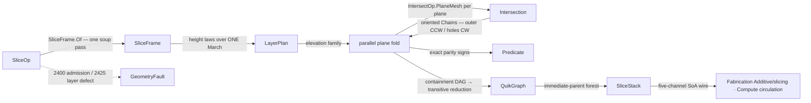

# [RASM_INTERSECTION_SLICE]

`Slicing.Apply(SliceOp, Op?)` owns the slice stack of `Rasm.Meshing` — one section fold composing `Intersection.Apply(IntersectOp.PlaneMesh(...))` over a parallel-plane family, never a crossing kernel of its own. Crossing existence, on-plane vertex handling, segment orientation, and chain connectivity are the intersect owner's exact machinery, composed one level up rather than re-founded as another `IntersectOp` case. `LayerPlan` generates the plane family rather than enumerating it: its cases are height-law data over one `March` integrator, so the next layer policy is one case carrying one height law, never a sibling planner body.

Per-layer contours arrive oriented from the composed fold — intersect stores each segment `from → to` along `cut.Normal × faceNormal`, so closed loops close outer-CCW and holes CW by construction — and a non-watertight section lands as typed open `Chain(Closed: false)` rows, or under `SlicePolicy.RequireWatertight` as the typed `GeometryFault.SectionFault` 2425. Contour nesting is an exact-parity containment fold over the same canonical coordinates every decoder reads, so the forest is a deterministic function of the wire it ships with; QuikGraph serves in-computation only per the bounded-lane law. `SliceStack`, the kernel-owned SoA forest wire, is the result the `Rasm.Fabrication` `Additive/slicing` and `Rasm.Compute` circulation decoders bind, `Chain` rows projecting from the channels on read.

## [01]-[INDEX]

- [01]-[SLICING]: the `Slicing.Apply` section fold — `LayerPlan` height-law generator over one `March`, the parallel per-plane `IntersectOp.PlaneMesh` fold, exact-parity nesting into the `SliceStack` SoA forest wire and its `Chain` projections.

## [02]-[SLICING]

- Owner: `SlicePolicy` the policy row registering `IValidityEvidence` — watertight gate, layer ceiling, slope-bin count, parallel floor, and the composed `IntersectPolicy` every per-plane fold threads; `SliceFrame` the per-run facts computed once from the soup — datum, nesting axis, elevation extent, and the binned steepest-slope and start-sorted overhang tables the height laws read; `LayerPlan` the `[Union]` height-law generator, each case one `Fin<Arr<double>>` `Elevations(SliceFrame, SlicePolicy)` fold lowering to a `Func<double,double>` height law over the one `March` body; `SliceOp` the request record — one modality, so the modality axis lives in the plan union, never a one-case request ceremony; `SliceStack` the frozen result carrier with `ContourAt`/`LayerAt`/`RootsOf`/`Depth` projections; `Slicing` the static surface.
- Cases: `LayerPlan` cases `Uniform(Height)` · `Adaptive(CuspHeight, MinHeight, MaxHeight)` · `BySlope(Arr<(SlopeCeiling, Height)> Bands)` · `SupportInterface(BaseHeight, InterfaceHeight, InterfaceLayers, OverhangCosine)` · `AtElevations(Arr<double> Elevations)` — height-law seed data the `Rasm.Fabrication` additive lane and the `Rasm.Compute` circulation bind, the family open to one more case.
- Entry: `public static Fin<SliceStack> Apply(SliceOp op, Op? key = null)` — the one entry. `Fin<T>` routes `GeometryFault.DegenerateInput(Kind, index, witness)` 2400 on an inadmissible request and `GeometryFault.SectionFault(layer, elevation, openChains)` 2425 on a layer defect — a non-watertight layer under `RequireWatertight` or a nesting contradiction, a containment cycle or multi-parent reduction. A composed per-plane failure surfaces unchanged; the fold never re-labels a sibling's typed fault. No `SliceUniform`/`SliceAdaptive`/`SliceAt` siblings — one polymorphic `Apply`, the plan case discriminating.
- Auto: `SliceFrame.Of` makes one soup pass — projecting vertices onto the datum normal for the extent, binning per-face `|n·d|` into the max-slope table, and collecting start-sorted overhang rows so the interface law filters past its own `OverhangCosine` at read, never a frame re-pass per plan. `Elevations` folds the plan's generated switch: `Adaptive` is the cusp-height bound `clamp(cusp / maxSlope, hMin, hMax)` — the geometric-error law, a height-`h` layer over cosine `|n·d|` leaving cusp `c = h·|n·d|`, so flat caps force fine layers and vertical walls admit coarse ones; `BySlope`'s band table IS the law; `SupportInterface` opens an interface band around overhangs steeper than its cosine floor; `AtElevations` validates finite, strictly ascending, in-extent. `March` is the one integrator, `MaxLayers`-gated. `ParallelHelper` partitions the plane family across pooled result slots the section fold rents — each plane's sweep independent, the fold the parallel axis and the intersect owner single-threaded per plane. Assembly drains the slots in layer order: the watertight gate fires, closed rings append their vertices without the duplicate terminal, and nesting runs per layer — bbox-pruned pairs over exact parity signs fold into the containment DAG, `ComputeTransitiveReduction` yields the immediate-parent forest (laminar ⇒ in-degree ≤ 1, a violation faults), and an in-degree-0 contour keeps `Parent = -1`, the root encoding. `Freeze` materializes the channels once as arrays, never live pool leases on the wire.
- Receipt: none on a dedicated rail — `SliceStack` is the typed result and the wire at once, its channels the evidence (layer, contour, nesting-forest, open-chain, and elevation census) and the `Chain` projections reads over them; the hash-eligible artifacts are the frozen channel arrays, never the pooled writers or slots.
- Packages: `Rasm.Meshing` (sibling — `Intersection.Apply`/`IntersectOp.PlaneMesh`/`IntersectResult.Chains`/`Chain`/`IntersectPolicy` composed never re-founded, `MeshEdit.Of` the one soup adapter, `MeshSpace`), `Rasm.Numerics` (`Predicate.Orient2D`/`Predicate.Compare` + `Sign`/`Axis` the exact nesting signs, `GeometryFault`), `Rasm.Domain` (`Op`, `Kind`, `ValidityClaim`/`IValidityEvidence`), `Rhino.Geometry` (`Point3d`/`Vector3d`/`Plane`/`Polyline`/`BoundingBox`), QuikGraph (`BidirectionalGraph`/`AddVertexRange`/`AddEdge`/`IsDirectedAcyclicGraph`/`ComputeTransitiveReduction`/`InDegree`/`InEdge` — in-computation only per the bounded-lane law), CommunityToolkit.HighPerformance (`MemoryOwner<T>` slots, `ArrayPoolBufferWriter<T>` channel emit, `ParallelHelper.For` + `IAction`), Thinktecture.Runtime.Extensions, LanguageExt.Core, BCL (`Array.BinarySearch`).
- Growth: a new layer policy is one `LayerPlan` case carrying its height law into the same `March`; a per-layer plane-slab broad-phase prune is the recorded growth row on `Spatial/index` (a plane-slab `SpatialQuery` case, never a slice-local acceleration structure); per-layer area/perimeter/centroid metrics are projection rows over the existing channels; one more wire channel is a further frozen column the decoders re-bind loudly; zero new entry surface.
- Boundary: the slice owner composes `Intersection.Apply` — a slice-local plane sweep, crossing kernel, or chain walker re-founds geometry that has one owner; contour orientation is inherited from intersect's material-oriented accumulation, so a slice-side re-orientation pass repeats a decision the fold already made. Open sections are typed rows or the typed 2425 fault under `RequireWatertight`, never silent closure or drop. Nesting verdicts are exact parity signs — the bbox prune alone is float, a winding-number point-in-polygon with epsilon ray offsets is the deleted form — and a hand-rolled O(C²) immediate-parent scan re-does what `ComputeTransitiveReduction` owns. Wire storage is the frozen channel schema; a `Seq<Seq<Chain>>` nested-collection result beside it is a dual carriage, typed rows minting from the channels instead. Channel arrays materialize at freeze and the pool dies at assembly end, so no pooled lease crosses the seam. `Apply` is total over the `Fin` rail — a thrown exception on a degenerate plan or non-watertight layer is unrepresentable.

```csharp
// --- [RUNTIME_PRELUDE] ----------------------------------------------------------------------
using System;
using System.Collections.Generic;
using System.Linq;
using CommunityToolkit.HighPerformance.Buffers;
using CommunityToolkit.HighPerformance.Helpers;
using LanguageExt;
using QuikGraph;
using QuikGraph.Algorithms;
using Rasm.Domain;
using Rasm.Numerics;
using Rhino.Geometry;
using Thinktecture;
using static LanguageExt.Prelude;

namespace Rasm.Meshing;

// --- [CONSTANTS] ------------------------------------------------------------------------------
// RequireWatertight: open layers fault (solids) or land as typed open rows (sections); Intersect is the composed per-plane policy.
public sealed record SlicePolicy(bool RequireWatertight, int MaxLayers, int FrameBins, int ParallelFloor, IntersectPolicy Intersect) : IValidityEvidence {
    public static readonly SlicePolicy Canonical = new(RequireWatertight: false, MaxLayers: 1 << 14, FrameBins: 256, ParallelFloor: 1, Intersect: IntersectPolicy.Canonical);

    public bool IsValid => ValidityClaim.All(
        ValidityClaim.Positive(value: MaxLayers),
        ValidityClaim.Positive(value: FrameBins),
        ValidityClaim.Positive(value: ParallelFloor)) && Intersect.IsValid;
}

// --- [MODELS] -----------------------------------------------------------------------------------
// Per-run facts from ONE soup pass: elevation extent, a binned steepest-slope table (|n·d| per bin),
// and start-sorted overhang rows the interface law filters against its OWN OverhangCosine; Vertical is the nesting projection plane.
public sealed record SliceFrame(Plane Datum, Axis Vertical, double Lo, double Hi, double[] MaxSlope, double[] OverhangStarts, double[] OverhangCosines) {
    public static Fin<SliceFrame> Of(MeshSpace mesh, Plane datum, SlicePolicy policy, Op? key = null) {
        using MeshEdit soup = MeshEdit.Of(mesh);
        Vector3d d = datum.Normal;
        d.Unitize();
        (double lo, double hi) = (double.PositiveInfinity, double.NegativeInfinity);
        for (int v = 0; v < soup.VertexCount; v++) {
            double e = (soup.Position(v) - datum.Origin) * d;
            (lo, hi) = (double.Min(lo, e), double.Max(hi, e));
        }
        double span = double.Max(hi - lo, double.Epsilon);
        double[] slope = new double[policy.FrameBins];
        List<(double Start, double Cos)> overhang = [];
        int Bin(double e) => int.Clamp((int)((e - lo) / span * policy.FrameBins), 0, policy.FrameBins - 1);
        for (int f = 0; f < soup.FaceCount; f++) {
            (int a, int b, int c) = soup.Face(f);
            (double ea, double eb, double ec) = ((soup.Position(a) - datum.Origin) * d, (soup.Position(b) - datum.Origin) * d, (soup.Position(c) - datum.Origin) * d);
            Vector3d n = Vector3d.CrossProduct(soup.Position(b) - soup.Position(a), soup.Position(c) - soup.Position(a));
            if (!n.Unitize()) { continue; }
            double cos = n * d;
            (double fl, double fh) = (Math.Min(ea, Math.Min(eb, ec)), Math.Max(ea, Math.Max(eb, ec)));
            for (int k = Bin(fl); k <= Bin(fh); k++) { slope[k] = double.Max(slope[k], Math.Abs(cos)); }
            if (cos < 0.0) { overhang.Add((fl, -cos)); }  // every downward face lands with its |n·d|; the plan's cosine filters at read
        }
        (double Start, double Cos)[] rows = [.. overhang.OrderBy(static row => row.Start)];
        return Axis.DominantOf(d, key).Map(vertical => new SliceFrame(datum, vertical, lo, hi, slope, [.. rows.Select(static row => row.Start)], [.. rows.Select(static row => row.Cos)]));
    }

    // Steepest |n·d| over the elevation window [z, z+ahead] — the adaptive cusp bound's denominator.
    public double SteepestSlope(double z, double ahead) {
        double span = double.Max(Hi - Lo, double.Epsilon);
        int a = int.Clamp((int)((z - Lo) / span * MaxSlope.Length), 0, MaxSlope.Length - 1);
        int b = int.Clamp((int)((z + ahead - Lo) / span * MaxSlope.Length), 0, MaxSlope.Length - 1);
        double peak = 0.0;
        for (int k = a; k <= b; k++) { peak = double.Max(peak, MaxSlope[k]); }
        return double.Max(peak, double.Epsilon);
    }

    // Interface band opens only around overhangs steeper than the plan's own cosine floor — the frame stores every downward row, the law selects.
    public bool NearInterface(double z, double band, double cosineFloor) {
        int at = Array.BinarySearch(OverhangStarts, z - band);
        for (int i = at >= 0 ? at : ~at; i < OverhangStarts.Length && OverhangStarts[i] <= z + band; i++) {
            if (OverhangCosines[i] >= cosineFloor) { return true; }
        }
        return false;
    }
}

// GENERATOR_LAW: one height law per case over ONE March integrator — a new policy is a case row, never a sibling planner; AtElevations is the Compute story-elevation ingress.
[Union(ConversionFromValue = ConversionOperatorsGeneration.None)]
public abstract partial record LayerPlan {
    private LayerPlan() { }

    public sealed record Uniform(double Height) : LayerPlan;
    public sealed record Adaptive(double CuspHeight, double MinHeight, double MaxHeight) : LayerPlan;
    public sealed record BySlope(Arr<(double SlopeCeiling, double Height)> Bands) : LayerPlan;
    public sealed record SupportInterface(double BaseHeight, double InterfaceHeight, int InterfaceLayers, double OverhangCosine) : LayerPlan;
    public sealed record AtElevations(Arr<double> Elevations) : LayerPlan;

    public Fin<Arr<double>> Elevations(SliceFrame frame, SlicePolicy policy) =>
        Admit().Bind(_ => Switch(
            state: (Frame: frame, Policy: policy),
            uniform:          static (s, u) => March(s.Frame, s.Policy, _ => u.Height),
            adaptive:         static (s, a) => March(s.Frame, s.Policy, z => Math.Clamp(a.CuspHeight / s.Frame.SteepestSlope(z, a.MaxHeight), a.MinHeight, a.MaxHeight)),
            bySlope:          static (s, b) => March(s.Frame, s.Policy, z => BandHeight(b.Bands, s.Frame.SteepestSlope(z, b.Bands.Fold(0.0, static (m, row) => double.Max(m, row.Height))))),
            supportInterface: static (s, i) => March(s.Frame, s.Policy, z => s.Frame.NearInterface(z, i.InterfaceLayers * i.InterfaceHeight, i.OverhangCosine) ? i.InterfaceHeight : i.BaseHeight),
            atElevations:     static (s, x) => x.Elevations.ForAll(e => e > s.Frame.Lo && e < s.Frame.Hi)
                && Enumerable.Range(1, int.Max(x.Elevations.Count - 1, 0)).All(i => x.Elevations[i - 1] < x.Elevations[i])
                    ? Fin.Succ(x.Elevations)
                    : Fin.Fail<Arr<double>>(new GeometryFault.DegenerateInput(Kind.Plane, 0, "explicit elevations out of extent or unsorted").ToError())));

    // Height-law validation happens ONCE at the plan, so March never sees a non-positive step.
    Fin<Unit> Admit() => Switch(
        uniform:          static u => Gate(u.Height > 0.0, "non-positive layer height"),
        adaptive:         static a => Gate(a.CuspHeight > 0.0 && a.MinHeight > 0.0 && a.MaxHeight >= a.MinHeight, "degenerate cusp bounds"),
        bySlope:          static b => Gate(b.Bands.Count > 0 && b.Bands.ForAll(static row => row.Height > 0.0 && row.SlopeCeiling is > 0.0 and <= 1.0), "degenerate slope bands"),
        supportInterface: static i => Gate(i.BaseHeight > 0.0 && i.InterfaceHeight > 0.0 && i.InterfaceLayers > 0 && i.OverhangCosine is > 0.0 and <= 1.0, "degenerate interface plan"),
        atElevations:     static x => Gate(x.Elevations.Count > 0 && x.Elevations.ForAll(static e => double.IsFinite(e)), "empty or non-finite elevation family"));

    static Fin<Unit> Gate(bool holds, string witness) =>
        holds ? Fin.Succ(unit) : Fin.Fail<Unit>(new GeometryFault.DegenerateInput(Kind.Plane, 0, witness).ToError());

    // ONE integrator: first plane one step above the low extreme, march inside the extent, MaxLayers-gated against a runaway law.
    static Fin<Arr<double>> March(SliceFrame frame, SlicePolicy policy, Func<double, double> height) {
        List<double> rows = [];
        for (double z = frame.Lo + height(frame.Lo); z < frame.Hi; z += height(z)) {
            if (rows.Count >= policy.MaxLayers) {
                return Fin.Fail<Arr<double>>(new GeometryFault.DegenerateInput(Kind.Plane, rows.Count, "layer plan exceeds MaxLayers").ToError());
            }
            rows.Add(z);
        }
        return Fin.Succ(new Arr<double>([.. rows]));
    }

    static double BandHeight(Arr<(double SlopeCeiling, double Height)> bands, double slope) {
        foreach ((double ceiling, double height) in bands) {
            if (slope <= ceiling) { return height; }
        }
        return bands[bands.Count - 1].Height;
    }
}

public sealed record SliceOp(MeshSpace Mesh, Plane Datum, LayerPlan Plan, SlicePolicy Policy);

// SoA forest wire, typed projections minting FROM the channels. CSR pointers: LayerPtr len L+1, ContourPtr
// over X/Y/Z (closed rings store no duplicate terminal vertex); Parent forest, -1 = root or open.
public sealed record SliceStack(
    double[] Elevations, int[] LayerPtr, int[] ContourPtr, double[] X, double[] Y, double[] Z,
    int[] Parent, int[] ChildPtr, int[] Children, int[] Open) {

    public int LayerCount => Elevations.Length;
    public int ContourCount => ContourPtr.Length - 1;
    public bool IsOpen(int contour) => Array.BinarySearch(Open, contour) >= 0;

    public Chain ContourAt(int contour) {
        bool closed = !IsOpen(contour);
        Polyline polyline = new();
        for (int v = ContourPtr[contour]; v < ContourPtr[contour + 1]; v++) { polyline.Add(new Point3d(X[v], Y[v], Z[v])); }
        if (closed && polyline.Count > 0) { polyline.Add(polyline[0]); }
        return new Chain(polyline, closed);
    }

    public Seq<Chain> LayerAt(int layer) =>
        toSeq(Enumerable.Range(LayerPtr[layer], LayerPtr[layer + 1] - LayerPtr[layer]).Select(ContourAt));

    public IEnumerable<int> RootsOf(int layer) {
        for (int c = LayerPtr[layer]; c < LayerPtr[layer + 1]; c++) {
            if (Parent[c] < 0 && !IsOpen(c)) { yield return c; }
        }
    }

    public int Depth(int contour) {
        int depth = 0;
        for (int at = Parent[contour]; at >= 0; at = Parent[at]) { depth++; }
        return depth;
    }
}

// --- [OPERATIONS] -------------------------------------------------------------------------------
public static class Slicing {
    public static Fin<SliceStack> Apply(SliceOp op, Op? key = null) =>
        Admit(op)
            .Bind(_ => SliceFrame.Of(op.Mesh, op.Datum, op.Policy, key))
            .Bind(frame => op.Plan.Elevations(frame, op.Policy).Bind(elevations => Fold(op, frame, elevations, key)));

    static Fin<Unit> Admit(SliceOp op) =>
        !op.Datum.IsValid ? Fin.Fail<Unit>(new GeometryFault.DegenerateInput(Kind.Plane, 0, "non-finite datum plane").ToError())
        : op.Mesh.Native.Faces.Count == 0 ? Fin.Fail<Unit>(new GeometryFault.DegenerateInput(Kind.Mesh, 0, "empty mesh").ToError())
        : !op.Policy.IsValid ? Fin.Fail<Unit>(new GeometryFault.DegenerateInput(Kind.Mesh, 0, "invalid slice policy").ToError())
        : Fin.Succ(unit);

    // Each plane's PlaneMesh sweep is independent — the struct action writes its own pooled slot; assembly drains in layer order.
    readonly struct SectionAction(MeshSpace mesh, Plane datum, ReadOnlyMemory<double> elevations, IntersectPolicy policy, Memory<Fin<IntersectResult>> slots, Op? key) : IAction {
        public void Invoke(int i) {
            double e = elevations.Span[i];
            Plane cut = new(datum.Origin + (e * datum.Normal), datum.XAxis, datum.YAxis);
            slots.Span[i] = Intersection.Apply(new IntersectOp.PlaneMesh(cut, mesh, policy), key);
        }
    }

    static Fin<SliceStack> Fold(SliceOp op, SliceFrame frame, Arr<double> elevations, Op? key) {
        int layers = elevations.Count;
        using MemoryOwner<Fin<IntersectResult>> slots = MemoryOwner<Fin<IntersectResult>>.Allocate(layers);
        double[] family = [.. elevations];
        ParallelHelper.For(0, layers, new SectionAction(op.Mesh, op.Datum, family, op.Policy.Intersect, slots.Memory, key), op.Policy.ParallelFloor);

        using ArrayPoolBufferWriter<double> x = new();
        using ArrayPoolBufferWriter<double> y = new();
        using ArrayPoolBufferWriter<double> z = new();
        (List<int> layerPtr, List<int> contourPtr, List<int> parent, List<int> open) = ([0], [0], [], []);

        // Sequential assembly over the drained slots — the rail re-enters per layer, the channels materialize once at the tail.
        Fin<Unit> Layer(int k) =>
            slots.Span[k]
                .Bind(static result => result is IntersectResult.Chains chains
                    ? Fin.Succ(chains.Walked)
                    : Fin.Fail<Seq<Chain>>(new GeometryFault.IntersectionFault(PrimitiveKind.Plane, PrimitiveKind.Mesh).ToError()))
                .Bind(walked => {
                    Seq<Chain> closed = walked.Filter(static chain => chain.Closed);
                    Seq<Chain> openRows = walked.Filter(static chain => !chain.Closed);
                    if (op.Policy.RequireWatertight && !openRows.IsEmpty) {
                        return Fin.Fail<Unit>(new GeometryFault.SectionFault(k, family[k], openRows.Count).ToError());
                    }
                    int baseOrdinal = contourPtr.Count - 1;
                    foreach (Chain chain in closed.Concat(openRows)) {
                        int extent = chain.Closed ? chain.Points.Count - 1 : chain.Points.Count;  // closed rings drop the duplicate terminal
                        for (int v = 0; v < extent; v++) {
                            x.GetSpan(1)[0] = chain.Points[v].X; x.Advance(1);
                            y.GetSpan(1)[0] = chain.Points[v].Y; y.Advance(1);
                            z.GetSpan(1)[0] = chain.Points[v].Z; z.Advance(1);
                        }
                        contourPtr.Add(contourPtr[^1] + extent);
                        if (!chain.Closed) { open.Add(parent.Count); }  // ordinals are append order: closed block first, open rows after
                        parent.Add(-1);
                    }
                    return Nest(frame, closed, baseOrdinal, parent, k, family[k], openRows.Count)
                        .Map(_ => { layerPtr.Add(contourPtr.Count - 1); return unit; });
                });

        return toSeq(Enumerable.Range(0, layers))
            .Fold(Fin.Succ(unit), (state, k) => state.Bind(_ => Layer(k)))
            .Map(_ => {
                int contours = contourPtr.Count - 1;
                int[] childPtr = new int[contours + 1];
                foreach (int p in parent) { if (p >= 0) { childPtr[p + 1]++; } }
                for (int c = 0; c < contours; c++) { childPtr[c + 1] += childPtr[c]; }
                int[] children = new int[parent.Count(static p => p >= 0)];
                int[] cursor = (int[])childPtr.Clone();
                for (int c = 0; c < contours; c++) { if (parent[c] >= 0) { children[cursor[parent[c]]++] = c; } }
                open.Sort();
                return new SliceStack(
                    family, [.. layerPtr], [.. contourPtr],
                    x.WrittenSpan.ToArray(), y.WrittenSpan.ToArray(), z.WrittenSpan.ToArray(),
                    [.. parent], childPtr, children, [.. open]);
            });
    }

    // --- [NESTING]
    // Even-odd containment over exact signs: the inner contour's lexicographic-extreme vertex casts a
    // +U ray, an ancestor edge counting iff it strictly straddles the ray line (Compare on V, half-open
    // at Zero) and the Orient2D side sign matches the edge's V direction. Bounding boxes prune, signs decide.
    static Fin<Unit> Nest(SliceFrame frame, Seq<Chain> closed, int baseOrdinal, List<int> parent, int layer, double elevation, int openCount) {
        int n = closed.Count;
        if (n <= 1) { return Fin.Succ(unit); }
        Axis v = Axis.Get(frame.Vertical.V);
        (double LoU, double HiU, double LoV, double HiV)[] boxes = new (double LoU, double HiU, double LoV, double HiV)[n];
        Point3d[] anchors = new Point3d[n];
        for (int i = 0; i < n; i++) {
            (boxes[i], anchors[i]) = Extremes(closed[i].Points, frame.Vertical);
        }
        BidirectionalGraph<int, SEdge<int>> graph = new(allowParallelEdges: false);
        graph.AddVertexRange(Enumerable.Range(0, n));
        for (int i = 0; i < n; i++) {
            for (int j = 0; j < n; j++) {
                if (i == j || boxes[i].LoU < boxes[j].LoU || boxes[i].HiU > boxes[j].HiU || boxes[i].LoV < boxes[j].LoV || boxes[i].HiV > boxes[j].HiV) { continue; }
                switch (Parity(anchors[i], closed[j].Points, frame.Vertical, v)) {
                    case null: return Fin.Fail<Unit>(new GeometryFault.SectionFault(layer, elevation, openCount).ToError());
                    case true: graph.AddEdge(new SEdge<int>(j, i)); break;  // outer -> inner
                }
            }
        }
        if (!graph.IsDirectedAcyclicGraph<int, SEdge<int>>()) {
            return Fin.Fail<Unit>(new GeometryFault.SectionFault(layer, elevation, openCount).ToError());
        }
        BidirectionalGraph<int, SEdge<int>> forest = graph.ComputeTransitiveReduction();
        foreach (int inner in forest.Vertices) {
            if (forest.InDegree(inner) > 1) {
                return Fin.Fail<Unit>(new GeometryFault.SectionFault(layer, elevation, openCount).ToError());
            }
            if (forest.InDegree(inner) == 1) { parent[baseOrdinal + inner] = baseOrdinal + forest.InEdge(inner, 0).Source; }
        }
        return Fin.Succ(unit);
    }

    static ((double, double, double, double) Box, Point3d Anchor) Extremes(Polyline ring, Axis vertical) {
        (double loU, double hiU, double loV, double hiV) = (double.PositiveInfinity, double.NegativeInfinity, double.PositiveInfinity, double.NegativeInfinity);
        Point3d anchor = ring[0];
        (double aU, double aV) = (Axis.Coord(anchor, vertical.U), Axis.Coord(anchor, vertical.V));
        for (int i = 0; i < ring.Count - 1; i++) {
            (double pu, double pv) = (Axis.Coord(ring[i], vertical.U), Axis.Coord(ring[i], vertical.V));
            (loU, hiU, loV, hiV) = (double.Min(loU, pu), double.Max(hiU, pu), double.Min(loV, pv), double.Max(hiV, pv));
            if (pu > aU || (pu == aU && pv > aV)) { (anchor, aU, aV) = (ring[i], pu, pv); }
        }
        return ((loU, hiU, loV, hiV), anchor);
    }

    // true = inside (odd), false = outside (even), null = anchor exactly ON the candidate boundary — overlapping contours, the nesting-contradiction witness.
    static bool? Parity(Point3d anchor, Polyline ring, Axis plane, Axis vAxis) {
        bool inside = false;
        for (int i = 0; i < ring.Count - 1; i++) {
            (Point3d s, Point3d t) = (ring[i], ring[i + 1]);
            Sign sv = Predicate.Compare(new Implicit(s), new Implicit(anchor), vAxis);
            Sign tv = Predicate.Compare(new Implicit(t), new Implicit(anchor), vAxis);
            bool sBelow = sv == Sign.Negative;
            bool tBelow = tv == Sign.Negative;
            if (sBelow == tBelow) { continue; }  // half-open: a Zero endpoint counts with the non-negative side
            Sign side = Predicate.Orient2D(new Implicit(s), new Implicit(t), new Implicit(anchor), plane);
            if (side == Sign.Zero) { return null; }
            // upward edge (s below, t not): anchor strictly left of s->t means the +U ray crosses
            if (sBelow ? side == Sign.Positive : side == Sign.Negative) { inside = !inside; }
        }
        return inside;
    }
}
```



## [03]-[DENSITY_BAR]

One owner per axis; capability is a case, row, or fold arm, never a sibling surface. Each `[RAIL]` cell names the one return rail its owner exposes; the per-axis kind rides the indexed notes below.

| [INDEX] | [AXIS_CONCERN] | [OWNER]       | [RAIL]                                | [CASES] |
| :-----: | :------------- | :------------ | :------------------------------------ | :-----: |
|  [01]   | Slice stack    | `SliceOp`     | `Slicing.Apply → Fin<SliceStack>`     |    —    |
|  [02]   | Layer policies | `LayerPlan`   | `Elevations → Fin<Arr<double>>`       |    5    |
|  [03]   | Run facts      | `SliceFrame`  | value (read by the height laws)       |    —    |
|  [04]   | Slice policy   | `SlicePolicy` | value (`IValidityEvidence`)           |    —    |
|  [05]   | Result + wire  | `SliceStack`  | carrier (channels frozen at assembly) |    —    |

- [01]-[SLICE_STACK]: request record (one modality; the plan union is the modality axis) folded by ONE `Apply`.
- [02]-[LAYER_POLICIES]: `[Union]` height-law seed rows over ONE `March` integrator (`[GENERATOR_LAW]`).
- [03]-[RUN_FACTS]: derived record — extent, binned steepest slope, overhang start+cosine rows, nesting axis (one soup pass).
- [04]-[SLICE_POLICY]: policy row — watertight gate · layer ceiling · bins · parallel floor · composed `IntersectPolicy`.
- [05]-[RESULT_WIRE]: frozen SoA forest wire + `ContourAt`/`LayerAt`/`RootsOf`/`Depth` typed projections.

## [04]-[RESEARCH]

<!-- source-only: research row template:
[TOKEN]-[OPEN|BLOCKED]: <exact question>; <verification route>.
[SPLIT_MEMBER]-[OPEN]: does `shape-core` expose `split_all`; verify against the member rail.
-->

(none)
