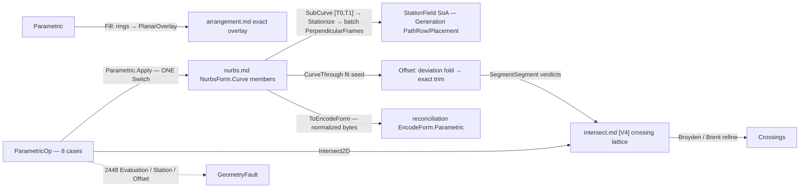

# [RASM_PARAMETRIC_CURVE]

The host-neutral curve op rail of `Rasm.Parametric` — ONE static `Parametric` surface folding the `ParametricOp` `[Union]` (`Evaluate` · `Measure` · `Divide` · `Stations` · `Split` · `Reconstruct` · `Offset` · `Intersect2D`) over the vendored `NurbsForm.Curve` carrier through `Fin<ParametricResult> Parametric.Apply(ParametricOp, Op? key = null)`. The engine members — De Boor evaluation, the Bezier-decomposed Gauss-Legendre arc-length table, `ParameterAtLength`, `PerpendicularFrames` RMF, `SubCurve`/`SplitAt`/`Refine`, the Piegl-Tiller fits — live on `nurbs.md`'s carriers; this page owns the OP ALGEBRA over them: the `Stations` case is the `(station, frame)` SoA producer the Generation SpineRef `[T0,T1]` window consumes (`PathRow`/`Placement` seam), `Offset` is the promoted first-class case running the fit SEED + deviation-refinement loop + self-intersection trim through the `[V4]` crossing lattice, `Reconstruct` is the curve REBUILD (sample-and-refit with a deviation witness — raw-point ingress is `Nurbs.Of`'s, never re-minted here), and `Intersect2D` is the planar crossing rail whose candidates are exact `Intersection.Apply` segment verdicts and whose coordinates are Newton-refined parametric roots. The `Fill` projection delegates closed-loop region emission to `Arrangement.Apply(PlanarOverlay)` — the trim-fill law kept, never re-filled here.

Every reachable failure routes `GeometryFault.ParametricFault(stage, carrier, witness)` 2448 — `Evaluation` for domain and projection refusals, `Station` for division and inversion refusals, `Offset` for an unconverged deviation loop — and no exception crosses the public surface. The rail is `double`-domain geometry: a result feeding a degeneracy-sensitive verdict (a near-tangent crossing classification, a grazing section) escalates to the `Numerics/predicates` exact ladder — evaluation is the geometry, never the adjudication. Reciprocal boundaries are runtime splits, never capability splits: `projections.md` owns the SAME parameter-addressed evaluation for the Rhino runtime, `locate.md` the SAME division/closest-point/arc-length location algebra at Rhino-analysis altitude (never a second location algebra — the two meet at the wire), and `relations.md` owns the HOST-DEFERRED intersection TRIPLE (surface-surface, surface-plane, curve-surface) — this rail's `Intersect2D` stops at planar curve crossings and curve sections by disposition. Every emitted `NurbsForm.Curve` carries `ToEncodeForm()` — the reconciliation `EncodeForm.Parametric` identity projection — so offset, refit, and split results content-key through the ONE chain; this owner computes no hash and mints no second identity.

## [01]-[INDEX]

- [01]-[PARAMETRIC]: `DivideRule`/`MeasureProbe`/`IntersectTarget` payload vocabularies; `StationPlan` + `RefinePolicy` policy rows; `ParametricOp` the eight-case request `[Union]` folded by ONE `Apply`; `ParametricResult` the typed result `[Union]` with the `StationField` SoA wire and the `RefineReceipt` refinement evidence; the `Fill` region delegation.

## [02]-[PARAMETRIC]

- Owner: `DivideRule` `[Union]` the division vocabulary (`ByCount` · `ByLength` · `ByEqualLength` · `ByChord` — count, capped-uneven, capped-equalized, and constant-chord subdivision as CASES, never a `bool equalSegmentLengths` knob); `MeasureProbe` `[Union]` the measure address (`Whole` stateless · `AtParameter` · `NearPoint`); `IntersectTarget` `[Union]` the planar crossing target (`Curve2d` carrying the other curve + the `Axis` projection plane · `SectionPlane` carrying the cutting `Plane`); `StationPlan` the station policy row (`T0`/`T1` the normalized SpineRef window, `Rule` the spacing `DivideRule`, `TableFloor` the station count at which the per-station Brent inversion yields to ONE monotone spline inversion table) registering `IValidityEvidence`; `RefinePolicy` the shared deviation-refinement row (`DeviationTolerance` · `MaxRounds` · `SeedSamples`) `surface.md`'s `NormalOffset` composes for the SAME loop shape; `RefineReceipt` the refinement evidence (`Target` · `Achieved` · `Rounds` · `Samples`); `ParametricOp` the request `[Union]`; `ParametricResult` the result `[Union]`; `Parametric` the static entry + `Fill` projection.
- Cases: `DivideRule` 4; `MeasureProbe` 3; `IntersectTarget` 2; `ParametricOp` cases `Evaluate` · `Measure` · `Divide` · `Stations` · `Split` · `Reconstruct` · `Offset` · `Intersect2D` (8); `ParametricResult` cases `Sample` · `Measured` · `Division` · `StationField` · `Pieces` · `Refit` · `Offsets` · `Crossings` (8 — one typed carrier per request family, the `StationField` columns SoA so the Generation seam binds parallel arrays, never a row-object walk).
- Entry: `public static Fin<ParametricResult> Apply(ParametricOp op, Op? key = null)` — the ONE entry discriminating on the op case through the generated total `Switch`; no `EvaluatePoint`/`DivideByCount`/`OffsetCurve` sibling family. `public static Fin<ArrangementResult> Fill(Arr<NurbsForm.Curve> loops, Axis plane, ArrangementPolicy? policy = null, Op? key = null)` — the region projection: every loop proves `IsClosed`, samples at control-density chord resolution, and routes `Arrangement.Apply(new ArrangementOp.PlanarOverlay(rings, [], BooleanOp.Union, plane, policy))` — the exact nonzero-winding region resolve with holes carried by ring orientation; emission stays the arrangement's law.
- Auto: `Evaluate` reads `RationalDerivatives(t, order)` + `TangentAt`/`CurvatureAt` + a batch-of-one `PerpendicularFrames([t])` into `Sample`; `Measure` folds the probe — `Whole` the cached-table `Length()` + closure, `AtParameter` the `LengthAt(t)` prefix, `NearPoint` the G7-parameterized `ClosestParameter` Newton projection — into one fully-populated `Measured` (every field meaningful under every probe); `Divide` and `Stations` share ONE `Stationize` kernel: the rule derives arc targets off the cumulative arc-length table (`ByCount` the `i·L/n` lattice, `ByLength` the capped march with an honest uneven tail, `ByEqualLength` the `ceil(L/max)` equalized lattice, `ByChord` the forward `ParameterAtChordLength` march — the engine's own chord inversion, never a local Brent re-mint), and arc→parameter inversion is per-station `ParameterAtLength` below `TableFloor` or ONE `Interpolate.CubicSplineMonotone` table above it — `(LengthAt(tⱼ), tⱼ)` samples fit once, monotone-preserving so stations never reorder, O(1) per station after O(m) setup; `Stations` restricts to the `[T0,T1]` window through `SubCurve` FIRST (the window owns its own normalized domain and arc table), sweeps ONE `PerpendicularFrames(parameters)` batch RMF over the station parameters (the Wang-2008 double reflection with the #373 closure row — never a per-station frame call), remaps parameters affinely to the parent domain, and emits the `StationField` SoA columns (window-relative arcs · parent parameters · points · frames) with the frame-orthonormality defect witness; `Split` folds `SplitAt` over the sorted parameter set into `Pieces`; `Reconstruct` samples the EXISTING curve at `Samples` arc-uniform stations, refits through `Nurbs.Of(NurbsWire.CurveThrough(samples, fit))`, and probes inter-station deviation into the `Refit` witness — the Rhino-Rebuild analog, distinct from `Nurbs.Of` raw ingress; `Offset` runs the G8 loop — station the curve at `SeedSamples`, displace each point `distance` along the in-plane normal `frame.ZAxis × T(t)`, fit the SEED through `Nurbs.Of(CurveThrough)`, probe inter-station deviation against the exact offset locus, densify breaching intervals and refit up to `MaxRounds` (a bounded fold, never an unbounded loop), then TRIM: sample the offset at chord resolution, sweep neighbor-excluded segment pairs through `Intersection.Apply(IntersectOp.SegmentSegment(a, b, plane, policy))` — the `[V4]` exact verdict per candidate — split at crossing parameters, and cull pieces whose `ClosestParameter` foot against the base curve lands under `|distance|` (the invalid-loop cull); `Intersect2D` dispatches the target — `SectionPlane` brackets the signed span-sampled `(C(t)−P₀)·n̂` and runs `Brent.TryFindRoot` per sign change (the no-throw `bool` mapping straight to the rail), `Curve2d` chord-samples both Bezier span sets, sweeps AABB candidates through exact `SegmentSegment` verdicts, and Newton-refines each hit's `(s, t)` seed through `Try`-trapped `Broyden.FindRoot` on the plane-projected `Cₐ(s) − C_b(t)` system — exact signs decide EXISTENCE, Newton refines COORDINATES, and a near-tangent classification escalates the materialized point to the predicate ladder at the consumer.
- Receipt: `RefineReceipt` on `Refit`/`Offsets` — target versus achieved deviation, rounds spent, terminal sample count — plus the offset trim census (`TrimmedCrossings` · `KeptSegments`) on the `Offsets` case itself; `StationField.FrameDefect` carries the max `|X̂·Ŷ|` orthonormality residual as the wire's own validity witness (the SoA reduction is the benchmark-gated `TensorPrimitives` candidacy — the claim rides a measured receipt, never an assumption). Result carriers ARE `NurbsForm` values, so identity is their `ToEncodeForm()` projection into `ReconcileOp.Encode` — no receipt duplicates it.
- Packages: `Rasm.Parametric` `nurbs.md` (the vendored engine — `RationalDerivatives`/`TangentAt`/`CurvatureAt`/`Length`/`LengthAt`/`ParameterAtLength`/`ParameterAtChordLength`/`ClosestParameter`/`PerpendicularFrames`/`SplitAt`/`SubCurve`/`IsClosed` carrier members, `Nurbs.Of` + `NurbsWire.CurveThrough` + `FitPolicy` the fit seed, `NurbsPolicy` the G7 knobs), MathNet.Numerics (`Interpolate.CubicSplineMonotone` the batch inversion table; `Brent.TryFindRoot` the section roots; `Broyden.FindRoot` the 2-var crossing refinement, `Try`-trapped), `Rasm.Meshing` (`Intersection.Apply` + `IntersectOp.SegmentSegment` + `IntersectPolicy` — the exact candidate lattice), `Rasm.Meshing` (`Arrangement.Apply` + `ArrangementOp.PlanarOverlay` + `BooleanOp` + `ArrangementPolicy` — the `Fill` delegation), `Rasm.Numerics` (`Predicate`/`Axis` — the exact escalation seam), `Rasm.Numerics` (`GeometryFault.ParametricFault` + `ParametricStage`), `Rasm.Domain` (`Op`, `ValidityClaim`/`IValidityEvidence`), `Rhino.Geometry` (`Point3d`/`Vector3d`/`Plane`/`Line`/`Polyline` carriers), Thinktecture.Runtime.Extensions, LanguageExt.Core (`Fin`/`Try`/`Arr`/`Seq`/`Option`), System.Numerics.Tensors (SoA wire reductions, benchmark-gated).
- Growth: a new op (a `Blend` between two curves, a `Project`-to-plane) is one `ParametricOp` case over the SAME carrier members; a new division scheme is one `DivideRule` case read by the shared `Stationize` kernel; a new measure address is one `MeasureProbe` case; a new crossing target (the host-deferred triple arriving in-kernel) is one `IntersectTarget` case; zero new entry surfaces.
- Boundary: this page is OP altitude and `nurbs.md` is ENGINE altitude — an op union on the engine page or a basis/De Boor/insertion re-derivation here is the altitude violation, and the arc-length/RMF/projection arithmetic is ALWAYS the vendored instance surface, never a re-minted textbook kernel; the runtime reciprocals are one anchor each — `projections.md` (Rhino parameter-addressed evaluation), `locate.md` (Rhino location algebra; division/closest/arc-length live in BOTH runtimes by decision, meeting at the wire), `relations.md` (the host-deferred SSI/surface-plane/curve-surface TRIPLE — probe-widened, never re-attempted here) — and a second location algebra or a kernel SSI beside them is the named double-owner defect; `Intersect2D` existence is EXACT (`SegmentSegment` signs) and coordinates are refined `double` — feeding an unrefined chord crossing or an unescalated near-tangent verdict downstream is the named precision defect; `Fill` samples and DELEGATES — a local winding fill, a re-derived overlay, or a second constrained substrate is the deleted form; `Offset` trim candidates are neighbor-excluded segment pairs — trusting the raw fit without the deviation probe, or trimming by float chord heuristics instead of exact verdicts, is the named G8 regression; the `StationField` wire is SoA columns the Generation seam binds directly — a row-object list re-pack is the rejected double layout; every case is total over the `Fin` rail and a thrown exception is forbidden — refusals route 2448 with the stage row naming the failing concern.

```csharp signature
// --- [RUNTIME_PRELUDE] ----------------------------------------------------------------------
using System;
using System.Linq;
using LanguageExt;
using MathNet.Numerics;
using MathNet.Numerics.RootFinding;
using Rasm.Domain;
using Rasm.Meshing;
using Rasm.Numerics;
using Rhino.Geometry;
using Thinktecture;
using static LanguageExt.Prelude;

namespace Rasm.Parametric;

// --- [TYPES] ------------------------------------------------------------------------------------
// Division vocabulary: capped-uneven vs capped-equalized are CASES — the packaged-era
// equalSegmentLengths bool is dead. ByChord marches constant world-space chords.
[Union(ConversionFromValue = ConversionOperatorsGeneration.None)]
public abstract partial record DivideRule {
    private DivideRule() { }

    public sealed record ByCount(int Count) : DivideRule;
    public sealed record ByLength(double MaxSegment) : DivideRule;
    public sealed record ByEqualLength(double MaxSegment) : DivideRule;
    public sealed record ByChord(double Chord) : DivideRule;
}

[Union(ConversionFromValue = ConversionOperatorsGeneration.None)]
public abstract partial record MeasureProbe {
    private MeasureProbe() { }

    public sealed record Whole : MeasureProbe;
    public sealed record AtParameter(double T) : MeasureProbe;
    public sealed record NearPoint(Point3d P) : MeasureProbe;
}

// Planar crossing targets; the surface-surface / surface-plane / curve-surface TRIPLE is
// host-deferred to relations.md by disposition — never a case here until the probe widens.
[Union(ConversionFromValue = ConversionOperatorsGeneration.None)]
public abstract partial record IntersectTarget {
    private IntersectTarget() { }

    public sealed record Curve2d(NurbsForm.Curve Other, Axis Plane) : IntersectTarget;
    public sealed record SectionPlane(Plane Cut) : IntersectTarget;
}

// --- [CONSTANTS] --------------------------------------------------------------------------------
// The station policy row: [T0,T1] is the SpineRef window in the NORMALIZED parent domain;
// TableFloor is the station count where per-station Brent inversion yields to ONE monotone table.
public sealed record StationPlan(double T0, double T1, DivideRule Rule, int TableFloor = 16) : IValidityEvidence {
    public const int TableCeiling = 256;

    public bool IsValid => ValidityClaim.All(
        ValidityClaim.UnitInterval(value: T0), ValidityClaim.UnitInterval(value: T1),
        ValidityClaim.Of(holds: T0 < T1),
        ValidityClaim.CountAtLeast(count: TableFloor, floor: 2));
}

// The shared deviation-refinement row — surface.md NormalOffset composes the SAME loop shape.
public sealed record RefinePolicy(double DeviationTolerance, int MaxRounds, int SeedSamples) : IValidityEvidence {
    public static readonly RefinePolicy Canonical = new(DeviationTolerance: 1e-6, MaxRounds: 6, SeedSamples: 24);

    public bool IsValid => ValidityClaim.All(
        ValidityClaim.Positive(value: DeviationTolerance),
        ValidityClaim.Positive(value: MaxRounds),
        ValidityClaim.CountAtLeast(count: SeedSamples, floor: 4));
}

// --- [MODELS] -----------------------------------------------------------------------------------
public sealed record RefineReceipt(double Target, double Achieved, int Rounds, int Samples);

// --- [OPERATIONS] ---------------------------------------------------------------------------
[Union(ConversionFromValue = ConversionOperatorsGeneration.None)]
public abstract partial record ParametricOp {
    private ParametricOp() { }

    public sealed record Evaluate(NurbsForm.Curve Curve, double T, int Order) : ParametricOp;
    public sealed record Measure(NurbsForm.Curve Curve, MeasureProbe Probe) : ParametricOp;
    public sealed record Divide(NurbsForm.Curve Curve, DivideRule Rule) : ParametricOp;
    public sealed record Stations(NurbsForm.Curve Curve, StationPlan Plan) : ParametricOp;
    public sealed record Split(NurbsForm.Curve Curve, Arr<double> At) : ParametricOp;
    public sealed record Reconstruct(NurbsForm.Curve Curve, FitPolicy Fit, int Samples) : ParametricOp;
    public sealed record Offset(NurbsForm.Curve Curve, Plane Frame, double Distance, RefinePolicy Refine) : ParametricOp;
    public sealed record Intersect2D(NurbsForm.Curve Curve, IntersectTarget Target) : ParametricOp;
}

[Union(ConversionFromValue = ConversionOperatorsGeneration.None)]
public abstract partial record ParametricResult {
    private ParametricResult() { }

    public sealed record Sample(Point3d Point, Vector3d Tangent, Arr<Vector3d> Derivatives, Plane Frame, Vector3d Curvature) : ParametricResult;
    public sealed record Measured(double Length, double Parameter, Point3d Point, Vector3d Curvature, bool Closed) : ParametricResult;
    public sealed record Division(Arr<double> Parameters, Arr<Point3d> Points) : ParametricResult;

    // The (station, frame) SoA wire: window-relative arcs, PARENT-domain parameters, RMF frames.
    // FrameDefect = max |X̂·Ŷ| over the batch — the wire's own orthonormality witness.
    public sealed record StationField(Arr<double> Arcs, Arr<double> Parameters, Arr<Point3d> Points, Arr<Plane> Frames, double FrameDefect) : ParametricResult;

    public sealed record Pieces(Arr<NurbsForm.Curve> Curves) : ParametricResult;
    public sealed record Refit(NurbsForm.Curve Curve, RefineReceipt Receipt) : ParametricResult;
    public sealed record Offsets(Arr<NurbsForm.Curve> Curves, RefineReceipt Receipt, int TrimmedCrossings, int KeptSegments) : ParametricResult;
    public sealed record Crossings(Arr<(double TA, double TB, Point3d At)> Hits) : ParametricResult;
}

public static class Parametric {
    public static Fin<ParametricResult> Apply(ParametricOp op, Op? key = null) =>
        op.Switch(
            state: key,
            evaluate:    static (k, e) => EvaluateOf(e, k),
            measure:     static (k, m) => MeasureOf(m, k),
            divide:      static (k, d) => Stationize(d.Curve, d.Rule, StationPlan.TableCeiling).Map(static rows =>
                (ParametricResult)new ParametricResult.Division(rows.Parameters, new Arr<Point3d>([.. rows.Parameters.Select(rows.Curve.PointAt)]))),
            stations:    static (k, s) => StationsOf(s, k),
            split:       static (k, s) => SplitOf(s, k),
            reconstruct: static (k, r) => ReconstructOf(r, k),
            offset:      static (k, o) => OffsetOf(o, k),
            intersect2D: static (k, i) => i.Target.Switch(
                curve2d:      c => CrossingsOf(i.Curve, c, k),
                sectionPlane: p => SectionOf(i.Curve, p.Cut, k)));

    // Region delegation: closed loops sample at control-density chords and route the exact
    // nonzero-winding overlay; holes ride ring orientation. Emission stays the arrangement's law.
    public static Fin<ArrangementResult> Fill(Arr<NurbsForm.Curve> loops, Axis plane, ArrangementPolicy? policy = null, Op? key = null) =>
        loops.Exists(static loop => !loop.IsClosed)
            ? Fault<ArrangementResult>(ParametricStage.Evaluation, nameof(Fill), "open loop in a region fill")
            : loops.TraverseM(loop => Stationize(loop, new DivideRule.ByCount(int.Max(16, 4 * loop.ControlCount)), StationPlan.TableCeiling)
                    .Map(static rows => new Polyline(rows.Parameters.Select(rows.Curve.PointAt))))
                .As()
                .Bind(rings => Arrangement.Apply(
                    new ArrangementOp.PlanarOverlay(toSeq(rings), Seq<Polyline>(), BooleanOp.Union, plane, policy ?? ArrangementPolicy.Canonical), key));

    // --- [EVALUATE_MEASURE]
    static Fin<ParametricResult> EvaluateOf(ParametricOp.Evaluate op, Op? key) =>
        op.T is < 0.0 or > 1.0
            ? Fault<ParametricResult>(ParametricStage.Evaluation, nameof(NurbsForm.Curve), $"parameter {op.T} outside the normalized domain")
            : op.Curve.PerpendicularFrames([op.T]).Map(frames => {
                (Point3d point, Vector3d[] ders) = op.Curve.RationalDerivatives(op.T, int.Max(1, op.Order));
                return (ParametricResult)new ParametricResult.Sample(
                    point, op.Curve.TangentAt(op.T), new Arr<Vector3d>(ders), frames[0], op.Curve.CurvatureAt(op.T));
            });

    static Fin<ParametricResult> MeasureOf(ParametricOp.Measure op, Op? key) =>
        op.Probe.Switch(
            whole:       _ => Fin.Succ(1.0),
            atParameter: static a => Fin.Succ(a.T),
            nearPoint:   n => op.Curve.ClosestParameter(n.P))
        .Bind(t => t is < 0.0 or > 1.0
            ? Fault<ParametricResult>(ParametricStage.Evaluation, nameof(NurbsForm.Curve), $"measure parameter {t} outside the normalized domain")
            : Fin.Succ<ParametricResult>(new ParametricResult.Measured(
                op.Probe is MeasureProbe.Whole ? op.Curve.Length() : op.Curve.LengthAt(t),
                t, op.Curve.PointAt(t), op.Curve.CurvatureAt(t), op.Curve.IsClosed)));

    // --- [STATION_KERNEL]
    // ONE arc→parameter kernel serving Divide and Stations. Below the floor each arc inverts through
    // ParameterAtLength (Brent on the cumulative Bezier table); at or above it ONE monotone cubic
    // table (Interpolate.CubicSplineMonotone over (LengthAt(tⱼ), tⱼ) samples) answers every station —
    // monotone-preserving, so the station order can never invert.
    internal readonly record struct StationRows(NurbsForm.Curve Curve, Arr<double> Arcs, Arr<double> Parameters);

    internal static Fin<StationRows> Stationize(NurbsForm.Curve curve, DivideRule rule, int tableFloor) =>
        ArcTargets(curve, rule).Bind(arcs => arcs.Count < tableFloor
            ? arcs.TraverseM(arc => curve.ParameterAtLength(arc)).As()
                .Map(ts => new StationRows(curve, arcs, new Arr<double>([.. ts])))
            : Fin.Succ(InvertByTable(curve, arcs)));

    static Fin<Arr<double>> ArcTargets(NurbsForm.Curve curve, DivideRule rule);          // rule lattice: i·L/n · capped march + tail · equalized · ParameterAtChordLength march; a degenerate rule (count < 1, non-positive length/chord) or a zero-length curve routes the Station fault — targets are never empty
    static StationRows InvertByTable(NurbsForm.Curve curve, Arr<double> arcs);           // (LengthAt(tⱼ), tⱼ) samples → CubicSplineMonotone → t(s) per arc

    static Fin<ParametricResult> StationsOf(ParametricOp.Stations op, Op? key) =>
        !op.Plan.IsValid
            ? Fault<ParametricResult>(ParametricStage.Station, nameof(StationPlan), "degenerate window or table floor")
            : op.Curve.SubCurve(op.Plan.T0, op.Plan.T1)
                .Bind(window => Stationize(window, op.Plan.Rule, op.Plan.TableFloor))
                .Bind(rows => rows.Curve.PerpendicularFrames([.. rows.Parameters]).Map(frames => {
                    Arr<double> parent = new([.. rows.Parameters.Select(t => op.Plan.T0 + (t * (op.Plan.T1 - op.Plan.T0)))]);
                    Arr<Point3d> points = new([.. frames.Select(static f => f.Origin)]);
                    double defect = frames.Max(static f => Math.Abs(f.XAxis * f.YAxis));
                    return (ParametricResult)new ParametricResult.StationField(rows.Arcs, parent, points, new Arr<Plane>(frames), defect);
                }));

    // --- [SPLIT_RECONSTRUCT]
    static Fin<ParametricResult> SplitOf(ParametricOp.Split op, Op? key) =>
        toSeq(op.At.OrderBy(static t => t)).Fold(
            Fin.Succ((Head: op.Curve, Done: Seq<NurbsForm.Curve>(), Consumed: 0.0)),
            (state, t) => state.Bind(s => s.Head.SplitAt((t - s.Consumed) / (1.0 - s.Consumed))
                .Map(pair => (pair.Tail, s.Done.Add(pair.Head), t))))
        .Map(static s => (ParametricResult)new ParametricResult.Pieces(new Arr<NurbsForm.Curve>([.. s.Done.Add(s.Head)])));

    // Curve REBUILD: sample the existing curve arc-uniformly, refit through the ONE engine
    // admission, witness the inter-station deviation. Raw-point ingress stays Nurbs.Of's.
    static Fin<ParametricResult> ReconstructOf(ParametricOp.Reconstruct op, Op? key) =>
        Stationize(op.Curve, new DivideRule.ByCount(int.Max(op.Fit.Degree + 1, op.Samples)), StationPlan.TableCeiling)
            .Bind(rows => Nurbs.Of(new NurbsWire.CurveThrough(new Arr<Point3d>([.. rows.Parameters.Select(rows.Curve.PointAt)]), op.Fit), key))
            .Bind(form => form is NurbsForm.Curve refit
                ? DeviationAgainst(op.Curve, refit, 2 * op.Samples).Map(deviation =>
                    (ParametricResult)new ParametricResult.Refit(refit, new RefineReceipt(0.0, deviation, 1, op.Samples)))
                : Fault<ParametricResult>(ParametricStage.Construction, nameof(NurbsForm.Curve), "refit produced a non-curve carrier"));

    static Fin<double> DeviationAgainst(NurbsForm.Curve reference, NurbsForm.Curve candidate, int probes);  // max |candidate(uⱼ) − reference(closest)| over arc-uniform probes

    // --- [OFFSET_LOOP]
    // G8: fit SEED → bounded deviation-refinement fold → exact self-intersection trim. Deviation
    // probes compare the fit against the exact offset locus C(t) + d·(ẑ×T̂) at inter-station
    // parameters; a breaching interval densifies and refits — Range(0, MaxRounds).Fold, never while.
    static Fin<ParametricResult> OffsetOf(ParametricOp.Offset op, Op? key) =>
        Stationize(op.Curve, new DivideRule.ByCount(op.Refine.SeedSamples), StationPlan.TableCeiling)
            .Bind(rows => Range(0, op.Refine.MaxRounds).Fold(
                SeedFit(op, rows.Parameters, round: 0, key),
                (state, round) => state.Bind(s => s.Breaching.Count == 0
                    ? Fin.Succ(s)
                    : SeedFit(op, Densified(s.Stations, s.Breaching), round + 1, key))))
            // Hard fault only past 8× the budget; under it the receipt carries the achieved deviation and the consumer gates.
            .Bind(final => final.Breaching.Count > 0 && final.Deviation > op.Refine.DeviationTolerance * 8.0
                ? Fault<ParametricResult>(ParametricStage.Offset, nameof(NurbsForm.Curve), $"offset unconverged at deviation {final.Deviation}")
                : TrimLoops(op, final.Fit, new RefineReceipt(op.Refine.DeviationTolerance, final.Deviation, final.Round, final.Stations.Count), key));

    // One fit round: exact offset-locus samples → CurveThrough seed → inter-station deviation probes.
    static Fin<OffsetRound> SeedFit(ParametricOp.Offset op, Arr<double> stations, int round, Op? key) =>
        stations.TraverseM(t => OffsetLocus(op.Curve, op.Frame, op.Distance, t)).As()
            .Bind(samples => Nurbs.Of(new NurbsWire.CurveThrough(new Arr<Point3d>([.. samples]), FitPolicy.Canonical), key))
            .Bind(form => form is NurbsForm.Curve fit
                ? Fin.Succ(Probed(op, fit, stations, round))
                : Fault<OffsetRound>(ParametricStage.Offset, nameof(NurbsForm.Curve), "offset fit produced a non-curve carrier"));

    internal readonly record struct OffsetRound(NurbsForm.Curve Fit, Arr<double> Stations, Arr<double> Breaching, double Deviation, int Round);

    static Fin<Point3d> OffsetLocus(NurbsForm.Curve curve, Plane frame, double distance, double t);        // C(t) + d · unit(ẑ×T̂(t)); a tangent parallel to ẑ routes the Offset fault
    static OffsetRound Probed(ParametricOp.Offset op, NurbsForm.Curve fit, Arr<double> stations, int round);  // inter-station probes over DeviationTolerance → breaching set + max deviation
    static Arr<double> Densified(Arr<double> stations, Arr<double> breaching);

    // Trim: chord-sample the fit, sweep neighbor-excluded AABB candidate pairs through
    // Intersection.Apply(IntersectOp.SegmentSegment(a, b, axis, IntersectPolicy.Canonical), key)
    // with axis = the Axis row at op.Frame.ZAxis's dominant |component| ordinal,
    // map crossing chords to fit parameters, fit.SplitAt(sorted) → pieces, keep a piece ⇔ its
    // midpoint base foot ≥ |Distance| − DeviationTolerance; emit Offsets(kept, receipt, trimmed, kept.Count).
    static Fin<ParametricResult> TrimLoops(ParametricOp.Offset op, NurbsForm.Curve fit, RefineReceipt receipt, Op? key);

    // --- [PLANAR_CROSSINGS]
    // SectionPlane: per-span sign brackets of g(t) = (C(t)−P₀)·n̂, Brent.TryFindRoot per bracket —
    // the no-throw bool maps to the rail; a grazing minimum with no sign change is a miss, and the
    // consumer escalates a near-tangent verdict to the predicate ladder.
    static Fin<ParametricResult> SectionOf(NurbsForm.Curve curve, Plane cut, Op? key);

    // Curve2d: chord-sampled Bezier spans → AABB sweep → EXACT SegmentSegment existence per
    // candidate → Broyden.FindRoot on the plane-projected Cₐ(s)−C_b(t) system per hit, Try-trapped.
    static Fin<ParametricResult> CrossingsOf(NurbsForm.Curve a, IntersectTarget.Curve2d target, Op? key);

    static Fin<T> Fault<T>(ParametricStage stage, string carrier, string witness) =>
        Fin.Fail<T>(new GeometryFault.ParametricFault(stage, carrier, witness).ToError());
}
```



## [03]-[DENSITY_BAR]

One owner per axis; capability is a case, row, or fold arm, never a sibling surface. The `[RAIL]` cell names the one return rail each owner exposes.

| [INDEX] | [AXIS_CONCERN]    | [OWNER]                       | [KIND]                                                                                   | [RAIL]                            | [CASES] |
| :-----: | :---------------- | :---------------------------- | :--------------------------------------------------------------------------------------- | :-------------------------------- | :-----: |
|  [01]   | Curve op algebra  | `ParametricOp` + `Parametric` | `[Union]` eight request cases folded by ONE `Apply`                                      | `Apply → Fin<ParametricResult>`   |    8    |
|  [1a]   | Result carrier    | `ParametricResult`            | `[Union]` typed results; `StationField` the SoA wire, `Offsets`/`Refit` evidence-bearing | carrier (drained at the consumer) |    8    |
|  [1b]   | Division rules    | `DivideRule`                  | `[Union]` count/capped/equalized/chord — rule DATA the one `Stationize` kernel reads     | payload                           |    4    |
|  [1c]   | Measure address   | `MeasureProbe`                | `[Union]` whole/parameter/point                                                          | payload                           |    3    |
|  [1d]   | Crossing targets  | `IntersectTarget`             | `[Union]` planar curve/section; the SSI triple stays host-deferred                       | payload                           |    2    |
|  [1e]   | Policy rows       | `StationPlan`/`RefinePolicy`  | window + inversion-table floor · shared deviation-refinement row                         | values (`IValidityEvidence`)      |    —    |
|  [1f]   | Region delegation | `Parametric.Fill`             | ring sampling → `PlanarOverlay` — delegation, never a local fill                         | `Fill → Fin<ArrangementResult>`   |    —    |

The `Apply` fold, `Stationize`, `StationsOf`, the `Offset` refinement fold, and the `Fill` delegation carry real composed bodies; `ArcTargets`, `InvertByTable`, `OffsetLocus`, the deviation probes, `TrimLoops`, `SectionOf`, and `CrossingsOf` are signature-pinned kernels whose contracts the `[04]` cards fix. Every body composes the vendored engine members and the exact lattice — no textbook arithmetic is local.

## [04]-[RESEARCH]

- [STATION_WIRE] — the `Stations` case is the Generation KERNEL-GATE producer: `SubCurve` FIRST so the `[T0,T1]` window owns its own arc table and normalized domain, the rule lattice derives arc targets off that table, inversion is per-station `ParameterAtLength` below `TableFloor` and ONE `Interpolate.CubicSplineMonotone` table above it (monotone-preserving — a shape-agnostic cubic can overshoot between samples and reorder stations; the monotone scheme structurally cannot), and ONE `PerpendicularFrames` batch sweeps the Wang-2008 double-reflection RMF over every station — N single-frame calls re-seed the reflection chain N times and lose frame coherence, which is exactly the defect the batch member exists to prevent. Parameters remap affinely to the parent domain because `SubCurve` re-normalization is an affine knot map; arcs stay window-relative because the seam's `PathRow` measures along the window. The `FrameDefect` witness and the SoA reductions are the benchmark-gated `TensorPrimitives` lane — the claim enters the hot path only with its measured receipt.
- [OFFSET_LOOP] — G8 closes as SEED + WITNESS + TRIM: the vendored fit is the seed (`CurveThrough` interpolation through exact offset-locus samples), the deviation probe against `C(t) + d·unit(ẑ×T̂)` at inter-station parameters is the witness (the fit is EXACT at its samples, so only inter-sample probes carry information), densification is bounded by `MaxRounds` (a fold, never an unbounded loop — an unconverged terminal round emits the achieved deviation on the receipt and the consumer gates), and the trim is exact: candidate existence by `SegmentSegment` predicate signs, split parameters from the crossing chords, and the invalid-loop cull by the base-foot distance test `|foot| < |d|` — the classic offset-loop criterion. A float-heuristic trim or an unwitnessed fit is the packaged-era sample-translate-refit regression this case retires.
- [PLANAR_CROSSINGS] — `Intersect2D` splits existence from coordinates: existence is EXACT (span-bracket sign changes for a section; `SegmentSegment` straddle signs per candidate for curve-curve, with candidates from Bezier-span AABBs inflated to the control-hull bound — the convex-hull property confines each span inside its inflated box, so a transversal crossing cannot escape the sweep), coordinates are refined `double` (`Brent.TryFindRoot` per section bracket; `Try`-trapped `Broyden.FindRoot` on the plane-projected two-curve system per candidate), and a near-tangent classification — the verdict-sensitive case — escalates the materialized point to the `Numerics/predicates` ladder at the consumer seam. The law-matrix asserts (1) every reported crossing lies on both curves within `IntersectPolicy` tolerance, (2) a transversal crossing present at span-chord resolution is never dropped, (3) section roots bracket exactly the sign changes of the span-sampled signed distance, and (4) `Stations` round-trips `ParameterAtLength(LengthAt(t)) = t` within the table tolerance across both inversion routes.
