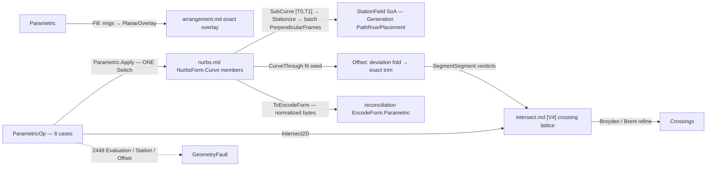

# [RASM_PARAMETRIC_CURVE]

`Rasm.Parametric` owns the host-neutral curve op algebra — one static rail folding `ParametricOp` over `NurbsForm.Curve` through `Parametric.Apply`, at OP altitude composing the `nurbs.md` engine members.

Every reachable failure routes `GeometryFault.ParametricFault(stage, carrier, witness)` 2448, and no exception crosses the public surface; degeneracy-sensitive verdicts escalate to `Numerics/predicates`. Every emitted curve content-keys through `ToEncodeForm()` into the reconciliation identity chain, minting no second identity.

## [01]-[INDEX]

- [01]-[PARAMETRIC]: `ParametricOp` request `[Union]` folds through ONE `Apply` into typed `ParametricResult`, over the division/measure/crossing vocabularies and the shared deviation-refinement driver.

## [02]-[PARAMETRIC]

- Owner: `DivideRule`, `MeasureProbe`, and `IntersectTarget` `[Union]` the division, measure-address, and planar-crossing payload vocabularies as cases; `StationPlan` and `RefinePolicy` bind the station and deviation-refinement policy rows as `IValidityEvidence`, with `Refine.Fold` the one bounded refinement driver; `ParametricOp` and `ParametricResult` `[Union]` the request and result algebra; `Parametric` mints the static `Apply` entry and the `Fill` projection.
- Cases: `ParametricOp` folds the request cases `Evaluate`, `Measure`, `Divide`, `Stations`, `Split`, `Reconstruct`, `Offset`, and `Intersect2D`, each paired to one typed `ParametricResult` carrier.
- Entry: `Apply` discriminates the op case through the generated total `Switch` — the one entry, no per-op sibling family; `Fill` projects closed loops to the arrangement overlay.
- Auto: each op case internalizes its vendored-engine kernel at the fence with no per-op knob; `Divide` and `Stations` share ONE `Stationize` arc→parameter kernel, and both offset lanes ride ONE `Refine.Fold`.
- Receipt: `RefineReceipt` carries the deviation evidence on `Refit`/`Offsets`; `StationField.FrameDefect` is the orthonormality witness whose vectorized reduction rides the registered `FrameDefectClaim`, correctness never on it.
- Packages: `Rasm.Parametric` `nurbs.md` (the vendored engine — `RationalDerivatives`/`TangentAt`/`CurvatureAt`/`Length`/`LengthAt`/`ParameterAtLength`/`ParameterAtChordLength`/`ClosestParameter`/`PerpendicularFrames`/`SplitAt`/`SubCurve`/`IsClosed` carrier members, `Nurbs.Of` + `NurbsWire.CurveThrough` + `FitPolicy` the fit seed, `NurbsPolicy` the G7 knobs), MathNet.Numerics (`Interpolate.CubicSplineMonotone` the batch inversion table; `Brent.TryFindRoot` the section roots; `Broyden.FindRoot` the 2-var crossing refinement, `Try`-trapped), `Rasm.Meshing` (`Intersection.Apply` + `IntersectOp.SegmentSegment` + `IntersectPolicy` — the exact candidate lattice), `Rasm.Meshing` (`Arrangement.Apply` + `ArrangementOp.PlanarOverlay` + `BooleanOp` + `ArrangementPolicy` — the `Fill` delegation), `Rasm.Numerics` (`Predicate`/`Axis` — the exact escalation seam), `Rasm.Numerics` (`GeometryFault.ParametricFault` + `ParametricStage`), `Rasm.Domain` (`Op`, `ValidityClaim`/`IValidityEvidence`, `BenchClaim` the registered claim row), `Rhino.Geometry` (`Point3d`/`Vector3d`/`Plane`/`Line`/`Polyline` carriers), Thinktecture.Runtime.Extensions, LanguageExt.Core (`Fin`/`Try`/`Arr`/`Seq`/`Option`), System.Numerics.Tensors (`TensorPrimitives.Max` the SoA wire reduction under the registered claim row).
- Growth: a new op (a `Blend` between two curves, a `Project`-to-plane) is one `ParametricOp` case over the SAME carrier members; a new division scheme is one `DivideRule` case read by the shared `Stationize` kernel; a new measure address is one `MeasureProbe` case; a new crossing target (the host-deferred triple arriving in-kernel) is one `IntersectTarget` case; zero new entry surfaces.
- Boundary: OP altitude composes `nurbs.md`'s ENGINE members — an op union there, or a basis/insertion/arc-length/RMF kernel re-minted here instead of the vendored instance surface, is the altitude violation. Runtime reciprocals hold one anchor each: `projections.md` Rhino evaluation, `locate.md` Rhino location (division/closest/arc-length share both runtimes by decision, meeting at the wire), `relations.md` the host-deferred SSI/surface-plane/curve-surface triple; a second location algebra or a kernel SSI beside them is the double-owner defect. `Intersect2D` existence is EXACT and coordinates are refined `double` — an unrefined crossing or unescalated near-tangent verdict downstream is the precision defect. `Fill` DELEGATES — a local winding fill or re-derived overlay is the deleted form. `Offset` trims by exact `SegmentSegment` verdicts on neighbor-excluded pairs — trusting the raw fit or trimming by float chords is the G8 regression. `StationField` binds the Generation seam directly as SoA columns; a row-object re-pack is the rejected layout.

```csharp signature
// --- [RUNTIME_PRELUDE] ----------------------------------------------------------------------
using System;
using System.Linq;
using System.Numerics.Tensors;
using LanguageExt;
using LanguageExt.Common;
using MathNet.Numerics;
using MathNet.Numerics.RootFinding;
using Rasm.Domain;
using Rasm.Meshing;
using Rasm.Numerics;
using Rhino.Geometry;
using Thinktecture;
using static LanguageExt.Prelude;

namespace Rasm.Parametric;

// --- [TYPES] ------------------------------------------------------------------------------------
// ByLength caps an honest uneven tail, ByEqualLength equalizes; ByChord marches constant world-space chords.
[Union(ConversionFromValue = ConversionOperatorsGeneration.None)]
public abstract partial record DivideRule {
    private DivideRule() { }

    public sealed record ByCount(int Count) : DivideRule;
    public sealed record ByLength(double MaxSegment) : DivideRule;
    public sealed record ByEqualLength(double MaxSegment) : DivideRule;
    public sealed record ByChord(double Chord) : DivideRule;
}

[Union(ConversionFromValue = ConversionOperatorsGeneration.None)]
public abstract partial record MeasureProbe {
    private MeasureProbe() { }

    public sealed record Whole : MeasureProbe;
    public sealed record AtParameter(double T) : MeasureProbe;
    public sealed record NearPoint(Point3d P) : MeasureProbe;
}

// Planar crossing targets; the SSI / surface-plane / curve-surface TRIPLE stays relations.md's until the probe widens.
[Union(ConversionFromValue = ConversionOperatorsGeneration.None)]
public abstract partial record IntersectTarget {
    private IntersectTarget() { }

    public sealed record Curve2d(NurbsForm.Curve Other, Axis Plane) : IntersectTarget;
    public sealed record SectionPlane(Plane Cut) : IntersectTarget;
}

// --- [CONSTANTS] --------------------------------------------------------------------------------
// StationPlan window [T0,T1] is NORMALIZED parent-domain; above TableFloor stations, per-station Brent inversion yields to ONE monotone table.
public sealed record StationPlan(double T0, double T1, DivideRule Rule, int TableFloor = 16) : IValidityEvidence {
    public const int TableCeiling = 256;

    public bool IsValid => ValidityClaim.All(
        ValidityClaim.UnitInterval(value: T0), ValidityClaim.UnitInterval(value: T1),
        ValidityClaim.Of(holds: T0 < T1),
        ValidityClaim.CountAtLeast(count: TableFloor, floor: 2));
}

// RefinePolicy is shared; Refine.Fold is its one driver, and surface.md composes both.
public sealed record RefinePolicy(double DeviationTolerance, double DeviationBudgetMultiplier, int MaxRounds, int SeedSamples) : IValidityEvidence {
    public static readonly RefinePolicy Canonical = new(DeviationTolerance: 1e-6, DeviationBudgetMultiplier: 8.0, MaxRounds: 6, SeedSamples: 24);

    public bool IsValid => ValidityClaim.All(
        ValidityClaim.Positive(value: DeviationTolerance),
        ValidityClaim.Positive(value: DeviationBudgetMultiplier),
        ValidityClaim.Positive(value: MaxRounds),
        ValidityClaim.CountAtLeast(count: SeedSamples, floor: 4));
}

// --- [MODELS] -----------------------------------------------------------------------------------
public sealed record RefineReceipt(double Target, double Achieved, int Rounds, int Samples);

// One refinement-round carrier BOTH offset lanes share — curve stations are double parameters, surface stations (u,v) nodes.
public readonly record struct RefineRound<TFit, TStation>(TFit Fit, Arr<TStation> Stations, Arr<TStation> Breaching, double Deviation, int Round);

// THE ONE deviation-refinement driver both offset lanes ride: lanes supply only seed/probe/densify arms, a per-lane copy is the deleted twin.
// Past the deviation-budget guard the lane fault routes; under it the receipt carries the achieved deviation for the consumer gate.
public static class Refine {
    public static Fin<(TFit Fit, RefineReceipt Receipt)> Fold<TFit, TStation>(
        RefinePolicy policy,
        Arr<TStation> seed,
        Func<Arr<TStation>, int, Fin<RefineRound<TFit, TStation>>> fit,
        Func<Arr<TStation>, Arr<TStation>, Arr<TStation>> densify,
        Func<double, Error> unconverged) =>
        Range(0, policy.MaxRounds).Fold(
            fit(seed, 0),
            (state, _) => state.Bind(s => s.Breaching.Count == 0 ? Fin.Succ(s) : fit(densify(s.Stations, s.Breaching), s.Round + 1)))
        .Bind(final => !double.IsFinite(final.Deviation) || final.Deviation < 0.0
            || (final.Breaching.Count > 0 && final.Deviation > policy.DeviationTolerance * policy.DeviationBudgetMultiplier)
            ? Fin.Fail<(TFit Fit, RefineReceipt Receipt)>(unconverged(final.Deviation))
            : Fin.Succ((final.Fit, new RefineReceipt(policy.DeviationTolerance, final.Deviation, final.Round, final.Stations.Count))));
}

// --- [OPERATIONS] ---------------------------------------------------------------------------
[Union(ConversionFromValue = ConversionOperatorsGeneration.None)]
public abstract partial record ParametricOp {
    private ParametricOp() { }

    public sealed record Evaluate(NurbsForm.Curve Curve, double T, int Order) : ParametricOp;
    public sealed record Measure(NurbsForm.Curve Curve, MeasureProbe Probe) : ParametricOp;
    public sealed record Divide(NurbsForm.Curve Curve, DivideRule Rule) : ParametricOp;
    public sealed record Stations(NurbsForm.Curve Curve, StationPlan Plan) : ParametricOp;
    public sealed record Split(NurbsForm.Curve Curve, Arr<double> At) : ParametricOp;
    public sealed record Reconstruct(NurbsForm.Curve Curve, FitPolicy Fit, int Samples) : ParametricOp;
    public sealed record Offset(NurbsForm.Curve Curve, Plane Frame, double Distance, RefinePolicy Refine) : ParametricOp;
    public sealed record Intersect2D(NurbsForm.Curve Curve, IntersectTarget Target) : ParametricOp;
}

[Union(ConversionFromValue = ConversionOperatorsGeneration.None)]
public abstract partial record ParametricResult {
    private ParametricResult() { }

    public sealed record Sample(Point3d Point, Vector3d Tangent, Arr<Vector3d> Derivatives, Plane Frame, Vector3d Curvature) : ParametricResult;
    public sealed record Measured(double Length, double Parameter, Point3d Point, Vector3d Curvature, bool Closed) : ParametricResult;
    public sealed record Division(Arr<double> Parameters, Arr<Point3d> Points) : ParametricResult;

    // StationField SoA wire: window-relative arcs, PARENT-domain parameters, RMF frames; FrameDefect = max |X̂·Ŷ| over the batch, its orthonormality witness.
    public sealed record StationField(Arr<double> Arcs, Arr<double> Parameters, Arr<Point3d> Points, Arr<Plane> Frames, double FrameDefect) : ParametricResult;

    public sealed record Pieces(Arr<NurbsForm.Curve> Curves) : ParametricResult;
    public sealed record Refit(NurbsForm.Curve Curve, RefineReceipt Receipt) : ParametricResult;
    public sealed record Offsets(Arr<NurbsForm.Curve> Curves, RefineReceipt Receipt, int TrimmedCrossings, int KeptSegments) : ParametricResult;
    public sealed record Crossings(Arr<(double TA, double TB, Point3d At)> Hits) : ParametricResult;
}

public static class Parametric {
    // Registered speed claim (Domain/telemetry.md BenchClaim): the StationField reduction proves under the corpus gate; correctness never rides it.
    public static readonly BenchClaim FrameDefectClaim = new(
        Claim: Op.Of(name: nameof(ParametricResult.StationField)),
        VectorizedLane: "TensorPrimitives.Max<double> over the filled |X̂·Ŷ| plane",
        ReferenceLane: "scalar LINQ Max fold over the frame batch",
        SpeedupFloor: 1.0);

    public static Fin<ParametricResult> Apply(ParametricOp op, Op? key = null) =>
        op.Switch(
            state: key,
            evaluate:    static (k, e) => EvaluateOf(e, k),
            measure:     static (k, m) => MeasureOf(m, k),
            divide:      static (k, d) => Stationize(d.Curve, d.Rule, StationPlan.TableCeiling).Map(static rows =>
                (ParametricResult)new ParametricResult.Division(rows.Parameters, new Arr<Point3d>([.. rows.Parameters.Select(rows.Curve.PointAt)]))),
            stations:    static (k, s) => StationsOf(s, k),
            split:       static (k, s) => SplitOf(s, k),
            reconstruct: static (k, r) => ReconstructOf(r, k),
            offset:      static (k, o) => OffsetOf(o, k),
            intersect2D: static (k, i) => i.Target.Switch(
                curve2d:      c => CrossingsOf(i.Curve, c, k),
                sectionPlane: p => SectionOf(i.Curve, p.Cut, k)));

    // Region delegation: loops sample at control-density chords → exact nonzero-winding overlay; holes ride ring orientation, emission stays the arrangement's.
    public static Fin<ArrangementResult> Fill(Arr<NurbsForm.Curve> loops, Axis plane, ArrangementPolicy? policy = null, Op? key = null) =>
        loops.Exists(static loop => !loop.IsClosed)
            ? Fault<ArrangementResult>(ParametricStage.Evaluation, nameof(Fill), "open loop in a region fill")
            : loops.TraverseM(loop => Stationize(loop, new DivideRule.ByCount(int.Max(16, 4 * loop.ControlCount)), StationPlan.TableCeiling)
                    .Map(static rows => new Polyline(rows.Parameters.Select(rows.Curve.PointAt))))
                .As()
                .Bind(rings => Arrangement.Apply(
                    new ArrangementOp.PlanarOverlay(toSeq(rings), Seq<Polyline>(), BooleanOp.Union, plane, policy ?? ArrangementPolicy.Canonical), key));

    // --- [EVALUATE_MEASURE]
    static Fin<ParametricResult> EvaluateOf(ParametricOp.Evaluate op, Op? key) =>
        op.T is < 0.0 or > 1.0
            ? Fault<ParametricResult>(ParametricStage.Evaluation, nameof(NurbsForm.Curve), $"parameter {op.T} outside the normalized domain")
            : op.Curve.PerpendicularFrames([op.T]).Map(frames => {
                (Point3d point, Vector3d[] ders) = op.Curve.RationalDerivatives(op.T, int.Max(1, op.Order));
                return (ParametricResult)new ParametricResult.Sample(
                    point, op.Curve.TangentAt(op.T), new Arr<Vector3d>(ders), frames[0], op.Curve.CurvatureAt(op.T));
            });

    static Fin<ParametricResult> MeasureOf(ParametricOp.Measure op, Op? key) =>
        op.Probe.Switch(
            whole:       _ => Fin.Succ(1.0),
            atParameter: static a => Fin.Succ(a.T),
            nearPoint:   n => op.Curve.ClosestParameter(n.P))
        .Bind(t => t is < 0.0 or > 1.0
            ? Fault<ParametricResult>(ParametricStage.Evaluation, nameof(NurbsForm.Curve), $"measure parameter {t} outside the normalized domain")
            : Fin.Succ<ParametricResult>(new ParametricResult.Measured(
                op.Probe is MeasureProbe.Whole ? op.Curve.Length() : op.Curve.LengthAt(t),
                t, op.Curve.PointAt(t), op.Curve.CurvatureAt(t), op.Curve.IsClosed)));

    // --- [STATION_KERNEL]
    // ONE arc→parameter kernel serves Divide and Stations; the table branch is monotone-preserving, so station order can never invert.
    internal readonly record struct StationRows(NurbsForm.Curve Curve, Arr<double> Arcs, Arr<double> Parameters);

    internal static Fin<StationRows> Stationize(NurbsForm.Curve curve, DivideRule rule, int tableFloor) =>
        ArcTargets(curve, rule).Bind(arcs => arcs.Count < tableFloor
            ? arcs.TraverseM(arc => curve.ParameterAtLength(arc)).As()
                .Map(ts => new StationRows(curve, arcs, new Arr<double>([.. ts])))
            : Fin.Succ(InvertByTable(curve, arcs)));

    static Fin<Arr<double>> ArcTargets(NurbsForm.Curve curve, DivideRule rule);          // rule lattice: i·L/n · capped march + tail · equalized · ParameterAtChordLength march; a degenerate rule (count < 1, non-positive length/chord) or a zero-length curve routes the Station fault — targets are never empty
    static StationRows InvertByTable(NurbsForm.Curve curve, Arr<double> arcs);           // (LengthAt(tⱼ), tⱼ) samples → CubicSplineMonotone → t(s) per arc

    static Fin<ParametricResult> StationsOf(ParametricOp.Stations op, Op? key) =>
        !op.Plan.IsValid
            ? Fault<ParametricResult>(ParametricStage.Station, nameof(StationPlan), "degenerate window or table floor")
            : op.Curve.SubCurve(op.Plan.T0, op.Plan.T1)
                .Bind(window => Stationize(window, op.Plan.Rule, op.Plan.TableFloor))
                .Bind(rows => rows.Curve.PerpendicularFrames([.. rows.Parameters]).Map(frames => {
                    Arr<double> parent = new([.. rows.Parameters.Select(t => op.Plan.T0 + (t * (op.Plan.T1 - op.Plan.T0)))]);
                    Arr<Point3d> points = new([.. frames.Select(static f => f.Origin)]);
                    double[] dots = new double[frames.Length];
                    for (int i = 0; i < dots.Length; i++) { dots[i] = Math.Abs(frames[i].XAxis * frames[i].YAxis); }   // fill kernel; the reduction is the FrameDefectClaim vectorized lane
                    double defect = dots.Length == 0 ? 0.0 : TensorPrimitives.Max<double>(dots);
                    return (ParametricResult)new ParametricResult.StationField(rows.Arcs, parent, points, new Arr<Plane>(frames), defect);
                }));

    // --- [SPLIT_RECONSTRUCT]
    static Fin<ParametricResult> SplitOf(ParametricOp.Split op, Op? key) =>
        toSeq(op.At.OrderBy(static t => t)).Fold(
            Fin.Succ((Head: op.Curve, Done: Seq<NurbsForm.Curve>(), Consumed: 0.0)),
            (state, t) => state.Bind(s => s.Head.SplitAt((t - s.Consumed) / (1.0 - s.Consumed))
                .Map(pair => (pair.Tail, s.Done.Add(pair.Head), t))))
        .Map(static s => (ParametricResult)new ParametricResult.Pieces(new Arr<NurbsForm.Curve>([.. s.Done.Add(s.Head)])));

    // Curve REBUILD: arc-uniform resample → refit through the ONE engine admission → deviation witness; raw-point ingress stays Nurbs.Of's.
    static Fin<ParametricResult> ReconstructOf(ParametricOp.Reconstruct op, Op? key) =>
        Stationize(op.Curve, new DivideRule.ByCount(int.Max(op.Fit.Degree + 1, op.Samples)), StationPlan.TableCeiling)
            .Bind(rows => Nurbs.Of(new NurbsWire.CurveThrough(new Arr<Point3d>([.. rows.Parameters.Select(rows.Curve.PointAt)]), op.Fit), key))
            .Bind(form => form is NurbsForm.Curve refit
                ? DeviationAgainst(op.Curve, refit, 2 * op.Samples).Map(deviation =>
                    (ParametricResult)new ParametricResult.Refit(refit, new RefineReceipt(0.0, deviation, 1, op.Samples)))
                : Fault<ParametricResult>(ParametricStage.Construction, nameof(NurbsForm.Curve), "refit produced a non-curve carrier"));

    static Fin<double> DeviationAgainst(NurbsForm.Curve reference, NurbsForm.Curve candidate, int probes);  // max |candidate(uⱼ) − reference(closest)| over arc-uniform probes

    // --- [OFFSET_LOOP]
    // G8: fit SEED → shared Refine.Fold driver → exact self-intersection trim; probes compare the fit against the exact offset locus C(t) + d·(ẑ×T̂).
    static Fin<ParametricResult> OffsetOf(ParametricOp.Offset op, Op? key) =>
        Stationize(op.Curve, new DivideRule.ByCount(op.Refine.SeedSamples), StationPlan.TableCeiling)
            .Bind(rows => Refine.Fold(
                op.Refine, rows.Parameters,
                fit: (stations, round) => SeedFit(op, stations, round, key),
                densify: Densified,
                unconverged: deviation => new GeometryFault.ParametricFault(ParametricStage.Offset, nameof(NurbsForm.Curve), $"offset unconverged at deviation {deviation}").ToError()))
            .Bind(final => TrimLoops(op, final.Fit, final.Receipt, key));

    static Fin<RefineRound<NurbsForm.Curve, double>> SeedFit(ParametricOp.Offset op, Arr<double> stations, int round, Op? key) =>
        stations.TraverseM(t => OffsetLocus(op.Curve, op.Frame, op.Distance, t)).As()
            .Bind(samples => Nurbs.Of(new NurbsWire.CurveThrough(new Arr<Point3d>([.. samples]), FitPolicy.Canonical), key))
            .Bind(form => form is NurbsForm.Curve fit
                ? Fin.Succ(Probed(op, fit, stations, round))
                : Fault<RefineRound<NurbsForm.Curve, double>>(ParametricStage.Offset, nameof(NurbsForm.Curve), "offset fit produced a non-curve carrier"));

    static Fin<Point3d> OffsetLocus(NurbsForm.Curve curve, Plane frame, double distance, double t);        // C(t) + d · unit(ẑ×T̂(t)); a tangent parallel to ẑ routes the Offset fault
    static RefineRound<NurbsForm.Curve, double> Probed(ParametricOp.Offset op, NurbsForm.Curve fit, Arr<double> stations, int round);  // inter-station probes over DeviationTolerance → breaching set + max deviation
    static Arr<double> Densified(Arr<double> stations, Arr<double> breaching);

    // Trim: chord-sample the fit, sweep neighbor-excluded AABB pairs through
    // Intersection.Apply(IntersectOp.SegmentSegment(a, b, axis, IntersectPolicy.Canonical), key), axis from op.Frame.ZAxis's dominant |component|;
    // map crossings to fit parameters, fit.SplitAt(sorted) → pieces, keep a piece ⇔ its midpoint base foot ≥ |Distance| − DeviationTolerance;
    // emit Offsets(kept, receipt, trimmed, kept.Count).
    static Fin<ParametricResult> TrimLoops(ParametricOp.Offset op, NurbsForm.Curve fit, RefineReceipt receipt, Op? key);

    // --- [PLANAR_CROSSINGS]
    // SectionPlane: per-span sign brackets of g(t) = (C(t)−P₀)·n̂, Brent.TryFindRoot per bracket (no-throw bool → rail);
    // a grazing minimum with no sign change is a miss, its consumer escalating the near-tangent verdict to the predicate ladder.
    static Fin<ParametricResult> SectionOf(NurbsForm.Curve curve, Plane cut, Op? key);

    // Curve2d: chord-sampled Bezier spans → AABB sweep → EXACT SegmentSegment existence per candidate →
    // Broyden.FindRoot on the plane-projected Cₐ(s)−C_b(t) system per hit, Try-trapped.
    static Fin<ParametricResult> CrossingsOf(NurbsForm.Curve a, IntersectTarget.Curve2d target, Op? key);

    static Fin<T> Fault<T>(ParametricStage stage, string carrier, string witness) =>
        Fin.Fail<T>(new GeometryFault.ParametricFault(stage, carrier, witness).ToError());
}
```



## [03]-[DENSITY_BAR]

One owner per axis; capability is a case, row, or fold arm, never a sibling surface. Each `[RAIL]` names one return rail, and indexed notes state the collapse.

| [INDEX] | [AXIS_CONCERN]    | [OWNER]                                      | [RAIL]                            | [CASES] |
| :-----: | :---------------- | :------------------------------------------- | :-------------------------------- | :-----: |
|  [01]   | Curve op algebra  | `ParametricOp` + `Parametric`                | `Apply → Fin<ParametricResult>`   |    8    |
|  [02]   | Result carrier    | `ParametricResult`                           | carrier (drained at the consumer) |    8    |
|  [03]   | Division rules    | `DivideRule`                                 | payload                           |    4    |
|  [04]   | Measure address   | `MeasureProbe`                               | payload                           |    3    |
|  [05]   | Crossing targets  | `IntersectTarget`                            | payload                           |    2    |
|  [06]   | Policy rows       | `StationPlan`/`RefinePolicy` + `Refine.Fold` | values + the one driver           |    —    |
|  [07]   | Region delegation | `Parametric.Fill`                            | `Fill → Fin<ArrangementResult>`   |    —    |

- [01]-[CURVE_OP_ALGEBRA]: `[Union]` request cases folded by ONE `Apply`.
- [02]-[RESULT_CARRIER]: `[Union]` typed results; `StationField` the SoA wire, `Offsets`/`Refit` evidence-bearing.
- [03]-[DIVISION_RULES]: `[Union]` count/capped/equalized/chord — rule DATA the one `Stationize` kernel reads.
- [04]-[MEASURE_ADDRESS]: `[Union]` whole/parameter/point.
- [05]-[CROSSING_TARGETS]: `[Union]` planar curve/section; the SSI triple stays host-deferred.
- [06]-[POLICY_ROWS]: window + inversion-table floor · shared deviation-refinement row with its one `Refine.Fold` driver.
- [07]-[REGION_DELEGATION]: ring sampling → `PlanarOverlay` — delegation, never a local fill.

Signature-pinned kernels compose vendored engine members and the exact lattice; no textbook arithmetic is local.

## [04]-[RESEARCH]

<!-- source-only: research row template:
[TOKEN]-[OPEN|BLOCKED]: <exact question>; <verification route>.
[SPLIT_MEMBER]-[OPEN]: does `shape-core` expose `split_all`; verify against the member rail.
-->

(none)
