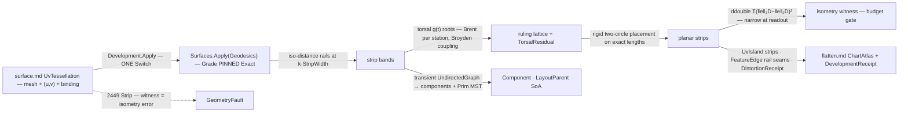

# [RASM_PARAMETRIC_DEVELOP]

`Rasm.Parametric` develops a UV-provenanced surface into guaranteed-isometric planar strips, the exact-isometry fabrication tier: `Development.Apply` folds near-developable bands between exact geodesic rails, torsal ruling lines per band, and a rigid length-preserving unroll. A per-strip `ddouble` isometry witness proves each strip — a Fabrication acceptance reads its edge-length defect as evidence — and a strip over budget faults on its unit, never emitting an unwitnessed atlas.

`surface.md`'s `SurfaceResult.UvTessellation` — mesh, per-vertex `(u, v)`, and a live `NurbsForm.Surface` binding — carries the input, and rails compose through `Surfaces.Apply(SurfaceOp.Geodesics)` at `GeodesicGrade.Exact`. Emission converges on `flatten.md`'s `ChartAtlas` seam type, and strip layout is a transient QuikGraph fold leaving as SoA columns on the `StripField` wire.

## [01]-[INDEX]

- [01]-[DEVELOPMENT]: `DevelopOp` the two-case request `[Union]` folded by ONE `Apply` into strip decomposition, torsal rulings, and the exact unroll, `DevelopmentReceipt` carrying the `ddouble` isometry evidence.

## [02]-[DEVELOPMENT]

- Owner: `DevelopPolicy` the policy row (`StripWidth` the geodesic rail spacing · `RulingStations` the per-strip station count · `TorsalTolerance` the ruling residual gate · `IsometryBudget` the per-strip witness ceiling the acceptance reads · `Seed` the UV seed polyline the distance field grows from, empty = the `u = 0` boundary isoline) registering `IValidityEvidence`; `DevelopOp` the request `[Union]` (`Decompose` the strip partition + rulings for inspection · `Unroll` the full pipeline through the witness and atlas); `StripField` the SoA wire (rail offset-columns in UV · ruling endpoint/residual columns · per-strip component and MST layout-parent columns); `DevelopmentReceipt` the evidence row (`Strips` · `Rulings` · `MaxIsometry` · `MeanIsometry` · `MaxTorsal` · `Components`); `DevelopmentResult` the result `[Union]`; `Development` the static entry.
- Cases: `DevelopOp` cases `Decompose` · `Unroll` (2 — inspection versus fabrication modality, `Unroll` composing `Decompose`'s own fold, never a re-derivation); `DevelopmentResult` cases `Strips` · `Unrolled` (2).
- Entry: `public static Fin<DevelopmentResult> Apply(DevelopOp op, Op? key = null)` — the ONE entry discriminating on the op case; both cases take the `SurfaceResult.UvTessellation` carrier, so the UV-provenance input law is the parameter TYPE.
- Auto: `Decompose` composes the geodesic distance through `Surfaces.Apply(SurfaceOp.Geodesics)` with `Grade` PINNED `Exact` on the `k·StripWidth` ladder, takes the iso-distance contours as strip RAILS (UV and world columns lerp-consistent by the tessellation's own provenance), assigns faces to bands by vertex distance, and roots the torsal coplanarity residual per station (arc-spaced on the lower rail) through `Brent.TryFindRoot` coupled by one `Try`-trapped `Broyden.FindRoot` pass; a station short of `TorsalTolerance` records into `TorsalResidual` rather than faulting, because a mildly non-torsal ruling that still unrolls within budget is fabrication-acceptable and the witness is the acceptance criterion. `Unroll` develops each strip by rigid placement on exact edge lengths — ruling quads split on the shorter diagonal, the triangle chain seated from the origin by two-circle intersection with no solve or relaxation — accumulates the isometry WITNESS per strip in `ddouble`, narrows at readout onto the receipt max/mean, and faults `IsometryBudget` breaches as 2449 `Strip`; layout folds strip adjacency into a transient `UndirectedGraph`, reads `ConnectedComponents` and a shared-rail-weighted `MinimumSpanningTreePrim` into the `Component`/`LayoutParent` columns packed in MST breadth order, and the atlas emits one `UvIsland` per strip with rail `FeatureEdge` seams beside a cross-check `DistortionReceipt`.
- Receipt: `DevelopmentReceipt` — strip/ruling census, max/mean isometry witness, max torsal residual, component count — the Fabrication unroll dry-run and Generation developable-gate evidence; the `ChartAtlas.Receipt` `DistortionReceipt` rides BESIDE it for seam-type compatibility, never instead of it.
- Packages: `Rasm.Parametric` `surface.md` (`SurfaceResult.UvTessellation` the input carrier; `Surfaces.Apply(SurfaceOp.Geodesics)` the exact-rail composition) + `nurbs.md` (`NurbsForm.Surface.NormalAt`/`RationalDerivatives` — the ruling normals and strip evaluation), `Rasm.Processing` (`GeodesicKernel.PropagateWindows` machinery surfaced through the surface geodesic lane; `FeatureEdge`/`MeshFeatureKind` — the seam-edge rows `segment.md` mints), `Rasm.Meshing` (`MeshSpace`), TYoshimura.DoubleDouble (`ddouble` — the 106-bit cancellation-safe witness accumulation, `INumber<ddouble>`-bound fold), MathNet.Numerics (`Brent.TryFindRoot` the per-station torsal root; `Broyden.FindRoot` the coupled station refinement, `Try`-trapped), QuikGraph (`UndirectedGraph<int, SEdge<int>>` + `ConnectedComponents` + `MinimumSpanningTreePrim` — the transient layout fold; results leave as SoA columns per the bounded-lane law), `Rasm.Processing` (`ChartAtlas`/`UvIsland`/`DistortionReceipt`/`ChartId` — the flatten seam types, composed never re-minted), `Rasm.Numerics` (`Predicate.Orient2D` — the flip-free proof), `Rasm.Numerics` (`GeometryFault.DevelopmentFault` + `DevelopmentStage`), `Rasm.Domain` (`Op`, `ValidityClaim`/`IValidityEvidence`), Rhino.Geometry (`Point3d`/`Vector3d`/`Point2d`), Thinktecture.Runtime.Extensions, LanguageExt.Core.
- Growth: a new decomposition driver (principal-curvature-aligned rails instead of distance rails) is one rail-derivation arm feeding the SAME strip fold; a new ruling condition (a cone-point-aware torsal variant) is one residual function the same Brent/Broyden solve roots; a new layout packing (nesting-aware placement) is one ordering projection off the same MST columns; zero new entry surfaces.
- Boundary: this owner holds the EXACT-ISOMETRY tier — re-deriving a conformal or distortion-minimizing solve here, or claiming isometry without the `ddouble` witness, is the tier violation; the input is the `UvTessellation` TYPE and an unbound mesh cannot enter, so the provenance law is structural; rails are `GeodesicGrade.Exact` by law — a heat-grade rail is the drift defect, rail error becoming strip skew becoming witness noise; ruling normals read the surface BINDING at provenance UV — a mesh-normal approximation is the substitution defect; the unroll is rigid placement on exact edge lengths — a spring relaxation, an ARAP pass, or any distortion-minimizing solve here is the tier regression; the witness accumulates in `ddouble` and narrows ONLY at readout — a `double` running sum re-introduces the cancellation the fold exists to kill; QuikGraph containers are transient and the layout leaves as `Component`/`LayoutParent` columns — a stored graph field or leaked `IEdge` type is the lane violation; every failure routes 2449 `Strip` with the strip unit and the isometry or torsal measure, no exception crossing the surface.

```csharp signature
// --- [RUNTIME_PRELUDE] ----------------------------------------------------------------------
using System;
using System.Collections.Generic;
using System.Linq;
using DoubleDouble;
using LanguageExt;
using MathNet.Numerics.RootFinding;
using QuikGraph;
using QuikGraph.Algorithms;
using Rasm.Domain;
using Rasm.Meshing;
using Rasm.Numerics;
using Rasm.Processing;
using Rhino.Geometry;
using Thinktecture;
using static LanguageExt.Prelude;

namespace Rasm.Parametric;

// --- [CONSTANTS] --------------------------------------------------------------------------------
public sealed record DevelopPolicy(
    double StripWidth, int RulingStations, double TorsalTolerance, double IsometryBudget,
    Arr<Point2d> Seed) : IValidityEvidence {
    public static readonly DevelopPolicy Canonical = new(
        StripWidth: 0.25, RulingStations: 32, TorsalTolerance: 1e-8, IsometryBudget: 1e-10, Seed: Arr<Point2d>.Empty);

    public bool IsValid => ValidityClaim.All(
        ValidityClaim.Positive(value: StripWidth),
        ValidityClaim.Positive(value: TorsalTolerance),
        ValidityClaim.Positive(value: IsometryBudget),
        ValidityClaim.CountAtLeast(count: RulingStations, floor: 2));
}

// --- [MODELS] -----------------------------------------------------------------------------------
public sealed record StripField(
    Arr<int> RailOffsets, Arr<Point2d> RailUv,
    Arr<int> RulingOffsets, Arr<Point2d> RulingA, Arr<Point2d> RulingB, Arr<double> TorsalResidual,
    Arr<int> Component, Arr<int> LayoutParent);

public sealed record DevelopmentReceipt(int Strips, int Rulings, double MaxIsometry, double MeanIsometry, double MaxTorsal, int Components);

// --- [OPERATIONS] ---------------------------------------------------------------------------
[Union(ConversionFromValue = ConversionOperatorsGeneration.None)]
public abstract partial record DevelopOp {
    private DevelopOp() { }

    public sealed record Decompose(SurfaceResult.UvTessellation Source, DevelopPolicy Policy) : DevelopOp;
    public sealed record Unroll(SurfaceResult.UvTessellation Source, DevelopPolicy Policy) : DevelopOp;
}

[Union(ConversionFromValue = ConversionOperatorsGeneration.None)]
public abstract partial record DevelopmentResult {
    private DevelopmentResult() { }

    public sealed record Strips(StripField Field) : DevelopmentResult;

    public sealed record Unrolled(ChartAtlas Atlas, StripField Field, DevelopmentReceipt Receipt) : DevelopmentResult;
}

public static class Development {
    public static Fin<DevelopmentResult> Apply(DevelopOp op, Op? key = null) =>
        op.Switch(
            state: key,
            decompose: static (k, d) => DecomposeOf(d.Source, d.Policy, k).Map(static field => (DevelopmentResult)new DevelopmentResult.Strips(field)),
            unroll:    static (k, u) => DecomposeOf(u.Source, u.Policy, k).Bind(field => UnrollOf(u.Source, u.Policy, field, k)));

    // --- [STRIP_DECOMPOSITION]
    static Fin<StripField> DecomposeOf(SurfaceResult.UvTessellation source, DevelopPolicy policy, Op? key) =>
        !policy.IsValid
            ? Fault<StripField>(unit: 0, witness: policy.StripWidth)
            : Surfaces.Apply(
                    new SurfaceOp.Geodesics(source, new GeodesicPlan(
                        SeedOf(source, policy), LevelLadder(source, policy.StripWidth), GeodesicGrade.Exact)), key)
                .Bind(rails => rails is SurfaceResult.GeodesicField field
                    ? Rulings(source, policy, field, key)
                    : Fault<StripField>(unit: 0, witness: 0.0));

    static Arr<Point2d> SeedOf(SurfaceResult.UvTessellation source, DevelopPolicy policy);   // policy.Seed, or the u = 0 boundary isoline vertices
    static Arr<double> LevelLadder(SurfaceResult.UvTessellation source, double stripWidth);  // k·StripWidth up to the field maximum

    // Rulings kernel contract: per station s, torsal residual g(t) = (b(t)−a(s)) · (N(a(s)) × N(b(t))) roots through
    // Brent.TryFindRoot on the monotone upper-rail window, normals Source.NormalAt at provenance UV; one Try-trapped
    // Broyden.FindRoot couples the stations enforcing monotone t so rulings cannot cross, unreached tolerance → TorsalResidual.
    static Fin<StripField> Rulings(SurfaceResult.UvTessellation source, DevelopPolicy policy, SurfaceResult.GeodesicField rails, Op? key);

    // --- [EXACT_UNROLL]
    // Rigid placement on exact edge lengths: ruling quads split on the shorter diagonal, the triangle chain seats at the
    // origin (rail edge on +x), each next third vertex by two-circle intersection on 3D lengths — no solve, no relaxation.
    static Fin<DevelopmentResult> UnrollOf(SurfaceResult.UvTessellation source, DevelopPolicy policy, StripField field, Op? key) =>
        StripCount(field) switch {
            0 => Fault<DevelopmentResult>(unit: 0, witness: 0.0),
            int strips => Range(0, strips).Fold(
                    Fin.Succ(Seq<UnrolledStrip>()),
                    (state, strip) => state.Bind(done => Develop(source, field, strip).Bind(unrolled =>
                        (double)unrolled.Witness <= policy.IsometryBudget
                            ? Fin.Succ(done.Add(unrolled))
                            : Fault<Seq<UnrolledStrip>>(unit: strip, witness: (double)unrolled.Witness))))
                .Bind(unrolled => Emit(source, field, unrolled, key)),
        };

    internal readonly record struct UnrolledStrip(int Strip, Arr<int> Vertices, Arr<(int A, int B, int C)> Faces, Arr<Point2d> Planar, ddouble Witness, double MaxJacobianRatio);

    static int StripCount(StripField field);
    static Fin<UnrolledStrip> Develop(SurfaceResult.UvTessellation source, StripField field, int strip);
    // Develop = ruling-quad triangle chain, rigid placement, and the ddouble edge-defect fold:
    //   witness = chain.Fold(ddouble.Zero, (sum, e) => sum + (((ddouble)e.Len3d − e.Len2d) * ((ddouble)e.Len3d − e.Len2d)))

    // --- [LAYOUT_AND_ATLAS]
    // Prim MST weighted 1/(1+sharedRailLength) orders placement — long shared rails first, minimum accumulated error.
    static Fin<DevelopmentResult> Emit(SurfaceResult.UvTessellation source, StripField field, Seq<UnrolledStrip> strips, Op? key) {
        UndirectedGraph<int, SEdge<int>> adjacency = new(allowParallelEdges: false);
        adjacency.AddVertexRange(Enumerable.Range(0, strips.Count));
        foreach ((int a, int b) in SharedRails(field)) { adjacency.AddEdge(new SEdge<int>(a, b)); }
        Dictionary<int, int> components = new();
        int componentCount = adjacency.ConnectedComponents(components);
        IEnumerable<SEdge<int>> order = adjacency.MinimumSpanningTreePrim(edge => 1.0 / (1.0 + SharedRailLength(field, edge.Source, edge.Target)));
        return Atlas(source, field, strips, components, toSeq(order), componentCount, key);
    }

    static Seq<(int A, int B)> SharedRails(StripField field);
    static double SharedRailLength(StripField field, int a, int b);
    static Fin<DevelopmentResult> Atlas(
        SurfaceResult.UvTessellation source, StripField field, Seq<UnrolledStrip> strips,
        IDictionary<int, int> components, Seq<SEdge<int>> mst, int componentCount, Op? key);
    // Atlas packs strips in MST breadth order; UvIsland(ChartId.Create(strip), …, planar) per strip, RegionBoundary
    // FeatureEdge rail Seams, FlipFreeBijective by exact Orient2D, FactorNonZeros = 0; DistortionReceipt off the unroll
    // Jacobians paired with the DevelopmentReceipt.

    static Fin<T> Fault<T>(int unit, double witness) =>
        Fin.Fail<T>(new GeometryFault.DevelopmentFault(DevelopmentStage.Strip, unit, witness).ToError());
}
```



## [03]-[DENSITY_BAR]

One owner per axis; capability is a case, row, or fold arm, never a sibling surface. `[RAIL]` names the owner's one return rail.

| [INDEX] | [AXIS_CONCERN]      | [OWNER]                     | [RAIL]                            | [CASES] |
| :-----: | :------------------ | :-------------------------- | :-------------------------------- | :-----: |
|  [01]   | Development algebra | `DevelopOp` + `Development` | `Apply → Fin<DevelopmentResult>`  |    2    |
|  [02]   | Result carrier      | `DevelopmentResult`         | carrier (drained at the consumer) |    2    |
|  [03]   | Strip wire          | `StripField`                | value                             |    —    |
|  [04]   | Policy row          | `DevelopPolicy`             | value (`IValidityEvidence`)       |    —    |
|  [05]   | Evidence            | `DevelopmentReceipt`        | value                             |    —    |

One transcription-complete source file carries the op algebra, carriers, and kernels; each signature-pinned kernel's contract rides its in-fence comment. Distance field, projection arithmetic, graph algorithms, and atlas types are composed owners; the only local mathematics is the torsal residual and the rigid placement, the pair no admitted surface carries.

## [04]-[RESEARCH]

<!-- source-only: research row template:
[TOKEN]-[OPEN|BLOCKED]: <exact question>; <verification route>.
[SPLIT_MEMBER]-[OPEN]: does `shape-core` expose `split_all`; verify against the member rail.
-->

(none)
