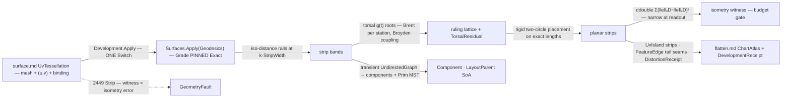

# [RASM_PARAMETRIC_DEVELOP]

The guaranteed-isometric developable-strip owner of `Rasm.Parametric` — `Fin<DevelopmentResult> Development.Apply(DevelopOp, Op? key = null)` decomposes a UV-provenanced surface into near-developable strips between MMP-EXACT geodesic rails, extracts torsal RULING lines inside each strip, unrolls each ruling strip into the plane by exact length-preserving rigid placement, and proves the result with a per-strip ISOMETRY WITNESS — the 106-bit `ddouble` accumulation of `Σ(‖e‖₃D − ‖e‖₂D)²` over every strip edge, narrowed to `double` only at the readout. The witness IS the guarantee: without it "isometric" is decorative prose and the page collapses into a flattener; with it the Fabrication sheet/plywood/fabric acceptance reads evidence, and a strip over budget routes `GeometryFault.DevelopmentFault(DevelopmentStage.Strip, unit, isometryError)` 2449 instead of shipping a lie. The input is `surface.md`'s `SurfaceResult.UvTessellation` — mesh + per-vertex `(u, v)` + live `NurbsForm.Surface` binding — so a world-space mesh with no surface binding cannot feed the pipeline by construction, and every normal the ruling solve reads is the metric-true `NormalAt` off the binding.

The tier boundary is three-way and stated once: `flatten.md` owns LOW-DISTORTION conformal parameterization (LSCM/ARAP/BFF — distortion minimized, never zero), `segment.md`'s host-capture tier owns the native Rhino LSCM flatten with its edge-length witness, and THIS page owns the EXACT-ISOMETRY tier — developable pieces whose planar development preserves lengths to the witness, the only grade sheet-material fabrication accepts. The emission converges on `flatten.md`'s seam type: `Unroll` returns a `ChartAtlas` whose `Islands` are the unrolled strips (planar coordinates as the island `Uv`), whose `Seams` are the geodesic-rail edges as `FeatureEdge` rows, and whose `DistortionReceipt` is filled from the unroll's own per-face Jacobians — with the sharper `DevelopmentReceipt` isometry evidence BESIDE it, never replacing it, so every downstream ChartAtlas consumer (Fabrication nesting, AppUi preview) binds unchanged. Strip layout order is a transient QuikGraph fold — `WeaklyConnectedComponents` separates disconnected developable regions, `MinimumSpanningTreePrim` weighted by shared-rail length orders placement so accumulated positioning error stays minimal — and the graph RESULT leaves as SoA columns on the `StripField` wire, never a leaked graph type.

## [01]-[INDEX]

- [01]-[DEVELOPMENT]: `DevelopPolicy` the decomposition/ruling/witness policy row; `DevelopOp` the two-case request `[Union]` folded by ONE `Apply`; `StripField` the strip/ruling/layout SoA wire; `DevelopmentReceipt` the isometry evidence; the ruling torsal solve and the exact unroll kernels.

## [02]-[DEVELOPMENT]

- Owner: `DevelopPolicy` the policy row (`StripWidth` the geodesic rail spacing · `RulingStations` the per-strip station count · `TorsalTolerance` the ruling residual gate · `IsometryBudget` the per-strip witness ceiling the acceptance reads · `Seed` the UV seed polyline the distance field grows from, empty = the `u = 0` boundary isoline) registering `IValidityEvidence`; `DevelopOp` the request `[Union]` (`Decompose` the strip partition + rulings for inspection · `Unroll` the full pipeline through the witness and atlas); `StripField` the SoA wire (rail offset-columns in UV · ruling endpoint/residual columns · per-strip component and MST layout-parent columns); `DevelopmentReceipt` the evidence row (`Strips` · `Rulings` · `MaxIsometry` · `MeanIsometry` · `MaxTorsal` · `Components`); `DevelopmentResult` the result `[Union]`; `Development` the static entry.
- Cases: `DevelopOp` cases `Decompose` · `Unroll` (2 — inspection versus fabrication modality, `Unroll` composing `Decompose`'s own fold, never a re-derivation); `DevelopmentResult` cases `Strips` · `Unrolled` (2).
- Entry: `public static Fin<DevelopmentResult> Apply(DevelopOp op, Op? key = null)` — the ONE entry discriminating on the op case; both cases take the `SurfaceResult.UvTessellation` carrier, so the UV-provenance input law is the parameter TYPE.
- Auto: `Decompose` fields the MMP-EXACT geodesic distance through `Surfaces.Apply(SurfaceOp.Geodesics(source, plan))` with `Grade` PINNED `GeodesicGrade.Exact` and `Levels` the `k·StripWidth` ladder (heat distances drift near the cut locus exactly where strip rails must not — the grade is law here, not a knob), takes the returned iso-distance contour polylines as the strip RAILS (UV and world columns lerp-consistent by the tessellation's own provenance), assigns faces to bands by vertex distance, and extracts RULINGS per strip: stations arc-spaced along the lower rail, and per station `s` the torsal pairing solves `g(t) = (b(t) − a(s)) · (N(a(s)) × N(b(t)))` — the tangent-plane coplanarity residual whose root is the developable ruling — through `Brent.TryFindRoot` over the monotone upper-rail window (the no-throw `bool` maps straight to the rail), with normals read as `Source.NormalAt` at the rails' OWN pulled-back UV (never a re-projection), then couples the station vector through one `Try`-trapped `Broyden.FindRoot` refinement pass that enforces monotone `t` ordering so rulings cannot cross; a station whose residual cannot reach `TorsalTolerance` records its residual in the `TorsalResidual` column — counted evidence the receipt maxes, faulted only when the strip's ISOMETRY witness later breaches, because a mildly non-torsal ruling that still unrolls within budget is fabrication-acceptable and the witness is the acceptance criterion. `Unroll` develops each strip: consecutive rulings bound planar quads, each quad splits on its shorter diagonal, and the triangle chain places RIGIDLY — first triangle seated at the origin with its rail edge on `+x`, every next triangle placed by its two shared vertices with the third recovered by exact two-circle intersection on its 3D edge lengths, orientation sign fixed by the chain (the length-preserving development of a developable piece — no solve, no relaxation, no distortion knob); the WITNESS accumulates per strip in `ddouble` — `Σ(‖e‖₃D − ‖e‖₂D)²` over every chain edge via the generic `INumber<T>` fold the QEM quadric and LM `Σr²` accumulations already ride — narrows at readout, breaches `IsometryBudget` as the 2449 `Strip` fault naming the strip, and lands on the receipt as max/mean; layout folds strip adjacency (strips sharing a rail) into a transient `UndirectedGraph<int, SEdge<int>>`, reads `WeaklyConnectedComponents` into the `Component` column and `MinimumSpanningTreePrim(edgeWeights: e => 1.0 / (1.0 + SharedRailLength(e)))` into the `LayoutParent` column (long shared rails place adjacent first — minimum accumulated placement error), and packs strips in MST breadth order; the atlas emits `UvIsland(ChartId.Create(strip), vertices, faces, planar)` per strip, `FeatureEdge(a, b, MeshFeatureKind.RegionBoundary, None)` per rail edge as `Seams`, and a `DistortionReceipt` filled from the unroll's per-face 3D→2D Jacobian singular values (conformal `σ₁/σ₂`, area `σ₁·σ₂` — near-unity by construction, the coarse cross-check beside the sharp witness), `FlipFreeBijective` proven by exact `Orient2D` signs over the planar triangles, `FactorNonZeros` zero because no factorization runs on this path.
- Receipt: `DevelopmentReceipt` — strip/ruling census, max/mean isometry witness, max torsal residual, component count — the Fabrication unroll dry-run and Generation developable-gate evidence; the `ChartAtlas.Receipt` `DistortionReceipt` rides BESIDE it for seam-type compatibility, never instead of it.
- Packages: `Rasm.Parametric` `surface.md` (`SurfaceResult.UvTessellation` the input carrier; `Surfaces.Apply(SurfaceOp.Geodesics)` the exact-rail composition) + `nurbs.md` (`NurbsForm.Surface.NormalAt`/`RationalDerivatives` — the ruling normals and strip evaluation), `Rasm.Processing` (`GeodesicKernel.PropagateWindows` machinery surfaced through the surface geodesic lane; `FeatureEdge`/`MeshFeatureKind` — the seam-edge rows `segment.md` mints), `Rasm.Meshing` (`MeshSpace`), TYoshimura.DoubleDouble (`ddouble` — the 106-bit cancellation-safe witness accumulation, `INumber<ddouble>`-bound fold), MathNet.Numerics (`Brent.TryFindRoot` the per-station torsal root; `Broyden.FindRoot` the coupled station refinement, `Try`-trapped), QuikGraph (`UndirectedGraph<int, SEdge<int>>` + `WeaklyConnectedComponents` + `MinimumSpanningTreePrim` — the transient layout fold; results leave as SoA columns per the bounded-lane law), `Rasm.Processing` (`ChartAtlas`/`UvIsland`/`DistortionReceipt`/`ChartId` — the flatten seam types, composed never re-minted), `Rasm.Numerics` (`Predicate.Orient2D` — the flip-free proof), `Rasm.Numerics` (`GeometryFault.DevelopmentFault` + `DevelopmentStage`), `Rasm.Domain` (`Op`, `ValidityClaim`/`IValidityEvidence`), Rhino.Geometry (`Point3d`/`Vector3d`/`Point2d`), Thinktecture.Runtime.Extensions, LanguageExt.Core.
- Growth: a new decomposition driver (principal-curvature-aligned rails instead of distance rails) is one rail-derivation arm feeding the SAME strip fold; a new ruling condition (a cone-point-aware torsal variant) is one residual function the same Brent/Broyden solve roots; a new layout packing (nesting-aware placement) is one ordering projection off the same MST columns; zero new entry surfaces.
- Boundary: this page is the EXACT-ISOMETRY tier — one anchor each to `flatten.md` (conformal low-distortion, the W3 seam whose `ChartAtlas` this page emits) and `segment.md` (host LSCM capture) — and re-deriving a conformal solve here, or claiming isometry without the `ddouble` witness, is the named tier violation; the input is the `UvTessellation` TYPE and an unbound mesh cannot enter — the provenance law is structural; rails are EXACT-grade geodesics by law (`GeodesicGrade.Exact` pinned — a heat-grade rail is the named drift defect because rail error becomes strip skew becomes witness noise); ruling normals read the surface BINDING at provenance UV — a mesh-normal approximation beside the metric-true `NormalAt` is the named substitution defect; the unroll is rigid placement on exact edge lengths — a spring relaxation, an ARAP pass, or any distortion-minimizing solve here is the named tier regression (that is `flatten.md`'s concern); the witness accumulates in `ddouble` and narrows ONLY at readout — a `double` running sum re-introduces exactly the cancellation the 106-bit fold exists to kill; QuikGraph containers are transient per call and the layout leaves as `Component`/`LayoutParent` columns — a stored graph field or a leaked `IEdge` type is the named lane violation; every failure routes 2449 `Strip` with the strip unit and the isometry (or torsal) measure as the witness — no exception crosses the surface.

```csharp signature
// --- [RUNTIME_PRELUDE] ----------------------------------------------------------------------
using System;
using System.Collections.Generic;
using System.Linq;
using DoubleDouble;
using LanguageExt;
using MathNet.Numerics.RootFinding;
using QuikGraph;
using QuikGraph.Algorithms;
using Rasm.Domain;
using Rasm.Numerics;
using Rasm.Processing;
using Rhino.Geometry;
using Thinktecture;
using static LanguageExt.Prelude;

namespace Rasm.Parametric;

// --- [CONSTANTS] --------------------------------------------------------------------------------
// StripWidth spaces the exact geodesic rails; IsometryBudget is THE acceptance ceiling the
// Fabrication dry-run reads; Seed empty = the u = 0 boundary isoline grows the distance field.
public sealed record DevelopPolicy(
    double StripWidth, int RulingStations, double TorsalTolerance, double IsometryBudget,
    Arr<Point2d> Seed) : IValidityEvidence {
    public static readonly DevelopPolicy Canonical = new(
        StripWidth: 0.25, RulingStations: 32, TorsalTolerance: 1e-8, IsometryBudget: 1e-10, Seed: Arr<Point2d>.Empty);

    public bool IsValid => ValidityClaim.All(
        ValidityClaim.Positive(value: StripWidth),
        ValidityClaim.Positive(value: TorsalTolerance),
        ValidityClaim.Positive(value: IsometryBudget),
        RulingStations > 1);
}

// --- [MODELS] -----------------------------------------------------------------------------------
// The strip/ruling/layout SoA wire: rail chains as offset columns in UV, ruling endpoints + torsal
// residuals, per-strip component and MST layout-parent columns — graph results as columns, never
// a leaked graph type.
public sealed record StripField(
    Arr<int> RailOffsets, Arr<Point2d> RailUv,
    Arr<int> RulingOffsets, Arr<Point2d> RulingA, Arr<Point2d> RulingB, Arr<double> TorsalResidual,
    Arr<int> Component, Arr<int> LayoutParent);

public sealed record DevelopmentReceipt(int Strips, int Rulings, double MaxIsometry, double MeanIsometry, double MaxTorsal, int Components);

// --- [OPERATIONS] ---------------------------------------------------------------------------
[Union(ConversionFromValue = ConversionOperatorsGeneration.None)]
public abstract partial record DevelopOp {
    private DevelopOp() { }

    public sealed record Decompose(SurfaceResult.UvTessellation Source, DevelopPolicy Policy) : DevelopOp;
    public sealed record Unroll(SurfaceResult.UvTessellation Source, DevelopPolicy Policy) : DevelopOp;
}

[Union(ConversionFromValue = ConversionOperatorsGeneration.None)]
public abstract partial record DevelopmentResult {
    private DevelopmentResult() { }

    public sealed record Strips(StripField Field) : DevelopmentResult;

    // The flatten-seam emission: Islands = unrolled strips (planar coords as island Uv), Seams =
    // rail edges, DistortionReceipt the coarse cross-check — the ISOMETRY receipt is the sharp law.
    public sealed record Unrolled(ChartAtlas Atlas, StripField Field, DevelopmentReceipt Receipt) : DevelopmentResult;
}

public static class Development {
    public static Fin<DevelopmentResult> Apply(DevelopOp op, Op? key = null) =>
        op.Switch(
            state: key,
            decompose: static (k, d) => DecomposeOf(d.Source, d.Policy, k).Map(static field => (DevelopmentResult)new DevelopmentResult.Strips(field)),
            unroll:    static (k, u) => DecomposeOf(u.Source, u.Policy, k).Bind(field => UnrollOf(u.Source, u.Policy, field, k)));

    // --- [STRIP_DECOMPOSITION]
    // Rails = EXACT-grade iso-geodesic contours at the k·StripWidth ladder, composed through the
    // surface rail — Grade is pinned Exact by law, never a knob. Bands assign faces by vertex
    // distance; rulings root the torsal residual per station and couple through Broyden.
    static Fin<StripField> DecomposeOf(SurfaceResult.UvTessellation source, DevelopPolicy policy, Op? key) =>
        !policy.IsValid
            ? Fault<StripField>(unit: 0, witness: policy.StripWidth)
            : Surfaces.Apply(
                    new SurfaceOp.Geodesics(source, new GeodesicPlan(
                        SeedOf(source, policy), LevelLadder(source, policy.StripWidth), GeodesicGrade.Exact)), key)
                .Bind(rails => rails is SurfaceResult.GeodesicField field
                    ? Rulings(source, policy, field, key)
                    : Fault<StripField>(unit: 0, witness: 0.0));

    static Arr<Point2d> SeedOf(SurfaceResult.UvTessellation source, DevelopPolicy policy);   // policy.Seed, or the u = 0 boundary isoline vertices
    static Arr<double> LevelLadder(SurfaceResult.UvTessellation source, double stripWidth);  // k·StripWidth up to the field maximum

    // Per station s on the lower rail: g(t) = (b(t)−a(s)) · (N(a(s)) × N(b(t))) roots through
    // Brent.TryFindRoot on the monotone upper-rail window; normals are Source.NormalAt at the
    // rails' provenance UV. One Try-trapped Broyden.FindRoot pass couples the station vector and
    // enforces monotone t so rulings cannot cross; unreached tolerance records into TorsalResidual.
    static Fin<StripField> Rulings(SurfaceResult.UvTessellation source, DevelopPolicy policy, SurfaceResult.GeodesicField rails, Op? key);

    // --- [EXACT_UNROLL]
    // Rigid placement on exact edge lengths: ruling quads split on the shorter diagonal, the
    // triangle chain seats at the origin with its rail edge on +x, each next triangle recovers its
    // third vertex by two-circle intersection on 3D lengths — no solve, no relaxation. The witness
    // accumulates Σ(‖e‖₃D−‖e‖₂D)² in ddouble and narrows ONLY at readout.
    static Fin<DevelopmentResult> UnrollOf(SurfaceResult.UvTessellation source, DevelopPolicy policy, StripField field, Op? key) =>
        StripCount(field) is var strips && strips == 0
            ? Fault<DevelopmentResult>(unit: 0, witness: 0.0)
            : Range(0, strips).Fold(
                    Fin.Succ(Seq<UnrolledStrip>()),
                    (state, strip) => state.Bind(done => Develop(source, field, strip).Bind(unrolled =>
                        (double)unrolled.Witness <= policy.IsometryBudget
                            ? Fin.Succ(done.Add(unrolled))
                            : Fault<Seq<UnrolledStrip>>(unit: strip, witness: (double)unrolled.Witness))))
                .Bind(unrolled => Emit(source, field, unrolled, key));

    internal readonly record struct UnrolledStrip(int Strip, Arr<int> Vertices, Arr<(int A, int B, int C)> Faces, Arr<Point2d> Planar, ddouble Witness, double MaxJacobianRatio);

    static int StripCount(StripField field);
    static Fin<UnrolledStrip> Develop(SurfaceResult.UvTessellation source, StripField field, int strip);
    // Develop = ruling-quad triangle chain + rigid placement + the ddouble edge-defect fold:
    //   witness = chain.Fold(ddouble.Zero, (sum, e) => sum + (((ddouble)e.Len3d − e.Len2d) * ((ddouble)e.Len3d − e.Len2d)))

    // --- [LAYOUT_AND_ATLAS]
    // Transient QuikGraph fold: WeaklyConnectedComponents → Component column; Prim MST weighted
    // 1/(1+sharedRailLength) → LayoutParent column; strips pack in MST breadth order. Islands carry
    // planar coords; Seams are rail edges as RegionBoundary FeatureEdge rows; FlipFreeBijective is
    // exact Orient2D over the planar triangles; FactorNonZeros = 0 — no factorization on this path.
    static Fin<DevelopmentResult> Emit(SurfaceResult.UvTessellation source, StripField field, Seq<UnrolledStrip> strips, Op? key) {
        var adjacency = new UndirectedGraph<int, SEdge<int>>(allowParallelEdges: false);
        adjacency.AddVertexRange(Enumerable.Range(0, strips.Count));
        foreach ((int a, int b) in SharedRails(field)) { adjacency.AddEdge(new SEdge<int>(a, b)); }
        var components = new Dictionary<int, int>();
        int componentCount = adjacency.WeaklyConnectedComponents(components);
        var order = adjacency.MinimumSpanningTreePrim(edge => 1.0 / (1.0 + SharedRailLength(field, edge.Source, edge.Target)));
        return Atlas(source, field, strips, components, toSeq(order), componentCount, key);
    }

    static Seq<(int A, int B)> SharedRails(StripField field);
    static double SharedRailLength(StripField field, int a, int b);
    static Fin<DevelopmentResult> Atlas(
        SurfaceResult.UvTessellation source, StripField field, Seq<UnrolledStrip> strips,
        IDictionary<int, int> components, Seq<SEdge<int>> mst, int componentCount, Op? key);
    // Atlas packs strips in MST breadth order, builds UvIsland(ChartId.Create(strip), …, planar),
    // Seams = FeatureEdge(a, b, MeshFeatureKind.RegionBoundary, None) per rail edge, fills the
    // DistortionReceipt off the unroll Jacobians, and pairs it with the DevelopmentReceipt.

    static Fin<T> Fault<T>(int unit, double witness) =>
        Fin.Fail<T>(new GeometryFault.DevelopmentFault(DevelopmentStage.Strip, unit, witness).ToError());
}
```



## [03]-[DENSITY_BAR]

One owner per axis; capability is a case, row, or fold arm, never a sibling surface. The `[RAIL]` cell names the one return rail each owner exposes.

| [INDEX] | [AXIS/CONCERN]      | [OWNER]                       | [KIND]                                                                              | [RAIL]                             | [CASES] |
| :-----: | :------------------ | :---------------------------- | :----------------------------------------------------------------------------------- | :---------------------------------- | :-----: |
|  [01]   | Development algebra | `DevelopOp` + `Development`   | `[Union]` decompose/unroll folded by ONE `Apply`; `Unroll` composes `Decompose`     | `Apply → Fin<DevelopmentResult>`   |    2    |
|  [1a]   | Result carrier      | `DevelopmentResult`           | `[Union]` strips · unrolled-with-atlas; the `ChartAtlas` seam type composed          | carrier (drained at the consumer)  |    2    |
|  [1b]   | Strip wire          | `StripField`                  | SoA rails/rulings/layout columns — graph results as columns                          | value                              |    —    |
|  [1c]   | Policy row          | `DevelopPolicy`               | spacing · stations · torsal gate · isometry budget · seed                            | value (`IValidityEvidence`)        |    —    |
|  [1d]   | Evidence            | `DevelopmentReceipt`          | isometry max/mean · torsal max · census — the Fabrication acceptance reads it        | value                              |    —    |

The `Apply` fold, `DecomposeOf`'s exact-rail composition, `UnrollOf`'s budget-gated strip fold, and `Emit`'s transient graph fold carry real composed bodies; `SeedOf`, `LevelLadder`, `Rulings`, `Develop`, `SharedRails`, and `Atlas` are signature-pinned kernels whose contracts the `Auto` bullet and the `[04]` cards fix. The distance field, the projection arithmetic, the graph algorithms, and the atlas types are all composed owners — the only local mathematics is the torsal residual and the rigid placement, exactly the pair no admitted surface carries.

## [04]-[RESEARCH]

- [ISOMETRY_WITNESS] — the witness is the page's reason to exist: the per-strip `Σ(‖e‖₃D − ‖e‖₂D)²` fold accumulates in `ddouble` because the defect terms are near-cancellations of near-equal lengths — the exact regime where a `double` running sum loses every significant bit — and the 106-bit fold is the same cancellation-safe accumulation pattern the QEM quadric and the LM `Σr²` objectives already ride; narrowing happens once at readout, into the receipt's max/mean and into the 2449 witness column on a budget breach. The budget gate runs PER STRIP inside the unroll fold, so a single bad strip faults with its unit named while the receipt path never ships an unwitnessed atlas — "guaranteed-isometric" is a number a consumer re-checks, not an adjective.
- [TORSAL_RULINGS] — a developable strip is ruled by torsal lines: along a ruling the tangent plane is constant, so the residual `g(t) = (b(t) − a(s)) · (N(a(s)) × N(b(t)))` vanishes exactly when the two rail normals and the chord are coplanar. Per-station rooting is 1D and bracketed (`Brent.TryFindRoot` on the monotone upper-rail window — no-throw, rail-mapped), and the coupled `Broyden.FindRoot` pass exists for the failure mode the per-station solve cannot see: adjacent stations rooting to crossing rulings on a near-cylindrical patch; the coupled system's monotonicity constraint removes it. Normals are the metric-true `NormalAt` at PROVENANCE UV — the rails were born with their parameters, so no re-projection touches them — and a station that cannot reach `TorsalTolerance` is recorded, not faulted: the isometry witness downstream is the acceptance criterion, and a mildly non-torsal ruling that unrolls within budget is fabrication-valid.
- [TIER_AND_SEAM] — three tiers, one seam: `flatten.md` minimizes distortion it cannot eliminate (conformal/ARAP energies over arbitrary topology), `segment.md` captures the host LSCM with its edge-length witness, and this page ELIMINATES distortion by restricting to developable strips and paying for it with decomposition (more pieces, exact pieces). Emitting the `ChartAtlas` seam type keeps every downstream consumer (Fabrication nesting, the AppUi flatten preview) binding one carrier: `Islands` are strips with planar coordinates, `Seams` are rail edges typed `MeshFeatureKind.RegionBoundary`, and the `DistortionReceipt` is filled honestly from the unroll Jacobians (near-unity conformal/area ratios — the coarse cross-check; `FactorNonZeros` zero because nothing factorizes; `FlipFreeBijective` by exact `Orient2D` signs). The law-matrix asserts (1) every planar edge length equals its 3D chain length within the witness bound, (2) rail polyline lengths are preserved exactly by placement, (3) rulings never cross within a strip after the coupled pass, and (4) `MaxIsometry ≤ IsometryBudget` on every emitted atlas.
