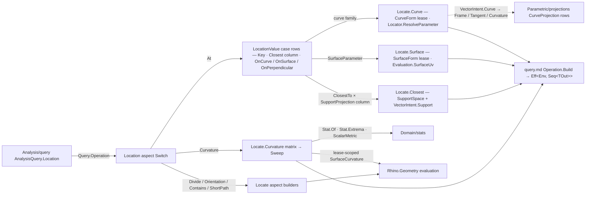

# [RASM_PARAMETRIC_LOCATE]

The curve/surface location algebra — the `Rasm.Analysis` measured-query family that answers WHERE on a parametric geometry and WHAT lives there: `Locator` (the addressing algebra: curve parameter, arc length, normalized arc-length station, surface UV, closest-to-probe, perpendicular parameter sets), `LocationValue` (the value algebra: point, frame, normal, tangent, curvature, derivative, parameter, length), `Division` (by-count/by-length subdivision), `CurvatureMode` + `CurvatureAggregation` (the curvature sweep: raw samples, per-metric scalars, Welford `Stat` summaries, tolerance-banded extrema), and the `Location` aspect union folding all of it to one `Operation<TGeometry, TOut>` the `Analysis/query` runtime executes under `Eff<Env, Seq<TOut>>`. `AnalysisQuery.Location(Location)` is the routing fence: the query union's `LocationCase` calls `Query.Operation<TGeometry, TOut>()` and nothing else — this page owns everything behind that call. The page sits in the `Parametric` folder with its domain (parameter-addressed evaluation) while its namespace stays the frozen `Rasm.Analysis` contract axis.

The structural law is the (value × locator) matrix as CASE-OWNED rows: each `LocationValue` case declares its curve-family arm, surface-family arm, closest-projection column (a `Spatial/support` `SupportProjection` row — the closest modality is table data, not code), and perpendicular arm — a flat central tuple mega-switch over the matrix is the killed shape, and adding a value case is one case with its columns, every consumer untouched. `Locator` owns its own parameter resolution (`ResolveParameter`) and its own requirement derivation (`CurveRequirement`), so addressing policy travels with the address. The operation spine is the page-local `Locate` static owner — the `Analyze` facade stays the `Analysis/query` page's, and spreading location builders across a corpus-wide partial class is the killed shape. Curve-frame/tangent/curvature evaluation delegates to the `Parametric/projections` `CurveProjection` rows through the `Processing/intent` rail; surface evaluation composes the `Domain/evaluation` `NormalAt`/`FrameAt`/`SurfaceUv`/`SurfaceSampleUv`/`CurveSampleParameters` lattice; coercion rides the `Domain/normalization` `CurveForm`/`SurfaceForm` leases; statistics ride `Domain/stats` (`Stat.Of` Welford, `Stat.Extrema` tolerance-banded, `ScalarMetric`, `StatContext`, `ExtremumDirection`); every scalar-projecting `SurfaceCurvature` read runs inside a `Lease` scope with the `IsSet` gate inside the lease, and the two bundle-valued rows transfer disposal to the caller on success — a refused or unset bundle, or an acquired batch that fails the gate, is disposed in full before the fault leaves.

## [01]-[INDEX]

- [02]-[LOCATION]: the vocabulary — `Locator` addressing (+ case-owned parameter resolution and requirement derivation), `LocationValue` value rows (+ the three family arms and the closest column), `Division`, `CurvatureMode`, `CurvatureAggregation`, and the `Location` aspect union with its `Operation<TGeometry, TOut>()` fold.
- [03]-[OPERATIONS]: the `Locate` spine — the one `Admits` capability gate, the curve/surface/closest/perpendicular/divide/orientation/contains/short-path builders over `Operation.Build`, and the curvature sweep (sample folds, lease-scoped bundle reads, `Stat`/`Extrema` aggregation, the merged output-projection arms).

## [02]-[LOCATION]

- Owner: `Locator` `[Union]` — `CurveParameter(double T)` / `ArcLength(double Distance)` / `NormalizedLength(double S)` / `SurfaceParameter(Point2d Uv)` / `ClosestTo(Point3d Probe)` / `PerpendicularParameters(Seq<double> Ts)`; `NormalizedMid` survives as the `NormalizedLength(0.5)` factory spelling — the parameterless mid case was the weaker owner, and the whole arc-length-normalized station family is one payload. The addressing algebra carries its own behavior: `ResolveParameter(Curve, Context, Op)` resolves the three curve addresses to a parameter (`Domain.IncludesParameter` gate; unit-interval admission then `Curve.NormalizedLengthParameter(s: S, ...)`; `Curve.LengthParameter(segmentLength, ...)` — both under `Context.Fractional`), and `CurveRequirement` derives the readiness gate (`Requirement.CurveLength` for the two length-driven addresses, `Requirement.Basic` otherwise) so requirement policy is a locator column, never a per-arm literal.
- Owner: `LocationValue` `[Union]` — `Point` / `Frame` / `Normal` / `Tangent` / `Curvature` / `Derivative(int Order)` / `Parameter` / `Length` (static factories preserve the vocabulary spelling). Each case is a ROW of the (value × locator) matrix: an `Op Key` column (`nameof`-derived, one operation identity per value), an `Option<SupportProjection>` closest column (`Point`→`Closest`, `Frame`→`Frame`, `Normal`→`Normal`, `Tangent`→`Tangent`, `Parameter`→`Parameter`; the rest `None`), and virtual `OnCurve`/`OnSurface`/`OnPerpendicular` arms defaulting to `Unsupported` — `Resolve<TGeometry, TOut>(Locator)` folds the locator FAMILY to the owning arm in four arms, the curve family riding the default route because `Locator` is closed and every non-curve case peels off above it. Curve arms delegate frame/tangent/curvature to `VectorIntent.Curve(source, parameter, mode: CurveProjection.Frame|Tangent|Curvature, key)` — the `Parametric/projections` rows, never a second evaluation path; surface arms compose `Evaluation.FrameAt`/`NormalAt`/`Surface.PointAt`/`Surface.CurvatureAt`; `Length` measures `Curve.GetLength` from `Domain.T0` to the resolved parameter uniformly across all three curve addresses; `Parameter` surfaces the resolved address itself (the arc-length→parameter and normalized-station→parameter conversions the resolution already computes — discarding them was the mature dead cell); `Derivative` gates `Order >= 0` at the arm and indexes `Curve.DerivativeAt(t, derivativeCount)`.
- Owner: `Division` `[Union]` — `ByCount(int)` / `ByLength(double)` with `Operation<TGeometry, TOut>()` validating at the fold (`Count <= 0`, non-finite or sub-tolerance `Length` → `Reject`) and lowering to `Curve.DivideByCount(segmentCount, includeEnds: true, out points)` / `Curve.DivideByLength(segmentLength, includeEnds: true, out points)`; `ByLength` carries `Requirement.CurveLength`.
- Owner: `CurvatureMode` `[Union]` — `Vector` / `Scalar(ScalarMetric)` with the two derivation columns the sweep reads: `IsCurveMagnitude` (vector mode or magnitude metric) and `SurfaceMetrics` (vector mode → `Seq(Gaussian, Mean)`, a surface scalar → its singleton). `CurvatureAggregation` `[Union]` — `Samples` / `Extrema(ExtremumDirection Direction, double Band)` with the `Key` column selecting the operation identity; `Band` parameterizes the `Stat.Extrema` tolerance band (the sweep's exact-extremum default is band `0.0`, and a plateau sweep widens it — a policy value, not a second fold).
- Owner: `Location` `[Union]` — the aspect the query routes: `At(Locator, LocationValue)` / `Curvature(Count, Mode, Aggregation)` / `Divide(Division)` / `Orientation(Plane)` / `Contains(Point3d, Plane)` / `ShortPath(Point2d, Point2d)`. Factories keep the full public spelling (`At`/`Curvature`/`CurvatureExtrema`/`DivideByCount`/`DivideByLength`/`Orientation`/`Contains`/`ShortPath`); twin sample/extrema aspect cases collapse to ONE `CurvatureCase` discriminated by `CurvatureAggregation` — aggregation is a value, not a sibling case.
- Entry: `internal Operation<TGeometry, TOut> Operation<TGeometry, TOut>()` — the generated `Switch` fold from aspect to operation: `At` → `Value.Resolve(Locator)`, `Curvature` → `Locate.Curvature`, `Divide` → `Division.Operation`, and the three curve/surface aspects → their `Locate` builders. `AnalysisQuery.Location(Location)` is the ONLY public route in; no aspect exposes a second executable surface.
- Receipt: none minted here — the typed value sequence IS the result (`Point3d`/`Plane`/`Vector3d`/`SurfaceCurvature`/`double`/`Stat`/`CurveOrientation`/`PointContainment`/`Curve` rows), `Stat` is the `Domain/stats` summary carrier, and refusals ride the `Op` fault taxonomy: `Reject` for admission-invalid requests (non-positive counts, degenerate lengths, negative derivative order), `Unsupported` for impossible (value, locator, geometry, output) combinations, `InvalidResult` for host-evaluation refusals (`PointContainment.Unset`, a failed `ShortPath`).
- Growth: a new value (an `Osculating` circle at a parameter, a `Torsion` scalar) is one `LocationValue` case with its arms and columns; a new address (a domain-normalized `NormalizedParameter(double)` locator — distinct from the arc-length-normalized `NormalizedLength` already landed) is one `Locator` case plus its `ResolveParameter` arm — the curve family rides `Resolve`'s default route, so the fold stays untouched; a non-curve address adds its own `Resolve` arm; a new aggregation (an `Inflections` zero-crossing report) is one `CurvatureAggregation` case read by the sweep; a new aspect is one `Location` case plus one `Switch` arm. Zero new entrypoints, zero new runtimes.
- Boundary: this owner is Rhino-parametric ANALYSIS altitude — it measures live `Curve`/`Surface` geometry through RhinoCommon evaluation under the `Analysis` runtime, and the host-neutral vendored-NURBS `Parametric/curve` owner carries the same parametric concept for the non-Rhino runtime (division, closest-point, arc-length live in BOTH by decision — the split is runtime, they meet at the wire); the (value × locator) matrix lives in the value cases and a resurrected central tuple-switch over the matrix is the named collapse-regression; closest-point addressing composes `SupportSpace.Of` + `VectorIntent.Support` + the `SupportProjection` column — a locator-local closest-point implementation is the named parallel-rail defect; coercion is always the `CurveForm`/`SurfaceForm` LEASE (a `BrepEdge` yields an owned duplicate the lease disposes; a live `Curve` passes borrowed) and a raw cast beside the lease is the named ownership leak; `SurfaceCurvature` bundles are lease-read everywhere except the two rows whose OUTPUT is the bundle (`Curvature` at a surface UV; the sweep's vector mode) — there disposal transfers to the caller by contract, stated on each row, and the refusal path still disposes (an unset bundle or a failed batch never escapes); curve value arms route through the `CurveProjection` rows because row semantics (tiny-vector gates, magnitude admission, frame choice) live there, while surface point/frame/normal arms compose the `Domain/evaluation` floor DIRECTLY — the operation has already normalized the UV, so re-entering `SurfaceProjection.Project` would re-admit and re-normalize (the double-validation defect); the floor is the one derivation site, so the direct read is composition, never a parallel rail.

## [03]-[OPERATIONS]

- Owner: `Locate` `internal static class` — the location operation spine. `Admits<TGeometry, TOut, TNative, TValue>()` is the ONE capability gate (native-form coercibility of `TGeometry` via the `Domain/normalization` `Capability.CurveForm`/`Capability.SurfaceForm` rows or assignability, AND `TOut == TValue`); `Curve`/`Surface` are the two family builders threading `Op`-keyed state through `Operation<TGeometry, TValue>.Build` — coerce the lease, resolve the address (`Locator.ResolveParameter` / `Evaluation.SurfaceUv`), project under the runtime `Context`, re-key through `As<TGeometry, TOut>`; `Closest` composes the support rail; `Perpendicular` orders and dedups parameters into `Curve.GetPerpendicularFrames`; `Divide`/`Orientation` (`Curve.ClosedCurveOrientation`)/`Contains` (`Curve.Contains(testPoint, plane, tolerance)`, context-required, `Unset` → fail)/`ShortPath` (`Surface.ShortPath(uvStart, uvEnd, tolerance)` over two normalized UVs) each lower one aspect.
- Owner: the curvature sweep — `Curvature<TGeometry, TOut>(count, mode, aggregation)` resolves the native family once, then folds the (mode, aggregation, output) matrix over ONE shared `Sweep` builder (lease the native form, sample `count` stations via `Evaluation.CurveSampleParameters`/`SurfaceSampleUv`, project): curve rows — curvature vectors, magnitudes, magnitude `Stat`, banded extrema; surface rows — raw `SurfaceCurvature` bundles, per-metric scalars, per-metric `Stat` set (one sampling pass, metrics transposed from lease-scoped bundle rows — the double-sample per metric is dead), banded extrema. `ExtremaOf<TOut>` merges the four old extrema arms into one output-projected fold over `Stat.Extrema` hits (`Point3d` → station points, `double` → extremal values); `CurvatureSample(Point3d, double)` is the private station carrier on the `Domain/rails` validity fold — every station fold drains through the acceptance oracle, so a degenerate host evaluation faults the sweep instead of feeding the extrema, and the bundle-valued path disposes an acquired batch in full on the refusal route.
- Boundary: the output-type gates (`typeof(TOut) == typeof(...)` inside `Admits`, the sweep matrix, `ExtremaOf`) are COMPILE-SHAPE capability gates on a generic operation — the legitimate generic-dispatch idiom this runtime altitude requires — never the runtime raw→typed projection dispatch, which stays the `Numerics/atoms` `ProjectionRow` rail's; `Sweep` is the one native-sampling builder and a per-row bespoke `Operation.Build` for a new sweep output is the named spam this fold absorbs; requirement values (`CurveLength`/`SurfaceEvaluation`/`Basic`) always arrive from locator columns or family builders, never inline per arm.

```csharp signature
// --- [RUNTIME_PRELUDE] ----------------------------------------------------------------------
// Rhino.Geometry, the LanguageExt prelude, and Thinktecture arrive as global usings; Rasm.Domain, Rasm.Processing, and Rasm.Spatial do not.

using Rasm.Domain;
using Rasm.Processing;
using Rasm.Spatial;

namespace Rasm.Parametric;

// --- [TYPES] --------------------------------------------------------------------------------
[Union]
public abstract partial record Locator {
    private Locator() { }
    public sealed record CurveParameter(double T) : Locator;
    public sealed record ArcLength(double Distance) : Locator;
    public sealed record NormalizedLength(double S) : Locator;
    public sealed record SurfaceParameter(Point2d Uv) : Locator;
    public sealed record ClosestTo(Point3d Probe) : Locator;
    public sealed record PerpendicularParameters(Seq<double> Ts) : Locator;

    // The mature NormalizedMid vocabulary is the 0.5 station of the generalized arc-length-normalized address.
    public static Locator NormalizedMid => new NormalizedLength(S: 0.5);

    // Addressing policy travels with the address: requirement derivation + parameter resolution are locator columns.
    internal Requirement CurveRequirement => this switch { ArcLength or NormalizedLength => Requirement.CurveLength, _ => Requirement.Basic };
    internal Fin<double> ResolveParameter(Curve curve, Context context, Op key) => this switch {
        CurveParameter { T: double t } => guard(curve.Domain.IncludesParameter(t: t), key.InvalidInput()).ToFin().Map(_ => t),
        NormalizedLength { S: double s } => guard(double.IsFinite(s) && s is >= 0.0 and <= 1.0, key.InvalidInput()).ToFin()
            .Bind(_ => guard(curve.NormalizedLengthParameter(s: s, t: out double t, fractionalTolerance: context.Fractional), key.InvalidResult()).ToFin().Map(_ => t)),
        ArcLength { Distance: double distance } => guard(curve.LengthParameter(segmentLength: distance, t: out double t, fractionalTolerance: context.Fractional), key.InvalidResult()).ToFin().Map(_ => t),
        _ => Fin.Fail<double>(key.InvalidInput()),
    };
}

[Union]
public abstract partial record LocationValue {
    private LocationValue() { }
    public sealed record PointCase : LocationValue {
        internal override Op Key => LocationKeys.PointAt;
        internal override Option<SupportProjection> Closest => Some(SupportProjection.Closest);
        internal override Operation<TGeometry, TOut> OnCurve<TGeometry, TOut>(Locator locator) =>
            Locate.Curve<TGeometry, TOut, Point3d>(key: LocationKeys.PointAt, locator: locator, project: static (key, curve, t, _) => key.Accept(value: curve.PointAt(t: t)));
        internal override Operation<TGeometry, TOut> OnSurface<TGeometry, TOut>(Point2d uv) =>
            Locate.Surface<TGeometry, TOut, Point3d>(key: LocationKeys.PointAt, uv: uv, project: static (key, surface, p) => key.Accept(value: surface.PointAt(u: p.X, v: p.Y)));
    }
    public sealed record FrameCase : LocationValue {
        internal override Op Key => LocationKeys.FrameAt;
        internal override Option<SupportProjection> Closest => Some(SupportProjection.Frame);
        internal override Operation<TGeometry, TOut> OnCurve<TGeometry, TOut>(Locator locator) =>
            Locate.Curve<TGeometry, TOut, Plane>(key: LocationKeys.FrameAt, locator: locator, project: static (key, curve, t, context) =>
                VectorIntent.Curve(source: curve, parameter: t, mode: CurveProjection.Frame, key: key)
                    .Bind(intent => intent.Project<Plane>(context: context, key: key))
                    .Bind(plane => key.Accept(value: plane)));
        internal override Operation<TGeometry, TOut> OnSurface<TGeometry, TOut>(Point2d uv) =>
            Locate.Surface<TGeometry, TOut, Plane>(key: LocationKeys.FrameAt, uv: uv, project: static (key, surface, p) =>
                Evaluation.FrameAt(surface: surface, uv: p, key: key).Bind(frame => key.Accept(value: frame)));
        internal override Operation<TGeometry, TOut> OnPerpendicular<TGeometry, TOut>(Seq<double> parameters) =>
            Locate.Perpendicular<TGeometry, TOut>(key: LocationKeys.PerpendicularFrameAt, parameters: parameters);
    }
    public sealed record NormalCase : LocationValue {
        internal override Op Key => LocationKeys.NormalAt;
        internal override Option<SupportProjection> Closest => Some(SupportProjection.Normal);
        internal override Operation<TGeometry, TOut> OnSurface<TGeometry, TOut>(Point2d uv) =>
            Locate.Surface<TGeometry, TOut, Vector3d>(key: LocationKeys.NormalAt, uv: uv, project: static (key, surface, p) =>
                Evaluation.NormalAt(surface: surface, uv: p, key: key).Bind(normal => key.Accept(value: normal)));
    }
    public sealed record TangentCase : LocationValue {
        internal override Op Key => LocationKeys.TangentAt;
        internal override Option<SupportProjection> Closest => Some(SupportProjection.Tangent);
        internal override Operation<TGeometry, TOut> OnCurve<TGeometry, TOut>(Locator locator) =>
            Locate.Curve<TGeometry, TOut, Vector3d>(key: LocationKeys.TangentAt, locator: locator, project: static (key, curve, t, context) =>
                VectorIntent.Curve(source: curve, parameter: t, mode: CurveProjection.Tangent, key: key)
                    .Bind(intent => intent.Project<Vector3d>(context: context, key: key))
                    .Bind(tangent => key.Accept(value: tangent)));
    }
    public sealed record CurvatureCase : LocationValue {
        internal override Op Key => LocationKeys.CurvatureAt;
        internal override Operation<TGeometry, TOut> OnCurve<TGeometry, TOut>(Locator locator) =>
            Locate.Curve<TGeometry, TOut, Vector3d>(key: LocationKeys.CurvatureAt, locator: locator, project: static (key, curve, t, context) =>
                VectorIntent.Curve(source: curve, parameter: t, mode: CurveProjection.Curvature, key: key)
                    .Bind(intent => intent.Project<Vector3d>(context: context, key: key))
                    .Bind(curvature => key.Accept(value: curvature)));
        // Output IS the disposable bundle: success transfers disposal to the caller; an unset bundle is
        // disposed on the refusal path inside the lease, never leaked and never handed out.
        internal override Operation<TGeometry, TOut> OnSurface<TGeometry, TOut>(Point2d uv) =>
            Locate.Surface<TGeometry, TOut, SurfaceCurvature>(key: LocationKeys.CurvatureAt, uv: uv, project: static (key, surface, p) =>
                Optional(surface.CurvatureAt(u: p.X, v: p.Y)).ToFin(key.InvalidResult())
                    .Bind(bundle => bundle.IsSet
                        ? Fin.Succ(Seq(bundle))
                        : new Lease<SurfaceCurvature>.Owned(Value: bundle).Use(_ => Fin.Fail<Seq<SurfaceCurvature>>(key.InvalidResult()))));
    }
    public sealed record DerivativeCase(int Order) : LocationValue {
        internal override Op Key => LocationKeys.DerivativeAt;
        internal override Operation<TGeometry, TOut> OnCurve<TGeometry, TOut>(Locator locator) =>
            Order < 0
                ? Operation<TGeometry, TOut>.Reject(key: LocationKeys.DerivativeAt, fault: LocationKeys.DerivativeAt.InvalidInput())
                : Locate.Curve<TGeometry, TOut, Vector3d>(key: LocationKeys.DerivativeAt, locator: locator, project: (key, curve, t, _) =>
                    Optional(curve.DerivativeAt(t: t, derivativeCount: Order)).Filter(derivatives => Order < derivatives.Length)
                        .ToFin(key.InvalidResult())
                        .Bind(derivatives => key.Accept(value: derivatives[Order])));
    }
    public sealed record ParameterCase : LocationValue {
        internal override Op Key => LocationKeys.ParameterAt;
        internal override Option<SupportProjection> Closest => Some(SupportProjection.Parameter);
        // The resolved address IS the value: At(ArcLength(d), Parameter) answers the arc-length→parameter query
        // the resolution already computes — the mature matrix discarded it as a dead cell.
        internal override Operation<TGeometry, TOut> OnCurve<TGeometry, TOut>(Locator locator) =>
            Locate.Curve<TGeometry, TOut, double>(key: LocationKeys.ParameterAt, locator: locator, project: static (key, _, t, _) => key.Accept(value: t));
    }
    public sealed record LengthCase : LocationValue {
        internal override Op Key => LocationKeys.LengthAt;
        internal override Operation<TGeometry, TOut> OnCurve<TGeometry, TOut>(Locator locator) =>
            Locate.Curve<TGeometry, TOut, double>(key: LocationKeys.LengthAt, locator: locator, requirement: Requirement.CurveLength, project: static (key, curve, t, context) =>
                curve.GetLength(fractionalTolerance: context.Fractional, subdomain: new Interval(t0: curve.Domain.T0, t1: t)) switch {
                    // Host-read scalar: IsValidDouble screens the unset sentinel — the host-scalar law projections.md states.
                    double length when RhinoMath.IsValidDouble(x: length) && length >= 0.0 => key.Accept(value: length),
                    _ => Fin.Fail<Seq<double>>(key.InvalidResult()),
                });
    }

    public static LocationValue Point => new PointCase();
    public static LocationValue Frame => new FrameCase();
    public static LocationValue Normal => new NormalCase();
    public static LocationValue Tangent => new TangentCase();
    public static LocationValue Curvature => new CurvatureCase();
    public static LocationValue Derivative(int order) => new DerivativeCase(Order: order);
    public static LocationValue Parameter => new ParameterCase();
    public static LocationValue Length => new LengthCase();

    // The (value × locator) matrix: rows live on the cases, the fold discriminates only the locator FAMILY.
    internal abstract Op Key { get; }
    internal virtual Option<SupportProjection> Closest => None;
    internal virtual Operation<TGeometry, TOut> OnCurve<TGeometry, TOut>(Locator locator) where TGeometry : notnull => Key.Unsupported<TGeometry, TOut>();
    internal virtual Operation<TGeometry, TOut> OnSurface<TGeometry, TOut>(Point2d uv) where TGeometry : notnull => Key.Unsupported<TGeometry, TOut>();
    internal virtual Operation<TGeometry, TOut> OnPerpendicular<TGeometry, TOut>(Seq<double> parameters) where TGeometry : notnull => Key.Unsupported<TGeometry, TOut>();
    internal Operation<TGeometry, TOut> Resolve<TGeometry, TOut>(Locator locator) where TGeometry : notnull => locator switch {
        Locator.SurfaceParameter sp => OnSurface<TGeometry, TOut>(uv: sp.Uv),
        Locator.ClosestTo ct => Closest.Match(
            Some: projection => Locate.Closest<TGeometry, TOut>(key: Key, target: ct.Probe, projection: projection),
            None: () => Key.Unsupported<TGeometry, TOut>()),
        Locator.PerpendicularParameters ps => OnPerpendicular<TGeometry, TOut>(parameters: ps.Ts),
        // Curve family rides the default: Locator is closed and every non-curve case peels above, so a new
        // curve address is one ResolveParameter arm with this fold untouched; a non-curve address adds its arm HERE.
        _ => OnCurve<TGeometry, TOut>(locator: locator),
    };
}

[Union]
public abstract partial record Division {
    private Division() { }
    public sealed record ByCount(int Count) : Division;
    public sealed record ByLength(double Length) : Division;
    internal Operation<TGeometry, TOut> Operation<TGeometry, TOut>() where TGeometry : notnull => this switch {
        ByCount { Count: <= 0 } => Analysis.Operation<TGeometry, TOut>.Reject(key: LocationKeys.Divide, fault: LocationKeys.Divide.InvalidInput()),
        ByLength { Length: double length } when !double.IsFinite(length) || length <= RhinoMath.ZeroTolerance =>
            Analysis.Operation<TGeometry, TOut>.Reject(key: LocationKeys.Divide, fault: LocationKeys.Divide.InvalidInput()),
        ByCount bc => Locate.Divide<TGeometry, TOut>(key: LocationKeys.Divide, requirement: null,
            divide: curve => curve.DivideByCount(segmentCount: bc.Count, includeEnds: true, points: out Point3d[] points) switch { double[] => Optional(points), _ => Option<Point3d[]>.None }),
        ByLength bl => Locate.Divide<TGeometry, TOut>(key: LocationKeys.Divide, requirement: Requirement.CurveLength,
            divide: curve => curve.DivideByLength(segmentLength: bl.Length, includeEnds: true, points: out Point3d[] points) switch { double[] => Optional(points), _ => Option<Point3d[]>.None }),
        _ => Analysis.Operation<TGeometry, TOut>.Reject(key: LocationKeys.Divide, fault: LocationKeys.Divide.InvalidInput()),
    };
}

[Union]
public abstract partial record CurvatureMode {
    private CurvatureMode() { }
    public sealed record VectorCase : CurvatureMode;
    public sealed record ScalarCase(ScalarMetric Metric) : CurvatureMode;
    public static CurvatureMode Vector => new VectorCase();
    public static CurvatureMode Scalar(ScalarMetric metric) => new ScalarCase(Metric: metric);
    // Row-identity folds over the stats.md vocabulary: the metric rows carry payload-shaped Of arms, not classification columns.
    internal bool IsCurveMagnitude => this switch { VectorCase => true, ScalarCase { Metric: ScalarMetric metric } => metric.Equals(ScalarMetric.Magnitude), _ => false };
    internal Seq<ScalarMetric> SurfaceMetrics => this switch {
        VectorCase => Seq(ScalarMetric.Gaussian, ScalarMetric.Mean),
        ScalarCase { Metric: ScalarMetric metric } when metric.Equals(ScalarMetric.Gaussian) || metric.Equals(ScalarMetric.Mean) => Seq(metric),
        _ => Seq<ScalarMetric>(),
    };
}

[Union]
public abstract partial record CurvatureAggregation {
    private CurvatureAggregation() { }
    public sealed record SamplesCase : CurvatureAggregation;
    public sealed record ExtremaCase(ExtremumDirection Direction, double Band) : CurvatureAggregation;
    public static readonly CurvatureAggregation Samples = new SamplesCase();
    public static CurvatureAggregation Extrema(ExtremumDirection direction, double band = 0.0) => new ExtremaCase(Direction: direction, Band: band);
    internal Op Key => this switch { ExtremaCase => LocationKeys.CurvatureExtrema, _ => LocationKeys.Curvature };
}

[Union]
public abstract partial record Location {
    private Location() { }
    public sealed record AtCase(Locator Locator, LocationValue Value) : Location;
    public sealed record CurvatureCase(int Count, CurvatureMode Mode, CurvatureAggregation Aggregation) : Location;
    public sealed record DivideCase(Division By) : Location;
    public sealed record OrientationCase(Plane Plane) : Location;
    public sealed record ContainsCase(Point3d Probe, Plane Frame) : Location;
    public sealed record ShortPathCase(Point2d Start, Point2d End) : Location;

    public static Location At(Locator at, LocationValue value) => new AtCase(Locator: at, Value: value);
    public static Location Curvature(int count, CurvatureMode mode) => new CurvatureCase(Count: count, Mode: mode, Aggregation: CurvatureAggregation.Samples);
    public static Location CurvatureExtrema(int count, CurvatureMode mode, ExtremumDirection direction, double band = 0.0) =>
        new CurvatureCase(Count: count, Mode: mode, Aggregation: CurvatureAggregation.Extrema(direction: direction, band: band));
    public static Location DivideByCount(int count) => new DivideCase(By: new Division.ByCount(Count: count));
    public static Location DivideByLength(double length) => new DivideCase(By: new Division.ByLength(Length: length));
    public static Location Orientation(Plane plane) => new OrientationCase(Plane: plane);
    public static Location Contains(Point3d point, Plane plane) => new ContainsCase(Probe: point, Frame: plane);
    public static Location ShortPath(Point2d start, Point2d end) => new ShortPathCase(Start: start, End: end);

    internal Operation<TGeometry, TOut> Operation<TGeometry, TOut>() where TGeometry : notnull => Switch(
        atCase: static at => at.Value.Resolve<TGeometry, TOut>(locator: at.Locator),
        curvatureCase: static c => Locate.Curvature<TGeometry, TOut>(count: c.Count, mode: c.Mode, aggregation: c.Aggregation),
        divideCase: static d => d.By.Operation<TGeometry, TOut>(),
        orientationCase: static o => Locate.Orientation<TGeometry, TOut>(frame: o.Plane),
        containsCase: static c => Locate.Contains<TGeometry, TOut>(probe: c.Probe, frame: c.Frame),
        shortPathCase: static sp => Locate.ShortPath<TGeometry, TOut>(start: sp.Start, end: sp.End));
}

// --- [OPERATIONS] ---------------------------------------------------------------------------
// The one nameof-derived operation-key table; per-arm Op literals are the named defect.
internal static class LocationKeys {
    internal static readonly Op PointAt = Op.Of(name: nameof(PointAt));
    internal static readonly Op FrameAt = Op.Of(name: nameof(FrameAt));
    internal static readonly Op PerpendicularFrameAt = Op.Of(name: nameof(PerpendicularFrameAt));
    internal static readonly Op NormalAt = Op.Of(name: nameof(NormalAt));
    internal static readonly Op TangentAt = Op.Of(name: nameof(TangentAt));
    internal static readonly Op CurvatureAt = Op.Of(name: nameof(CurvatureAt));
    internal static readonly Op DerivativeAt = Op.Of(name: nameof(DerivativeAt));
    internal static readonly Op ParameterAt = Op.Of(name: nameof(ParameterAt));
    internal static readonly Op LengthAt = Op.Of(name: nameof(LengthAt));
    internal static readonly Op Divide = Op.Of(name: nameof(Divide));
    internal static readonly Op Orientation = Op.Of(name: nameof(Orientation));
    internal static readonly Op Contains = Op.Of(name: nameof(Contains));
    internal static readonly Op ShortPath = Op.Of(name: nameof(ShortPath));
    internal static readonly Op Curvature = Op.Of(name: nameof(Curvature));
    internal static readonly Op CurvatureExtrema = Op.Of(name: nameof(CurvatureExtrema));
}

internal static class Locate {
    // The ONE capability gate: native-form coercibility of TGeometry AND output-type fit.
    private static bool Admits<TGeometry, TOut, TNative, TValue>() =>
        ((typeof(TNative) == typeof(Curve) && Capability.CurveForm.Admits(type: typeof(TGeometry)))
            || (typeof(TNative) == typeof(Surface) && Capability.SurfaceForm.Admits(type: typeof(TGeometry)))
            || typeof(TNative).IsAssignableFrom(c: typeof(TGeometry))
            || typeof(TGeometry) == typeof(object)
            || typeof(TGeometry) == typeof(GeometryBase)) && typeof(TOut) == typeof(TValue);

    internal static Operation<TGeometry, TOut> Curve<TGeometry, TOut, TValue>(Op key, Locator locator, Func<Op, Curve, double, Context, Fin<Seq<TValue>>> project, Requirement? requirement = null) where TGeometry : notnull =>
        Admits<TGeometry, TOut, Curve, TValue>()
            ? Operation<TGeometry, TValue>.Build(
                key: key, requirement: requirement ?? locator.CurveRequirement, state: (Key: key, Locator: locator, Project: project),
                evaluator: static (state, geometry) =>
                    from context in Env.Asks
                    from result in Normalization.CurveForm(source: geometry, key: state.Key)
                        .Bind(lease => lease.Use(curve => state.Locator.ResolveParameter(curve: curve, context: context, key: state.Key)
                            .Bind(parameter => state.Project(state.Key, curve, parameter, context)))).ToEff()
                    select result).As<TGeometry, TOut>(key: key)
            : key.Unsupported<TGeometry, TOut>();

    internal static Operation<TGeometry, TOut> Surface<TGeometry, TOut, TValue>(Op key, Point2d uv, Func<Op, Surface, Point2d, Fin<Seq<TValue>>> project) where TGeometry : notnull =>
        Admits<TGeometry, TOut, Surface, TValue>()
            ? Operation<TGeometry, TValue>.Build(
                key: key, requirement: Requirement.SurfaceEvaluation, state: (Key: key, Uv: uv, Project: project),
                evaluator: static (state, geometry) =>
                    from context in Env.Asks
                    from result in Normalization.SurfaceForm(source: geometry, key: state.Key)
                        .Bind(lease => lease.Use(surface => Evaluation.SurfaceUv(surface: surface, uv: state.Uv, context: context, key: state.Key)
                            .Bind(parameter => state.Project(state.Key, surface, parameter)))).ToEff()
                    select result).As<TGeometry, TOut>(key: key)
            : key.Unsupported<TGeometry, TOut>();

    internal static Operation<TGeometry, TOut> Closest<TGeometry, TOut>(Op key, Point3d target, SupportProjection projection) where TGeometry : notnull =>
        (target.IsValid, Capability.Closest.Admits(type: typeof(TGeometry))) switch {
            (false, _) => Operation<TGeometry, TOut>.Reject(key: key, fault: key.InvalidInput()),
            (true, true) => Operation<TGeometry, TOut>.Build(
                key: key, state: (Key: key, Target: target, Projection: projection),
                evaluator: static (state, geometry) =>
                    from context in Env.Asks
                    from space in SupportSpace.Of(value: geometry, key: state.Key).ToEff()
                    from intent in VectorIntent.Support(space: space, sample: state.Target, projection: state.Projection, key: state.Key).ToEff()
                    from result in intent.Project<TOut>(context: context, key: state.Key).Map(static value => Seq(value)).ToEff()
                    select result),
            _ => key.Unsupported<TGeometry, TOut>(),
        };

    internal static Operation<TGeometry, TOut> Perpendicular<TGeometry, TOut>(Op key, Seq<double> parameters) where TGeometry : notnull =>
        Admits<TGeometry, TOut, Curve, Plane>()
            ? Operation<TGeometry, Plane>.Build(
                key: key, requirement: Requirement.CurveLength, state: (Key: key, Parameters: parameters),
                evaluator: static (state, geometry) => Normalization.CurveForm(source: geometry, key: state.Key)
                    .Bind(lease => lease.Use(curve => Optional(curve.GetPerpendicularFrames(state.Parameters.Distinct().Order()))
                        .ToFin(state.Key.InvalidResult())
                        .Bind(planes => state.Key.Accept(values: planes)))).ToEff()).As<TGeometry, TOut>(key: key)
            : key.Unsupported<TGeometry, TOut>();

    internal static Operation<TGeometry, TOut> Divide<TGeometry, TOut>(Op key, Requirement? requirement, Func<Curve, Option<Point3d[]>> divide) where TGeometry : notnull =>
        Admits<TGeometry, TOut, Curve, Point3d>()
            ? Operation<TGeometry, Point3d>.Build(
                key: key, requirement: requirement, state: (Key: key, Divide: divide),
                evaluator: static (state, geometry) => Normalization.CurveForm(source: geometry, key: state.Key)
                    .Bind(lease => lease.Use(curve => state.Divide(arg: curve).ToFin(state.Key.InvalidResult()).Bind(points => state.Key.Accept(values: points)))).ToEff()).As<TGeometry, TOut>(key: key)
            : key.Unsupported<TGeometry, TOut>();

    internal static Operation<TGeometry, TOut> Orientation<TGeometry, TOut>(Plane frame) where TGeometry : notnull =>
        Admits<TGeometry, TOut, Curve, CurveOrientation>()
            ? Operation<TGeometry, CurveOrientation>.Build(
                key: LocationKeys.Orientation, state: (Key: LocationKeys.Orientation, Frame: frame),
                evaluator: static (state, geometry) => Normalization.CurveForm(source: geometry, key: state.Key)
                    .Bind(lease => lease.Use(curve => state.Key.Accept(value: curve.ClosedCurveOrientation(plane: state.Frame)))).ToEff()).As<TGeometry, TOut>(key: LocationKeys.Orientation)
            : LocationKeys.Orientation.Unsupported<TGeometry, TOut>();

    internal static Operation<TGeometry, TOut> Contains<TGeometry, TOut>(Point3d probe, Plane frame) where TGeometry : notnull =>
        Admits<TGeometry, TOut, Curve, PointContainment>()
            ? Operation<TGeometry, PointContainment>.Build(
                key: LocationKeys.Contains, requiresContext: true, state: (Key: LocationKeys.Contains, Probe: probe, Frame: frame),
                evaluator: static (state, geometry) =>
                    from context in Env.Asks
                    from result in Normalization.CurveForm(source: geometry, key: state.Key)
                        .Bind(lease => lease.Use(curve => curve.Contains(testPoint: state.Probe, plane: state.Frame, tolerance: context.Absolute.Value) switch {
                            PointContainment.Unset => Fin.Fail<Seq<PointContainment>>(state.Key.InvalidResult()),
                            PointContainment containment => state.Key.Accept(value: containment),
                        })).ToEff()
                    select result).As<TGeometry, TOut>(key: LocationKeys.Contains)
            : LocationKeys.Contains.Unsupported<TGeometry, TOut>();

    internal static Operation<TGeometry, TOut> ShortPath<TGeometry, TOut>(Point2d start, Point2d end) where TGeometry : notnull =>
        Admits<TGeometry, TOut, Surface, Curve>()
            ? Operation<TGeometry, Curve>.Build(
                key: LocationKeys.ShortPath, requirement: Requirement.SurfaceEvaluation, state: (Key: LocationKeys.ShortPath, Start: start, End: end),
                evaluator: static (state, geometry) =>
                    from context in Env.Asks
                    from result in Normalization.SurfaceForm(source: geometry, key: state.Key)
                        .Bind(lease => lease.Use(surface =>
                            Evaluation.SurfaceUv(surface: surface, uv: state.Start, context: context, key: state.Key)
                                .Bind(uvStart => Evaluation.SurfaceUv(surface: surface, uv: state.End, context: context, key: state.Key)
                                    .Bind(uvEnd => Optional(surface.ShortPath(start: uvStart, end: uvEnd, tolerance: context.Absolute.Value))
                                        .ToFin(state.Key.InvalidResult())
                                        .Map(static path => Seq(path)))))).ToEff()
                    select result).As<TGeometry, TOut>(key: LocationKeys.ShortPath)
            : LocationKeys.ShortPath.Unsupported<TGeometry, TOut>();

    // --- [CURVATURE_SWEEP]
    internal static Operation<TGeometry, TOut> Curvature<TGeometry, TOut>(int count, CurvatureMode mode, CurvatureAggregation aggregation) where TGeometry : notnull {
        Op key = aggregation.Key;
        return (count <= 0, Capability.CurveForm.Admits(type: typeof(TGeometry)), Capability.SurfaceForm.Admits(type: typeof(TGeometry))) switch {
            (true, _, _) => Operation<TGeometry, TOut>.Reject(key: key, fault: key.InvalidInput()),
            (_, true, _) => (mode, aggregation, typeof(TOut)) switch {
                (CurvatureMode.VectorCase, CurvatureAggregation.SamplesCase, Type output) when output == typeof(Vector3d) =>
                    Sweep<TGeometry, TOut, Curve>(key: key, count: count, requirement: Requirement.CurveLength, native: Normalization.CurveForm,
                        project: static (op, curve, n, ctx) => CurveCurvatures(key: op, curve: curve, count: n, context: ctx).Bind(values => op.AcceptResults<Vector3d, TOut>(values: values))),
                (CurvatureMode m, CurvatureAggregation.SamplesCase, Type output) when m.IsCurveMagnitude && output == typeof(double) =>
                    Sweep<TGeometry, TOut, Curve>(key: key, count: count, requirement: Requirement.CurveLength, native: Normalization.CurveForm,
                        project: static (op, curve, n, ctx) => CurveMagnitudes(key: op, curve: curve, count: n, context: ctx).Bind(values => op.AcceptResults<double, TOut>(values: values))),
                (CurvatureMode m, CurvatureAggregation.SamplesCase, Type output) when m.IsCurveMagnitude && output == typeof(Stat) =>
                    Sweep<TGeometry, TOut, Curve>(key: key, count: count, requirement: Requirement.CurveLength, native: Normalization.CurveForm,
                        project: static (op, curve, n, ctx) => CurveMagnitudes(key: op, curve: curve, count: n, context: ctx)
                            .Bind(values => Stat.Of(values: values, key: op, context: StatContext.Metric(metric: ScalarMetric.Magnitude)))
                            .Bind(stat => op.AcceptResults<Stat, TOut>(values: Seq(stat)))),
                (CurvatureMode m, CurvatureAggregation.ExtremaCase extrema, Type output) when m.IsCurveMagnitude && (output == typeof(Point3d) || output == typeof(double)) =>
                    Sweep<TGeometry, TOut, Curve>(key: key, count: count, requirement: Requirement.CurveLength, native: Normalization.CurveForm,
                        project: (op, curve, n, ctx) => CurveSamples(key: op, curve: curve, count: n, context: ctx).Bind(samples => ExtremaOf<TOut>(key: op, samples: samples, extrema: extrema))),
                _ => key.Unsupported<TGeometry, TOut>(),
            },
            (_, _, true) => (mode, aggregation, typeof(TOut)) switch {
                (CurvatureMode.VectorCase, CurvatureAggregation.SamplesCase, Type output) when output == typeof(SurfaceCurvature) =>
                    Sweep<TGeometry, TOut, Surface>(key: key, count: count, requirement: Requirement.SurfaceEvaluation, native: Normalization.SurfaceForm,
                        project: static (op, surface, n, ctx) => SurfaceBundles(key: op, surface: surface, count: n, context: ctx).Bind(values => op.AcceptResults<SurfaceCurvature, TOut>(values: values))),
                (CurvatureMode m, CurvatureAggregation.SamplesCase, Type output) when !m.SurfaceMetrics.IsEmpty && output == typeof(Stat) =>
                    Sweep<TGeometry, TOut, Surface>(key: key, count: count, requirement: Requirement.SurfaceEvaluation, native: Normalization.SurfaceForm,
                        project: (op, surface, n, ctx) => SurfaceStats(key: op, surface: surface, count: n, context: ctx, metrics: m.SurfaceMetrics).Bind(stats => op.AcceptResults<Stat, TOut>(values: stats))),
                (CurvatureMode.ScalarCase { Metric: ScalarMetric metric } scalar, CurvatureAggregation.SamplesCase, Type output) when !scalar.SurfaceMetrics.IsEmpty && output == typeof(double) =>
                    Sweep<TGeometry, TOut, Surface>(key: key, count: count, requirement: Requirement.SurfaceEvaluation, native: Normalization.SurfaceForm,
                        project: (op, surface, n, ctx) => SurfaceScalars(key: op, surface: surface, count: n, context: ctx, metric: metric).Bind(values => op.AcceptResults<double, TOut>(values: values))),
                (CurvatureMode.ScalarCase { Metric: ScalarMetric metric } scalar, CurvatureAggregation.ExtremaCase extrema, Type output) when !scalar.SurfaceMetrics.IsEmpty && (output == typeof(Point3d) || output == typeof(double)) =>
                    Sweep<TGeometry, TOut, Surface>(key: key, count: count, requirement: Requirement.SurfaceEvaluation, native: Normalization.SurfaceForm,
                        project: (op, surface, n, ctx) => SurfaceSamples(key: op, surface: surface, count: n, context: ctx, metric: metric).Bind(samples => ExtremaOf<TOut>(key: op, samples: samples, extrema: extrema))),
                _ => key.Unsupported<TGeometry, TOut>(),
            },
            _ => key.Unsupported<TGeometry, TOut>(),
        };
    }

    private static Operation<TGeometry, TOut> Sweep<TGeometry, TOut, TNative>(Op key, int count, Requirement requirement, Func<object?, Op, Fin<Lease<TNative>>> native, Func<Op, TNative, int, Context, Fin<Seq<TOut>>> project)
        where TGeometry : notnull
        where TNative : class, IDisposable =>
        Operation<TGeometry, TOut>.Build(
            key: key, requirement: requirement, state: (Key: key, Count: count, Native: native, Project: project),
            evaluator: static (state, geometry) =>
                from context in Env.Asks
                from result in state.Native(arg1: geometry, arg2: state.Key)
                    .Bind(lease => lease.Use((State: state, Context: context), static (s, native) => s.State.Project(arg1: s.State.Key, arg2: native, arg3: s.State.Count, arg4: s.Context))).ToEff()
                select result);

    // Station carrier on the rails validity fold: the acceptance oracle gates every sweep station, so a NaN
    // curvature or unset point faults the sweep instead of riding silently into Stat.Extrema.
    [StructLayout(LayoutKind.Auto)]
    private readonly record struct CurvatureSample(Point3d Point, double Curvature) : IValidityEvidence {
        public bool IsValid => ValidityClaim.All(ValidityClaim.Finite(point: Point), ValidityClaim.Nonnegative(value: Curvature));
    }

    private static Fin<Seq<TOut>> ExtremaOf<TOut>(Op key, Seq<CurvatureSample> samples, CurvatureAggregation.ExtremaCase extrema) =>
        Stat.Extrema(items: samples, projection: static sample => sample.Curvature, tolerance: extrema.Band, direction: extrema.Direction) switch {
            Seq<CurvatureSample> hits when typeof(TOut) == typeof(Point3d) => key.AcceptResults<Point3d, TOut>(values: hits.Map(static hit => hit.Point)),
            Seq<CurvatureSample> hits when typeof(TOut) == typeof(double) => key.AcceptResults<double, TOut>(values: hits.Map(static hit => hit.Curvature)),
            _ => Fin.Fail<Seq<TOut>>(key.Unsupported(geometryType: typeof(CurvatureSample), outputType: typeof(TOut))),
        };

    private static Fin<Seq<Vector3d>> CurveCurvatures(Op key, Curve curve, int count, Context context) =>
        Evaluation.CurveSampleParameters(curve: curve, count: count, context: context, key: key)
            .Bind(parameters => key.Accept(values: parameters.Map(t => curve.CurvatureAt(t: t))));
    private static Fin<Seq<double>> CurveMagnitudes(Op key, Curve curve, int count, Context context) =>
        CurveCurvatures(key: key, curve: curve, count: count, context: context).Bind(vectors => vectors.TraverseM(vector => ScalarMetric.Magnitude.Of(value: vector, key: key)).As());
    private static Fin<Seq<CurvatureSample>> CurveSamples(Op key, Curve curve, int count, Context context) =>
        Evaluation.CurveSampleParameters(curve: curve, count: count, context: context, key: key)
            .Bind(parameters => key.Accept(values: parameters.Map(t => new CurvatureSample(Point: curve.PointAt(t: t), Curvature: curve.CurvatureAt(t: t).Length))));

    // Every scalar-projecting bundle read is lease-scoped with the IsSet gate INSIDE the lease — an unset
    // bundle is disposed on the refusal path, never projected (the same shape as projections.md WithCurvature).
    private static Fin<T> WithBundle<T>(Op key, Surface surface, Point2d uv, Func<SurfaceCurvature, Fin<T>> project) =>
        Optional(surface.CurvatureAt(u: uv.X, v: uv.Y)).ToFin(key.InvalidResult())
            .Bind(bundle => new Lease<SurfaceCurvature>.Owned(Value: bundle)
                .Use(scoped => scoped.IsSet ? project(arg: scoped) : Fin.Fail<T>(key.InvalidResult())));
    // Output IS the live bundle seq: acquisition is total (memoized Seq), the IsSet gate runs after, and a
    // refused batch disposes in full before the fault leaves — a TraverseM abort would leak the acquired prefix.
    private static Fin<Seq<SurfaceCurvature>> SurfaceBundles(Op key, Surface surface, int count, Context context) =>
        Evaluation.SurfaceSampleUv(surface: surface, count: count, context: context, key: key)
            .Map(uvs => uvs.Map(uv => surface.CurvatureAt(u: uv.X, v: uv.Y)))
            .Bind(bundles => bundles.ForAll(static bundle => bundle is { IsSet: true })
                ? Fin.Succ(bundles.Map(static bundle => bundle!))
                : bundles.Filter(static bundle => bundle is not null).Iter(static bundle => bundle!.Dispose()) switch {
                    _ => Fin.Fail<Seq<SurfaceCurvature>>(key.InvalidResult()),
                });
    private static Fin<Seq<double>> SurfaceScalars(Op key, Surface surface, int count, Context context, ScalarMetric metric) =>
        Evaluation.SurfaceSampleUv(surface: surface, count: count, context: context, key: key)
            .Bind(uvs => uvs.TraverseM(uv => WithBundle(key: key, surface: surface, uv: uv, project: bundle => metric.Of(value: bundle, key: key))).As());
    private static Fin<Seq<CurvatureSample>> SurfaceSamples(Op key, Surface surface, int count, Context context, ScalarMetric metric) =>
        Evaluation.SurfaceSampleUv(surface: surface, count: count, context: context, key: key)
            .Bind(uvs => uvs.TraverseM(uv => WithBundle(key: key, surface: surface, uv: uv,
                project: bundle => metric.Of(value: bundle, key: key).Map(value => new CurvatureSample(Point: bundle.Point, Curvature: value)))).As())
            .Bind(samples => key.Accept(values: samples));
    // One sampling pass for the multi-metric Stat set: per-station lease-scoped metric rows, then a per-metric transpose.
    private static Fin<Seq<Stat>> SurfaceStats(Op key, Surface surface, int count, Context context, Seq<ScalarMetric> metrics) =>
        Evaluation.SurfaceSampleUv(surface: surface, count: count, context: context, key: key)
            .Bind(uvs => uvs.TraverseM(uv => WithBundle(key: key, surface: surface, uv: uv,
                project: bundle => metrics.TraverseM(metric => metric.Of(value: bundle, key: key)).As().Map(static row => row.ToArray()))).As())
            .Bind(rows => toSeq(Enumerable.Range(start: 0, count: metrics.Count))
                .TraverseM(index => Stat.Of(values: rows.Map(row => row[index]), key: key, context: StatContext.Metric(metric: metrics[index]))).As());
}
```



## [04]-[DENSITY_BAR]

One owner per axis; capability is a case, column, or fold arm, never a sibling surface. `[RAIL]` names the one return rail each owner exposes.

| [INDEX] | [AXIS/CONCERN]        | [OWNER]                | [KIND]                                                                                     | [RAIL]                                          | [CASES] |
| :-----: | :-------------------- | :--------------------- | :------------------------------------------------------------------------------------------ | :----------------------------------------------- | :-----: |
|  [01]   | location aspect       | `Location`             | `[Union]` folded to one operation by generated `Switch`                                    | `Operation<TGeometry,TOut>() → Operation`        |    6    |
|  [02]   | addressing            | `Locator`              | `[Union]` + `ResolveParameter`/`CurveRequirement` columns                                  | `ResolveParameter → Fin<double>`                 |    6    |
|  [03]   | value rows            | `LocationValue`        | `[Union]` — `Key`/`Closest` columns + three family arms per case                           | `Resolve → Operation<TGeometry,TOut>`            |    8    |
|  [04]   | subdivision           | `Division`             | `[Union]` validating at the fold                                                            | `Operation → Operation<TGeometry,TOut>`          |    2    |
|  [05]   | curvature reading     | `CurvatureMode`        | `[Union]` + `IsCurveMagnitude`/`SurfaceMetrics` derivation columns                         | derivation (pure)                                |    2    |
|  [06]   | curvature aggregation | `CurvatureAggregation` | `[Union]` + `Key` column; `Band` policy on the extrema case                                | carrier (read by the sweep)                      |    2    |
|  [07]   | operation spine       | `Locate`               | `internal static` — one `Admits` gate, 8 aspect builders, the `Curvature` matrix over one `Sweep`, 7 sample folds      | `Operation.Build → Eff<Env, Seq<TOut>>`          |    —    |

The vocabulary unions, the case rows, `Resolve`, the `Locate` builders, the curvature matrix, and the sample folds are transcription-complete against the RhinoCommon location surface (`DivideByCount`/`DivideByLength`/`GetPerpendicularFrames`/`NormalizedLengthParameter`/`LengthParameter`/`ClosedCurveOrientation`/`Contains`/`ShortPath`/`DerivativeAt`/`CurvatureAt`/`GetLength`). `Operation<TGeometry,TOut>`/`Env`/`Requirement`/`Op`/`Lease<T>`/`Stat`/`ScalarMetric`/`StatContext`/`ExtremumDirection`/`SupportSpace`/`SupportProjection`/`VectorIntent`/`CurveProjection` and the `Normalization`/`Capability`/`Evaluation` lattices are composed upstream owners, never re-minted here.

## [05]-[RESEARCH]

- [LOCATION_MATRIX] — the (value × locator) matrix is the page's structural thesis: forty-eight combinations, thirty-one supported, and the support pattern is per-VALUE, so the rows live on the `LocationValue` cases and the fold discriminates only the locator family — four arms (surface, closest, perpendicular, the curve family as the default route) replace a flat tuple switch whose every extension touches one central method, and a new curve address never edits the fold at all. The closest family proves the collapse hardest: five values (`Point`/`Frame`/`Normal`/`Tangent`/`Parameter`) differ ONLY in which `SupportProjection` row projects the `ClosestHit`, so the closest modality is one `Option<SupportProjection>` column and one shared `Locate.Closest` builder over `SupportSpace` + `VectorIntent.Support` — the value case contributes data, not code; the mature matrix left `Tangent × ClosestTo` and `Parameter × curve-family` dead even though the projection row and the resolved parameter both already existed, and this shape realizes them as one data cell and one arm. Unsupported combinations fault as `Unsupported` (an impossible request shape), never `InvalidInput` (a malformed value) — the two refusal species stay distinct because the GH binding surfaces them differently.
- [CURVATURE_SWEEP] — the sweep is one sampling spine under a policy matrix: `count` stations resolve through the `Domain/evaluation` samplers (arc-length-uniform curve parameters; area-stratified surface UVs), the native form arrives leased, and the (mode, aggregation, output) matrix selects the projection — raw vectors/bundles for downstream math, magnitude/metric scalars for direct reading, Welford `Stat` for summary (the multi-metric surface path samples ONCE and transposes lease-scoped metric rows — Gaussian and Mean ride the same `CurvatureAt` call), banded `Stat.Extrema` for extremal stations. The `Band` policy on the extrema case exposes the fold's plateau semantics: band `0.0` returns strict extrema, a positive band returns the tolerance-equivalent set — the difference between "the maximum-curvature point" and "the high-curvature region's stations" is one policy value. Stations are evidence: `CurvatureSample` implements the `rails.md` validity fold and every sample fold drains through the acceptance oracle, so a NaN curvature or unset point faults the sweep; bundle acquisition is total-then-gated, so a refused batch disposes in full — the `TraverseM`-abort prefix leak the mature source carried is the named defect this shape kills.
- [RUNTIME_COMPOSITION] — every builder lands in `Operation<TGeometry, TOut>.Build` with its requirement (derived from the locator or the family, never inline), its `Op` key (the `nameof`-derived `Keys` table — one operation identity per concern, `SYMBOLIC_REFERENCE` over string literals), and an evaluator reading `Env.Asks` for the runtime `Context` — cancellation and readiness gating are `Prepare`'s inside the runtime substrate, so no location arm re-checks them. The coercion leases make polymorphic ingress safe: a `Brep` edge request coerces to an owned duplicate curve the lease disposes after projection, a live `Curve` passes borrowed, and the projection window is the only region where the native form exists — the same discipline the curvature `Sweep` applies to its native handle and `WithBundle` applies to every `SurfaceCurvature`.
