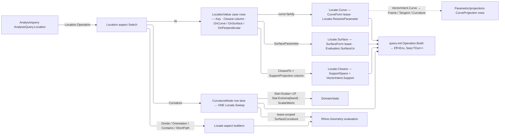

# [RASM_PARAMETRIC_LOCATE]

`Rasm.Parametric` location algebra measures WHERE a point sits on a live `Curve`/`Surface` and WHAT value lives there, folding every addressing, value, subdivision, and curvature query to one `Operation<TGeometry, TOut>` the `Rasm.Analysis` runtime executes under `Eff<Env, Seq<TOut>>`. `AnalysisQuery.Location` is the sole public route in — everything behind that call is this owner's.

Structural law is the (value × locator) matrix as CASE-OWNED rows: each `LocationValue` case owns its curve, surface, and perpendicular arms with a `Spatial/support` `SupportProjection` closest column, and the fold discriminates only the locator family. `Locator` carries its own `ResolveParameter` and `CurveRequirement`, so policy travels with the address; the page-local `Locate` static owner is the operation spine, the `Analysis/query` `Analyze` facade its only caller. Curve frame/tangent/curvature delegates to the `Parametric/projections` `CurveProjection` rows through `Processing/intent`, surface evaluation composes the `Domain/evaluation` lattice directly, coercion rides `Domain/normalization` leases, and statistics ride `Domain/stats`; every builder lands in `Operation<TGeometry, TOut>.Build`, whose substrate owns readiness and cancellation through `Prepare` so no arm re-checks them.

## [01]-[INDEX]

- [02]-[LOCATION]: vocabulary unions — `Locator` addressing, `LocationValue` value rows over the case-owned matrix, `Division`, `CurvatureMode`/`CurvatureAggregation`, and the `Location` aspect the query folds.
- [03]-[OPERATIONS]: `Locate` spine — the one `Admits` gate, the aspect builders, and the curvature sweep.

## [02]-[LOCATION]

- Owner: `Locator` `[Union]` is the addressing algebra — `CurveParameter`, `ArcLength`, `NormalizedLength`, `SurfaceParameter`, `ClosestTo`, `PerpendicularParameters`; `NormalizedMid` is the `NormalizedLength(0.5)` factory, the arc-length-normalized station family one payload. Addressing carries its own policy: `ResolveParameter` lowers the three curve addresses to a parameter under `Context.Fractional`, and `CurveRequirement` derives the readiness gate (`Requirement.CurveLength` for the length-driven addresses, `Requirement.Basic` otherwise), never a per-arm literal.
- Owner: `LocationValue` `[Union]` — `Point`, `Frame`, `Normal`, `Tangent`, `Curvature`, `Derivative`, `Parameter`, `Length`, each a ROW of the (value × locator) matrix carrying a `nameof`-derived `Op Key`, an `Option<SupportProjection>` closest column, and virtual `OnCurve`/`OnSurface`/`OnPerpendicular` arms defaulting to `Unsupported`; `Resolve` folds the locator FAMILY to the owning arm, the curve family riding the default route. Curve arms delegate frame/tangent/curvature to the `Parametric/projections` `CurveProjection` rows through `VectorIntent.Curve`, never a second evaluation path; surface arms compose the `Domain/evaluation` floor; `Length` measures `Curve.GetLength` from `Domain.T0` to the resolved parameter; `Parameter` surfaces the address the resolution already computed; `Derivative` carries a `Dimension` order, so both arms lost the guard a non-positive order used to need. The seven parameterless rows are seated `static readonly` values, the payload-carrying `Derivative` alone a factory.
- Owner: `Division` `[Union]` — `ByCount`, `ByLength`, `ByChord`, `AsContour`, each carrying its own `Admit(Context, Op)` — the count positive, the spacings and the contour axis span against `ToleranceLane.Length`/`ToleranceLane.Chord` — run inside `Locate.Divide`'s lease where the runtime `Context` is in hand, and lowering to `Curve.DivideByCount`/`DivideByLength`/`DivideEquidistant`/`DivideAsContour`; the length-driven cases carry `Requirement.CurveLength`, and each case is its own division LAW — arc-length, straight-line chord, and contour-plane spacing never collapse onto one distance knob.
- Owner: `CurvatureMode` `[Union]` — `Vector`, `Scalar`, carrying the two derivation columns (`IsCurveMagnitude`; `SurfaceMetrics`, vector mode yielding `Gaussian`+`Mean` and a surface scalar its singleton) AND the per-family `OnCurve`/`OnSurface` lane arms that own the (mode × aggregation × output) matrix as ROWS; `CurvatureAggregation` `[Union]` — `Samples`, `Extrema`, its `Key` column selecting the operation identity, `Band` naming the `ToleranceLane` the sweep resolves against the runtime `Context` for the `Stat.Extrema` plateau set, and `Reduce` the one station→output projection both aggregations publish through.
- Owner: `Location` `[Union]` — the aspect the query routes: `At`, `Curvature`, `Divide`, `Orientation`, `Contains`, `ShortPath`; twin sample/extrema cases collapse to ONE `CurvatureCase` discriminated by `CurvatureAggregation`, aggregation a value, not a sibling case.
- Entry: `Operation<TGeometry, TOut>()` is the generated `Switch` fold from aspect to operation, and `AnalysisQuery.Location` the ONLY public route in — no aspect exposes a second executable surface.
- Law: `LocationKeys` is the ONE operation-key table and its upstream is `nameof` — every row names a member of this page's own case rosters (eight `LocationValue` rows, the perpendicular arm, six `Location` aspects with the extrema twin), and every row has exactly one reader. Per-arm `Op` literals beside it are the named defect, and every row here keeps its reader.
- Law: the extremum plateau is a `ToleranceLane` on the case, resolved to a `Tolerance` at the sweep where the runtime `Context` is in hand — a stored double band cannot say WHICH gate widened the plateau, and a caller minting one has no document to mint it from. NAMED LOSS: the exact `band = 0.0` extremum; `ToleranceLane.Neglect` is the canonical row an absent band takes, a sub-tolerance floor no measured curvature pair separates.
- Receipt: none minted — the typed value sequence IS the result, `Stat<Scalar>` the `Domain/stats` summary carrier, and refusals ride the `Op` fault taxonomy: `Reject` for admission-invalid requests, `Unsupported` for impossible (value, locator, geometry, output) combinations, `InvalidResult` for host-evaluation refusals.
- Growth: a new value is one `LocationValue` case with its arms and columns; a new curve address is one `Locator` case with its `ResolveParameter` arm and the fold untouched, a non-curve address adding its own `Resolve` arm; a new aggregation is one `CurvatureAggregation` case; a new aspect is one `Location` case and one `Switch` arm — zero new entrypoints, zero new runtimes.
- Boundary: this owner is Rhino-parametric ANALYSIS altitude, measuring live `Curve`/`Surface` under the `Analysis` runtime; `Parametric/curve` is the host-neutral counterpart for the non-Rhino runtime. Matrix rows live in the value AND mode cases — a central tuple-switch over either is the collapse-regression. Closest-point addressing composes `SupportSpace.Of` + `VectorIntent.Support` + the `SupportProjection` column; a locator-local closest-point implementation is the parallel-rail defect. Coercion is always the `CurveForm`/`SurfaceForm` LEASE, a raw cast beside it the ownership leak. `SurfaceCurvature` bundles read lease-scoped everywhere except the two rows whose OUTPUT is the bundle — there disposal transfers to the caller by contract and the refusal path still disposes. Surface point/frame/normal arms compose the `Domain/evaluation` floor DIRECTLY: the operation has normalized the UV, so re-entering `SurfaceProjection.Project` re-admits and re-normalizes (the double-validation defect).

## [03]-[OPERATIONS]

- Owner: `Locate` `internal static class` — the operation spine. `Admits` is the ONE capability gate (native-form coercibility of `TGeometry` via the `Domain/normalization` capability rows or assignability, AND output-type fit); `Curve`/`Surface` are the two family builders threading `Op`-keyed state through `Operation.Build` — coerce the lease, resolve the address, project under the runtime `Context`, re-key through `As`; `Closest` composes the support rail; `Perpendicular` orders and dedups into `Curve.GetPerpendicularFrames`; `Divide`/`Orientation`/`Contains`/`ShortPath` each lower one aspect.
- Owner: the curvature sweep — `Curvature` resolves the native family once and asks the MODE ROW for its lane, feeding whatever it answers to ONE shared `Sweep` builder (lease, sample `count` stations, project) and lowering one `Unsupported` where the row answers `None`. `CurveLane`/`SurfaceLane` are the shared scalar sweeps the aggregation reduces, `SurfaceStatLane` the vector mode's transposed multi-metric set, and `SampleColumn` the ONE station→output resolver every aggregation reads; `CurvatureSample` is the station carrier on the `Domain/rails` validity fold, so every station drains through the acceptance oracle and a degenerate host evaluation faults the sweep instead of feeding the extrema.
- Boundary: the output-type gates are COMPILE-SHAPE capability gates on a generic operation — the legitimate generic-dispatch idiom, never the runtime raw→typed projection dispatch the `Numerics/atoms` `ProjectionRow` rail owns; selecting WHICH measured column a station publishes is value dispatch and has exactly one owner, `SampleColumn`, so no arm re-discriminates `TOut` beside another; `Sweep` is the one native-sampling builder, a per-row bespoke `Operation.Build` the spam it absorbs; requirement values arrive from locator columns or family builders, never inline per arm.

```csharp signature
// --- [RUNTIME_PRELUDE] ----------------------------------------------------------------------
// Rhino.Geometry, the LanguageExt prelude, and Thinktecture are global usings; the Rasm.* namespaces are explicit.

using System.Runtime.InteropServices;
using Rasm.Analysis;
using Rasm.Domain;
using Rasm.Numerics;
using Rasm.Processing;
using Rasm.Spatial;
using Rhino;

namespace Rasm.Parametric;

// --- [TYPES] --------------------------------------------------------------------------------
[Union]
public abstract partial record Locator {
    private Locator() { }
    public sealed record CurveParameter(double T) : Locator;
    public sealed record ArcLength(double Distance) : Locator;
    public sealed record NormalizedLength(double S) : Locator;
    public sealed record SurfaceParameter(Point2d Uv) : Locator;
    public sealed record ClosestTo(Point3d Probe) : Locator;
    public sealed record PerpendicularParameters(Seq<double> Ts) : Locator;

    public static Locator NormalizedMid => new NormalizedLength(S: 0.5);

    // Both columns close on the generated total Switch: a seventh address breaks the build rather than defaulting
    // into the basic requirement or an anonymous InvalidInput, and the three non-curve arms refuse EXPLICITLY.
    internal Requirement CurveRequirement => Switch(
        curveParameter: static _ => Requirement.Basic,
        arcLength: static _ => Requirement.CurveLength,
        normalizedLength: static _ => Requirement.CurveLength,
        surfaceParameter: static _ => Requirement.Basic,
        closestTo: static _ => Requirement.Basic,
        perpendicularParameters: static _ => Requirement.CurveLength);

    internal Fin<double> ResolveParameter(Curve curve, Context context, Op key) => Switch(
        state: (Curve: curve, Context: context, Key: key),
        curveParameter: static (s, a) => guard(s.Curve.Domain.IncludesParameter(t: a.T), s.Key.InvalidInput()).ToFin().Map(_ => a.T),
        arcLength: static (s, a) => guard(s.Curve.LengthParameter(segmentLength: a.Distance, t: out double t, fractionalTolerance: s.Context.Fractional), s.Key.InvalidResult()).ToFin().Map(_ => t),
        normalizedLength: static (s, a) => guard(double.IsFinite(a.S) && a.S is >= 0.0 and <= 1.0, s.Key.InvalidInput()).ToFin()
            .Bind(_ => guard(s.Curve.NormalizedLengthParameter(s: a.S, t: out double t, fractionalTolerance: s.Context.Fractional), s.Key.InvalidResult()).ToFin().Map(_ => t)),
        surfaceParameter: static (s, _) => Fin.Fail<double>(s.Key.InvalidInput()),
        closestTo: static (s, _) => Fin.Fail<double>(s.Key.InvalidInput()),
        perpendicularParameters: static (s, _) => Fin.Fail<double>(s.Key.InvalidInput()));
}

[Union]
public abstract partial record LocationValue {
    private LocationValue() { }
    public sealed record PointCase : LocationValue {
        internal override Op Key => LocationKeys.PointAt;
        internal override Option<SupportProjection> Closest => Some(SupportProjection.Closest);
        internal override Operation<TGeometry, TOut> OnCurve<TGeometry, TOut>(Locator locator) =>
            Locate.Curve<TGeometry, TOut, Point3d>(key: LocationKeys.PointAt, locator: locator, project: static (key, curve, t, _) => key.Accept(value: curve.PointAt(t: t)));
        internal override Operation<TGeometry, TOut> OnSurface<TGeometry, TOut>(Point2d uv) =>
            Locate.Surface<TGeometry, TOut, Point3d>(key: LocationKeys.PointAt, uv: uv, project: static (key, surface, p) => key.Accept(value: surface.PointAt(u: p.X, v: p.Y)));
    }
    public sealed record FrameCase : LocationValue {
        internal override Op Key => LocationKeys.FrameAt;
        internal override Option<SupportProjection> Closest => Some(SupportProjection.Frame);
        internal override Operation<TGeometry, TOut> OnCurve<TGeometry, TOut>(Locator locator) =>
            Locate.Curve<TGeometry, TOut, Plane>(key: LocationKeys.FrameAt, locator: locator, project: static (key, curve, t, context) =>
                VectorIntent.Curve(source: curve, parameter: t, mode: CurveProjection.Frame, key: key)
                    .Bind(intent => intent.Project<Plane>(context: context, key: key))
                    .Bind(plane => key.Accept(value: plane)));
        internal override Operation<TGeometry, TOut> OnSurface<TGeometry, TOut>(Point2d uv) =>
            Locate.Surface<TGeometry, TOut, Plane>(key: LocationKeys.FrameAt, uv: uv, project: static (key, surface, p) =>
                Evaluation.FrameAt(surface: surface, uv: p, key: key).Bind(frame => key.Accept(value: frame)));
        internal override Operation<TGeometry, TOut> OnPerpendicular<TGeometry, TOut>(Seq<double> parameters) =>
            Locate.Perpendicular<TGeometry, TOut>(key: LocationKeys.PerpendicularFrameAt, parameters: parameters);
    }
    public sealed record NormalCase : LocationValue {
        internal override Op Key => LocationKeys.NormalAt;
        internal override Option<SupportProjection> Closest => Some(SupportProjection.Normal);
        // Curve normal IS the RMF frame's Y axis — the projections FrameNormal row, never a second path.
        internal override Operation<TGeometry, TOut> OnCurve<TGeometry, TOut>(Locator locator) =>
            Locate.Curve<TGeometry, TOut, Vector3d>(key: LocationKeys.NormalAt, locator: locator, project: static (key, curve, t, context) =>
                VectorIntent.Curve(source: curve, parameter: t, mode: CurveProjection.FrameNormal, key: key)
                    .Bind(intent => intent.Project<Vector3d>(context: context, key: key))
                    .Bind(normal => key.Accept(value: normal)));
        internal override Operation<TGeometry, TOut> OnSurface<TGeometry, TOut>(Point2d uv) =>
            Locate.Surface<TGeometry, TOut, Vector3d>(key: LocationKeys.NormalAt, uv: uv, project: static (key, surface, p) =>
                Evaluation.NormalAt(surface: surface, uv: p, key: key).Bind(normal => key.Accept(value: normal)));
    }
    public sealed record TangentCase : LocationValue {
        internal override Op Key => LocationKeys.TangentAt;
        internal override Option<SupportProjection> Closest => Some(SupportProjection.Tangent);
        internal override Operation<TGeometry, TOut> OnCurve<TGeometry, TOut>(Locator locator) =>
            Locate.Curve<TGeometry, TOut, Vector3d>(key: LocationKeys.TangentAt, locator: locator, project: static (key, curve, t, context) =>
                VectorIntent.Curve(source: curve, parameter: t, mode: CurveProjection.Tangent, key: key)
                    .Bind(intent => intent.Project<Vector3d>(context: context, key: key))
                    .Bind(tangent => key.Accept(value: tangent)));
    }
    public sealed record CurvatureCase : LocationValue {
        internal override Op Key => LocationKeys.CurvatureAt;
        internal override Operation<TGeometry, TOut> OnCurve<TGeometry, TOut>(Locator locator) =>
            Locate.Curve<TGeometry, TOut, Vector3d>(key: LocationKeys.CurvatureAt, locator: locator, project: static (key, curve, t, context) =>
                VectorIntent.Curve(source: curve, parameter: t, mode: CurveProjection.Curvature, key: key)
                    .Bind(intent => intent.Project<Vector3d>(context: context, key: key))
                    .Bind(curvature => key.Accept(value: curvature)));
        // Output IS the disposable bundle: success transfers disposal to the caller, the unset path disposes inside the lease.
        internal override Operation<TGeometry, TOut> OnSurface<TGeometry, TOut>(Point2d uv) =>
            Locate.Surface<TGeometry, TOut, SurfaceCurvature>(key: LocationKeys.CurvatureAt, uv: uv, project: static (key, surface, p) =>
                Optional(surface.CurvatureAt(u: p.X, v: p.Y)).ToFin(key.InvalidResult())
                    .Bind(bundle => bundle.IsSet
                        ? Fin.Succ(Seq(bundle))
                        : new Lease<SurfaceCurvature>.Owned(Value: bundle).Use(_ => Fin.Fail<Seq<SurfaceCurvature>>(key.InvalidResult()))));
    }
    // Order is a Dimension, so a non-positive order is unrepresentable and both arms lose their guard — the two
    // regimes this case used to carry (`Order < 0` on the curve arm, `Order < 1` on the surface arm) had no
    // consumer that could tell them apart. A zeroth derivative is `LocationValue.Point`, an explicit route.
    public sealed record DerivativeCase(Dimension Order) : LocationValue {
        internal override Op Key => LocationKeys.DerivativeAt;
        // Triangular jet block offset and width have ONE spelling each: the guard and the slice read the same
        // pair, so a change to the block arithmetic cannot desynchronize them.
        internal int JetOffset => ((Order.Value - 1) * (Order.Value + 2)) / 2;
        internal int JetWidth => Order.Value + 1;
        internal override Operation<TGeometry, TOut> OnCurve<TGeometry, TOut>(Locator locator) =>
            Locate.Curve<TGeometry, TOut, Vector3d>(key: LocationKeys.DerivativeAt, locator: locator, project: (key, curve, t, _) =>
                Optional(curve.DerivativeAt(t: t, derivativeCount: Order.Value)).Filter(derivatives => Order.Value < derivatives.Length)
                    .ToFin(key.InvalidResult())
                    .Bind(derivatives => key.Accept(value: derivatives[Order.Value])));
        // Order-n surface jet block ∂ⁿS/∂uᵏ∂vⁿ⁻ᵏ (k = n..0) off the host order-n evaluate; the order-1 pair
        // is the projections Jacobian's columns.
        internal override Operation<TGeometry, TOut> OnSurface<TGeometry, TOut>(Point2d uv) =>
            Locate.Surface<TGeometry, TOut, Vector3d>(key: LocationKeys.DerivativeAt, uv: uv, project: (key, surface, p) =>
                surface.Evaluate(u: p.X, v: p.Y, numberDerivatives: Order.Value, point: out Point3d _, derivatives: out Vector3d[] derivatives)
                && derivatives.Length >= JetOffset + JetWidth
                    ? Fin.Succ(toSeq(derivatives.Skip(count: JetOffset).Take(count: JetWidth)))
                    : Fin.Fail<Seq<Vector3d>>(key.InvalidResult()));
    }
    public sealed record ParameterCase : LocationValue {
        internal override Op Key => LocationKeys.ParameterAt;
        internal override Option<SupportProjection> Closest => Some(SupportProjection.Parameter);
        // Resolved address IS the value: At(ArcLength(d), Parameter) answers the arc-length→parameter query resolution already computed.
        internal override Operation<TGeometry, TOut> OnCurve<TGeometry, TOut>(Locator locator) =>
            Locate.Curve<TGeometry, TOut, double>(key: LocationKeys.ParameterAt, locator: locator, project: static (key, _, t, _) => key.Accept(value: t));
    }
    public sealed record LengthCase : LocationValue {
        internal override Op Key => LocationKeys.LengthAt;
        internal override Operation<TGeometry, TOut> OnCurve<TGeometry, TOut>(Locator locator) =>
            Locate.Curve<TGeometry, TOut, double>(key: LocationKeys.LengthAt, locator: locator, requirement: Some(Requirement.CurveLength), project: static (key, curve, t, context) =>
                curve.GetLength(fractionalTolerance: context.Fractional, subdomain: new Interval(t0: curve.Domain.T0, t1: t)) switch {
                    // Host-read scalar: IsValidDouble screens Rhino's unset sentinel.
                    double length when RhinoMath.IsValidDouble(x: length) && length >= 0.0 => key.Accept(value: length),
                    _ => Fin.Fail<Seq<double>>(key.InvalidResult()),
                });
    }

    // Stateless rows are SEATED once, matching the sibling vocabularies on this page; only the payload-carrying
    // row stays a factory, because a per-query record mint on the hot path buys nothing a shared row lacks.
    public static readonly LocationValue Point = new PointCase();
    public static readonly LocationValue Frame = new FrameCase();
    public static readonly LocationValue Normal = new NormalCase();
    public static readonly LocationValue Tangent = new TangentCase();
    public static readonly LocationValue Curvature = new CurvatureCase();
    public static readonly LocationValue Parameter = new ParameterCase();
    public static readonly LocationValue Length = new LengthCase();
    public static LocationValue Derivative(Dimension order) => new DerivativeCase(Order: order);

    // Matrix rows live on the cases; the fold discriminates only the locator FAMILY.
    internal abstract Op Key { get; }
    internal virtual Option<SupportProjection> Closest => None;
    internal virtual Operation<TGeometry, TOut> OnCurve<TGeometry, TOut>(Locator locator) where TGeometry : notnull => Key.Unsupported<TGeometry, TOut>();
    internal virtual Operation<TGeometry, TOut> OnSurface<TGeometry, TOut>(Point2d uv) where TGeometry : notnull => Key.Unsupported<TGeometry, TOut>();
    internal virtual Operation<TGeometry, TOut> OnPerpendicular<TGeometry, TOut>(Seq<double> parameters) where TGeometry : notnull => Key.Unsupported<TGeometry, TOut>();
    internal Operation<TGeometry, TOut> Resolve<TGeometry, TOut>(Locator locator) where TGeometry : notnull => locator switch {
        Locator.SurfaceParameter sp => OnSurface<TGeometry, TOut>(uv: sp.Uv),
        Locator.ClosestTo ct => Closest.Match(
            Some: projection => Locate.Closest<TGeometry, TOut>(key: Key, target: ct.Probe, projection: projection),
            None: () => Key.Unsupported<TGeometry, TOut>()),
        Locator.PerpendicularParameters ps => OnPerpendicular<TGeometry, TOut>(parameters: ps.Ts),
        // Curve family rides the default: Locator is closed and every non-curve case peels above, so a new curve address is one ResolveParameter arm and a non-curve address adds its arm HERE.
        _ => OnCurve<TGeometry, TOut>(locator: locator),
    };
}

[Union]
public abstract partial record Division {
    private Division() { }
    public sealed record ByCount(int Count) : Division;
    public sealed record ByLength(double Length) : Division;
    // Equal STRAIGHT-LINE chord spacing — a distinct division law from arc-length ByLength.
    public sealed record ByChord(double Distance) : Division;
    // Contour-plane stations along an axis pair — its own law and payload, so a case, never a spacing column.
    public sealed record AsContour(Point3d Start, Point3d End, double Interval) : Division;
    // Admission runs where the runtime Context is in hand — inside the lease, not at the fold, which holds none.
    // A segment length, a chord distance, a contour interval, and a contour axis span are all MODEL-SPACE, so each
    // gates on its own lane and no dimensionless anchor decides which spacing a document can realize.
    internal Fin<Unit> Admit(Context context, Op key) => Switch(
        state: (Context: context, Key: key),
        byCount: static (s, c) => guard(c.Count > 0, s.Key.InvalidInput()).ToFin(),
        byLength: static (s, l) => Spacing(value: l.Length, band: s.Context.For(lane: ToleranceLane.Length), key: s.Key),
        byChord: static (s, c) => Spacing(value: c.Distance, band: s.Context.For(lane: ToleranceLane.Chord), key: s.Key),
        asContour: static (s, a) => Spacing(value: a.Interval, band: s.Context.For(lane: ToleranceLane.Length), key: s.Key)
            .Bind(_ => guard(
                ValidityClaim.Finite(value: a.Start).Holds && ValidityClaim.Finite(value: a.End).Holds
                && a.Start.DistanceTo(other: a.End) > s.Context.For(lane: ToleranceLane.Length).Value,
                s.Key.InvalidInput()).ToFin()));

    static Fin<Unit> Spacing(double value, Tolerance band, Op key) =>
        guard(double.IsFinite(value) && value > band.Value, key.InvalidInput()).ToFin();

    // The generated TOTAL Switch: a fifth division case breaks the build where the deleted catch-all compiled it
    // into a silent reject, and the ONE refusal site now lives behind Admit's own bind.
    internal Operation<TGeometry, TOut> Operation<TGeometry, TOut>() where TGeometry : notnull => Switch(
        byCount: c => Locate.Divide<TGeometry, TOut>(key: LocationKeys.Divide, division: c, requirement: None,
            divide: curve => curve.DivideByCount(segmentCount: c.Count, includeEnds: true, points: out Point3d[] points) switch { double[] => Optional(points), _ => Option<Point3d[]>.None }),
        byLength: l => Locate.Divide<TGeometry, TOut>(key: LocationKeys.Divide, division: l, requirement: Some(Requirement.CurveLength),
            divide: curve => curve.DivideByLength(segmentLength: l.Length, includeEnds: true, points: out Point3d[] points) switch { double[] => Optional(points), _ => Option<Point3d[]>.None }),
        // ByChord binds the parameter-returning overload, matching the sibling arms — stations keep their parameter
        // channel live at the seam even though the aspect emits points.
        byChord: c => Locate.Divide<TGeometry, TOut>(key: LocationKeys.Divide, division: c, requirement: Some(Requirement.CurveLength),
            divide: curve => curve.DivideEquidistant(distance: c.Distance, curveParameters: out double[] _) switch { Point3d[] points => Optional(points), _ => Option<Point3d[]>.None }),
        asContour: a => Locate.Divide<TGeometry, TOut>(key: LocationKeys.Divide, division: a, requirement: None,
            divide: curve => Optional(curve.DivideAsContour(contourStart: a.Start, contourEnd: a.End, interval: a.Interval)).Filter(static points => points.Length > 0)));
}

// The (mode x aggregation x output) matrix lives on the ROWS, exactly as LocationValue's does: each mode row owns
// its curve and surface lanes and answers None where the combination is unservable, so `Locate.Curvature` holds a
// family resolve and ONE Unsupported site instead of the central tuple-switch this page's own boundary forbids.
[Union]
public abstract partial record CurvatureMode {
    private CurvatureMode() { }
    public sealed record VectorCase : CurvatureMode {
        // The curve vector column is this row's own reading; every scalar output falls to the shared magnitude lane.
        internal override Option<Func<Op, Curve, int, Context, Fin<Seq<TOut>>>> OnCurve<TOut>(CurvatureAggregation aggregation) =>
            typeof(TOut) == typeof(Vector3d) && aggregation is CurvatureAggregation.SamplesCase
                ? Some<Func<Op, Curve, int, Context, Fin<Seq<TOut>>>>(static (op, curve, n, ctx) =>
                    Locate.CurveCurvatures(key: op, curve: curve, count: n, context: ctx).Bind(values => op.AcceptResults<Vector3d, TOut>(values: values)))
                : Locate.CurveLane<TOut>(aggregation: aggregation, metric: ScalarMetric.Magnitude);
        // The surface vector column is the live bundle set; the derived pair rides the multi-metric Stat lane.
        internal override Option<Func<Op, Surface, int, Context, Fin<Seq<TOut>>>> OnSurface<TOut>(CurvatureAggregation aggregation) =>
            typeof(TOut) == typeof(SurfaceCurvature) && aggregation is CurvatureAggregation.SamplesCase
                ? Some<Func<Op, Surface, int, Context, Fin<Seq<TOut>>>>(static (op, surface, n, ctx) =>
                    Locate.SurfaceBundles(key: op, surface: surface, count: n, context: ctx).Bind(values => op.AcceptResults<SurfaceCurvature, TOut>(values: values)))
                : Locate.SurfaceStatLane<TOut>(aggregation: aggregation, metrics: SurfaceMetrics);
    }
    public sealed record ScalarCase(ScalarMetric Metric) : CurvatureMode {
        internal override Option<Func<Op, Curve, int, Context, Fin<Seq<TOut>>>> OnCurve<TOut>(CurvatureAggregation aggregation) =>
            IsCurveMagnitude ? Locate.CurveLane<TOut>(aggregation: aggregation, metric: Metric) : None;
        internal override Option<Func<Op, Surface, int, Context, Fin<Seq<TOut>>>> OnSurface<TOut>(CurvatureAggregation aggregation) =>
            SurfaceMetrics.IsEmpty ? None : Locate.SurfaceLane<TOut>(aggregation: aggregation, metric: Metric);
    }
    public static CurvatureMode Vector => new VectorCase();
    public static CurvatureMode Scalar(ScalarMetric metric) => new ScalarCase(Metric: metric);

    // Both derivation columns close on the generated total Switch — a third mode breaks the build rather than
    // reading `false` and an empty metric set.
    internal bool IsCurveMagnitude => Switch(
        vectorCase: static _ => true,
        scalarCase: static scalar => scalar.Metric.Equals(ScalarMetric.Magnitude));
    internal Seq<ScalarMetric> SurfaceMetrics => Switch(
        vectorCase: static _ => Seq(ScalarMetric.Gaussian, ScalarMetric.Mean),
        scalarCase: static scalar => scalar.Metric.Equals(ScalarMetric.Gaussian) || scalar.Metric.Equals(ScalarMetric.Mean)
            ? Seq(scalar.Metric)
            : Seq<ScalarMetric>());

    internal abstract Option<Func<Op, Curve, int, Context, Fin<Seq<TOut>>>> OnCurve<TOut>(CurvatureAggregation aggregation);
    internal abstract Option<Func<Op, Surface, int, Context, Fin<Seq<TOut>>>> OnSurface<TOut>(CurvatureAggregation aggregation);
}

[Union]
public abstract partial record CurvatureAggregation {
    private CurvatureAggregation() { }
    public sealed record SamplesCase : CurvatureAggregation;
    public sealed record ExtremaCase(ExtremumDirection Direction, ToleranceLane Band) : CurvatureAggregation;
    public static readonly CurvatureAggregation Samples = new SamplesCase();
    public static CurvatureAggregation Extrema(ExtremumDirection direction, Option<ToleranceLane> band = default) =>
        new ExtremaCase(Direction: direction, Band: band.IfNone(noneValue: ToleranceLane.Neglect));
    internal Op Key => Switch(
        samplesCase: static _ => LocationKeys.Curvature,
        extremaCase: static _ => LocationKeys.CurvatureExtrema);

    // Stations to output: Samples publishes the column TOut names, Extrema runs the banded plateau first and then
    // publishes the SAME column — so the station→output projection has one owner and a new aggregation moves no
    // mode row. The metric rides through because a surface Stat carries the metric it was measured under.
    internal Option<Func<Op, Seq<Locate.CurvatureSample>, Context, Fin<Seq<TOut>>>> Reduce<TOut>(ScalarMetric metric) => Switch(
        samplesCase: _ => Locate.SampleColumn<TOut>(metric: metric),
        extremaCase: extrema => Locate.SampleColumn<TOut>(metric: metric).Map(column =>
            (Func<Op, Seq<Locate.CurvatureSample>, Context, Fin<Seq<TOut>>>)((key, samples, context) => column(
                key,
                Stat.Extrema(items: samples, projection: static sample => sample.Curvature, band: context.For(lane: extrema.Band), direction: extrema.Direction),
                context))));
}

[Union]
public abstract partial record Location {
    private Location() { }
    public sealed record AtCase(Locator Locator, LocationValue Value) : Location;
    public sealed record CurvatureCase(int Count, CurvatureMode Mode, CurvatureAggregation Aggregation) : Location;
    public sealed record DivideCase(Division By) : Location;
    public sealed record OrientationCase(Plane Plane) : Location;
    public sealed record ContainsCase(Point3d Probe, Plane Frame) : Location;
    public sealed record ShortPathCase(Point2d Start, Point2d End) : Location;

    public static Location At(Locator at, LocationValue value) => new AtCase(Locator: at, Value: value);
    public static Location Curvature(int count, CurvatureMode mode) => new CurvatureCase(Count: count, Mode: mode, Aggregation: CurvatureAggregation.Samples);
    public static Location CurvatureExtrema(int count, CurvatureMode mode, ExtremumDirection direction, Option<ToleranceLane> band = default) =>
        new CurvatureCase(Count: count, Mode: mode, Aggregation: CurvatureAggregation.Extrema(direction: direction, band: band));
    public static Location DivideByCount(int count) => new DivideCase(By: new Division.ByCount(Count: count));
    public static Location DivideByLength(double length) => new DivideCase(By: new Division.ByLength(Length: length));
    public static Location DivideByChord(double distance) => new DivideCase(By: new Division.ByChord(Distance: distance));
    public static Location DivideAsContour(Point3d start, Point3d end, double interval) => new DivideCase(By: new Division.AsContour(Start: start, End: end, Interval: interval));
    public static Location Orientation(Plane plane) => new OrientationCase(Plane: plane);
    public static Location Contains(Point3d point, Plane plane) => new ContainsCase(Probe: point, Frame: plane);
    public static Location ShortPath(Point2d start, Point2d end) => new ShortPathCase(Start: start, End: end);

    internal Operation<TGeometry, TOut> Operation<TGeometry, TOut>() where TGeometry : notnull => Switch(
        atCase: static at => at.Value.Resolve<TGeometry, TOut>(locator: at.Locator),
        curvatureCase: static c => Locate.Curvature<TGeometry, TOut>(count: c.Count, mode: c.Mode, aggregation: c.Aggregation),
        divideCase: static d => d.By.Operation<TGeometry, TOut>(),
        orientationCase: static o => Locate.Orientation<TGeometry, TOut>(frame: o.Plane),
        containsCase: static c => Locate.Contains<TGeometry, TOut>(probe: c.Probe, frame: c.Frame),
        shortPathCase: static sp => Locate.ShortPath<TGeometry, TOut>(start: sp.Start, end: sp.End));
}

// --- [OPERATIONS] ---------------------------------------------------------------------------
// One nameof-derived operation-key table; per-arm Op literals are the named defect.
internal static class LocationKeys {
    internal static readonly Op PointAt = Op.Of(name: nameof(PointAt));
    internal static readonly Op FrameAt = Op.Of(name: nameof(FrameAt));
    internal static readonly Op PerpendicularFrameAt = Op.Of(name: nameof(PerpendicularFrameAt));
    internal static readonly Op NormalAt = Op.Of(name: nameof(NormalAt));
    internal static readonly Op TangentAt = Op.Of(name: nameof(TangentAt));
    internal static readonly Op CurvatureAt = Op.Of(name: nameof(CurvatureAt));
    internal static readonly Op DerivativeAt = Op.Of(name: nameof(DerivativeAt));
    internal static readonly Op ParameterAt = Op.Of(name: nameof(ParameterAt));
    internal static readonly Op LengthAt = Op.Of(name: nameof(LengthAt));
    internal static readonly Op Divide = Op.Of(name: nameof(Divide));
    internal static readonly Op Orientation = Op.Of(name: nameof(Orientation));
    internal static readonly Op Contains = Op.Of(name: nameof(Contains));
    internal static readonly Op ShortPath = Op.Of(name: nameof(ShortPath));
    internal static readonly Op Curvature = Op.Of(name: nameof(Curvature));
    internal static readonly Op CurvatureExtrema = Op.Of(name: nameof(CurvatureExtrema));
}

internal static class Locate {
    // ONE native-family resolve. The capability lattice already admits the universal widenings — every row's Reach
    // opens with `Capability.Universal` — so the two hardcoded `object`/`GeometryBase` escapes were re-deriving
    // what the row answers, and a third native family is one arm here rather than a new clause in a ladder.
    private static Option<Capability> FamilyOf(Type native) =>
        native == typeof(Curve) ? Some(Capability.CurveForm)
        : native == typeof(Surface) ? Some(Capability.SurfaceForm)
        : Option<Capability>.None;

    private static bool Admits<TGeometry, TOut, TNative, TValue>() =>
        typeof(TOut) == typeof(TValue)
        && FamilyOf(native: typeof(TNative)).Match(
            Some: family => family.Admits(type: typeof(TGeometry)),
            None: () => typeof(TNative).IsAssignableFrom(c: typeof(TGeometry)));

    internal static Operation<TGeometry, TOut> Curve<TGeometry, TOut, TValue>(Op key, Locator locator, Func<Op, Curve, double, Context, Fin<Seq<TValue>>> project, Option<Requirement> requirement = default) where TGeometry : notnull =>
        Admits<TGeometry, TOut, Curve, TValue>()
            ? Operation<TGeometry, TValue>.Build(
                key: key, requirement: Some(requirement.IfNone(noneValue: locator.CurveRequirement)), state: (Key: key, Locator: locator, Project: project),
                evaluator: static (state, geometry) =>
                    from context in Env.Asks
                    from result in Normalization.CurveForm(source: geometry, key: state.Key)
                        .Bind(lease => lease.Use(curve => state.Locator.ResolveParameter(curve: curve, context: context, key: state.Key)
                            .Bind(parameter => state.Project(state.Key, curve, parameter, context)))).ToEff()
                    select result).As<TGeometry, TOut>(key: key)
            : key.Unsupported<TGeometry, TOut>();

    internal static Operation<TGeometry, TOut> Surface<TGeometry, TOut, TValue>(Op key, Point2d uv, Func<Op, Surface, Point2d, Fin<Seq<TValue>>> project) where TGeometry : notnull =>
        Admits<TGeometry, TOut, Surface, TValue>()
            ? Operation<TGeometry, TValue>.Build(
                key: key, requirement: Some(Requirement.SurfaceEvaluation), state: (Key: key, Uv: uv, Project: project),
                evaluator: static (state, geometry) =>
                    from context in Env.Asks
                    from result in Normalization.SurfaceForm(source: geometry, key: state.Key)
                        .Bind(lease => lease.Use(surface => Evaluation.SurfaceUv(surface: surface, uv: state.Uv, context: context, key: state.Key)
                            .Bind(parameter => state.Project(state.Key, surface, parameter)))).ToEff()
                    select result).As<TGeometry, TOut>(key: key)
            : key.Unsupported<TGeometry, TOut>();

    internal static Operation<TGeometry, TOut> Closest<TGeometry, TOut>(Op key, Point3d target, SupportProjection projection) where TGeometry : notnull =>
        (ValidityClaim.Finite(value: target).Holds, Capability.Closest.Admits(type: typeof(TGeometry))) switch {
            (false, _) => Operation<TGeometry, TOut>.Reject(key: key, fault: key.InvalidInput()),
            (true, true) => Operation<TGeometry, TOut>.Build(
                key: key, state: (Key: key, Target: target, Projection: projection),
                evaluator: static (state, geometry) =>
                    from context in Env.Asks
                    from space in SupportSpace.Of(value: geometry, key: state.Key).ToEff()
                    from intent in VectorIntent.Support(space: space, sample: state.Target, projection: state.Projection, key: state.Key).ToEff()
                    from result in intent.Project<TOut>(context: context, key: state.Key).Map(static value => Seq(value)).ToEff()
                    select result),
            _ => key.Unsupported<TGeometry, TOut>(),
        };

    internal static Operation<TGeometry, TOut> Perpendicular<TGeometry, TOut>(Op key, Seq<double> parameters) where TGeometry : notnull =>
        Admits<TGeometry, TOut, Curve, Plane>()
            ? Operation<TGeometry, Plane>.Build(
                key: key, requirement: Some(Requirement.CurveLength), state: (Key: key, Parameters: parameters),
                evaluator: static (state, geometry) => Normalization.CurveForm(source: geometry, key: state.Key)
                    .Bind(lease => lease.Use(curve => Optional(curve.GetPerpendicularFrames(state.Parameters.Distinct().Order()))
                        .ToFin(state.Key.InvalidResult())
                        .Bind(planes => state.Key.Accept(values: planes)))).ToEff()).As<TGeometry, TOut>(key: key)
            : key.Unsupported<TGeometry, TOut>();

    // The division ADMITS inside the lease, where Env carries the runtime Context its lane reads — the fold that
    // builds this operation holds no Context, which is why the spacing gates cannot live there.
    internal static Operation<TGeometry, TOut> Divide<TGeometry, TOut>(Op key, Division division, Option<Requirement> requirement, Func<Curve, Option<Point3d[]>> divide) where TGeometry : notnull =>
        Admits<TGeometry, TOut, Curve, Point3d>()
            ? Operation<TGeometry, Point3d>.Build(
                key: key, requirement: requirement, requiresContext: true, state: (Key: key, Division: division, Divide: divide),
                evaluator: static (state, geometry) =>
                    from context in Env.Asks
                    from result in state.Division.Admit(context: context, key: state.Key)
                        .Bind(_ => Normalization.CurveForm(source: geometry, key: state.Key))
                        .Bind(lease => lease.Use(curve => state.Divide(arg: curve).ToFin(state.Key.InvalidResult()).Bind(points => state.Key.Accept(values: points)))).ToEff()
                    select result).As<TGeometry, TOut>(key: key)
            : key.Unsupported<TGeometry, TOut>();

    internal static Operation<TGeometry, TOut> Orientation<TGeometry, TOut>(Plane frame) where TGeometry : notnull =>
        Admits<TGeometry, TOut, Curve, CurveOrientation>()
            ? Operation<TGeometry, CurveOrientation>.Build(
                key: LocationKeys.Orientation, state: (Key: LocationKeys.Orientation, Frame: frame),
                evaluator: static (state, geometry) => Normalization.CurveForm(source: geometry, key: state.Key)
                    .Bind(lease => lease.Use(curve => state.Key.Accept(value: curve.ClosedCurveOrientation(plane: state.Frame)))).ToEff()).As<TGeometry, TOut>(key: LocationKeys.Orientation)
            : LocationKeys.Orientation.Unsupported<TGeometry, TOut>();

    internal static Operation<TGeometry, TOut> Contains<TGeometry, TOut>(Point3d probe, Plane frame) where TGeometry : notnull =>
        Admits<TGeometry, TOut, Curve, PointContainment>()
            ? Operation<TGeometry, PointContainment>.Build(
                key: LocationKeys.Contains, requiresContext: true, state: (Key: LocationKeys.Contains, Probe: probe, Frame: frame),
                evaluator: static (state, geometry) =>
                    from context in Env.Asks
                    from result in Normalization.CurveForm(source: geometry, key: state.Key)
                        .Bind(lease => lease.Use(curve => curve.Contains(testPoint: state.Probe, plane: state.Frame, tolerance: context.Absolute.Value) switch {
                            PointContainment.Unset => Fin.Fail<Seq<PointContainment>>(state.Key.InvalidResult()),
                            PointContainment containment => state.Key.Accept(value: containment),
                        })).ToEff()
                    select result).As<TGeometry, TOut>(key: LocationKeys.Contains)
            : LocationKeys.Contains.Unsupported<TGeometry, TOut>();

    internal static Operation<TGeometry, TOut> ShortPath<TGeometry, TOut>(Point2d start, Point2d end) where TGeometry : notnull =>
        Admits<TGeometry, TOut, Surface, Curve>()
            ? Operation<TGeometry, Curve>.Build(
                key: LocationKeys.ShortPath, requirement: Some(Requirement.SurfaceEvaluation), state: (Key: LocationKeys.ShortPath, Start: start, End: end),
                evaluator: static (state, geometry) =>
                    from context in Env.Asks
                    from result in Normalization.SurfaceForm(source: geometry, key: state.Key)
                        .Bind(lease => lease.Use(surface =>
                            Evaluation.SurfaceUv(surface: surface, uv: state.Start, context: context, key: state.Key)
                                .Bind(uvStart => Evaluation.SurfaceUv(surface: surface, uv: state.End, context: context, key: state.Key)
                                    .Bind(uvEnd => Optional(surface.ShortPath(start: uvStart, end: uvEnd, tolerance: context.Absolute.Value))
                                        .ToFin(state.Key.InvalidResult())
                                        .Map(static path => Seq(path)))))).ToEff()
                    select result).As<TGeometry, TOut>(key: LocationKeys.ShortPath)
            : LocationKeys.ShortPath.Unsupported<TGeometry, TOut>();

    // --- [CURVATURE_SWEEP]
    // Family resolve, row-owned lane, ONE Sweep, ONE Unsupported. The deleted body was an eight-arm tuple switch
    // over (mode, aggregation, typeof(TOut)) whose arms differed only in native, requirement, and project — the
    // exact collapse-regression this page's own boundary names, and the one LocationValue already solved by rows.
    internal static Operation<TGeometry, TOut> Curvature<TGeometry, TOut>(int count, CurvatureMode mode, CurvatureAggregation aggregation) where TGeometry : notnull {
        Op key = aggregation.Key;
        return count <= 0
            ? Operation<TGeometry, TOut>.Reject(key: key, fault: key.InvalidInput())
            : Capability.CurveForm.Admits(type: typeof(TGeometry))
                ? mode.OnCurve<TOut>(aggregation: aggregation).Match(
                    Some: project => Sweep<TGeometry, TOut, Curve>(key: key, count: count, requirement: Requirement.CurveLength, native: Normalization.CurveForm, project: project),
                    None: () => key.Unsupported<TGeometry, TOut>())
                : Capability.SurfaceForm.Admits(type: typeof(TGeometry))
                    ? mode.OnSurface<TOut>(aggregation: aggregation).Match(
                        Some: project => Sweep<TGeometry, TOut, Surface>(key: key, count: count, requirement: Requirement.SurfaceEvaluation, native: Normalization.SurfaceForm, project: project),
                        None: () => key.Unsupported<TGeometry, TOut>())
                    : key.Unsupported<TGeometry, TOut>();
    }

    // The two scalar lanes are ONE station sweep each, the aggregation deciding whether the output is the station
    // column or the banded plateau over it — so neither mode row spells a reduction and neither aggregation spells
    // a sampling.
    internal static Option<Func<Op, Curve, int, Context, Fin<Seq<TOut>>>> CurveLane<TOut>(CurvatureAggregation aggregation, ScalarMetric metric) =>
        aggregation.Reduce<TOut>(metric: metric).Map(reduce =>
            (Func<Op, Curve, int, Context, Fin<Seq<TOut>>>)((op, curve, n, ctx) =>
                CurveSamples(key: op, curve: curve, count: n, context: ctx, metric: metric).Bind(samples => reduce(op, samples, ctx))));

    internal static Option<Func<Op, Surface, int, Context, Fin<Seq<TOut>>>> SurfaceLane<TOut>(CurvatureAggregation aggregation, ScalarMetric metric) =>
        aggregation.Reduce<TOut>(metric: metric).Map(reduce =>
            (Func<Op, Surface, int, Context, Fin<Seq<TOut>>>)((op, surface, n, ctx) =>
                SurfaceSamples(key: op, surface: surface, count: n, context: ctx, metric: metric).Bind(samples => reduce(op, samples, ctx))));

    // The multi-metric Stat set is the vector mode's surface reading: one sampling pass, metrics transposed, so an
    // extremum over a derived pair has no single quantity to rank and answers None rather than a wrong plateau.
    internal static Option<Func<Op, Surface, int, Context, Fin<Seq<TOut>>>> SurfaceStatLane<TOut>(CurvatureAggregation aggregation, Seq<ScalarMetric> metrics) =>
        metrics.IsEmpty || aggregation is not CurvatureAggregation.SamplesCase || typeof(TOut) != typeof(Stat<Scalar>)
            ? Option<Func<Op, Surface, int, Context, Fin<Seq<TOut>>>>.None
            : Some<Func<Op, Surface, int, Context, Fin<Seq<TOut>>>>((op, surface, n, ctx) =>
                SurfaceStats(key: op, surface: surface, count: n, context: ctx, metrics: metrics).Bind(stats => op.AcceptResults<Stat<Scalar>, TOut>(values: stats)));

    // ONE station→output column resolver. The point, the measured scalar, and the whole-batch Stat all read the
    // same carrier here, so no arm re-discriminates TOut beside another and a new column is one row in this member.
    internal static Option<Func<Op, Seq<CurvatureSample>, Context, Fin<Seq<TOut>>>> SampleColumn<TOut>(ScalarMetric metric) =>
        typeof(TOut) == typeof(Point3d)
            ? Some<Func<Op, Seq<CurvatureSample>, Context, Fin<Seq<TOut>>>>(static (key, samples, _) =>
                key.AcceptResults<Point3d, TOut>(values: samples.Map(static sample => sample.Point)))
        : typeof(TOut) == typeof(double)
            ? Some<Func<Op, Seq<CurvatureSample>, Context, Fin<Seq<TOut>>>>(static (key, samples, _) =>
                key.AcceptResults<double, TOut>(values: samples.Map(static sample => sample.Curvature)))
        : typeof(TOut) == typeof(Stat<Scalar>)
            ? Some<Func<Op, Seq<CurvatureSample>, Context, Fin<Seq<TOut>>>>((key, samples, _) =>
                Stat<Scalar>.Of(values: samples.Map(static sample => (Scalar)sample.Curvature), key: key, context: Some(StatContext.Metric(metric: metric)))
                    .Bind(stat => key.AcceptResults<Stat<Scalar>, TOut>(values: Seq(stat))))
        : Option<Func<Op, Seq<CurvatureSample>, Context, Fin<Seq<TOut>>>>.None;

    private static Operation<TGeometry, TOut> Sweep<TGeometry, TOut, TNative>(Op key, int count, Requirement requirement, Func<object?, Op, Fin<Lease<TNative>>> native, Func<Op, TNative, int, Context, Fin<Seq<TOut>>> project)
        where TGeometry : notnull
        where TNative : class, IDisposable =>
        Operation<TGeometry, TOut>.Build(
            key: key, requirement: Some(requirement), state: (Key: key, Count: count, Native: native, Project: project),
            evaluator: static (state, geometry) =>
                from context in Env.Asks
                from result in state.Native(arg1: geometry, arg2: state.Key)
                    .Bind(lease => lease.Use((State: state, Context: context), static (s, native) => s.State.Project(arg1: s.State.Key, arg2: native, arg3: s.State.Count, arg4: s.Context))).ToEff()
                select result);

    // Station carrier on the rails validity fold: the acceptance oracle gates every station, so a NaN curvature or unset point faults the sweep instead of riding into Stat.Extrema.
    [StructLayout(LayoutKind.Auto)]
    internal readonly record struct CurvatureSample(Point3d Point, double Curvature) : IValidityEvidence {
        public bool IsValid => ValidityClaim.All(ValidityClaim.Finite(value: Point), ValidityClaim.Nonnegative(value: Curvature));
    }

    internal static Fin<Seq<Vector3d>> CurveCurvatures(Op key, Curve curve, int count, Context context) =>
        Evaluation.CurveSampleParameters(curve: curve, count: count, context: context, key: key)
            .Bind(parameters => key.Accept(values: parameters.Map(t => curve.CurvatureAt(t: t))));
    // The station's scalar is the MODE's metric, so the magnitude fold and the sample fold are one member.
    private static Fin<Seq<CurvatureSample>> CurveSamples(Op key, Curve curve, int count, Context context, ScalarMetric metric) =>
        Evaluation.CurveSampleParameters(curve: curve, count: count, context: context, key: key)
            .Bind(parameters => parameters.TraverseM(t => metric.Of(value: curve.CurvatureAt(t: t), key: key)
                .Map(value => new CurvatureSample(Point: curve.PointAt(t: t), Curvature: value))).As())
            .Bind(samples => key.Accept(values: samples));

    // Every scalar-projecting bundle read is lease-scoped with the IsSet gate INSIDE the lease — an unset bundle disposes on the refusal path, never projected.
    private static Fin<T> WithBundle<T>(Op key, Surface surface, Point2d uv, Func<SurfaceCurvature, Fin<T>> project) =>
        Optional(surface.CurvatureAt(u: uv.X, v: uv.Y)).ToFin(key.InvalidResult())
            .Bind(bundle => new Lease<SurfaceCurvature>.Owned(Value: bundle)
                .Use(scoped => scoped.IsSet ? project(arg: scoped) : Fin.Fail<T>(key.InvalidResult())));
    // Output IS the live bundle seq: acquisition is total then IsSet-gated, and a refused batch disposes in full before the fault leaves — a TraverseM abort would leak the acquired prefix.
    internal static Fin<Seq<SurfaceCurvature>> SurfaceBundles(Op key, Surface surface, int count, Context context) =>
        Evaluation.SurfaceSampleUv(surface: surface, count: count, context: context, key: key)
            .Map(uvs => uvs.Map(uv => surface.CurvatureAt(u: uv.X, v: uv.Y)))
            .Bind(bundles => {
                // Release binds to the REFUSAL branch as a statement, never to a wildcard switch arm sitting in
                // value position beside the result. A bracket over the acquisition would be wrong here: on success
                // the batch's ownership TRANSFERS to the caller by this row's contract.
                if (bundles.ForAll(static bundle => bundle is { IsSet: true })) { return Fin.Succ(bundles.Map(static bundle => bundle!)); }
                foreach (SurfaceCurvature? bundle in bundles) { bundle?.Dispose(); }
                return Fin.Fail<Seq<SurfaceCurvature>>(key.InvalidResult());
            });
    private static Fin<Seq<CurvatureSample>> SurfaceSamples(Op key, Surface surface, int count, Context context, ScalarMetric metric) =>
        Evaluation.SurfaceSampleUv(surface: surface, count: count, context: context, key: key)
            .Bind(uvs => uvs.TraverseM(uv => WithBundle(key: key, surface: surface, uv: uv,
                project: bundle => metric.Of(value: bundle, key: key).Map(value => new CurvatureSample(Point: bundle.Point, Curvature: value)))).As())
            .Bind(samples => key.Accept(values: samples));
    // One sampling pass for the multi-metric Stat set: per-station lease-scoped metric rows, then a per-metric transpose.
    internal static Fin<Seq<Stat<Scalar>>> SurfaceStats(Op key, Surface surface, int count, Context context, Seq<ScalarMetric> metrics) =>
        Evaluation.SurfaceSampleUv(surface: surface, count: count, context: context, key: key)
            .Bind(uvs => uvs.TraverseM(uv => WithBundle(key: key, surface: surface, uv: uv,
                project: bundle => metrics.TraverseM(metric => metric.Of(value: bundle, key: key)).As().Map(static row => row.ToArray()))).As())
            .Bind(rows => toSeq(Enumerable.Range(start: 0, count: metrics.Count))
                .TraverseM(index => Stat<Scalar>.Of(
                    values: rows.Map(row => (Scalar)row[index]), key: key,
                    context: Some(StatContext.Metric(metric: metrics[index])))).As());
}
```


```mermaid
---
config:
  layout: elk
  flowchart:
    curve: linear
    padding: 25
---
flowchart LR
    accTitle: Location operation flow
    accDescr: AnalysisQuery.Location routes aspects through the Locate spine — value rows resolve locator arms, divisions lower to host members, and the curvature sweep folds stations to stats.
    Query["Analysis/query AnalysisQuery.Location"] -->|Location.Operation| Location["Location aspect Switch"]
    Location -->|At| Rows["LocationValue case rows — Key · Closest column · OnCurve / OnSurface / OnPerpendicular"]
    Location -->|Curvature| Sweep["CurvatureMode row lane → ONE Locate.Sweep"]
    Location -->|Divide / Orientation / Contains / ShortPath| Spine["Locate aspect builders"]
    Rows -->|curve family| CurveArm["Locate.Curve — CurveForm lease · Locator.ResolveParameter"]
    Rows -->|SurfaceParameter| SurfaceArm["Locate.Surface — SurfaceForm lease · Evaluation.SurfaceUv"]
    Rows -->|ClosestTo × SupportProjection column| ClosestArm["Locate.Closest — SupportSpace + VectorIntent.Support"]
    CurveArm -.->|VectorIntent.Curve → Frame / Tangent / Curvature| Projections["Parametric/projections CurveProjection rows"]
    Sweep -->|"Stat&lt;Scalar&gt;.Of · Stat.Extrema(band) · ScalarMetric"| Stats["Domain/stats"]
    Sweep -->|lease-scoped SurfaceCurvature| Rhino["Rhino.Geometry evaluation"]
    Spine --> Rhino
    CurveArm & SurfaceArm & ClosestArm & Sweep --> Runtime["query.md Operation.Build → Eff&lt;Env, Seq&lt;TOut&gt;&gt;"]
```

## [04]-[DENSITY_BAR]

One owner per axis; capability is a case, column, or fold arm, never a sibling surface. `[RAIL]` names each owner's one return rail.

| [INDEX] | [AXIS_CONCERN]        | [OWNER]                | [RAIL]                                    | [CASES] |
| :-----: | :-------------------- | :--------------------- | :---------------------------------------- | :-----: |
|  [01]   | location aspect       | `Location`             | `Operation<TGeometry,TOut>() → Operation` |    6    |
|  [02]   | addressing            | `Locator`              | `ResolveParameter → Fin<double>`          |    6    |
|  [03]   | value rows            | `LocationValue`        | `Resolve → Operation<TGeometry,TOut>`     |    8    |
|  [04]   | subdivision           | `Division`             | `Operation → Operation<TGeometry,TOut>`   |    4    |
|  [05]   | curvature reading     | `CurvatureMode`        | derivation (pure)                         |    2    |
|  [06]   | curvature aggregation | `CurvatureAggregation` | carrier (read by the sweep)               |    2    |
|  [07]   | operation keys        | `LocationKeys`         | `nameof`-derived `Op` rows                |   15    |
|  [08]   | operation spine       | `Locate`               | `Operation.Build → Eff<Env, Seq<TOut>>`   |    —    |

Every union, case row, `Resolve`, and `Locate` builder composes the RhinoCommon location surface and the upstream `Domain` lattices; no location arm re-mints an evaluation kernel.

## [05]-[RESEARCH]

<!-- source-only: research row template:
[TOKEN]-[OPEN|BLOCKED]: <exact question>; <verification route>.
[SPLIT_MEMBER]-[OPEN]: does `shape-core` expose `split_all`; verify against the member rail.
-->

(none)
