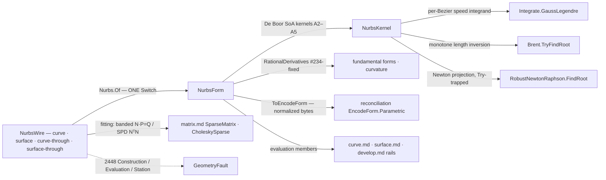

# [RASM_PARAMETRIC_NURBS]

THE vendored NURBS engine of `Rasm.Parametric` — the whole MIT algorithm set owned in-kernel (vendored from `GSharker/G-Shark@57bfbfb`, MIT, dormant upstream; fixed-defect roster #234 surface-derivative order flip · #337 closed/periodic soft spot · #373 RMF closure drift · #391 object-model allocation class), re-based onto the kernel's own vocabulary so the `Point3`↔`Point3d` boundary marshal of the package era is DEAD: `Rhino.Geometry` `Point3d`/`Vector3d`/`Plane` are the engine's native carriers, control nets ride internal homogeneous SoA columns (`wx`/`wy`/`wz`/`w` — the #391 fix: span-fed De Boor over columns, never a `List<Point4>` object walk), and NO NURBS package survives beside the owned source — the one-engine law. ONE polymorphic admission owns every ingress: `Fin<NurbsForm> Nurbs.Of(NurbsWire, Op? key = null)` discriminates the four wire shapes — explicit curve, explicit surface, curve-through-samples, surface-through-samples — through one generated `Switch`; evaluation members live ON the `NurbsForm` carriers; the op rails (`Stations`/`Divide`/`Offset` and their siblings) live in `curve.md`/`surface.md`, composing this engine.

The ruling-R1 gap set closes here, each as a member of the owning carrier, never a sibling surface. G1: PUBLIC arbitrary-knot construction for BOTH carriers — the packaged `NurbsSurface` internal-ctor wall (`NurbsSurface.cs:29`) dies, so host-authored surface ingress and SpineRef surface resolution live. G2: PUBLIC raw `RationalDerivatives` for the surface with the order convention FIXED (`Evaluate/Surface.cs:25`, #234): `SKL[k][l] = ∂^{k+l}S/∂u^k∂v^l` — `k` the u-order row, `l` the v-order column, metric-true magnitudes, nothing unitized. G3: fundamental forms I/II and principal/Gaussian/mean curvature as kernel projections over those derivatives. G5: Piegl-Tiller interpolation/approximation for curves AND surfaces — the banded linear solves ride the landed `matrix.md` owners (`SparseMatrix.FromTriplets` + `Solve` for the interpolation system, `CholeskySparse` for the least-squares normal form), never a re-minted solver. G6/G10: knots NORMALIZE to `[0,1]` and prove clamped AT CONSTRUCTION (the Rhino-trimmed wire spelling extends its end knots at the seam), so canonical bytes hash ONE form — one curve, one content key — through the `EncodeForm.Parametric` projection into the reconciliation identity chain. G7: `ClosestParameter` and the length inversion run PARAMETERIZED iteration/tolerance/subdivision knobs on `NurbsPolicy` — the packaged hardcoded `maxIterations=5`/`tol=1e-3` dies. G8: the fitting members here are the SEED `curve.md`'s promoted `Offset` op composes with its deviation-refinement and `[V4]`-lattice trim. G9: every construction, fitting, inversion, and projection failure routes `Fin` + `GeometryFault.ParametricFault(stage, carrier, witness)` 2448 — no vendored throw survives the boundary. The arc-length engine keeps ONLY the NURBS-specific half local — Bezier decomposition and the speed integrand — and COMPOSES `MathNet` for the numerics: `Integrate.GaussLegendre` per Bezier segment, `Brent.TryFindRoot` for the monotone length inversion, `RobustNewtonRaphson.FindRoot` (bisection-guarded, `Try`-trapped) for the Newton projections. The engine is `double`-only geometry: a result feeding a degeneracy-sensitive verdict escalates to the `Numerics/predicates` exact ladder — evaluation is the geometry, never the adjudication.

## [01]-[INDEX]

- [01]-[NURBS_ENGINE]: `KnotVector` the normalized-clamped knot algebra (+ `KnotForm` origin vocabulary, `ParametricDirection` U/V rows); `NurbsWire` the four-shape admission `[Union]` + `FitKind`/`FitPolicy` the fitting generator rows; `NurbsForm` the curve/surface carrier `[Union]` with the full evaluation surface (De Boor point/derivative kernels, arc-length engine, RMF frames, fundamental forms, closest-parameter projections, split/refine/decompose/elevate, `ToEncodeForm` identity projection); `NurbsPolicy` the G7 knob row; `Nurbs.Of` the ONE admission.

## [02]-[NURBS_ENGINE]

- Owner: `ParametricDirection` `[SmartEnum<int>]` the parametric-axis vocabulary (`U` · `V` — the `IsoCurve`/`SplitAt`/`Refine`/`IsClosed` discriminant, never a bool); `KnotForm` `[SmartEnum<string>]` the closure-origin vocabulary (`clamped` · `periodic` — the ADMITTED origin recorded on the carrier; storage is ALWAYS clamped-normalized, a periodic wire admitting through end-clamping with its origin row kept, the honest G6-partial law); `NurbsPolicy` the engine policy row (`GaussOrder` — the per-Bezier Gauss-Legendre order; `LengthTolerance` — the arc-length inversion accuracy; `ProjectIterations`/`ProjectTolerance`/`ProjectSubdivision` — the G7 projection knobs `RobustNewtonRaphson` consumes; `FrameClosure` — the #373 RMF closure-correction row) registering `IValidityEvidence`; `KnotVector` the knot algebra (`Degree` + normalized `Knots`; `Of` admits raw arrays — full clamped `n+p+1` or Rhino-trimmed `n+p−1` extended at the seam — affinely remaps to `[0,1]`, and proves monotone/finite/clamped; `SpanAt` the A2.1 span search; `Merged` the refinement-vector merge; `ControlCount` the derived net extent); `FitKind` `[SmartEnum<string>]` (`interpolate` · `approximate`) + `FitPolicy` (`Kind` · `Degree` · `Centripetal` · `StartTangent`/`EndTangent` · `ControlCount` for the approximation budget) — the fitting GENERATOR rows; `NurbsWire` the admission `[Union]` (below); `NurbsForm` the carrier `[Union]` (below); `Nurbs` the static admission surface.
- Cases: `NurbsWire` cases `Curve(Degree, Knots, Points, Weights, Origin)` · `Surface(DegreeU, DegreeV, KnotsU, KnotsV, CountU, Grid, Weights, Origin)` (grid flattened V-inner: `index = u·CountV + v` — the ONE flattening law the identity projection shares) · `CurveThrough(Samples, Policy)` · `SurfaceThrough(CountU, Samples, Policy)` (4 — explicit nets and sample sets are both raw ingress; fitting modality is `FitPolicy` DATA, so interpolate-vs-approximate never mints an entry, and the `KnotForm` origin row rides the explicit wires); `NurbsForm` cases `Curve` · `Surface` (2 — evaluation members live on the cases, shared projections on the union base).
- Entry: `public static Fin<NurbsForm> Of(NurbsWire wire, Op? key = null)` — the ONE polymorphic admission folding the four wire shapes through one generated `Switch`: explicit wires validate (finite control points, strictly positive weights — the rational convex-hull precondition the identity seam also demands — knot admissibility through `KnotVector.Of`, grid extent agreement) and freeze into homogeneous SoA columns; fitting wires parameterize (chord-length or centripetal per `FitPolicy.Centripetal`), derive averaged knots, and solve — interpolation the banded `N·P = Q` system per coordinate through `SparseMatrix.FromTriplets` + `Solve`, approximation the `NᵀN·P = NᵀQ` normal system through `CholeskySparse` (SPD by construction), the surface lane running the Piegl-Tiller two-pass (curve fits across rows, then across the intermediate columns). Every failure routes `GeometryFault.ParametricFault(ParametricStage.Construction, carrier, witness)` 2448. No `OfCurve`/`OfSurface`/`Interpolate`/`Approximate` sibling factories — the wire shape discriminates (`MODAL_ARITY`).
- Auto: evaluation is the NURBS-Book kernel set over the SoA columns — `BasisFunctions` (A2.2) and `DersBasisFunctions` (A2.3) span-local, `PointAt` the homogeneous De Boor combination dehomogenized at the return, `RationalDerivatives` the Leibniz binomial correction (A4.2 curve / A4.4 surface with the #234-fixed `[k][l]` convention); the arc-length engine decomposes to Bezier segments ONCE (`DecomposeIntoBeziers`, A5.6 repeated insertion to full multiplicity, cached on the carrier), integrates `|C′(t)|` per segment through `Integrate.GaussLegendre(speed, a, b, policy.GaussOrder)` into a cumulative table, answers `Length`/`LengthAt` off the table, and inverts `ParameterAtLength`/`PointAtLength` by bracketing the containing segment then `Brent.TryFindRoot` at `LengthTolerance` — the no-throw `bool` mapping straight to the rail — with `ParameterAtChordLength` the same Brent form over the monotone-along-curve chord function (the `DivideByChordLength`-class rails in `curve.md` compose it); `ClosestParameter` seeds from the sampled polygon and runs `RobustNewtonRaphson.FindRoot` on `g(t) = (C−P)·C′` with `g′ = |C′|² + (C−P)·C″` under the G7 knobs, `Try`-trapped to the rail (the surface projection iterates the 2-var Newton over the derivative grid with the same knobs); `PerpendicularFrames` is Wang-2008 double reflection — reflect the prior frame through the chord bisector then through the tangent bisector — with the coincident-sample guard (a step under the scale floor carries the prior frame forward, the NaN guard) and, for a closed curve under `FrameClosure`, the #373 correction: the terminal angular defect distributes as `−φ·sᵢ/s_total` twists about the local tangents so the frame field closes; `FundamentalForms` projects `(E, F, G, L, M, N)` off `RationalDerivatives(u, v, 2)` with the degenerate-normal gate, and `CurvatureAt` solves the 2×2 shape operator in closed form (principal values/directions, `K`, `H`); `IsoCurve` contracts the basis row at the fixed parameter into a curve-form control net; `SplitAt`/`SubCurve`/`Refine`/`ElevateDegree` are the Boehm/Oslo insertion and A5.9 elevation kernels re-emitting normalized clamped forms.
- Receipt: none on a dedicated rail — the `NurbsForm` carrier IS the admitted artifact; its `ToEncodeForm()` projection is the identity seam: degree+knot `Direction` rows, positive weights, dehomogenized control net in the V-inner flattening, handed to the reconciliation `EncodeForm` chain (`EncodeForm.Of` re-proves the normalized-clamped gate, so one curve yields one content key across every ingress spelling — the G6/G10 law made structural).
- Packages: MathNet.Numerics (`Integrate.GaussLegendre` — the quadrature owner per the `algorithms.md` route; `Brent.TryFindRoot` — the no-throw length inversion; `RobustNewtonRaphson.FindRoot` — the bisection-guarded Newton projection, `Try`-trapped), `Rhino.Geometry` (`Point3d`/`Vector3d`/`Plane` the native carriers), `Rasm.Numerics` (`SparseMatrix.FromTriplets`/`Solve` + `CholeskySparse.Of`/`Solve` — the G5 fitting solves; `Dimension` atoms), `Rasm.Spatial` (`EncodeForm`/`EncodeForm.Direction` — the identity projection target), `Rasm.Numerics` (`Predicate`/`Sign` — the exact escalation seam for degeneracy-sensitive consumers), `Rasm.Numerics` (`GeometryFault.ParametricFault` + `ParametricStage`), `Rasm.Domain` (`Op`, `ValidityClaim`/`IValidityEvidence`), Thinktecture.Runtime.Extensions, LanguageExt.Core (`Fin`/`Try`/`Arr`/`Seq`/`Option`), BCL inbox.
- Growth: a new evaluation member (torsion, higher-order frames) is one projection over the existing derivative kernels; a new fitting scheme (tangent-constrained surface fit, local interpolation) is one `FitKind` row plus one solve arm on the SAME wire cases; a constructive wire (ruled between two curve wires, revolved about an axis — the packaged `From*` construction class, consumer-gated) is one further `NurbsWire` case folded by the SAME `Of`, every consumer untouched; a true unclamped-periodic storage form is the recorded G6 growth row — one `KnotForm` row plus a periodic-aware span/basis arm, the vocabulary already carrying the axis; degree REDUCTION (tolerance-gated A5.11) is one member beside `ElevateDegree`; zero new entry surfaces, zero new carriers.
- Boundary: this page is the ONE NURBS engine — a package pin beside the vendored source, a second evaluation path, or a re-minted basis/De Boor/insertion kernel anywhere else in the kernel is the deleted form (the no-re-mint clause now guards the VENDORED owner); evaluation members live on `NurbsForm` and op rails (`Stations`/`Divide`/`Offset`/`Tessellate`/`Isolines`) live in `curve.md`/`surface.md` — an op union here or an evaluation re-derivation there is the altitude violation; the engine speaks `Point3d`/`Vector3d`/`Plane` natively and a private point/vector vocabulary or a marshal layer is the deleted package-era form; parameters are the NORMALIZED domain `[0,1]`/`[0,1]²` everywhere (the raw-knot-domain evaluation of the package era is dead — G10) and knots STORE clamped-normalized with `KnotForm` recording the admitted origin; weights are strictly positive at admission — the identity seam's own gate — and a zero/negative weight is a Construction fault, never a NaN downstream; quadrature and root-finding COMPOSE MathNet (`LIBRARY_DEPTH`: a re-transcribed Gauss-Legendre node table or a hand-rolled Newton loop with local knobs is the deleted form) while the NURBS-specific Bezier decomposition and speed integrand stay local — exactly that split; the fitting solves COMPOSE the landed `matrix.md` owners and a local banded solver is the deleted form; every vendored throw site is wrapped — `Fin` + 2448 with the stage row naming the failing concern (`Construction`/`Evaluation`/`Station`) — and an exception crossing the public surface is forbidden; the engine is `double`-only and a result feeding an orientation/in-circle verdict escalates to the exact ladder at the CONSUMER's seam; host wires meet at control points + knots + weights (RhinoCommon owns the Rhino-host parametric surface; this engine owns the host-neutral one — the split is runtime, never capability) and the Rhino-trimmed knot spelling extends at the wire, one admission law for both spellings.

```csharp signature
// --- [RUNTIME_PRELUDE] ----------------------------------------------------------------------
using System;
using System.Collections.Generic;
using System.Linq;
using LanguageExt;
using MathNet.Numerics;
using MathNet.Numerics.RootFinding;
using Rasm.Domain;
using Rasm.Numerics;
using Rasm.Spatial;
using Rhino.Geometry;
using Thinktecture;
using static LanguageExt.Prelude;

namespace Rasm.Parametric;

// --- [TYPES] ------------------------------------------------------------------------------------
// The parametric-axis vocabulary: IsoCurve/SplitAt/Refine/IsClosed discriminate on a row, never a bool.
[SmartEnum<int>]
public sealed partial class ParametricDirection {
    public static readonly ParametricDirection U = new(0);
    public static readonly ParametricDirection V = new(1);
}

// Closure ORIGIN vocabulary (G6, honest partial): storage is always clamped-normalized; a periodic
// wire admits through end-clamping and keeps its origin row. True periodic storage is the recorded
// growth row on this vocabulary.
[SmartEnum<string>]
[KeyMemberEqualityComparer<ComparerAccessors.StringOrdinal, string>]
[KeyMemberComparer<ComparerAccessors.StringOrdinal, string>]
public sealed partial class KnotForm {
    public static readonly KnotForm Clamped  = new("clamped");
    public static readonly KnotForm Periodic = new("periodic");
}

[SmartEnum<string>]
[KeyMemberEqualityComparer<ComparerAccessors.StringOrdinal, string>]
[KeyMemberComparer<ComparerAccessors.StringOrdinal, string>]
public sealed partial class FitKind {
    public static readonly FitKind Interpolate = new("interpolate");
    public static readonly FitKind Approximate = new("approximate");
}

// --- [CONSTANTS] --------------------------------------------------------------------------------
// The G7 knob row: the packaged maxIterations=5 / tol=1e-3 hardcodes die here — projection and
// inversion read THIS row, threaded per call or defaulted to Canonical.
public sealed record NurbsPolicy(
    int GaussOrder, double LengthTolerance, int ProjectIterations, double ProjectTolerance,
    int ProjectSubdivision, bool FrameClosure) : IValidityEvidence {
    public static readonly NurbsPolicy Canonical = new(
        GaussOrder: 32, LengthTolerance: 1e-9, ProjectIterations: 64, ProjectTolerance: 1e-10,
        ProjectSubdivision: 20, FrameClosure: true);

    public bool IsValid => ValidityClaim.All(
        ValidityClaim.Positive(value: GaussOrder),
        ValidityClaim.Positive(value: LengthTolerance),
        ValidityClaim.Positive(value: ProjectIterations),
        ValidityClaim.Positive(value: ProjectTolerance),
        ValidityClaim.Positive(value: ProjectSubdivision));
}

public sealed record FitPolicy(
    FitKind Kind, int Degree, bool Centripetal,
    Option<Vector3d> StartTangent = default, Option<Vector3d> EndTangent = default,
    Option<int> ControlCount = default) {
    public static readonly FitPolicy Canonical = new(FitKind.Interpolate, Degree: 3, Centripetal: false);
}

// --- [MODELS] -----------------------------------------------------------------------------------
// The knot algebra: normalized to [0,1], PROVEN clamped at construction (G6/G10 — one curve, one
// content key). Of admits BOTH wire spellings — full clamped (n+p+1) and Rhino-trimmed (n+p−1,
// end knots duplicated at the seam) — so host ingress meets one law.
public readonly record struct KnotVector(int Degree, Arr<double> Knots) {
    public int Count => Knots.Count;
    public int ControlCount => Knots.Count - Degree - 1;

    public static Fin<KnotVector> Of(int degree, ReadOnlySpan<double> raw, Op? key = null) {
        if (degree < 1 || raw.Length < 2 * degree) { return Fail("degree under 1 or knot vector under the trimmed floor"); }
        (double lo, double hi) = (raw[0], raw[^1]);
        if (!double.IsFinite(lo) || !double.IsFinite(hi) || hi <= lo) { return Fail("degenerate knot extent"); }
        double[] knots = new double[raw.Length];
        for (int i = 0; i < raw.Length; i++) {
            double k = (raw[i] - lo) / (hi - lo);  // affine normalization to [0,1]
            if (!double.IsFinite(k) || (i > 0 && k < knots[i - 1])) { return Fail($"non-monotone or non-finite knot at {i}"); }
            knots[i] = k;
        }
        int head = 0;
        while (head < knots.Length && knots[head] == 0.0) { head++; }
        int tail = 0;
        while (tail < knots.Length && knots[^(tail + 1)] == 1.0) { tail++; }
        // Two admitted spellings, discriminated by END MULTIPLICITY: full clamped carries degree+1
        // repeats, the Rhino-trimmed wire carries degree and extends by one duplicate per end.
        double[] full = (head, tail) switch {
            var (h, t) when h == degree + 1 && t == degree + 1 => knots,
            var (h, t) when h == degree && t == degree => [0.0, .. knots, 1.0],
            _ => [],
        };
        return full.Length == 0 ? Fail("unclamped knot vector — neither the full nor the trimmed spelling")
            : full.Length - degree - 1 < degree + 1 ? Fail("control extent under degree + 1")
            : Fin.Succ(new KnotVector(degree, new Arr<double>(full)));

        static Fin<KnotVector> Fail(string witness) =>
            Fin.Fail<KnotVector>(new GeometryFault.ParametricFault(ParametricStage.Construction, nameof(KnotVector), witness).ToError());
    }

    // A2.1 span search over the normalized domain; t == 1 lands on the last non-degenerate span.
    public int SpanAt(double t) {
        int n = ControlCount - 1;
        if (t >= Knots[n + 1]) { return n; }
        (int lo, int hi) = (Degree, n + 1);
        while (hi - lo > 1) {
            int mid = (lo + hi) >> 1;
            if (t < Knots[mid]) { hi = mid; } else { lo = mid; }
        }
        return lo;
    }

    public Arr<double> Merged(ReadOnlySpan<double> inserts) =>
        new([.. Knots.Concat(inserts.ToArray()).Order()]);
}

// The four-shape admission wire: explicit nets and sample sets are both raw ingress; fitting
// modality is FitPolicy DATA. Grid flattening is V-inner (index = u·CountV + v) — the ONE law the
// identity projection shares.
[Union(ConversionFromValue = ConversionOperatorsGeneration.None)]
public abstract partial record NurbsWire {
    private NurbsWire() { }

    public sealed record Curve(int Degree, Arr<double> Knots, Arr<Point3d> Points, Arr<double> Weights, KnotForm Origin) : NurbsWire;
    public sealed record Surface(int DegreeU, int DegreeV, Arr<double> KnotsU, Arr<double> KnotsV, int CountU, Arr<Point3d> Grid, Arr<double> Weights, KnotForm Origin) : NurbsWire;
    public sealed record CurveThrough(Arr<Point3d> Samples, FitPolicy Policy) : NurbsWire;
    public sealed record SurfaceThrough(int CountU, Arr<Point3d> Samples, FitPolicy Policy) : NurbsWire;
}

// --- [OPERATIONS] ---------------------------------------------------------------------------
// The carrier union: evaluation members live ON the cases over homogeneous SoA columns; shared
// identity projections live on the base. Op rails live in curve.md / surface.md.
[Union(ConversionFromValue = ConversionOperatorsGeneration.None)]
public abstract partial record NurbsForm {
    private NurbsForm() { }

    // --- [CURVE_CARRIER]
    public sealed record Curve : NurbsForm {
        internal Curve(KnotVector knots, double[] wx, double[] wy, double[] wz, double[] w, KnotForm origin) {
            (Knots, WX, WY, WZ, W, Origin) = (knots, wx, wy, wz, w, origin);
        }

        public KnotVector Knots { get; }
        public KnotForm Origin { get; }
        internal double[] WX { get; }  // homogeneous SoA columns (wx, wy, wz, w) — the #391 layout
        internal double[] WY { get; }
        internal double[] WZ { get; }
        internal double[] W { get; }

        public int ControlCount => W.Length;
        public Arr<Point3d> ControlPoints => new([.. Enumerable.Range(0, W.Length).Select(i => new Point3d(WX[i] / W[i], WY[i] / W[i], WZ[i] / W[i]))]);
        public Arr<double> Weights => new((double[])W.Clone());
        public bool IsClosed => PointAt(0.0).DistanceTo(PointAt(1.0)) <= RhinoMath.ZeroTolerance;

        // A3.1/A4.1 homogeneous De Boor combination, dehomogenized at the return.
        public Point3d PointAt(double t);

        // A2.3 + A4.2: homogeneous derivatives Leibniz-corrected to rational C', C'', … C^(n).
        public (Point3d Point, Vector3d[] Derivatives) RationalDerivatives(double t, int order = 1);

        public Vector3d TangentAt(double t);
        public Vector3d CurvatureAt(double t);

        // The Bezier-decomposed Gauss-Legendre arc-length engine: DecomposeIntoBeziers once (cached),
        // Integrate.GaussLegendre(|C'|, a, b, policy.GaussOrder) per segment into a cumulative table.
        public double Length(NurbsPolicy? policy = null);
        public double LengthAt(double t, NurbsPolicy? policy = null);

        // Monotone inversion: bracket the containing Bezier segment off the cumulative table, then
        // Brent.TryFindRoot(s(t) − target, lo, hi, LengthTolerance, ProjectIterations) — the
        // no-throw bool maps straight to the rail (G7 + G9).
        public Fin<double> ParameterAtLength(double length, NurbsPolicy? policy = null);

        public Fin<Point3d> PointAtLength(double length, NurbsPolicy? policy = null);

        // Chord inversion for DivideByChordLength-class rails: Brent on the monotone-along-curve
        // |C(t) − C(t0)| − chord over the forward bracket, the same G7 knobs and G9 rail.
        public Fin<double> ParameterAtChordLength(double t0, double chordLength, NurbsPolicy? policy = null);

        // Newton projection on g(t) = (C−P)·C' with g' = |C'|² + (C−P)·C'': polygon-sampled seed
        // bracket, RobustNewtonRaphson.FindRoot under the G7 knobs, Try-trapped to the rail.
        public Fin<double> ClosestParameter(Point3d probe, NurbsPolicy? policy = null);

        // Wang-2008 double-reflection RMF over the sample parameters: coincident samples carry the
        // prior frame forward (the NaN guard); a closed curve under FrameClosure distributes the
        // terminal angular defect −φ·sᵢ/s_total as tangent twists (#373).
        public Fin<Plane[]> PerpendicularFrames(ReadOnlySpan<double> parameters, NurbsPolicy? policy = null);

        public Fin<(Curve Head, Curve Tail)> SplitAt(double t);
        public Fin<Curve> SubCurve(double t0, double t1);
        public Fin<Curve> Refine(ReadOnlySpan<double> insertions);   // Boehm/Oslo insertion (A5.4)
        public Fin<Curve> ElevateDegree(int target);                 // A5.9
        public Fin<Curve[]> DecomposeIntoBeziers();                  // A5.6 — the length engine's substrate
        public Curve Reverse();
    }

    // --- [SURFACE_CARRIER]
    public sealed record Surface : NurbsForm {
        internal Surface(KnotVector knotsU, KnotVector knotsV, double[] wx, double[] wy, double[] wz, double[] w, KnotForm origin) {
            (KnotsU, KnotsV, WX, WY, WZ, W, Origin) = (knotsU, knotsV, wx, wy, wz, w, origin);
        }

        public KnotVector KnotsU { get; }
        public KnotVector KnotsV { get; }
        public KnotForm Origin { get; }
        internal double[] WX { get; }
        internal double[] WY { get; }
        internal double[] WZ { get; }
        internal double[] W { get; }

        public int CountU => KnotsU.ControlCount;
        public int CountV => KnotsV.ControlCount;
        public Arr<Point3d> ControlPoints => new([.. Enumerable.Range(0, W.Length).Select(i => new Point3d(WX[i] / W[i], WY[i] / W[i], WZ[i] / W[i]))]);
        public Arr<double> Weights => new((double[])W.Clone());
        public bool IsClosed(ParametricDirection direction);

        public Point3d PointAt(double u, double v);

        // G2/#234 FIXED convention — PUBLIC, metric-true, nothing unitized: SKL[k][l] =
        // ∂^{k+l}S/∂u^k∂v^l with k the u-order row and l the v-order column (A3.6 + A4.4).
        public Vector3d[][] RationalDerivatives(double u, double v, int order = 1);

        public Fin<Vector3d> NormalAt(double u, double v);

        // G3: first/second fundamental forms off RationalDerivatives(u, v, 2); the degenerate
        // normal (|Su×Sv| under the scale floor) routes the Evaluation fault, never NaN forms.
        public Fin<(double E, double F, double G, double L, double M, double N)> FundamentalForms(double u, double v);

        // Principal curvatures/directions from the closed-form 2×2 shape operator; K Gaussian, H mean.
        public Fin<(double K1, double K2, Vector3d Dir1, Vector3d Dir2, double Gaussian, double Mean)> CurvatureAt(double u, double v);

        // Basis-row contraction at the fixed parameter → a curve-form control net in the other axis.
        public Fin<Curve> IsoCurve(double parameter, ParametricDirection direction);

        // 2-var Newton over the derivative grid under the G7 knobs, Try-trapped (G9). A supplied
        // seed skips the sampled-polygon bracket — the batch route (surface.md dense Pullback)
        // amortizes seeding through one kd-tree and refines HERE, never a parallel projector.
        public Fin<(double U, double V)> ClosestParameter(Point3d probe, NurbsPolicy? policy = null, Option<(double U, double V)> seed = default);

        public Fin<(Surface Head, Surface Tail)> SplitAt(double parameter, ParametricDirection direction);
        public Fin<Surface> Refine(ReadOnlySpan<double> insertions, ParametricDirection direction);
    }

    // --- [IDENTITY_PROJECTION]
    // The G6/G10 seam: degree+knot Direction rows, positive weights, dehomogenized net in the
    // V-inner flattening — EncodeForm.Of re-proves the normalized-clamped gate, so one curve
    // yields ONE content key across every ingress spelling.
    public Fin<EncodeForm> ToEncodeForm(Op? key = null) => Switch(
        state: key,
        curve: static (k, c) => EncodeForm.Of(
            new Arr<EncodeForm.Direction>([new EncodeForm.Direction(c.Knots.Degree, c.Knots.Knots)]),
            c.Weights, c.ControlPoints, k),
        surface: static (k, s) => EncodeForm.Of(
            new Arr<EncodeForm.Direction>([
                new EncodeForm.Direction(s.KnotsU.Degree, s.KnotsU.Knots),
                new EncodeForm.Direction(s.KnotsV.Degree, s.KnotsV.Knots)]),
            s.Weights, s.ControlPoints, k));
}

public static class Nurbs {
    // THE ONE admission: four wire shapes, one generated Switch, every failure railed 2448.
    public static Fin<NurbsForm> Of(NurbsWire wire, Op? key = null) =>
        wire.Switch(
            state: key,
            curve:          static (k, c) => AdmitCurve(c, k),
            surface:        static (k, s) => AdmitSurface(s, k),
            curveThrough:   static (k, f) => FitCurve(f.Samples, f.Policy, k),
            surfaceThrough: static (k, f) => FitSurface(f.CountU, f.Samples, f.Policy, k));

    static Fin<NurbsForm> AdmitCurve(NurbsWire.Curve wire, Op? key) =>
        KnotVector.Of(wire.Degree, [.. wire.Knots], key).Bind(knots =>
            knots.ControlCount != wire.Points.Count || wire.Weights.Count != wire.Points.Count
                ? Construction(nameof(NurbsForm.Curve), "control/weight extent disagrees with the knot vector")
                : wire.Weights.Exists(static w => !(w > 0.0)) || wire.Points.Exists(static p => !p.IsValid)
                    ? Construction(nameof(NurbsForm.Curve), "non-positive weight or non-finite control point")
                    : Fin.Succ<NurbsForm>(Freeze(knots, wire.Points, wire.Weights, wire.Origin)));

    static Fin<NurbsForm> AdmitSurface(NurbsWire.Surface wire, Op? key) =>
        (KnotVector.Of(wire.DegreeU, [.. wire.KnotsU], key).ToValidation(),
         KnotVector.Of(wire.DegreeV, [.. wire.KnotsV], key).ToValidation())
        .Apply(static (u, v) => (U: u, V: v)).As().ToFin()
        .Bind(axes => {
            (KnotVector u, KnotVector v) = (axes.U, axes.V);
            return u.ControlCount != wire.CountU || wire.Grid.Count != u.ControlCount * v.ControlCount || wire.Weights.Count != wire.Grid.Count
                ? Construction(nameof(NurbsForm.Surface), "grid extent disagrees with the knot vectors")
                : wire.Weights.Exists(static w => !(w > 0.0)) || wire.Grid.Exists(static p => !p.IsValid)
                    ? Construction(nameof(NurbsForm.Surface), "non-positive weight or non-finite control point")
                    : Fin.Succ<NurbsForm>(FreezeSurface(u, v, wire.Grid, wire.Weights, wire.Origin));
        });

    static NurbsForm.Curve Freeze(KnotVector knots, Arr<Point3d> points, Arr<double> weights, KnotForm origin) {
        int n = points.Count;
        (double[] wx, double[] wy, double[] wz, double[] w) = (new double[n], new double[n], new double[n], new double[n]);
        for (int i = 0; i < n; i++) {
            (wx[i], wy[i], wz[i], w[i]) = (weights[i] * points[i].X, weights[i] * points[i].Y, weights[i] * points[i].Z, weights[i]);
        }
        return new NurbsForm.Curve(knots, wx, wy, wz, w, origin);
    }

    static NurbsForm.Surface FreezeSurface(KnotVector u, KnotVector v, Arr<Point3d> grid, Arr<double> weights, KnotForm origin) {
        int n = grid.Count;
        (double[] wx, double[] wy, double[] wz, double[] w) = (new double[n], new double[n], new double[n], new double[n]);
        for (int i = 0; i < n; i++) {
            (wx[i], wy[i], wz[i], w[i]) = (weights[i] * grid[i].X, weights[i] * grid[i].Y, weights[i] * grid[i].Z, weights[i]);
        }
        return new NurbsForm.Surface(u, v, wx, wy, wz, w, origin);
    }

    // --- [FITTING]
    // G5, Piegl-Tiller: parameterize (chord/centripetal), average knots, solve — interpolation the
    // banded N·P = Q per coordinate (SparseMatrix.FromTriplets + Solve), approximation the SPD
    // NᵀN·P = NᵀQ normal system (CholeskySparse). The surface lane is the two-pass row/column fit.
    // These fits are the SEED curve.md's promoted Offset op refines through the [V4] lattice (G8).
    static Fin<NurbsForm> FitCurve(Arr<Point3d> samples, FitPolicy policy, Op? key);
    static Fin<NurbsForm> FitSurface(int countU, Arr<Point3d> samples, FitPolicy policy, Op? key);

    internal static Fin<double[]> ParameterizeSamples(Arr<Point3d> samples, bool centripetal, Op? key);  // A9.3 chord/centripetal
    internal static Fin<KnotVector> AveragedKnots(double[] parameters, int degree, int controlCount, Op? key);  // A9.1 averaging

    static Fin<NurbsForm> Construction(string carrier, string witness) =>
        Fin.Fail<NurbsForm>(new GeometryFault.ParametricFault(ParametricStage.Construction, carrier, witness).ToError());
}

// --- [KERNELS] ------------------------------------------------------------------------------
// NURBS-Book kernels vendored verbatim over the SoA columns — signature-pinned transcription
// targets; the fixed-defect roster and the composed MathNet seams above are the page's own law.
internal static class NurbsKernel {
    internal static void BasisFunctions(in KnotVector knots, int span, double t, Span<double> basis);                       // A2.2
    internal static void DersBasisFunctions(in KnotVector knots, int span, double t, int order, Span<double> ders);          // A2.3
    internal static Point3d CurvePoint(NurbsForm.Curve curve, double t);                                                     // A3.1 + A4.1
    internal static (Point3d Point, Vector3d[] Ders) CurveRationalDerivatives(NurbsForm.Curve curve, double t, int order);   // A4.2 Leibniz
    internal static Point3d SurfacePoint(NurbsForm.Surface surface, double u, double v);                                     // A3.5 + A4.3
    internal static Vector3d[][] SurfaceRationalDerivatives(NurbsForm.Surface surface, double u, double v, int order);       // A3.6 + A4.4, #234-fixed [k][l]
    internal static NurbsForm.Curve InsertKnot(NurbsForm.Curve curve, double t, int multiplicity);                           // A5.1 Boehm
    internal static NurbsForm.Curve[] BezierSegments(NurbsForm.Curve curve);                                                 // A5.6 full-multiplicity decomposition
    internal static NurbsForm.Curve Elevate(NurbsForm.Curve curve, int target);                                              // A5.9

    // The arc-length engine's composed numeric seam: per-Bezier GL speed integrals into the
    // cumulative table; Brent inversion off the bracketing segment.
    internal static double[] CumulativeLengths(NurbsForm.Curve curve, NurbsPolicy policy) {
        NurbsForm.Curve[] segments = BezierSegments(curve);
        double[] cumulative = new double[segments.Length + 1];
        for (int s = 0; s < segments.Length; s++) {
            NurbsForm.Curve segment = segments[s];
            cumulative[s + 1] = cumulative[s] + Integrate.GaussLegendre(
                t => CurveRationalDerivatives(segment, t, 1).Ders[0].Length, 0.0, 1.0, policy.GaussOrder);
        }
        return cumulative;
    }

    internal static Fin<double> InvertLength(NurbsForm.Curve curve, double[] cumulative, double target, NurbsPolicy policy) {
        int at = Array.BinarySearch(cumulative, target);
        (double lo, double hi) = SegmentDomain(curve, int.Clamp(at >= 0 ? at : ~at - 1, 0, cumulative.Length - 2));
        return Brent.TryFindRoot(
                t => LengthTo(curve, cumulative, t, policy) - target, lo, hi,
                policy.LengthTolerance, policy.ProjectIterations, out double root)
            ? Fin.Succ(root)
            : Fin.Fail<double>(new GeometryFault.ParametricFault(ParametricStage.Station, nameof(NurbsForm.Curve), $"length inversion unconverged at {target}").ToError());
    }

    internal static Fin<double> NewtonProject(NurbsForm.Curve curve, Point3d probe, double seedLo, double seedHi, NurbsPolicy policy) =>
        Try.lift(() => RobustNewtonRaphson.FindRoot(
                t => Distance(curve, probe, t, 1),
                t => Distance(curve, probe, t, 2),
                seedLo, seedHi, policy.ProjectTolerance, policy.ProjectIterations, policy.ProjectSubdivision))
            .Run()
            .MapFail(static error => new GeometryFault.ParametricFault(ParametricStage.Evaluation, nameof(NurbsForm.Curve), error.Message).ToError());

    internal static double Distance(NurbsForm.Curve curve, Point3d probe, double t, int form);  // g / g' bodies over CurveRationalDerivatives
    internal static double LengthTo(NurbsForm.Curve curve, double[] cumulative, double t, NurbsPolicy policy);
    internal static (double Lo, double Hi) SegmentDomain(NurbsForm.Curve curve, int segment);

    // Wang-2008 double reflection with the coincident-sample guard and the #373 closure correction.
    internal static Fin<Plane[]> DoubleReflectionFrames(NurbsForm.Curve curve, ReadOnlySpan<double> parameters, NurbsPolicy policy);
}
```



## [03]-[DENSITY_BAR]

One owner per axis; capability is a case, row, or member on the owning carrier, never a sibling surface. The `[RAIL]` cell names the one return rail each owner exposes.

| [INDEX] | [AXIS/CONCERN]     | [OWNER]               | [KIND]                                                                                          | [RAIL]                                   | [CASES] |
| :-----: | :----------------- | :-------------------- | :------------------------------------------------------------------------------------------------ | :-------------------------------------------- | :-----: |
|  [01]   | Admission          | `NurbsWire` + `Nurbs` | `[Union]` four wire shapes folded by ONE `Of` (`MODAL_ARITY` — fitting is policy data)          | `Nurbs.Of → Fin<NurbsForm>`              |    4    |
|  [1a]   | Carrier            | `NurbsForm`           | `[Union]` `Curve`/`Surface` over homogeneous SoA columns; evaluation members ON the cases       | member rails (`Fin` where post-conditions can fail) |    2    |
|  [1b]   | Knot algebra       | `KnotVector`          | normalized-clamped vector + span search + merge; both wire spellings admitted at one seam       | `Of → Fin<KnotVector>`                   |    —    |
|  [1c]   | Engine knobs       | `NurbsPolicy`         | policy row — GL order · inversion tolerance · G7 projection knobs · #373 closure row            | value (`IValidityEvidence`)              |    —    |
|  [1d]   | Fitting rows       | `FitKind`/`FitPolicy` | generator rows — interpolate/approximate · degree · parameterization · tangents · budget        | data on the fitting wires                |    2    |
|  [1e]   | Vocabularies       | `ParametricDirection`/`KnotForm` | `[SmartEnum]` U/V axis rows · clamped/periodic origin rows                           | discriminants                            |   2·2   |

The `NurbsKernel` signature-pinned members are the vendored NURBS-Book transcription targets (basis/De Boor/derivative/insertion/decomposition/elevation, each annotated with its algorithm number); the page's OWN bodies are the composed seams — the quadrature/inversion/projection numeric composition, the admission and normalization law, and the identity projection — exactly the split between owned textbook arithmetic and composed library depth.

## [04]-[RESEARCH]

- [VENDOR_LAW] — the R1 ruling vendors the WHOLE composed algorithm set in one motion: the packaged engine's two access-modifier walls (internal surface construction, internal surface derivatives) admit no in-envelope closure, the no-re-mint clause forbids a parallel hand-roll, and the one-engine law forbids a package-plus-vendored split — so the source is owned, the package pin and its catalog die with this landing, and the no-re-mint clause transfers to guard THIS owner. Re-basing onto `Point3d`/`Vector3d`/`Plane` deletes the boundary marshal wholesale, and the homogeneous SoA columns delete the `List<Point4>` object-walk allocation class (#391): `BasisFunctions`/`DersBasisFunctions` are span-local, the De Boor combination reads four flat columns, and per-evaluation garbage is zero. The fixed-defect roster is closed at the member that owns each: #234 at `Surface.RationalDerivatives` (the `[k][l]` convention stated on the signature), #373 at `PerpendicularFrames` (the closure-correction policy row), #337 at `KnotForm` (clamp-at-ingress with the origin recorded — the honest partial whose true-periodic storage is the vocabulary's growth row), #391 at the column layout.
- [COMPOSED_NUMERICS] — `LIBRARY_DEPTH` splits the arc-length engine exactly once: the NURBS-specific half stays local (Bezier decomposition to full-multiplicity segments, the `|C′(t)|` speed integrand off the rational derivatives), the numeric half composes MathNet — `Integrate.GaussLegendre` at `GaussOrder` per segment (smooth polynomial integrands converge spectrally, so the fixed order is a policy row, not a hardcode), the cumulative table answering `Length`/`LengthAt` in O(log segments), and `Brent.TryFindRoot` inverting the monotone length function on the bracketing segment — the no-throw `bool` IS the G9 boundary, no wrapper needed. The Newton projections take the guarded form: `RobustNewtonRaphson.FindRoot` brackets with `ProjectSubdivision` bisection fallback under `ProjectIterations`/`ProjectTolerance` — the G7 knobs as one policy row — and its `NonConvergenceException` traps through `Try.lift(...).Run().MapFail` into the 2448 rail; the packaged engine's five-iteration hardcode and throwing boundary are both dead by construction.
- [IDENTITY_AND_CONSUMERS] — parametric content identity is ONE chain: `NurbsForm.ToEncodeForm()` projects degree+knot `Direction` rows, strictly positive weights, and the dehomogenized net in the V-inner flattening into the reconciliation `EncodeForm.Parametric` gate, which re-proves normalized-clamped and hashes the canonical bytes — the same admission law at both ends means one curve yields one content key regardless of which wire spelling delivered it (G6/G10), and SpineRef resolution round-trips key → wire → live form through the now-public arbitrary-knot construction (G1). Consumers compose at the declared altitude: `curve.md` owns the `Stations`/`Divide`/`Offset` op rails over `Length`/`ParameterAtLength`/`PerpendicularFrames`/`SubCurve`, `surface.md` owns tessellation/isolines/normal-offset over `PointAt`/`RationalDerivatives`/`IsoCurve` plus the G5 surface refit, `develop.md` evaluates strips — none re-derives a kernel, and the host-deferred intersection TRIPLE (surface-surface, surface-plane, curve-surface) stays `relations.md`'s host altitude, recorded on the consumer pages.
