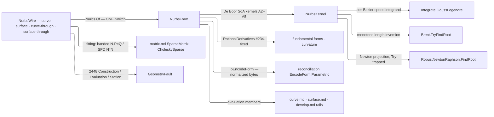

# [RASM_PARAMETRIC_NURBS]

`Rasm.Parametric` owns the host-neutral NURBS engine — the whole rational curve and surface algorithm set in-kernel over `Rhino.Geometry` `Point3d`/`Vector3d`/`Plane` native carriers, control nets held in homogeneous form. `Nurbs.Of` is the ONE polymorphic admission for every wire ingress; evaluation members live on the `NurbsForm` carriers, and the op rails compose this engine from `curve.md`/`surface.md`.

Fitting solves compose the `matrix.md` sparse owners, and arc-length composes `MathNet` for quadrature, length inversion, and Newton projection while the Bezier decomposition and `|C′(t)|` speed integrand stay local. `ToEncodeForm()` projects into the reconciliation `EncodeForm` chain for one content key per curve across every ingress spelling, and a degeneracy-sensitive verdict escalates to the `Numerics/predicates` exact ladder at the consumer seam — evaluation is `double`-only geometry, never the adjudication.

## [01]-[INDEX]

- [01]-[NURBS_ENGINE]: `KnotVector` the normalized-clamped knot algebra with `KnotForm`/`ParametricDirection` vocabularies; `NurbsWire` the admission `[Union]` with `FitKind`/`FitPolicy` fitting rows; `NurbsForm` the curve/surface carrier `[Union]` holding the full evaluation surface; `NurbsPolicy` the engine knob row; `Nurbs.Of` the ONE admission.

## [02]-[NURBS_ENGINE]

- Owner: `Nurbs` mints the static admission surface folding the `NurbsWire` admission `[Union]` into the `NurbsForm` carrier `[Union]`; `KnotVector` owns the knot algebra proving monotone/finite/clamped and admitting both the full and Rhino-trimmed spellings at one seam; `NurbsPolicy` registers `IValidityEvidence`; `ParametricDirection`/`KnotForm` are the `[SmartEnum]` axis and closure-origin discriminants; `FitKind`/`FitPolicy` the fitting generator rows.
- Cases: `NurbsWire` cases `Curve`, `Surface`, `CurveThrough`, `SurfaceThrough` — fitting modality is `FitPolicy` data, so interpolate-versus-approximate mints no case; the surface grid flattens V-inner (`index = u·CountV + v`), the one flattening law the identity projection shares. `NurbsForm` cases `Curve`, `Surface`.
- Entry: `Of` folds every wire shape through one generated `Switch` — explicit wires validate and freeze into the homogeneous columns, fitting wires parameterize, average knots, and solve. No `OfCurve`/`Interpolate` sibling factory — the wire shape discriminates (`MODAL_ARITY`).
- Auto: evaluation is the internalized NURBS-Book kernel set over the columns — point/derivative, arc-length, closest-parameter projection, double-reflection frame, fundamental-form, iso-curve, and Boehm/Oslo refinement machinery re-emitting normalized clamped forms; the fence pins each member to its algorithm number.
- Receipt: none on a dedicated rail — the `NurbsForm` carrier IS the admitted artifact, and `ToEncodeForm()` is its identity seam into the reconciliation `EncodeForm` chain.
- Packages: `MathNet.Numerics` (`Integrate.GaussLegendre` quadrature, `Brent.TryFindRoot` length inversion, `RobustNewtonRaphson.FindRoot` guarded Newton projection); `Rhino.Geometry` (`Point3d`/`Vector3d`/`Plane` native carriers); `Rasm.Numerics` (`SparseMatrix`/`CholeskySparse` fitting solves, `Predicate`/`Sign` exact escalation, `GeometryFault.ParametricFault`/`ParametricStage`, `Dimension` atoms); `Rasm.Spatial` (`EncodeForm`/`EncodeForm.Direction` identity target); `Rasm.Domain` (`Op`, `ValidityClaim`/`IValidityEvidence`); `Thinktecture.Runtime.Extensions`; `LanguageExt.Core` (`Fin`/`Try`/`Arr`/`Seq`/`Option`); BCL inbox.
- Growth: a new evaluation member is one projection over the existing derivative kernels; a new fitting scheme is one `FitKind` row and one solve arm on the same wire cases; a constructive wire (ruled, revolved) is one further `NurbsWire` case folded by the same `Of`; a true unclamped-periodic storage form is one `KnotForm` row and a periodic-aware span/basis arm; degree reduction is one member beside `ElevateDegree` — zero new entry surfaces, zero new carriers.
- Boundary: evaluation members live on `NurbsForm` and the op rails live in `curve.md`/`surface.md`, so an op union here or an evaluation re-derivation there is the altitude violation; the engine speaks `Point3d`/`Vector3d`/`Plane` natively with no private point vocabulary or marshal layer; parameters are the normalized `[0,1]`/`[0,1]²` domain and knots store clamped-normalized with `KnotForm` recording the admitted origin; weights are strictly positive at admission and a zero-or-negative weight is a `Construction` fault, never a NaN downstream; every failure wraps `Fin` + 2448 naming the failing stage and no exception crosses the public surface; RhinoCommon owns the Rhino-host parametric surface and this engine the host-neutral one — a runtime split, never capability — with the Rhino-trimmed knot spelling extending at the wire under one admission law.

```csharp signature
// --- [RUNTIME_PRELUDE] ----------------------------------------------------------------------
using System;
using System.Collections.Generic;
using System.Linq;
using LanguageExt;
using MathNet.Numerics;
using MathNet.Numerics.RootFinding;
using Rasm.Domain;
using Rasm.Numerics;
using Rasm.Spatial;
using Rhino;
using Rhino.Geometry;
using Thinktecture;
using static LanguageExt.Prelude;

namespace Rasm.Parametric;

// --- [TYPES] ------------------------------------------------------------------------------------
// U/V axis discriminant: IsoCurve/SplitAt/Refine/IsClosed dispatch on a row, never a bool.
[SmartEnum<int>]
public sealed partial class ParametricDirection {
    public static readonly ParametricDirection U = new(0);
    public static readonly ParametricDirection V = new(1);
}

// Closure-origin vocabulary: storage is always clamped-normalized; a periodic wire admits through
// end-clamping and keeps its origin row. True periodic storage is the recorded growth row here.
[SmartEnum<string>]
[KeyMemberEqualityComparer<ComparerAccessors.StringOrdinal, string>]
[KeyMemberComparer<ComparerAccessors.StringOrdinal, string>]
public sealed partial class KnotForm {
    public static readonly KnotForm Clamped  = new("clamped");
    public static readonly KnotForm Periodic = new("periodic");
}

[SmartEnum<string>]
[KeyMemberEqualityComparer<ComparerAccessors.StringOrdinal, string>]
[KeyMemberComparer<ComparerAccessors.StringOrdinal, string>]
public sealed partial class FitKind {
    public static readonly FitKind Interpolate = new("interpolate");
    public static readonly FitKind Approximate = new("approximate");
}

// --- [CONSTANTS] --------------------------------------------------------------------------------
// Engine knob row: projection and inversion read this row, threaded per call or defaulted to Canonical.
public sealed record NurbsPolicy(
    int GaussOrder, double LengthTolerance, int ProjectIterations, double ProjectTolerance,
    int ProjectSubdivision, bool FrameClosure) : IValidityEvidence {
    public static readonly NurbsPolicy Canonical = new(
        GaussOrder: 32, LengthTolerance: 1e-9, ProjectIterations: 64, ProjectTolerance: 1e-10,
        ProjectSubdivision: 20, FrameClosure: true);

    public bool IsValid => ValidityClaim.All(
        ValidityClaim.Positive(value: GaussOrder),
        ValidityClaim.Positive(value: LengthTolerance),
        ValidityClaim.Positive(value: ProjectIterations),
        ValidityClaim.Positive(value: ProjectTolerance),
        ValidityClaim.Positive(value: ProjectSubdivision));
}

public sealed record FitPolicy(
    FitKind Kind, int Degree, bool Centripetal,
    Option<Vector3d> StartTangent = default, Option<Vector3d> EndTangent = default,
    Option<int> ControlCount = default) {
    public static readonly FitPolicy Canonical = new(FitKind.Interpolate, Degree: 3, Centripetal: false);
}

// --- [MODELS] -----------------------------------------------------------------------------------
// Knot algebra normalized to [0,1] and proven clamped at construction, so one curve yields one content
// key. Of admits both wire spellings — full clamped (n+p+1) and Rhino-trimmed (n+p−1, end knots
// duplicated at the seam) — so host ingress meets one law.
public readonly record struct KnotVector(int Degree, Arr<double> Knots) {
    public int Count => Knots.Count;
    public int ControlCount => Knots.Count - Degree - 1;

    public static Fin<KnotVector> Of(int degree, ReadOnlySpan<double> raw, Op? key = null) {
        if (degree < 1 || raw.Length < 2 * degree) { return Fail("degree under 1 or knot vector under the trimmed floor"); }
        (double lo, double hi) = (raw[0], raw[^1]);
        if (!double.IsFinite(lo) || !double.IsFinite(hi) || hi <= lo) { return Fail("degenerate knot extent"); }
        double[] knots = new double[raw.Length];
        for (int i = 0; i < raw.Length; i++) {
            double k = (raw[i] - lo) / (hi - lo);
            if (!double.IsFinite(k) || (i > 0 && k < knots[i - 1])) { return Fail($"non-monotone or non-finite knot at {i}"); }
            knots[i] = k;
        }
        int head = 0;
        while (head < knots.Length && knots[head] == 0.0) { head++; }
        int tail = 0;
        while (tail < knots.Length && knots[^(tail + 1)] == 1.0) { tail++; }
        // Two admitted spellings, discriminated by END MULTIPLICITY: full clamped carries degree+1
        // repeats, the Rhino-trimmed wire carries degree and extends by one duplicate per end.
        double[] full = (head, tail) switch {
            (int h, int t) when h == degree + 1 && t == degree + 1 => knots,
            (int h, int t) when h == degree && t == degree => [0.0, .. knots, 1.0],
            _ => [],
        };
        return full.Length == 0 ? Fail("unclamped knot vector — neither the full nor the trimmed spelling")
            : full.Length - degree - 1 < degree + 1 ? Fail("control extent under degree + 1")
            : Fin.Succ(new KnotVector(degree, new Arr<double>(full)));

        static Fin<KnotVector> Fail(string witness) =>
            Fin.Fail<KnotVector>(new GeometryFault.ParametricFault(ParametricStage.Construction, nameof(KnotVector), witness).ToError());
    }

    // A2.1 span search over the normalized domain; t == 1 lands on the last non-degenerate span.
    public int SpanAt(double t) {
        int n = ControlCount - 1;
        if (t >= Knots[n + 1]) { return n; }
        (int lo, int hi) = (Degree, n + 1);
        while (hi - lo > 1) {
            int mid = (lo + hi) >> 1;
            if (t < Knots[mid]) { hi = mid; } else { lo = mid; }
        }
        return lo;
    }

    public Arr<double> Merged(ReadOnlySpan<double> inserts) =>
        new([.. Knots.Concat(inserts.ToArray()).Order()]);
}

// Admission wire: explicit nets and sample sets are both raw ingress, fitting modality is FitPolicy
// data. Grid flattening is V-inner (index = u·CountV + v) — the one law the identity projection shares.
[Union(ConversionFromValue = ConversionOperatorsGeneration.None)]
public abstract partial record NurbsWire {
    private NurbsWire() { }

    public sealed record Curve(int Degree, Arr<double> Knots, Arr<Point3d> Points, Arr<double> Weights, KnotForm Origin) : NurbsWire;
    public sealed record Surface(int DegreeU, int DegreeV, Arr<double> KnotsU, Arr<double> KnotsV, int CountU, Arr<Point3d> Grid, Arr<double> Weights, KnotForm Origin) : NurbsWire;
    public sealed record CurveThrough(Arr<Point3d> Samples, FitPolicy Policy) : NurbsWire;
    public sealed record SurfaceThrough(int CountU, Arr<Point3d> Samples, FitPolicy Policy) : NurbsWire;
}

// --- [OPERATIONS] ---------------------------------------------------------------------------
// Carrier union: evaluation members live on the cases over homogeneous SoA columns, shared identity
// projections on the base. Op rails live in curve.md / surface.md.
[Union(ConversionFromValue = ConversionOperatorsGeneration.None)]
public abstract partial record NurbsForm {
    private NurbsForm() { }

    // --- [CURVE_CARRIER]
    public sealed record Curve : NurbsForm {
        internal Curve(KnotVector knots, double[] wx, double[] wy, double[] wz, double[] w, KnotForm origin) {
            (Knots, WX, WY, WZ, W, Origin) = (knots, wx, wy, wz, w, origin);
        }

        public KnotVector Knots { get; }
        public KnotForm Origin { get; }
        internal double[] WX { get; }  // homogeneous SoA columns
        internal double[] WY { get; }
        internal double[] WZ { get; }
        internal double[] W { get; }

        public int ControlCount => W.Length;
        public Arr<Point3d> ControlPoints => new([.. Enumerable.Range(0, W.Length).Select(i => new Point3d(WX[i] / W[i], WY[i] / W[i], WZ[i] / W[i]))]);
        public Arr<double> Weights => new((double[])W.Clone());
        public bool IsClosed => PointAt(0.0).DistanceTo(PointAt(1.0)) <= RhinoMath.ZeroTolerance;

        // A3.1/A4.1 homogeneous De Boor combination, dehomogenized at the return.
        public Point3d PointAt(double t);

        // A2.3 + A4.2: homogeneous derivatives Leibniz-corrected to rational C', C'', … C^(n).
        public (Point3d Point, Vector3d[] Derivatives) RationalDerivatives(double t, int order = 1);

        public Vector3d TangentAt(double t);
        public Vector3d CurvatureAt(double t);

        // Bezier-decomposed Gauss-Legendre arc-length: DecomposeIntoBeziers once (cached), then
        // Integrate.GaussLegendre(|C'|, a, b, policy.GaussOrder) per segment into a cumulative table.
        public double Length(NurbsPolicy? policy = null);
        public double LengthAt(double t, NurbsPolicy? policy = null);

        // Monotone inversion: bracket the containing Bezier segment off the cumulative table, then
        // Brent.TryFindRoot(s(t) − target, ...) — the no-throw bool maps straight to the rail.
        public Fin<double> ParameterAtLength(double length, NurbsPolicy? policy = null);

        public Fin<Point3d> PointAtLength(double length, NurbsPolicy? policy = null);

        // Chord inversion for DivideByChordLength-class rails: Brent on the monotone-along-curve
        // |C(t) − C(t0)| − chord over the forward bracket, same knobs and rail.
        public Fin<double> ParameterAtChordLength(double t0, double chordLength, NurbsPolicy? policy = null);

        // Newton projection on g(t) = (C−P)·C' with g' = |C'|² + (C−P)·C'': polygon-sampled seed
        // bracket, RobustNewtonRaphson.FindRoot under the policy knobs, Try-trapped to the rail.
        public Fin<double> ClosestParameter(Point3d probe, NurbsPolicy? policy = null);

        // Wang-2008 double-reflection RMF: coincident samples carry the prior frame forward (NaN guard);
        // a closed curve under FrameClosure distributes the terminal defect −φ·sᵢ/s_total as tangent twists.
        public Fin<Plane[]> PerpendicularFrames(ReadOnlySpan<double> parameters, NurbsPolicy? policy = null);

        public Fin<(Curve Head, Curve Tail)> SplitAt(double t);
        public Fin<Curve> SubCurve(double t0, double t1);
        public Fin<Curve> Refine(ReadOnlySpan<double> insertions);   // Boehm/Oslo insertion (A5.4)
        public Fin<Curve> ElevateDegree(int target);                 // A5.9
        public Fin<Curve[]> DecomposeIntoBeziers();                  // A5.6 — the length engine's substrate
        public Curve Reverse();
    }

    // --- [SURFACE_CARRIER]
    public sealed record Surface : NurbsForm {
        internal Surface(KnotVector knotsU, KnotVector knotsV, double[] wx, double[] wy, double[] wz, double[] w, KnotForm origin) {
            (KnotsU, KnotsV, WX, WY, WZ, W, Origin) = (knotsU, knotsV, wx, wy, wz, w, origin);
        }

        public KnotVector KnotsU { get; }
        public KnotVector KnotsV { get; }
        public KnotForm Origin { get; }
        internal double[] WX { get; }
        internal double[] WY { get; }
        internal double[] WZ { get; }
        internal double[] W { get; }

        public int CountU => KnotsU.ControlCount;
        public int CountV => KnotsV.ControlCount;
        public Arr<Point3d> ControlPoints => new([.. Enumerable.Range(0, W.Length).Select(i => new Point3d(WX[i] / W[i], WY[i] / W[i], WZ[i] / W[i]))]);
        public Arr<double> Weights => new((double[])W.Clone());
        public bool IsClosed(ParametricDirection direction);

        public Point3d PointAt(double u, double v);

        // PUBLIC, metric-true, nothing unitized: SKL[k][l] = ∂^{k+l}S/∂u^k∂v^l with k the u-order row
        // and l the v-order column (A3.6 + A4.4).
        public Vector3d[][] RationalDerivatives(double u, double v, int order = 1);

        public Fin<Vector3d> NormalAt(double u, double v);

        // First/second fundamental forms off RationalDerivatives(u, v, 2); a degenerate normal
        // (|Su×Sv| under the scale floor) routes the Evaluation fault, never NaN forms.
        public Fin<(double E, double F, double G, double L, double M, double N)> FundamentalForms(double u, double v);

        // Principal curvatures/directions from the closed-form 2×2 shape operator; K Gaussian, H mean.
        public Fin<(double K1, double K2, Vector3d Dir1, Vector3d Dir2, double Gaussian, double Mean)> CurvatureAt(double u, double v);

        // Basis-row contraction at the fixed parameter → a curve-form control net in the other axis.
        public Fin<Curve> IsoCurve(double parameter, ParametricDirection direction);

        // 2-var Newton over the derivative grid under the policy knobs, Try-trapped. A supplied seed
        // skips the sampled-polygon bracket — surface.md's dense Pullback amortizes seeding through one
        // kd-tree and refines HERE, never a parallel projector.
        public Fin<(double U, double V)> ClosestParameter(Point3d probe, NurbsPolicy? policy = null, Option<(double U, double V)> seed = default);

        public Fin<(Surface Head, Surface Tail)> SplitAt(double parameter, ParametricDirection direction);
        public Fin<Surface> Refine(ReadOnlySpan<double> insertions, ParametricDirection direction);
    }

    // --- [IDENTITY_PROJECTION]
    // Identity seam: degree+knot Direction rows, positive weights, dehomogenized net in the V-inner
    // flattening — EncodeForm.Of re-proves the normalized-clamped gate, so one curve yields ONE content
    // key across every ingress spelling.
    public Fin<EncodeForm> ToEncodeForm(Op? key = null) => Switch(
        state: key,
        curve: static (k, c) => EncodeForm.Of(
            new Arr<EncodeForm.Direction>([new EncodeForm.Direction(c.Knots.Degree, c.Knots.Knots)]),
            c.Weights, c.ControlPoints, k),
        surface: static (k, s) => EncodeForm.Of(
            new Arr<EncodeForm.Direction>([
                new EncodeForm.Direction(s.KnotsU.Degree, s.KnotsU.Knots),
                new EncodeForm.Direction(s.KnotsV.Degree, s.KnotsV.Knots)]),
            s.Weights, s.ControlPoints, k));
}

public static class Nurbs {
    // THE ONE admission: one generated Switch over the wire shape, every failure railed 2448.
    public static Fin<NurbsForm> Of(NurbsWire wire, Op? key = null) =>
        wire.Switch(
            state: key,
            curve:          static (k, c) => AdmitCurve(c, k),
            surface:        static (k, s) => AdmitSurface(s, k),
            curveThrough:   static (k, f) => FitCurve(f.Samples, f.Policy, k),
            surfaceThrough: static (k, f) => FitSurface(f.CountU, f.Samples, f.Policy, k));

    static Fin<NurbsForm> AdmitCurve(NurbsWire.Curve wire, Op? key) =>
        KnotVector.Of(wire.Degree, [.. wire.Knots], key).Bind(knots =>
            knots.ControlCount != wire.Points.Count || wire.Weights.Count != wire.Points.Count
                ? Construction(nameof(NurbsForm.Curve), "control/weight extent disagrees with the knot vector")
                : wire.Weights.Exists(static w => !(w > 0.0)) || wire.Points.Exists(static p => !p.IsValid)
                    ? Construction(nameof(NurbsForm.Curve), "non-positive weight or non-finite control point")
                    : Fin.Succ<NurbsForm>(Freeze(knots, wire.Points, wire.Weights, wire.Origin)));

    static Fin<NurbsForm> AdmitSurface(NurbsWire.Surface wire, Op? key) =>
        (KnotVector.Of(wire.DegreeU, [.. wire.KnotsU], key).ToValidation(),
         KnotVector.Of(wire.DegreeV, [.. wire.KnotsV], key).ToValidation())
        .Apply(static (u, v) => (U: u, V: v)).As().ToFin()
        .Bind(axes => {
            (KnotVector u, KnotVector v) = (axes.U, axes.V);
            return u.ControlCount != wire.CountU || wire.Grid.Count != u.ControlCount * v.ControlCount || wire.Weights.Count != wire.Grid.Count
                ? Construction(nameof(NurbsForm.Surface), "grid extent disagrees with the knot vectors")
                : wire.Weights.Exists(static w => !(w > 0.0)) || wire.Grid.Exists(static p => !p.IsValid)
                    ? Construction(nameof(NurbsForm.Surface), "non-positive weight or non-finite control point")
                    : Fin.Succ<NurbsForm>(FreezeSurface(u, v, wire.Grid, wire.Weights, wire.Origin));
        });

    static NurbsForm.Curve Freeze(KnotVector knots, Arr<Point3d> points, Arr<double> weights, KnotForm origin) {
        int n = points.Count;
        (double[] wx, double[] wy, double[] wz, double[] w) = (new double[n], new double[n], new double[n], new double[n]);
        for (int i = 0; i < n; i++) {
            (wx[i], wy[i], wz[i], w[i]) = (weights[i] * points[i].X, weights[i] * points[i].Y, weights[i] * points[i].Z, weights[i]);
        }
        return new NurbsForm.Curve(knots, wx, wy, wz, w, origin);
    }

    static NurbsForm.Surface FreezeSurface(KnotVector u, KnotVector v, Arr<Point3d> grid, Arr<double> weights, KnotForm origin) {
        int n = grid.Count;
        (double[] wx, double[] wy, double[] wz, double[] w) = (new double[n], new double[n], new double[n], new double[n]);
        for (int i = 0; i < n; i++) {
            (wx[i], wy[i], wz[i], w[i]) = (weights[i] * grid[i].X, weights[i] * grid[i].Y, weights[i] * grid[i].Z, weights[i]);
        }
        return new NurbsForm.Surface(u, v, wx, wy, wz, w, origin);
    }

    // --- [FITTING]
    // Piegl-Tiller: parameterize (chord/centripetal), average knots, solve — interpolation the banded
    // N·P = Q per coordinate (SparseMatrix.FromTriplets + Solve), approximation the SPD NᵀN·P = NᵀQ
    // normal system (CholeskySparse). The surface lane is the two-pass row/column fit.
    static Fin<NurbsForm> FitCurve(Arr<Point3d> samples, FitPolicy policy, Op? key);
    static Fin<NurbsForm> FitSurface(int countU, Arr<Point3d> samples, FitPolicy policy, Op? key);

    internal static Fin<double[]> ParameterizeSamples(Arr<Point3d> samples, bool centripetal, Op? key);  // A9.3 chord/centripetal
    internal static Fin<KnotVector> AveragedKnots(double[] parameters, int degree, int controlCount, Op? key);  // A9.1 averaging

    static Fin<NurbsForm> Construction(string carrier, string witness) =>
        Fin.Fail<NurbsForm>(new GeometryFault.ParametricFault(ParametricStage.Construction, carrier, witness).ToError());
}

// --- [KERNELS] ------------------------------------------------------------------------------
// NURBS-Book kernels over the SoA columns — signature-pinned transcription targets, each pinned to its
// algorithm number below.
internal static class NurbsKernel {
    internal static void BasisFunctions(in KnotVector knots, int span, double t, Span<double> basis);                        // A2.2
    internal static void DersBasisFunctions(in KnotVector knots, int span, double t, int order, Span<double> ders);          // A2.3
    internal static Point3d CurvePoint(NurbsForm.Curve curve, double t);                                                     // A3.1 + A4.1
    internal static (Point3d Point, Vector3d[] Ders) CurveRationalDerivatives(NurbsForm.Curve curve, double t, int order);   // A4.2 Leibniz
    internal static Point3d SurfacePoint(NurbsForm.Surface surface, double u, double v);                                     // A3.5 + A4.3
    internal static Vector3d[][] SurfaceRationalDerivatives(NurbsForm.Surface surface, double u, double v, int order);       // A3.6 + A4.4, #234-fixed [k][l]
    internal static NurbsForm.Curve InsertKnot(NurbsForm.Curve curve, double t, int multiplicity);                           // A5.1 Boehm
    internal static NurbsForm.Curve[] BezierSegments(NurbsForm.Curve curve);                                                 // A5.6 full-multiplicity decomposition
    internal static NurbsForm.Curve Elevate(NurbsForm.Curve curve, int target);                                              // A5.9

    // Composed numeric seam: per-Bezier GL speed integrals into the cumulative table, Brent inversion
    // off the bracketing segment.
    internal static double[] CumulativeLengths(NurbsForm.Curve curve, NurbsPolicy policy) {
        NurbsForm.Curve[] segments = BezierSegments(curve);
        double[] cumulative = new double[segments.Length + 1];
        for (int s = 0; s < segments.Length; s++) {
            NurbsForm.Curve segment = segments[s];
            cumulative[s + 1] = cumulative[s] + Integrate.GaussLegendre(
                t => CurveRationalDerivatives(segment, t, 1).Ders[0].Length, 0.0, 1.0, policy.GaussOrder);
        }
        return cumulative;
    }

    internal static Fin<double> InvertLength(NurbsForm.Curve curve, double[] cumulative, double target, NurbsPolicy policy) {
        int at = Array.BinarySearch(cumulative, target);
        (double lo, double hi) = SegmentDomain(curve, int.Clamp(at >= 0 ? at : ~at - 1, 0, cumulative.Length - 2));
        return Brent.TryFindRoot(
                t => LengthTo(curve, cumulative, t, policy) - target, lo, hi,
                policy.LengthTolerance, policy.ProjectIterations, out double root)
            ? Fin.Succ(root)
            : Fin.Fail<double>(new GeometryFault.ParametricFault(ParametricStage.Station, nameof(NurbsForm.Curve), $"length inversion unconverged at {target}").ToError());
    }

    internal static Fin<double> NewtonProject(NurbsForm.Curve curve, Point3d probe, double seedLo, double seedHi, NurbsPolicy policy) =>
        Try.lift(() => RobustNewtonRaphson.FindRoot(
                t => Distance(curve, probe, t, 1),
                t => Distance(curve, probe, t, 2),
                seedLo, seedHi, policy.ProjectTolerance, policy.ProjectIterations, policy.ProjectSubdivision))
            .Run()
            .MapFail(static error => new GeometryFault.ParametricFault(ParametricStage.Evaluation, nameof(NurbsForm.Curve), error.Message).ToError());

    internal static double Distance(NurbsForm.Curve curve, Point3d probe, double t, int form);  // g / g' bodies over CurveRationalDerivatives
    internal static double LengthTo(NurbsForm.Curve curve, double[] cumulative, double t, NurbsPolicy policy);
    internal static (double Lo, double Hi) SegmentDomain(NurbsForm.Curve curve, int segment);

    // Wang-2008 double reflection with the coincident-sample guard and the closed-curve closure correction.
    internal static Fin<Plane[]> DoubleReflectionFrames(NurbsForm.Curve curve, ReadOnlySpan<double> parameters, NurbsPolicy policy);
}
```



## [03]-[DENSITY_BAR]

One owner per axis; capability is a case, row, or member on the owning carrier, never a sibling surface.

| [INDEX] | [AXIS_CONCERN] | [OWNER]                          | [RAIL]                      | [CASES] |
| :-----: | :------------- | :------------------------------- | :-------------------------- | :-----: |
|  [01]   | Admission      | `NurbsWire` + `Nurbs`            | `Nurbs.Of → Fin<NurbsForm>` |    4    |
|  [02]   | Carrier        | `NurbsForm`                      | member `Fin` rails          |    2    |
|  [03]   | Knot algebra   | `KnotVector`                     | `Of → Fin<KnotVector>`      |    —    |
|  [04]   | Engine knobs   | `NurbsPolicy`                    | `IValidityEvidence`         |    —    |
|  [05]   | Fitting rows   | `FitKind`/`FitPolicy`            | fitting-wire data           |    2    |
|  [06]   | Vocabularies   | `ParametricDirection`/`KnotForm` | discriminants               |   2·2   |

- [01]-[ADMISSION]: `[Union]` wire shapes folded by ONE `Of` (`MODAL_ARITY` — fitting is policy data).
- [02]-[CARRIER]: `[Union]` `Curve`/`Surface` over homogeneous SoA columns, evaluation members ON the cases.
- [03]-[KNOT_ALGEBRA]: normalized-clamped vector, span search, and merge, both wire spellings admitted at one seam.
- [04]-[ENGINE_KNOBS]: policy row — Gauss order, inversion tolerance, projection knobs, frame-closure row.
- [05]-[FITTING_ROWS]: generator rows — interpolate/approximate, degree, parameterization, tangents, budget.
- [06]-[VOCABULARIES]: `[SmartEnum]` U/V axis rows, clamped/periodic origin rows.

`NurbsKernel` signatures are the owned textbook-arithmetic transcription targets; the page's own bodies are the composed library seams — that split between owned arithmetic and composed depth is the density law.

## [04]-[RESEARCH]

<!-- source-only: research row template:
[TOKEN]-[OPEN|BLOCKED]: <exact question>; <verification route>.
[SPLIT_MEMBER]-[OPEN]: does `shape-core` expose `split_all`; verify against the member rail.
-->

(none)
