# [RASM_PARAMETRIC_PANELIZE]

`Panelization` owns cross-field-guided panelization: `Apply` maps a UV-provenanced surface into a panel graph whose every panel leaves with a placement frame — origin, field-aligned x-axis, and metric-true binding normal — because position without orientation is half a panel. `PanelFamily` rides the request as data, so a new family is one case over the shared assembly fold rather than a sibling mapper, and per-panel planarity is the fabrication acceptance measure whose breach routes a fault instead of shipping an unfabricatable lattice.

Input is `surface.md`'s `SurfaceResult.UvTessellation` — mesh, per-vertex `(u, v)`, and live `NurbsForm.Surface` binding — so an unbound mesh cannot enter and every `PanelField` keeps its UV provenance. `Lattice` consumes the remesh substrate's `QuadProvenance` without re-running any field solve while `Seeded` lands geodesic-Voronoi cells over the `sample.md` distribution suite, `Symmetry` the one n-RoSy integer keying both arms; adjacency folds through a transient QuikGraph and leaves as SoA columns, never a leaked graph type.

## [01]-[INDEX]

- [01]-[PANELIZATION]: `PanelFamily` family-as-data folded by one `Panelization.Apply` into a placement-framed, planarity-gated `PanelField` panel graph.

## [02]-[PANELIZATION]

- Owner: `Panelization` mints the one static entry; `PanelFamily` carries the family as data, `PanelPolicy` the `IValidityEvidence` policy row, `PanelField` the panel-graph-plus-frame SoA wire, `PanelReceipt` the evidence, `PanelResult` the carrier.
- Cases: `PanelFamily` cases `Lattice` and `Seeded` — the substrate-guided lattice and the sample-suite distribution, `Symmetry` the one n-RoSy integer keying both; `PanelOp` cases `Map` and `Planarize` — generation versus fabrication-correction, `Planarize` consuming `Map`'s carrier.
- Entry: `public static Fin<PanelResult> Apply(PanelOp op, Op? key = null)` — the one entry discriminating on the op case, the family arm discriminating inside it.
- Auto: `Map`+`Lattice` binds the substrate's `QuadProvenance` as the panel lattice and restores UV through one batch `Pullback`; `Map`+`Seeded` lands geodesic-Voronoi cells from cached heat-distance labels walled at the equidistance lerp. Both arms assemble identically — Newell plane per panel, planarity defect, adjacency folded through a transient graph into offset columns — and `Planarize` runs bounded proximal rounds toward `PlanarityBudget`, keeping each panel's pre-planarization UV feet.
- Receipt: `PanelReceipt` carries the panel/vertex/component census, max/mean planarity, singular-face count, and planarize rounds — the panelization-gate evidence; the substrate's `RemeshTrace` and the seed suite's `SampleReceipt` stay upstream.
- Packages: `Rasm.Processing` for the remesh substrate (`QuadProvenance`) and the seed suite (`SampleKind`, `SampleKernel`, `SegmentKernel.CrossFieldAt`, `GeodesicKernel`); `Rasm.Parametric` `surface.md` for the `UvTessellation` input and `Pullback` restore and `nurbs.md` for the frame normals; `Rasm.Spatial` `ScalarField` for density seeds; `Rasm.Numerics` `GeometryFault`; `Rasm.Domain` `Op`/`Context`/`IValidityEvidence`; QuikGraph for the transient adjacency fold; Rhino.Geometry, Thinktecture.Runtime.Extensions, LanguageExt.Core.
- Growth: a new panel family is one `PanelFamily` case over the same assembly fold; a new seed distribution is one `SampleKind` row; a new panel measure is one `PanelField` column; a fabrication-nesting order is one projection off the adjacency columns.
- Boundary: the field solve is the substrate's — a `CrossFieldAt`/`StripeAt` loop here is the named re-derivation defect, the lattice arm consuming `QuadProvenance` whole, its sole local frame read (stripe-U off the quad's own corners) holding only because the emitted geometry is the integrated field. Output keeps provenance — a wire without UV columns is the named drop, restored by one batch `Pullback` never a per-vertex `ClosestParameter` loop; seeded labels are geodesic, a Euclidean nearest-seed the named naivety defect across folds. `Planarize` fits per-panel planes and never parameterizes, a conformal or ARAP energy belonging to `flatten.md`; QuikGraph stays transient with adjacency leaving as offset columns, a stored graph field the named lane violation; every failure routes `DevelopmentFault(Panel, …)` with the panel unit and its planarity or admission witness, composed rails surfacing their own faults untranslated.

```csharp signature
// --- [RUNTIME_PRELUDE] ----------------------------------------------------------------------
using System;
using System.Collections.Generic;
using System.Linq;
using LanguageExt;
using QuikGraph;
using QuikGraph.Algorithms;
using Rasm.Domain;
using Rasm.Meshing;
using Rasm.Numerics;
using Rasm.Processing;
using Rasm.Spatial;
using Rhino.Geometry;
using Thinktecture;
using static LanguageExt.Prelude;

namespace Rasm.Parametric;

// --- [TYPES] ------------------------------------------------------------------------------------
// Family as data; Symmetry is the one n-RoSy integer ({1,2,4,6} at CrossField admission) — the lattice cell axis and the seeded frame alignment.
[Union(ConversionFromValue = ConversionOperatorsGeneration.None)]
public abstract partial record PanelFamily {
    private PanelFamily() { }

    public sealed record Lattice(int Symmetry, double TargetLength) : PanelFamily;
    public sealed record Seeded(SampleKind Seeds, int Symmetry) : PanelFamily;
}

// --- [CONSTANTS] --------------------------------------------------------------------------------
// PlanarityBudget is the fabrication acceptance ceiling — max vertex-plane deviation over panel diameter; Remesh/Pullback thread substrate policy.
public sealed record PanelPolicy(
    double PlanarityBudget, int PlanarizeRounds, RemeshPolicy Remesh, PullbackPolicy Pullback) : IValidityEvidence {
    public static readonly PanelPolicy Canonical = new(
        PlanarityBudget: 5e-3, PlanarizeRounds: 32, RemeshPolicy.Canonical, PullbackPolicy.Canonical);

    public bool IsValid => ValidityClaim.All(
        ValidityClaim.Positive(value: PlanarityBudget),
        ValidityClaim.Positive(value: PlanarizeRounds),
        ValidityClaim.Evidence(evidence: Remesh),
        ValidityClaim.Evidence(evidence: Pullback));
}

// --- [MODELS] -----------------------------------------------------------------------------------
// Panel-graph SoA wire — graph results as columns, never a leaked graph type; y = ZAxis × XAxis derived at the consumer.
public sealed record PanelField(
    Arr<int> CornerOffsets, Arr<int> Corners, Arr<Point3d> Vertices, Arr<Point2d> Uv,
    Arr<Point3d> Origin, Arr<Vector3d> XAxis, Arr<Vector3d> ZAxis, Arr<double> Planarity,
    Arr<int> PatchOf, Arr<int> AdjacencyOffsets, Arr<int> Adjacent, Arr<int> Component);

public sealed record PanelReceipt(
    int Panels, int Vertices, int Components, double MaxPlanarity, double MeanPlanarity, int SingularFaces, int Rounds);

public sealed record PanelResult(PanelField Field, PanelReceipt Receipt);

// --- [OPERATIONS] ---------------------------------------------------------------------------
[Union(ConversionFromValue = ConversionOperatorsGeneration.None)]
public abstract partial record PanelOp {
    private PanelOp() { }

    public sealed record Map(SurfaceResult.UvTessellation Source, PanelFamily Family, PanelPolicy Policy) : PanelOp;
    public sealed record Planarize(PanelResult Prior, PanelPolicy Policy) : PanelOp;
}

public static class Panelization {
    public static Fin<PanelResult> Apply(PanelOp op, Op? key = null) =>
        op.Switch(
            state: key,
            map: static (k, m) => !m.Policy.IsValid
                ? Fault<PanelResult>(unit: 0, witness: m.Policy.PlanarityBudget)
                : m.Family.Switch(
                    state: (m.Source, m.Policy, Key: k),
                    lattice: static (s, f) => LatticePanels(s.Source, f, s.Policy, s.Key),
                    seeded:  static (s, f) => SeededPanels(s.Source, f, s.Policy, s.Key)),
            planarize: static (k, p) => PlanarizeOf(p.Prior, p.Policy, k));

    // --- [LATTICE]
    // Substrate does the field work once: QuadField lands conditioning, two memoized Knöppel solves, integer-isoline quads;
    // this arm binds QuadProvenance and restores UV through one batch Pullback over the rewritten geometry.
    static Fin<PanelResult> LatticePanels(SurfaceResult.UvTessellation source, PanelFamily.Lattice family, PanelPolicy policy, Op? key) =>
        Remeshing.Apply(new RemeshOp.QuadField(source.Mesh, family.TargetLength, family.Symmetry, policy.Remesh), key)
            .Bind(remesh => remesh.Quads.Match(
                Some: quads => Reprovenance(source, remesh.Mesh, policy, key)
                    .Bind(uv => Assemble(source, LatticeBuild(remesh.Mesh, quads, uv), fieldSymmetry: None, policy, key)),
                None: () => Fault<PanelResult>(unit: 0, witness: 0.0)));

    static Fin<Arr<Point2d>> Reprovenance(SurfaceResult.UvTessellation source, MeshSpace emitted, PanelPolicy policy, Op? key);
    // One Surfaces.Apply(SurfaceOp.Pullback) batch over the kd-tree-seeded engine Newton; a per-vertex ClosestParameter loop is the deleted form.

    static PanelBuild LatticeBuild(MeshSpace emitted, QuadProvenance quads, Arr<Point2d> uv);
    // Quads → 4-corner offset rows over the emitted vertex columns; PatchOf carries through, SingularFaces into the census.

    // --- [SEEDED]
    // Seeds land through the receipt-bearing sample suite; labels are geodesic argmin — k cached heat solves over one pre-factored Laplacian.
    // Walls cross label-boundary edges at the equidistance lerp, one weight interpolating world AND uv — provenance, never re-projection.
    static Fin<PanelResult> SeededPanels(SurfaceResult.UvTessellation source, PanelFamily.Seeded family, PanelPolicy policy, Op? key) =>
        ExtractionDomain.Mesh(source.Mesh, key)
            .Bind(domain => SampleKernel.Sample(family.Seeds, domain, source.Mesh.Tolerance, key.OrDefault()))
            .Bind(seeds => SeededCells(source, seeds.Points, key))
            .Bind(build => Assemble(source, build, fieldSymmetry: Some(family.Symmetry), policy, key));

    static Fin<PanelBuild> SeededCells(SurfaceResult.UvTessellation source, Seq<Point3d> seeds, Op? key);
    // Each seed snaps to its nearest tessellation vertex; per-seed EnsureGeodesicDistances → per-vertex argmin labels →
    // wall crossings at t = δ(u)/(δ(u) − δ(v)) chained into closed cell polygons; an unclosable chain routes 2449 Panel naming the cell.

    internal readonly record struct PanelBuild(
        Arr<int> CornerOffsets, Arr<int> Corners, Arr<Point3d> Vertices, Arr<Point2d> Uv, Arr<int> PatchOf, int SingularFaces);

    // --- [ASSEMBLY]
    // Frames, defects, graph (family-agnostic): Newell plane per panel, planarity = max vertex-plane dist / diameter, adjacency transient → columns.
    static Fin<PanelResult> Assemble(
        SurfaceResult.UvTessellation source, PanelBuild build, Option<int> fieldSymmetry, PanelPolicy policy, Op? key) {
        int panels = build.CornerOffsets.Count - 1;
        UndirectedGraph<int, SEdge<int>> graph = new(allowParallelEdges: false);
        graph.AddVertexRange(Enumerable.Range(0, panels));
        foreach ((int a, int b) in SharedWalls(build)) { graph.AddEdge(new SEdge<int>(a, b)); }
        Dictionary<int, int> componentOf = new();
        int components = graph.ConnectedComponents(componentOf);
        (Arr<int> offsets, Arr<int> adjacent) = AdjacencyColumns(graph, panels);
        return Frames(source, build, fieldSymmetry, key).Map(frames => {
            (Arr<double> planarity, double max, double mean) = PlanarityOf(build);
            return new PanelResult(
                new PanelField(
                    build.CornerOffsets, build.Corners, build.Vertices, build.Uv,
                    frames.Origin, frames.X, frames.Z, planarity, build.PatchOf, offsets, adjacent,
                    new Arr<int>([.. Enumerable.Range(0, panels).Select(p => componentOf.GetValueOrDefault(p))])),
                new PanelReceipt(panels, build.Vertices.Count, components, max, mean, build.SingularFaces, Rounds: 0));
        });
    }

    static Seq<(int A, int B)> SharedWalls(PanelBuild build);
    static (Arr<int> Offsets, Arr<int> Adjacent) AdjacencyColumns(UndirectedGraph<int, SEdge<int>> graph, int panels);
    static (Arr<double> Planarity, double Max, double Mean) PlanarityOf(PanelBuild build);

    static Fin<(Arr<Point3d> Origin, Arr<Vector3d> X, Arr<Vector3d> Z)> Frames(
        SurfaceResult.UvTessellation source, PanelBuild build, Option<int> fieldSymmetry, Op? key);
    // z = Source.NormalAt at panel mean UV (degenerate → fault, never NaN). x: lattice (None) = stripe-U mean edge ((c₁+c₂)−(c₀+c₃))/2;
    // seeded (Some n) = SegmentKernel.CrossFieldAt(space, n, None, None, origin, key); x re-orthogonalizes into the tangent plane, y = z × x.

    // --- [PLANARIZE]
    // Bounded proximal rounds — monotone in max defect, early exit inside budget: Newell fit per panel, every vertex → MEAN of incident projections.
    // Frames re-derive from the planarized planes; UV columns keep the pre-planarization feet — planar panels leave the surface by design.
    static Fin<PanelResult> PlanarizeOf(PanelResult prior, PanelPolicy policy, Op? key) =>
        Range(0, policy.PlanarizeRounds).Fold(
                Fin.Succ((Field: prior.Field, Max: prior.Receipt.MaxPlanarity, Rounds: 0)),
                (state, _) => state.Bind(s => s.Max <= policy.PlanarityBudget
                    ? Fin.Succ(s)
                    : ProjectRound(s.Field).Map(next => (next.Field, next.Max, s.Rounds + 1))))
            .Bind(final => final.Max > policy.PlanarityBudget
                ? Fault<PanelResult>(unit: WorstPanel(final.Field), witness: final.Max)
                : Fin.Succ(new PanelResult(final.Field, prior.Receipt with {
                    MaxPlanarity = final.Max, MeanPlanarity = MeanPlanarity(final.Field), Rounds = final.Rounds })));

    static Fin<(PanelField Field, double Max)> ProjectRound(PanelField field);
    static int WorstPanel(PanelField field);
    static double MeanPlanarity(PanelField field);

    static Fin<T> Fault<T>(int unit, double witness) =>
        Fin.Fail<T>(new GeometryFault.DevelopmentFault(DevelopmentStage.Panel, unit, witness).ToError());
}
```

```mermaid
flowchart LR
    UvT["surface.md UvTessellation — mesh + (u,v) + binding"] -->|"Panelization.Apply — ONE Switch"| Family["PanelFamily — data rows"]
    Family -->|"Lattice: Remeshing.Apply(QuadField)"| Remesh["remesh.md QuadProvenance channels"]
    Remesh -->|"ONE batch Pullback — provenance restore"| Build["PanelBuild — polygons + UV"]
    Family -->|"Seeded: SampleKernel.Sample over ExtractionDomain.Mesh"| Seeds["sample.md CCVT / blue-noise seeds"]
    Seeds -->|"k cached heat solves → argmin labels → lerp walls"| Build
    Build -->|"Newell planes · planarity defects · CrossFieldAt / stripe-U frames"| Field["PanelField — frames + defects"]
    Build -->|"transient UndirectedGraph → adjacency + components"| Field
    Field -->|"bounded proximal rounds toward PlanarityBudget"| Planar["Planarize — fabrication grade"]
    Field --> Gate["Generation panelization gate"]
    UvT -.->|"2449 Panel — witness = planarity defect"| GeometryFault
```



## [03]-[RESEARCH]

<!-- source-only: research row template:
[TOKEN]-[OPEN|BLOCKED]: <exact question>; <verification route>.
[SPLIT_MEMBER]-[OPEN]: does `shape-core` expose `split_all`; verify against the member rail.
-->

(none)
