# [RASM_PARAMETRIC_PANELIZE]

The cross-field-guided panelization owner of `Rasm.Parametric` — `Fin<PanelResult> Panelization.Apply(PanelOp, Op? key = null)` maps a UV-provenanced surface into a panel GRAPH with per-panel PLACEMENT FRAMES: position without orientation is half a panel, so every panel leaves with its origin, its field-aligned x-axis, and the metric-true binding normal as one frame row. The panel family is DATA on the request, never a sibling mapper: `Lattice` composes the row-19 remesh substrate — `Remeshing.Apply(RemeshOp.QuadField)` runs the landed Knöppel cross-field/stripe solve and this page consumes its `QuadProvenance` channels (quad corners, patch labels, per-vertex stripe coordinates, singular faces) WITHOUT re-running any field solve — with `int Symmetry` owning the quad/diagrid/tri variation as one integer (4 quads, 6 diagrid/tri, proven ∈ {1,2,4,6} at the `VectorField.CrossField` admission); `Seeded` composes the `sample.md` distribution suite — `SampleKind` rows (CCVT `PowerCcvtCase` for capacity-fair panel areas, `SampleEliminationCase`/`PoissonDiskCase` blue noise, `ScalarDensityCase` density-driven — the `fields.md` `ScalarField` riding the seed data) land seed points through `ExtractionDomain.Mesh` and geodesic-Voronoi cells become the panels.

The input is `surface.md`'s `SurfaceResult.UvTessellation` — mesh + per-vertex `(u, v)` + live `NurbsForm.Surface` binding — so an unbound world-space mesh cannot enter by construction, and the OUTPUT keeps the provenance: seeded panel vertices are label-boundary edge crossings whose ONE lerp weight interpolates world AND UV together (the tessellation's own provenance, never a re-projection), while lattice panel vertices — rewritten geometry the remesh emitted — restore provenance through ONE batch `Surfaces.Apply(SurfaceOp.Pullback)` (the kd-tree-seeded engine Newton, never a per-vertex `ClosestParameter` loop). Panel adjacency and connected components fold through a transient QuikGraph and leave as SoA offset columns on `PanelField` — never a leaked graph type. Per-panel PLANARITY is the fabrication acceptance measure: the defect column records each panel's max vertex deviation from its own best-fit plane over the panel diameter, `Planarize` is the bounded proximal improvement pass toward `PlanarityBudget`, and a breach after the round budget routes `GeometryFault.DevelopmentFault(DevelopmentStage.Panel, unit, planarityDefect)` 2449 naming the worst panel instead of shipping an unfabricatable lattice.

## [01]-[INDEX]

- [01]-[PANELIZATION]: `PanelFamily` the two-row family-as-data `[Union]`; `PanelPolicy` the planarity/round/substrate policy row; `PanelOp` the two-case request `[Union]` folded by ONE `Apply`; `PanelField` the panel-graph + frame SoA wire; `PanelReceipt` the census/planarity evidence; the lattice consumption, seeded-cell, frame, and planarize kernels.

## [02]-[PANELIZATION]

- Owner: `PanelFamily` the family-as-data `[Union]` (`Lattice(Symmetry, TargetLength)` the cross-field-guided arm riding the remesh substrate · `Seeded(Seeds, Symmetry)` the distribution arm riding the sample suite — `Symmetry` on both is the ONE n-RoSy integer: the lattice's quad/diagrid/tri axis and the seeded frames' field-alignment order); `PanelPolicy` the policy row (`PlanarityBudget` the per-panel defect ceiling the acceptance reads · `PlanarizeRounds` the proximal pass budget · `Remesh` the threaded `RemeshPolicy` · `Pullback` the threaded `PullbackPolicy`) registering `IValidityEvidence`; `PanelOp` the request `[Union]`; `PanelField` the SoA wire; `PanelReceipt` the evidence row; `PanelResult` the carrier; `Panelization` the static entry.
- Cases: `PanelFamily` cases 2 (a third family — a conformal-lattice arm over `flatten.md` charts, a stress-aligned arm over a principal-direction field — is one further case over the SAME assembly fold, never a sibling mapper); `PanelOp` cases `Map` · `Planarize` (2 — generation versus fabrication-correction modality, `Planarize` consuming `Map`'s own carrier).
- Entry: `public static Fin<PanelResult> Apply(PanelOp op, Op? key = null)` — the ONE entry discriminating on the op case, the family arm discriminating on the family case inside it; no `PanelizeQuad`/`PanelizeVoronoi`/`PlanarizePanels` sibling family.
- Auto: `Map`+`Lattice` runs `Remeshing.Apply(new RemeshOp.QuadField(source.Mesh, TargetLength, Symmetry, policy.Remesh))` — the isotropic conditioning, the two memoized Knöppel solves, the integer-isoline extraction, and the exact quad triangulation all land in the substrate — then binds `QuadProvenance` directly as the panel lattice: quads become panels (4-corner offset rows), `PatchOf` becomes the patch column, `SingularFaces` counts into the receipt, and ONE batch `Pullback` over the emitted vertices restores the `(u, v)` column; lattice frames read NO field solve — the x-axis is the quad's own stripe-U mean edge `((c₁ + c₂) − (c₀ + c₃))/2` off the extraction's fixed corner ring order `(0,0) → (1,0) → (1,1) → (0,1)` (the field already integrated into geometry; a `CrossFieldAt` re-read at the centroid can disagree with the quad near singularities and is the named substitution defect), the z-axis is the metric-true `Source.NormalAt` at the panel's mean pulled-back UV (a degenerate normal routes the fault, never a NaN frame), and y = z × x after tangent-plane re-orthogonalization. `Map`+`Seeded` admits the mesh through `ExtractionDomain.Mesh`, lands seeds through `SampleKernel.Sample(Seeds, domain, tolerance, key)` (the receipt-bearing suite — capacity residuals and spectrum evidence stay upstream on `SampleReceipt`), labels every tessellation vertex by ARGMIN over per-seed heat distances — k `GeodesicKernel.EnsureGeodesicDistances(space, [seed], key)` calls, ONE pre-factored Laplacian pair amortizing all k cached RHS solves, the heat method's own economy — then walls each cell at label-boundary edge crossings placed by the equidistance lerp `t = δ(u)/(δ(u) − δ(v))` over the distance difference, ONE weight interpolating world and UV; wall crossings chain into closed cell polygons (offset rows, n-gon arity), seeded frames read x = `SegmentKernel.CrossFieldAt(space, Symmetry, None, None, origin, key)` (field-aligned placement over the memoized solve) and the same binding-normal z. Both arms then assemble identically: Newell plane per panel (normal + centroid — the same polygon-normal fold the remesh flip gate projects through), planarity defect per panel, adjacency from shared walls/edges folded through a transient `UndirectedGraph<int, SEdge<int>>` into `AdjacencyOffsets`/`Adjacent` + `ConnectedComponents` into the `Component` column. `Planarize` runs bounded proximal rounds over a prior result: per round every panel fits its Newell plane and every vertex moves to the MEAN of its incident panels' plane projections (shared vertices negotiate — the shape-preserving compromise), defects re-measure, the loop exits early inside `PlanarityBudget`; frames re-derive from the planarized panels' own planes, the UV columns KEEP the pre-planarization feet (planar panels leave the surface by design — the provenance records where each vertex came from), and exhaustion outside the budget routes 2449 `Panel` naming the worst panel with its defect as witness.
- Receipt: `PanelReceipt` — panel/vertex/component census, max/mean planarity, singular-face count, planarize rounds spent — the Generation panelization-gate evidence; upstream receipts stay upstream (`RemeshTrace` on the substrate, `SampleReceipt`/`PowerCcvtReceipt` on the seed suite) — this page never re-carries them.
- Packages: `Rasm.Processing` (`Remeshing.Apply`/`RemeshOp.QuadField`/`RemeshResult`/`QuadProvenance` — the row-19 substrate, the ONE field-guided lattice source), `Rasm.Parametric` `surface.md` (`SurfaceResult.UvTessellation` the input carrier; `Surfaces.Apply(SurfaceOp.Pullback)` + `PullbackPolicy` the provenance restore) + `nurbs.md` (`NurbsForm.Surface.NormalAt` — the frame normals), `Rasm.Meshing` (`MeshSpace`), `Rasm.Processing` (`SampleKind`/`ExtractionDomain.Mesh`/`SampleKernel.Sample` the seed suite; `SegmentKernel.CrossFieldAt` the seeded frame alignment; `GeodesicKernel.EnsureGeodesicDistances` the label distances), `Rasm.Spatial` (`ScalarField` the density rows riding seed data), `Rasm.Numerics` (`GeometryFault.DevelopmentFault` + `DevelopmentStage`), `Rasm.Domain` (`Op`, `Context`, `ValidityClaim`/`IValidityEvidence`), QuikGraph (`UndirectedGraph<int, SEdge<int>>` + `ConnectedComponents` — transient, results leave as columns), Rhino.Geometry (`Point3d`/`Vector3d`/`Point2d`), Thinktecture.Runtime.Extensions, LanguageExt.Core.
- Growth: a new panel family is one `PanelFamily` case over the SAME assembly/frame/graph fold; a new seed distribution is a `SampleKind` row landing here with zero edits; a new panel measure (torsion of the frame field, edge-length uniformity) is one `PanelField` column off the same sweep; a fabrication-nesting order is one projection off the adjacency columns; zero new entry surfaces, zero new carriers.
- Boundary: this page PARTITIONS a surface into placed panels and `patternmap.md` INSTANCES a motif onto one — sibling Pattern-stage owners, one anchor each, neither absorbs the other; the field solve is the substrate's — a `CrossFieldAt`/`StripeAt` extraction loop here beside `Remeshing.Apply` is the named re-derivation defect (the lattice arm consumes `QuadProvenance`, full stop), and the ONE lattice-frame exception (stripe-U from the quad's own corners) exists because the emitted geometry IS the integrated field; the input is the `UvTessellation` TYPE and the output keeps its provenance — a panel wire without UV columns is the named provenance drop, and the lattice restore is ONE batch `Pullback` (a per-vertex `ClosestParameter` loop is the deleted form); seeded labels are GEODESIC — a Euclidean nearest-seed label on a curved sheet mislabels across folds and is the named naivety defect; `Planarize` is per-panel plane fitting, never parameterization — a conformal energy or an ARAP pass here is `flatten.md`'s tier, and planarized UV columns record pre-planarization feet honestly; QuikGraph containers are transient per call and adjacency leaves as offset columns — a stored graph field or a leaked `IEdge` is the named lane violation; subdivision-surface panel refinement is `subdivide.md`'s charter (its quad publish feeds THIS page's consumers, never the reverse); every failure routes 2449 `Panel` with the panel unit and the planarity (or admission) measure as witness — composed rails surface their own faults untranslated, and no exception crosses the surface.

```csharp signature
// --- [RUNTIME_PRELUDE] ----------------------------------------------------------------------
using System;
using System.Collections.Generic;
using System.Linq;
using LanguageExt;
using QuikGraph;
using QuikGraph.Algorithms;
using Rasm.Domain;
using Rasm.Meshing;
using Rasm.Numerics;
using Rasm.Processing;
using Rhino.Geometry;
using Thinktecture;
using static LanguageExt.Prelude;

namespace Rasm.Parametric;

// --- [TYPES] ------------------------------------------------------------------------------------
// The panel family as DATA: Symmetry is the ONE n-RoSy integer (4 quads, 6 diagrid/tri, proven
// {1,2,4,6} at the CrossField admission) — the lattice's cell axis and the seeded frames' alignment.
[Union(ConversionFromValue = ConversionOperatorsGeneration.None)]
public abstract partial record PanelFamily {
    private PanelFamily() { }

    public sealed record Lattice(int Symmetry, double TargetLength) : PanelFamily;
    public sealed record Seeded(SampleKind Seeds, int Symmetry) : PanelFamily;
}

// --- [CONSTANTS] --------------------------------------------------------------------------------
// PlanarityBudget is THE fabrication acceptance ceiling: max vertex-plane deviation over panel
// diameter. Remesh/Pullback thread the composed substrates — no knob re-derives their policy.
public sealed record PanelPolicy(
    double PlanarityBudget, int PlanarizeRounds, RemeshPolicy Remesh, PullbackPolicy Pullback) : IValidityEvidence {
    public static readonly PanelPolicy Canonical = new(
        PlanarityBudget: 5e-3, PlanarizeRounds: 32, RemeshPolicy.Canonical, PullbackPolicy.Canonical);

    public bool IsValid => ValidityClaim.All(
        ValidityClaim.Positive(value: PlanarityBudget),
        ValidityClaim.Positive(value: PlanarizeRounds),
        Remesh.IsValid, Pullback.IsValid);
}

// --- [MODELS] -----------------------------------------------------------------------------------
// The panel-graph SoA wire: offset-column panel polygons over shared vertex/UV columns, per-panel
// frames (y = ZAxis × XAxis), planarity defects, patch labels, adjacency forest, components —
// graph results as columns, never a leaked graph type.
public sealed record PanelField(
    Arr<int> CornerOffsets, Arr<int> Corners, Arr<Point3d> Vertices, Arr<Point2d> Uv,
    Arr<Point3d> Origin, Arr<Vector3d> XAxis, Arr<Vector3d> ZAxis, Arr<double> Planarity,
    Arr<int> PatchOf, Arr<int> AdjacencyOffsets, Arr<int> Adjacent, Arr<int> Component);

public sealed record PanelReceipt(
    int Panels, int Vertices, int Components, double MaxPlanarity, double MeanPlanarity, int SingularFaces, int Rounds);

public sealed record PanelResult(PanelField Field, PanelReceipt Receipt);

// --- [OPERATIONS] ---------------------------------------------------------------------------
[Union(ConversionFromValue = ConversionOperatorsGeneration.None)]
public abstract partial record PanelOp {
    private PanelOp() { }

    public sealed record Map(SurfaceResult.UvTessellation Source, PanelFamily Family, PanelPolicy Policy) : PanelOp;
    public sealed record Planarize(PanelResult Prior, PanelPolicy Policy) : PanelOp;
}

public static class Panelization {
    public static Fin<PanelResult> Apply(PanelOp op, Op? key = null) =>
        op.Switch(
            state: key,
            map: static (k, m) => !m.Policy.IsValid
                ? Fault<PanelResult>(unit: 0, witness: m.Policy.PlanarityBudget)
                : m.Family.Switch(
                    state: (m.Source, m.Policy, Key: k),
                    lattice: static (s, f) => LatticePanels(s.Source, f, s.Policy, s.Key),
                    seeded:  static (s, f) => SeededPanels(s.Source, f, s.Policy, s.Key)),
            planarize: static (k, p) => PlanarizeOf(p.Prior, p.Policy, k));

    // --- [LATTICE]
    // The substrate does the field work ONCE: QuadField lands conditioning + two memoized Knöppel
    // solves + integer-isoline quads; this arm binds QuadProvenance and restores UV provenance
    // through ONE batch Pullback over the rewritten geometry.
    static Fin<PanelResult> LatticePanels(SurfaceResult.UvTessellation source, PanelFamily.Lattice family, PanelPolicy policy, Op? key) =>
        Remeshing.Apply(new RemeshOp.QuadField(source.Mesh, family.TargetLength, family.Symmetry, policy.Remesh), key)
            .Bind(remesh => remesh.Quads.Match(
                Some: quads => Reprovenance(source, remesh.Mesh, policy, key)
                    .Bind(uv => Assemble(source, LatticeBuild(remesh.Mesh, quads, uv), fieldSymmetry: None, policy, key)),
                None: () => Fault<PanelResult>(unit: 0, witness: 0.0)));

    static Fin<Arr<Point2d>> Reprovenance(SurfaceResult.UvTessellation source, MeshSpace emitted, PanelPolicy policy, Op? key);
    // ONE Surfaces.Apply(SurfaceOp.Pullback(source.Source, emitted vertices, policy.Pullback)) batch —
    // the kd-tree-seeded engine Newton; a per-vertex ClosestParameter loop is the deleted form.

    static PanelBuild LatticeBuild(MeshSpace emitted, QuadProvenance quads, Arr<Point2d> uv);
    // Quads → 4-corner offset rows over the emitted vertex columns; PatchOf carries through;
    // SingularFaces counts into the build census.

    // --- [SEEDED]
    // Seeds land through the receipt-bearing sample suite; labels are GEODESIC argmin — k cached
    // heat solves over ONE pre-factored Laplacian; walls cross label-boundary edges at the
    // equidistance lerp, ONE weight interpolating world AND uv — provenance, never re-projection.
    static Fin<PanelResult> SeededPanels(SurfaceResult.UvTessellation source, PanelFamily.Seeded family, PanelPolicy policy, Op? key) =>
        ExtractionDomain.Mesh(source.Mesh, key)
            .Bind(domain => SampleKernel.Sample(family.Seeds, domain, source.Mesh.Tolerance, key.OrDefault()))
            .Bind(seeds => SeededCells(source, seeds.Points, key))
            .Bind(build => Assemble(source, build, fieldSymmetry: Some(family.Symmetry), policy, key));

    static Fin<PanelBuild> SeededCells(SurfaceResult.UvTessellation source, Seq<Point3d> seeds, Op? key);
    // Per-seed EnsureGeodesicDistances(space, [seed], key) → per-vertex argmin labels → wall
    // crossings at t = δ(u)/(δ(u) − δ(v)) chained into closed cell polygons (n-gon offset rows);
    // a cell whose wall chain cannot close routes 2449 Panel naming the cell.

    internal readonly record struct PanelBuild(
        Arr<int> CornerOffsets, Arr<int> Corners, Arr<Point3d> Vertices, Arr<Point2d> Uv, Arr<int> PatchOf, int SingularFaces);

    // --- [ASSEMBLY]
    // Frames + defects + graph, family-agnostic: Newell plane per panel, planarity = max
    // vertex-plane distance / diameter, adjacency folded transient → offset columns + components.
    static Fin<PanelResult> Assemble(
        SurfaceResult.UvTessellation source, PanelBuild build, Option<int> fieldSymmetry, PanelPolicy policy, Op? key) {
        int panels = build.CornerOffsets.Count - 1;
        var graph = new UndirectedGraph<int, SEdge<int>>(allowParallelEdges: false);
        graph.AddVertexRange(Enumerable.Range(0, panels));
        foreach ((int a, int b) in SharedWalls(build)) { graph.AddEdge(new SEdge<int>(a, b)); }
        var componentOf = new Dictionary<int, int>();
        int components = graph.ConnectedComponents(componentOf);
        (Arr<int> offsets, Arr<int> adjacent) = AdjacencyColumns(graph, panels);
        return Frames(source, build, fieldSymmetry, key).Map(frames => {
            (Arr<double> planarity, double max, double mean) = PlanarityOf(build);
            return new PanelResult(
                new PanelField(
                    build.CornerOffsets, build.Corners, build.Vertices, build.Uv,
                    frames.Origin, frames.X, frames.Z, planarity, build.PatchOf, offsets, adjacent,
                    new Arr<int>([.. Enumerable.Range(0, panels).Select(p => componentOf.GetValueOrDefault(p))])),
                new PanelReceipt(panels, build.Vertices.Count, components, max, mean, build.SingularFaces, Rounds: 0));
        });
    }

    static Seq<(int A, int B)> SharedWalls(PanelBuild build);
    static (Arr<int> Offsets, Arr<int> Adjacent) AdjacencyColumns(UndirectedGraph<int, SEdge<int>> graph, int panels);
    static (Arr<double> Planarity, double Max, double Mean) PlanarityOf(PanelBuild build);

    static Fin<(Arr<Point3d> Origin, Arr<Vector3d> X, Arr<Vector3d> Z)> Frames(
        SurfaceResult.UvTessellation source, PanelBuild build, Option<int> fieldSymmetry, Op? key);
    // z = Source.NormalAt at the panel's mean UV (degenerate normal → fault, never NaN). x: lattice
    // (None) = the stripe-U mean edge ((c₁+c₂)−(c₀+c₃))/2 off the extraction ring order; seeded
    // (Some n) = SegmentKernel.CrossFieldAt(space, n, None, None, origin, key). x re-orthogonalizes
    // into the tangent plane; y = z × x at the consumer.

    // --- [PLANARIZE]
    // Bounded proximal rounds: Newell fit per panel, every vertex moves to the MEAN of its incident
    // panels' plane projections; early exit inside the budget; frames re-derive from the planarized
    // planes; UV columns KEEP the pre-planarization feet — planar panels leave the surface by design.
    static Fin<PanelResult> PlanarizeOf(PanelResult prior, PanelPolicy policy, Op? key) =>
        Range(0, policy.PlanarizeRounds).Fold(
                Fin.Succ((Field: prior.Field, Max: prior.Receipt.MaxPlanarity, Rounds: 0)),
                (state, _) => state.Bind(s => s.Max <= policy.PlanarityBudget
                    ? Fin.Succ(s)
                    : ProjectRound(s.Field).Map(next => (next.Field, next.Max, s.Rounds + 1))))
            .Bind(final => final.Max > policy.PlanarityBudget
                ? Fault<PanelResult>(unit: WorstPanel(final.Field), witness: final.Max)
                : Fin.Succ(new PanelResult(final.Field, prior.Receipt with {
                    MaxPlanarity = final.Max, MeanPlanarity = MeanPlanarity(final.Field), Rounds = final.Rounds })));

    static Fin<(PanelField Field, double Max)> ProjectRound(PanelField field);
    static int WorstPanel(PanelField field);
    static double MeanPlanarity(PanelField field);

    static Fin<T> Fault<T>(int unit, double witness) =>
        Fin.Fail<T>(new GeometryFault.DevelopmentFault(DevelopmentStage.Panel, unit, witness).ToError());
}
```

```mermaid
flowchart LR
    UvT["surface.md UvTessellation — mesh + (u,v) + binding"] -->|"Panelization.Apply — ONE Switch"| Family["PanelFamily — data rows"]
    Family -->|"Lattice: Remeshing.Apply(QuadField)"| Remesh["remesh.md QuadProvenance channels"]
    Remesh -->|"ONE batch Pullback — provenance restore"| Build["PanelBuild — polygons + UV"]
    Family -->|"Seeded: SampleKernel.Sample over ExtractionDomain.Mesh"| Seeds["sample.md CCVT / blue-noise seeds"]
    Seeds -->|"k cached heat solves → argmin labels → lerp walls"| Build
    Build -->|"Newell planes · planarity defects · CrossFieldAt / stripe-U frames"| Field["PanelField — frames + defects"]
    Build -->|"transient UndirectedGraph → adjacency + components"| Field
    Field -->|"bounded proximal rounds toward PlanarityBudget"| Planar["Planarize — fabrication grade"]
    Field --> Gate["Generation panelization gate"]
    UvT -.->|"2449 Panel — witness = planarity defect"| GeometryFault
```



## [03]-[DENSITY_BAR]

One owner per axis; capability is a case, row, or fold arm, never a sibling surface. The `[RAIL]` cell names the one return rail each owner exposes.

| [INDEX] | [AXIS/CONCERN]       | [OWNER]                      | [KIND]                                                                            | [RAIL]                          | [CASES] |
| :-----: | :------------------- | :--------------------------- | :--------------------------------------------------------------------------------- | :-------------------------------- | :-----: |
|  [01]   | Panelization algebra | `PanelOp` + `Panelization`   | `[Union]` map/planarize folded by ONE `Apply`                                     | `Apply → Fin<PanelResult>`      |    2    |
|  [1a]   | Family axis          | `PanelFamily`                | `[Union]` family-as-data — lattice via substrate, seeded via sample suite         | payload                         |    2    |
|  [1b]   | Panel wire           | `PanelField`                 | SoA polygons/UV/frames/defects/adjacency — graph results as columns               | value                           |    —    |
|  [1c]   | Policy row           | `PanelPolicy`                | planarity budget · rounds · threaded substrate policies                          | value (`IValidityEvidence`)     |    —    |
|  [1d]   | Evidence             | `PanelReceipt`               | census · max/mean planarity · singular count · rounds — the gate reads it        | value                           |    —    |

The `Apply` fold, both family arms, `Assemble`'s transient graph fold, and `PlanarizeOf`'s budget-gated round fold carry real composed bodies; `Reprovenance`, `LatticeBuild`, `SeededCells`, `SharedWalls`, `AdjacencyColumns`, `PlanarityOf`, `Frames`, and `ProjectRound` are signature-pinned kernels whose contracts the `Auto` bullet and the `[04]` cards fix. The field solve, the seed suite, the heat distances, the pullback Newton, and the graph algorithms are all composed owners — the only local mathematics is the Newell plane fit, the equidistance wall lerp, and the proximal projection round, exactly the trio no admitted surface carries.

## [04]-[RESEARCH]

- [SUBSTRATE_CONSUMPTION] — the lattice arm is a CONSUMER by construction: `RemeshOp.QuadField` already runs the isotropic conditioning, both memoized `CrossFieldAt`/`StripeAt` solves, the integer-isoline extraction, and the exact `QuadDiagonal` triangulation, and publishes the quad STRUCTURE as `QuadProvenance` precisely so a decoder binds without re-running any solve — this page is that decoder. The one field-adjacent decision made locally is the frame x-axis: the quad's own stripe-U mean edge off the fixed corner ring order, because the emitted geometry IS the integrated field — reading `CrossFieldAt` at the panel centroid re-pays a solve and can disagree with the quad's actual edges near singular faces, the exact places panel placement must not wobble. Provenance restore is ONE batch `Pullback`: the kd-tree amortizes seeding across every emitted vertex and the engine Newton owns projection — the per-vertex `ClosestParameter` loop re-pays the polygon-seed search per vertex for identical answers.
- [GEODESIC_CELLS] — seeded panels are geodesic-Voronoi cells because Euclidean nearest-seed labels are wrong on exactly the surfaces worth panelizing: across a fold, the closest seed through space is not the closest seed along the sheet. The labeling is k cached `EnsureGeodesicDistances` solves — the heat method pre-factors its Laplacian pair once per mesh, so per-seed cost is two triangular back-substitutions, and the argmin fold is O(nk) — with cell walls at the honest linear crossing `t = δ(u)/(δ(u) − δ(v))` on label-boundary edges, the same inverse-linear interpolation law the remesh stripe extraction and the surface geodesic contours ride; ONE weight moves world and UV together, so provenance survives the wall construction with zero re-projection. CCVT seeds make panel AREAS capacity-fair before any cell forms — the `PowerCcvtReceipt` capacity residuals upstream are the area-fairness evidence — and blue-noise rows trade fairness for spectral uniformity as one `SampleKind` swap.
- [PLANARITY_LAW] — planarity is the panel-stage acceptance measure (the 2449 witness column: panel defect) because sheet-material fabrication accepts a panel by how far it deviates from a plane, not by how it was generated. The defect is scale-honest — max vertex deviation from the panel's own Newell plane over the panel diameter — and `Planarize` is the bounded proximal pass: per-panel plane fit, then per-vertex MEAN of incident-panel projections, the shared-vertex negotiation that keeps neighbors sealed while each panel flattens; frames re-derive from the planarized planes and the UV columns keep pre-planarization feet, because planar panels LEAVE the surface by design and the provenance must say where they came from. The law-matrix asserts (1) every panel polygon closes and its corner walk is consistent with the adjacency columns, (2) lattice panel corners span exactly one stripe period in `(U, V)`, (3) `ProjectRound` never increases the max defect (monotone or early-exit), and (4) `MaxPlanarity ≤ PlanarityBudget` on every result `Planarize` emits.
