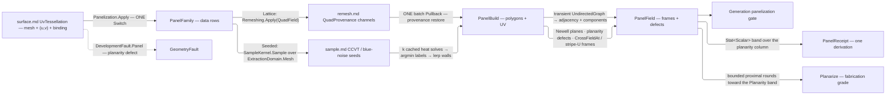

# [RASM_PARAMETRIC_PANELIZE]

`Panelization` owns cross-field-guided panelization: `Apply` maps a UV-provenanced surface into a panel graph whose every panel leaves with a placement frame — origin, field-aligned x-axis, and metric-true binding normal — because position without orientation is half a panel. `PanelFamily` rides the request as data, so a new family is one case over the shared assembly fold rather than a sibling mapper, and per-panel planarity is the fabrication acceptance measure whose breach routes a fault instead of shipping an unfabricatable lattice. Mould reuse keys through the `patternmap.md` material-symmetry law: a mirrored congruence merges only where the material's `MirrorGrant` merges it, `Flipped` records which panels ride the mirrored digest, and the merges the law refused count on the receipt as the mould-cost delta of the material choice.

Input is `surface.md`'s `SurfaceResult.UvTessellation` — mesh, per-vertex `(u, v)`, and live `NurbsForm.Surface` binding — so an unbound mesh cannot enter and every `PanelField` keeps its UV provenance. `Lattice` consumes the remesh substrate's `QuadProvenance` without re-running any field solve while `Seeded` lands geodesic-Voronoi cells over the `sample.md` distribution suite, `Symmetry` the one `RoSyOrder` row keying both arms; adjacency folds through a transient QuikGraph and leaves as SoA columns, never a leaked graph type.

## [01]-[INDEX]

- [02]-[PANELIZATION]: `PanelFamily` family-as-data folded by one `Panelization.Apply` into a placement-framed, planarity-gated `PanelField` panel graph.

## [02]-[PANELIZATION]

- Owner: `Panelization` mints the one static entry; `PanelFamily` carries the family as data, `PanelPolicy` the `IValidityEvidence` policy row carrying the lane-resolved planarity band and the `MaterialSymmetry` law the congruence fold reads (`None` reading `Free`), `PanelField` the panel-graph-plus-frame SoA wire, `PanelReceipt` the evidence, `PanelResult` the carrier.
- Cases: `PanelFamily` cases `Lattice` and `Seeded` — the substrate-guided lattice and the sample-suite distribution, `Symmetry` the one `RoSyOrder` row keying both; `PanelOp` cases `Map` and `Planarize` — generation versus fabrication-correction, `Planarize` consuming `Map`'s carrier.
- Entry: `public static Fin<PanelResult> Apply(PanelOp op, Op? key = null)` — the one entry discriminating on the op case, the family arm discriminating inside it.
- Auto: `Map`+`Lattice` binds the substrate's `QuadProvenance` as the panel lattice and restores UV through one batch `Pullback`; `Map`+`Seeded` lands geodesic-Voronoi cells from cached heat-distance labels walled at the equidistance lerp. Both arms assemble identically — Newell plane per panel, planarity defect, adjacency folded through a transient graph into offset columns — and `Planarize` runs bounded proximal rounds toward the planarity band, keeping each panel's pre-planarization UV feet while frames and the `ShapeClass`/`Flipped`/`ChiralSplit` evidence re-derive from the planarized geometry — congruence answers the final rings, never the ones the rewrite retired.
- Law: the receipt's planarity evidence is ONE `Stat<Scalar>` derived from the field's own `Planarity` column, never a max/mean pair beside it. NAMED LOSS: the two scalar fields; the gain is that the band cannot disagree with the column it summarizes, and the consumer reads variance and RMS no pair carries. WITNESS: `receipt.MaxPlanarity` rebuilt as `receipt.Planarity.Maximum.To()`, the same value off `Stat<Scalar>.Of(column.AsSpan(), key)`.
- Law: the acceptance ceiling is `Tolerance` off `ToleranceLane.Fraction` — the defect is dimensionless (max vertex-plane deviation over panel diameter), so it belongs to the ratio band and the document sets it. NAMED LOSS: `PanelPolicy.Canonical` and its `5e-3` literal.
- Exemption: `Loop`, `Cells`, `SharedWalls`, and `ShapeClasses` hold mutable `Dictionary`/`HashSet`/`List` accumulators inside their own span windows — a walled-cell chain, a wall pairing, and a first-seen class roster are single-pass build state that never escapes the member, and `Grain` states its quantum (the model's absolute tolerance, the branch's emission-seam grain) on site.
- Receipt: `PanelReceipt` carries the panel/vertex/component census, the planarity band, singular-face count, the `ChiralSplit` count (classes the material law refused to merge that an unconstrained law merges — the auditable mould-cost delta), and planarize rounds — the panelization-gate evidence; the substrate's `RemeshTrace` and the seed suite's `SampleReceipt` stay upstream.
- Packages: `Rasm.Processing` for the remesh substrate (`QuadProvenance`, `RemeshOp.QuadField`, `RemeshPolicy`, `RoSyOrder`) and the seed suite (`SampleKind`, `SampleKernel.Sample`, `SegmentKernel.CrossFieldAt`, `GeodesicKernel.EnsureGeodesicDistances`, `ExtractionDomain.Mesh`); `Rasm.Parametric` `surface.md` for the `UvTessellation` input and `Pullback` restore, `nurbs.md` for the frame normals, and `patternmap.md` for the `MaterialSymmetry` law the congruence fold reads; `Rasm.Spatial` `ScalarField` for density seeds and `NeighborIndex`/`NeighborSource`/`NeighborKernel` for the one batch seed snap; `Rasm.Numerics` for `VectorFrame.NewellNormal`, `Dimension`/`PositiveMagnitude`, and `GeometryFault`; `Rasm.Domain` for `Op`, `Context`/`ToleranceLane`/`Tolerance`, `ContentHash`/`CanonicalWriter`, `Stat<Scalar>`/`Scalar`, and `IValidityEvidence`; QuikGraph for the transient adjacency fold; Rhino.Geometry, Thinktecture.Runtime.Extensions, LanguageExt.Core.
- Growth: a new panel family is one `PanelFamily` case over the same assembly fold; a new seed distribution is one `SampleKind` row; a new panel measure is one `PanelField` column — `ShapeClass` congruence and its `Flipped` parity are the executed precedent; a fabrication-nesting order is one projection off the adjacency columns.
- Boundary: the field solve is the substrate's — a `CrossFieldAt`/`StripeAt` loop here is the named re-derivation defect, the lattice arm consuming `QuadProvenance` whole, its sole local frame read (stripe-U off the quad's own corners) holding only because the emitted geometry is the integrated field. Output keeps provenance — a wire without UV columns is the named drop, restored by one batch `Pullback` never a per-vertex `ClosestParameter` loop; seeded labels are geodesic, a Euclidean nearest-seed the named naivety defect across folds. `Planarize` fits per-panel planes and never parameterizes, a conformal or ARAP energy belonging to `flatten.md`; QuikGraph stays transient with adjacency leaving as offset columns, a stored graph field the named lane violation; every content key rides the branch `CanonicalWriter` — a second hasher or a hand `BinaryPrimitives` preimage forks the seed the federation reproduces; mould-reuse congruence merges a mirrored digest only where the material law's `MirrorRight.Merge` right licenses it — an unconditional min-digest merge cuts a mirrored panel from a blank a chiral material cannot flip, and a fold branching on grant identity instead of the rights set is the named re-derivation; every failure routes `DevelopmentFault(Panel, …)` with the panel unit and its planarity or admission witness, composed rails surfacing their own faults untranslated.

```csharp signature
// --- [RUNTIME_PRELUDE] ----------------------------------------------------------------------
using System;
using System.Collections.Generic;
using System.Linq;
using LanguageExt;
using QuikGraph;
using QuikGraph.Algorithms;
using Rasm.Domain;
using Rasm.Meshing;
using Rasm.Numerics;
using Rasm.Processing;
using Rasm.Spatial;
using Rhino.Geometry;
using Thinktecture;
using static LanguageExt.Prelude;

namespace Rasm.Parametric;

// --- [TYPES] ------------------------------------------------------------------------------------
// Symmetry is the remesh owner's own RoSyOrder row — cell axis AND seeded frame alignment — so the quad arm hands
// the row straight to RemeshOp.QuadField and the seeded arm reads its Key for the CrossFieldAt order.
[Union(ConversionFromValue = ConversionOperatorsGeneration.None)]
public abstract partial record PanelFamily {
    private PanelFamily() { }

    public sealed record Lattice(RoSyOrder Symmetry, PositiveMagnitude TargetLength) : PanelFamily;
    public sealed record Seeded(SampleKind Seeds, RoSyOrder Symmetry) : PanelFamily;
}

// --- [CONSTANTS] --------------------------------------------------------------------------------
// Law is the patternmap-minted MaterialSymmetry the congruence fold reads (None reads Free) — ONE legality
// owner, no local twin.
public sealed record PanelPolicy(
    Tolerance Planarity, Dimension Rounds, RemeshPolicy Remesh, PullbackPolicy Pullback,
    Option<MaterialSymmetry> Law = default) : IValidityEvidence {
    public static PanelPolicy Of(Context context) => new(
        Planarity: context.For(lane: ToleranceLane.Fraction), Rounds: Dimension.Create(value: 32),
        Remesh: RemeshPolicy.Canonical, Pullback: PullbackPolicy.Of(context: context));

    public bool IsValid => ValidityClaim.All(Planarity.IsValid, Remesh.IsValid, Pullback.IsValid);
}

// --- [MODELS] -----------------------------------------------------------------------------------
// y = ZAxis × XAxis is derived at the consumer. ShapeClass is the mould-reuse congruence class — panels
// congruent up to rigid motion within Context.Absolute share one ordinal, reflection joining only where the
// material law merges it — and Flipped records which panels ride the MIRRORED digest, the face-up parity a
// directional shop floor consumes. Model is the quantization grain the classes were digested under, carried ON the
// wire so re-classification reads the mint's own grain — no signature accepts a caller-supplied one,
// because a divergent grain forks the digest space between mint and re-mint.
public sealed record PanelField(
    Arr<int> CornerOffsets, Arr<int> Corners, Arr<Point3d> Vertices, Arr<Point2d> Uv,
    Arr<Point3d> Origin, Arr<Vector3d> XAxis, Arr<Vector3d> ZAxis, Arr<double> Planarity,
    Arr<int> PatchOf, Arr<int> AdjacencyOffsets, Arr<int> Adjacent, Arr<int> Component, Arr<int> ShapeClass, Arr<bool> Flipped,
    Context Model);

// Planarity is the ONE derivation off PanelField.Planarity, so no summary can drift from the column.
// ChiralSplit = classes the law refused to merge that an unconstrained min-digest fold would have, measured in the
// same pass as the classes themselves.
public sealed record PanelReceipt(
    int Panels, int Vertices, int Components, Stat<Scalar> Planarity, int SingularFaces, int ChiralSplit, int Rounds);

public sealed record PanelResult(PanelField Field, PanelReceipt Receipt);

// --- [OPERATIONS] ---------------------------------------------------------------------------
[Union(ConversionFromValue = ConversionOperatorsGeneration.None)]
public abstract partial record PanelOp {
    private PanelOp() { }

    public sealed record Map(SurfaceResult.UvTessellation Source, PanelFamily Family, PanelPolicy Policy) : PanelOp;
    public sealed record Planarize(PanelResult Prior, PanelPolicy Policy) : PanelOp;
}

public static class Panelization {
    public static Fin<PanelResult> Apply(PanelOp op, Op? key = null) =>
        op.Switch(
            state: key.OrDefault(),
            map: static (k, m) => !m.Policy.IsValid
                ? Fault<PanelResult>(witness: "planarity band", measure: m.Policy.Planarity.Value)
                : m.Family.Switch(
                    state: (m.Source, m.Policy, Key: k),
                    lattice: static (s, f) => LatticePanels(s.Source, f, s.Policy, s.Key),
                    seeded:  static (s, f) => SeededPanels(s.Source, f, s.Policy, s.Key)),
            planarize: static (k, p) => PlanarizeOf(p.Prior, p.Policy, k));

    // --- [LATTICE]
    // Substrate does the field work once: QuadField lands conditioning, two memoized Knöppel solves, integer-isoline quads;
    // this arm binds QuadProvenance and restores UV through one batch Pullback over the rewritten geometry.
    static Fin<PanelResult> LatticePanels(SurfaceResult.UvTessellation source, PanelFamily.Lattice family, PanelPolicy policy, Op key) =>
        Remeshing.Apply(new RemeshOp.QuadField(source.Mesh, family.TargetLength, family.Symmetry, policy.Remesh), key)
            .Bind(remesh => remesh.Quads.Match(
                Some: quads => Reprovenance(source, remesh.Mesh, policy, key)
                    .Bind(uv => Assemble(source, LatticeBuild(remesh.Mesh, quads, uv), fieldSymmetry: None, policy, key)),
                None: () => Fault<PanelResult>(witness: "target length", measure: family.TargetLength.Value)));

    // One Surfaces.Apply(SurfaceOp.Pullback) batch over the neighbor-index-seeded engine Newton; a per-vertex
    // ClosestParameter loop is the deleted form. The REWRITTEN geometry's own vertices are the probe set,
    // so provenance restores against the emitted mesh rather than the pre-remesh tessellation it replaced.
    static Fin<Arr<Point2d>> Reprovenance(SurfaceResult.UvTessellation source, MeshSpace emitted, PanelPolicy policy, Op key) =>
        Surfaces.Apply(new SurfaceOp.Pullback(source.Source, toArr(emitted.Native.Vertices.ToPoint3dArray()), policy.Pullback), key)
            .Bind(result => result is SurfaceResult.Pulled pulled
                ? Fin.Succ(pulled.Uv)
                : Fault<Arr<Point2d>>(witness: "vertex extent", measure: emitted.Native.Vertices.Count));

    // Offsets are the uniform 4-stride the quad channel guarantees, so the lattice arm and the seeded arm
    // hand `Assemble` one ragged-ring shape and it never learns which family built it.
    static PanelBuild LatticeBuild(MeshSpace emitted, QuadProvenance quads, Arr<Point2d> uv) {
        int panels = quads.Corners.Count / 4;
        return new PanelBuild(
            CornerOffsets: toArr(Enumerable.Range(0, panels + 1).Select(static p => 4 * p)),
            Corners: quads.Corners,
            Vertices: toArr(emitted.Native.Vertices.ToPoint3dArray()),
            Uv: uv,
            PatchOf: quads.PatchOf,
            SingularFaces: quads.SingularFaces.Count);
    }

    // --- [SEEDED]
    // Labels are geodesic argmin — k cached heat solves over one pre-factored Laplacian — and walls cross
    // label-boundary edges at the equidistance lerp, one weight interpolating world AND uv.
    static Fin<PanelResult> SeededPanels(SurfaceResult.UvTessellation source, PanelFamily.Seeded family, PanelPolicy policy, Op key) =>
        ExtractionDomain.Mesh(source.Mesh, key)
            .Bind(domain => SampleKernel.Sample(family.Seeds, domain, source.Mesh.Tolerance, key))
            .Bind(seeds => SeededCells(source, seeds.Points, key))
            .Bind(build => Assemble(source, build, fieldSymmetry: Some(family.Symmetry), policy, key));

    // Each seed snaps to its nearest tessellation vertex; per-seed EnsureGeodesicDistances → per-vertex argmin
    // labels → wall crossings at t = δ(u)/(δ(u) − δ(v)) chained into closed cell polygons; an unclosable chain
    // routes Panel naming the cell.
    // Geodesic sources are VERTICES, so the sample suite's continuous points snap ONCE here — a face-local source
    // would make every heat solve re-derive the same projection — and the snap is ONE batch query on the
    // neighbors.md bare-point owner, where the deleted per-seed linear scan paid k·V.
    static Fin<PanelBuild> SeededCells(SurfaceResult.UvTessellation source, Seq<Point3d> seeds, Op key) {
        Point3d[] vertices = source.Mesh.Native.Vertices.ToPoint3dArray();
        return NeighborIndex.Of(source: new NeighborSource.PointsCase(Values: toSeq(vertices)), key: key)
            .Bind(index => NeighborKernel.GraphOf(
                index: index, needles: [.. seeds], count: Some(1), radius: Option<double>.None, key: key))
            .Bind(graph => toSeq(graph.Ids).TraverseM(hits => hits.Length > 0
                ? Fin.Succ(hits[0])
                : Fault<int>(witness: "seed with no nearest tessellation vertex")).As())
            .Bind(snapped => snapped.TraverseM(vertex => GeodesicKernel.EnsureGeodesicDistances(source.Mesh, Seq(vertex), key)).As())
            .Bind(fields => Cells(source, vertices, fields, key));
    }

    // Fragment corners are a BARYCENTRIC weight triple over their face's corners, so one carrier reconstructs
    // world position, UV, and EVERY cell's geodesic distance at that point — the wall interpolates provenance
    // rather than re-projecting it, and the clip re-reads distances at points no vertex occupies.
    internal readonly record struct Bary(int A, int B, int C, double W0, double W1, double W2) {
        internal double Of(Arr<double> field) => (W0 * field[A]) + (W1 * field[B]) + (W2 * field[C]);
        internal Point3d World(Point3d[] rows) => new(
            (W0 * rows[A].X) + (W1 * rows[B].X) + (W2 * rows[C].X),
            (W0 * rows[A].Y) + (W1 * rows[B].Y) + (W2 * rows[C].Y),
            (W0 * rows[A].Z) + (W1 * rows[B].Z) + (W2 * rows[C].Z));
        internal Point2d Uv(Arr<Point2d> rows) => new(
            (W0 * rows[A].X) + (W1 * rows[B].X) + (W2 * rows[C].X),
            (W0 * rows[A].Y) + (W1 * rows[B].Y) + (W2 * rows[C].Y));
    }

    // Per-vertex argmin label, per-triangle fragment clip, per-cell boundary chain. A cell whose survivors do
    // not close is `GeometryFault.DevelopmentFault` — silently dropping it would ship a facade with a
    // hole no receipt column reports.
    static Fin<PanelBuild> Cells(SurfaceResult.UvTessellation source, Point3d[] vertices, Seq<Arr<double>> fields, Op key) {
        Mesh native = source.Mesh.Native;
        int[] label = [.. Enumerable.Range(0, vertices.Length).Select(v => Argmin(fields, v))];
        Dictionary<int, List<Bary[]>> byCell = new();
        for (int f = 0; f < native.Faces.Count; f++) {
            MeshFace face = native.Faces[f];
            Seq<(int A, int B, int C)> triangles = face.IsQuad
                ? Seq((face.A, face.B, face.C), (face.A, face.C, face.D))
                : Seq((face.A, face.B, face.C));
            foreach ((int a, int b, int c) in triangles) {
                int[] present = [.. Seq(label[a], label[b], label[c]).Distinct()];
                foreach (int cell in present) {
                    Bary[] fragment = Clip(fields, a, b, c, cell, present);
                    if (fragment.Length < 3) { continue; }
                    if (!byCell.TryGetValue(cell, out List<Bary[]>? rows)) { byCell[cell] = rows = []; }
                    rows.Add(fragment);
                }
            }
        }
        return toSeq(byCell.OrderBy(static row => row.Key))
            .Map(row => Loop(row.Value, vertices, source.Mesh.Tolerance, row.Key).Map(ring => (Cell: row.Key, Ring: ring)))
            .TraverseM(static ring => ring)
            .As()
            .Map(rings => Pack(rings, vertices, source.Uv));
    }

    static int Argmin(Seq<Arr<double>> fields, int vertex) {
        (int at, double best) = (0, double.PositiveInfinity);
        for (int c = 0; c < fields.Count; c++) {
            if (fields[c][vertex] < best) { (at, best) = (c, fields[c][vertex]); }
        }
        return at;
    }

    // Sutherland-Hodgman over the SCALAR half-spaces the geodesic fields define: the triangle keeps the region
    // where `cell` wins, one competitor at a time, each crossing landing at the equidistance parameter
    // t = δ(u)/(δ(u) − δ(v)) on the difference field. The clipper is a half-space per pass, so a triple point —
    // three cells meeting inside one face — resolves as the intersection of two clips with no special case.
    static Bary[] Clip(Seq<Arr<double>> fields, int a, int b, int c, int cell, int[] present) {
        List<Bary> ring = [new(a, b, c, 1.0, 0.0, 0.0), new(a, b, c, 0.0, 1.0, 0.0), new(a, b, c, 0.0, 0.0, 1.0)];
        foreach (int rival in present) {
            if (rival == cell || ring.Count < 3) { continue; }
            List<Bary> kept = new(ring.Count + 2);
            for (int i = 0; i < ring.Count; i++) {
                (Bary u, Bary v) = (ring[i], ring[(i + 1) % ring.Count]);
                (double du, double dv) = (Delta(fields, cell, rival, u), Delta(fields, cell, rival, v));
                if (du <= 0.0) { kept.Add(u); }
                if (du * dv < 0.0) { kept.Add(Lerp(u, v, du / (du - dv))); }
            }
            ring = kept;
        }
        return [.. ring];
    }

    // Equidistance field goes negative exactly where `cell` is nearer than `rival`, so its zero level IS the
    // wall and the crossing parameter is the page's own t = δ(u)/(δ(u) − δ(v)).
    static double Delta(Seq<Arr<double>> fields, int cell, int rival, Bary at) => at.Of(fields[cell]) - at.Of(fields[rival]);

    static Bary Lerp(Bary from, Bary to, double t) => new(
        from.A, from.B, from.C,
        from.W0 + ((to.W0 - from.W0) * t), from.W1 + ((to.W1 - from.W1) * t), from.W2 + ((to.W2 - from.W2) * t));

    // Boundary chain per cell: every fragment is wound in its face's own order, so an edge interior to the cell
    // appears once in each direction and cancels; the survivors are the cell wall. A chain that does not return
    // to its seed faults with the cell as its unit.
    static Fin<Bary[]> Loop(List<Bary[]> fragments, Point3d[] vertices, Context model, int cell) {
        Dictionary<(long, long, long), Bary> seat = new();
        Dictionary<(long, long, long), (long, long, long)> next = new();
        HashSet<((long, long, long) From, (long, long, long) To)> directed = new();
        foreach (Bary[] fragment in fragments) {
            for (int i = 0; i < fragment.Length; i++) {
                (Bary from, Bary to) = (fragment[i], fragment[(i + 1) % fragment.Length]);
                ((long, long, long) lo, (long, long, long) hi) = (Grain(from, vertices, model), Grain(to, vertices, model));
                if (lo == hi) { continue; }
                seat.TryAdd(lo, from);
                seat.TryAdd(hi, to);
                if (!directed.Remove((hi, lo))) { directed.Add((lo, hi)); }
            }
        }
        foreach (((long, long, long) from, (long, long, long) to) in directed) { next[from] = to; }
        if (next.Count < 3) { return Fault<Bary[]>(witness: "cell wall census under a ring", unit: cell, measure: next.Count); }
        List<Bary> ring = new(next.Count);
        (long, long, long) seed = next.Keys.Min();
        (long, long, long) walk = seed;
        for (int step = 0; step < next.Count; step++) {
            ring.Add(seat[walk]);
            if (!next.TryGetValue(walk, out walk)) { return Fault<Bary[]>(witness: "broken cell wall chain", unit: cell, measure: ring.Count); }
            if (walk == seed) { return Fin.Succ<Bary[]>([.. ring]); }
        }
        return Fault<Bary[]>(witness: "unclosed cell wall chain", unit: cell, measure: ring.Count);
    }

    // Lattice QUANTUM: the model's absolute tolerance, the emission-seam grain every branch owner shares, so a
    // wall crossing computed twice from two incident faces keys once.
    static (long, long, long) Grain(Bary at, Point3d[] vertices, Context model) {
        Point3d seat = at.World(vertices);
        double grain = model.Absolute.Value;
        return ((long)Math.Round(seat.X / grain), (long)Math.Round(seat.Y / grain), (long)Math.Round(seat.Z / grain));
    }

    // Ragged offset rows over one corner table: a geodesic cell carries any corner count, so the offsets are the
    // shape `Assemble` folds and the lattice arm's uniform 4-stride is one instance of it. `PatchOf` takes the
    // SEED ordinal — this arm's real provenance, the cell each panel grew from — and `SingularFaces` is a
    // measured zero, not an absent one: the seeded arm runs no cross field, so it has no singularity to count.
    static PanelBuild Pack(Seq<(int Cell, Bary[] Ring)> rings, Point3d[] vertices, Arr<Point2d> uv) {
        List<int> offsets = [0];
        List<int> corners = new();
        List<int> patchOf = new();
        List<Point3d> seats = new();
        List<Point2d> feet = new();
        foreach ((int cell, Bary[] ring) in rings) {
            foreach (Bary corner in ring) {
                corners.Add(seats.Count);
                seats.Add(corner.World(vertices));
                feet.Add(corner.Uv(uv));
            }
            offsets.Add(corners.Count);
            patchOf.Add(cell);
        }
        return new PanelBuild(toArr(offsets), toArr(corners), toArr(seats), toArr(feet), toArr(patchOf), SingularFaces: 0);
    }

    internal readonly record struct PanelBuild(
        Arr<int> CornerOffsets, Arr<int> Corners, Arr<Point3d> Vertices, Arr<Point2d> Uv, Arr<int> PatchOf, int SingularFaces);

    // --- [ASSEMBLY]
    // Frames, defects, graph (family-agnostic): VectorFrame.NewellNormal plane per panel, planarity = max vertex-plane dist / diameter, adjacency transient → columns.
    static Fin<PanelResult> Assemble(
        SurfaceResult.UvTessellation source, PanelBuild build, Option<RoSyOrder> fieldSymmetry, PanelPolicy policy, Op key) {
        int panels = build.CornerOffsets.Count - 1;
        UndirectedGraph<int, SEdge<int>> graph = new(allowParallelEdges: false);
        graph.AddVertexRange(Enumerable.Range(0, panels));
        foreach ((int a, int b) in SharedWalls(build)) { graph.AddEdge(new SEdge<int>(a, b)); }
        Dictionary<int, int> componentOf = new();   // the QuikGraph out-parameter, total over the vertices added above and read once here
        int components = graph.ConnectedComponents(componentOf);
        (Arr<int> offsets, Arr<int> adjacent) = AdjacencyColumns(graph, panels);
        return Frames(source, build, fieldSymmetry, key).Bind(frames => {
            Arr<double> planarity = PlanarityOf(build.CornerOffsets, build.Corners, build.Vertices);
            MaterialSymmetry law = policy.Law.IfNone(MaterialSymmetry.Free);
            (Arr<int> shapeClass, Arr<bool> flipped, int chiralSplit) = ShapeClasses(
                build.CornerOffsets, build.Corners, build.Vertices, frames, source.Mesh.Tolerance, law);
            return Stat<Scalar>.Of(planarity.AsSpan(), key).Map(band => new PanelResult(
                new PanelField(
                    build.CornerOffsets, build.Corners, build.Vertices, build.Uv,
                    frames.Origin, frames.X, frames.Z, planarity, build.PatchOf, offsets, adjacent,
                    new Arr<int>([.. Enumerable.Range(0, panels).Select(p => componentOf[p])]),
                    shapeClass, flipped, source.Mesh.Tolerance),
                // Rounds is STRUCTURALLY zero on the Map arm: this lane runs no planarize round, and only
                // `PlanarizeOf` writes a positive count — the same clause the sibling SingularFaces zero carries.
                new PanelReceipt(panels, build.Vertices.Count, components, band, build.SingularFaces, chiralSplit, Rounds: 0)));
        });
    }

    // Panel corner rings are the one projection every measure, frame, and round reads — the offset pair is the
    // ragged shape both families hand up, so no owner below re-derives it from a family-specific stride.
    static Point3d[] Ring(Arr<int> offsets, Arr<int> corners, Arr<Point3d> vertices, int panel) =>
        [.. Enumerable.Range(offsets[panel], offsets[panel + 1] - offsets[panel]).Select(i => vertices[corners[i]])];

    // Panel adjacency is a SHARED WALL, never a shared corner: two cells meeting at one vertex are not
    // neighbours, and a corner-keyed fold would weld an entire vertex fan into one component.
    static Seq<(int A, int B)> SharedWalls(PanelBuild build) {
        Dictionary<(int, int), int> byWall = new();
        List<(int A, int B)> pairs = new();
        for (int p = 0; p + 1 < build.CornerOffsets.Count; p++) {
            (int lo, int hi) = (build.CornerOffsets[p], build.CornerOffsets[p + 1]);
            for (int i = lo; i < hi; i++) {
                (int u, int v) = (build.Corners[i], build.Corners[lo + (((i - lo) + 1) % (hi - lo))]);
                (int a, int b) = (int.Min(u, v), int.Max(u, v));
                if (byWall.Remove((a, b), out int other)) { pairs.Add((other, p)); }
                else { byWall[(a, b)] = p; }
            }
        }
        return toSeq(pairs);
    }

    // CSR projection off the transient graph — the columns leave, the graph type never does.
    static (Arr<int> Offsets, Arr<int> Adjacent) AdjacencyColumns(UndirectedGraph<int, SEdge<int>> graph, int panels) {
        int[] offsets = new int[panels + 1];
        for (int p = 0; p < panels; p++) { offsets[p + 1] = offsets[p] + graph.AdjacentDegree(p); }
        int[] adjacent = new int[offsets[panels]];
        for (int p = 0; p < panels; p++) {
            int at = offsets[p];
            foreach (SEdge<int> edge in graph.AdjacentEdges(p)) { adjacent[at++] = edge.Source == p ? edge.Target : edge.Source; }
        }
        return (toArr(offsets), toArr(adjacent));
    }

    // THE planarity measure, read by assembly and by every planarize round: max corner-to-plane distance over
    // panel DIAMETER. A ring whose Newell normal or diameter vanishes reads +inf, the absence a zero defect
    // cannot spell — and Stat<Scalar>.Of refuses the non-finite column, so an unfabricatable build faults here.
    static Arr<double> PlanarityOf(Arr<int> offsets, Arr<int> corners, Arr<Point3d> vertices) =>
        toArr(Enumerable.Range(0, offsets.Count - 1).Select(p => Defect(Ring(offsets, corners, vertices, p))));

    static double Defect(ReadOnlySpan<Point3d> ring) {
        Vector3d normal = VectorFrame.NewellNormal(ring);
        double diameter = 0.0;
        for (int i = 0; i < ring.Length; i++) {
            for (int j = i + 1; j < ring.Length; j++) { diameter = double.Max(diameter, ring[i].DistanceTo(ring[j])); }
        }
        if (!normal.Unitize() || diameter <= 0.0) { return double.PositiveInfinity; }
        Point3d seat = Centroid(ring);
        double worst = 0.0;
        foreach (Point3d corner in ring) { worst = double.Max(worst, Math.Abs(normal * (corner - seat))); }
        return worst / diameter;
    }

    static Point3d Centroid(ReadOnlySpan<Point3d> ring) {
        Point3d seat = Point3d.Origin;
        foreach (Point3d corner in ring) { seat += corner; }
        return seat / ring.Length;
    }

    // z = Source.NormalAt at panel mean UV (degenerate → fault, never NaN). x: lattice (None) = stripe-U mean
    // edge ((c₁+c₂)−(c₀+c₃))/2; seeded (Some order) = SegmentKernel.CrossFieldAt(space, order.Key, None, None, origin, key);
    // x re-orthogonalizes into the tangent plane, y = z × x derived at the consumer. The traversal aborts on the
    // first panel with no frame — a fabricated fallback axis would ship a mould oriented against nothing measured.
    static Fin<(Arr<Point3d> Origin, Arr<Vector3d> X, Arr<Vector3d> Z)> Frames(
        SurfaceResult.UvTessellation source, PanelBuild build, Option<RoSyOrder> fieldSymmetry, Op key) =>
        Range(0, build.CornerOffsets.Count - 1).ToSeq()
            .Map(p => FrameOf(source, build, fieldSymmetry, p, key))
            .TraverseM(static frame => frame)
            .As()
            .Map(static rows => (
                toArr(rows.Map(static row => row.Origin)),
                toArr(rows.Map(static row => row.X)),
                toArr(rows.Map(static row => row.Z))));

    // Surface evaluates at the panel's OWN corner-UV centroid, never at the world centroid re-projected,
    // so a panel spanning a high-curvature band keeps its parameter provenance instead of paying a second
    // closest-point solve the pullback already answered.
    static Fin<(Point3d Origin, Vector3d X, Vector3d Z)> FrameOf(
        SurfaceResult.UvTessellation source, PanelBuild build, Option<RoSyOrder> fieldSymmetry, int panel, Op key) {
        (int lo, int hi) = (build.CornerOffsets[panel], build.CornerOffsets[panel + 1]);
        Point3d seat = Centroid(Ring(build.CornerOffsets, build.Corners, build.Vertices, panel));
        Point2d foot = UvSeat(build, lo, hi);
        return from normal in source.Source.NormalAt(foot.X, foot.Y)
               from axis in fieldSymmetry.Match(
                   Some: order => SegmentKernel.CrossFieldAt(source.Mesh, order.Key, None, None, seat, key),
                   None: () => Fin.Succ(StripeU(build, lo, hi)))
               from frame in Orthonormal(seat, normal, axis, panel)
               select frame;
    }

    static Point2d UvSeat(PanelBuild build, int lo, int hi) {
        (double u, double v) = (0.0, 0.0);
        for (int i = lo; i < hi; i++) { (u, v) = (u + build.Uv[build.Corners[i]].X, v + build.Uv[build.Corners[i]].Y); }
        return new Point2d(u / (hi - lo), v / (hi - lo));
    }

    // Stripe-U mean edge — the lattice arm's SOLE local frame read, holding only because the emitted quad IS the
    // integrated field; a ragged ring has no stripe and falls back to its first edge.
    static Vector3d StripeU(PanelBuild build, int lo, int hi) =>
        hi - lo == 4
            ? ((build.Vertices[build.Corners[lo + 1]] - build.Vertices[build.Corners[lo]])
               + (build.Vertices[build.Corners[lo + 2]] - build.Vertices[build.Corners[lo + 3]])) * 0.5
            : build.Vertices[build.Corners[lo + 1]] - build.Vertices[build.Corners[lo]];

    static Fin<(Point3d Origin, Vector3d X, Vector3d Z)> Orthonormal(Point3d seat, Vector3d normal, Vector3d axis, int panel) {
        Vector3d z = normal;
        if (!z.Unitize()) { return Fault<(Point3d, Vector3d, Vector3d)>(unit: panel, witness: "degenerate normal", measure: normal.Length); }
        Vector3d x = axis - ((z * axis) * z);
        return x.Unitize()
            ? Fin.Succ((seat, x, z))
            : Fault<(Point3d, Vector3d, Vector3d)>(unit: panel, witness: "degenerate axis", measure: axis.Length);
    }

    // Congruence classification: per panel the frame-local corner polygon reduced to its rigid-motion
    // invariants — consecutive edge lengths quantized at the model's absolute tolerance, turn angles at its
    // ANGLE tolerance, because a length grain applied to a radian is a units error — folded through the branch
    // content-key owner. Both digests read the CANONICAL cyclic rotation, so a ring's start corner never forks
    // a class, and the mirror digest reads the mirrored panel's OWN forward walk; the pair keys on the smaller
    // ONLY where the law's Merge right licenses it — a MIRRORED panel reuses its class exactly when the
    // material can realize the mirror, and Flipped records which panels ride the mirrored digest. The
    // unconstrained min-digest census runs in the SAME pass, so ChiralSplit is measured, never re-derived.
    // Classifier reads the ragged columns BOTH product shapes carry — PanelBuild hands them at the assembly
    // mint, PanelField at the planarize terminal — so one body serves both mints and the re-mint cannot drift.
    static (Arr<int> Classes, Arr<bool> Flipped, int ChiralSplit) ShapeClasses(
        Arr<int> offsets, Arr<int> corners, Arr<Point3d> vertices,
        (Arr<Point3d> Origin, Arr<Vector3d> X, Arr<Vector3d> Z) frames, Context model, MaterialSymmetry law) {
        Dictionary<UInt128, int> ordinalOf = new();
        HashSet<UInt128> merged = [];                          // the unconstrained census is a SET — only its size is read
        int[] classes = new int[offsets.Count - 1];
        bool[] flipped = new bool[classes.Length];
        bool merges = law.Mirror.Rights.Admits(MirrorRight.Merge);   // invariant over the panel walk
        for (int p = 0; p < classes.Length; p++) {
            long[] forward = LeastRotation(Invariants(offsets, corners, vertices, frames, p, model));
            long[] mirrored = LeastRotation(Mirrored(forward));
            (UInt128 f, UInt128 m) = (Digest(forward), Digest(mirrored));
            UInt128 least = UInt128.Min(f, m);
            UInt128 key = merges ? least : f;
            flipped[p] = merges && m < f;
            classes[p] = ordinalOf.TryGetValue(key, out int seen) ? seen : ordinalOf[key] = ordinalOf.Count;
            merged.Add(least);
        }
        return (toArr(classes), toArr(flipped), ordinalOf.Count - merged.Count);
    }

    // Mirrored builds the mirrored panel's OWN forward walk — edge lengths in reverse edge order, each turn
    // angle negated at the corner the reversed walk turns through. A bare array reversal misaligns the
    // (length, angle) interleave and keeps the turn sense, so no true mirror pair would ever key equal and
    // Flipped/ChiralSplit read a digest that cannot fire. Mirroring commutes with rotation, so the
    // canonicalized input loses nothing.
    static long[] Mirrored(long[] forward) {
        int n = forward.Length / 2;
        long[] mirrored = new long[forward.Length];
        for (int j = 0; j < n; j++) {
            mirrored[2 * j] = forward[2 * (n - 1 - j)];
            mirrored[(2 * j) + 1] = -forward[(2 * ((n - j) % n)) + 1];
        }
        return mirrored;
    }

    // Start-corner freedom is a cyclic rotation of the (length, angle) PAIRS — the digest reads the
    // lexicographically least rotation, so two congruent panels key alike from any ring start. Booth's algorithm
    // finds the winning START INDEX in one linear pass over the doubled sequence and ONE materialization lands at
    // the return, where the deleted O(n²) walk minted a fresh array per candidate rotation on the
    // mould-classification hot path and compared them with a hand lexicographic loop.
    static long[] LeastRotation(long[] pairs) {
        int n = pairs.Length / 2;
        if (n <= 1) { return pairs; }
        int[] failure = new int[2 * n];
        Array.Fill(failure, -1);
        int least = 0;
        for (int j = 1; j < 2 * n; j++) {
            int i = failure[j - least - 1];
            while (i != -1 && Compare(pairs, n, j, least + i + 1) != 0) {
                if (Compare(pairs, n, j, least + i + 1) < 0) { least = j - i - 1; }
                i = failure[i];
            }
            if (Compare(pairs, n, j, least + i + 1) != 0) {
                if (Compare(pairs, n, j, least) < 0) { least = j; }
                failure[j - least] = -1;
            } else {
                failure[j - least] = i + 1;
            }
        }
        long[] rotated = new long[pairs.Length];
        for (int i = 0; i < n; i++) {
            int at = (least + i) % n;
            (rotated[2 * i], rotated[(2 * i) + 1]) = (pairs[2 * at], pairs[(2 * at) + 1]);
        }
        return rotated;
    }

    // One SYMBOL is a (length, angle) PAIR, so the rotation alphabet is pairs and the order is their lexicographic
    // one — comparing the flat longs would rotate by half-pairs and key a panel against its own shear.
    static int Compare(long[] pairs, int n, int left, int right) {
        (int a, int b) = (left % n, right % n);
        return pairs[2 * a] != pairs[2 * b]
            ? pairs[2 * a].CompareTo(pairs[2 * b])
            : pairs[(2 * a) + 1].CompareTo(pairs[(2 * b) + 1]);
    }

    // Count-framed rows through the ONE preimage writer every kernel identity composes — a second hasher or a
    // hand byte lane beside it forks the seed the federation reproduces, and the frame keeps a four-corner ring
    // from colliding with a six-corner one whose measures happen to prefix it.
    static UInt128 Digest(long[] rows) =>
        ContentHash.Of(rows, static (measures, sink) => sink.Rows(toSeq(measures), static (measure, lane) => lane.I64(measure)));

    // Corners project into the panel's own tangent frame, then alternate edge length and turn angle around the
    // ring — position and orientation divided out by construction, so two panels sharing one mould key alike.
    static long[] Invariants(
        Arr<int> offsets, Arr<int> corners, Arr<Point3d> vertices,
        (Arr<Point3d> Origin, Arr<Vector3d> X, Arr<Vector3d> Z) frames, int panel, Context model) {
        Point3d[] ring = Ring(offsets, corners, vertices, panel);
        (Point3d seat, Vector3d ax, Vector3d az) = (frames.Origin[panel], frames.X[panel], frames.Z[panel]);
        Vector3d ay = Vector3d.CrossProduct(az, ax);
        Point2d[] flat = [.. ring.Select(corner => new Point2d((corner - seat) * ax, (corner - seat) * ay))];
        long[] measures = new long[2 * flat.Length];
        for (int i = 0; i < flat.Length; i++) {
            Vector2d edge = flat[(i + 1) % flat.Length] - flat[i];
            Vector2d prior = flat[i] - flat[((i - 1) + flat.Length) % flat.Length];
            measures[2 * i] = (long)Math.Round(edge.Length / model.Absolute.Value);
            measures[(2 * i) + 1] = (long)Math.Round(
                Math.Atan2((prior.X * edge.Y) - (prior.Y * edge.X), (prior.X * edge.X) + (prior.Y * edge.Y)) / model.Angle.Value);
        }
        return measures;
    }

    // --- [PLANARIZE]
    // Bounded proximal rounds — monotone in max defect, early exit inside the band: VectorFrame.NewellNormal fit per panel, every vertex → MEAN of incident projections.
    // Frames AND shape evidence re-derive from the planarized geometry; UV columns keep the pre-planarization feet — planar panels leave the surface by design.
    static Fin<PanelResult> PlanarizeOf(PanelResult prior, PanelPolicy policy, Op key) =>
        // The halt rides the FOLD: convergence and refusal both stop the walk, where the in-body short circuit
        // still paid a bind and a band read per remaining round after the field had settled.
        Range(0, policy.Rounds.Value).FoldUntil(
                state: Fin.Succ((Field: prior.Field, Band: prior.Receipt.Planarity, Rounds: 0)),
                f: (state, _) => state.Bind(s => ProjectRound(s.Field, key).Map(next => (next.Field, next.Band, s.Rounds + 1))),
                stateP: state => state.Match(
                    Succ: s => s.Band.Maximum.To() <= policy.Planarity.Value,
                    Fail: static _ => true))
            .Bind(final => final.Band.Maximum.To() > policy.Planarity.Value
                ? Fault<PanelResult>(witness: "planarity band", unit: WorstPanel(final.Field), measure: final.Band.Maximum.To())
                : Fin.Succ(Reclassified(prior, final.Field, final.Band, final.Rounds, policy)));

    // Shape evidence answers the FINAL geometry: a round moved every shared vertex, so the congruence
    // classes, mirror parities, and the chiral-split census re-derive from the planarized rings under the
    // SAME law and the SAME grain the mint used — the wire's own Model column, so no caller re-supplies
    // a divergent grain and forks the digest space between mint and re-mint. Evidence carried across the
    // geometry rewrite would price moulds for panels that no longer exist — two panels congruent before
    // planarization can settle onto distinct planes, and a directional shop floor would cut the wrong blank.
    // Zero rounds moved nothing, so the prior evidence stands and no re-classification runs.
    static PanelResult Reclassified(PanelResult prior, PanelField field, Stat<Scalar> band, int rounds, PanelPolicy policy) {
        (Arr<int> shapeClass, Arr<bool> flipped, int chiralSplit) = rounds == 0
            ? (field.ShapeClass, field.Flipped, prior.Receipt.ChiralSplit)
            : ShapeClasses(
                field.CornerOffsets, field.Corners, field.Vertices, (field.Origin, field.XAxis, field.ZAxis),
                field.Model, policy.Law.IfNone(MaterialSymmetry.Free));
        return new PanelResult(
            field with { ShapeClass = shapeClass, Flipped = flipped },
            prior.Receipt with { Planarity = band, Rounds = rounds, ChiralSplit = chiralSplit });
    }

    // One proximal round: fit each panel's plane at its corner centroid through the Newell normal, project every
    // incident corner onto it, and move each vertex to the MEAN of its projections — the averaging that makes the
    // round monotone in max defect where a per-panel snap oscillates between two panels' planes. Frames
    // re-derive from the FITTED planes, not the surface: a planarized panel has left the surface by design, so
    // reading `NormalAt` again would bind the mould to a sheet it no longer touches. UV columns are carried
    // untouched — they are the pre-planarization feet the receipt's provenance claim rests on. ShapeClass and
    // Flipped ride each round unchanged and re-mint ONCE at the planarize terminal — a per-round
    // re-classification would pay the full digest pass every iteration for classes only the final geometry
    // can settle.
    static Fin<(PanelField Field, Stat<Scalar> Band)> ProjectRound(PanelField field, Op key) {
        Vector3d[] pulled = new Vector3d[field.Vertices.Count];
        int[] hits = new int[field.Vertices.Count];
        int panels = field.CornerOffsets.Count - 1;
        Vector3d[] planeNormal = new Vector3d[panels];
        for (int p = 0; p < panels; p++) {
            Point3d[] ring = Ring(field.CornerOffsets, field.Corners, field.Vertices, p);
            Vector3d normal = VectorFrame.NewellNormal(ring);
            if (!normal.Unitize()) { continue; }               // a degenerate ring contributes no plane this round
            planeNormal[p] = normal;
            Point3d seat = Centroid(ring);
            for (int i = field.CornerOffsets[p]; i < field.CornerOffsets[p + 1]; i++) {
                int v = field.Corners[i];
                pulled[v] += (Vector3d)field.Vertices[v] - ((normal * (field.Vertices[v] - seat)) * normal);
                hits[v]++;
            }
        }
        Arr<Point3d> moved = toArr(Enumerable.Range(0, field.Vertices.Count)
            .Select(v => hits[v] == 0 ? field.Vertices[v] : new Point3d(pulled[v].X / hits[v], pulled[v].Y / hits[v], pulled[v].Z / hits[v])));
        Arr<double> planarity = PlanarityOf(field.CornerOffsets, field.Corners, moved);
        return Stat<Scalar>.Of(planarity.AsSpan(), key).Map(band => (
            field with {
                Vertices = moved, Planarity = planarity,
                Origin = toArr(Enumerable.Range(0, panels).Select(p => Centroid(Ring(field.CornerOffsets, field.Corners, moved, p)))),
                ZAxis = toArr(Enumerable.Range(0, panels).Select(p => planeNormal[p].IsZero ? field.ZAxis[p] : planeNormal[p])),
                XAxis = toArr(Enumerable.Range(0, panels).Select(p => Retangent(field.XAxis[p], planeNormal[p].IsZero ? field.ZAxis[p] : planeNormal[p]))),
            },
            band));
    }

    // Re-seat the prior x-axis into the new plane, keeping the field alignment the frame was built for; an axis the
    // new normal has swallowed keeps its prior value rather than spinning to an arbitrary perpendicular.
    static Vector3d Retangent(Vector3d prior, Vector3d normal) {
        Vector3d axis = prior - ((normal * prior) * normal);
        return axis.Unitize() ? axis : prior;
    }

    // Reads the field's OWN planarity column — the measure `ProjectRound` already wrote — so the fault's unit
    // and the receipt band can never disagree with the column. An EMPTY field has no worst panel: the refusal
    // rides the request rather than naming ordinal 0 as an offender no measurement produced.
    static Option<int> WorstPanel(PanelField field) =>
        field.Planarity.Count == 0
            ? Option<int>.None
            : Some(Enumerable.Range(0, field.Planarity.Count).MaxBy(p => field.Planarity[p]));

    // A whole-request refusal names NO panel: `unit` stays None rather than fabricating ordinal 0 as the offender.
    static Fin<T> Fault<T>(string witness, Option<int> unit = default, Option<double> measure = default) =>
        Fin.Fail<T>(new GeometryFault.DevelopmentFault(DevelopmentStage.Panel, unit, witness, measure));
}
```


```mermaid
---
config:
  layout: elk
  flowchart:
    curve: linear
    padding: 25
---
flowchart LR
    accTitle: Panelization flow
    accDescr: PanelOp folds seeds through the cross-field remesh and pullback into the PanelField SoA wire with frames, planarity, adjacency, component, shape-class, and flip-parity columns.
    UvT["surface.md UvTessellation — mesh + (u,v) + binding"] -->|"Panelization.Apply — ONE Switch"| Family["PanelFamily — data rows"]
    Family -->|"Lattice: Remeshing.Apply(QuadField)"| Remesh["remesh.md QuadProvenance channels"]
    Remesh -->|"ONE batch Pullback — provenance restore"| Build["PanelBuild — polygons + UV"]
    Family -->|"Seeded: SampleKernel.Sample over ExtractionDomain.Mesh"| Seeds["sample.md CCVT / blue-noise seeds"]
    Seeds -->|"k cached heat solves → argmin labels → lerp walls"| Build
    Build -->|"Newell planes · planarity defects · CrossFieldAt / stripe-U frames"| Field["PanelField — frames + defects"]
    Build -->|"transient UndirectedGraph → adjacency + components"| Field
    Field -->|"Stat&lt;Scalar&gt; band over the planarity column"| Receipt["PanelReceipt — one derivation"]
    Field -->|"bounded proximal rounds toward the Planarity band"| Planar["Planarize — fabrication grade"]
    Field --> Gate["Generation panelization gate"]
    UvT -.->|"DevelopmentFault.Panel — planarity defect"| GeometryFault
```

## [03]-[RESEARCH]

<!-- source-only: research row template:
[TOKEN]-[OPEN|BLOCKED]: <exact question>; <verification route>.
[SPLIT_MEMBER]-[OPEN]: does `shape-core` expose `split_all`; verify against the member rail.
-->

(none)
