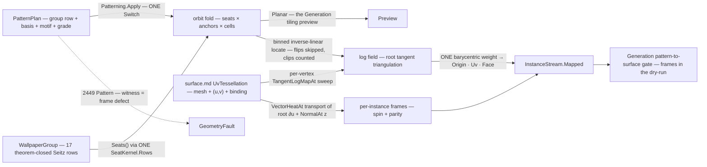

# [RASM_PARAMETRIC_PATTERNMAP]

`Patterning` owns pattern-to-surface instancing in `Rasm.Parametric` — `Fin<InstanceStream> Patterning.Apply(PatternOp, Op? key = null)` orbits a motif under a WALLPAPER GROUP in the root tangent plane, maps the orbit onto a UV-provenanced surface through the landed tangent LOG/EXP machinery, and emits the surface-mapped INSTANCE STREAM the Generation PATTERN/TILING plane consumes as exact input. Symmetry vocabulary is DATA closed by theorem: the 17 wallpaper groups are the complete plane-symmetry census, `[SmartEnum<string>]` rows whose `(lattice, order, mirror-axis, glide, centered)` columns feed ONE Seitz generator, so the orbit fold never branches on the group and a motif, basis, or group change is a data change against one fold. Every instance carries a FRAME parallel-transported by the landed vector-heat lane — position without orientation is half an instance — re-seated on the metric-true binding normal and rotated by the instance's own seat spin, so the group's rotations and reflections survive onto the surface.

Input is `surface.md`'s `SurfaceResult.UvTessellation` — mesh + per-vertex `(u, v)` + live `NurbsForm.Surface` binding — so an unbound world-space mesh cannot feed the pipeline by construction. Surface mapping is the piecewise-linear INVERSION of the per-vertex log field, never a per-site geodesic shoot; the log/exp and vector-heat lanes are `geodesics.md`'s landed machinery composed here, and the `TangentLogMapAlgorithm` grade is a PLAN data row, never a hardcoded arm. This page INSTANCES a motif onto a surface where `panelize.md` PARTITIONS one into panels — sibling Pattern-stage producers, one anchor each — and every failure routes `GeometryFault.DevelopmentFault(DevelopmentStage.Pattern, unit, defect)` 2449 naming the instance, no exception crossing the owner.

## [01]-[INDEX]

- [01]-[PATTERNING]: `PatternLattice` the five-row basis-law vocabulary; `PatternSeat` + `WallpaperGroup` the 17 theorem-closed Seitz rows over ONE seat generator; `PatternPlan`/`PatternPolicy` the orbit and mapping rows; `PatternOp` the two-case request `[Union]` folded by ONE `Apply`; `InstanceStream` the planar/mapped result `[Union]`; `PatternReceipt` the honesty evidence; the orbit, log-field, locate, and transport kernels.

## [02]-[PATTERNING]

- Owner: `PatternLattice` `[SmartEnum<string>]` the five plane-lattice rows (`oblique` · `rectangular` · `centered` · `square` · `hexagonal`), each carrying its basis-proof delegate column — the row PROVES the basis pair (square: `|A| = |B| ∧ A ⊥ B`; hexagonal: `|A| = |B| ∧ 120°`; rectangular/centered: `A ⊥ B`; oblique: non-degenerate only) so plan validity is data-driven, never a switch; `PatternSeat` the Seitz-operator row (rotation/reflection linear part as `Cos`/`Sin` + `Mirror` parity + fractional `Shift` in lattice coordinates); `WallpaperGroup` `[SmartEnum<string>]` the 17 rows binding lattice + seat-generator delegate; `PatternPlan` the orbit row (`Group` · `BasisA`/`BasisB` the conventional cell in root-tangent meters · `Anchors` the motif sites + spins in cell coordinates `[0,1)²` · `Extent` the geodesic fill radius · `Root` the UV map origin · `Algorithm` the log-map grade row) registering `IValidityEvidence`; `PatternPolicy` the mapping row (`HeatTime` the vector-heat time for log arm and transport · `Trace`/`Windows` the exact-arm policies · `FrameBudget` the tangency-defect ceiling) registering `IValidityEvidence`; `PatternOp` the request `[Union]`; `InstanceStream` the result `[Union]`; `PatternReceipt` the evidence; `Patterning` the static entry.
- Cases: `WallpaperGroup` rows 17 — CLOSED BY THEOREM, the census admits no 18th; `PatternLattice` rows 5; `PatternOp` cases `Orbit` · `Map` (2 — the planar tiling preview the Generation plane edits versus the full surface mapping, `Map` composing `Orbit`'s own fold); `InstanceStream` cases `Planar` · `Mapped` (2).
- Entry: `public static Fin<InstanceStream> Apply(PatternOp op, Op? key = null)` — the ONE entry discriminating on the op case; `Orbit` takes NO surface (pure plane algebra), `Map` takes the `SurfaceResult.UvTessellation` carrier so the provenance law is the parameter type; no `TilePlane`/`MapPattern`/`TransportFrames` sibling family.
- Auto: `Orbit` resolves the group's seats ONCE (`Seats()` — the delegate column feeding `SeatKernel.Rows`, deduped modulo lattice translation, closure-under-composition proven per row), walks the lattice cells `(i, j)` whose corners intersect the extent disc, and emits `seat ∘ (anchor + i·A + j·B)` per seat per anchor with the site's accumulated spin (anchor spin + seat rotation angle), seat ordinal, anchor ordinal, and mirror parity as columns — the planar stream downstream tiling UIs edit without any surface. `Map` seats the root on the nearest UV-column vertex to `Plan.Root`, sweeps the LOG FIELD — per tessellation vertex ONE `TangentLogMapAt(space, root, vertex, HeatTime, Algorithm, Trace, Windows, key)` whose 3D tangent lands in 2D root-basis coordinates; the per-source memo caches make the sweep k solves and n samples, never n propagations — then runs `Orbit`'s own fold and locates every site: faces register in every integer cell their log-image extent overlaps (the 4-bin corner lookup — a boundary site always finds its containing face), the inverse-linear barycentric solve places the site in its log-triangle, triangles whose log-image orientation flips are SKIPPED and counted as `Flipped` (past the cut locus the log map is not injective — skipping is the honesty, placing double-maps), sites no triangle contains count as `Clipped`; the surviving barycentric weight lifts world `Origin`, `Uv`, and landing `Face` in one application. Frames: the root direction x₀ = ∂S/∂u off `Source.RationalDerivatives` at the root's own UV (metric-true, never a mesh-edge guess) transports to every instance origin through ONE cached `VectorHeatAt(space, [(root, x₀)], HeatTime, origin, key)` solve; the transported axis's tangency defect `|x̂ · n̂|` against the binding `NormalAt(uv)` records per instance and breaches `FrameBudget` as the 2449 `Pattern` fault naming the instance; the surviving axis re-projects into the tangent plane, rotates by the instance spin about the normal, and `Mirrored` flips the y-handedness at the consumer (`y = ±(z × x)`) so reflected seats place reflected instances.
- Receipt: `PatternReceipt` — instance census, clipped and flipped counts, max geodesic radius reached, max frame defect, and the `Algorithm` grade echo (heat and exact log fields differ near the cut locus; the row on the receipt makes the lane auditable, the same honesty marker as `GeodesicField.Grade`) — the Generation acceptance dry-run reads per-instance frames off the stream and the defect ceiling off this receipt.
- Packages: `Rasm.Parametric` `surface.md` (`SurfaceResult.UvTessellation` the input carrier) + `nurbs.md` (`NurbsForm.Surface.NormalAt`/`RationalDerivatives` — the frame normal and the root ∂u), `Rasm.Meshing` (`MeshSpace`), `Rasm.Processing` (`GeodesicKernel.TangentLogMapAt`/`ExactExpMapAt` + `TangentLogMapAlgorithm` + `GeodesicTracePolicy`/`WindowPropagationPolicy` — the landed log/exp lane; `GeodesicKernel.VectorHeatAt` — the Sharp-Soliman-Crane transport), `Rasm.Numerics` (`GeometryFault.DevelopmentFault` + `DevelopmentStage`), `Rasm.Domain` (`Op`, `ValidityClaim`/`IValidityEvidence`), Rhino.Geometry (`Point2d`/`Point3d`/`Vector2d`/`Vector3d`), Thinktecture.Runtime.Extensions (`[SmartEnum]` + `[UseDelegateFromConstructor]` columns), LanguageExt.Core.
- Growth: the wallpaper census cannot grow — recorded structural fact, not a gap; the FRIEZE census (the 7 border groups, for curve-borne patterns along `curve.md` stations) is one further theorem-closed vocabulary feeding the SAME orbit fold; a density-modulated extent (instance thinning by a `fields.md` scalar) is one orbit filter row; a multi-root chart atlas for closed surfaces (orbits from several roots, seam-reconciled) is one plan widening over the same log-field kernel; a new anchor payload (per-anchor scale column) is one `Anchors` tuple widening; zero new entry surfaces, zero new carriers.
- Boundary: a straightest-geodesic tracer, window propagation, or vector-heat solve re-derived here is the `geodesics.md` altitude violation; a per-site `ExactExpMapAt` shoot is the rejected mapping default — it re-pays propagation per instance and cannot SEE the cut-locus overlap the field triangulation makes skippable, so the flip census is the exactness evidence; instance lift reads the tessellation's OWN UV column through the locate's barycentric weight, and a `ClosestParameter` round trip on an already-parameterized point is the named re-projection defect; frames transport through vector heat and rotate by seat spin, so a global UV-gradient frame (shears with the parameterization) and an untransported constant axis (ignores holonomy) are the named naive substitutes; the stream is host-neutral SoA data, Rhino block/instance materialization living at the host wire, never this owner; every failure routes 2449 `Pattern` with the instance unit and the frame or admission measure as witness, composed rails surfacing their own faults untranslated.

```csharp signature
// --- [RUNTIME_PRELUDE] ----------------------------------------------------------------------
using System;
using System.Collections.Generic;
using System.Linq;
using LanguageExt;
using Rasm.Domain;
using Rasm.Meshing;
using Rasm.Numerics;
using Rasm.Processing;
using Rhino;
using Rhino.Geometry;
using Thinktecture;
using static LanguageExt.Prelude;

namespace Rasm.Parametric;

// --- [TYPES] ------------------------------------------------------------------------------------
// Each lattice row PROVES its basis pair through the delegate column — plan validity is data.
[SmartEnum<string>]
[KeyMemberEqualityComparer<ComparerAccessors.StringOrdinal, string>]
[KeyMemberComparer<ComparerAccessors.StringOrdinal, string>]
public sealed partial class PatternLattice {
    public static readonly PatternLattice Oblique = new("oblique", static (a, b, tol) =>
        Math.Abs((a.X * b.Y) - (a.Y * b.X)) > tol);
    public static readonly PatternLattice Rectangular = new("rectangular", static (a, b, tol) =>
        Math.Abs((a.X * b.Y) - (a.Y * b.X)) > tol && Math.Abs(a * b) <= tol);
    public static readonly PatternLattice Centered = new("centered", static (a, b, tol) =>
        Math.Abs((a.X * b.Y) - (a.Y * b.X)) > tol && Math.Abs(a * b) <= tol);
    public static readonly PatternLattice Square = new("square", static (a, b, tol) =>
        Math.Abs(a.Length - b.Length) <= tol && Math.Abs(a * b) <= tol);
    public static readonly PatternLattice Hexagonal = new("hexagonal", static (a, b, tol) =>
        Math.Abs(a.Length - b.Length) <= tol && Math.Abs((a * b) + (0.5 * a.Length * b.Length)) <= tol);

    [UseDelegateFromConstructor] public partial bool Admits(Vector2d a, Vector2d b, double tolerance);
}

// One Seitz operator in LATTICE coordinates: linear part + fractional Shift, Mirror the downstream handedness parity.
public readonly record struct PatternSeat(double Cos, double Sin, bool Mirror, Vector2d Shift);

// 17 wallpaper rows — CLOSED BY THEOREM (the complete plane-symmetry census): every row is
// (lattice, order, mirror-axis, glide, centered) DATA feeding ONE Seitz generator, the fold never branching on the group.
[SmartEnum<string>]
[KeyMemberEqualityComparer<ComparerAccessors.StringOrdinal, string>]
[KeyMemberComparer<ComparerAccessors.StringOrdinal, string>]
public sealed partial class WallpaperGroup {
    public static readonly WallpaperGroup P1   = new("p1",   PatternLattice.Oblique,     static () => SeatKernel.Rows(order: 1, mirrorAxis: None, glide: None, centered: false));
    public static readonly WallpaperGroup P2   = new("p2",   PatternLattice.Oblique,     static () => SeatKernel.Rows(order: 2, mirrorAxis: None, glide: None, centered: false));
    public static readonly WallpaperGroup Pm   = new("pm",   PatternLattice.Rectangular, static () => SeatKernel.Rows(order: 1, mirrorAxis: Some(0.0), glide: None, centered: false));
    public static readonly WallpaperGroup Pg   = new("pg",   PatternLattice.Rectangular, static () => SeatKernel.Rows(order: 1, mirrorAxis: None, glide: Some((0.0, new Vector2d(0.5, 0.0))), centered: false));
    public static readonly WallpaperGroup Cm   = new("cm",   PatternLattice.Centered,    static () => SeatKernel.Rows(order: 1, mirrorAxis: Some(0.0), glide: None, centered: true));
    public static readonly WallpaperGroup Pmm  = new("pmm",  PatternLattice.Rectangular, static () => SeatKernel.Rows(order: 2, mirrorAxis: Some(0.0), glide: None, centered: false));
    public static readonly WallpaperGroup Pmg  = new("pmg",  PatternLattice.Rectangular, static () => SeatKernel.Rows(order: 2, mirrorAxis: Some(Math.PI / 2.0), glide: Some((0.0, new Vector2d(0.5, 0.0))), centered: false));
    public static readonly WallpaperGroup Pgg  = new("pgg",  PatternLattice.Rectangular, static () => SeatKernel.Rows(order: 2, mirrorAxis: None, glide: Some((0.0, new Vector2d(0.5, 0.5))), centered: false));
    public static readonly WallpaperGroup Cmm  = new("cmm",  PatternLattice.Centered,    static () => SeatKernel.Rows(order: 2, mirrorAxis: Some(0.0), glide: None, centered: true));
    public static readonly WallpaperGroup P4   = new("p4",   PatternLattice.Square,      static () => SeatKernel.Rows(order: 4, mirrorAxis: None, glide: None, centered: false));
    public static readonly WallpaperGroup P4m  = new("p4m",  PatternLattice.Square,      static () => SeatKernel.Rows(order: 4, mirrorAxis: Some(0.0), glide: None, centered: false));
    public static readonly WallpaperGroup P4g  = new("p4g",  PatternLattice.Square,      static () => SeatKernel.Rows(order: 4, mirrorAxis: Some(Math.PI / 4.0), glide: Some((0.0, new Vector2d(0.5, 0.5))), centered: false));
    public static readonly WallpaperGroup P3   = new("p3",   PatternLattice.Hexagonal,   static () => SeatKernel.Rows(order: 3, mirrorAxis: None, glide: None, centered: false));
    public static readonly WallpaperGroup P3m1 = new("p3m1", PatternLattice.Hexagonal,   static () => SeatKernel.Rows(order: 3, mirrorAxis: Some(0.0), glide: None, centered: false));
    public static readonly WallpaperGroup P31m = new("p31m", PatternLattice.Hexagonal,   static () => SeatKernel.Rows(order: 3, mirrorAxis: Some(Math.PI / 6.0), glide: None, centered: false));
    public static readonly WallpaperGroup P6   = new("p6",   PatternLattice.Hexagonal,   static () => SeatKernel.Rows(order: 6, mirrorAxis: None, glide: None, centered: false));
    public static readonly WallpaperGroup P6m  = new("p6m",  PatternLattice.Hexagonal,   static () => SeatKernel.Rows(order: 6, mirrorAxis: Some(0.0), glide: None, centered: false));

    public PatternLattice Lattice { get; }

    [UseDelegateFromConstructor] public partial Arr<PatternSeat> Seats();
}

internal static class SeatKernel {
    // Seitz composition: Cₙ rotations × mirror coset (axis angle doubled into the linear part) × glide (mirror + shift)
    // × (½,½) centering coset — deduped modulo lattice translation; the seat set MUST close under composition (group axiom gate).
    internal static Arr<PatternSeat> Rows(int order, Option<double> mirrorAxis, Option<(double Axis, Vector2d Shift)> glide, bool centered);
}

// --- [CONSTANTS] --------------------------------------------------------------------------------
// BasisA/BasisB live in the ROOT TANGENT PLANE (meters), the lattice row proving them; Anchors in cell coordinates [0,1)²,
// Extent the geodesic fill radius, Algorithm the log-map grade — VectorHeatApproximate interactive, the exact arms for acceptance.
public sealed record PatternPlan(
    WallpaperGroup Group, Vector2d BasisA, Vector2d BasisB,
    Arr<(Point2d Site, double Spin)> Anchors, double Extent, Point2d Root,
    TangentLogMapAlgorithm Algorithm) : IValidityEvidence {
    public bool IsValid => ValidityClaim.All(
        ValidityClaim.Positive(value: Extent),
        ValidityClaim.CountAtLeast(count: Anchors.Count, floor: 1),
        ValidityClaim.Of(holds: Anchors.All(static a => a.Site.X is >= 0.0 and < 1.0 && a.Site.Y is >= 0.0 and < 1.0)),
        ValidityClaim.Of(holds: Group.Lattice.Admits(BasisA, BasisB, tolerance: RhinoMath.ZeroTolerance)));
}

// HeatTime drives the log arm AND the frame transport; FrameBudget caps the transported axis's |x̂·n̂| defect before re-projection.
public sealed record PatternPolicy(
    double HeatTime, GeodesicTracePolicy Trace, WindowPropagationPolicy Windows, double FrameBudget) : IValidityEvidence {
    public static readonly PatternPolicy Canonical = new(
        HeatTime: 1.0, GeodesicTracePolicy.Default, WindowPropagationPolicy.Default, FrameBudget: 1e-3);

    public bool IsValid => ValidityClaim.All(
        ValidityClaim.Positive(value: HeatTime),
        ValidityClaim.Positive(value: FrameBudget));
}

// --- [MODELS] -----------------------------------------------------------------------------------
// Algorithm echo names which lane placed the instances — heat and exact log fields differ near the cut locus.
public sealed record PatternReceipt(
    int Instances, int Clipped, int Flipped, double MaxRadius, double MaxFrameDefect, TangentLogMapAlgorithm Algorithm);

// --- [OPERATIONS] ---------------------------------------------------------------------------
[Union(ConversionFromValue = ConversionOperatorsGeneration.None)]
public abstract partial record PatternOp {
    private PatternOp() { }

    public sealed record Orbit(PatternPlan Plan) : PatternOp;
    public sealed record Map(SurfaceResult.UvTessellation Source, PatternPlan Plan, PatternPolicy Policy) : PatternOp;
}

[Union(ConversionFromValue = ConversionOperatorsGeneration.None)]
public abstract partial record InstanceStream {
    private InstanceStream() { }

    // Planar orbit — the Generation tiling plane's editable preview; columns index one site.
    public sealed record Planar(
        Arr<Point2d> Site, Arr<double> Spin, Arr<bool> Mirrored, Arr<int> Anchor, Arr<int> Seat) : InstanceStream;

    // Surface-mapped stream: per-instance frame (y = ±(ZAxis × XAxis), Mirrored the sign), UV provenance, landing face, radius evidence.
    public sealed record Mapped(
        Arr<Point3d> Origin, Arr<Point2d> Uv, Arr<Vector3d> XAxis, Arr<Vector3d> ZAxis,
        Arr<double> Spin, Arr<bool> Mirrored, Arr<int> Anchor, Arr<int> Seat, Arr<int> Face,
        Arr<double> Radius, PatternReceipt Receipt) : InstanceStream;
}

public static class Patterning {
    public static Fin<InstanceStream> Apply(PatternOp op, Op? key = null) =>
        op.Switch(
            state: key,
            orbit: static (k, o) => OrbitOf(o.Plan, k).Map(static planar => (InstanceStream)planar),
            map:   static (k, m) => !m.Policy.IsValid
                ? Fault<InstanceStream>(unit: 0, witness: m.Policy.FrameBudget)
                : OrbitOf(m.Plan, k).Bind(planar => MapOf(m.Source, m.Plan, m.Policy, planar, k)));

    // --- [ORBIT]
    // Ring-bounded lattice walk emitting seat ∘ (anchor + i·A + j·B) per seat per anchor; spin sums anchor spin + seat rotation.
    static Fin<InstanceStream.Planar> OrbitOf(PatternPlan plan, Op? key) {
        if (!plan.IsValid) { return Fault<InstanceStream.Planar>(unit: 0, witness: plan.Extent); }
        Arr<PatternSeat> seats = plan.Group.Seats();
        (List<Point2d> site, List<double> spin, List<bool> mirrored, List<int> anchor, List<int> seat) =
            (new List<Point2d>(), new List<double>(), new List<bool>(), new List<int>(), new List<int>());
        foreach ((int i, int j) in CellWindow(plan)) {
            for (int s = 0; s < seats.Count; s++) {
                for (int a = 0; a < plan.Anchors.Count; a++) {
                    Point2d at = Placed(plan, seats[s], plan.Anchors[a].Site, i, j);
                    if ((at.X * at.X) + (at.Y * at.Y) > plan.Extent * plan.Extent) { continue; }
                    site.Add(at);
                    spin.Add(plan.Anchors[a].Spin + SpinOf(seats[s]));
                    mirrored.Add(seats[s].Mirror);
                    anchor.Add(a);
                    seat.Add(s);
                }
            }
        }
        return Fin.Succ(new InstanceStream.Planar(new([.. site]), new([.. spin]), new([.. mirrored]), new([.. anchor]), new([.. seat])));
    }

    static Seq<(int I, int J)> CellWindow(PatternPlan plan);                                    // lattice cells whose corners intersect the extent disc
    static Point2d Placed(PatternPlan plan, PatternSeat seat, Point2d anchor, int i, int j);    // (seat linear ∘ (anchor + shift)) in the A/B basis + i·A + j·B
    static double SpinOf(PatternSeat seat);                                                     // atan2 of the linear part; a mirror seat contributes its axis-doubled reflection angle

    // --- [SURFACE_MAP]
    // Log field inverts piecewise-linearly: one per-vertex TangentLogMapAt sweep triangulates the log image; sites locate by
    // binned inverse-linear barycentric (flipped images skipped — cut-locus honesty), ONE weight lifting world, UV, and face together.
    static Fin<InstanceStream> MapOf(
        SurfaceResult.UvTessellation source, PatternPlan plan, PatternPolicy policy, InstanceStream.Planar planar, Op? key) =>
        RootVertex(source, plan.Root).Bind(root =>
            LogField(source, root, plan, policy, key).Bind(log =>
                Instances(source, root, planar, log, plan, policy, key)));

    static Fin<int> RootVertex(SurfaceResult.UvTessellation source, Point2d rootUv);
    // Nearest UV-column vertex — the log/transport SOURCE seats on a vertex, the plan's Root names it.

    static Fin<Arr<Point2d>> LogField(SurfaceResult.UvTessellation source, int root, PatternPlan plan, PatternPolicy policy, Op? key);
    // Per vertex: TangentLogMapAt(space, root, vertex, policy.HeatTime, plan.Algorithm, policy.Trace, policy.Windows, key) — the
    // 3D tangent lands in 2D root-basis coordinates; per-source caches amortize the sweep to k solves + n samples.

    static Fin<InstanceStream> Instances(
        SurfaceResult.UvTessellation source, int root, InstanceStream.Planar planar, Arr<Point2d> log,
        PatternPlan plan, PatternPolicy policy, Op? key);
    // Locate: faces register in every integer log-cell their extent overlaps; the 4-bin corner lookup + inverse-linear
    // barycentric places each site — flipped log-triangles SKIP (counted Flipped), unhit sites count Clipped. Lift: ONE weight →
    // Origin, Uv, Face; Radius = |site|. Frames: x₀ = ∂S/∂u off Source.RationalDerivatives at the root UV, ONE cached
    // VectorHeatAt(...) per instance; defect |x̂·n̂| against NormalAt(uv) over FrameBudget routes 2449 Pattern, the surviving axis re-projecting and rotating by Spin.

    static Fin<T> Fault<T>(int unit, double witness) =>
        Fin.Fail<T>(new GeometryFault.DevelopmentFault(DevelopmentStage.Pattern, unit, witness).ToError());
}
```



## [03]-[RESEARCH]

<!-- source-only: research row template:
[TOKEN]-[OPEN|BLOCKED]: <exact question>; <verification route>.
[SPLIT_MEMBER]-[OPEN]: does `shape-core` expose `split_all`; verify against the member rail.
-->

(none)
