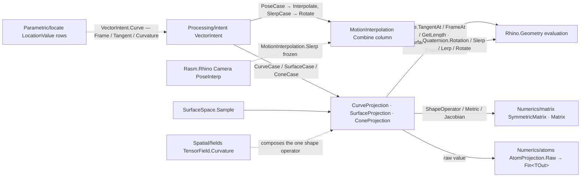

# [RASM_PARAMETRIC_PROJECTIONS]

The Rhino-native parametric evaluation selectors — four delegate-backed `[SmartEnum<int>]` vocabularies (`CurveProjection` 9 rows, `SurfaceProjection` 13 rows, `ConeProjection` 4 rows, `MotionInterpolation` 2 rows) plus the `SurfaceSpace` `[BoundaryAdapter]`, every row a sampled evaluation over `Rhino.Geometry` `Curve`/`Surface`/`SurfaceCurvature`/`Quaternion` members, the three projection selectors each draining through ONE `Project<TOut>` gate into the `Numerics/atoms` `AtomProjection.Raw` typed projection rail. This page is a genuinely Rhino-boundary surface by decision: the RhinoCommon evaluation members ARE the capability (the moving frame, the perpendicular sweep frame, the principal-curvature bundle, the mixed partial derivatives, the quaternion rotor algebra), captured rich and never thinned. The host-neutral vendored-NURBS sibling `curve.md` owns the SAME parametric concept for the non-Rhino runtime — the split is runtime, never capability, and the two meet only at the wire.

Two single-owner laws seal here. `SurfaceProjection.ShapeOperator` is THE one second-fundamental-form owner: it assembles `S = k₀·d₀⊗d₀ + k₁·d₁⊗d₁` from the `SurfaceCurvature` principal bundle into a `Numerics/matrix` `SymmetricMatrix`, and the `Spatial/fields` `TensorField.Curvature` case composes this row — never a second shape-operator derivation. `MotionInterpolation` is THE one quaternion-interpolation site: its `Combine` row column (`Quaternion.Lerp`/`Quaternion.Slerp`) drives both the plane-pose `Interpolate` and the direction `Rotate`, so the `Processing/intent` pose AND slerp dispatch arms both delegate here — an inline quaternion arm beside the dispatch is the killed duplicate. Selectors are the case payloads the `Processing/intent` `VectorIntent` `CurveCase`/`SurfaceCase`/`ConeCase`/`PoseCase` carry and the `Parametric/locate` `LocationValue` rows route; `MotionInterpolation.Slerp` and `SurfaceSpace` are frozen contract names (`Rasm.Rhino` Camera binds `VectorIntent.Pose(..., mode: MotionInterpolation.Slerp, ...)`; `VectorIntent.Surface` carries `SurfaceSpace`). Every failure routes the `Domain/rails` `Op` fault factory over `Fin<T>`; host-read scalars and vectors gate through the acceptance oracle (`RhinoMath.IsValidDouble` beneath it, screening the host unset sentinel — a bare `double.IsFinite` on host material is the named weaker gate); Rhino-semantic tolerances stay Rhino-owned (`RhinoMath.ZeroTolerance` for frame coincidence, `Context` for everything model-scaled).

## [01]-[INDEX]

- [02]-[SELECTORS]: `CurveProjection` (tangent/curvature/frames/arc-length), `SurfaceProjection` (curvature bundle/normal/frames/derivative forms/shape operator), `ConeProjection` (solid-angle vocabulary over `VectorCone`) — delegate-row SmartEnums with one `Project<TOut>` gate each, row-factory folds collapsing repeated construction, and the `AdmitsMagnitude` row column replacing identity probes.
- [03]-[MOTION]: `MotionInterpolation` — the one slerp owner (plane pose + direction rotation from one `Combine` column); `SurfaceSpace` — the validated surface + tolerance capsule `VectorIntent.Surface` carries, re-homed to its parametric family.

## [02]-[SELECTORS]

- Owner: `CurveProjection` `[SmartEnum<int>]` — 9 rows over one `[UseDelegateFromConstructor]` `Sample(Curve, double, Context, Op)` column plus the `AdmitsMagnitude` bool column: `Tangent` (unit-gated `Curve.TangentAt`), `Curvature` (`Curve.CurvatureAt`, zero-vector admissible — the one magnitude-admitting row), `Frame`/`PerpendicularFrame` (`Curve.FrameAt`/`Curve.PerpendicularFrameAt` moving vs sweep frame), `ArcLength` (`Curve.GetLength(fractionalTolerance, subdomain)` from `Domain.T0`), `FrameNormal`/`FrameBinormal`/`PerpendicularNormal`/`PerpendicularBinormal` (axis projections of the two frames). Two row-factory folds own construction: `Vector(key, admitsMagnitude, sample)` collapses the validity-wrapped vector rows and `FrameRow(key, perpendicular, project)` collapses all six frame-derived rows into one out-parameter fold — nine rows, three construction shapes, zero per-row boilerplate.
- Owner: `SurfaceProjection` `[SmartEnum<int>]` — 13 rows over `Sample(Surface, Point2d, Context, Op)`: `PrincipalCurvatures` (κ-max/κ-min pair), `Gaussian`/`Mean` (`Domain/stats` `ScalarMetric.Gaussian`/`Mean` over the `SurfaceCurvature` bundle), `MaximumOsculatingCircle`/`MinimumOsculatingCircle` (`SurfaceCurvature.OsculatingCircle(0|1)`), `Normal`/`Frame` (the `Domain/evaluation` `NormalAt`/`FrameAt` lattice), `ShapeOperator` (the second-fundamental-form `SymmetricMatrix` — the single owner), `Point` (`Surface.PointAt`), `UvFrame` (derivative-spanned plane re-oriented to the outward normal), `Jacobian` (3×2 `Matrix` of ∂u/∂v), `Metric` (2×2 first-fundamental-form `SymmetricMatrix` [E F; F G]), `AreaScale` (`|∂u×∂v|`). Two helper folds own the sampling shapes: `WithCurvature` runs a row against the disposable `SurfaceCurvature` bundle on the `Lease` rail, and `Derivatives(key, project)` is the row factory for the four first-derivative rows over one `Surface.Evaluate(u, v, numberDerivatives: 1, ...)` call.
- Owner: `ConeProjection` `[SmartEnum<int>]` — 4 rows (`HalfAngle`/`SolidAngle`/`Axis`/`Apex`) over one `Sample(VectorCone)` accessor column. The rows stay a selector vocabulary by decision: `VectorIntent.Cone(cone, mode)` carries the row as its case payload, and instance accessors on `VectorCone` cannot ride a dispatch payload — the thin-accessor collapse the row shape invites is rejected because the selector IS the modality discriminant.
- Entry: each selector exposes exactly one `internal Fin<TOut> Project<TOut>(...)` gate — `CurveProjection.Project<TOut>(Curve, double, Context, Op)` admits the curve (non-null, `IsValid`, `Domain.IncludesParameter`), samples the row, and drains `AtomProjection.Raw<TOut>(raw, Some(context), key, owner: typeof(CurveProjection), admitsVectorMagnitude: AdmitsMagnitude)`; `SurfaceProjection.Project<TOut>(Surface, double u, double v, Context, Op)` admits the surface, normalizes `(u,v)` through the `Domain/evaluation` `SurfaceUv`, samples, and drains the same rail; `ConeProjection.Project<TOut>(VectorCone, Op)` drains context-free. No per-row public methods, no output-type overloads — the raw→typed step is the rail's, and the `AdmitsMagnitude` column kills the `ReferenceEquals(this, Curvature)` identity probe: magnitude admission is row data, not a hidden special case.
- Receipt: none — a selector row is a pure evaluation; the typed value IS the result, and failure evidence rides the `Op` fault (`InvalidInput` for admission refusals, `InvalidResult` for host-evaluation refusals, `Unsupported` for output-type refusals raised inside the rail).
- Packages: RhinoCommon (`Curve.TangentAt`/`CurvatureAt`/`FrameAt`/`PerpendicularFrameAt`/`GetLength(fractionalTolerance, subdomain)`/`Domain.IncludesParameter`; `Surface.CurvatureAt`/`PointAt`/`Evaluate`; `SurfaceCurvature.Kappa`/`Direction`/`OsculatingCircle`/`MaximumPrincipalCurvature`/`MinimumPrincipalCurvature`/`IsSet` — an `IDisposable` bundle; `Interval`, `Circle.IsValid`, `Vector3d.CrossProduct`/`IsValid`/`IsTiny`), Thinktecture.Runtime.Extensions (`[SmartEnum<int>]`, `[UseDelegateFromConstructor]`), LanguageExt.Core (`Fin`/`Option`/`guard`/`Optional`), `Domain/rails` (`Op`, `Lease<T>`), `Domain/context` (`Context.Fractional`/`Absolute`), `Domain/evaluation` (`NormalAt`/`FrameAt`/`SurfaceUv`), `Domain/stats` (`ScalarMetric`), `Numerics/atoms` (`AtomProjection.Raw`, `Direction.Of`, `Dimension`, `VectorCone`), `Numerics/matrix` (`SymmetricMatrix.Of`, `Matrix.Of`).
- Growth: a new curve or surface probe is one row through an existing factory fold (a `Torsion` row is `Vector(...)` over the third-derivative Frenet identity; a `MeanCurvatureVector` row is `WithCurvature` composing `Mean` with `Normal`); a new derivative form is one `Derivatives(...)` row; a new output type for an existing row is a `ProjectionRow` addition in the `Numerics/atoms` rail, never a selector edit. Zero new entrypoints on any axis.
- Boundary: the selector family is the ONE row vocabulary for parameter-addressed evaluation behind the intent rail — a sibling `CurveEvaluator`/`SurfaceAnalyzer` method family per output is the named defect collapsed here, and a row exists exactly where evaluation carries ROW SEMANTICS (validity gating, magnitude admission, moving-vs-sweep frame choice, the curvature-bundle lease, the derivative fold); `Domain/evaluation` stays the shared derivation floor both the rows and the `Parametric/locate` location arms compose — an arm re-implementing row semantics beside the rail is the killed duplicate, while the `Parametric/locate` surface arms reading the floor directly (point/frame/normal: no row semantics, UV already normalized by the operation) are lawful composition, never a parallel rail; the shape operator is assembled HERE only — `TensorField.Curvature` composes `SurfaceProjection.ShapeOperator.Project`, and a second `k·d⊗d` assembly anywhere in the corpus is the named double-owner defect; rows sample the LIVE Rhino object under the caller's lease discipline (`Parametric/locate` runs them inside `Lease<Curve>`/`Lease<Surface>` scopes; `VectorIntent.CurveCase` holds the caller's reference) — a row never duplicates, caches, or outlives its geometry; `SurfaceCurvature` is disposable host memory, so every bundle read runs inside `Lease<SurfaceCurvature>.Owned(...).Use(...)` and a bundle escaping its row is the named leak defect; the `Domain/evaluation` lattice owns closest-point/normal/frame recovery over ARBITRARY geometry — these selectors own only parameter-addressed evaluation on an already-typed `Curve`/`Surface`, and routing a closest-point query through a selector is the altitude violation.

## [03]-[MOTION]

- Owner: `MotionInterpolation` `[SmartEnum<int>]` — `Linear` (key 0, `Quaternion.Lerp`) and `Slerp` (key 1, `Quaternion.Slerp`) over ONE `[UseDelegateFromConstructor]` `Combine(Quaternion, Quaternion, double)` column; both interpolation surfaces derive from that single column (`DERIVED_LOGIC`): `Interpolate(Plane a, Plane b, UnitInterval t, Op)` — coincidence short-circuit at `RhinoMath.ZeroTolerance`, `Quaternion.Rotation(Plane.WorldXY, …)` rotors combined then `GetRotation(out Plane)`, origin linearly interpolated onto the rotated axes — and `Rotate(Direction a, Direction b, UnitInterval t, Context, Op)` — the antiparallel pair (`IsParallelTo == -1` under `Context.Angle`) takes the π rotor about `VectorFrame.SeedPerpendicular`, every other pair the shortest-arc rotor from `Transform.Rotation(...).GetQuaternion(...)`, combined from `Quaternion.Identity` and applied via `Quaternion.Rotate`. `Slerp` is the geodesic row; `Linear` yields nlerp on directions (renormalized by `Direction.Of` admission) and screw-free frame lerp on poses.
- Owner: `SurfaceSpace` `[BoundaryAdapter]` `readonly record struct` — the validated `Surface` + `Context` capsule: `Of(Surface, Context, Op?)` admits once (context present, surface non-null and `IsValid`) and `Sample<TOut>(SurfaceProjection, double u, double v, Op)` delegates to the selector gate with the captured tolerance — an internal kernel, so the key is required by the `Domain/rails` threading law and the `Processing/intent` `surfaceCase` supplies it. Re-homed from the proximity file to its parametric family: `Spatial/support` keeps `SupportSpace` (closest-point over ANY geometry); `SurfaceSpace` is parameter-addressed evaluation on a typed surface — different concern, different folder, same wire (`VectorIntent.SurfaceCase` carries it).
- Entry: `MotionInterpolation.Interpolate`/`Rotate` are `internal` — the `Processing/intent` dispatch is their consumer (`poseCase` → `Interpolate`, `slerpCase` → `Rotate`); the public surface is the two rows plus `SurfaceSpace.Of`. `Rasm.Rhino` Camera reaches the rows only as `VectorIntent.Pose(from, to, t, mode: MotionInterpolation.Slerp, key)` case payload — the row NAME is the frozen contract, the interpolation body is not.
- Boundary: `MotionInterpolation` is the ONE quaternion-interpolation owner — an inline `Quaternion.Slerp` beside a dispatch arm, a second plane-lerp helper, or a per-consumer rotor derivation is the named duplicate this page kills (the `Processing/intent` `slerpCase` arm delegates here by law); pure vector-space interpolation (`lerp` of raw vectors, mirror, planar projection) is `Numerics/atoms` `Direction` algebra, NOT motion — this owner starts where a rotor is involved; arc policy is sealed inside the row and its `Quaternion.Rotation` operands — the antiparallel direction pair is the only seam where arc choice is ambiguous, and it is pinned to the seeded-perpendicular π rotor — so a consumer flipping quaternion signs is the named defect; `UnitInterval` admission (`Domain/validation` `AcceptValidated`) happens at the intent factory, so `t` arrives admitted and re-clamping here is the double-validation defect.

```csharp signature
// --- [RUNTIME_PRELUDE] ----------------------------------------------------------------------
// Rhino.Geometry, the LanguageExt prelude, and Thinktecture arrive as csproj global usings; Rasm.Domain and Rasm.Numerics do not.
using Rasm.Csp;
using Rasm.Domain;
using Rasm.Numerics;
using Rhino;

namespace Rasm.Parametric;

// --- [TYPES] --------------------------------------------------------------------------------
[SmartEnum<int>]
public sealed partial class CurveProjection {
    public static readonly CurveProjection Tangent = Vector(key: 0, admitsMagnitude: false, sample: static (curve, t) => curve.TangentAt(t: t));
    public static readonly CurveProjection Curvature = Vector(key: 1, admitsMagnitude: true, sample: static (curve, t) => curve.CurvatureAt(t: t));
    public static readonly CurveProjection Frame = FrameRow(key: 2, perpendicular: false, project: static frame => frame);
    public static readonly CurveProjection PerpendicularFrame = FrameRow(key: 3, perpendicular: true, project: static frame => frame);
    // Host-read scalar: IsValidDouble screens the unset sentinel; zero admits only at the domain start, gated
    // in normalized parameter space — a model-space tolerance against a parameter delta is the killed unit confusion.
    public static readonly CurveProjection ArcLength = new(key: 4, admitsMagnitude: false,
        sample: static (curve, t, context, key) => curve.GetLength(fractionalTolerance: context.Fractional, subdomain: new Interval(curve.Domain.T0, t)) switch {
            double length when RhinoMath.IsValidDouble(x: length) && (length > 0.0 || curve.Domain.NormalizedParameterAt(t) <= context.Fractional) => Fin.Succ((object)length),
            _ => Fin.Fail<object>(key.InvalidResult()),
        });
    public static readonly CurveProjection FrameNormal = FrameRow(key: 5, perpendicular: false, project: static frame => frame.YAxis);
    public static readonly CurveProjection FrameBinormal = FrameRow(key: 6, perpendicular: false, project: static frame => frame.ZAxis);
    public static readonly CurveProjection PerpendicularNormal = FrameRow(key: 7, perpendicular: true, project: static frame => frame.YAxis);
    public static readonly CurveProjection PerpendicularBinormal = FrameRow(key: 8, perpendicular: true, project: static frame => frame.ZAxis);

    // Row column: the curvature row admits zero-magnitude vectors AND magnitude projection; data, not an identity probe.
    public bool AdmitsMagnitude { get; }
    [UseDelegateFromConstructor] private partial Fin<object> Sample(Curve curve, double parameter, Context context, Op key);

    internal Fin<TOut> Project<TOut>(Curve curve, double parameter, Context context, Op key) =>
        from active in Optional(curve).ToFin(key.InvalidInput())
        from _ in guard(active.IsValid && active.Domain.IncludesParameter(t: parameter), key.InvalidInput())
        from raw in Sample(curve: active, parameter: parameter, context: context, key: key).BindFail(_ => Fin.Fail<object>(key.InvalidResult()))
        from output in AtomProjection.Raw<TOut>(raw: raw, context: Some(context), key: key, owner: typeof(CurveProjection), admitsVectorMagnitude: AdmitsMagnitude)
        select output;

    private static CurveProjection Vector(int key, bool admitsMagnitude, Func<Curve, double, Vector3d> sample) =>
        new(key: key, admitsMagnitude: admitsMagnitude, sample: (curve, t, _, op) => sample(arg1: curve, arg2: t) switch {
            Vector3d vector when vector.IsValid && (admitsMagnitude || !vector.IsTiny()) => Fin.Succ((object)vector),
            _ => Fin.Fail<object>(op.InvalidResult()),
        });
    // Bool-switch arms keep each out-var self-contained: a frame declared in one ternary branch is out of scope in the other.
    private static CurveProjection FrameRow(int key, bool perpendicular, Func<Plane, object> project) =>
        new(key: key, admitsMagnitude: false, sample: (curve, t, _, op) => perpendicular switch {
            true => curve.PerpendicularFrameAt(t: t, plane: out Plane frame) ? Fin.Succ(project(arg: frame)) : Fin.Fail<object>(op.InvalidResult()),
            false => curve.FrameAt(t: t, plane: out Plane frame) ? Fin.Succ(project(arg: frame)) : Fin.Fail<object>(op.InvalidResult()),
        });
}

[SmartEnum<int>]
public sealed partial class SurfaceProjection {
    public static readonly SurfaceProjection PrincipalCurvatures = new(key: 0, sample: static (surface, uv, _, key) => WithCurvature(surface: surface, uv: uv, key: key, project: static sc => Fin.Succ((object)Seq(sc.MaximumPrincipalCurvature, sc.MinimumPrincipalCurvature))));
    public static readonly SurfaceProjection Gaussian = new(key: 1, sample: static (surface, uv, _, key) => WithCurvature(surface: surface, uv: uv, key: key, project: sc => ScalarMetric.Gaussian.Of(value: sc, key: key).Map(static value => (object)value)));
    public static readonly SurfaceProjection Mean = new(key: 2, sample: static (surface, uv, _, key) => WithCurvature(surface: surface, uv: uv, key: key, project: sc => ScalarMetric.Mean.Of(value: sc, key: key).Map(static value => (object)value)));
    public static readonly SurfaceProjection MaximumOsculatingCircle = Osculating(key: 3, direction: 0);
    public static readonly SurfaceProjection Normal = new(key: 4, sample: static (surface, uv, _, key) => Evaluation.NormalAt(surface: surface, uv: uv, key: key).Map(static normal => (object)normal));
    public static readonly SurfaceProjection ShapeOperator = new(key: 5, sample: static (surface, uv, context, key) => WithCurvature(surface: surface, uv: uv, key: key, project: sc => ShapeOperatorOf(curvature: sc, context: context, key: key).Map(static value => (object)value)));
    public static readonly SurfaceProjection MinimumOsculatingCircle = Osculating(key: 6, direction: 1);
    public static readonly SurfaceProjection Point = new(key: 7, sample: static (surface, uv, _, key) => key.AcceptValue(value: surface.PointAt(u: uv.X, v: uv.Y)).Map(static point => (object)point));
    public static readonly SurfaceProjection Frame = new(key: 8, sample: static (surface, uv, _, key) => Evaluation.FrameAt(surface: surface, uv: uv, key: key).Map(static value => (object)value));
    public static readonly SurfaceProjection UvFrame = Derivatives(key: 9, project: static (surface, uv, d, _, key) => OrientedFrame(surface: surface, uv: uv, frame: new Plane(origin: d.Point, xDirection: d.Du, yDirection: d.Dv), key: key).Map(static value => (object)value));
    public static readonly SurfaceProjection Jacobian = Derivatives(key: 10, project: static (_, _, d, _, key) => Matrix.Of(rows: Dimension.Create(value: 3), cols: Dimension.Create(value: 2), entries: [d.Du.X, d.Dv.X, d.Du.Y, d.Dv.Y, d.Du.Z, d.Dv.Z], key: key).Map(static value => (object)value));
    public static readonly SurfaceProjection Metric = Derivatives(key: 11, project: static (_, _, d, _, key) => SymmetricMatrix.Of(dim: Dimension.Create(value: 2), upper: [d.Du * d.Du, d.Du * d.Dv, d.Dv * d.Dv], key: key).Map(static value => (object)value));
    public static readonly SurfaceProjection AreaScale = Derivatives(key: 12, project: static (_, _, d, _, key) => key.AcceptValue(value: Vector3d.CrossProduct(a: d.Du, b: d.Dv).Length).Map(static value => (object)value));

    [UseDelegateFromConstructor] private partial Fin<object> Sample(Surface surface, Point2d uv, Context context, Op key);

    internal Fin<TOut> Project<TOut>(Surface surface, double u, double v, Context context, Op key) =>
        from active in Optional(surface).ToFin(key.InvalidInput())
        from _ in guard(active.IsValid, key.InvalidInput())
        from uv in Evaluation.SurfaceUv(surface: active, uv: new Point2d(x: u, y: v), context: context, key: key)
        from raw in Sample(surface: active, uv: uv, context: context, key: key).BindFail(_ => Fin.Fail<object>(key.InvalidResult()))
        from output in AtomProjection.Raw<TOut>(raw: raw, context: Some(context), key: key, owner: typeof(SurfaceProjection))
        select output;

    // The SurfaceCurvature bundle is disposable host memory; the lease wraps BEFORE the IsSet gate so a
    // partially-set bundle is disposed on the refusal path, never leaked.
    private static Fin<T> WithCurvature<T>(Surface surface, Point2d uv, Op key, Func<SurfaceCurvature, Fin<T>> project) =>
        Optional(surface.CurvatureAt(u: uv.X, v: uv.Y)).ToFin(key.InvalidResult())
            .Bind(sc => new Lease<SurfaceCurvature>.Owned(Value: sc)
                .Use(bundle => bundle.IsSet ? project(arg: bundle) : Fin.Fail<T>(key.InvalidResult())));

    // THE second-fundamental-form owner: S = k0·d0⊗d0 + k1·d1⊗d1 as the 3×3 symmetric upper triangle.
    private static Fin<SymmetricMatrix> ShapeOperatorOf(SurfaceCurvature curvature, Context context, Op key) {
        double k0 = curvature.Kappa(direction: 0);
        double k1 = curvature.Kappa(direction: 1);
        return from d0 in Direction.Of(value: curvature.Direction(direction: 0), context: context, key: key)
               from d1 in Direction.Of(value: curvature.Direction(direction: 1), context: context, key: key)
               from matrix in SymmetricMatrix.Of(
                   dim: Dimension.Create(value: 3),
                   upper: [
                       (k0 * d0.Value.X * d0.Value.X) + (k1 * d1.Value.X * d1.Value.X),
                       (k0 * d0.Value.X * d0.Value.Y) + (k1 * d1.Value.X * d1.Value.Y),
                       (k0 * d0.Value.X * d0.Value.Z) + (k1 * d1.Value.X * d1.Value.Z),
                       (k0 * d0.Value.Y * d0.Value.Y) + (k1 * d1.Value.Y * d1.Value.Y),
                       (k0 * d0.Value.Y * d0.Value.Z) + (k1 * d1.Value.Y * d1.Value.Z),
                       (k0 * d0.Value.Z * d0.Value.Z) + (k1 * d1.Value.Z * d1.Value.Z),
                   ],
                   key: key)
               select matrix;
    }
    private static Fin<(Point3d Point, Vector3d Du, Vector3d Dv)> SurfaceDerivatives(Surface surface, Point2d uv, Op key) =>
        surface.Evaluate(u: uv.X, v: uv.Y, numberDerivatives: 1, point: out Point3d point, derivatives: out Vector3d[] derivatives)
        && derivatives is { Length: >= 2 }
            ? from validPoint in key.AcceptValue(value: point)
              from du in key.AcceptValue(value: derivatives[0])
              from dv in key.AcceptValue(value: derivatives[1])
              select (Point: validPoint, Du: du, Dv: dv)
            : Fin.Fail<(Point3d Point, Vector3d Du, Vector3d Dv)>(key.InvalidResult());
    private static Fin<Plane> OrientedFrame(Surface surface, Point2d uv, Plane frame, Op key) =>
        from basis in Admit.Plane(basis: frame, key: key)
        from normal in Evaluation.NormalAt(surface: surface, uv: uv, key: key)
        from oriented in Admit.Plane(
            basis: basis.ZAxis * normal >= 0.0 ? basis : new Plane(origin: basis.Origin, xDirection: basis.XAxis, yDirection: -basis.YAxis),
            key: key)
        select oriented;
    private static SurfaceProjection Osculating(int key, int direction) =>
        new(key: key, sample: (surface, uv, _, op) => WithCurvature(surface: surface, uv: uv, key: op, project: sc => sc.OsculatingCircle(direction) switch {
            Circle circle when circle.IsValid => Fin.Succ((object)circle),
            _ => Fin.Fail<object>(op.InvalidResult()),
        }));
    private static SurfaceProjection Derivatives(int key, Func<Surface, Point2d, (Point3d Point, Vector3d Du, Vector3d Dv), Context, Op, Fin<object>> project) =>
        new(key: key, sample: (surface, uv, context, op) => SurfaceDerivatives(surface: surface, uv: uv, key: op).Bind(d => project(arg1: surface, arg2: uv, arg3: d, arg4: context, arg5: op)));
}

[SmartEnum<int>]
public sealed partial class ConeProjection {
    public static readonly ConeProjection HalfAngle = new(key: 0, sample: static cone => cone.HalfAngle);
    public static readonly ConeProjection SolidAngle = new(key: 1, sample: static cone => cone.SolidAngle);
    public static readonly ConeProjection Axis = new(key: 2, sample: static cone => cone.Axis);
    public static readonly ConeProjection Apex = new(key: 3, sample: static cone => cone.Apex);
    [UseDelegateFromConstructor] private partial object Sample(VectorCone cone);
    internal Fin<TOut> Project<TOut>(VectorCone cone, Op key) =>
        AtomProjection.Raw<TOut>(raw: Sample(cone: cone), context: Option<Context>.None, key: key, owner: typeof(ConeProjection));
}

[SmartEnum<int>]
public sealed partial class MotionInterpolation {
    public static readonly MotionInterpolation Linear = new(key: 0, combine: static (a, b, t) => Quaternion.Lerp(a: a, b: b, t: t));
    public static readonly MotionInterpolation Slerp = new(key: 1, combine: static (a, b, t) => Quaternion.Slerp(a: a, b: b, t: t));
    [UseDelegateFromConstructor] private partial Quaternion Combine(Quaternion a, Quaternion b, double t);

    // Pose interpolation: coincidence short-circuit, WorldXY-anchored rotors, origin lerp riding the combined rotor.
    internal Fin<Plane> Interpolate(Plane a, Plane b, UnitInterval t, Op key) =>
        from left in Admit.Plane(basis: a, key: key)
        from right in Admit.Plane(basis: b, key: key)
        from output in left.EpsilonEquals(other: right, epsilon: RhinoMath.ZeroTolerance)
            ? Fin.Succ(left)
            : Combine(a: Quaternion.Rotation(plane0: Plane.WorldXY, plane1: left), b: Quaternion.Rotation(plane0: Plane.WorldXY, plane1: right), t: t.Value)
                  .GetRotation(plane: out Plane oriented) && oriented.IsValid
                ? Admit.Plane(basis: new Plane(origin: left.Origin + ((right.Origin - left.Origin) * t.Value), xDirection: oriented.XAxis, yDirection: oriented.YAxis), key: key)
                : Fin.Fail<Plane>(key.InvalidResult())
        select output;

    // Direction rotation: the intent slerp arm delegates here — antiparallel pairs take the π rotor about a
    // seeded perpendicular; every other pair the shortest-arc rotor.
    internal Fin<Direction> Rotate(Direction a, Direction b, UnitInterval t, Context context, Op key) =>
        from rotor in a.Value.IsParallelTo(other: b.Value, angleTolerance: context.Angle.Value) switch {
            -1 => Fin.Succ(Quaternion.Rotation(Math.PI, VectorFrame.SeedPerpendicular(axis: a.Value))),
            _ => Transform.Rotation(startDirection: a.Value, endDirection: b.Value, rotationCenter: Point3d.Origin).GetQuaternion(quaternion: out Quaternion target)
                ? Fin.Succ(target)
                : Fin.Fail<Quaternion>(key.InvalidResult()),
        }
        from rotated in Direction.Of(value: Combine(a: Quaternion.Identity, b: rotor, t: t.Value).Rotate(v: a.Value), context: context, key: key)
        select rotated;
}

// --- [MODELS] -------------------------------------------------------------------------------
[BoundaryAdapter, StructLayout(LayoutKind.Auto)]
public readonly record struct SurfaceSpace {
    private SurfaceSpace(Surface native, Context tolerance) { Native = native; Tolerance = tolerance; }
    public Surface Native { get; }
    public Context Tolerance { get; }
    public static Fin<SurfaceSpace> Of(Surface native, Context context, Op? key = null) {
        Op op = key.OrDefault();
        return from ctx in Optional(context).ToFin(op.MissingContext())
               from active in Optional(native).Filter(static surface => surface.IsValid).ToFin(op.InvalidInput())
               select new SurfaceSpace(native: active, tolerance: ctx);
    }
    internal Fin<TOut> Sample<TOut>(SurfaceProjection projection, double u, double v, Op key) {
        // Struct `this` cannot ride the lambda (CS1673): copy the slots to locals before the bind.
        (Surface native, Context tolerance) = (Native, Tolerance);
        return Optional(projection).ToFin(key.InvalidInput()).Bind(mode => mode.Project<TOut>(surface: native, u: u, v: v, context: tolerance, key: key));
    }
}
```



## [04]-[DENSITY_BAR]

One owner per axis; capability is a row, column, or factory fold, never a sibling surface. `[RAIL]` names the one return rail each owner exposes.

| [INDEX] | [CONCERN]                 | [OWNER]               | [KIND]                                                                                       | [RAIL]                                             | [CASES] |
| :-----: | :------------------------ | :-------------------- | :------------------------------------------------------------------------------------------- | :------------------------------------------------- | :-----: |
|  [01]   | curve evaluation          | `CurveProjection`     | `[SmartEnum<int>]` delegate rows + `AdmitsMagnitude` column, 2 factory folds                 | `Project<TOut> → Fin<TOut>`                        |    9    |
|  [02]   | surface evaluation        | `SurfaceProjection`   | `[SmartEnum<int>]` delegate rows + `WithCurvature` lease fold + `Derivatives` factory        | `Project<TOut> → Fin<TOut>`                        |   13    |
|  [03]   | cone reading              | `ConeProjection`      | `[SmartEnum<int>]` accessor rows over `VectorCone`                                           | `Project<TOut> → Fin<TOut>`                        |    4    |
|  [04]   | quaternion interpolation  | `MotionInterpolation` | `[SmartEnum<int>]` with ONE `Combine` column deriving pose + direction surfaces              | `Interpolate → Fin<Plane>`; `Rotate → Fin<Direction>` |    2    |
|  [05]   | surface capsule           | `SurfaceSpace`        | `[BoundaryAdapter]` validated surface + tolerance carrier                                    | `Of → Fin<SurfaceSpace>`; `Sample<TOut> → Fin<TOut>` |    1    |

The selector rows, the `Project<TOut>` gates, `ShapeOperatorOf`, `SurfaceDerivatives`, `OrientedFrame`, `Interpolate`, and `Rotate` are transcription-complete against the RhinoCommon evaluation surface. `Evaluation.NormalAt`/`FrameAt`/`SurfaceUv`, `Admit.Plane`, `AtomProjection.Raw`, `ScalarMetric`, `SymmetricMatrix.Of`/`Matrix.Of`, `Direction.Of`, `VectorFrame.SeedPerpendicular`, `Dimension`, `UnitInterval`, `Lease<T>`, and `Op` are composed upstream owners, never re-minted here.

## [05]-[RESEARCH]

- [SELECTOR_ROWS] — a parametric probe is a ROW, never a method: the four vocabularies put every evaluation modality behind one delegate column and one `Project<TOut>` gate, so call-site variation is row selection and output variation is the `Numerics/atoms` `ProjectionRow` table — the selector never grows a second public method for a new output type. Row construction is fold-owned: `Vector(...)` carries the validity gate (tiny-vector rejection suspended only for the magnitude-admitting curvature row), `FrameRow(...)` owns both Rhino frame recoveries behind one `perpendicular` policy bit, `Osculating(...)` owns both principal circles behind the `direction` index, and `Derivatives(...)` owns the four first-derivative forms over one `Surface.Evaluate` call — twenty-eight rows across the page, six construction shapes. The `ArcLength` acceptance admits a zero length only at the domain start (`Domain.NormalizedParameterAt(t) ≤ Context.Fractional` — a dimensionless station against the fractional tolerance, never a model-space tolerance against a parameter delta), so a degenerate mid-domain length reads as evaluation failure, not as zero; the length itself gates through `RhinoMath.IsValidDouble`, the host-scalar law.
- [SECOND_FUNDAMENTAL_FORM] — `ShapeOperatorOf` assembles the extrinsic shape operator from the `SurfaceCurvature` principal bundle: κ and principal directions arrive from `Surface.CurvatureAt` already orthonormal in the tangent plane, the admitted `Direction` pair guards degeneracy, and the 3×3 upper triangle lands in the `Numerics/matrix` `SymmetricMatrix` whose eigen-decomposition reproduces (κ₀, κ₁, 0). The derivative family beside it is the first-fundamental side: `Metric` is [E F; F G] = [∂u·∂u, ∂u·∂v; ·, ∂v·∂v], `Jacobian` the 3×2 pushforward, `AreaScale` its `|∂u×∂v|` density — together the complete pointwise differential-geometry reading of a Rhino surface, all addressed by row. `UvFrame` re-orients the derivative-spanned plane to agree with the outward normal by flipping the Y axis, never the X — the frame stays right-handed and the u-direction stays authoritative.
- [ONE_SLERP] — the two interpolation surfaces are one algebra: `Combine` is the row's only behavior, `Interpolate` conjugates it through `Plane`-valued rotors anchored at `Plane.WorldXY` (rotor composition commutes with the anchoring, so anchor choice cancels), and `Rotate` runs it from `Quaternion.Identity` toward the pair's shortest-arc rotor. The antiparallel seam is the one genuinely ambiguous input — `Transform.Rotation` has no unique axis at π — and the pinned answer is the deterministic `VectorFrame.SeedPerpendicular` axis, making antiparallel rotation reproducible across runs and consumers. The `Linear` row is not a degenerate spare: on directions it yields nlerp (constant-chord, cheaper, admissible for dense sampling), on poses a non-constant-velocity frame blend; the row choice is the motion-profile policy the Camera consumer selects by name.
