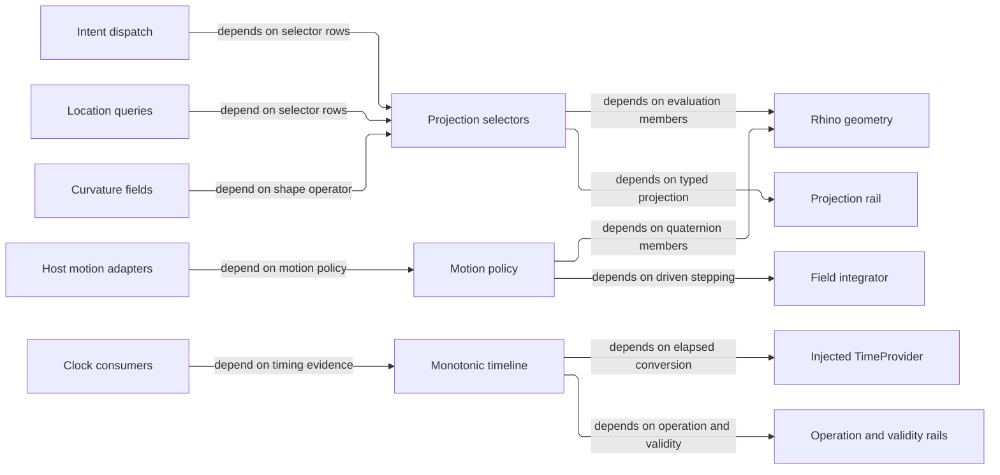

# [RASM_PARAMETRIC_PROJECTIONS]

`CurveProjection`, `SurfaceProjection`, and `ConeProjection` own Rhino-native parameter-addressed evaluation; the host-neutral motion owners govern interpolation and provider-relative time. Each selector drains one `Project<TOut>` gate into `AtomProjection.Raw`, and every captured clock value stays branded to the injected `TimeProvider` timeline that minted it.

Every fallible read stays on the `Op`-keyed `Fin<T>` rail: Rhino-read material admits through the Rhino acceptance oracle, the host-neutral timing owners through their own validity evidence. Perceptual colour interpolation stays the `Numerics/atoms` `PerceptualColor`/`BlendPath` owner, never a motion sibling.

## [01]-[INDEX]

- [02]-[SELECTORS]: `CurveProjection`, `SurfaceProjection`, and `ConeProjection` — delegate-row `[SmartEnum<int>]` vocabularies, one `Project<TOut>` gate each, row-factory folds, and the `AdmitsMagnitude` column replacing identity probes.
- [03]-[MOTION]: `MotionInterpolation` and `SurfaceSpace` own Rhino-parametric rotation and sampling; host-neutral motion rows own shaping; `MonotonicTimeline` and `BeatSeed` brand provider timestamps and discriminate timer-sequence admission.

## [02]-[SELECTORS]

- Owner: `CurveProjection` `[SmartEnum<int>]` — a row vocabulary over one `[UseDelegateFromConstructor]` `Sample(Curve, double, Context, Op)` column and the `AdmitsMagnitude` policy column. `Vector(key, admitsMagnitude, sample)` owns vector admission, `FrameRow(key, perpendicular, project)` owns moving and sweep-frame recovery with axis projection, and the arc-length row owns the domain-length call.
- Owner: `SurfaceProjection` `[SmartEnum<int>]` — a row vocabulary over `Sample(Surface, Point2d, Context, Op)`. `WithCurvature` scopes every disposable `SurfaceCurvature` projection on the `Lease` rail, `Derivatives(key, project)` derives the first-fundamental forms from one `Surface.Evaluate(u, v, numberDerivatives: 1, ...)` call, and `ShapeOperator` remains the sole second-fundamental-form owner.
- Owner: `ConeProjection` `[SmartEnum<int>]` — an accessor-row vocabulary over one `Sample(VectorCone)` column: half angle, solid angle, axis, apex, and the `Spread` beam-radius-per-unit-distance scalar a spotlight or capture boundary otherwise re-derives with inline trig. `VectorIntent.Cone(cone, mode)` carries the row as its modality discriminant, which an instance accessor on `VectorCone` cannot replace.
- Entry: each selector exposes exactly one `internal Fin<TOut> Project<TOut>(...)` gate — `CurveProjection.Project<TOut>(Curve, double, Context, Op)` admits the curve (non-null, `IsValid`, `Domain.IncludesParameter`), samples the row, and drains `AtomProjection.Raw<TOut>(raw, Some(context), key, owner: typeof(CurveProjection), admitsVectorMagnitude: AdmitsMagnitude)`; `SurfaceProjection.Project<TOut>(Surface, double u, double v, Context, Op)` admits the surface, normalizes `(u,v)` through the `Domain/evaluation` `SurfaceUv`, samples, and drains the same rail; `ConeProjection.Project<TOut>(VectorCone, Op)` drains context-free. No per-row public methods, no output-type overloads — the raw→typed step is the rail's, and the `AdmitsMagnitude` column kills the `ReferenceEquals(this, Curvature)` identity probe: magnitude admission is row data, not a hidden special case.
- Receipt: none — a selector row is a pure evaluation; the typed value IS the result, and failure evidence rides the `Op` fault (`InvalidInput` for admission refusals, `InvalidResult` for host-evaluation refusals, `Unsupported` for output-type refusals raised inside the rail).
- Packages: RhinoCommon (`Curve.TangentAt`/`CurvatureAt`/`FrameAt`/`PerpendicularFrameAt`/`GetLength(fractionalTolerance, subdomain)`/`Domain.IncludesParameter`; `Surface.CurvatureAt`/`PointAt`/`Evaluate`; `SurfaceCurvature.Kappa`/`Direction`/`OsculatingCircle`/`MaximumPrincipalCurvature`/`MinimumPrincipalCurvature`/`IsSet` — an `IDisposable` bundle; `Interval`, `Circle.IsValid`, `Vector3d.CrossProduct`/`IsValid`/`IsTiny`), Thinktecture.Runtime.Extensions (`[SmartEnum<int>]`, `[UseDelegateFromConstructor]`), LanguageExt.Core (`Fin`/`Option`/`guard`/`Optional`), `Domain/rails` (`Op`, `Lease<T>`), `Domain/context` (`Context.Fractional`/`Absolute`), `Domain/evaluation` (`NormalAt`/`FrameAt`/`SurfaceUv`), `Domain/stats` (`ScalarMetric`), `Numerics/atoms` (`AtomProjection.Raw`, `Direction.Of`, `Dimension`, `VectorCone`), `Numerics/matrix` (`SymmetricMatrix.Of`, `Matrix.Of`).
- Growth: a new curve or surface probe is one row through an existing factory fold (a `Torsion` row is `Vector(...)` over the third-derivative Frenet identity; a `MeanCurvatureVector` row is `WithCurvature` composing `Mean` with `Normal`); a new derivative form is one `Derivatives(...)` row; a new output type for an existing row is a `ProjectionRow` addition in the `Numerics/atoms` rail, never a selector edit. Existing selector gates absorb every row extension.
- Boundary: the selector family is the ONE row vocabulary for parameter-addressed evaluation behind the intent rail — a per-output `CurveEvaluator`/`SurfaceAnalyzer` method family is the named defect collapsed here, and a row exists where evaluation carries ROW SEMANTICS (validity gating, magnitude admission, moving-vs-sweep frame choice, the curvature-bundle lease, the derivative fold); `Domain/evaluation` is the shared derivation floor both these rows and the `Parametric/locate` arms compose — an arm re-implementing row semantics beside the rail is the killed duplicate, while a `Parametric/locate` surface arm reading the floor directly (point/frame/normal, UV pre-normalized) is lawful composition; `SurfaceProjection.ShapeOperator` is the sole second-fundamental-form assembly, `TensorField.Curvature` composes its `Project` and a second `k·d⊗d` assembly is the named double-owner defect; rows sample the LIVE Rhino object under the caller's lease (`Parametric/locate` inside `Lease<Curve>`/`Lease<Surface>`, `VectorIntent.CurveCase` holding the reference) and never duplicate, cache, or outlive their geometry; `SurfaceCurvature` is disposable host memory, so every bundle read runs inside `Lease<SurfaceCurvature>.Owned(...).Use(...)` and an escaping bundle is the named leak defect; the `Domain/evaluation` lattice owns closest-point/normal/frame over ARBITRARY geometry while these selectors own only parameter-addressed evaluation on an already-typed `Curve`/`Surface`, so routing a closest-point through a selector is the altitude violation.

## [03]-[MOTION]

- Owner: `MotionInterpolation` `[SmartEnum<int>]` — `Linear` (key 0, `Quaternion.Lerp`) and `Slerp` (key 1, `Quaternion.Slerp`) over ONE `[UseDelegateFromConstructor]` `Combine(Quaternion, Quaternion, double)` column; both interpolation surfaces derive from that single column (`DERIVED_LOGIC`): `Interpolate(Plane a, Plane b, UnitInterval t, Op)` — coincidence short-circuit at `RhinoMath.ZeroTolerance`, `Quaternion.Rotation(Plane.WorldXY, …)` rotors combined then `GetRotation(out Plane)`, origin linearly interpolated onto the rotated axes — and `Rotate(Direction a, Direction b, UnitInterval t, Context, Op)` — the antiparallel pair (`IsParallelTo == -1` under `Context.Angle`) takes the π rotor about `VectorFrame.SeedPerpendicular`, every other pair the shortest-arc rotor from `Transform.Rotation(...).GetQuaternion(...)`, combined from `Quaternion.Identity` and applied via `Quaternion.Rotate`. `Slerp` is the geodesic row; `Linear` yields nlerp on directions (renormalized by `Direction.Of` admission) and screw-free frame lerp on poses.
- Owner: `SurfaceSpace` `[BoundaryAdapter]` `readonly record struct` — the validated `Surface` + `Context` capsule: `Of(Surface, Context, Op?)` admits once (context present, surface non-null and `IsValid`), `Sample<TOut>(SurfaceProjection, double u, double v, Op)` delegates to the selector gate with the captured tolerance. An internal kernel, so the `Domain/rails` threading law requires the key and `Processing/intent` `surfaceCase` supplies it; `Spatial/support` owns `SupportSpace` closest-point over ANY geometry while `SurfaceSpace` owns parameter-addressed evaluation on a typed surface, `VectorIntent.SurfaceCase` the shared wire.
- Owner: `Easing` `[SmartEnum<int>]` — a family-and-polarity row product over one `[UseDelegateFromConstructor]` `Curve(double)` column. Each named row composes a family kernel with `In`, `Out`, or `InOut`, so polarity behavior remains fold-owned. `Evaluate(UnitInterval t)` is the one read: input arrives admitted, output is unclamped because overshooting kernels legitimately leave the unit band and the consumer's carrier owns its own range semantics.
- Owner: `CyclePlan` `[BoundaryAdapter]` readonly record struct — repeat/yoyo phase arithmetic: `Of(Option<int> count, bool yoyo)` admits the plan (`None` count is unbounded, a bounded count is ≥ 1), and `Phase(elapsed, period, key)` folds wall progress onto the `CyclePhase` evidence — iteration index, mirrored-local `UnitInterval` position (odd iterations reverse under yoyo), and the completion flag that clamps a bounded plan onto its terminal pose instead of wrapping past it.
- Owner: `SpringShape` `[BoundaryAdapter]` readonly record struct — the analytic damped-spring owner: `Of(angularFrequency > 0, dampingRatio ≥ 0)` admits the shape, `Evaluate(SpringState from, target, elapsed, key)` returns the closed-form response with the regime selected by ζ (underdamped through the damped-frequency rotor, critically damped at `|ζ−1| ≤ EpsilonPolicy.SqrtEpsilon`, overdamped through the two real decay rates), and `Step(from, target, h, integrator, key)` runs ONE `FieldIntegrator.Step` over the page-declared `SpringShape.Module` (`IntegrationModule<SpringState, SpringState>` — position/velocity as their own delta algebra, max-norm error) for interactive driven targets where the closed form's fixed target does not hold between frames. `SpringState` carries position and velocity as one evidence value.
- Owner: `MonotonicTimeline` sealed `[BoundaryAdapter]` service — `Of(TimeProvider, Op?)` admits an injected provider with a positive `TimestampFrequency`. Each timeline instance is its own identity token; serialized `Capture` mints an opaque `MonotonicStamp`, `Elapsed` derives a non-negative interval, `Order` returns negative, zero, or positive for left-before, identical, or left-after ordering, and `Beat` derives ordinal timer evidence from one `BeatSeed`. `Order` breaks equal-provider-tick ties by the stamp's private capture ordinal; every duration still calls the capturing provider's `GetElapsedTime`, and no counter or ordinal leaves `MonotonicStamp`.
- Owner: `BeatSeed` `[Union<MonotonicStamp, MonotonicBeat>]` — `Origin` starts an independently branded sequence and `Previous` advances only that sequence's current tail. Generated case probes reject the struct's default ghost before the total `Switch` owns both modalities, and the atomic tail gate refuses replayed or concurrently substituted predecessors.
- Receipt: `MonotonicBeat` exposes immutable `Ordinal`, `Stamp`, `Elapsed`, and `Delta` evidence. Its `ValidityClaim.All` fold requires one timeline, an origin-bound sequence brand, non-negative intervals, monotone elapsed time, and first-beat delta equality; the private origin and sequence brands prevent chain mixing.
- Entry: `MotionInterpolation.Interpolate`/`Rotate` stay internal to the intent dispatch; `Easing.Evaluate`, `CyclePlan.Phase`, `SpringShape.Evaluate`/`Step`, and `MonotonicTimeline.Of`/`Capture`/`Elapsed`/`Order`/`Beat` form the public motion-time surface, each fallible operation resolving one `Op` key and returning `Fin<T>`.
- Packages: `TimeProvider` supplies monotonic timestamps and provider-defined elapsed conversion; Thinktecture owns generated `[SmartEnum]` and `[Union]` vocabularies; Foundation analyzer contracts own `[BoundaryAdapter]`; LanguageExt owns `Fin`, `Option`, and guards; RhinoCommon owns rotor and parametric evaluation; `FieldIntegrator` owns driven stepping.
- Growth: `MonotonicTimeline` serves session latency, UI-event ordering, and timer beats through one branded evidence, so a new clock consumer composes it without a host-local counter; a new easing family is one kernel folded through the existing polarities.
- Boundary: `MotionInterpolation` starts where rotation requires a quaternion, vector arithmetic staying on the admitted direction algebra; `MonotonicTimeline` admits reference identity with the capturing timeline and provider before any `GetElapsedTime` call, and each beat sequence atomically admits only its current tail, so foreign timestamps and replayed predecessors never enter accepted timing evidence.

```csharp signature
// --- [RUNTIME_PRELUDE] ----------------------------------------------------------------------
using Rasm.Csp;
using Rasm.Domain;
using Rasm.Numerics;
using Rhino;

namespace Rasm.Parametric;

// --- [TYPES] --------------------------------------------------------------------------------
[SmartEnum<int>]
public sealed partial class CurveProjection {
    public static readonly CurveProjection Tangent = Vector(key: 0, admitsMagnitude: false, sample: static (curve, t) => curve.TangentAt(t: t));
    public static readonly CurveProjection Curvature = Vector(key: 1, admitsMagnitude: true, sample: static (curve, t) => curve.CurvatureAt(t: t));
    public static readonly CurveProjection Frame = FrameRow(key: 2, perpendicular: false, project: static frame => frame);
    public static readonly CurveProjection PerpendicularFrame = FrameRow(key: 3, perpendicular: true, project: static frame => frame);
    // Zero length admits only at the domain start: the dimensionless normalized station gates against Context.Fractional, never a model-space tolerance.
    public static readonly CurveProjection ArcLength = new(key: 4, admitsMagnitude: false,
        sample: static (curve, t, context, key) => curve.GetLength(fractionalTolerance: context.Fractional, subdomain: new Interval(curve.Domain.T0, t)) switch {
            double length when RhinoMath.IsValidDouble(x: length) && (length > 0.0 || curve.Domain.NormalizedParameterAt(t) <= context.Fractional) => Fin.Succ((object)length),
            _ => Fin.Fail<object>(key.InvalidResult()),
        });
    public static readonly CurveProjection FrameNormal = FrameRow(key: 5, perpendicular: false, project: static frame => frame.YAxis);
    public static readonly CurveProjection FrameBinormal = FrameRow(key: 6, perpendicular: false, project: static frame => frame.ZAxis);
    public static readonly CurveProjection PerpendicularNormal = FrameRow(key: 7, perpendicular: true, project: static frame => frame.YAxis);
    public static readonly CurveProjection PerpendicularBinormal = FrameRow(key: 8, perpendicular: true, project: static frame => frame.ZAxis);

    public bool AdmitsMagnitude { get; }
    [UseDelegateFromConstructor] private partial Fin<object> Sample(Curve curve, double parameter, Context context, Op key);

    internal Fin<TOut> Project<TOut>(Curve curve, double parameter, Context context, Op key) =>
        from active in Optional(curve).ToFin(key.InvalidInput())
        from _ in guard(active.IsValid && active.Domain.IncludesParameter(t: parameter), key.InvalidInput())
        from raw in Sample(curve: active, parameter: parameter, context: context, key: key).BindFail(_ => Fin.Fail<object>(key.InvalidResult()))
        from output in AtomProjection.Raw<TOut>(raw: raw, context: Some(context), key: key, owner: typeof(CurveProjection), admitsVectorMagnitude: AdmitsMagnitude)
        select output;

    private static CurveProjection Vector(int key, bool admitsMagnitude, Func<Curve, double, Vector3d> sample) =>
        new(key: key, admitsMagnitude: admitsMagnitude, sample: (curve, t, _, op) => sample(arg1: curve, arg2: t) switch {
            Vector3d vector when vector.IsValid && (admitsMagnitude || !vector.IsTiny()) => Fin.Succ((object)vector),
            _ => Fin.Fail<object>(op.InvalidResult()),
        });
    private static CurveProjection FrameRow(int key, bool perpendicular, Func<Plane, object> project) =>
        new(key: key, admitsMagnitude: false, sample: (curve, t, _, op) => perpendicular switch {
            true => curve.PerpendicularFrameAt(t: t, plane: out Plane frame) ? Fin.Succ(project(arg: frame)) : Fin.Fail<object>(op.InvalidResult()),
            false => curve.FrameAt(t: t, plane: out Plane frame) ? Fin.Succ(project(arg: frame)) : Fin.Fail<object>(op.InvalidResult()),
        });
}

[SmartEnum<int>]
public sealed partial class SurfaceProjection {
    public static readonly SurfaceProjection PrincipalCurvatures = new(key: 0, sample: static (surface, uv, _, key) => WithCurvature(surface: surface, uv: uv, key: key, project: static sc => Fin.Succ((object)Seq(sc.MaximumPrincipalCurvature, sc.MinimumPrincipalCurvature))));
    public static readonly SurfaceProjection Gaussian = new(key: 1, sample: static (surface, uv, _, key) => WithCurvature(surface: surface, uv: uv, key: key, project: sc => ScalarMetric.Gaussian.Of(value: sc, key: key).Map(static value => (object)value)));
    public static readonly SurfaceProjection Mean = new(key: 2, sample: static (surface, uv, _, key) => WithCurvature(surface: surface, uv: uv, key: key, project: sc => ScalarMetric.Mean.Of(value: sc, key: key).Map(static value => (object)value)));
    public static readonly SurfaceProjection MaximumOsculatingCircle = Osculating(key: 3, direction: 0);
    public static readonly SurfaceProjection Normal = new(key: 4, sample: static (surface, uv, _, key) => Evaluation.NormalAt(surface: surface, uv: uv, key: key).Map(static normal => (object)normal));
    public static readonly SurfaceProjection ShapeOperator = new(key: 5, sample: static (surface, uv, context, key) => WithCurvature(surface: surface, uv: uv, key: key, project: sc => ShapeOperatorOf(curvature: sc, context: context, key: key).Map(static value => (object)value)));
    public static readonly SurfaceProjection MinimumOsculatingCircle = Osculating(key: 6, direction: 1);
    public static readonly SurfaceProjection Point = new(key: 7, sample: static (surface, uv, _, key) => key.AcceptValue(value: surface.PointAt(u: uv.X, v: uv.Y)).Map(static point => (object)point));
    public static readonly SurfaceProjection Frame = new(key: 8, sample: static (surface, uv, _, key) => Evaluation.FrameAt(surface: surface, uv: uv, key: key).Map(static value => (object)value));
    public static readonly SurfaceProjection UvFrame = Derivatives(key: 9, project: static (surface, uv, d, _, key) => OrientedFrame(surface: surface, uv: uv, frame: new Plane(origin: d.Point, xDirection: d.Du, yDirection: d.Dv), key: key).Map(static value => (object)value));
    public static readonly SurfaceProjection Jacobian = Derivatives(key: 10, project: static (_, _, d, _, key) => Matrix.Of(rows: Dimension.Create(value: 3), cols: Dimension.Create(value: 2), entries: [d.Du.X, d.Dv.X, d.Du.Y, d.Dv.Y, d.Du.Z, d.Dv.Z], key: key).Map(static value => (object)value));
    public static readonly SurfaceProjection Metric = Derivatives(key: 11, project: static (_, _, d, _, key) => SymmetricMatrix.Of(dim: Dimension.Create(value: 2), upper: [d.Du * d.Du, d.Du * d.Dv, d.Dv * d.Dv], key: key).Map(static value => (object)value));
    public static readonly SurfaceProjection AreaScale = Derivatives(key: 12, project: static (_, _, d, _, key) => key.AcceptValue(value: Vector3d.CrossProduct(a: d.Du, b: d.Dv).Length).Map(static value => (object)value));

    [UseDelegateFromConstructor] private partial Fin<object> Sample(Surface surface, Point2d uv, Context context, Op key);

    internal Fin<TOut> Project<TOut>(Surface surface, double u, double v, Context context, Op key) =>
        from active in Optional(surface).ToFin(key.InvalidInput())
        from _ in guard(active.IsValid, key.InvalidInput())
        from uv in Evaluation.SurfaceUv(surface: active, uv: new Point2d(x: u, y: v), context: context, key: key)
        from raw in Sample(surface: active, uv: uv, context: context, key: key).BindFail(_ => Fin.Fail<object>(key.InvalidResult()))
        from output in AtomProjection.Raw<TOut>(raw: raw, context: Some(context), key: key, owner: typeof(SurfaceProjection))
        select output;

    private static Fin<T> WithCurvature<T>(Surface surface, Point2d uv, Op key, Func<SurfaceCurvature, Fin<T>> project) =>
        Optional(surface.CurvatureAt(u: uv.X, v: uv.Y)).ToFin(key.InvalidResult())
            .Bind(sc => new Lease<SurfaceCurvature>.Owned(Value: sc)
                .Use(bundle => bundle.IsSet ? project(arg: bundle) : Fin.Fail<T>(key.InvalidResult())));

    private static Fin<SymmetricMatrix> ShapeOperatorOf(SurfaceCurvature curvature, Context context, Op key) {
        double k0 = curvature.Kappa(direction: 0);
        double k1 = curvature.Kappa(direction: 1);
        return from d0 in Direction.Of(value: curvature.Direction(direction: 0), context: context, key: key)
               from d1 in Direction.Of(value: curvature.Direction(direction: 1), context: context, key: key)
               from matrix in SymmetricMatrix.Of(
                   dim: Dimension.Create(value: 3),
                   upper: [
                       (k0 * d0.Value.X * d0.Value.X) + (k1 * d1.Value.X * d1.Value.X),
                       (k0 * d0.Value.X * d0.Value.Y) + (k1 * d1.Value.X * d1.Value.Y),
                       (k0 * d0.Value.X * d0.Value.Z) + (k1 * d1.Value.X * d1.Value.Z),
                       (k0 * d0.Value.Y * d0.Value.Y) + (k1 * d1.Value.Y * d1.Value.Y),
                       (k0 * d0.Value.Y * d0.Value.Z) + (k1 * d1.Value.Y * d1.Value.Z),
                       (k0 * d0.Value.Z * d0.Value.Z) + (k1 * d1.Value.Z * d1.Value.Z),
                   ],
                   key: key)
               select matrix;
    }
    private static Fin<(Point3d Point, Vector3d Du, Vector3d Dv)> SurfaceDerivatives(Surface surface, Point2d uv, Op key) =>
        surface.Evaluate(u: uv.X, v: uv.Y, numberDerivatives: 1, point: out Point3d point, derivatives: out Vector3d[] derivatives)
        && derivatives is { Length: >= 2 }
            ? from validPoint in key.AcceptValue(value: point)
              from du in key.AcceptValue(value: derivatives[0])
              from dv in key.AcceptValue(value: derivatives[1])
              select (Point: validPoint, Du: du, Dv: dv)
            : Fin.Fail<(Point3d Point, Vector3d Du, Vector3d Dv)>(key.InvalidResult());
    private static Fin<Plane> OrientedFrame(Surface surface, Point2d uv, Plane frame, Op key) =>
        from basis in Admit.Plane(basis: frame, key: key)
        from normal in Evaluation.NormalAt(surface: surface, uv: uv, key: key)
        from oriented in Admit.Plane(
            basis: basis.ZAxis * normal >= 0.0 ? basis : new Plane(origin: basis.Origin, xDirection: basis.XAxis, yDirection: -basis.YAxis),
            key: key)
        select oriented;
    private static SurfaceProjection Osculating(int key, int direction) =>
        new(key: key, sample: (surface, uv, _, op) => WithCurvature(surface: surface, uv: uv, key: op, project: sc => sc.OsculatingCircle(direction) switch {
            Circle circle when circle.IsValid => Fin.Succ((object)circle),
            _ => Fin.Fail<object>(op.InvalidResult()),
        }));
    private static SurfaceProjection Derivatives(int key, Func<Surface, Point2d, (Point3d Point, Vector3d Du, Vector3d Dv), Context, Op, Fin<object>> project) =>
        new(key: key, sample: (surface, uv, context, op) => SurfaceDerivatives(surface: surface, uv: uv, key: op).Bind(d => project(arg1: surface, arg2: uv, arg3: d, arg4: context, arg5: op)));
}

[SmartEnum<int>]
public sealed partial class ConeProjection {
    public static readonly ConeProjection HalfAngle = new(key: 0, sample: static cone => cone.HalfAngle);
    public static readonly ConeProjection SolidAngle = new(key: 1, sample: static cone => cone.SolidAngle);
    public static readonly ConeProjection Axis = new(key: 2, sample: static cone => cone.Axis);
    public static readonly ConeProjection Apex = new(key: 3, sample: static cone => cone.Apex);
    // Beam radius per unit axis distance (radius = distance · Spread); deletes the inline tan(halfAngle) hand-roll at a light or capture boundary.
    public static readonly ConeProjection Spread = new(key: 4, sample: static cone => Math.Tan(cone.HalfAngle.Value));
    [UseDelegateFromConstructor] private partial object Sample(VectorCone cone);
    internal Fin<TOut> Project<TOut>(VectorCone cone, Op key) =>
        AtomProjection.Raw<TOut>(raw: Sample(cone: cone), context: Option<Context>.None, key: key, owner: typeof(ConeProjection));
}

[SmartEnum<int>]
public sealed partial class MotionInterpolation {
    public static readonly MotionInterpolation Linear = new(key: 0, combine: static (a, b, t) => Quaternion.Lerp(a: a, b: b, t: t));
    public static readonly MotionInterpolation Slerp = new(key: 1, combine: static (a, b, t) => Quaternion.Slerp(a: a, b: b, t: t));
    [UseDelegateFromConstructor] private partial Quaternion Combine(Quaternion a, Quaternion b, double t);

    internal Fin<Plane> Interpolate(Plane a, Plane b, UnitInterval t, Op key) =>
        from left in Admit.Plane(basis: a, key: key)
        from right in Admit.Plane(basis: b, key: key)
        from output in left.EpsilonEquals(other: right, epsilon: RhinoMath.ZeroTolerance)
            ? Fin.Succ(left)
            : Combine(a: Quaternion.Rotation(plane0: Plane.WorldXY, plane1: left), b: Quaternion.Rotation(plane0: Plane.WorldXY, plane1: right), t: t.Value)
                  .GetRotation(plane: out Plane oriented) && oriented.IsValid
                ? Admit.Plane(basis: new Plane(origin: left.Origin + ((right.Origin - left.Origin) * t.Value), xDirection: oriented.XAxis, yDirection: oriented.YAxis), key: key)
                : Fin.Fail<Plane>(key.InvalidResult())
        select output;

    internal Fin<Direction> Rotate(Direction a, Direction b, UnitInterval t, Context context, Op key) =>
        from rotor in a.Value.IsParallelTo(other: b.Value, angleTolerance: context.Angle.Value) switch {
            -1 => Fin.Succ(Quaternion.Rotation(Math.PI, VectorFrame.SeedPerpendicular(axis: a.Value))),
            _ => Transform.Rotation(startDirection: a.Value, endDirection: b.Value, rotationCenter: Point3d.Origin).GetQuaternion(quaternion: out Quaternion target)
                ? Fin.Succ(target)
                : Fin.Fail<Quaternion>(key.InvalidResult()),
        }
        from rotated in Direction.Of(value: Combine(a: Quaternion.Identity, b: rotor, t: t.Value).Rotate(v: a.Value), context: context, key: key)
        select rotated;
}

[SmartEnum<int>]
public sealed partial class Easing {
    public static readonly Easing Linear = new(key: 0, curve: static t => t);
    public static readonly Easing QuadIn = In(key: 1, family: Power(exponent: 2.0));
    public static readonly Easing QuadOut = Out(key: 2, family: Power(exponent: 2.0));
    public static readonly Easing QuadInOut = InOut(key: 3, family: Power(exponent: 2.0));
    public static readonly Easing CubicIn = In(key: 4, family: Power(exponent: 3.0));
    public static readonly Easing CubicOut = Out(key: 5, family: Power(exponent: 3.0));
    public static readonly Easing CubicInOut = InOut(key: 6, family: Power(exponent: 3.0));
    public static readonly Easing QuintIn = In(key: 7, family: Power(exponent: 5.0));
    public static readonly Easing QuintOut = Out(key: 8, family: Power(exponent: 5.0));
    public static readonly Easing QuintInOut = InOut(key: 9, family: Power(exponent: 5.0));
    public static readonly Easing SineIn = In(key: 10, family: Sine);
    public static readonly Easing SineOut = Out(key: 11, family: Sine);
    public static readonly Easing SineInOut = InOut(key: 12, family: Sine);
    public static readonly Easing ExpoIn = In(key: 13, family: Expo);
    public static readonly Easing ExpoOut = Out(key: 14, family: Expo);
    public static readonly Easing ExpoInOut = InOut(key: 15, family: Expo);
    public static readonly Easing CircIn = In(key: 16, family: Circ);
    public static readonly Easing CircOut = Out(key: 17, family: Circ);
    public static readonly Easing CircInOut = InOut(key: 18, family: Circ);
    public static readonly Easing BackIn = In(key: 19, family: Back(overshoot: 1.70158));
    public static readonly Easing BackOut = Out(key: 20, family: Back(overshoot: 1.70158));
    public static readonly Easing BackInOut = InOut(key: 21, family: Back(overshoot: 1.70158));
    public static readonly Easing ElasticIn = In(key: 22, family: Elastic(amplitude: 1.0, period: 0.3));
    public static readonly Easing ElasticOut = Out(key: 23, family: Elastic(amplitude: 1.0, period: 0.3));
    public static readonly Easing ElasticInOut = InOut(key: 24, family: Elastic(amplitude: 1.0, period: 0.3));
    public static readonly Easing BounceIn = In(key: 25, family: Bounce);
    public static readonly Easing BounceOut = Out(key: 26, family: Bounce);
    public static readonly Easing BounceInOut = InOut(key: 27, family: Bounce);

    [UseDelegateFromConstructor] private partial double Curve(double t);
    public double Evaluate(UnitInterval t) => Curve(t: t.Value);

    private static Easing In(int key, Func<double, double> family) => new(key: key, curve: family);
    private static Easing Out(int key, Func<double, double> family) => new(key: key, curve: t => 1.0 - family(arg: 1.0 - t));
    private static Easing InOut(int key, Func<double, double> family) =>
        new(key: key, curve: t => t < 0.5 ? family(arg: 2.0 * t) / 2.0 : 1.0 - (family(arg: 2.0 - (2.0 * t)) / 2.0));
    private static Func<double, double> Power(double exponent) => t => Math.Pow(x: t, y: exponent);
    private static double Sine(double t) => 1.0 - Math.Cos(d: t * Math.PI / 2.0);
    private static double Expo(double t) => t <= 0.0 ? 0.0 : Math.Pow(x: 2.0, y: 10.0 * (t - 1.0));
    private static double Circ(double t) => 1.0 - Math.Sqrt(d: 1.0 - (t * t));
    private static Func<double, double> Back(double overshoot) => t => t * t * (((overshoot + 1.0) * t) - overshoot);
    private static Func<double, double> Elastic(double amplitude, double period) => t => t switch {
        <= 0.0 => 0.0,
        >= 1.0 => 1.0,
        _ => -(amplitude * Math.Pow(x: 2.0, y: 10.0 * (t - 1.0)) * Math.Sin(a: ((t - 1.0) - (period / (2.0 * Math.PI) * Math.Asin(d: 1.0 / amplitude))) * (2.0 * Math.PI) / period)),
    };
    private static double Bounce(double t) => 1.0 - BounceTail(t: 1.0 - t);
    private static double BounceTail(double t) => t switch {
        < 1.0 / 2.75 => 7.5625 * t * t,
        < 2.0 / 2.75 => (7.5625 * (t - (1.5 / 2.75)) * (t - (1.5 / 2.75))) + 0.75,
        < 2.5 / 2.75 => (7.5625 * (t - (2.25 / 2.75)) * (t - (2.25 / 2.75))) + 0.9375,
        _ => (7.5625 * (t - (2.625 / 2.75)) * (t - (2.625 / 2.75))) + 0.984375,
    };
}

[BoundaryAdapter]
[Union<MonotonicStamp, MonotonicBeat>(T1Name = "Origin", T2Name = "Previous")]
public readonly partial struct BeatSeed;

[BoundaryAdapter]
public sealed class MonotonicTimeline {
    private readonly TimeProvider _provider;
    private readonly object _captureGate = new();
    private long _nextCaptureOrdinal;
    private bool _captureExhausted;

    private MonotonicTimeline(TimeProvider provider) => _provider = provider;

    public static Fin<MonotonicTimeline> Of(TimeProvider provider, Op? key = null) {
        Op op = key.OrDefault();
        return from active in op.Need(value: provider)
               from admitted in op.Catch(body: () => active.TimestampFrequency > 0
                   ? Fin.Succ(active)
                   : Fin.Fail<TimeProvider>(op.InvalidInput()))
               select new MonotonicTimeline(provider: admitted);
    }

    public Fin<MonotonicStamp> Capture(Op? key = null) {
        Op op = key.OrDefault();
        return op.Catch(body: () => {
            lock (_captureGate) {
                if (_captureExhausted) return Fin.Fail<MonotonicStamp>(op.InvalidResult());
                long timestamp = _provider.GetTimestamp();
                long ordinal = _nextCaptureOrdinal;
                if (ordinal == long.MaxValue) _captureExhausted = true;
                else _nextCaptureOrdinal = ordinal + 1L;
                return Fin.Succ(new MonotonicStamp(timeline: this, provider: _provider, timestamp: timestamp, captureOrdinal: ordinal));
            }
        });
    }

    public Fin<TimeSpan> Elapsed(MonotonicStamp start, MonotonicStamp end, Op? key = null) {
        Op op = key.OrDefault();
        return from left in Admit(stamp: start, key: op)
               from right in Admit(stamp: end, key: op)
               from elapsed in Span(start: left, end: right, key: op).Bind(span => Nonnegative(span: span, key: op))
               select elapsed;
    }

    public Fin<int> Order(MonotonicStamp left, MonotonicStamp right, Op? key = null) {
        Op op = key.OrDefault();
        return from first in Admit(stamp: left, key: op)
               from second in Admit(stamp: right, key: op)
               from delta in Span(start: first, end: second, key: op)
               select delta == TimeSpan.Zero ? first.CompareCapture(other: second) : TimeSpan.Zero.CompareTo(delta);
    }

    public Fin<MonotonicBeat> Beat(BeatSeed seed, Op? key = null) {
        Op op = key.OrDefault();
        Fin<BeatSeed> activeSeed = seed.IsOrigin || seed.IsPrevious
            ? Fin.Succ(seed)
            : Fin.Fail<BeatSeed>(op.InvalidInput());
        Fin<(MonotonicStamp Origin, Option<MonotonicBeat> Previous, BeatSequence Sequence)> cursor = activeSeed.Bind(active => active.Switch(
            state: (Timeline: this, Key: op),
            origin: static (state, origin) => state.Timeline.Admit(stamp: origin, key: state.Key)
                .Map(static admitted => (Origin: admitted, Previous: Option<MonotonicBeat>.None, Sequence: new BeatSequence(origin: admitted))),
            previous: static (state, previous) => state.Timeline.Admit(beat: previous, key: state.Key)
                .Map(static admitted => (Origin: admitted.Origin, Previous: Some(admitted), Sequence: admitted.Sequence))));
        return from admitted in cursor
               let start = admitted.Origin
               let prior = admitted.Previous
               from current in Capture(key: op)
               from elapsed in Span(start: start, end: current, key: op).Bind(span => Nonnegative(span: span, key: op))
               from delta in prior.Match(
                   Some: beat => Span(start: beat.Stamp, end: current, key: op).Bind(span => Nonnegative(span: span, key: op)),
                   None: () => Fin.Succ(elapsed))
               from ordered in guard(prior.Map(beat => elapsed >= beat.Elapsed && delta <= elapsed).IfNone(noneValue: true), op.InvalidResult()).ToFin()
               let expected = prior.Map(static beat => beat.Stamp).IfNone(start)
               from ordinal in admitted.Sequence.Advance(expected: expected, current: current, key: op)
               from receipt in op.AcceptValue(value: new MonotonicBeat(ordinal: ordinal, origin: start, sequence: admitted.Sequence, stamp: current, elapsed: elapsed, delta: delta))
               select receipt;
    }

    private Fin<MonotonicStamp> Admit(MonotonicStamp stamp, Op key) =>
        from active in key.Need(value: stamp)
        from owned in guard(active.IsValid && active.BelongsTo(timeline: this), key.InvalidInput()).ToFin()
        select active;

    private Fin<MonotonicBeat> Admit(MonotonicBeat beat, Op key) =>
        from active in key.Need(value: beat)
        from valid in guard(active.IsValid, key.InvalidInput()).ToFin()
        from origin in Admit(stamp: active.Origin, key: key)
        from stamp in Admit(stamp: active.Stamp, key: key)
        select active;

    internal bool Owns(TimeProvider provider) => ReferenceEquals(objA: _provider, objB: provider);

    private Fin<TimeSpan> Span(MonotonicStamp start, MonotonicStamp end, Op key) =>
        start.SpanTo(end: end, key: key);

    private static Fin<TimeSpan> Nonnegative(TimeSpan span, Op key) =>
        span >= TimeSpan.Zero ? Fin.Succ(span) : Fin.Fail<TimeSpan>(key.InvalidResult());
}

// --- [MODELS] -------------------------------------------------------------------------------
[BoundaryAdapter, StructLayout(LayoutKind.Auto)]
public readonly record struct SurfaceSpace {
    private SurfaceSpace(Surface native, Context tolerance) { Native = native; Tolerance = tolerance; }
    public Surface Native { get; }
    public Context Tolerance { get; }
    public static Fin<SurfaceSpace> Of(Surface native, Context context, Op? key = null) {
        Op op = key.OrDefault();
        return from ctx in Optional(context).ToFin(op.MissingContext())
               from active in Optional(native).Filter(static surface => surface.IsValid).ToFin(op.InvalidInput())
               select new SurfaceSpace(native: active, tolerance: ctx);
    }
    internal Fin<TOut> Sample<TOut>(SurfaceProjection projection, double u, double v, Op key) {
        (Surface native, Context tolerance) = (Native, Tolerance);
        return Optional(projection).ToFin(key.InvalidInput()).Bind(mode => mode.Project<TOut>(surface: native, u: u, v: v, context: tolerance, key: key));
    }
}

[BoundaryAdapter, StructLayout(LayoutKind.Auto)]
public readonly record struct CyclePhase(long Iteration, UnitInterval Local, bool Reversed, bool Completed) : IValidityEvidence {
    public bool IsValid => ValidityClaim.All(ValidityClaim.Of(holds: Iteration >= 0), ValidityClaim.UnitInterval(value: Local.Value));
}

[BoundaryAdapter, StructLayout(LayoutKind.Auto)]
public readonly record struct CyclePlan(Option<int> Count, bool Yoyo) {
    public static Fin<CyclePlan> Of(Option<int> count, bool yoyo, Op? key = null) {
        Op op = key.OrDefault();
        return count.Match(
            Some: bounded => guard(bounded >= 1, op.InvalidInput()).ToFin().Map(_ => new CyclePlan(Count: Some(bounded), Yoyo: yoyo)),
            None: () => Fin.Succ(new CyclePlan(Count: Option<int>.None, Yoyo: yoyo)));
    }
    public Fin<CyclePhase> Phase(double elapsed, double period, Op key) {
        CyclePlan plan = this;
        return from time in key.Finite(value: elapsed).Bind(value => guard(value >= 0.0, key.InvalidInput()).ToFin().Map(_ => value))
               from span in key.Positive(value: period)
               from progress in key.AcceptValue(value: time / span)
               let completed = plan.Count.Filter(bounded => progress >= bounded)
               from iteration in completed.Match(
                   Some: bounded => Fin.Succ((long)bounded - 1L),
                   None: () => guard(Math.Floor(d: progress) < long.MaxValue, key.InvalidResult()).ToFin()
                       .Map(_ => checked((long)Math.Floor(d: progress))))
               let local = completed.IsSome ? 1.0 : progress - iteration
               let reversed = plan.Yoyo && (iteration % 2L) == 1L
               from phase in key.AcceptValidated<UnitInterval>(candidate: reversed ? 1.0 - local : local)
                   .Map(admitted => new CyclePhase(Iteration: iteration, Local: admitted, Reversed: reversed, Completed: completed.IsSome))
               select phase;
    }
}

[BoundaryAdapter, StructLayout(LayoutKind.Auto)]
public readonly record struct SpringState(double Position, double Velocity) : IValidityEvidence {
    public bool IsValid => ValidityClaim.All(ValidityClaim.Of(holds: double.IsFinite(Position)), ValidityClaim.Of(holds: double.IsFinite(Velocity)));
}

[BoundaryAdapter, StructLayout(LayoutKind.Auto)]
public readonly record struct SpringShape(double AngularFrequency, double DampingRatio) : IValidityEvidence {
    public bool IsValid => ValidityClaim.All(ValidityClaim.Of(holds: double.IsFinite(AngularFrequency) && AngularFrequency > 0.0), ValidityClaim.Of(holds: double.IsFinite(DampingRatio) && DampingRatio >= 0.0));

    public static IntegrationModule<SpringState, SpringState> Module { get; } = new(
        Add: static (state, h, delta) => new SpringState(Position: state.Position + (h * delta.Position), Velocity: state.Velocity + (h * delta.Velocity)),
        Scale: static (factor, delta) => new SpringState(Position: factor * delta.Position, Velocity: factor * delta.Velocity),
        Sum: static (left, right) => new SpringState(Position: left.Position + right.Position, Velocity: left.Velocity + right.Velocity),
        Norm: static delta => Math.Max(val1: Math.Abs(value: delta.Position), val2: Math.Abs(value: delta.Velocity)),
        Zero: new SpringState(Position: 0.0, Velocity: 0.0));

    public static Fin<SpringShape> Of(double angularFrequency, double dampingRatio, Op? key = null) {
        Op op = key.OrDefault();
        return from omega in op.Positive(value: angularFrequency)
               from zeta in op.Finite(value: dampingRatio).Bind(value => guard(value >= 0.0, op.InvalidInput()).ToFin().Map(_ => value))
               select new SpringShape(AngularFrequency: omega, DampingRatio: zeta);
    }

    public Fin<SpringState> Evaluate(SpringState from, double target, double elapsed, Op key) {
        (double omega, double zeta) = (AngularFrequency, DampingRatio);
        return from time in key.Finite(value: elapsed).Bind(value => guard(value >= 0.0, key.InvalidInput()).ToFin().Map(_ => value))
               from goal in key.Finite(value: target)
               from settled in key.AcceptValue(value: Math.Abs(value: zeta - 1.0) <= EpsilonPolicy.SqrtEpsilon
                   ? Critical(from: from, target: goal, omega: omega, t: time)
                   : zeta < 1.0
                       ? Underdamped(from: from, target: goal, omega: omega, zeta: zeta, t: time)
                       : Overdamped(from: from, target: goal, omega: omega, zeta: zeta, t: time))
               from valid in guard(settled.IsValid, key.InvalidResult()).ToFin().Map(_ => settled)
               select valid;
    }

    public Fin<IntegrationStep<SpringState, SpringState>> Step(SpringState from, double target, double h, FieldIntegrator integrator, Op key) {
        (double omega, double zeta) = (AngularFrequency, DampingRatio);
        return from active in FieldIntegrator.Admit(value: integrator, key: key)
               from step in active.Step(
                   module: Module,
                   sample: state => key.AcceptValue(value: new SpringState(
                       Position: state.Velocity,
                       Velocity: -(2.0 * zeta * omega * state.Velocity) - (omega * omega * (state.Position - target)))),
                   state: from,
                   h: h,
                   key: key)
               select step;
    }

    private static SpringState Underdamped(SpringState from, double target, double omega, double zeta, double t) {
        double damped = omega * Math.Sqrt(d: 1.0 - (zeta * zeta));
        double a = from.Position - target;
        double b = (from.Velocity + (zeta * omega * a)) / damped;
        double decay = Math.Exp(d: -zeta * omega * t);
        double cos = Math.Cos(d: damped * t);
        double sin = Math.Sin(a: damped * t);
        return new SpringState(
            Position: target + (decay * ((a * cos) + (b * sin))),
            Velocity: (decay * (((b * damped) - (a * zeta * omega)) * cos - ((a * damped) + (b * zeta * omega)) * sin)));
    }
    private static SpringState Critical(SpringState from, double target, double omega, double t) {
        double a = from.Position - target;
        double b = from.Velocity + (omega * a);
        double decay = Math.Exp(d: -omega * t);
        return new SpringState(
            Position: target + (decay * (a + (b * t))),
            Velocity: decay * (b - (omega * (a + (b * t)))));
    }
    private static SpringState Overdamped(SpringState from, double target, double omega, double zeta, double t) {
        double root = omega * Math.Sqrt(d: (zeta * zeta) - 1.0);
        double slow = (-zeta * omega) + root;
        double fast = (-zeta * omega) - root;
        double a = from.Position - target;
        double c2 = ((slow * a) - from.Velocity) / (slow - fast);
        double c1 = a - c2;
        return new SpringState(
            Position: target + (c1 * Math.Exp(d: slow * t)) + (c2 * Math.Exp(d: fast * t)),
            Velocity: (c1 * slow * Math.Exp(d: slow * t)) + (c2 * fast * Math.Exp(d: fast * t)));
    }
}

[BoundaryAdapter]
public sealed class MonotonicStamp : IValidityEvidence {
    private readonly MonotonicTimeline _timeline;
    private readonly TimeProvider _provider;
    private readonly long _timestamp;
    private readonly long _captureOrdinal;

    internal MonotonicStamp(MonotonicTimeline timeline, TimeProvider provider, long timestamp, long captureOrdinal) {
        _timeline = timeline;
        _provider = provider;
        _timestamp = timestamp;
        _captureOrdinal = captureOrdinal;
    }

    public bool IsValid => ValidityClaim.All(
        ValidityClaim.Of(holds: _timeline is not null),
        ValidityClaim.Of(holds: _provider is not null),
        ValidityClaim.Of(holds: _captureOrdinal >= 0L));
    internal bool BelongsTo(MonotonicTimeline timeline) =>
        ReferenceEquals(objA: _timeline, objB: timeline) && timeline.Owns(provider: _provider);
    internal bool SharesTimeline(MonotonicStamp other) =>
        ReferenceEquals(objA: _timeline, objB: other._timeline) && ReferenceEquals(objA: _provider, objB: other._provider);
    internal int CompareCapture(MonotonicStamp other) => _captureOrdinal.CompareTo(value: other._captureOrdinal);
    internal Fin<TimeSpan> SpanTo(MonotonicStamp end, Op key) =>
        from active in key.Need(value: end)
        from owned in guard(IsValid && active.IsValid && SharesTimeline(other: active), key.InvalidInput()).ToFin()
        from elapsed in key.Catch(body: () => Fin.Succ(_provider.GetElapsedTime(startingTimestamp: _timestamp, endingTimestamp: active._timestamp)))
        select elapsed;
}

[BoundaryAdapter]
internal sealed class BeatSequence {
    private readonly object _gate = new();
    private readonly MonotonicStamp _origin;
    private MonotonicStamp _tail;
    private long _nextOrdinal;
    private bool _exhausted;

    internal BeatSequence(MonotonicStamp origin) {
        _origin = origin;
        _tail = origin;
    }

    internal bool BelongsTo(MonotonicStamp origin) => ReferenceEquals(objA: _origin, objB: origin);

    internal Fin<long> Advance(MonotonicStamp expected, MonotonicStamp current, Op key) {
        lock (_gate) {
            if (_exhausted) return Fin.Fail<long>(key.InvalidResult());
            if (!ReferenceEquals(objA: _tail, objB: expected)) return Fin.Fail<long>(key.InvalidInput());
            long ordinal = _nextOrdinal;
            _tail = current;
            if (ordinal == long.MaxValue) _exhausted = true;
            else _nextOrdinal = ordinal + 1L;
            return Fin.Succ(ordinal);
        }
    }
}

[BoundaryAdapter]
public sealed class MonotonicBeat : IValidityEvidence {
    private readonly MonotonicStamp _origin;
    private readonly BeatSequence _sequence;

    internal MonotonicBeat(long ordinal, MonotonicStamp origin, BeatSequence sequence, MonotonicStamp stamp, TimeSpan elapsed, TimeSpan delta) {
        Ordinal = ordinal;
        _origin = origin;
        _sequence = sequence;
        Stamp = stamp;
        Elapsed = elapsed;
        Delta = delta;
    }

    public long Ordinal { get; }
    public MonotonicStamp Stamp { get; }
    public TimeSpan Elapsed { get; }
    public TimeSpan Delta { get; }
    internal MonotonicStamp Origin => _origin;
    internal BeatSequence Sequence => _sequence;
    public bool IsValid => ValidityClaim.All(
        ValidityClaim.Of(holds: Ordinal >= 0L),
        ValidityClaim.Evidence(evidence: _origin),
        ValidityClaim.Of(holds: _sequence is { } sequence && sequence.BelongsTo(origin: _origin)),
        ValidityClaim.Evidence(evidence: Stamp),
        ValidityClaim.Of(holds: (Stamp, _origin) is ({ } stamp, { } origin) && stamp.SharesTimeline(other: origin)),
        ValidityClaim.Of(holds: Elapsed >= TimeSpan.Zero),
        ValidityClaim.Of(holds: Delta >= TimeSpan.Zero && Delta <= Elapsed),
        ValidityClaim.Of(holds: Ordinal != 0 || Delta == Elapsed));
}
```



## [04]-[RESEARCH]

<!-- source-only: research row template:
[TOKEN]-[OPEN|BLOCKED]: <exact question>; <verification route>.
[SPLIT_MEMBER]-[OPEN]: does `shape-core` expose `split_all`; verify against the member rail.
-->

(none)
