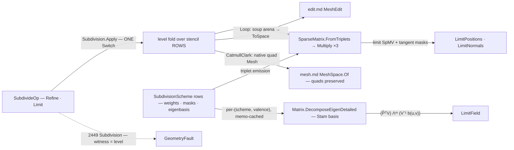

# [RASM_PARAMETRIC_SUBDIVIDE]

`Rasm.Parametric` subdivision refines a mesh through one fold over stencil-row schemes: each `SubdivisionScheme` carries its stencil data as delegate columns, and every level emits the subdivision operator as a sparse matrix, so refinement is SpMV sweeps over the level positions and the next scheme is one row, never a sibling subdivider. Limit-surface evaluation through the Stam eigen lane is mandatory: an owner emitting refined positions with no limit lane is a discrete-refinement half-concept.

Refinement is the only Parametric surface that outputs a mesh, published through the `MeshEdit` arena and the `MeshSpace` quad seam. Quads stay quads for `panelize.md` — pre-triangulating corrupts every level-≥2 re-subdivision, so triangulation is the consumer's arena-admission choice. Region subdivision rides `SubdividePolicy.Region` as a policy column sealing T-junctions at the region boundary, serving the Generation gate with no new surface.

## [01]-[INDEX]

- [01]-[SUBDIVISION]: `SubdivisionScheme` stencil-row schemes, one `Apply` fold emitting the sparse subdivision operator, and the Stam limit lane.

## [02]-[SUBDIVISION]

- Owner: `SubdivisionScheme` `[SmartEnum<string>]` mints the scheme vocabulary as delegate-column data the fold never branches on; `SubdividePolicy` binds the crease and region rows as `IValidityEvidence`.
- Entry: `Apply` is the one polymorphic entry, discriminating on the op case.
- Auto: `Refine` folds levels through the per-level sparse operator, the terminal level emitting the limit operator; `Limit` routes `(face, u, v)` samples through the Stam eigen lane.
- Receipt: `SubdivisionReceipt` is the typed refinement census.
- Packages: `Rasm.Numerics` for the sparse operators and the Stam EVD, `Rasm.Meshing` for the `MeshSpace` quad publish and `MeshEdit` tri arena, `Rasm.Domain` for `Op`/`Context`/validity, Rhino.Geometry for the native quad seam, Thinktecture.Runtime.Extensions for `[SmartEnum]` delegate columns, LanguageExt.Core for the `Fin` rail and the `Atom` cache cell, and BCL `ArrayPool<double>` for level staging.
- Growth: a new primal scheme is one `SubdivisionScheme` row with its delegate columns; a dual (Doo-Sabin) or √3 scheme adds one refinement-topology delegate the same fold reads, the `Arity ∈ {3,4}` gate keeping a topology-less row loud. A new boundary behavior is one mask variant, adaptive sharpness a `Creases` widening, a new limit quantity one mask column and one SpMV — zero new entry surfaces.
- Boundary: the scheme is data and the fold is one, so a per-scheme subdivider class, a hand-rolled half-edge beside the flat SoA incidence, or a per-vertex weight loop re-deriving the SpMV is the density defect; the operator is a `matrix.md` sparse value and its eigenstructure the landed complex-general EVD, never a local eigensolver.

```csharp signature
// --- [RUNTIME_PRELUDE] ----------------------------------------------------------------------
using System;
using System.Linq;
using LanguageExt;
using Rasm.Domain;
using Rasm.Meshing;
using Rasm.Numerics;
using Rhino.Geometry;
using Thinktecture;
using static LanguageExt.Prelude;
// CS0104 guard: Rhino.Geometry declares Matrix/Dimension homonyms under the dual usings.
using Matrix = Rasm.Numerics.Matrix;
using Dimension = Rasm.Numerics.Dimension;

namespace Rasm.Parametric;

// --- [TYPES] ------------------------------------------------------------------------------------
[SmartEnum<string>]
[KeyMemberEqualityComparer<ComparerAccessors.StringOrdinal, string>]
[KeyMemberComparer<ComparerAccessors.StringOrdinal, string>]
public sealed partial class SubdivisionScheme {
    public static readonly SubdivisionScheme CatmullClark = new(
        "catmull-clark", arity: 4,
        vertexStencil: static n => ((n - 2.0) / n, 1.0 / (n * (double)n), 1.0 / (n * (double)n)),
        edgeStencil: static () => (0.25, 0.25),
        limitStencil: static n => (n / (n + 5.0), 4.0 / (n * (n + 5.0)), 1.0 / (n * (n + 5.0))),
        tangentWeight: TangentCc,
        eigenbasis: static n => StamCache.For("catmull-clark", n));

    public static readonly SubdivisionScheme Loop = new(
        "loop", arity: 3,
        vertexStencil: static n => Beta(n) switch { double b => (1.0 - (n * b), b, 0.0) },
        edgeStencil: static () => (0.375, 0.125),
        limitStencil: static n => (3.0 / (8.0 * Beta(n))) switch { double w => (w / (w + n), 1.0 / (w + n), 0.0) },
        tangentWeight: TangentLoop,
        eigenbasis: static n => StamCache.For("loop", n));

    public int Arity { get; }

    [UseDelegateFromConstructor] public partial (double Self, double Ring, double Face) VertexStencil(int valence);
    [UseDelegateFromConstructor] public partial (double Ends, double Wings) EdgeStencil();
    [UseDelegateFromConstructor] public partial (double Self, double Ring, double Face) LimitStencil(int valence);
    [UseDelegateFromConstructor] public partial (double Along, double Across) TangentWeight(int valence, int k);
    [UseDelegateFromConstructor] public partial Fin<StamBasis> Eigenbasis(int valence);

    static double Beta(int n) => (1.0 / n) * (0.625 - Math.Pow(0.375 + (Math.Cos(2.0 * Math.PI / n) / 4.0), 2));
    static (double, double) TangentCc(int valence, int k);    // Aₖ = cos(2πk/n), across mask per Halstead-Kass-DeRose
    static (double, double) TangentLoop(int valence, int k);  // cos/sin ring masks
}

// --- [CONSTANTS] --------------------------------------------------------------------------------
// Scheme-invariant — one shared owner, never per-scheme copies.
public static class BoundaryMask {
    public const double VertexSelf = 0.75;
    public const double VertexEnd = 0.125;
    public const double EdgeEnd = 0.5;
}

// Semi-sharp creases: Sharpness decrements per level, so s runs ⌈s⌉ crease rounds then relaxes. Region empty = whole mesh.
public sealed record SubdividePolicy(Arr<(int A, int B, double Sharpness)> Creases, Arr<int> Region) : IValidityEvidence {
    public static readonly SubdividePolicy Canonical = new(Arr<(int, int, double)>.Empty, Arr<int>.Empty);

    public bool IsValid => Creases.All(static edge => edge.A != edge.B && ValidityClaim.Positive(value: edge.Sharpness));
}

// --- [MODELS] -----------------------------------------------------------------------------------
public sealed record SubdivisionReceipt(int Levels, int Vertices, int Faces, int Extraordinary, int CreasedEdges, int RegionClosures);

// Non-symmetric subdivision matrix decomposed once via complex-general EVD; the imaginary-residual gate rejects a defective basis.
public sealed record StamBasis(int Valence, Arr<double> Eigenvalues, Matrix Basis, Matrix InverseBasis);

internal static class StamCache {
    static readonly Atom<HashMap<(string Scheme, int Valence), StamBasis>> Cache = Atom(HashMap<(string, int), StamBasis>());

    // TryAdd keeps the first basis under contention; recompute is idempotent.
    internal static Fin<StamBasis> For(string scheme, int valence) =>
        Cache.Value.Find((scheme, valence)).Match(
            Some: Fin.Succ,
            None: () => Assemble(scheme, valence).Map(basis => {
                Cache.Swap(cache => cache.TryAdd((scheme, valence), basis));
                return basis;
            }));

    static Fin<StamBasis> Assemble(string scheme, int valence);
}

// --- [OPERATIONS] ---------------------------------------------------------------------------
[Union(ConversionFromValue = ConversionOperatorsGeneration.None)]
public abstract partial record SubdivideOp {
    private SubdivideOp() { }

    public sealed record Refine(MeshSpace Space, SubdivisionScheme Scheme, int Levels, SubdividePolicy Policy, Context Tolerance) : SubdivideOp;
    public sealed record Limit(MeshSpace Space, SubdivisionScheme Scheme, Arr<(int Face, double U, double V)> Samples, SubdividePolicy Policy) : SubdivideOp;
}

[Union(ConversionFromValue = ConversionOperatorsGeneration.None)]
public abstract partial record SubdivisionResult {
    private SubdivisionResult() { }

    // Limit is one more SpMV over scheme-owned masks, never a knob.
    public sealed record Refined(MeshSpace Mesh, Arr<Point3d> LimitPositions, Arr<Vector3d> LimitNormals, SubdivisionReceipt Receipt) : SubdivisionResult;
    public sealed record LimitField(Arr<Point3d> Points, Arr<Vector3d> Normals) : SubdivisionResult;
}

public static class Subdivision {
    public static Fin<SubdivisionResult> Apply(SubdivideOp op, Op? key = null) =>
        op.Switch(
            state: key,
            refine: static (k, r) => RefineOf(r, k),
            limit:  static (k, l) => LimitOf(l, k));

    // --- [REFINEMENT_FOLD]
    static Fin<SubdivisionResult> RefineOf(SubdivideOp.Refine op, Op? key) =>
        !op.Policy.IsValid || op.Levels < 1
            ? Fault<SubdivisionResult>(unit: 0, level: op.Levels)
            : AdmitBase(op).Bind(baseLevel => Range(0, op.Levels).Fold(
                    Fin.Succ((Level: baseLevel, Creases: op.Policy.Creases, Closures: 0)),
                    (state, level) => state.Bind(s => Advance(op.Scheme, s.Level, s.Creases, op.Policy.Region, level)
                        .Map(next => (next.Level, next.Creases, s.Closures + next.Closures)))))
                .Bind(terminal => Publish(op, terminal.Level, terminal.Closures, key));

    internal sealed record SubdivisionLevel(double[] X, double[] Y, double[] Z, int[] Corners, int[] FaceOffsets, EdgeTable Edges);
    internal sealed record EdgeTable(int[] A, int[] B, int[] LeftFace, int[] RightFace, double[] Sharpness);

    static Fin<SubdivisionLevel> AdmitBase(SubdivideOp.Refine op);   // Loop: MeshEdit.Of(space) exact-diagonal tri base; CatmullClark: space.Native polygons direct
    static Fin<(SubdivisionLevel Level, Arr<(int A, int B, double Sharpness)> Creases, int Closures)> Advance(
        SubdivisionScheme scheme, SubdivisionLevel level, Arr<(int A, int B, double Sharpness)> creases, Arr<int> region, int at);
    // Advance = ONE sorted-edge-key incidence pass (3+ incident faces → fault) → stencil triplets (interior off scheme columns,
    // boundary/crease/corner off BoundaryMask, region + ring closure counted) → FromTriplets → Multiply ×3 → Arity rebuild
    // (one quad/corner at 4, four tris at 3; Arity ∉ {3,4} → fault); child creases carry Sharpness − 1.

    static Fin<SubdivisionResult> Publish(SubdivideOp.Refine op, SubdivisionLevel terminal, int closures, Op? key);
    // Limit SpMV (LimitStencil rows) + tangent-mask pair → normals; Loop publishes MeshEdit.Of(vertices, tris).ToSpace,
    // CatmullClark the native quad Mesh → MeshSpace.Of.

    // --- [STAM_LIMIT]
    // One setup refinement isolates extraordinary vertices; a regular sample evaluates the B-spline/box-spline basis
    // directly, an irregular sample projects (P̂ᵀV) Λᵐ (V⁻¹ b(u,v)) with m = ⌈−log₂ max(u,v)⌉ and tangents from basis derivatives.
    static Fin<SubdivisionResult> LimitOf(SubdivideOp.Limit op, Op? key) =>
        op.Samples.TraverseM(sample =>
                sample.Face >= 0 && sample.U is >= 0.0 and <= 1.0 && sample.V is >= 0.0 and <= 1.0
                    ? EvaluateLimit(op, sample)
                    : Fin.Fail<(Point3d Point, Vector3d Normal)>(new GeometryFault.DevelopmentFault(DevelopmentStage.Subdivision, sample.Face, 0.0).ToError()))
            .As()
            .Map(rows => (SubdivisionResult)new SubdivisionResult.LimitField(
                new Arr<Point3d>([.. rows.Select(static r => r.Point)]),
                new Arr<Vector3d>([.. rows.Select(static r => r.Normal)])));

    static Fin<(Point3d Point, Vector3d Normal)> EvaluateLimit(SubdivideOp.Limit op, (int Face, double U, double V) sample);

    static Fin<T> Fault<T>(int unit, double level) =>
        Fin.Fail<T>(new GeometryFault.DevelopmentFault(DevelopmentStage.Subdivision, unit, level).ToError());
}
```



## [03]-[RESEARCH]

<!-- source-only: research row template:
[TOKEN]-[OPEN|BLOCKED]: <exact question>; <verification route>.
[SPLIT_MEMBER]-[OPEN]: does `shape-core` expose `split_all`; verify against the member rail.
-->

(none)
