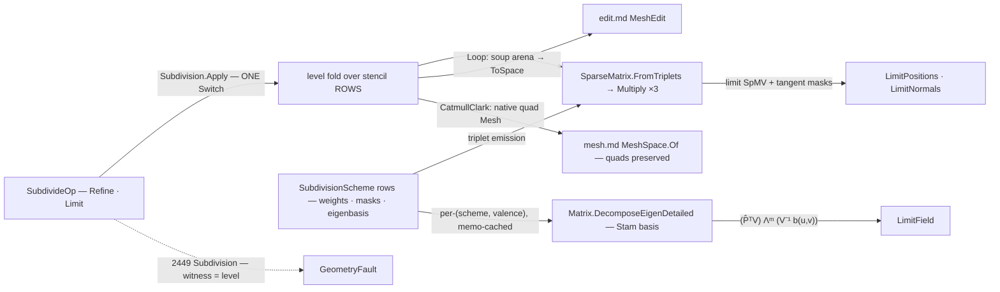

# [RASM_PARAMETRIC_SUBDIVIDE]

The subdivision-surface owner of `Rasm.Parametric` — ONE refinement fold over STENCIL ROWS through `Fin<SubdivisionResult> Subdivision.Apply(SubdivideOp, Op? key = null)`. Catmull-Clark and Loop are DATA rows on the `SubdivisionScheme` `[SmartEnum<string>]` — each row carries its output arity, its vertex/edge/face-point weight delegates, its limit-position and limit-tangent masks, and its eigenbasis seat — and the fold never branches on the scheme: every level EMITS the subdivision operator as a sparse matrix (stencil rows → triplets → `SparseMatrix.FromTriplets`, one `Multiply` per coordinate column), so refinement is three SpMV sweeps over the level's SoA positions and the next scheme (Doo-Sabin, √3) is one row plus its delegates, never a sibling subdivider (`[GENERATOR_LAW]`). Crease and boundary behavior is ROW DATA too: the shared cubic-spline boundary masks, and semi-sharp creases whose per-edge `Sharpness` decrements into the child edges so a tag of `s` runs `⌈s⌉` crease rounds before relaxing smooth. Limit-surface evaluation is the author-kernel Stam lane — per `(scheme, valence)` the subdivision matrix's eigenstructure decomposes ONCE through the landed `matrix.md` complex-general EVD, memo-cached, and any `(face, u, v)` evaluates as an eigen-scaled projection of the local control net onto the regular sub-patch basis — without it, subdivision is only discrete refinement, half the concept.

This is the ONLY Parametric page whose output is a MESH: `Refine` publishes Loop levels through the `MeshEdit` soup arena (`Of(vertices, tris)` → `ToSpace`) and Catmull-Clark levels as a native quad `Mesh` through `MeshSpace.Of` — quads PRESERVED, because `panelize.md` and the Generation region-subdivision gate consume the quad structure the scheme exists to produce, and the arena's exact-diagonal triangulation is the CONSUMER's admission choice, never forced here. Region subdivision is a policy column, not a case: `SubdividePolicy.Region` names the face subset to refine, and the ring closure (red-green bisection for the triangle scheme, inserted-midpoint splits for the quad scheme) seals T-junctions at the region boundary — the Generation gate item served with zero new surface. Every reachable failure routes `GeometryFault.DevelopmentFault(DevelopmentStage.Subdivision, unit, witness)` 2449 with the witness carrying the refinement level; OpenSubdiv stays REJECTED — no managed binding exists, and the P/Invoke admission is gated on proven limit-evaluation-at-scale demand, recorded, never re-proposed by drift.

## [01]-[INDEX]

- [01]-[SUBDIVISION]: `SubdivisionScheme` the stencil-row vocabulary (weights, limit masks, eigenbasis seat as delegate columns); `SubdividePolicy` the crease/region row; `SubdivideOp` the two-case request `[Union]` folded by ONE `Apply`; `SubdivisionResult` with per-vertex limit columns on every refinement; the `StamBasis` per-valence eigen cache.

## [02]-[SUBDIVISION]

- Owner: `SubdivisionScheme` `[SmartEnum<string>]` the scheme vocabulary (`catmull-clark` · `loop`) binding the shipped `ComparerAccessors.StringOrdinal` comparer, carrying `Arity` (4 quad-emitting / 3 tri-emitting) and the stencil DELEGATE columns — `VertexStencil(valence)` the interior vertex-point weights (`(n−2)/n, 1/n², 1/n²` for Catmull-Clark; `(1−nβₙ, βₙ, 0)` with `βₙ = (1/n)(5/8 − (3/8 + cos(2π/n)/4)²)` for Loop), `EdgeStencil()` the interior edge-point weights (`¼` ends + `¼` adjacent face points; `⅜` ends + `⅛` wings), `LimitStencil(valence)` the limit-position mask, `TangentWeight(valence, k)` the two limit-tangent mask coefficients at ring slot `k`, and `Eigenbasis(valence)` the Stam seat resolving through the memo; `SubdividePolicy` the policy row (`Creases` the tagged `(A, B, Sharpness)` edge rows — semi-sharp, sharpness decrementing per level; `Region` the face subset, empty = whole mesh) registering `IValidityEvidence`; `SubdivideOp` the request `[Union]`; `SubdivisionResult` the result `[Union]`; `SubdivisionReceipt` the refinement evidence; `StamBasis` + its `Atom<HashMap<(string, int), StamBasis>>` memo the per-valence eigen cache; `Subdivision` the static entry.
- Cases: `SubdivisionScheme` rows 2 (the next scheme is a ROW — Doo-Sabin and √3 are recorded growth, each one `static readonly` item plus delegates, never a sibling subdivider); `SubdivideOp` cases `Refine` · `Limit` (2); `SubdivisionResult` cases `Refined` · `LimitField` (2).
- Entry: `public static Fin<SubdivisionResult> Apply(SubdivideOp op, Op? key = null)` — the ONE entry discriminating on the op case; no `RefineCatmullClark`/`RefineLoop`/`EvaluateLimit` sibling family, and refine-then-snap-to-limit is NOT a knob: every `Refined` result ALWAYS carries the per-vertex `LimitPositions`/`LimitNormals` columns, because the limit operator is one more SpMV over masks the scheme already owns.
- Auto: `Refine` admits the base level — the triangle scheme normalizes through `MeshEdit.Of(space)` (the arena's exact quad-diagonal ingress) and reads the arena columns, the quad scheme reads `space.Native` polygons directly — then folds levels: per level ONE sorted-edge-key pass builds the flat SoA incidence (face-corner offsets + the edge table with per-edge incident faces; an edge with three or more incident faces routes the fault — the stencil space is manifold-with-boundary), stencil rows EMIT TRIPLETS into the `(V_{l+1} × V_l)` subdivision operator — face-point rows `1/deg` per corner, edge-point rows off `EdgeStencil` (boundary and crease edges take the spline midpoint row instead; a semi-sharp edge takes the crease row while `Sharpness ≥ 1` and the blended row on the fractional tail), vertex-point rows off `VertexStencil(valence)` (boundary vertices take the `⅛, ¾, ⅛` spline mask; a vertex incident to two or more crease edges takes the crease-vertex mask, three or more pins it corner) — `SparseMatrix.FromTriplets` assembles S_l and THREE `Multiply` sweeps advance the x/y/z columns; connectivity rebuilds per `Arity` (one quad per face corner; four tris per tri); `Region` restricts stencil emission to the named faces plus their closure ring, sealing T-junctions by red-green bisection (tri) or inserted-midpoint splits (quad), counted on the receipt; after the last level the LIMIT operator (rows off `LimitStencil`/`TangentWeight`) runs one more SpMV set — limit positions plus two tangent columns whose normalized cross product is the limit normal; the quad scheme publishes a native quad `Mesh` through `MeshSpace.Of(native, context, key: key)`, the tri scheme through the arena freeze. `Limit` evaluates `(face, u, v)` samples on the BASE mesh: one setup refinement isolates extraordinary vertices (a face with two or more extraordinary corners cannot seat the eigenbasis), a regular sample evaluates the B-spline/box-spline basis over its 16/12-point neighborhood directly, an irregular sample resolves `Eigenbasis(valence)` — the subdivision matrix `Ā` for valence `n` assembled as `Matrix.Of` rows, decomposed ONCE through `Matrix.DecomposeEigenDetailed` (the general operator is non-symmetric; the imaginary-residual gate rejects a defective basis and routes the fault), memo-cached by `(scheme.Key, valence)` — then Stam's evaluation: `m = ⌈−log₂ max(u, v)⌉` selects the sub-domain level, the transformed `(u, v)` lands in one of three regular sub-patches, and the sample is the eigen-scaled projection `(P̂ᵀV) Λᵐ (V⁻¹b(u, v))` with the tangent pair from the basis derivatives.
- Receipt: `SubdivisionReceipt(Levels, Vertices, Faces, Extraordinary, CreasedEdges, RegionClosures)` — the refinement census the Generation gate and `panelize.md` read; `LimitPositions`/`LimitNormals` ride the `Refined` case as columns, never a second result type.
- Packages: `Rasm.Numerics` (`SparseMatrix.FromTriplets`/`Multiply` — the subdivision and limit operators as data; `Matrix.Of` + `Matrix.DecomposeEigenDetailed` — the Stam eigenstructure), `Rasm.Meshing` (`MeshSpace`/`MeshSpace.Of` the quad publish), `Rasm.Meshing` (`MeshEdit.Of` the tri-scheme base normalization and publish arena), `Rasm.Numerics` (`GeometryFault.DevelopmentFault` + `DevelopmentStage`), `Rasm.Domain` (`Op`, `Context`, `ValidityClaim`/`IValidityEvidence`), Rhino.Geometry (`Mesh`/`Point3d`/`Vector3d` — the native quad publish seam), Thinktecture.Runtime.Extensions (`[SmartEnum]` + `[UseDelegateFromConstructor]` stencil columns), LanguageExt.Core (`Fin`/`Arr`/`Atom`/`HashMap`), BCL inbox (`ArrayPool<double>` level staging).
- Growth: a new PRIMAL scheme is one `SubdivisionScheme` row with its delegate columns; the recorded Doo-Sabin (dual) and √3 rows additionally widen the row with one refinement-topology delegate column read by the same fold — the `Arity ∈ {3,4}` rebuild gate keeps a topology-less row loud, never a silent primal fallthrough, and never a sibling subdivider; a new boundary behavior is one mask variant on the row; adaptive per-face sharpness is a `Creases` policy widening; a new limit quantity (limit curvature via the second eigen pair) is one mask column plus one SpMV; zero new entry surfaces.
- Boundary: the scheme is DATA and the fold is ONE — a `CatmullClarkSubdivider`/`LoopSubdivider` class pair, a per-scheme refinement loop, or a hand-rolled half-edge structure beside the flat SoA incidence is the named density defect (the level store is offset-column SoA in the arena's own discipline: no twins, no next pointers, one sorted-key pass per level); the subdivision operator is a `matrix.md` sparse value and a per-vertex weight loop re-deriving the SpMV is the deleted flat form; limit evaluation is MANDATORY capability — a page emitting refined positions with no limit lane is the discrete-refinement half-concept this owner exists to exceed — and the eigenstructure is computed through the landed EVD owner, never a local eigensolver; the quad scheme's output PRESERVES quads (the consumer's arena admission triangulates when IT chooses — pre-triangulating here corrupts every level-≥2 refinement a downstream re-subdivision would run); `remesh.md` (row 19, Simplification) is REWRITE-UNDER-BUDGET and this page is SCHEME REFINEMENT — one anchor each, distinct charters, no shared machinery beyond the arena; every failure routes 2449 `Subdivision` with the level witness, and an exception crossing the surface is forbidden; OpenSubdiv stays the recorded rejection with its named gate.

```csharp signature
// --- [RUNTIME_PRELUDE] ----------------------------------------------------------------------
using System;
using System.Linq;
using LanguageExt;
using Rasm.Domain;
using Rasm.Meshing;
using Rasm.Numerics;
using Rhino.Geometry;
using Thinktecture;
using static LanguageExt.Prelude;
// CS0104 guard: Rhino.Geometry declares Matrix/Dimension homonyms under the dual usings.
using Matrix = Rasm.Numerics.Matrix;
using Dimension = Rasm.Numerics.Dimension;

namespace Rasm.Parametric;

// --- [TYPES] ------------------------------------------------------------------------------------
// The scheme IS the row: arity + stencil weights + limit masks + eigenbasis seat as delegate
// columns. The fold never branches on the scheme; a new scheme is a row, never a subdivider.
[SmartEnum<string>]
[KeyMemberEqualityComparer<ComparerAccessors.StringOrdinal, string>]
[KeyMemberComparer<ComparerAccessors.StringOrdinal, string>]
public sealed partial class SubdivisionScheme {
    public static readonly SubdivisionScheme CatmullClark = new(
        "catmull-clark", arity: 4,
        vertexStencil: static n => ((n - 2.0) / n, 1.0 / (n * (double)n), 1.0 / (n * (double)n)),
        edgeStencil: static () => (0.25, 0.25),
        limitStencil: static n => (n / (n + 5.0), 4.0 / (n * (n + 5.0)), 1.0 / (n * (n + 5.0))),
        tangentWeight: TangentCc,
        eigenbasis: static n => StamCache.For("catmull-clark", n));

    public static readonly SubdivisionScheme Loop = new(
        "loop", arity: 3,
        vertexStencil: static n => Beta(n) switch { double b => (1.0 - (n * b), b, 0.0) },
        edgeStencil: static () => (0.375, 0.125),
        limitStencil: static n => (3.0 / (8.0 * Beta(n))) switch { double w => (w / (w + n), 1.0 / (w + n), 0.0) },
        tangentWeight: TangentLoop,
        eigenbasis: static n => StamCache.For("loop", n));

    public int Arity { get; }

    [UseDelegateFromConstructor] public partial (double Self, double Ring, double Face) VertexStencil(int valence);
    [UseDelegateFromConstructor] public partial (double Ends, double Wings) EdgeStencil();
    [UseDelegateFromConstructor] public partial (double Self, double Ring, double Face) LimitStencil(int valence);
    [UseDelegateFromConstructor] public partial (double Along, double Across) TangentWeight(int valence, int k);
    [UseDelegateFromConstructor] public partial Fin<StamBasis> Eigenbasis(int valence);

    static double Beta(int n) => (1.0 / n) * (0.625 - Math.Pow(0.375 + (Math.Cos(2.0 * Math.PI / n) / 4.0), 2));
    static (double, double) TangentCc(int valence, int k);    // Aₖ = cos(2πk/n), across mask per Halstead-Kass-DeRose
    static (double, double) TangentLoop(int valence, int k);  // cos/sin ring masks
}

// --- [CONSTANTS] --------------------------------------------------------------------------------
// Shared cubic-spline boundary masks — scheme-invariant row data, never per-scheme copies.
public static class BoundaryMask {
    public const double VertexSelf = 0.75;
    public const double VertexEnd = 0.125;
    public const double EdgeEnd = 0.5;
}

// Creases are semi-sharp: sharpness decrements into child edges, so s runs ⌈s⌉ crease rounds then
// relaxes smooth. Region names the refined face subset; empty = whole mesh.
public sealed record SubdividePolicy(Arr<(int A, int B, double Sharpness)> Creases, Arr<int> Region) : IValidityEvidence {
    public static readonly SubdividePolicy Canonical = new(Arr<(int, int, double)>.Empty, Arr<int>.Empty);

    public bool IsValid => Creases.All(static edge => edge.A != edge.B && ValidityClaim.Positive(value: edge.Sharpness));
}

// --- [MODELS] -----------------------------------------------------------------------------------
public sealed record SubdivisionReceipt(int Levels, int Vertices, int Faces, int Extraordinary, int CreasedEdges, int RegionClosures);

// Per-(scheme, valence) Stam eigenstructure: the non-symmetric subdivision matrix decomposed once
// through the landed complex-general EVD; the imaginary-residual gate rejects a defective basis.
public sealed record StamBasis(int Valence, Arr<double> Eigenvalues, Matrix Basis, Matrix InverseBasis);

internal static class StamCache {
    static readonly Atom<HashMap<(string Scheme, int Valence), StamBasis>> Cache = Atom(HashMap<(string, int), StamBasis>());

    // Assemble Ā for valence n as Matrix.Of rows → DecomposeEigenDetailed (complex general) →
    // imaginary-residual gate → real basis; TryAdd keeps the first computed basis under contention.
    internal static Fin<StamBasis> For(string scheme, int valence) =>
        Cache.Value.Find((scheme, valence)).Match(
            Some: Fin.Succ,
            None: () => Assemble(scheme, valence).Map(basis => {
                Cache.Swap(cache => cache.TryAdd((scheme, valence), basis));
                return basis;
            }));

    static Fin<StamBasis> Assemble(string scheme, int valence);
}

// --- [OPERATIONS] ---------------------------------------------------------------------------
[Union(ConversionFromValue = ConversionOperatorsGeneration.None)]
public abstract partial record SubdivideOp {
    private SubdivideOp() { }

    public sealed record Refine(MeshSpace Space, SubdivisionScheme Scheme, int Levels, SubdividePolicy Policy, Context Tolerance) : SubdivideOp;
    public sealed record Limit(MeshSpace Space, SubdivisionScheme Scheme, Arr<(int Face, double U, double V)> Samples, SubdividePolicy Policy) : SubdivideOp;
}

[Union(ConversionFromValue = ConversionOperatorsGeneration.None)]
public abstract partial record SubdivisionResult {
    private SubdivisionResult() { }

    // Limit columns ALWAYS ride the refinement — the limit operator is one more SpMV, never a knob.
    public sealed record Refined(MeshSpace Mesh, Arr<Point3d> LimitPositions, Arr<Vector3d> LimitNormals, SubdivisionReceipt Receipt) : SubdivisionResult;
    public sealed record LimitField(Arr<Point3d> Points, Arr<Vector3d> Normals) : SubdivisionResult;
}

public static class Subdivision {
    public static Fin<SubdivisionResult> Apply(SubdivideOp op, Op? key = null) =>
        op.Switch(
            state: key,
            refine: static (k, r) => RefineOf(r, k),
            limit:  static (k, l) => LimitOf(l, k));

    // --- [REFINEMENT_FOLD]
    // Level fold: incidence → triplet emission → S_l = FromTriplets → three Multiply sweeps →
    // connectivity per Arity → next level. The limit operator runs once after the terminal level.
    static Fin<SubdivisionResult> RefineOf(SubdivideOp.Refine op, Op? key) =>
        !op.Policy.IsValid || op.Levels < 1
            ? Fault<SubdivisionResult>(unit: 0, level: op.Levels)
            : AdmitBase(op).Bind(baseLevel => Range(0, op.Levels).Fold(
                    Fin.Succ((Level: baseLevel, Creases: op.Policy.Creases, Closures: 0)),
                    (state, level) => state.Bind(s => Advance(op.Scheme, s.Level, s.Creases, op.Policy.Region, level)
                        .Map(next => (next.Level, next.Creases, s.Closures + next.Closures)))))
                .Bind(terminal => Publish(op, terminal.Level, terminal.Closures, key));

    internal sealed record SubdivisionLevel(double[] X, double[] Y, double[] Z, int[] Corners, int[] FaceOffsets, EdgeTable Edges);
    internal sealed record EdgeTable(int[] A, int[] B, int[] LeftFace, int[] RightFace, double[] Sharpness);

    static Fin<SubdivisionLevel> AdmitBase(SubdivideOp.Refine op);   // Loop: MeshEdit.Of(space) exact-diagonal tri base; CatmullClark: space.Native polygons direct
    static Fin<(SubdivisionLevel Level, Arr<(int A, int B, double Sharpness)> Creases, int Closures)> Advance(
        SubdivisionScheme scheme, SubdivisionLevel level, Arr<(int A, int B, double Sharpness)> creases, Arr<int> region, int at);
    // Advance = ONE sorted-edge-key incidence pass (an edge with 3+ incident faces routes the fault)
    // → stencil triplets (interior rows off the scheme columns; boundary/crease/corner masks
    // override; region emission + ring closure counted) → SparseMatrix.FromTriplets → Multiply ×3
    // → Arity connectivity rebuild (the PRIMAL law: one quad per face corner at 4, four tris at 3 —
    // an Arity outside {3,4} routes the fault loudly); child creases carry Sharpness − 1.

    static Fin<SubdivisionResult> Publish(SubdivideOp.Refine op, SubdivisionLevel terminal, int closures, Op? key);
    // Limit SpMV (LimitStencil rows) + tangent-mask SpMV pair → normals; Loop publishes through
    // MeshEdit.Of(vertices, tris).ToSpace(context, key); CatmullClark builds the native quad Mesh
    // → MeshSpace.Of — quads PRESERVED for panelize and the Generation gate.

    // --- [STAM_LIMIT]
    // One setup refinement isolates extraordinary vertices; a regular sample evaluates the
    // B-spline/box-spline basis directly; an irregular sample projects (P̂ᵀV) Λᵐ (V⁻¹ b(u,v)) with
    // m = ⌈−log₂ max(u,v)⌉ and the tangent pair from the basis derivatives.
    static Fin<SubdivisionResult> LimitOf(SubdivideOp.Limit op, Op? key) =>
        op.Samples.TraverseM(sample =>
                sample.Face >= 0 && sample.U is >= 0.0 and <= 1.0 && sample.V is >= 0.0 and <= 1.0
                    ? EvaluateLimit(op, sample)
                    : Fin.Fail<(Point3d Point, Vector3d Normal)>(new GeometryFault.DevelopmentFault(DevelopmentStage.Subdivision, sample.Face, 0.0).ToError()))
            .As()
            .Map(rows => (SubdivisionResult)new SubdivisionResult.LimitField(
                new Arr<Point3d>([.. rows.Select(static r => r.Point)]),
                new Arr<Vector3d>([.. rows.Select(static r => r.Normal)])));

    static Fin<(Point3d Point, Vector3d Normal)> EvaluateLimit(SubdivideOp.Limit op, (int Face, double U, double V) sample);

    // The 2449 witness column carries the refinement level — the per-concern measure of this stage.
    static Fin<T> Fault<T>(int unit, double level) =>
        Fin.Fail<T>(new GeometryFault.DevelopmentFault(DevelopmentStage.Subdivision, unit, level).ToError());
}
```



## [03]-[DENSITY_BAR]

One owner per axis; capability is a case, row, or fold arm, never a sibling surface. The `[RAIL]` cell names the one return rail each owner exposes.

| [INDEX] | [AXIS/CONCERN]     | [OWNER]                      | [KIND]                                                                                | [RAIL]                              | [CASES] |
| :-----: | :----------------- | :--------------------------- | :------------------------------------------------------------------------------------ | :----------------------------------- | :-----: |
|  [01]   | Refinement algebra | `SubdivideOp` + `Subdivision`| `[Union]` two request cases folded by ONE `Apply`                                     | `Apply → Fin<SubdivisionResult>`    |    2    |
|  [1a]   | Scheme rows        | `SubdivisionScheme`          | `[SmartEnum<string>]` — arity + five delegate columns; the next scheme is a ROW       | data (delegates)                    |    2    |
|  [1b]   | Result carrier     | `SubdivisionResult`          | `[Union]` refined-with-limit-columns · limit field                                    | carrier (drained at the consumer)   |    2    |
|  [1c]   | Crease/region row  | `SubdividePolicy`            | semi-sharp crease tags + region face subset                                           | value (`IValidityEvidence`)         |    —    |
|  [1d]   | Eigen cache        | `StamBasis` + `StamCache`    | per-(scheme, valence) memo over the landed complex-general EVD                        | `For → Fin<StamBasis>`              |    —    |
|  [1e]   | Level state        | `SubdivisionLevel`/`EdgeTable` | internal SoA incidence co-located with the fold — flat columns, never half-edge     | internal                            |    —    |

The `Apply` fold, `RefineOf`'s bounded level fold, `LimitOf`'s gated traversal, and the `StamCache` memo carry real composed bodies; `AdmitBase`, `Advance`, `Publish`, `Assemble`, `EvaluateLimit`, and the two tangent-mask kernels are signature-pinned with their contracts fixed in the `Auto` bullet and the `[04]` cards. Every solve is a `matrix.md` owner — no local eigensolver, no per-vertex weight loops beside the SpMV.

## [04]-[RESEARCH]

- [OPERATOR_AS_DATA] — the refinement step is a LINEAR operator, and the page spells it as one: stencil rows emit `(row, col, weight)` triplets, `SparseMatrix.FromTriplets` assembles `S_l` (duplicate-summing, exactly the assembly semantics stencil overlap wants), and three `Multiply` sweeps advance the coordinate columns — the vectorized SpMV the flat per-vertex weight loop cannot match, and the exact shape under which crease, boundary, corner, and region variants are ROW SUBSTITUTIONS rather than code branches. The limit pass is the SAME mechanism over `LimitStencil`/`TangentWeight` masks, which is why every `Refined` result carries its limit columns unconditionally: the marginal cost is one operator application, and a refine-vs-limit boolean would be a knob re-describing what the masks already encode.
- [STAM_SEAT] — limit evaluation at arbitrary `(u, v)` is the Stam lane: the local subdivision matrix for a valence-`n` neighborhood is non-symmetric, so the eigenstructure routes `Matrix.DecomposeEigenDetailed` (complex general) with an imaginary-residual gate — the standard weight schemes decompose to a real spectrum, and residual imaginary mass over the gate marks a defective basis routed as the 2449 fault, never silently truncated. The basis caches per `(scheme, valence)` in one `Atom`-held map (`TryAdd` — first writer wins, recomputation is idempotent), the setup refinement isolates extraordinary vertices so every irregular face seats exactly one eigenbasis, and `m = ⌈−log₂ max(u, v)⌉` selects the eigen-scaling level so evaluation cost is O(K²) per sample independent of depth. Regular samples never touch the eigen lane — the tensor B-spline/box-spline basis over the 16/12-point neighborhood is the closed form.
- [REGION_AND_PUBLISH] — region subdivision is the Generation gate item landed as POLICY: `Region` restricts stencil emission, and the closure ring seals T-junctions with the scheme-appropriate split (red-green bisection keeps the triangle scheme conforming; inserted-midpoint quad splits keep the quad scheme conforming), counted as `RegionClosures` so the gate audits the seal. Publish is two lawful seams, not a knob: the triangle scheme's levels are arena-native (`MeshEdit.Of` → `ToSpace` — the edit seam), the quad scheme's terminal level is a native quad `Mesh` admitted through `MeshSpace.Of` because quad structure IS the deliverable (`panelize.md` composes it; pre-triangulating would corrupt any downstream re-subdivision at level ≥ 2). The law-matrix asserts (1) one refinement level of a regular grid reproduces the closed-form B-spline knot insertion, (2) limit positions equal the fixpoint of repeated refinement within tolerance, (3) a crease of sharpness `s` matches the infinitely-sharp crease for `⌈s⌉` levels then relaxes, and (4) region closure leaves no hanging vertex on the region boundary.
