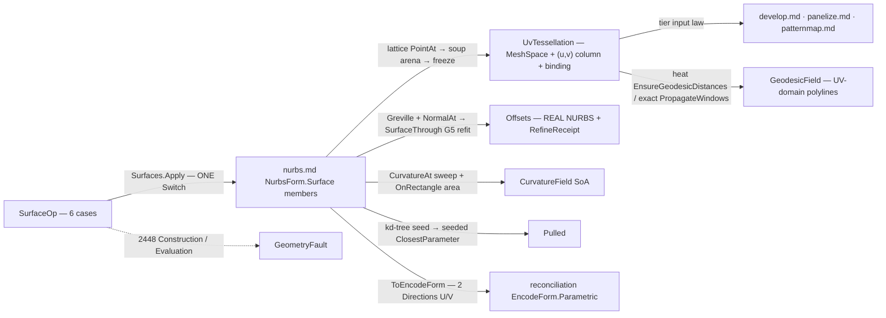

# [RASM_PARAMETRIC_SURFACE]

The host-neutral surface op rail of `Rasm.Parametric` — ONE static `Surfaces` surface folding the `SurfaceOp` `[Union]` (`Tessellate` · `Isolines` · `Geodesics` · `NormalOffset` · `CurvatureSample` · `Pullback`) over the vendored `NurbsForm.Surface` carrier through `Fin<SurfaceResult> Surfaces.Apply(SurfaceOp, Op? key = null)`. The page is the UV-PROVENANCE ORIGIN of the Parametric tier: `Tessellate` emits `UvTessellation` — the frozen `MeshSpace` WITH a per-vertex `(u, v)` column and the live `NurbsForm.Surface` binding — and that carrier is the ONLY admissible surface input to `develop.md`, `panelize.md`, and `patternmap.md` (a world-space mesh or polyline with no surface binding cannot feed them, by construction, because the input TYPE demands the binding). `Isolines` extracts exact `IsoCurve` families per direction (even, at-knot, and explicit-parameter rows), `Geodesics` composes the landed heat and MMP-exact distance machinery on the tessellation and returns polylines to the PARAMETRIC domain through the tessellation's own UV column, `NormalOffset` emits a REAL NURBS offset surface (Greville-sampled normal displacement + the G5 Piegl-Tiller refit + the shared deviation-refinement loop), `CurvatureSample` fields the G3 fundamental-form projections with the `Integrate.OnRectangle` surface-area evidence, and `Pullback` is the foreign-point projection — the G7-parameterized engine Newton for a sparse probe set, the kd-tree-seeded batch for a dense one.

Every reachable failure routes `GeometryFault.ParametricFault(stage, carrier, witness)` 2448 — `Construction` for refit refusals, `Evaluation` for domain, degenerate-normal, and projection refusals, `Encode` for identity refusals — and no exception crosses the public surface. Host-authored surfaces INGRESS through `Nurbs.Of`'s public arbitrary-knot construction (G1 closed — SpineRef surface resolution lives), and every emitted `NurbsForm.Surface` carries `ToEncodeForm()` (two `Direction` rows, U then V) into the reconciliation `EncodeForm.Parametric` identity chain — this owner computes no hash. The G3 fundamental-forms lane is the HOST-NEUTRAL runtime counterpart of `projections.md`'s Rhino `SurfaceProjection.ShapeOperator`/`Metric`/`AreaScale` rows — a RUNTIME split, never a double owner: that page's second-assembly clause is scoped within the Rhino runtime, and the two meet only at the wire. The host-deferred intersection TRIPLE (surface-surface, surface-plane, curve-surface) stays `relations.md`'s altitude — no `SurfaceOp` case attempts it.

## [01]-[INDEX]

- [01]-[SURFACES]: `TessellateRule`/`IsolineRule`/`GeodesicGrade` vocabularies; `GeodesicPlan`/`PullbackPolicy` policy rows; `SurfaceOp` the six-case request `[Union]` folded by ONE `Apply`; `SurfaceResult` the typed result `[Union]` whose `UvTessellation` case is the tier's UV-provenance carrier and whose `CurvatureField`/`GeodesicField` cases are SoA wires.

## [02]-[SURFACES]

- Owner: `TessellateRule` `[Union]` the grid vocabulary (`Grid` the fixed `Nu × Nv` lattice · `Adaptive` the curvature-weighted STRUCTURED grid — per-axis line budgets distributed proportionally to the axis-integrated mean `|κ|`, so density follows curvature while the lattice stays structured and the UV column stays a grid); `IsolineRule` `[Union]` the extraction vocabulary (`Even` counts per direction · `AtKnots` the interior-knot span boundaries — the Bezier patch seams · `AtParameters` explicit rows); `GeodesicGrade` `[SmartEnum<string>]` the distance lane (`heat` the Crane pre-factored approximation · `exact` the MMP window propagation — a GRADE row, never a bool); `GeodesicPlan` the geodesic policy row (`Sources` UV seeds mapped to tessellation vertices · `Levels` the iso-distance contour set · `Grade`); `PullbackPolicy` the projection row (`DenseFloor` the probe count where the per-probe engine seed yields to ONE kd-tree seed grid · `SeedU`/`SeedV` the seed-grid extents · `Projection` the `NurbsPolicy` G7 knobs threaded into the engine Newton); `SurfaceOp` the request `[Union]`; `SurfaceResult` the result `[Union]`; `Surfaces` the static entry.
- Cases: `TessellateRule` 2; `IsolineRule` 3; `GeodesicGrade` rows 2; `SurfaceOp` cases `Tessellate` · `Isolines` · `Geodesics` · `NormalOffset` · `CurvatureSample` · `Pullback` (6); `SurfaceResult` cases `UvTessellation` · `Isolines` · `GeodesicField` · `Offsets` · `CurvatureField` · `Pulled` (6 — one typed carrier per request family; `GeodesicField` and `CurvatureField` are offset-column SoA wires, never row-object walks).
- Entry: `public static Fin<SurfaceResult> Apply(SurfaceOp op, Op? key = null)` — the ONE entry discriminating on the op case through the generated total `Switch`; no `TessellateSurface`/`ExtractIsolines`/`OffsetSurface` sibling family. `Geodesics` takes the `SurfaceResult.UvTessellation` CARRIER, not a bare surface — the provenance proof is the parameter type.
- Auto: `Tessellate` derives the parameter lattice from the rule (`Adaptive` samples `CurvatureAt` along each axis, integrates mean `|κ₁|+|κ₂|` per span, and distributes the line budget by the cumulative integral), evaluates `PointAt(u, v)` per node, splits each cell into two triangles on the shorter diagonal, CULLS degenerate cells (pairwise-coincident corners at a pole — faces skipped, vertices kept, so the UV column stays index-aligned), builds through the `MeshEdit.Of(vertices, faces)` soup arena, and freezes through `ToSpace(context, key)` → `MeshSpace.Of` — the tessellation kills no arena faces, so the freeze preserves vertex order and the per-vertex `Arr<Point2d>` UV column indexes the frozen vertices 1:1 (the invariant every downstream pullback rides); `Isolines` derives the parameter rows per rule (interior knots read off `KnotsU`/`KnotsV` for `AtKnots`) and contracts ONE `IsoCurve(parameter, direction)` per row — exact basis-row contraction, never a sampled polyline; `Geodesics` maps each UV source to its nearest tessellation vertex through the UV column, fields per-vertex distances — `heat` through `GeodesicKernel.EnsureGeodesicDistances(space, sources, key)`, `exact` through `space.Cache.IntrinsicMeshSnapshot` + per-source `GeodesicKernel.PropagateWindows(imesh, source, WindowPropagationPolicy.Default)` min-folded over sources (`+∞` unreached honesty preserved) — then marches triangle crossings per level (edge lerp weight applied to BOTH the world vertices and the UV column, so the pullback is the tessellation's own provenance, NEVER a `ClosestParameter` re-projection), chains segments into polylines, and emits offset-column SoA; `NormalOffset` samples the base at the Greville abscissae `γᵢ = (kᵢ₊₁+…+kᵢ₊ₚ)/p` per direction, displaces each sample `distance` along the unit `NormalAt(γᵤ, γᵥ)` (a degenerate normal routes `Evaluation`), refits through `Nurbs.Of(NurbsWire.SurfaceThrough(countU, samples, refit))` — the G5 Piegl-Tiller lane whose banded solves ride the landed `matrix.md` owners inside the engine — probes inter-sample deviation against the exact offset locus `S + d·N̂`, and densifies breaching rows/columns through `curve.md`'s ONE `Refine.Fold` driver over its `RefinePolicy` row — this lane supplies only the seed/probe/densify arms; `CurvatureSample` sweeps `CurvatureAt(u, v)` over the `Nu × Nv` lattice into the SoA field (principal values/directions, Gaussian, mean, the `√(EG−F²)` area element) with pole nodes counted, never silently dropped, and integrates TOTAL AREA as `Integrate.OnRectangle((u, v) → |∂u×∂v|, 0, 1, 0, 1, order)` — the metric-true first-fundamental-form integral over the raw `RationalDerivatives`, never the packaged metric-blind evaluation; `Pullback` routes on probe count — under `DenseFloor` each probe runs the engine `ClosestParameter(probe, Projection)` (its own polygon-sampled seed), at or over it ONE `SuperClusterKDTree` `KDTree.Create(seedPoints, seedUv, DistanceMetrics.EuclideanDistance)` over a `SeedU × SeedV` `PointAt` grid answers `NearestNeighbors(probe, 1)` per probe and the engine Newton REFINES from that seed (`ClosestParameter(probe, Projection, seed)`) — the kd-tree amortizes the seed across the batch, the engine owns the projection arithmetic, and the squared-L2 metric semantics stay inside the seed step.
- Receipt: `RefineReceipt` on `Offsets` (target versus achieved deviation, rounds, terminal sample count); `CurvatureField.Area` + `DegenerateNodes` the sampling evidence (the SoA min/max/mean reductions over the curvature columns are the benchmark-gated `TensorPrimitives` lane); `GeodesicField.Grade` records which distance lane produced the polylines — the honesty marker a consumer dispatches on. `UvTessellation` carries no receipt — the carrier IS the provenance evidence.
- Packages: `Rasm.Parametric` `nurbs.md` (the vendored engine — `PointAt`/`RationalDerivatives`/`NormalAt`/`FundamentalForms`/`CurvatureAt`/`IsoCurve`/`ClosestParameter` carrier members, `Nurbs.Of` + `NurbsWire.SurfaceThrough` + `FitPolicy` the G5 refit, `NurbsPolicy` the G7 knobs, `KnotVector` the Greville/knot reads, `ParametricDirection`), MathNet.Numerics (`Integrate.OnRectangle` — the 2D Gauss-Legendre surface-area quadrature; parametric-domain quadrature is otherwise unowned in the kernel), Supercluster.KDTree.Net (`SuperClusterKDTree` `KDTree.Create`/`NearestNeighbors` — the dense pullback seed; squared-L2 metric), `Rasm.Meshing` (`MeshEdit.Of` soup arena + `ToSpace` freeze), `Rasm.Meshing` (`MeshSpace`/`MeshSpace.Of` the frozen substrate), `Rasm.Processing` (`GeodesicKernel.EnsureGeodesicDistances`/`PropagateWindows` + `WindowPropagationPolicy` the landed distance lanes), `Rasm.Spatial` (`ScalarField.Geodesic` the fields rail these lanes surface through), `Rasm.Spatial` (`EncodeForm` — the identity projection target the carrier owns), `Rasm.Numerics` (`GeometryFault.ParametricFault` + `ParametricStage`), `Rasm.Domain` (`Op`, `Context`, `ValidityClaim`/`IValidityEvidence`), Rhino.Geometry (`Point3d`/`Vector3d`/`Point2d` carriers), Thinktecture.Runtime.Extensions, LanguageExt.Core, System.Numerics.Tensors (SoA field reductions, benchmark-gated).
- Growth: a new tessellation density law is one `TessellateRule` case read by the same grid fold; a new isoline selection is one `IsolineRule` case; a second distance lane (a spectral-distance grade) is one `GeodesicGrade` row; a new field quantity (a shape-operator eigen-ratio column) is one `CurvatureField` column off the SAME `CurvatureAt` sweep; a lofted/swept/revolved construction is a `NurbsWire`/`FitKind` growth row on the ENGINE admission (a loft is a surface fit through section samples), never a factory family here; zero new entry surfaces, zero new carriers.
- Boundary: this page is OP altitude and `nurbs.md` is ENGINE altitude — a basis/derivative/projection re-derivation here is the altitude violation, and the ONE seeded-Newton projection is the engine's member (the kd-tree supplies SEEDS, never a parallel projector); `UvTessellation` is THE tier seam — a `MeshSpace` handed downstream without its UV column and surface binding is the named provenance defect, and the geodesic pullback reads the tessellation's OWN column (a `ClosestParameter` re-projection of a point the tessellation already parameterized is the named re-projection defect — slower and non-identical near cut loci); the G3 lane is the non-Rhino runtime counterpart of `projections.md`'s shape-operator rows — one anchor, runtime split, never a second `k·d⊗d` assembly inside one runtime; a TRIMMED region tessellates through `curve.md`'s `Fill` overlay on the UV plane with the result lifted through `PointAt` at the consumer — this owner tessellates the full tensor-product domain and mints no second constrained substrate; the surface-intersection TRIPLE is host-deferred to `relations.md` (one anchor, probe-widened) — no case here re-attempts it; `NormalOffset` emits a REAL `NurbsForm.Surface` (the G5 strong branch) and a tessellated offset standing in for the refit is the named re-scope regression; every case is total over the `Fin` rail — refusals route 2448 with the stage row naming the failing concern, and pole nodes are counted evidence, never silent drops.

```csharp signature
// --- [RUNTIME_PRELUDE] ----------------------------------------------------------------------
using System;
using System.Linq;
using LanguageExt;
using LanguageExt.Common;
using MathNet.Numerics;
using Rasm.Domain;
using Rasm.Meshing;
using Rasm.Numerics;
using Rasm.Processing;
using Rasm.Spatial;
using Rhino.Geometry;
using SuperClusterKDTree;
using Thinktecture;
using static LanguageExt.Prelude;

namespace Rasm.Parametric;

// --- [TYPES] ------------------------------------------------------------------------------------
// Grid vocabulary: Adaptive stays a STRUCTURED lattice — per-axis budgets distribute by the
// axis-integrated mean |κ|, so the UV column remains a grid and downstream pullback stays O(1).
[Union(ConversionFromValue = ConversionOperatorsGeneration.None)]
public abstract partial record TessellateRule {
    private TessellateRule() { }

    public sealed record Grid(int Nu, int Nv) : TessellateRule;
    public sealed record Adaptive(int BudgetU, int BudgetV) : TessellateRule;
}

[Union(ConversionFromValue = ConversionOperatorsGeneration.None)]
public abstract partial record IsolineRule {
    private IsolineRule() { }

    public sealed record Even(int CountU, int CountV) : IsolineRule;
    public sealed record AtKnots : IsolineRule;
    public sealed record AtParameters(Arr<double> U, Arr<double> V) : IsolineRule;
}

// The distance lane is a GRADE row: heat is the pre-factored approximation, exact is MMP window
// propagation. develop.md pins exact; interactive consumers ride heat.
[SmartEnum<string>]
[KeyMemberEqualityComparer<ComparerAccessors.StringOrdinal, string>]
[KeyMemberComparer<ComparerAccessors.StringOrdinal, string>]
public sealed partial class GeodesicGrade {
    public static readonly GeodesicGrade Heat  = new("heat");
    public static readonly GeodesicGrade Exact = new("exact");
}

// --- [CONSTANTS] --------------------------------------------------------------------------------
public sealed record GeodesicPlan(Arr<Point2d> Sources, Arr<double> Levels, GeodesicGrade Grade) : IValidityEvidence {
    public bool IsValid => ValidityClaim.All(
        ValidityClaim.CountAtLeast(count: Sources.Count, floor: 1),
        ValidityClaim.CountAtLeast(count: Levels.Count, floor: 1),
        ValidityClaim.Of(holds: Levels.All(static level => ValidityClaim.Positive(value: level))));
}

// DenseFloor: the probe count where per-probe engine seeding yields to ONE kd-tree seed grid;
// Projection threads the G7 knobs into the engine Newton on both routes.
public sealed record PullbackPolicy(int DenseFloor, int SeedU, int SeedV, NurbsPolicy Projection) : IValidityEvidence {
    public static readonly PullbackPolicy Canonical = new(DenseFloor: 32, SeedU: 24, SeedV: 24, NurbsPolicy.Canonical);

    public bool IsValid => ValidityClaim.All(
        ValidityClaim.CountAtLeast(count: DenseFloor, floor: 1),
        ValidityClaim.CountAtLeast(count: SeedU, floor: 2),
        ValidityClaim.CountAtLeast(count: SeedV, floor: 2),
        ValidityClaim.Evidence(evidence: Projection));
}

// --- [OPERATIONS] ---------------------------------------------------------------------------
[Union(ConversionFromValue = ConversionOperatorsGeneration.None)]
public abstract partial record SurfaceOp {
    private SurfaceOp() { }

    public sealed record Tessellate(NurbsForm.Surface Surface, TessellateRule Rule, Context Tolerance) : SurfaceOp;
    public sealed record Isolines(NurbsForm.Surface Surface, IsolineRule Rule) : SurfaceOp;
    public sealed record Geodesics(SurfaceResult.UvTessellation Source, GeodesicPlan Plan) : SurfaceOp;
    public sealed record NormalOffset(NurbsForm.Surface Surface, double Distance, FitPolicy Refit, RefinePolicy Refine) : SurfaceOp;
    public sealed record CurvatureSample(NurbsForm.Surface Surface, int Nu, int Nv, NurbsPolicy? Policy = null) : SurfaceOp;
    public sealed record Pullback(NurbsForm.Surface Surface, Arr<Point3d> Probes, PullbackPolicy Policy) : SurfaceOp;
}

[Union(ConversionFromValue = ConversionOperatorsGeneration.None)]
public abstract partial record SurfaceResult {
    private SurfaceResult() { }

    // THE tier seam: the frozen mesh + the index-aligned per-vertex (u,v) column + the live
    // surface binding. develop/panelize/patternmap admit THIS type — provenance by construction.
    public sealed record UvTessellation(NurbsForm.Surface Source, MeshSpace Mesh, Arr<Point2d> Uv) : SurfaceResult;

    public sealed record Isolines(Arr<double> UParameters, Arr<NurbsForm.Curve> UCurves, Arr<double> VParameters, Arr<NurbsForm.Curve> VCurves) : SurfaceResult;

    // Offset-column SoA polylines in BOTH domains; LevelOf keys each chain to its contour level.
    public sealed record GeodesicField(Arr<int> Offsets, Arr<Point2d> Uv, Arr<Point3d> World, Arr<double> LevelOf, GeodesicGrade Grade) : SurfaceResult;

    public sealed record Offsets(NurbsForm.Surface Surface, RefineReceipt Receipt) : SurfaceResult;

    // G3 field + the OnRectangle first-fundamental-form area integral; pole nodes counted, never dropped.
    public sealed record CurvatureField(
        Arr<Point2d> Uv, Arr<double> K1, Arr<double> K2, Arr<double> Gaussian, Arr<double> Mean,
        Arr<Vector3d> Dir1, Arr<Vector3d> Dir2, Arr<double> AreaElement, double Area, int DegenerateNodes) : SurfaceResult;

    public sealed record Pulled(Arr<Point2d> Uv, Arr<Point3d> Feet, Arr<double> Distances) : SurfaceResult;
}

public static class Surfaces {
    public static Fin<SurfaceResult> Apply(SurfaceOp op, Op? key = null) =>
        op.Switch(
            state: key,
            tessellate:      static (k, t) => TessellateOf(t, k),
            isolines:        static (k, i) => IsolinesOf(i, k),
            geodesics:       static (k, g) => GeodesicsOf(g, k),
            normalOffset:    static (k, o) => NormalOffsetOf(o, k),
            curvatureSample: static (k, c) => CurvatureOf(c, k),
            pullback:        static (k, p) => PullbackOf(p, k));

    // --- [TESSELLATE]
    // Lattice → PointAt per node → shorter-diagonal triangles → degenerate-cell cull (faces skipped,
    // vertices KEPT — the UV column stays index-aligned) → soup arena → freeze. The tessellation
    // kills no arena faces, so ToSpace preserves vertex order: Uv[i] parameterizes vertex i, always.
    static Fin<SurfaceResult> TessellateOf(SurfaceOp.Tessellate op, Op? key) =>
        Lattice(op.Surface, op.Rule).Bind(grid => {
            Arr<Point2d> uv = new([.. grid.U.SelectMany(u => grid.V.Select(v => new Point2d(u, v)))]);
            Point3d[] points = new Point3d[uv.Count];
            for (int i = 0; i < uv.Count; i++) { points[i] = op.Surface.PointAt(uv[i].X, uv[i].Y); }
            using MeshEdit arena = MeshEdit.Of(points, CellTriangles(grid.U.Length, grid.V.Length, points));
            return arena.ToSpace(op.Tolerance, key).Map(space =>
                (SurfaceResult)new SurfaceResult.UvTessellation(op.Surface, space, uv));
        });

    static Fin<(double[] U, double[] V)> Lattice(NurbsForm.Surface surface, TessellateRule rule);        // Grid: uniform; Adaptive: per-axis budgets by cumulative mean-|κ| integral
    static ReadOnlySpan<(int A, int B, int C)> CellTriangles(int nu, int nv, ReadOnlySpan<Point3d> points);  // shorter-diagonal split; degenerate cells culled, vertices kept

    // --- [ISOLINES]
    static Fin<SurfaceResult> IsolinesOf(SurfaceOp.Isolines op, Op? key) =>
        IsoRows(op.Surface, op.Rule).Bind(rows =>
            rows.U.TraverseM(u => op.Surface.IsoCurve(u, ParametricDirection.U)).As().Bind(uCurves =>
                rows.V.TraverseM(v => op.Surface.IsoCurve(v, ParametricDirection.V)).As().Map(vCurves =>
                    (SurfaceResult)new SurfaceResult.Isolines(rows.U, new Arr<NurbsForm.Curve>([.. uCurves]), rows.V, new Arr<NurbsForm.Curve>([.. vCurves])))));

    static Fin<(Arr<double> U, Arr<double> V)> IsoRows(NurbsForm.Surface surface, IsolineRule rule);     // Even lattice · interior knots off KnotsU/KnotsV · explicit rows, domain-gated

    // --- [GEODESICS]
    // Per-vertex distances: heat = EnsureGeodesicDistances; exact = IntrinsicMeshSnapshot →
    // PropagateWindows per source, min-folded (+∞ unreached honesty kept). Contours march triangle
    // edge crossings per level; ONE lerp weight interpolates world AND uv — the pullback IS the
    // tessellation's own provenance, never a ClosestParameter re-projection.
    static Fin<SurfaceResult> GeodesicsOf(SurfaceOp.Geodesics op, Op? key) =>
        !op.Plan.IsValid
            ? Fault<SurfaceResult>(ParametricStage.Evaluation, nameof(GeodesicPlan), "empty sources or non-positive level")
            : VertexDistances(op.Source, op.Plan, key).Map(distances =>
                (SurfaceResult)ChainContours(op.Source, distances, op.Plan));

    static Fin<Arr<double>> VertexDistances(SurfaceResult.UvTessellation source, GeodesicPlan plan, Op? key);  // heat: GeodesicKernel.EnsureGeodesicDistances · exact: PropagateWindows min-fold
    static SurfaceResult.GeodesicField ChainContours(SurfaceResult.UvTessellation source, Arr<double> distances, GeodesicPlan plan);

    // --- [NORMAL_OFFSET]
    // Greville abscissae γᵢ = (kᵢ₊₁+…+kᵢ₊ₚ)/p per direction → S + d·N̂ samples → SurfaceThrough
    // G5 refit → inter-sample deviation probes → densify breaching rows/columns — curve.md's ONE
    // Refine.Fold driver over this lane's seed/probe/densify arms; the terminal receipt carries the
    // achieved deviation and a page-local copy of the bounded fold is the deleted twin.
    static Fin<SurfaceResult> NormalOffsetOf(SurfaceOp.NormalOffset op, Op? key) =>
        Refine.Fold(
            op.Refine, GrevilleGrid(op.Surface),
            fit: (grid, round) => OffsetFit(op, grid, round, key),
            densify: Densified,
            unconverged: deviation => new GeometryFault.ParametricFault(ParametricStage.Construction, nameof(NurbsForm.Surface), $"normal offset unconverged at deviation {deviation}").ToError())
        .Map(final => (SurfaceResult)new SurfaceResult.Offsets(final.Fit, final.Receipt));

    static Arr<Point2d> GrevilleGrid(NurbsForm.Surface surface);                                          // γ rows off KnotsU × KnotsV
    static Fin<RefineRound<NurbsForm.Surface, Point2d>> OffsetFit(SurfaceOp.NormalOffset op, Arr<Point2d> grid, int round, Op? key); // NormalAt displacement (degenerate normal → Evaluation fault) → Nurbs.Of(SurfaceThrough) → probes
    static Arr<Point2d> Densified(Arr<Point2d> grid, Arr<Point2d> breaching);

    // --- [CURVATURE_SAMPLE]
    // G3 sweep + area: the integrand is the metric-true |∂u×∂v| off raw RationalDerivatives —
    // total over the domain, so quadrature never sees a rail; pole nodes count into the receipt.
    static Fin<SurfaceResult> CurvatureOf(SurfaceOp.CurvatureSample op, Op? key) {
        double area = Integrate.OnRectangle(
            (u, v) => {
                Vector3d[][] skl = op.Surface.RationalDerivatives(u, v, 1);
                return Vector3d.CrossProduct(skl[1][0], skl[0][1]).Length;
            },
            0.0, 1.0, 0.0, 1.0, (op.Policy ?? NurbsPolicy.Canonical).GaussOrder);
        return SweepCurvature(op, area);
    }

    static Fin<SurfaceResult> SweepCurvature(SurfaceOp.CurvatureSample op, double area);                  // CurvatureAt per node; survivors fill the SoA columns, pole refusals count

    // --- [PULLBACK]
    // Sparse: the engine's own polygon-seeded Newton per probe. Dense: ONE kd-tree over a
    // SeedU×SeedV PointAt grid (payload = the node's (u,v)) seeds the engine Newton per probe —
    // the tree amortizes SEEDING, the engine owns PROJECTION; a local Newton beside the engine
    // member is the named parallel-projector defect.
    static Fin<SurfaceResult> PullbackOf(SurfaceOp.Pullback op, Op? key) =>
        op.Probes.Count < op.Policy.DenseFloor
            ? op.Probes.TraverseM(probe => op.Surface.ClosestParameter(probe, op.Policy.Projection)).As()
                .Map(uv => Emit(op, new Arr<(double U, double V)>([.. uv])))
            : DensePullback(op, key);

    static Fin<SurfaceResult> DensePullback(SurfaceOp.Pullback op, Op? key) {
        (Point3d[] seeds, Point2d[] seedUv) = SeedGrid(op.Surface, op.Policy);
        KDTree<double, double, Point2d> tree = KDTree.Create(
            [.. seeds.Select(static p => (IReadOnlyList<double>)[p.X, p.Y, p.Z])],
            seedUv, DistanceMetrics.EuclideanDistance);
        return op.Probes.TraverseM(probe =>
                tree.NearestNeighbors([probe.X, probe.Y, probe.Z], 1).First() switch {
                    (_, Point2d seed) => op.Surface.ClosestParameter(probe, op.Policy.Projection, Some((seed.X, seed.Y))),
                })
            .As().Map(uv => Emit(op, new Arr<(double U, double V)>([.. uv])));
    }

    static (Point3d[] Seeds, Point2d[] SeedUv) SeedGrid(NurbsForm.Surface surface, PullbackPolicy policy);
    static SurfaceResult Emit(SurfaceOp.Pullback op, Arr<(double U, double V)> uv);                       // feet = PointAt(u,v); distances = |probe − foot|

    static Fin<T> Fault<T>(ParametricStage stage, string carrier, string witness) =>
        Fin.Fail<T>(new GeometryFault.ParametricFault(stage, carrier, witness).ToError());
}
```



## [03]-[DENSITY_BAR]

One owner per axis; capability is a case, row, or fold arm, never a sibling surface. The `[RAIL]` cell names the one return rail each owner exposes, and the per-axis kind rides the indexed notes below.

| [INDEX] | [AXIS_CONCERN]     | [OWNER]                         | [RAIL]                            | [CASES] |
| :-----: | :----------------- | :------------------------------ | :-------------------------------- | :-----: |
|  [01]   | Surface op algebra | `SurfaceOp` + `Surfaces`        | `Apply → Fin<SurfaceResult>`      |    6    |
|  [02]   | Result carrier     | `SurfaceResult`                 | carrier (drained at the consumer) |    6    |
|  [03]   | Grid rules         | `TessellateRule`                | payload                           |    2    |
|  [04]   | Isoline rules      | `IsolineRule`                   | payload                           |    3    |
|  [05]   | Distance grade     | `GeodesicGrade`                 | discriminant                      |    2    |
|  [06]   | Policy rows        | `GeodesicPlan`/`PullbackPolicy` | values (`IValidityEvidence`)      |    —    |

- [01]-[SURFACE_OP_ALGEBRA]: `[Union]` six request cases folded by ONE `Apply`.
- [02]-[RESULT_CARRIER]: `[Union]` typed results; `UvTessellation` THE tier seam, `GeodesicField`/`CurvatureField` SoA wires.
- [03]-[GRID_RULES]: `[Union]` fixed/curvature-weighted STRUCTURED lattices.
- [04]-[ISOLINE_RULES]: `[Union]` even/at-knot/explicit rows.
- [05]-[DISTANCE_GRADE]: `[SmartEnum<string>]` heat/exact lane rows.
- [06]-[POLICY_ROWS]: sources+levels+grade · dense floor + seed grid + G7 knobs.

The `Apply` fold, `TessellateOf`, `IsolinesOf`, the `NormalOffset` ride on the shared `Refine.Fold` driver, `CurvatureOf`'s area integral, and both pullback routes carry real composed bodies; `Lattice`, `CellTriangles`, `IsoRows`, `VertexDistances`, `ChainContours`, `GrevilleGrid`, `OffsetFit`, `SweepCurvature`, and `SeedGrid` are signature-pinned kernels whose contracts the `[04]` cards fix. Every body composes the vendored engine, the landed distance machinery, and the arena freeze — no evaluation arithmetic is local.

## [04]-[RESEARCH]

- [UV_PROVENANCE] — the tier-wide UV-pullback obligation lands here BY CONSTRUCTION: the tessellation evaluates a kernel-owned lattice, so every vertex is BORN with its `(u, v)`; the column survives the freeze because the tessellation kills no arena faces (`ToSpace` compacts only orphaned vertices — none exist) and degenerate pole CELLS are culled as faces while their vertices stay, keeping the column index-aligned. Downstream owners therefore never re-project a point the sampler already parameterized — the geodesic contour lerp applies ONE weight to both the world and UV columns, and a `ClosestParameter` round trip on tessellation-born points is the named defect (redundant Newton, and non-identical answers near cut loci where the closest foot jumps charts). The `UvTessellation` carrier binds `Source` + `Mesh` + `Uv` as one value so the input law of `develop.md`/`panelize.md`/`patternmap.md` is a TYPE, not a review note.
- [OFFSET_REFIT] — `NormalOffset` is the G5 strong branch made an op: Greville abscissae are the fit-stable sample rows (the B-spline node points — sampling there conditions the interpolation system the engine's `SurfaceThrough` lane solves through the landed `matrix.md` owners), displacement rides the metric-true `NormalAt` off raw `RationalDerivatives` (a degenerate normal is an `Evaluation` fault, never a NaN control point), and the deviation loop is `curve.md`'s one `Refine.Fold` driver over the shared `RefinePolicy` row — probes compare the refit against the exact locus `S + d·N̂` at inter-sample parameters, breaching rows/columns densify, and the terminal receipt carries achieved-versus-target so the Fabrication consumer gates on evidence. The result is a REAL `NurbsForm.Surface` whose `ToEncodeForm()` (two `Direction` rows) content-keys through the one identity chain — a tessellated offset mesh standing in for the refit is the rejected re-scope.
- [FIELD_EVIDENCE] — `CurvatureSample` and `Geodesics` are evidence-bearing SoA wires: the curvature field carries principal values AND directions (develop's ruling extraction reads the asymptotic directions off `L·cos²θ + 2M·cosθsinθ + N·sin²θ = 0` from the same forms), the `√(EG−F²)` area element beside the `Integrate.OnRectangle` total (the quadrature integrand is total by construction — raw cross-product magnitude, never a `Fin` inside a weight sum), and the pole census as a counted column. The geodesic field records its `Grade` — heat and exact distances differ near the cut locus, so a consumer that mixes grades across a seam inherits a discontinuity; `develop.md` pins `Exact`, and the grade row on the result makes the lane auditable. The law-matrix asserts (1) `Uv[i]` reproduces `Mesh` vertex `i` through `PointAt` within tolerance, (2) contour polylines interpolate the vertex distance field linearly along crossed edges, (3) the offset receipt's achieved deviation bounds every probe, and (4) dense and sparse pullback agree on shared probes within the projection tolerance.
