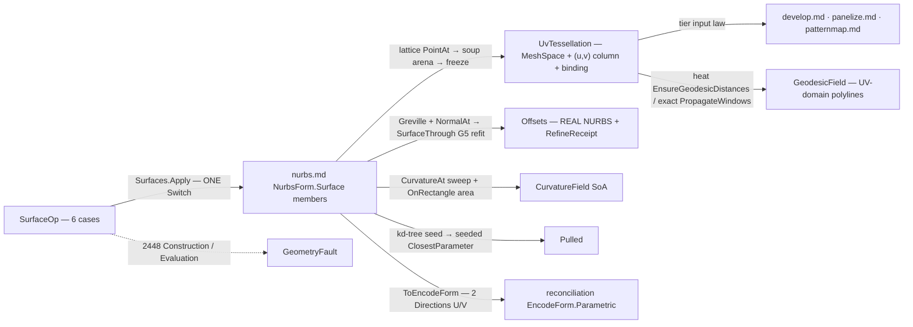

# [RASM_PARAMETRIC_SURFACE]

`Surfaces` owns the surface op algebra of `Rasm.Parametric` and mints its UV-provenance seam: `Tessellate` emits `UvTessellation`, a frozen mesh carrying an index-aligned per-vertex `(u, v)` column beside its live surface binding — the one surface input the tier's downstream consumers admit by type.

Every emitted `NurbsForm.Surface` carries `ToEncodeForm()` into the reconciliation `EncodeForm.Parametric` identity chain.

## [01]-[INDEX]

- [02]-[SURFACES]: `SurfaceOp` folded by one `Apply` over the rule, grade, and policy vocabularies into typed `SurfaceResult` carriers.

## [02]-[SURFACES]

- Owner: `Surfaces` mints the one static entry, `Apply` folding every `SurfaceOp` case through the generated total `Switch`.
- Cases: `SurfaceOp` is the request `[Union]`, one case per surface operation; `SurfaceResult` the result `[Union]`, one typed carrier per request family; rule, grade, and policy rows are the vocabularies the ops read.
- Entry: `Geodesics` takes the `UvTessellation` carrier, so the provenance proof is the parameter type.
- Auto: every op composes the vendored engine with the landed distance, refit, and arena machinery; no evaluation arithmetic is local.
- Receipt: `GeodesicField.Grade` records the distance lane a consumer dispatches on; `UvTessellation` carries no receipt, the carrier its own provenance evidence.
- Packages: `nurbs.md` the vendored engine; MathNet.Numerics for the `Integrate.OnRectangle` area quadrature; Supercluster.KDTree.Net for the dense pullback seed; `Rasm.Meshing` for the `MeshEdit` arena and `MeshSpace` freeze; `Rasm.Processing` for the landed distance lanes; `Rasm.Spatial` for the fields rail and the `EncodeForm` identity target; `Rasm.Numerics` for `ParametricFault`; `Rasm.Domain` for `Op`, `Context`, and the `BenchClaim` ledger row; Rhino.Geometry, Thinktecture.Runtime.Extensions, LanguageExt.Core, and System.Numerics.Tensors.
- Growth: a new tessellation density is one `TessellateRule` case; a new isoline selection one `IsolineRule` case; a second distance lane one `GeodesicGrade` row; a new field quantity one `CurvatureField` column off the same `CurvatureAt` sweep; a lofted, swept, or revolved construction is a growth row on the engine admission.
- Boundary: basis, derivative, and projection arithmetic stay `nurbs.md`'s engine members; a trimmed region tessellates through `curve.md`'s `Fill` overlay lifted by `PointAt` at the consumer, so this owner tessellates the full tensor-product domain and mints no second constrained substrate.

```csharp signature
// --- [RUNTIME_PRELUDE] ----------------------------------------------------------------------
using System;
using System.Linq;
using System.Numerics.Tensors;
using System.Runtime.InteropServices;
using LanguageExt;
using LanguageExt.Common;
using MathNet.Numerics;
using Rasm.Domain;
using Rasm.Meshing;
using Rasm.Numerics;
using Rasm.Processing;
using Rasm.Spatial;
using Rhino.Geometry;
using SuperClusterKDTree;
using Thinktecture;
using static LanguageExt.Prelude;

namespace Rasm.Parametric;

// --- [TYPES] ------------------------------------------------------------------------------------
// Adaptive keeps the UV column a structured grid, so downstream pullback stays O(1).
[Union(ConversionFromValue = ConversionOperatorsGeneration.None)]
public abstract partial record TessellateRule {
    private TessellateRule() { }

    public sealed record Grid(int Nu, int Nv) : TessellateRule;
    public sealed record Adaptive(int BudgetU, int BudgetV) : TessellateRule;
}

[Union(ConversionFromValue = ConversionOperatorsGeneration.None)]
public abstract partial record IsolineRule {
    private IsolineRule() { }

    public sealed record Even(int CountU, int CountV) : IsolineRule;
    public sealed record AtKnots : IsolineRule;
    public sealed record AtParameters(Arr<double> U, Arr<double> V) : IsolineRule;
}

[SmartEnum<string>]
[KeyMemberEqualityComparer<ComparerAccessors.StringOrdinal, string>]
[KeyMemberComparer<ComparerAccessors.StringOrdinal, string>]
public sealed partial class GeodesicGrade {
    public static readonly GeodesicGrade Heat  = new("heat");
    public static readonly GeodesicGrade Exact = new("exact");
}

// --- [CONSTANTS] --------------------------------------------------------------------------------
public sealed record GeodesicPlan(Arr<Point2d> Sources, Arr<double> Levels, GeodesicGrade Grade) : IValidityEvidence {
    public bool IsValid => ValidityClaim.All(
        ValidityClaim.CountAtLeast(count: Sources.Count, floor: 1),
        ValidityClaim.CountAtLeast(count: Levels.Count, floor: 1),
        ValidityClaim.Of(holds: Levels.All(static level => ValidityClaim.Positive(value: level))));
}

public sealed record PullbackPolicy(int DenseFloor, int SeedU, int SeedV, NurbsPolicy Projection) : IValidityEvidence {
    public static readonly PullbackPolicy Canonical = new(DenseFloor: 32, SeedU: 24, SeedV: 24, NurbsPolicy.Canonical);

    public bool IsValid => ValidityClaim.All(
        ValidityClaim.CountAtLeast(count: DenseFloor, floor: 1),
        ValidityClaim.CountAtLeast(count: SeedU, floor: 2),
        ValidityClaim.CountAtLeast(count: SeedV, floor: 2),
        ValidityClaim.Evidence(evidence: Projection));
}

// --- [MODELS] -----------------------------------------------------------------------------------
[StructLayout(LayoutKind.Auto)]
public readonly record struct FieldExtrema(double Min, double Max, double Mean) {
    public static FieldExtrema Of(ReadOnlySpan<double> plane) =>
        plane.Length == 0
            ? new FieldExtrema(Min: 0.0, Max: 0.0, Mean: 0.0)
            : new FieldExtrema(
                Min: TensorPrimitives.Min<double>(plane),
                Max: TensorPrimitives.Max<double>(plane),
                Mean: TensorPrimitives.Average<double>(plane));
}

// --- [OPERATIONS] ---------------------------------------------------------------------------
[Union(ConversionFromValue = ConversionOperatorsGeneration.None)]
public abstract partial record SurfaceOp {
    private SurfaceOp() { }

    public sealed record Tessellate(NurbsForm.Surface Surface, TessellateRule Rule, Context Tolerance) : SurfaceOp;
    public sealed record Isolines(NurbsForm.Surface Surface, IsolineRule Rule) : SurfaceOp;
    public sealed record Geodesics(SurfaceResult.UvTessellation Source, GeodesicPlan Plan) : SurfaceOp;
    public sealed record NormalOffset(NurbsForm.Surface Surface, double Distance, FitPolicy Refit, RefinePolicy Refine) : SurfaceOp;
    public sealed record CurvatureSample(NurbsForm.Surface Surface, int Nu, int Nv, NurbsPolicy? Policy = null) : SurfaceOp;
    public sealed record Pullback(NurbsForm.Surface Surface, Arr<Point3d> Probes, PullbackPolicy Policy) : SurfaceOp;
}

[Union(ConversionFromValue = ConversionOperatorsGeneration.None)]
public abstract partial record SurfaceResult {
    private SurfaceResult() { }

    // Tier seam — develop/panelize/patternmap admit THIS type, so provenance rides construction.
    public sealed record UvTessellation(NurbsForm.Surface Source, MeshSpace Mesh, Arr<Point2d> Uv) : SurfaceResult;

    public sealed record Isolines(Arr<double> UParameters, Arr<NurbsForm.Curve> UCurves, Arr<double> VParameters, Arr<NurbsForm.Curve> VCurves) : SurfaceResult;

    public sealed record GeodesicField(Arr<int> Offsets, Arr<Point2d> Uv, Arr<Point3d> World, Arr<double> LevelOf, GeodesicGrade Grade) : SurfaceResult;

    public sealed record Offsets(NurbsForm.Surface Surface, RefineReceipt Receipt) : SurfaceResult;

    public sealed record CurvatureField(
        Arr<Point2d> Uv, Arr<double> K1, Arr<double> K2, Arr<double> Gaussian, Arr<double> Mean,
        Arr<Vector3d> Dir1, Arr<Vector3d> Dir2, Arr<double> AreaElement, FieldExtrema K1Band, FieldExtrema K2Band, double Area, int DegenerateNodes) : SurfaceResult;

    public sealed record Pulled(Arr<Point2d> Uv, Arr<Point3d> Feet, Arr<double> Distances) : SurfaceResult;
}

public static class Surfaces {
    // Band reductions prove under the corpus gate; correctness never rides the claim.
    public static readonly BenchClaim CurvatureSummaryClaim = new(
        Claim: Op.Of(name: nameof(SurfaceResult.CurvatureField)),
        VectorizedLane: "TensorPrimitives.Min/Max/Average<double> over the survivor curvature planes",
        ReferenceLane: "scalar LINQ Min/Max/Average folds over the same planes",
        SpeedupFloor: 1.0);

    public static Fin<SurfaceResult> Apply(SurfaceOp op, Op? key = null) =>
        op.Switch(
            state: key,
            tessellate:      static (k, t) => TessellateOf(t, k),
            isolines:        static (k, i) => IsolinesOf(i, k),
            geodesics:       static (k, g) => GeodesicsOf(g, k),
            normalOffset:    static (k, o) => NormalOffsetOf(o, k),
            curvatureSample: static (k, c) => CurvatureOf(c, k),
            pullback:        static (k, p) => PullbackOf(p, k));

    // --- [TESSELLATE]
    // ToSpace kills no arena faces, so vertex order survives the freeze: Uv[i] parameterizes vertex i, always.
    static Fin<SurfaceResult> TessellateOf(SurfaceOp.Tessellate op, Op? key) =>
        Lattice(op.Surface, op.Rule).Bind(grid => {
            Arr<Point2d> uv = new([.. grid.U.SelectMany(u => grid.V.Select(v => new Point2d(u, v)))]);
            Point3d[] points = new Point3d[uv.Count];
            for (int i = 0; i < uv.Count; i++) { points[i] = op.Surface.PointAt(uv[i].X, uv[i].Y); }
            using MeshEdit arena = MeshEdit.Of(points, CellTriangles(grid.U.Length, grid.V.Length, points));
            return arena.ToSpace(op.Tolerance, key).Map(space =>
                (SurfaceResult)new SurfaceResult.UvTessellation(op.Surface, space, uv));
        });

    static Fin<(double[] U, double[] V)> Lattice(NurbsForm.Surface surface, TessellateRule rule);        // Grid: uniform; Adaptive: per-axis budgets by cumulative mean-|κ| integral
    static ReadOnlySpan<(int A, int B, int C)> CellTriangles(int nu, int nv, ReadOnlySpan<Point3d> points);  // shorter-diagonal split; degenerate cells culled, vertices kept

    // --- [ISOLINES]
    static Fin<SurfaceResult> IsolinesOf(SurfaceOp.Isolines op, Op? key) =>
        IsoRows(op.Surface, op.Rule).Bind(rows =>
            rows.U.TraverseM(u => op.Surface.IsoCurve(u, ParametricDirection.U)).As().Bind(uCurves =>
                rows.V.TraverseM(v => op.Surface.IsoCurve(v, ParametricDirection.V)).As().Map(vCurves =>
                    (SurfaceResult)new SurfaceResult.Isolines(rows.U, new Arr<NurbsForm.Curve>([.. uCurves]), rows.V, new Arr<NurbsForm.Curve>([.. vCurves])))));

    static Fin<(Arr<double> U, Arr<double> V)> IsoRows(NurbsForm.Surface surface, IsolineRule rule);     // Even lattice · interior knots off KnotsU/KnotsV · explicit rows, domain-gated

    // --- [GEODESICS]
    // Contour march: ONE lerp weight interpolates world AND uv, so the pullback is the tessellation's own provenance; a ClosestParameter re-projection answers differently near cut loci.
    static Fin<SurfaceResult> GeodesicsOf(SurfaceOp.Geodesics op, Op? key) =>
        !op.Plan.IsValid
            ? Fault<SurfaceResult>(ParametricStage.Evaluation, nameof(GeodesicPlan), "empty sources or non-positive level")
            : VertexDistances(op.Source, op.Plan, key).Map(distances =>
                (SurfaceResult)ChainContours(op.Source, distances, op.Plan));

    static Fin<Arr<double>> VertexDistances(SurfaceResult.UvTessellation source, GeodesicPlan plan, Op? key);  // heat: GeodesicKernel.EnsureGeodesicDistances · exact: PropagateWindows min-fold, +∞ unreached kept
    static SurfaceResult.GeodesicField ChainContours(SurfaceResult.UvTessellation source, Arr<double> distances, GeodesicPlan plan);

    // --- [NORMAL_OFFSET]
    // curve.md's ONE Refine.Fold drives this lane's seed/probe/densify arms; a page-local copy of the bounded fold is the deleted twin.
    static Fin<SurfaceResult> NormalOffsetOf(SurfaceOp.NormalOffset op, Op? key) =>
        Refine.Fold(
            op.Refine, GrevilleGrid(op.Surface),
            fit: (grid, round) => OffsetFit(op, grid, round, key),
            densify: Densified,
            unconverged: deviation => new GeometryFault.ParametricFault(ParametricStage.Construction, nameof(NurbsForm.Surface), $"normal offset unconverged at deviation {deviation}").ToError())
        .Map(final => (SurfaceResult)new SurfaceResult.Offsets(final.Fit, final.Receipt));

    static Arr<Point2d> GrevilleGrid(NurbsForm.Surface surface);                                          // γ rows off KnotsU × KnotsV
    static Fin<RefineRound<NurbsForm.Surface, Point2d>> OffsetFit(SurfaceOp.NormalOffset op, Arr<Point2d> grid, int round, Op? key); // NormalAt displacement (degenerate normal → Evaluation fault) → Nurbs.Of(SurfaceThrough) G5 refit → probes against the exact locus S + d·N̂
    static Arr<Point2d> Densified(Arr<Point2d> grid, Arr<Point2d> breaching);

    // --- [CURVATURE_SAMPLE]
    // Quadrature never sees a Fin rail — the area integrand is total by construction.
    static Fin<SurfaceResult> CurvatureOf(SurfaceOp.CurvatureSample op, Op? key) {
        double area = Integrate.OnRectangle(
            (u, v) => {
                Vector3d[][] skl = op.Surface.RationalDerivatives(u, v, 1);
                return Vector3d.CrossProduct(skl[1][0], skl[0][1]).Length;
            },
            0.0, 1.0, 0.0, 1.0, (op.Policy ?? NurbsPolicy.Canonical).GaussOrder);
        return SweepCurvature(op, area);
    }

    static Fin<SurfaceResult> SweepCurvature(SurfaceOp.CurvatureSample op, double area);                  // CurvatureAt per node; survivors fill the SoA columns, pole refusals count; K1Band/K2Band = FieldExtrema.Of over the survivor planes before the Arr wrap

    // --- [PULLBACK]
    // kd-tree amortizes SEEDING, the engine owns PROJECTION; a local Newton beside the engine member is the named parallel-projector defect.
    static Fin<SurfaceResult> PullbackOf(SurfaceOp.Pullback op, Op? key) =>
        op.Probes.Count < op.Policy.DenseFloor
            ? op.Probes.TraverseM(probe => op.Surface.ClosestParameter(probe, op.Policy.Projection)).As()
                .Map(uv => Emit(op, new Arr<(double U, double V)>([.. uv])))
            : DensePullback(op, key);

    static Fin<SurfaceResult> DensePullback(SurfaceOp.Pullback op, Op? key) {
        (Point3d[] seeds, Point2d[] seedUv) = SeedGrid(op.Surface, op.Policy);
        KDTree<double, double, Point2d> tree = KDTree.Create(
            [.. seeds.Select(static p => (IReadOnlyList<double>)[p.X, p.Y, p.Z])],
            seedUv, DistanceMetrics.EuclideanDistance);
        return op.Probes.TraverseM(probe =>
                tree.NearestNeighbors([probe.X, probe.Y, probe.Z], 1).First() switch {
                    (_, Point2d seed) => op.Surface.ClosestParameter(probe, op.Policy.Projection, Some((seed.X, seed.Y))),
                })
            .As().Map(uv => Emit(op, new Arr<(double U, double V)>([.. uv])));
    }

    static (Point3d[] Seeds, Point2d[] SeedUv) SeedGrid(NurbsForm.Surface surface, PullbackPolicy policy);
    static SurfaceResult Emit(SurfaceOp.Pullback op, Arr<(double U, double V)> uv);                       // feet = PointAt(u,v); distances = |probe − foot|

    static Fin<T> Fault<T>(ParametricStage stage, string carrier, string witness) =>
        Fin.Fail<T>(new GeometryFault.ParametricFault(stage, carrier, witness).ToError());
}
```



## [03]-[DENSITY_BAR]

`Surfaces` is the one entry-bearing owner; every other axis is a payload, discriminant, or policy row.

| [INDEX] | [AXIS_CONCERN]     | [OWNER]                  | [RAIL]                            |
| :-----: | :----------------- | :----------------------- | :-------------------------------- |
|  [01]   | Surface op algebra | `SurfaceOp` + `Surfaces` | `Apply → Fin<SurfaceResult>`      |
|  [02]   | Result carrier     | `SurfaceResult`          | carrier (drained at the consumer) |
|  [03]   | Grid rules         | `TessellateRule`         | payload                           |
|  [04]   | Isoline rules      | `IsolineRule`            | payload                           |
|  [05]   | Distance grade     | `GeodesicGrade`          | discriminant                      |
|  [06]   | Geodesic policy    | `GeodesicPlan`           | values (`IValidityEvidence`)      |
|  [07]   | Pullback policy    | `PullbackPolicy`         | values (`IValidityEvidence`)      |

## [04]-[RESEARCH]

<!-- source-only: research row template:
[TOKEN]-[OPEN|BLOCKED]: <exact question>; <verification route>.
[SPLIT_MEMBER]-[OPEN]: does `shape-core` expose `split_all`; verify against the member rail.
-->

(none)
