# [RASM_SIMPLIFICATION_DECIMATE]

The predicate-guarded mesh decimation / LOD owner — ONE `SimplifyOp` `[Union]` (`QuadricCollapse`/`ProgressiveMesh`/`VoxelRemesh`/`FeaturePreserve`) that reduces a triangle mesh to a budgeted face count by a Garland-Heckbert quadric-error-metric edge-collapse priority queue whose every collapse is admitted ONLY when each incident face keeps the exact `Numerics/predicates#ROBUST_PREDICATES` `Predicate.Orient3D` sign AGAINST ITS ORIGINAL SUPPORTING PLANE under the moved survivor — the moved triangle is tested against the pre-collapse plane's reference point, so a fold that flips a face relative to where it was is refused by an exact sign, never by a float area band — and the manifold link condition holds on BOTH edge classes: an interior edge collapses when the endpoints' vertex links share exactly the two opposite corners, a boundary edge (one incident face) when they share exactly the one, so open meshes decimate instead of freezing at their rims. The collapse mutates the `Meshing/edit.md` arena in place (`SetPosition` the survivor re-seat, `SetFace` the fan re-point, `KillFace` the vanishing pair — face indices stable under mutation, exactly the corner-rewrite contract the arena declares), and the decimation state is `QuadricStore`, a decimate-LOCAL pooled-plane SoA over the arena: the 106-bit `ddouble` error-quadric plane, the version/valid planes the lazy queue reads, and the vertex→one-ring plus vertex→incident-face indexes that answer fan, link, and edge-incidence queries in O(degree) — the O(F²) full-face-table scans this index retires are the deleted form.

The owner composes `Vectors` `Point3d`/`Vector3d`/`MeshSpace` carriers, the arena's own budgeted `Parallel` verb for the two-pass quadric accumulation (parallel per-FACE plane pass into disjoint face slots, then parallel per-VERTEX `ddouble` sums over the incidence index — a per-face scatter into shared vertex slots is the racing form this partition forbids), the `VectorCloudMetric.PrincipalCurvature` per-vertex curvature signal (the `ProgressiveMesh` quadric-weight modulation, composed at its `VectorCloud.Cluster` handle, rail-bound — a swallowed curvature failure silently degrading to uniform weights is the deleted form), the `VectorIntent.Features`/`FeatureReceipt`/`FeatureEdge` dihedral crease/boundary classification (`FeaturePreserve` pins a crease rather than smoothing it away), and the `Meshing/reconstruct.md` static `IsoSurface.Detailed(field, bounds, resolution, IsoSurfacePolicy, context, key)` marching-cubes extraction over a `ScalarField.SignedDistanceFromMeshCase` field (the `VoxelRemesh` resample — the SAME SDF/iso lane the field substrate owns, never a domain-local marcher, and never the dead `field.IsoSurfaceDetailed` instance spelling). The one-sided Hausdorff bound rides the `Spatial/index.md` ONE `Spatial.Apply` entry — `SpatialOp.Build` over the source faces once, `SpatialOp.Query(SpatialQuery.Nearest)` per stratified sample, every answer matched on the `SpatialAnswer` union through `Fin` (the hard `(QueryResult.Nearest)` cast is dead) — with per-sample distances filled in parallel into a pooled plane and reduced by ONE `TensorPrimitives.Max` vectorized pass. Every reachable failure routes the band-2400 `GeometryFault` union (`DecimationFault(FaceBudget, Achieved)` 2440 when the topology-preservation gate stalls before the budget; `DegenerateInput(Kind, int, string)` 2400 for a faceless input); the result records ARE the hash-friendly immutable carriers the `Spatial/reconciliation#NAMING_HASH` `Encode` content-addresses through the `MeshSpace` seam — this owner computes no hash and mints no second identity. The mature `Vectors` `Mesh.Reduce` quick-reduce stays the host's fast face-count reduce; this owner produces what the host produces neither of — the exact-plane collapse gate, the directed Hausdorff budget, and the reversible vsplit stream — so it never thins the host reduce.

## [01]-[INDEX]

- [01]-[ROBUST_MESH_DECIMATION]: `SimplifyKind` discriminant; `SimplifyPolicy` validated budget row; `VertexSplit` reversible-collapse record; `Quadric` 106-bit `ddouble` error quadric; `QuadricStore` decimate-local pooled SoA (quadric/version/valid planes + one-ring and incident-face indexes + collapse-cost queue); `SimplifyOp` `[Union]` folded by ONE `Simplify.Apply`; the exact-plane collapse gate, boundary-admitting link condition, arena-mutating collapse, parallel two-pass accumulation, SDF voxel resample, vectorized Hausdorff bound, and the typed `DecimationResult`.

## [02]-[ROBUST_MESH_DECIMATION]

- Owner: `SimplifyKind` `[SmartEnum<string>]` the decimation-modality discriminant binding the shipped `ComparerAccessors.StringOrdinal` as its string-key comparer (`quadric-collapse`/`progressive-mesh`/`voxel-remesh`/`feature-preserve`) carrying the per-kind `Reversible` (`ProgressiveMesh`/`FeaturePreserve` record the full vsplit stream so the result re-expands toward source; `QuadricCollapse` keeps only the budgeted mesh; `VoxelRemesh` is a resample and reconstructs no source connectivity) and `PreservesTopology` (`VoxelRemesh` re-meshes the SDF level set so its output genus follows the iso-surface, not the source) columns; `SimplifyPolicy` the validated budget/tolerance row registering `IValidityEvidence` (target face count or fraction, Hausdorff ceiling — ENFORCED at emit, never a decorative field — boundary-quadric penalty, crease dihedral, curvature gain, voxel resolution, per-face sample count, deterministic seed); `VertexSplit` the reversible-collapse record (survivor/collapsed endpoint pair, their pre-collapse positions, the collapse cost — the exact inverse the continuous-LOD re-expansion replays); `Quadric` the 10-coefficient symmetric 4×4 error quadric at 106-bit `ddouble`; `QuadricStore` the decimate-LOCAL pooled-plane SoA over the arena — `MemoryOwner<Quadric>`/`MemoryOwner<int>`/`MemoryOwner<bool>` quadric, version, valid, and boundary-vertex planes (pooled, deterministically disposed — never raw `new T[]` staging), the vertex→one-ring and vertex→incident-face indexes every fan/link/edge query reads in O(degree), the boundary-edge roster with per-edge single incident face, the BCL `PriorityQueue<EdgeRef,double>` of cost-keyed live edges, the `VertexSplit` stream, and the live-face counter — distinct from the `MeshEdit` arena it annotates (positions and faces live on the ARENA; this store carries only decimation state); `DecimationResult` the typed evidence; `Simplify` the static surface whose ONE `Apply` runs the fold.
- Cases: `SimplifyKind` rows `quadric-collapse` · `progressive-mesh` · `voxel-remesh` · `feature-preserve` (4); `SimplifyOp` cases `QuadricCollapse` · `ProgressiveMesh` · `VoxelRemesh` · `FeaturePreserve` (4). The four kinds share ONE quadric accumulation, ONE exact-plane-gated collapse loop, ONE Hausdorff bound, and ONE vsplit recorder — each kind contributes only its `Weights` table row (uniform, curvature-scaled, feature-pinned) and whether it resamples through the SDF iso-surfacer first (`VoxelRemesh`) — never four decimator classes with a duplicated collapse queue.
- Entry: `public static Fin<DecimationResult> Simplify.Apply(SimplifyOp op, Op? key = null)` — the ONE decimation entrypoint discriminating by `SimplifyOp` case; the tolerance model is the op's own `MeshSpace.Tolerance` `Context` (never a second tolerance parameter beside the value that already carries it); `Fin<T>` routes `GeometryFault.DecimationFault(faceBudget, achieved)` when the gate stalls with live collapses rejected before the requested budget (a budget a manifold-preserving collapse cannot satisfy is a typed defect, never a silently over-reduced mesh), `GeometryFault.DegenerateInput(Kind.Mesh, …)` for a faceless input, and `key.InvalidResult(…)` when the achieved Hausdorff bound breaches the policy ceiling — the admitted `MeshSpace` is NOT re-validated for finiteness (admission happened once; the arena freeze re-gates at publish). No `Decimate`/`ReduceTo`/`RemeshVoxel` sibling entrypoints — one polymorphic `Apply` discriminates by kind.
- Auto: `Apply` reads the `Weights` `FrozenDictionary` keyed by `SimplifyKind` so kind selection is a data-table row, never a `kind switch` cascade — every row fills the SAME pooled weight plane and lowers to the SAME `Collapse` loop. The fold: (1) `VoxelRemesh` resamples FIRST — `SdfMeshPolicy.GeneralizedWinding()` seeds a `ScalarField.SignedDistanceFromMeshCase`, `IsoSurface.Detailed` extracts the level set at `VoxelResolution`, and the clean manifold re-admits through `MeshSpace.Of` — then decimates like every other kind; (2) ONE arena opens (`MeshEdit.Of(space)` — quads split through the arena's exact diagonal gate) and `QuadricStore.Seed` builds the one-ring/incident-face indexes, the boundary roster, and the pooled planes; (3) the weight row fills the pooled weight plane ON THE RAIL — a curvature or feature projection failure routes `Fin`, never a silent uniform fallback; (4) `Accumulate` runs TWO partition-disjoint parallel passes through the arena's budgeted `Parallel` verb — per-FACE plane coefficients into disjoint face slots, then per-VERTEX `ddouble` quadric sums over the incidence index into disjoint vertex slots (the per-face scatter that races three vertex slots per face is the forbidden form) — and `Boundaries` adds the Garland-Heckbert constraint quadric on each boundary edge: the plane THROUGH the edge PERPENDICULAR to its single incident face (edge × face-normal), scaled by `BoundaryPenalty`, so a rim resists drift without freezing; (5) `Drain` pops the lowest-cost live edge, skips stale entries by version (no decrease-key), gates through `CollapseValid` — link condition per edge class (interior `shared == 2`, boundary `shared == 1`, and an interior edge joining two boundary vertices refused as the pinch it would create) plus the EXACT flip guard: every surviving fan face's moved triangle keeps `Predicate.Orient3D(moved, original-plane reference) == Sign.Positive` against its ORIGINAL supporting plane (the reference point `oa + (ob−oa)×(oc−oa)` is float-constructed — the axis-choice class — and the deciding sign is exact; `Sign.Zero` refuses the degenerate) — then applies: survivor re-seats via `SetPosition`, the collapsing fan dies via `KillFace`, the remaining fan re-points via `SetFace`, indexes re-home, quadrics merge `Qᵤ ← Qᵤ + Qᵥ`, versions bump, the one-ring re-enqueues; (6) termination at budget under an OUTER FIXPOINT — a drained queue above budget re-seeds when `NoAdmissibleCollapse` (a sweep of the live one-ring edge set, never the face table) still finds an admissible edge, because a rejected edge can become admissible after its neighborhood changes; each re-seed applies at least one collapse, and a genuine stall routes `DecimationFault(budget, achieved)`. `Emit` freezes ONCE through `edit.ToSpace(context, key)` (tombstone compaction and the finiteness gate are the arena's), computes the directed Hausdorff bound, enforces the ceiling, and lifts the preserved-feature set on the rail.
- Receipt: `Apply` carries a `DecimationResult` typed to the decimation — `Mesh` (the frozen simplified `MeshSpace`), `Vertices`/`Faces` (the achieved live counts), `RequestedFaces` (the budget requested — dual evidence beside the achieved), `Hausdorff` (the one-sided directed bound from simplified to source — the error a LOD consumer thresholds), `Features` (the preserved crease/boundary `FeatureEdge` set), `Splits` (the reversible `VertexSplit` stream) — never a generic `IReceipt`/ledger. The Compute tile-pyramid reads `Mesh`+`Hausdorff` to seat a mesh at the LOD whose directed error fits the screen-space tolerance, the coarse-solver-seed reads the budgeted `Mesh` as the multigrid coarse level, the meshlet-residency reads the achieved `Faces` per residency tier, and the continuous-LOD consumer replays `Splits` — each through `Apply` and the result, never the interior `QuadricStore`.
- Packages: `Rasm`/Vectors (`Point3d`/`Vector3d`/`MeshSpace`; `VectorCloudMetric.PrincipalCurvature` + `VectorCloud.Cluster` the curvature signal; `VectorIntent.Features`/`FeatureReceipt`/`FeatureEdge`/`MeshFeatureKind` the dihedral classification; `ScalarField.SignedDistanceFromMeshCase` the SDF field case), `Rasm.Geometry.Meshing` (`MeshEdit` arena — `Of`/`SetPosition`/`SetFace`/`KillFace`/`Parallel`/`ToSpace`, composed never re-minted; `IsoSurface.Detailed` + `IsoSurfacePolicy` + `SdfMeshPolicy.GeneralizedWinding` the iso lane), `Rasm.Geometry.Numerics` (`Predicate.Orient3D`/`Sign` — the exact collapse-validity floor), `Rasm.Geometry.Spatial` (`Spatial.Apply` + `SpatialOp.Build`/`Query` + `SpatialQuery.Nearest` + `SpatialAnswer`/`QueryResult` — the ONE broad-phase entry the Hausdorff bound rides), `Rasm.Vectors` `Numerics/matrix` (`SymmetricMatrix.DecomposeCholesky` → `CholeskyResult.SolveDetailed` — the 3×3 optimal-position sub-solve through the ONE matrix owner, its `SolveReceipt` gating the solution all-finite), TYoshimura.DoubleDouble (`ddouble` — the 106-bit quadric coefficient killing the Garland-Heckbert catastrophic cancellation, narrowed to `double` only at the cost readout), System.Numerics.Tensors (`TensorPrimitives.Max` — the vectorized Hausdorff reduction over the pooled distance plane; the exact predicates and the `ddouble` fold stay scalar per the not-the-exact-predicate law), CommunityToolkit.HighPerformance (`MemoryOwner<T>` pooled planes + `IAction` struct rows the arena `Parallel` verb runs), Rasm.Domain (`Context`/`Op`/`Kind`/`IValidityEvidence`/`ValidityClaim`), Thinktecture.Runtime.Extensions, LanguageExt.Core, BCL inbox (`PriorityQueue<EdgeRef,double>`, `HashSet<int>`, `System.Random` the deterministic sampler).
- Growth: a new decimation modality (appearance-preserving with a color/UV quadric, out-of-core uniform resample) is one `SimplifyKind` row + one `SimplifyOp` case + one `Weights` row over the SAME `Collapse` loop; a new quadric weight is one `Weights` row reading one `SimplifyPolicy` column; a new error bound (two-sided symmetric Hausdorff, mean L²) is one `DecimationResult` column over the SAME sampler and reduction plane; a new termination rule (error-threshold-driven collapse) is one `SimplifyPolicy` column on the same loop; zero new surface.
- Boundary: the decimation owner is the ONE polymorphic `SimplifyOp` `[Union]` and a `QuadricDecimator`/`ProgressiveMeshBuilder`/`VoxelRemesher`/`FeaturePreservingSimplifier` sibling-class family is the named density defect collapsed onto one union folded by one `Apply`; the collapse-validity gate compares each fan face's exact `Orient3D` against its ORIGINAL supporting plane and the self-referential `before`/`after` pair that tests each triangle against its OWN offset point — identically `Positive`, deciding nothing — is the deleted vacuous form this rebuild killed; the link condition admits boundary edges at `shared == 1` and the `shared == 2` freeze that made open meshes undecimatable is the deleted form; fan, collapsed-face, and admissibility queries read the vertex→incident-face index in O(degree) and a full face-table scan per query is the deleted O(F²) form; positions and faces live on the ARENA (`SetPosition`/`SetFace`/`KillFace` — the corner-rewrite contract `edit.md` declares for exactly this collapse) and a store-private position column or face table beside the arena is the deleted third-carrier form; the voxel resample composes the REAL static `IsoSurface.Detailed(field, bounds, resolution, policy, context, key)` and the `field.IsoSurfaceDetailed` instance spelling is the deleted phantom; the Hausdorff bound routes the ONE `Spatial.Apply` entry with every answer matched on the union through `Fin` and a hard `(QueryResult.Nearest)` cast is the deleted form; the distance reduction is ONE `TensorPrimitives.Max` pass over the pooled plane (admissible because the sampled distances are raw `double`, not the exact-predicate lane) and a scalar `Math.Max` element loop is the rejected form — the vectorized lane holds its speed claim under the corpus benchmark gate, correctness never depending on it; the quadric accumulation carries 106-bit `ddouble` narrowing to `double` only at the priority-queue cost key, and the parallel accumulate partitions per-VERTEX over the incidence index because a per-face scatter races; `VoxelRemesh` (SDF resample of a defective/over-tessellated input, genus follows the level set) is DISTINCT from `Processing/remesh.md` (isotropic/quad re-tessellation of a valid mesh under edge-length and cross-field targets) — the two coexist under the widened Simplification charter, one anchor each, never a merged rewriter; `Alimer.Bindings.MeshOptimizer` is `Rasm.Compute`'s residency-lane binding, never this kernel's decimator (recorded stratum split); the mature host `Mesh.Reduce` is NOT thinned — this owner adds the exact gate, the directed bound, and the reversible stream the host reduce lacks; `Apply` is total over the `Fin` rail and a thrown exception on a degenerate mesh or stalled budget is forbidden.

```csharp contract
// --- [RUNTIME_PRELUDE] --------------------------------------------------------------------
using System;
using System.Collections.Frozen;
using System.Collections.Generic;
using System.Linq;
using System.Numerics.Tensors;
using System.Threading;
using CommunityToolkit.HighPerformance.Buffers;
using CommunityToolkit.HighPerformance.Helpers;
using DoubleDouble;
using LanguageExt;
using Rasm.Domain;
using Rasm.Geometry;
using Rasm.Geometry.Meshing;
using Rasm.Geometry.Numerics;
using Rasm.Geometry.Spatial;
using Rasm.Vectors;
using Rhino.Geometry;
using Thinktecture;
using static LanguageExt.Prelude;

namespace Rasm.Geometry.Simplification;

// --- [TYPES] ------------------------------------------------------------------------------
[SmartEnum<string>]
[KeyMemberEqualityComparer<ComparerAccessors.StringOrdinal, string>]
[KeyMemberComparer<ComparerAccessors.StringOrdinal, string>]
public sealed partial class SimplifyKind {
    public static readonly SimplifyKind QuadricCollapse = new("quadric-collapse", reversible: false, preservesTopology: true);
    public static readonly SimplifyKind ProgressiveMesh = new("progressive-mesh", reversible: true, preservesTopology: true);
    public static readonly SimplifyKind VoxelRemesh     = new("voxel-remesh", reversible: false, preservesTopology: false);
    public static readonly SimplifyKind FeaturePreserve = new("feature-preserve", reversible: true, preservesTopology: true);

    public bool Reversible { get; }
    public bool PreservesTopology { get; }
}

// --- [CONSTANTS] --------------------------------------------------------------------------
public sealed record SimplifyPolicy(
    double TargetFraction,
    int TargetFaces,
    double HausdorffCeiling,
    double BoundaryPenalty,
    double CreaseDihedralRadians,
    double CurvatureGain,
    int VoxelResolution,
    int HausdorffSamplesPerFace,
    int Seed) : IValidityEvidence {
    public static readonly SimplifyPolicy Canonical = new(
        TargetFraction: 0.25, TargetFaces: 0,
        HausdorffCeiling: double.PositiveInfinity, BoundaryPenalty: 1.0e3,
        CreaseDihedralRadians: 0.5235987755982988, CurvatureGain: 4.0,
        VoxelResolution: 128, HausdorffSamplesPerFace: 1, Seed: 0x5EED);

    public bool IsValid => ValidityClaim.All(
        ValidityClaim.Of(TargetFraction is > 0.0 and <= 1.0),
        ValidityClaim.CountAtLeast(count: TargetFaces, floor: 0),
        ValidityClaim.Positive(value: BoundaryPenalty),
        ValidityClaim.Nonnegative(value: CurvatureGain),
        ValidityClaim.Of(CreaseDihedralRadians is > 0.0 and < Math.PI),
        ValidityClaim.CountAtLeast(count: VoxelResolution, floor: 2),
        ValidityClaim.CountAtLeast(count: HausdorffSamplesPerFace, floor: 1),
        ValidityClaim.Of(double.IsPositive(HausdorffCeiling)));

    public int BudgetFor(int sourceFaces) =>
        TargetFaces > 0 ? Math.Min(TargetFaces, sourceFaces) : Math.Max(4, (int)Math.Round(TargetFraction * sourceFaces));
}

// --- [MODELS] -----------------------------------------------------------------------------
public readonly record struct VertexSplit(int Survivor, int Collapsed, Point3d SurvivorAt, Point3d CollapsedAt, double Cost);

public readonly record struct EdgeRef(int U, int V, int VersionU, int VersionV);

// Per-face plane row the parallel plane pass writes (disjoint face slots); W = 0 marks dead/degenerate.
public readonly record struct FacePlane(double A, double B, double C, double D, double W);

// The Garland-Heckbert error quadric at 106-bit ddouble: the plane-sum Σ Kf, the collapse merge
// Qᵤ ← Qᵤ + Qᵥ, and the near-cancelling xᵀQx on the supporting plane lose the queue-ordering digits
// in double on a large mesh — coefficients stay 106-bit, narrowing only at the Evaluate cost readout.
public readonly record struct Quadric(
    ddouble A00, ddouble A01, ddouble A02, ddouble A03,
    ddouble A11, ddouble A12, ddouble A13,
    ddouble A22, ddouble A23, ddouble A33) {
    public static readonly Quadric Zero = default;

    public static Quadric OfPlane(double a, double b, double c, double d, double weight) =>
        new((ddouble)weight * a * a, (ddouble)weight * a * b, (ddouble)weight * a * c, (ddouble)weight * a * d,
            (ddouble)weight * b * b, (ddouble)weight * b * c, (ddouble)weight * b * d,
            (ddouble)weight * c * c, (ddouble)weight * c * d, (ddouble)weight * d * d);

    public Quadric Add(Quadric o) =>
        new(A00 + o.A00, A01 + o.A01, A02 + o.A02, A03 + o.A03,
            A11 + o.A11, A12 + o.A12, A13 + o.A13,
            A22 + o.A22, A23 + o.A23, A33 + o.A33);

    public double Evaluate(Point3d p) {
        double x = p.X, y = p.Y, z = p.Z;
        return (double)(A00 * x * x + 2.0 * A01 * x * y + 2.0 * A02 * x * z + 2.0 * A03 * x
             + A11 * y * y + 2.0 * A12 * y * z + 2.0 * A13 * y
             + A22 * z * z + 2.0 * A23 * z
             + A33);
    }
}

// Decimate-LOCAL pooled SoA over the arena: positions/faces live on MeshEdit; this store carries only
// decimation state. Planes rent through MemoryOwner (deterministic dispose); the incidence indexes
// answer fan/link/edge queries in O(degree) — the face-table scans they retire were O(F) each.
public sealed class QuadricStore : IDisposable {
    readonly MemoryOwner<Quadric> quadrics;
    readonly MemoryOwner<int> versions;
    readonly MemoryOwner<bool> valid;
    readonly MemoryOwner<bool> boundaryVertex;
    internal readonly HashSet<int>[] Ring;        // vertex -> one-ring vertices
    internal readonly HashSet<int>[] Incident;    // vertex -> live incident faces
    internal readonly List<(int U, int V, int Face)> BoundaryEdges;
    internal readonly PriorityQueue<EdgeRef, double> Pq = new();
    internal readonly List<VertexSplit> Splits;
    internal int Live;

    QuadricStore(int vertices, int faces) {
        quadrics = MemoryOwner<Quadric>.Allocate(vertices, AllocationMode.Clear);
        versions = MemoryOwner<int>.Allocate(vertices, AllocationMode.Clear);
        valid = MemoryOwner<bool>.Allocate(vertices, AllocationMode.Clear);
        boundaryVertex = MemoryOwner<bool>.Allocate(vertices, AllocationMode.Clear);
        Ring = new HashSet<int>[vertices];
        Incident = new HashSet<int>[vertices];
        BoundaryEdges = [];
        Splits = new List<VertexSplit>(faces);
    }

    public static QuadricStore Seed(MeshEdit edit) {
        var store = new QuadricStore(edit.VertexCount, edit.FaceCount);
        for (int v = 0; v < edit.VertexCount; v++) {
            store.valid.Span[v] = true;
            store.Ring[v] = [];
            store.Incident[v] = [];
        }
        var fan = new Dictionary<long, (int Count, int Face)>(3 * edit.FaceCount);
        for (int f = 0; f < edit.FaceCount; f++) {
            if (!edit.Alive(f)) continue;
            store.Live++;
            (int a, int b, int c) = edit.Face(f);
            store.Ring[a].Add(b); store.Ring[b].Add(a);
            store.Ring[b].Add(c); store.Ring[c].Add(b);
            store.Ring[c].Add(a); store.Ring[a].Add(c);
            store.Incident[a].Add(f); store.Incident[b].Add(f); store.Incident[c].Add(f);
            Bump(fan, a, b, f); Bump(fan, b, c, f); Bump(fan, c, a, f);
        }
        foreach ((long edge, (int count, int face)) in fan) {
            if (count != 1) continue;
            (int u, int v) = ((int)(edge >> 32), (int)(edge & 0xFFFFFFFF));
            store.BoundaryEdges.Add((u, v, face));
            store.boundaryVertex.Span[u] = true;
            store.boundaryVertex.Span[v] = true;
        }
        return store;

        static void Bump(Dictionary<long, (int, int)> fan, int a, int b, int f) {
            long key = EdgeKey(a, b);
            fan[key] = fan.TryGetValue(key, out (int Count, int Face) row) ? (row.Count + 1, row.Face) : (1, f);
        }
    }

    public Span<Quadric> Quadrics => quadrics.Span;
    public Span<int> Versions => versions.Span;
    public bool Alive(int v) => valid.Span[v];
    public bool OnBoundary(int v) => boundaryVertex.Span[v];
    public void Kill(int v) => valid.Span[v] = false;

    // |Lk(u) ∩ Lk(v)| over vertices — the link-condition census, O(min degree).
    public int SharedLink(int u, int v) {
        (HashSet<int> small, HashSet<int> large) = Ring[u].Count <= Ring[v].Count ? (Ring[u], Ring[v]) : (Ring[v], Ring[u]);
        return small.Count(large.Contains);
    }

    // Live faces on edge (u,v) — 2 interior, 1 boundary; the incidence intersection, O(min degree).
    public int EdgeFaces(int u, int v) {
        (HashSet<int> small, HashSet<int> large) = Incident[u].Count <= Incident[v].Count ? (Incident[u], Incident[v]) : (Incident[v], Incident[u]);
        return small.Count(large.Contains);
    }

    public static long EdgeKey(int u, int v) { (int lo, int hi) = u < v ? (u, v) : (v, u); return ((long)lo << 32) | (uint)hi; }

    public void Dispose() { quadrics.Dispose(); versions.Dispose(); valid.Dispose(); boundaryVertex.Dispose(); }
}

public sealed record DecimationResult(
    MeshSpace Mesh,
    int Vertices,
    int Faces,
    int RequestedFaces,
    double Hausdorff,
    Seq<FeatureEdge> Features,
    Seq<VertexSplit> Splits);

// --- [OPERATIONS] -------------------------------------------------------------------------
[Union(ConversionFromValue = ConversionOperatorsGeneration.None)]
public abstract partial record SimplifyOp {
    private SimplifyOp() { }

    public sealed record QuadricCollapse(MeshSpace Mesh, SimplifyPolicy Policy) : SimplifyOp;
    public sealed record ProgressiveMesh(MeshSpace Mesh, SimplifyPolicy Policy) : SimplifyOp;
    public sealed record VoxelRemesh(MeshSpace Mesh, SimplifyPolicy Policy) : SimplifyOp;
    public sealed record FeaturePreserve(MeshSpace Mesh, SimplifyPolicy Policy) : SimplifyOp;

    public SimplifyKind Kind =>
        Switch(
            quadricCollapse: static _ => SimplifyKind.QuadricCollapse,
            progressiveMesh: static _ => SimplifyKind.ProgressiveMesh,
            voxelRemesh:     static _ => SimplifyKind.VoxelRemesh,
            featurePreserve: static _ => SimplifyKind.FeaturePreserve);

    public MeshSpace Mesh =>
        Switch(
            quadricCollapse: static q => q.Mesh, progressiveMesh: static p => p.Mesh,
            voxelRemesh:     static v => v.Mesh, featurePreserve: static f => f.Mesh);

    public SimplifyPolicy Policy =>
        Switch(
            quadricCollapse: static q => q.Policy, progressiveMesh: static p => p.Policy,
            voxelRemesh:     static v => v.Policy, featurePreserve: static f => f.Policy);
}

public static class Simplify {
    // Kind selection is a data-table row filling the caller-rented weight plane ON THE RAIL — a
    // projection failure routes Fin, never a silent uniform fallback.
    static readonly FrozenDictionary<SimplifyKind, Func<SimplifyOp, Context, Memory<double>, Fin<Unit>>> Weights =
        new Dictionary<SimplifyKind, Func<SimplifyOp, Context, Memory<double>, Fin<Unit>>> {
            [SimplifyKind.QuadricCollapse] = static (op, ctx, plane) => Uniform(plane),
            [SimplifyKind.ProgressiveMesh] = static (op, ctx, plane) => Curvature(op, ctx, plane),
            [SimplifyKind.VoxelRemesh]     = static (op, ctx, plane) => Uniform(plane),
            [SimplifyKind.FeaturePreserve] = static (op, ctx, plane) => FeaturePins(op, ctx, plane),
        }.ToFrozenDictionary();

    public static Fin<DecimationResult> Apply(SimplifyOp op, Op? key = null) {
        Op token = key.OrDefault();
        Context context = op.Mesh.Tolerance;
        return Resample(op, context, token).Bind(space => {
            MeshEdit edit = MeshEdit.Of(space);   // arena capsule: dispose is the platform-forced lifetime seam
            try {
                using QuadricStore store = QuadricStore.Seed(edit);
                int budget = op.Policy.BudgetFor(store.Live);
                return store.Live == 0
                    ? Fin.Fail<DecimationResult>(new GeometryFault.DegenerateInput(Kind.Mesh, -1, "decimation: no live faces").ToError())
                    : Collapse(store, edit, op, budget, context, token)
                        .Bind(_ => Emit(store, edit, op, budget, context, token));
            }
            finally { edit.Dispose(); }
        });
    }

    static Fin<MeshSpace> Resample(SimplifyOp op, Context context, Op key) =>
        op is SimplifyOp.VoxelRemesh voxel
            ? Voxelize(voxel.Mesh, voxel.Policy, context, key)
            : Fin.Succ(op.Mesh);

    // --- [COLLAPSE]
    // Outer fixpoint: a drained queue above budget re-seeds when an admissible collapse remains (a
    // rejected edge can become admissible after its neighborhood changes) — each re-seed applies at
    // least one collapse, so the loop terminates; a genuine stall routes the typed fault.
    static Fin<Unit> Collapse(QuadricStore store, MeshEdit edit, SimplifyOp op, int budget, Context context, Op key) {
        using MemoryOwner<double> weights = MemoryOwner<double>.Allocate(edit.VertexCount, AllocationMode.Clear);
        return Weights[op.Kind](op, context, weights.Memory).Bind(_ => {
            Accumulate(store, edit, weights.Memory, op.Policy);
            while (store.Live > budget) {
                EnqueueAll(store, edit);
                Drain(store, edit, budget);
                if (store.Live <= budget) break;
                if (NoAdmissibleCollapse(store, edit)) {
                    return Fin.Fail<Unit>(new GeometryFault.DecimationFault(budget, store.Live).ToError());
                }
            }
            return Fin.Succ(unit);
        });
    }

    // Two partition-disjoint passes through the arena's budgeted Parallel verb: per-FACE planes into
    // disjoint face slots, then per-VERTEX ddouble sums over the incidence index into disjoint vertex
    // slots — the per-face scatter that races three vertex slots is the forbidden form.
    static void Accumulate(QuadricStore store, MeshEdit edit, ReadOnlyMemory<double> weights, SimplifyPolicy policy) {
        using MemoryOwner<FacePlane> planes = MemoryOwner<FacePlane>.Allocate(edit.FaceCount, AllocationMode.Clear);
        edit.Parallel(edit.FaceCount, new PlanePass(edit, weights, planes.Memory));
        edit.Parallel(edit.VertexCount, new QuadricPass(store, planes.Memory));
        Boundaries(store, edit, planes.Memory, policy);
    }

    readonly struct PlanePass(MeshEdit edit, ReadOnlyMemory<double> weights, Memory<FacePlane> planes) : IAction {
        public void Invoke(int f) {
            if (!edit.Alive(f)) return;
            (int a, int b, int c) = edit.Face(f);
            (Point3d pa, Point3d pb, Point3d pc) = (edit.Position(a), edit.Position(b), edit.Position(c));
            Vector3d normal = Vector3d.CrossProduct(pb - pa, pc - pa);
            double len = normal.Length;
            if (len <= 0.0) return;
            normal = (1.0 / len) * normal;
            double d = -(normal.X * pa.X + normal.Y * pa.Y + normal.Z * pa.Z);
            ReadOnlySpan<double> w = weights.Span;
            planes.Span[f] = new FacePlane(normal.X, normal.Y, normal.Z, d, (w[a] + w[b] + w[c]) / 3.0);
        }
    }

    readonly struct QuadricPass(QuadricStore store, ReadOnlyMemory<FacePlane> planes) : IAction {
        public void Invoke(int v) {
            Quadric q = Quadric.Zero;
            foreach (int f in store.Incident[v]) {
                FacePlane p = planes.Span[f];
                if (p.W > 0.0) q = q.Add(Quadric.OfPlane(p.A, p.B, p.C, p.D, p.W));
            }
            store.Quadrics[v] = q;
        }
    }

    // Boundary constraint quadric: the plane THROUGH the boundary edge PERPENDICULAR to its single
    // incident face (edge × face-normal), penalty-weighted — a rim resists drift without freezing.
    static void Boundaries(QuadricStore store, MeshEdit edit, ReadOnlyMemory<FacePlane> planes, SimplifyPolicy policy) {
        foreach ((int u, int v, int face) in store.BoundaryEdges) {
            FacePlane p = planes.Span[face];
            if (p.W <= 0.0) continue;
            (Point3d pu, Point3d pv) = (edit.Position(u), edit.Position(v));
            Vector3d constraint = Vector3d.CrossProduct(pv - pu, new Vector3d(p.A, p.B, p.C));
            double len = constraint.Length;
            if (len <= 0.0) continue;
            constraint = (1.0 / len) * constraint;
            double d = -(constraint.X * pu.X + constraint.Y * pu.Y + constraint.Z * pu.Z);
            Quadric k = Quadric.OfPlane(constraint.X, constraint.Y, constraint.Z, d, policy.BoundaryPenalty);
            store.Quadrics[u] = store.Quadrics[u].Add(k);
            store.Quadrics[v] = store.Quadrics[v].Add(k);
        }
    }

    static void EnqueueAll(QuadricStore store, MeshEdit edit) {
        for (int u = 0; u < edit.VertexCount; u++) {
            if (!store.Alive(u)) continue;
            foreach (int w in store.Ring[u]) {
                if (w > u) Enqueue(store, edit, u, w);
            }
        }
    }

    static void Enqueue(QuadricStore store, MeshEdit edit, int u, int v) {
        if (!store.Alive(u) || !store.Alive(v)) return;
        (Point3d _, double cost) = OptimalPosition(store.Quadrics[u].Add(store.Quadrics[v]), edit.Position(u), edit.Position(v));
        store.Pq.Enqueue(new EdgeRef(u, v, store.Versions[u], store.Versions[v]), cost);
    }

    static void Drain(QuadricStore store, MeshEdit edit, int budget) {
        while (store.Live > budget && store.Pq.TryDequeue(out EdgeRef edge, out double _)) {
            if (Stale(store, edge)) continue;
            (Point3d target, double cost) = OptimalPosition(store.Quadrics[edge.U].Add(store.Quadrics[edge.V]), edit.Position(edge.U), edit.Position(edge.V));
            if (!CollapseValid(store, edit, edge.U, edge.V, target)) continue;
            ApplyCollapse(store, edit, edge.U, edge.V, target, cost);
        }
    }

    static bool Stale(QuadricStore store, EdgeRef edge) =>
        !store.Alive(edge.U) || !store.Alive(edge.V)
        || store.Versions[edge.U] != edge.VersionU || store.Versions[edge.V] != edge.VersionV;

    // Link condition per edge class — interior shared==2, boundary shared==1, and an interior edge
    // joining two boundary vertices refused (the pinch it would create) — then the REAL flip guard:
    // each surviving fan face's MOVED triangle against its ORIGINAL supporting plane's reference point.
    static bool CollapseValid(QuadricStore store, MeshEdit edit, int u, int v, Point3d target) {
        int fan = store.EdgeFaces(u, v);
        int shared = store.SharedLink(u, v);
        bool link = fan switch {
            2 => shared == 2 && !(store.OnBoundary(u) && store.OnBoundary(v)),
            1 => shared == 1,
            _ => false,
        };
        if (!link) return false;
        foreach (int f in store.Incident[u].Concat(store.Incident[v]).Distinct()) {
            (int a, int b, int c) = edit.Face(f);
            if (Touches(a, b, c, u) && Touches(a, b, c, v)) continue;   // the collapsing pair vanishes
            (Point3d oa, Point3d ob, Point3d oc) = (edit.Position(a), edit.Position(b), edit.Position(c));
            // Reference point off the ORIGINAL plane — float-constructed (axis-choice class), signs exact.
            Point3d above = oa + Vector3d.CrossProduct(ob - oa, oc - oa);
            Point3d pa = a == u || a == v ? target : oa;
            Point3d pb = b == u || b == v ? target : ob;
            Point3d pc = c == u || c == v ? target : oc;
            if (Predicate.Orient3D(pa, pb, pc, above) != Sign.Positive) return false;   // flipped or degenerate
        }
        return true;
    }

    static bool Touches(int a, int b, int c, int v) => a == v || b == v || c == v;

    static void ApplyCollapse(QuadricStore store, MeshEdit edit, int u, int v, Point3d target, double cost) {
        store.Splits.Add(new VertexSplit(u, v, edit.Position(u), edit.Position(v), cost));
        edit.SetPosition(u, target);
        // The collapsing fan (faces on edge (u,v)) dies; v's remaining faces re-point their v-corner to u.
        foreach (int f in store.Incident[v].ToArray()) {
            (int a, int b, int c) = edit.Face(f);
            if (Touches(a, b, c, u)) {
                edit.KillFace(f);
                store.Incident[a].Remove(f); store.Incident[b].Remove(f); store.Incident[c].Remove(f);
                store.Live--;
                continue;
            }
            edit.SetFace(f, a == v ? u : a, b == v ? u : b, c == v ? u : c);
            store.Incident[v].Remove(f);
            store.Incident[u].Add(f);
        }
        foreach (int w in store.Ring[v]) {
            store.Ring[w].Remove(v);
            if (w != u) { store.Ring[w].Add(u); store.Ring[u].Add(w); store.Versions[w]++; }
        }
        store.Ring[u].Remove(v);
        store.Ring[v].Clear();
        store.Quadrics[u] = store.Quadrics[u].Add(store.Quadrics[v]);
        store.Kill(v);
        store.Versions[u]++;
        foreach (int w in store.Ring[u]) {
            if (store.Alive(w)) Enqueue(store, edit, u, w);
        }
    }

    // Stall verdict over the LIVE one-ring edge set — never a face-table sweep.
    static bool NoAdmissibleCollapse(QuadricStore store, MeshEdit edit) {
        for (int u = 0; u < edit.VertexCount; u++) {
            if (!store.Alive(u)) continue;
            foreach (int w in store.Ring[u]) {
                if (w <= u || !store.Alive(w)) continue;
                (Point3d target, double _) = OptimalPosition(store.Quadrics[u].Add(store.Quadrics[w]), edit.Position(u), edit.Position(w));
                if (CollapseValid(store, edit, u, w, target)) return false;
            }
        }
        return true;
    }

    // --- [QUADRIC_SOLVE]
    // The 3x3 quadric SPD solve routes the matrix.md owners (the ONE MathNet access path); the minted
    // SolveReceipt gates the solution all-finite, so a degenerate quadric falls to the midpoint arm.
    static (Point3d Target, double Cost) OptimalPosition(Quadric q, Point3d u, Point3d v) {
        Fin<Arr<double>> solve = SymmetricMatrix.Of(
                Dimension.Create(3),
                new Arr<double>([(double)q.A00, (double)q.A01, (double)q.A02, (double)q.A11, (double)q.A12, (double)q.A22]))
            .Bind(static spd => spd.DecomposeCholesky())
            .Bind(chol => chol.SolveDetailed(new Arr<double>([(double)(-q.A03), (double)(-q.A13), (double)(-q.A23)])))
            .Map(static receipt => receipt.Solution);
        return solve.Match(
            Succ: x => { var p = new Point3d(x[0], x[1], x[2]); return (p, q.Evaluate(p)); },
            Fail: _ => { var p = new Point3d(0.5 * (u.X + v.X), 0.5 * (u.Y + v.Y), 0.5 * (u.Z + v.Z)); return (p, q.Evaluate(p)); });
    }

    // --- [WEIGHTS]
    static Fin<Unit> Uniform(Memory<double> plane) {
        plane.Span.Fill(1.0);
        return Fin.Succ(unit);
    }

    static Fin<Unit> Curvature(SimplifyOp op, Context context, Memory<double> plane) =>
        Uniform(plane).Bind(_ =>
            VectorCloud.Cluster(toSeq(VertexPositions(op.Mesh)), context)
                .Bind(cloud => VectorIntent.Cloud(cloud, VectorCloudMetric.PrincipalCurvature, Option<CloudMetricPolicy>.None))
                .Bind(intent => intent.Project<CloudCurvatureResult>(context))
                .Map(curvature => {
                    Span<double> w = plane.Span;
                    foreach (CloudCurvatureSample sample in curvature.Samples) {
                        if (sample.Index < w.Length) w[sample.Index] = 1.0 + op.Policy.CurvatureGain * Math.Max(Math.Abs(sample.K1), Math.Abs(sample.K2));
                    }
                    return unit;
                }));

    static Fin<Unit> FeaturePins(SimplifyOp op, Context context, Memory<double> plane) =>
        Uniform(plane).Bind(_ =>
            VectorIntent.Features(op.Mesh, op.Policy.CreaseDihedralRadians)
                .Bind(intent => intent.Project<FeatureReceipt>(context))
                .Map(receipt => {
                    Span<double> w = plane.Span;
                    foreach (FeatureEdge edge in receipt.Edges) {
                        if (!edge.Kind.Equals(MeshFeatureKind.Crease) && !edge.Kind.Equals(MeshFeatureKind.Boundary)) continue;
                        if (edge.A < w.Length) w[edge.A] = op.Policy.BoundaryPenalty;
                        if (edge.B < w.Length) w[edge.B] = op.Policy.BoundaryPenalty;
                    }
                    return unit;
                }));

    static IEnumerable<Point3d> VertexPositions(MeshSpace space) {
        Mesh native = space.DuplicateNative();
        for (int v = 0; v < native.Vertices.Count; v++) {
            Point3f p = native.Vertices[v];
            yield return new Point3d(p.X, p.Y, p.Z);
        }
    }

    // --- [RESAMPLE]
    // VoxelRemesh pre-pass: SDF over the source, marching-cubes through the REAL static IsoSurface.Detailed,
    // clean level set re-admitted — a self-intersecting scan first becomes a manifold, then decimates.
    static Fin<MeshSpace> Voxelize(MeshSpace mesh, SimplifyPolicy policy, Context context, Op key) {
        BoundingBox bounds = mesh.DuplicateNative().GetBoundingBox(accurate: true);
        bounds.Inflate(context.Absolute.Value);
        return SdfMeshPolicy.GeneralizedWinding(key: key)
            .Bind(sdf => IsoSurface.Detailed(
                new ScalarField.SignedDistanceFromMeshCase(mesh, sdf), bounds, policy.VoxelResolution, IsoSurfacePolicy.Default, context, key))
            .Bind(result => MeshSpace.Of(result.Mesh, context, key: key));
    }

    // --- [EMIT]
    static Fin<DecimationResult> Emit(QuadricStore store, MeshEdit edit, SimplifyOp op, int budget, Context context, Op key) =>
        edit.ToSpace(context, key).Bind(space =>
            Hausdorff(space, op.Mesh, op.Policy, key).Bind(bound =>
                bound <= op.Policy.HausdorffCeiling
                    ? Preserved(op, context).Map(features => new DecimationResult(
                        space,
                        Enumerable.Range(0, edit.VertexCount).Count(store.Alive),
                        store.Live,
                        budget,
                        bound,
                        features,
                        toSeq(store.Splits).Strict()))
                    : Fin.Fail<DecimationResult>(key.InvalidResult($"hausdorff {bound:G6} over ceiling {op.Policy.HausdorffCeiling:G6}"))));

    // One-sided directed bound d(simplified -> source): BVH over the source through the ONE Spatial.Apply
    // entry, per-sample distances filled in parallel into a pooled plane (disjoint slots, misses counted
    // via Interlocked), ONE vectorized TensorPrimitives.Max reduction — raw-double lane, exact signs untouched.
    static Fin<double> Hausdorff(MeshSpace simplified, MeshSpace source, SimplifyPolicy policy, Op key) {
        MeshEdit src = MeshEdit.Of(source);
        try {
            var boxes = new BoundingBox[src.FaceCount];                       // owned by the index — it retains primitives
            for (int f = 0; f < src.FaceCount; f++) boxes[f] = src.Bounds(f);
            return Spatial.Apply(new SpatialOp.Build(SpatialKind.Bvh, boxes, BuildPolicy.Canonical), key)
                .Bind(answer => answer is SpatialAnswer.Index built ? Fin.Succ(built.Value) : Fin.Fail<SpatialIndex>(key.InvalidResult()))
                .Bind(index => {
                    MeshEdit lod = MeshEdit.Of(simplified);
                    try {
                        int count = lod.FaceCount * policy.HausdorffSamplesPerFace;
                        using MemoryOwner<Point3d> samples = MemoryOwner<Point3d>.Allocate(count, AllocationMode.Clear);
                        int filled = SamplePoints(lod, policy.HausdorffSamplesPerFace, policy.Seed, samples.Span);
                        using MemoryOwner<double> distances = MemoryOwner<double>.Allocate(Math.Max(1, filled), AllocationMode.Clear);
                        var misses = new int[1];
                        src.Parallel(filled, new DirectedDistance(index, src, samples.Memory, distances.Memory, misses, key));
                        return misses[0] > 0
                            ? Fin.Fail<double>(key.InvalidResult($"hausdorff: {misses[0]} nearest-query misses"))
                            : Fin.Succ(filled == 0 ? 0.0 : TensorPrimitives.Max<double>(distances.Span[..filled]));
                    }
                    finally { lod.Dispose(); }
                });
        }
        finally { src.Dispose(); }
    }

    readonly struct DirectedDistance(SpatialIndex index, MeshEdit source, ReadOnlyMemory<Point3d> samples, Memory<double> distances, int[] misses, Op key) : IAction {
        public void Invoke(int i) {
            Point3d sample = samples.Span[i];
            distances.Span[i] = Spatial.Apply(new SpatialOp.Query(index, new SpatialQuery.Nearest(sample, 1)), key).Match(
                Succ: answer => answer is SpatialAnswer.Result { Value: QueryResult.Nearest { Ordered.Count: > 0 } hit }
                    ? DistanceToFace(sample, source.Face(hit.Ordered[0]), source)
                    : Miss(),
                Fail: _ => Miss());

            double Miss() { Interlocked.Increment(ref misses[0]); return double.NaN; }
        }
    }

    static int SamplePoints(MeshEdit edit, int perFace, int seed, Span<Point3d> sink) {
        var rng = new Random(seed);
        int at = 0;
        for (int f = 0; f < edit.FaceCount; f++) {
            if (!edit.Alive(f)) continue;
            (int a, int b, int c) = edit.Face(f);
            (Point3d pa, Point3d pb, Point3d pc) = (edit.Position(a), edit.Position(b), edit.Position(c));
            sink[at++] = new Point3d((pa.X + pb.X + pc.X) / 3.0, (pa.Y + pb.Y + pc.Y) / 3.0, (pa.Z + pb.Z + pc.Z) / 3.0);
            for (int s = 1; s < perFace; s++) {
                double r1 = Math.Sqrt(rng.NextDouble()), r2 = rng.NextDouble();
                double wa = 1.0 - r1, wb = r1 * (1.0 - r2), wc = r1 * r2;
                sink[at++] = new Point3d(wa * pa.X + wb * pb.X + wc * pc.X, wa * pa.Y + wb * pb.Y + wc * pc.Y, wa * pa.Z + wb * pb.Z + wc * pc.Z);
            }
        }
        return at;
    }

    // Exact point-triangle closest distance — the scalar geometry kernel per sample (named exemption).
    static double DistanceToFace(Point3d query, (int A, int B, int C) face, MeshEdit vertices) {
        Point3d a = vertices.Position(face.A), b = vertices.Position(face.B), c = vertices.Position(face.C);
        Vector3d ab = b - a, ac = c - a, ap = query - a;
        double d1 = ab * ap, d2 = ac * ap;
        if (d1 <= 0.0 && d2 <= 0.0) return ap.Length;
        Vector3d bp = query - b;
        double d3 = ab * bp, d4 = ac * bp;
        if (d3 >= 0.0 && d4 <= d3) return bp.Length;
        Vector3d cp = query - c;
        double d5 = ab * cp, d6 = ac * cp;
        if (d6 >= 0.0 && d5 <= d6) return cp.Length;
        double vc = d1 * d4 - d3 * d2;
        if (vc <= 0.0 && d1 >= 0.0 && d3 <= 0.0) { double t = d1 / (d1 - d3); return (ap - t * ab).Length; }
        double vb = d5 * d2 - d1 * d6;
        if (vb <= 0.0 && d2 >= 0.0 && d6 <= 0.0) { double t = d2 / (d2 - d6); return (ap - t * ac).Length; }
        double va = d3 * d6 - d5 * d4;
        if (va <= 0.0 && d4 - d3 >= 0.0 && d5 - d6 >= 0.0) { double t = (d4 - d3) / (d4 - d3 + (d5 - d6)); return (query - (b + t * (c - b))).Length; }
        double denom = 1.0 / (va + vb + vc);
        double w = vc * denom, u = vb * denom;
        return (query - (a + u * ab + w * ac)).Length;
    }

    static Fin<Seq<FeatureEdge>> Preserved(SimplifyOp op, Context context) =>
        op is SimplifyOp.FeaturePreserve
            ? VectorIntent.Features(op.Mesh, op.Policy.CreaseDihedralRadians)
                .Bind(intent => intent.Project<FeatureReceipt>(context))
                .Map(static receipt => receipt.Edges.Filter(static e => e.Kind.Equals(MeshFeatureKind.Crease) || e.Kind.Equals(MeshFeatureKind.Boundary)))
            : Fin.Succ(Seq<FeatureEdge>());
}
```

```mermaid
flowchart LR
    SimplifyOp -->|MeshEdit.Of arena| MeshEdit
    SimplifyOp -.->|VoxelRemesh only| Resample["SignedDistanceFromMeshCase + IsoSurface.Detailed"]
    Resample -->|clean level set| MeshEdit
    MeshEdit -->|parallel per-face planes| FacePlane
    FacePlane -->|parallel per-vertex ddouble sums| Quadric
    MeshEdit -->|curvature / crease weight rows| Weights["PrincipalCurvature / FeatureEdge (Fin)"]
    Weights -->|Kf scale| Quadric
    Quadric -->|argmin xᵀQx via Cholesky| OptimalPosition
    OptimalPosition -->|cost-keyed| PriorityQueue
    PriorityQueue -->|pop, version-skip| CollapseValid
    CollapseValid -->|link per edge class + moved-vs-original-plane| Predicate["Orient3D exact"]
    CollapseValid -->|admit| ApplyCollapse
    ApplyCollapse -->|SetPosition / SetFace / KillFace| MeshEdit
    ApplyCollapse -->|VertexSplit record| Splits
    ApplyCollapse -->|stall, no admissible| GeometryFault["DecimationFault"]
    MeshEdit -->|ToSpace freeze| Simplified
    Simplified -->|Spatial.Apply Build+Nearest| SpatialIndex
    SpatialIndex -->|parallel distances + TensorPrimitives.Max| DecimationResult
    Splits --> DecimationResult
    DecimationResult -.->|Compute tile-pyramid / coarse-seed / meshlet residency| Seam
```



## [03]-[DENSITY_BAR]

One owner per axis; capability is a case, row, or fold arm, never a sibling surface. The `[RAIL]` cell names the one return rail each owner exposes — `Fin`/`GeometryFault` where the collapse loop, the quadric solve, or the resample can fail its post-condition, pure carriers for the projections.

| [INDEX] | [AXIS/CONCERN]      | [OWNER]          | [KIND]                                                                                                              | [RAIL]                                              | [CASES] |
| :-----: | :------------------ | :--------------- | :------------------------------------------------------------------------------------------------------------------ | :--------------------------------------------------- | :-----: |
|  [01]   | Mesh decimation     | `SimplifyOp`     | `[Union]` (`QuadricCollapse`/`ProgressiveMesh`/`VoxelRemesh`/`FeaturePreserve`) folded by ONE `Apply`               | `Simplify.Apply(SimplifyOp, Op?) → Fin<DecimationResult>` |    4    |
|  [1a]   | Decimation kind     | `SimplifyKind`   | `[SmartEnum<string>]` + `Reversible`/`PreservesTopology` columns                                                    | discriminant (pure)                                 |    4    |
|  [1b]   | Budget policy       | `SimplifyPolicy` | `record` + `IValidityEvidence` — budget, ENFORCED Hausdorff ceiling, penalty/gain/resolution/sampling/seed columns  | value (composed by the op cases)                    |    —    |
|  [1c]   | Error quadric       | `Quadric`        | symmetric 4×4 10-coefficient 106-bit `ddouble` value + `OfPlane`/`Add`/`Evaluate`                                   | `Quadric.Evaluate → double` (pure)                  |    —    |
|  [1d]   | Decimation state    | `QuadricStore`   | pooled-plane SoA over the arena — quadric/version/valid/boundary planes + one-ring & incident-face indexes + queue  | interior (arena-tier scratch, `IDisposable`)        |    —    |
|  [1e]   | Reversible collapse | `VertexSplit`    | per-collapse record — the continuous-LOD inverse                                                                    | carrier (pure)                                      |    —    |

The `Apply` fold, the `[COLLAPSE]` cluster (`Collapse`/`Drain`/`Stale` the version-skipping cost queue, `Accumulate` the two-pass partition-disjoint parallel plane+quadric build, `Boundaries` the edge-perpendicular constraint quadric, `EnqueueAll`/`Enqueue` the ring-driven cost seed, `CollapseValid` the per-edge-class link condition plus the moved-vs-original-plane exact gate, `ApplyCollapse` the arena mutation + index re-home + vsplit record + ring re-enqueue, `NoAdmissibleCollapse` the ring-swept stall verdict), the `[QUADRIC_SOLVE]` cluster (`OptimalPosition` the 3×3 `argmin xᵀQx` Cholesky sub-solve with the midpoint singular fallback), the `[WEIGHTS]` cluster (rail-bound `Uniform`/`Curvature`/`FeaturePins` rows), the `[RESAMPLE]` cluster (`Voxelize` through the real `IsoSurface.Detailed`), and the `[EMIT]` cluster (`Hausdorff`/`DirectedDistance`/`SamplePoints`/`DistanceToFace` the parallel-filled, `TensorPrimitives.Max`-reduced directed bound with the enforced ceiling, `Preserved` the surviving-feature lift) are transcription-complete pure-managed fences composing the `Numerics/predicates` exact floor, the `Spatial/index` ONE entry, the `Meshing/edit` arena and its budgeted `Parallel` verb, the `Vectors` curvature/feature surface, the `Meshing/reconstruct` iso lane, and the owner-routed dense linear lane.

## [04]-[RESEARCH]

- [GARLAND_HECKBERT_QEM] — `Accumulate` builds each vertex's error quadric `Qᵥ = Σ_{f∋v} Kf` where `Kf = ppᵀ` is the fundamental quadric of the incident face's homogeneous plane `p = (a,b,c,d)`, in TWO partition-disjoint parallel passes through the arena's budgeted `Parallel` verb: the per-FACE pass writes `FacePlane` rows into disjoint face slots, the per-VERTEX pass sums `ddouble` quadrics over the incidence index into disjoint vertex slots — the per-face scatter (`Q[a] += k; Q[b] += k; Q[c] += k`) races three shared slots per face and is the partition this design forbids. Coefficients accumulate at 106-bit `ddouble` and `Evaluate` narrows to `double` only at the cost readout — the plane-sum, the merge `Qᵤ ← Qᵤ + Qᵥ`, and the near-cancelling `xᵀQx` on the supporting plane are the textbook QEM catastrophic-cancellation points that lose the queue-ordering digits in `double` on a large mesh. `OptimalPosition` places the survivor at `argmin xᵀ(Qᵤ+Qᵥ)x` through the owner-routed `SymmetricMatrix` Cholesky (midpoint on a rank-deficient flat region), and `Drain` is the lazy-queue loop: a popped edge whose endpoint versions moved is skipped (no decrease-key), an accepted collapse merges quadrics, bumps versions, and re-enqueues the survivor's ring. The boundary constraint quadric is the plane through each boundary edge perpendicular to its single incident face — the Garland-Heckbert boundary form; an arbitrary-axis construction that ignores the face plane under-constrains a rim whose face is axis-aligned. The tier-2 law-matrix (`DecimationLaws`, a CsCheck property suite under `testing-cs`) asserts the collapse never increases the live face count, the achieved budget is at most the requested budget when an admissible sequence exists, and the popped cost sequence is monotone non-decreasing.
- [EXACT_COLLAPSE_GATE] — `CollapseValid` is the topology-preservation gate the page name turns on, and BOTH halves are load-bearing. The link condition dispatches on the edge class read off the incidence index: an interior edge (two incident faces) collapses when `|Lk(u) ∩ Lk(v)| == 2` and not both endpoints sit on the boundary (the interior chord between two rim vertices pinches the surface), a boundary edge (one incident face) when the shared link is exactly the one opposite corner — so open meshes decimate along their rims, and the `shared == 2` freeze that faulted every boundaried mesh with a spurious `DecimationFault` is dead. The flip guard compares each surviving fan face's MOVED triangle against its ORIGINAL supporting plane: the reference point `oa + (ob−oa)×(oc−oa)` sits on the original plane's positive side by construction, so `Predicate.Orient3D(moved-a, moved-b, moved-c, reference) == Sign.Positive` holds exactly when the moved face keeps the original orientation, and `Sign.Zero` refuses the degenerate — a signed test that crosses PRE and POST states, where the deleted vacuous form tested each state against its own normal offset (identically `Positive`, admitting every fold the gate existed to refuse). The reference point is float-constructed — the axis-choice class the corpus admits — and the deciding sign is exact. The `DecimationLaws` matrix asserts no collapse flips a fan face against a `BigInteger` rational `Orient3D` oracle, the simplified mesh stays manifold per edge class, and a budget below the preservation floor routes `DecimationFault(budget, achieved)`.
- [HAUSDORFF_AND_VSPLIT] — the directed bound `d(simplified → source)` rides the `Spatial/index` ONE entry: `SpatialOp.Build(SpatialKind.Bvh, sourceBoxes, BuildPolicy.Canonical)` once, then one `SpatialOp.Query(SpatialQuery.Nearest(sample, 1))` per stratified sample (per-face centroid plus barycentric draws under the deterministic seed), every answer matched on the `SpatialAnswer`/`QueryResult` unions through `Fin` — a wrong-case answer or a query miss increments the `Interlocked` counter and fails the bound typed, never a silent zero distance. Per-sample distances fill a pooled `MemoryOwner<double>` plane in parallel (disjoint slots through the arena `Parallel` verb; `DistanceToFace` is the exact scalar point-triangle kernel per sample), and the reduction is ONE `TensorPrimitives.Max` vectorized pass — admissible because the sampled distances are raw `double`, not the exact-predicate lane, and the vectorized lane holds its speed claim under the corpus BenchmarkDotNet gate with the scalar fold as the reference row. The policy `HausdorffCeiling` is ENFORCED at emit: a bound over the ceiling refuses the result typed rather than shipping an over-erred LOD carrying a decorative threshold. The vsplit stream is the Hoppe progressive-mesh inverse — `ApplyCollapse` records each accepted collapse, so `Splits` replayed in reverse re-expands the budgeted mesh continuously toward source; `ProgressiveMesh`/`FeaturePreserve` carry the full stream (`Reversible: true`), `QuadricCollapse` keeps the budgeted mesh, `VoxelRemesh` reconstructs no source connectivity. The `DecimationLaws` matrix asserts the directed bound is monotone non-decreasing across successive LOD budgets and the reversed stream reconstructs the pre-collapse counts exactly.
- [VOXEL_AND_FEATURE_COMPOSITION] — `Voxelize` composes the substrate at its real members: `SdfMeshPolicy.GeneralizedWinding()` admits the sign convention, `ScalarField.SignedDistanceFromMeshCase(mesh, policy)` is the field case, and the static `IsoSurface.Detailed(field, bounds, resolution, IsoSurfacePolicy.Default, context, key)` extracts the level set whose own receipt routes native validity through its `Fin` rail — so a self-intersecting or over-tessellated scan first becomes a clean manifold (output genus follows the iso-surface, hence `PreservesTopology: false`) then decimates through the SAME queue. `VoxelRemesh` is the defective-input resample lane and stays DISTINCT from `Processing/remesh.md` — the isotropic/quad re-tessellation substrate for VALID meshes under edge-length and cross-field targets; the two coexist under the widened `Rasm.Geometry.Simplification` mesh-rewrite-under-budget charter, one anchor each, never a merged rewriter. The weight rows compose `Vectors` at their public handles ON THE RAIL: `Curvature` reads `VectorCloudMetric.PrincipalCurvature` and scales `Kf` by `1 + gain·|κ|`, `FeaturePins` reads the `VectorIntent.Features` dihedral classification and pins `Crease`/`Boundary` vertices — a projection failure routes `Fin`, because silently decimating with uniform weights when the caller requested curvature-aware or feature-pinned budgets is a capability lie. `Alimer.Bindings.MeshOptimizer` stays `Rasm.Compute`'s residency-lane binding (recorded stratum split) — never this kernel's decimator. The `DecimationLaws` matrix asserts the `VoxelRemesh` output is manifold within the voxel-resolution band, a curvature weight keeps a high-curvature feature a uniform weight smooths away, and the `FeaturePreserve` crease set survives the budget.
