# [RASM_SIMPLIFICATION_DECIMATE]

`SimplifyOp` owns predicate-gated mesh decimation and LOD: one `[Union]` folds every modality through one quadric-error collapse queue admitting a fold only on an exact `Orient3D` sign against the pre-collapse supporting plane, so a flipped face is refused by construction and the boundary link condition decimates open-mesh rims. This owner mints the exact-plane gate, the directed Hausdorff budget, and the reversible vertex-split stream `Mesh.Reduce` lacks, and that host reduce keeps the fast face-count lane.

A rebuild composes the `Meshing/edit` arena as sole position/face carrier, the `Numerics/predicates` exact `Orient3D` floor as collapse gate, the `Spatial/index` `Spatial.Apply` entry for the directed bound, the `Meshing/reconstruct` iso lane for the `VoxelRemesh` resample, the `Numerics/matrix` Cholesky for the optimal-position solve, and the kernel curvature and feature signals for the weight rows. Every failure routes the `GeometryFault` union on `Fin`, and the result carriers content-address through the `Spatial/reconciliation` `Encode` seam.

## [01]-[INDEX]

- [02]-[ROBUST_MESH_DECIMATION]: `SimplifyOp` folds every modality through one exact-plane-gated collapse queue to the typed `DecimationResult`.

## [02]-[ROBUST_MESH_DECIMATION]

- Owner: `Simplify` mints the one static `Apply` fold and owns modality dispatch; `SimplifyKind` carries each kind's `Weigh` weight law on the vocabulary, and `VertexSplit` is the reversible-collapse inverse a continuous-LOD consumer replays.
- Cases: every modality shares one quadric accumulation, one exact-plane-gated collapse loop, one Hausdorff bound, and one vsplit recorder.
- Entry: `Simplify.Apply(SimplifyOp, Op?)` is the one decimation entrypoint, discriminating by `SimplifyOp` case and total over `Fin<DecimationResult>`; an invalid `SimplifyPolicy` faults before the loop, and a budget no manifold-preserving collapse reaches faults typed.
- Receipt: `DecimationResult` carries the directed `Hausdorff` bound a LOD consumer thresholds and gates its `VertexSplit` stream on `Reversible` kinds.
- Growth: a new decimation modality is one `SimplifyKind` row with its `Weigh` delegate and one `SimplifyOp` case over the same collapse loop; a new quadric weight is one `Weigh` row reading one `SimplifyPolicy` column; a new error bound is one `DecimationResult` column over the same sampler and reduction plane.
- Boundary: the `HausdorffClaim` `BenchClaim` registers the vectorized reduction's speed against its scalar reference lane, so the corpus gate proves it while correctness rides the exact predicates alone.

```csharp signature
// --- [RUNTIME_PRELUDE] --------------------------------------------------------------------
using System;
using System.Collections.Generic;
using System.Linq;
using System.Numerics.Tensors;
using System.Threading;
using CommunityToolkit.HighPerformance.Buffers;
using CommunityToolkit.HighPerformance.Helpers;
using DoubleDouble;
using LanguageExt;
using Rasm.Domain;
using Rasm.Meshing;
using Rasm.Numerics;
using Rasm.Spatial;
using Rhino.Geometry;
using Thinktecture;
using static LanguageExt.Prelude;
// CS0104 guard: LanguageExt.HashSet collides with the BCL name under the dual usings.
using IndexSet = System.Collections.Generic.HashSet<int>;
using Dimension = Rasm.Numerics.Dimension;

namespace Rasm.Processing;

// --- [TYPES] ------------------------------------------------------------------------------
[SmartEnum<string>]
[KeyMemberEqualityComparer<ComparerAccessors.StringOrdinal, string>]
[KeyMemberComparer<ComparerAccessors.StringOrdinal, string>]
public sealed partial class SimplifyKind {
    public static readonly SimplifyKind QuadricCollapse = new("quadric-collapse", reversible: false, preservesTopology: true, resamples: false, weigh: static (op, context, key, plane) => Simplify.Uniform(plane));
    public static readonly SimplifyKind ProgressiveMesh = new("progressive-mesh", reversible: true, preservesTopology: true, resamples: false, weigh: Simplify.Curvature);
    public static readonly SimplifyKind VoxelRemesh     = new("voxel-remesh", reversible: false, preservesTopology: false, resamples: true, weigh: static (op, context, key, plane) => Simplify.Uniform(plane));
    public static readonly SimplifyKind FeaturePreserve = new("feature-preserve", reversible: true, preservesTopology: true, resamples: false, weigh: Simplify.FeaturePins);

    public bool Reversible { get; }
    public bool PreservesTopology { get; }
    public bool Resamples { get; }

    // Weight law ON the vocabulary: a new kind cannot construct without its weigh row.
    [UseDelegateFromConstructor]
    public partial Fin<Unit> Weigh(SimplifyOp op, Context context, Op key, Memory<double> plane);
}

// --- [CONSTANTS] --------------------------------------------------------------------------
public sealed record SimplifyPolicy(
    double TargetFraction,
    int TargetFaces,
    double HausdorffCeiling,
    double BoundaryPenalty,
    double CreaseDihedralRadians,
    double CurvatureGain,
    int VoxelResolution,
    int HausdorffSamplesPerFace,
    int Seed) : IValidityEvidence {
    public static readonly SimplifyPolicy Canonical = new(
        TargetFraction: 0.25, TargetFaces: 0,
        HausdorffCeiling: double.PositiveInfinity, BoundaryPenalty: 1.0e3,
        CreaseDihedralRadians: 0.5235987755982988, CurvatureGain: 4.0,
        VoxelResolution: 128, HausdorffSamplesPerFace: 1, Seed: 0x5EED);

    public bool IsValid => ValidityClaim.All(
        ValidityClaim.Of(TargetFraction is > 0.0 and <= 1.0),
        ValidityClaim.CountAtLeast(count: TargetFaces, floor: 0),
        ValidityClaim.Positive(value: BoundaryPenalty),
        ValidityClaim.Nonnegative(value: CurvatureGain),
        ValidityClaim.Of(CreaseDihedralRadians is > 0.0 and < Math.PI),
        ValidityClaim.CountAtLeast(count: VoxelResolution, floor: 2),
        ValidityClaim.CountAtLeast(count: HausdorffSamplesPerFace, floor: 1),
        ValidityClaim.Of(double.IsPositive(HausdorffCeiling)));

    public int BudgetFor(int sourceFaces) =>
        TargetFaces > 0 ? Math.Min(TargetFaces, sourceFaces) : Math.Max(4, (int)Math.Round(TargetFraction * sourceFaces));
}

// --- [MODELS] -----------------------------------------------------------------------------
public readonly record struct VertexSplit(int Survivor, int Collapsed, Point3d SurvivorAt, Point3d CollapsedAt, double Cost);

public readonly record struct EdgeRef(int U, int V, int VersionU, int VersionV);

// Per-face plane row the parallel plane pass writes (disjoint face slots); W = 0 marks dead/degenerate.
public readonly record struct FacePlane(double A, double B, double C, double D, double W);

// 106-bit coefficients: the plane-sum, the merge, and the near-cancelling xᵀQx lose queue-ordering digits in double.
public readonly record struct Quadric(
    ddouble A00, ddouble A01, ddouble A02, ddouble A03,
    ddouble A11, ddouble A12, ddouble A13,
    ddouble A22, ddouble A23, ddouble A33) {
    public static readonly Quadric Zero = default;

    public static Quadric OfPlane(double a, double b, double c, double d, double weight) =>
        new((ddouble)weight * a * a, (ddouble)weight * a * b, (ddouble)weight * a * c, (ddouble)weight * a * d,
            (ddouble)weight * b * b, (ddouble)weight * b * c, (ddouble)weight * b * d,
            (ddouble)weight * c * c, (ddouble)weight * c * d, (ddouble)weight * d * d);

    public Quadric Add(Quadric o) =>
        new(A00 + o.A00, A01 + o.A01, A02 + o.A02, A03 + o.A03,
            A11 + o.A11, A12 + o.A12, A13 + o.A13,
            A22 + o.A22, A23 + o.A23, A33 + o.A33);

    public double Evaluate(Point3d p) {
        double x = p.X, y = p.Y, z = p.Z;
        return (double)(A00 * x * x + 2.0 * A01 * x * y + 2.0 * A02 * x * z + 2.0 * A03 * x
             + A11 * y * y + 2.0 * A12 * y * z + 2.0 * A13 * y
             + A22 * z * z + 2.0 * A23 * z
             + A33);
    }
}

// Positions and faces live on the MeshEdit arena; this store holds decimation state alone, its incidence indexes answering fan/link/edge in O(degree).
public sealed class QuadricStore : IDisposable {
    readonly MemoryOwner<Quadric> quadrics;
    readonly MemoryOwner<int> versions;
    readonly MemoryOwner<bool> valid;
    readonly MemoryOwner<bool> boundaryVertex;
    internal readonly IndexSet[] Ring;        // vertex -> one-ring vertices
    internal readonly IndexSet[] Incident;    // vertex -> live incident faces
    internal readonly List<(int U, int V, int Face)> BoundaryEdges;
    internal readonly PriorityQueue<EdgeRef, double> Pq = new();
    internal readonly List<VertexSplit> Splits;
    internal int Live;

    QuadricStore(int vertices, int faces) {
        quadrics = MemoryOwner<Quadric>.Allocate(vertices, AllocationMode.Clear);
        versions = MemoryOwner<int>.Allocate(vertices, AllocationMode.Clear);
        valid = MemoryOwner<bool>.Allocate(vertices, AllocationMode.Clear);
        boundaryVertex = MemoryOwner<bool>.Allocate(vertices, AllocationMode.Clear);
        Ring = new IndexSet[vertices];
        Incident = new IndexSet[vertices];
        BoundaryEdges = [];
        Splits = new List<VertexSplit>(faces);
    }

    public static QuadricStore Seed(MeshEdit edit) {
        QuadricStore store = new(edit.VertexCount, edit.FaceCount);
        for (int v = 0; v < edit.VertexCount; v++) {
            store.valid.Span[v] = true;
            store.Ring[v] = [];
            store.Incident[v] = [];
        }
        Dictionary<long, (int Count, int Face)> fan = new(3 * edit.FaceCount);
        for (int f = 0; f < edit.FaceCount; f++) {
            if (!edit.Alive(f)) continue;
            store.Live++;
            (int a, int b, int c) = edit.Face(f);
            store.Ring[a].Add(b); store.Ring[b].Add(a);
            store.Ring[b].Add(c); store.Ring[c].Add(b);
            store.Ring[c].Add(a); store.Ring[a].Add(c);
            store.Incident[a].Add(f); store.Incident[b].Add(f); store.Incident[c].Add(f);
            Bump(fan, a, b, f); Bump(fan, b, c, f); Bump(fan, c, a, f);
        }
        foreach ((long edge, (int count, int face)) in fan) {
            if (count != 1) continue;
            (int u, int v) = ((int)(edge >> 32), (int)(edge & 0xFFFFFFFF));
            store.BoundaryEdges.Add((u, v, face));
            store.boundaryVertex.Span[u] = true;
            store.boundaryVertex.Span[v] = true;
        }
        return store;

        static void Bump(Dictionary<long, (int, int)> fan, int a, int b, int f) {
            long key = EdgeKey(a, b);
            fan[key] = fan.TryGetValue(key, out (int Count, int Face) row) ? (row.Count + 1, row.Face) : (1, f);
        }
    }

    public Span<Quadric> Quadrics => quadrics.Span;
    public Span<int> Versions => versions.Span;
    public bool Alive(int v) => valid.Span[v];
    public bool OnBoundary(int v) => boundaryVertex.Span[v];
    public void Kill(int v) => valid.Span[v] = false;

    // |Lk(u) ∩ Lk(v)| over vertices — the link-condition census, O(min degree).
    public int SharedLink(int u, int v) {
        (IndexSet small, IndexSet large) = Ring[u].Count <= Ring[v].Count ? (Ring[u], Ring[v]) : (Ring[v], Ring[u]);
        return small.Count(large.Contains);
    }

    // Live faces on edge (u,v) — 2 interior, 1 boundary; the incidence intersection, O(min degree).
    public int EdgeFaces(int u, int v) {
        (IndexSet small, IndexSet large) = Incident[u].Count <= Incident[v].Count ? (Incident[u], Incident[v]) : (Incident[v], Incident[u]);
        return small.Count(large.Contains);
    }

    public static long EdgeKey(int u, int v) { (int lo, int hi) = u < v ? (u, v) : (v, u); return ((long)lo << 32) | (uint)hi; }

    public void Dispose() { quadrics.Dispose(); versions.Dispose(); valid.Dispose(); boundaryVertex.Dispose(); }
}

public sealed record DecimationResult(
    MeshSpace Mesh,
    int Vertices,
    int Faces,
    int RequestedFaces,
    double Hausdorff,
    Seq<FeatureEdge> Features,
    Seq<VertexSplit> Splits);

// --- [OPERATIONS] -------------------------------------------------------------------------
[Union(ConversionFromValue = ConversionOperatorsGeneration.None)]
public abstract partial record SimplifyOp {
    private SimplifyOp() { }

    public sealed record QuadricCollapse(MeshSpace Mesh, SimplifyPolicy Policy) : SimplifyOp;
    public sealed record ProgressiveMesh(MeshSpace Mesh, SimplifyPolicy Policy) : SimplifyOp;
    public sealed record VoxelRemesh(MeshSpace Mesh, SimplifyPolicy Policy) : SimplifyOp;
    public sealed record FeaturePreserve(MeshSpace Mesh, SimplifyPolicy Policy) : SimplifyOp;

    public SimplifyKind Kind =>
        Switch(
            quadricCollapse: static _ => SimplifyKind.QuadricCollapse,
            progressiveMesh: static _ => SimplifyKind.ProgressiveMesh,
            voxelRemesh:     static _ => SimplifyKind.VoxelRemesh,
            featurePreserve: static _ => SimplifyKind.FeaturePreserve);

    public MeshSpace Mesh =>
        Switch(
            quadricCollapse: static q => q.Mesh, progressiveMesh: static p => p.Mesh,
            voxelRemesh:     static v => v.Mesh, featurePreserve: static f => f.Mesh);

    public SimplifyPolicy Policy =>
        Switch(
            quadricCollapse: static q => q.Policy, progressiveMesh: static p => p.Policy,
            voxelRemesh:     static v => v.Policy, featurePreserve: static f => f.Policy);
}

public static class Simplify {
    public static readonly BenchClaim HausdorffClaim = new(
        Claim: Op.Of(name: nameof(Hausdorff)),
        VectorizedLane: "TensorPrimitives.Max<double> over the pooled distance plane",
        ReferenceLane: "scalar Math.Max fold over the same pooled plane",
        SpeedupFloor: 1.0);

    public static Fin<DecimationResult> Apply(SimplifyOp op, Op? key = null) {
        Op token = key.OrDefault();
        Context context = op.Mesh.Tolerance;
        if (!op.Policy.IsValid) {
            return Fin.Fail<DecimationResult>(new GeometryFault.DegenerateInput(Kind.Mesh, -1, "decimation: invalid policy").ToError());
        }
        return Resample(op, context, token).Bind(space => {
            MeshEdit edit = MeshEdit.Of(space);   // arena capsule: dispose is the platform-forced lifetime seam
            try {
                using QuadricStore store = QuadricStore.Seed(edit);
                int budget = op.Policy.BudgetFor(store.Live);
                return store.Live == 0
                    ? Fin.Fail<DecimationResult>(new GeometryFault.DegenerateInput(Kind.Mesh, -1, "decimation: no live faces").ToError())
                    : Collapse(store, edit, op, budget, context, token)
                        .Bind(_ => Emit(store, edit, op, budget, context, token));
            }
            finally { edit.Dispose(); }
        });
    }

    static Fin<MeshSpace> Resample(SimplifyOp op, Context context, Op key) =>
        op.Kind.Resamples ? Voxelize(op.Mesh, op.Policy, context, key) : Fin.Succ(op.Mesh);

    // --- [COLLAPSE]
    // Outer fixpoint: a drained queue re-seeds while an admissible collapse remains, so it terminates and a genuine stall routes the typed fault.
    static Fin<Unit> Collapse(QuadricStore store, MeshEdit edit, SimplifyOp op, int budget, Context context, Op key) {
        using MemoryOwner<double> weights = MemoryOwner<double>.Allocate(edit.VertexCount, AllocationMode.Clear);
        return op.Kind.Weigh(op, context, key, weights.Memory).Bind(_ => {
            Accumulate(store, edit, weights.Memory, op.Policy);
            while (store.Live > budget) {
                EnqueueAll(store, edit);
                Drain(store, edit, budget);
                if (store.Live <= budget) break;
                if (NoAdmissibleCollapse(store, edit)) {
                    return Fin.Fail<Unit>(new GeometryFault.DecimationFault(budget, store.Live).ToError());
                }
            }
            return Fin.Succ(unit);
        });
    }

    // Per-VERTEX sums over the incidence index, never a per-face scatter: a scatter races three vertex slots per face.
    static void Accumulate(QuadricStore store, MeshEdit edit, ReadOnlyMemory<double> weights, SimplifyPolicy policy) {
        using MemoryOwner<FacePlane> planes = MemoryOwner<FacePlane>.Allocate(edit.FaceCount, AllocationMode.Clear);
        edit.Parallel(edit.FaceCount, new PlanePass(edit, weights, planes.Memory));
        edit.Parallel(edit.VertexCount, new QuadricPass(store, planes.Memory));
        Boundaries(store, edit, planes.Memory, policy);
    }

    readonly struct PlanePass(MeshEdit edit, ReadOnlyMemory<double> weights, Memory<FacePlane> planes) : IAction {
        public void Invoke(int f) {
            if (!edit.Alive(f)) return;
            (int a, int b, int c) = edit.Face(f);
            (Point3d pa, Point3d pb, Point3d pc) = (edit.Position(a), edit.Position(b), edit.Position(c));
            Vector3d normal = Vector3d.CrossProduct(pb - pa, pc - pa);
            double len = normal.Length;
            if (len <= 0.0) return;
            normal = (1.0 / len) * normal;
            double d = -(normal.X * pa.X + normal.Y * pa.Y + normal.Z * pa.Z);
            ReadOnlySpan<double> w = weights.Span;
            planes.Span[f] = new FacePlane(normal.X, normal.Y, normal.Z, d, (w[a] + w[b] + w[c]) / 3.0);
        }
    }

    readonly struct QuadricPass(QuadricStore store, ReadOnlyMemory<FacePlane> planes) : IAction {
        public void Invoke(int v) {
            Quadric q = Quadric.Zero;
            foreach (int f in store.Incident[v]) {
                FacePlane p = planes.Span[f];
                if (p.W > 0.0) q = q.Add(Quadric.OfPlane(p.A, p.B, p.C, p.D, p.W));
            }
            store.Quadrics[v] = q;
        }
    }

    // Boundary constraint quadric: the plane THROUGH the edge PERPENDICULAR to its incident face, penalty-weighted — a rim resists drift.
    static void Boundaries(QuadricStore store, MeshEdit edit, ReadOnlyMemory<FacePlane> planes, SimplifyPolicy policy) {
        foreach ((int u, int v, int face) in store.BoundaryEdges) {
            FacePlane p = planes.Span[face];
            if (p.W <= 0.0) continue;
            (Point3d pu, Point3d pv) = (edit.Position(u), edit.Position(v));
            Vector3d constraint = Vector3d.CrossProduct(pv - pu, new Vector3d(p.A, p.B, p.C));
            double len = constraint.Length;
            if (len <= 0.0) continue;
            constraint = (1.0 / len) * constraint;
            double d = -(constraint.X * pu.X + constraint.Y * pu.Y + constraint.Z * pu.Z);
            Quadric k = Quadric.OfPlane(constraint.X, constraint.Y, constraint.Z, d, policy.BoundaryPenalty);
            store.Quadrics[u] = store.Quadrics[u].Add(k);
            store.Quadrics[v] = store.Quadrics[v].Add(k);
        }
    }

    static void EnqueueAll(QuadricStore store, MeshEdit edit) {
        for (int u = 0; u < edit.VertexCount; u++) {
            if (!store.Alive(u)) continue;
            foreach (int w in store.Ring[u]) {
                if (w > u) Enqueue(store, edit, u, w);
            }
        }
    }

    static void Enqueue(QuadricStore store, MeshEdit edit, int u, int v) {
        if (!store.Alive(u) || !store.Alive(v)) return;
        (Point3d _, double cost) = OptimalPosition(store.Quadrics[u].Add(store.Quadrics[v]), edit.Position(u), edit.Position(v));
        store.Pq.Enqueue(new EdgeRef(u, v, store.Versions[u], store.Versions[v]), cost);
    }

    static void Drain(QuadricStore store, MeshEdit edit, int budget) {
        while (store.Live > budget && store.Pq.TryDequeue(out EdgeRef edge, out double _)) {
            if (Stale(store, edge)) continue;
            (Point3d target, double cost) = OptimalPosition(store.Quadrics[edge.U].Add(store.Quadrics[edge.V]), edit.Position(edge.U), edit.Position(edge.V));
            if (!CollapseValid(store, edit, edge.U, edge.V, target)) continue;
            ApplyCollapse(store, edit, edge.U, edge.V, target, cost);
        }
    }

    static bool Stale(QuadricStore store, EdgeRef edge) =>
        !store.Alive(edge.U) || !store.Alive(edge.V)
        || store.Versions[edge.U] != edge.VersionU || store.Versions[edge.V] != edge.VersionV;

    // An interior edge joining two boundary vertices pinches the rim; the flip guard tests each surviving fan face's MOVED triangle against its ORIGINAL plane.
    static bool CollapseValid(QuadricStore store, MeshEdit edit, int u, int v, Point3d target) {
        int fan = store.EdgeFaces(u, v);
        int shared = store.SharedLink(u, v);
        bool link = fan switch {
            2 => shared == 2 && !(store.OnBoundary(u) && store.OnBoundary(v)),
            1 => shared == 1,
            _ => false,
        };
        if (!link) return false;
        foreach (int f in store.Incident[u].Concat(store.Incident[v]).Distinct()) {
            (int a, int b, int c) = edit.Face(f);
            if (Touches(a, b, c, u) && Touches(a, b, c, v)) continue;   // the collapsing pair vanishes
            (Point3d oa, Point3d ob, Point3d oc) = (edit.Position(a), edit.Position(b), edit.Position(c));
            // Reference point off the ORIGINAL plane — float-constructed (axis-choice class), signs exact.
            Point3d above = oa + Vector3d.CrossProduct(ob - oa, oc - oa);
            Point3d pa = a == u || a == v ? target : oa;
            Point3d pb = b == u || b == v ? target : ob;
            Point3d pc = c == u || c == v ? target : oc;
            if (Predicate.Orient3D(pa, pb, pc, above) != Sign.Positive) return false;   // flipped or degenerate
        }
        return true;
    }

    static bool Touches(int a, int b, int c, int v) => a == v || b == v || c == v;

    static void ApplyCollapse(QuadricStore store, MeshEdit edit, int u, int v, Point3d target, double cost) {
        store.Splits.Add(new VertexSplit(u, v, edit.Position(u), edit.Position(v), cost));
        edit.SetPosition(u, target);
        foreach (int f in store.Incident[v].ToArray()) {
            (int a, int b, int c) = edit.Face(f);
            if (Touches(a, b, c, u)) {
                edit.KillFace(f);
                store.Incident[a].Remove(f); store.Incident[b].Remove(f); store.Incident[c].Remove(f);
                store.Live--;
                continue;
            }
            edit.SetFace(f, a == v ? u : a, b == v ? u : b, c == v ? u : c);
            store.Incident[v].Remove(f);
            store.Incident[u].Add(f);
        }
        foreach (int w in store.Ring[v]) {
            store.Ring[w].Remove(v);
            if (w != u) { store.Ring[w].Add(u); store.Ring[u].Add(w); store.Versions[w]++; }
        }
        store.Ring[u].Remove(v);
        store.Ring[v].Clear();
        store.Quadrics[u] = store.Quadrics[u].Add(store.Quadrics[v]);
        store.Kill(v);
        store.Versions[u]++;
        foreach (int w in store.Ring[u]) {
            if (store.Alive(w)) Enqueue(store, edit, u, w);
        }
    }

    // Stall verdict swept over the LIVE one-ring edge set.
    static bool NoAdmissibleCollapse(QuadricStore store, MeshEdit edit) {
        for (int u = 0; u < edit.VertexCount; u++) {
            if (!store.Alive(u)) continue;
            foreach (int w in store.Ring[u]) {
                if (w <= u || !store.Alive(w)) continue;
                (Point3d target, double _) = OptimalPosition(store.Quadrics[u].Add(store.Quadrics[w]), edit.Position(u), edit.Position(w));
                if (CollapseValid(store, edit, u, w, target)) return false;
            }
        }
        return true;
    }

    // --- [QUADRIC_SOLVE]
    // SolveReceipt gates the solution all-finite; a degenerate quadric falls to the midpoint arm.
    static (Point3d Target, double Cost) OptimalPosition(Quadric q, Point3d u, Point3d v) {
        Fin<Arr<double>> solve = SymmetricMatrix.Of(
                Dimension.Create(3),
                new Arr<double>([(double)q.A00, (double)q.A01, (double)q.A02, (double)q.A11, (double)q.A12, (double)q.A22]))
            .Bind(static spd => spd.DecomposeCholesky())
            .Bind(chol => chol.SolveDetailed(new Arr<double>([(double)(-q.A03), (double)(-q.A13), (double)(-q.A23)])))
            .Map(static receipt => receipt.Solution);
        return solve.Match(
            Succ: x => { Point3d p = new(x[0], x[1], x[2]); return (p, q.Evaluate(p)); },
            Fail: _ => { Point3d p = new(0.5 * (u.X + v.X), 0.5 * (u.Y + v.Y), 0.5 * (u.Z + v.Z)); return (p, q.Evaluate(p)); });
    }

    // --- [WEIGHTS]
    internal static Fin<Unit> Uniform(Memory<double> plane) {
        plane.Span.Fill(1.0);
        return Fin.Succ(unit);
    }

    internal static Fin<Unit> Curvature(SimplifyOp op, Context context, Op key, Memory<double> plane) =>
        Uniform(plane).Bind(_ =>
            VectorCloud.Cluster(toSeq(VertexPositions(op.Mesh)), context)
                .Bind(cloud => VectorIntent.Cloud(cloud, VectorCloudMetric.PrincipalCurvature, Option<CloudMetricPolicy>.None, key))
                .Bind(intent => intent.Project<CurvatureResult>(context, key))
                .Map(curvature => {
                    Span<double> w = plane.Span;
                    foreach (CurvatureSample sample in curvature.Samples) {
                        if (sample.Index < w.Length) w[sample.Index] = 1.0 + op.Policy.CurvatureGain * Math.Max(Math.Abs(sample.K1), Math.Abs(sample.K2));
                    }
                    return unit;
                }));

    internal static Fin<Unit> FeaturePins(SimplifyOp op, Context context, Op key, Memory<double> plane) =>
        Uniform(plane).Bind(_ =>
            MeshFeaturePolicy.Of(dihedralRadians: op.Policy.CreaseDihedralRadians, space: op.Mesh, faceRegions: Option<Arr<int>>.None, key: key)
                .Bind(features => VectorIntent.Features(op.Mesh, features, key))
                .Bind(intent => intent.Project<FeatureReceipt>(context, key))
                .Map(receipt => {
                    Span<double> w = plane.Span;
                    foreach (FeatureEdge edge in receipt.Edges) {
                        if (!edge.Kind.Equals(MeshFeatureKind.Crease) && !edge.Kind.Equals(MeshFeatureKind.Boundary)) continue;
                        if (edge.A < w.Length) w[edge.A] = op.Policy.BoundaryPenalty;
                        if (edge.B < w.Length) w[edge.B] = op.Policy.BoundaryPenalty;
                    }
                    return unit;
                }));

    static IEnumerable<Point3d> VertexPositions(MeshSpace space) {
        Mesh native = space.DuplicateNative();
        for (int v = 0; v < native.Vertices.Count; v++) {
            Point3f p = native.Vertices[v];
            yield return new Point3d(p.X, p.Y, p.Z);
        }
    }

    // --- [RESAMPLE]
    // A self-intersecting scan becomes a manifold level set here, then decimates like every other kind.
    static Fin<MeshSpace> Voxelize(MeshSpace mesh, SimplifyPolicy policy, Context context, Op key) {
        BoundingBox bounds = mesh.DuplicateNative().GetBoundingBox(accurate: true);
        bounds.Inflate(context.Absolute.Value);
        return SdfMeshPolicy.GeneralizedWinding(key: key)
            .Bind(sdf => IsoSurface.Detailed(
                new ScalarField.SignedDistanceFromMeshCase(mesh, sdf), bounds, policy.VoxelResolution, IsoSurfacePolicy.Default, context, key))
            .Bind(result => MeshSpace.Of(result.Mesh, context, key: key));
    }

    // --- [EMIT]
    static Fin<DecimationResult> Emit(QuadricStore store, MeshEdit edit, SimplifyOp op, int budget, Context context, Op key) =>
        edit.ToSpace(context, key).Bind(space =>
            Hausdorff(edit, op.Mesh, op.Policy, key).Bind(bound =>
                bound <= op.Policy.HausdorffCeiling
                    ? Preserved(op, context, key).Map(features => new DecimationResult(
                        space,
                        Enumerable.Range(0, edit.VertexCount).Count(store.Alive),
                        store.Live,
                        budget,
                        bound,
                        features,
                        op.Kind.Reversible ? toSeq(store.Splits).Strict() : Seq<VertexSplit>()))
                    : Fin.Fail<DecimationResult>(key.InvalidResult($"hausdorff {bound:G6} over ceiling {op.Policy.HausdorffCeiling:G6}"))));

    // One-sided directed bound d(simplified -> source); sampled distances are raw double, so the vectorized reduction sits outside the exact-predicate lane.
    static Fin<double> Hausdorff(MeshEdit lod, MeshSpace source, SimplifyPolicy policy, Op key) {
        MeshEdit src = MeshEdit.Of(source);
        try {
            BoundingBox[] boxes = new BoundingBox[src.FaceCount];                       // owned by the index — it retains primitives
            for (int f = 0; f < src.FaceCount; f++) boxes[f] = src.Bounds(f);
            return Spatial.Apply(new SpatialOp.Build(SpatialKind.Bvh, boxes, BuildPolicy.Canonical), key)
                .Bind(answer => answer is SpatialAnswer.Index built ? Fin.Succ(built.Value) : Fin.Fail<SpatialIndex>(key.InvalidResult()))
                .Bind(index => {
                    int count = lod.FaceCount * policy.HausdorffSamplesPerFace;   // tombstones over-allocate; SamplePoints skips dead
                    using MemoryOwner<Point3d> samples = MemoryOwner<Point3d>.Allocate(count, AllocationMode.Clear);
                    int filled = SamplePoints(lod, policy.HausdorffSamplesPerFace, policy.Seed, samples.Span);
                    using MemoryOwner<double> distances = MemoryOwner<double>.Allocate(Math.Max(1, filled), AllocationMode.Clear);
                    int[] misses = new int[1];
                    src.Parallel(filled, new DirectedDistance(index, src, samples.Memory, distances.Memory, misses, key));
                    return misses[0] > 0
                        ? Fin.Fail<double>(key.InvalidResult($"hausdorff: {misses[0]} nearest-query misses"))
                        : Fin.Succ(filled == 0 ? 0.0 : TensorPrimitives.Max<double>(distances.Span[..filled]));
                });
        }
        finally { src.Dispose(); }
    }

    readonly struct DirectedDistance(SpatialIndex index, MeshEdit source, ReadOnlyMemory<Point3d> samples, Memory<double> distances, int[] misses, Op key) : IAction {
        public void Invoke(int i) {
            Point3d sample = samples.Span[i];
            distances.Span[i] = Spatial.Apply(new SpatialOp.Query(index, new SpatialQuery.Nearest(sample, 1)), key).Match(
                Succ: answer => answer is SpatialAnswer.Result { Value: QueryResult.Nearest { Ordered.Count: > 0 } hit }
                    ? DistanceToFace(sample, source.Face(hit.Ordered[0]), source)
                    : Miss(),
                Fail: _ => Miss());

            double Miss() { Interlocked.Increment(ref misses[0]); return double.NaN; }
        }
    }

    static int SamplePoints(MeshEdit edit, int perFace, int seed, Span<Point3d> sink) {
        Random rng = new(seed);
        int at = 0;
        for (int f = 0; f < edit.FaceCount; f++) {
            if (!edit.Alive(f)) continue;
            (int a, int b, int c) = edit.Face(f);
            (Point3d pa, Point3d pb, Point3d pc) = (edit.Position(a), edit.Position(b), edit.Position(c));
            sink[at++] = new Point3d((pa.X + pb.X + pc.X) / 3.0, (pa.Y + pb.Y + pc.Y) / 3.0, (pa.Z + pb.Z + pc.Z) / 3.0);
            for (int s = 1; s < perFace; s++) {
                double r1 = Math.Sqrt(rng.NextDouble()), r2 = rng.NextDouble();
                double wa = 1.0 - r1, wb = r1 * (1.0 - r2), wc = r1 * r2;
                sink[at++] = new Point3d(wa * pa.X + wb * pb.X + wc * pc.X, wa * pa.Y + wb * pb.Y + wc * pc.Y, wa * pa.Z + wb * pb.Z + wc * pc.Z);
            }
        }
        return at;
    }

    // Exact point-triangle closest distance — the scalar geometry kernel per sample (named exemption).
    static double DistanceToFace(Point3d query, (int A, int B, int C) face, MeshEdit vertices) {
        Point3d a = vertices.Position(face.A), b = vertices.Position(face.B), c = vertices.Position(face.C);
        Vector3d ab = b - a, ac = c - a, ap = query - a;
        double d1 = ab * ap, d2 = ac * ap;
        if (d1 <= 0.0 && d2 <= 0.0) return ap.Length;
        Vector3d bp = query - b;
        double d3 = ab * bp, d4 = ac * bp;
        if (d3 >= 0.0 && d4 <= d3) return bp.Length;
        Vector3d cp = query - c;
        double d5 = ab * cp, d6 = ac * cp;
        if (d6 >= 0.0 && d5 <= d6) return cp.Length;
        double vc = d1 * d4 - d3 * d2;
        if (vc <= 0.0 && d1 >= 0.0 && d3 <= 0.0) { double t = d1 / (d1 - d3); return (ap - t * ab).Length; }
        double vb = d5 * d2 - d1 * d6;
        if (vb <= 0.0 && d2 >= 0.0 && d6 <= 0.0) { double t = d2 / (d2 - d6); return (ap - t * ac).Length; }
        double va = d3 * d6 - d5 * d4;
        if (va <= 0.0 && d4 - d3 >= 0.0 && d5 - d6 >= 0.0) { double t = (d4 - d3) / (d4 - d3 + (d5 - d6)); return (query - (b + t * (c - b))).Length; }
        double denom = 1.0 / (va + vb + vc);
        double w = vc * denom, u = vb * denom;
        return (query - (a + u * ab + w * ac)).Length;
    }

    static Fin<Seq<FeatureEdge>> Preserved(SimplifyOp op, Context context, Op key) =>
        op is SimplifyOp.FeaturePreserve
            ? MeshFeaturePolicy.Of(dihedralRadians: op.Policy.CreaseDihedralRadians, space: op.Mesh, faceRegions: Option<Arr<int>>.None, key: key)
                .Bind(features => VectorIntent.Features(op.Mesh, features, key))
                .Bind(intent => intent.Project<FeatureReceipt>(context, key))
                .Map(static receipt => receipt.Edges.Filter(static e => e.Kind.Equals(MeshFeatureKind.Crease) || e.Kind.Equals(MeshFeatureKind.Boundary)))
            : Fin.Succ(Seq<FeatureEdge>());
}
```

```mermaid
flowchart LR
    SimplifyOp -->|MeshEdit.Of arena| MeshEdit
    SimplifyOp -.->|VoxelRemesh only| Resample["SignedDistanceFromMeshCase + IsoSurface.Detailed"]
    Resample -->|clean level set| MeshEdit
    MeshEdit -->|parallel per-face planes| FacePlane
    FacePlane -->|parallel per-vertex ddouble sums| Quadric
    MeshEdit -->|curvature / crease weight rows| Weights["PrincipalCurvature / FeatureEdge (Fin)"]
    Weights -->|Kf scale| Quadric
    Quadric -->|argmin xᵀQx via Cholesky| OptimalPosition
    OptimalPosition -->|cost-keyed| PriorityQueue
    PriorityQueue -->|pop, version-skip| CollapseValid
    CollapseValid -->|link per edge class + moved-vs-original-plane| Predicate["Orient3D exact"]
    CollapseValid -->|admit| ApplyCollapse
    ApplyCollapse -->|SetPosition / SetFace / KillFace| MeshEdit
    ApplyCollapse -->|VertexSplit record| Splits
    ApplyCollapse -->|stall, no admissible| GeometryFault["DecimationFault"]
    MeshEdit -->|ToSpace freeze| Simplified
    Simplified -->|Spatial.Apply Build+Nearest| SpatialIndex
    SpatialIndex -->|parallel distances + TensorPrimitives.Max| DecimationResult
    Splits --> DecimationResult
    DecimationResult -.->|Compute tile-pyramid / coarse-seed / meshlet residency| Seam
```



## [03]-[RESEARCH]

<!-- source-only: research row template:
[TOKEN]-[OPEN|BLOCKED]: <exact question>; <verification route>.
[SPLIT_MEMBER]-[OPEN]: does `shape-core` expose `split_all`; verify against the member rail.
-->

(none)
