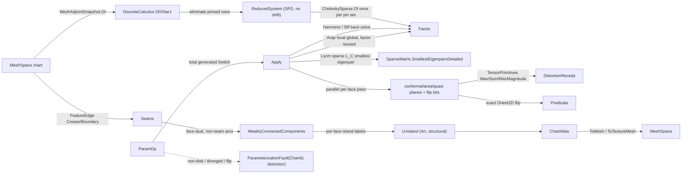

# [RASM_PARAMETERIZATION_FLATTEN]

The robust mesh parameterization / UV-flattening owner — ONE `ParamOp` `[Union]` (`Harmonic`/`Lscm`/`Arap`/`Bff`) folded by ONE `Flatten.Apply(ParamOp, Op? key = null)` that flattens a disk-topology chart into the plane by composing the `Rasm.Meshing` discrete-exterior-calculus substrate at its public boundary handle, never by re-assembling a mesh Laplacian. Every modality lowers the same `MeshAdjointSnapshot.Of(space)` `DiscreteCalculus` (the cotangent `D0`/`Star1` exterior-derivative and Hodge-star operators) into its own energy, and every pinned solve rides the ELIMINATE-BOUNDARY-ROWS reduced system: pinned DOFs LEAVE the system, the interior stiffness factors ONCE through the `matrix.md` `CholeskySparse` owner as a genuinely SPD operator, and constraints are satisfied EXACTLY with zero conditioning penalty — the diagonal-shift/penalty formulation whose κ scales with the penalty is the deleted conditioning-failure class, and `MassShift` died with it. `Harmonic` is the boundary-pinned Dirichlet solve (two back-substitutions through the one reduced factor); `Lscm` is spectral conformal parameterization — the conformal energy `L_C = L_D − 2A` assembled SPARSE (two cotangent stiffness blocks plus the boundary-edge area couplings) and its first non-trivial smallest eigenpair solved through the `matrix.md` `SparseMatrix.SmallestEigenpairsDetailed` LOBPCG lane, so the dense `(2n)²` operator and its `O((2n)³)` SVD are dead (10k vertices no longer cost 3.2 GB and 8·10¹² flops); `Arap` is the local-global alternation whose global step re-uses the ONE gauge-pinned reduced factor across every iteration and whose per-face assembly is O(F) with the loop cursor passed in (the `IndexOf` re-scan of all F faces per face per iteration is dead); `Bff` is the boundary-first flattening — the boundary curve integrates from prescribed geodesic curvature and the interior fills harmonically through the same reduced machinery.

The page owns `ChartId` (the `[ValueObject<int>]` the `GeometryFault.ParameterizationFault(ChartId, double)` 2432 payload names), the `ParamKind` discriminant, the pooled `ChartStore` working planes (fold-internal scratch under the arena law — never a published carrier), the typed `ChartAtlas` result whose members are ALL structurally equal (`Seq<UvIsland>` islands of `Arr`-typed vertices/faces/UVs — the raw-array reference-equality members that made the hash-friendly claim illusory are dead), and the `DistortionReceipt` evidence. Distortion scoring runs as a partition-disjoint parallel per-face pass (`ParallelHelper.For` struct action writing disjoint plane slots) and folds through vectorized `TensorPrimitives.Max`/`Sum` reductions over the per-face planes; the UV-flip verdict is the exact `Numerics/predicates#ROBUST_PREDICATES` `Predicate.Orient2D` sign per face; island labeling folds the FACE-DUAL — faces adjacent across a non-seam interior edge — into a QuikGraph `AdjacencyGraph<int, SEdge<int>>` and takes `WeaklyConnectedComponents`, so every face lands in exactly one island and seam vertices duplicate per island (wedge semantics — the vertex-labeled cut that dropped seam-straddling faces and the hand-rolled queue-BFS over an ad-hoc adjacency dictionary are both deleted forms). Every reachable failure routes the band-2400 union — admission-class defects as `DegenerateInput` 2400, parameterization defects as the typed `ParameterizationFault(chart, distortion)` 2432 — and the kernel computes no hash: the `ChartAtlas` is the hash-friendly carrier the `Spatial/reconciliation#RECONCILIATION_BRIDGE` `Encode` content-addresses through the `MeshSpace` UV projection. The mature `Mesh.cs` Rhino-delegated unwrap stays the host convenience rail; this owner is the kernel-quality conformal/ARAP/BFF solve, never a thinning of it.

## [01]-[INDEX]

- [01]-[PARAMETERIZATION]: `ChartId` fault payload; `ParamKind` discriminant; `ParamPolicy` validated row; `ParamOp` `[Union]` (`Harmonic`/`Lscm`/`Arap`/`Bff`) folded by ONE `Flatten.Apply`; the reduced-system elimination machinery over the `DiscreteCalculus` substrate with the pin-set-keyed cached `CholeskySparse` factor; the sparse LOBPCG conformal eigenpair; the O(F) ARAP alternation; the boundary-first integration; parallel `TensorPrimitives`-folded distortion scoring; QuikGraph island labeling; the structural `ChartAtlas` + `DistortionReceipt`.

## [02]-[PARAMETERIZATION]

- Owner: `ChartId` `[ValueObject<int>]` the chart identity the 2432 fault payload carries (`Whole` the pre-island canonical instance); `ParamKind` `[SmartEnum<string>]` the flattening-modality discriminant binding `ComparerAccessors.StringOrdinal` (`harmonic`/`lscm`/`arap`/`bff`) carrying the per-kind `Conformal`/`AreaPreserving`/`FreeBoundary`/`Iterative` columns; `ParamPolicy` the validated policy row registering `IValidityEvidence` — `ResidualTolerance` (the ARAP convergence band), `MaxIterations` (the ARAP outer budget), `EigenBudget` (the LOBPCG inner budget — a distinct iteration semantic, never one knob serving both), `SeamDihedralRadians` (the seam-cut classification threshold), `ParallelFloor` (the `minimumActionsPerThread` floor the distortion pass derives from) — the `MassShift` conditioning knob and the `FlipTolerance` escape hatch are DEAD (elimination makes the reduced system SPD without a shift; a flipped layout always faults typed, never ships behind a knob); `ChartStore` the pooled fold-internal working planes (`MemoryOwner<double>` U/V, `MemoryOwner<int>` per-face island labels, `MemoryOwner<double>` per-face conformal/area/quasi-conformal planes, `MemoryOwner<bool>` flip plane — deterministic dispose, single-writer, NEVER published; the `Dead`/`FreeList`/`Kill` slot-reuse apparatus is deleted — BFS labelling is the island former and no vertex slot is ever reclaimed); `UvIsland` the per-chart structural carrier (`ChartId` island identity — the ONE chart-identity type the 2432 fault also carries, never a parallel raw-int spelling — `Arr<int>` vertices, `Arr<(int A, int B, int C)>` faces, `Arr<Point2d>` UVs — LanguageExt structural equality, never reference-equal raw arrays); `ChartAtlas` the published result (`Source`, `Seq<UvIsland>` islands, `Seq<FeatureEdge>` seams, `DistortionReceipt`) with the `ToMesh`/`ToTextureMesh` projections; `DistortionReceipt` the typed energy evidence; `Flatten` the static surface.
- Cases: `ParamKind` rows `harmonic` · `lscm` · `arap` · `bff` (4); `ParamOp` cases `Harmonic(Chart, Option<Polyline> Boundary, Policy)` · `Lscm(Chart, Policy)` · `Arap(Chart, Policy)` · `Bff(Chart, Option<Arr<double>> TargetCurvature, Policy)` (4 — each case carries its chart, its constraint payload, and the policy row, so the entry discriminates on the value alone). No parallel `HarmonicMap`/`LscmSolver`/`ArapFlattener`/`BffFlattener` class family — one `[Union]` folded by one `Apply`.
- Entry: `public static Fin<ChartAtlas> Flatten.Apply(ParamOp op, Op? key = null)` — the ONE parameterization entrypoint; the admitted `MeshSpace` is NOT re-validated (admission happened once — the empty/non-finite re-checks the old `Admit` ran were the double-admission defect); the genuine parameterization gates fault typed: a non-disk chart (zero or multiple boundary loops for the pinned modalities) routes `ParameterizationFault(ChartId.Whole, 0.0)`, an ARAP alternation exhausting `MaxIterations` above `ResidualTolerance` routes `ParameterizationFault(ChartId.Whole, residual)` (the old silent return of a non-converged iterate is dead), a rank-deficient conformal operator routes `ParameterizationFault(ChartId.Whole, 0.0)`, a CLOSED chart (zero boundary loops) refuses the free-boundary modalities the same way (`Lscm`/`Arap` need a boundary to open — cut first), a faceless chart or malformed op payload — an invalid `ParamPolicy` (the `IValidityEvidence` row gates at entry), a degenerate caller pin polyline, a BFF turning prescription off the loop arity or non-finite — routes the admission-class `DegenerateInput` 2400, and a flipped UV triangle routes `ParameterizationFault(chartOf(flippedFace), maxConformal)` — the flip is always a refusal, never a knob-admitted layout. `ChartAtlas.ToMesh(Op?)` re-emits the source chart carrying the UV channel as texture coordinates; `ChartAtlas.ToTextureMesh(Op?)` re-emits the flattened islands as 2D geometry through the `MeshEdit` arena soup + freeze.
- Auto: modality dispatch is the union's TOTAL generated `Switch` — a new `ParamOp` case breaks `Apply` at compile time, never a runtime-missing table row or a case-restoring hard cast — and every arm lowers the SAME `MeshDec.Of` composition (the `MeshAdjointSnapshot.Of(space)` `DiscreteCalculus` handle, the `VectorIntent.Features` seam classification, the ORIENTED boundary-loop walk — loops emitted min-vertex-first so the pin ring is start-deterministic under the downstream content key) and differs only in the energy it lowers. The reduced machinery: `MeshDec.Reduced(pinned)` eliminates the pin set — interior DOFs re-index, the `D0`/`Star1` edge fold scatters interior-interior stiffness triplets and collects interior↔pinned couplings as rhs contributions, and `CholeskySparse.Of` factors the genuinely SPD interior operator ONCE per pin set (a one-slot memo keyed on the pin set; the boundary-pin factor back-substitutes both channels, `Arap` re-uses its gauge-pin factor across every iteration, and a pin-set change re-factors through `CholeskySparse.Of` — the ONE matrix owner, never a raw provider re-factorization). `Harmonic` pins the loop to the unit circle or a caller polyline resampled by arc length and back-substitutes two channels. `Lscm` assembles the SPARSE conformal operator `L_C = L_D − 2A` (two stiffness diagonal blocks off the SAME edge fold + four symmetrized ±½ area couplings per oriented boundary half-edge) and solves `SmallestEigenpairsDetailed(k: 3, ResidualTolerance, EigenBudget)` — the first pair past the two trivial constant modes is the free-boundary conformal map (spectral conformal parameterization), its eigenvalue the conformal-energy residual the receipt records. `Arap` seeds from `Lscm`, then alternates the LOCAL per-face polar rotation fit and the GLOBAL Poisson solve through the cached gauge-pin factor, `RotatedGradient` passing the in-scope face cursor `f` into the accumulation (O(F) per iteration), and the per-iteration displacement folds through `TensorPrimitives.Subtract` + `MaxMagnitude` over the U/V planes. `Bff` integrates the boundary curve from prescribed geodesic curvature (default the uniform disk turning `2π/n`; steps sized by original boundary edge lengths; the closure gap distributed linearly so the loop closes) and fills the interior harmonically through the boundary-pin factor. `Assemble` scores distortion in ONE partition-disjoint parallel per-face pass (Jacobian singular values → conformal `σ₁/σ₂`, area `σ₁·σ₂`, quasi-conformal `(σ₁−σ₂)/(σ₁+σ₂)`, exact `Orient2D` flip bit — disjoint plane slots; it packs NOTHING — UV-island layout is the Fabrication nesting owner's), folds the receipt through `TensorPrimitives.Max`/`Sum`/`MaxMagnitude` over the planes, labels islands through QuikGraph `WeaklyConnectedComponents` over the FACE-DUAL graph (faces adjacent across a non-seam interior edge — every face lands in exactly one island, seam vertices duplicate per island), and refuses any flip typed.
- Receipt: `Apply` carries a `DistortionReceipt` — `MaxConformal`/`MeanConformal`, `MaxArea`/`MeanArea`, `MaxQuasiConformal`, `Iterations` (ARAP outer count; the LOBPCG inner count for `Lscm`; `1` for the direct solves), `Residual` (final ARAP displacement or the conformal eigenvalue), `FactorNonZeros` (the ACTUAL `CholeskySparse.FactorNonZeros` factor fill — the `D1.NonZeros` wrong-operator readout is dead; `0` on the factorless eigen path), `FlipFreeBijective` (the exact-`Orient2D` verdict, `true` on every emitted atlas because a flip refuses) — never a generic ledger; the distortion triple IS the evidence the `Rasm.Fabrication` nesting strain gate reads.
- Packages: `Rasm.Meshing` (`MeshSpace`, `MeshAdjointSnapshot.Of` → the `Rasm.Numerics` `DiscreteCalculus` public DEC handle — never the internal `IntrinsicMesh`/`LaplacianCache`), `Rasm.Processing` (`FeatureEdge`/`MeshFeatureKind` seam source), `Rhino.Geometry` (`Point3d`/`Point2d`/`Vector3d`), `Rasm.Numerics` `Numerics/matrix` (`SparseMatrix.FromTriplets`/`SmallestEigenpairsDetailed` the LOBPCG lane, `CholeskySparse.Of`/`SolveDetailed`/`FactorNonZeros` the reduced direct factor — the ONE `matrix.md` owner law: every dense/sparse/eigen solve routes these owners, never a raw MathNet/CSparse call), `Rasm.Numerics` (`Predicate.Orient2D`/`Sign` the exact flip floor), `Rasm.Meshing` (`MeshEdit` soup + freeze for `ToTextureMesh`), QuikGraph (`AdjacencyGraph<int, SEdge<int>>` + `AlgorithmExtensions.WeaklyConnectedComponents` — the island former), System.Numerics.Tensors (`TensorPrimitives.Max`/`Sum`/`MaxMagnitude`/`Subtract` — the vectorized distortion and residual folds over raw-`double` planes), CommunityToolkit.HighPerformance (`MemoryOwner<T>` pooled planes, `ParallelHelper.For` + `IAction` the distortion pass), Rasm.Domain (`Context`/`Op`/`Kind`/`IValidityEvidence`/`ValidityClaim`), Thinktecture.Runtime.Extensions, LanguageExt.Core, BCL inbox.
- Growth: a new flattening modality (spectral conformal with cone singularities, a Yamabe flow, a seamless global parameterization) is one `ParamKind` row + one `ParamOp` case + one generated-`Switch` arm lowering the SAME `DiscreteCalculus` substrate and reduced machinery (the new case breaks `Apply` at compile time until its arm lands); a new distortion measure is one pooled plane + one `DistortionReceipt` field folded by the same `TensorPrimitives` pass; a new constraint mode (a hard cone vertex, a packing target) is one `ParamPolicy` column or one op-case payload; a new seam source is one `MeshFeatureKind` row the cut reads; zero new surface.
- Boundary: the parameterization is the ONE polymorphic `ParamOp` `[Union]` and a sibling flattener-class family is the named density defect; every solve COMPOSES the `matrix.md` owners (`CholeskySparse`, `SparseMatrix`, the LOBPCG lane) and a raw `CSparse.Double.Factorization.SparseCholesky.Create` or MathNet `Matrix<double>.Svd()` call is the named lower-level-reinvention defect — the DENSE `(2n)²` conformal operator + `DecomposeSvd` this rebuild killed was exactly that class (non-scalable memory and flops beside a sparse eigensolver the substrate already owns); pinned constraints ELIMINATE — the penalty/shift formulation is the rejected conditioning-failure class (κ scales with the penalty; the reduced interior operator is SPD by construction); the DEC substrate is reached ONLY through the public `MeshAdjointSnapshot.Of` handle and a Geometry-side cotangent re-assembly or a reach into the internal `LaplacianCache` is the named boundary violation; the UV-flip verdict is the exact `Predicate.Orient2D` sign and a float signed-area band is the named precision-loss defect; the seam cut composes the `segment.md` `FeatureEdge` classification and a domain-local dihedral detector is the deleted double-owner form; island labeling rides QuikGraph `WeaklyConnectedComponents` over the face-dual and BOTH a hand-rolled queue-BFS over an ad-hoc adjacency dictionary AND a vertex-labeled cut that drops seam-straddling faces are deleted forms (the QuikGraph `[LOCAL_ADMISSION]` names the first, the region-preservation law the second); the published `ChartAtlas` carries ONLY structurally-equal members (`Seq`/`Arr`) and a raw-array record member comparing by reference is the deleted illusory-equality form; the `ChartStore` planes are fold-internal single-writer scratch under the corpus arena law (pooled, disposed, never hashed, never published); `Apply` is total over the `Fin` rail and a thrown exception on a non-disk chart or a diverged solve is forbidden — parameterization defects route the typed `ParameterizationFault(ChartId, double)` 2432 payload; the result is the hash-friendly carrier the reconciliation `Encode` content-addresses and this owner mints NO second hash; the flattening preserves capability — a seam cut splits a chart into islands rather than discarding a region.

```csharp signature
// --- [RUNTIME_PRELUDE] --------------------------------------------------------------------
using System;
using System.Collections.Generic;
using System.Linq;
using System.Numerics.Tensors;
using System.Runtime.InteropServices;
using CommunityToolkit.HighPerformance.Buffers;
using CommunityToolkit.HighPerformance.Helpers;
using LanguageExt;
using QuikGraph;
using QuikGraph.Algorithms;
using Rasm.Domain;
using Rasm.Meshing;
using Rasm.Numerics;
using Rhino.Geometry;
using Thinktecture;
using static LanguageExt.Prelude;
// CS0104 guard: LanguageExt.HashSet collides with the BCL name under the dual usings.
using EdgeKeySet = System.Collections.Generic.HashSet<(int, int)>;
using IndexSet = System.Collections.Generic.HashSet<int>;
using Dimension = Rasm.Numerics.Dimension;

namespace Rasm.Processing;

// --- [TYPES] ------------------------------------------------------------------------------
// The 2432 fault payload identity: ParameterizationFault(ChartId, double) names the diverging chart.
[ValueObject<int>(KeyMemberName = "Value", KeyMemberAccessModifier = AccessModifier.Public)]
public readonly partial struct ChartId {
    // Pre-island canonical: the defect names the whole chart; island labels are >= 0, so Whole never
    // collides with a labeled island id.
    public static readonly ChartId Whole = Create(-1);
}

[SmartEnum<string>]
[KeyMemberEqualityComparer<ComparerAccessors.StringOrdinal, string>]
[KeyMemberComparer<ComparerAccessors.StringOrdinal, string>]
public sealed partial class ParamKind {
    public static readonly ParamKind Harmonic = new("harmonic", conformal: true, areaPreserving: false, freeBoundary: false, iterative: false);
    public static readonly ParamKind Lscm     = new("lscm", conformal: true, areaPreserving: false, freeBoundary: true, iterative: false);
    public static readonly ParamKind Arap     = new("arap", conformal: false, areaPreserving: true, freeBoundary: true, iterative: true);
    public static readonly ParamKind Bff      = new("bff", conformal: true, areaPreserving: false, freeBoundary: true, iterative: false);

    public bool Conformal { get; }
    public bool AreaPreserving { get; }
    public bool FreeBoundary { get; }
    public bool Iterative { get; }
}

// --- [CONSTANTS] --------------------------------------------------------------------------
// MassShift is DEAD (elimination makes the reduced system SPD); FlipTolerance is DEAD (a flip always faults).
public sealed record ParamPolicy(double ResidualTolerance, int MaxIterations, int EigenBudget, double SeamDihedralRadians, int ParallelFloor) : IValidityEvidence {
    public static readonly ParamPolicy Canonical =
        new(ResidualTolerance: 1e-8, MaxIterations: 64, EigenBudget: 200, SeamDihedralRadians: Math.PI / 6.0, ParallelFloor: 4_096);

    public bool IsValid => ValidityClaim.All(
        ValidityClaim.Positive(value: ResidualTolerance),
        ValidityClaim.CountAtLeast(count: MaxIterations, floor: 1),
        ValidityClaim.CountAtLeast(count: EigenBudget, floor: 1),
        ValidityClaim.Of(SeamDihedralRadians is > 0.0 and < Math.PI),
        ValidityClaim.CountAtLeast(count: ParallelFloor, floor: 1));
}

// --- [MODELS] -----------------------------------------------------------------------------
// Fold-internal single-writer working planes under the corpus arena law: pooled, disposed, never
// published, never hashed. Dead/FreeList slot reuse is deleted — labelling never reclaims a slot.
public sealed class ChartStore : IDisposable {
    readonly MemoryOwner<double> u, v;
    readonly MemoryOwner<int> chart;
    readonly MemoryOwner<double> conformal, area, quasiConformal;
    readonly MemoryOwner<bool> flip;

    ChartStore(int vertices, int faces) {
        u = MemoryOwner<double>.Allocate(vertices, AllocationMode.Clear);
        v = MemoryOwner<double>.Allocate(vertices, AllocationMode.Clear);
        chart = MemoryOwner<int>.Allocate(faces, AllocationMode.Clear);   // per-FACE island labels
        conformal = MemoryOwner<double>.Allocate(faces, AllocationMode.Clear);
        area = MemoryOwner<double>.Allocate(faces, AllocationMode.Clear);
        quasiConformal = MemoryOwner<double>.Allocate(faces, AllocationMode.Clear);
        flip = MemoryOwner<bool>.Allocate(faces, AllocationMode.Clear);
    }

    public static ChartStore Allocate(int vertices, int faces) => new(vertices, faces);

    public Memory<double> U => u.Memory;
    public Memory<double> V => v.Memory;
    public Span<int> Chart => chart.Span;
    public Memory<double> Conformal => conformal.Memory;
    public Memory<double> Area => area.Memory;
    public Memory<double> QuasiConformal => quasiConformal.Memory;
    public Memory<bool> Flip => flip.Memory;
    public Point2d At(int vertex) => new(u.Span[vertex], v.Span[vertex]);

    public void Dispose() { u.Dispose(); v.Dispose(); chart.Dispose(); conformal.Dispose(); area.Dispose(); quasiConformal.Dispose(); flip.Dispose(); }
}

// Structural equality throughout: Arr members, never reference-equal raw arrays; the chart identity
// is the ONE ChartId type the 2432 fault also carries — never a parallel raw-int spelling.
public sealed record UvIsland(ChartId Chart, Arr<int> Vertices, Arr<(int A, int B, int C)> Faces, Arr<Point2d> Uv);

public sealed record DistortionReceipt(
    double MaxConformal,
    double MeanConformal,
    double MaxArea,
    double MeanArea,
    double MaxQuasiConformal,
    int Iterations,
    double Residual,
    int FactorNonZeros,
    bool FlipFreeBijective);

public sealed record ChartAtlas(MeshSpace Source, Seq<UvIsland> Islands, Seq<FeatureEdge> Seams, DistortionReceipt Receipt) {
    // UV channel onto the source topology — the texture projection the AppUi lane reads. Source
    // topology carries ONE coordinate per vertex, so a shared seam vertex takes its last island's UV;
    // wedge-faithful output is ToTextureMesh.
    public Fin<MeshSpace> ToMesh(Op? key = null) {
        Mesh native = Source.DuplicateNative();
        foreach (UvIsland island in Islands) {
            for (int i = 0; i < island.Vertices.Count; i++) {
                native.TextureCoordinates.SetTextureCoordinate(island.Vertices[i], new Point2f((float)island.Uv[i].X, (float)island.Uv[i].Y));
            }
        }
        return MeshSpace.Of(native, Source.Tolerance, key: key);
    }

    // Flattened islands as 2D geometry — arena soup + freeze, never a hand-built native mesh. The
    // remap is per-ISLAND: a seam vertex shared by two islands duplicates, which IS the cut.
    public Fin<MeshSpace> ToTextureMesh(Op? key = null) {
        List<Point3d> vertices = new();
        List<(int A, int B, int C)> faces = new();
        foreach (UvIsland island in Islands) {
            Dictionary<int, int> remap = new(island.Vertices.Count);
            for (int i = 0; i < island.Vertices.Count; i++) {
                remap[island.Vertices[i]] = vertices.Count;
                vertices.Add(new Point3d(island.Uv[i].X, island.Uv[i].Y, 0.0));
            }
            foreach ((int a, int b, int c) in island.Faces) faces.Add((remap[a], remap[b], remap[c]));
        }
        MeshEdit edit = MeshEdit.Of(CollectionsMarshal.AsSpan(vertices), CollectionsMarshal.AsSpan(faces));
        try { return edit.ToSpace(Source.Tolerance, key); }
        finally { edit.Dispose(); }
    }
}

// --- [OPERATIONS] -------------------------------------------------------------------------
[Union(ConversionFromValue = ConversionOperatorsGeneration.None)]
public abstract partial record ParamOp {
    private ParamOp() { }

    public sealed record Harmonic(MeshSpace Chart, Option<Polyline> Boundary, ParamPolicy Policy) : ParamOp;
    public sealed record Lscm(MeshSpace Chart, ParamPolicy Policy) : ParamOp;
    public sealed record Arap(MeshSpace Chart, ParamPolicy Policy) : ParamOp;
    public sealed record Bff(MeshSpace Chart, Option<Arr<double>> TargetCurvature, ParamPolicy Policy) : ParamOp;

    public ParamKind Kind =>
        Switch(
            harmonic: static _ => ParamKind.Harmonic,
            lscm:     static _ => ParamKind.Lscm,
            arap:     static _ => ParamKind.Arap,
            bff:      static _ => ParamKind.Bff);

    public MeshSpace Chart =>
        Switch(
            harmonic: static h => h.Chart, lscm: static l => l.Chart,
            arap:     static a => a.Chart, bff:  static b => b.Chart);

    public ParamPolicy Policy =>
        Switch(
            harmonic: static h => h.Policy, lscm: static l => l.Policy,
            arap:     static a => a.Policy, bff:  static b => b.Policy);
}

public static class Flatten {
    // Modality dispatch is the union's TOTAL generated Switch: a new ParamOp case breaks Apply at
    // compile time — the kind-keyed dictionary whose missing row compiled silently (and whose rows
    // hard-cast the op back to its case) is the deleted form.
    public static Fin<ChartAtlas> Apply(ParamOp op, Op? key = null) {
        Op token = key.OrDefault();
        if (!op.Policy.IsValid) {
            return Fin.Fail<ChartAtlas>(new GeometryFault.DegenerateInput(Kind.Mesh, -1, "parameterization: invalid policy").ToError());
        }
        return MeshDec.Of(op.Chart, op.Policy, token).Bind(dec =>
            op.Switch(
                state: (Dec: dec, Key: token),
                harmonic: static (s, h) => FlattenHarmonic(h, s.Dec, s.Key),
                lscm:     static (s, l) => FlattenLscm(s.Dec, l.Policy, s.Key),
                arap:     static (s, a) => FlattenArap(s.Dec, a.Policy, s.Key),
                bff:      static (s, b) => FlattenBff(b, s.Dec, s.Key))
            .Bind(solved => Assemble(solved, op, dec, token)));
    }

    // --- [FLATTEN]
    static Fin<Solved> FlattenHarmonic(ParamOp.Harmonic op, MeshDec dec, Op key) =>
        dec.Disk().Bind(loop => Pins(op.Boundary, loop.Length).Bind(pinned =>
            dec.Reduced(loop, key).Bind(system =>
                from solvedU in system.Solve(k => pinned[k].X, key)
                from solvedV in system.Solve(k => pinned[k].Y, key)
                select Scattered(system, loop, pinned, solvedU, solvedV, iterations: 1, residual: 0.0))));

    // Pin admission: a caller polyline with under two points or zero length cannot resample — the
    // admission-class refusal, never a garbage pin ring.
    static Fin<Point2d[]> Pins(Option<Polyline> boundary, int count) =>
        boundary.Match(
            Some: b => b.Count >= 2 && b.Length > 0.0
                ? Fin.Succ(Resample(b, count))
                : Fin.Fail<Point2d[]>(new GeometryFault.DegenerateInput(Kind.Curve, b.Count, "harmonic pin: degenerate boundary polyline").ToError()),
            None: () => Fin.Succ(UnitCircle(count)));

    // Spectral conformal parameterization: SPARSE L_C = L_D − 2A, smallest non-trivial eigenpair via
    // the matrix.md LOBPCG lane — the dense (2n)² operator + SVD is the deleted non-scalable form.
    const int GaugeModes = 2;

    static Fin<Solved> FlattenLscm(MeshDec dec, ParamPolicy policy, Op key) =>
        dec.Loops.Length == 0
            // Closed chart: the free-boundary conformal energy has no boundary to open — cut first.
            ? Fin.Fail<Solved>(new GeometryFault.ParameterizationFault(ChartId.Whole, 0.0).ToError())
            : SparseMatrix.FromTriplets(Dimension.Create(2 * dec.VertexCount), Dimension.Create(2 * dec.VertexCount), dec.ConformalTriplets(), key)
                .Bind(conformal => conformal.SmallestEigenpairsDetailed(k: GaugeModes + 1, tolerance: policy.ResidualTolerance, maxIterations: policy.EigenBudget, key: key))
                .Bind(eigen => eigen.Pairs.Count > GaugeModes
                    ? Fin.Succ(SplitComplex(dec, eigen.Pairs[GaugeModes], eigen.Iterations.IfNone(0)))
                    : Fin.Fail<Solved>(new GeometryFault.ParameterizationFault(ChartId.Whole, 0.0).ToError()));

    // Local-global alternation as one Fin fold: the global step re-uses the ONE gauge-pinned reduced
    // factor every iteration, a converged state short-circuits, and a budget exhausted above tolerance
    // faults typed — never a silently non-converged iterate.
    static Fin<Solved> FlattenArap(MeshDec dec, ParamPolicy policy, Op key) =>
        FlattenLscm(dec, policy, key).Bind(seed => {
            int[] gauge = [dec.Anchor];
            return dec.Reduced(gauge, key).Bind(system => {
                using MemoryOwner<double> scratch = MemoryOwner<double>.Allocate(dec.VertexCount, AllocationMode.Clear);
                return Range(0, policy.MaxIterations)
                    .Fold(
                        Fin.Succ((U: seed.U, V: seed.V, Iterations: 0, Residual: double.PositiveInfinity)),
                        (acc, _) => acc.Bind(state => state.Residual <= policy.ResidualTolerance ? Fin.Succ(state) : Step(state)))
                    .Bind(state => state.Residual <= policy.ResidualTolerance
                        ? Fin.Succ(new Solved(state.U, state.V, state.Iterations, state.Residual, system.FactorNonZeros))
                        : Fin.Fail<Solved>(new GeometryFault.ParameterizationFault(ChartId.Whole, state.Residual).ToError()));

                Fin<(double[] U, double[] V, int Iterations, double Residual)> Step((double[] U, double[] V, int Iterations, double Residual) state) {
                    Matrix2[] rotations = dec.LocalRotations(state.U, state.V);
                    return from solvedU in system.SolveWith(dec.RotatedGradient(rotations, axis: 0), k => state.U[gauge[k]], key)
                           from solvedV in system.SolveWith(dec.RotatedGradient(rotations, axis: 1), k => state.V[gauge[k]], key)
                           let nextU = system.Scatter(gauge, k => state.U[gauge[k]], solvedU)
                           let nextV = system.Scatter(gauge, k => state.V[gauge[k]], solvedV)
                           select (U: nextU, V: nextV, Iterations: state.Iterations + 1,
                                   Residual: MaxDelta(state.U, nextU, state.V, nextV, scratch.Span));
                }
            });
        });

    // Boundary-first: the boundary curve integrates from prescribed geodesic curvature (uniform disk
    // turning by default; steps sized by original edge lengths; closure gap distributed), the interior
    // fills harmonically through the SAME reduced machinery.
    static Fin<Solved> FlattenBff(ParamOp.Bff op, MeshDec dec, Op key) =>
        dec.Disk().Bind(loop => {
            Arr<double> target = op.TargetCurvature.IfNone(() => new Arr<double>([.. Enumerable.Repeat(2.0 * Math.PI / loop.Length, loop.Length)]));
            // Prescription admission: one finite turning row per boundary vertex — a short, long, or
            // non-finite prescription refuses instead of indexing past the loop.
            return target.Count != loop.Length || !target.ForAll(static t => ValidityClaim.Finite(value: t))
                ? Fin.Fail<Solved>(new GeometryFault.DegenerateInput(Kind.Mesh, target.Count, "bff turning prescription: finite, one row per boundary vertex").ToError())
                : dec.Reduced(loop, key).Bind(system => {
                    Point2d[] curve = dec.IntegrateBoundary(loop, target);
                    return from solvedU in system.Solve(k => curve[k].X, key)
                           from solvedV in system.Solve(k => curve[k].Y, key)
                           select Scattered(system, loop, curve, solvedU, solvedV, iterations: 1, residual: 0.0);
                });
        });

    static Solved Scattered(ReducedSystem system, int[] loop, Point2d[] pinned, Arr<double> solvedU, Arr<double> solvedV, int iterations, double residual) {
        double[] u = system.Scatter(loop, k => pinned[k].X, solvedU);
        double[] v = system.Scatter(loop, k => pinned[k].Y, solvedV);
        return new Solved(u, v, iterations, residual, system.FactorNonZeros);
    }

    static Solved SplitComplex(MeshDec dec, (double Eigenvalue, Arr<double> Eigenvector) pair, int iterations) {
        int n = dec.VertexCount;
        double[] u = new double[n];
        double[] v = new double[n];
        for (int i = 0; i < n; i++) { u[i] = pair.Eigenvector[i]; v[i] = pair.Eigenvector[n + i]; }
        return new Solved(u, v, iterations, pair.Eigenvalue, FactorNonZeros: 0);   // eigen path holds no Cholesky factor
    }

    // --- [SCORE_AND_ASSEMBLE]
    // Assemble scores, labels, and refuses — it packs NOTHING: UV-island layout packing is the
    // Fabrication nesting owner's concern, never a kernel arm.
    static Fin<ChartAtlas> Assemble(Solved solved, ParamOp op, MeshDec dec, Op key) {
        using ChartStore store = ChartStore.Allocate(dec.VertexCount, dec.FaceCount);
        solved.U.CopyTo(store.U.Span);
        solved.V.CopyTo(store.V.Span);
        ParallelHelper.For(0, dec.FaceCount, new DistortionPass(dec, store.U, store.V, store.Conformal, store.Area, store.QuasiConformal, store.Flip), op.Policy.ParallelFloor);
        Seq<UvIsland> islands = Islands(store, dec);
        DistortionReceipt receipt = Fold(store, dec, solved);
        int flipped = store.Flip.Span.IndexOf(true);
        return flipped < 0
            ? Fin.Succ(new ChartAtlas(op.Chart, islands, dec.Seams, receipt))
            : Fin.Fail<ChartAtlas>(new GeometryFault.ParameterizationFault(ChartId.Create(store.Chart[flipped]), receipt.MaxConformal).ToError());
    }

    // Partition-disjoint per-face pass: distortion triple + exact Orient2D flip bit into disjoint slots.
    readonly struct DistortionPass(MeshDec dec, ReadOnlyMemory<double> u, ReadOnlyMemory<double> v, Memory<double> conformal, Memory<double> area, Memory<double> quasi, Memory<bool> flip) : IAction {
        public void Invoke(int f) {
            (int a, int b, int c) = dec.Face(f);
            (Point2d ua, Point2d ub, Point2d uc) = (At(a), At(b), At(c));
            (double s1, double s2) = dec.JacobianSingularValues(f, ua, ub, uc);
            conformal.Span[f] = s2 == 0.0 ? double.PositiveInfinity : s1 / s2;
            area.Span[f] = s1 * s2;
            quasi.Span[f] = (s1 + s2) == 0.0 ? 1.0 : (s1 - s2) / (s1 + s2);
            flip.Span[f] = Predicate.Orient2D(Lift(ua), Lift(ub), Lift(uc)) == Sign.Negative;

            Point2d At(int vertex) => new(u.Span[vertex], v.Span[vertex]);
            static Point3d Lift(Point2d p) => new(p.X, p.Y, 0.0);
        }
    }

    // Vectorized receipt fold over the per-face planes — the scalar for+Math.Max element loop is dead.
    static DistortionReceipt Fold(ChartStore store, MeshDec dec, Solved solved) {
        int n = Math.Max(1, dec.FaceCount);
        ReadOnlySpan<double> c = store.Conformal.Span, a = store.Area.Span, q = store.QuasiConformal.Span;
        return new DistortionReceipt(
            MaxConformal: TensorPrimitives.Max(c), MeanConformal: TensorPrimitives.Sum(c) / n,
            MaxArea: TensorPrimitives.Max(a), MeanArea: TensorPrimitives.Sum(a) / n,
            MaxQuasiConformal: TensorPrimitives.MaxMagnitude(q),
            Iterations: solved.Iterations, Residual: solved.Residual, FactorNonZeros: solved.FactorNonZeros,
            FlipFreeBijective: !store.Flip.Span.Contains(true));
    }

    // Island former: FACES adjacent across a non-seam interior edge fold into ONE QuikGraph face-dual
    // and WeaklyConnectedComponents labels charts — every face lands in exactly one island (a
    // vertex-labeled cut drops seam-straddling faces), seam vertices belong to every island whose
    // faces touch them (wedge semantics), and ONE bucketing pass assembles every island — the
    // per-chart full-face re-scan (O(islands × F)) and the hand-rolled queue-BFS are deleted forms.
    static Seq<UvIsland> Islands(ChartStore store, MeshDec dec) {
        AdjacencyGraph<int, SEdge<int>> dual = new(allowParallelEdges: false);
        dual.AddVertexRange(Enumerable.Range(0, dec.FaceCount));
        foreach (((int u, int v), int faceA, int faceB) in dec.InteriorEdges()) {
            if (!dec.IsSeamEdge(u, v)) dual.AddEdge(new SEdge<int>(faceA, faceB));   // one arc: weak components ignore direction
        }
        Dictionary<int, int> label = new(dec.FaceCount);
        int count = dual.WeaklyConnectedComponents(label);
        List<int>[] vertices = new List<int>[count];
        List<(int A, int B, int C)>[] faces = new List<(int A, int B, int C)>[count];
        IndexSet[] seen = new IndexSet[count];
        for (int chart = 0; chart < count; chart++) { vertices[chart] = []; faces[chart] = []; seen[chart] = []; }
        for (int f = 0; f < dec.FaceCount; f++) {
            int chart = label[f];
            store.Chart[f] = chart;
            (int a, int b, int c) = dec.Face(f);
            faces[chart].Add((a, b, c));
            if (seen[chart].Add(a)) vertices[chart].Add(a);
            if (seen[chart].Add(b)) vertices[chart].Add(b);
            if (seen[chart].Add(c)) vertices[chart].Add(c);
        }
        return toSeq(Enumerable.Range(0, count).Select(chart =>
            new UvIsland(ChartId.Create(chart), toArr(vertices[chart]), toArr(faces[chart]), toArr(vertices[chart].Select(store.At))))).Strict();
    }

    // --- [PRIMITIVES]
    static Point2d[] UnitCircle(int count) =>
        [.. Enumerable.Range(0, count).Select(i => { double t = 2.0 * Math.PI * i / count; return new Point2d(Math.Cos(t), Math.Sin(t)); })];

    // Polyline evaluates on the segment parameter (integer = vertex, fraction = within segment);
    // the cumulative-length table inverts arc length onto that parameter — Polyline carries no
    // length-parameterized evaluator of its own.
    static Point2d[] Resample(Polyline boundary, int count) {
        double[] cumulative = new double[boundary.Count];
        for (int v = 1; v < boundary.Count; v++) cumulative[v] = cumulative[v - 1] + boundary[v - 1].DistanceTo(boundary[v]);
        double step = cumulative[^1] / count;
        return [.. Enumerable.Range(0, count).Select(i => {
            double target = i * step;
            int hit = Array.BinarySearch(cumulative, target);
            int segment = Math.Min(hit >= 0 ? hit : ~hit - 1, boundary.Count - 2);
            double span = cumulative[segment + 1] - cumulative[segment];
            Point3d p = boundary.PointAt(segment + (span > 0.0 ? (target - cumulative[segment]) / span : 0.0));
            return new Point2d(p.X, p.Y);
        })];
    }

    // Per-iteration displacement: |Δu| ∪ |Δv| folded by ONE vectorized pass per plane.
    static double MaxDelta(double[] u, double[] nextU, double[] v, double[] nextV, Span<double> scratch) {
        TensorPrimitives.Subtract(nextU, u, scratch[..u.Length]);
        double du = TensorPrimitives.MaxMagnitude(scratch[..u.Length]);
        TensorPrimitives.Subtract(nextV, v, scratch[..v.Length]);
        return Math.Max(du, TensorPrimitives.MaxMagnitude(scratch[..v.Length]));
    }
}

// --- [COMPOSITION] ------------------------------------------------------------------------
file readonly record struct Solved(double[] U, double[] V, int Iterations, double Residual, int FactorNonZeros);

file readonly record struct Matrix2(double M00, double M01, double M10, double M11);

// Eliminated pinned system: interior DOFs re-index, interior↔pinned stiffness entries become rhs
// couplings, and the interior operator factors ONCE as genuinely SPD — no shift, exact constraints.
file sealed record ReducedSystem(CholeskySparse Factor, int[] Map, (int Interior, int PinnedSlot, double Weight)[] Couplings, int InteriorCount) {
    public int FactorNonZeros => Factor.FactorNonZeros;

    public Fin<Arr<double>> Solve(Func<int, double> pinnedValue, Op key) {
        double[] rhs = new double[InteriorCount];
        foreach ((int i, int slot, double w) in Couplings) rhs[i] += w * pinnedValue(slot);
        return Factor.SolveDetailed(new Arr<double>(rhs), key).Map(static receipt => receipt.Solution);
    }

    // ARAP form: a source term lands on interior slots BEFORE the pinned couplings fold in.
    public Fin<Arr<double>> SolveWith(double[] source, Func<int, double> pinnedValue, Op key) {
        double[] rhs = new double[InteriorCount];
        for (int vertex = 0; vertex < Map.Length; vertex++) { if (Map[vertex] >= 0) rhs[Map[vertex]] = source[vertex]; }
        foreach ((int i, int slot, double w) in Couplings) rhs[i] += w * pinnedValue(slot);
        return Factor.SolveDetailed(new Arr<double>(rhs), key).Map(static receipt => receipt.Solution);
    }

    public double[] Scatter(int[] pinned, Func<int, double> pinnedValue, Arr<double> interior) {
        double[] full = new double[Map.Length];
        for (int vertex = 0; vertex < Map.Length; vertex++) { if (Map[vertex] >= 0) full[vertex] = interior[Map[vertex]]; }
        for (int k = 0; k < pinned.Length; k++) full[pinned[k]] = pinnedValue(k);
        return full;
    }
}

// The fold-internal composition capsule: the public DEC handle, the seam classification, the oriented
// boundary loops, and the pin-set-keyed reduced-factor memo. Never a cross-page surface.
file sealed class MeshDec {
    public readonly DiscreteCalculus Calculus;
    public readonly int VertexCount;
    public readonly int FaceCount;
    public readonly int[][] Loops;               // oriented boundary loops from face winding
    public readonly Seq<FeatureEdge> Seams;
    readonly Mesh native;
    readonly EdgeKeySet seamEdges;
    (int[] Pins, ReducedSystem System)? reduced;  // one-slot pin-set memo: both channels and every ARAP iteration re-read one factor

    MeshDec(DiscreteCalculus calculus, Mesh native, int[][] loops, Seq<FeatureEdge> seams, EdgeKeySet seamEdges) {
        (Calculus, this.native, Loops, Seams, this.seamEdges) = (calculus, native, loops, seams, seamEdges);
        (VertexCount, FaceCount) = (native.Vertices.Count, native.Faces.Count);
    }

    public static Fin<MeshDec> Of(MeshSpace chart, ParamPolicy policy, Op key) =>
        from snapshot in MeshAdjointSnapshot.Of(chart, key)
        // Faceless-chart gate off the snapshot counts: a zero-face chart would crash the empty-span
        // TensorPrimitives reductions downstream — the admission-class refusal fires here instead.
        from _ in guard(snapshot.FaceCount > 0, new GeometryFault.DegenerateInput(Kind.Mesh, snapshot.FaceCount, "parameterization: faceless chart").ToError()).ToFin()
        from featurePolicy in MeshFeaturePolicy.Of(dihedralRadians: policy.SeamDihedralRadians, space: chart, faceRegions: Option<Arr<int>>.None, key: key)
        from intent in VectorIntent.Features(chart, featurePolicy, key)
        from features in intent.Project<FeatureReceipt>(chart.Tolerance, key)
        let native = chart.DuplicateNative()
        // Seams = the CUT set (crease/boundary) — the atlas publishes exactly what separated islands.
        let seams = features.Edges.Filter(static e => e.Kind.Equals(MeshFeatureKind.Crease) || e.Kind.Equals(MeshFeatureKind.Boundary))
        let seamEdges = seams.Map(static e => Order(e.A, e.B)).ToHashSet()
        select new MeshDec(snapshot.Calculus, native, BoundaryLoops(native), seams, seamEdges);

    public int Anchor => Loops.Length > 0 ? Loops[0][0] : 0;   // the ARAP gauge pin

    // Disk gate: the pinned modalities demand exactly ONE boundary loop — the parameterization-shaped fault.
    public Fin<int[]> Disk() =>
        Loops.Length == 1 && Loops[0].Length >= 3
            ? Fin.Succ(Loops[0])
            : Fin.Fail<int[]>(new GeometryFault.ParameterizationFault(ChartId.Whole, 0.0).ToError());

    // ELIMINATE-BOUNDARY-ROWS: interior-interior triplets + interior↔pinned couplings off the ONE
    // D0/Star1 edge fold; the reduced operator is SPD (no shift) and factors once per pin set.
    public Fin<ReducedSystem> Reduced(int[] pinned, Op key) {
        if (reduced is { } hit && hit.Pins.AsSpan().SequenceEqual(pinned)) return Fin.Succ(hit.System);
        Dictionary<int, int> slot = new(pinned.Length);
        for (int k = 0; k < pinned.Length; k++) slot[pinned[k]] = k;
        int[] map = new int[VertexCount];
        int interior = 0;
        for (int vertex = 0; vertex < VertexCount; vertex++) map[vertex] = slot.ContainsKey(vertex) ? -1 : interior++;
        List<(int Row, int Col, double Value)> triplets = new();
        List<(int Interior, int PinnedSlot, double Weight)> couplings = new();
        double[] diagonal = new double[interior];
        foreach ((int i, int j, double w) in StiffnessEdges()) {
            (int ri, int rj) = (map[i], map[j]);
            if (ri >= 0) diagonal[ri] += w;
            if (rj >= 0) diagonal[rj] += w;
            if (ri >= 0 && rj >= 0) { triplets.Add((ri, rj, -w)); triplets.Add((rj, ri, -w)); }
            else if (ri >= 0) couplings.Add((ri, slot[j], w));
            else if (rj >= 0) couplings.Add((rj, slot[i], w));
        }
        for (int d = 0; d < interior; d++) triplets.Add((d, d, diagonal[d]));
        return SparseMatrix.FromTriplets(Dimension.Create(interior), Dimension.Create(interior), triplets, key)
            .Bind(stiffness => CholeskySparse.Of(stiffness, key))
            .Map(factor => {
                ReducedSystem system = new(factor, map, [.. couplings], interior);
                reduced = ([.. pinned], system);
                return system;
            });
    }

    // The ONE edge fold every assembly reads: (i, j, Star1 weight) per D0 row — the substrate's
    // cotangent stiffness, never a page-local Laplacian re-assembly.
    public IEnumerable<(int I, int J, double W)> StiffnessEdges() {
        DiscreteCalculus dec = Calculus;
        for (int e = 0; e < dec.D0.Rows.Value; e++) {
            int start = dec.D0.RowPtr[e], end = dec.D0.RowPtr[e + 1];
            if (end - start != 2) continue;
            yield return (dec.D0.ColInd[start], dec.D0.ColInd[start + 1], dec.Star1[e]);
        }
    }

    // Sparse conformal operator L_C = L_D − 2A: two stiffness blocks off the SAME edge fold + four
    // symmetrized ±1/2 area couplings per ORIENTED boundary half-edge (spectral conformal form).
    public IEnumerable<(int Row, int Col, double Value)> ConformalTriplets() {
        int n = VertexCount;
        foreach ((int i, int j, double w) in StiffnessEdges()) {
            yield return (i, i, w); yield return (j, j, w); yield return (i, j, -w); yield return (j, i, -w);
            yield return (n + i, n + i, w); yield return (n + j, n + j, w); yield return (n + i, n + j, -w); yield return (n + j, n + i, -w);
        }
        foreach (int[] loop in Loops) {
            for (int k = 0; k < loop.Length; k++) {
                (int i, int j) = (loop[k], loop[(k + 1) % loop.Length]);
                yield return (i, n + j, -0.5); yield return (n + j, i, -0.5);
                yield return (j, n + i, 0.5); yield return (n + i, j, 0.5);
            }
        }
    }

    public Matrix2[] LocalRotations(double[] u, double[] v) =>
        [.. Enumerable.Range(0, FaceCount).Select(f => {
            (int a, int b, int c) = Face(f);
            return PolarRotation(f, new Point2d(u[a], v[a]), new Point2d(u[b], v[b]), new Point2d(u[c], v[c]));
        })];

    // O(F): the loop cursor f rides into the accumulation — the IndexOf full-table re-scan is dead.
    public double[] RotatedGradient(Matrix2[] rotations, int axis) {
        double[] b = new double[VertexCount];
        for (int f = 0; f < FaceCount; f++) {
            (int i, int j, int k) = Face(f);
            (double cotI, double cotJ, double cotK) = Cotangents(f);
            AccumulateRotated(b, rotations[f], f, axis, i, j, k, cotI, cotJ, cotK);
        }
        return b;
    }

    public (double S1, double S2) JacobianSingularValues(int face, Point2d ua, Point2d ub, Point2d uc) =>
        SingularValues(Jacobian(face, ua, ub, uc));

    public (int A, int B, int C) Face(int face) { MeshFace mf = native.Faces.GetFace(face); return (mf.A, mf.B, mf.C); }

    // Interior edges with both incident faces — the face-dual arc source the island former folds.
    public IEnumerable<((int U, int V) Edge, int FaceA, int FaceB)> InteriorEdges() {
        Dictionary<(int, int), int> first = new(3 * FaceCount);
        for (int f = 0; f < FaceCount; f++) {
            (int a, int b, int c) = Face(f);
            foreach ((int u, int v) in Sides(a, b, c)) {
                if (first.TryGetValue((u, v), out int other)) yield return ((u, v), other, f);
                else first[(u, v)] = f;
            }
        }

        static IEnumerable<(int, int)> Sides(int a, int b, int c) {
            yield return Order(a, b); yield return Order(b, c); yield return Order(c, a);
        }
    }

    public bool IsSeamEdge(int u, int v) => seamEdges.Contains(Order(u, v));

    // Boundary-first integration: exterior turning per vertex from the prescribed curvature, steps
    // sized by ORIGINAL boundary edge lengths, the closure gap distributed so the loop closes.
    public Point2d[] IntegrateBoundary(int[] loop, Arr<double> turning) {
        Point2d[] curve = new Point2d[loop.Length];
        double angle = 0.0;
        Point2d cursor = new(0.0, 0.0);
        for (int k = 0; k < loop.Length; k++) {
            curve[k] = cursor;
            double length = Vertex(loop[k]).DistanceTo(Vertex(loop[(k + 1) % loop.Length]));
            cursor += new Vector2d(length * Math.Cos(angle), length * Math.Sin(angle));
            angle += turning[k];
        }
        Vector2d gap = curve[0] - cursor;   // distribute the closure defect linearly
        for (int k = 0; k < loop.Length; k++) curve[k] += ((double)k / loop.Length) * gap;
        return curve;
    }

    (Point3d A, Point3d B, Point3d C) FacePoints(int face) {
        (int a, int b, int c) = Face(face);
        return (Vertex(a), Vertex(b), Vertex(c));
    }

    Point3d Vertex(int index) { Point3f v = native.Vertices[index]; return new Point3d(v.X, v.Y, v.Z); }

    (double CotI, double CotJ, double CotK) Cotangents(int face) {
        (Point3d a, Point3d b, Point3d c) = FacePoints(face);
        return (Cotangent(b, a, c), Cotangent(c, b, a), Cotangent(a, c, b));
    }

    Matrix2 PolarRotation(int face, Point2d ua, Point2d ub, Point2d uc) {
        Matrix2 jacobian = Jacobian(face, ua, ub, uc);
        (double s1, double s2) = SingularValues(jacobian);
        double det = jacobian.M00 * jacobian.M11 - jacobian.M01 * jacobian.M10;
        double scale = (s1 + s2) == 0.0 ? 1.0 : 1.0 / (s1 + s2);
        double r00 = (jacobian.M00 + jacobian.M11) * scale, r01 = (jacobian.M01 - jacobian.M10) * scale;
        return det < 0.0 ? new Matrix2(r00, -r01, -r01, -r00) : new Matrix2(r00, r01, -r01, r00);
    }

    // Reference coordinates of the face in ITS OWN plane: pa -> (0,0), pb -> (|ab|, 0), pc -> (ac·x̂, ac·ŷ).
    (Point2d Rb, Point2d Rc) Reference(int face) {
        (Point3d pa, Point3d pb, Point3d pc) = FacePoints(face);
        Vector3d ab = pb - pa, ac = pc - pa;
        Vector3d x = ab; x.Unitize();
        Vector3d normal = Vector3d.CrossProduct(ab, ac); normal.Unitize();
        Vector3d y = Vector3d.CrossProduct(normal, x);
        return (new Point2d(ab.Length, 0.0), new Point2d(ac * x, ac * y));
    }

    // The TRUE per-face map J = U·R⁻¹ — the UV edge matrix against the 3D reference triangle. The
    // UV-only edge matrix (reference ignored) measured nothing and is the deleted hollow form.
    Matrix2 Jacobian(int face, Point2d ua, Point2d ub, Point2d uc) {
        (Point2d rb, Point2d rc) = Reference(face);
        double det = rb.X * rc.Y;   // rb.Y = 0 by construction; det = 2·(reference area)
        if (det == 0.0) return new Matrix2(0.0, 0.0, 0.0, 0.0);   // degenerate face flags σ = (0,0)
        (double u1x, double u2x, double u1y, double u2y) = (ub.X - ua.X, uc.X - ua.X, ub.Y - ua.Y, uc.Y - ua.Y);
        return new Matrix2(
            u1x * rc.Y / det, (u2x * rb.X - u1x * rc.X) / det,
            u1y * rc.Y / det, (u2y * rb.X - u1y * rc.X) / det);
    }

    void AccumulateRotated(double[] b, Matrix2 rotation, int face, int axis, int i, int j, int k, double cotI, double cotJ, double cotK) {
        (Point3d pi, Point3d pj, Point3d pk) = FacePoints(face);
        Vector3d eij = pj - pi, ejk = pk - pj, eki = pi - pk;
        (double rx, double ry) = (axis == 0 ? rotation.M00 : rotation.M10, axis == 0 ? rotation.M01 : rotation.M11);
        b[i] += cotK * (rx * eij.X + ry * eij.Y) - cotJ * (rx * eki.X + ry * eki.Y);
        b[j] += cotI * (rx * ejk.X + ry * ejk.Y) - cotK * (rx * eij.X + ry * eij.Y);
        b[k] += cotJ * (rx * eki.X + ry * eki.Y) - cotI * (rx * ejk.X + ry * ejk.Y);
    }

    static double Cotangent(Point3d apex, Point3d u, Point3d v) {
        Vector3d a = u - apex, b = v - apex;
        double cross = Vector3d.CrossProduct(a, b).Length;
        return cross == 0.0 ? 0.0 : (a * b) / cross;
    }

    static (double S1, double S2) SingularValues(Matrix2 m) {
        double e = (m.M00 + m.M11) * 0.5, f = (m.M00 - m.M11) * 0.5, g = (m.M10 + m.M01) * 0.5, h = (m.M10 - m.M01) * 0.5;
        double q = Math.Sqrt(e * e + h * h), r = Math.Sqrt(f * f + g * g);
        return (q + r, Math.Abs(q - r));
    }

    static (int, int) Order(int u, int v) => u < v ? (u, v) : (v, u);

    // Oriented boundary loops: a directed half-edge with no reversed twin is a boundary half-edge whose
    // direction is its face's winding; next[tail] = head is well-defined per manifold boundary vertex —
    // the undirected min-vertex next-overwrite is dead, and multiple loops each walk separately. Walk
    // starts scan ASCENDING, so every loop begins at its minimum vertex id and loops emit min-ordered:
    // a set-order start would rotate the pin ring run-to-run and fork the downstream content hash.
    static int[][] BoundaryLoops(Mesh mesh) {
        EdgeKeySet directed = new(3 * mesh.Faces.Count);
        for (int f = 0; f < mesh.Faces.Count; f++) {
            MeshFace face = mesh.Faces.GetFace(f);
            directed.Add((face.A, face.B)); directed.Add((face.B, face.C)); directed.Add((face.C, face.A));
        }
        Dictionary<int, int> next = new();
        foreach ((int u, int v) in directed) { if (!directed.Contains((v, u))) next[u] = v; }
        List<int[]> loops = new();
        IndexSet seen = new();
        foreach (int start in next.Keys.OrderBy(static k => k)) {
            if (seen.Contains(start)) continue;
            List<int> loop = new();
            int cursor = start;
            while (seen.Add(cursor)) {
                loop.Add(cursor);
                if (!next.TryGetValue(cursor, out cursor)) break;
            }
            loops.Add([.. loop]);
        }
        return [.. loops];
    }
}
```



## [03]-[CROSS_PAGE_SEAMS]

Four seams reach owners this page composes or feeds but does not write — noted for ALIGN, never edited here.

- `Rasm.Meshing` `MeshAdjointSnapshot.Of`/`DiscreteCalculus` DEC substrate consume: this page reaches the cotangent operators through the PUBLIC `MeshAdjointSnapshot.Of(space, key)` boundary handle (the value object wrapping the assembled `DiscreteCalculus` — `D0` the `SparseMatrix` CSR incidence, `Star1` the Hodge weights, the shape `Numerics/spectral.md` seals as the cross-package adjoint contract), never the internal `IntrinsicMesh` or `LaplacianCache`. The stiffness is read off the ONE `StiffnessEdges` fold over `D0.RowPtr`/`ColInd`/`Star1`; a Geometry-side Laplacian re-assembly is the named boundary defect the handle exists to prevent. The same public handle the `Rasm.Compute` DDG-adjoint consumer reads — the two consumers meet at the carrier, never at the cache.
- `Numerics/faults#FAULT_BAND` `GeometryFault.ParameterizationFault(ChartId, double)` 2432: every parameterization-shaped failure (non-disk, diverged alternation, rank-deficient conformal operator, flipped layout) routes the typed payload — the diverging chart and its distortion witness — over the band-2400 union; `ChartId` is MINTED HERE (the fault owner names it; this page declares it). A new reachable parameterization failure is the next code in the 2432 sub-band, outside this page's write-scope.
- `Parametric/develop.md` DEVELOP SEAM: `ChartAtlas` is the low-distortion conformal input the W4 `Development.Apply` strip decomposition contrasts against — flatten owns LOW-DISTORTION charts (bounded conformal/area error, distortion witnessed), develop owns GUARANTEED-ISOMETRIC strips (per-strip isometry witness); the tier boundary is the receipt each carries, one anchor each, never a merged flattener.
- `ChartAtlas` consumer feed: the `Rasm.Fabrication` unroll/nesting lane reads `Flatten.Apply` and the `DistortionReceipt.MaxArea`/`MaxConformal` strain bound plus the `UvIsland` layout for the nest; the `Rasm.AppUi` texture lane reads `ToMesh`/`ToTextureMesh`/`UvIsland`; both by reference through the union-value seam, never the fold-internal `ChartStore`. The atlas is the hash-friendly carrier the `Spatial/reconciliation#RECONCILIATION_BRIDGE` `Encode` content-addresses through the `MeshSpace` UV projection — this owner mints no second hash.

## [04]-[DENSITY_BAR]

One owner per axis; capability is a case, row, or fold arm, never a sibling surface. The `[RAIL]` cell names the one return rail each owner exposes, and the per-axis kind rides the indexed notes below.

| [INDEX] | [AXIS_CONCERN]        | [OWNER]             | [RAIL]                                          | [CASES] |
| :-----: | :-------------------- | :------------------ | :---------------------------------------------- | :-----: |
|  [01]   | Parameterization rail | `ParamOp`           | `Flatten.Apply(ParamOp, Op?) → Fin<ChartAtlas>` |    4    |
|  [02]   | Flattening modality   | `ParamKind`         | discriminant (pure)                             |    4    |
|  [03]   | Fault identity        | `ChartId`           | value                                           |    —    |
|  [04]   | Policy row            | `ParamPolicy`       | value (composed by the op cases)                |    —    |
|  [05]   | Reduced solve         | `ReducedSystem`     | `Solve/SolveWith → Fin<Arr<double>>`            |    —    |
|  [06]   | Working planes        | `ChartStore`        | interior (arena-tier scratch)                   |    —    |
|  [07]   | Atlas result          | `ChartAtlas`        | pure carrier + `Fin<MeshSpace>` projections     |    —    |
|  [08]   | Distortion evidence   | `DistortionReceipt` | pure carrier                                    |    —    |

- [01]-[PARAMETERIZATION_RAIL]: `[Union]` (`Harmonic`/`Lscm`/`Arap`/`Bff`, each carrying chart + payload + policy) + four total-`Switch` arms over one substrate + `Apply`.
- [02]-[FLATTENING_MODALITY]: `[SmartEnum<string>]` + `Conformal`/`AreaPreserving`/`FreeBoundary`/`Iterative` columns.
- [03]-[FAULT_IDENTITY]: `[ValueObject<int>]` — the 2432 payload; `Whole` the pre-island canonical.
- [04]-[POLICY_ROW]: `record` + `IValidityEvidence` — residual/iteration/eigen/seam/parallel columns (`MassShift` and `FlipTolerance` dead).
- [05]-[REDUCED_SOLVE]: eliminated pinned system — SPD interior factor + coupling rhs + scatter; pin-set-keyed memo on `MeshDec`.
- [06]-[WORKING_PLANES]: pooled fold-internal SoA (U/V/chart/distortion/flip planes) — single-writer, disposed, never published.
- [07]-[ATLAS_RESULT]: structural record (`Seq<UvIsland>` `Arr`-typed islands + seams + receipt) + `ToMesh`/`ToTextureMesh`.
- [08]-[DISTORTION_EVIDENCE]: typed record (max/mean conformal·area·quasi, iterations, residual, REAL factor fill, flip verdict).

The four flattening kinds are transcription-complete managed fences over one `ParamOp` `[Union]`, one reduced-solve machinery, and one scoring/labeling pipeline — they differ only in the energy each lowers. Every floor is COMPOSED from a single owner: the `Rasm.Numerics` `DiscreteCalculus` operators through the public snapshot handle, the `matrix.md` `CholeskySparse`/`SparseMatrix`/LOBPCG owners (the ONE solve law — never a raw provider call), the `Numerics/predicates` exact `Orient2D` flip floor, the `segment.md` `FeatureEdge` seam classification, QuikGraph component labeling, and the `TensorPrimitives` reduction lane over raw-`double` planes.

## [05]-[RESEARCH]

- [DIRICHLET_ELIMINATION] — `FlattenHarmonic` is the boundary-pinned Dirichlet minimizer over the cotangent stiffness read off the `StiffnessEdges` fold, solved through the ELIMINATE-BOUNDARY-ROWS reduction: pinned DOFs leave the system (`Reduced` re-indexes the interior, scatters interior-interior triplets, and folds interior↔pinned entries into rhs couplings), the interior operator is genuinely SPD — the Dirichlet Laplacian of a connected chart with a non-empty pin set — and `CholeskySparse.Of` factors it ONCE with constraints satisfied EXACTLY. The deleted formulation shifted every diagonal by `1e-9` and encoded pins as `value/1e-9` rhs spikes — a large-penalty method whose conditioning failure scales with the penalty, the same failure class the shift was meant to paper over. The boundary pins to the unit circle or a caller polyline resampled by arc length; the harmonic map is bijective on a convex boundary by Tutte's theorem, so the flip guard is verification, not repair. The pin-set memo re-uses the one factor across both channels and every iteration; a pin-set change re-factors through `CholeskySparse.Of`. The tier-2 law-matrix (`ParameterizationLaws`, CsCheck) asserts bijectivity on convex-boundary disks, rigid-transform invariance, and pinned values reproduced EXACTLY (not to a penalty tolerance).
- [LSCM_SPECTRAL_CONFORMAL] — `FlattenLscm` minimizes the conformal energy `E_C = ½ xᵀ L_C x` with `L_C = L_D − 2A`: the Dirichlet term is TWO copies of the cotangent stiffness (one per coordinate block, off the SAME `StiffnessEdges` fold), and the area term contributes four symmetrized `±½` couplings per ORIENTED boundary half-edge — the whole operator assembled SPARSE through `SparseMatrix.FromTriplets`. The free-boundary conformal map is the first non-trivial smallest eigenpair (`SmallestEigenpairsDetailed(k: 3, …)` — LOBPCG through the `matrix.md` lane; the two trivial constant modes span the zero eigenspace, `GaugeModes = 2`), its eigenvalue the residual conformal energy the receipt records — spectral conformal parameterization, natural free boundary, no pinned pair. The deleted form assembled `new double[(2n)·(2n)]` and ran a dense SVD: O((2n)²) memory and O((2n)³) flops — 3.2 GB and 8·10¹² flops at n = 10⁴ — beside a sparse eigensolver the substrate already owns. The `ParameterizationLaws` matrix asserts the achieved energy is minimal under rigid perturbation, `σ₁/σ₂ → 1` on refining developable patches, and eigen-gauge invariance.
- [ARAP_LOCAL_GLOBAL] — `FlattenArap` seeds from `Lscm` then alternates: LOCAL fits each face's best rigid rotation by the closed-form polar decomposition of the 2×2 Jacobian (the reflected case dispatched on the determinant sign); GLOBAL solves the Poisson system through the SAME gauge-pinned reduced factor every iteration — one vertex pinned kills the constant kernel, so the factor is SPD and factors once. `RotatedGradient` passes the in-scope face cursor `f` into `AccumulateRotated` — the deleted `IndexOf` re-scanned all F faces to recover the index the loop already held, O(F²) per iteration × the 64-iteration budget. The per-iteration displacement folds through `TensorPrimitives.Subtract` + `MaxMagnitude` over the U/V planes into one scratch buffer. A budget exhausted above `ResidualTolerance` faults `ParameterizationFault(ChartId.Whole, residual)` — the deleted form returned the non-converged iterate silently. The `ParameterizationLaws` matrix asserts the ARAP energy is monotone non-increasing across iterations and the alternation converges within budget on developable patches.
- [BFF_BOUNDARY_FIRST] — `FlattenBff` designs the flattening from its boundary: the target geodesic curvature (caller-prescribed per boundary vertex, default the uniform disk turning `2π/n`) integrates into the boundary curve — `IntegrateBoundary` walks the loop accumulating exterior turning, steps sized by the ORIGINAL boundary edge lengths (a unit-step walk distorts every non-uniform rim), and distributes the closure gap linearly so the loop closes — then the interior fills harmonically through the SAME boundary-pinned reduced factor as two back-substitutions. The boundary-first flow makes the interior conformal with a caller-chosen boundary shape (a disk, a rectangle-like profile, a prescribed curvature program) — the design axis `Harmonic`'s fixed-shape pin cannot express. The `ParameterizationLaws` matrix asserts the integrated boundary closes exactly after distribution, the uniform prescription reproduces the harmonic disk, and the interior satisfies the discrete Laplace equation at the factor's residual.
- [DISTORTION_SEAMS_AND_ISLANDS] — `Assemble` scores every face in ONE partition-disjoint parallel pass (`ParallelHelper.For` struct action at the policy floor): per-face Jacobian singular values from the TRUE map `J = U·R⁻¹` — the UV edge matrix solved against the face's own reference coordinates `(0,0)/(|ab|,0)/(ac·x̂, ac·ŷ)`, so a large face and a small face mapped to one UV triangle score differently (the UV-only edge matrix that ignored the reference measured nothing and is dead) — the conformal/area/quasi-conformal triple into disjoint plane slots, and the exact `Predicate.Orient2D` flip bit — then folds the receipt through vectorized `TensorPrimitives.Max`/`Sum`/`MaxMagnitude` reductions over the planes (raw-`double` lane; the exact signs stay scalar) — the scalar `for`+`Math.Max` element loops are dead. A set flip bit ALWAYS refuses with `ParameterizationFault(chartOf(face), maxConformal)` — the `FlipTolerance` knob that could ship a self-overlapping layout is dead. The seam set reads the `segment.md` `FeatureEdge` `Crease`/`Boundary` classification, and islands form by folding the FACE-DUAL — faces adjacent across a non-seam interior edge — into ONE QuikGraph `AdjacencyGraph<int, SEdge<int>>` (one arc per dual edge — weak components ignore direction) labeled by `WeaklyConnectedComponents`: every face lands in exactly one island and a seam vertex belongs to every island whose faces touch it, duplicating per island in `ToTextureMesh` (the cut) — the hand-rolled queue-BFS over an ad-hoc `Dictionary<int, List<int>>` adjacency and the vertex-labeled cut that dropped seam-straddling faces are both deleted forms. The published `UvIsland` carries `Arr`-typed members so the atlas is structurally equal end to end — the raw-array record members whose reference equality made the hash-friendly claim illusory are dead. The `ParameterizationLaws` matrix asserts distortion rigid-invariance, flip-verdict agreement with the exact sign, and seam cuts partitioning into disk-topology islands.
