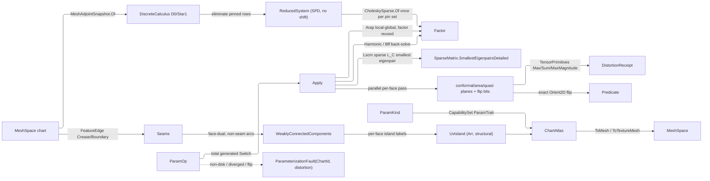

# [RASM_PARAMETERIZATION_FLATTEN]

`Flatten` solves UV parameterization from its variational energy: one `ParamOp` union folded by one `Flatten.Apply` lowers a disk-topology chart into the plane over the `Rasm.Meshing` discrete-exterior-calculus substrate. Every pinned solve eliminates the boundary rows, so the interior operator factors as an SPD system with exact constraints; a penalty or diagonal-shift formulation is the refused failure class.

Rebuild work composes the settled substrate: the `MeshAdjointSnapshot.Of` DEC handle for the cotangent `D0`/`Star1` operators, `CholeskySparse` and `SparseMatrix` for every direct and eigen solve, `Orient2D` the UV-flip floor, `FeatureEdge` the seam classifier, QuikGraph `WeaklyConnectedComponents` the island labeler, and `CapabilitySet<ParamTrait>` the guarantee vocabulary each energy carries onto its atlas. `ChartAtlas` is the structural carrier the reconciliation `Encode` content-addresses.

## [01]-[INDEX]

- [02]-[PARAMETERIZATION]: `ParamOp` folds over the DEC substrate through the eliminated pinned solve into the content-keyed `ChartAtlas`.

## [02]-[PARAMETERIZATION]

- Owner: `Flatten` mints the static parameterization surface, `ParamTrait` the guarantee vocabulary every energy declares, and `ChartId` the one chart identity every island carries — island labels alone, so a fault raised before islanding rides the `ParameterizationFault`'s `Option<ChartId>` rather than a negative sentinel every reader decodes.
- Cases: each `ParamOp` case carries its chart, its constraint payload, and its policy row, so `Apply` discriminates on the value alone.
- Entry: `Flatten.Apply(ParamOp, Op?)` rides the `Fin<ChartAtlas>` rail and reaches the kernel consumer rail as `VectorIntent.Parameterize`, whose `ParameterizeCase` dispatch arm projects through `ChartAtlas.Project<TOut>` — the host LSCM lane stays its own `FlattenHostCase`, so a caller names which formulation ran; the admitted `MeshSpace` is not re-validated, every genuine gate faults typed, and `ChartAtlas.ToMesh`/`ToTextureMesh` re-emit the chart with UV coordinates or the islands as 2D geometry. `UvIsland.Boundary(Context, Op?)` projects the island's oriented boundary loops onto the `Meshing/intersect` `Chain` carrier — outer CCW, holes CW off face winding — so every downstream nesting or development consumer reads one walker instead of re-deriving the cycle walk.
- Auto: modality dispatch is the union's total generated `Switch`, and every arm lowers the same `MeshDec.Of` DEC composition, differing only in the energy. `Assemble` scores distortion in one partition-disjoint parallel per-face pass, folds the receipt through `TensorPrimitives`, labels islands through QuikGraph over the face-dual, and refuses any flip typed.
- Law: `ParamKind` declares ONE `CapabilitySet<ParamTrait>` column — conformality, area preservation, boundary freedom, and iterativeness are the four guarantees a downstream strain gate discriminates on, they co-occur in legal corners the roster fixes, and four bool columns are four authorities. `ChartAtlas.Traits` republishes the solved kind's set, so a consumer reads what the atlas carries rather than re-deriving it from the op case.
- Law: the flip verdict has ONE authority — `Assemble` reads the first flipped face slot and hands it to `Fold`, so `DistortionReceipt.FlipFreeBijective` and the refusal cannot disagree.
- Law: degeneracy is a LANE verdict, never an exact-zero read of a float — the reference triangle gates on `Context.For(ToleranceLane.Area)` and the UV singular values on `.For(ToleranceLane.Collapse)`, both hoisted off `MeshDec` once per run. A face inside either band carries NO map: `Jacobian` answers `Option`, the pass sets a degenerate bit, and `Assemble` lowers `DegenerateInput` before one distortion figure is claimed, so a degenerate chart can no longer pass the bijectivity gate on an untouched UV triangle.
- Law: the ARAP budget is `Cell.Converge` over one `Atom<Fin<ArapState>>`; the transition supplies the terminal state, and an unconverged run leaves through typed `ParameterizationFault` alone.
- Law: `ParamPolicy` has a private constructor and one admitting `Of`, so an inadmissible policy is unrepresentable and no entry re-tests a bool the value already proved.
- Law: boundary cycles have ONE walker — `Cycles.Of` over a functional successor map, shared by `UvIsland.Boundary` and `MeshDec.BoundaryLoops`, with one open-chain refusal instead of two divergent ones. It REFUSES QuikGraph's `StronglyConnectedComponents`, which answers the component set where this owner's whole product is the cyclic order the winding, the pin ring, and `IntegrateBoundary` read.
- Exemption: `ChartStore` is pooled single-writer scratch, and the `MeshDec`/`UvIsland` boundary tables are `Dictionary`/`HashSet` rebuilt inside one fold and dropped — none is a startup-admitted table, so none freezes. `ReducedSystem` memoizes ONE pin set on the `MeshDec` capsule and the memo rides `Option`, never a nullable tuple.
- Receipt: `DistortionReceipt` carries the conformal, area, and quasi-conformal distortion, the iteration count, and the exact-`Orient2D` bijectivity verdict — the evidence the `Rasm.Fabrication` nesting strain gate reads. `Residual`, `FactorNonZeros`, and `SpectralGap` are `Option` because the arms measure different subsets: a direct back-solve takes no residual, the eigen arm holds no Cholesky factor, and only the eigen arm has a gap — λ₃ of the conformal operator, which used to ride the residual column in a different unit from every other arm's.
- Packages: `Rasm.Meshing` (`MeshSpace`, `MeshAdjointSnapshot.Of` the DEC handle, `MeshEdit` soup + freeze), `Rasm.Domain` (`Context`/`ToleranceLane` the two degeneracy bands, `Cell.Converge` the ARAP driver), `Rasm.Processing` (`FeatureEdge`/`MeshFeatureKind` seam source), `Rasm.Numerics` (`SparseMatrix`/`CholeskySparse` solve owners, `Predicate.Orient2D` flip floor, `EpsilonPolicy` the residual anchor, `AtomProjection`/`ProjectionRow` the atlas egress), `Rhino.Geometry`, QuikGraph (face-dual `WeaklyConnectedComponents`), System.Numerics.Tensors (`TensorPrimitives` distortion folds), CommunityToolkit.HighPerformance (`MemoryOwner`/`ParallelHelper`), Rasm.Domain, Thinktecture.Runtime.Extensions, LanguageExt.Core (`Atom`/`Fin`).
- Growth: a new modality is one `ParamKind` row with its trait set, one `ParamOp` case, and one generated-`Switch` arm lowering the same substrate; a new distortion measure is one pooled plane and one `DistortionReceipt` field; a new constraint mode is one `ParamPolicy` column with its default on `Canonical` and its optional at `Of`, or one op-case payload; a new seam source is one `MeshFeatureKind` row; a new guarantee is one `ParamTrait` row.
- Boundary: the parameterization is the one polymorphic `ParamOp` union, never a sibling flattener-class family; every solve composes the `matrix.md` owners, never a raw `CSparse` or MathNet factorization; the DEC substrate is reached only through the public `MeshAdjointSnapshot.Of` handle, never a Geometry-side re-assembly or the internal `LaplacianCache`; the UV-flip verdict is the exact `Orient2D` sign, never a float signed-area band; a seam cut splits a chart into islands rather than discarding a region.

```csharp signature
// --- [RUNTIME_PRELUDE] --------------------------------------------------------------------
using System;
using System.Collections.Generic;
using System.Linq;
using System.Numerics.Tensors;
using System.Runtime.InteropServices;
using CommunityToolkit.HighPerformance.Buffers;
using CommunityToolkit.HighPerformance.Helpers;
using LanguageExt;
using QuikGraph;
using QuikGraph.Algorithms;
using Rasm.Domain;
using Rasm.Meshing;
using Rasm.Numerics;
using Rhino.Geometry;
using Thinktecture;
using static LanguageExt.Prelude;
// CS0104 guard: LanguageExt.HashSet collides with the BCL name under the dual usings.
using EdgeKeySet = System.Collections.Generic.HashSet<(int, int)>;
using IndexSet = System.Collections.Generic.HashSet<int>;
using Dimension = Rasm.Numerics.Dimension;

namespace Rasm.Processing;

// --- [TYPES] ------------------------------------------------------------------------------
// Island labels alone. The pre-island "whole chart" sentinel is deleted: a fault raised before islanding names NO
// chart, and that absence rides ParameterizationFault's Option rather than a negative id every reader must decode.
[ValueObject<int>(KeyMemberName = "Value", KeyMemberAccessModifier = AccessModifier.Public)]
public readonly partial struct ChartId;

[SmartEnum<string>]
[KeyMemberEqualityComparer<ComparerAccessors.StringOrdinal, string>]
public sealed partial class ParamTrait : ICapability<ParamTrait> {
    public static readonly ParamTrait Conformal      = new("conformal", rank: 0);
    public static readonly ParamTrait AreaPreserving = new("area-preserving", rank: 1);
    public static readonly ParamTrait FreeBoundary   = new("free-boundary", rank: 2);
    public static readonly ParamTrait Iterative      = new("iterative", rank: 3);

    public int Rank { get; }
}

[SmartEnum<string>]
[KeyMemberEqualityComparer<ComparerAccessors.StringOrdinal, string>]
[KeyMemberComparer<ComparerAccessors.StringOrdinal, string>]
public sealed partial class ParamKind {
    public static readonly ParamKind Harmonic = new("harmonic", traits: CapabilitySet<ParamTrait>.Of(ParamTrait.Conformal));
    public static readonly ParamKind Lscm     = new("lscm", traits: CapabilitySet<ParamTrait>.Of(ParamTrait.Conformal, ParamTrait.FreeBoundary));
    public static readonly ParamKind Arap     = new("arap", traits: CapabilitySet<ParamTrait>.Of(ParamTrait.AreaPreserving, ParamTrait.FreeBoundary, ParamTrait.Iterative));
    public static readonly ParamKind Bff      = new("bff", traits: CapabilitySet<ParamTrait>.Of(ParamTrait.Conformal, ParamTrait.FreeBoundary));

    public CapabilitySet<ParamTrait> Traits { get; }
}

// --- [CONSTANTS] --------------------------------------------------------------------------
// Private constructor + admitting Of: an inadmissible policy is unrepresentable, so no entry re-tests a bool the
// value already proved and no caller reaches a case payload the fold would have to re-gate.
public sealed record ParamPolicy {
    private ParamPolicy(PositiveMagnitude residual, Dimension iterations, Dimension eigen, VectorAngle crease, Dimension parallelFloor) =>
        (ResidualTolerance, MaxIterations, EigenBudget, CreaseDihedral, ParallelFloor) = (residual, iterations, eigen, crease, parallelFloor);

    public PositiveMagnitude ResidualTolerance { get; }
    public Dimension MaxIterations { get; }
    public Dimension EigenBudget { get; }
    public VectorAngle CreaseDihedral { get; }
    public Dimension ParallelFloor { get; }

    // Botsch-Kobbelt crease classification: 30° is the dihedral above which an edge cuts. No `ToleranceLane` owns it —
    // a feature angle is modelling INTENT, not a gate a `Context` derives — so the clause states here and the decimate
    // and remesh siblings carry the same column under the same name.
    internal const double CreaseDihedralRadians = Math.PI / 6.0;

    // Residual anchor is the kernel's own sqrt-epsilon row, never a bare literal and never a model-relative band —
    // a solver residual is scale-free and the Relative lane is a percent of model size.
    public static readonly ParamPolicy Canonical = new(
        residual: PositiveMagnitude.Create(value: EpsilonPolicy.SqrtEpsilon),
        iterations: Dimension.Create(value: 64), eigen: Dimension.Create(value: 200),
        crease: VectorAngle.Create(value: CreaseDihedralRadians), parallelFloor: Dimension.Create(value: 4_096));

    [BoundaryAdapter]
    public static Fin<ParamPolicy> Of(
        Option<double> residualTolerance = default, Option<double> creaseDihedral = default,
        Option<Dimension> maxIterations = default, Option<Dimension> eigenBudget = default,
        Option<Dimension> parallelFloor = default, Op? key = null) {
        Op op = key.OrDefault();
        return from residual in residualTolerance.Match(
                   Some: value => op.AcceptValidated<PositiveMagnitude>(candidate: value),
                   None: () => Fin.Succ(Canonical.ResidualTolerance))
               from crease in creaseDihedral.Match(
                   Some: value => op.AcceptValidated<VectorAngle>(candidate: value),
                   None: () => Fin.Succ(Canonical.CreaseDihedral))
               // The one claim no carrier holds: a dihedral at or past π marks every edge a crease and shatters the
               // chart into isolated faces before a single solve runs.
               from _ in guard(crease.Value < Math.PI, op.InvalidInput())
               select new ParamPolicy(residual, maxIterations.IfNone(Canonical.MaxIterations),
                   eigenBudget.IfNone(Canonical.EigenBudget), crease, parallelFloor.IfNone(Canonical.ParallelFloor));
    }
}

// --- [MODELS] -----------------------------------------------------------------------------
// Fold-internal single-writer scratch under the arena law: pooled, disposed, never published, never hashed.
public sealed class ChartStore : IDisposable {
    readonly MemoryOwner<double> u, v;
    readonly MemoryOwner<int> chart;
    readonly MemoryOwner<double> conformal, area, quasiConformal;
    readonly MemoryOwner<bool> flip, degenerate;

    ChartStore(int vertices, int faces) {
        u = MemoryOwner<double>.Allocate(vertices, AllocationMode.Clear);
        v = MemoryOwner<double>.Allocate(vertices, AllocationMode.Clear);
        chart = MemoryOwner<int>.Allocate(faces, AllocationMode.Clear);   // per-FACE island labels
        conformal = MemoryOwner<double>.Allocate(faces, AllocationMode.Clear);
        area = MemoryOwner<double>.Allocate(faces, AllocationMode.Clear);
        quasiConformal = MemoryOwner<double>.Allocate(faces, AllocationMode.Clear);
        flip = MemoryOwner<bool>.Allocate(faces, AllocationMode.Clear);
        degenerate = MemoryOwner<bool>.Allocate(faces, AllocationMode.Clear);
    }

    public static ChartStore Allocate(int vertices, int faces) => new(vertices, faces);

    public Memory<double> U => u.Memory;
    public Memory<double> V => v.Memory;
    public Span<int> Chart => chart.Span;
    public Memory<double> Conformal => conformal.Memory;
    public Memory<double> Area => area.Memory;
    public Memory<double> QuasiConformal => quasiConformal.Memory;
    public Memory<bool> Flip => flip.Memory;
    public Memory<bool> Degenerate => degenerate.Memory;
    public Point2d At(int vertex) => new(u.Span[vertex], v.Span[vertex]);

    public void Dispose() { u.Dispose(); v.Dispose(); chart.Dispose(); conformal.Dispose(); area.Dispose(); quasiConformal.Dispose(); flip.Dispose(); degenerate.Dispose(); }
}

// Structural equality: Arr members, never reference-equal raw arrays.
public sealed record UvIsland(ChartId Chart, Arr<int> Vertices, Arr<(int A, int B, int C)> Faces, Arr<Point2d> Uv) {
    // Boundary edges are the once-counted undirected edges of the island's faces; the DIRECTED walk inherits face
    // winding, so a flip-free island emits its outer loop CCW and every hole CW with no point-in-polygon pass.
    // Boundaries stay projections, never layouts: packing stays the downstream owner's concern.
    [BoundaryAdapter]
    public Fin<Seq<Chain>> Boundary(Context context, Op? key = null) {
        Op op = key.OrDefault();
        double weld = context.For(ToleranceLane.Weld).Value;
        Dictionary<int, int> local = new(Vertices.Count);
        for (int i = 0; i < Vertices.Count; i++) local[Vertices[i]] = i;
        Dictionary<(int A, int B), int> census = new(Faces.Count * 3);
        foreach ((int a, int b, int c) in Faces)
            foreach ((int u, int v) in (ReadOnlySpan<(int, int)>)[(a, b), (b, c), (c, a)]) {
                (int lo, int hi) = u < v ? (u, v) : (v, u);
                census[(lo, hi)] = census.TryGetValue((lo, hi), out int count) ? count + 1 : 1;
            }
        Dictionary<int, int> successor = new();
        foreach ((int a, int b, int c) in Faces)
            foreach ((int u, int v) in (ReadOnlySpan<(int, int)>)[(a, b), (b, c), (c, a)]) {
                if (census[u < v ? (u, v) : (v, u)] != 1) continue;
                // Branching boundaries (two outgoing boundary edges at one vertex) mark a non-manifold island — typed.
                if (!successor.TryAdd(u, v)) return Fin.Fail<Seq<Chain>>(new GeometryFault.DegenerateInput(Kind.Mesh, u, "island-boundary: branching"));
            }
        UvIsland self = this;
        return Cycles.Of(successor, op)
            .Bind(loops => loops.TraverseM(loop => self.ChainOf(loop, local, weld)).As())
            .Bind(chains => op.AcceptValue(value: chains.Strict()));
    }

    // A loop welding down under three points has LOST a hole every nesting and development consumer reads off this
    // island, so the collapse refuses typed instead of dropping the cycle and reporting a clean boundary set.
    Fin<Chain> ChainOf(Seq<int> loop, Dictionary<int, int> local, double weld) {
        Polyline points = new();
        foreach (int at in loop) {
            Point2d uv = Uv[local[at]];
            Point3d next = new(uv.X, uv.Y, 0.0);
            // Consecutive samples inside the weld band collapse, so a degenerate stitch never fabricates a
            // zero-length loop edge.
            if (points.Count == 0 || points[^1].DistanceTo(next) > weld) points.Add(next);
        }
        return points.Count >= 3
            ? Fin.Succ(new Chain(points, Closed: true))
            : Fin.Fail<Chain>(new GeometryFault.DegenerateInput(Kind.Mesh, loop[0], "island-boundary: loop collapsed under weld"));
    }
}

// Area extrema run BOTH directions of the singular-value product: a uniformly compressed flip-free atlas cuts as badly as a stretched one.
// Residual, FactorNonZeros, and SpectralGap are OPTION because each arm measures a different subset: a direct
// back-solve takes no residual, the eigen arm holds no Cholesky factor, and only the eigen arm has a spectral gap.
// A zero in any of the three would publish an unmeasured quantity as measured evidence a strain gate thresholds.
public sealed record DistortionReceipt(
    double MaxConformal,
    double MeanConformal,
    double MaxArea,
    double MinArea,
    double MeanArea,
    double MaxQuasiConformal,
    int Iterations,
    Option<double> Residual,
    Option<int> FactorNonZeros,
    Option<double> SpectralGap,
    bool FlipFreeBijective);

public sealed record ChartAtlas(MeshSpace Source, CapabilitySet<ParamTrait> Traits, Seq<UvIsland> Islands, Seq<FeatureEdge> Seams, DistortionReceipt Receipt) {
    // THE egress VectorIntent.ParameterizeCase folds, so the variational atlas reaches the kernel consumer rail on the
    // same typed rows every other Processing result publishes and never through a hand-minted carrier at a consumer.
    internal Fin<TOut> Project<TOut>(Op key) {
        ChartAtlas self = this;
        return AtomProjection.Rows<ChartAtlas, TOut>(self: self, key: key,
            ProjectionRow.Of<Seq<UvIsland>>(() => Fin.Succ(self.Islands)),
            ProjectionRow.Of<Seq<FeatureEdge>>(() => Fin.Succ(self.Seams)),
            ProjectionRow.Of<DistortionReceipt>(() => Fin.Succ(self.Receipt)),
            ProjectionRow.Of<MeshSpace>(() => self.ToMesh(key)));
    }

    // Wedge-faithful: per-corner UVs land on the edit arena and the freeze splits a seam vertex once per distinct UV,
    // so no island's UV overwrites another's — the per-vertex overwrite form is deleted.
    [BoundaryAdapter]
    public Fin<MeshSpace> ToMesh(Op? key = null) {
        MeshEdit edit = MeshEdit.Of(Source);
        try {
            Dictionary<(int, int, int), int> faceAt = new(edit.FaceCount);
            for (int f = 0; f < edit.FaceCount; f++) { faceAt[Cyclic(edit.Face(f))] = f; }
            foreach (UvIsland island in Islands) {
                Dictionary<int, int> at = new(island.Vertices.Count);
                for (int i = 0; i < island.Vertices.Count; i++) { at[island.Vertices[i]] = i; }
                foreach ((int a, int b, int c) in island.Faces) {
                    edit.SetCornerUv(faceAt[Cyclic((a, b, c))], island.Uv[at[a]], island.Uv[at[b]], island.Uv[at[c]]);
                }
            }
            return edit.ToSpace(key.OrDefault());
        }
        finally { edit.Dispose(); }
    }

    // Orientation-preserving cyclic normalization — island faces and arena faces share winding, not phase.
    private static (int, int, int) Cyclic((int A, int B, int C) t) =>
        t.A <= t.B && t.A <= t.C ? (t.A, t.B, t.C) : t.B <= t.C ? (t.B, t.C, t.A) : (t.C, t.A, t.B);

    // Arena soup + freeze, remap per-ISLAND: a seam vertex shared by two islands duplicates, which IS the cut.
    [BoundaryAdapter]
    public Fin<MeshSpace> ToTextureMesh(Op? key = null) {
        List<Point3d> vertices = new();
        List<(int A, int B, int C)> faces = new();
        foreach (UvIsland island in Islands) {
            Dictionary<int, int> remap = new(island.Vertices.Count);
            for (int i = 0; i < island.Vertices.Count; i++) {
                remap[island.Vertices[i]] = vertices.Count;
                vertices.Add(new Point3d(island.Uv[i].X, island.Uv[i].Y, 0.0));
            }
            foreach ((int a, int b, int c) in island.Faces) faces.Add((remap[a], remap[b], remap[c]));
        }
        MeshEdit edit = MeshEdit.Of(CollectionsMarshal.AsSpan(vertices), CollectionsMarshal.AsSpan(faces), Source.Tolerance);
        try { return edit.ToSpace(key.OrDefault()); }
        finally { edit.Dispose(); }
    }
}

// --- [OPERATIONS] -------------------------------------------------------------------------
[Union(ConversionFromValue = ConversionOperatorsGeneration.None)]
public abstract partial record ParamOp {
    private ParamOp() { }

    public sealed record Harmonic(MeshSpace Chart, Option<Polyline> Boundary, ParamPolicy Policy) : ParamOp;
    public sealed record Lscm(MeshSpace Chart, ParamPolicy Policy) : ParamOp;
    public sealed record Arap(MeshSpace Chart, ParamPolicy Policy) : ParamOp;
    public sealed record Bff(MeshSpace Chart, Option<Arr<double>> TargetCurvature, ParamPolicy Policy) : ParamOp;

    public ParamKind Kind =>
        Switch(
            harmonic: static _ => ParamKind.Harmonic,
            lscm:     static _ => ParamKind.Lscm,
            arap:     static _ => ParamKind.Arap,
            bff:      static _ => ParamKind.Bff);

    public MeshSpace Chart =>
        Switch(
            harmonic: static h => h.Chart, lscm: static l => l.Chart,
            arap:     static a => a.Chart, bff:  static b => b.Chart);

    public ParamPolicy Policy =>
        Switch(
            harmonic: static h => h.Policy, lscm: static l => l.Policy,
            arap:     static a => a.Policy, bff:  static b => b.Policy);
}

public static class Flatten {
    // BenchClaim: the vectorized distortion folds prove themselves under the corpus gate; correctness never rides it.
    public static readonly BenchClaim DistortionClaim = new(
        Claim: Op.Of(name: nameof(DistortionReceipt)),
        VectorizedLane: "TensorPrimitives.Max/Sum/MaxMagnitude over the per-face distortion planes",
        ReferenceLane: "scalar element loops over the same planes",
        SpeedupFloor: 1.0);

    // No policy re-test: ParamPolicy.Of is the one construction path and an inadmissible one never reaches a case.
    [BoundaryAdapter]
    public static Fin<ChartAtlas> Apply(ParamOp op, Op? key = null) {
        Op token = key.OrDefault();
        return MeshDec.Of(op.Chart, op.Policy, token).Bind(dec =>
            op.Switch(
                state: (Dec: dec, Key: token),
                harmonic: static (s, h) => FlattenHarmonic(h, s.Dec, s.Key),
                lscm:     static (s, l) => FlattenLscm(s.Dec, l.Policy, s.Key),
                arap:     static (s, a) => FlattenArap(s.Dec, a.Policy, s.Key),
                bff:      static (s, b) => FlattenBff(b, s.Dec, s.Key))
            .Bind(solved => Assemble(solved, op, dec, token)));
    }

    // --- [FLATTEN]
    static Fin<Solved> FlattenHarmonic(ParamOp.Harmonic op, MeshDec dec, Op key) =>
        dec.Disk().Bind(loop => Pins(op.Boundary, loop.Length).Bind(pinned =>
            dec.Reduced(loop, key).Bind(system =>
                from solvedU in system.Solve(k => pinned[k].X, key)
                from solvedV in system.Solve(k => pinned[k].Y, key)
                select Scattered(system, loop, pinned, solvedU, solvedV, iterations: 1))));

    // Pin admission: a caller polyline under two points or zero length cannot resample — the admission-class refusal.
    static Fin<Point2d[]> Pins(Option<Polyline> boundary, int count) =>
        boundary.Match(
            Some: b => b.Count >= 2 && b.Length > 0.0
                ? Fin.Succ(Resample(b, count))
                : Fin.Fail<Point2d[]>(new GeometryFault.DegenerateInput(Kind.Curve, b.Count, "harmonic pin: degenerate boundary polyline")),
            None: () => Fin.Succ(UnitCircle(count)));

    // Spectral conformal: SPARSE L_C = L_D − 2A, smallest non-trivial eigenpair via the matrix.md LOBPCG lane.
    const int GaugeModes = 2;

    static Fin<Solved> FlattenLscm(MeshDec dec, ParamPolicy policy, Op key) =>
        dec.Loops.Length == 0
            // Closed chart: the free-boundary conformal energy has no boundary to open — cut first.
            ? Fin.Fail<Solved>(new GeometryFault.ParameterizationFault(Option<ChartId>.None, 0.0))
            : SparseMatrix.FromTriplets(Dimension.Create(2 * dec.VertexCount), Dimension.Create(2 * dec.VertexCount), dec.ConformalTriplets(), key)
                .Bind(conformal => conformal.SmallestEigenpairsDetailed(k: GaugeModes + 1, tolerance: policy.ResidualTolerance.Value, budget: policy.EigenBudget, key: key))
                .Bind(eigen => eigen.PairsIn(expected: EigenOrder.Ascending, key: key).Bind(pairs => pairs.Count > GaugeModes
                    // Pairs[GaugeModes] is the first non-gauge mode ONLY under ascending order — demanded on the rail.
                    ? Fin.Succ(SplitComplex(dec, pairs[GaugeModes], eigen.Evidence.Iterations.IfNone(0)))
                    : Fin.Fail<Solved>(new GeometryFault.ParameterizationFault(Option<ChartId>.None, 0.0))));

    // Local-global alternation: the global step re-uses the ONE gauge-pinned reduced factor every iteration, and an
    // exhausted budget faults typed. Residual is Option so an unmeasured state and a measured zero stay distinct.
    static Fin<Solved> FlattenArap(MeshDec dec, ParamPolicy policy, Op key) =>
        FlattenLscm(dec, policy, key).Bind(seed => {
            int[] gauge = [dec.Anchor];
            double tolerance = policy.ResidualTolerance.Value;
            return dec.Reduced(gauge, key).Bind(system => {
                using MemoryOwner<double> scratch = MemoryOwner<double>.Allocate(dec.VertexCount, AllocationMode.Clear);
                using MemoryOwner<double> gradientU = MemoryOwner<double>.Allocate(dec.VertexCount, AllocationMode.Clear);
                using MemoryOwner<double> gradientV = MemoryOwner<double>.Allocate(dec.VertexCount, AllocationMode.Clear);
                // `Cell.Converge` owns the exact pass budget and the transition verdict; the typed exhaustion below
                // is the only way out of an unconverged run.
                Atom<Fin<ArapState>> cell = Atom(value: Fin.Succ(new ArapState(seed.U, seed.V, 0, Option<double>.None)));
                Transition<Fin<ArapState>> driven = Cell.Converge(
                    cell: cell,
                    step: state => Some(state.Bind(active => Settled(active.Residual) ? Fin.Succ(active) : Step(active))),
                    settled: state => state.Match(Succ: active => Settled(active.Residual), Fail: static _ => true),
                    budget: policy.MaxIterations,
                    declined: key.InvalidResult());
                return driven.Current.Bind(state => Settled(state.Residual)
                    ? Fin.Succ(new Solved(state.U, state.V, state.Iterations, state.Residual, Some(system.FactorNonZeros), Option<double>.None))
                    : Fin.Fail<Solved>(new GeometryFault.ParameterizationFault(Option<ChartId>.None, state.Residual.IfNone(0.0))));

                bool Settled(Option<double> residual) => residual.Map(value => value <= tolerance).IfNone(false);

                Fin<ArapState> Step(ArapState state) =>
                    dec.LocalRotations(state.U, state.V, key).Bind(rotations => {
                        dec.RotatedGradient(rotations, axis: 0, sink: gradientU.Memory);
                        dec.RotatedGradient(rotations, axis: 1, sink: gradientV.Memory);
                        return from solvedU in system.SolveWith(gradientU.Memory, k => state.U[gauge[k]], key)
                               from solvedV in system.SolveWith(gradientV.Memory, k => state.V[gauge[k]], key)
                               let nextU = system.Scatter(gauge, k => state.U[gauge[k]], solvedU)
                               let nextV = system.Scatter(gauge, k => state.V[gauge[k]], solvedV)
                               select new ArapState(nextU, nextV, state.Iterations + 1, Some(MaxDelta(state.U, nextU, state.V, nextV, scratch.Memory)));
                    });
            });
        });

    // Boundary-first: the boundary curve integrates from prescribed geodesic curvature, and the interior fills harmonically.
    static Fin<Solved> FlattenBff(ParamOp.Bff op, MeshDec dec, Op key) =>
        dec.Disk().Bind(loop => {
            Arr<double> target = op.TargetCurvature.IfNone(() => new Arr<double>([.. Enumerable.Repeat(2.0 * Math.PI / loop.Length, loop.Length)]));
            // Prescription admission: one finite turning row per boundary vertex — a short, long, or non-finite one refuses.
            return target.Count != loop.Length || !target.ForAll(static t => ValidityClaim.Finite(value: t))
                ? Fin.Fail<Solved>(new GeometryFault.DegenerateInput(Kind.Mesh, target.Count, "bff turning prescription: finite, one row per boundary vertex"))
                : dec.Reduced(loop, key).Bind(system => {
                    Point2d[] curve = dec.IntegrateBoundary(loop, target);
                    return from solvedU in system.Solve(k => curve[k].X, key)
                           from solvedV in system.Solve(k => curve[k].Y, key)
                           select Scattered(system, loop, curve, solvedU, solvedV, iterations: 1);
                });
        });

    // A direct back-solve TAKES no residual, so the slot is absent rather than a zero the receipt would publish as a
    // converged measurement.
    static Solved Scattered(ReducedSystem system, int[] loop, Point2d[] pinned, Arr<double> solvedU, Arr<double> solvedV, int iterations) {
        double[] u = system.Scatter(loop, k => pinned[k].X, solvedU);
        double[] v = system.Scatter(loop, k => pinned[k].Y, solvedV);
        return new Solved(u, v, iterations, Residual: Option<double>.None, FactorNonZeros: Some(system.FactorNonZeros), SpectralGap: Option<double>.None);
    }

    // λ₃ of the conformal operator is a SPECTRAL GAP, not a solver residual — different units, different readers — so
    // it rides its own named slot and the eigen arm reports no residual and no Cholesky fill.
    static Solved SplitComplex(MeshDec dec, (double Eigenvalue, Arr<double> Eigenvector) pair, int iterations) {
        int n = dec.VertexCount;
        double[] u = new double[n];
        double[] v = new double[n];
        for (int i = 0; i < n; i++) { u[i] = pair.Eigenvector[i]; v[i] = pair.Eigenvector[n + i]; }
        return new Solved(u, v, iterations, Residual: Option<double>.None, FactorNonZeros: Option<int>.None, SpectralGap: Some(pair.Eigenvalue));
    }

    // --- [SCORE_AND_ASSEMBLE]
    // Assemble scores, labels, and refuses — it packs NOTHING: UV-island layout packing is the Fabrication owner's concern.
    // Flipped slot reads ONCE here and hands to the fold, so the receipt's bijectivity column and the refusal
    // cannot disagree.
    static Fin<ChartAtlas> Assemble(Solved solved, ParamOp op, MeshDec dec, Op key) {
        using ChartStore store = ChartStore.Allocate(dec.VertexCount, dec.FaceCount);
        solved.U.CopyTo(store.U.Span);
        solved.V.CopyTo(store.V.Span);
        ParallelHelper.For(0, dec.FaceCount,
            new DistortionPass(dec, store.U, store.V, store.Conformal, store.Area, store.QuasiConformal, store.Flip, store.Degenerate, dec.AreaFloor, dec.CollapseFloor),
            op.Policy.ParallelFloor.Value);
        // A face carrying no map claims NO distortion: its planes stay at their cleared seed, so refusing here is what
        // keeps MinArea, the conformal mean, and the bijectivity verdict measurements instead of artefacts. The flip
        // gate reads an untouched UV triangle on such a face, which is exactly how a degenerate chart used to pass it.
        int degenerate = store.Degenerate.Span.IndexOf(true);
        if (degenerate >= 0) {
            return Fin.Fail<ChartAtlas>(new GeometryFault.DegenerateInput(Kind.Mesh, degenerate, "parameterization: degenerate reference triangle"));
        }
        Seq<UvIsland> islands = Islands(store, dec);
        int flipped = store.Flip.Span.IndexOf(true);
        DistortionReceipt receipt = Fold(store, dec, solved, flipped);
        return flipped < 0
            ? Fin.Succ(new ChartAtlas(op.Chart, op.Kind.Traits, islands, dec.Seams, receipt))
            : Fin.Fail<ChartAtlas>(new GeometryFault.ParameterizationFault(Some(ChartId.Create(store.Chart[flipped])), receipt.MaxConformal));
    }

    // Partition-disjoint per-face pass: distortion triple + exact Orient2D flip bit into disjoint slots. Degeneracy is
    // a LANE verdict — the Area band on the reference triangle, the Collapse band on the singular values — never an
    // exact-zero read of a float, and it lands as a bit the fold above refuses rather than +inf/1.0 written into a
    // measured plane.
    readonly struct DistortionPass(MeshDec dec, ReadOnlyMemory<double> u, ReadOnlyMemory<double> v, Memory<double> conformal, Memory<double> area, Memory<double> quasi, Memory<bool> flip, Memory<bool> degenerate, double areaFloor, double collapseFloor) : IAction {
        public void Invoke(int f) {
            (int a, int b, int c) = dec.Face(f);
            (Point2d ua, Point2d ub, Point2d uc) = (At(a), At(b), At(c));
            if (dec.JacobianSingularValues(f, ua, ub, uc).Case is not ValueTuple<double, double> sigma) {
                degenerate.Span[f] = true;
                return;
            }
            (double s1, double s2) = sigma;
            if (s2 <= collapseFloor || (s1 + s2) <= collapseFloor) {
                degenerate.Span[f] = true;
                return;
            }
            conformal.Span[f] = s1 / s2;
            area.Span[f] = s1 * s2;
            quasi.Span[f] = (s1 - s2) / (s1 + s2);
            flip.Span[f] = Predicate.Orient2D(Lift(ua), Lift(ub), Lift(uc)) == Sign.Negative;

            Point2d At(int vertex) => new(u.Span[vertex], v.Span[vertex]);
            static Point3d Lift(Point2d p) => new(p.X, p.Y, 0.0);
        }
    }

    // MeshDec.Of already refuses a faceless chart, so the denominator is measured and the Math.Max clamp that used to
    // fabricate one is gone.
    static DistortionReceipt Fold(ChartStore store, MeshDec dec, Solved solved, int flipped) {
        int n = dec.FaceCount;
        ReadOnlySpan<double> c = store.Conformal.Span, a = store.Area.Span, q = store.QuasiConformal.Span;
        return new DistortionReceipt(
            MaxConformal: TensorPrimitives.Max(c), MeanConformal: TensorPrimitives.Sum(c) / n,
            MaxArea: TensorPrimitives.Max(a), MinArea: TensorPrimitives.Min(a), MeanArea: TensorPrimitives.Sum(a) / n,
            MaxQuasiConformal: TensorPrimitives.MaxMagnitude(q),
            Iterations: solved.Iterations, Residual: solved.Residual, FactorNonZeros: solved.FactorNonZeros,
            SpectralGap: solved.SpectralGap, FlipFreeBijective: flipped < 0);
    }

    // Face-dual over non-seam interior edges: every face lands in exactly one island, and a seam vertex belongs to
    // every island whose faces touch it — wedge semantics, assembled in ONE bucketing pass.
    static Seq<UvIsland> Islands(ChartStore store, MeshDec dec) {
        AdjacencyGraph<int, SEdge<int>> dual = new(allowParallelEdges: false);
        dual.AddVertexRange(Enumerable.Range(0, dec.FaceCount));
        foreach (((int u, int v), int faceA, int faceB) in dec.InteriorEdges()) {
            if (!dec.IsSeamEdge(u, v)) dual.AddEdge(new SEdge<int>(faceA, faceB));   // one arc: weak components ignore direction
        }
        Dictionary<int, int> label = new(dec.FaceCount);
        int count = dual.WeaklyConnectedComponents(label);
        List<int>[] vertices = new List<int>[count];
        List<(int A, int B, int C)>[] faces = new List<(int A, int B, int C)>[count];
        IndexSet[] seen = new IndexSet[count];
        for (int chart = 0; chart < count; chart++) { vertices[chart] = []; faces[chart] = []; seen[chart] = []; }
        for (int f = 0; f < dec.FaceCount; f++) {
            int chart = label[f];
            store.Chart[f] = chart;
            (int a, int b, int c) = dec.Face(f);
            faces[chart].Add((a, b, c));
            if (seen[chart].Add(a)) vertices[chart].Add(a);
            if (seen[chart].Add(b)) vertices[chart].Add(b);
            if (seen[chart].Add(c)) vertices[chart].Add(c);
        }
        return toSeq(Enumerable.Range(0, count).Select(chart =>
            new UvIsland(ChartId.Create(chart), toArr(vertices[chart]), toArr(faces[chart]), toArr(vertices[chart].Select(store.At))))).Strict();
    }

    // --- [PRIMITIVES]
    static Point2d[] UnitCircle(int count) =>
        [.. Enumerable.Range(0, count).Select(i => { double t = 2.0 * Math.PI * i / count; return new Point2d(Math.Cos(t), Math.Sin(t)); })];

    // Polyline evaluates on the segment parameter (integer = vertex, fraction = within segment) and carries no
    // length-parameterized evaluator, so the cumulative-length table inverts arc length onto it.
    static Point2d[] Resample(Polyline boundary, int count) {
        double[] cumulative = new double[boundary.Count];
        for (int v = 1; v < boundary.Count; v++) cumulative[v] = cumulative[v - 1] + boundary[v - 1].DistanceTo(boundary[v]);
        double step = cumulative[^1] / count;
        return [.. Enumerable.Range(0, count).Select(i => {
            double target = i * step;
            int hit = Array.BinarySearch(cumulative, target);
            int segment = Math.Min(hit >= 0 ? hit : ~hit - 1, boundary.Count - 2);
            double span = cumulative[segment + 1] - cumulative[segment];
            Point3d p = boundary.PointAt(segment + (span > 0.0 ? (target - cumulative[segment]) / span : 0.0));
            return new Point2d(p.X, p.Y);
        })];
    }

    // Per-iteration displacement: |Δu| ∪ |Δv| folded by ONE vectorized pass per plane.
    static double MaxDelta(double[] u, double[] nextU, double[] v, double[] nextV, Memory<double> scratch) {
        Span<double> plane = scratch.Span;
        TensorPrimitives.Subtract(nextU, u, plane[..u.Length]);
        double du = TensorPrimitives.MaxMagnitude(plane[..u.Length]);
        TensorPrimitives.Subtract(nextV, v, plane[..v.Length]);
        return Math.Max(du, TensorPrimitives.MaxMagnitude(plane[..v.Length]));
    }
}

// --- [COMPOSITION] ------------------------------------------------------------------------
file readonly record struct Solved(double[] U, double[] V, int Iterations, Option<double> Residual, Option<int> FactorNonZeros, Option<double> SpectralGap);

file readonly record struct ArapState(double[] U, double[] V, int Iterations, Option<double> Residual);

file readonly record struct Matrix2(double M00, double M01, double M10, double M11);

// ONE successor-cycle walker over a functional half-edge map, shared by the island boundary and the chart boundary
// loops: both used to carry their own visited set and disagree on failure, one lowering typed and the other closing a
// dangling chain by fiat. QuikGraph's StronglyConnectedComponents is REFUSED here — it answers the component SET and
// this owner's whole product is the cyclic ORDER the winding, the pin ring, and IntegrateBoundary all read.
file static class Cycles {
    internal static Fin<Seq<Seq<int>>> Of(Dictionary<int, int> successor, Op key) {
        Seq<Seq<int>> loops = [];
        IndexSet seen = new(successor.Count);
        // Ascending seeds, so every loop begins at its minimum vertex id — a set-order start would rotate the pin ring
        // run-to-run and fork the content hash.
        foreach (int seed in successor.Keys.OrderBy(static k => k)) {
            if (!seen.Add(seed)) continue;
            Seq<int> loop = Seq(seed);
            int at = seed;
            while (true) {
                if (!successor.TryGetValue(at, out int step)) return Open(at);
                if (step == seed) break;
                // A manifold boundary is a PERMUTATION — in-degree one as well as out — so re-entering a vertex
                // another loop already claimed means two half-edges share a head, which is a non-manifold rim.
                if (!seen.Add(step)) return Merged(step);
                loop = loop.Add(step);
                at = step;
            }
            loops = loops.Add(loop);
        }
        return loops.IsEmpty ? Empty() : Fin.Succ(loops);

        static Fin<Seq<Seq<int>>> Open(int at) =>
            Fin.Fail<Seq<Seq<int>>>(new GeometryFault.DegenerateInput(Kind.Mesh, at, "boundary: open half-edge chain"));
        static Fin<Seq<Seq<int>>> Merged(int at) =>
            Fin.Fail<Seq<Seq<int>>>(new GeometryFault.DegenerateInput(Kind.Mesh, at, "boundary: two half-edges share one head"));
        static Fin<Seq<Seq<int>>> Empty() =>
            Fin.Fail<Seq<Seq<int>>>(new GeometryFault.DegenerateInput(Kind.Mesh, None, "boundary: no closed loop"));
    }
}

// Eliminated pinned system: Map re-indexes interior DOFs and Couplings carry the interior↔pinned stiffness as rhs contributions.
file sealed record ReducedSystem(CholeskySparse Factor, int[] Map, (int Interior, int PinnedSlot, double Weight)[] Couplings, int InteriorCount) {
    public int FactorNonZeros => Factor.FactorNonZeros;

    public Fin<Arr<double>> Solve(Func<int, double> pinnedValue, Op key) {
        double[] rhs = new double[InteriorCount];
        foreach ((int i, int slot, double w) in Couplings) rhs[i] += w * pinnedValue(slot);
        return Factor.SolveDetailed(new Arr<double>(rhs), key).Map(static receipt => receipt.Solution);
    }

    // ARAP form: a source term lands on interior slots BEFORE the pinned couplings fold in. The source is the caller's
    // pooled plane, so an iterate hands one buffer forward rather than minting a gradient array per axis per round.
    public Fin<Arr<double>> SolveWith(Memory<double> source, Func<int, double> pinnedValue, Op key) {
        double[] rhs = new double[InteriorCount];
        ReadOnlySpan<double> plane = source.Span;
        for (int vertex = 0; vertex < Map.Length; vertex++) { if (Map[vertex] >= 0) rhs[Map[vertex]] = plane[vertex]; }
        foreach ((int i, int slot, double w) in Couplings) rhs[i] += w * pinnedValue(slot);
        return Factor.SolveDetailed(new Arr<double>(rhs), key).Map(static receipt => receipt.Solution);
    }

    public double[] Scatter(int[] pinned, Func<int, double> pinnedValue, Arr<double> interior) {
        double[] full = new double[Map.Length];
        for (int vertex = 0; vertex < Map.Length; vertex++) { if (Map[vertex] >= 0) full[vertex] = interior[Map[vertex]]; }
        for (int k = 0; k < pinned.Length; k++) full[pinned[k]] = pinnedValue(k);
        return full;
    }
}

// Fold-internal composition capsule over the public DEC handle.
file sealed class MeshDec {
    public readonly DiscreteCalculus Calculus;
    public readonly int VertexCount;
    public readonly int FaceCount;
    public readonly Context Tolerance;
    public readonly int[][] Loops;               // oriented boundary loops from face winding
    public readonly Seq<FeatureEdge> Seams;
    readonly Mesh native;
    readonly EdgeKeySet seamEdges;
    // One-slot pin-set memo: both channels and every ARAP iteration re-read one factor; absence is Option, never a
    // nullable tuple a reader has to test twice.
    Option<(int[] Pins, ReducedSystem System)> reduced = None;

    MeshDec(DiscreteCalculus calculus, Mesh native, Context tolerance, int[][] loops, Seq<FeatureEdge> seams, EdgeKeySet seamEdges) {
        (Calculus, this.native, Tolerance, Loops, Seams, this.seamEdges) = (calculus, native, tolerance, loops, seams, seamEdges);
        (VertexCount, FaceCount) = (native.Vertices.Count, native.Faces.Count);
    }

    // The two degeneracy bands every kernel on this page reads: the reference triangle's own doubled area against the
    // chart's Area lane, and the UV singular values against its Collapse lane. Neither is a float magnitude compared
    // to zero, and both hoist out of the parallel pass so a per-face read costs no lane lookup.
    public double AreaFloor => Tolerance.For(ToleranceLane.Area).Value;
    public double CollapseFloor => Tolerance.For(ToleranceLane.Collapse).Value;

    public static Fin<MeshDec> Of(MeshSpace chart, ParamPolicy policy, Op key) =>
        from snapshot in MeshAdjointSnapshot.Of(chart, key)
        // Zero-face charts crash the empty-span TensorPrimitives reductions downstream, so the admission refusal fires here.
        from _ in guard(snapshot.FaceCount > 0, new GeometryFault.DegenerateInput(Kind.Mesh, snapshot.FaceCount, "parameterization: faceless chart")).ToFin()
        from featurePolicy in MeshFeaturePolicy.Of(dihedralRadians: policy.CreaseDihedral.Value, space: chart, faceRegions: Option<Arr<int>>.None, key: key)
        from intent in VectorIntent.Features(chart, featurePolicy, key)
        from features in intent.Project<FeatureReceipt>(chart.Tolerance, key)
        let native = chart.DuplicateNative()
        // Seams = the CUT set (crease/boundary) — the atlas publishes exactly what separated islands.
        let seams = features.Edges.Filter(static e => e.Kind.Equals(MeshFeatureKind.Crease) || e.Kind.Equals(MeshFeatureKind.Boundary))
        let seamEdges = seams.Map(static e => Order(e.A, e.B)).ToHashSet()
        from loops in BoundaryLoops(native, key)
        select new MeshDec(snapshot.Calculus, native, chart.Tolerance, loops, seams, seamEdges);

    public int Anchor => Loops.Length > 0 ? Loops[0][0] : 0;   // the ARAP gauge pin

    // Disk gate: the pinned modalities demand exactly ONE boundary loop — the parameterization-shaped fault.
    public Fin<int[]> Disk() =>
        Loops.Length == 1 && Loops[0].Length >= 3
            ? Fin.Succ(Loops[0])
            : Fin.Fail<int[]>(new GeometryFault.ParameterizationFault(Option<ChartId>.None, 0.0));

    // ELIMINATE-BOUNDARY-ROWS off the ONE D0/Star1 edge fold: interior-interior triplets + interior↔pinned couplings, SPD, factored once per pin set.
    public Fin<ReducedSystem> Reduced(int[] pinned, Op key) {
        if (reduced.Filter(held => held.Pins.AsSpan().SequenceEqual(pinned)).Map(static held => held.System).Case is ReducedSystem hit) {
            return Fin.Succ(hit);
        }
        Dictionary<int, int> slot = new(pinned.Length);
        for (int k = 0; k < pinned.Length; k++) slot[pinned[k]] = k;
        int[] map = new int[VertexCount];
        int interior = 0;
        for (int vertex = 0; vertex < VertexCount; vertex++) map[vertex] = slot.ContainsKey(vertex) ? -1 : interior++;
        List<(int Row, int Col, double Value)> triplets = new();
        List<(int Interior, int PinnedSlot, double Weight)> couplings = new();
        using MemoryOwner<double> diagonalOwner = MemoryOwner<double>.Allocate(interior, AllocationMode.Clear);
        Span<double> diagonal = diagonalOwner.Span;
        foreach ((int i, int j, double w) in StiffnessEdges()) {
            (int ri, int rj) = (map[i], map[j]);
            if (ri >= 0) diagonal[ri] += w;
            if (rj >= 0) diagonal[rj] += w;
            if (ri >= 0 && rj >= 0) { triplets.Add((ri, rj, -w)); triplets.Add((rj, ri, -w)); }
            else if (ri >= 0) couplings.Add((ri, slot[j], w));
            else if (rj >= 0) couplings.Add((rj, slot[i], w));
        }
        for (int d = 0; d < interior; d++) triplets.Add((d, d, diagonal[d]));
        return SparseMatrix.FromTriplets(Dimension.Create(interior), Dimension.Create(interior), triplets, key)
            .Bind(stiffness => CholeskySparse.Of(stiffness, key: key))
            .Map(factor => {
                ReducedSystem system = new(factor, map, [.. couplings], interior);
                reduced = Some(([.. pinned], system));
                return system;
            });
    }

    // Every assembly reads the ONE edge fold: (i, j, Star1 weight) per D0 row — never a page-local Laplacian re-assembly.
    public IEnumerable<(int I, int J, double W)> StiffnessEdges() {
        DiscreteCalculus dec = Calculus;
        for (int e = 0; e < dec.D0.Rows.Value; e++) {
            int start = dec.D0.RowPtr[e], end = dec.D0.RowPtr[e + 1];
            if (end - start != 2) continue;
            yield return (dec.D0.ColInd[start], dec.D0.ColInd[start + 1], dec.Star1[e]);
        }
    }

    // Sparse L_C = L_D − 2A: two stiffness blocks off the SAME edge fold + four symmetrized ±1/2 area couplings per ORIENTED boundary half-edge.
    public IEnumerable<(int Row, int Col, double Value)> ConformalTriplets() {
        int n = VertexCount;
        foreach ((int i, int j, double w) in StiffnessEdges()) {
            yield return (i, i, w); yield return (j, j, w); yield return (i, j, -w); yield return (j, i, -w);
            yield return (n + i, n + i, w); yield return (n + j, n + j, w); yield return (n + i, n + j, -w); yield return (n + j, n + i, -w);
        }
        foreach (int[] loop in Loops) {
            for (int k = 0; k < loop.Length; k++) {
                (int i, int j) = (loop[k], loop[(k + 1) % loop.Length]);
                yield return (i, n + j, -0.5); yield return (n + j, i, -0.5);
                yield return (j, n + i, 0.5); yield return (n + i, j, 0.5);
            }
        }
    }

    // A face whose reference triangle or UV image carries no rotation refuses TYPED: the local step has nothing to
    // extract there, and a fabricated identity would let the global step converge against a map that never existed.
    public Fin<Matrix2[]> LocalRotations(double[] u, double[] v, Op key) {
        MeshDec self = this;
        return toSeq(Enumerable.Range(start: 0, count: FaceCount))
            .TraverseM(f => {
                (int a, int b, int c) = self.Face(f);
                return self.PolarRotation(f, new Point2d(u[a], v[a]), new Point2d(u[b], v[b]), new Point2d(u[c], v[c]))
                    .ToFin(new GeometryFault.DegenerateInput(Kind.Mesh, f, "parameterization: degenerate reference triangle"));
            })
            .As()
            .Map(static rotations => rotations.ToArray());
    }

    // O(F): the loop cursor f rides into the accumulation, and the sink is the caller's pooled plane so an ARAP
    // iterate reuses one buffer per axis instead of minting two arrays per round.
    public void RotatedGradient(Matrix2[] rotations, int axis, Memory<double> sink) {
        Span<double> b = sink.Span;
        b.Clear();
        for (int f = 0; f < FaceCount; f++) {
            (int i, int j, int k) = Face(f);
            (double cotI, double cotJ, double cotK) = Cotangents(f);
            AccumulateRotated(b, rotations[f], f, axis, i, j, k, cotI, cotJ, cotK);
        }
    }

    public Option<(double S1, double S2)> JacobianSingularValues(int face, Point2d ua, Point2d ub, Point2d uc) =>
        Jacobian(face, ua, ub, uc).Map(SingularValues);

    public (int A, int B, int C) Face(int face) { MeshFace mf = native.Faces.GetFace(face); return (mf.A, mf.B, mf.C); }

    // Interior edges with both incident faces — the face-dual arc source the island former folds.
    public IEnumerable<((int U, int V) Edge, int FaceA, int FaceB)> InteriorEdges() {
        Dictionary<(int, int), int> first = new(3 * FaceCount);
        for (int f = 0; f < FaceCount; f++) {
            (int a, int b, int c) = Face(f);
            foreach ((int u, int v) in Sides(a, b, c)) {
                if (first.TryGetValue((u, v), out int other)) yield return ((u, v), other, f);
                else first[(u, v)] = f;
            }
        }

        static IEnumerable<(int, int)> Sides(int a, int b, int c) {
            yield return Order(a, b); yield return Order(b, c); yield return Order(c, a);
        }
    }

    public bool IsSeamEdge(int u, int v) => seamEdges.Contains(Order(u, v));

    // Exterior turning per vertex from the prescribed curvature, steps sized by ORIGINAL edge lengths, closure gap distributed.
    public Point2d[] IntegrateBoundary(int[] loop, Arr<double> turning) {
        Point2d[] curve = new Point2d[loop.Length];
        double angle = 0.0;
        Point2d cursor = new(0.0, 0.0);
        for (int k = 0; k < loop.Length; k++) {
            curve[k] = cursor;
            double length = Vertex(loop[k]).DistanceTo(Vertex(loop[(k + 1) % loop.Length]));
            cursor += new Vector2d(length * Math.Cos(angle), length * Math.Sin(angle));
            angle += turning[k];
        }
        Vector2d gap = curve[0] - cursor;   // distribute the closure defect linearly
        for (int k = 0; k < loop.Length; k++) curve[k] += ((double)k / loop.Length) * gap;
        return curve;
    }

    (Point3d A, Point3d B, Point3d C) FacePoints(int face) {
        (int a, int b, int c) = Face(face);
        return (Vertex(a), Vertex(b), Vertex(c));
    }

    Point3d Vertex(int index) { Point3f v = native.Vertices[index]; return new Point3d(v.X, v.Y, v.Z); }

    (double CotI, double CotJ, double CotK) Cotangents(int face) {
        (Point3d a, Point3d b, Point3d c) = FacePoints(face);
        double floor = AreaFloor;
        return (Cotangent(b, a, c, floor), Cotangent(c, b, a, floor), Cotangent(a, c, b, floor));
    }

    Option<Matrix2> PolarRotation(int face, Point2d ua, Point2d ub, Point2d uc) =>
        Jacobian(face, ua, ub, uc).Bind(jacobian => {
            (double s1, double s2) = SingularValues(jacobian);
            // A UV triangle whose singular values sum inside the Collapse band carries no rotation to extract, and the
            // unit matrix the fallback used to hand back is a rotation the face never had.
            if (s1 + s2 <= CollapseFloor) return Option<Matrix2>.None;
            double det = (jacobian.M00 * jacobian.M11) - (jacobian.M01 * jacobian.M10);
            double scale = 1.0 / (s1 + s2);
            double r00 = (jacobian.M00 + jacobian.M11) * scale, r01 = (jacobian.M01 - jacobian.M10) * scale;
            return Some(det < 0.0 ? new Matrix2(r00, -r01, -r01, -r00) : new Matrix2(r00, r01, -r01, r00));
        });

    // Reference coordinates of the face in ITS OWN plane: pa -> (0,0), pb -> (|ab|, 0), pc -> (ac·x̂, ac·ŷ).
    (Point2d Rb, Point2d Rc) Reference(int face) {
        (Point3d pa, Point3d pb, Point3d pc) = FacePoints(face);
        Vector3d ab = pb - pa, ac = pc - pa;
        Vector3d x = ab; x.Unitize();
        Vector3d normal = Vector3d.CrossProduct(ab, ac); normal.Unitize();
        Vector3d y = Vector3d.CrossProduct(normal, x);
        return (new Point2d(ab.Length, 0.0), new Point2d(ac * x, ac * y));
    }

    // J = U·R⁻¹ is the TRUE per-face map: the UV edge matrix against the 3D reference triangle. A reference triangle
    // inside the Area band has NO map — absence, not a zero matrix whose fabricated σ = (0,0) flowed on to publish
    // conformal +inf, area 0, quasi 1, and a bijectivity verdict read off an untouched UV triangle.
    Option<Matrix2> Jacobian(int face, Point2d ua, Point2d ub, Point2d uc) {
        (Point2d rb, Point2d rc) = Reference(face);
        double det = rb.X * rc.Y;   // rb.Y = 0 by construction; det = 2·(reference area)
        if (Math.Abs(det) <= AreaFloor) return Option<Matrix2>.None;
        (double u1x, double u2x, double u1y, double u2y) = (ub.X - ua.X, uc.X - ua.X, ub.Y - ua.Y, uc.Y - ua.Y);
        return Some(new Matrix2(
            u1x * rc.Y / det, ((u2x * rb.X) - (u1x * rc.X)) / det,
            u1y * rc.Y / det, ((u2y * rb.X) - (u1y * rc.X)) / det));
    }

    void AccumulateRotated(Span<double> b, Matrix2 rotation, int face, int axis, int i, int j, int k, double cotI, double cotJ, double cotK) {
        (Point3d pi, Point3d pj, Point3d pk) = FacePoints(face);
        Vector3d eij = pj - pi, ejk = pk - pj, eki = pi - pk;
        (double rx, double ry) = (axis == 0 ? rotation.M00 : rotation.M10, axis == 0 ? rotation.M01 : rotation.M11);
        b[i] += cotK * (rx * eij.X + ry * eij.Y) - cotJ * (rx * eki.X + ry * eki.Y);
        b[j] += cotI * (rx * ejk.X + ry * ejk.Y) - cotK * (rx * eij.X + ry * eij.Y);
        b[k] += cotJ * (rx * eki.X + ry * eki.Y) - cotI * (rx * ejk.X + ry * ejk.Y);
    }

    // A corner whose doubled area falls inside the Area band contributes the LIMIT weight zero; the band is the
    // verdict, never an exact-zero read of a float the cancelling denominator would otherwise carry to infinity.
    static double Cotangent(Point3d apex, Point3d u, Point3d v, double areaFloor) {
        Vector3d a = u - apex, b = v - apex;
        double cross = Vector3d.CrossProduct(a, b).Length;
        return cross <= areaFloor ? 0.0 : (a * b) / cross;
    }

    static (double S1, double S2) SingularValues(Matrix2 m) {
        double e = (m.M00 + m.M11) * 0.5, f = (m.M00 - m.M11) * 0.5, g = (m.M10 + m.M01) * 0.5, h = (m.M10 - m.M01) * 0.5;
        double q = Math.Sqrt(e * e + h * h), r = Math.Sqrt(f * f + g * g);
        return (q + r, Math.Abs(q - r));
    }

    static (int, int) Order(int u, int v) => u < v ? (u, v) : (v, u);

    // Directed half-edges with no reversed twin are boundary half-edges whose direction is its face's winding, so
    // next[tail] = head is well-defined per manifold boundary vertex and the shared cycle walker orders each loop. An
    // OPEN chain now refuses typed: Disk() used to admit one, Pins resampled it as closed, and the harmonic and BFF
    // solves then pinned the chart against a fabricated closing edge.
    static Fin<int[][]> BoundaryLoops(Mesh mesh, Op key) {
        EdgeKeySet directed = new(3 * mesh.Faces.Count);
        for (int f = 0; f < mesh.Faces.Count; f++) {
            MeshFace face = mesh.Faces.GetFace(f);
            directed.Add((face.A, face.B)); directed.Add((face.B, face.C)); directed.Add((face.C, face.A));
        }
        Dictionary<int, int> next = new();
        foreach ((int u, int v) in directed) { if (!directed.Contains((v, u))) next[u] = v; }
        // A closed chart carries no boundary half-edge at all — data the Disk gate reads, never a failure here.
        return next.Count == 0
            ? Fin.Succ(System.Array.Empty<int[]>())
            : Cycles.Of(next, key).Map(static loops => loops.Map(static loop => loop.ToArray()).ToArray());
    }
}
```


```mermaid
---
config:
  layout: elk
  flowchart:
    curve: linear
    padding: 25
---
flowchart LR
    accTitle: Parameterization dispatch
    accDescr: ParamOp folds over the DEC substrate through the eliminated pinned solve into the content-keyed chart atlas.
    Chart["MeshSpace chart"] -->|MeshAdjointSnapshot.Of| DEC["DiscreteCalculus D0/Star1"]
    DEC -->|eliminate pinned rows| Reduced["ReducedSystem (SPD, no shift)"]
    Reduced -->|CholeskySparse.Of once per pin set| Factor
    Chart -->|FeatureEdge Crease/Boundary| Seams
    ParamOp -->|total generated Switch| Apply
    Apply -->|Harmonic / Bff back-solve| Factor
    Apply -->|Lscm sparse L_C smallest eigenpair| Lobpcg["SparseMatrix.SmallestEigenpairsDetailed"]
    Apply -->|Arap local-global, factor reused| Factor
    Apply -->|parallel per-face pass| Distortion["conformal/area/quasi planes + flip bits"]
    Distortion -->|TensorPrimitives Max/Sum/MaxMagnitude| Receipt["DistortionReceipt"]
    Distortion -->|exact Orient2D flip| Predicate
    Seams -->|face-dual, non-seam arcs| QuikGraph["WeaklyConnectedComponents"]
    QuikGraph -->|per-face island labels| Islands["UvIsland (Arr, structural)"]
    Islands --> ChartAtlas
    ParamKind -->|CapabilitySet ParamTrait| ChartAtlas
    ChartAtlas -->|ToMesh / ToTextureMesh| MeshSpaceOut["MeshSpace"]
    ParamOp -.->|non-disk / diverged / flip| GeometryFault["ParameterizationFault(ChartId, distortion)"]
```

## [03]-[RESEARCH]

<!-- source-only: research row template:
[TOKEN]-[OPEN|BLOCKED]: <exact question>; <verification route>.
[SPLIT_MEMBER]-[OPEN]: does `shape-core` expose `split_all`; verify against the member rail.
-->

(none)
