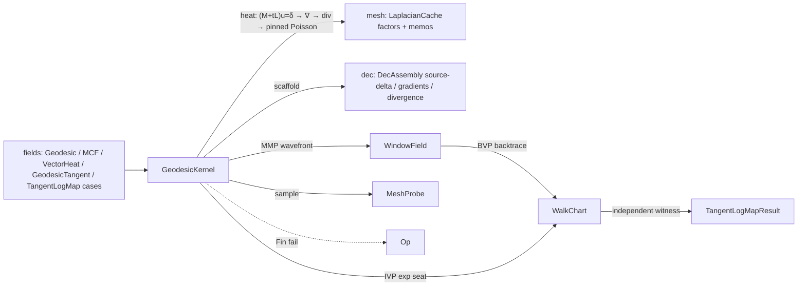

# [RASM_DISTANCE_GEODESICS]

ONE on-mesh distance-and-transport suite over the `mesh` substrate: heat-method geodesic distance (Crane-Weischedel-Wardetzky `(M+tL)u=δ → X=−∇u/|∇u| → Lφ=∇·X`), implicit mean-curvature flow, exact MMP window-propagation geodesics (Surazhsky pure-scalar wavefront over the frozen intrinsic Delaunay mesh), the ONE face-unfolding geodesic tracer (Polthier straightest-geodesic IVP exp map and the window-field BVP log backtrace share a single `WalkChart` unfold kernel — no forked tracer), Sharp-Soliman-Crane vector-heat parallel transport, and a three-algorithm tangent log-map surface dispatched by `TangentLogMapAlgorithm` (`VectorHeatApproximate` · `ExactStraightestExp` · `ExactWindowPropagation`). Every solver runs over `MeshSpace` and its `LaplacianCache` — success-only value-keyed memos through the cache's one type-keyed `Memoized` entry (`GeodesicKey`, `McfKey`, `VectorHeatKey`, `WindowFieldKey`), the scalar-heat and connection Cholesky factors, the frozen `IntrinsicMesh` snapshot — so repeated sampling of one field pays one solve; the per-mesh vertex tangent `FrameBundle` is page-owned beside `MeshProbe` under the same weak-identity law and serves this page and the sibling shape page as the ONE tangent-frame owner.

The page owns the trace policies (`GeodesicTracePolicy`, `WindowPropagationPolicy`, both with `Default` presets and monadic `Of` admission), the window vocabulary (`GeodesicWindow`, `WindowField`, `GeodesicStopKind`), the tracer state (`GeodesicWalkMode`, `ExpTrace`, `BvpTrace`), the log-map evidence (`TangentLogMapReceipt`/`TangentLogMapResult` on the rails validity fold with the path law as the declared gate), the shared `MeshProbe` closest-face barycentric sampling substrate (composed by the sibling shape page and by the `mesh` overlay edge-trace), and the `GeodesicKernel` solver body. Linear systems ride the `matrix` owners (`CholeskySparse` solves, `SparseMatrix.SingularSolve` under `GaugePolicy.Pinned` + `GaugeShift.MinZero`); the heat scaffold (mass-weighted source delta, per-face gradients, cotan vertex divergence) is the `dec` owner composed as settled; the `fields` cases `ScalarField.Geodesic`/`MeanCurvatureFlow` and `VectorField.VectorHeat`/`GeodesicTangent`/`TangentLogMap` delegate here — the case names are frozen contract, the solvers are this page.

## [01]-[INDEX]

- [02]-[HEAT_DISTANCE]: heat-method geodesic distance + geodesic tangent (distance-gradient sampling) + implicit MCF, all cache-memoized per-vertex fields sampled through the one `MeshProbe` substrate.
- [03]-[EXACT_GEODESICS]: MMP window propagation (pure-scalar wavefront, occlusion clamp, saddle pseudosources, cut-locus census) + the ONE geodesic tracer (`WalkChart` IVP/BVP/overlay modes) + the BVP source backtrace with its independent distance witness.
- [04]-[TANGENT_TRANSPORT]: vector-heat parallel transport (connection + magnitude + indicator solves) + the `TangentLogMapAlgorithm` three-arm log-map surface + the receipt family.

## [02]-[HEAT_DISTANCE]

- Owner: `GeodesicKey`/`McfKey` cache probes (value identity = memo identity: ordered-distinct sources, time-step + iteration count); `FrameBundle` the page-owned per-mesh vertex tangent frames (weak-keyed by mesh reference identity — the ONE tangent encode/decode owner this page and the sibling shape page share); `MeshProbe` the shared closest-face sampling substrate (`ClosestFace`, scalar/vector/complex barycentric interpolation, the scale-derived search distance `max(tolerance, mean edge)`); the `GeodesicKernel` heat-distance arms.
- Entry: `GeodesicKernel.HeatGeodesicAt(space, sources, sample, key)` → `Fin<double>`; `GeodesicKernel.GeodesicTangentAt(space, sources, sample, key)` → `Fin<Vector3d>`; `GeodesicKernel.MeanCurvatureMagnitudeAt(space, timeStep, iterations, sample, key)` → `Fin<double>` — all reached through the frozen `ScalarField.Geodesic`/`MeanCurvatureFlow` and `VectorField.GeodesicTangent` case delegations and `VectorIntent`; sources are deduplicated and ordered before probing the cache so permuted source sets hit one memo.
- Auto: the heat pipeline guards the intrinsic snapshot un-flipped (heat distance on a flipped IDT is `Unsupported`, never silently extrinsic), selects the `MeshLaplacian.IntrinsicDelaunay` Laplacian, seats the Crane time `t = h²` off the cached mean edge length, solves `(M+tL)u = δ` through the cached scalar-heat Cholesky, normalizes the per-face gradient field, scatters the cotan vertex divergence, and closes with the pinned singular Poisson solve (`GaugePolicy.Pinned(sources, mass, GaugeShift.MinZero)`) shifted so the minimum is zero at the sources — distances are nonnegative by construction. MCF factors `(M + tL)` ONCE and backward-Euler iterates the three coordinate axes as mass-weighted solves (`TraverseM` over axes), returning per-vertex displacement magnitudes. The geodesic tangent samples the per-face gradient of the cached distance field at the closest face, rejecting degenerate faces.
- Receipt: the distance/displacement fields are cached `Arr<double>` per-vertex carriers; failure evidence routes the `Op` rail (`InvalidInput` for empty/out-of-range sources or non-positive time, `InvalidResult` for degenerate scale, `Unsupported` for flipped intrinsic snapshots).
- Boundary: the `dec` scaffold (`BuildSourceDelta`/`ComputeTriangleGradients`/`ComputeVertexDivergence`) is composed, never re-derived — a page-local cotangent divergence is the deleted third cotangent path; `MeshProbe` is the ONE closest-face interpolation owner (the mature corpus scattered six per-solver helpers) and the sibling shape page composes it rather than re-minting; the heat time is scale-derived (`h²`), never a knob — a `HeatTime` parameter on the distance entry is the rejected form (vector heat exposes time because transport spread IS its semantic; distance does not).

```csharp
// --- [RUNTIME_PRELUDE] ---------------------------------------------------------------------
using System;
using System.Collections.Generic;
using System.Linq;
using System.Numerics;
using System.Runtime.CompilerServices;
using System.Runtime.InteropServices;
using Rasm.Csp;
using LanguageExt;
using Rasm.Domain;
using Rasm.Meshing;
using Rasm.Numerics;
using Rhino;
using Rhino.Geometry;
using Thinktecture;
using static LanguageExt.Prelude;
// CS0104 guard: LanguageExt.HashSet collides with the BCL name under the dual usings.
using IndexSet = System.Collections.Generic.HashSet<int>;
using IntrinsicEdge = Rasm.Meshing.MeshKernel.IntrinsicEdge;
using IntrinsicMesh = Rasm.Meshing.MeshKernel.IntrinsicMesh;
using Dimension = Rasm.Numerics.Dimension;

namespace Rasm.Processing;

// --- [MODELS] -------------------------------------------------------------------------------
// The per-mesh vertex tangent frames: angle-consistent (X, Y, N) triads under the SAME weak-identity law the
// LaplacianCache rides (ConditionalWeakTable keyed by Mesh reference). Vector heat, cross fields, and stripe
// decoding all encode/decode tangent complexes through ONE bundle; a second frame derivation is the deleted form.
internal sealed record FrameBundle(Vector3d[] X, Vector3d[] Y, Vector3d[] N) {
    private static readonly ConditionalWeakTable<Mesh, FrameBundle> Table = new();
    internal static FrameBundle For(Mesh mesh) => Table.GetValue(key: mesh, createValueCallback: static m => Compute(mesh: m));
    internal Complex Tangent(Vector3d direction, int vertex) => new(real: direction * X[vertex], imaginary: direction * Y[vertex]);
    private static FrameBundle Compute(Mesh mesh) {
        int n = mesh.Vertices.Count;
        using Mesh active = mesh.DuplicateMesh();
        _ = active.FaceNormals.ComputeFaceNormals();
        _ = active.Normals.ComputeNormals();
        Vector3d[] normals = new Vector3d[n]; Vector3d[] xAxes = new Vector3d[n]; Vector3d[] yAxes = new Vector3d[n];
        for (int v = 0; v < n; v++) {
            Vector3d normal = v < active.Normals.Count ? (Vector3d)active.Normals[index: v] : Vector3d.ZAxis;
            if (!normal.IsValid || normal.IsTiny() || !normal.Unitize()) normal = Vector3d.ZAxis;
            normals[v] = normal;
            Vector3d tx = VectorFrame.SeedPerpendicular(axis: normal);
            _ = tx.Unitize();
            xAxes[v] = tx; yAxes[v] = Vector3d.CrossProduct(a: normal, b: tx);
        }
        return new FrameBundle(X: xAxes, Y: yAxes, N: normals);
    }
}

// --- [OPERATIONS] ---------------------------------------------------------------------------
internal readonly record struct GeodesicKey(Seq<int> Sources);
[StructLayout(LayoutKind.Auto)] internal readonly record struct McfKey(double TimeStep, int Iterations);

// The ONE closest-face barycentric sampling substrate: every per-vertex solver field (scalar, vector,
// complex tangent encoding) leaves through these projections; the search distance is scale-derived.
internal static class MeshProbe {
    internal static double SearchDistance(MeshSpace space) =>
        Math.Max(val1: space.Tolerance.Absolute.Value, val2: space.Cache.MeanEdgeLength);
    internal static Fin<T> ClosestFace<T>(MeshSpace space, Point3d sample, Op key, Func<Mesh, MeshFace, double[], int, Fin<T>> project) {
        MeshPoint meshPoint = space.Native.ClosestMeshPoint(testPoint: sample, maximumDistance: SearchDistance(space: space));
        return meshPoint is null || meshPoint.FaceIndex < 0
            ? Fin.Fail<T>(key.InvalidResult())
            : project(space.Native, space.Native.Faces[index: meshPoint.FaceIndex], meshPoint.T, meshPoint.FaceIndex);
    }
    internal static Fin<double> ScalarOn(MeshSpace space, Point3d sample, Arr<double> perVertex, Op key) =>
        ClosestFace(space: space, sample: sample, key: key, project: (_, face, weights, _) => key.AcceptValue(value: FaceValue(face: face, weights: weights, perVertex: perVertex)));
    internal static Fin<Vector3d> VectorOn(MeshSpace space, Point3d sample, Arr<Vector3d> perVertex, Op key) =>
        ClosestFace(space: space, sample: sample, key: key, project: (_, face, weights, _) => key.AcceptValue(value: BarycentricVector(face: face, weights: weights, at: vertex => perVertex[index: vertex])));
    // Complex tangent fields decode per-vertex through the frame bundle before blending.
    internal static Fin<Vector3d> ComplexBlend(MeshSpace space, Point3d sample, Complex[] perVertex, Op key, Func<Complex, Vector3d, Vector3d, Vector3d> decode) {
        FrameBundle frames = FrameBundle.For(space.Native);
        return ClosestFace(space: space, sample: sample, key: key, project: (_, face, weights, _) => key.AcceptValue(value:
            BarycentricVector(face: face, weights: weights, at: vertex => decode(perVertex[vertex], frames.X[vertex], frames.Y[vertex]))));
    }
    internal static double FaceValue(MeshFace face, double[] weights, Arr<double> perVertex) {
        double value = (weights[0] * perVertex[index: face.A]) + (weights[1] * perVertex[index: face.B]) + (weights[2] * perVertex[index: face.C]);
        return face.IsQuad ? value + (weights[3] * perVertex[index: face.D]) : value;
    }
    internal static Vector3d BarycentricVector(MeshFace face, double[] weights, Func<int, Vector3d> at) =>
        (weights[0] * at(face.A)) + (weights[1] * at(face.B)) + (weights[2] * at(face.C)) + (face.IsQuad ? weights[3] * at(face.D) : Vector3d.Zero);
}

internal static partial class GeodesicKernel {
    // --- [HEAT_METHOD]
    internal static Fin<double> HeatGeodesicAt(MeshSpace space, Seq<int> sources, Point3d sample, Op key) =>
        from distances in EnsureGeodesicDistances(space: space, sources: sources, key: key)
        from value in MeshProbe.ScalarOn(space: space, sample: sample, perVertex: distances, key: key)
        select value;
    internal static Fin<Vector3d> GeodesicTangentAt(MeshSpace space, Seq<int> sources, Point3d sample, Op key) =>
        from distances in EnsureGeodesicDistances(space: space, sources: sources, key: key)
        from tangent in Fin.Succ(DecAssembly.ComputeTriangleGradients(mesh: space.Native, u: distances))
        from value in MeshProbe.ClosestFace(space: space, sample: sample, key: key, project: (mesh, face, _, faceIndex) => {
            if (!face.IsTriangle) return Fin.Fail<Vector3d>(error: key.InvalidResult());
            double twoArea = Vector3d.CrossProduct(a: mesh.Vertices[index: face.B] - mesh.Vertices[index: face.A], b: mesh.Vertices[index: face.C] - mesh.Vertices[index: face.A]).Length;
            return twoArea < RhinoMath.ZeroTolerance ? Fin.Fail<Vector3d>(error: key.InvalidResult()) : key.AcceptValue(value: tangent[faceIndex]);
        })
        select value;
    internal static Fin<Arr<double>> EnsureGeodesicDistances(MeshSpace space, Seq<int> sources, Op key) {
        int n = space.Native.Vertices.Count;
        Seq<int> ordered = toSeq(sources.AsIterable().Distinct().Order());
        return ordered.IsEmpty || ordered.Exists(i => i < 0 || i >= n)
            ? Fin.Fail<Arr<double>>(key.InvalidInput())
            : space.Cache.Memoized(probe: new GeodesicKey(Sources: ordered),
                compute: () => from imesh in space.Cache.IntrinsicMeshSnapshot(key: key)
                               from _ in guard(!imesh.HasFlips, key.Unsupported(geometryType: typeof(IntrinsicMesh), outputType: typeof(Arr<double>)))
                               from laplacian in space.Laplacian(kind: MeshLaplacian.IntrinsicDelaunay, key: key)
                               from distances in ComputeHeatGeodesic(space: space, laplacian: laplacian, sources: ordered, key: key)
                               select distances);
    }
    // (M + tL)u = delta at t = h^2; X = -grad u / |grad u|; L phi = div X, pinned at the sources with a min-zero shift.
    private static Fin<Arr<double>> ComputeHeatGeodesic(MeshSpace space, SparseLaplacian laplacian, Seq<int> sources, Op key) {
        int n = space.Native.Vertices.Count;
        double h = space.Cache.MeanEdgeLength;
        if (h <= RhinoMath.ZeroTolerance) return Fin.Fail<Arr<double>>(key.InvalidResult());
        double t = h * h;
        return from heatFactor in space.Cache.ScalarHeatCholesky(time: t, key: key)
               from delta in Fin.Succ(DecAssembly.BuildSourceDelta(n: n, sources: sources, mass: laplacian.MassLumped))
               from u in heatFactor.Solve(rhs: delta, key: key)
               from gradient in Fin.Succ(DecAssembly.ComputeTriangleGradients(mesh: space.Native, u: u))
               from divergence in Fin.Succ(DecAssembly.ComputeVertexDivergence(mesh: space.Native, gradients: gradient))
               // GaugeShift.MinZero owns the nonnegativity shift inside the singular solve; a page-local re-shift is the deleted second path.
               from phi in laplacian.Stiffness.SingularSolve(rhs: divergence, gauge: GaugePolicy.Pinned(indices: sources, mass: Some(laplacian.MassLumped), shift: GaugeShift.MinZero), context: space.Tolerance, key: key)
               select phi;
    }

    // --- [MEAN_CURVATURE_FLOW]
    // Scalar-field MCF owner: fixed connectivity, ONE memoized SPD factor, displacement MAGNITUDES
    // out. The Au contraction (Meshing/skeleton) re-assembles per round over mutating connectivity
    // — its own loop over the composed Cotangent/matrix owners; the two forms meet at no interior.
    internal static Fin<double> MeanCurvatureMagnitudeAt(MeshSpace space, double timeStep, int iterations, Point3d sample, Op key) =>
        from displacements in EnsureMcfDisplacements(space: space, timeStep: timeStep, iterations: iterations, key: key)
        from value in MeshProbe.ScalarOn(space: space, sample: sample, perVertex: displacements, key: key)
        select value;
    private static Fin<Arr<double>> EnsureMcfDisplacements(MeshSpace space, double timeStep, int iterations, Op key) =>
        !RhinoMath.IsValidDouble(x: timeStep) || timeStep <= 0.0 || iterations < 1
            ? Fin.Fail<Arr<double>>(key.InvalidInput())
            : space.Cache.Memoized(probe: new McfKey(TimeStep: timeStep, Iterations: iterations),
                compute: () => space.Laplacian(kind: MeshLaplacian.IntrinsicDelaunay, key: key)
                    .Bind(laplacian => from system in MeshKernel.AssembleMassStiffnessSystem(laplacian: laplacian, stiffnessScale: timeStep, key: key)
                                       from factor in CholeskySparse.Of(symmetric: system, key: key)
                                       from final in IterateMcf(space: space, mass: laplacian.MassLumped, system: factor, iterations: iterations, key: key)
                                       select ComputeDisplacements(original: space.Native, smoothed: final)));
    // Backward-Euler axes: one SPD factor, per-round mass-weighted RHS solves over x/y/z via TraverseM.
    private static Fin<double[][]> IterateMcf(MeshSpace space, Arr<double> mass, CholeskySparse system, int iterations, Op key) {
        int n = space.Native.Vertices.Count;
        double[][] coordinates = [new double[n], new double[n], new double[n]];
        for (int i = 0; i < n; i++) { Point3d v = space.Native.Vertices[index: i]; coordinates[0][i] = v.X; coordinates[1][i] = v.Y; coordinates[2][i] = v.Z; }
        return toSeq(Enumerable.Range(start: 0, count: iterations)).Fold(
            Fin.Succ(coordinates),
            (state, _) => state.Bind(current => {
                double[][] rhs = [new double[n], new double[n], new double[n]];
                for (int i = 0; i < n; i++) { double m = mass[index: i]; rhs[0][i] = m * current[0][i]; rhs[1][i] = m * current[1][i]; rhs[2][i] = m * current[2][i]; }
                return toSeq(rhs).TraverseM(axis => system.Solve(rhs: new Arr<double>(axis), key: key).Map(solution => solution.AsIterable().ToArray())).As().Map(axes => axes.AsIterable().ToArray());
            }));
    }
    private static Arr<double> ComputeDisplacements(Mesh original, double[][] smoothed) {
        int n = original.Vertices.Count;
        double[] magnitude = new double[n];
        for (int i = 0; i < n; i++) {
            Point3d before = original.Vertices[index: i];
            magnitude[i] = new Vector3d(x: smoothed[0][i] - before.X, y: smoothed[1][i] - before.Y, z: smoothed[2][i] - before.Z).Length;
        }
        return new Arr<double>(magnitude);
    }
}
```

## [03]-[EXACT_GEODESICS]

- Owner: `GeodesicStopKind` (LengthReached/BoundaryHit/IterationCap) terminal vocabulary; `GeodesicTracePolicy` (trace-length factor, step cap, vertex-snap band) and `WindowPropagationPolicy` (windows-per-edge budget, backtrace hop cap, saddle cone-angle threshold, cut-locus reporting) with `Default` presets; `GeodesicWindow` the pure-scalar MMP window (`[b0,b1]` covered sub-interval, endpoint pseudosource distances, accumulated `sigma`, pseudosource id); `WindowField` the converged wavefront carrier with clamp/pseudosource/cut-locus census; `WindowFieldKey` the (source, policy) memo probe — one converged wavefront per source per mesh snapshot; `GeodesicWalkMode` (Straightest/EdgeOverlay) and `ExpTrace`/`BvpTrace` tracer state; the `GeodesicKernel` propagation and walk arms.
- Cases: stop kinds (3); walk modes (2); tracer entries — IVP exp seat · BVP log replay · overlay edge-trace — three seats over ONE `WalkChart` loop.
- Entry: `GeodesicKernel.PropagateWindows(imesh, source, policy)` → `WindowPropagation` (the converged field + MMP-exact vertex distances; the log-map consumer memoizes it per `WindowFieldKey` so repeated sampling of one source pays one wavefront); `GeodesicKernel.TraceStraightestGeodesic(imesh, mesh, frames, source, startFace, worldDir, traceLength, policy)` → `ExpTrace`; `GeodesicKernel.BacktraceGeodesicToSource(imesh, mesh, frames, field, targetDistance, source, targetFace, targetWeights, policy)` → `Option<BvpTrace>` — internal arms surfaced through the [04] log/exp map results; the `mesh` common-subdivision overlay seats the same `WalkChart` in `EdgeOverlay` mode, so ONE unfold kernel serves distance, log, exp, and overlay.
- Auto: the wavefront seeds every source-incident face's opposite edge (pseudosource projected to `(sx, sy≤0)` from endpoint distances), advances a `PriorityQueue` min-frontier keyed on `sigma + min(d0,d1)`, unfolds each popped window across its edge (apex laid flat by the law of cosines), updates the apex distance only inside the window's angular shadow (`WithinShadow` — the SAME predicate the BVP backtrace later uses for owning-window selection, so forward and backward provably agree), casts children onto the two far edges with the occlusion clamp `sy = −sqrt(max(0, d0²−sx²))` counted into the receipt (the classic MMP saddle-overestimation fix), re-emits saddle pseudosources at interior vertices whose cone angle strictly exceeds the threshold, bounds the pop budget by `4·maxPerEdge·edgeCount`, closes stranded vertices with ONE Jacobi (snapshot-relaxed, order-independent) edge sweep — vertices still unreached keep `+∞`, the honest unreachable encoding that fails downstream interpolation rather than reading as on-source — and reports a cut-locus census on request. Window admission drops children wholly dominated by a cheaper covering window and evicts the farthest window at the per-edge budget. The tracer lays the start face flat (`va` at origin, `vb` on +x), shoots the seat-angle ray, exits faces by segment-ray intersection, unfolds the neighbor sharing the crossed edge's 2D placement (mirror-side sign load-bearing), snaps grazing exits inside `VertexSnap·edgeLength` into vertex passes continued by the half-cone bisector split (`theta_l = theta_r = theta/2`, the fan chained geometrically via `FaceAcrossEdge` — enumeration order is never rotation order), and terminates on length/boundary/vertex/cap. The BVP backtrace recovers boundary conditions from the converged field — owning window at the target (the EXACT pseudosource-chart distance `σ + |(bary,0)−(sx,sy)|`, never an endpoint interpolation), saddle chain walked monotone toward the source with the confirmed first leg replayed through strip development (a chain pseudosource is a seeded saddle by construction, so no cone re-derivation) — then inverse-seats the source-outgoing chart angle to world and replays through `WalkChart`, so `TracedLength` is an INDEPENDENT chart-geometry distance witnessed against the field distance, never the input echoed back; a bent geodesic returns the confirmed first leg's direction scaled by the target's field-exact distance (`|log| = d(p,q)`).
- Boundary: the saddle threshold is a CONE-ANGLE gate seated at `2π` (`PositiveMagnitude`, unbounded above — a hyperbolic cone point carries total angle above `2π`) compared strictly `>`, so flat and convex vertices never seed pseudosources; a vector-angle carrier bounded at `2π` is the rejected type. The unfold/cast/walk loops are the named statement-kernel exemption — pure-scalar, no host state (the intrinsic geometry detached at the `IntrinsicMesh` freeze boundary). An unconfirmed bent path keeps the honest `IterationCap` terminal with the MMP-exact distance recorded — asserting a direction the wavefront never took is the rejected form. Budgets and snap bands are policy rows, never consts. A boundary exit always reports `BoundaryHit` — the mature `StopAtBoundary`/`StopAtBarriers` flags and the never-produced `BarrierHit` row are deleted (their only effect was relabeling the honest terminal); a real barrier stop (a feature-edge set from `segment.md`) lands as one stop row plus one policy column re-entering the walk's exit test.

```csharp
// --- [MODELS] -------------------------------------------------------------------------------
[BoundaryAdapter, StructLayout(LayoutKind.Auto)]
public readonly record struct GeodesicTracePolicy(PositiveMagnitude TraceLengthFactor, Dimension MaxSteps, UnitInterval VertexSnap) {
    public static readonly GeodesicTracePolicy Default = new(TraceLengthFactor: PositiveMagnitude.Create(value: 64.0), MaxSteps: Dimension.Create(value: 4096), VertexSnap: UnitInterval.Create(value: 1.0e-6));
    public static Fin<GeodesicTracePolicy> Of(double traceLengthFactor, int maxSteps, double vertexSnap, Op? key = null) =>
        key.OrDefault() switch {
            Op op => from factor in op.AcceptValidated<PositiveMagnitude>(candidate: traceLengthFactor)
                     from steps in op.AcceptValidated<Dimension>(candidate: maxSteps)
                     from snap in op.AcceptValidated<UnitInterval>(candidate: vertexSnap)
                     select new GeodesicTracePolicy(TraceLengthFactor: factor, MaxSteps: steps, VertexSnap: snap),
        };
}

[BoundaryAdapter, StructLayout(LayoutKind.Auto)]
public readonly record struct WindowPropagationPolicy(Dimension MaxWindowsPerEdge, Dimension BacktraceMaxHops, PositiveMagnitude SaddleAngleThreshold, bool ReportCutLocus) {
    // Cone-angle gate, not a vector angle: a hyperbolic (saddle) cone point carries total angle ABOVE 2pi, so the carrier
    // admits values past 2pi and the default seats at the flat-vertex boundary; seeding compares strictly `> 2pi`.
    public static readonly WindowPropagationPolicy Default = new(MaxWindowsPerEdge: Dimension.Create(value: 512), BacktraceMaxHops: Dimension.Create(value: 4096), SaddleAngleThreshold: PositiveMagnitude.Create(value: RhinoMath.TwoPI), ReportCutLocus: false);
    public static Fin<WindowPropagationPolicy> Of(int maxWindowsPerEdge, int backtraceMaxHops, double saddleAngleThreshold, bool reportCutLocus, Op? key = null) =>
        key.OrDefault() switch {
            Op op => from windows in op.AcceptValidated<Dimension>(candidate: maxWindowsPerEdge)
                     from hops in op.AcceptValidated<Dimension>(candidate: backtraceMaxHops)
                     from saddle in op.AcceptValidated<PositiveMagnitude>(candidate: saddleAngleThreshold)
                     select new WindowPropagationPolicy(MaxWindowsPerEdge: windows, BacktraceMaxHops: hops, SaddleAngleThreshold: saddle, ReportCutLocus: reportCutLocus),
        };
}

// Surazhsky MMP window over an intrinsic half-edge: [B0,B1] covered sub-interval, (D0,D1) pseudosource distances
// to its endpoints, Sigma the accumulated pseudosource distance. The mature Tau gauge-angle field was never
// written past zero and is deleted; the pseudosource chart re-derives from (B0,B1,D0,D1) wherever needed.
[StructLayout(LayoutKind.Auto)] internal readonly record struct GeodesicWindow(int Edge, double B0, double B1, double D0, double D1, double Sigma, int Pseudosource);

[StructLayout(LayoutKind.Auto)]
internal readonly record struct WindowField(int SourceVertex, Arr<GeodesicWindow> Windows, int OcclusionClampCount, int PseudosourceCount, int CutLocusCount) {
    internal static WindowField Empty(int source) => new(SourceVertex: source, Windows: [], OcclusionClampCount: 0, PseudosourceCount: 0, CutLocusCount: 0);
}

// --- [OPERATIONS] ---------------------------------------------------------------------------
internal static partial class GeodesicKernel {
    internal readonly record struct WindowPropagation(WindowField Field, double[] VertexDistance);
    // (source, policy) memo probe: one converged wavefront per source per mesh snapshot rides the cache's Memoized entry.
    [StructLayout(LayoutKind.Auto)] internal readonly record struct WindowFieldKey(int Source, WindowPropagationPolicy Policy);
    [StructLayout(LayoutKind.Auto)] private readonly record struct PendingWindow(int Edge, int FromFace, double B0, double B1, double Sx, double Sy, double Sigma, int Pseudosource);

    // --- [WINDOW_PROPAGATION]
    internal static WindowPropagation PropagateWindows(IntrinsicMesh imesh, int source, WindowPropagationPolicy policy) {
        int edgeCount = imesh.EdgeCount; int vertexCount = imesh.VertexCount;
        double[] vertexDistance = new double[vertexCount];
        System.Array.Fill(array: vertexDistance, value: double.PositiveInfinity);
        vertexDistance[source] = 0.0;
        int maxPerEdge = policy.MaxWindowsPerEdge.Value;
        double saddleThreshold = policy.SaddleAngleThreshold.Value;
        List<GeodesicWindow>[] perEdge = new List<GeodesicWindow>[Math.Max(val1: edgeCount, val2: 0)];
        for (int e = 0; e < perEdge.Length; e++) perEdge[e] = [];
        PriorityQueue<PendingWindow, double> frontier = new();
        int occlusionClamps = 0; int pseudosourceCount = 0;
        // Seed: the source casts exactly like a saddle at sigma = 0 — ONE vertex-cast owner serves seed and saddle.
        _ = CastVertexWindows(frontier: frontier, perEdge: perEdge, maxPerEdge: maxPerEdge, imesh: imesh, vertex: source, sigma: 0.0, vertexDistance: vertexDistance);
        // Wavefront: pop nearest, unfold across, update the apex inside the shadow, cast children, shed saddles.
        // Cone angles precomputed in ONE face sweep — the per-pop saddle test reads the array, never rescans faces.
        double[] coneAngle = ConeAnglesOf(imesh: imesh);
        int popBudget = Math.Max(val1: 1, val2: maxPerEdge) * Math.Max(val1: edgeCount, val2: 1) * 4;
        for (int pops = 0; frontier.Count > 0 && pops < popBudget; pops++) {
            PendingWindow win = frontier.Dequeue();
            IntrinsicEdge baseEdge = imesh.EdgeAt(index: win.Edge);
            int across = imesh.FaceAcrossEdge(faceIdx: win.FromFace, i: baseEdge.Lo, j: baseEdge.Hi);
            if (across < 0) continue;
            double baseLength = baseEdge.Length;
            int apex = imesh.OppositeVertex(faceIdx: across, i: baseEdge.Lo, j: baseEdge.Hi);
            double lLoApex = imesh.EdgeLengthOf(i: baseEdge.Lo, j: apex); double lHiApex = imesh.EdgeLengthOf(i: baseEdge.Hi, j: apex);
            if (!(baseLength > RhinoMath.ZeroTolerance) || !(lLoApex > RhinoMath.ZeroTolerance) || !(lHiApex > RhinoMath.ZeroTolerance)) continue;
            double apexX = ((lLoApex * lLoApex) - (lHiApex * lHiApex) + (baseLength * baseLength)) / (2.0 * baseLength);
            double apexY = Math.Sqrt(d: Math.Max(val1: 0.0, val2: (lLoApex * lLoApex) - (apexX * apexX)));
            double apexDistanceDirect = win.Sigma + Math.Sqrt(d: ((apexX - win.Sx) * (apexX - win.Sx)) + ((apexY - win.Sy) * (apexY - win.Sy)));
            if (WithinShadow(sx: win.Sx, sy: win.Sy, b0: win.B0, b1: win.B1, px: apexX, py: apexY))
                vertexDistance[apex] = Math.Min(val1: vertexDistance[apex], val2: apexDistanceDirect);
            int eLoApex = imesh.IndexOfEdge(lo: Math.Min(val1: baseEdge.Lo, val2: apex), hi: Math.Max(val1: baseEdge.Lo, val2: apex));
            int eHiApex = imesh.IndexOfEdge(lo: Math.Min(val1: baseEdge.Hi, val2: apex), hi: Math.Max(val1: baseEdge.Hi, val2: apex));
            CastChild(frontier: frontier, perEdge: perEdge, maxPerEdge: maxPerEdge, imesh: imesh, fromFace: across, win: win, edgeIndex: eLoApex, near: baseEdge.Lo, nearX: 0.0, nearY: 0.0, farX: apexX, farY: apexY, clamps: ref occlusionClamps);
            CastChild(frontier: frontier, perEdge: perEdge, maxPerEdge: maxPerEdge, imesh: imesh, fromFace: across, win: win, edgeIndex: eHiApex, near: baseEdge.Hi, nearX: baseLength, nearY: 0.0, farX: apexX, farY: apexY, clamps: ref occlusionClamps);
            if (RhinoMath.IsValidDouble(x: vertexDistance[apex]) && imesh.IsInteriorVertex(vertex: apex) && coneAngle[apex] > saddleThreshold
                && CastVertexWindows(frontier: frontier, perEdge: perEdge, maxPerEdge: maxPerEdge, imesh: imesh, vertex: apex, sigma: vertexDistance[apex], vertexDistance: vertexDistance) > 0)
                pseudosourceCount++;
        }
        // Stranded-vertex cleanup: ONE Jacobi edge sweep against a snapshot (order-independent; the wavefront's
        // MMP-exact distances are never raised, and multi-hop strands are out of the wavefront's claim). Vertices
        // still unreached keep +Infinity — the honest unreachable encoding: a disconnected-island sample fails the
        // rail downstream instead of reading distance zero and fabricating an on-source log.
        double[] vertexSnapshot = [.. vertexDistance];
        for (int e = 0; e < edgeCount; e++) {
            IntrinsicEdge edge = imesh.EdgeAt(index: e);
            if (!(edge.Length > RhinoMath.ZeroTolerance)) continue;
            vertexDistance[edge.Lo] = Math.Min(val1: vertexDistance[edge.Lo], val2: vertexSnapshot[edge.Hi] + edge.Length);
            vertexDistance[edge.Hi] = Math.Min(val1: vertexDistance[edge.Hi], val2: vertexSnapshot[edge.Lo] + edge.Length);
        }
        int cutLocus = policy.ReportCutLocus ? CountCutLocus(imesh: imesh, perEdge: perEdge) : 0;
        Seq<GeodesicWindow> windows = toSeq(Enumerable.Range(start: 0, count: perEdge.Length).SelectMany(e => perEdge[e]));
        return new WindowPropagation(Field: new WindowField(SourceVertex: source, Windows: new Arr<GeodesicWindow>([.. windows]), OcclusionClampCount: occlusionClamps, PseudosourceCount: pseudosourceCount, CutLocusCount: cutLocus), VertexDistance: vertexDistance);
    }
    // sy forced non-positive (source behind the edge); the sqrt clamp IS the MMP occlusion fix behind saddles.
    private static (double Sx, double Sy) ProjectPseudosource(double b0, double b1, double d0, double d1) {
        double span = b1 - b0;
        double sx = span > RhinoMath.ZeroTolerance ? b0 + (((d0 * d0) - (d1 * d1) + (span * span)) / (2.0 * span)) : b0;
        return (sx, -Math.Sqrt(d: Math.Max(val1: 0.0, val2: (d0 * d0) - ((sx - b0) * (sx - b0)))));
    }
    private static bool WithinShadow(double sx, double sy, double b0, double b1, double px, double py) {
        double cross0 = ((b0 - sx) * (py - sy)) - ((px - sx) * (0.0 - sy));
        double cross1 = ((b1 - sx) * (py - sy)) - ((px - sx) * (0.0 - sy));
        return (cross0 <= RhinoMath.SqrtEpsilon && cross1 >= -RhinoMath.SqrtEpsilon) || (cross0 >= -RhinoMath.SqrtEpsilon && cross1 <= RhinoMath.SqrtEpsilon);
    }
    private static void CastChild(PriorityQueue<PendingWindow, double> frontier, List<GeodesicWindow>[] perEdge, int maxPerEdge, IntrinsicMesh imesh, int fromFace, PendingWindow win, int edgeIndex, int near, double nearX, double nearY, double farX, double farY, ref int clamps) {
        if (edgeIndex < 0 || edgeIndex >= perEdge.Length) return;
        IntrinsicEdge edge = imesh.EdgeAt(index: edgeIndex);
        if (!(edge.Length > RhinoMath.ZeroTolerance)) return;
        double dNear = win.Sigma + Math.Sqrt(d: ((nearX - win.Sx) * (nearX - win.Sx)) + ((nearY - win.Sy) * (nearY - win.Sy)));
        double dFar = win.Sigma + Math.Sqrt(d: ((farX - win.Sx) * (farX - win.Sx)) + ((farY - win.Sy) * (farY - win.Sy)));
        (double d0, double d1) = edge.Lo == near ? (dNear, dFar) : (dFar, dNear);
        (double sx, double sy) = ProjectPseudosource(b0: 0.0, b1: edge.Length, d0: d0, d1: d1);
        if ((d0 * d0) - (sx * sx) < 0.0) clamps++;
        EnqueueWindow(frontier: frontier, perEdge: perEdge, maxPerEdge: maxPerEdge, edgeIndex: edgeIndex, fromFace: fromFace, b0: 0.0, b1: edge.Length, sx: sx, sy: sy, sigma: win.Sigma, pseudosource: win.Pseudosource, dropped: out _);
    }
    // ONE vertex-cast owner: the source seed (sigma = 0) and every saddle pseudosource re-emission are the
    // SAME fold over the vertex's incident faces — a second seeding loop was the deleted duplicate.
    private static int CastVertexWindows(PriorityQueue<PendingWindow, double> frontier, List<GeodesicWindow>[] perEdge, int maxPerEdge, IntrinsicMesh imesh, int vertex, double sigma, double[] vertexDistance) {
        int seeded = 0;
        foreach (int f in imesh.LiveFaceIndices()) {
            (int a, int b, int c) = imesh.Triangles[index: f]!.Value;
            if (a != vertex && b != vertex && c != vertex) continue;
            (int vL, int vH) = a == vertex ? (b, c) : b == vertex ? (c, a) : (a, b);
            int edgeIndex = imesh.IndexOfEdge(lo: Math.Min(val1: vL, val2: vH), hi: Math.Max(val1: vL, val2: vH));
            if (edgeIndex < 0) continue;
            IntrinsicEdge edge = imesh.EdgeAt(index: edgeIndex);
            if (!(edge.Length > RhinoMath.ZeroTolerance)) continue;
            double dLo = sigma + imesh.EdgeLengthOf(i: vertex, j: edge.Lo); double dHi = sigma + imesh.EdgeLengthOf(i: vertex, j: edge.Hi);
            (double sx, double sy) = ProjectPseudosource(b0: 0.0, b1: edge.Length, d0: dLo, d1: dHi);
            vertexDistance[edge.Lo] = Math.Min(val1: vertexDistance[edge.Lo], val2: dLo);
            vertexDistance[edge.Hi] = Math.Min(val1: vertexDistance[edge.Hi], val2: dHi);
            EnqueueWindow(frontier: frontier, perEdge: perEdge, maxPerEdge: maxPerEdge, edgeIndex: edgeIndex, fromFace: f, b0: 0.0, b1: edge.Length, sx: sx, sy: sy, sigma: sigma, pseudosource: vertex, dropped: out bool dropped);
            if (!dropped) seeded++;
        }
        return seeded;
    }
    private static void EnqueueWindow(PriorityQueue<PendingWindow, double> frontier, List<GeodesicWindow>[] perEdge, int maxPerEdge, int edgeIndex, int fromFace, double b0, double b1, double sx, double sy, double sigma, int pseudosource, out bool dropped) {
        dropped = true;
        if (edgeIndex < 0 || edgeIndex >= perEdge.Length || !(b1 > b0) || !RhinoMath.IsValidDouble(x: sigma)) return;
        double d0 = Math.Sqrt(d: ((b0 - sx) * (b0 - sx)) + (sy * sy));
        double d1 = Math.Sqrt(d: ((b1 - sx) * (b1 - sx)) + (sy * sy));
        if (!RhinoMath.IsValidDouble(x: d0) || !RhinoMath.IsValidDouble(x: d1)) return;
        List<GeodesicWindow> windows = perEdge[edgeIndex];
        // Drop a child wholly dominated by an existing window; evict the farthest at the per-edge budget.
        foreach (GeodesicWindow existing in windows)
            if (existing.B0 <= b0 + RhinoMath.SqrtEpsilon && existing.B1 >= b1 - RhinoMath.SqrtEpsilon
                && existing.Sigma + existing.D0 <= sigma + d0 + RhinoMath.SqrtEpsilon && existing.Sigma + existing.D1 <= sigma + d1 + RhinoMath.SqrtEpsilon)
                return;
        if (windows.Count >= maxPerEdge) {
            int farthest = -1; double worst = sigma + Math.Min(val1: d0, val2: d1);
            for (int i = 0; i < windows.Count; i++) { double near = windows[index: i].Sigma + Math.Min(val1: windows[index: i].D0, val2: windows[index: i].D1); if (near > worst) { worst = near; farthest = i; } }
            if (farthest < 0) return;
            windows.RemoveAt(index: farthest);
        }
        windows.Add(item: new GeodesicWindow(Edge: edgeIndex, B0: b0, B1: b1, D0: d0, D1: d1, Sigma: sigma, Pseudosource: pseudosource));
        frontier.Enqueue(element: new PendingWindow(Edge: edgeIndex, FromFace: fromFace, B0: b0, B1: b1, Sx: sx, Sy: sy, Sigma: sigma, Pseudosource: pseudosource), priority: sigma + Math.Min(val1: d0, val2: d1));
        dropped = false;
    }
    // THE one cone-angle owner: all three corners of every live face accumulated in a single sweep.
    internal static double[] ConeAnglesOf(IntrinsicMesh imesh) {
        double[] total = new double[imesh.VertexCount];
        foreach (int f in imesh.LiveFaceIndices()) {
            (int a, int b, int c) = imesh.Triangles[index: f]!.Value;
            double lab = imesh.EdgeLengthOf(i: a, j: b); double lbc = imesh.EdgeLengthOf(i: b, j: c); double lca = imesh.EdgeLengthOf(i: c, j: a);
            total[a] += CornerAngle(opposite: lbc, left: lab, right: lca);
            total[b] += CornerAngle(opposite: lca, left: lab, right: lbc);
            total[c] += CornerAngle(opposite: lab, left: lca, right: lbc);
        }
        return total;
    }
    private static double CornerAngle(double opposite, double left, double right) {
        double denom = 2.0 * left * right;
        double cos = denom > RhinoMath.ZeroTolerance ? ((left * left) + (right * right) - (opposite * opposite)) / denom : 1.0;
        return Math.Acos(d: Math.Min(val1: 1.0, val2: Math.Max(val1: -1.0, val2: cos)));
    }
    // Single-vertex probe of the same corner-angle owner ConeAnglesOf sweeps; the vertex-pass walk needs one cone, not the array.
    private static double ConeAngleAt(IntrinsicMesh imesh, int vertex) {
        double total = 0.0;
        foreach (int f in imesh.LiveFaceIndices()) {
            (int a, int b, int c) = imesh.Triangles[index: f]!.Value;
            if (a != vertex && b != vertex && c != vertex) continue;
            (int prev, int next) = a == vertex ? (c, b) : b == vertex ? (a, c) : (b, a);
            total += CornerAngle(opposite: imesh.EdgeLengthOf(i: prev, j: next), left: imesh.EdgeLengthOf(i: vertex, j: prev), right: imesh.EdgeLengthOf(i: vertex, j: next));
        }
        return total;
    }
    // Cut locus: an edge covered by windows of distinct pseudosources whose distances disagree beyond a length band.
    private static int CountCutLocus(IntrinsicMesh imesh, List<GeodesicWindow>[] perEdge) {
        int count = 0;
        for (int e = 0; e < perEdge.Length; e++) {
            List<GeodesicWindow> windows = perEdge[e];
            if (windows.Count < 2) continue;
            double band = RhinoMath.SqrtEpsilon * Math.Max(val1: 1.0, val2: imesh.EdgeAt(index: e).Length);
            bool crossing = false;
            for (int i = 0; i < windows.Count && !crossing; i++)
                for (int j = i + 1; j < windows.Count && !crossing; j++)
                    if (windows[index: i].Pseudosource != windows[index: j].Pseudosource
                        && Math.Abs(value: windows[index: i].Sigma + windows[index: i].D0 - (windows[index: j].Sigma + windows[index: j].D0)) > band)
                        crossing = true;
            if (crossing) count++;
        }
        return count;
    }

    // --- [WALK_CHART] — the one face-unfolding walk owner; three seats, one loop
    internal readonly record struct GeodesicWalkMode(bool RecordCrossings, bool SuppressVertexSnap) {
        internal static readonly GeodesicWalkMode Straightest = new(RecordCrossings: false, SuppressVertexSnap: false);
        internal static readonly GeodesicWalkMode EdgeOverlay = new(RecordCrossings: true, SuppressVertexSnap: true);
    }
    internal readonly record struct ExpTrace(Vector3d SeatedWorldDir, double TracedLength, List<int> PathFaces, List<int> CrossedEdges, int EdgeCrossingCount, int VertexPassCount, GeodesicStopKind Stop, List<(int CutEdge, double U)> Crossings, double EndX, double EndY, int ArrivalFace, bool ReachedStopVertex);
    // IVP seat: signed angle from the world chord (source -> first neighbor) to worldDir about the source normal.
    internal static ExpTrace TraceStraightestGeodesic(IntrinsicMesh imesh, Mesh mesh, FrameBundle frames, int source, int startFace, Vector3d worldDir, double traceLength, GeodesicTracePolicy policy) {
        (int a0, int b0, int c0) = imesh.Triangles[index: startFace]!.Value;
        (int va, int vb, int vc) = source == a0 ? (a0, b0, c0) : source == b0 ? (b0, c0, a0) : (c0, a0, b0);
        Vector3d worldEdge = (Vector3d)(mesh.Vertices[index: vb] - mesh.Vertices[index: va]);
        worldEdge -= worldEdge * frames.N[va] * frames.N[va];
        double seatAngle = worldEdge.IsValid && worldEdge.Length > RhinoMath.ZeroTolerance && worldEdge.Unitize()
            ? Math.Atan2(y: Vector3d.CrossProduct(a: worldEdge, b: worldDir) * frames.N[va], x: worldEdge * worldDir)
            : 0.0;
        return WalkChart(imesh: imesh, startFace: startFace, va: va, vb: vb, vc: vc, seatAngle: seatAngle, seatedWorldDir: worldDir, traceLength: traceLength, mode: GeodesicWalkMode.Straightest, stopAtVertex: -1, policy: policy);
    }
    // Shared unfold walk: lay the start face flat (va origin, vb on +x), shoot the seat-angle ray, unfold face-to-face
    // on intrinsic lengths. EdgeOverlay records raw (CutEdge,U) crossings for the mesh common-subdivision overlay;
    // StopAtVertex terminates with the arc ACTUALLY consumed (the BVP independent witness). Named statement kernel.
    internal static ExpTrace WalkChart(IntrinsicMesh imesh, int startFace, int va, int vb, int vc, double seatAngle, Vector3d seatedWorldDir, double traceLength, GeodesicWalkMode mode, int stopAtVertex, GeodesicTracePolicy policy) {
        List<int> pathFaces = []; List<int> crossedEdges = []; List<(int CutEdge, double U)> crossings = [];
        double snapFraction = mode.SuppressVertexSnap ? 0.0 : policy.VertexSnap.Value;
        double[] px = new double[3]; double[] py = new double[3];
        int[] vid = [va, vb, vc];
        LayoutFace(imesh: imesh, va: va, vb: vb, vc: vc, px: px, py: py);
        double qx = px[0], qy = py[0];
        double dx = Math.Cos(d: seatAngle), dy = Math.Sin(a: seatAngle);
        int face = startFace; double traversed = 0.0; GeodesicStopKind stop = GeodesicStopKind.IterationCap;
        int edgeCrossings = 0; int vertexPasses = 0;
        double endX = qx; double endY = qy; int arrivalFace = startFace; bool reachedStop = false;
        for (int step = 0; step < policy.MaxSteps.Value; step++) {
            pathFaces.Add(item: face);
            (int exitLocal, double exitT, double tHit) = RayExitOfFace(px: px, py: py, qx: qx, qy: qy, dx: dx, dy: dy);
            if (exitLocal < 0) { stop = GeodesicStopKind.IterationCap; break; }
            int ea = vid[exitLocal]; int eb = vid[(exitLocal + 1) % 3];
            double remaining = traceLength - traversed;
            double exitEdgeLength = imesh.EdgeLengthOf(i: ea, j: eb);
            // Stop-vertex arrival always reads the snap band, even when EdgeOverlay suppresses pass-snapping.
            double vertexFraction = policy.VertexSnap.Value;
            if (stopAtVertex >= 0 && exitEdgeLength > RhinoMath.ZeroTolerance && tHit <= remaining + RhinoMath.SqrtEpsilon
                && ((ea == stopAtVertex && exitT <= vertexFraction) || (eb == stopAtVertex && exitT >= 1.0 - vertexFraction))) {
                traversed += tHit; endX = qx + (tHit * dx); endY = qy + (tHit * dy); arrivalFace = face; reachedStop = true; stop = GeodesicStopKind.LengthReached; break;
            }
            if (tHit >= remaining) { traversed = traceLength; endX = qx + (remaining * dx); endY = qy + (remaining * dy); arrivalFace = face; stop = GeodesicStopKind.LengthReached; break; }
            traversed += tHit;
            // Grazing exit within the snap band is a vertex pass, counted ONLY on a successful continuation so the
            // segment law SegmentCount = EdgeCrossingCount + VertexPassCount + 1 is total; EdgeOverlay records raw cuts.
            bool nearStart = exitT <= snapFraction; bool nearEnd = exitT >= 1.0 - snapFraction;
            if ((nearStart || nearEnd) && exitEdgeLength > RhinoMath.ZeroTolerance) {
                int hitVertex = nearStart ? ea : eb;
                (int nextFace, int nva, int nvb, int nvc, double startAngle) = ContinueThroughVertex(imesh: imesh, face: face, hitVertex: hitVertex, fromVertex: nearStart ? eb : ea);
                if (nextFace < 0) { stop = GeodesicStopKind.BoundaryHit; break; }
                vertexPasses++;
                face = nextFace; vid = [nva, nvb, nvc];
                LayoutFace(imesh: imesh, va: nva, vb: nvb, vc: nvc, px: px, py: py);
                qx = px[0]; qy = py[0]; dx = Math.Cos(d: startAngle); dy = Math.Sin(a: startAngle);
                continue;
            }
            int edgeIndex = imesh.IndexOfEdge(lo: ea, hi: eb);
            int across = edgeIndex < 0 ? -1 : imesh.FaceAcrossEdge(faceIdx: face, i: ea, j: eb);
            if (across < 0) { stop = GeodesicStopKind.BoundaryHit; break; }
            crossedEdges.Add(item: edgeIndex); edgeCrossings++;
            if (mode.RecordCrossings) {
                IntrinsicEdge cut = imesh.EdgeAt(index: edgeIndex);
                crossings.Add(item: (CutEdge: edgeIndex, U: Math.Min(val1: 1.0, val2: Math.Max(val1: 0.0, val2: cut.Lo == ea ? exitT : 1.0 - exitT))));
            }
            double exX = qx + (tHit * dx); double exY = qy + (tHit * dy);
            (px, py, vid) = UnfoldNeighbor(imesh: imesh, face: across, ea: ea, eb: eb, sharedAx: px[exitLocal], sharedAy: py[exitLocal], sharedBx: px[(exitLocal + 1) % 3], sharedBy: py[(exitLocal + 1) % 3], interiorX: px[(exitLocal + 2) % 3], interiorY: py[(exitLocal + 2) % 3]);
            face = across; qx = exX; qy = exY; endX = exX; endY = exY; arrivalFace = across;
        }
        // Step-budget exhaustion after a trailing transition leaves the arrival face unrecorded; appending it keeps
        // the segment law total on EVERY stop kind, so an honest IterationCap trace still carries valid evidence.
        if (pathFaces.Count == 0 || pathFaces[^1] != face) pathFaces.Add(item: face);
        return new ExpTrace(SeatedWorldDir: seatedWorldDir, TracedLength: traversed, PathFaces: pathFaces, CrossedEdges: crossedEdges, EdgeCrossingCount: edgeCrossings, VertexPassCount: vertexPasses, Stop: stop, Crossings: crossings, EndX: endX, EndY: endY, ArrivalFace: arrivalFace, ReachedStopVertex: reachedStop);
    }
    internal static void LayoutFace(IntrinsicMesh imesh, int va, int vb, int vc, double[] px, double[] py) {
        double lab = imesh.EdgeLengthOf(i: va, j: vb); double lac = imesh.EdgeLengthOf(i: va, j: vc); double lbc = imesh.EdgeLengthOf(i: vb, j: vc);
        px[0] = 0.0; py[0] = 0.0; px[1] = lab; py[1] = 0.0;
        double cx = lab > RhinoMath.ZeroTolerance ? ((lac * lac) - (lbc * lbc) + (lab * lab)) / (2.0 * lab) : 0.0;
        px[2] = cx; py[2] = Math.Sqrt(d: Math.Max(val1: 0.0, val2: (lac * lac) - (cx * cx)));
    }
    private static (int ExitLocal, double ExitT, double THit) RayExitOfFace(double[] px, double[] py, double qx, double qy, double dx, double dy) {
        int bestEdge = -1; double bestT = double.MaxValue; double bestParam = 0.0;
        for (int e = 0; e < 3; e++) {
            int i = e; int j = (e + 1) % 3;
            double ex = px[j] - px[i]; double ey = py[j] - py[i];
            double denom = (dx * ey) - (dy * ex);
            if (Math.Abs(value: denom) < RhinoMath.ZeroTolerance) continue;
            double wx = px[i] - qx; double wy = py[i] - qy;
            double t = ((wx * ey) - (wy * ex)) / denom;
            double u = ((wx * dy) - (wy * dx)) / denom;
            if (t > RhinoMath.SqrtEpsilon && u >= -RhinoMath.SqrtEpsilon && u <= 1.0 + RhinoMath.SqrtEpsilon && t < bestT) {
                bestT = t; bestEdge = e; bestParam = Math.Min(val1: 1.0, val2: Math.Max(val1: 0.0, val2: u));
            }
        }
        return (bestEdge, bestParam, bestT);
    }
    // Mirror-image side sign is load-bearing: the unfolded apex lands opposite the previous interior.
    private static (double[] Px, double[] Py, int[] Vid) UnfoldNeighbor(IntrinsicMesh imesh, int face, int ea, int eb, double sharedAx, double sharedAy, double sharedBx, double sharedBy, double interiorX, double interiorY) {
        int opp = imesh.OppositeVertex(faceIdx: face, i: ea, j: eb);
        double lOppA = imesh.EdgeLengthOf(i: opp, j: ea); double lOppB = imesh.EdgeLengthOf(i: opp, j: eb);
        double ux = sharedBx - sharedAx; double uy = sharedBy - sharedAy;
        double edge = Math.Sqrt(d: (ux * ux) + (uy * uy));
        double[] px = new double[3]; double[] py = new double[3]; int[] vid = [ea, eb, opp];
        px[0] = sharedAx; py[0] = sharedAy; px[1] = sharedBx; py[1] = sharedBy;
        if (edge <= RhinoMath.ZeroTolerance) { px[2] = sharedAx; py[2] = sharedAy; return (px, py, vid); }
        double tx = ux / edge; double ty = uy / edge; double nx = -ty; double ny = tx;
        double along = ((lOppA * lOppA) - (lOppB * lOppB) + (edge * edge)) / (2.0 * edge);
        double perp = Math.Sqrt(d: Math.Max(val1: 0.0, val2: (lOppA * lOppA) - (along * along)));
        double sign = ((interiorX - sharedAx) * nx) + ((interiorY - sharedAy) * ny) >= 0.0 ? -1.0 : 1.0;
        px[2] = sharedAx + (along * tx) + (sign * perp * nx);
        py[2] = sharedAy + (along * ty) + (sign * perp * ny);
        return (px, py, vid);
    }
    // Straightest continuation through a vertex: theta_l = theta_r = theta/2. The fan is chained GEOMETRICALLY via
    // FaceAcrossEdge from the incoming edge — enumeration order is never rotation order, so a list-order walk
    // accumulates non-adjacent corners and lands the bisector in the wrong face. The seat angle is measured from the
    // landing face's own entry edge, so LayoutFace(va=hitVertex, vb=entry, vc=exit) keeps chirality by construction.
    private static (int NextFace, int Va, int Vb, int Vc, double StartAngle) ContinueThroughVertex(IntrinsicMesh imesh, int face, int hitVertex, int fromVertex) {
        double half = ConeAngleAt(imesh: imesh, vertex: hitVertex) * 0.5;
        if (!(half > RhinoMath.ZeroTolerance)) return (-1, hitVertex, hitVertex, hitVertex, 0.0);
        int cur = face; int enter = fromVertex; double accum = 0.0;
        // Closed fans land within one loop (corner sum = 2*half); the cap bounds a pinched non-manifold cycle whose
        // component spans less than half the cone — that fan has no straightest continuation and exits honestly.
        for (int step = 0; step <= imesh.EdgeCount; step++) {
            (int a, int b, int c) = imesh.Triangles[index: cur]!.Value;
            (int p, int q) = a == hitVertex ? (b, c) : b == hitVertex ? (c, a) : (a, b);
            int exit = enter == p ? q : p;
            double corner = CornerAngle(opposite: imesh.EdgeLengthOf(i: enter, j: exit), left: imesh.EdgeLengthOf(i: hitVertex, j: enter), right: imesh.EdgeLengthOf(i: hitVertex, j: exit));
            if (accum + corner >= half - RhinoMath.SqrtEpsilon)
                return (cur, hitVertex, enter, exit, Math.Max(val1: 0.0, val2: half - accum));
            accum += corner;
            int across = imesh.FaceAcrossEdge(faceIdx: cur, i: hitVertex, j: exit);
            if (across < 0) return (-1, hitVertex, hitVertex, hitVertex, 0.0);
            cur = across; enter = exit;
        }
        return (-1, hitVertex, hitVertex, hitVertex, 0.0);
    }

    // --- [BACKTRACE_BVP] — target -> source over the converged field; TracedLength is the independent witness
    internal readonly record struct BvpTrace(Vector3d WorldLogDir, double TracedLength, double FieldDistance, List<int> PathFaces, List<int> CrossedEdges, int EdgeCrossingCount, int VertexPassCount, GeodesicStopKind Stop);
    internal static Option<BvpTrace> BacktraceGeodesicToSource(IntrinsicMesh imesh, Mesh mesh, FrameBundle frames, WindowField field, double targetDistance, int source, int targetFace, double[] targetWeights, WindowPropagationPolicy policy) {
        if (source < 0 || targetFace < 0 || targetWeights.Length < 3) return None;
        (int a, int b, int c) = imesh.Triangles[index: targetFace]!.Value;
        int[] faceVerts = [a, b, c];
        Option<(int Pseudosource, double FieldDistance)> entry = OwningWindowAt(imesh: imesh, field: field, faceVerts: faceVerts, weights: targetWeights);
        if (entry.IsNone) return None;
        (int owningPseudosource, double fieldDistance) = entry.IfNone((Pseudosource: source, FieldDistance: targetDistance));
        if (!RhinoMath.IsValidDouble(x: fieldDistance) || fieldDistance < 0.0) return None;
        int maxHops = Math.Max(val1: 1, val2: policy.BacktraceMaxHops.Value);
        if (owningPseudosource != source) {
            // Saddle chain: walk pseudosources monotone toward the source; replay ONLY a confirmed first leg
            // (source -> firstSaddle) via strip development + the shared walk.
            int pivot = owningPseudosource; int firstSaddle = -1;
            GeodesicStopKind chainStop = GeodesicStopKind.IterationCap;
            for (int hop = 0; hop < maxHops; hop++) {
                if (pivot == source) { chainStop = GeodesicStopKind.LengthReached; break; }
                if (pivot < 0 || pivot >= imesh.VertexCount) return None;
                double pivotReach = SaddleReach(imesh: imesh, field: field, saddle: pivot);
                Option<int> step = PseudosourceTowardSource(imesh: imesh, field: field, saddle: pivot, source: source);
                if (step.IsNone) return None;
                int next = step.IfNone(source);
                if (next == source) { firstSaddle = pivot; chainStop = GeodesicStopKind.LengthReached; break; }
                if (SaddleReach(imesh: imesh, field: field, saddle: next) >= pivotReach - RhinoMath.SqrtEpsilon) break;
                pivot = next;
            }
            // firstSaddle is a seeded pseudosource BY CONSTRUCTION — interior and supra-threshold under the same policy
            // cone gate the propagation applied; re-deriving cone angles here would re-pay an O(F) sweep per sample and
            // drift the forward/backward threshold. The strip witness + replay below are the correctness gates.
            if (chainStop == GeodesicStopKind.LengthReached && firstSaddle >= 0
                && StripAngleToVertex(imesh: imesh, field: field, source: source, target: firstSaddle, maxHops: maxHops) is { IsSome: true, Case: ValueTuple<double, double, int> leg }
                && SeatSourceOutgoing(imesh: imesh, mesh: mesh, frames: frames, source: source, seatFace: leg.Item3, chartAngle: leg.Item1) is { IsSome: true, Case: ValueTuple<int, int, int, int, double, Vector3d> legSeat }
                && legSeat.Item1 >= 0 && legSeat.Item6.IsValid) {
                ExpTrace legWalk = WalkChart(imesh: imesh, startFace: legSeat.Item1, va: legSeat.Item2, vb: legSeat.Item3, vc: legSeat.Item4, seatAngle: legSeat.Item5, seatedWorldDir: legSeat.Item6, traceLength: leg.Item2, mode: GeodesicWalkMode.Straightest, stopAtVertex: firstSaddle, policy: GeodesicTracePolicy.Default);
                // Log-map convention |log_p(q)| = d(p,q): the DIRECTION is the confirmed first leg's initial tangent,
                // the MAGNITUDE is the target's field-exact distance; TracedLength/FieldDistance stay the leg's witness
                // pair (chart development vs converged saddle reach) that gated the confirmation.
                if (legWalk.Stop == GeodesicStopKind.LengthReached && legWalk.ReachedStopVertex)
                    return new BvpTrace(WorldLogDir: fieldDistance * legWalk.SeatedWorldDir, TracedLength: leg.Item2, FieldDistance: SaddleReach(imesh: imesh, field: field, saddle: firstSaddle),
                        PathFaces: legWalk.PathFaces, CrossedEdges: legWalk.CrossedEdges, EdgeCrossingCount: legWalk.EdgeCrossingCount, VertexPassCount: legWalk.VertexPassCount, Stop: GeodesicStopKind.LengthReached);
            }
            // Unconfirmed bend: honest IterationCap terminal, MMP-exact distance recorded in FieldDistance, no fabricated
            // direction — and TracedLength stays 0.0 because nothing was traced (an echoed field distance is the deleted form).
            return new BvpTrace(WorldLogDir: Vector3d.Zero, TracedLength: 0.0, FieldDistance: fieldDistance, PathFaces: [], CrossedEdges: [], EdgeCrossingCount: 0, VertexPassCount: 0, Stop: GeodesicStopKind.IterationCap);
        }
        // Direct leg: aim at the barycentric target POINT in the source-rooted chart; the chart radius is the
        // independent witness distance; inverse-seat to world and replay for path evidence.
        Option<(double Angle, double ChartDistance, int RootFace)> target =
            ChartAngleToTargetPoint(imesh: imesh, source: source, targetFace: targetFace, weights: targetWeights) is { IsSome: true, Case: ValueTuple<double, double> direct }
                ? Some((Angle: direct.Item1, ChartDistance: direct.Item2, RootFace: targetFace))
                : StripAngleToTargetPoint(imesh: imesh, field: field, source: source, targetFace: targetFace, targetWeights: targetWeights, maxHops: maxHops);
        if (target.IsNone) return None;
        (double directAngle, double chartDistance, int rootFace) = target.IfNone((Angle: 0.0, ChartDistance: 0.0, RootFace: -1));
        if (rootFace < 0 || !(chartDistance > RhinoMath.ZeroTolerance)) return None;
        Option<(int StartFace, int Va, int Vb, int Vc, double ChartAngle, Vector3d WorldDir)> seat = SeatSourceOutgoing(imesh: imesh, mesh: mesh, frames: frames, source: source, seatFace: rootFace, chartAngle: directAngle);
        if (seat.IsNone) return None;
        (int startFace, int va, int vb, int vc, double chartAngle, Vector3d worldDir) = seat.IfNone((StartFace: -1, Va: -1, Vb: -1, Vc: -1, ChartAngle: 0.0, WorldDir: Vector3d.Zero));
        if (startFace < 0 || !worldDir.IsValid) return None;
        ExpTrace forward = WalkChart(imesh: imesh, startFace: startFace, va: va, vb: vb, vc: vc, seatAngle: chartAngle, seatedWorldDir: worldDir, traceLength: chartDistance, mode: GeodesicWalkMode.Straightest, stopAtVertex: -1, policy: GeodesicTracePolicy.Default);
        return new BvpTrace(WorldLogDir: chartDistance * forward.SeatedWorldDir, TracedLength: chartDistance, FieldDistance: fieldDistance, PathFaces: forward.PathFaces, CrossedEdges: forward.CrossedEdges, EdgeCrossingCount: forward.EdgeCrossingCount, VertexPassCount: forward.VertexPassCount, Stop: forward.Stop);
    }
    // Owning-window selection by the SAME WithinShadow predicate the forward wavefront used — a covered target
    // is never mis-owned by the backward pass; returns the pseudosource and the field-exact witness distance.
    private static Option<(int Pseudosource, double FieldDistance)> OwningWindowAt(IntrinsicMesh imesh, WindowField field, int[] faceVerts, double[] weights) {
        double best = double.PositiveInfinity;
        Option<(int Pseudosource, double FieldDistance)> owner = None;
        for (int e = 0; e < 3; e++) {
            int vi = faceVerts[e]; int vj = faceVerts[(e + 1) % 3];
            int edgeIndex = imesh.IndexOfEdge(lo: Math.Min(val1: vi, val2: vj), hi: Math.Max(val1: vi, val2: vj));
            if (edgeIndex < 0) continue;
            IntrinsicEdge edge = imesh.EdgeAt(index: edgeIndex);
            double wi = weights[e]; double wj = weights[(e + 1) % 3];
            double denom = wi + wj;
            double frac = denom > RhinoMath.ZeroTolerance ? (edge.Lo == vi ? wj : wi) / denom : 0.5;
            double bary = Math.Min(val1: 1.0, val2: Math.Max(val1: 0.0, val2: frac)) * edge.Length;
            foreach (GeodesicWindow window in field.Windows) {
                if (window.Edge != edgeIndex) continue;
                (double sx, double sy) = ProjectPseudosource(b0: window.B0, b1: window.B1, d0: window.D0, d1: window.D1);
                if (!WithinShadow(sx: sx, sy: sy, b0: window.B0, b1: window.B1, px: bary, py: 0.0)) continue;
                // EXACT window distance sigma + |(bary,0) - (sx,sy)| — the same pseudosource chart the forward cast
                // propagated; a linear endpoint interpolation overestimates interior points and slackens the witness band.
                double here = window.Sigma + Math.Sqrt(d: ((bary - sx) * (bary - sx)) + (sy * sy));
                if (here < best) { best = here; owner = (window.Pseudosource, FieldDistance: here); }
            }
        }
        return owner;
    }
    private static double SaddleReach(IntrinsicMesh imesh, WindowField field, int saddle) {
        double best = double.PositiveInfinity;
        foreach (GeodesicWindow window in field.Windows) {
            IntrinsicEdge edge = imesh.EdgeAt(index: window.Edge);
            double reach = edge.Lo == saddle ? window.Sigma + window.D0 : edge.Hi == saddle ? window.Sigma + window.D1 : double.PositiveInfinity;
            if (reach < best) best = reach;
        }
        return best;
    }
    private static Option<int> PseudosourceTowardSource(IntrinsicMesh imesh, WindowField field, int saddle, int source) {
        double best = double.PositiveInfinity;
        Option<int> next = None;
        foreach (GeodesicWindow window in field.Windows) {
            if (window.Pseudosource == saddle) continue;
            IntrinsicEdge edge = imesh.EdgeAt(index: window.Edge);
            if (edge.Lo != saddle && edge.Hi != saddle) continue;
            double reach = window.Sigma + Math.Min(val1: window.D0, val2: window.D1);
            if (reach < best) { best = reach; next = window.Pseudosource; }
        }
        return next.IsSome ? next : (saddle == source ? Some(source) : None);
    }
    // Direct 1-ring chart: source-rooted face laid flat, the barycentric target read by atan2 (angle) + radius (distance).
    private static Option<(double Angle, double ChartDistance)> ChartAngleToTargetPoint(IntrinsicMesh imesh, int source, int targetFace, double[] weights) {
        (int a, int b, int c) = imesh.Triangles[index: targetFace]!.Value;
        int sLocal = a == source ? 0 : b == source ? 1 : c == source ? 2 : -1;
        if (sLocal < 0) return None;
        (int va, int vb, int vc) = sLocal == 0 ? (a, b, c) : sLocal == 1 ? (b, c, a) : (c, a, b);
        (double w0, double w1, double w2) = sLocal == 0 ? (weights[0], weights[1], weights[2]) : sLocal == 1 ? (weights[1], weights[2], weights[0]) : (weights[2], weights[0], weights[1]);
        double[] px = new double[3]; double[] py = new double[3];
        LayoutFace(imesh: imesh, va: va, vb: vb, vc: vc, px: px, py: py);
        double tx = (w0 * px[0]) + (w1 * px[1]) + (w2 * px[2]);
        double ty = (w0 * py[0]) + (w1 * py[1]) + (w2 * py[2]);
        double radius = Math.Sqrt(d: (tx * tx) + (ty * ty));
        return radius > RhinoMath.ZeroTolerance ? Some((Angle: Math.Atan2(y: ty, x: tx), ChartDistance: radius)) : None;
    }
    // Inverse seat: the chart angle re-enters world through the SAME reference-edge/normal basis the IVP seat inverts.
    private static Option<(int StartFace, int Va, int Vb, int Vc, double ChartAngle, Vector3d WorldDir)> SeatSourceOutgoing(IntrinsicMesh imesh, Mesh mesh, FrameBundle frames, int source, int seatFace, double chartAngle) {
        if (seatFace < 0) return None;
        (int a0, int b0, int c0) = imesh.Triangles[index: seatFace]!.Value;
        (int va, int vb, int vc) = source == a0 ? (a0, b0, c0) : source == b0 ? (b0, c0, a0) : (c0, a0, b0);
        Vector3d worldEdge = (Vector3d)(mesh.Vertices[index: vb] - mesh.Vertices[index: va]);
        worldEdge -= worldEdge * frames.N[va] * frames.N[va];
        if (!worldEdge.IsValid || !(worldEdge.Length > RhinoMath.ZeroTolerance) || !worldEdge.Unitize()) worldEdge = frames.X[va];
        Vector3d worldPerp = Vector3d.CrossProduct(a: frames.N[va], b: worldEdge);
        Vector3d worldDir = (Math.Cos(d: chartAngle) * worldEdge) + (Math.Sin(a: chartAngle) * worldPerp);
        return worldDir.IsValid && worldDir.Unitize() ? Some((StartFace: seatFace, Va: va, Vb: vb, Vc: vc, ChartAngle: chartAngle, WorldDir: worldDir)) : None;
    }
    // Isometric strip development toward the source image (reconstructed per face by the SAME ProjectPseudosource
    // geometry + interior-side sign the forward cast used, so the developed chord agrees with wavefront chirality).
    private static Option<(double Tx, double Ty, int RootFace)> DevelopStripToSource(IntrinsicMesh imesh, WindowField field, int source, int targetFace, double targetX, double targetY, int maxHops) {
        int face = targetFace;
        double[] px = new double[3]; double[] py = new double[3];
        (int a, int b, int c) = imesh.Triangles[index: face]!.Value;
        int[] vid = [a, b, c];
        LayoutFace(imesh: imesh, va: a, vb: b, vc: c, px: px, py: py);
        double tx = targetX; double ty = targetY;
        IndexSet seen = [face];
        for (int hop = 0; hop < maxHops; hop++) {
            int sLocal = vid[0] == source ? 0 : vid[1] == source ? 1 : vid[2] == source ? 2 : -1;
            if (sLocal >= 0) {
                // Frame the angle off the STORED-ORDER successor edge — the SAME edge SeatSourceOutgoing lays on +x;
                // the unfold-order neighbor vid[(sLocal+1)%3] differs by a corner angle and mis-seats the replay.
                (int fa, int fb, int fc) = imesh.Triangles[index: face]!.Value;
                int successor = fa == source ? fb : fb == source ? fc : fa;
                int nLocal = vid[0] == successor ? 0 : vid[1] == successor ? 1 : 2;
                double ox = px[sLocal]; double oy = py[sLocal];
                double ex = px[nLocal] - ox; double ey = py[nLocal] - oy;
                double elen = Math.Sqrt(d: (ex * ex) + (ey * ey));
                if (!(elen > RhinoMath.ZeroTolerance)) return None;
                double cx = ex / elen; double cy = ey / elen;
                double rx = tx - ox; double ry = ty - oy;
                return ((rx * cx) + (ry * cy), (-rx * cy) + (ry * cx), face);
            }
            Option<(double Ix, double Iy)> image = StripSourceImage(imesh: imesh, field: field, vid: vid, px: px, py: py);
            if (image.IsNone) return None;
            (double ix, double iy) = image.IfNone((Ix: 0.0, Iy: 0.0));
            (int exitLocal, _, _) = RayExitOfFace(px: px, py: py, qx: tx, qy: ty, dx: ix - tx, dy: iy - ty);
            if (exitLocal < 0) return None;
            int ea = vid[exitLocal]; int eb = vid[(exitLocal + 1) % 3];
            int across = imesh.FaceAcrossEdge(faceIdx: face, i: ea, j: eb);
            if (across < 0 || !seen.Add(item: across)) return None;
            (px, py, vid) = UnfoldNeighbor(imesh: imesh, face: across, ea: ea, eb: eb, sharedAx: px[exitLocal], sharedAy: py[exitLocal], sharedBx: px[(exitLocal + 1) % 3], sharedBy: py[(exitLocal + 1) % 3], interiorX: px[(exitLocal + 2) % 3], interiorY: py[(exitLocal + 2) % 3]);
            face = across;
        }
        return None;
    }
    private static Option<(double Ix, double Iy)> StripSourceImage(IntrinsicMesh imesh, WindowField field, int[] vid, double[] px, double[] py) {
        double best = double.PositiveInfinity; Option<(double Ix, double Iy)> image = None;
        for (int e = 0; e < 3; e++) {
            int vi = vid[e]; int vj = vid[(e + 1) % 3];
            int edgeIndex = imesh.IndexOfEdge(lo: Math.Min(val1: vi, val2: vj), hi: Math.Max(val1: vi, val2: vj));
            if (edgeIndex < 0) continue;
            IntrinsicEdge edge = imesh.EdgeAt(index: edgeIndex);
            foreach (GeodesicWindow window in field.Windows) {
                if (window.Edge != edgeIndex) continue;
                (double sx, double sy) = ProjectPseudosource(b0: window.B0, b1: window.B1, d0: window.D0, d1: window.D1);
                double reach = window.Sigma + Math.Min(val1: window.D0, val2: window.D1);
                if (reach >= best) continue;
                double ax = px[e]; double ay = py[e]; double bx = px[(e + 1) % 3]; double by = py[(e + 1) % 3];
                double frac = edge.Lo == vi ? sx / Math.Max(val1: edge.Length, val2: RhinoMath.ZeroTolerance) : 1.0 - (sx / Math.Max(val1: edge.Length, val2: RhinoMath.ZeroTolerance));
                double ux = bx - ax; double uy = by - ay; double ulen = Math.Sqrt(d: (ux * ux) + (uy * uy));
                if (!(ulen > RhinoMath.ZeroTolerance)) continue;
                double tnx = ux / ulen; double tny = uy / ulen; double nx = -tny; double ny = tnx;
                // Image OPPOSITE the face interior — the pseudosource sits behind the edge (sy <= 0 in the forward
                // cast), the same mirror-side convention UnfoldNeighbor keeps; an interior-side image aims the
                // backward ray away from the window's edge and sterilizes the development.
                double sign = ((px[(e + 2) % 3] - ax) * nx) + ((py[(e + 2) % 3] - ay) * ny) >= 0.0 ? -1.0 : 1.0;
                double along = frac * ulen;
                best = reach; image = (ax + (along * tnx) + (sign * Math.Abs(value: sy) * nx), ay + (along * tny) + (sign * Math.Abs(value: sy) * ny));
            }
        }
        return image;
    }
    private static Option<(double Angle, double ChartDistance, int RootFace)> StripAngleToTargetPoint(IntrinsicMesh imesh, WindowField field, int source, int targetFace, double[] targetWeights, int maxHops) {
        (int a, int b, int c) = imesh.Triangles[index: targetFace]!.Value;
        double[] px = new double[3]; double[] py = new double[3];
        LayoutFace(imesh: imesh, va: a, vb: b, vc: c, px: px, py: py);
        double tx = (targetWeights[0] * px[0]) + (targetWeights[1] * px[1]) + (targetWeights[2] * px[2]);
        double ty = (targetWeights[0] * py[0]) + (targetWeights[1] * py[1]) + (targetWeights[2] * py[2]);
        return DevelopStripToSource(imesh: imesh, field: field, source: source, targetFace: targetFace, targetX: tx, targetY: ty, maxHops: maxHops)
            .Bind(dev => Math.Sqrt(d: (dev.Tx * dev.Tx) + (dev.Ty * dev.Ty)) is double r && r > RhinoMath.ZeroTolerance
                ? Some((Angle: Math.Atan2(y: dev.Ty, x: dev.Tx), ChartDistance: r, dev.RootFace)) : None);
    }
    // Accept the strip only when the developed radius matches the saddle's converged reach in a scale-relative band.
    private static Option<(double Angle, double ChartDistance, int RootFace)> StripAngleToVertex(IntrinsicMesh imesh, WindowField field, int source, int target, int maxHops) {
        int targetFace = FirstLiveFaceAt(imesh: imesh, vertex: target);
        if (targetFace < 0) return None;
        (int a, int b, int c) = imesh.Triangles[index: targetFace]!.Value;
        int tLocal = a == target ? 0 : b == target ? 1 : c == target ? 2 : -1;
        if (tLocal < 0) return None;
        double[] px = new double[3]; double[] py = new double[3];
        LayoutFace(imesh: imesh, va: a, vb: b, vc: c, px: px, py: py);
        double reach = SaddleReach(imesh: imesh, field: field, saddle: target);
        return DevelopStripToSource(imesh: imesh, field: field, source: source, targetFace: targetFace, targetX: px[tLocal], targetY: py[tLocal], maxHops: maxHops)
            .Bind(dev => {
                double radius = Math.Sqrt(d: (dev.Tx * dev.Tx) + (dev.Ty * dev.Ty));
                double band = RhinoMath.SqrtEpsilon * Math.Max(val1: 1.0, val2: reach);
                return radius > RhinoMath.ZeroTolerance && RhinoMath.IsValidDouble(x: reach) && Math.Abs(value: radius - reach) <= band
                    ? Some((Angle: Math.Atan2(y: dev.Ty, x: dev.Tx), ChartDistance: radius, dev.RootFace)) : None;
            });
    }
}
```

## [04]-[TANGENT_TRANSPORT]

- Owner: `VectorHeatKey` cache probe (time + ordered source tangents); `TangentLogMapAlgorithm` `[SmartEnum<int>]` (VectorHeatApproximate/ExactStraightestExp/ExactWindowPropagation); `TangentLogMapReceipt`/`TangentLogMapResult` the log-map evidence on the rails fold with the path law as the declared gate; the `GeodesicKernel` transport arms.
- Entry: `GeodesicKernel.VectorHeatAt(space, sources, time, sample, key)` → `Fin<Vector3d>` (Sharp-Soliman-Crane parallel transport of tangent data — the frozen `VectorField.VectorHeat` case delegates here); `GeodesicKernel.TangentLogMapAt(space, source, sample, time, algorithm, trace, windows, key)` → `Fin<TangentLogMapResult>` — ONE log-map surface routing three algorithms through the generated `Switch` (a new `TangentLogMapAlgorithm` row is a hard compile gate), Func-form so the allocating exact arms stay unevaluated until dispatch; `GeodesicKernel.ExactExpMapAt(space, source, sample, policy, key)` → `Fin<TangentLogMapResult>` (the IVP seat of the one tracer).
- Auto: vector heat orders sources deterministically (vertex, then direction components — permuted source sets hit one memo), encodes each source tangent into the vertex frame as a mass-weighted complex (the scalar heat-method source convention), solves the connection system at symmetry 1 through the cached connection Cholesky and the magnitude/indicator scalars through the cached scalar-heat Cholesky, and recovers `unit(direction) · (magnitude/indicator)` per vertex — transported direction from the connection, transported magnitude from the ratio; sampling decodes per-vertex complexes through the frame bundle and blends barycentrically. The approximate log map scales the transported source tangent by the heat geodesic distance and records the magnitude residual; the exact exp map seats the world chord tangent and walks the straightest geodesic with the closing residual `|requested − traced|/requested`; the exact log map interpolates MMP-exact vertex distances barycentrically (an unreached island interpolates `+∞` and fails the rail), backtraces the BVP, and accepts a direction ONLY when the backtrace reached the source with a finite ray AND the independent chart distance matches the field distance inside the scale-relative band (`PathRelativeResidual ≤ SqrtEpsilon`) — a confirmed saddle chain returns the first leg's initial direction scaled by the target's field distance (`|log| = d(p,q)`), while an unconfirmed bend, a wrong owning-window pick, or a degenerate ray disagrees the two witnesses and fails the projection rather than fabricating a direction.
- Receipt: `TangentLogMapReceipt` — algorithm, source vertex, finite-log census, optional magnitude residual and heat time, the path evidence (`PathFaces`/`CrossedEdges`/`TracedLength`/`PathRelativeResidual`/segment-crossing-pass counts/stop kind), and the wavefront census (window/clamp/pseudosource/cut-locus counts). Validity is the rails `ValidityClaim.All` fold — mechanical rows conjoined with the declared gate: path arrays match their counts and `SegmentCount = EdgeCrossingCount + VertexPassCount + 1` whenever a stop kind is present and segments exist — the segment law is structural evidence, not a comment.
- Boundary: the near-source case returns the zero tangent with a valid receipt (log of the base point IS zero), never a fault; the two exact arms REJECT rather than degrade — `ExactWindowPropagation` with an unconfirmed direction fails the projection while still carrying the MMP-exact distance in its receipt, and a consumer wanting best-effort direction selects `VectorHeatApproximate` by row, never by flag.

```csharp
// --- [TYPES] --------------------------------------------------------------------------------
[SmartEnum<int>]
public sealed partial class TangentLogMapAlgorithm {
    public static readonly TangentLogMapAlgorithm VectorHeatApproximate = new(key: 0);
    public static readonly TangentLogMapAlgorithm ExactStraightestExp = new(key: 1);
    public static readonly TangentLogMapAlgorithm ExactWindowPropagation = new(key: 2);
}

[SmartEnum<int>]
public sealed partial class GeodesicStopKind {
    public static readonly GeodesicStopKind LengthReached = new(key: 0);
    public static readonly GeodesicStopKind BoundaryHit = new(key: 1);
    public static readonly GeodesicStopKind IterationCap = new(key: 2);
}

// --- [MODELS] -------------------------------------------------------------------------------
[BoundaryAdapter, StructLayout(LayoutKind.Auto)]
public readonly record struct TangentLogMapReceipt(
    TangentLogMapAlgorithm Algorithm, int SourceVertex, int TargetCount, bool VectorHeatBacked, bool RejectsFlippedIntrinsic,
    int FiniteLogCount, Option<double> MaxMagnitudeResidual, Option<double> HeatTime, Arr<int> PathFaces, Arr<int> CrossedEdges,
    double TracedLength, double PathRelativeResidual, int SegmentCount, int EdgeCrossingCount, int VertexPassCount,
    Option<GeodesicStopKind> StopKind = default, int WindowCount = 0, int OcclusionClampCount = 0, int PseudosourceCount = 0, int CutLocusCount = 0) : IValidityEvidence {
    // The rails ValidityClaim.All fold: mechanical rows plus the declared gate — path arrays match their counts,
    // indices nonnegative, the segment law holds.
    public bool IsValid => ValidityClaim.All(
        ValidityClaim.Of(Algorithm is not null && SourceVertex >= 0 && TargetCount >= 0 && FiniteLogCount >= 0 && WindowCount >= 0 && OcclusionClampCount >= 0 && PseudosourceCount >= 0 && CutLocusCount >= 0),
        ValidityClaim.Nonnegative(value: TracedLength),
        ValidityClaim.Nonnegative(value: PathRelativeResidual),
        ValidityClaim.Of(MaxMagnitudeResidual.Map(static residual => double.IsFinite(residual) && residual >= 0.0).IfNone(noneValue: true) && HeatTime.Map(static time => double.IsFinite(time) && time > 0.0).IfNone(noneValue: true)),
        ValidityClaim.CountExactly(count: PathFaces.Count, expected: SegmentCount),
        ValidityClaim.CountExactly(count: CrossedEdges.Count, expected: EdgeCrossingCount),
        ValidityClaim.Of(PathFaces.ForAll(static face => face >= 0) && CrossedEdges.ForAll(static edge => edge >= 0)),
        ValidityClaim.Of(!StopKind.IsSome || SegmentCount == 0 || SegmentCount == EdgeCrossingCount + VertexPassCount + 1));
}

[BoundaryAdapter, StructLayout(LayoutKind.Auto)] public readonly record struct TangentLogMapResult(Vector3d Tangent, TangentLogMapReceipt Receipt);

// --- [OPERATIONS] ---------------------------------------------------------------------------
[StructLayout(LayoutKind.Auto)] internal readonly record struct VectorHeatKey(double Time, Seq<(int Vertex, Vector3d Direction)> Sources);

internal static partial class GeodesicKernel {
    // --- [VECTOR_HEAT]
    internal static Fin<Vector3d> VectorHeatAt(MeshSpace space, Seq<(int Vertex, Vector3d Direction)> sources, double time, Point3d sample, Op key) =>
        from cached in EnsureVectorHeat(space: space, sources: sources, time: time, key: key)
        from value in MeshProbe.ComplexBlend(space: space, sample: sample, perVertex: cached, key: key,
            decode: static (value, x, y) => (value.Real * x) + (value.Imaginary * y))
        select value;
    private static Fin<Complex[]> EnsureVectorHeat(MeshSpace space, Seq<(int Vertex, Vector3d Direction)> sources, double time, Op key) {
        int n = space.Native.Vertices.Count;
        Seq<(int Vertex, Vector3d Direction)> ordered = toSeq(sources.AsIterable()
            .OrderBy(static s => s.Vertex).ThenBy(static s => s.Direction.X).ThenBy(static s => s.Direction.Y).ThenBy(static s => s.Direction.Z));
        return ordered.IsEmpty || !RhinoMath.IsValidDouble(x: time) || time <= 0.0 || ordered.Exists(s => s.Vertex < 0 || s.Vertex >= n || !s.Direction.IsValid || s.Direction.IsTiny())
            ? Fin.Fail<Complex[]>(key.InvalidInput())
            : space.Cache.Memoized(probe: new VectorHeatKey(Time: time, Sources: ordered),
                compute: () => ComputeVectorHeat(space: space, sources: ordered, time: time, key: key));
    }
    private static Fin<Complex[]> ComputeVectorHeat(MeshSpace space, Seq<(int Vertex, Vector3d Direction)> sources, double time, Op key) {
        int n = space.Native.Vertices.Count;
        FrameBundle frames = FrameBundle.For(space.Native);
        return from laplacian in space.Laplacian(kind: MeshLaplacian.IntrinsicDelaunay, key: key)
               from connectionFactor in space.Cache.ConnectionCholesky(symmetry: 1, time: time, edgeAdjustment: Option<Arr<double>>.None, key: key)
               from scalarFactor in space.Cache.ScalarHeatCholesky(time: time, key: key)
               let rhs = EncodeVectorHeatSources(n: n, sources: sources, frames: frames, mass: laplacian.MassLumped)
               from direction in connectionFactor.Solve(rhs: rhs.StackedDirection, key: key)
               from magnitude in scalarFactor.Solve(rhs: rhs.Magnitude, key: key)
               from indicator in scalarFactor.Solve(rhs: rhs.Indicator, key: key)
               select RecoverVectorHeat(n: n, direction: direction, magnitude: magnitude, indicator: indicator);
    }
    private sealed record VectorHeatRhs(Arr<double> StackedDirection, Arr<double> Magnitude, Arr<double> Indicator);
    // Mass weighting matches the scalar heat-method source convention; frames.Tangent projects into the vertex plane.
    private static VectorHeatRhs EncodeVectorHeatSources(int n, Seq<(int Vertex, Vector3d Direction)> sources, FrameBundle frames, Arr<double> mass) {
        double[] stacked = new double[2 * n]; double[] magnitude = new double[n]; double[] indicator = new double[n];
        for (int s = 0; s < sources.Count; s++) {
            (int v, Vector3d direction) = sources[index: s];
            if (v < 0 || v >= n) continue;
            double mv = mass[index: v];
            Complex tangent = mv * frames.Tangent(direction: direction, vertex: v);
            stacked[v] += tangent.Real; stacked[v + n] += tangent.Imaginary;
            magnitude[v] += mv * direction.Length;
            indicator[v] += mv;
        }
        return new VectorHeatRhs(StackedDirection: new Arr<double>(stacked), Magnitude: new Arr<double>(magnitude), Indicator: new Arr<double>(indicator));
    }
    private static Complex[] RecoverVectorHeat(int n, Arr<double> direction, Arr<double> magnitude, Arr<double> indicator) {
        Complex[] result = new Complex[n];
        for (int v = 0; v < n; v++) {
            Complex raw = new(real: direction[index: v], imaginary: direction[index: v + n]);
            double mag = raw.Magnitude;
            Complex unit = mag > RhinoMath.SqrtEpsilon ? raw / mag : Complex.Zero;
            double ind = indicator[index: v];
            result[v] = unit * (ind > RhinoMath.SqrtEpsilon ? magnitude[index: v] / ind : 0.0);
        }
        return result;
    }

    // --- [LOG_MAP_SURFACE] — one surface, three algorithms, generated total dispatch
    internal static Fin<TangentLogMapResult> TangentLogMapAt(MeshSpace space, int source, Point3d sample, double time, TangentLogMapAlgorithm algorithm, GeodesicTracePolicy trace, WindowPropagationPolicy windows, Op key) =>
        algorithm.Switch(
            state: (Space: space, Source: source, Sample: sample, Time: time, Trace: trace, Windows: windows, Key: key),
            vectorHeatApproximate: static s => VectorHeatLogMapAt(space: s.Space, source: s.Source, sample: s.Sample, time: s.Time, key: s.Key),
            exactStraightestExp: static s => ExactExpMapAt(space: s.Space, source: s.Source, sample: s.Sample, policy: s.Trace, key: s.Key),
            exactWindowPropagation: static s => ExactLogMapAt(space: s.Space, source: s.Source, sample: s.Sample, policy: s.Windows, key: s.Key));

    private static Fin<TangentLogMapResult> VectorHeatLogMapAt(MeshSpace space, int source, Point3d sample, double time, Op key) {
        int n = space.Native.Vertices.Count;
        if (source < 0 || source >= n || !RhinoMath.IsValidDouble(x: time) || time <= 0.0) return Fin.Fail<TangentLogMapResult>(key.InvalidInput());
        FrameBundle frames = FrameBundle.For(space.Native);
        Point3d sourcePoint = space.Native.Vertices[index: source];
        Vector3d sourceDirection = sample - sourcePoint;
        sourceDirection -= sourceDirection * frames.N[source] * frames.N[source];
        if (!sourceDirection.Unitize()) sourceDirection = frames.X[source];
        return from distances in EnsureGeodesicDistances(space: space, sources: Seq(source), key: key)
               from distance in MeshProbe.ScalarOn(space: space, sample: sample, perVertex: distances, key: key)
               from transported in VectorHeatAt(space: space, sources: Seq((Vertex: source, Direction: sourceDirection)), time: time, sample: sample, key: key)
               // The REAL magnitude residual: vector-heat transported magnitude vs the heat distance, read BEFORE the
               // unit rescale (the returned tangent has |t| = distance by construction, so a post-scale residual is 0).
               let residual = Math.Abs(value: transported.Length - distance)
               from tangent in distance <= space.Tolerance.Absolute.Value
                   ? key.AcceptValue(value: Vector3d.Zero)
                   : TransportedLog(transported: transported, scale: distance, key: key)
               select new TangentLogMapResult(Tangent: tangent, Receipt: new TangentLogMapReceipt(
                   Algorithm: TangentLogMapAlgorithm.VectorHeatApproximate, SourceVertex: source, TargetCount: 1, VectorHeatBacked: true, RejectsFlippedIntrinsic: true,
                   FiniteLogCount: tangent.IsValid && RhinoMath.IsValidDouble(x: tangent.Length) ? 1 : 0, MaxMagnitudeResidual: Some(residual), HeatTime: Some(time),
                   PathFaces: [], CrossedEdges: [], TracedLength: distance, PathRelativeResidual: 0.0, SegmentCount: 0, EdgeCrossingCount: 0, VertexPassCount: 0));
    }
    private static Fin<Vector3d> TransportedLog(Vector3d transported, double scale, Op key) {
        Vector3d unit = transported;
        return unit.IsValid && unit.Unitize() ? key.AcceptValue(value: scale * unit) : Fin.Fail<Vector3d>(key.InvalidResult());
    }

    internal static Fin<TangentLogMapResult> ExactExpMapAt(MeshSpace space, int source, Point3d sample, GeodesicTracePolicy policy, Op key) {
        int n = space.Native.Vertices.Count;
        if (source < 0 || source >= n) return Fin.Fail<TangentLogMapResult>(key.InvalidInput());
        FrameBundle frames = FrameBundle.For(space.Native);
        Point3d sourcePoint = space.Native.Vertices[index: source];
        Vector3d worldDir = sample - sourcePoint;
        worldDir -= worldDir * frames.N[source] * frames.N[source];
        double chord = worldDir.Length;
        if (!worldDir.Unitize()) worldDir = frames.X[source];
        return chord <= space.Tolerance.Absolute.Value
            ? key.AcceptValue(value: Vector3d.Zero).Map(zero => new TangentLogMapResult(Tangent: zero, Receipt: ZeroTraceReceipt(algorithm: TangentLogMapAlgorithm.ExactStraightestExp, source: source)))
            : space.Cache.EnsureFrozenIntrinsic(kind: MeshLaplacian.IntrinsicDelaunay, key: key).Bind(imesh => {
                int startFace = FirstLiveFaceAt(imesh: imesh, vertex: source);
                if (startFace < 0) return Fin.Fail<TangentLogMapResult>(key.InvalidResult());
                double traceLength = chord > RhinoMath.ZeroTolerance ? chord : Math.Max(val1: space.Cache.MeanEdgeLength, val2: space.Tolerance.Absolute.Value) * policy.TraceLengthFactor.Value;
                ExpTrace result = TraceStraightestGeodesic(imesh: imesh, mesh: space.Native, frames: frames, source: source, startFace: startFace, worldDir: worldDir, traceLength: traceLength, policy: policy);
                Vector3d tangent = result.SeatedWorldDir * result.TracedLength;
                if (!tangent.IsValid || !RhinoMath.IsValidDouble(x: tangent.Length)) return Fin.Fail<TangentLogMapResult>(key.InvalidResult());
                // Closing residual: the relative shortfall against the requested length; zero on LengthReached.
                double residual = traceLength > RhinoMath.SqrtEpsilon ? Math.Abs(value: traceLength - result.TracedLength) / traceLength : 0.0;
                TangentLogMapReceipt receipt = new(
                    Algorithm: TangentLogMapAlgorithm.ExactStraightestExp, SourceVertex: source, TargetCount: 1, VectorHeatBacked: false, RejectsFlippedIntrinsic: false,
                    FiniteLogCount: 1, MaxMagnitudeResidual: Option<double>.None, HeatTime: Option<double>.None,
                    PathFaces: new Arr<int>([.. result.PathFaces]), CrossedEdges: new Arr<int>([.. result.CrossedEdges]),
                    TracedLength: result.TracedLength, PathRelativeResidual: residual, SegmentCount: result.PathFaces.Count,
                    EdgeCrossingCount: result.EdgeCrossingCount, VertexPassCount: result.VertexPassCount, StopKind: Some(result.Stop));
                return receipt.IsValid
                    ? key.AcceptValue(value: tangent).Map(value => new TangentLogMapResult(Tangent: value, Receipt: receipt))
                    : Fin.Fail<TangentLogMapResult>(key.InvalidResult());
            });
    }

    // Exact log: MMP vertex distances interpolated at the closest face; direction recovered ONLY when the BVP replay
    // reaches the source and the independent chart distance agrees with the field distance in the relative band.
    private static Fin<TangentLogMapResult> ExactLogMapAt(MeshSpace space, int source, Point3d sample, WindowPropagationPolicy policy, Op key) {
        int n = space.Native.Vertices.Count;
        return source < 0 || source >= n
            ? Fin.Fail<TangentLogMapResult>(key.InvalidInput())
            : space.Cache.EnsureFrozenIntrinsic(kind: MeshLaplacian.IntrinsicDelaunay, key: key).Bind(imesh =>
                // Propagation is deterministic over the frozen snapshot, so every log-map sample of one source reads
                // the SAME memoized wavefront — a per-sample re-run of the whole frontier is the deleted form.
                space.Cache.Memoized(probe: new WindowFieldKey(Source: source, Policy: policy),
                    compute: () => Fin.Succ(PropagateWindows(imesh: imesh, source: source, policy: policy))).Bind(wave => {
                double[] vertexDistance = wave.VertexDistance;
                return MeshProbe.ClosestFace(space: space, sample: sample, key: key, project: (_, face, weights, _) => {
                    if (!face.IsTriangle) return Fin.Fail<TangentLogMapResult>(key.InvalidResult());
                    double distance = (weights[0] * SafeVertexDistance(vertexDistance, face.A)) + (weights[1] * SafeVertexDistance(vertexDistance, face.B)) + (weights[2] * SafeVertexDistance(vertexDistance, face.C));
                    if (!RhinoMath.IsValidDouble(x: distance) || distance < 0.0) return Fin.Fail<TangentLogMapResult>(key.InvalidResult());
                    bool nearSource = distance <= space.Tolerance.Absolute.Value;
                    int intrinsicFace = IntrinsicFaceOfVertices(imesh: imesh, a: face.A, b: face.B, c: face.C);
                    BvpTrace trace = BacktraceGeodesicToSource(imesh: imesh, mesh: space.Native, frames: FrameBundle.For(space.Native), field: wave.Field, targetDistance: distance, source: source, targetFace: intrinsicFace, targetWeights: weights, policy: policy)
                        .IfNone(() => new BvpTrace(WorldLogDir: Vector3d.Zero, TracedLength: 0.0, FieldDistance: distance, PathFaces: [], CrossedEdges: [], EdgeCrossingCount: 0, VertexPassCount: 0, Stop: GeodesicStopKind.IterationCap));
                    double witnessDistance = trace.FieldDistance;
                    double pathResidual = nearSource || witnessDistance <= RhinoMath.SqrtEpsilon ? 0.0 : Math.Abs(value: trace.TracedLength - witnessDistance) / Math.Max(val1: witnessDistance, val2: RhinoMath.SqrtEpsilon);
                    bool directionRecovered = trace.Stop == GeodesicStopKind.LengthReached && trace.WorldLogDir.IsValid && trace.WorldLogDir.Length > RhinoMath.ZeroTolerance && pathResidual <= RhinoMath.SqrtEpsilon;
                    TangentLogMapReceipt receipt = new(
                        Algorithm: TangentLogMapAlgorithm.ExactWindowPropagation, SourceVertex: source, TargetCount: 1, VectorHeatBacked: false, RejectsFlippedIntrinsic: false,
                        FiniteLogCount: wave.Field.Windows.Count > 0 && RhinoMath.IsValidDouble(x: distance) ? 1 : 0, MaxMagnitudeResidual: Option<double>.None, HeatTime: Option<double>.None,
                        PathFaces: new Arr<int>([.. trace.PathFaces]), CrossedEdges: new Arr<int>([.. trace.CrossedEdges]),
                        TracedLength: trace.TracedLength, PathRelativeResidual: pathResidual, SegmentCount: trace.PathFaces.Count,
                        EdgeCrossingCount: trace.EdgeCrossingCount, VertexPassCount: trace.VertexPassCount, StopKind: Some(trace.Stop),
                        WindowCount: wave.Field.Windows.Count, OcclusionClampCount: wave.Field.OcclusionClampCount, PseudosourceCount: wave.Field.PseudosourceCount, CutLocusCount: wave.Field.CutLocusCount);
                    return nearSource
                        ? key.AcceptValue(value: Vector3d.Zero).Map(zero => new TangentLogMapResult(Tangent: zero, Receipt: receipt))
                        : receipt.IsValid && directionRecovered
                            ? key.AcceptValue(value: trace.WorldLogDir).Map(value => new TangentLogMapResult(Tangent: value, Receipt: receipt))
                            : Fin.Fail<TangentLogMapResult>(key.InvalidResult());
                });
            }));
    }
    // Post-flip host triangles need not survive as intrinsic faces; fall back to a source-incident live face and let
    // the residual witness gate the result.
    private static int IntrinsicFaceOfVertices(IntrinsicMesh imesh, int a, int b, int c) {
        foreach (int f in imesh.LiveFaceIndices()) {
            (int x, int y, int z) = imesh.Triangles[index: f]!.Value;
            if ((x == a || x == b || x == c) && (y == a || y == b || y == c) && (z == a || z == b || z == c)) return f;
        }
        return FirstLiveFaceAt(imesh: imesh, vertex: a);
    }
    // +Infinity = unreachable: the interpolated distance goes non-finite, the validity check downstream rejects it,
    // and an island sample fails honestly instead of reading as on-source. Zero-substitution is the deleted fabrication.
    private static double SafeVertexDistance(double[] vertexDistance, int vertex) =>
        vertex >= 0 && vertex < vertexDistance.Length && !double.IsNaN(d: vertexDistance[vertex]) ? vertexDistance[vertex] : double.PositiveInfinity;
    // First live face at a vertex through the frozen first-incident-edge table; either edge face is live by construction.
    private static int FirstLiveFaceAt(IntrinsicMesh imesh, int vertex) {
        int edge = imesh.FirstIncidentEdge(vertexIdx: vertex);
        if (edge < 0) return -1;
        IntrinsicEdge incident = imesh.EdgeAt(index: edge);
        return incident.Face0 >= 0 ? incident.Face0 : incident.Face1;
    }
    private static TangentLogMapReceipt ZeroTraceReceipt(TangentLogMapAlgorithm algorithm, int source) => new(
        Algorithm: algorithm, SourceVertex: source, TargetCount: 1, VectorHeatBacked: false, RejectsFlippedIntrinsic: false,
        FiniteLogCount: 1, MaxMagnitudeResidual: Option<double>.None, HeatTime: Option<double>.None, PathFaces: [], CrossedEdges: [],
        TracedLength: 0.0, PathRelativeResidual: 0.0, SegmentCount: 0, EdgeCrossingCount: 0, VertexPassCount: 0, StopKind: Some(GeodesicStopKind.LengthReached));
}
```



## [05]-[DENSITY_BAR]

| [INDEX] | [AXIS/CONCERN]        | [OWNER]                                  | [KIND]                                                              | [RAIL]                                             | [CASES] |
| :-----: | :-------------------- | :--------------------------------------- | :------------------------------------------------------------------ | :-------------------------------------------------- | :-----: |
|  [01]   | Distance fields       | `GeodesicKernel` heat/MCF arms + cache probes | cache-memoized per-vertex solves over `dec` scaffold + `matrix` factors | `HeatGeodesicAt → Fin<double>`                      |    —    |
|  [02]   | Exact wavefront       | `GeodesicWindow`/`WindowField` + `PropagateWindows` | pure-scalar MMP wavefront, policy-budgeted, census-carrying, memoized per `WindowFieldKey` | `PropagateWindows → WindowPropagation` (total)      |    —    |
|  [03]   | Geodesic tracer       | `WalkChart` + `GeodesicWalkMode` + `ExpTrace`/`BvpTrace` | ONE unfold kernel, three seats (IVP/BVP/overlay)                  | `BacktraceGeodesicToSource → Option<BvpTrace>`      |    2    |
|  [04]   | Trace policies        | `GeodesicTracePolicy` + `WindowPropagationPolicy` | policy records, `Default` presets, monadic `Of`                    | `Of → Fin<policy>`                                  |    —    |
|  [05]   | Stop vocabulary       | `GeodesicStopKind`                        | `[SmartEnum<int>]` terminal partition                               | pure rows                                           |    3    |
|  [06]   | Transport + log maps  | `TangentLogMapAlgorithm` + transport arms | generated three-arm `Switch`, Func-form lazy dispatch               | `TangentLogMapAt → Fin<TangentLogMapResult>`        |    3    |
|  [07]   | Evidence              | `TangentLogMapReceipt`/`Result`           | `ValidityClaim.All` fold + declared path-law gate                   | gated `Fin` projection                              |    —    |
|  [08]   | Sampling substrate    | `MeshProbe` + `FrameBundle`               | ONE closest-face interpolation owner + ONE weak-keyed tangent-frame owner | `ScalarOn/VectorOn/ComplexBlend → Fin<T>`     |    —    |

The wavefront, walk, and strip loops are the named statement-kernel exemption: pure-scalar hot loops over detached intrinsic geometry, admitted through `Fin` at every entry, with no host state touched past the `IntrinsicMesh` freeze boundary.

## [06]-[RESEARCH]

- [MMP_EXACTNESS] — the wavefront law-matrix: on analytic meshes (icosphere, flat grid, cylinder) MMP vertex distances must match closed-form geodesic distances within the length-relative band and lower-bound every Dijkstra edge-path distance (edge relaxation can only overestimate); the shadow predicate must be forward/backward consistent (every target the forward pass covered is owned by `OwningWindowAt` with the same predicate — probed by sampling covered barycentric points and asserting non-`None` ownership); saddle seeding must fire ONLY at cone angles strictly above `2π` (a flat grid seeds zero pseudosources; a hyperbolic saddle mesh seeds at least one) and the occlusion clamp count must be zero on convex geometry; the pop budget `4·maxPerEdge·edgeCount` and the per-edge eviction must terminate every pathological mesh with the Jacobi sweep closing stranded vertices order-independently (permuting edge enumeration leaves distances bit-identical — the snapshot law); a vertex on a disconnected component keeps `+∞` after the sweep and any sample interpolating through it FAILS the projection — the unreachable law: distance zero is never fabricated for a point the wavefront cannot reach; repeated exact-log samples of one source hit ONE memoized wavefront (`WindowFieldKey` cache-hit census — determinism is what makes the memo sound).
- [LOG_EXP_WITNESS] — the independence law the exact log map stands on: `TracedLength` (chart geometry — the straight-line distance in the source-rooted unfolded development) and `FieldDistance` (the converged wavefront's own interpolated distance) are derived through DISJOINT computations, so their agreement inside `PathRelativeResidual ≤ SqrtEpsilon` is a real witness and a wrong owning-window pick disagrees them — the law-matrix constructs a target just past a saddle and asserts the bent-path partition: a CONFIRMED chain (strip development matches the saddle's converged reach and the replay reaches the saddle) returns the first leg's initial direction with magnitude the target's field distance (`|log_p(q)| = d(p,q)` — never the first-leg length), while an UNCONFIRMED bend FAILS the projection rather than returning a fabricated direction with `TracedLength = 0` (an echoed field distance is the regression this law guards); 1-ring targets assert exp∘log identity: `ExactExpMapAt` traced along the recovered log direction for the recovered length lands within tolerance of the original sample. The segment law `SegmentCount = EdgeCrossingCount + VertexPassCount + 1` is asserted on every trace with a stop kind; the vertex-snap band is probed at grazing incidence (a ray through a vertex within `VertexSnap·edge` must register a vertex pass and continue by the half-cone split, never double-count a crossing).
- [HEAT_TRANSPORT] — the heat-method and vector-heat laws: `t = h²` tracks the mean-edge scale (halving edge lengths quarters the time — asserted through the cache probe), distances are nonnegative with zero at sources (the `MinZero` pinned gauge law), and the distance field on a flipped intrinsic snapshot is `Unsupported`, never silently extrinsic; vector heat transports a unit tangent around a flat patch with zero rotation (trivial holonomy) and around a cone apex with the angle-defect rotation, magnitude recovery `magnitude/indicator` is exact at sources by the shared mass convention, and permuted source sets hit ONE memo (the deterministic ordering law — asserted by cache-hit census). MCF asserts monotone displacement growth in iteration count and factor reuse across the three axis solves (one `CholeskySparse.Of` per probe).
