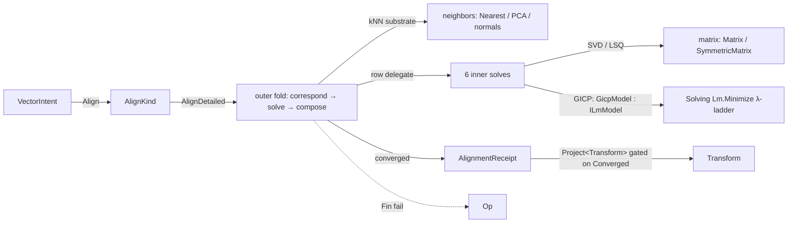

# [RASM_REGISTRATION_REGISTER]

ONE rigid-registration owner that closes point-cloud alignment over an `AlignKind` `[SmartEnum<int>]` six-row ICP dispatcher — point Umeyama-SVD Procrustes · plane Chen-Medioni linearization · symmetric Rusinkiewicz oriented-normal-sum · robust MAD-scaled Welsch IRLS · normal-weighted point-to-plane · generalized GICP (Mahalanobis precision field minimized through the Solving `Lm` functor) — behind one `AlignmentPolicy` record with a `Default` preset. Every variant shares the ONE iterative outer fold (correspond → solve step → compose → converge); the inner solve is the smart-enum row's `[UseDelegateFromConstructor]` delegate, so a new variant is a row, never a sibling solver. Correspondences ride the one neighborhood substrate (`NeighborKernel.GraphOf` over a `NeighborIndex` — the private `RTree` wrapper this page's mature ancestor carried is deleted), every linear solve routes through the `matrix` owners (`Matrix`, `SymmetricMatrix`, `SolveReceipt`) — the raw-MathNet bypass (`DenseMatrix`/`Evd`/`Cholesky` reached directly from the GICP precision builder) is deleted — and the GICP nonlinear inner optimizer INSTANTIATES `Solving/solver.md`'s `ILmModel` floor and rides `Lm.Minimize`, the corpus's one damped Gauss-Newton iterate: a register-local damped normal solve plus backtracking line search is the double-owner form that page names deleted.

Registration owns the stop vocabularies (`AlignmentStopKind`, `AlignmentOptimizerStopKind`), one `AlignmentPolicy`, the typed receipt family, and the `AlignKernel` solver body. Its entry is `AlignKind.AlignDetailed(source, target, policy, key)` over two `VectorCloud` clusters; `VectorIntent.Align` is the consumer rail, and `AlignmentReceipt.Project<Transform>` gates convergence. `CloudCorrespondence` and `CloudCorrespondenceSet` compose the `transport` vocabulary; neighborhood PCA composes `neighbors`; admission and receipt validity compose `validation` and `ValidityClaim.All`.

## [01]-[INDEX]

- [02]-[REGISTRATION]: `AlignKind` six-row ICP dispatcher + `AlignmentPolicy` + the receipt family + `AlignKernel` (shared outer fold, six inner solves, GICP precision field/objective + the `GicpModel : ILmModel` instantiation over `Lm.Minimize`, Procrustes cross-covariance SVD, SE(3) axis-angle composition).

## [02]-[REGISTRATION]

- Owner: `AlignmentStopKind` (Converged/MaxIterationsExhausted/OptimizerStopped) and `AlignmentOptimizerStopKind` (StepAccepted/StepBelowTolerance/BudgetExhausted) stop vocabularies; `AlignKind` `[SmartEnum<int>]` — six rows each carrying `NeedsTargetNormals`/`NeedsSourceNormals`/`NeedsCovariances` capability columns and the `[UseDelegateFromConstructor]` `SolveStep` delegate, so the dispatcher IS the vocabulary and the outer loop reads requirements from the row, never from a switch; `AlignmentPolicy` the ONE policy record (`MaxIterations`, outer `ConvergenceTolerance`, optimizer `ResidualTolerance`/`StepTolerance`, `RobustScale`, `CovarianceRidge`, `MadToSigma`, `OptimizerBudget`) with `Default` and monadic `Admit`; `AlignmentMatch`/`AlignmentStep` internal step carriers; `AlignmentRobustReceipt`/`AlignmentOptimizerReceipt`/`AlignmentReceipt` the typed evidence family; `AlignKernel` the internal static solver body with its `GicpModel : ILmModel` instantiation.
- Cases: `AlignKind` rows `Point` · `Plane` · `Symmetric` · `Robust` · `NormalWeightedPointToPlane` · `Generalized` (6); stop kinds (3); optimizer stops (3).
- Entry: `AlignKind.AlignDetailed(VectorCloud source, VectorCloud target, AlignmentPolicy policy, Op? key)` → `Fin<AlignmentReceipt>` — the ONE entry; the variant is the receiver row, the policy is one record, and the overload without `policy` seats `AlignmentPolicy.Default`. `VectorIntent.Align` composes it; `AlignmentReceipt.Project<Transform>(key)` is the gated output projection (a non-converged run projects `InvalidResult`, never a half-aligned transform).
- Auto: the outer fold runs `MaxIterations` rounds of correspond → solve → compose, short-circuiting on a row-emitted stop or on `DeltaMagnitude(delta) < ConvergenceTolerance`; correspondences transform the source by the current estimate, query the ONE kNN substrate (a k=1 `NeighborKernel.GraphOf` against the target's `NeighborIndex`), and assemble the `transport` correspondence set with per-row mass and the one-pass coverage/quantile statistics fold its record declares; `Point` solves weighted Procrustes — cross-covariance `H = Σ wᵢ(sᵢ−s̄)(tᵢ−t̄)ᵀ` → `Matrix.DecomposeSvd` → `R = V·diag(1,1,det(VUᵀ))·Uᵀ` with reflection correction → translation `t̄ − R·s̄`; `Plane` linearizes small-angle rows `[p×n | n]·[ω;t] = (q−p)·n` into one `Matrix.LeastSquaresDetailed`; `Symmetric` rotates the once-estimated source normals by the current transform (PCA normals are rigid-equivariant, and the row sign-aligns to the target normal so the estimate's sign ambiguity is inert), and rows the unitized sum (Rusinkiewicz second-order widening of the point-to-plane well); `Robust` computes MAD-scaled Welsch weights in the log domain (`ν = max(MadToSigma·median·RobustScale, ε)`, exponents offset by the log-max and floored above the underflow bound so EVERY weight stays strictly positive — an extreme outlier down-weights to numeric dust, never to a zero that fails the positive-weight admission) and re-runs Procrustes on the reweighted rows; `NormalWeightedPointToPlane` weights each row by `sqrt(max(|nₛ·nₜ|, ε))`; `Generalized` builds the per-correspondence fused metric `Σₜ + R·Σₛ·Rᵀ` from `neighbors` PCA covariances ONCE per transform (a held precision handle memoized inside the model — rebuilding it per fold double-pays the conditioning), inverts it through the one spectral-clamp route, and minimizes the SE(3) increment through `Lm.Minimize` over a `GicpModel : ILmModel` — `Norm` folds the weighted Mahalanobis objective at the trial transform (a failed field build evaluates `+∞`, so the λ-ladder rejects and climbs), `Linearize` scatters the analytic SE(3) Jacobian into the packed-upper 6×6 `JᵀJ`/`Jᵀr` in the `Lm.PackedIndex` layout, and the solver's own accept/reject λ-ladder replaces the register-local damping floor and Armijo backtracking under `OptimizerBudget`; every increment composes as an exact axis-angle rotation plus translation, never a drifting linearized matrix.
- Receipt: `AlignmentReceipt` (final transform, kind, stop, iterations, final delta, robust/solve/optimizer sub-evidence, the final-round correspondence set) with `Project<TOut>` routing through the `AtomProjection` typed rows; `AlignmentRobustReceipt` (Welsch scale + weight extrema); `AlignmentOptimizerReceipt` (LM evidence: costs, step norm, terminal λ, accepted-iteration count, Mahalanobis mean/max, regularized-covariance count, ridge, PCA sub-receipts). Validity is the rails `ValidityClaim.All` fold — finite-nonnegative numerics, non-null vocabulary rows, nested-evidence recursion — with no hand-rolled conjunction litany; the mature fifteen-term `IsValid` is deleted.
- Packages: MathNet.Numerics only through the `matrix` owners; `Rasm.Solving` (`Lm.Minimize`/`ILmModel`/`SolvePolicy`/`SolveStatus` — the one damped Gauss-Newton owner, composed never re-derived); TYoshimura.DoubleDouble (`ddouble` — the `ILmModel.Norm` 106-bit contract); Thinktecture.Runtime.Extensions (`[SmartEnum<int>]`, `[UseDelegateFromConstructor]`); LanguageExt.Core (`Fin`/`Seq`/`Arr`/`Option`/`guard`).
- Growth: a new ICP variant (trimmed, LM-ICP, anisotropic) is ONE `AlignKind` row with its `SolveStep` delegate and capability columns; scale estimation (Umeyama similarity) is one policy column read by the Procrustes arm; a correspondence rejection rule (distance percentile, normal compatibility) is one policy row applied inside the correspondence fold; a coarse-to-fine schedule is a policy column over the same outer fold — zero new surfaces.
- Boundary: the six solvers differ ONLY in their inner step — one outer fold owns iteration, correspondence, and convergence, and a per-variant `AlignPoint`/`AlignPlane` sibling family is the deleted form. Correspondence search composes the `neighbors` substrate (a k=1 `NeighborKernel.GraphOf` over the target's `NeighborIndex.CloudCase`; the batch spine, not the per-anchor query) and a page-local `RTree.PointCloudKNeighbors` reach is the deleted parallel rail. Source normals for the symmetric and normal-weighted rows are estimated ONCE on the source cluster and rotated per round — the mature per-round re-estimation over transformed points is the deleted recompute (rigid equivariance makes them identical up to sign, and both consumers are sign-insensitive). GICP precision follows ONE spectral route — `SymmetricMatrix.DecomposeEigenDetailed` with eigenvalues clamped to the ridge floor (`Regularized` counts every clamp) — and deletes the mature Cholesky-try/spectral-catch dual path plus its `#pragma` exception swallow: a 3×3 eigensolve is trivially cheap, the clamp IS the nearest-SPD projection, and one path is one correctness argument. GICP optimization composes `Lm.Minimize` over `GicpModel : ILmModel`; `Solving/solver.md` deletes the register-local damped normal solve, damping floor, directional-derivative bookkeeping, and Armijo loop. `MadToSigma` and `OptimizerBudget` are `AlignmentPolicy` rows, never consts. Fused metrics accumulate directly into packed-upper `SymmetricMatrix` storage and delete the raw `DenseMatrix` bypass. Every failure routes the `Op` rail (`InvalidInput`/`InvalidResult`); a thrown solver exception is forbidden.

```csharp signature
// --- [RUNTIME_PRELUDE] ---------------------------------------------------------------------
using System;
using System.Collections.Generic;
using System.Linq;
using System.Runtime.InteropServices;
using DoubleDouble;
using Rasm.Csp;
using LanguageExt;
using Rasm.Domain;
using Rasm.Numerics;
using Rasm.Solving;
using Rasm.Spatial;
using Rhino;
using Rhino.Geometry;
using Thinktecture;
using static LanguageExt.Prelude;
// CS0104 guard: Rhino.Geometry declares Matrix/Dimension homonyms under the dual usings.
using Dimension = Rasm.Numerics.Dimension;
using Matrix = Rasm.Numerics.Matrix;

namespace Rasm.Processing;

// --- [TYPES] --------------------------------------------------------------------------------
[SmartEnum<int>]
public sealed partial class AlignmentStopKind {
    public static readonly AlignmentStopKind Converged = new(key: 0);
    public static readonly AlignmentStopKind MaxIterationsExhausted = new(key: 1);
    public static readonly AlignmentStopKind OptimizerStopped = new(key: 2);
}

[SmartEnum<int>]
public sealed partial class AlignmentOptimizerStopKind {
    public static readonly AlignmentOptimizerStopKind StepAccepted = new(key: 0);
    public static readonly AlignmentOptimizerStopKind StepBelowTolerance = new(key: 1);
    public static readonly AlignmentOptimizerStopKind BudgetExhausted = new(key: 2);
}

[SmartEnum<int>]
public sealed partial class AlignKind {
    public static readonly AlignKind Point = new(key: 0, needsTargetNormals: false, needsSourceNormals: false, needsCovariances: false,
        solveStep: static (source, match, current, _, key) => AlignKernel.SolvePointToPoint(source: source, target: match.Targets, rowMass: match.RowMass, current: current, key: key));
    public static readonly AlignKind Plane = new(key: 1, needsTargetNormals: true, needsSourceNormals: false, needsCovariances: false,
        solveStep: static (source, match, current, _, key) => AlignKernel.SolvePointToPlane(source: source, target: match.Targets, normals: match.Normals, rowMass: match.RowMass, current: current, key: key));
    public static readonly AlignKind Symmetric = new(key: 2, needsTargetNormals: true, needsSourceNormals: true, needsCovariances: false,
        solveStep: static (source, match, current, _, key) => AlignKernel.SolveSymmetric(source: source, target: match.Targets, normals: match.Normals, sourceNormals: match.SourceNormals, rowMass: match.RowMass, current: current, key: key));
    public static readonly AlignKind Robust = new(key: 3, needsTargetNormals: false, needsSourceNormals: false, needsCovariances: false,
        solveStep: static (source, match, current, policy, key) => AlignKernel.SolveRobustProcrustes(source: source, target: match.Targets, residuals: match.Distances, rowMass: match.RowMass, current: current, policy: policy, key: key));
    public static readonly AlignKind NormalWeightedPointToPlane = new(key: 4, needsTargetNormals: true, needsSourceNormals: true, needsCovariances: false,
        solveStep: static (source, match, current, _, key) => AlignKernel.SolveNormalWeightedPointToPlane(source: source, target: match.Targets, targetNormals: match.Normals, sourceNormals: match.SourceNormals, rowMass: match.RowMass, current: current, key: key));
    public static readonly AlignKind Generalized = new(key: 5, needsTargetNormals: false, needsSourceNormals: false, needsCovariances: true,
        solveStep: static (source, match, current, policy, key) => AlignKernel.SolveGeneralizedIcp(source: source, match: match, current: current, policy: policy, key: key));

    public bool NeedsTargetNormals { get; }
    public bool NeedsSourceNormals { get; }
    public bool NeedsCovariances { get; }
    [UseDelegateFromConstructor] internal partial Fin<AlignmentStep> SolveStep(Seq<Point3d> source, AlignmentMatch match, Transform current, AlignmentPolicy policy, Op key);

    public Fin<AlignmentReceipt> AlignDetailed(VectorCloud source, VectorCloud target, AlignmentPolicy policy, Op? key = null) =>
        AlignKernel.AlignClouds(kind: this, source: source, target: target, policy: policy, key: key.OrDefault());
    public Fin<AlignmentReceipt> AlignDetailed(VectorCloud source, VectorCloud target, Op? key = null) =>
        AlignDetailed(source: source, target: target, policy: AlignmentPolicy.Default, key: key);
}

// --- [MODELS] -------------------------------------------------------------------------------
[BoundaryAdapter, StructLayout(LayoutKind.Auto)]
public readonly record struct AlignmentPolicy(
    Dimension MaxIterations, PositiveMagnitude ConvergenceTolerance, PositiveMagnitude ResidualTolerance,
    PositiveMagnitude StepTolerance, PositiveMagnitude RobustScale,
    PositiveMagnitude CovarianceRidge, PositiveMagnitude MadToSigma, Dimension OptimizerBudget) {
    public static readonly AlignmentPolicy Default = new(
        MaxIterations: Dimension.Create(value: 30), ConvergenceTolerance: PositiveMagnitude.Create(value: 1.0e-6),
        ResidualTolerance: PositiveMagnitude.Create(value: 1.0e-6), StepTolerance: PositiveMagnitude.Create(value: 1.0e-6),
        RobustScale: PositiveMagnitude.Create(value: 0.1), CovarianceRidge: PositiveMagnitude.Create(value: 1.0e-9),
        MadToSigma: PositiveMagnitude.Create(value: 1.4826), OptimizerBudget: Dimension.Create(value: 8));
    // Guards the default-struct hole: a defaulted value-object field carries 0 and fails its claim row.
    internal Fin<AlignmentPolicy> Admit(Op key) {
        AlignmentPolicy self = this;
        return guard(ValidityClaim.All(
                ValidityClaim.CountAtLeast(count: self.MaxIterations.Value, floor: 1),
                ValidityClaim.Positive(value: self.ConvergenceTolerance.Value),
                ValidityClaim.Positive(value: self.ResidualTolerance.Value),
                ValidityClaim.Positive(value: self.StepTolerance.Value),
                ValidityClaim.Positive(value: self.RobustScale.Value),
                ValidityClaim.Positive(value: self.CovarianceRidge.Value),
                ValidityClaim.Positive(value: self.MadToSigma.Value),
                ValidityClaim.CountAtLeast(count: self.OptimizerBudget.Value, floor: 1)), key.InvalidInput())
            .ToFin().Map(_ => self);
    }
    // GICP rides the canonical Solving λ rows; its stopping quantities and budget project from
    // this policy while outer transform convergence remains independently tunable.
    internal SolvePolicy Ladder => SolvePolicy.Canonical with {
        ResidualTolerance = this.ResidualTolerance, StepFloor = StepTolerance.Value, MaxIterations = OptimizerBudget.Value,
    };
}

[BoundaryAdapter, StructLayout(LayoutKind.Auto)]
public readonly record struct AlignmentRobustReceipt(double Scale, double MinWeight, double MaxWeight) : IValidityEvidence {
    public bool IsValid => ValidityClaim.All(
        ValidityClaim.Positive(value: Scale),
        ValidityClaim.Nonnegative(value: MinWeight),
        ValidityClaim.Nonnegative(value: MaxWeight),
        ValidityClaim.Of(MinWeight <= MaxWeight));
}

[BoundaryAdapter, StructLayout(LayoutKind.Auto)]
public readonly record struct AlignmentOptimizerReceipt(
    AlignmentOptimizerStopKind Stop, int Iterations, double InitialCost, double FinalCost, double StepNorm,
    double TerminalLambda, double MeanMahalanobis, double MaxMahalanobis, int RegularizedCovarianceCount, double CovarianceRidge,
    NeighborhoodPcaReceipt SourcePca, NeighborhoodPcaReceipt TargetPca) : IValidityEvidence {
    public bool IsValid => ValidityClaim.All(
        ValidityClaim.Of(Stop is not null && Iterations >= 0 && RegularizedCovarianceCount >= 0),
        ValidityClaim.Nonnegative(value: InitialCost),
        ValidityClaim.Nonnegative(value: FinalCost),
        ValidityClaim.Nonnegative(value: StepNorm),
        ValidityClaim.Positive(value: TerminalLambda),
        ValidityClaim.Nonnegative(value: MeanMahalanobis),
        ValidityClaim.Nonnegative(value: MaxMahalanobis),
        ValidityClaim.Of(MeanMahalanobis <= MaxMahalanobis),
        ValidityClaim.Positive(value: CovarianceRidge),
        ValidityClaim.Evidence(SourcePca),
        ValidityClaim.Evidence(TargetPca));
}

internal readonly record struct AlignmentMatch(
    CloudCorrespondenceSet Correspondences, Point3d[] Targets, Vector3d[] Normals, Vector3d[] SourceNormals, double[] Distances,
    double[] RowMass, int[] TargetIndices, Option<NeighborhoodPcaResult> SourcePca = default, Option<NeighborhoodPcaResult> TargetPca = default);

internal readonly record struct AlignmentStep(
    Transform Delta, Option<SolveReceipt> Solve = default, Option<AlignmentRobustReceipt> Robust = default,
    Option<AlignmentOptimizerReceipt> Optimizer = default, Option<AlignmentStopKind> Stop = default);

[BoundaryAdapter, StructLayout(LayoutKind.Auto)]
public readonly record struct AlignmentReceipt(
    Transform Transform, AlignKind Kind, AlignmentStopKind Stop, int Iterations, double FinalDelta,
    Option<AlignmentRobustReceipt> Robust, CloudCorrespondenceSet Correspondences, Option<SolveReceipt> Solve,
    Option<AlignmentOptimizerReceipt> Optimizer) : IValidityEvidence {
    public bool IsValid => ValidityClaim.All(
        ValidityClaim.Of(Kind is not null && Stop is not null && Transform.IsValid),
        ValidityClaim.CountAtLeast(count: Iterations, floor: 0),
        ValidityClaim.Nonnegative(value: FinalDelta),
        ValidityClaim.Of(Robust.Map(static receipt => receipt.IsValid).IfNone(noneValue: true)),
        ValidityClaim.Of(Solve.Map(static receipt => receipt.IsValid).IfNone(noneValue: true)),
        ValidityClaim.Of(Optimizer.Map(static receipt => receipt.IsValid).IfNone(noneValue: true)));
    public Fin<TOut> Project<TOut>(Op key) {
        AlignmentReceipt self = this;
        return AtomProjection.Rows<AlignmentReceipt, TOut>(self: self, key: key,
            ProjectionRow.Of<Transform>(() => self.Stop.Equals(AlignmentStopKind.Converged)
                ? key.AcceptValue(value: self.Transform)
                : Fin.Fail<Transform>(key.InvalidResult())));
    }
}

// --- [OPERATIONS] ---------------------------------------------------------------------------
internal static class AlignKernel {
    // Numeric-representation bound (double exp underflows below ~-745), not a tunable — never a policy row.
    private const double WelschLogFloor = -700.0;

    private readonly record struct IcpState(Transform Current, double FinalDelta, int Iterations, AlignmentStep Step, Option<AlignmentStopKind> Stop);

    // --- [OUTER_FOLD]
    internal static Fin<AlignmentReceipt> AlignClouds(AlignKind kind, VectorCloud source, VectorCloud target, AlignmentPolicy policy, Op key) =>
        from activePolicy in policy.Admit(key: key)
        from receipt in (source, target) switch {
            (VectorCloud.ClusterCase src, VectorCloud.ClusterCase tgt) => IcpAlign(source: src, target: tgt, kind: kind, policy: activePolicy, key: key),
            _ => Fin.Fail<AlignmentReceipt>(error: key.InvalidInput()),
        }
        select receipt;

    private static Fin<AlignmentReceipt> IcpAlign(VectorCloud.ClusterCase source, VectorCloud.ClusterCase target, AlignKind kind, AlignmentPolicy policy, Op key) =>
        from neighborhoodPolicy in NeighborhoodPolicy.Default(key: key)
        from targetNormals in kind.NeedsTargetNormals ? NeighborKernel.OrientNormals(cluster: target, policy: neighborhoodPolicy, key: key).Map(static seq => seq.AsIterable().ToArray()) : Fin.Succ(System.Array.Empty<Vector3d>())
        from sourceNormals in kind.NeedsSourceNormals ? NeighborKernel.OrientNormals(cluster: source, policy: neighborhoodPolicy, key: key).Map(static seq => seq.AsIterable().ToArray()) : Fin.Succ(System.Array.Empty<Vector3d>())
        from sourcePca in kind.NeedsCovariances ? NeighborKernel.PcaOf(cluster: source, policy: neighborhoodPolicy, key: key).Map(Some) : Fin.Succ(Option<NeighborhoodPcaResult>.None)
        from targetPca in kind.NeedsCovariances ? NeighborKernel.PcaOf(cluster: target, policy: neighborhoodPolicy, key: key).Map(Some) : Fin.Succ(Option<NeighborhoodPcaResult>.None)
        from sourceMass in CloudKernel.MassOf(cluster: source, key: key)
        from targetMass in CloudKernel.MassOf(cluster: target, key: key)
        let nearestPolicy = neighborhoodPolicy with { NeighborCount = Dimension.Create(value: 1) }
        from final in toSeq(Enumerable.Range(start: 0, count: policy.MaxIterations.Value)).Fold(
            initialState: Fin.Succ(new IcpState(Current: Transform.Identity, FinalDelta: double.PositiveInfinity, Iterations: 0, Step: new AlignmentStep(Delta: Transform.Identity), Stop: Option<AlignmentStopKind>.None)),
            f: (acc, iter) => acc.Bind(state => state.Stop.IsSome
                ? Fin.Succ(state)
                : from match in Correspond(source: source.Vertices, sourceMass: sourceMass, target: target, targetMass: targetMass, normals: targetNormals, sourceNormals: sourceNormals, current: state.Current, nearestPolicy: nearestPolicy, sourcePca: sourcePca, targetPca: targetPca, key: key)
                  from step in kind.SolveStep(source: source.Vertices, match: match, current: state.Current, policy: policy, key: key)
                  let current = step.Delta * state.Current
                  let finalDelta = DeltaMagnitude(delta: step.Delta)
                  select new IcpState(Current: current, FinalDelta: finalDelta, Iterations: iter + 1, Step: step,
                      Stop: step.Stop.IsSome ? step.Stop : finalDelta < policy.ConvergenceTolerance.Value ? Some(AlignmentStopKind.Converged) : Option<AlignmentStopKind>.None)))
        from finalMatch in Correspond(source: source.Vertices, sourceMass: sourceMass, target: target, targetMass: targetMass, normals: targetNormals, sourceNormals: sourceNormals, current: final.Current, nearestPolicy: nearestPolicy, sourcePca: sourcePca, targetPca: targetPca, key: key)
        select new AlignmentReceipt(Transform: final.Current, Kind: kind, Stop: final.Stop.IfNone(AlignmentStopKind.MaxIterationsExhausted), Iterations: final.Iterations, FinalDelta: final.FinalDelta,
            Robust: final.Step.Robust, Correspondences: finalMatch.Correspondences, Solve: final.Step.Solve, Optimizer: final.Step.Optimizer);

    private static double DeltaMagnitude(Transform delta) {
        double diff = 0.0;
        for (int i = 0; i < 4; i++) for (int j = 0; j < 4; j++) diff += Math.Abs(value: delta[i, j] - (i == j ? 1.0 : 0.0));
        return diff;
    }

    // Correspondence rides the one kNN substrate; the per-row carriers are the transport vocabulary.
    private static Fin<AlignmentMatch> Correspond(Seq<Point3d> source, Arr<double> sourceMass, VectorCloud.ClusterCase target, Arr<double> targetMass, Vector3d[] normals, Vector3d[] sourceNormals, Transform current, NeighborhoodPolicy nearestPolicy, Option<NeighborhoodPcaResult> sourcePca, Option<NeighborhoodPcaResult> targetPca, Op key) {
        int n = source.Count;
        Fin<Unit> admitted = from sourceCount in Admit.SameCount(expected: n, key: key, counts: [sourceMass.Count])
                             from targetCount in Admit.SameCount(expected: target.Vertices.Count, key: key, counts: [targetMass.Count])
                             from normalCount in normals.Length == 0 ? Fin.Succ(unit) : Admit.SameCount(expected: target.Vertices.Count, key: key, counts: [normals.Length])
                             from sourceNormalCount in sourceNormals.Length == 0 ? Fin.Succ(unit) : Admit.SameCount(expected: n, key: key, counts: [sourceNormals.Length])
                             from transform in guard(current.IsValid, key.InvalidInput()).ToFin()
                             select unit;
        return admitted.Bind(_ => {
            Point3d[] transformed = [.. source.AsIterable().Select(point => current * point)];
            return NeighborKernel.GraphOf(index: new NeighborIndex.CloudCase(Source: target), needles: transformed, policy: nearestPolicy, key: key).Bind(graph => target.UseIndex(key: key, project: indexed => key.Catch(() => {
                Point3d[] targets = new Point3d[n]; Vector3d[] rowNormals = normals.Length == 0 ? [] : new Vector3d[n];
                double[] distances = new double[n]; double[] rowMass = new double[n]; int[] targetIndices = new int[n];
                List<CloudCorrespondence> items = new(capacity: n);
                for (int i = 0; i < n; i++) {
                    int nearest = graph.Ids.Length > i && graph.Ids[i].Length > 0 ? graph.Ids[i][0] : -1;
                    if (nearest < 0 || nearest >= target.Vertices.Count || (normals.Length > 0 && nearest >= normals.Length)) return Fin.Fail<AlignmentMatch>(key.InvalidResult());
                    Point3d targetPoint = indexed.PointAt(index: nearest);
                    Vector3d residual = targetPoint - transformed[i];
                    double squared = residual.SquareLength;
                    targets[i] = targetPoint; distances[i] = Math.Sqrt(d: squared); rowMass[i] = sourceMass[index: i]; targetIndices[i] = nearest;
                    if (normals.Length > 0) rowNormals[i] = normals[nearest];
                    items.Add(item: new CloudCorrespondence(SourceIndex: i, TargetIndex: nearest, SourcePoint: transformed[i], TargetPoint: targetPoint, Residual: residual,
                        Distance: distances[i], SquaredDistance: squared, SourceMass: Some(sourceMass[index: i]), TargetMass: Some(targetMass[index: nearest]),
                        CouplingMass: Some(sourceMass[index: i]), Confidence: Option<double>.None));
                }
                return Fin.Succ(new AlignmentMatch(Correspondences: CorrespondenceSetOf(items: items, distances: distances, rowMass: rowMass, targetIndices: targetIndices, targetMass: targetMass, sourceCount: n, targetCount: target.Vertices.Count),
                    Targets: targets, Normals: rowNormals, SourceNormals: sourceNormals, Distances: distances, RowMass: rowMass, TargetIndices: targetIndices, SourcePca: sourcePca, TargetPca: targetPca));
            })));
        });
    }

    // CloudCorrespondenceSet folds hard-kNN statistics once: coupling mass = row mass, every source
    // row retained, covered targets = distinct nearest hits; quantiles read ONE sorted distance array.
    private static CloudCorrespondenceSet CorrespondenceSetOf(List<CloudCorrespondence> items, double[] distances, double[] rowMass, int[] targetIndices, Arr<double> targetMass, int sourceCount, int targetCount) {
        double totalMass = 0.0, weightedSquares = 0.0;
        for (int i = 0; i < distances.Length; i++) { totalMass += rowMass[i]; weightedSquares += rowMass[i] * distances[i] * distances[i]; }
        double rmse = totalMass > RhinoMath.ZeroTolerance ? Math.Sqrt(d: weightedSquares / totalMass) : 0.0;
        double[] sorted = [.. distances.Order()];
        double Quantile(double q) => sorted.Length == 0 ? 0.0 : sorted[Math.Min(val1: sorted.Length - 1, val2: (int)Math.Floor(d: q * (sorted.Length - 1)))];
        int[] covered = [.. targetIndices.Distinct().Order()];
        double retainedTargetMass = 0.0;
        foreach (int index in covered) retainedTargetMass += targetMass[index: index];
        return new CloudCorrespondenceSet(Items: toSeq(items), SourceCount: sourceCount, TargetCount: targetCount, NonZeroCount: items.Count,
            TotalMass: totalMass, Rmse: rmse, MedianDistance: Quantile(q: 0.5), MaxDistance: sorted.Length == 0 ? 0.0 : sorted[^1],
            Quantile90: Quantile(q: 0.90), Quantile95: Quantile(q: 0.95), CoveredSourceCount: sourceCount, CoveredTargetCount: covered.Length,
            RetainedSourceMass: totalMass, RetainedTargetMass: retainedTargetMass);
    }

    // --- [INNER_SOLVES]
    internal static Fin<AlignmentStep> SolvePointToPoint(Seq<Point3d> source, Point3d[] target, double[] rowMass, Transform current, Op key) =>
        SolveProcrustes(source: source, target: target, weights: rowMass, current: current, key: key).Map(static delta => new AlignmentStep(Delta: delta));

    // Chen-Medioni small-angle linearization: rows [p x n | n] . [omega; t] = (q - p) . n.
    internal static Fin<AlignmentStep> SolvePointToPlane(Seq<Point3d> source, Point3d[] target, Vector3d[] normals, double[] rowMass, Transform current, Op key) =>
        SolveLinearizedRows(source: source, target: target, normals: normals, rowMass: rowMass, current: current, key: key, rowNormal: static (_, normal) => (Normal: normal, Weight: 1.0));

    // Source normals arrive once-estimated on the raw cluster; the rigid rotation transports them to the current pose.
    internal static Fin<AlignmentStep> SolveSymmetric(Seq<Point3d> source, Point3d[] target, Vector3d[] normals, Vector3d[] sourceNormals, double[] rowMass, Transform current, Op key) =>
        Admit.SameCount(expected: source.Count, key: key, counts: [sourceNormals.Length]).Bind(_ => SolveLinearizedRows(
            source: source, target: target, normals: normals, rowMass: rowMass, current: current, key: key,
            rowNormal: (i, targetNormal) => {
                Vector3d rotated = current * sourceNormals[i];
                Vector3d sourceNormal = rotated * targetNormal < 0.0 ? -rotated : rotated;
                Vector3d combined = sourceNormal + targetNormal;
                _ = combined.Unitize();
                return (Normal: combined, Weight: 1.0);
            }));

    internal static Fin<AlignmentStep> SolveRobustProcrustes(Seq<Point3d> source, Point3d[] target, double[] residuals, double[] rowMass, Transform current, AlignmentPolicy policy, Op key) {
        int n = source.Count;
        Fin<int> admitted = from count in AdmitAlignmentRows(source: source, target: target, weights: rowMass, minimum: 3, key: key)
                            from residualCount in Admit.SameCount(expected: count, key: key, counts: [residuals.Length])
                            from finiteResiduals in Admit.AllFinite(residuals, key)
                            select count;
        return admitted.Bind(_ => {
            double[] weights = new double[n];
            double[] sortedResiduals = [.. residuals.Select(static residual => Math.Abs(value: residual)).Order()];
            double median = sortedResiduals.Length == 0 ? 1.0 : sortedResiduals[sortedResiduals.Length / 2];
            double nu = Math.Max(val1: policy.MadToSigma.Value * median * policy.RobustScale.Value, val2: RhinoMath.SqrtEpsilon);
            double[] logs = [.. residuals.Select(residual => -(residual * residual) / (2.0 * nu * nu))];
            double offset = logs.Max();
            // Exponent floored above the exp underflow bound: an extreme outlier down-weights to numeric dust, never
            // to an exact zero that would fail the strictly-positive weight admission the shared Procrustes rail runs.
            for (int i = 0; i < n; i++) weights[i] = rowMass[i] * Math.Exp(d: Math.Max(val1: logs[i] - offset, val2: WelschLogFloor));
            return from aligned in SolveProcrustes(source: source, target: target, weights: weights, current: current, key: key)
                   select new AlignmentStep(Delta: aligned, Robust: Some(new AlignmentRobustReceipt(Scale: nu, MinWeight: weights.Min(), MaxWeight: weights.Max())));
        });
    }

    internal static Fin<AlignmentStep> SolveNormalWeightedPointToPlane(Seq<Point3d> source, Point3d[] target, Vector3d[] targetNormals, Vector3d[] sourceNormals, double[] rowMass, Transform current, Op key) =>
        Admit.SameCount(expected: source.Count, key: key, counts: [sourceNormals.Length]).Bind(_ => SolveLinearizedRows(
            source: source, target: target, normals: targetNormals, rowMass: rowMass, current: current, key: key,
            rowNormal: (i, normal) => (Normal: normal, Weight: Math.Sqrt(d: Math.Max(val1: Math.Abs(value: (current * sourceNormals[i]) * normal), val2: RhinoMath.SqrtEpsilon)))));

    // GICP uses the Solving functor: seed field + objective mint Fin-railed, then the
    // model rides Lm.Minimize — the λ-ladder owns damping and step acceptance, and a SingularSystem
    // failure from the functor surfaces unchanged.
    internal static Fin<AlignmentStep> SolveGeneralizedIcp(Seq<Point3d> source, AlignmentMatch match, Transform current, AlignmentPolicy policy, Op key) =>
        from sourcePca in match.SourcePca.ToFin(key.InvalidInput())
        from targetPca in match.TargetPca.ToFin(key.InvalidInput())
        from rows in AdmitAlignmentRows(source: source, target: match.Targets, weights: match.RowMass, minimum: 3, key: key)
        from sourcePcaCount in Admit.SameCount(expected: rows, key: key, counts: [sourcePca.Samples.Count])
        from targetIndexCount in Admit.SameCount(expected: rows, key: key, counts: [match.TargetIndices.Length])
        from targetIndices in guard(match.TargetIndices.All(index => index >= 0 && index < targetPca.Samples.Count), key.InvalidInput())
        from seedField in PrecisionFieldOf(source: source, match: match, sourcePca: sourcePca, targetPca: targetPca, current: current, covarianceRidge: policy.CovarianceRidge.Value, key: key)
        from initial in ObjectiveOf(source: source, match: match, precision: seedField, current: current, key: key)
        let model = new GicpModel(source: source, match: match, sourcePca: sourcePca, targetPca: targetPca, current: current, seedField: seedField, seedObjective: initial, covarianceRidge: policy.CovarianceRidge.Value, key: key)
        from result in Lm.Minimize(model: model, policy: policy.Ladder, key: key)
        select GicpStep(model: model, result: result, initial: initial, sourcePca: sourcePca, targetPca: targetPca);

    // LmResult → AlignmentStep: a zero-iteration converged run holds the pose (StepBelowTolerance ⇒
    // outer Converged); an accepted increment composes exactly (StepAccepted); an inner-budget stall
    // applies its best-so-far increment, records BudgetExhausted, and stops the outer fold on
    // OptimizerStopped — the receipt gate then refuses the transform projection.
    private static AlignmentStep GicpStep(GicpModel model, LmResult result, GicpObjective initial, NeighborhoodPcaResult sourcePca, NeighborhoodPcaResult targetPca) {
        double stepNorm = Math.Sqrt(d: result.Parameters.Sum(static value => value * value));
        GicpObjective at = result.Iterations == 0 ? initial : model.Objective;
        bool converged = result.Status == SolveStatus.Converged;
        AlignmentOptimizerStopKind stop = converged
            ? result.Iterations == 0 ? AlignmentOptimizerStopKind.StepBelowTolerance : AlignmentOptimizerStopKind.StepAccepted
            : AlignmentOptimizerStopKind.BudgetExhausted;
        AlignmentOptimizerReceipt receipt = new(
            Stop: stop, Iterations: result.Iterations, InitialCost: (double)initial.Cost, FinalCost: (double)at.Cost, StepNorm: stepNorm,
            TerminalLambda: result.Lambda, MeanMahalanobis: at.MeanMahalanobis, MaxMahalanobis: at.MaxMahalanobis,
            RegularizedCovarianceCount: at.RegularizedCount, CovarianceRidge: at.Ridge, SourcePca: sourcePca.Receipt, TargetPca: targetPca.Receipt);
        Transform delta = result.Iterations == 0
            ? Transform.Identity
            : ComposeRigidTransform(
                omega: new Vector3d(x: result.Parameters[0], y: result.Parameters[1], z: result.Parameters[2]),
                translation: new Vector3d(x: result.Parameters[3], y: result.Parameters[4], z: result.Parameters[5]));
        return new AlignmentStep(Delta: delta, Optimizer: Some(receipt),
            Stop: !converged ? Some(AlignmentStopKind.OptimizerStopped)
                : result.Iterations == 0 ? Some(AlignmentStopKind.Converged)
                : Option<AlignmentStopKind>.None);
    }

    private static Fin<int> AdmitAlignmentRows(Seq<Point3d> source, Point3d[] target, double[] weights, int minimum, Op key) =>
        from count in Admit.CountAtLeast(count: source.Count, minimum: minimum, key: key).Map(_ => source.Count)
        from same in Admit.SameCount(expected: count, key: key, counts: [target.Length, weights.Length])
        from sourceFinite in Admit.AllFinite(points: source, key: key)
        from targetFinite in Admit.AllFinite(key: key, points: target)
        from mass in Admit.PositiveFiniteWeights(weights: weights, count: count, key: key)
        select count;

    // --- [PROCRUSTES]
    private static Fin<Transform> SolveProcrustes(Seq<Point3d> source, Point3d[] target, double[] weights, Transform current, Op key) {
        Seq<Point3d> transformedSource = toSeq(source.AsIterable().Select(p => current * p));
        Seq<Point3d> targetSeq = toSeq(target);
        return from rows in AdmitAlignmentRows(source: transformedSource, target: target, weights: weights, minimum: 3, key: key)
               from srcCentroid in WeightedCentroidOf(points: transformedSource, weights: weights, key: key)
               from tgtCentroid in WeightedCentroidOf(points: targetSeq, weights: weights, key: key)
               from aligned in AlignViaCrossCovariance(source: transformedSource, target: targetSeq, srcCentroid: srcCentroid, tgtCentroid: tgtCentroid, weights: weights, key: key)
               select aligned;
    }

    private static Fin<Point3d> WeightedCentroidOf(Seq<Point3d> points, double[] weights, Op key) {
        Vector3d sum = Vector3d.Zero; double totalW = 0.0;
        for (int i = 0; i < points.Count; i++) { sum += weights[i] * (Vector3d)points[index: i]; totalW += weights[i]; }
        return totalW > RhinoMath.ZeroTolerance && RhinoMath.IsValidDouble(x: totalW)
            ? key.AcceptValue(value: Point3d.Origin + (sum / totalW))
            : Fin.Fail<Point3d>(key.InvalidResult());
    }

    // H = sum w_i (s_i - s̄)(t_i - t̄)^T -> SVD -> R = V diag(1,1,det(VU^T)) U^T; translation = t̄ - R s̄.
    private static Fin<Transform> AlignViaCrossCovariance(Seq<Point3d> source, Seq<Point3d> target, Point3d srcCentroid, Point3d tgtCentroid, double[]? weights, Op key) {
        Dimension dim3 = Dimension.Create(value: 3);
        double[] cross = new double[9];
        for (int i = 0; i < source.Count; i++) {
            double w = weights is null ? 1.0 : weights[i];
            Vector3d sv = source[index: i] - srcCentroid; Vector3d tv = target[index: i] - tgtCentroid;
            cross[0] += w * sv.X * tv.X; cross[1] += w * sv.X * tv.Y; cross[2] += w * sv.X * tv.Z;
            cross[3] += w * sv.Y * tv.X; cross[4] += w * sv.Y * tv.Y; cross[5] += w * sv.Y * tv.Z;
            cross[6] += w * sv.Z * tv.X; cross[7] += w * sv.Z * tv.Y; cross[8] += w * sv.Z * tv.Z;
        }
        return from h in Matrix.Of(rows: dim3, cols: dim3, entries: new Arr<double>(cross), key: key)
               from svd in h.DecomposeSvd(key: key)
               from vu in svd.V.Multiply(other: svd.U.Transpose(), key: key)
               from det in vu.Determinant(key: key)
               let diag = new[] { 1.0, 1.0, det >= 0.0 ? 1.0 : -1.0 }
               from d in Matrix.Of(rows: dim3, cols: dim3, entries: new Arr<double>([.. Enumerable.Range(start: 0, count: 9).Select(idx => (idx / 3) == (idx % 3) ? diag[idx / 3] : 0.0)]), key: key)
               from vd in svd.V.Multiply(other: d, key: key)
               from rot in vd.Multiply(other: svd.U.Transpose(), key: key)
               let rotation = RotationTransformOf(rotation: rot)
               select WithTranslation(rotation: rotation, translation: tgtCentroid - (rotation * srcCentroid));
    }

    private static Fin<AlignmentStep> SolveLinearizedRows(Seq<Point3d> source, Point3d[] target, Vector3d[] normals, double[] rowMass, Transform current, Op key, Func<int, Vector3d, (Vector3d Normal, double Weight)> rowNormal) {
        int n = source.Count;
        Fin<int> admitted = from count in AdmitAlignmentRows(source: source, target: target, weights: rowMass, minimum: 6, key: key)
                            from normalCount in Admit.SameCount(expected: count, key: key, counts: [normals.Length])
                            from finiteNormals in Admit.AllValid(key: key, vectors: normals)
                            select count;
        return admitted.Bind(_ => {
            double[] aFlat = new double[n * 6]; double[] b = new double[n];
            for (int i = 0; i < n; i++) {
                (Vector3d rawNormal, double weight) = rowNormal(i, normals[i]);
                double massWeight = Math.Sqrt(d: rowMass[i]);
                if (!rawNormal.IsValid || rawNormal.SquareLength <= RhinoMath.SqrtEpsilon * RhinoMath.SqrtEpsilon || !RhinoMath.IsValidDouble(x: weight) || weight <= 0.0)
                    return Fin.Fail<AlignmentStep>(key.InvalidResult());
                Point3d p = current * source[index: i]; Point3d q = target[i]; Vector3d nrm = weight * massWeight * rawNormal;
                Vector3d cross = Vector3d.CrossProduct(a: (Vector3d)p, b: nrm);
                aFlat[(i * 6) + 0] = cross.X; aFlat[(i * 6) + 1] = cross.Y; aFlat[(i * 6) + 2] = cross.Z;
                aFlat[(i * 6) + 3] = nrm.X; aFlat[(i * 6) + 4] = nrm.Y; aFlat[(i * 6) + 5] = nrm.Z;
                b[i] = (q - p) * nrm;
            }
            return Matrix.Of(rows: Dimension.Create(value: n), cols: Dimension.Create(value: 6), entries: new Arr<double>(aFlat), key: key)
                .Bind(design => design.LeastSquaresDetailed(rhs: new Arr<double>(b), key: key))
                .Bind(receipt => receipt.Solution.Count == 6 && receipt.Solution.ForAll(RhinoMath.IsValidDouble)
                    ? Fin.Succ(new AlignmentStep(
                        Delta: ComposeRigidTransform(omega: new Vector3d(x: receipt.Solution[0], y: receipt.Solution[1], z: receipt.Solution[2]), translation: new Vector3d(x: receipt.Solution[3], y: receipt.Solution[4], z: receipt.Solution[5])),
                        Solve: Some(receipt)))
                    : Fin.Fail<AlignmentStep>(key.InvalidResult()));
        });
    }

    // --- [GICP]
    // Cost folds at 106-bit ddouble — the ILmModel.Norm contract: the accept-deciding digits of two
    // nearly equal trial costs survive; receipts narrow to double at readout.
    [StructLayout(LayoutKind.Auto)] private readonly record struct GicpObjective(ddouble Cost, double MeanMahalanobis, double MaxMahalanobis, int RegularizedCount, double Ridge);
    // Held precision handle: the fused inverse metric is rotation-dependent, built once per transform and memoized
    // inside GicpModel beside its objective; recomputing it per functor callback double-pays the eigensolve.
    [StructLayout(LayoutKind.Auto)] private readonly record struct GicpPrecisionField(SymmetricMatrix[] Inverses, int RegularizedCount, double Ridge);

    private static Fin<GicpPrecisionField> PrecisionFieldOf(Seq<Point3d> source, AlignmentMatch match, NeighborhoodPcaResult sourcePca, NeighborhoodPcaResult targetPca, Transform current, double covarianceRidge, Op key) =>
        toSeq(Enumerable.Range(start: 0, count: source.Count)).Fold(
            initialState: Fin.Succ((Inverses: new SymmetricMatrix[source.Count], Regularized: 0, Ridge: 0.0)),
            f: (acc, i) => acc.Bind(state =>
                PrecisionOf(current: current, source: sourcePca.Samples[index: i].Covariance, target: targetPca.Samples[index: match.TargetIndices[i]].Covariance, covarianceRidge: covarianceRidge, key: key)
                    .Map(precision => { state.Inverses[i] = precision.Inverse; return (state.Inverses, state.Regularized + (precision.Regularized ? 1 : 0), Math.Max(val1: state.Ridge, val2: precision.Ridge)); })))
            .Map(state => new GicpPrecisionField(Inverses: state.Inverses, RegularizedCount: state.Regularized, Ridge: state.Ridge));

    [StructLayout(LayoutKind.Auto)] private readonly record struct GicpPrecision(SymmetricMatrix Inverse, bool Regularized, double Ridge);

    // Fused metric Sigma_t + R Sigma_s R^T accumulated directly into packed-upper symmetric storage; the inverse is the ONE
    // spectral route — eigenvalues clamped at the ridge floor rebuild V diag(1/max(lambda,floor)) V^T, so an indefinite or
    // near-singular metric regularizes deterministically and the clamp count is the evidence. No dense-library bypass.
    private static Fin<GicpPrecision> PrecisionOf(Transform current, SymmetricMatrix source, SymmetricMatrix target, double covarianceRidge, Op key) {
        Span<double> rs = stackalloc double[9];
        for (int i = 0; i < 3; i++) for (int j = 0; j < 3; j++) { double sum = 0.0; for (int k = 0; k < 3; k++) sum += current[i, k] * source.At(i: k, j: j); rs[(i * 3) + j] = sum; }
        double[] upper = new double[6]; int slot = 0; double trace = 0.0;
        for (int i = 0; i < 3; i++) for (int j = i; j < 3; j++) {
            double rrt = 0.0;
            for (int k = 0; k < 3; k++) rrt += rs[(i * 3) + k] * current[j, k];
            double value = target.At(i: i, j: j) + rrt;
            if (i == j) trace += value;
            upper[slot++] = value;
        }
        double floor = Math.Max(val1: RhinoMath.SqrtEpsilon, val2: covarianceRidge * Math.Max(val1: Math.Abs(value: trace / 3.0), val2: 1.0));
        return from fused in SymmetricMatrix.Of(dim: Dimension.Create(value: 3), upper: new Arr<double>(upper), key: key)
               from eigen in fused.DecomposeEigenDetailed(key: key)
               from inverse in SpectralInverseOf(pairs: eigen.Pairs, floor: floor, key: key)
               select new GicpPrecision(Inverse: inverse.Matrix, Regularized: inverse.Clamped > 0, Ridge: floor);
    }

    private static Fin<(SymmetricMatrix Matrix, int Clamped)> SpectralInverseOf(Seq<(double Eigenvalue, Arr<double> Eigenvector)> pairs, double floor, Op key) {
        if (pairs.Count != 3) return Fin.Fail<(SymmetricMatrix, int)>(key.InvalidResult());
        double[] upper = new double[6]; int clamped = 0;
        foreach ((double eigenvalue, Arr<double> vector) in pairs) {
            double lambda = Math.Max(val1: eigenvalue, val2: floor);
            if (eigenvalue < floor) clamped++;
            double inv = 1.0 / lambda; int slot = 0;
            for (int i = 0; i < 3; i++) for (int j = i; j < 3; j++) upper[slot++] += inv * vector[index: i] * vector[index: j];
        }
        return Admit.AllFinite(upper, key)
            .Bind(_ => SymmetricMatrix.Of(dim: Dimension.Create(value: 3), upper: new Arr<double>(upper), key: key))
            .Map(matrix => (matrix, clamped));
    }

    private static Fin<GicpObjective> ObjectiveOf(Seq<Point3d> source, AlignmentMatch match, GicpPrecisionField precision, Transform current, Op key) =>
        key.Catch(() => {
            ddouble total = 0.0, massTotal = 0.0; double max = 0.0;
            for (int i = 0; i < source.Count; i++) {
                Point3d x = current * source[index: i];
                Vector3d r = match.Targets[i] - x;
                SymmetricMatrix inverse = precision.Inverses[i];
                double mahalanobis =
                    (r.X * ((inverse.At(i: 0, j: 0) * r.X) + (inverse.At(i: 0, j: 1) * r.Y) + (inverse.At(i: 0, j: 2) * r.Z)))
                    + (r.Y * ((inverse.At(i: 1, j: 0) * r.X) + (inverse.At(i: 1, j: 1) * r.Y) + (inverse.At(i: 1, j: 2) * r.Z)))
                    + (r.Z * ((inverse.At(i: 2, j: 0) * r.X) + (inverse.At(i: 2, j: 1) * r.Y) + (inverse.At(i: 2, j: 2) * r.Z)));
                if (!RhinoMath.IsValidDouble(x: mahalanobis) || mahalanobis < 0.0) return Fin.Fail<GicpObjective>(key.InvalidResult());
                ddouble mass = (ddouble)match.RowMass[i];
                total += mass * (ddouble)mahalanobis;
                massTotal += mass;
                max = Math.Max(val1: max, val2: mahalanobis);
            }
            double mean = massTotal > (ddouble)RhinoMath.ZeroTolerance ? (double)(total / massTotal) : (double)total;
            return RhinoMath.IsValidDouble(x: (double)total) && RhinoMath.IsValidDouble(x: mean)
                ? Fin.Succ(new GicpObjective(Cost: total, MeanMahalanobis: mean, MaxMahalanobis: max, RegularizedCount: precision.RegularizedCount, Ridge: precision.Ridge))
                : Fin.Fail<GicpObjective>(key.InvalidResult());
        });

    // GicpModel owns the SE(3) increment: parameters = [ω; t] composed onto the base
    // transform. Norm rebuilds the rotation-dependent fused precision field at the trial transform —
    // a failed build evaluates +∞ so the λ-ladder rejects and climbs, the same collapse the retired
    // line search spelled — and memoizes field + objective, so Linearize (which the functor calls only
    // at parameters an accepting Norm already evaluated) reads the held handle: one build per transform.
    private sealed class GicpModel(
        Seq<Point3d> source, AlignmentMatch match, NeighborhoodPcaResult sourcePca, NeighborhoodPcaResult targetPca,
        Transform current, GicpPrecisionField seedField, GicpObjective seedObjective, double covarianceRidge, Op key) : ILmModel {
        private GicpPrecisionField memoField = seedField;
        private GicpObjective memoObjective = seedObjective;

        public int Dof => 6;
        public double[] Seed { get; } = new double[6];
        internal GicpObjective Objective => memoObjective;

        public ddouble Norm(ReadOnlySpan<double> parameters) {
            Transform trial = TrialOf(parameters: parameters);
            return (from field in PrecisionFieldOf(source: source, match: match, sourcePca: sourcePca, targetPca: targetPca, current: trial, covarianceRidge: covarianceRidge, key: key)
                    from objective in ObjectiveOf(source: source, match: match, precision: field, current: trial, key: key)
                    select (Field: field, Objective: objective))
                .Match(
                    Succ: at => { (memoField, memoObjective) = (at.Field, at.Objective); return ddouble.Sqrt(at.Objective.Cost); },
                    Fail: _ => (ddouble)double.PositiveInfinity);
        }

        public (double[] PackedNormal, double[] Gradient) Linearize(ReadOnlySpan<double> parameters) {
            // Lm invokes Linearize only after a finite Norm at these parameters establishes this memo.
            GicpPrecisionField field = memoField;
            Transform trial = TrialOf(parameters: parameters);
            double[] normal = new double[21]; double[] gradient = new double[6];
            for (int i = 0; i < source.Count && i < field.Inverses.Length; i++) {
                Point3d x = trial * source[index: i];
                Vector3d residual = match.Targets[i] - x;
                SymmetricMatrix precision = field.Inverses[i];
                double[] jacobian = JacobianOf(point: x);
                for (int a = 0; a < 6; a++) {
                    double weightedResidual = 0.0;
                    for (int r = 0; r < 3; r++)
                        weightedResidual += jacobian[(r * 6) + a] * ((precision.At(i: r, j: 0) * residual.X) + (precision.At(i: r, j: 1) * residual.Y) + (precision.At(i: r, j: 2) * residual.Z));
                    gradient[a] += match.RowMass[i] * weightedResidual;
                    for (int b = a; b < 6; b++) {
                        double weightedJacobian = 0.0;
                        for (int r = 0; r < 3; r++)
                            for (int c = 0; c < 3; c++)
                                weightedJacobian += jacobian[(r * 6) + a] * precision.At(i: r, j: c) * jacobian[(c * 6) + b];
                        normal[Lm.PackedIndex(n: 6, i: a, j: b)] += match.RowMass[i] * weightedJacobian;
                    }
                }
            }
            return (normal, gradient);
        }

        private Transform TrialOf(ReadOnlySpan<double> parameters) =>
            ComposeRigidTransform(
                omega: new Vector3d(x: parameters[0], y: parameters[1], z: parameters[2]),
                translation: new Vector3d(x: parameters[3], y: parameters[4], z: parameters[5])) * current;
    }

    private static double[] JacobianOf(Point3d point) => [
        0.0, -point.Z, point.Y, -1.0, 0.0, 0.0,
        point.Z, 0.0, -point.X, 0.0, -1.0, 0.0,
        -point.Y, point.X, 0.0, 0.0, 0.0, -1.0,
    ];

    private static Transform RotationTransformOf(Matrix rotation) {
        Transform xform = Transform.Identity;
        for (int i = 0; i < 3; i++) for (int j = 0; j < 3; j++) xform[i, j] = rotation.At(i: i, j: j);
        return xform;
    }

    private static Transform WithTranslation(Transform rotation, Vector3d translation) {
        Transform aligned = rotation;
        aligned[0, 3] = translation.X; aligned[1, 3] = translation.Y; aligned[2, 3] = translation.Z;
        return aligned;
    }

    // Compose the linearized increment as an exact axis-angle rotation plus translation, never a drifting matrix sum.
    private static Transform ComposeRigidTransform(Vector3d omega, Vector3d translation) {
        double theta = omega.Length;
        Transform rot = theta < RhinoMath.SqrtEpsilon
            ? Transform.Identity
            : Transform.Rotation(angleRadians: theta, rotationAxis: omega / theta, rotationCenter: Point3d.Origin);
        return WithTranslation(rotation: rot, translation: translation);
    }
}
```



## [03]-[DENSITY_BAR]

One owner per axis; a variant is a row, a knob is a policy column, and evidence is a typed receipt. Each `[RAIL]` names one return rail, and each owner kind rides an indexed note.

| [INDEX] | [CONCERN]           | [OWNER]                              | [RAIL]                                  | [CASES] |
| :-----: | :------------------ | :----------------------------------- | :-------------------------------------- | :-----: |
|  [01]   | Variant dispatch    | `AlignKind`                          | `AlignDetailed → Fin<AlignmentReceipt>` |    6    |
|  [02]   | Solve configuration | `AlignmentPolicy`                    | `Admit → Fin<AlignmentPolicy>`          |    —    |
|  [03]   | Stop vocabulary     | `AlignmentStopKind` + optimizer kind | pure rows                               |   3+3   |
|  [04]   | Evidence            | `AlignmentReceipt` family            | `Project<Transform> → Fin<Transform>`   |    3    |
|  [05]   | Solver body         | `AlignKernel`                        | `AlignClouds → Fin<AlignmentReceipt>`   |    —    |

- [01]-[VARIANT_DISPATCH]: `[SmartEnum<int>]` + capability columns + `[UseDelegateFromConstructor]`.
- [02]-[SOLVE_CONFIGURATION]: one record, six policy rows, `Default` preset, monadic `Admit`.
- [03]-[STOP_VOCABULARY]: two `[SmartEnum<int>]` stop rows.
- [04]-[EVIDENCE]: `ValidityClaim.All` receipts + gated `Project<TOut>` projection rows.
- [05]-[SOLVER_BODY]: internal static: one outer fold + six inner solves + GICP precision field + `GicpModel : ILmModel`.

Pure-managed author-kernel throughout: correspondence rides the `neighbors` substrate, dense solves ride the `matrix` owners, and no member of this page reaches a raw provider surface. Statement kernels (cross-covariance accumulation, linearized-row assembly, the packed 6×6 `Linearize` scatter, the packed-upper fused-metric build) are the named exemption — measured numeric hot loops behind `Fin` admission.

## [04]-[RESEARCH]

- [ICP_RECOVERY] — Random bounded SE(3) fixtures recover each `AlignKind` within its stated basin and stop `Converged`. Contamination holds `Robust` within the clean-run band while `Point` drifts; MAD scale tracks noise, and all Welsch weights remain positive. Near-planar reflection probes require determinant +1, and re-aligning an aligned pair returns identity within one iteration.
- [GICP_PRECISION] — Degenerate PCA covariances produce finite SPD fused metrics, with every spectral clamp counted against the scale-relative ridge. A successful `Norm` establishes the exact precision memo `Linearize` reads; failures remain +∞, never zero systems. Packed scatter matches a dense 6×6 reference, and solver status preserves convergence, accepted increments, stalls, and `SingularSystem` evidence.
- [RECEIPT_LAWS] — the `ValidityClaim.All` fold and the gated projection: `AlignmentReceipt.Project<Transform>` must fail with `InvalidResult` on every non-`Converged` stop and accept only the validated transform on `Converged`; the fold-derived `IsValid` must reject any receipt carrying a NaN cost, a negative count, or invalid nested PCA evidence, with zero hand-rolled conjunction terms in this page — the deleted fifteen-term litany is the regression this law guards against.
