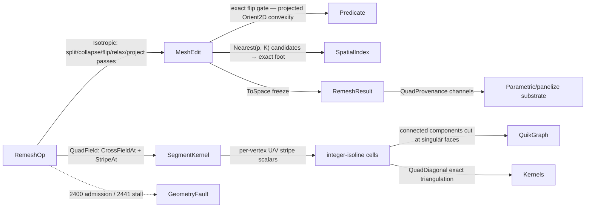

# [RASM_SIMPLIFICATION_REMESH]

The remesh substrate of `Rasm.Geometry.Simplification` — ONE `Remeshing.Apply(RemeshOp, Op? key = null)` folding a two-row `RemeshOp` `[Union]`: `Isotropic`, the Botsch-Kobbelt split/collapse/flip/tangential-relax rewrite driving every edge toward one target length while preserving genus, features, and the original surface (relaxed vertices re-project onto the source through the `Spatial/index` BVH); and `QuadField`, the cross-field-guided quad extraction composing the landed `segment.md` Knöppel machinery — `SegmentKernel.CrossFieldAt` smoothest/constrained n-RoSy fields and `StripeAt` field-aligned stripe scalars — into an integer-isoline quad grid with per-patch decomposition over `ConnectedComponents`. This is the AUTHOR-KERNEL robust tier of the widened Simplification charter (mesh rewrite under budget): it sits BESIDE `segment.md`'s landed HOST-capture tier (`RemeshKind`/`QuadTarget` over native `QuadRemesh`/`Reduce`) under the standing capture law — one anchor each, the host tier captures RhinoCommon parameters and receipts, this tier owns the first-principles rewrite a non-Rhino runtime and a predicate-gated pipeline demand — and `decimate.md`'s `VoxelRemesh` stays its own distinct modality row (volumetric re-tessellation under a budget, never an edge-length equalizer).

Exactness lands where a sign decides structure: the edge-flip admission is the exact projected-convexity gate — both diagonals of the edge's corner quad must strictly separate the opposite pair under `Predicate.Orient2D` signs on the quad's dominant-axis projection, the same reflex-separation law as the arena's quad-diagonal gate — never a float dihedral threshold; the quad emission triangulates through the composed `Kernels.QuadDiagonal`. Every structural operation is an arena verb (`AddVertex`/`AddFace`/`SetFace`/`KillFace` — `SetFace` IS the flip re-point and the collapse re-point), the tangential-relax sweep partitions through the arena's budgeted `Parallel` struct-action verb double-buffered over frozen position reads, and the result publishes by freeze through `ToSpace` → `MeshSpace.Of`. A convergence stall routes the typed `GeometryFault.RemeshStalled(targetLength, achieved, iterations)` 2441; the `QuadField` result carries `QuadProvenance` — the SoA quad/patch/UV channels `Parametric/panelize` composes as its substrate — and `Rasm.Compute` `[V7]` names `Isotropic` as its volumetric boundary-conditioning pre-step, decoded through the wire, never a Compute-side remesher.

## [01]-[INDEX]

- [01]-[REMESHING]: ONE `Remeshing.Apply(RemeshOp, Op?)` entry; `RemeshOp` rows `Isotropic` · `QuadField`; the Botsch-Kobbelt pass structure (split → collapse → flip → relax → project) over `MeshEdit` with the exact flip gate and feature/boundary pinning; the cross-field/stripe quad extraction with patch decomposition; `RemeshTrace` evidence + `QuadProvenance` the panelize substrate wire; `RemeshStalled` 2441 convergence law.

## [02]-[REMESHING]

- Owner: `RemeshPolicy` the policy row (`Iterations` — the pass budget; `SplitRatio`/`CollapseRatio` — the Botsch-Kobbelt `4/3`/`4/5` hysteresis band around the target; `FeatureAngle` — the dihedral threshold pinning crease edges (boundary edges pin unconditionally); `ConvergenceBand` — the achieved-deviation acceptance fraction; `ProjectCandidates` — the BVH nearest-K the surface re-projection refines exactly; `ParallelFloor`) registering `IValidityEvidence`; `RemeshOp` the two-row request `[Union]` (`Isotropic(Mesh, TargetLength, Policy)` · `QuadField(Mesh, TargetLength, Symmetry, Policy)` — target length and the quad arm's n-RoSy `Symmetry` are per-request DATA (4 = quads, the diagrid/tri family is this one integer, proven ∈ {1,2,4,6} at the `VectorField.CrossField` admission), the knobs are policy); `RemeshTrace` the typed receipt (target · achieved mean/max deviation · iterations · split/collapse/flip counts · feature-edge census); `QuadProvenance` the quad substrate channels (`Corners` — 4 ordinals per quad · `PatchOf` — per-quad patch label · `U`/`V` — per-emitted-vertex stripe coordinates · `SingularFaces` — the cut source faces); `RemeshResult` the carrier (`Mesh` rewritten `MeshSpace` · `Trace` · `Quads` the `Option<QuadProvenance>` the quad arm fills); `Remeshing` the static surface.
- Cases: `RemeshOp` cases 2 — `Isotropic` the edge-length equalizer, `QuadField` the field-guided quad extraction; a third rewrite modality (anisotropic curvature-adapted sizing, feature-aligned tri remesh) is one further case over the SAME pass machinery with a sizing law as its data.
- Entry: `public static Fin<RemeshResult> Apply(RemeshOp op, Op? key = null)` — the ONE entry discriminating on the op case. `Fin<T>` routes `GeometryFault.DegenerateInput(Kind.Mesh, index, witness)` 2400 on an inadmissible request (empty mesh, non-positive target length, invalid policy) and `GeometryFault.RemeshStalled(targetLength, achieved, iterations)` 2441 when the pass budget exhausts with the achieved mean edge deviation still outside `ConvergenceBand` — the achieved length is the residual evidence, so a caller distinguishes "converged", "converged early", and "stalled at this deviation" structurally; a freeze failure surfaces as `MeshSpace.Of`'s own rail. No `RemeshIsotropic`/`RemeshQuad` sibling statics — one polymorphic `Apply`.
- Auto: `Isotropic` opens ONE `MeshEdit.Of(space, ...)` arena (the policy floor threaded into `ArenaPolicy` at `Of`), builds the ORIGINAL-surface BVH once (`Spatial.Apply(SpatialOp.Build(SpatialKind.Bvh, faceBounds, BuildPolicy.Canonical))` — every projection targets the source, so the rewrite never drifts), and runs `Iterations` passes: (1) SPLIT every edge past `SplitRatio·ℓ` at its midpoint — `AddVertex` + per-incident-face `SetFace`/`AddFace`; (2) COLLAPSE every non-feature edge under `CollapseRatio·ℓ` — the survivor re-points through the per-pass vertex→incident-face index (never a full-array rescan), guarded by the manifold link condition (`N(u) ∩ N(v)` = exactly the edge's opposite corners, 2 interior / 1 boundary, one-rings merged in-sweep — the genus-preservation gate), the hysteresis bound (a collapse minting an edge past `SplitRatio·ℓ` is skipped), and the feature/boundary pin — the collapse runs TOWARD a pinned end (the feature vertex survives in place) and only a both-ends-pinned crease segment holds; (3) FLIP every non-feature edge whose valence deviation improves — target valence 6 interior / 4 boundary — admitted ONLY by the exact projected-convexity gate: on the corner quad's dominant-axis projection BOTH `Predicate.Orient2D` separation products are `Sign.Negative` (a float dihedral or an unguarded valence flip is the deleted form), landed as two `SetFace` corner rewrites; (4) RELAX every unpinned vertex to its area-weighted incident-face centroid projected onto its own tangent plane — the equalization smoother, double-buffered through the arena's `Parallel` struct action (frozen reads, disjoint writes), feature vertices pinned; (5) PROJECT every relaxed vertex back to the original surface — `SpatialQuery.Nearest(p, ProjectCandidates)` candidate faces, exact point-triangle minimization over the candidates, `SetPosition` to the foot. The pass loop stops early when an iteration performs zero structural ops and the mean deviation sits inside `ConvergenceBand`; exhaustion outside the band routes 2441. `QuadField` first runs the isotropic conditioning at the target (the field solve wants bounded aspect ratios — the same `Equalize` fold, the same stall law), then composes the landed field machinery: the base stripe family `U` samples `SegmentKernel.StripeAt(space, crossCase, 1/ℓ, vertex, key)` over the memoized `VectorField.CrossField(space, Symmetry, None, None)` case (the request's own `Symmetry`), the orthogonal family `V` samples a second constrained solve whose anchor hint is the base field's representative at the seed vertex rotated a quarter turn about its face normal — the seed is a corner of that face and its ordinal is the anchored constraint (two memoized solves, one field owner); extraction interns a grid vertex per integer `(⌈u⌉,⌈v⌉)` crossing by inverse-linear interpolation on the triangle, emits one quad per completed cell, skips and records SINGULAR faces (corner stripe spans past one period after branch alignment — the field-index witness), labels patches through `ConnectedComponents` over the transient face-adjacency `UndirectedGraph<int, SEdge<int>>` cut at singular faces, and triangulates the emitted quads through the composed exact `Kernels.QuadDiagonal` into a fresh arena → `ToSpace`.
- Receipt: `RemeshTrace` — target, achieved mean/max deviation, iterations spent, per-verb counts, feature census — the reproducibility evidence; `QuadProvenance` rides `RemeshResult.Quads` as the panelize substrate: quad corners, patch labels, per-vertex `(u,v)` stripe coordinates, singular-face ordinals — SoA channels a decoder binds without re-running the field solve.
- Packages: `Rasm.Geometry.Meshing` (`MeshEdit.Of`/`AddVertex`/`AddFace`/`SetFace`/`KillFace`/`SetPosition`/`Parallel`/`ToSpace` + `Kernels.QuadDiagonal` — the arena and the exact diagonal gate; `ArenaPolicy` the floor carrier the policy threads at `Of`), `Rasm.Geometry.Numerics` (`Predicate.Orient2D` + `Sign`/`Axis` — the exact flip gate), `Rasm.Geometry.Spatial` (`Spatial.Apply` Build/Nearest — the projection acceleration, typed match routing `Fin`), `Rasm`/Vectors (`MeshSpace`; `SegmentKernel.CrossFieldAt`/`StripeAt` the landed Knöppel owners; `VectorField.CrossField` the field case; `Direction`/`Dimension` atoms), `Rasm.Geometry` (`GeometryFault`), `Rasm.Domain` (`Op`, `Kind`, `ValidityClaim`/`IValidityEvidence`), QuikGraph (`UndirectedGraph<int, SEdge<int>>`, `AddVertexRange`, `ConnectedComponents` — in-computation only), CommunityToolkit.HighPerformance (`IAction` struct actions through the arena verb), Thinktecture.Runtime.Extensions, LanguageExt.Core, Rhino.Geometry (`Point3d`/`Vector3d`/`BoundingBox` at the seam), BCL inbox.
- Growth: a new rewrite modality is one `RemeshOp` case over the same pass machinery; a sizing FIELD (curvature-adaptive target length) is one policy delegate replacing the constant `ℓ` in the same hysteresis tests; feature-vertex sliding (relax along the crease instead of pinning) is one relax-arm branch on the feature census; a fifth pass verb is one arm in the pass fold; the quad arm's per-patch parameterization refinement is `panelize`'s consumption, never a second extraction here; zero new entry surface.
- Boundary: this page is the AUTHOR-KERNEL robust tier and `segment.md`'s `RemeshKind`/`QuadTarget`/`ApplyRemeshDetailed` is the HOST-capture tier — coexisting under the standing capture law, one anchor each, and a native `QuadRemesh`/`Reduce` call appearing HERE is the named tier violation (the host tier owns parameter capture; this tier owns the predicate-gated rewrite); `decimate.md`'s `VoxelRemesh` row stays a DISTINCT modality (volumetric re-tessellation under budget) and neither page absorbs the other; the flip gate is exact signs over the corner quad and a float dihedral criterion is the deleted non-robust form; structural rewrites are arena verbs and a page-local vertex/face buffer beside the two-carrier seam is the deleted third carrier; per-operation incidence updates ride per-pass indexes and a per-collapse full-array rescan is the deleted `O(F²)` class; the relax smoother is the area-weighted equalizer BY DESIGN — the substrate's cotangent owner reproduces the current shape and would defeat sampling equalization, so it is deliberately NOT consumed here (the one place a "deeper" operator is the wrong operator); projection targets the ORIGINAL surface through the composed index owner and an unprojected relax (shrinking drift) or a local acceleration structure is the deleted form; QuikGraph is transient and the quad RESULT leaves as the frozen `QuadProvenance` channels; `Apply` is total over the `Fin` rail and a thrown exception on a stalled rewrite is forbidden.

```csharp
// --- [RUNTIME_PRELUDE] ----------------------------------------------------------------------
using System;
using System.Collections.Generic;
using System.Linq;
using CommunityToolkit.HighPerformance.Helpers;
using LanguageExt;
using QuikGraph;
using QuikGraph.Algorithms;
using Rasm.Domain;
using Rasm.Geometry.Meshing;
using Rasm.Geometry.Numerics;
using Rasm.Geometry.Spatial;
using Rasm.Vectors;
using Rhino.Geometry;
using Thinktecture;
using static LanguageExt.Prelude;

namespace Rasm.Geometry.Simplification;

// --- [CONSTANTS] ------------------------------------------------------------------------------
// SplitRatio/CollapseRatio are the Botsch-Kobbelt hysteresis band (4/3, 4/5): a split never mints
// an immediately-collapsible edge and a collapse never mints an immediately-splittable one.
public sealed record RemeshPolicy(
    int Iterations, double SplitRatio, double CollapseRatio, double FeatureAngle,
    double ConvergenceBand, int ProjectCandidates, int ParallelFloor) : IValidityEvidence {
    public static readonly RemeshPolicy Canonical = new(
        Iterations: 8, SplitRatio: 4.0 / 3.0, CollapseRatio: 4.0 / 5.0, FeatureAngle: 0.6981317007977318,
        ConvergenceBand: 0.2, ProjectCandidates: 8, ParallelFloor: 4_096);

    public bool IsValid => ValidityClaim.All(
        ValidityClaim.Positive(value: Iterations),
        ValidityClaim.Positive(value: FeatureAngle),
        ValidityClaim.Positive(value: ConvergenceBand),
        ValidityClaim.Positive(value: ProjectCandidates),
        ValidityClaim.Positive(value: ParallelFloor))
        && SplitRatio > 1.0 && CollapseRatio is > 0.0 and < 1.0;
}

// --- [MODELS] -----------------------------------------------------------------------------------
public sealed record RemeshTrace(
    double TargetLength, double AchievedMean, double AchievedMax, int Iterations,
    int Splits, int Collapses, int Flips, int FeatureEdges);

// The panelize substrate wire: quad corner ordinals (4 per quad), per-quad patch labels, per-vertex
// stripe coordinates, and the singular source faces the extraction cut — SoA channels a decoder
// binds without re-running the field solve.
public sealed record QuadProvenance(int[] Corners, int[] PatchOf, double[] U, double[] V, int[] SingularFaces);

public sealed record RemeshResult(MeshSpace Mesh, RemeshTrace Trace, Option<QuadProvenance> Quads);

// --- [OPERATIONS] -------------------------------------------------------------------------------
[Union(ConversionFromValue = ConversionOperatorsGeneration.None)]
public abstract partial record RemeshOp {
    private RemeshOp() { }

    public sealed record Isotropic(MeshSpace Mesh, double TargetLength, RemeshPolicy Policy) : RemeshOp;
    public sealed record QuadField(MeshSpace Mesh, double TargetLength, int Symmetry, RemeshPolicy Policy) : RemeshOp;
}

public static class Remeshing {
    public static Fin<RemeshResult> Apply(RemeshOp op, Op? key = null) =>
        op.Switch(
            isotropic: i => Admit(i.Mesh, i.TargetLength, i.Policy).Bind(_ => Equalize(i.Mesh, i.TargetLength, i.Policy, key)
                .Map(pair => new RemeshResult(pair.Space, pair.Trace, None))),
            quadField: q => Admit(q.Mesh, q.TargetLength, q.Policy).Bind(_ => Quadrangulate(q, key)));

    static Fin<Unit> Admit(MeshSpace mesh, double target, RemeshPolicy policy) =>
        mesh.Native.Faces.Count == 0 ? Fin.Fail<Unit>(new GeometryFault.DegenerateInput(Kind.Mesh, 0, "empty mesh").ToError())
        : !(target > 0.0) ? Fin.Fail<Unit>(new GeometryFault.DegenerateInput(Kind.Mesh, 0, "non-positive target length").ToError())
        : !policy.IsValid ? Fin.Fail<Unit>(new GeometryFault.DegenerateInput(Kind.Mesh, 0, "invalid remesh policy").ToError())
        : Fin.Succ(unit);

    // --- [ISOTROPIC]
    // Botsch-Kobbelt pass fold over ONE arena: split → collapse → flip → relax → project, per-pass
    // edge/incidence indexes, features pinned, every relaxed vertex re-projected onto the ORIGINAL
    // surface through the composed BVH. Statement bodies ride the arena-tier exemption.
    static Fin<(MeshSpace Space, RemeshTrace Trace)> Equalize(MeshSpace source, double target, RemeshPolicy policy, Op? key) {
        using MeshEdit arena = MeshEdit.Of(source, ArenaPolicy.Canonical with { ParallelFloor = policy.ParallelFloor });
        return SourceIndex(source, key).Bind(frozen => {
            (int splits, int collapses, int flips, int features) = (0, 0, 0, 0);
            int round = 0;
            for (; round < policy.Iterations; round++) {
                Edges edges = Edges.Of(arena, policy.FeatureAngle);
                features = edges.FeatureCount;
                int did = Split(arena, edges, target * policy.SplitRatio);
                splits += did;
                edges = Edges.Of(arena, policy.FeatureAngle);
                int killed = Collapse(arena, edges, target * policy.CollapseRatio, target * policy.SplitRatio);
                collapses += killed;
                edges = Edges.Of(arena, policy.FeatureAngle);
                int turned = Flip(arena, edges);
                flips += turned;
                Relax(arena, Edges.Of(arena, policy.FeatureAngle), policy);
                Fin<Unit> projected = Project(arena, frozen, policy, key);
                if (projected.Case is LanguageExt.Common.Error fault) { return Fin.Fail<(MeshSpace, RemeshTrace)>(fault); }
                if (did + killed + turned == 0 && Deviation(arena, target).Mean <= policy.ConvergenceBand) { round++; break; }
            }
            (double mean, double max) = Deviation(arena, target);
            return mean > policy.ConvergenceBand
                ? Fin.Fail<(MeshSpace, RemeshTrace)>(new GeometryFault.RemeshStalled(target, target * (1.0 + mean), round).ToError())
                : arena.ToSpace(source.Tolerance, key)
                    .Map(space => (space, new RemeshTrace(target, mean, max, round, splits, collapses, flips, features)));
        });
    }

    // Per-pass edge table: endpoints canonical, up to two incident faces, feature = dihedral past
    // the policy angle or a boundary edge (one face). Rebuilt per pass — O(F), never per operation.
    sealed record Edges(Dictionary<(int U, int V), (int F0, int F1)> Table, HashSet<(int U, int V)> Feature, HashSet<int> Pinned) {
        public int FeatureCount => Feature.Count;

        public static Edges Of(MeshEdit arena, double featureAngle) {
            var table = new Dictionary<(int, int), (int, int)>();
            for (int f = 0; f < arena.FaceCount; f++) {
                if (!arena.Alive(f)) { continue; }
                (int a, int b, int c) = arena.Face(f);
                foreach ((int u, int v) in (ReadOnlySpan<(int, int)>)[(a, b), (b, c), (c, a)]) {
                    (int cu, int cv) = (int.Min(u, v), int.Max(u, v));
                    table[(cu, cv)] = table.TryGetValue((cu, cv), out (int F0, int F1) held) ? (held.F0, f) : (f, -1);
                }
            }
            var feature = new HashSet<(int, int)>();
            var pinned = new HashSet<int>();
            foreach (((int u, int v), (int f0, int f1)) in table) {
                bool crease = f1 < 0 || Vector3d.VectorAngle(Normal(arena, f0), Normal(arena, f1)) > featureAngle;
                if (crease) {
                    feature.Add((u, v));
                    pinned.Add(u);
                    pinned.Add(v);
                }
            }
            return new Edges(table, feature, pinned);
        }

        static Vector3d Normal(MeshEdit arena, int f) {
            (int a, int b, int c) = arena.Face(f);
            return Vector3d.CrossProduct(arena.Position(b) - arena.Position(a), arena.Position(c) - arena.Position(a));
        }
    }

    // Split emits winding-consistent children: the face's own u→v traversal direction orders the
    // (u,m,w)/(m,v,w) pair, so RebuildNormals at freeze sees one orientation. A face already
    // re-pointed by an earlier split in the same sweep no longer holds the edge and skips.
    static int Split(MeshEdit arena, Edges edges, double ceiling) {
        int did = 0;
        foreach (((int u, int v), (int f0, int f1)) in edges.Table.ToArray()) {
            if (arena.Position(u).DistanceTo(arena.Position(v)) <= ceiling) { continue; }
            int m = arena.AddVertex(0.5 * (arena.Position(u) + arena.Position(v)));
            foreach (int f in (ReadOnlySpan<int>)[f0, f1]) {
                if (f < 0 || !arena.Alive(f)) { continue; }
                (int a, int b, int c) = arena.Face(f);
                bool holds = (a == u || b == u || c == u) && (a == v || b == v || c == v);
                if (!holds) { continue; }  // stale row — an earlier split re-pointed this face
                (int from, int to) = Follows(a, b, c, u, v) ? (u, v) : (v, u);
                int w = a != u && a != v ? a : b != u && b != v ? b : c;
                arena.SetFace(f, from, m, w);
                arena.AddFace(m, to, w);
            }
            did++;
        }
        return did;
    }

    static bool Follows(int a, int b, int c, int u, int v) =>
        (a == u && b == v) || (b == u && c == v) || (c == u && a == v);

    static bool Holds((int A, int B, int C) face, int u, int v) =>
        (face.A == u || face.B == u || face.C == u) && (face.A == v || face.B == v || face.C == v);

    static int Collapse(MeshEdit arena, Edges edges, double floor, double ceiling) {
        var facesOf = new Dictionary<int, List<int>>();
        for (int f = 0; f < arena.FaceCount; f++) {
            if (!arena.Alive(f)) { continue; }
            (int a, int b, int c) = arena.Face(f);
            foreach (int v in (ReadOnlySpan<int>)[a, b, c]) {
                (facesOf.TryGetValue(v, out List<int>? fs) ? fs : facesOf[v] = []).Add(f);
            }
        }
        var neighbors = new Dictionary<int, HashSet<int>>();
        foreach (((int u, int v), _) in edges.Table) {
            (neighbors.TryGetValue(u, out HashSet<int>? nu) ? nu : neighbors[u] = []).Add(v);
            (neighbors.TryGetValue(v, out HashSet<int>? nv) ? nv : neighbors[v] = []).Add(u);
        }
        var dead = new HashSet<int>();
        int did = 0;
        foreach (((int cu, int cv), (_, int f1)) in edges.Table) {
            if (dead.Contains(cu) || dead.Contains(cv)) { continue; }
            (int u, int v) = edges.Pinned.Contains(cu) ? (cv, cu) : (cu, cv);  // collapse TOWARD the feature: the pinned end survives
            if (edges.Pinned.Contains(u)) { continue; }  // both ends pinned — a crease segment, held
            if (arena.Position(u).DistanceTo(arena.Position(v)) >= floor) { continue; }
            // link condition — the genus/manifold gate: N(u) ∩ N(v) must be exactly the edge's
            // opposite corners (2 interior, 1 boundary); a wider intersection pinches the surface.
            if (neighbors[u].Count(w => neighbors[v].Contains(w)) != (f1 < 0 ? 1 : 2)) { continue; }
            bool minted = facesOf.TryGetValue(u, out List<int>? around) && around.Where(arena.Alive).Any(f => {
                (int a, int b, int c) = arena.Face(f);
                foreach (int w in (ReadOnlySpan<int>)[a, b, c]) {
                    if (w != u && w != v && arena.Position(v).DistanceTo(arena.Position(w)) > ceiling) { return true; }
                }
                return false;
            });
            if (minted) { continue; }  // hysteresis: a collapse never mints a splittable edge
            foreach (int f in facesOf.TryGetValue(u, out List<int>? incident) ? incident : []) {
                if (!arena.Alive(f)) { continue; }
                (int a, int b, int c) = arena.Face(f);
                (a, b, c) = (a == u ? v : a, b == u ? v : b, c == u ? v : c);
                if (a == b || b == c || c == a) { arena.KillFace(f); }
                else {
                    arena.SetFace(f, a, b, c);
                    (facesOf.TryGetValue(v, out List<int>? vf) ? vf : facesOf[v] = []).Add(f);
                }
            }
            foreach (int w in neighbors[u].Where(w => w != v)) {  // merge one-rings so the link gate stays sound within the sweep
                neighbors[w].Remove(u);
                neighbors[w].Add(v);
                neighbors[v].Add(w);
            }
            neighbors[v].Remove(u);
            dead.Add(u);
            did++;
        }
        return did;
    }

    // Valence-driven flips admitted ONLY by exact signs: on the corner quad (a, c, b, d)'s dominant
    // projection, BOTH diagonals must strictly separate the opposite pair (Orient2D products
    // Negative) — the strict-convexity gate; a float dihedral criterion is the deleted form.
    static int Flip(MeshEdit arena, Edges edges) {
        var valence = new Dictionary<int, int>();
        foreach (((int u, int v), _) in edges.Table) {
            valence[u] = valence.GetValueOrDefault(u) + 1;
            valence[v] = valence.GetValueOrDefault(v) + 1;
        }
        int did = 0;
        foreach (((int a0, int b0), (int f0, int f1)) in edges.Table.ToArray()) {
            if (f1 < 0 || edges.Feature.Contains((a0, b0)) || !arena.Alive(f0) || !arena.Alive(f1)) { continue; }
            if (!Holds(arena.Face(f0), a0, b0) || !Holds(arena.Face(f1), a0, b0)) { continue; }  // stale row — an earlier flip re-cornered a face
            (int fa, int fb, int fc) = arena.Face(f0);
            // normalize so f0 traverses a→b: winding-consistent flip emission depends on it
            (int a, int b) = Follows(fa, fb, fc, a0, b0) ? (a0, b0) : (b0, a0);
            int c = Opposite(arena, f0, a, b);
            int d = Opposite(arena, f1, a, b);
            if (c < 0 || d < 0 || c == d) { continue; }
            int Deviate(int v, int delta) => Math.Abs(valence.GetValueOrDefault(v) + delta - 6);
            int before = Deviate(a, 0) + Deviate(b, 0) + Deviate(c, 0) + Deviate(d, 0);
            int after = Deviate(a, -1) + Deviate(b, -1) + Deviate(c, +1) + Deviate(d, +1);
            if (after >= before) { continue; }
            Axis axis = DominantAxis(arena.Position(a), arena.Position(c), arena.Position(b), arena.Position(d));
            (Implicit pa, Implicit pb, Implicit pc, Implicit pd) =
                (new(arena.Position(a)), new(arena.Position(b)), new(arena.Position(c)), new(arena.Position(d)));
            bool convex =
                Predicate.Orient2D(in pc, in pd, in pa, axis).Times(Predicate.Orient2D(in pc, in pd, in pb, axis)) == Sign.Negative
                && Predicate.Orient2D(in pa, in pb, in pc, axis).Times(Predicate.Orient2D(in pa, in pb, in pd, axis)) == Sign.Negative;
            if (!convex) { continue; }
            arena.SetFace(f0, a, d, c);
            arena.SetFace(f1, b, c, d);
            (valence[a], valence[b], valence[c], valence[d]) =
                (valence.GetValueOrDefault(a) - 1, valence.GetValueOrDefault(b) - 1, valence.GetValueOrDefault(c) + 1, valence.GetValueOrDefault(d) + 1);
            did++;
        }
        return did;
    }

    static int Opposite(MeshEdit arena, int f, int u, int v) {
        (int a, int b, int c) = arena.Face(f);
        return a != u && a != v ? a : b != u && b != v ? b : c != u && c != v ? c : -1;
    }

    // Area-weighted tangential relax, double-buffered: the struct action reads frozen current
    // positions and writes disjoint next slots; pinned (feature/boundary) vertices hold. The
    // area-weighted centroid EQUALIZES sampling — the cotangent owner would reproduce the current
    // shape, exactly the wrong operator here.
    readonly struct RelaxAction(double[] gx, double[] gy, double[] gz, double[] weight, double[] nx, double[] ny, double[] nz, double[] px, double[] py, double[] pz, bool[] pinned) : IAction {
        public void Invoke(int v) {
            if (pinned[v] || weight[v] <= double.Epsilon) { return; }
            var g = new Point3d(gx[v] / weight[v], gy[v] / weight[v], gz[v] / weight[v]);
            var n = new Vector3d(nx[v], ny[v], nz[v]);
            var p = new Point3d(px[v], py[v], pz[v]);
            if (!n.Unitize()) { return; }
            Point3d moved = g + (((p - g) * n) * n);  // g projected to p's tangent plane
            (px[v], py[v], pz[v]) = (moved.X, moved.Y, moved.Z);
        }
    }

    static void Relax(MeshEdit arena, Edges edges, RemeshPolicy policy) {
        int n = arena.VertexCount;
        var (gx, gy, gz, weight) = (new double[n], new double[n], new double[n], new double[n]);
        var (nx, ny, nz) = (new double[n], new double[n], new double[n]);
        for (int f = 0; f < arena.FaceCount; f++) {
            if (!arena.Alive(f)) { continue; }
            (int a, int b, int c) = arena.Face(f);
            Vector3d cross = Vector3d.CrossProduct(arena.Position(b) - arena.Position(a), arena.Position(c) - arena.Position(a));
            double area = 0.5 * cross.Length;
            Point3d centroid = (arena.Position(a) + arena.Position(b) + arena.Position(c)) / 3.0;
            foreach (int v in (ReadOnlySpan<int>)[a, b, c]) {
                (gx[v], gy[v], gz[v], weight[v]) = (gx[v] + (area * centroid.X), gy[v] + (area * centroid.Y), gz[v] + (area * centroid.Z), weight[v] + area);
                (nx[v], ny[v], nz[v]) = (nx[v] + cross.X, ny[v] + cross.Y, nz[v] + cross.Z);
            }
        }
        var pinned = new bool[n];
        foreach (int v in edges.Pinned) { pinned[v] = true; }
        var (px, py, pz) = (new double[n], new double[n], new double[n]);
        for (int v = 0; v < n; v++) { (px[v], py[v], pz[v]) = (arena.Position(v).X, arena.Position(v).Y, arena.Position(v).Z); }
        arena.Parallel(n, new RelaxAction(gx, gy, gz, weight, nx, ny, nz, px, py, pz, pinned));
        for (int v = 0; v < n; v++) { arena.SetPosition(v, new Point3d(px[v], py[v], pz[v])); }
    }

    // --- [PROJECTION]
    // The projection target: the ORIGINAL surface frozen once — face corner triples beside their
    // BVH, built at pass-zero and immutable for the whole rewrite.
    sealed record Source(SpatialIndex Index, (Point3d A, Point3d B, Point3d C)[] Faces);

    static Fin<Source> SourceIndex(MeshSpace source, Op? key) {
        using MeshEdit soup = MeshEdit.Of(source);
        var boxes = new BoundingBox[soup.FaceCount];
        var corners = new (Point3d A, Point3d B, Point3d C)[soup.FaceCount];
        for (int f = 0; f < soup.FaceCount; f++) {
            boxes[f] = soup.Bounds(f);
            (int a, int b, int c) = soup.Face(f);
            corners[f] = (soup.Position(a), soup.Position(b), soup.Position(c));
        }
        return Spatial.Apply(new SpatialOp.Build(SpatialKind.Bvh, boxes, BuildPolicy.Canonical), key)
            .Bind(answer => answer is SpatialAnswer.Index built
                ? Fin.Succ(new Source(built.Value, corners))
                : Fin.Fail<Source>(new GeometryFault.KindMismatch(SpatialKind.Bvh, QueryKind.Nearest).ToError()));
    }

    static Fin<Unit> Project(MeshEdit arena, Source source, RemeshPolicy policy, Op? key) {
        (Point3d A, Point3d B, Point3d C)[] faces = source.Faces;
        SpatialIndex index = source.Index;
        for (int v = 0; v < arena.VertexCount; v++) {
            Point3d p = arena.Position(v);
            Fin<Seq<int>> nearest = Spatial.Apply(new SpatialOp.Query(index, new SpatialQuery.Nearest(p, policy.ProjectCandidates)), key)
                .Bind(static answer => answer is SpatialAnswer.Result { Value: QueryResult.Nearest hits }
                    ? Fin.Succ(hits.Ordered)
                    : Fin.Fail<Seq<int>>(new GeometryFault.KindMismatch(SpatialKind.Bvh, QueryKind.Nearest).ToError()));
            if (nearest.Case is LanguageExt.Common.Error fault) { return Fin.Fail<Unit>(fault); }
            Point3d best = p;
            double bestD = double.PositiveInfinity;
            foreach (int f in (Seq<int>)nearest.Case!) {
                Point3d foot = ClosestOnTriangle(p, faces[f].A, faces[f].B, faces[f].C);
                double d = p.DistanceTo(foot);
                if (d < bestD) { (best, bestD) = (foot, d); }
            }
            arena.SetPosition(v, best);
        }
        return Fin.Succ(unit);
    }

    static (double Mean, double Max) Deviation(MeshEdit arena, double target) {
        (double sum, double max, int count) = (0.0, 0.0, 0);
        var seen = new HashSet<(int, int)>();
        for (int f = 0; f < arena.FaceCount; f++) {
            if (!arena.Alive(f)) { continue; }
            (int a, int b, int c) = arena.Face(f);
            foreach ((int u, int v) in (ReadOnlySpan<(int, int)>)[(a, b), (b, c), (c, a)]) {
                if (!seen.Add((int.Min(u, v), int.Max(u, v)))) { continue; }
                double dev = Math.Abs(arena.Position(u).DistanceTo(arena.Position(v)) - target) / target;
                (sum, max, count) = (sum + dev, double.Max(max, dev), count + 1);
            }
        }
        return (count > 0 ? sum / count : 0.0, max);
    }

    // --- [QUAD_FIELD]
    // One isotropic conditioning pass, then the landed Knöppel composition: base stripes over the
    // memoized CrossField solve, the orthogonal family over a quarter-turned anchor hint at the
    // seed corner (two memoized solves, one field owner), integer-isoline cell extraction, patch
    // labels via connected components cut at singular faces, quads through the exact diagonal gate.
    static Fin<RemeshResult> Quadrangulate(RemeshOp.QuadField op, Op? key) =>
        Equalize(op.Mesh, op.TargetLength, op.Policy, key).Bind(pair => {
            MeshSpace space = pair.Space;
            Op threaded = key.OrDefault();
            double frequency = 1.0 / op.TargetLength;
            (int a, int b, int c) = (space.Native.Faces[0].A, space.Native.Faces[0].B, space.Native.Faces[0].C);
            Point3d seed = space.Native.Vertices[a];  // the anchored ordinal IS a corner of the normal's face
            Vector3d normal = Vector3d.CrossProduct(
                (Point3d)space.Native.Vertices[b] - space.Native.Vertices[a],
                (Point3d)space.Native.Vertices[c] - space.Native.Vertices[a]);
            return SegmentKernel.CrossFieldAt(space, op.Symmetry, None, None, seed, threaded)
                .Bind(baseDir => Direction.Of(value: Vector3d.CrossProduct(normal, baseDir), context: space.Tolerance, key: threaded))
                .Bind(turned => {
                    Option<Seq<(int, Direction)>> anchor = Some(Seq((a, turned)));
                    var cross = new VectorField.CrossField(space, Dimension.Create(value: op.Symmetry), None, None);
                    var rotated = new VectorField.CrossField(space, Dimension.Create(value: op.Symmetry), anchor, None);
                    return (SampleStripes(space, cross, frequency, threaded).ToValidation(),
                            SampleStripes(space, rotated, frequency, threaded).ToValidation())
                        .Apply(static (us, vs) => (Us: us, Vs: vs)).As().ToFin()
                        .Bind(uv => ExtractQuads(space, uv.Us, uv.Vs, pair.Trace, key));
                });
        });

    static Fin<double[]> SampleStripes(MeshSpace space, VectorField field, double frequency, Op key) {
        int n = space.Native.Vertices.Count;
        var values = new double[n];
        for (int v = 0; v < n; v++) {
            Fin<double> at = SegmentKernel.StripeAt(space, field, frequency, space.Native.Vertices[v], key);
            if (at.Case is LanguageExt.Common.Error fault) { return Fin.Fail<double[]>(fault); }
            values[v] = (double)at.Case!;
        }
        return Fin.Succ(values);
    }

    static Fin<RemeshResult> ExtractQuads(MeshSpace space, double[] u, double[] v, RemeshTrace trace, Op? key) {
        using MeshEdit soup = MeshEdit.Of(space);
        var singular = new HashSet<int>();
        var cellFaces = new Dictionary<(long Iu, long Iv), List<int>>();
        for (int f = 0; f < soup.FaceCount; f++) {
            (int a, int b, int c) = soup.Face(f);
            (double du, double dv) = (Spread(u[a], u[b], u[c]), Spread(v[a], v[b], v[c]));
            if (du > 1.0 || dv > 1.0) { singular.Add(f); continue; }  // corner span past one period — the field-index witness
            // a face registers in EVERY integer cell its (u, v) extent overlaps, so a cell corner on
            // a boundary always finds its containing face — never a centroid-binned corner miss
            (long lu, long hu) = ((long)Math.Floor(Math.Min(u[a], Math.Min(u[b], u[c]))), (long)Math.Floor(Math.Max(u[a], Math.Max(u[b], u[c]))));
            (long lv, long hv) = ((long)Math.Floor(Math.Min(v[a], Math.Min(v[b], v[c]))), (long)Math.Floor(Math.Max(v[a], Math.Max(v[b], v[c]))));
            for (long iu = lu; iu <= hu; iu++) {
                for (long iv = lv; iv <= hv; iv++) {
                    (cellFaces.TryGetValue((iu, iv), out List<int>? fs) ? fs : cellFaces[(iu, iv)] = []).Add(f);
                }
            }
        }
        // patch labels: transient face-adjacency graph cut at singular faces — connected components
        var adjacency = new UndirectedGraph<int, SEdge<int>>(allowParallelEdges: false);
        adjacency.AddVertexRange(Enumerable.Range(0, soup.FaceCount).Where(f => !singular.Contains(f)));
        var byEdge = new Dictionary<(int, int), int>();
        for (int f = 0; f < soup.FaceCount; f++) {
            if (singular.Contains(f)) { continue; }
            (int a, int b, int c) = soup.Face(f);
            foreach ((int p, int q) in (ReadOnlySpan<(int, int)>)[(a, b), (b, c), (c, a)]) {
                (int cp, int cq) = (int.Min(p, q), int.Max(p, q));
                if (byEdge.TryGetValue((cp, cq), out int g) && !singular.Contains(g)) { adjacency.AddEdge(new SEdge<int>(int.Min(f, g), int.Max(f, g))); }
                else { byEdge[(cp, cq)] = f; }
            }
        }
        var faceComponent = new Dictionary<int, int>();
        adjacency.ConnectedComponents(faceComponent);

        // one interned grid vertex per (iu, iv, patch) cell corner; one quad per completed cell
        using MeshEdit emit = MeshEdit.Of(ReadOnlySpan<Point3d>.Empty, ReadOnlySpan<(int, int, int)>.Empty);
        var interned = new Dictionary<(long, long, int), int>();
        var (uOut, vOut) = (new List<double>(), new List<double>());
        var (corners, patchOf) = (new List<int>(), new List<int>());
        foreach ((long iu, long iv) in cellFaces.Keys.OrderBy(static cell => cell)) {
            Span<(long Du, long Dv)> ring = [(0, 0), (1, 0), (1, 1), (0, 1)];
            Span<int> quad = stackalloc int[4];
            int patch = -1;
            bool complete = true;
            for (int k = 0; k < 4; k++) {
                (long cu, long cv) = (iu + ring[k].Du, iv + ring[k].Dv);
                if (Locate(soup, u, v, cellFaces, cu, cv) is not (Point3d at, int home)) { complete = false; break; }
                if (patch < 0) { patch = faceComponent.GetValueOrDefault(home); }
                if (!interned.TryGetValue((cu, cv, patch), out int ordinal)) {
                    ordinal = emit.AddVertex(at);
                    interned[(cu, cv, patch)] = ordinal;
                    uOut.Add(cu);
                    vOut.Add(cv);
                }
                quad[k] = ordinal;
            }
            if (!complete) { continue; }
            corners.AddRange([quad[0], quad[1], quad[2], quad[3]]);
            patchOf.Add(patch);
            if (Kernels.QuadDiagonal(emit.Position(quad[0]), emit.Position(quad[1]), emit.Position(quad[2]), emit.Position(quad[3]))) {
                emit.AddFace(quad[0], quad[1], quad[2]);
                emit.AddFace(quad[0], quad[2], quad[3]);
            }
            else {
                emit.AddFace(quad[0], quad[1], quad[3]);
                emit.AddFace(quad[1], quad[2], quad[3]);
            }
        }
        return emit.ToSpace(space.Tolerance, key).Map(mesh => new RemeshResult(
            mesh, trace, Some(new QuadProvenance([.. corners], [.. patchOf], [.. uOut], [.. vOut], [.. singular.Order()]))));
    }

    // Inverse-linear locate of the (cu, cv) stripe crossing: the corner's four adjacent cell bins
    // supply the candidates (a boundary corner's containing face always registers in one of them),
    // barycentric solve on the first face whose (u, v) triangle contains the integer pair.
    static (Point3d At, int Face)? Locate(MeshEdit soup, double[] u, double[] v, Dictionary<(long Iu, long Iv), List<int>> cells, long cu, long cv) {
        foreach ((long du, long dv) in (ReadOnlySpan<(long, long)>)[(0, 0), (-1, 0), (0, -1), (-1, -1)]) {
            if (!cells.TryGetValue((cu + du, cv + dv), out List<int>? members)) { continue; }
            foreach (int f in members) {
                (int a, int b, int c) = soup.Face(f);
                double det = ((u[b] - u[a]) * (v[c] - v[a])) - ((u[c] - u[a]) * (v[b] - v[a]));
                if (Math.Abs(det) <= double.Epsilon) { continue; }
                double wb = (((cu - u[a]) * (v[c] - v[a])) - ((cv - v[a]) * (u[c] - u[a]))) / det;
                double wc = (((cv - v[a]) * (u[b] - u[a])) - ((cu - u[a]) * (v[b] - v[a]))) / det;
                double wa = 1.0 - wb - wc;
                if (wa is < 0.0 or > 1.0 || wb is < 0.0 or > 1.0 || wc is < 0.0 or > 1.0) { continue; }
                (Point3d pa, Point3d pb, Point3d pc) = (soup.Position(a), soup.Position(b), soup.Position(c));
                return (new Point3d(
                    (wa * pa.X) + (wb * pb.X) + (wc * pc.X),
                    (wa * pa.Y) + (wb * pb.Y) + (wc * pc.Y),
                    (wa * pa.Z) + (wb * pb.Z) + (wc * pc.Z)), f);
            }
        }
        return null;
    }

    static double Spread(double a, double b, double c) => Math.Max(a, Math.Max(b, c)) - Math.Min(a, Math.Min(b, c));

    static Point3d ClosestOnTriangle(Point3d p, Point3d a, Point3d b, Point3d c) {
        // Ericson-form point-triangle projection: exact vertex/edge/face region classification over
        // dot products — the local refinement behind the BVH candidate prune.
        Vector3d ab = b - a, ac = c - a, ap = p - a;
        double d1 = ab * ap, d2 = ac * ap;
        if (d1 <= 0.0 && d2 <= 0.0) { return a; }
        Vector3d bp = p - b;
        double d3 = ab * bp, d4 = ac * bp;
        if (d3 >= 0.0 && d4 <= d3) { return b; }
        double vc = (d1 * d4) - (d3 * d2);
        if (vc <= 0.0 && d1 >= 0.0 && d3 <= 0.0) { return a + ((d1 / (d1 - d3)) * ab); }
        Vector3d cp = p - c;
        double d5 = ab * cp, d6 = ac * cp;
        if (d6 >= 0.0 && d5 <= d6) { return c; }
        double vb = (d5 * d2) - (d1 * d6);
        if (vb <= 0.0 && d2 >= 0.0 && d6 <= 0.0) { return a + ((d2 / (d2 - d6)) * ac); }
        double va = (d3 * d6) - (d5 * d4);
        if (va <= 0.0 && (d4 - d3) >= 0.0 && (d5 - d6) >= 0.0) { return b + (((d4 - d3) / ((d4 - d3) + (d5 - d6))) * (c - b)); }
        double denom = 1.0 / (va + vb + vc);
        return a + ((vb * denom) * ab) + ((vc * denom) * ac);
    }

    static Axis DominantAxis(Point3d a, Point3d b, Point3d c, Point3d d) {
        Span<Point3d> ring = [a, b, c, d];
        double nx = 0.0, ny = 0.0, nz = 0.0;
        for (int i = 0; i < 4; i++) {
            (Point3d p, Point3d q) = (ring[i], ring[(i + 1) & 3]);
            nx += (p.Y - q.Y) * (p.Z + q.Z);
            ny += (p.Z - q.Z) * (p.X + q.X);
            nz += (p.X - q.X) * (p.Y + q.Y);
        }
        (double ax, double ay, double az) = (Math.Abs(nx), Math.Abs(ny), Math.Abs(nz));
        return ax >= ay && ax >= az ? Axis.X : ay >= az ? Axis.Y : Axis.Z;
    }
}
```



## [03]-[DENSITY_BAR]

One owner per axis; capability is a case, row, or fold arm, never a sibling surface. The `[RAIL]` cell names the one return rail each owner exposes.

| [INDEX] | [AXIS/CONCERN]   | [OWNER]          | [KIND]                                                                                        | [RAIL]                                    | [CASES] |
| :-----: | :--------------- | :--------------- | :---------------------------------------------------------------------------------------------- | :--------------------------------------------- | :-----: |
|  [01]   | Remeshing        | `RemeshOp`       | `[Union]` two rows folded by ONE `Apply` with `Op?` threading                                 | `Remeshing.Apply → Fin<RemeshResult>`     |    2    |
|  [1a]   | Rewrite policy   | `RemeshPolicy`   | policy row — pass budget · hysteresis band · feature angle · convergence · projection K · floor  | value (`IValidityEvidence`)               |    —    |
|  [1b]   | Evidence         | `RemeshTrace`    | typed receipt — target/achieved deviation, iterations, per-verb counts, feature census        | carrier on the result                     |    —    |
|  [1c]   | Quad substrate   | `QuadProvenance` | SoA channels — quad corners · patch labels · per-vertex `(u,v)` · singular faces              | carrier (`Option` on the result)          |    —    |

## [04]-[RESEARCH]

- [BOTSCH_KOBBELT_LAW] — the isotropic pass is the canonical incremental remesher: split past `4/3·ℓ`, collapse under `4/5·ℓ` (the hysteresis pair that provably cannot ping-pong — a split's children sit inside the collapse floor's complement and a collapse is refused when it would mint a splittable edge), flip toward valence 6/4, relax tangentially, project to the source. Three decisions carry the robustness: the COLLAPSE admits only under the manifold link condition — the shared one-ring of the endpoints is exactly the edge's opposite corners (2 interior, 1 boundary), the gate that makes the genus-preservation claim structural rather than asserted; the FLIP admits only under exact projected strict-convexity signs (`Predicate.Orient2D` products `Negative` for BOTH diagonals on the corner quad's dominant-axis projection — a flip through a reflex or degenerate quad folds the surface, and a float dihedral gate mis-classifies exactly the skinny configurations remeshing produces), and the RELAX is the AREA-WEIGHTED equalizer with tangent-plane projection — deliberately not the substrate's cotangent operator, whose shape-reproducing weights would null the sampling equalization that is the pass's purpose; the deliberate non-consumption is stated so no later pass "upgrades" it into a defect. Convergence is the mean edge deviation against `ConvergenceBand`; budget exhaustion outside the band routes the typed 2441 with the achieved length as residual evidence.
- [STRIPE_QUADDING] — the quad arm composes the landed Knöppel machinery end to end: the memoized `CrossFieldAt` smoothest/constrained n-RoSy solve (symmetry the one integer riding the `QuadField` case as request DATA — 4 quads, 6 tri/diagrid — the `int symmetry` data-axis `panelize` inherits), `StripeAt` field-aligned stripe scalars at frequency `1/ℓ` for the base family and a quarter-turned anchor-hinted second solve for the orthogonal family, then integer-isoline extraction: each face's corner `(u,v)` values locate the `(⌈u⌉,⌈v⌉)` crossings by inverse-linear barycentric solve, cells complete into quads, and faces whose corner stripe values span past one period are SINGULAR — the field-index witness — cut from the patch graph before `ConnectedComponents` labels the decomposition. Emitted quads triangulate through the composed exact `Kernels.QuadDiagonal` and freeze through `ToSpace`; the quad STRUCTURE survives on `QuadProvenance` (corners/patches/UV/singularities), the substrate `Parametric/panelize` binds without re-running any solve.
- [TIER_MAP] — three rewrite owners coexist by charter, one anchor each: `segment.md` `[06]-[RESTRUCTURE]` is the HOST-capture tier (native `QuadRemesh`/`Reduce` behind `RemeshKind`/`QuadTarget`, parameter-echo receipts); `decimate.md` owns budgeted REDUCTION (`QuadricCollapse`/`VoxelRemesh` — element count down under quality gates); this page owns REWRITE toward a target sampling (element count follows the target length, quality is the product). The Simplification cluster's widened charter — mesh rewrite under budget — spans the latter two; `RemeshStalled` 2441 is this page's mint and `DecimationFault` 2440 stays decimate's. `Rasm.Compute` `[V7]` consumes `Isotropic` as its boundary-conditioning pre-step through the frozen `MeshSpace` wire — the recorded consumer, never a Compute-side remesher.
