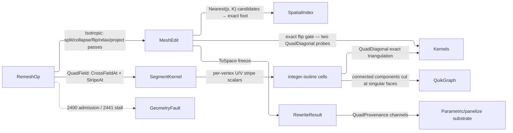

# [RASM_SIMPLIFICATION_REMESH]

`RemeshOp` owns predicate-gated mesh rewrite toward a target sampling: one `[Union]` folds isotropic edge-length equalization and cross-field quad extraction through a single `MeshEdit` arena under one exact projected-convexity flip gate.

A rebuild composes the `Meshing/edit` arena as the sole position and face carrier, the exact `Kernels.QuadDiagonal` gate, the `Spatial/index` BVH re-projecting every relaxed vertex onto the original surface, and the `segment` Knöppel owners `SegmentKernel.CrossFieldAt`/`StripeAt` over the admitting `VectorField.CrossField` factory.

## [01]-[INDEX]

- [02]-[REMESHING]: `Remeshing.Apply` folds isotropic equalization and cross-field quadding through one arena to `Fin<RewriteResult>`.

## [02]-[REMESHING]

- Owner: `Remeshing` mints the one static rewrite surface over `RemeshOp` the request `[Union]`, `RemeshPolicy` the `IValidityEvidence` policy row every pass reads, `RemeshTrace` the receipt, `QuadProvenance` the quad substrate, and `RewriteResult` the carrier.
- Cases: `RemeshOp` rows `Isotropic` the edge-length equalizer and `QuadField` the field-guided quad extraction; target length and the quad arm's n-RoSy `Symmetry` ride as per-request data, the pass budget and hysteresis band as policy.
- Entry: `Apply(RemeshOp, Op?)` discriminates on the op case over the `Fin` rail; an inadmissible request routes `DegenerateInput` 2400 and a budget-exhausted rewrite `RemeshStalled` 2441 carrying the achieved deviation, so a caller reads converged, converged-early, and stalled structurally.
- Auto: `Apply` internalizes arena lifetime, the one original-surface BVH build, pass budgeting with its early convergence exit, feature and boundary pinning, and the quad arm's isotropic pre-conditioning, so a caller supplies the op and reads the receipt.
- Receipt: `RemeshTrace` witnesses every rewrite; `QuadProvenance` rides `RewriteResult.Quads` on the quad arm alone.
- Packages: `Rasm.Meshing`, `Rasm.Spatial`, `Rasm.Processing`, `Rasm.Numerics`, and `Rasm.Domain` are the composed kernel siblings over Rhino.Geometry at the seam; QuikGraph's `ConnectedComponents` labels the patch decomposition, CommunityToolkit.HighPerformance's `IAction` drives the double-buffered relax sweep, and Thinktecture.Runtime.Extensions with LanguageExt.Core generate the op dispatch and its `Fin` rail.
- Growth: a new rewrite modality is one `RemeshOp` case over the same pass machinery; a curvature-adaptive sizing field is one policy delegate replacing the constant `ℓ` in the same hysteresis tests; feature-vertex sliding is one relax-arm branch on the feature census; a new pass verb is one arm in the fold.
- Boundary: `RemeshOp` owns the author-kernel rewrite alone, and QuikGraph's adjacency graph never leaves the extraction.

```csharp signature
// --- [RUNTIME_PRELUDE] ----------------------------------------------------------------------
using System;
using System.Collections.Generic;
using System.Linq;
using CommunityToolkit.HighPerformance.Helpers;
using LanguageExt;
using QuikGraph;
using QuikGraph.Algorithms;
using Rasm.Domain;
using Rasm.Meshing;
using Rasm.Numerics;
using Rasm.Spatial;
using Rhino.Geometry;
using Thinktecture;
using static LanguageExt.Prelude;
// CS0104 guard: LanguageExt.HashSet collides with the BCL name under the dual usings.
using EdgeKeySet = System.Collections.Generic.HashSet<(int U, int V)>;
using IndexSet = System.Collections.Generic.HashSet<int>;

namespace Rasm.Processing;

// --- [CONSTANTS] ------------------------------------------------------------------------------
// SplitRatio/CollapseRatio are the Botsch-Kobbelt hysteresis band: neither op mints an edge the other immediately reverses.
public sealed record RemeshPolicy(
    int Iterations, double SplitRatio, double CollapseRatio, double FeatureAngle,
    double ConvergenceBand, int ProjectCandidates, int ParallelFloor) : IValidityEvidence {
    public static readonly RemeshPolicy Canonical = new(
        Iterations: 8, SplitRatio: 4.0 / 3.0, CollapseRatio: 4.0 / 5.0, FeatureAngle: 0.6981317007977318,
        ConvergenceBand: 0.2, ProjectCandidates: 8, ParallelFloor: 4_096);

    public bool IsValid => ValidityClaim.All(
        ValidityClaim.Positive(value: Iterations),
        ValidityClaim.Positive(value: FeatureAngle),
        ValidityClaim.Positive(value: ConvergenceBand),
        ValidityClaim.Positive(value: ProjectCandidates),
        ValidityClaim.Positive(value: ParallelFloor))
        && SplitRatio > 1.0 && CollapseRatio is > 0.0 and < 1.0;
}

// --- [MODELS] -----------------------------------------------------------------------------------
public sealed record RemeshTrace(
    double TargetLength, double AchievedMean, double AchievedMax, int Iterations,
    int Splits, int Collapses, int Flips, int FeatureEdges);

// Panelize substrate wire: a decoder binds these channels without re-running the field solve.
public sealed record QuadProvenance(Arr<int> Corners, Arr<int> PatchOf, Arr<double> U, Arr<double> V, Arr<int> SingularFaces);

public sealed record RewriteResult(MeshSpace Mesh, RemeshTrace Trace, Option<QuadProvenance> Quads);

// --- [OPERATIONS] -------------------------------------------------------------------------------
[Union(ConversionFromValue = ConversionOperatorsGeneration.None)]
public abstract partial record RemeshOp {
    private RemeshOp() { }

    public sealed record Isotropic(MeshSpace Mesh, double TargetLength, RemeshPolicy Policy) : RemeshOp;
    public sealed record QuadField(MeshSpace Mesh, double TargetLength, int Symmetry, RemeshPolicy Policy) : RemeshOp;
}

public static class Remeshing {
    public static Fin<RewriteResult> Apply(RemeshOp op, Op? key = null) =>
        op.Switch(
            isotropic: i => Admit(i.Mesh, i.TargetLength, i.Policy).Bind(_ => Equalize(i.Mesh, i.TargetLength, i.Policy, key)
                .Map(pair => new RewriteResult(pair.Space, pair.Trace, None))),
            quadField: q => Admit(q.Mesh, q.TargetLength, q.Policy).Bind(_ => Quadrangulate(q, key)));

    static Fin<Unit> Admit(MeshSpace mesh, double target, RemeshPolicy policy) =>
        mesh.Native.Faces.Count == 0 ? Fin.Fail<Unit>(new GeometryFault.DegenerateInput(Kind.Mesh, 0, "empty mesh").ToError())
        : !(target > 0.0) ? Fin.Fail<Unit>(new GeometryFault.DegenerateInput(Kind.Mesh, 0, "non-positive target length").ToError())
        : !policy.IsValid ? Fin.Fail<Unit>(new GeometryFault.DegenerateInput(Kind.Mesh, 0, "invalid remesh policy").ToError())
        : Fin.Succ(unit);

    // --- [ISOTROPIC]
    // Botsch-Kobbelt fold over ONE arena; statement bodies ride the arena-tier exemption.
    static Fin<(MeshSpace Space, RemeshTrace Trace)> Equalize(MeshSpace source, double target, RemeshPolicy policy, Op? key) {
        using MeshEdit arena = MeshEdit.Of(source, ArenaPolicy.Canonical with { ParallelFloor = policy.ParallelFloor });
        return SourceIndex(source, key).Bind(frozen => {
            (int splits, int collapses, int flips, int features) = (0, 0, 0, 0);
            int round = 0;
            for (; round < policy.Iterations; round++) {
                Edges edges = Edges.Of(arena, policy.FeatureAngle);
                features = edges.FeatureCount;
                int did = Split(arena, edges, target * policy.SplitRatio);
                splits += did;
                edges = Edges.Of(arena, policy.FeatureAngle);
                int killed = Collapse(arena, edges, target * policy.CollapseRatio, target * policy.SplitRatio);
                collapses += killed;
                edges = Edges.Of(arena, policy.FeatureAngle);
                int turned = Flip(arena, edges);
                flips += turned;
                Relax(arena, Edges.Of(arena, policy.FeatureAngle), policy);
                Fin<Unit> projected = Project(arena, frozen, policy, key);
                if (projected.Case is LanguageExt.Common.Error fault) { return Fin.Fail<(MeshSpace, RemeshTrace)>(fault); }
                if (did + killed + turned == 0 && Deviation(arena, target).Mean <= policy.ConvergenceBand) { round++; break; }
            }
            (double mean, double max) = Deviation(arena, target);
            return mean > policy.ConvergenceBand
                ? Fin.Fail<(MeshSpace, RemeshTrace)>(new GeometryFault.RemeshStalled(target, target * (1.0 + mean), round).ToError())
                : arena.ToSpace(source.Tolerance, key)
                    .Map(space => (space, new RemeshTrace(target, mean, max, round, splits, collapses, flips, features)));
        });
    }

    // Per-phase edge table rebuilt O(F), never per operation.
    sealed record Edges(Dictionary<(int U, int V), (int F0, int F1)> Table, EdgeKeySet Feature, IndexSet Pinned, IndexSet Boundary) {
        public int FeatureCount => Feature.Count;

        public static Edges Of(MeshEdit arena, double featureAngle) {
            Dictionary<(int, int), (int, int)> table = [];
            for (int f = 0; f < arena.FaceCount; f++) {
                if (!arena.Alive(f)) { continue; }
                (int a, int b, int c) = arena.Face(f);
                foreach ((int u, int v) in (ReadOnlySpan<(int, int)>)[(a, b), (b, c), (c, a)]) {
                    (int cu, int cv) = (int.Min(u, v), int.Max(u, v));
                    table[(cu, cv)] = table.TryGetValue((cu, cv), out (int F0, int F1) held) ? (held.F0, f) : (f, -1);
                }
            }
            EdgeKeySet feature = [];
            IndexSet pinned = [];
            IndexSet boundary = [];
            foreach (((int u, int v), (int f0, int f1)) in table) {
                if (f1 < 0) {
                    boundary.Add(u);
                    boundary.Add(v);
                }
                bool crease = f1 < 0 || Vector3d.VectorAngle(Normal(arena, f0), Normal(arena, f1)) > featureAngle;
                if (crease) {
                    feature.Add((u, v));
                    pinned.Add(u);
                    pinned.Add(v);
                }
            }
            return new Edges(table, feature, pinned, boundary);
        }

        static Vector3d Normal(MeshEdit arena, int f) {
            (int a, int b, int c) = arena.Face(f);
            return Vector3d.CrossProduct(arena.Position(b) - arena.Position(a), arena.Position(c) - arena.Position(a));
        }
    }

    // Winding-consistent split: the face's own u→v traversal orders the (u,m,w)/(m,v,w) pair, so freeze sees one orientation.
    static int Split(MeshEdit arena, Edges edges, double ceiling) {
        int did = 0;
        foreach (((int u, int v), (int f0, int f1)) in edges.Table.ToArray()) {
            if (arena.Position(u).DistanceTo(arena.Position(v)) <= ceiling) { continue; }
            int m = arena.AddVertex(0.5 * (arena.Position(u) + arena.Position(v)));
            foreach (int f in (ReadOnlySpan<int>)[f0, f1]) {
                if (f < 0 || !arena.Alive(f)) { continue; }
                (int a, int b, int c) = arena.Face(f);
                bool holds = (a == u || b == u || c == u) && (a == v || b == v || c == v);
                if (!holds) { continue; }  // stale row — an earlier split re-pointed this face
                (int from, int to) = Follows(a, b, c, u, v) ? (u, v) : (v, u);
                int w = a != u && a != v ? a : b != u && b != v ? b : c;
                arena.SetFace(f, from, m, w);
                arena.AddFace(m, to, w);
            }
            did++;
        }
        return did;
    }

    static bool Follows(int a, int b, int c, int u, int v) =>
        (a == u && b == v) || (b == u && c == v) || (c == u && a == v);

    static bool Holds((int A, int B, int C) face, int u, int v) =>
        (face.A == u || face.B == u || face.C == u) && (face.A == v || face.B == v || face.C == v);

    static int Collapse(MeshEdit arena, Edges edges, double floor, double ceiling) {
        Dictionary<int, List<int>> facesOf = [];
        for (int f = 0; f < arena.FaceCount; f++) {
            if (!arena.Alive(f)) { continue; }
            (int a, int b, int c) = arena.Face(f);
            foreach (int v in (ReadOnlySpan<int>)[a, b, c]) {
                (facesOf.TryGetValue(v, out List<int>? fs) ? fs : facesOf[v] = []).Add(f);
            }
        }
        Dictionary<int, IndexSet> neighbors = [];
        foreach (((int u, int v), _) in edges.Table) {
            (neighbors.TryGetValue(u, out IndexSet? nu) ? nu : neighbors[u] = []).Add(v);
            (neighbors.TryGetValue(v, out IndexSet? nv) ? nv : neighbors[v] = []).Add(u);
        }
        IndexSet dead = [];
        int did = 0;
        foreach (((int cu, int cv), (_, int f1)) in edges.Table) {
            if (dead.Contains(cu) || dead.Contains(cv)) { continue; }
            (int u, int v) = edges.Pinned.Contains(cu) ? (cv, cu) : (cu, cv);  // collapse TOWARD the feature: the pinned end survives
            if (edges.Pinned.Contains(u)) { continue; }  // both ends pinned — a crease segment, held
            if (arena.Position(u).DistanceTo(arena.Position(v)) >= floor) { continue; }
            // link condition — the genus gate: a shared one-ring wider than the edge's opposite corners pinches the surface.
            if (neighbors[u].Count(w => neighbors[v].Contains(w)) != (f1 < 0 ? 1 : 2)) { continue; }
            bool minted = facesOf.TryGetValue(u, out List<int>? around) && around.Where(arena.Alive).Any(f => {
                (int a, int b, int c) = arena.Face(f);
                foreach (int w in (ReadOnlySpan<int>)[a, b, c]) {
                    if (w != u && w != v && arena.Position(v).DistanceTo(arena.Position(w)) > ceiling) { return true; }
                }
                return false;
            });
            if (minted) { continue; }  // hysteresis: a collapse never mints a splittable edge
            foreach (int f in facesOf.TryGetValue(u, out List<int>? incident) ? incident : []) {
                if (!arena.Alive(f)) { continue; }
                (int a, int b, int c) = arena.Face(f);
                (a, b, c) = (a == u ? v : a, b == u ? v : b, c == u ? v : c);
                if (a == b || b == c || c == a) { arena.KillFace(f); }
                else {
                    arena.SetFace(f, a, b, c);
                    (facesOf.TryGetValue(v, out List<int>? vf) ? vf : facesOf[v] = []).Add(f);
                }
            }
            foreach (int w in neighbors[u].Where(w => w != v)) {  // merge one-rings so the link gate stays sound within the sweep
                neighbors[w].Remove(u);
                neighbors[w].Add(v);
                neighbors[v].Add(w);
            }
            neighbors[v].Remove(u);
            dead.Add(u);
            did++;
        }
        return did;
    }

    // Flip admits ONLY on the exact strict-convexity gate; a float dihedral mis-classifies remeshing's skinny quads.
    static int Flip(MeshEdit arena, Edges edges) {
        Dictionary<int, int> valence = [];
        foreach (((int u, int v), _) in edges.Table) {
            valence[u] = valence.GetValueOrDefault(u) + 1;
            valence[v] = valence.GetValueOrDefault(v) + 1;
        }
        int did = 0;
        foreach (((int a0, int b0), (int f0, int f1)) in edges.Table.ToArray()) {
            if (f1 < 0 || edges.Feature.Contains((a0, b0)) || !arena.Alive(f0) || !arena.Alive(f1)) { continue; }
            if (!Holds(arena.Face(f0), a0, b0) || !Holds(arena.Face(f1), a0, b0)) { continue; }  // stale row — an earlier flip re-cornered a face
            (int fa, int fb, int fc) = arena.Face(f0);
            // normalize so f0 traverses a→b: winding-consistent flip emission depends on it
            (int a, int b) = Follows(fa, fb, fc, a0, b0) ? (a0, b0) : (b0, a0);
            int c = Opposite(arena, f0, a, b);
            int d = Opposite(arena, f1, a, b);
            if (c < 0 || d < 0 || c == d) { continue; }
            int Deviate(int v, int delta) => Math.Abs(valence.GetValueOrDefault(v) + delta - (edges.Boundary.Contains(v) ? 4 : 6));
            int before = Deviate(a, 0) + Deviate(b, 0) + Deviate(c, 0) + Deviate(d, 0);
            int after = Deviate(a, -1) + Deviate(b, -1) + Deviate(c, +1) + Deviate(d, +1);
            if (after >= before) { continue; }
            (Point3d pa, Point3d pb, Point3d pc, Point3d pd) =
                (arena.Position(a), arena.Position(b), arena.Position(c), arena.Position(d));
            if (!Kernels.QuadDiagonal(pa, pc, pb, pd) || !Kernels.QuadDiagonal(pc, pa, pd, pb)) { continue; }
            arena.SetFace(f0, a, d, c);
            arena.SetFace(f1, b, c, d);
            (valence[a], valence[b], valence[c], valence[d]) =
                (valence.GetValueOrDefault(a) - 1, valence.GetValueOrDefault(b) - 1, valence.GetValueOrDefault(c) + 1, valence.GetValueOrDefault(d) + 1);
            did++;
        }
        return did;
    }

    static int Opposite(MeshEdit arena, int f, int u, int v) {
        (int a, int b, int c) = arena.Face(f);
        return a != u && a != v ? a : b != u && b != v ? b : c != u && c != v ? c : -1;
    }

    // Area-weighted centroid EQUALIZES sampling; the cotangent operator reproduces the current shape and nulls the equalization.
    readonly struct RelaxAction(double[] gx, double[] gy, double[] gz, double[] weight, double[] nx, double[] ny, double[] nz, double[] px, double[] py, double[] pz, bool[] pinned) : IAction {
        public void Invoke(int v) {
            if (pinned[v] || weight[v] <= double.Epsilon) { return; }
            Point3d g = new(gx[v] / weight[v], gy[v] / weight[v], gz[v] / weight[v]);
            Vector3d n = new(nx[v], ny[v], nz[v]);
            Point3d p = new(px[v], py[v], pz[v]);
            if (!n.Unitize()) { return; }
            Point3d moved = g + (((p - g) * n) * n);  // g projected to p's tangent plane
            (px[v], py[v], pz[v]) = (moved.X, moved.Y, moved.Z);
        }
    }

    static void Relax(MeshEdit arena, Edges edges, RemeshPolicy policy) {
        int n = arena.VertexCount;
        (double[] gx, double[] gy, double[] gz, double[] weight) = (new double[n], new double[n], new double[n], new double[n]);
        (double[] nx, double[] ny, double[] nz) = (new double[n], new double[n], new double[n]);
        for (int f = 0; f < arena.FaceCount; f++) {
            if (!arena.Alive(f)) { continue; }
            (int a, int b, int c) = arena.Face(f);
            Vector3d cross = Vector3d.CrossProduct(arena.Position(b) - arena.Position(a), arena.Position(c) - arena.Position(a));
            double area = 0.5 * cross.Length;
            Point3d centroid = (arena.Position(a) + arena.Position(b) + arena.Position(c)) / 3.0;
            foreach (int v in (ReadOnlySpan<int>)[a, b, c]) {
                (gx[v], gy[v], gz[v], weight[v]) = (gx[v] + (area * centroid.X), gy[v] + (area * centroid.Y), gz[v] + (area * centroid.Z), weight[v] + area);
                (nx[v], ny[v], nz[v]) = (nx[v] + cross.X, ny[v] + cross.Y, nz[v] + cross.Z);
            }
        }
        bool[] pinned = new bool[n];
        foreach (int v in edges.Pinned) { pinned[v] = true; }
        (double[] px, double[] py, double[] pz) = (new double[n], new double[n], new double[n]);
        for (int v = 0; v < n; v++) { (px[v], py[v], pz[v]) = (arena.Position(v).X, arena.Position(v).Y, arena.Position(v).Z); }
        arena.Parallel(n, new RelaxAction(gx, gy, gz, weight, nx, ny, nz, px, py, pz, pinned));
        for (int v = 0; v < n; v++) { arena.SetPosition(v, new Point3d(px[v], py[v], pz[v])); }
    }

    // --- [PROJECTION]
    // Projection target: the ORIGINAL surface frozen at pass-zero, immutable for the whole rewrite.
    sealed record Source(SpatialIndex Index, (Point3d A, Point3d B, Point3d C)[] Faces);

    static Fin<Source> SourceIndex(MeshSpace source, Op? key) {
        using MeshEdit soup = MeshEdit.Of(source);
        BoundingBox[] boxes = new BoundingBox[soup.FaceCount];
        (Point3d A, Point3d B, Point3d C)[] corners = new (Point3d A, Point3d B, Point3d C)[soup.FaceCount];
        for (int f = 0; f < soup.FaceCount; f++) {
            boxes[f] = soup.Bounds(f);
            (int a, int b, int c) = soup.Face(f);
            corners[f] = (soup.Position(a), soup.Position(b), soup.Position(c));
        }
        return Spatial.Apply(new SpatialOp.Build(SpatialKind.Bvh, boxes, BuildPolicy.Canonical), key)
            .Bind(answer => answer is SpatialAnswer.Index built
                ? Fin.Succ(new Source(built.Value, corners))
                : Fin.Fail<Source>(new GeometryFault.KindMismatch(SpatialKind.Bvh, QueryKind.Nearest).ToError()));
    }

    static Fin<Unit> Project(MeshEdit arena, Source source, RemeshPolicy policy, Op? key) {
        (Point3d A, Point3d B, Point3d C)[] faces = source.Faces;
        SpatialIndex index = source.Index;
        for (int v = 0; v < arena.VertexCount; v++) {
            Point3d p = arena.Position(v);
            Fin<Seq<int>> nearest = Spatial.Apply(new SpatialOp.Query(index, new SpatialQuery.Nearest(p, policy.ProjectCandidates)), key)
                .Bind(static answer => answer is SpatialAnswer.Result { Value: QueryResult.Nearest hits }
                    ? Fin.Succ(hits.Ordered)
                    : Fin.Fail<Seq<int>>(new GeometryFault.KindMismatch(SpatialKind.Bvh, QueryKind.Nearest).ToError()));
            if (nearest.Case is LanguageExt.Common.Error fault) { return Fin.Fail<Unit>(fault); }
            Point3d best = p;
            double bestD = double.PositiveInfinity;
            foreach (int f in (Seq<int>)nearest.Case!) {
                Point3d foot = ClosestOnTriangle(p, faces[f].A, faces[f].B, faces[f].C);
                double d = p.DistanceTo(foot);
                if (d < bestD) { (best, bestD) = (foot, d); }
            }
            arena.SetPosition(v, best);
        }
        return Fin.Succ(unit);
    }

    static (double Mean, double Max) Deviation(MeshEdit arena, double target) {
        (double sum, double max, int count) = (0.0, 0.0, 0);
        EdgeKeySet seen = [];
        for (int f = 0; f < arena.FaceCount; f++) {
            if (!arena.Alive(f)) { continue; }
            (int a, int b, int c) = arena.Face(f);
            foreach ((int u, int v) in (ReadOnlySpan<(int, int)>)[(a, b), (b, c), (c, a)]) {
                if (!seen.Add((int.Min(u, v), int.Max(u, v)))) { continue; }
                double dev = Math.Abs(arena.Position(u).DistanceTo(arena.Position(v)) - target) / target;
                (sum, max, count) = (sum + dev, double.Max(max, dev), count + 1);
            }
        }
        return (count > 0 ? sum / count : 0.0, max);
    }

    // --- [QUAD_FIELD]
    // Isotropic conditioning first — the field solve needs bounded aspect ratios; both stripe families ride one memoized field owner.
    static Fin<RewriteResult> Quadrangulate(RemeshOp.QuadField op, Op? key) =>
        Equalize(op.Mesh, op.TargetLength, op.Policy, key).Bind(pair => {
            MeshSpace space = pair.Space;
            Op threaded = key.OrDefault();
            double frequency = 1.0 / op.TargetLength;
            (int a, int b, int c) = (space.Native.Faces[0].A, space.Native.Faces[0].B, space.Native.Faces[0].C);
            Point3d seed = space.Native.Vertices[a];  // the anchored ordinal IS a corner of the normal's face
            Vector3d normal = Vector3d.CrossProduct(
                (Point3d)space.Native.Vertices[b] - space.Native.Vertices[a],
                (Point3d)space.Native.Vertices[c] - space.Native.Vertices[a]);
            return SegmentKernel.CrossFieldAt(space, op.Symmetry, None, None, seed, threaded)
                .Bind(baseDir => Direction.Of(value: Vector3d.CrossProduct(normal, baseDir), context: space.Tolerance, key: threaded))
                // Both fields ride the ADMITTING factory: symmetry ∈ {1,2,4,6}, anchor ordinal proven at construction.
                .Bind(turned =>
                    from cross in VectorField.CrossField(space, op.Symmetry, None, None, threaded)
                    from rotated in VectorField.CrossField(space, op.Symmetry, Some(Seq((a, turned))), None, threaded)
                    select (Cross: cross, Rotated: rotated))
                .Bind(fields =>
                    (SampleStripes(space, fields.Cross, frequency, threaded).ToValidation(),
                     SampleStripes(space, fields.Rotated, frequency, threaded).ToValidation())
                        .Apply(static (us, vs) => (Us: us, Vs: vs)).As().ToFin()
                        .Bind(uv => ExtractQuads(space, uv.Us, uv.Vs, pair.Trace, key)));
        });

    static Fin<double[]> SampleStripes(MeshSpace space, VectorField field, double frequency, Op key) {
        int n = space.Native.Vertices.Count;
        double[] values = new double[n];
        for (int v = 0; v < n; v++) {
            Fin<double> at = SegmentKernel.StripeAt(space, field, frequency, space.Native.Vertices[v], key);
            if (at.Case is LanguageExt.Common.Error fault) { return Fin.Fail<double[]>(fault); }
            values[v] = (double)at.Case!;
        }
        return Fin.Succ(values);
    }

    static Fin<RewriteResult> ExtractQuads(MeshSpace space, double[] u, double[] v, RemeshTrace trace, Op? key) {
        using MeshEdit soup = MeshEdit.Of(space);
        IndexSet singular = [];
        Dictionary<(long Iu, long Iv), List<int>> cellFaces = [];
        for (int f = 0; f < soup.FaceCount; f++) {
            (int a, int b, int c) = soup.Face(f);
            (double du, double dv) = (Spread(u[a], u[b], u[c]), Spread(v[a], v[b], v[c]));
            if (du > 1.0 || dv > 1.0) { singular.Add(f); continue; }  // corner span past one period — the field-index witness
            // a face registers in every integer cell its (u,v) extent overlaps, so a boundary cell corner always finds its face
            (long lu, long hu) = ((long)Math.Floor(Math.Min(u[a], Math.Min(u[b], u[c]))), (long)Math.Floor(Math.Max(u[a], Math.Max(u[b], u[c]))));
            (long lv, long hv) = ((long)Math.Floor(Math.Min(v[a], Math.Min(v[b], v[c]))), (long)Math.Floor(Math.Max(v[a], Math.Max(v[b], v[c]))));
            for (long iu = lu; iu <= hu; iu++) {
                for (long iv = lv; iv <= hv; iv++) {
                    (cellFaces.TryGetValue((iu, iv), out List<int>? fs) ? fs : cellFaces[(iu, iv)] = []).Add(f);
                }
            }
        }
        UndirectedGraph<int, SEdge<int>> adjacency = new(allowParallelEdges: false);
        adjacency.AddVertexRange(Enumerable.Range(0, soup.FaceCount).Where(f => !singular.Contains(f)));
        Dictionary<(int, int), int> byEdge = [];
        for (int f = 0; f < soup.FaceCount; f++) {
            if (singular.Contains(f)) { continue; }
            (int a, int b, int c) = soup.Face(f);
            foreach ((int p, int q) in (ReadOnlySpan<(int, int)>)[(a, b), (b, c), (c, a)]) {
                (int cp, int cq) = (int.Min(p, q), int.Max(p, q));
                if (byEdge.TryGetValue((cp, cq), out int g) && !singular.Contains(g)) { adjacency.AddEdge(new SEdge<int>(int.Min(f, g), int.Max(f, g))); }
                else { byEdge[(cp, cq)] = f; }
            }
        }
        Dictionary<int, int> faceComponent = [];
        adjacency.ConnectedComponents(faceComponent);

        // grid vertices intern per (iu, iv, patch), so a patch seam duplicates its corner by design
        using MeshEdit emit = MeshEdit.Of(ReadOnlySpan<Point3d>.Empty, ReadOnlySpan<(int, int, int)>.Empty);
        Dictionary<(long, long, int), int> interned = [];
        (List<double> uOut, List<double> vOut) = ([], []);
        (List<int> corners, List<int> patchOf) = ([], []);
        foreach ((long iu, long iv) in cellFaces.Keys.OrderBy(static cell => cell)) {
            Span<(long Du, long Dv)> ring = [(0, 0), (1, 0), (1, 1), (0, 1)];
            Span<int> quad = stackalloc int[4];
            int patch = -1;
            bool complete = true;
            for (int k = 0; k < 4; k++) {
                (long cu, long cv) = (iu + ring[k].Du, iv + ring[k].Dv);
                if (Locate(soup, u, v, cellFaces, cu, cv) is not (Point3d at, int home)) { complete = false; break; }
                if (patch < 0) { patch = faceComponent.GetValueOrDefault(home); }
                if (!interned.TryGetValue((cu, cv, patch), out int ordinal)) {
                    ordinal = emit.AddVertex(at);
                    interned[(cu, cv, patch)] = ordinal;
                    uOut.Add(cu);
                    vOut.Add(cv);
                }
                quad[k] = ordinal;
            }
            if (!complete) { continue; }
            corners.AddRange([quad[0], quad[1], quad[2], quad[3]]);
            patchOf.Add(patch);
            if (Kernels.QuadDiagonal(emit.Position(quad[0]), emit.Position(quad[1]), emit.Position(quad[2]), emit.Position(quad[3]))) {
                emit.AddFace(quad[0], quad[1], quad[2]);
                emit.AddFace(quad[0], quad[2], quad[3]);
            }
            else {
                emit.AddFace(quad[0], quad[1], quad[3]);
                emit.AddFace(quad[1], quad[2], quad[3]);
            }
        }
        return emit.ToSpace(space.Tolerance, key).Map(mesh => new RewriteResult(
            mesh, trace, Some(new QuadProvenance(toArr(corners), toArr(patchOf), toArr(uOut), toArr(vOut), toArr(singular.Order())))));
    }

    // Inverse-linear locate: the corner's four adjacent cell bins bound the candidate faces.
    static (Point3d At, int Face)? Locate(MeshEdit soup, double[] u, double[] v, Dictionary<(long Iu, long Iv), List<int>> cells, long cu, long cv) {
        foreach ((long du, long dv) in (ReadOnlySpan<(long, long)>)[(0, 0), (-1, 0), (0, -1), (-1, -1)]) {
            if (!cells.TryGetValue((cu + du, cv + dv), out List<int>? members)) { continue; }
            foreach (int f in members) {
                (int a, int b, int c) = soup.Face(f);
                double det = ((u[b] - u[a]) * (v[c] - v[a])) - ((u[c] - u[a]) * (v[b] - v[a]));
                if (Math.Abs(det) <= double.Epsilon) { continue; }
                double wb = (((cu - u[a]) * (v[c] - v[a])) - ((cv - v[a]) * (u[c] - u[a]))) / det;
                double wc = (((cv - v[a]) * (u[b] - u[a])) - ((cu - u[a]) * (v[b] - v[a]))) / det;
                double wa = 1.0 - wb - wc;
                if (wa is < 0.0 or > 1.0 || wb is < 0.0 or > 1.0 || wc is < 0.0 or > 1.0) { continue; }
                (Point3d pa, Point3d pb, Point3d pc) = (soup.Position(a), soup.Position(b), soup.Position(c));
                return (new Point3d(
                    (wa * pa.X) + (wb * pb.X) + (wc * pc.X),
                    (wa * pa.Y) + (wb * pb.Y) + (wc * pc.Y),
                    (wa * pa.Z) + (wb * pb.Z) + (wc * pc.Z)), f);
            }
        }
        return null;
    }

    static double Spread(double a, double b, double c) => Math.Max(a, Math.Max(b, c)) - Math.Min(a, Math.Min(b, c));

    // Ericson-form point-triangle projection: the exact local refinement behind the BVH candidate prune.
    static Point3d ClosestOnTriangle(Point3d p, Point3d a, Point3d b, Point3d c) {
        Vector3d ab = b - a, ac = c - a, ap = p - a;
        double d1 = ab * ap, d2 = ac * ap;
        if (d1 <= 0.0 && d2 <= 0.0) { return a; }
        Vector3d bp = p - b;
        double d3 = ab * bp, d4 = ac * bp;
        if (d3 >= 0.0 && d4 <= d3) { return b; }
        double vc = (d1 * d4) - (d3 * d2);
        if (vc <= 0.0 && d1 >= 0.0 && d3 <= 0.0) { return a + ((d1 / (d1 - d3)) * ab); }
        Vector3d cp = p - c;
        double d5 = ab * cp, d6 = ac * cp;
        if (d6 >= 0.0 && d5 <= d6) { return c; }
        double vb = (d5 * d2) - (d1 * d6);
        if (vb <= 0.0 && d2 >= 0.0 && d6 <= 0.0) { return a + ((d2 / (d2 - d6)) * ac); }
        double va = (d3 * d6) - (d5 * d4);
        if (va <= 0.0 && (d4 - d3) >= 0.0 && (d5 - d6) >= 0.0) { return b + (((d4 - d3) / ((d4 - d3) + (d5 - d6))) * (c - b)); }
        double denom = 1.0 / (va + vb + vc);
        return a + ((vb * denom) * ab) + ((vc * denom) * ac);
    }
}
```



## [03]-[DENSITY_BAR]

One owner per axis; each `[RAIL]` names the owner's one return rail.

| [INDEX] | [AXIS_CONCERN] | [OWNER]          | [RAIL]                                 | [CASES] |
| :-----: | :------------- | :--------------- | :------------------------------------- | :-----: |
|  [01]   | Remeshing      | `RemeshOp`       | `Remeshing.Apply → Fin<RewriteResult>` |    2    |
|  [02]   | Rewrite policy | `RemeshPolicy`   | value (`IValidityEvidence`)            |    —    |
|  [03]   | Evidence       | `RemeshTrace`    | carrier on the result                  |    —    |
|  [04]   | Quad substrate | `QuadProvenance` | carrier (`Option` on the result)       |    —    |

## [04]-[RESEARCH]

<!-- source-only: research row template:
[TOKEN]-[OPEN|BLOCKED]: <exact question>; <verification route>.
[SPLIT_MEMBER]-[OPEN]: does `shape-core` expose `split_all`; verify against the member rail.
-->

(none)
