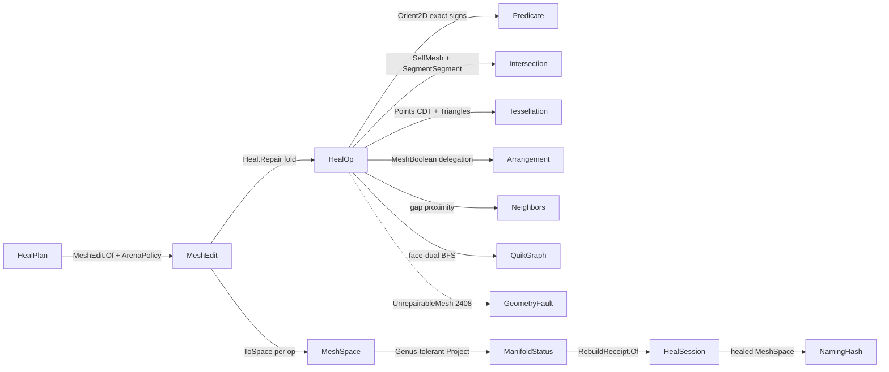

# [RASM_HEALING_REPAIR]

`Heal.Repair` folds the closed `HealOp` algebra over one `MeshEdit` arena and publishes a healed `MeshSpace` with its typed receipt chain. Repair stays total over its input class — a non-manifold, boundaried, or odd-Euler mesh heals rather than failing — and mints no content hash.

A rebuild composes the un-gated Genus-tolerant `TopologyReceipt` projection as the before/after topology witness; every failure lowers onto the band-2400 `GeometryFault` union, `UnrepairableMesh` 2408 carrying the residual defect count.

## [01]-[INDEX]

- [02]-[HEALING]: `Heal.Repair` folds the `HealOp` algebra over one arena under `RepairPolicy` admission, threading topology forward through the shared `Incidence` fold.

## [02]-[HEALING]

- Owner: `HealOp` is the closed repair algebra `Heal.Repair` folds; `HealStage` mints the one heal-modality vocabulary, discriminating both the fault payload and the receipt chain; `RepairPolicy` and `HealPlan` admit every scalar once at `Of`.
- Entry: `Heal.Repair` is the one entrypoint over every modality, discriminating on `HealPlan`.
- Auto: every author-kernel is a pure-managed arena fold composing the `Predicate` exact-sign floor, reading its tolerances off the plan policy.
- Receipt: `HealSession` carries one typed `RebuildReceipt` per applied op, its affected-entity seed read off the arena dirty bitsets.
- Packages: `Rasm.Meshing`, `Rasm.Processing`, `Rasm.Numerics`, `Rasm.Spatial`, QuikGraph, Thinktecture.Runtime.Extensions, LanguageExt.Core.
- Growth: a new modality is one `HealStage` row, one `HealOp` case, and one typed `RebuildReceipt` case; a new tolerance is one `RepairPolicy` column at `Of`; a new spatial or exact primitive routes its owning sibling as a consumer-contract row.
- Boundary: crossing, CDT, and boolean classification stay `Intersection`/`Tessellation`/`Arrangement` property, point proximity the `Spatial` neighbor lane. `RepairPolicy.Retile` names the constrained CDT stage, never remeshing; a composed sibling fault propagates unwrapped, and a collapse or re-mesh preserves every load-bearing feature.

```csharp signature
// --- [RUNTIME_PRELUDE] ----------------------------------------------------------------------
using System;
using System.Collections.Generic;
using System.Linq;
using LanguageExt;
using QuikGraph;
using QuikGraph.Algorithms;
using QuikGraph.Algorithms.Search;
using Rasm.Domain;
using Rasm.Meshing;
using Rasm.Numerics;
using Rasm.Spatial;
using Rhino.Geometry;
using Thinktecture;
using static LanguageExt.Prelude;
// CS0104 guard: LanguageExt.HashSet collides with the BCL name under the dual usings.
using FaceKeySet = System.Collections.Generic.HashSet<(int, int, int)>;
using IndexSet = System.Collections.Generic.HashSet<int>;
using Dimension = Rasm.Numerics.Dimension;

namespace Rasm.Processing;

// --- [TYPES] ----------------------------------------------------------------------------------
// THE heal-modality vocabulary: 2408 fault payload and receipt discriminant in one owner; Mint rows seed Heal.Standard.
[SmartEnum<string>]
[KeyMemberEqualityComparer<ComparerAccessors.StringOrdinal, string>]
[KeyMemberComparer<ComparerAccessors.StringOrdinal, string>]
public sealed partial class HealStage {
    public static readonly HealStage Weld          = new("weld", rebuildsTopology: true, mint: Some<Func<HealOp>>(static () => new HealOp.DuplicateWeld()));
    public static readonly HealStage Degenerate    = new("degenerate", rebuildsTopology: true, mint: Some<Func<HealOp>>(static () => new HealOp.DegenerateCollapse()));
    public static readonly HealStage Gap           = new("gap", rebuildsTopology: true, mint: Some<Func<HealOp>>(static () => new HealOp.GapClose()));
    public static readonly HealStage Manifold      = new("manifold", rebuildsTopology: true, mint: Some<Func<HealOp>>(static () => new HealOp.ManifoldRepair()));
    public static readonly HealStage Orient        = new("orient", rebuildsTopology: false, mint: Some<Func<HealOp>>(static () => new HealOp.OrientNormals()));
    public static readonly HealStage SelfIntersect = new("self-intersect", rebuildsTopology: true, mint: Some<Func<HealOp>>(static () => new HealOp.SelfIntersectResolve()));
    public static readonly HealStage Boolean       = new("boolean", rebuildsTopology: true, mint: None);

    public bool RebuildsTopology { get; }
    public Option<Func<HealOp>> Mint { get; }
}

// --- [CONSTANTS] ------------------------------------------------------------------------------
// Scalars admit once at Of, composed sibling policies at their own owners; the weld band is Arena.WeldTolerance, no weld knob here.
public sealed record RepairPolicy(
    PositiveMagnitude GapMaxSpan, double SliverAreaFloor, Dimension MaxManifoldPasses,
    ArenaPolicy Arena, IntersectPolicy Intersect, TessellationPolicy Retile, ArrangementPolicy Arrangement) : IValidityEvidence {
    public static readonly RepairPolicy Canonical = new(
        GapMaxSpan: PositiveMagnitude.Create(value: 1e-2), SliverAreaFloor: 1e-12,
        MaxManifoldPasses: Dimension.Create(value: 8),
        Arena: ArenaPolicy.Canonical, Intersect: IntersectPolicy.Canonical,
        Retile: TessellationPolicy.Constrained, Arrangement: ArrangementPolicy.Canonical);

    public bool IsValid => ValidityClaim.All(
        ValidityClaim.Finite(value: SliverAreaFloor), ValidityClaim.Nonnegative(value: SliverAreaFloor),
        ValidityClaim.Evidence(Intersect), ValidityClaim.Evidence(Retile), ValidityClaim.Evidence(Arrangement));

    public static Fin<RepairPolicy> Of(
        double gapMaxSpan, double sliverAreaFloor, int maxManifoldPasses,
        ArenaPolicy? arena = null, IntersectPolicy? intersect = null,
        TessellationPolicy? retile = null, ArrangementPolicy? arrangement = null, Op? key = null) {
        Op op = key.OrDefault();
        return from span in op.AcceptValidated<PositiveMagnitude>(candidate: gapMaxSpan)
               from floor in guard(ValidityClaim.Finite(value: sliverAreaFloor) && ValidityClaim.Nonnegative(value: sliverAreaFloor), op.InvalidInput()).ToFin().Map(_ => sliverAreaFloor)
               from passes in op.AcceptValidated<Dimension>(candidate: maxManifoldPasses)
               select new RepairPolicy(span, floor, passes,
                   arena ?? ArenaPolicy.Canonical, intersect ?? IntersectPolicy.Canonical,
                   retile ?? TessellationPolicy.Constrained, arrangement ?? ArrangementPolicy.Canonical);
    }
}

// --- [MODELS] ---------------------------------------------------------------------------------
public sealed record HealPlan(MeshSpace Input, Seq<HealOp> Ops, RepairPolicy Policy) : IValidityEvidence {
    public bool IsValid => ValidityClaim.All(ValidityClaim.CountAtLeast(count: Ops.Count, floor: 1), ValidityClaim.Evidence(Policy));

    public static Fin<HealPlan> Of(MeshSpace input, Seq<HealOp>? ops = null, RepairPolicy? policy = null, Op? key = null) {
        Op op = key.OrDefault();
        Seq<HealOp> sequence = ops ?? Heal.Standard;
        return from space in op.AcceptInput(input)
               from _ in guard(!sequence.IsEmpty, op.InvalidInput()).ToFin()
               select new HealPlan(space, sequence, policy ?? RepairPolicy.Canonical);
    }
}

// A kernel leaving the incidence fold current hands it forward, a mutating one drops it, so a stale fold is unrepresentable.
internal readonly record struct HealStep(MeshEdit Edit, Option<BooleanReceipt> Merge, Option<Incidence> Carry) {
    public static HealStep Same(MeshEdit edit) => new(edit, None, None);

    public static HealStep Carrying(MeshEdit edit, Incidence current) => new(edit, None, Some(current));
}

// --- [OPERATIONS] -----------------------------------------------------------------------------
[Union(ConversionFromValue = ConversionOperatorsGeneration.None)]
public abstract partial record HealOp {
    private HealOp() { }

    public sealed record DuplicateWeld : HealOp;
    public sealed record DegenerateCollapse : HealOp;
    public sealed record GapClose : HealOp;
    public sealed record ManifoldRepair : HealOp;
    public sealed record OrientNormals : HealOp;
    public sealed record SelfIntersectResolve : HealOp;
    public sealed record Boolean(BooleanOp Op, MeshSpace Tool) : HealOp;

    public HealStage Stage =>
        Switch(
            duplicateWeld:        static _ => HealStage.Weld,
            degenerateCollapse:   static _ => HealStage.Degenerate,
            gapClose:             static _ => HealStage.Gap,
            manifoldRepair:       static _ => HealStage.Manifold,
            orientNormals:        static _ => HealStage.Orient,
            selfIntersectResolve: static _ => HealStage.SelfIntersect,
            boolean:              static _ => HealStage.Boolean);

    // `current` is `edit`'s frozen image at fold entry: self-intersect detection and the boolean A operand ride it.
    internal Fin<HealStep> Apply(MeshEdit edit, MeshSpace current, RepairPolicy policy, Op key, Option<Incidence> carry) =>
        Switch(
            state: (Edit: edit, Current: current, Policy: policy, Key: key, Carry: carry),
            duplicateWeld:        static (s, _) => Fin.Succ(HealStep.Same(Kernels.WeldDuplicates(s.Edit))),
            degenerateCollapse:   static (s, _) => Heal.Collapse(s.Edit, s.Policy),
            gapClose:             static (s, _) => Heal.Close(s.Edit, s.Policy, s.Key, s.Carry),
            manifoldRepair:       static (s, _) => Heal.Split(s.Edit, s.Policy, s.Carry),
            orientNormals:        static (s, _) => Heal.Orient(s.Edit, s.Carry),
            selfIntersectResolve: static (s, _) => Heal.Resolve(s.Edit, s.Current, s.Policy, s.Key),
            boolean:              static (s, b) => Heal.Merge(b, s.Current, s.Policy, s.Key));
}

// One incidence fold shared by gap/manifold/orient, built once per arena state; kernel-local scratch under the arena-tier statement exemption.
internal readonly struct Incidence {
    internal readonly Dictionary<(int U, int V), List<int>> Edges;
    Incidence(Dictionary<(int U, int V), List<int>> edges) => Edges = edges;

    internal static Incidence Of(MeshEdit edit) {
        Dictionary<(int U, int V), List<int>> edges = new(3 * edit.FaceCount);
        for (int f = 0; f < edit.FaceCount; f++) {
            if (!edit.Alive(f)) continue;
            (int a, int b, int c) = edit.Face(f);
            Note(edges, a, b, f); Note(edges, b, c, f); Note(edges, c, a, f);
        }
        return new Incidence(edges);

        static void Note(Dictionary<(int U, int V), List<int>> edges, int u, int v, int f) =>
            (edges.TryGetValue(Key(u, v), out List<int>? faces) ? faces : edges[Key(u, v)] = []).Add(f);
    }

    internal static (int U, int V) Key(int u, int v) => u < v ? (u, v) : (v, u);

    // Boundary half-edges take direction from face winding, never the index-sorted key.
    internal Arr<(int Tail, int Head, int Face)> Boundary(MeshEdit edit) =>
        toArr(Edges.Where(static row => row.Value.Count == 1).Select(row => {
            (int a, int b, int c) = edit.Face(row.Value[0]);
            (int u, int v) = row.Key;
            (int tail, int head) = (a == u && b == v) || (b == u && c == v) || (c == u && a == v) ? (u, v) : (v, u);
            return (tail, head, row.Value[0]);
        }));

    internal Arr<((int U, int V) Edge, List<int> Fans)> NonManifold() =>
        toArr(Edges.Where(static row => row.Value.Count > 2).Select(static row => (row.Key, row.Value)));

    // Both arcs per interior 2-manifold edge carry the vertex pair; a >2-incident fan propagates no orientation, so Manifold precedes Orient.
    internal AdjacencyGraph<int, TaggedEdge<int, (int U, int V)>> Dual(MeshEdit edit) {
        AdjacencyGraph<int, TaggedEdge<int, (int U, int V)>> dual = new(allowParallelEdges: true);
        dual.AddVertexRange(Enumerable.Range(0, edit.FaceCount).Where(edit.Alive));
        foreach (((int U, int V) edge, List<int> faces) in Edges.Where(static row => row.Value.Count == 2)) {
            dual.AddEdge(new TaggedEdge<int, (int U, int V)>(faces[0], faces[1], edge));
            dual.AddEdge(new TaggedEdge<int, (int U, int V)>(faces[1], faces[0], edge));
        }
        return dual;
    }
}

public static class Heal {
    // Declaration order IS the canonical order: manifold precedes orient so the dual BFS walks a 2-manifold graph,
    // and self-intersect runs last, against the otherwise-healed snapshot.
    public static readonly Seq<HealOp> Standard =
        toSeq(HealStage.Items).Bind(static stage => stage.Mint.ToSeq()).Map(static mint => mint());

    // ONE live arena rides the swap-and-dispose seam; the fold threads Space/Status so before[n] = after[n-1] and the last freeze is the healed mesh.
    public static Fin<HealSession> Repair(HealPlan plan, Op? key = null) {
        Op op = key.OrDefault();
        Context context = plan.Input.Tolerance;
        MeshEdit live = MeshEdit.Of(plan.Input, plan.Policy.Arena);
        try {
            return Status(plan.Input, context, op).Bind(first =>
                plan.Ops.Fold(
                    Fin.Succ((Space: plan.Input, Status: first, Receipts: Seq<RebuildReceipt>(), Carry: Option<Incidence>.None)),
                    (acc, heal) => acc.Bind(state =>
                        from step in heal.Apply(live, state.Space, plan.Policy, op, state.Carry)
                        from space in Publish(step)
                        from after in Status(space, context, op)
                        select (Space: space, Status: after,
                                Receipts: state.Receipts.Add(RebuildReceipt.Of(heal, plan.Policy, state.Status, after, live, step.Merge)),
                                step.Carry)))
                .Map(state => new HealSession(Input: plan.Input, Healed: state.Space, Receipts: state.Receipts)));
        }
        finally { live.Dispose(); }

        Fin<MeshSpace> Publish(HealStep step) {
            if (!ReferenceEquals(step.Edit, live)) { live.Dispose(); live = step.Edit; }
            return live.ToSpace(context, op);
        }
    }

    // Projection stays un-gated, so the heal rail never rejects its input class.
    internal static Fin<ManifoldStatus> Status(MeshSpace space, Context context, Op key) =>
        VectorIntent.Topology(space, key)
            .Bind(intent => intent.Project<(int Euler, int BoundaryComponents, bool IsManifold, bool IsOriented, int NonManifoldEdges, Option<int> Genus)>(context: context, key: key))
            .Map(ManifoldStatus.Of);

    // --- [DEGENERATE_COLLAPSE]
    // A sliver flags on the EXACT Orient2D sign in the dominant-axis plane; the float area floor is a secondary gate behind an exact-keep.
    internal static Fin<HealStep> Collapse(MeshEdit edit, RepairPolicy policy) {
        FaceKeySet seen = new();
        for (int f = 0; f < edit.FaceCount; f++) {
            if (!edit.Alive(f)) continue;
            (int a, int b, int c) = edit.Face(f);
            if (a == b || b == c || c == a || !seen.Add(Sorted(a, b, c))) { edit.KillFace(f); continue; }
            (Point3d pa, Point3d pb, Point3d pc) = (edit.Position(a), edit.Position(b), edit.Position(c));
            Sign sign = Predicate.Orient2D(pa, pb, pc, Dominant(pa, pb, pc));
            if (sign == Sign.Zero || 0.5 * Vector3d.CrossProduct(pb - pa, pc - pa).Length < policy.SliverAreaFloor) edit.KillFace(f);
        }
        return Fin.Succ(HealStep.Same(edit));

        static (int, int, int) Sorted(int a, int b, int c) {
            (int lo, int hi) = (int.Min(a, int.Min(b, c)), int.Max(a, int.Max(b, c)));
            return (lo, a + b + c - lo - hi, hi);
        }
    }

    // --- [GAP_CLOSE]
    // Half-edge (a->b) pairs (c->d) when |b-c| and |d-a| both fit the span: opposite traversal keeps the bridge strip winding-coherent.
    internal static Fin<HealStep> Close(MeshEdit edit, RepairPolicy policy, Op key, Option<Incidence> carry) {
        Incidence incidence = carry.IfNone(() => Incidence.Of(edit));
        Arr<(int Tail, int Head, int Face)> rim = incidence.Boundary(edit);
        if (rim.Count < 2) return Fin.Succ(HealStep.Carrying(edit, incidence));   // zero mutation: the build stays current
        double span = policy.GapMaxSpan.Value;
        Point3d[] heads = [.. rim.Map(h => edit.Position(h.Head))];
        return NeighborIndex.Of(new NeighborSource.StaticCase(toSeq(rim.Map(h => edit.Position(h.Tail)))), key)
            .Bind(index => NeighborKernel.GraphOf(index: index, needles: heads, count: Option<int>.None, radius: Some(span), key: key))
            .Map(graph => Bridge(edit, rim, graph.Ids, span, incidence));
    }

    static HealStep Bridge(MeshEdit edit, Arr<(int Tail, int Head, int Face)> rim, int[][] candidates, double span, Incidence incidence) {
        List<(int I, int J, double Gap)> pairs = new();
        for (int i = 0; i < rim.Count; i++) {
            foreach (int j in candidates[i]) {
                if (j == i) continue;
                double forward = edit.Position(rim[i].Head).DistanceTo(edit.Position(rim[j].Tail));
                double backward = edit.Position(rim[j].Head).DistanceTo(edit.Position(rim[i].Tail));
                if (backward <= span) pairs.Add((i, j, double.Max(forward, backward)));
            }
        }
        pairs.Sort(static (l, r) => l.Gap.CompareTo(r.Gap));
        IndexSet used = new();
        foreach ((int i, int j, _) in pairs) {
            if (used.Contains(i) || used.Contains(j)) continue;
            ((int a, int b), (int c, int d)) = ((rim[i].Tail, rim[i].Head), (rim[j].Tail, rim[j].Head));
            // {b,d} spans the strip; a wedge-corner pair (a==d or b==c) bridges with its single non-degenerate triangle.
            if (a != d) edit.AddFace(b, a, d);
            if (b != c) edit.AddFace(b, d, c);
            used.Add(i); used.Add(j);
        }
        return used.Count == 0 ? HealStep.Carrying(edit, incidence) : HealStep.Same(edit);
    }

    // --- [MANIFOLD_REPAIR]
    // Each pass splits every >2-incident edge into per-extra-face vertex copies; a converged pass re-emits zero and rides its incidence forward.
    internal static Fin<HealStep> Split(MeshEdit edit, RepairPolicy policy, Option<Incidence> carry) {
        int passes = policy.MaxManifoldPasses.Value;
        (int found, Incidence last) = Range(0, passes).Fold(
            (Found: int.MaxValue, Last: carry.IfNone(() => Incidence.Of(edit))),
            (state, _) => state.Found == 0 ? state : SplitPass(edit, state.Found == int.MaxValue ? state.Last : Incidence.Of(edit)));
        if (found == 0) return Fin.Succ(HealStep.Carrying(edit, last));
        Incidence settled = Incidence.Of(edit);   // budget exhausted: the residual counts against the post-pass arena
        int remaining = settled.NonManifold().Count;
        return remaining == 0
            ? Fin.Succ(HealStep.Carrying(edit, settled))
            : Fin.Fail<HealStep>(new GeometryFault.UnrepairableMesh(HealStage.Manifold, passes, remaining).ToError());

        static (int Found, Incidence Last) SplitPass(MeshEdit edit, Incidence incidence) {
            Arr<((int U, int V) Edge, List<int> Fans)> rows = incidence.NonManifold();
            foreach (((int u, int v), List<int> fans) in rows) {
                foreach (int extra in fans.Skip(2)) {
                    int du = edit.AddVertex(edit.Position(u));
                    int dv = edit.AddVertex(edit.Position(v));
                    (int a, int b, int c) = edit.Face(extra);
                    edit.SetFace(extra, Re(a, u, du, v, dv), Re(b, u, du, v, dv), Re(c, u, du, v, dv));
                }
            }
            return (rows.Count, incidence);

            static int Re(int corner, int u, int du, int v, int dv) => corner == u ? du : corner == v ? dv : corner;
        }
    }

    // --- [ORIENT_NORMALS]
    // TreeEdge flips a child whose shared-edge traversal AGREES with its parent; winding flips leave the incidence valid, so it rides the carry out.
    internal static Fin<HealStep> Orient(MeshEdit edit, Option<Incidence> carry) {
        Incidence incidence = carry.IfNone(() => Incidence.Of(edit));
        AdjacencyGraph<int, TaggedEdge<int, (int U, int V)>> dual = incidence.Dual(edit);
        Dictionary<int, int> shell = new(edit.FaceCount);
        dual.WeaklyConnectedComponents(shell);
        // Lowest live face id seeds each shell, so input winding wins deterministically; dictionary-order seeding forks the content hash.
        Dictionary<int, int> seeds = new();
        for (int f = 0; f < edit.FaceCount; f++) {
            if (edit.Alive(f) && shell.TryGetValue(f, out int component)) seeds.TryAdd(component, f);
        }
        foreach (int seed in seeds.Values) {
            BreadthFirstSearchAlgorithm<int, TaggedEdge<int, (int U, int V)>> walk = new(dual);
            walk.TreeEdge += arc => {
                if (SameTraversal(edit.Face(arc.Source), edit.Face(arc.Target), arc.Tag)) {
                    (int a, int b, int c) = edit.Face(arc.Target);
                    edit.SetFace(arc.Target, a, c, b);
                }
            };
            walk.Compute(seed);
        }
        return Fin.Succ(HealStep.Carrying(edit, incidence));

        static bool SameTraversal((int A, int B, int C) f, (int A, int B, int C) g, (int U, int V) edge) =>
            Directed(f, edge) == Directed(g, edge);

        static bool Directed((int A, int B, int C) t, (int U, int V) e) =>
            (t.A == e.U && t.B == e.V) || (t.B == e.U && t.C == e.V) || (t.C == e.U && t.A == e.V);
    }

    // --- [SELF_INTERSECT_RESOLVE]
    // Adjacency-excluded broad-phase and Guigue-Devillers signs belong to the intersection owner; its Chains CrossLattice
    // carries interned crossing slots and per-segment defining-face pairs.
    internal static Fin<HealStep> Resolve(MeshEdit edit, MeshSpace current, RepairPolicy policy, Op key) =>
        Intersection.Apply(new IntersectOp.SelfMesh(current, policy.Intersect), key)
            .Bind(result => result is IntersectResult.Chains hit
                ? Fin.Succ(hit.Lattice)
                : Fin.Fail<CrossLattice>(key.InvalidResult()))
            .Bind(lattice => lattice.Segments.Length == 0 && lattice.Coplanar.Length == 0
                ? Fin.Succ(HealStep.Same(edit))
                : Retile(edit, lattice, policy, key));

    static Fin<HealStep> Retile(MeshEdit edit, CrossLattice lattice, RepairPolicy policy, Op key) {
        // ONE Round() per interned slot: every patch reads the SAME double triplet, so seams weld by construction; a point-touch adds no constraint.
        Point3d[] mark = [.. lattice.Rows.Select(static row => row.Point.Round())];
        Dictionary<int, List<(int A, int B, int FaceA, int FaceB)>> patches = new();
        // Coplanar rows project to the segment shape — the carrier columns serve the lattice's chain merge, not the per-face constraint carriage.
        foreach ((int a, int b, int fa, int fb) in lattice.Segments.Concat(
                     lattice.Coplanar.Select(static row => (row.A, row.B, row.FaceA, row.FaceB)))) {
            if (mark[a] == mark[b]) continue;
            Note(patches, fa, (a, b, fa, fb)); Note(patches, fb, (a, b, fa, fb));
        }
        if (patches.Count == 0) return Fin.Succ(HealStep.Same(edit));
        // An exactly-coincident crossing resolves to the corner id; a sub-ulp near-miss mints a sliver the next weld/degenerate pass collapses.
        Dictionary<Point3d, int> minted = new();
        Dictionary<(int, int, int), Point3d> triple = new();
        foreach (int face in patches.Keys.OrderBy(static id => id)) {
            (int a, int b, int c) = edit.Face(face);
            minted.TryAdd(edit.Position(a), a); minted.TryAdd(edit.Position(b), b); minted.TryAdd(edit.Position(c), c);
        }
        return toSeq(patches.OrderBy(static patch => patch.Key)).Strict()
            .TraverseM(patch => Subdivide(edit, patch.Key, patch.Value, mark, minted, triple, policy, key))
            .As()
            .Map(_ => HealStep.Same(edit));

        static void Note(Dictionary<int, List<(int A, int B, int FaceA, int FaceB)>> patches, int face, (int A, int B, int FaceA, int FaceB) row) =>
            (patches.TryGetValue(face, out List<(int A, int B, int FaceA, int FaceB)>? rows) ? rows : patches[face] = []).Add(row);
    }

    // Constrained-only CDT in the dominant-axis plane, every site explicit; a negative dominant normal mirrors the spliced winding.
    static Fin<Unit> Subdivide(MeshEdit edit, int face, List<(int A, int B, int FaceA, int FaceB)> segments, Point3d[] mark, Dictionary<Point3d, int> minted, Dictionary<(int, int, int), Point3d> triple, RepairPolicy policy, Op key) {
        (int a, int b, int c) = edit.Face(face);
        (Point3d pa, Point3d pb, Point3d pc) = (edit.Position(a), edit.Position(b), edit.Position(c));
        Axis axis = Dominant(pa, pb, pc);
        Vector3d normal = Vector3d.CrossProduct(pb - pa, pc - pa);
        bool mirrored = (axis == Axis.X ? normal.X : axis == Axis.Y ? normal.Y : normal.Z) < 0.0;
        return Crossed(segments, mark, triple, axis, policy, key).Bind(rows => {
            List<Point3d> sites = [pa, pb, pc];
            Dictionary<Point3d, int> slot = new() { [pa] = 0, [pb] = 1, [pc] = 2 };
            Seq<Constraint> interior = toSeq(rows.Select(row => (Constraint)new Constraint.Segment(Site(row.From), Site(row.To)))).Strict();
            Seq<Constraint> boundary = Rim(sites, axis);   // sites is complete once interior is strict
            Implicit[] vertices = [.. sites.Select(static p => new Implicit(p))];
            return Tessellation.Build(new TessellationOp.Points(TessellationKind.Triangulation, vertices, boundary.Concat(interior), policy.Retile, axis), key)
                .Bind(tess => tess.Triangles(key))
                .Bind(triangles => Splice(edit, face, triangles, slot, (a, b, c), minted, mirrored));

            int Site(Point3d p) {
                if (slot.TryGetValue(p, out int at)) return at;
                slot[p] = sites.Count; sites.Add(p); return sites.Count - 1;
            }
        });
    }

    // A three-face triple point reaches each face through a DIFFERENT segment pair, so the split materializes ONCE keyed by the
    // sorted defining-face triple and every patch reuses it; a coplanar pair recomputes bit-identically off slot-shared endpoints.
    static Fin<Seq<(Point3d From, Point3d To)>> Crossed(List<(int A, int B, int FaceA, int FaceB)> segments, Point3d[] mark, Dictionary<(int, int, int), Point3d> triple, Axis axis, RepairPolicy policy, Op key) {
        List<Point3d>[] splits = new List<Point3d>[segments.Count];
        for (int i = 0; i < segments.Count; i++) splits[i] = [];
        Seq<(int I, int J)> pairs = toSeq(
            from i in Enumerable.Range(0, segments.Count)
            from j in Enumerable.Range(i + 1, segments.Count - i - 1)
            select (I: i, J: j)).Strict();
        return pairs
            .TraverseM(pair => TripleKey(segments[pair.I], segments[pair.J]).Match(
                Some: at => triple.TryGetValue(at, out Point3d shared)
                    ? Fin.Succ(Mark(pair, Seq(shared)))
                    : Cross(pair).Map(hits => { foreach (Point3d hit in hits) triple[at] = hit; return Mark(pair, hits); }),
                None: () => Cross(pair).Map(hits => Mark(pair, hits))))
            .As()
            .Map(_ => toSeq(segments.Select((segment, i) => Chained(mark[segment.A], mark[segment.B], splits[i])).SelectMany(static rows => rows)).Strict());

        Fin<Seq<Point3d>> Cross((int I, int J) pair) =>
            Intersection.Apply(new IntersectOp.SegmentSegment(
                new Line(mark[segments[pair.I].A], mark[segments[pair.I].B]),
                new Line(mark[segments[pair.J].A], mark[segments[pair.J].B]), axis, policy.Intersect), key)
                .Bind(result => result is IntersectResult.Points hit ? Fin.Succ(hit.Hits) : Fin.Fail<Seq<Point3d>>(key.InvalidResult()));

        Unit Mark((int I, int J) pair, Seq<Point3d> hits) {
            foreach (Point3d hit in hits) { splits[pair.I].Add(hit); splits[pair.J].Add(hit); }
            return unit;
        }

        static Option<(int, int, int)> TripleKey((int A, int B, int FaceA, int FaceB) s, (int A, int B, int FaceA, int FaceB) t) {
            Span<int> faces = [s.FaceA, s.FaceB, t.FaceA, t.FaceB];
            faces.Sort();
            return (faces[0] == faces[1], faces[1] == faces[2], faces[2] == faces[3]) switch {
                (true, false, false) => Some((faces[0], faces[2], faces[3])),
                (false, true, false) => Some((faces[0], faces[1], faces[3])),
                (false, false, true) => Some((faces[0], faces[1], faces[2])),
                _                    => Option<(int, int, int)>.None,
            };
        }

        static IEnumerable<(Point3d From, Point3d To)> Chained(Point3d from, Point3d to, List<Point3d> splits) {
            if (splits.Count == 0) { yield return (from, to); yield break; }
            Vector3d direction = to - from;
            List<Point3d> ordered = [from, .. splits.Distinct().OrderBy(p => (p - from) * direction), to];
            for (int k = 0; k + 1 < ordered.Count; k++) {
                if (ordered[k] != ordered[k + 1]) yield return (ordered[k], ordered[k + 1]);
            }
        }
    }

    // Neighbor faces continue each crossing segment through the same minted endpoint, so both sides of an edge subdivide consistently.
    static Seq<Constraint> Rim(List<Point3d> sites, Axis axis) {
        return toSeq(new[] { (0, 1), (1, 2), (2, 0) }.SelectMany(edge => Edge(edge.Item1, edge.Item2))).Strict();

        IEnumerable<Constraint> Edge(int from, int to) {
            (Point3d p, Point3d q) = (sites[from], sites[to]);
            List<int> line = [from];
            line.AddRange(Enumerable.Range(3, sites.Count - 3)
                .Where(i => Predicate.Orient2D(p, q, sites[i], axis) == Sign.Zero && Between(p, q, sites[i], axis))
                .OrderBy(i => (sites[i] - p) * (q - p)));
            line.Add(to);
            for (int k = 0; k + 1 < line.Count; k++) yield return new Constraint.Segment(line[k], line[k + 1]);
        }

        static bool Between(Point3d p, Point3d q, Point3d s, Axis axis) {
            (double su, double pu, double qu) = (Axis.Coord(s, axis.U), Axis.Coord(p, axis.U), Axis.Coord(q, axis.U));
            (double sv, double pv, double qv) = (Axis.Coord(s, axis.V), Axis.Coord(p, axis.V), Axis.Coord(q, axis.V));
            return su >= double.Min(pu, qu) && su <= double.Max(pu, qu) && sv >= double.Min(pv, qv) && sv <= double.Max(pv, qv)
                && s != p && s != q;
        }
    }

    // A foreign coordinate is a recovery Steiner point the constrained re-mesh cannot lift, so typed 2408 refuses BEFORE arena mutation.
    static Fin<Unit> Splice(MeshEdit edit, int face, (Point3d A, Point3d B, Point3d C)[] triangles, Dictionary<Point3d, int> slot, (int A, int B, int C) corners, Dictionary<Point3d, int> minted, bool mirrored) {
        int foreign = triangles.Sum(t =>
            (slot.ContainsKey(t.A) ? 0 : 1) + (slot.ContainsKey(t.B) ? 0 : 1) + (slot.ContainsKey(t.C) ? 0 : 1));
        if (foreign > 0) return Fin.Fail<Unit>(new GeometryFault.UnrepairableMesh(HealStage.SelfIntersect, 1, foreign).ToError());
        edit.KillFace(face);
        foreach ((Point3d ta, Point3d tb, Point3d tc) in triangles) {
            (int u, int v, int w) = (Arena(ta), Arena(tb), Arena(tc));
            if (mirrored) edit.AddFace(u, w, v); else edit.AddFace(u, v, w);
        }
        return Fin.Succ(unit);

        int Arena(Point3d p) => slot[p] switch {
            0 => corners.A,
            1 => corners.B,
            2 => corners.C,
            _ => minted.TryGetValue(p, out int at) ? at : minted[p] = edit.AddVertex(p),
        };
    }

    // --- [BOOLEAN]
    // Arrangement owns classification, exactness, and the scale gate — NativeAssetMissing 2423 propagates from ITS rail, never a second gate here.
    internal static Fin<HealStep> Merge(HealOp.Boolean op, MeshSpace current, RepairPolicy policy, Op key) =>
        Arrangement.Apply(new ArrangementOp.MeshBoolean(current, op.Tool, op.Op, policy.Arrangement), key)
            .Bind(result => result is ArrangementResult.Boolean merged
                ? Fin.Succ(new HealStep(MeshEdit.Of(merged.Solid, policy.Arena), Some(merged.Receipt), None))
                : Fin.Fail<HealStep>(key.InvalidResult()));

    // --- [PRIMITIVES]
    // Float axis choice, exact signs downstream: the dominant normal component selects the projection plane.
    static Axis Dominant(Point3d a, Point3d b, Point3d c) {
        Vector3d n = Vector3d.CrossProduct(b - a, c - a);
        (double x, double y, double z) = (Math.Abs(n.X), Math.Abs(n.Y), Math.Abs(n.Z));
        return x >= y && x >= z ? Axis.X : y >= z ? Axis.Y : Axis.Z;
    }
}
```



## [03]-[DENSITY_BAR]

One owner per axis; capability is a case, row, or column.

| [INDEX] | [AXIS_CONCERN]   | [OWNER]         | [RAIL]                                          | [CASES] |
| :-----: | :--------------- | :-------------- | :---------------------------------------------- | :-----: |
|  [01]   | Healing rail     | `Heal`/`HealOp` | `Heal.Repair(HealPlan, Op?) → Fin<HealSession>` |    7    |
|  [02]   | Heal modality    | `HealStage`     | discriminant (pure)                             |    7    |
|  [03]   | Policy row       | `RepairPolicy`  | `RepairPolicy.Of → Fin<RepairPolicy>`           |    —    |
|  [04]   | Request carrier  | `HealPlan`      | `HealPlan.Of → Fin<HealPlan>`                   |    —    |
|  [05]   | Shared incidence | `Incidence`     | interior (arena-tier scratch)                   |    3    |

## [04]-[RESEARCH]

<!-- source-only: research row template:
[TOKEN]-[OPEN|BLOCKED]: <exact question>; <verification route>.
[SPLIT_MEMBER]-[OPEN]: does `shape-core` expose `split_all`; verify against the member rail.
-->

- [WELD_IDEMPOTENCE]-[OPEN]: does a split-free session preserve healed projections and receipt stability across repeated `Standard` repair; re-admit the first `Healed` through `HealPlan.Of`, compare both projections at one band, and check enumeration stability on `Kernels.WeldDuplicates`.
- [EXACT_REPAIR_DECISIONS]-[OPEN]: do exact predicates preserve degenerate and self-intersection decisions across projection axes; check sliver signs on dominant-axis `Predicate.Orient2D`, crossings through `Intersection`, shared crossings through one `Round()` and sorted defining-face-triple identity, and CDT winding on the dominant normal sign.
- [TOPOLOGY_THREADING]-[OPEN]: which receipt fields prove forward topology threading without recomputation; trace `before[n] = after[n-1]`, `NonManifoldEdges`, `BoundaryComponents`, `IsOriented`, and the mutation-invalidated `Incidence` carry through the one `Heal.Repair` fold.
- [BOOLEAN_DELEGATION]-[OPEN]: which owner supplies exact boolean classification, native scale admission, and receipt evidence; trace tier-3 bodies through `Arrangement.Apply`, `NativeAssetMissing` 2423 propagating unwrapped, and the `BooleanReceipt` carried into the heal chain.
