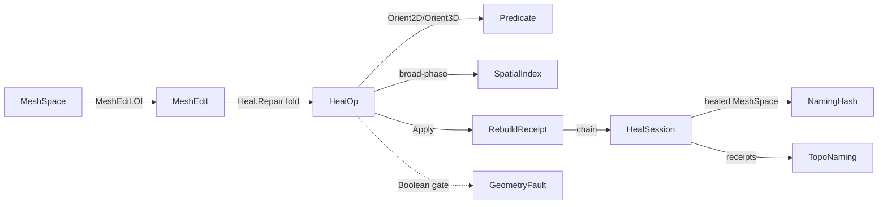

# [RASM_HEALING_REPAIR]

The geometry repair rail that takes a defective `MeshSpace` and folds a closed `HealOp` family — degenerate-removal, gap/crack closing, duplicate-vertex weld, manifold repair, self-intersection resolution, normal-orientation fix — into a healed mesh plus a typed `RebuildReceipt` chain. The page owns the `HealKind` `[SmartEnum<string>]` discriminant, the `HealOp` `[Union]` whose every case carries a first-principles repair kernel composing the `Numerics/predicates#ROBUST_PREDICATES` `Orient2D`/`Orient3D`/`InCircle` exact-sign predicates so the weld/orientation/self-intersection logic never flips on a near-degenerate edge, the `RepairPolicy` tolerance/aggression row, and the `Heal.Repair` session fold over one `HealOp` order. The mesh-boolean/CSG row composes the managed `Meshing/arrangement#ARRANGEMENT` exact-arithmetic companion for the common cases (the seam ALIGNED to the arrangement owner through `Arrangement.Apply`, no native asset, no epsilon snap), reserving the tier-3 native deploy-asset gate only for the future performance/scale path the managed exact arrangement does not cover.

The page composes `Vectors` `MeshSpace`, the native `Mesh` topology surface, and `TopologyReceipt` (`IsManifold`/`Genus`/`NonManifoldEdges`/`EulerCharacteristic`) as settled vocabulary — read, compose, never re-mint — operates on raw `double` ONLY inside the weld/snap inner loop (the sanctioned interior-double scope alongside `Expansion`/`ErrorBound`), routes every failure through the band-2400 `GeometryFault` union, and computes no hash and mints no second identity. The healed `MeshSpace` and the `RebuildReceipt` chain cross only the in-process seam to the `Spatial/reconciliation#NAMING_HASH` `Encode` fence and to the naming `Track` fold; `HealKind`, `HealOp`, and `RebuildReceipt` are interior types that never sit between wire and rail.

## [01]-[INDEX]

- [01]-[HEALING]: `HealKind` discriminant; `HealOp` `[Union]` (6 author-kernel repair cases + 1 managed-arrangement-companion boolean case, native-gated only at scale); `RepairPolicy`; `Heal.Repair` session fold composing the predicate floor.

## [02]-[HEALING]

- Owner: `HealKind` `[SmartEnum<string>]` the repair-modality discriminant binding the shipped `ComparerAccessors.StringOrdinal` as its string-key comparer (`degenerate`/`gap`/`weld`/`manifold`/`self-intersect`/`orient`/`boolean`) carrying the per-kind `RebuildsTopology` and `Tier` columns; `HealOp` `[Union]` the closed repair algebra — six author-kernel cases each owning a real repair body plus the one `Boolean` case composing the managed `Meshing/arrangement#ARRANGEMENT` companion (native-gated only at scale); `RepairPolicy` the tolerance/aggression row (weld-cluster tolerance, gap-bridge max span, sliver area floor, max manifold-repair passes, self-intersect broad-phase AABB inflation) the kernels read; `MeshEdit` the working-set arena every kernel transforms and the receipt records (vertex positions, face indices, the dirty/affected-index set) — owned by `Meshing/edit.md`, composed here, never re-minted; `Heal` the static session surface whose `Repair` fold runs an ordered `HealOp` sequence over a `MeshEdit` derived from a `MeshSpace`, threading the `RebuildReceipt` chain and routing `GeometryFault` on an unrepairable defect.
- Cases: `HealKind` rows `degenerate` · `gap` · `weld` · `manifold` · `self-intersect` · `orient` · `boolean` (7); `HealOp` cases `DegenerateCollapse` · `GapClose` · `DuplicateWeld` · `ManifoldRepair` · `SelfIntersectResolve` · `OrientNormals` (6 author-kernel) plus `Boolean` (1 managed-arrangement-companion, native-gated only at scale) (7); `RebuildReceipt` cases one per `HealOp` (7, owned in `receipts.md`).
- Entry: `public static Fin<HealSession> Repair(MeshSpace input, Seq<HealOp> ops, RepairPolicy policy)` — the ONE heal entrypoint, `Fin<T>` routing a band-2400 `GeometryFault.UnrepairableMesh` when a repair kernel cannot satisfy its post-condition (a non-manifold edge survives the max-pass budget, a self-intersection cannot be resolved without deleting capability, the boolean is invoked at a scale beyond the managed arrangement without its native asset gated in); the fold runs each `HealOp` in `ops` order over the working `MeshEdit`, accumulating a `RebuildReceipt` per op into the `HealSession` and re-emitting the healed `MeshSpace` at the seam. `public static Seq<HealOp> Standard(RepairPolicy policy)` is the canonical repair order (`DuplicateWeld` → `DegenerateCollapse` → `GapClose` → `ManifoldRepair` → `OrientNormals` → `SelfIntersectResolve` — manifold repair precedes orientation so the BFS orients a 2-manifold dual graph, not a fan of contradictory flip constraints) so a "heal everything" call is one `Repair(input, Standard(policy), policy)` and never a sibling per-defect entrypoint.
- Auto: `Repair` folds the `HealOp` sequence over a `MeshEdit` snapshot read once from `MeshSpace.DuplicateNative()`; each op's `Apply` transforms the `MeshEdit` and the session binds the before/after `ManifoldStatus` (the `(Euler, Genus, BoundaryComponents)` triple the public `VectorIntent.Topology(...).Project` seam yields) on the `Fin` rail — never a swallowed default — so the receipt records the real topological delta plus the affected vertex/face index set; the predicate floor does the exact work: `DuplicateWeld` clusters vertices within the weld tolerance then snaps each cluster to its centroid, `DegenerateCollapse` reads `Predicate.Orient2D` over each face's DOMINANT-axis projected triangle (the axis of the largest normal component dropped, never a fixed XY drop) to flag exact-collinear slivers and drops them, the float area floor gating only a face the exact sign already KEEPS; `GapClose` matches naked boundary edges by endpoint proximity and stitches a bridging triangle pair; `ManifoldRepair` splits non-manifold edges (>2 incident faces) into per-fan edge copies; `SelfIntersectResolve` runs a `SpatialIndex`-broad-phased triangle-pair test where the SYMMETRIC exact `Predicate.Orient3D` straddle plus exact in-triangle containment decides a true crossing, then APPENDS the exact crossing point and retriangulates the offending face into its sub-faces (a split, never a discard); `OrientNormals` propagates a consistent winding across the dual face-adjacency graph by a BFS that flips a neighbor whose shared-edge traversal direction agrees (a coherent manifold has opposite traversal on a shared edge) — run AFTER `ManifoldRepair` in the `Standard` order so the dual graph is 2-manifold before orientation. The `Boolean` case now re-routes through the managed `Meshing/arrangement#ARRANGEMENT` companion — `BooleanArrangement` composes `Arrangement.Apply(ArrangementKind.MeshBoolean, ...)` for the common managed cases (the exact-arithmetic mesh-arrangement classification the arrangement owner authors) and re-emits through `Arrangement.ToMesh`; the `GeometryFault.NativeAssetMissing` rail propagates from `Arrangement.Apply` ONLY at the scale threshold past the managed-arrangement ceiling (the arrangement owner gates the reserved tier-3 native path), so the healing kernel adds no second scale gate.
- Receipt: `Repair` returns a `HealSession` whose `Receipts` is the typed `RebuildReceipt` chain (one per applied op) — this IS the rebuild evidence the naming `Track` consumes; no generic `IReceipt`/ledger, each case is typed to its heal kind (`receipts.md`).
- Packages: `Rasm`/Vectors (`MeshSpace`, native `Mesh` topology — composed), `Rasm.Geometry.Numerics` (`Predicate`/`Sign` — the exact-sign floor, composed), `Rasm.Geometry.Spatial` (`SpatialIndex` — self-intersection broad-phase, composed), `Rasm.Geometry.Arrangement` (`Arrangement.Apply` `MeshBoolean` — the managed boolean companion, composed never re-minted), Thinktecture.Runtime.Extensions, LanguageExt.Core, BCL inbox.
- Growth: a new repair modality is one `HealKind` row plus one `HealOp` case carrying its kernel plus one typed `RebuildReceipt` case — never a sibling `Welder`/`GapCloser`/`Orienter` class family with parallel entrypoints; a new tolerance knob is one column on `RepairPolicy`; the boolean row gains its managed body by composing the `Meshing/arrangement#ARRANGEMENT` companion for the common cases (the seam ALIGNED to the arrangement owner through `Arrangement.Apply`, never a second CSG kernel here), the tier-3 native asset reserved only for the scale path beyond the managed arrangement (a charter amendment, never silently from this leaf) — zero new surface.
- Boundary: `HealOp` is the ONE polymorphic repair algebra and a `DegenerateRemover`/`GapStitcher`/`VertexWelder`/`ManifoldFixer`/`SelfIntersectionResolver`/`NormalOrienter` sibling-class family each with its own `Run` surface is the named density defect collapsed here onto one union folded by one `Repair` entrypoint; the kernels compose the `Predicate` exact-sign floor and a hand-rolled epsilon-tolerant cross-product sign inside a kernel (instead of `Predicate.Orient2D`/`Orient3D`) is the named correctness defect — a sliver flagged by a loosened float test the exact predicate leaves unflagged is exactly the under-/over-collapse the robust floor exists to prevent; the weld/snap inner loop and the gap-span/sliver-area scalar comparisons operate on raw `double` because a coordinate is the domain's native scalar (the healing weld inner loop is the named interior-double owner alongside `Expansion`/`ErrorBound`), and a `double` crossing a public heal signature outside a coordinate or a tolerance is the seam violation; `Heal.Repair` is total over the `Fin` rail and a thrown `InvalidOperationException` on an unrepairable mesh is forbidden — the defect routes `GeometryFault.UnrepairableMesh(...).ToError()` over the band-2400 union; the healed mesh emits the canonical hash-friendly records the `Spatial/reconciliation#NAMING_HASH` `Encode` content-addresses and the heal NEVER mints a second hash; the `Boolean` case composes the managed `Meshing/arrangement#ARRANGEMENT` exact-arithmetic companion through `Arrangement.Apply` and NOT a second CSG kernel here — the exactness of the arrangement (Cherchi-Attene indirect predicates, no epsilon snap) resolves the over-eager-managed-CSG concern by correctness, so the boolean row is bodied for the common cases and the native gate is reserved only for scale beyond the managed arrangement; the heal preserves capability — a `DegenerateCollapse` removes a zero-area face but never deletes a load-bearing feature, and a `SelfIntersectResolve` splits rather than discards, so no heal op reduces the mesh below its valid genus.

```csharp
// --- [RUNTIME_PRELUDE] --------------------------------------------------------------------
using System;
using System.Collections.Generic;
using System.Linq;
using LanguageExt;
using LanguageExt.Common;
using Rasm.Geometry;
using Rasm.Geometry.Arrangement;
using Rasm.Geometry.Meshing;
using Rasm.Geometry.Numerics;
using Rasm.Geometry.Spatial;
using Rasm.Vectors;
using Rhino.Geometry;
using Thinktecture;
using static LanguageExt.Prelude;

namespace Rasm.Geometry.Healing;

// --- [TYPES] ------------------------------------------------------------------------------
[SmartEnum<string>]
[KeyMemberEqualityComparer<ComparerAccessors.StringOrdinal, string>]
[KeyMemberComparer<ComparerAccessors.StringOrdinal, string>]
public sealed partial class HealKind {
    public static readonly HealKind Degenerate    = new("degenerate", rebuildsTopology: true, tier: 1);
    public static readonly HealKind Gap           = new("gap", rebuildsTopology: true, tier: 1);
    public static readonly HealKind Weld          = new("weld", rebuildsTopology: true, tier: 1);
    public static readonly HealKind Manifold      = new("manifold", rebuildsTopology: true, tier: 1);
    public static readonly HealKind SelfIntersect = new("self-intersect", rebuildsTopology: true, tier: 1);
    public static readonly HealKind Orient        = new("orient", rebuildsTopology: false, tier: 1);
    public static readonly HealKind Boolean       = new("boolean", rebuildsTopology: true, tier: 3);

    public bool RebuildsTopology { get; }
    public int Tier { get; }
}

[SmartEnum<int>]
public sealed partial class BooleanOp {
    public static readonly BooleanOp Union        = new(0);
    public static readonly BooleanOp Difference   = new(1);
    public static readonly BooleanOp Intersection = new(2);
}

// --- [CONSTANTS] --------------------------------------------------------------------------
public sealed record RepairPolicy(
    double WeldTolerance,
    double GapMaxSpan,
    double SliverAreaFloor,
    int MaxManifoldPasses,
    double IntersectTolerance) {
    public static readonly RepairPolicy Canonical =
        new(WeldTolerance: 1e-6, GapMaxSpan: 1e-2, SliverAreaFloor: 1e-12, MaxManifoldPasses: 8, IntersectTolerance: 1e-9);
}

// --- [OPERATIONS] -------------------------------------------------------------------------
[Union(ConversionFromValue = ConversionOperatorsGeneration.None)]
public abstract partial record HealOp {
    private HealOp() { }

    public sealed record DegenerateCollapse(RepairPolicy Policy) : HealOp;
    public sealed record GapClose(RepairPolicy Policy) : HealOp;
    public sealed record DuplicateWeld(RepairPolicy Policy) : HealOp;
    public sealed record ManifoldRepair(RepairPolicy Policy) : HealOp;
    public sealed record SelfIntersectResolve(RepairPolicy Policy) : HealOp;
    public sealed record OrientNormals : HealOp;
    public sealed record Boolean(BooleanOp Op, MeshEdit Tool, RepairPolicy Policy) : HealOp;

    public HealKind Kind =>
        Switch(
            degenerateCollapse:   static _ => HealKind.Degenerate,
            gapClose:             static _ => HealKind.Gap,
            duplicateWeld:        static _ => HealKind.Weld,
            manifoldRepair:       static _ => HealKind.Manifold,
            selfIntersectResolve: static _ => HealKind.SelfIntersect,
            orientNormals:        static _ => HealKind.Orient,
            boolean:              static _ => HealKind.Boolean);

    public Fin<MeshEdit> Apply(MeshEdit edit, Context tolerance) =>
        Switch(
            degenerateCollapse:   d => Kernels.CollapseDegenerate(edit, d.Policy),
            gapClose:             g => Kernels.CloseGaps(edit, g.Policy),
            duplicateWeld:        w => Kernels.WeldDuplicates(edit, w.Policy),
            manifoldRepair:       m => Kernels.RepairManifold(edit, m.Policy),
            selfIntersectResolve: s => Kernels.ResolveSelfIntersections(edit, s.Policy),
            orientNormals:        _ => Kernels.OrientConsistent(edit),
            boolean:              b => Kernels.BooleanArrangement(edit, b, tolerance));
}

internal static class Kernels {
    // --- [DUPLICATE_WELD]
    public static Fin<MeshEdit> WeldDuplicates(MeshEdit edit, RepairPolicy policy) {
        double tol = policy.WeldTolerance;
        var parent = Enumerable.Range(0, edit.Vertices.Count).ToArray();
        int Find(int x) { while (parent[x] != x) { parent[x] = parent[parent[x]]; x = parent[x]; } return x; }
        void Union(int a, int b) { int ra = Find(a), rb = Find(b); if (ra != rb) parent[Math.Max(ra, rb)] = Math.Min(ra, rb); }
        var grid = new Dictionary<(long, long, long), List<int>>();
        (long, long, long) Cell(Point3d p) => ((long)Math.Floor(p.X / tol), (long)Math.Floor(p.Y / tol), (long)Math.Floor(p.Z / tol));
        for (int v = 0; v < edit.Vertices.Count; v++) {
            (long cx, long cy, long cz) cell = Cell(edit.Vertices[v]);
            for (long dx = -1; dx <= 1; dx++) for (long dy = -1; dy <= 1; dy++) for (long dz = -1; dz <= 1; dz++)
                if (grid.TryGetValue((cell.cx + dx, cell.cy + dy, cell.cz + dz), out List<int>? bucket))
                    foreach (int u in bucket) if (edit.Vertices[v].DistanceTo(edit.Vertices[u]) <= tol) Union(v, u);
            (grid.TryGetValue(cell, out List<int>? own) ? own : grid[cell] = []).Add(v);
        }
        var classes = Enumerable.Range(0, edit.Vertices.Count).GroupBy(Find);
        var centroid = new Dictionary<int, Point3d>();
        var remap = new int[edit.Vertices.Count];
        var welded = new List<Point3d>();
        var touchedVerts = new HashSet<int>();
        foreach (var cls in classes) {
            int root = cls.Key, idx = welded.Count;
            Point3d c = cls.Aggregate(Point3d.Origin, (acc, m) => acc + edit.Vertices[m]) / cls.Count();
            welded.Add(c);
            foreach (int m in cls) { remap[m] = idx; if (m != root) touchedVerts.Add(m); }
        }
        var faces = edit.Faces.Map(f => (remap[f.A], remap[f.B], remap[f.C]))
            .Filter(static f => f.Item1 != f.Item2 && f.Item2 != f.Item3 && f.Item1 != f.Item3);
        return Fin.Succ(new MeshEdit(toArr(welded), faces, edit.AffectedFaces, edit.AffectedVertices).Touch(Enumerable.Range(0, faces.Count), touchedVerts));
    }

    // --- [DEGENERATE_COLLAPSE]
    public static Fin<MeshEdit> CollapseDegenerate(MeshEdit edit, RepairPolicy policy) {
        bool Degenerate((int A, int B, int C) f) {
            (Point3d pa, Point3d pb, Point3d pc) = (edit.Vertices[f.A], edit.Vertices[f.B], edit.Vertices[f.C]);
            int axis = DominantAxis(Vector3d.CrossProduct(pb - pa, pc - pa));
            return Predicate.Orient2D(Project(pa, axis), Project(pb, axis), Project(pc, axis)) switch {
                Sign.Zero => true,
                _ => 0.5 * Vector3d.CrossProduct(pb - pa, pc - pa).Length < policy.SliverAreaFloor,
            };
        }
        Arr<(int A, int B, int C)> kept = edit.Faces.Filter(f => !Degenerate(f));
        Set<int> dropped = toSet(Enumerable.Range(0, edit.Faces.Count).Where(f => Degenerate(edit.Faces[f])));
        return Fin.Succ(edit with { Faces = kept, AffectedFaces = edit.AffectedFaces.TryAddRange(dropped) });
    }

    // --- [GAP_CLOSE]
    public static Fin<MeshEdit> CloseGaps(MeshEdit edit, RepairPolicy policy) {
        var (half, boundary) = Boundaries(edit);
        var bridged = new List<(int A, int B, int C)>(edit.Faces.ToArray());
        var used = new HashSet<int>();
        var touched = new HashSet<int>();
        for (int i = 0; i < boundary.Count; i++) {
            if (used.Contains(i)) continue;
            var (p0, p1) = (edit.Vertices[boundary[i].U], edit.Vertices[boundary[i].V]);
            for (int j = i + 1; j < boundary.Count; j++) {
                if (used.Contains(j)) continue;
                var (q0, q1) = (edit.Vertices[boundary[j].U], edit.Vertices[boundary[j].V]);
                if (p0.DistanceTo(q1) <= policy.GapMaxSpan && p1.DistanceTo(q0) <= policy.GapMaxSpan) {
                    bridged.Add((boundary[i].U, boundary[i].V, boundary[j].U));
                    bridged.Add((boundary[i].V, boundary[j].V, boundary[j].U));
                    used.Add(i); used.Add(j);
                    touched.Add(boundary[i].U); touched.Add(boundary[i].V); touched.Add(boundary[j].U); touched.Add(boundary[j].V);
                    break;
                }
            }
        }
        return Fin.Succ((edit with { Faces = toArr(bridged) }).Touch(Enumerable.Range(edit.Faces.Count, bridged.Count - edit.Faces.Count), touched));
    }

    // --- [MANIFOLD_REPAIR]
    public static Fin<MeshEdit> RepairManifold(MeshEdit edit, RepairPolicy policy) {
        MeshEdit work = edit;
        for (int pass = 0; pass < policy.MaxManifoldPasses; pass++) {
            var incidence = EdgeIncidence(work);
            var nonManifold = incidence.Where(static kv => kv.Value.Count > 2).ToArray();
            if (nonManifold.Length == 0) return Fin.Succ(work);
            var vertices = new List<Point3d>(work.Vertices.ToArray());
            var faces = work.Faces.ToArray();
            var touched = new HashSet<int>();
            foreach (var (edge, fans) in nonManifold)
                foreach (int extra in fans.Skip(2)) {
                    int dupU = vertices.Count; vertices.Add(work.Vertices[edge.U]);
                    int dupV = vertices.Count; vertices.Add(work.Vertices[edge.V]);
                    faces[extra] = Replace(faces[extra], edge.U, dupU, edge.V, dupV);
                    touched.Add(extra);
                }
            work = (work with { Vertices = toArr(vertices), Faces = toArr(faces) }).Touch(touched, Enumerable.Range(work.Vertices.Count, vertices.Count - work.Vertices.Count));
        }
        return EdgeIncidence(work).Any(static kv => kv.Value.Count > 2)
            ? Fin.Fail<MeshEdit>(GeometryFault.UnrepairableMesh($"manifold:residual-nonmanifold-edge:passes={policy.MaxManifoldPasses}").ToError())
            : Fin.Succ(work);
    }

    // --- [SELF_INTERSECT_RESOLVE]
    public static Fin<MeshEdit> ResolveSelfIntersections(MeshEdit edit, RepairPolicy policy) {
        BoundingBox[] boxes = edit.Faces.Map(f => Box(edit, f)).ToArray();
        return SpatialIndex.Build(SpatialKind.Bvh, boxes, BuildPolicy.Canonical).Bind(index => {
            List<Point3d> vertices = [.. edit.Vertices];
            Dictionary<int, (int A, int B, int C)> patched = new(edit.Faces.Count);
            List<(int A, int B, int C)> spawned = [];
            HashSet<int> touched = [];
            for (int f = 0; f < edit.Faces.Count; f++) {
                QueryResult hits = index.Query(new SpatialQuery.Range(boxes[f], None));
                foreach (int g in ((QueryResult.Hits)hits).Ids.Filter(g => g > f && !patched.ContainsKey(g))) {
                    Option<Point3d> crossing = TriangleCrossPoint(edit, edit.Faces[f], edit.Faces[g]);
                    crossing.IfSome(point => {
                        int p = vertices.Count; vertices.Add(point);
                        (int A, int B, int C) gf = edit.Faces[g];
                        patched[g] = (gf.A, gf.B, p);
                        spawned.Add((gf.B, gf.C, p));
                        spawned.Add((gf.C, gf.A, p));
                        touched.Add(f); touched.Add(g);
                    });
                }
            }
            Arr<(int A, int B, int C)> faces = toArr(Enumerable.Range(0, edit.Faces.Count)
                .Select(i => patched.TryGetValue(i, out (int A, int B, int C) head) ? head : edit.Faces[i])
                .Concat(spawned));
            Set<int> spawnedIds = toSet(Enumerable.Range(edit.Faces.Count, spawned.Count));
            return Fin.Succ((edit with { Vertices = toArr(vertices), Faces = faces })
                .Touch(touched.Concat(spawnedIds), Enumerable.Range(edit.Vertices.Count, vertices.Count - edit.Vertices.Count)));
        });
    }

    // --- [ORIENT_NORMALS]
    public static Fin<MeshEdit> OrientConsistent(MeshEdit edit) {
        var adjacency = FaceAdjacency(edit);
        var faces = edit.Faces.ToArray();
        var visited = new bool[faces.Length];
        var flipped = new HashSet<int>();
        var queue = new Queue<int>();
        for (int seed = 0; seed < faces.Length; seed++) {
            if (visited[seed]) continue;
            visited[seed] = true; queue.Enqueue(seed);
            while (queue.Count > 0) {
                int cur = queue.Dequeue();
                foreach (var (neighbour, edge) in adjacency[cur]) {
                    if (visited[neighbour]) continue;
                    visited[neighbour] = true;
                    if (SameTraversal(faces[cur], faces[neighbour], edge)) { faces[neighbour] = Flip(faces[neighbour]); flipped.Add(neighbour); }
                    queue.Enqueue(neighbour);
                }
            }
        }
        return Fin.Succ((edit with { Faces = toArr(faces) }).Touch(flipped, Enumerable.Empty<int>()));
    }

    // --- [BOOLEAN]
    public static Fin<MeshEdit> BooleanArrangement(MeshEdit edit, HealOp.Boolean op, Context tolerance) =>
        edit.ToSpace(tolerance).Bind(a => op.Tool.ToSpace(tolerance).Bind(b =>
            Arrangement.Apply(ArrangementKind.MeshBoolean, a, b, op.Op, ArrangementPolicy.Canonical)
                .Bind(arrangement => arrangement.ToMesh(tolerance))
                .Map(static merged => MeshEdit.Of(merged))));

    // --- [PRIMITIVES]
    static Point3d Project(Point3d p, int axis) => axis switch {
        0 => new(p.Y, p.Z, 0.0),
        1 => new(p.X, p.Z, 0.0),
        _ => new(p.X, p.Y, 0.0),
    };

    static int DominantAxis(Vector3d n) =>
        Math.Abs(n.X) >= Math.Abs(n.Y) && Math.Abs(n.X) >= Math.Abs(n.Z) ? 0
        : Math.Abs(n.Y) >= Math.Abs(n.Z) ? 1
        : 2;

    public static int QuadDiagonal(Point3d a, Point3d b, Point3d c, Point3d d) =>
        Predicate.Orient3D(a, b, c, d) == Predicate.Orient3D(b, c, d, a) ? 0 : 1;

    static (Dictionary<(int U, int V), List<int>> Half, List<(int U, int V)> Boundary) Boundaries(MeshEdit edit) {
        var incidence = EdgeIncidence(edit);
        var boundary = incidence.Where(static kv => kv.Value.Count == 1).Select(static kv => kv.Key).ToList();
        return (incidence.ToDictionary(static kv => kv.Key, static kv => kv.Value), boundary);
    }

    static Dictionary<(int U, int V), List<int>> EdgeIncidence(MeshEdit edit) {
        var incidence = new Dictionary<(int U, int V), List<int>>();
        for (int f = 0; f < edit.Faces.Count; f++) {
            var (a, b, c) = edit.Faces[f];
            foreach (var (u, v) in new[] { (a, b), (b, c), (c, a) }) {
                var key = u < v ? (u, v) : (v, u);
                (incidence.TryGetValue(key, out var list) ? list : incidence[key] = new List<int>()).Add(f);
            }
        }
        return incidence;
    }

    static Dictionary<int, List<(int Neighbour, (int U, int V) Edge)>> FaceAdjacency(MeshEdit edit) {
        var incidence = EdgeIncidence(edit);
        var adjacency = Enumerable.Range(0, edit.Faces.Count).ToDictionary(static f => f, static _ => new List<(int, (int, int))>());
        foreach (var (edge, faces) in incidence)
            for (int i = 0; i < faces.Count; i++)
                for (int j = i + 1; j < faces.Count; j++) { adjacency[faces[i]].Add((faces[j], edge)); adjacency[faces[j]].Add((faces[i], edge)); }
        return adjacency;
    }

    static bool SameTraversal((int A, int B, int C) lhs, (int A, int B, int C) rhs, (int U, int V) edge) =>
        Directed(lhs).Contains((edge.U, edge.V)) == Directed(rhs).Contains((edge.U, edge.V));

    static (int, int)[] Directed((int A, int B, int C) f) => [(f.A, f.B), (f.B, f.C), (f.C, f.A)];

    static (int A, int B, int C) Flip((int A, int B, int C) f) => (f.A, f.C, f.B);

    static (int A, int B, int C) Replace((int A, int B, int C) f, int u, int dupU, int v, int dupV) =>
        (f.A == u ? dupU : f.A == v ? dupV : f.A, f.B == u ? dupU : f.B == v ? dupV : f.B, f.C == u ? dupU : f.C == v ? dupV : f.C);

    static Option<Point3d> TriangleCrossPoint(MeshEdit edit, (int A, int B, int C) f, (int A, int B, int C) g) =>
        EdgesCrossTriangle(edit, f, g).Match(Some: Some, None: () => EdgesCrossTriangle(edit, g, f));

    static Option<Point3d> EdgesCrossTriangle(MeshEdit edit, (int A, int B, int C) edges, (int A, int B, int C) tri) {
        (Point3d ta, Point3d tb, Point3d tc) = (edit.Vertices[tri.A], edit.Vertices[tri.B], edit.Vertices[tri.C]);
        int axis = DominantAxis(Vector3d.CrossProduct(tb - ta, tc - ta));
        return Directed(edges)
            .Select(e => (U: edit.Vertices[e.Item1], V: edit.Vertices[e.Item2]))
            .Map(e => (e.U, e.V, SU: Predicate.Orient3D(ta, tb, tc, e.U), SV: Predicate.Orient3D(ta, tb, tc, e.V)))
            .Where(static e => e.SU != e.SV && e.SU != Sign.Zero && e.SV != Sign.Zero)
            .Select(e => PlaneCrossPoint(e.U, e.V, ta, tb, tc))
            .Where(point => InTriangle(Project(point, axis), Project(ta, axis), Project(tb, axis), Project(tc, axis)))
            .HeadOrNone();
    }

    static Point3d PlaneCrossPoint(Point3d u, Point3d v, Point3d a, Point3d b, Point3d c) {
        Vector3d n = Vector3d.CrossProduct(b - a, c - a);
        double t = (n * (a - u)) / (n * (v - u));
        return u + (t * (v - u));
    }

    static bool InTriangle(Point3d q, Point3d a, Point3d b, Point3d c) {
        Sign s0 = Predicate.Orient2D(a, b, q), s1 = Predicate.Orient2D(b, c, q), s2 = Predicate.Orient2D(c, a, q);
        bool nonNeg = s0 != Sign.Negative && s1 != Sign.Negative && s2 != Sign.Negative;
        bool nonPos = s0 != Sign.Positive && s1 != Sign.Positive && s2 != Sign.Positive;
        return nonNeg || nonPos;
    }

    static BoundingBox Box(MeshEdit edit, (int A, int B, int C) f) =>
        new(new[] { edit.Vertices[f.A], edit.Vertices[f.B], edit.Vertices[f.C] });
}

public static class Heal {
    public static Fin<HealSession> Repair(MeshSpace input, Seq<HealOp> ops, RepairPolicy policy) =>
        ops.Fold(Fin.Succ((Edit: MeshEdit.Of(input), Receipts: Seq<RebuildReceipt>(), Tolerance: input.Tolerance)),
            (acc, op) => acc.Bind(state =>
                from before in Topology(state.Edit, state.Tolerance)
                from next in op.Apply(state.Edit, state.Tolerance)
                from after in Topology(next, state.Tolerance)
                select (Edit: next, Receipts: state.Receipts.Add(RebuildReceipt.Of(op, before, after, next)), state.Tolerance)))
            .Bind(state => state.Edit.ToSpace(state.Tolerance).Map(healed => new HealSession(Input: input, Healed: healed, Receipts: state.Receipts)));

    public static Seq<HealOp> Standard(RepairPolicy policy) =>
        Seq<HealOp>(
            new HealOp.DuplicateWeld(policy),
            new HealOp.DegenerateCollapse(policy),
            new HealOp.GapClose(policy),
            new HealOp.ManifoldRepair(policy),
            new HealOp.OrientNormals(),
            new HealOp.SelfIntersectResolve(policy));

    static Fin<ManifoldStatus> Topology(MeshEdit edit, Context tolerance) =>
        from space in edit.ToSpace(tolerance)
        from intent in VectorIntent.Topology(space)
        from projection in intent.Project<(int Euler, int Genus, int BoundaryComponents)>(tolerance)
        select ManifoldStatus.Of(projection);
}
```



## [03]-[DENSITY_BAR]

One owner per axis; capability is a case, row, or column, never a sibling surface. The `[RAIL]` cell names the one return rail each owner exposes — `Fin`/`GeometryFault` where a kernel can fail its post-condition, pure carriers for the receipts.

| [INDEX] | [AXIS/CONCERN]  | [OWNER]         | [KIND]                                                                                                                                       | [RAIL]                              | [CASES] |
| :-----: | :-------------- | :-------------- | :------------------------------------------------------------------------------------------------------------------------------------------- | :---------------------------------- | :-----: |
|  [04]   | Healing rail    | `Heal`/`HealOp` | static surface + `HealKind` `[SmartEnum<string>]` + `HealOp` `[Union]` (6 author-kernel + 1 native-gate) + `RepairPolicy` + `Kernels` bodies | `Heal.Repair → Fin<HealSession>`    |    7    |
|  [4a]   | Repair modality | `HealKind`      | `[SmartEnum<string>]` degenerate/gap/weld/manifold/self-intersect/orient/boolean + `RebuildsTopology`/`Tier` columns                         | discriminant (pure)                 |    7    |
|  [4b]   | Working set     | `MeshEdit`      | composed from `Meshing/edit.md` (vertices/faces/affected sets) + `Of`/`ToSpace`/`Touch`                                                      | `MeshEdit.ToSpace → Fin<MeshSpace>` |    —    |

The six author-kernel repair ops (`DuplicateWeld`, `DegenerateCollapse`, `GapClose`, `ManifoldRepair`, `SelfIntersectResolve`, `OrientNormals`) are pure-managed first-principles kernels composing the `Predicate` exact-sign floor, the `SpatialIndex` broad-phase, and the `Vectors` `TopologyReceipt`, none depending on a live-host member spelling beyond the stable native `Mesh`/`MeshFace` surface the topology sibling already pins. The `Boolean` row composes the managed `Meshing/arrangement#ARRANGEMENT` companion through `Arrangement.Apply` for the common managed cases (the seam ALIGNED to the arrangement owner) and propagates `NativeAssetMissing` only when the arrangement owner's own scale gate routes the reserved tier-3 native path — the tier-3 native deploy-asset gate is reserved for that scale path alone, never the only boolean body.

## [04]-[RESEARCH]

- [WELD_INJECTIVITY] — the `WeldDuplicates` union-find over a tolerance grid collapses each within-tolerance vertex class to its centroid and re-indexes faces, dropping faces a weld degenerates (two indices coincide). The kernel is pure-managed and transcription-complete; the residual the law-matrix asserts (a tier-2 CsCheck property suite under `testing-cs`) is that the weld is idempotent (`Repair(Repair(m)) == Repair(m)` at the same tolerance) and order-stable (a class always collapses to its centroid regardless of grid-bucket enumeration order, guaranteed by the `Math.Min(ra, rb)` union-by-smallest-index rule). No live-host probe — `Point3d.DistanceTo` and the grid are stable BCL/Vectors vocabulary.
- [EXACT_REPAIR_DECISIONS] — the `DegenerateCollapse` collinearity test and the `SelfIntersectResolve` crossing test compose the `Predicate.Orient2D`/`Orient3D` EXACT sign. A sliver is flagged iff its vertices are exactly collinear in the face's DOMINANT projection plane (`DominantAxis` drops the axis of the largest normal component per face, so an axis-aligned-vertical face never degenerates to an XY line and over-collapses — the prior fixed XY drop deleted every such valid face) returning `Sign.Zero`; the float area floor is a SECONDARY gate that fires only behind an exact-keep, never an independent `||`, so it never deletes a face the exact predicate keeps. A triangle pair crosses iff the SYMMETRIC test holds — an edge of one triangle straddles the other's plane with differing non-zero exact `Orient3D` signs AND the plane-crossing point lies inside the opposite triangle (three same-sign exact `Orient2D` containment tests in the dominant plane), tested in both directions; a true crossing APPENDS the exact crossing point and retriangulates the offending face into three sub-faces (a capability-preserving split, never a discard). The robust floor is the whole correctness claim: a float epsilon test over-collapses a thin-but-valid face or false-positives every coplanar-adjacent infinite-plane straddle, exactly the defect the exact predicate prevents. The law-matrix asserts the exact-sign agreement against a `BigInteger` rational oracle (the same predicate-laws harness `Numerics/predicates#NUMERIC_DETERMINISM` owns), no host probe.
- [BOOLEAN_NATIVE_ASSET] (managed companion landed; native gate reserved for scale): the `HealOp.Boolean` row's managed body is the `Meshing/arrangement#ARRANGEMENT` companion — `BooleanArrangement` composes `Arrangement.Apply` with the `MeshBoolean` op, which subdivides each operand surface face IN ITS OWN supporting plane on the triangle-triangle intersection segments it carries (the constructed crossings riding the `Lpi`/`Tpi` implicit-point exact-sign path), classifies each resulting surface patch inside/outside the OTHER operand by the `Spatial/index#GENERALIZED_WINDING` GWN scalar, keeps the patches the `BooleanOp` regularized membership rule selects (`Union`: each operand's patches outside the other; `Difference` A−B: A-patches outside B plus B-patches inside A; `Intersection`: each operand's patches inside the other), and welds the kept-patch boundary through `WeldDuplicates` so the result is a clean manifold. This satisfies the exact-arithmetic mesh-arrangement contract with NO native asset and NO epsilon snap (the Cherchi-Attene indirect-predicate technique the landed LPI/TPI family makes managed), so the over-eager-managed-CSG concern is resolved by exactness, not avoided by gating. The tier-3 native deploy-asset gate is now reserved ONLY for the future performance/scale path beyond the managed exact arrangement: the arrangement owner's `Apply` routes `GeometryFault.NativeAssetMissing` at the scale threshold past its managed ceiling and the `BooleanReceipt` records `AssetGated: false`, the healing kernel propagating that rail without a second gate. UPSTREAM-BLOCKED on that scale path alone — a robust exact-arithmetic mesh-arrangement native asset admission remains a charter amendment with its RID burden assessed, gated in only when its output passes the repair kernels' post-conditions (manifold, no self-intersection) against a golden boolean fixture, never on self-declaration; the common-case correctness is already owned by the managed companion.

## [05]-[CROSS_PAGE_SEAMS]

Two seams reach sibling owners this page composes but does not write — noted for ALIGN, never edited here.

- `Spatial/naming#TOPO_NAMING` `Track` re-anchor input: `HealSession.ToLog` (owned in `receipts.md`) produces a `RebuildLog` (per-`EntityKind` affected-ref set + applied-op trail) intended as the re-anchor seed the naming `Track` reads when a `RebuildsTopology` heal changes adjacency. The topology sibling's `Track(NameTable prior, CanonicalTopology rebuilt, Generation next)` currently re-anchors purely from the rebuilt `CanonicalTopology` signature — it does NOT yet consume a `RebuildLog` hint. The seam alignment: either the heal's `RebuildLog` is advisory (the naming `Track` re-derives the affected set from the signature delta and the `RebuildLog` is a cross-check) or `Track` gains a `RebuildLog` parameter to seed the affected-entity set directly (a `Spatial/naming.md` edit OUTSIDE this page's write-scope). The page emits the `RebuildLog` as the honest heal evidence; whether `Track` consumes it as a hint or re-derives is the cross-page arbitration.
- `Rasm.Vectors` `TopologyReceipt` projection seam: the ONLY public route from a `MeshSpace` to topological status is `VectorIntent.Topology(space).Project<(int Euler, int Genus, int BoundaryComponents)>(tolerance)` — `MeshKernel.TopologyDetailed` is `internal` to `Rasm.Vectors` and `TopologyReceipt.Project<TopologyReceipt>` has no identity `ProjectionRow` (only the Euler/Genus/Boundary tuple). `ManifoldStatus` therefore carries that triple, NOT `IsManifold`/`NonManifoldEdges`; if a future heal verdict requires the manifold flag or non-manifold edge count, the seam owner must add a public `TopologyReceipt` projection row (a `Rasm.Vectors` edit OUTSIDE this page's write-scope), never a domain-local manifold recomputation.
