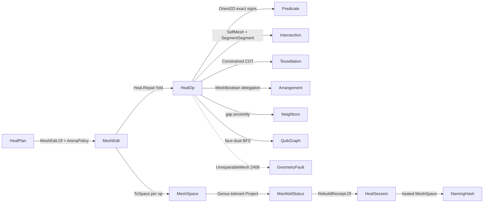

# [RASM_HEALING_REPAIR]

The predicate-gated heal fold: `Heal.Repair(HealPlan, Op? key = null)` takes a defective `MeshSpace`, opens ONE `MeshEdit` arena, folds a closed `HealOp` order over it — duplicate weld, degenerate collapse, gap close, manifold split, normal orientation, self-intersection re-mesh, boolean merge — and publishes a healed `MeshSpace` plus the typed `RebuildReceipt` chain. The page owns `HealStage` (the ONE heal-modality `[SmartEnum<string>]` — the vocabulary the `GeometryFault.UnrepairableMesh(HealStage, int, int)` 2408 payload names, the receipts discriminate on, and the `Standard` order ranks), the `HealOp` `[Union]` whose six author-kernel cases are stateless rows over the plan policy and whose `Boolean` case delegates the managed exact `Meshing/arrangement#ARRANGEMENT` companion, the validated `RepairPolicy` row composing the sibling policy owners (`ArenaPolicy` · `IntersectPolicy` · `TessellationPolicy` · `ArrangementPolicy`), and the `HealPlan` request carrier the one entrypoint discriminates on.

The rail is TOTAL over its own input class: the topology snapshot rides the Genus-tolerant `mesh.md` `TopologyReceipt` projection `(Euler, BoundaryComponents, IsManifold, IsOriented, NonManifoldEdges, Option<int> Genus)` — un-gated, so a non-manifold, boundaried, or odd-Euler mesh (exactly the input the heal exists for) projects instead of failing, and `NonManifoldEdges` is the actionable defect count the manifold kernel targets. Topology threads forward through the fold (`before[n] = after[n-1]`; the last per-op freeze IS the published healed mesh — no recompute, no terminal re-freeze). Every kernel operates ON the arena (`SetFace`/`AddFace`/`KillFace`/`AddVertex` mutation, dirty bitsets, `ToSpace` freeze); the crossing, broad-phase, CDT, and boolean work all route the sibling owners (`Intersection.Apply`, `Tessellation.Build`, `Arrangement.Apply`, the `neighbors.md` proximity lane) — this page re-implements none of them. Failures route the band-2400 `GeometryFault` union; the healed `MeshSpace` and receipt chain cross only the in-process seam to the `Spatial/reconciliation#NAMING_HASH` `Encode` fence and the naming `Track` fold; no hash is minted here.

## [01]-[INDEX]

- [01]-[HEALING]: `HealStage` discriminant (rank + topology columns); `RepairPolicy` validated policy row composing four sibling policies; `HealPlan` request carrier; `HealOp` `[Union]` (6 stateless author-kernel cases + 1 payload-bearing arrangement delegation); `HealStep` interior step carrier; the `Incidence` fold three kernels share; `Heal.Repair` session fold with forward topology threading.

## [02]-[HEALING]

- Owner: `HealStage` `[SmartEnum<string>]` the ONE heal-modality vocabulary (`weld`/`degenerate`/`gap`/`manifold`/`orient`/`self-intersect`/`boolean`, declaration order = `Standard` rank order) binding `ComparerAccessors.StringOrdinal`, carrying `RebuildsTopology` (drives the receipts `RebuildLog` contribution — orientation leaves adjacency unchanged) and `Rank` (the canonical repair order as data; `boolean` ranks last and outside `Standard`) — the fault payload type `faults.md` names at 2408 and the vocabulary `receipts.md` discriminates on, ONE type, never a parallel `HealKind` sibling; `RepairPolicy` the validated policy row — `PositiveMagnitude GapMaxSpan`, `double SliverAreaFloor` (nonnegative; zero disables the secondary gate), `Dimension MaxManifoldPasses`, plus the composed sibling policies `ArenaPolicy Arena` (carries THE weld band — dedup-on-arena is an arena op, no weld knob here), `IntersectPolicy Intersect`, `TessellationPolicy Remesh` (the constrained-only CDT mode rides this value), `ArrangementPolicy Arrangement` — admitted once through `Of`, never re-checked in kernels; `HealPlan` the request carrier (`Input` + `Ops` + `Policy`) the one entrypoint discriminates on, admitted through `Of` (empty op sequence refused; omitted ops default to `Heal.Standard`, omitted policy to `RepairPolicy.Canonical`); `HealOp` `[Union]` the closed repair algebra — six stateless author-kernel cases reading the plan policy plus `Boolean(BooleanOp Op, MeshSpace Tool)` carrying its already-admitted tool operand; `HealStep` the interior step carrier (`Edit` + `Option<BooleanReceipt> Merge`) the receipts mint reads; `MeshEdit` the working arena (`Meshing/edit.md`, composed never re-minted); `Heal` the static session surface — public `Repair` + `Standard`, internal kernels.
- Cases: `HealStage` rows 7; `HealOp` cases `DuplicateWeld` · `DegenerateCollapse` · `GapClose` · `ManifoldRepair` · `OrientNormals` · `SelfIntersectResolve` (6 stateless) + `Boolean` (1 payload) — declaration order = `Standard` order; `RebuildReceipt` mirrors one typed case per op (`receipts.md`).
- Entry: `public static Fin<HealSession> Repair(HealPlan plan, Op? key = null)` — the ONE heal entrypoint: opens one arena from `plan.Input` under `plan.Policy.Arena`, projects the input `ManifoldStatus` once, folds `plan.Ops` in order — each op applies its kernel, the capsule swaps the live arena when an op returns a fresh one (the boolean), freezes through `ToSpace(context, key)`, projects `after`, and mints `RebuildReceipt.Of(op, policy, before, after, edit, merge)` with `before[n] = after[n-1]` — and emits `HealSession(Input, Healed, Receipts)` where `Healed` IS the last freeze. `public static readonly Seq<HealOp> Standard` — weld → degenerate → gap → manifold → orient → self-intersect (manifold precedes orientation so the face-dual BFS orients a 2-manifold graph; self-intersect runs last so its detection snapshot is the otherwise-healed mesh); the `HealStage.Rank` column asserts this order as data. A "heal everything" call is `HealPlan.Of(input).Bind(plan => Heal.Repair(plan))` — never a sibling per-defect entrypoint.
- Auto: `DuplicateWeld` delegates `Kernels.WeldDuplicates` (`edit.md` — union-find over the tolerance grid at `ArenaPolicy.WeldTolerance`, in-place SoA compaction, idempotent); `DegenerateCollapse` kills index-degenerate triples, then flags a sliver by the exact `Predicate.Orient2D` sign in the face's DOMINANT-axis projection plane (the `Axis` row whose largest normal component is dropped — never a fixed XY drop) with the float area floor a SECONDARY gate firing only behind an exact-keep; `GapClose` derives ORIENTED boundary half-edges from face winding off the shared `Incidence` fold, batch-queries head-against-tail proximity through the `neighbors.md` lane (`NeighborIndex.Of(StaticCase)` + the radius `GraphOf` spine — the O(B²) endpoint double loop is dead), pairs greedily by ascending gap under mutual span agreement, and bridges each pair with a winding-coherent triangle strip; `ManifoldRepair` splits every >2-incident edge into per-fan vertex copies inside a `Range(0, passes).Fold` budget, routing `UnrepairableMesh(HealStage.Manifold, passes, remaining)` on residual; `OrientNormals` folds the face-dual once into a QuikGraph `AdjacencyGraph<int, TaggedEdge<int,(int U,int V)>>` (both arcs per interior 2-manifold edge), labels shells by `WeaklyConnectedComponents`, and runs one `BreadthFirstSearchAlgorithm` per shell whose `TreeEdge` hook flips a child whose shared-edge traversal agrees with its settled parent (the hand-rolled visited-array BFS is the deleted form the QuikGraph catalog names); `SelfIntersectResolve` is a REAL CDT re-mesh — `Intersection.Apply(IntersectOp.SelfMesh(current, policy.Intersect), key)` yields the `IntersectResult.Crossings` rows, segment crossings with their defining face pairs (any other verdict routes `Fin` through `key.InvalidResult()` — the hard cast is dead), BOTH faces of every crossing re-mesh, multi-crossings per face accumulate into ONE per-face constraint set, per-face segments pre-split at their mutual exact crossings (`IntersectOp.SegmentSegment` — a triple intersection becomes one shared minted vertex, so patches meet T-junction-free), the patch builds through `Tessellation.Build` in the face's dominant-axis plane under the constrained-only `Remesh` policy, sub-triangles splice back through one cross-patch minted-vertex memo (the crossing seam is topologically welded by construction) with a mirror-corrected winding when the dominant normal component is negative; `Boolean` freezes nothing extra — it hands the threaded `current` snapshot and its `Tool` to `Arrangement.Apply(ArrangementOp.MeshBoolean(...), key)`, re-admits the merged mesh into a fresh arena, and carries the arrangement's own `BooleanReceipt` forward on the step.
- Receipt: `Repair` returns `HealSession` whose `Receipts` chain is the typed per-op evidence (`receipts.md` mints via `RebuildReceipt.Of`; the boolean case carries arrangement's `BooleanReceipt` as payload) — no generic ledger; the arena's dirty bitsets are the affected-entity seed the mint reads, monotone across the session so a receipt's seed never misses an entity.
- Packages: `Rasm`/Vectors (`MeshSpace`, `VectorIntent.Topology` — the Genus-tolerant projection seam), `Rasm.Geometry.Meshing` (`MeshEdit`/`ArenaPolicy`/`Kernels.WeldDuplicates` — the arena tier), `Rasm.Geometry.Numerics` (`Predicate`/`Sign`/`Axis` — the exact-sign floor), `Rasm.Geometry.Intersection` (`Intersection.Apply` — self-crossings + segment pre-split), `Rasm.Geometry.Arrangement` (`Tessellation.Build` CDT + `Arrangement.Apply` boolean + `BooleanOp`/`BooleanReceipt`), `Rasm.Geometry.Spatial` (`NeighborIndex`/`NeighborKernel` — the gap proximity lane), QuikGraph (`AdjacencyGraph`/`TaggedEdge`/`WeaklyConnectedComponents`/`BreadthFirstSearchAlgorithm` — the orientation walk), Thinktecture.Runtime.Extensions, LanguageExt.Core, BCL inbox.
- Growth: a new repair modality is one `HealStage` row (rank slots it into `Standard`) + one `HealOp` case + one typed `RebuildReceipt` case — never a sibling `Welder`/`GapCloser`/`Orienter` class family; a new tolerance is one `RepairPolicy` column admitted at `Of`; a new spatial or exact primitive need routes the owning sibling (a consumer-contract row on its page), never a local kernel copy.
- Boundary: `HealOp` is the ONE polymorphic repair algebra folded by ONE `Repair` entrypoint — a per-defect sibling entrypoint family is the named density defect; `HealStage` is the ONE modality vocabulary — a parallel `HealKind` beside the fault payload type is the named shape-budget defect this rebuild collapsed; the kernels compose the `Predicate` exact-sign floor and a hand-rolled epsilon cross-product sign is the named correctness defect; crossing existence, broad-phase, CDT mechanics, and boolean classification are `Intersection`/`Tessellation`/`Arrangement` property — the local crossing kernels (`TriangleCrossPoint`/`EdgesCrossTriangle`/`PlaneCrossPoint`/`InTriangle`) and the local `SpatialIndex` broad-phase are dead into those owners, and point proximity routes the `neighbors.md` lane (a repair-local kd or grid re-derivation is the tri-plication that page kills); the weld band lives on `ArenaPolicy` and a healing-policy weld knob is the dead reach-through the arena siting removed; the host repair capture (`FillHoles`/`HealNakedEdges`/`UnifyNormals`/`Weld`) stays uncomposed — the ONLY host-native member on this rail is the `RebuildNormals` inside the arena freeze (`api-rhino` boundary law), every repair body author-kernel; arena statement bodies inside the kernels are the `edit.md` arena-tier exemption and never leak past the freeze; `Heal.Repair` is total over the `Fin` rail — a thrown exception on an unrepairable mesh is forbidden, the defect routes `GeometryFault.UnrepairableMesh(HealStage, iterations, remaining).ToError()` and every composed sibling fault (`ConstraintUnrecoverable`, `NativeAssetMissing` 2423 from the arrangement's own scale gate) propagates unwrapped — the healing kernel adds no second gate; the heal preserves capability — a `DegenerateCollapse` removes an exactly-degenerate or sub-floor face but never a load-bearing feature, a `SelfIntersectResolve` splits and re-tessellates rather than discards, and the boolean's regularized keep-rule is the arrangement's law, not re-derived here.

```csharp
// --- [RUNTIME_PRELUDE] ----------------------------------------------------------------------
using System;
using System.Collections.Generic;
using System.Linq;
using System.Runtime.InteropServices;
using LanguageExt;
using QuikGraph;
using QuikGraph.Algorithms;
using QuikGraph.Algorithms.Search;
using Rasm.Domain;
using Rasm.Geometry;
using Rasm.Geometry.Arrangement;
using Rasm.Geometry.Intersection;
using Rasm.Geometry.Meshing;
using Rasm.Geometry.Numerics;
using Rasm.Geometry.Spatial;
using Rasm.Vectors;
using Rhino.Geometry;
using Thinktecture;
using static LanguageExt.Prelude;

namespace Rasm.Geometry.Healing;

// --- [TYPES] ----------------------------------------------------------------------------------
// THE heal-modality vocabulary: fault payload (UnrepairableMesh 2408), receipt discriminant, and
// Standard order (Rank) in one owner. Declaration order = rank order; boolean sits outside Standard.
[SmartEnum<string>]
[KeyMemberEqualityComparer<ComparerAccessors.StringOrdinal, string>]
[KeyMemberComparer<ComparerAccessors.StringOrdinal, string>]
public sealed partial class HealStage {
    public static readonly HealStage Weld          = new("weld", rebuildsTopology: true, rank: 0);
    public static readonly HealStage Degenerate    = new("degenerate", rebuildsTopology: true, rank: 1);
    public static readonly HealStage Gap           = new("gap", rebuildsTopology: true, rank: 2);
    public static readonly HealStage Manifold      = new("manifold", rebuildsTopology: true, rank: 3);
    public static readonly HealStage Orient        = new("orient", rebuildsTopology: false, rank: 4);
    public static readonly HealStage SelfIntersect = new("self-intersect", rebuildsTopology: true, rank: 5);
    public static readonly HealStage Boolean       = new("boolean", rebuildsTopology: true, rank: 6);

    public bool RebuildsTopology { get; }
    public int Rank { get; }
}

// --- [MODELS] ---------------------------------------------------------------------------------
// Validated policy row: raw scalars admit once at Of; composed sibling policies arrive already
// admitted by their own owners. The weld band is Arena.WeldTolerance — no weld knob here.
[BoundaryAdapter, StructLayout(LayoutKind.Auto)]
public readonly record struct RepairPolicy(
    PositiveMagnitude GapMaxSpan, double SliverAreaFloor, Dimension MaxManifoldPasses,
    ArenaPolicy Arena, IntersectPolicy Intersect, TessellationPolicy Remesh, ArrangementPolicy Arrangement) {
    public static readonly RepairPolicy Canonical = new(
        GapMaxSpan: PositiveMagnitude.Create(value: 1e-2), SliverAreaFloor: 1e-12,
        MaxManifoldPasses: Dimension.Create(value: 8),
        Arena: ArenaPolicy.Canonical, Intersect: IntersectPolicy.Canonical,
        Remesh: TessellationPolicy.Canonical, Arrangement: ArrangementPolicy.Canonical);

    public static Fin<RepairPolicy> Of(
        double gapMaxSpan, double sliverAreaFloor, int maxManifoldPasses,
        ArenaPolicy? arena = null, IntersectPolicy? intersect = null,
        TessellationPolicy? remesh = null, ArrangementPolicy? arrangement = null, Op? key = null) {
        Op op = key.OrDefault();
        return from span in op.AcceptValidated<PositiveMagnitude>(candidate: gapMaxSpan)
               from floor in guard(ValidityClaim.Finite(value: sliverAreaFloor) && ValidityClaim.Nonnegative(value: sliverAreaFloor), op.InvalidInput()).ToFin().Map(_ => sliverAreaFloor)
               from passes in op.AcceptValidated<Dimension>(candidate: maxManifoldPasses)
               select new RepairPolicy(span, floor, passes,
                   arena ?? ArenaPolicy.Canonical, intersect ?? IntersectPolicy.Canonical,
                   remesh ?? TessellationPolicy.Canonical, arrangement ?? ArrangementPolicy.Canonical);
    }
}

// The one request carrier Repair discriminates on: omitted ops = the Standard order, omitted policy = Canonical.
public sealed record HealPlan(MeshSpace Input, Seq<HealOp> Ops, RepairPolicy Policy) {
    public static Fin<HealPlan> Of(MeshSpace input, Seq<HealOp>? ops = null, RepairPolicy? policy = null, Op? key = null) {
        Op op = key.OrDefault();
        Seq<HealOp> sequence = ops ?? Heal.Standard;
        return from space in op.AcceptInput(input)
               from _ in guard(!sequence.IsEmpty, op.InvalidInput()).ToFin()
               select new HealPlan(space, sequence, policy ?? RepairPolicy.Canonical);
    }
}

// Interior step carrier: the (possibly swapped) arena plus the arrangement receipt the boolean carries forward.
public readonly record struct HealStep(MeshEdit Edit, Option<BooleanReceipt> Merge) {
    public static HealStep Same(MeshEdit edit) => new(edit, None);
}

// --- [OPERATIONS] -----------------------------------------------------------------------------
[Union(ConversionFromValue = ConversionOperatorsGeneration.None)]
public abstract partial record HealOp {
    private HealOp() { }

    public sealed record DuplicateWeld : HealOp;
    public sealed record DegenerateCollapse : HealOp;
    public sealed record GapClose : HealOp;
    public sealed record ManifoldRepair : HealOp;
    public sealed record OrientNormals : HealOp;
    public sealed record SelfIntersectResolve : HealOp;
    public sealed record Boolean(BooleanOp Op, MeshSpace Tool) : HealOp;

    public HealStage Stage =>
        Switch(
            duplicateWeld:        static _ => HealStage.Weld,
            degenerateCollapse:   static _ => HealStage.Degenerate,
            gapClose:             static _ => HealStage.Gap,
            manifoldRepair:       static _ => HealStage.Manifold,
            orientNormals:        static _ => HealStage.Orient,
            selfIntersectResolve: static _ => HealStage.SelfIntersect,
            boolean:              static _ => HealStage.Boolean);

    // `current` is the frozen image of `edit` at fold entry (before[n] = after[n-1] threading):
    // the self-intersect detection snapshot and the boolean's A operand ride it with zero extra freezes.
    internal Fin<HealStep> Apply(MeshEdit edit, MeshSpace current, RepairPolicy policy, Context context, Op key) =>
        Switch(
            state: (Edit: edit, Current: current, Policy: policy, Context: context, Key: key),
            duplicateWeld:        static (s, _) => Fin.Succ(HealStep.Same(Kernels.WeldDuplicates(s.Edit))),
            degenerateCollapse:   static (s, _) => Heal.Collapse(s.Edit, s.Policy),
            gapClose:             static (s, _) => Heal.Close(s.Edit, s.Policy, s.Key),
            manifoldRepair:       static (s, _) => Heal.Split(s.Edit, s.Policy),
            orientNormals:        static (s, _) => Heal.Orient(s.Edit),
            selfIntersectResolve: static (s, _) => Heal.Resolve(s.Edit, s.Current, s.Policy, s.Key),
            boolean:              static (s, b) => Heal.Merge(b, s.Current, s.Policy, s.Context, s.Key));
}

// One incidence fold shared by gap/manifold/orient: undirected edge -> incident faces; boundary
// half-edges, non-manifold rows, and the face-dual graph project off it. Kernel-local scratch
// under the arena-tier statement exemption.
internal readonly struct Incidence {
    internal readonly Dictionary<(int U, int V), List<int>> Edges;
    Incidence(Dictionary<(int U, int V), List<int>> edges) => Edges = edges;

    internal static Incidence Of(MeshEdit edit) {
        var edges = new Dictionary<(int U, int V), List<int>>(3 * edit.FaceCount);
        for (int f = 0; f < edit.FaceCount; f++) {
            if (!edit.Alive(f)) continue;
            (int a, int b, int c) = edit.Face(f);
            Note(edges, a, b, f); Note(edges, b, c, f); Note(edges, c, a, f);
        }
        return new Incidence(edges);

        static void Note(Dictionary<(int U, int V), List<int>> edges, int u, int v, int f) =>
            (edges.TryGetValue(Key(u, v), out List<int>? faces) ? faces : edges[Key(u, v)] = []).Add(f);
    }

    internal static (int U, int V) Key(int u, int v) => u < v ? (u, v) : (v, u);

    // Oriented boundary half-edges: a 1-incident edge, direction recovered from its face's winding —
    // never an index-sorted undirected key.
    internal Arr<(int Tail, int Head, int Face)> Boundary(MeshEdit edit) =>
        toArr(Edges.Where(static row => row.Value.Count == 1).Select(row => {
            (int a, int b, int c) = edit.Face(row.Value[0]);
            (int u, int v) = row.Key;
            (int tail, int head) = (a == u && b == v) || (b == u && c == v) || (c == u && a == v) ? (u, v) : (v, u);
            return (tail, head, row.Value[0]);
        }));

    internal Arr<((int U, int V) Edge, List<int> Fans)> NonManifold() =>
        toArr(Edges.Where(static row => row.Value.Count > 2).Select(static row => (row.Key, row.Value)));

    // Face-dual: both arcs per interior 2-manifold edge, tagged with the undirected vertex pair.
    // >2-incident fans propagate no orientation (Manifold precedes Orient in the Standard order).
    internal AdjacencyGraph<int, TaggedEdge<int, (int U, int V)>> Dual(MeshEdit edit) {
        var dual = new AdjacencyGraph<int, TaggedEdge<int, (int U, int V)>>(allowParallelEdges: true);
        dual.AddVertexRange(Enumerable.Range(0, edit.FaceCount).Where(edit.Alive));
        foreach (((int U, int V) edge, List<int> faces) in Edges.Where(static row => row.Value.Count == 2)) {
            dual.AddEdge(new TaggedEdge<int, (int U, int V)>(faces[0], faces[1], edge));
            dual.AddEdge(new TaggedEdge<int, (int U, int V)>(faces[1], faces[0], edge));
        }
        return dual;
    }
}

public static class Heal {
    // Canonical order (rank order on HealStage): manifold precedes orient so the dual BFS orients a
    // 2-manifold graph; self-intersect runs last against the otherwise-healed snapshot.
    public static readonly Seq<HealOp> Standard = Seq<HealOp>(
        new HealOp.DuplicateWeld(), new HealOp.DegenerateCollapse(), new HealOp.GapClose(),
        new HealOp.ManifoldRepair(), new HealOp.OrientNormals(), new HealOp.SelfIntersectResolve());

    // The ONE heal entrypoint. The capsule owns the single live arena (swap + dispose is the named
    // platform-forced lifetime seam); the fold threads Space/Status forward so before[n] = after[n-1]
    // and the last per-op freeze IS the published healed mesh.
    public static Fin<HealSession> Repair(HealPlan plan, Op? key = null) {
        Op op = key.OrDefault();
        Context context = plan.Input.Tolerance;
        MeshEdit live = MeshEdit.Of(plan.Input, plan.Policy.Arena);
        try {
            return Status(plan.Input, context, op).Bind(first =>
                plan.Ops.Fold(
                    Fin.Succ((Space: plan.Input, Status: first, Receipts: Seq<RebuildReceipt>())),
                    (acc, heal) => acc.Bind(state =>
                        from step in heal.Apply(live, state.Space, plan.Policy, context, op)
                        from space in Publish(step)
                        from after in Status(space, context, op)
                        select (Space: space, Status: after,
                                Receipts: state.Receipts.Add(RebuildReceipt.Of(heal, plan.Policy, state.Status, after, live, step.Merge)))))
                .Map(state => new HealSession(Input: plan.Input, Healed: state.Space, Receipts: state.Receipts)));
        }
        finally { live.Dispose(); }

        Fin<MeshSpace> Publish(HealStep step) {
            if (!ReferenceEquals(step.Edit, live)) { live.Dispose(); live = step.Edit; }
            return live.ToSpace(context, op);
        }
    }

    // The Genus-tolerant TOTAL projection: un-gated over non-manifold/boundaried/odd-Euler inputs —
    // the heal rail never rejects its own input class.
    internal static Fin<ManifoldStatus> Status(MeshSpace space, Context context, Op key) =>
        VectorIntent.Topology(space, key)
            .Bind(intent => intent.Project<(int Euler, int BoundaryComponents, bool IsManifold, bool IsOriented, int NonManifoldEdges, Option<int> Genus)>(context: context, key: key))
            .Map(ManifoldStatus.Of);

    // --- [DEGENERATE_COLLAPSE]
    // Index-degenerate triples die outright; a sliver is flagged by the EXACT Orient2D sign in the
    // face's dominant-axis plane, the float area floor a secondary gate behind an exact-keep only.
    internal static Fin<HealStep> Collapse(MeshEdit edit, RepairPolicy policy) {
        for (int f = 0; f < edit.FaceCount; f++) {
            if (!edit.Alive(f)) continue;
            (int a, int b, int c) = edit.Face(f);
            if (a == b || b == c || c == a) { edit.KillFace(f); continue; }
            (Point3d pa, Point3d pb, Point3d pc) = (edit.Position(a), edit.Position(b), edit.Position(c));
            Sign sign = Predicate.Orient2D(pa, pb, pc, Dominant(pa, pb, pc));
            if (sign == Sign.Zero || 0.5 * Vector3d.CrossProduct(pb - pa, pc - pa).Length < policy.SliverAreaFloor) edit.KillFace(f);
        }
        return Fin.Succ(HealStep.Same(edit));
    }

    // --- [GAP_CLOSE]
    // Oriented pairing: half-edge (a->b) pairs (c->d) when |b-c| and |d-a| both sit inside the span —
    // opposite traversal, so the bridge strip is winding-coherent. Candidates ride the neighbors.md
    // radius lane (heads as needles over a tail index); greedy accept by ascending gap, one use each.
    internal static Fin<HealStep> Close(MeshEdit edit, RepairPolicy policy, Op key) {
        Arr<(int Tail, int Head, int Face)> rim = Incidence.Of(edit).Boundary(edit);
        if (rim.Count < 2) return Fin.Succ(HealStep.Same(edit));
        double span = policy.GapMaxSpan.Value;
        Point3d[] heads = [.. rim.Map(h => edit.Position(h.Head))];
        return NeighborIndex.Of(new NeighborSource.StaticCase(toSeq(rim.Map(h => edit.Position(h.Tail)))), key)
            .Bind(index => NeighborKernel.GraphOf(index: index, needles: heads, count: Option<int>.None, radius: Some(span), key: key))
            .Map(graph => Bridge(edit, rim, graph.Ids, span));
    }

    static HealStep Bridge(MeshEdit edit, Arr<(int Tail, int Head, int Face)> rim, int[][] candidates, double span) {
        var pairs = new List<(int I, int J, double Gap)>();
        for (int i = 0; i < rim.Count; i++) {
            foreach (int j in candidates[i]) {
                if (j == i) continue;
                double forward = edit.Position(rim[i].Head).DistanceTo(edit.Position(rim[j].Tail));
                double backward = edit.Position(rim[j].Head).DistanceTo(edit.Position(rim[i].Tail));
                if (backward <= span) pairs.Add((i, j, double.Max(forward, backward)));
            }
        }
        pairs.Sort(static (l, r) => l.Gap.CompareTo(r.Gap));
        var used = new HashSet<int>();
        foreach ((int i, int j, _) in pairs) {
            if (used.Contains(i) || used.Contains(j)) continue;
            ((int a, int b), (int c, int d)) = ((rim[i].Tail, rim[i].Head), (rim[j].Tail, rim[j].Head));
            edit.AddFace(b, a, d);   // b->a opposes the naked a->b; shared {b,d} opposes across the strip
            edit.AddFace(b, d, c);   // d->c opposes the naked c->d
            used.Add(i); used.Add(j);
        }
        return HealStep.Same(edit);
    }

    // --- [MANIFOLD_REPAIR]
    // Each pass splits every >2-incident edge into per-fan vertex copies; the bounded fixpoint rides
    // Range().Fold (a converged pass re-emits zero). Residual routes the 2408 typed fault.
    internal static Fin<HealStep> Split(MeshEdit edit, RepairPolicy policy) {
        int passes = policy.MaxManifoldPasses.Value;
        int found = Range(0, passes).Fold(int.MaxValue, (left, _) => left == 0 ? 0 : SplitPass(edit));
        int remaining = found == 0 ? 0 : Incidence.Of(edit).NonManifold().Count;
        return remaining == 0
            ? Fin.Succ(HealStep.Same(edit))
            : Fin.Fail<HealStep>(new GeometryFault.UnrepairableMesh(HealStage.Manifold, passes, remaining).ToError());

        static int SplitPass(MeshEdit edit) {
            Arr<((int U, int V) Edge, List<int> Fans)> rows = Incidence.Of(edit).NonManifold();
            foreach (((int u, int v), List<int> fans) in rows) {
                foreach (int extra in fans.Skip(2)) {
                    int du = edit.AddVertex(edit.Position(u));
                    int dv = edit.AddVertex(edit.Position(v));
                    (int a, int b, int c) = edit.Face(extra);
                    edit.SetFace(extra, Re(a, u, du, v, dv), Re(b, u, du, v, dv), Re(c, u, du, v, dv));
                }
            }
            return rows.Count;

            static int Re(int corner, int u, int du, int v, int dv) => corner == u ? du : corner == v ? dv : corner;
        }
    }

    // --- [ORIENT_NORMALS]
    // QuikGraph owns the walk; the flip decision stays the domain fold. One dual build, shells by
    // WeaklyConnectedComponents, one BFS per shell; TreeEdge flips a child whose shared-edge traversal
    // agrees with its settled parent (read live off the arena — parents settle in BFS tree order).
    internal static Fin<HealStep> Orient(MeshEdit edit) {
        AdjacencyGraph<int, TaggedEdge<int, (int U, int V)>> dual = Incidence.Of(edit).Dual(edit);
        var shell = new Dictionary<int, int>(edit.FaceCount);
        dual.WeaklyConnectedComponents(shell);
        var seeds = new Dictionary<int, int>();
        foreach ((int face, int component) in shell) seeds.TryAdd(component, face);
        foreach (int seed in seeds.Values) {
            var walk = new BreadthFirstSearchAlgorithm<int, TaggedEdge<int, (int U, int V)>>(dual);
            walk.TreeEdge += arc => {
                if (SameTraversal(edit.Face(arc.Source), edit.Face(arc.Target), arc.Tag)) {
                    (int a, int b, int c) = edit.Face(arc.Target);
                    edit.SetFace(arc.Target, a, c, b);
                }
            };
            walk.Compute(seed);
        }
        return Fin.Succ(HealStep.Same(edit));

        static bool SameTraversal((int A, int B, int C) f, (int A, int B, int C) g, (int U, int V) edge) =>
            Directed(f, edge) == Directed(g, edge);

        static bool Directed((int A, int B, int C) t, (int U, int V) e) =>
            (t.A == e.U && t.B == e.V) || (t.B == e.U && t.C == e.V) || (t.C == e.U && t.A == e.V);
    }

    // --- [SELF_INTERSECT_RESOLVE]
    // One SelfMesh pass through the exact lattice (broad-phase and Guigue-Devillers signs are the
    // intersection owner's); every crossing re-meshes BOTH defining faces; a non-Crossings verdict
    // routes Fin — the typed extraction replaced the hard cast.
    internal static Fin<HealStep> Resolve(MeshEdit edit, MeshSpace current, RepairPolicy policy, Op key) =>
        Intersection.Apply(new IntersectOp.SelfMesh(current, policy.Intersect), key)
            .Bind(result => result is IntersectResult.Crossings hit
                ? Fin.Succ(hit.Rows)
                : Fin.Fail<Seq<(Line Segment, int FaceA, int FaceB)>>(key.InvalidResult()))
            .Bind(crossings => crossings.IsEmpty ? Fin.Succ(HealStep.Same(edit)) : Retile(edit, crossings, policy, key));

    static Fin<HealStep> Retile(MeshEdit edit, Seq<(Line Segment, int FaceA, int FaceB)> crossings, RepairPolicy policy, Op key) {
        var patches = new Dictionary<int, List<Line>>();
        foreach ((Line segment, int fa, int fb) in crossings) { Note(patches, fa, segment); Note(patches, fb, segment); }
        // One minted-vertex memo across every patch: a crossing endpoint (or a triple point) resolves
        // to ONE arena vertex from every face that sees it — the seam is topologically welded. Seeding
        // it with every patched face's corners resolves a corner-touching crossing to the corner id.
        var minted = new Dictionary<Point3d, int>();
        foreach (int face in patches.Keys.OrderBy(static id => id)) {
            (int a, int b, int c) = edit.Face(face);
            minted.TryAdd(edit.Position(a), a); minted.TryAdd(edit.Position(b), b); minted.TryAdd(edit.Position(c), c);
        }
        return toSeq(patches.OrderBy(static patch => patch.Key)).Strict()
            .TraverseM(patch => Subdivide(edit, patch.Key, patch.Value, minted, policy, key))
            .As()
            .Map(_ => HealStep.Same(edit));

        static void Note(Dictionary<int, List<Line>> patches, int face, Line segment) =>
            (patches.TryGetValue(face, out List<Line>? rows) ? rows : patches[face] = []).Add(segment);
    }

    // Per-face constrained re-mesh: pre-split mutually-crossing segments at their EXACT crossings
    // (bit-identical inputs across patches -> bit-identical points -> the memo unifies them), split
    // boundary edges at on-edge sites, build the CDT in the dominant-axis plane (constrained-only
    // Remesh policy — every site is explicit, no restoration), splice sub-triangles with a
    // mirror-corrected winding when the dominant normal component is negative.
    static Fin<Unit> Subdivide(MeshEdit edit, int face, List<Line> segments, Dictionary<Point3d, int> minted, RepairPolicy policy, Op key) {
        (int a, int b, int c) = edit.Face(face);
        (Point3d pa, Point3d pb, Point3d pc) = (edit.Position(a), edit.Position(b), edit.Position(c));
        Axis axis = Dominant(pa, pb, pc);
        Vector3d normal = Vector3d.CrossProduct(pb - pa, pc - pa);
        bool mirrored = (axis == Axis.X ? normal.X : axis == Axis.Y ? normal.Y : normal.Z) < 0.0;
        return Crossed(segments, policy, key).Bind(rows => {
            List<Point3d> sites = [pa, pb, pc];
            var slot = new Dictionary<Point3d, int> { [pa] = 0, [pb] = 1, [pc] = 2 };
            Seq<Constraint> interior = toSeq(rows.Select(row => (Constraint)new Constraint.Segment(Site(row.From), Site(row.To)))).Strict();
            Seq<Constraint> boundary = Rim(sites, axis);   // sites is complete once interior is strict
            Point3d[] planar = [.. sites.Select(p => new Point3d(Axis.Coord(p, axis.U), Axis.Coord(p, axis.V), 0.0))];
            return Tessellation.Build(new TessellationOp.Constrained(planar, boundary + interior, policy.Remesh), key)
                .Bind(tess => tess.Project<Arr<(int A, int B, int C)>>(key))
                .Bind(triples => triples.ForAll(t => t.A < sites.Count && t.B < sites.Count && t.C < sites.Count)
                    ? Fin.Succ(Splice(edit, face, (a, b, c), sites, triples, minted, mirrored))
                    : Fin.Fail<Unit>(key.InvalidResult()));   // pre-split makes Steiner sites unreachable; refuse, never mis-lift

            int Site(Point3d p) {
                if (slot.TryGetValue(p, out int at)) return at;
                slot[p] = sites.Count; sites.Add(p); return sites.Count - 1;
            }
        });
    }

    // Pairwise exact pre-split: each mutual crossing splits both segments at the SAME constructed
    // point (bit-identical Apply inputs across patches — the minted memo unifies the seam).
    static Fin<Seq<Line>> Crossed(List<Line> segments, RepairPolicy policy, Op key) {
        var splits = new List<Point3d>[segments.Count];
        for (int i = 0; i < segments.Count; i++) splits[i] = [];
        Seq<(int I, int J)> pairs = toSeq(
            from i in Enumerable.Range(0, segments.Count)
            from j in Enumerable.Range(i + 1, segments.Count - i - 1)
            select (I: i, J: j)).Strict();
        return pairs
            .TraverseM(pair => Intersection.Apply(new IntersectOp.SegmentSegment(segments[pair.I], segments[pair.J], policy.Intersect), key)
                .Bind(result =>
                    result is IntersectResult.Points hit ? Fin.Succ(Mark(pair, hit.Hits))
                    : result is IntersectResult.Segments overlap ? Fin.Succ(Mark(pair, overlap.Crossings.Bind(static piece => Seq(piece.From, piece.To))))
                    : Fin.Fail<Unit>(key.InvalidResult())))
            .As()
            .Map(_ => toSeq(segments.Select((segment, i) => Chained(segment, splits[i])).SelectMany(static rows => rows)).Strict());

        Unit Mark((int I, int J) pair, Seq<Point3d> hits) {
            foreach (Point3d hit in hits) { splits[pair.I].Add(hit); splits[pair.J].Add(hit); }
            return unit;
        }

        static IEnumerable<Line> Chained(Line segment, List<Point3d> splits) {
            if (splits.Count == 0) { yield return segment; yield break; }
            Vector3d direction = segment.To - segment.From;
            List<Point3d> ordered = [segment.From, .. splits.Distinct().OrderBy(p => (p - segment.From) * direction), segment.To];
            for (int k = 0; k + 1 < ordered.Count; k++) {
                if (ordered[k] != ordered[k + 1]) yield return new Line(ordered[k], ordered[k + 1]);
            }
        }
    }

    // Boundary constraints split at any site lying exactly ON a face edge (a crossing exiting through
    // the edge) — the neighbor face carries the continuing segment and the same minted endpoint, so
    // both sides subdivide consistently.
    static Seq<Constraint> Rim(List<Point3d> sites, Axis axis) {
        return toSeq(new[] { (0, 1), (1, 2), (2, 0) }.SelectMany(edge => Edge(edge.Item1, edge.Item2))).Strict();

        IEnumerable<Constraint> Edge(int from, int to) {
            (Point3d p, Point3d q) = (sites[from], sites[to]);
            List<int> line = [from];
            line.AddRange(Enumerable.Range(3, sites.Count - 3)
                .Where(i => Predicate.Orient2D(p, q, sites[i], axis) == Sign.Zero && Between(p, q, sites[i], axis))
                .OrderBy(i => (sites[i] - p) * (q - p)));
            line.Add(to);
            for (int k = 0; k + 1 < line.Count; k++) yield return new Constraint.Segment(line[k], line[k + 1]);
        }

        static bool Between(Point3d p, Point3d q, Point3d s, Axis axis) {
            (double su, double pu, double qu) = (Axis.Coord(s, axis.U), Axis.Coord(p, axis.U), Axis.Coord(q, axis.U));
            (double sv, double pv, double qv) = (Axis.Coord(s, axis.V), Axis.Coord(p, axis.V), Axis.Coord(q, axis.V));
            return su >= double.Min(pu, qu) && su <= double.Max(pu, qu) && sv >= double.Min(pv, qv) && sv <= double.Max(pv, qv)
                && s != p && s != q;
        }
    }

    static Unit Splice(MeshEdit edit, int face, (int A, int B, int C) corners, List<Point3d> sites, Arr<(int A, int B, int C)> triples, Dictionary<Point3d, int> minted, bool mirrored) {
        edit.KillFace(face);
        foreach ((int i, int j, int k) in triples) {
            (int u, int v, int w) = (Arena(i), Arena(j), Arena(k));
            if (mirrored) edit.AddFace(u, w, v); else edit.AddFace(u, v, w);
        }
        return unit;

        int Arena(int local) => local switch {
            0 => corners.A,
            1 => corners.B,
            2 => corners.C,
            _ => minted.TryGetValue(sites[local], out int at) ? at : minted[sites[local]] = edit.AddVertex(sites[local]),
        };
    }

    // --- [BOOLEAN]
    // Thin delegation: the arrangement owns classification, exactness, and the tier-3 scale gate
    // (NativeAssetMissing 2423 propagates from ITS rail — no second gate here). The merged mesh
    // re-admits into a fresh arena; the step carries the arrangement's BooleanReceipt for the mint.
    internal static Fin<HealStep> Merge(HealOp.Boolean op, MeshSpace current, RepairPolicy policy, Context context, Op key) =>
        Arrangement.Apply(new ArrangementOp.MeshBoolean(current, op.Tool, op.Op, policy.Arrangement), key)
            .Bind(result => result.ToMesh(context, key)
                .Map(merged => new HealStep(MeshEdit.Of(merged, policy.Arena), Some(result.Receipt))));

    // --- [PRIMITIVES]
    // Float axis choice, exact signs downstream: the dominant normal component selects the projection
    // plane; Axis.U/V are the ordinals of the plane normal to it.
    static Axis Dominant(Point3d a, Point3d b, Point3d c) {
        Vector3d n = Vector3d.CrossProduct(b - a, c - a);
        (double x, double y, double z) = (Math.Abs(n.X), Math.Abs(n.Y), Math.Abs(n.Z));
        return x >= y && x >= z ? Axis.X : y >= z ? Axis.Y : Axis.Z;
    }
}
```



## [03]-[DENSITY_BAR]

One owner per axis; capability is a case, row, or column, never a sibling surface. The `[RAIL]` cell names the one return rail each owner exposes.

| [INDEX] | [AXIS/CONCERN]   | [OWNER]        | [KIND]                                                                                                      | [RAIL]                                    | [CASES] |
| :-----: | :--------------- | :------------- | :----------------------------------------------------------------------------------------------------------- | :----------------------------------------- | :-----: |
|  [04]   | Healing rail     | `Heal`/`HealOp` | static surface (public `Repair` + `Standard`, internal kernels) + `HealOp` `[Union]` (6 stateless + 1 payload) | `Heal.Repair(HealPlan, Op?) → Fin<HealSession>` |    7    |
|  [4a]   | Heal modality    | `HealStage`    | `[SmartEnum<string>]` — fault payload 2408 + receipt discriminant + `RebuildsTopology`/`Rank` columns          | discriminant (pure)                       |    7    |
|  [4b]   | Policy row       | `RepairPolicy` | `readonly record struct` — 3 admitted scalars + 4 composed sibling policies, `Of` admission                   | `RepairPolicy.Of → Fin<RepairPolicy>`     |    —    |
|  [4c]   | Request carrier  | `HealPlan`     | `sealed record` — input + op order + policy, `Of` admission (empty ops refused, defaults derived)             | `HealPlan.Of → Fin<HealPlan>`             |    —    |
|  [4d]   | Shared incidence | `Incidence`    | one fold per invocation — boundary half-edges, non-manifold rows, face-dual graph project off ONE build       | interior (arena-tier scratch)             |    3    |

The six author-kernel ops are pure-managed folds over the arena composing the `Predicate` exact-sign floor, the `neighbors.md` proximity lane, QuikGraph traversal, and the `Intersection`/`Tessellation` substrate; the `Boolean` row is a thin `Arrangement.Apply` delegation whose exactness, regularized keep-rule, and tier-3 native scale gate (`NativeAssetMissing` 2423, `ScaleCeiling`) are entirely the arrangement owner's — this page carries no second gate, no second CSG kernel, and no second broad-phase.

## [04]-[RESEARCH]

- [WELD_IDEMPOTENCE] — `DuplicateWeld` delegates `Meshing/edit.md` `Kernels.WeldDuplicates`: union-find over a tolerance grid at `ArenaPolicy.WeldTolerance`, in-place SoA compaction, class centroids, union-by-smallest-index order stability. The law-matrix asserts idempotence (`Repair(Repair(m)) == Repair(m)` at one band) and enumeration-order stability at the arena owner; this page adds only the composition and asserts the heal-level idempotence corollary — a `Standard` re-run over an already-healed mesh is receipt-stable (every op finds nothing).
- [EXACT_REPAIR_DECISIONS] — `DegenerateCollapse` flags a sliver iff its vertices are exactly collinear in the face's DOMINANT projection plane (`Predicate.Orient2D` with the `Axis` row — an axis-aligned vertical face never over-collapses to an XY line) returning `Sign.Zero`, the float area floor firing only behind an exact-keep; `SelfIntersectResolve` decides crossing EXISTENCE entirely inside the `Intersection` lattice (exact `Orient3D` straddles + containment — never a float epsilon here), pre-splits mutually-crossing patch segments at exact `SegmentSegment` crossings so a triple intersection resolves to ONE shared minted vertex across all three patches, and corrects the CDT winding by the dominant normal component's sign so a re-meshed patch never inverts against its shell (orientation runs BEFORE self-intersect in `Standard` and nothing re-fixes a mirrored splice). Coordinates round at emission seams per the corpus construction law; the signs that decide are exact.
- [TOPOLOGY_THREADING] — the fold's `before[n] = after[n-1]` threading makes N ops cost exactly N freeze+projection pairs (the old 2N recompute is dead) and the final freeze IS the published mesh; the Genus-tolerant projection makes `Status` total over the heal's own input class — `NonManifoldEdges` before/after is the manifold kernel's convergence witness, `BoundaryComponents` the gap kernel's, `IsOriented` the orientation kernel's, and the receipts' per-op `Improved` semantics read exactly these fields.
- [BOOLEAN_DELEGATION] — the managed exact arrangement (Cherchi-Attene indirect predicates, GWN classification, regularized keep-rules) is the boolean body; the healing row is delegation plus re-admission. The tier-3 native path (`manifoldc`, `ScaleCeiling` 1_000_000, golden-boolean fixture) is the arrangement owner's gate; its `NativeAssetMissing` 2423 propagates through this rail unwrapped, and the step's `BooleanReceipt` payload is the arrangement's own receipt carried into the heal chain — one receipt type corpus-wide.

## [05]-[CROSS_PAGE_SEAMS]

Consumer contracts this page composes on sibling owners — recorded for ALIGN, never edited here.

- `Meshing/mesh.md` `TopologyReceipt.Project`: the Genus-tolerant `ProjectionRow` — `(int Euler, int BoundaryComponents, bool IsManifold, bool IsOriented, int NonManifoldEdges, Option<int> Genus)`, un-gated (every field already rides the landed `TopologyReceipt` carrier) — lands beside the existing Genus-gated triple row; this page's `Status` and the receipts' `ManifoldStatus.Of` bind it.
- `Processing/receipts.md`: `ManifoldStatus` widens to the six projected fields; `RebuildReceipt.Of(HealOp op, RepairPolicy policy, ManifoldStatus before, ManifoldStatus after, MeshEdit result, Option<BooleanReceipt> merge)` — the policy travels beside the stateless op, the affected seed reads the arena's dirty bitsets, the boolean case carries the arrangement `BooleanReceipt` payload; the discriminant vocabulary is `HealStage` (the `HealKind` name is dead).
- `Meshing/intersect.md`: the `IntersectOp.SelfMesh(MeshSpace, IntersectPolicy)` case — self-crossing semantics (shared-vertex/shared-edge pairs excluded, BVH broad-phase interior) — and the `IntersectResult.Crossings(Seq<(Line Segment, int FaceA, int FaceB)> Rows)` result case surfacing the defining-entity carriage the re-founded `Crossing` already mandates; both are the V4-consumer rows this page's `Resolve` binds.
- `Meshing/delaunay.md`: the `TessellationOp.Constrained` request case (planar sites + `Constraint` rows + policy) on the ONE `Tessellation.Build(TessellationOp, Op?)` entry, and the `Arr<(int A, int B, int C)>` live-simplex `ProjectionRow` on `Tessellation.Project<TOut>` — index triples over input site order, the splice's contract.
- `Meshing/arrangement.md`: `Arrangement.Apply(ArrangementOp.MeshBoolean(A, B, BooleanOp, ArrangementPolicy), Op?)` with the result's `ToMesh(Context, Op?)` projection and `Receipt` — the delegation seam; `BooleanOp` and `BooleanReceipt` live there (the donor blocks this page once carried are dead).
