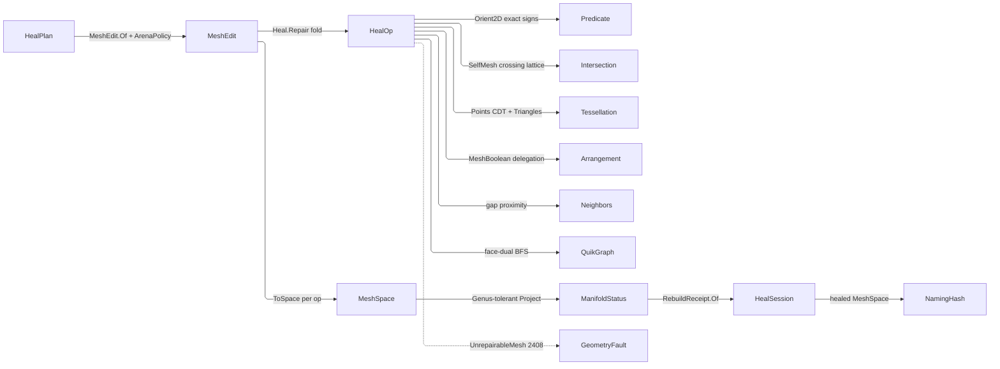

# [RASM_HEALING_REPAIR]

`Heal.Repair` folds the closed `HealOp` algebra over one `MeshEdit` arena and publishes a healed `MeshSpace` with its typed receipt chain. Repair stays total over its input class — a non-manifold, boundaried, or odd-Euler mesh heals rather than failing — and mints no content hash.

A rebuild composes the un-gated Genus-tolerant `TopologyReceipt` projection as the before/after topology witness; every failure lowers onto the band-2400 `GeometryFault` union, `UnrepairableMesh` 2408 carrying the residual defect count — the arena's surviving non-manifold edges, or the shell count a severed boolean returns to a session that admits one arena.

## [01]-[INDEX]

- [02]-[HEALING]: `Heal.Repair` folds the `HealOp` algebra over one arena under `RepairPolicy` admission, threading each op's after-status forward as the next before and the mutation-free `Incidence` fold forward as arena-interior scratch.

## [02]-[HEALING]

- Owner: `HealOp` is the closed repair algebra `Heal.Repair` folds; `HealStage` mints the one heal-modality vocabulary, discriminating both the fault payload and the receipt chain; `RepairPolicy` and `HealPlan` admit every scalar once at `Of`.
- Entry: `Heal.Repair` is the one entrypoint over every modality, discriminating on `HealPlan`.
- Auto: every author-kernel is a pure-managed arena fold composing the `Predicate` exact-sign floor and the `Axis.DominantOf` plane admission, reading its tolerances off the plan policy.
- Receipt: `HealSession` carries one typed `RebuildReceipt` per applied op; `before[n] = after[n-1]` threads the status pair so N ops cost N+1 projections, and the affected-entity seed reads the arena dirty bitsets admission clears. `Incidence` is arena-interior scratch spared a recomputation inside a mutation-free run, never receipt evidence.
- Packages: `Rasm.Meshing`, `Rasm.Processing`, `Rasm.Numerics`, `Rasm.Spatial`, QuikGraph, Thinktecture.Runtime.Extensions, LanguageExt.Core.
- Growth: a new modality is one `HealStage` row, one `HealOp` case, and one typed `RebuildReceipt` case; a new tolerance is one `RepairPolicy` column at `Of`; a new spatial or exact primitive routes its owning sibling as a consumer-contract row.
- Boundary: crossing, CDT, and boolean classification stay `Intersection`/`Tessellation`/`Arrangement` property, point proximity the `Spatial` neighbor lane. `RepairPolicy.Retile` names the constrained CDT stage, never remeshing; a composed sibling fault propagates unwrapped, and a collapse or re-mesh preserves every load-bearing feature.

```csharp signature
// --- [RUNTIME_PRELUDE] ----------------------------------------------------------------------
using System;
using System.Collections.Generic;
using System.Linq;
using LanguageExt;
using QuikGraph;
using QuikGraph.Algorithms;
using QuikGraph.Algorithms.Search;
using Rasm.Domain;
using Rasm.Meshing;
using Rasm.Numerics;
using Rasm.Spatial;
using Rhino.Geometry;
using Thinktecture;
using static LanguageExt.Prelude;
// CS0104 guard: LanguageExt.HashSet collides with the BCL name under the dual usings.
using FaceKeySet = System.Collections.Generic.HashSet<(int, int, int)>;
using IndexSet = System.Collections.Generic.HashSet<int>;
using Dimension = Rasm.Numerics.Dimension;
// One per-face constrained-retile row: the interned crossing pair plus its plane carriage — a pierced face id, or the
// carrier edge (Pierced = -1) a coplanar sub-segment lifts its perpendicular plane through.
using Cut = (int A, int B, int Pierced, int CarrierU, int CarrierV);

namespace Rasm.Processing;

// --- [TYPES] ----------------------------------------------------------------------------------
// THE heal-modality vocabulary: 2408 fault payload and receipt discriminant in one owner; Mint rows seed Heal.Standard
// and Collects marks the debris-collecting rows its terminal sweep re-runs once the last mutating stage has landed.
[SmartEnum<string>]
[KeyMemberEqualityComparer<ComparerAccessors.StringOrdinal, string>]
[KeyMemberComparer<ComparerAccessors.StringOrdinal, string>]
public sealed partial class HealStage {
    public static readonly HealStage Weld          = new("weld", rebuildsTopology: true, collects: true, mint: Some<Func<HealOp>>(static () => new HealOp.DuplicateWeld()));
    public static readonly HealStage Degenerate    = new("degenerate", rebuildsTopology: true, collects: true, mint: Some<Func<HealOp>>(static () => new HealOp.DegenerateCollapse()));
    public static readonly HealStage Gap           = new("gap", rebuildsTopology: true, collects: false, mint: Some<Func<HealOp>>(static () => new HealOp.GapClose()));
    public static readonly HealStage Manifold      = new("manifold", rebuildsTopology: true, collects: false, mint: Some<Func<HealOp>>(static () => new HealOp.ManifoldRepair()));
    public static readonly HealStage Orient        = new("orient", rebuildsTopology: false, collects: false, mint: Some<Func<HealOp>>(static () => new HealOp.OrientNormals()));
    public static readonly HealStage SelfIntersect = new("self-intersect", rebuildsTopology: true, collects: false, mint: Some<Func<HealOp>>(static () => new HealOp.SelfIntersectResolve()));
    public static readonly HealStage Boolean       = new("boolean", rebuildsTopology: true, collects: false, mint: None);

    public bool RebuildsTopology { get; }
    public bool Collects { get; }
    public Option<Func<HealOp>> Mint { get; }
}

// --- [CONSTANTS] ------------------------------------------------------------------------------
// Scalars admit once at Of, composed sibling policies at their own owners; the weld band is Arena.WeldTolerance, no weld knob here.
public sealed record RepairPolicy(
    PositiveMagnitude GapMaxSpan, double SliverAreaFloor, Dimension MaxManifoldPasses,
    ArenaPolicy Arena, IntersectPolicy Intersect, TessellationPolicy Retile, ArrangementPolicy Arrangement) : IValidityEvidence {
    public static readonly RepairPolicy Canonical = new(
        GapMaxSpan: PositiveMagnitude.Create(value: 1e-2), SliverAreaFloor: 1e-12,
        MaxManifoldPasses: Dimension.Create(value: 8),
        Arena: ArenaPolicy.Canonical, Intersect: IntersectPolicy.Canonical,
        Retile: TessellationPolicy.Constrained, Arrangement: ArrangementPolicy.Canonical);

    public bool IsValid => ValidityClaim.All(
        ValidityClaim.Finite(value: SliverAreaFloor), ValidityClaim.Nonnegative(value: SliverAreaFloor),
        ValidityClaim.Evidence(Intersect), ValidityClaim.Evidence(Retile), ValidityClaim.Evidence(Arrangement));

    public static Fin<RepairPolicy> Of(
        double gapMaxSpan, double sliverAreaFloor, int maxManifoldPasses,
        ArenaPolicy? arena = null, IntersectPolicy? intersect = null,
        TessellationPolicy? retile = null, ArrangementPolicy? arrangement = null, Op? key = null) {
        Op op = key.OrDefault();
        return from span in op.AcceptValidated<PositiveMagnitude>(candidate: gapMaxSpan)
               from floor in guard(ValidityClaim.Finite(value: sliverAreaFloor) && ValidityClaim.Nonnegative(value: sliverAreaFloor), op.InvalidInput()).ToFin().Map(_ => sliverAreaFloor)
               from passes in op.AcceptValidated<Dimension>(candidate: maxManifoldPasses)
               select new RepairPolicy(span, floor, passes,
                   arena ?? ArenaPolicy.Canonical, intersect ?? IntersectPolicy.Canonical,
                   retile ?? TessellationPolicy.Constrained, arrangement ?? ArrangementPolicy.Canonical);
    }
}

// --- [MODELS] ---------------------------------------------------------------------------------
public sealed record HealPlan(MeshSpace Input, Seq<HealOp> Ops, RepairPolicy Policy) : IValidityEvidence {
    public bool IsValid => ValidityClaim.All(ValidityClaim.CountAtLeast(count: Ops.Count, floor: 1), ValidityClaim.Evidence(Policy));

    public static Fin<HealPlan> Of(MeshSpace input, Seq<HealOp>? ops = null, RepairPolicy? policy = null, Op? key = null) {
        Op op = key.OrDefault();
        Seq<HealOp> sequence = ops ?? Heal.Standard;
        return from space in op.AcceptInput(input)
               from _ in guard(!sequence.IsEmpty, op.InvalidInput()).ToFin()
               select new HealPlan(space, sequence, policy ?? RepairPolicy.Canonical);
    }
}

// A kernel leaving the incidence fold current hands it forward, a mutating one drops it, so a stale fold is unrepresentable.
internal readonly record struct HealStep(MeshEdit Edit, Option<BooleanReceipt> Merge, Option<Incidence> Carry) {
    public static HealStep Same(MeshEdit edit) => new(edit, None, None);

    public static HealStep Carrying(MeshEdit edit, Incidence current) => new(edit, None, Some(current));
}

// --- [OPERATIONS] -----------------------------------------------------------------------------
[Union(ConversionFromValue = ConversionOperatorsGeneration.None)]
public abstract partial record HealOp {
    private HealOp() { }

    public sealed record DuplicateWeld : HealOp;
    public sealed record DegenerateCollapse : HealOp;
    public sealed record GapClose : HealOp;
    public sealed record ManifoldRepair : HealOp;
    public sealed record OrientNormals : HealOp;
    public sealed record SelfIntersectResolve : HealOp;
    public sealed record Boolean(BooleanOp Op, MeshSpace Tool) : HealOp;

    public HealStage Stage =>
        Switch(
            duplicateWeld:        static _ => HealStage.Weld,
            degenerateCollapse:   static _ => HealStage.Degenerate,
            gapClose:             static _ => HealStage.Gap,
            manifoldRepair:       static _ => HealStage.Manifold,
            orientNormals:        static _ => HealStage.Orient,
            selfIntersectResolve: static _ => HealStage.SelfIntersect,
            boolean:              static _ => HealStage.Boolean);

    // `current` is `edit`'s frozen image at fold entry: self-intersect detection and the boolean A operand ride it.
    internal Fin<HealStep> Apply(MeshEdit edit, MeshSpace current, RepairPolicy policy, Op key, Option<Incidence> carry) =>
        Switch(
            state: (Edit: edit, Current: current, Policy: policy, Key: key, Carry: carry),
            duplicateWeld:        static (s, _) => Fin.Succ(HealStep.Same(Kernels.WeldDuplicates(s.Edit))),
            degenerateCollapse:   static (s, _) => Heal.Collapse(s.Edit, s.Policy),
            gapClose:             static (s, _) => Heal.Close(s.Edit, s.Policy, s.Key, s.Carry),
            manifoldRepair:       static (s, _) => Heal.Split(s.Edit, s.Policy, s.Carry),
            orientNormals:        static (s, _) => Heal.Orient(s.Edit, s.Carry),
            selfIntersectResolve: static (s, _) => Heal.Resolve(s.Edit, s.Current, s.Policy, s.Key),
            boolean:              static (s, b) => Heal.Merge(b, s.Current, s.Policy, s.Key));
}

// One incidence fold shared by gap/manifold/orient, built once per arena state; kernel-local scratch under the arena-tier statement exemption.
internal readonly struct Incidence {
    internal readonly Dictionary<(int U, int V), List<int>> Edges;
    Incidence(Dictionary<(int U, int V), List<int>> edges) => Edges = edges;

    internal static Incidence Of(MeshEdit edit) {
        Dictionary<(int U, int V), List<int>> edges = new(3 * edit.FaceCount);
        for (int f = 0; f < edit.FaceCount; f++) {
            if (!edit.Alive(f)) continue;
            (int a, int b, int c) = edit.Face(f);
            Note(edges, a, b, f); Note(edges, b, c, f); Note(edges, c, a, f);
        }
        return new Incidence(edges);

        static void Note(Dictionary<(int U, int V), List<int>> edges, int u, int v, int f) =>
            (edges.TryGetValue(Key(u, v), out List<int>? faces) ? faces : edges[Key(u, v)] = []).Add(f);
    }

    internal static (int U, int V) Key(int u, int v) => u < v ? (u, v) : (v, u);

    // Boundary half-edges take direction from face winding, never the index-sorted key.
    internal Arr<(int Tail, int Head, int Face)> Boundary(MeshEdit edit) =>
        toArr(Edges.Where(static row => row.Value.Count == 1).Select(row => {
            (int a, int b, int c) = edit.Face(row.Value[0]);
            (int u, int v) = row.Key;
            (int tail, int head) = (a == u && b == v) || (b == u && c == v) || (c == u && a == v) ? (u, v) : (v, u);
            return (tail, head, row.Value[0]);
        }));

    internal Arr<((int U, int V) Edge, List<int> Fans)> NonManifold() =>
        toArr(Edges.Where(static row => row.Value.Count > 2).Select(static row => (row.Key, row.Value)));

    // Both arcs per interior 2-manifold edge carry the vertex pair; a >2-incident fan propagates no orientation, so Manifold precedes Orient.
    internal AdjacencyGraph<int, TaggedEdge<int, (int U, int V)>> Dual(MeshEdit edit) {
        AdjacencyGraph<int, TaggedEdge<int, (int U, int V)>> dual = new(allowParallelEdges: true);
        dual.AddVertexRange(Enumerable.Range(0, edit.FaceCount).Where(edit.Alive));
        foreach (((int U, int V) edge, List<int> faces) in Edges.Where(static row => row.Value.Count == 2)) {
            dual.AddEdge(new TaggedEdge<int, (int U, int V)>(faces[0], faces[1], edge));
            dual.AddEdge(new TaggedEdge<int, (int U, int V)>(faces[1], faces[0], edge));
        }
        return dual;
    }
}

public static class Heal {
    // Declaration order IS the canonical order: manifold precedes orient so the dual BFS walks a 2-manifold graph, and
    // self-intersect runs last, against the otherwise-healed snapshot. Its retile is the one stage that MINTS debris —
    // a sub-ulp near-miss splits one crossing into two vertices inside the weld band, spanning a sliver — and no stage
    // ahead of it can see that, so every Collects row re-runs as the terminal sweep. The schedule is two folds over one
    // vocabulary; a hand-appended tail op is the deleted form.
    public static readonly Seq<HealOp> Standard = Minted(static _ => true) + Minted(static stage => stage.Collects);

    static Seq<HealOp> Minted(Func<HealStage, bool> admits) =>
        toSeq(HealStage.Items).Filter(admits).Bind(static stage => stage.Mint.ToSeq()).Map(static mint => mint());

    // ONE live arena rides the swap-and-dispose seam; the fold threads Space/Status so before[n] = after[n-1] and the last freeze is the healed mesh.
    public static Fin<HealSession> Repair(HealPlan plan, Op? key = null) {
        Op op = key.OrDefault();
        Context context = plan.Input.Tolerance;
        MeshEdit live = MeshEdit.Of(plan.Input, plan.Policy.Arena);
        try {
            return Status(plan.Input, context, op).Bind(first =>
                plan.Ops.Fold(
                    Fin.Succ((Space: plan.Input, Status: first, Receipts: Seq<RebuildReceipt>(), Carry: Option<Incidence>.None)),
                    (acc, heal) => acc.Bind(state =>
                        from step in heal.Apply(live, state.Space, plan.Policy, op, state.Carry)
                        from space in Publish(step)
                        from after in Status(space, context, op)
                        select (Space: space, Status: after,
                                Receipts: state.Receipts.Add(RebuildReceipt.Of(heal, plan.Policy, state.Status, after, live, step.Merge)),
                                step.Carry)))
                .Map(state => new HealSession(Input: plan.Input, Healed: state.Space, Receipts: state.Receipts)));
        }
        finally { live.Dispose(); }

        Fin<MeshSpace> Publish(HealStep step) {
            if (!ReferenceEquals(step.Edit, live)) { live.Dispose(); live = step.Edit; }
            return live.ToSpace(context, op);
        }
    }

    // Projection stays un-gated, so the heal rail never rejects its input class.
    internal static Fin<ManifoldStatus> Status(MeshSpace space, Context context, Op key) =>
        VectorIntent.Topology(space, key)
            .Bind(intent => intent.Project<(int Euler, int BoundaryComponents, bool IsManifold, bool IsOriented, int NonManifoldEdges, Option<int> Genus)>(context: context, key: key))
            .Map(ManifoldStatus.Of);

    // --- [DEGENERATE_COLLAPSE]
    // A sliver flags on the EXACT Orient2D sign in the dominant-axis plane; the float area floor is a secondary gate behind an exact-keep.
    // The plane comes from the Numerics owner, never a page-local max-component pick, and its refusal IS this kernel's
    // verdict: a face with no dominant normal has zero projected area in every plane, so the axis rail collects it here
    // rather than failing a session over the degenerate input class the page exists to admit.
    internal static Fin<HealStep> Collapse(MeshEdit edit, RepairPolicy policy) {
        FaceKeySet seen = new();
        for (int f = 0; f < edit.FaceCount; f++) {
            if (!edit.Alive(f)) continue;
            (int a, int b, int c) = edit.Face(f);
            if (a == b || b == c || c == a || !seen.Add(Sorted(a, b, c))) { edit.KillFace(f); continue; }
            (Point3d pa, Point3d pb, Point3d pc) = (edit.Position(a), edit.Position(b), edit.Position(c));
            if (Axis.DominantOf(pa, pb, pc).Case is not Axis axis) { edit.KillFace(f); continue; }
            if (Predicate.Orient2D(pa, pb, pc, axis) == Sign.Zero
                || 0.5 * Vector3d.CrossProduct(pb - pa, pc - pa).Length < policy.SliverAreaFloor) { edit.KillFace(f); }
        }
        return Fin.Succ(HealStep.Same(edit));

        static (int, int, int) Sorted(int a, int b, int c) {
            (int lo, int hi) = (int.Min(a, int.Min(b, c)), int.Max(a, int.Max(b, c)));
            return (lo, a + b + c - lo - hi, hi);
        }
    }

    // --- [GAP_CLOSE]
    // Half-edge (a->b) pairs (c->d) when |b-c| and |d-a| both fit the span: opposite traversal keeps the bridge strip winding-coherent.
    internal static Fin<HealStep> Close(MeshEdit edit, RepairPolicy policy, Op key, Option<Incidence> carry) {
        Incidence incidence = carry.IfNone(() => Incidence.Of(edit));
        Arr<(int Tail, int Head, int Face)> rim = incidence.Boundary(edit);
        if (rim.Count < 2) return Fin.Succ(HealStep.Carrying(edit, incidence));   // zero mutation: the build stays current
        double span = policy.GapMaxSpan.Value;
        Point3d[] heads = [.. rim.Map(h => edit.Position(h.Head))];
        return NeighborIndex.Of(new NeighborSource.StaticCase(toSeq(rim.Map(h => edit.Position(h.Tail)))), key)
            .Bind(index => NeighborKernel.GraphOf(index: index, needles: heads, count: Option<int>.None, radius: Some(span), key: key))
            .Map(graph => Bridge(edit, rim, graph.Ids, span, incidence));
    }

    static HealStep Bridge(MeshEdit edit, Arr<(int Tail, int Head, int Face)> rim, int[][] candidates, double span, Incidence incidence) {
        List<(int I, int J, double Gap)> pairs = new();
        for (int i = 0; i < rim.Count; i++) {
            foreach (int j in candidates[i]) {
                if (j == i) continue;
                double forward = edit.Position(rim[i].Head).DistanceTo(edit.Position(rim[j].Tail));
                double backward = edit.Position(rim[j].Head).DistanceTo(edit.Position(rim[i].Tail));
                if (backward <= span) pairs.Add((i, j, double.Max(forward, backward)));
            }
        }
        // List.Sort is unstable introsort, so the rim index pair breaks every Gap tie: without it the greedy `used`
        // filter consumes equal-span pairs in implementation-defined order and one input bridges two ways.
        pairs.Sort(static (l, r) => l.Gap.CompareTo(r.Gap) is int rank and not 0 ? rank : (l.I, l.J).CompareTo((r.I, r.J)));
        IndexSet used = new();
        foreach ((int i, int j, _) in pairs) {
            if (used.Contains(i) || used.Contains(j)) continue;
            ((int a, int b), (int c, int d)) = ((rim[i].Tail, rim[i].Head), (rim[j].Tail, rim[j].Head));
            // {b,d} spans the strip; a wedge-corner pair (a==d or b==c) bridges with its single non-degenerate triangle.
            if (a != d) edit.AddFace(b, a, d);
            if (b != c) edit.AddFace(b, d, c);
            used.Add(i); used.Add(j);
        }
        return used.Count == 0 ? HealStep.Carrying(edit, incidence) : HealStep.Same(edit);
    }

    // --- [MANIFOLD_REPAIR]
    // Each pass splits every >2-incident edge into per-extra-face vertex copies; a converged pass re-emits zero and rides its incidence forward.
    // The copies sit at bit-identical coordinates, and a native topology vertex is a position-keyed equivalence class,
    // so the freeze re-merges them and the projected NonManifoldEdges never records the split. The ARENA fold is
    // therefore the single convergence authority — the count this kernel gates on and `ManifoldReceipt.ArenaResidual`
    // carries — and no arm reads the projected column as the split's witness.
    internal static Fin<HealStep> Split(MeshEdit edit, RepairPolicy policy, Option<Incidence> carry) {
        int passes = policy.MaxManifoldPasses.Value;
        (int found, Incidence last) = Range(0, passes).Fold(
            (Found: int.MaxValue, Last: carry.IfNone(() => Incidence.Of(edit))),
            (state, _) => state.Found == 0 ? state : SplitPass(edit, state.Found == int.MaxValue ? state.Last : Incidence.Of(edit)));
        if (found == 0) return Fin.Succ(HealStep.Carrying(edit, last));
        Incidence settled = Incidence.Of(edit);   // budget exhausted: the residual counts against the post-pass arena
        int remaining = settled.NonManifold().Count;
        return remaining == 0
            ? Fin.Succ(HealStep.Carrying(edit, settled))
            : Fin.Fail<HealStep>(new GeometryFault.UnrepairableMesh(HealStage.Manifold, passes, remaining).ToError());

        static (int Found, Incidence Last) SplitPass(MeshEdit edit, Incidence incidence) {
            Arr<((int U, int V) Edge, List<int> Fans)> rows = incidence.NonManifold();
            foreach (((int u, int v), List<int> fans) in rows) {
                foreach (int extra in fans.Skip(2)) {
                    int du = edit.AddVertex(edit.Position(u));
                    int dv = edit.AddVertex(edit.Position(v));
                    (int a, int b, int c) = edit.Face(extra);
                    edit.SetFace(extra, Re(a, u, du, v, dv), Re(b, u, du, v, dv), Re(c, u, du, v, dv));
                }
            }
            return (rows.Count, incidence);

            static int Re(int corner, int u, int du, int v, int dv) => corner == u ? du : corner == v ? dv : corner;
        }
    }

    // --- [ORIENT_NORMALS]
    // TreeEdge flips a child whose shared-edge traversal AGREES with its parent; winding flips leave the incidence valid, so it rides the carry out.
    internal static Fin<HealStep> Orient(MeshEdit edit, Option<Incidence> carry) {
        Incidence incidence = carry.IfNone(() => Incidence.Of(edit));
        AdjacencyGraph<int, TaggedEdge<int, (int U, int V)>> dual = incidence.Dual(edit);
        Dictionary<int, int> shell = new(edit.FaceCount);
        dual.WeaklyConnectedComponents(shell);
        // Lowest live face id seeds each shell, so input winding wins deterministically; dictionary-order seeding forks the content hash.
        Dictionary<int, int> seeds = new();
        for (int f = 0; f < edit.FaceCount; f++) {
            if (edit.Alive(f) && shell.TryGetValue(f, out int component)) seeds.TryAdd(component, f);
        }
        foreach (int seed in seeds.Values) {
            BreadthFirstSearchAlgorithm<int, TaggedEdge<int, (int U, int V)>> walk = new(dual);
            walk.TreeEdge += arc => {
                if (SameTraversal(edit.Face(arc.Source), edit.Face(arc.Target), arc.Tag)) {
                    (int a, int b, int c) = edit.Face(arc.Target);
                    edit.SetFace(arc.Target, a, c, b);
                }
            };
            walk.Compute(seed);
        }
        return Fin.Succ(HealStep.Carrying(edit, incidence));

        static bool SameTraversal((int A, int B, int C) f, (int A, int B, int C) g, (int U, int V) edge) =>
            Directed(f, edge) == Directed(g, edge);

        static bool Directed((int A, int B, int C) t, (int U, int V) e) =>
            (t.A == e.U && t.B == e.V) || (t.B == e.U && t.C == e.V) || (t.C == e.U && t.A == e.V);
    }

    // --- [SELF_INTERSECT_RESOLVE]
    // Adjacency-excluded broad-phase and Guigue-Devillers signs belong to the intersection owner; its Chains CrossLattice
    // carries interned crossing slots and per-segment defining-face pairs.
    internal static Fin<HealStep> Resolve(MeshEdit edit, MeshSpace current, RepairPolicy policy, Op key) =>
        Intersection.Apply(new IntersectOp.SelfMesh(current, policy.Intersect), key)
            .Bind(result => result is IntersectResult.Chains hit
                ? Fin.Succ(hit.Lattice)
                : Fin.Fail<CrossLattice>(key.InvalidResult()))
            .Bind(lattice => lattice.Segments.Length == 0 && lattice.Coplanar.Length == 0
                ? Fin.Succ(HealStep.Same(edit))
                : Recut(edit, current, lattice, policy, key));

    // The lattice indexes the FROZEN image — Intersection re-soups `current`, whose faces are the arena's live faces in
    // ascending order and whose coordinates are the freeze's float32 lattice — so ONE ascending scan carries every
    // lattice face onto its arena face and the retile measures geometry on the same soup the lattice measured; reading
    // corners off the live arena instead feeds one constraint set two coordinate namespaces. A crossing interns ONE row
    // corpus-wide, so two faces sharing a cut carry the same Implicit and their spliced seams meet by construction, and
    // an interned self-pair is a point touch carrying no constraint.
    static Fin<HealStep> Recut(MeshEdit edit, MeshSpace current, CrossLattice lattice, RepairPolicy policy, Op key) {
        using MeshEdit soup = MeshEdit.Of(current, policy.Arena);
        int[] arenaFace = new int[soup.FaceCount];
        for (int f = 0, live = 0; f < edit.FaceCount; f++) {
            if (edit.Alive(f)) { arenaFace[live++] = f; }
        }
        Dictionary<int, List<Cut>> patches = new();
        foreach ((int a, int b, int fa, int fb) in lattice.Segments) {
            if (a == b) continue;
            Note(patches, fa, (a, b, fb, -1, -1)); Note(patches, fb, (a, b, fa, -1, -1));
        }
        // A coplanar row defines no piercing plane: it carries its CARRIER EDGE, and the self lattice runs both sweeps on
        // one soup, so the carrier-side column is inert here and the perpendicular plane rides (S, T, S+lift) instead.
        foreach ((int a, int b, int fa, int fb, int cu, int cv, _) in lattice.Coplanar) {
            if (a == b) continue;
            Note(patches, fa, (a, b, -1, cu, cv)); Note(patches, fb, (a, b, -1, cu, cv));
        }
        if (patches.Count == 0) return Fin.Succ(HealStep.Same(edit));
        Dictionary<Point3d, int> minted = new();
        return toSeq(patches.OrderBy(static patch => patch.Key)).Strict()
            .TraverseM(patch => Subdivide(edit, soup, lattice, arenaFace[patch.Key], patch.Key, patch.Value, minted, policy, key))
            .As()
            .Map(_ => HealStep.Same(edit));

        static void Note(Dictionary<int, List<Cut>> patches, int face, Cut row) =>
            (patches.TryGetValue(face, out List<Cut>? rows) ? rows : patches[face] = []).Add(row);
    }

    // Constrained-only CDT in the dominant-axis plane: three explicit corners plus CrossKey-interned Implicit crossing
    // rows, every piercing cut carrying the OTHER face's plane, every coplanar sub-segment the PERPENDICULAR plane through
    // its carrier edge, and Support the face's own corners — the Tpi witness a constraint x constraint split needs, so a
    // second-generation crossing is CONSTRUCTED exactly and rounds once at the substrate's emission seam rather than
    // re-entering a predicate already rounded. The corners ARE the site hull, so a rim-collinear crossing joins that
    // boundary itself and both incident faces split their shared edge through the one interned row — no rim constraint
    // battery, no page-local segment x segment pass, and a proper-crossings-only straddle can no longer miss a cut that
    // ends on another. A negative dominant normal mirrors the spliced winding.
    static Fin<Unit> Subdivide(MeshEdit edit, MeshEdit soup, CrossLattice lattice, int face, int latticeFace, List<Cut> cuts, Dictionary<Point3d, int> minted, RepairPolicy policy, Op key) {
        (int s0, int s1, int s2) = soup.Face(latticeFace);
        (Point3d pa, Point3d pb, Point3d pc) = (soup.Position(s0), soup.Position(s1), soup.Position(s2));
        List<Implicit> rows = new(3 + cuts.Count) { new(pa), new(pb), new(pc) };
        Dictionary<CrossKey, int> slotOf = new();
        return Axis.DominantOf(pa, pb, pc, key).Bind(plane => {
            Vector3d normal = Vector3d.CrossProduct(pb - pa, pc - pa);
            Vector3d lift = new(plane.Key == 0 ? 1.0 : 0.0, plane.Key == 1 ? 1.0 : 0.0, plane.Key == 2 ? 1.0 : 0.0);
            bool mirrored = (plane.Key == 0 ? normal.X : plane.Key == 1 ? normal.Y : normal.Z) < 0.0;
            List<Constraint> constraints = new(cuts.Count);
            foreach ((int a, int b, int pierced, int cu, int cv) in cuts) {
                (Point3d p, Point3d q, Point3d r) = pierced >= 0
                    ? Corners(pierced)
                    : (soup.Position(cu), soup.Position(cv), soup.Position(cu) + lift);
                constraints.Add(new Constraint.Crossing(Intern(a), Intern(b), p, q, r));
            }
            (int u, int v, int w) = edit.Face(face);
            Dictionary<Point3d, int> corner = new() { [rows[0].Round()] = u, [rows[1].Round()] = v, [rows[2].Round()] = w };
            return Tessellation.Build(new TessellationOp.Points(
                    TessellationKind.Triangulation, [.. rows], toSeq(constraints), policy.Retile, plane, Some((pa, pb, pc))), key)
                .Bind(tess => tess.Triangles(key))
                .Map(triangles => Splice(edit, face, triangles, corner, minted, mirrored));
        });

        int Intern(int row) {
            Crossing crossing = lattice.Rows[row];
            if (slotOf.TryGetValue(crossing.Key, out int at)) return at;
            rows.Add(crossing.Point);
            return slotOf[crossing.Key] = rows.Count - 1;
        }

        (Point3d P, Point3d Q, Point3d R) Corners(int at) {
            (int a, int b, int c) = soup.Face(at);
            return (soup.Position(a), soup.Position(b), soup.Position(c));
        }
    }

    // A substrate Steiner point is the constrained recovery's own re-anchor over ORIGINAL points, so the splice MINTS it
    // beside every crossing row instead of refusing it. `minted` spans the whole retile, so two faces meeting at one
    // crossing or one recovery point reach the same arena vertex and the seam closes by construction; an exactly-
    // coincident crossing resolves to the corner id, and a sub-ulp near-miss mints a sliver the terminal weld/degenerate
    // sweep collects. Total: the arena mutation is the last step of an already-decided patch.
    static Unit Splice(MeshEdit edit, int face, (Point3d A, Point3d B, Point3d C)[] triangles, Dictionary<Point3d, int> corner, Dictionary<Point3d, int> minted, bool mirrored) {
        edit.KillFace(face);
        foreach ((Point3d ta, Point3d tb, Point3d tc) in triangles) {
            (int u, int v, int w) = (Arena(ta), Arena(tb), Arena(tc));
            if (mirrored) edit.AddFace(u, w, v); else edit.AddFace(u, v, w);
        }
        return unit;

        int Arena(Point3d p) =>
            corner.TryGetValue(p, out int at) ? at
            : minted.TryGetValue(p, out int seam) ? seam
            : minted[p] = edit.AddVertex(p);
    }

    // --- [BOOLEAN]
    // Arrangement owns classification, exactness, and the scale gate — NativeAssetMissing 2423 propagates from ITS rail,
    // never a second gate here. Arity rides the operand Seq, and Shells EXPRESS disconnection: a heal session admits
    // exactly ONE arena, so a severed result fails typed on its shell count — largest-shell selection would publish a
    // mesh the session never proved, a shell-widened session would index every downstream receipt by shell.
    internal static Fin<HealStep> Merge(HealOp.Boolean op, MeshSpace current, RepairPolicy policy, Op key) =>
        Arrangement.Apply(new ArrangementOp.MeshBoolean(Seq(current, op.Tool), op.Op, policy.Arrangement), key)
            .Bind(result => result switch {
                ArrangementResult.Boolean { Shells: [MeshSpace solid] } merged =>
                    Fin.Succ(new HealStep(MeshEdit.Of(solid, policy.Arena), Some(merged.Receipt), None)),
                ArrangementResult.Boolean severed =>
                    Fin.Fail<HealStep>(new GeometryFault.UnrepairableMesh(HealStage.Boolean, 1, severed.Shells.Count).ToError()),
                _ => Fin.Fail<HealStep>(key.InvalidResult()),
            });
}
```


```mermaid
---
config:
  layout: elk
  flowchart:
    curve: linear
    padding: 25
---
flowchart LR
    accTitle: Mesh heal operation fold
    accDescr: A heal plan entering the mesh-edit arena where each repair operation draws on exact predicates, intersection, tessellation, boolean arrangement, proximity, and face-dual traversal, the frozen space projecting manifold status into a rebuild receipt and the healed space into naming identity, with the unrepairable arm leaving as a geometry fault.
    HealPlan -->|MeshEdit.Of + ArenaPolicy| MeshEdit
    MeshEdit -->|Heal.Repair fold| HealOp
    HealOp -->|Orient2D exact signs| Predicate
    HealOp -->|SelfMesh crossing lattice| Intersection
    HealOp -->|Points CDT + Triangles| Tessellation
    HealOp -->|MeshBoolean delegation| Arrangement
    HealOp -->|gap proximity| Neighbors
    HealOp -->|face-dual BFS| QuikGraph
    MeshEdit -->|ToSpace per op| MeshSpace
    MeshSpace -->|Genus-tolerant Project| ManifoldStatus
    ManifoldStatus -->|RebuildReceipt.Of| HealSession
    HealSession -->|healed MeshSpace| NamingHash
    HealOp -.->|UnrepairableMesh 2408| GeometryFault
```

## [03]-[DENSITY_BAR]

One owner per axis; capability is a case, row, or column.

| [INDEX] | [AXIS_CONCERN]   | [OWNER]         | [RAIL]                                          | [CASES] |
| :-----: | :--------------- | :-------------- | :---------------------------------------------- | :-----: |
|  [01]   | Healing rail     | `Heal`/`HealOp` | `Heal.Repair(HealPlan, Op?) → Fin<HealSession>` |    7    |
|  [02]   | Heal modality    | `HealStage`     | discriminant (pure)                             |    7    |
|  [03]   | Policy row       | `RepairPolicy`  | `RepairPolicy.Of → Fin<RepairPolicy>`           |    —    |
|  [04]   | Request carrier  | `HealPlan`      | `HealPlan.Of → Fin<HealPlan>`                   |    —    |
|  [05]   | Shared incidence | `Incidence`     | interior (arena-tier scratch)                   |    3    |

## [04]-[RESEARCH]

<!-- source-only: research row template:
[TOKEN]-[OPEN|BLOCKED]: <exact question>; <verification route>.
[SPLIT_MEMBER]-[OPEN]: does `shape-core` expose `split_all`; verify against the member rail.
-->

(none)
