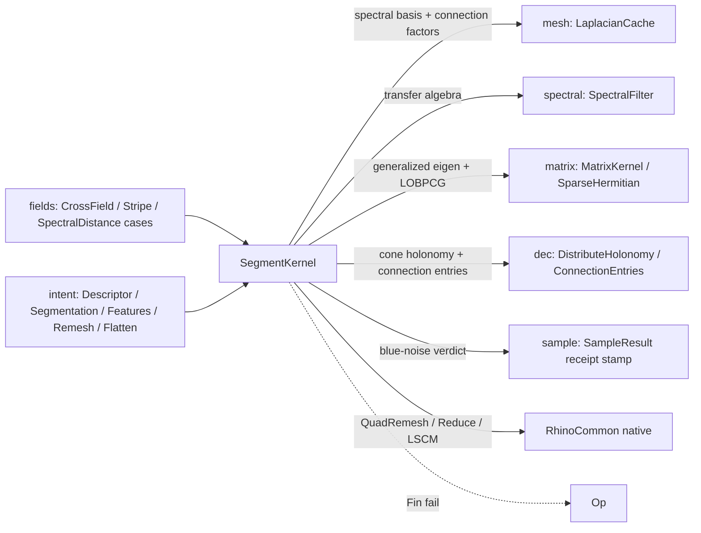

# [RASM_SHAPE_SEGMENT]

ONE spectral shape-analysis and restructure owner over the `mesh` substrate: `MeshDescriptor` spectral shape descriptors (HKS-like heat, WKS-style wave, biharmonic, diffusion, commute-time through the `spectral` `SpectralFilter` transfer algebra), spectral distance, sampling-spectrum blue-noise validation (the low-frequency energy gate the `sample` rail stamps into its receipts), dihedral/curvature feature-edge classification, the frozen `MeshSegmentation` six-algorithm union (scalar threshold · scalar bands · seeded region grow · descriptor clusters · watershed basins · normalized-cut spectral clustering), Knöppel globally-optimal direction fields (smoothest / hint-constrained / cone-prescribed) with their stripe-pattern level-set scalars, and the RhinoCommon-native restructure tier — `QuadRemesh`/`Reduce` behind the `RemeshKind`/`QuadTarget` unions and native LSCM unwrap/flatten. The restructure tier is deliberate host capture: it coexists by law with the settled robust `decimate`/`flatten` owners, which own the first-principles counterparts at a different altitude — this page owns the host-native surface, never a re-derivation.

The page owns the descriptor evidence (`DescriptorReceipt`/`DescriptorResult`/`MeshSamplingSpectrumReceipt`), the feature vocabulary (`MeshFeatureAlgorithm`/`MeshFeatureKind`/`FeatureEdge`/`FeatureReceipt`/`MeshFeaturePolicy` with scale-derived thresholds), the segmentation vocabulary (`MeshSegmentation`, `MeshSegmentationAlgorithm`/`Status`, `MeshSegmentationReceipt`/`Result`), the restructure vocabulary (`QuadTarget`/`QuadGuideInfluence`/`QuadPreserveEdges`/`RemeshKind`/`RemeshReceipt`/`RemeshResult`/`FlattenReceipt`/`FlattenResult`), and the `SegmentKernel` solver body. Eigen systems ride the `matrix` owners (`MatrixKernel.GeneralizedEigenpairsDetailed` for normalized cuts, `SparseHermitian.SmallestEigenpairsDetailed` LOBPCG for the smoothest field); spectral bases and connection factors ride the `mesh` `LaplacianCache` (`SpectralBasisBundleOf`, `ConnectionCholesky`, `CrossField` value-keyed memo); cone prescriptions ride the `dec` trivial-connection owner; sampling rides the sibling `MeshProbe` substrate; the frozen `ScalarField.SpectralDistance`/`Stripe` and `VectorField.CrossField` cases delegate here.

## [01]-[INDEX]

- [02]-[DESCRIPTORS]: `MeshDescriptor` spectral descriptors + spectral distance + the sampling-spectrum blue-noise gate feeding the `sample` rail.
- [03]-[FEATURES]: dihedral + curvature feature-edge classification over the eight-kind `MeshFeatureKind` vocabulary with scale-derived policy admission.
- [04]-[SEGMENTATION]: the frozen `MeshSegmentation` union — six algorithms, one dispatch, one receipt family — with the connected-component, watershed union-find, farthest-first clustering, and normalized-cut internals.
- [05]-[DIRECTION_FIELDS]: Knöppel GODF cross fields (smoothest eigenvector / constrained solve / cone holonomy) + stripe patterns.
- [06]-[RESTRUCTURE]: host-native QuadRemesh/Reduce behind `RemeshKind` + native LSCM flatten with the distortion witness.

## [02]-[DESCRIPTORS]

- Owner: `MeshDescriptor` `[Union]` — one `SpectralCase` (filter + optional sources + descriptor policy) by decision, not a thinned ShapeDNA clone: the `SpectralFilter` transfer algebra already spans heat/wave/biharmonic/diffusion/commute-time/identity, so a descriptor variant is a FILTER row, never a new descriptor case; `MeshSamplingSpectrumAlgorithm` (CandidateSpectrum); `DescriptorReceipt`/`DescriptorResult`/`MeshSamplingSpectrumReceipt` evidence; the `SegmentKernel` descriptor arms.
- Entry: `SegmentKernel.DescribeShape<TOut>(space, kind, eigenpairs, key)` — output-typed projection through `AtomProjection` rows (`Arr<double>` values, `SpectralDescriptor`, `SpectralDescriptorReceipt`, `DescriptorReceipt`, plus the rail's identity fallthrough for the full `DescriptorResult`), with the assembly receipt computed ONLY when the requested output carries it; `SegmentKernel.SpectralDistanceAt(space, filter, sources, pairs, sample, key)` (the frozen `ScalarField.SpectralDistance` delegate); `SegmentKernel.ValidateSamplingSpectrum(space, result, key)` — stamps the blue-noise verdict into the `sample` result's algorithm receipt.
- Auto: descriptors pull the cached `SpectralBasisBundle` (one generalized eigensolve per basis size per mesh snapshot — the cache-hit flag lands in the receipt), apply the filter's `ApplyDetailed` with source restriction and normalization policy, and project; the spectrum gate splats the sample set to a barycentric vertex indicator, projects it onto the low-frequency eigenmodes (first three of at most eight), and validates `low/total ≤ 0.5` — a blue-noise candidate set must not concentrate energy in the low band; the threshold is a defaulted entry parameter and the basis cap / low-mode count are named page constants, never bare literals.
- Receipt: `DescriptorReceipt` (spectral receipt + eigen receipt + requested/returned pairs + cache/factor evidence + optional assembly receipt); `MeshSamplingSpectrumReceipt` on the rails fold with the declared gate `Validated == (SuppressionRatio ≤ ValidationThreshold)` and both ratios inside `[0,1]` — the verdict is recomputable from the receipt's own fields.
- Boundary: output selection lives in `ProjectionRow` keys inside the `AtomProjection` dispatch — reflection branching in solver bodies is the deleted form, and the ONE sanctioned entry-level type test is the lazy-assembly gate (`DescribeShape` computes the assembly receipt only when `TOut` carries it, so a value projection never pays a DEC build); the descriptor family is closed over the filter algebra and a `MeshDescriptorKind` sibling enum re-listing filter names is the rejected duplicate vocabulary.

```csharp
// --- [RUNTIME_PRELUDE] ---------------------------------------------------------------------
using System.Numerics;
using Foundation.CSharp.Analyzers.Contracts;
using Rasm.Domain;
using Rasm.Meshing;
using Rasm.Numerics;

namespace Rasm.Processing;

// --- [TYPES] --------------------------------------------------------------------------------
[Union]
public abstract partial record MeshDescriptor {
    private MeshDescriptor() { }
    public sealed record SpectralCase(SpectralFilter Filter, Option<Seq<int>> Sources, SpectralDescriptorPolicy Policy) : MeshDescriptor;
    public static MeshDescriptor Spectral(SpectralFilter filter, Option<Seq<int>> sources = default) => Spectral(filter: filter, sources: sources, policy: SpectralDescriptorPolicy.Raw);
    public static MeshDescriptor Spectral(SpectralFilter filter, Option<Seq<int>> sources, SpectralDescriptorPolicy policy) => new SpectralCase(Filter: filter, Sources: sources, Policy: policy);
    internal bool IsValid => this is SpectralCase { Filter: not null } spectral && spectral.Policy.IsValid;
}

[SmartEnum<int>]
public sealed partial class MeshSamplingSpectrumAlgorithm { public static readonly MeshSamplingSpectrumAlgorithm CandidateSpectrum = new(key: 0); }

// --- [MODELS] -------------------------------------------------------------------------------
[BoundaryAdapter, StructLayout(LayoutKind.Auto)]
public readonly record struct DescriptorReceipt(
    SpectralDescriptorReceipt Spectral, EigenSolveReceipt<double, Arr<double>> Eigen, int RequestedEigenpairs, int ReturnedEigenpairs,
    bool SpectralCacheHit = false, int SkippedDegenerateFaces = 0, Option<int> FactorNonZeros = default, Option<SpectralAssemblyReceipt> Assembly = default) : IValidityEvidence {
    public bool IsValid => ValidityClaim.All(
        ValidityClaim.Evidence(Spectral),
        ValidityClaim.Evidence(Eigen),
        ValidityClaim.Of(RequestedEigenpairs >= 1 && ReturnedEigenpairs > 0 && ReturnedEigenpairs <= RequestedEigenpairs),
        ValidityClaim.CountAtLeast(count: SkippedDegenerateFaces, floor: 0),
        ValidityClaim.Of(FactorNonZeros.Map(static count => count > 0).IfNone(noneValue: true)),
        ValidityClaim.Of(Assembly.Map(static receipt => receipt.IsValid).IfNone(noneValue: true)));
}

[BoundaryAdapter, StructLayout(LayoutKind.Auto)] public readonly record struct DescriptorResult(Arr<double> Values, DescriptorReceipt Receipt);

[BoundaryAdapter, StructLayout(LayoutKind.Auto)]
public readonly record struct MeshSamplingSpectrumReceipt(
    int VertexCount, int SampleCount, int EigenpairCount, double LowFrequencyEnergy, double TotalEnergy,
    double SuppressionRatio, double ValidationThreshold, bool Validated, MeshSamplingSpectrumAlgorithm? Algorithm = null) : IValidityEvidence {
    // The rails ValidityClaim.All fold: the verdict is recomputable and both ratios are unit-bounded.
    public bool IsValid => ValidityClaim.All(
        ValidityClaim.Of(Algorithm is not null && VertexCount >= 0 && SampleCount >= 0 && EigenpairCount >= 0),
        ValidityClaim.Nonnegative(value: LowFrequencyEnergy),
        ValidityClaim.Positive(value: TotalEnergy),
        ValidityClaim.UnitInterval(value: SuppressionRatio),
        ValidityClaim.UnitInterval(value: ValidationThreshold),
        ValidityClaim.Of(Validated == (SuppressionRatio <= ValidationThreshold)));
}

// --- [OPERATIONS] ---------------------------------------------------------------------------
internal static partial class SegmentKernel {
    internal const double SpectrumLowFrequencyCeiling = 0.5;
    private const int SpectrumBasisCap = 8;
    private const int SpectrumLowModeCount = 3;

    internal static Fin<TOut> DescribeShape<TOut>(MeshSpace space, MeshDescriptor kind, int eigenpairs, Op key) =>
        Optional(kind).ToFin(key.InvalidInput()).Bind(active =>
            guard(active.IsValid, key.InvalidInput()).Bind(_ => active.Switch(
                state: (Space: space, Eigenpairs: eigenpairs, Key: key),
                spectralCase: static ((MeshSpace Space, int Eigenpairs, Op Key) state, MeshDescriptor.SpectralCase spec) =>
                    from descriptor in DescribeSpectralShape(space: state.Space, spec: spec, eigenpairs: state.Eigenpairs, includeAssembly: typeof(TOut) == typeof(DescriptorResult) || typeof(TOut) == typeof(DescriptorReceipt), key: state.Key)
                    from output in ProjectDescriptor<TOut>(descriptor: descriptor, key: state.Key)
                    select output)));
    internal static Fin<DescriptorResult> DescribeSpectralShape(MeshSpace space, MeshDescriptor.SpectralCase spec, int eigenpairs, Op key) =>
        DescribeSpectralShape(space: space, spec: spec, eigenpairs: eigenpairs, includeAssembly: false, key: key);
    private static Fin<DescriptorResult> DescribeSpectralShape(MeshSpace space, MeshDescriptor.SpectralCase spec, int eigenpairs, bool includeAssembly, Op key) =>
        from bundle in space.Cache.SpectralBasisBundleOf(k: eigenpairs, key: key)
        from spectral in spec.Filter.ApplyDetailed(basis: bundle.Basis, sources: spec.Sources, policy: spec.Policy, key: key)
        from assembly in includeAssembly ? DecAssembly.Build(space: space, key: key).Map(calculus => Some(calculus.Receipt)) : Fin.Succ(Option<SpectralAssemblyReceipt>.None)
        select new DescriptorResult(Values: spectral.Values, Receipt: new DescriptorReceipt(Spectral: spectral.Receipt, Eigen: bundle.Eigen, RequestedEigenpairs: eigenpairs, ReturnedEigenpairs: bundle.Eigen.ReturnedPairs, SpectralCacheHit: bundle.CacheHit, SkippedDegenerateFaces: bundle.SkippedDegenerateFaces, FactorNonZeros: bundle.FactorNonZeros, Assembly: assembly));
    private static Fin<TOut> ProjectDescriptor<TOut>(DescriptorResult descriptor, Op key) =>
        AtomProjection.Rows<DescriptorResult, TOut>(self: descriptor, key: key, owner: typeof(MeshDescriptor.SpectralCase),
            ProjectionRow.Of<DescriptorReceipt>(() => Fin.Succ(descriptor.Receipt)),
            ProjectionRow.Of<SpectralDescriptor>(() => Fin.Succ(new SpectralDescriptor(Values: descriptor.Values, Receipt: descriptor.Receipt.Spectral))),
            ProjectionRow.Of<SpectralDescriptorReceipt>(() => Fin.Succ(descriptor.Receipt.Spectral)),
            ProjectionRow.Of<Arr<double>>(() => Fin.Succ(descriptor.Values)));

    internal static Fin<double> SpectralDistanceAt(MeshSpace space, SpectralFilter filter, Seq<int> sources, int pairs, Point3d sample, Op key) =>
        from bundle in space.Cache.SpectralBasisBundleOf(k: pairs, key: key)
        from descriptor in filter.ApplyDetailed(basis: bundle.Basis, sources: sources.IsEmpty ? Option<Seq<int>>.None : Some(sources), key: key)
        from interpolated in MeshProbe.ScalarOn(space: space, sample: sample, perVertex: descriptor.Values, key: key)
        select interpolated;

    // Blue-noise gate: splat samples to a vertex indicator, project onto the low eigenmodes, bound low/total energy.
    internal static Fin<SampleResult> ValidateSamplingSpectrum(MeshSpace space, SampleResult result, Op key, double lowFrequencyCeiling = SpectrumLowFrequencyCeiling) =>
        result.Points.IsEmpty || result.Receipt.Algorithm.IsNone || space.Native.Vertices.Count < 3
            ? Fin.Succ(result)
            : (from bundle in space.Cache.SpectralBasisBundleOf(k: Math.Min(val1: SpectrumBasisCap, val2: Math.Max(val1: 1, val2: space.Native.Vertices.Count - 1)), key: key)
               from receipt in SamplingSpectrumReceiptOf(space: space, points: result.Points, basis: bundle.Basis, lowFrequencyCeiling: lowFrequencyCeiling, key: key)
               select result with { Receipt = result.Receipt with { Algorithm = result.Receipt.Algorithm.Map(algorithm => algorithm with { MeshSpectrumValidated = receipt.Validated, Spectrum = Some(receipt) }) } });
    private static Fin<MeshSamplingSpectrumReceipt> SamplingSpectrumReceiptOf(MeshSpace space, Seq<Point3d> points, SpectralBasis basis, double lowFrequencyCeiling, Op key) {
        int vertexCount = space.Native.Vertices.Count;
        if (basis.Eigenvectors.Count == 0 || points.IsEmpty) return Fin.Fail<MeshSamplingSpectrumReceipt>(key.InvalidInput());
        double[] indicator = new double[vertexCount];
        // Splat rides the ONE MeshProbe closest-face owner; a page-local ClosestMeshPoint reach is the deleted parallel rail.
        for (int i = 0; i < points.Count; i++) {
            Fin<Unit> splat = MeshProbe.ClosestFace(space: space, sample: points[index: i], key: key, project: (_, face, weights, _) => {
                indicator[face.A] += weights[0]; indicator[face.B] += weights[1]; indicator[face.C] += weights[2];
                if (face.IsQuad) indicator[face.D] += weights[3];
                return Fin.Succ(unit);
            });
            if (splat.IsFail) return Fin.Fail<MeshSamplingSpectrumReceipt>(key.InvalidResult());
        }
        double low = 0.0, total = 0.0;
        int lowLimit = Math.Min(val1: SpectrumLowModeCount, val2: basis.Eigenvectors.Count);
        for (int mode = 0; mode < basis.Eigenvectors.Count; mode++) {
            Arr<double> eigenvector = basis.Eigenvectors[index: mode];
            if (eigenvector.Count != vertexCount) return Fin.Fail<MeshSamplingSpectrumReceipt>(key.InvalidResult());
            double coefficient = 0.0;
            for (int v = 0; v < vertexCount; v++) coefficient += indicator[v] * eigenvector[index: v];
            double energy = coefficient * coefficient;
            if (!RhinoMath.IsValidDouble(x: energy)) return Fin.Fail<MeshSamplingSpectrumReceipt>(key.InvalidResult());
            total += energy;
            if (mode < lowLimit) low += energy;
        }
        double ratio = total > RhinoMath.SqrtEpsilon ? low / total : 1.0;
        double bounded = Math.Max(val1: 0.0, val2: Math.Min(val1: 1.0, val2: ratio));
        // Validated is EXACTLY the declared gate claim (SuppressionRatio <= ValidationThreshold) — a degenerate total
        // is rejected by the gate's Positive(TotalEnergy) row, never by a divergent second condition here.
        MeshSamplingSpectrumReceipt receipt = new(VertexCount: vertexCount, SampleCount: points.Count, EigenpairCount: basis.Eigenvectors.Count, LowFrequencyEnergy: low, TotalEnergy: total, SuppressionRatio: bounded, ValidationThreshold: lowFrequencyCeiling, Validated: bounded <= lowFrequencyCeiling, Algorithm: MeshSamplingSpectrumAlgorithm.CandidateSpectrum);
        return receipt.IsValid ? Fin.Succ(receipt) : Fin.Fail<MeshSamplingSpectrumReceipt>(key.InvalidResult());
    }
}
```

## [03]-[FEATURES]

- Owner: `MeshFeatureAlgorithm` (DihedralProxy — the algorithm row future curvature-tensor detectors extend); `MeshFeatureKind` eight-kind edge taxonomy (Boundary/Crease/NonManifold/Unwelded/NgonInteriorSkipped/Ridge/Valley/RegionBoundary); `FeatureEdge` per-edge evidence (endpoints, kind, unsigned + signed dihedral, curvature signal); `FeatureReceipt` with per-kind counts and typed `Project<TOut>` rows (full edges, or endpoint pairs with ngon-interior edges filtered); `MeshFeaturePolicy` — the dihedral threshold is caller intent, the curvature threshold and smoothing scale are SCALE-DERIVED from the mean edge length at admission, and optional per-face regions turn region boundaries into features.
- Entry: `SegmentKernel.DetectFeatureEdgesDetailed(space, dihedralRadians, key)` seats the derived policy; `SegmentKernel.DetectFeatureEdgesDetailed(space, policy, key)` is the full-control arity — one concept, input-shape discrimination.
- Auto: topology edges classify by connected-face census (1 → Boundary, >2 → NonManifold, unwelded → Unwelded, ngon-interior → skipped-but-counted), then smooth 2-face edges classify by the signed dihedral (cross-product sign against the edge axis) against the threshold — ridge/valley when the length-normalized curvature signal (`|angle|/length`, endpoint-mean blended by `length/(length+smoothingScale)`) also exceeds the curvature threshold, plain crease otherwise; region-boundary classification precedes angle tests when face regions are declared.
- Boundary: ngon interiors are COUNTED and skipped, never silently dropped, and the below-threshold remainder lands in `UnclassifiedEdges` — the receipt carries `TopologyEdgeCount` and its validity gate ENFORCES both census reconciliations (edge rows = per-kind counts; per-kind + unclassified = topology edges), so totality is recomputable from the receipt's own fields, never a prose promise; the curvature signal's endpoint smoothing is the anti-alias against single-edge noise and a raw per-edge threshold is the rejected form.

```csharp
// --- [TYPES] --------------------------------------------------------------------------------
[SmartEnum<int>]
public sealed partial class MeshFeatureAlgorithm { public static readonly MeshFeatureAlgorithm DihedralProxy = new(key: 0); }

[SmartEnum<int>]
public sealed partial class MeshFeatureKind {
    public static readonly MeshFeatureKind Boundary = new(key: 0);
    public static readonly MeshFeatureKind Crease = new(key: 1);
    public static readonly MeshFeatureKind NonManifold = new(key: 2);
    public static readonly MeshFeatureKind Unwelded = new(key: 3);
    public static readonly MeshFeatureKind NgonInteriorSkipped = new(key: 4);
    public static readonly MeshFeatureKind Ridge = new(key: 5);
    public static readonly MeshFeatureKind Valley = new(key: 6);
    public static readonly MeshFeatureKind RegionBoundary = new(key: 7);
}

// --- [MODELS] -------------------------------------------------------------------------------
[BoundaryAdapter, StructLayout(LayoutKind.Auto)] public readonly record struct FeatureEdge(int A, int B, MeshFeatureKind Kind, Option<double> DihedralRadians, Option<double> SignedDihedralRadians = default, Option<double> CurvatureSignal = default);

[BoundaryAdapter, StructLayout(LayoutKind.Auto)]
public readonly record struct FeatureReceipt(
    Seq<FeatureEdge> Edges, int BoundaryEdges, int CreaseEdges, int NonManifoldEdges, int UnweldedEdges, int NgonInteriorSkippedEdges,
    double DihedralThresholdRadians, int UnclassifiedEdges = 0, int RidgeEdges = 0, int ValleyEdges = 0, int RegionBoundaryEdges = 0,
    double CurvatureThreshold = 0.0, double SmoothingScale = 0.0, int CurvatureFiniteVertices = 0, int CurvatureRejectedVertices = 0,
    int TopologyEdgeCount = 0, MeshFeatureAlgorithm? Algorithm = null) : IValidityEvidence {
    // Census totality is the receipt's OWN gate: the edge rows reconcile the per-kind counts, and per-kind counts
    // plus the unclassified census (smooth or faceless) reconcile every topology edge — recomputable, not a comment.
    public bool IsValid => ValidityClaim.All(
        ValidityClaim.Of(Algorithm is not null && BoundaryEdges >= 0 && CreaseEdges >= 0 && NonManifoldEdges >= 0 && UnweldedEdges >= 0 && NgonInteriorSkippedEdges >= 0 && UnclassifiedEdges >= 0 && RidgeEdges >= 0 && ValleyEdges >= 0 && RegionBoundaryEdges >= 0),
        ValidityClaim.Of(CurvatureFiniteVertices >= 0 && CurvatureRejectedVertices >= 0),
        ValidityClaim.Nonnegative(value: DihedralThresholdRadians),
        ValidityClaim.Nonnegative(value: CurvatureThreshold),
        ValidityClaim.Nonnegative(value: SmoothingScale),
        ValidityClaim.CountExactly(count: Edges.Count, expected: BoundaryEdges + CreaseEdges + NonManifoldEdges + UnweldedEdges + NgonInteriorSkippedEdges + RidgeEdges + ValleyEdges + RegionBoundaryEdges),
        ValidityClaim.CountExactly(count: TopologyEdgeCount, expected: Edges.Count + UnclassifiedEdges));
    internal Fin<TOut> Project<TOut>(Op key) {
        FeatureReceipt self = this;
        return AtomProjection.Rows<FeatureReceipt, TOut>(self: self, key: key,
            ProjectionRow.Of<Seq<FeatureEdge>>(() => Fin.Succ(self.Edges)),
            ProjectionRow.Of<Seq<(int A, int B)>>(() => Fin.Succ(toSeq(self.Edges.AsIterable()
                .Where(static edge => !edge.Kind.Equals(MeshFeatureKind.NgonInteriorSkipped))
                .Select(static edge => (edge.A, edge.B))))));
    }
}

[BoundaryAdapter, StructLayout(LayoutKind.Auto)]
public readonly record struct MeshFeaturePolicy(VectorAngle DihedralThreshold, PositiveMagnitude CurvatureThreshold, PositiveMagnitude SmoothingScale, Option<Arr<int>> FaceRegions) {
    // Scale derivation: curvature threshold = 1/meanEdge, smoothing scale = meanEdge, both floored at the model tolerance.
    internal static Fin<MeshFeaturePolicy> Of(double dihedralRadians, MeshSpace space, Option<Arr<int>> faceRegions, Op key) =>
        from dihedral in key.AcceptValidated<VectorAngle>(candidate: dihedralRadians)
        from _ in guard(dihedral.Value > RhinoMath.ZeroTolerance, key.InvalidInput())
        let meanEdge = space.Cache.MeanEdgeLength
        from curvature in key.AcceptValidated<PositiveMagnitude>(candidate: 1.0 / Math.Max(val1: meanEdge, val2: space.Tolerance.Absolute.Value))
        from smooth in key.AcceptValidated<PositiveMagnitude>(candidate: Math.Max(val1: meanEdge, val2: space.Tolerance.Absolute.Value))
        from policy in new MeshFeaturePolicy(DihedralThreshold: dihedral, CurvatureThreshold: curvature, SmoothingScale: smooth, FaceRegions: faceRegions).Admit(space: space, key: key)
        select policy;
    internal Fin<MeshFeaturePolicy> Admit(MeshSpace space, Op key) {
        MeshFeaturePolicy self = this;
        return (from dihedral in key.AcceptValidated<VectorAngle>(candidate: self.DihedralThreshold.Value)
                from _ in guard(dihedral.Value > RhinoMath.ZeroTolerance, key.InvalidInput())
                from curvature in key.AcceptValidated<PositiveMagnitude>(candidate: self.CurvatureThreshold.Value)
                from smooth in key.AcceptValidated<PositiveMagnitude>(candidate: self.SmoothingScale.Value)
                select new MeshFeaturePolicy(DihedralThreshold: dihedral, CurvatureThreshold: curvature, SmoothingScale: smooth, FaceRegions: self.FaceRegions))
            .Bind(policy => policy.FaceRegions.Match(
                Some: active => guard(active.Count == space.Native.Faces.Count, key.InvalidInput()).ToFin().Map(_ => policy),
                None: () => Fin.Succ(policy)));
    }
}

// --- [OPERATIONS] ---------------------------------------------------------------------------
internal static partial class SegmentKernel {
    private readonly record struct FeatureCurvatureSignals(double[] Edge, int FiniteVertices, int RejectedVertices);

    internal static Fin<FeatureReceipt> DetectFeatureEdgesDetailed(MeshSpace space, double dihedralRadians, Op key) =>
        from policy in MeshFeaturePolicy.Of(dihedralRadians: dihedralRadians, space: space, faceRegions: Option<Arr<int>>.None, key: key)
        from receipt in DetectFeatureEdgesDetailed(space: space, policy: policy, key: key)
        select receipt;
    internal static Fin<FeatureReceipt> DetectFeatureEdgesDetailed(MeshSpace space, MeshFeaturePolicy policy, Op key) =>
        policy.Admit(space: space, key: key).Map(activePolicy => {
            Mesh mesh = space.Native;
            _ = mesh.FaceNormals.ComputeFaceNormals();
            Vector3f[] faceNormals = [.. mesh.FaceNormals];
            FeatureCurvatureSignals curvature = EdgeCurvatureSignals(mesh: mesh, faceNormals: faceNormals, smoothingScale: activePolicy.SmoothingScale.Value);
            List<FeatureEdge> features = new(capacity: mesh.TopologyEdges.Count);
            int[] counts = new int[MeshFeatureKind.Items.Count];
            int unclassified = 0;
            for (int e = 0; e < mesh.TopologyEdges.Count; e++) {
                int[] faces = mesh.TopologyEdges.GetConnectedFaces(topologyEdgeIndex: e);
                IndexPair p = mesh.TopologyEdges.GetTopologyVertices(topologyEdgeIndex: e);
                Option<double> signed = Option<double>.None, signal = Option<double>.None;
                (MeshFeatureKind Kind, Option<double> Angle)? feature = faces.Length switch {
                    1 => (MeshFeatureKind.Boundary, Option<double>.None),
                    > 2 => (MeshFeatureKind.NonManifold, Option<double>.None),
                    2 when mesh.TopologyEdges.IsEdgeUnwelded(topologyEdgeIndex: e) => (MeshFeatureKind.Unwelded, Option<double>.None),
                    2 when mesh.TopologyEdges.IsNgonInterior(topologyEdgeIndex: e) => (MeshFeatureKind.NgonInteriorSkipped, Option<double>.None),
                    2 => ClassifySmoothFeature(mesh: mesh, edge: e, faces: faces, faceNormals: faceNormals, policy: activePolicy, edgeCurvature: curvature.Edge[e], signed: out signed, signal: out signal),
                    _ => null,
                };
                if (feature is not { } edge) { unclassified++; continue; }
                features.Add(item: new FeatureEdge(A: p.I, B: p.J, Kind: edge.Kind, DihedralRadians: edge.Angle, SignedDihedralRadians: signed, CurvatureSignal: signal));
                counts[edge.Kind.Key]++;
            }
            return new FeatureReceipt(Edges: toSeq(features), BoundaryEdges: counts[MeshFeatureKind.Boundary.Key], CreaseEdges: counts[MeshFeatureKind.Crease.Key], NonManifoldEdges: counts[MeshFeatureKind.NonManifold.Key], UnweldedEdges: counts[MeshFeatureKind.Unwelded.Key], NgonInteriorSkippedEdges: counts[MeshFeatureKind.NgonInteriorSkipped.Key], DihedralThresholdRadians: activePolicy.DihedralThreshold.Value, UnclassifiedEdges: unclassified, RidgeEdges: counts[MeshFeatureKind.Ridge.Key], ValleyEdges: counts[MeshFeatureKind.Valley.Key], RegionBoundaryEdges: counts[MeshFeatureKind.RegionBoundary.Key], CurvatureThreshold: activePolicy.CurvatureThreshold.Value, SmoothingScale: activePolicy.SmoothingScale.Value, CurvatureFiniteVertices: curvature.FiniteVertices, CurvatureRejectedVertices: curvature.RejectedVertices, TopologyEdgeCount: mesh.TopologyEdges.Count, Algorithm: MeshFeatureAlgorithm.DihedralProxy);
        });
    private static (MeshFeatureKind Kind, Option<double> Angle)? ClassifySmoothFeature(Mesh mesh, int edge, int[] faces, Vector3f[] faceNormals, MeshFeaturePolicy policy, double edgeCurvature, out Option<double> signed, out Option<double> signal) {
        double rawAngle = Vector3d.VectorAngle(a: (Vector3d)faceNormals[faces[0]], b: (Vector3d)faceNormals[faces[1]]);
        double signedAngle = SignedDihedral(mesh: mesh, edge: edge, faces: faces, faceNormals: faceNormals, angle: rawAngle);
        Option<double> angle = RhinoMath.IsValidDouble(x: rawAngle) ? Some(rawAngle) : Option<double>.None;
        signed = RhinoMath.IsValidDouble(x: signedAngle) ? Some(signedAngle) : Option<double>.None;
        signal = RhinoMath.IsValidDouble(x: edgeCurvature) ? Some(edgeCurvature) : Option<double>.None;
        if (policy.FaceRegions.Match(Some: regions => regions[index: faces[0]] != regions[index: faces[1]], None: static () => false))
            return (MeshFeatureKind.RegionBoundary, angle);
        if (!RhinoMath.IsValidDouble(x: rawAngle)) return null;
        bool highCurvature = RhinoMath.IsValidDouble(x: edgeCurvature) && edgeCurvature >= policy.CurvatureThreshold.Value;
        if (highCurvature && Math.Abs(value: signedAngle) >= policy.DihedralThreshold.Value)
            return signedAngle >= 0.0 ? (MeshFeatureKind.Ridge, angle) : (MeshFeatureKind.Valley, angle);
        return rawAngle >= policy.DihedralThreshold.Value ? (MeshFeatureKind.Crease, angle) : null;
    }
    private static double SignedDihedral(Mesh mesh, int edge, int[] faces, Vector3f[] faceNormals, double angle) {
        Line line = mesh.TopologyEdges.EdgeLine(topologyEdgeIndex: edge);
        if (!line.IsValid) return angle;
        Vector3d axis = line.To - line.From;
        if (!axis.Unitize()) return angle;
        double sign = Vector3d.CrossProduct(a: (Vector3d)faceNormals[faces[0]], b: (Vector3d)faceNormals[faces[1]]) * axis;
        return sign < 0.0 ? -angle : angle;
    }
    // Length-normalized dihedral signal blended toward the endpoint mean by length/(length+scale): single-edge noise
    // damps out while genuine high-curvature bands survive.
    private static FeatureCurvatureSignals EdgeCurvatureSignals(Mesh mesh, Vector3f[] faceNormals, double smoothingScale) {
        double[] edgeSignals = new double[mesh.TopologyEdges.Count];
        double[] edgeLengths = new double[mesh.TopologyEdges.Count];
        double[] vertexSum = new double[mesh.TopologyVertices.Count];
        int[] vertexCount = new int[mesh.TopologyVertices.Count];
        for (int e = 0; e < mesh.TopologyEdges.Count; e++) {
            int[] faces = mesh.TopologyEdges.GetConnectedFaces(topologyEdgeIndex: e);
            Line line = mesh.TopologyEdges.EdgeLine(topologyEdgeIndex: e);
            edgeSignals[e] = double.NaN;
            if (faces.Length != 2 || !line.IsValid) continue;
            double length = line.Length;
            if (!RhinoMath.IsValidDouble(x: length) || length <= RhinoMath.SqrtEpsilon) continue;
            double angle = Vector3d.VectorAngle(a: (Vector3d)faceNormals[faces[0]], b: (Vector3d)faceNormals[faces[1]]);
            if (!RhinoMath.IsValidDouble(x: angle)) continue;
            double signal = Math.Abs(value: angle) / length;
            edgeSignals[e] = signal; edgeLengths[e] = length;
            IndexPair pair = mesh.TopologyEdges.GetTopologyVertices(topologyEdgeIndex: e);
            if (pair.I >= 0 && pair.I < vertexSum.Length) { vertexSum[pair.I] += signal; vertexCount[pair.I]++; }
            if (pair.J >= 0 && pair.J < vertexSum.Length) { vertexSum[pair.J] += signal; vertexCount[pair.J]++; }
        }
        for (int e = 0; e < mesh.TopologyEdges.Count; e++) {
            if (!RhinoMath.IsValidDouble(x: edgeSignals[e]) || edgeLengths[e] <= RhinoMath.SqrtEpsilon) continue;
            IndexPair pair = mesh.TopologyEdges.GetTopologyVertices(topologyEdgeIndex: e);
            if (pair.I < 0 || pair.J < 0 || pair.I >= vertexSum.Length || pair.J >= vertexSum.Length || vertexCount[pair.I] == 0 || vertexCount[pair.J] == 0) continue;
            double endpointMean = ((vertexSum[pair.I] / vertexCount[pair.I]) + (vertexSum[pair.J] / vertexCount[pair.J])) * 0.5;
            double blend = edgeLengths[e] / Math.Max(val1: edgeLengths[e] + smoothingScale, val2: RhinoMath.SqrtEpsilon);
            edgeSignals[e] = (blend * edgeSignals[e]) + ((1.0 - blend) * endpointMean);
        }
        int finite = vertexCount.Count(static count => count > 0);
        return new FeatureCurvatureSignals(Edge: edgeSignals, FiniteVertices: finite, RejectedVertices: vertexCount.Length - finite);
    }
}
```

## [04]-[SEGMENTATION]

- Owner: `MeshSegmentation` `[Union]` (name frozen) — six cases with monadic factories internalizing admission (`ScalarThreshold`/`ScalarBands`/`SeededRegionGrow`/`DescriptorClusters`/`Watershed`/`NormalizedCut`); `MeshSegmentationAlgorithm`/`MeshSegmentationStatus` vocabularies; `MeshSegmentationReceipt` the one segmentation evidence record (algorithm, status, region/seed/assignment census, skipped-value census, optional iteration/tolerance/threshold/descriptor/solve/eigen/cut evidence) and `MeshSegmentationResult` (face regions + majority-vote vertex regions + receipt); the `SegmentKernel` dispatch and algorithm internals.
- Cases: 6 algorithms; 2 statuses.
- Entry: `SegmentKernel.Segment<TOut>(space, kind, key)` → generated total `Switch` over the union, projecting through `AtomProjection` rows (`Arr<int>` face regions, the full receipt, or the identity `MeshSegmentationResult` carrying face + majority-vote vertex regions) — one entry, the algorithm is the case, `TOut` is the projection.
- Auto: face scalars derive once (vertex values averaged per face, degenerate faces skipped by a scale-derived area floor, non-finite values censused); threshold/bands bucket faces then split buckets into connected components over the topology-edge face adjacency; seeded region-grow advances breadth-first proposals under a scalar tolerance with deterministic tie-breaks (lowest region, then lowest source face) until stable or capped; descriptor clusters run the [02] descriptor then cluster face values; watershed floods faces in ascending scalar order into union-find basins, merging across saddles within the merge tolerance and counting the rest as saddles, then compacts labels densely; normalized-cut builds the Gaussian affinity graph over face adjacency (`σ = max(tolerance, range/√faceCount)` — scale-derived, never a knob), assembles graph Laplacian + degree mass, solves the generalized eigenproblem through the `matrix` owner, clusters the Fiedler projection, splits components, and evaluates the achieved normalized-cut value into the receipt; clustering is 1-D k-means with farthest-first seeding (deterministic — no RNG).
- Receipt: one receipt shape for all six algorithms — algorithm-specific evidence rides `Option` columns (watershed saddle census, cut value, affinity non-zeros, eigen receipt), never sibling receipt types; the fold derives validity.
- Boundary: `UnassignedRegion = -1` is the one sentinel, confined to the label arrays and censused in the receipt — an unassigned face is evidence, not an error; scalar admission requires at least one finite entry and treats NaN as a MASK (censused per algorithm, so a partial field segments its defined region instead of failing outright — an all-finite factory gate that dead-ends the census column is the rejected form); every factory admits through the `Op` rail so an invalid request never constructs; six algorithms share ONE scalar-derivation, ONE adjacency, and ONE component split — per-algorithm re-derivations are the deleted form.

```csharp
// --- [TYPES] --------------------------------------------------------------------------------
[Union]
public abstract partial record MeshSegmentation {
    private MeshSegmentation() { }
    public sealed record ScalarThresholdCase(Arr<double> Values, double Threshold, bool IncludeAbove, bool ValuesAreVertices) : MeshSegmentation;
    public sealed record ScalarBandsCase(Arr<double> Values, Dimension BandCount, bool ValuesAreVertices) : MeshSegmentation;
    public sealed record SeededRegionGrowCase(Arr<double> Values, Seq<int> SeedFaces, PositiveMagnitude Tolerance, Dimension MaxIterations, bool ValuesAreVertices) : MeshSegmentation;
    public sealed record DescriptorClustersCase(MeshDescriptor Descriptor, Dimension Eigenpairs, Dimension RegionCount, Dimension MaxIterations, PositiveMagnitude Tolerance) : MeshSegmentation;
    public sealed record WatershedCase(Arr<double> Values, PositiveMagnitude MergeTolerance, bool ValuesAreVertices) : MeshSegmentation;
    public sealed record NormalizedCutCase(Arr<double> Values, Dimension RegionCount, Dimension Eigenpairs, Dimension MaxIterations, PositiveMagnitude Tolerance, bool ValuesAreVertices) : MeshSegmentation;
    public static Fin<MeshSegmentation> ScalarThreshold(Arr<double> values, double threshold, bool includeAbove = true, bool valuesAreVertices = false, Op? key = null) =>
        AdmitScalars(values: values, key: key.OrDefault()).Bind(admitted => RhinoMath.IsValidDouble(x: threshold)
            ? Fin.Succ<MeshSegmentation>(new ScalarThresholdCase(Values: admitted, Threshold: threshold, IncludeAbove: includeAbove, ValuesAreVertices: valuesAreVertices))
            : Fin.Fail<MeshSegmentation>(key.OrDefault().InvalidInput()));
    public static Fin<MeshSegmentation> ScalarBands(Arr<double> values, int bandCount, bool valuesAreVertices = false, Op? key = null) =>
        key.OrDefault() switch { Op op => from admitted in AdmitScalars(values: values, key: op) from count in op.AcceptValidated<Dimension>(candidate: bandCount) from _ in guard(bandCount > 1, op.InvalidInput()) select (MeshSegmentation)new ScalarBandsCase(Values: admitted, BandCount: count, ValuesAreVertices: valuesAreVertices) };
    public static Fin<MeshSegmentation> SeededRegionGrow(Arr<double> values, Seq<int> seedFaces, double tolerance, int maxIterations, bool valuesAreVertices = false, Op? key = null) =>
        key.OrDefault() switch { Op op => from admitted in AdmitScalars(values: values, key: op) from _ in guard(!seedFaces.IsEmpty, op.InvalidInput()) from eps in op.AcceptValidated<PositiveMagnitude>(candidate: tolerance) from cap in op.AcceptValidated<Dimension>(candidate: maxIterations) select (MeshSegmentation)new SeededRegionGrowCase(Values: admitted, SeedFaces: seedFaces, Tolerance: eps, MaxIterations: cap, ValuesAreVertices: valuesAreVertices) };
    public static Fin<MeshSegmentation> DescriptorClusters(MeshDescriptor descriptor, int eigenpairs, int regionCount, int maxIterations, double tolerance, Op? key = null) =>
        key.OrDefault() switch { Op op => from active in Optional(descriptor).ToFin(op.InvalidInput()) from _ in guard(active.IsValid, op.InvalidInput()) from pairs in op.AcceptValidated<Dimension>(candidate: eigenpairs) from regions in op.AcceptValidated<Dimension>(candidate: regionCount) from __ in guard(regionCount > 1, op.InvalidInput()) from cap in op.AcceptValidated<Dimension>(candidate: maxIterations) from eps in op.AcceptValidated<PositiveMagnitude>(candidate: tolerance) select (MeshSegmentation)new DescriptorClustersCase(Descriptor: active, Eigenpairs: pairs, RegionCount: regions, MaxIterations: cap, Tolerance: eps) };
    public static Fin<MeshSegmentation> Watershed(Arr<double> values, double mergeTolerance, bool valuesAreVertices = false, Op? key = null) =>
        key.OrDefault() switch { Op op => from admitted in AdmitScalars(values: values, key: op) from tolerance in op.AcceptValidated<PositiveMagnitude>(candidate: mergeTolerance) select (MeshSegmentation)new WatershedCase(Values: admitted, MergeTolerance: tolerance, ValuesAreVertices: valuesAreVertices) };
    public static Fin<MeshSegmentation> NormalizedCut(Arr<double> values, int regionCount, int eigenpairs, int maxIterations, double tolerance, bool valuesAreVertices = false, Op? key = null) =>
        key.OrDefault() switch { Op op => from admitted in AdmitScalars(values: values, key: op) from regions in op.AcceptValidated<Dimension>(candidate: regionCount) from _ in guard(regionCount > 1, op.InvalidInput()) from pairs in op.AcceptValidated<Dimension>(candidate: eigenpairs) from __ in guard(eigenpairs > 1, op.InvalidInput()) from cap in op.AcceptValidated<Dimension>(candidate: maxIterations) from eps in op.AcceptValidated<PositiveMagnitude>(candidate: tolerance) select (MeshSegmentation)new NormalizedCutCase(Values: admitted, RegionCount: regions, Eigenpairs: pairs, MaxIterations: cap, Tolerance: eps, ValuesAreVertices: valuesAreVertices) };
    // NaN entries mark MASKED faces/vertices — every algorithm skips and censuses them (SkippedNonFiniteValues), so a
    // partial field segments its defined region; only an empty or all-non-finite field is inert and fails admission.
    private static Fin<Arr<double>> AdmitScalars(Arr<double> values, Op key) =>
        values.Count == 0 || !values.AsIterable().Any(RhinoMath.IsValidDouble) ? Fin.Fail<Arr<double>>(key.InvalidInput()) : Fin.Succ(values);
}

[SmartEnum<int>]
public sealed partial class MeshSegmentationAlgorithm {
    public static readonly MeshSegmentationAlgorithm ScalarThresholdComponents = new(key: 0);
    public static readonly MeshSegmentationAlgorithm ScalarBandComponents = new(key: 1);
    public static readonly MeshSegmentationAlgorithm SeededRegionGrow = new(key: 2);
    public static readonly MeshSegmentationAlgorithm DescriptorScalarClusters = new(key: 3);
    public static readonly MeshSegmentationAlgorithm WatershedBasins = new(key: 4);
    public static readonly MeshSegmentationAlgorithm NormalizedCut = new(key: 5);
}

[SmartEnum<int>]
public sealed partial class MeshSegmentationStatus {
    public static readonly MeshSegmentationStatus Completed = new(key: 0);
    public static readonly MeshSegmentationStatus MaxIterationsExhausted = new(key: 1);
}

// --- [MODELS] -------------------------------------------------------------------------------
[BoundaryAdapter, StructLayout(LayoutKind.Auto)]
public readonly record struct MeshSegmentationReceipt(
    MeshSegmentationAlgorithm Algorithm, MeshSegmentationStatus Status, int RequestedRegionCount, int RegionCount, int SeedCount,
    int AssignedFaceCount, int UnassignedFaceCount, int SkippedDegenerateFaces, int SkippedNonFiniteValues, Option<int> Iterations,
    Option<int> MaxIterations, Option<double> Tolerance, Option<double> Threshold, Option<DescriptorReceipt> Descriptor,
    Option<SolveReceipt> Solve, Option<bool> SpectralCacheHit, Option<bool> FactorCacheHit, Option<int> FactorNonZeros,
    Option<double> NormalizedCutValue = default, Option<int> AffinityNonZeros = default, Option<int> WatershedSaddleCount = default,
    Option<EigenSolveReceipt<double, Arr<double>>> Eigen = default) : IValidityEvidence {
    public bool IsValid {
        get {
            Option<int> maxIterations = MaxIterations;
            return ValidityClaim.All(
                ValidityClaim.Of(Algorithm is not null && Status is not null),
                ValidityClaim.Of(RequestedRegionCount >= 0 && RegionCount >= 0 && SeedCount >= 0 && AssignedFaceCount >= 0 && UnassignedFaceCount >= 0 && SkippedDegenerateFaces >= 0 && SkippedNonFiniteValues >= 0),
                ValidityClaim.Of(Iterations.Map(iter => iter >= 0 && maxIterations.Map(max => max >= iter).IfNone(noneValue: true)).IfNone(noneValue: true)),
                ValidityClaim.Of(FactorNonZeros.Map(static count => count >= 0).IfNone(noneValue: true) && AffinityNonZeros.Map(static count => count >= 0).IfNone(noneValue: true) && WatershedSaddleCount.Map(static count => count >= 0).IfNone(noneValue: true)),
                ValidityClaim.Of(Tolerance.Map(static value => double.IsFinite(value) && value >= 0.0).IfNone(noneValue: true) && Threshold.Map(double.IsFinite).IfNone(noneValue: true) && NormalizedCutValue.Map(static value => double.IsFinite(value) && value >= 0.0).IfNone(noneValue: true)),
                ValidityClaim.Of(Descriptor.Map(static receipt => receipt.IsValid).IfNone(noneValue: true) && Solve.Map(static receipt => receipt.IsValid).IfNone(noneValue: true) && Eigen.Map(static receipt => receipt.IsValid).IfNone(noneValue: true)));
        }
    }
}

[BoundaryAdapter, StructLayout(LayoutKind.Auto)] public readonly record struct MeshSegmentationResult(Arr<int> FaceRegions, Arr<int> VertexRegions, MeshSegmentationReceipt Receipt);

// --- [OPERATIONS] ---------------------------------------------------------------------------
internal static partial class SegmentKernel {
    private const int UnassignedRegion = -1;
    private readonly record struct SegmentationScalars(Arr<double> FaceValues, int SkippedDegenerateFaces, int SkippedNonFiniteValues, int FiniteCount, double Min, double Max);
    private readonly record struct SegmentationRun(MeshSegmentationAlgorithm Algorithm, int RequestedRegionCount, int SeedCount, MeshSegmentationStatus Status, Option<int> Iterations, Option<int> MaxIterations, Option<double> Tolerance, Option<double> Threshold, Option<DescriptorReceipt> Descriptor, Option<SolveReceipt> Solve = default, Option<bool> FactorCacheHit = default, Option<int> FactorNonZeros = default, Option<double> NormalizedCutValue = default, Option<int> AffinityNonZeros = default, Option<int> WatershedSaddleCount = default, Option<EigenSolveReceipt<double, Arr<double>>> Eigen = default);
    private readonly record struct WatershedState(int[] Regions, int SeedCount, int SaddleCount);
    private readonly record struct ClusterState(int[] Labels, int Iterations, bool Converged);
    private readonly record struct NormalizedCutSystem(SparseMatrix Laplacian, SparseMatrix Degree, int AffinityNonZeros, double Sigma);

    internal static Fin<TOut> Segment<TOut>(MeshSpace space, MeshSegmentation kind, Op key) =>
        Optional(kind).ToFin(key.InvalidInput()).Bind(active => active.Switch(
            state: (Space: space, Key: key),
            scalarThresholdCase: static (state, threshold) =>
                from scalars in SegmentationScalarsOf(mesh: state.Space.Native, values: threshold.Values, valuesAreVertices: threshold.ValuesAreVertices, key: state.Key)
                select ComponentsOf(mesh: state.Space.Native, scalars: scalars, bucket: value => (threshold.IncludeAbove ? value >= threshold.Threshold : value <= threshold.Threshold) ? 0 : UnassignedRegion,
                    run: new SegmentationRun(Algorithm: MeshSegmentationAlgorithm.ScalarThresholdComponents, RequestedRegionCount: 1, SeedCount: 0, Status: MeshSegmentationStatus.Completed, Iterations: Option<int>.None, MaxIterations: Option<int>.None, Tolerance: Option<double>.None, Threshold: Some(threshold.Threshold), Descriptor: Option<DescriptorReceipt>.None)),
            scalarBandsCase: static (state, bands) =>
                from scalars in SegmentationScalarsOf(mesh: state.Space.Native, values: bands.Values, valuesAreVertices: bands.ValuesAreVertices, key: state.Key)
                from _ in guard(scalars.FiniteCount > 0, state.Key.InvalidInput())
                select ComponentsOf(mesh: state.Space.Native, scalars: scalars, bucket: value => BandIndexOf(value: value, min: scalars.Min, max: scalars.Max, count: bands.BandCount.Value),
                    run: new SegmentationRun(Algorithm: MeshSegmentationAlgorithm.ScalarBandComponents, RequestedRegionCount: bands.BandCount.Value, SeedCount: 0, Status: MeshSegmentationStatus.Completed, Iterations: Option<int>.None, MaxIterations: Option<int>.None, Tolerance: Option<double>.None, Threshold: Option<double>.None, Descriptor: Option<DescriptorReceipt>.None)),
            seededRegionGrowCase: static (state, grow) =>
                from scalars in SegmentationScalarsOf(mesh: state.Space.Native, values: grow.Values, valuesAreVertices: grow.ValuesAreVertices, key: state.Key)
                from labels in RegionGrowLabels(mesh: state.Space.Native, scalars: scalars.FaceValues, seeds: grow.SeedFaces, tolerance: grow.Tolerance.Value, maxIterations: grow.MaxIterations.Value, key: state.Key)
                select ResultOf(mesh: state.Space.Native, faceRegions: labels.Regions, scalars: scalars,
                    run: new SegmentationRun(Algorithm: MeshSegmentationAlgorithm.SeededRegionGrow, RequestedRegionCount: labels.SeedCount, SeedCount: labels.SeedCount, Status: labels.Exhausted ? MeshSegmentationStatus.MaxIterationsExhausted : MeshSegmentationStatus.Completed, Iterations: Some(labels.Iterations), MaxIterations: Some(grow.MaxIterations.Value), Tolerance: Some(grow.Tolerance.Value), Threshold: Option<double>.None, Descriptor: Option<DescriptorReceipt>.None)),
            descriptorClustersCase: static (state, clusters) => clusters.Descriptor is MeshDescriptor.SpectralCase spectral
                ? from descriptor in DescribeSpectralShape(space: state.Space, spec: spectral, eigenpairs: clusters.Eigenpairs.Value, key: state.Key)
                  from scalars in SegmentationScalarsOf(mesh: state.Space.Native, values: descriptor.Values, valuesAreVertices: true, key: state.Key)
                  from kmeans in ClusterLabels(values: scalars.FaceValues, count: clusters.RegionCount.Value, maxIterations: clusters.MaxIterations.Value, tolerance: clusters.Tolerance.Value, key: state.Key)
                  let labels = ConnectedComponents(adjacency: FaceAdjacencyOf(mesh: state.Space.Native), buckets: kmeans.Labels)
                  select ResultOf(mesh: state.Space.Native, faceRegions: labels, scalars: scalars,
                      run: new SegmentationRun(Algorithm: MeshSegmentationAlgorithm.DescriptorScalarClusters, RequestedRegionCount: clusters.RegionCount.Value, SeedCount: 0, Status: kmeans.Converged ? MeshSegmentationStatus.Completed : MeshSegmentationStatus.MaxIterationsExhausted, Iterations: Some(kmeans.Iterations), MaxIterations: Some(clusters.MaxIterations.Value), Tolerance: Some(clusters.Tolerance.Value), Threshold: Option<double>.None, Descriptor: Some(descriptor.Receipt)))
                : Fin.Fail<MeshSegmentationResult>(state.Key.Unsupported(geometryType: clusters.Descriptor.GetType(), outputType: typeof(MeshSegmentationResult))),
            watershedCase: static (state, watershed) =>
                from scalars in SegmentationScalarsOf(mesh: state.Space.Native, values: watershed.Values, valuesAreVertices: watershed.ValuesAreVertices, key: state.Key)
                from _ in guard(scalars.FiniteCount > 0, state.Key.InvalidInput())
                let basins = WatershedLabels(mesh: state.Space.Native, scalars: scalars.FaceValues, mergeTolerance: watershed.MergeTolerance.Value)
                select ResultOf(mesh: state.Space.Native, faceRegions: basins.Regions, scalars: scalars,
                    run: new SegmentationRun(Algorithm: MeshSegmentationAlgorithm.WatershedBasins, RequestedRegionCount: basins.SeedCount, SeedCount: basins.SeedCount, Status: MeshSegmentationStatus.Completed, Iterations: Option<int>.None, MaxIterations: Option<int>.None, Tolerance: Some(watershed.MergeTolerance.Value), Threshold: Option<double>.None, Descriptor: Option<DescriptorReceipt>.None, WatershedSaddleCount: Some(basins.SaddleCount))),
            normalizedCutCase: static (state, cut) =>
                from scalars in SegmentationScalarsOf(mesh: state.Space.Native, values: cut.Values, valuesAreVertices: cut.ValuesAreVertices, key: state.Key)
                from _ in guard(scalars.FiniteCount >= cut.RegionCount.Value, state.Key.InvalidInput())
                let adjacency = FaceAdjacencyOf(mesh: state.Space.Native)
                from system in NormalizedCutSystemOf(adjacency: adjacency, scalars: scalars.FaceValues, tolerance: cut.Tolerance.Value, key: state.Key)
                from eigen in MatrixKernel.GeneralizedEigenpairsDetailed(stiffness: system.Laplacian, mass: system.Degree, k: Math.Min(val1: cut.Eigenpairs.Value, val2: Math.Max(val1: 1, val2: state.Space.Native.Faces.Count - 1)), key: state.Key)
                from projection in FiedlerProjection(eigen: eigen, expectedCount: scalars.FaceValues.Count, key: state.Key)
                // Masked faces carry no affinity rows, so their Fiedler entries are gauge noise — NaN them out before
                // clustering so the mask law holds here too (a masked face stays Unassigned, never eigen-labeled).
                let masked = MaskByScalars(projection: projection, scalars: scalars.FaceValues)
                from kmeans in ClusterLabels(values: masked, count: cut.RegionCount.Value, maxIterations: cut.MaxIterations.Value, tolerance: cut.Tolerance.Value, key: state.Key)
                let labels = ConnectedComponents(adjacency: adjacency, buckets: kmeans.Labels)
                let value = NormalizedCutValue(adjacency: adjacency, scalars: scalars.FaceValues, labels: labels, sigma: system.Sigma)
                select ResultOf(mesh: state.Space.Native, faceRegions: labels, scalars: scalars,
                    run: new SegmentationRun(Algorithm: MeshSegmentationAlgorithm.NormalizedCut, RequestedRegionCount: cut.RegionCount.Value, SeedCount: 0, Status: kmeans.Converged ? MeshSegmentationStatus.Completed : MeshSegmentationStatus.MaxIterationsExhausted, Iterations: Some(kmeans.Iterations), MaxIterations: Some(cut.MaxIterations.Value), Tolerance: Some(cut.Tolerance.Value), Threshold: Option<double>.None, Descriptor: Option<DescriptorReceipt>.None, FactorNonZeros: eigen.FactorNonZeros, NormalizedCutValue: Some(value), AffinityNonZeros: Some(system.AffinityNonZeros), Eigen: Some(eigen))))
            .Bind(result => AtomProjection.Rows<MeshSegmentationResult, TOut>(self: result, key: key, owner: typeof(MeshSegmentation),
                ProjectionRow.Of<MeshSegmentationReceipt>(() => Fin.Succ(result.Receipt)),
                ProjectionRow.Of<Arr<int>>(() => Fin.Succ(result.FaceRegions)))));

    // --- [SCALARS_AND_COMPONENTS]
    private static Fin<SegmentationScalars> SegmentationScalarsOf(Mesh mesh, Arr<double> values, bool valuesAreVertices, Op key) =>
        values.Count == (valuesAreVertices ? mesh.Vertices.Count : mesh.Faces.Count)
            ? Fin.Succ(FaceScalarsOf(mesh: mesh, values: values, valuesAreVertices: valuesAreVertices))
            : Fin.Fail<SegmentationScalars>(key.InvalidInput());
    private static SegmentationScalars FaceScalarsOf(Mesh mesh, Arr<double> values, bool valuesAreVertices) {
        double[] faceValues = new double[mesh.Faces.Count];
        System.Array.Fill(array: faceValues, value: double.NaN);
        int skippedDegenerate = 0, skippedNonFinite = 0, finite = 0;
        double min = double.PositiveInfinity, max = double.NegativeInfinity;
        double meanEdge = MeshKernel.MeanEdgeLengthOf(mesh: mesh);
        double areaFloor = RhinoMath.SqrtEpsilon * Math.Max(val1: RhinoMath.SqrtEpsilon, val2: meanEdge * meanEdge);
        for (int f = 0; f < mesh.Faces.Count; f++) {
            MeshFace face = mesh.Faces[index: f];
            Point3d a = mesh.Vertices[index: face.A], b = mesh.Vertices[index: face.B], c = mesh.Vertices[index: face.C];
            double area = 0.5 * Vector3d.CrossProduct(a: b - a, b: c - a).Length;
            if ((face.IsTriangle ? area : area + (0.5 * Vector3d.CrossProduct(a: c - a, b: mesh.Vertices[index: face.D] - a).Length)) < areaFloor) { skippedDegenerate++; continue; }
            double value = valuesAreVertices ? (values[index: face.A] + values[index: face.B] + values[index: face.C] + (face.IsQuad ? values[index: face.D] : 0.0)) / (face.IsQuad ? 4.0 : 3.0) : values[index: f];
            if (!RhinoMath.IsValidDouble(x: value)) { skippedNonFinite++; continue; }
            faceValues[f] = value; min = Math.Min(val1: min, val2: value); max = Math.Max(val1: max, val2: value); finite++;
        }
        return new SegmentationScalars(FaceValues: new Arr<double>(faceValues), SkippedDegenerateFaces: skippedDegenerate, SkippedNonFiniteValues: skippedNonFinite, FiniteCount: finite, Min: min, Max: max);
    }
    private static int BandIndexOf(double value, double min, double max, int count) =>
        !RhinoMath.IsValidDouble(x: value) ? UnassignedRegion : Math.Abs(value: max - min) <= RhinoMath.SqrtEpsilon ? 0 : Math.Min(val1: count - 1, val2: Math.Max(val1: 0, val2: (int)Math.Floor(d: (value - min) / ((max - min) / count))));
    private static MeshSegmentationResult ComponentsOf(Mesh mesh, SegmentationScalars scalars, Func<double, int> bucket, SegmentationRun run) =>
        ResultOf(mesh: mesh, faceRegions: ConnectedComponents(adjacency: FaceAdjacencyOf(mesh: mesh), buckets: [.. scalars.FaceValues.AsIterable().Select(value => RhinoMath.IsValidDouble(x: value) ? bucket(arg: value) : UnassignedRegion)]), scalars: scalars, run: run);
    private static int[] ConnectedComponents(int[][] adjacency, int[] buckets) {
        int[] regions = [.. Enumerable.Repeat(element: UnassignedRegion, count: adjacency.Length)];
        int region = 0;
        for (int start = 0; start < buckets.Length; start++) {
            if (buckets[start] < 0 || regions[start] >= 0) continue;
            Queue<int> queue = new(); queue.Enqueue(item: start); regions[start] = region;
            while (queue.Count > 0) {
                int face = queue.Dequeue();
                for (int n = 0; n < adjacency[face].Length; n++) {
                    int next = adjacency[face][n];
                    if (next < 0 || next >= buckets.Length || regions[next] >= 0 || buckets[next] != buckets[start]) continue;
                    regions[next] = region; queue.Enqueue(item: next);
                }
            }
            region++;
        }
        return regions;
    }
    private static int[][] FaceAdjacencyOf(Mesh mesh) {
        List<int>[] adjacency = [.. Enumerable.Range(start: 0, count: mesh.Faces.Count).Select(static _ => new List<int>())];
        for (int edge = 0; edge < mesh.TopologyEdges.Count; edge++) {
            int[] faces = mesh.TopologyEdges.GetConnectedFaces(topologyEdgeIndex: edge);
            for (int a = 0; a < faces.Length; a++)
                for (int b = a + 1; b < faces.Length; b++) { adjacency[faces[a]].Add(item: faces[b]); adjacency[faces[b]].Add(item: faces[a]); }
        }
        return [.. adjacency.Select(static faces => faces.Distinct().Order().ToArray())];
    }

    // --- [WATERSHED] — ascending flood into union-find basins; saddle merges bounded by the tolerance
    private static WatershedState WatershedLabels(Mesh mesh, Arr<double> scalars, double mergeTolerance) {
        int faceCount = mesh.Faces.Count;
        int[][] adjacency = FaceAdjacencyOf(mesh: mesh);
        int[] regions = [.. Enumerable.Repeat(element: UnassignedRegion, count: faceCount)];
        int[] parent = [.. Enumerable.Repeat(element: UnassignedRegion, count: faceCount)];
        double[] seedValue = [.. Enumerable.Repeat(element: double.NaN, count: faceCount)];
        int seedCount = 0, saddleCount = 0;
        int Find(int region) {
            int root = region;
            while (parent[root] != root) root = parent[root];
            while (parent[region] != region) { int next = parent[region]; parent[region] = root; region = next; }
            return root;
        }
        void Union(int a, int b) {
            int ra = Find(region: a), rb = Find(region: b);
            if (ra == rb) return;
            int keep = seedValue[ra] <= seedValue[rb] ? ra : rb;
            int drop = keep == ra ? rb : ra;
            parent[drop] = keep;
            seedValue[keep] = Math.Min(val1: seedValue[keep], val2: seedValue[drop]);
        }
        foreach (int face in Enumerable.Range(start: 0, count: faceCount).Where(i => RhinoMath.IsValidDouble(x: scalars[index: i])).OrderBy(i => scalars[index: i]).ThenBy(static i => i)) {
            int[] neighbors = [.. adjacency[face].Select(n => regions[n]).Where(static region => region >= 0).Select(Find).Distinct().Order()];
            if (neighbors.Length == 0) {
                parent[seedCount] = seedCount; seedValue[seedCount] = scalars[index: face]; regions[face] = seedCount; seedCount++;
                continue;
            }
            int best = neighbors.OrderBy(region => seedValue[Find(region: region)]).ThenBy(static region => region).First();
            regions[face] = best;
            for (int i = 0; i < neighbors.Length; i++) {
                int other = neighbors[i];
                if (Find(region: other) == Find(region: best)) continue;
                if (Math.Abs(value: seedValue[Find(region: other)] - seedValue[Find(region: best)]) <= mergeTolerance) Union(a: best, b: other);
                else saddleCount++;
            }
            regions[face] = Find(region: best);
        }
        Dictionary<int, int> dense = new(capacity: seedCount);
        int nextRegion = 0;
        for (int f = 0; f < regions.Length; f++) {
            if (regions[f] < 0) continue;
            int root = Find(region: regions[f]);
            if (!dense.TryGetValue(key: root, value: out int denseRegion)) { denseRegion = nextRegion++; dense.Add(key: root, value: denseRegion); }
            regions[f] = denseRegion;
        }
        return new WatershedState(Regions: regions, SeedCount: seedCount, SaddleCount: saddleCount);
    }

    // --- [REGION_GROW] — breadth-first proposals under a scalar tolerance; deterministic tie-breaks
    private static Fin<(int[] Regions, int Iterations, bool Exhausted, int SeedCount)> RegionGrowLabels(Mesh mesh, Arr<double> scalars, Seq<int> seeds, double tolerance, int maxIterations, Op key) {
        int faceCount = mesh.Faces.Count;
        int[] seedArray = [.. seeds.AsIterable()];
        if (seedArray.Any(seed => seed < 0 || seed >= faceCount || !RhinoMath.IsValidDouble(x: scalars[index: seed]))) return Fin.Fail<(int[], int, bool, int)>(key.InvalidInput());
        int[] regions = [.. Enumerable.Repeat(element: UnassignedRegion, count: faceCount)];
        int[][] adjacency = FaceAdjacencyOf(mesh: mesh);
        List<double> anchors = new(capacity: seedArray.Length);
        for (int s = 0; s < seedArray.Length; s++)
            if (regions[seedArray[s]] < 0) { regions[seedArray[s]] = anchors.Count; anchors.Add(item: scalars[index: seedArray[s]]); }
        if (anchors.Count == 0) return Fin.Fail<(int[], int, bool, int)>(key.InvalidInput());
        int iterations = 0;
        bool HasCandidates() {
            for (int face = 0; face < faceCount; face++)
                if (regions[face] >= 0)
                    for (int i = 0; i < adjacency[face].Length; i++) {
                        int next = adjacency[face][i]; double value = scalars[index: next];
                        if (regions[next] < 0 && RhinoMath.IsValidDouble(x: value) && Math.Abs(value: value - anchors[index: regions[face]]) <= tolerance) return true;
                    }
            return false;
        }
        while (iterations < maxIterations) {
            int[] proposalRegion = [.. Enumerable.Repeat(element: UnassignedRegion, count: faceCount)];
            int[] proposalSource = [.. Enumerable.Repeat(element: int.MaxValue, count: faceCount)];
            for (int face = 0; face < faceCount; face++) {
                int region = regions[face];
                if (region < 0) continue;
                for (int i = 0; i < adjacency[face].Length; i++) {
                    int next = adjacency[face][i]; double value = scalars[index: next];
                    if (regions[next] >= 0 || !RhinoMath.IsValidDouble(x: value) || Math.Abs(value: value - anchors[index: region]) > tolerance) continue;
                    if (proposalRegion[next] < 0 || region < proposalRegion[next] || (region == proposalRegion[next] && face < proposalSource[next])) { proposalRegion[next] = region; proposalSource[next] = face; }
                }
            }
            bool changed = false;
            for (int face = 0; face < faceCount; face++)
                if (proposalRegion[face] >= 0) { regions[face] = proposalRegion[face]; changed = true; }
            if (!changed) return Fin.Succ((regions, iterations, false, anchors.Count));
            iterations++;
        }
        return Fin.Succ((regions, iterations, HasCandidates(), anchors.Count));
    }

    // --- [CLUSTERING] — 1-D k-means, deterministic farthest-first seeding (no RNG)
    private static Fin<ClusterState> ClusterLabels(Arr<double> values, int count, int maxIterations, double tolerance, Op key) {
        int[] valid = [.. Enumerable.Range(start: 0, count: values.Count).Where(i => RhinoMath.IsValidDouble(x: values[index: i]))];
        if (valid.Length < count) return Fin.Fail<ClusterState>(key.InvalidInput());
        double[] centers = new double[count];
        centers[0] = valid.Min(i => values[index: i]);
        for (int c = 1; c < count; c++) {
            double bestValue = centers[0], bestDistance = double.NegativeInfinity;
            for (int i = 0; i < valid.Length; i++) {
                double value = values[index: valid[i]], nearest = double.PositiveInfinity;
                for (int j = 0; j < c; j++) nearest = Math.Min(val1: nearest, val2: Math.Abs(value: value - centers[j]));
                if (nearest > bestDistance || (Math.Abs(value: nearest - bestDistance) <= RhinoMath.SqrtEpsilon && value < bestValue)) { bestDistance = nearest; bestValue = value; }
            }
            centers[c] = bestValue;
        }
        int[] labels = [.. Enumerable.Repeat(element: UnassignedRegion, count: values.Count)];
        bool converged = false;
        int iteration = 0;
        while (iteration < maxIterations && !converged) {
            double[] sums = new double[count], next = new double[count];
            int[] counts = new int[count];
            for (int i = 0; i < valid.Length; i++) {
                double value = values[index: valid[i]];
                int nearest = 0;
                double best = Math.Abs(value: value - centers[0]);
                for (int c = 1; c < count; c++) { double distance = Math.Abs(value: value - centers[c]); if (distance < best) { best = distance; nearest = c; } }
                labels[valid[i]] = nearest; sums[nearest] += value; counts[nearest]++;
            }
            double shift = 0.0;
            for (int c = 0; c < count; c++) { next[c] = counts[c] > 0 ? sums[c] / counts[c] : centers[c]; shift = Math.Max(val1: shift, val2: Math.Abs(value: next[c] - centers[c])); }
            centers = next; converged = shift <= tolerance; iteration++;
        }
        return labels.Any(static label => label >= 0)
            ? Fin.Succ(new ClusterState(Labels: labels, Iterations: iteration, Converged: converged))
            : Fin.Fail<ClusterState>(key.InvalidResult());
    }

    // --- [NORMALIZED_CUT] — Gaussian affinity over face adjacency; sigma scale-derived from the value range
    private static Fin<NormalizedCutSystem> NormalizedCutSystemOf(int[][] adjacency, Arr<double> scalars, double tolerance, Op key) {
        int faceCount = adjacency.Length;
        double[] degree = new double[faceCount];
        bool hasFinite = false;
        double min = double.PositiveInfinity, max = double.NegativeInfinity;
        for (int i = 0; i < scalars.Count; i++) {
            double value = scalars[index: i];
            if (!RhinoMath.IsValidDouble(x: value)) continue;
            hasFinite = true; min = Math.Min(val1: min, val2: value); max = Math.Max(val1: max, val2: value);
        }
        double range = hasFinite ? Math.Max(val1: max - min, val2: tolerance) : tolerance;
        double sigma = Math.Max(val1: tolerance, val2: range / Math.Max(val1: 1.0, val2: Math.Sqrt(d: faceCount)));
        List<(int Row, int Col, double Value)> laplacian = new(capacity: faceCount * 5), mass = new(capacity: faceCount);
        int affinities = 0;
        for (int f = 0; f < faceCount; f++) {
            double vf = scalars[index: f];
            if (!RhinoMath.IsValidDouble(x: vf)) continue;
            for (int i = 0; i < adjacency[f].Length; i++) {
                int n = adjacency[f][i];
                if (n <= f) continue;
                double vn = scalars[index: n];
                if (!RhinoMath.IsValidDouble(x: vn)) continue;
                double diff = vf - vn;
                double weight = Math.Exp(d: -(diff * diff) / (2.0 * sigma * sigma));
                if (!RhinoMath.IsValidDouble(x: weight) || weight <= RhinoMath.SqrtEpsilon) continue;
                laplacian.Add(item: (f, n, -weight)); laplacian.Add(item: (n, f, -weight));
                degree[f] += weight; degree[n] += weight;
                affinities += 2;
            }
        }
        for (int f = 0; f < faceCount; f++) {
            laplacian.Add(item: (f, f, degree[f]));
            mass.Add(item: (f, f, degree[f] > RhinoMath.SqrtEpsilon ? degree[f] : 1.0));
        }
        Dimension dim = Dimension.Create(value: faceCount);
        return affinities == 0
            ? Fin.Fail<NormalizedCutSystem>(key.InvalidInput())
            : from stiffness in SparseMatrix.FromTriplets(rows: dim, cols: dim, triplets: laplacian, key: key)
              from degreeMatrix in SparseMatrix.FromTriplets(rows: dim, cols: dim, triplets: mass, key: key)
              select new NormalizedCutSystem(Laplacian: stiffness, Degree: degreeMatrix, AffinityNonZeros: affinities, Sigma: sigma);
    }
    private static Fin<Arr<double>> FiedlerProjection(EigenSolveReceipt<double, Arr<double>> eigen, int expectedCount, Op key) {
        (double Eigenvalue, Arr<double> Eigenvector)[] pairs = [.. eigen.Pairs.AsIterable()];
        return eigen.IsValid && pairs.Length >= 2 && pairs[1].Eigenvector.Count == expectedCount && pairs[1].Eigenvector.ForAll(RhinoMath.IsValidDouble)
            ? Fin.Succ(pairs[1].Eigenvector)
            : Fin.Fail<Arr<double>>(key.InvalidResult());
    }
    private static Arr<double> MaskByScalars(Arr<double> projection, Arr<double> scalars) =>
        new([.. Enumerable.Range(start: 0, count: projection.Count).Select(i => RhinoMath.IsValidDouble(x: scalars[index: i]) ? projection[index: i] : double.NaN)]);
    private static double NormalizedCutValue(int[][] adjacency, Arr<double> scalars, int[] labels, double sigma) {
        int maxRegion = labels.Where(static label => label >= 0).DefaultIfEmpty(defaultValue: -1).Max();
        if (maxRegion < 0) return 0.0;
        double[] assoc = new double[maxRegion + 1], cut = new double[maxRegion + 1];
        for (int f = 0; f < labels.Length; f++) {
            int lf = labels[f];
            double vf = scalars[index: f];
            if (lf < 0 || !RhinoMath.IsValidDouble(x: vf)) continue;
            for (int i = 0; i < adjacency[f].Length; i++) {
                int n = adjacency[f][i];
                if (n <= f || n >= labels.Length) continue;
                int ln = labels[n];
                double vn = scalars[index: n];
                if (ln < 0 || !RhinoMath.IsValidDouble(x: vn)) continue;
                double diff = vf - vn;
                double weight = Math.Exp(d: -(diff * diff) / (2.0 * sigma * sigma));
                if (!RhinoMath.IsValidDouble(x: weight) || weight <= RhinoMath.SqrtEpsilon) continue;
                assoc[lf] += weight; assoc[ln] += weight;
                if (lf == ln) continue;
                cut[lf] += weight; cut[ln] += weight;
            }
        }
        double value = 0.0;
        for (int region = 0; region < assoc.Length; region++)
            if (assoc[region] > RhinoMath.SqrtEpsilon) value += cut[region] / assoc[region];
        return RhinoMath.IsValidDouble(x: value) ? value : double.PositiveInfinity;
    }

    // --- [RESULT_FOLD] — one receipt assembly for all six algorithms
    private static MeshSegmentationResult ResultOf(Mesh mesh, int[] faceRegions, SegmentationScalars scalars, SegmentationRun run) {
        int assigned = faceRegions.Count(static label => label >= 0);
        int regionCount = faceRegions.Where(static label => label >= 0).Distinct().Count();
        MeshSegmentationReceipt receipt = new(Algorithm: run.Algorithm, Status: run.Status, RequestedRegionCount: run.RequestedRegionCount, RegionCount: regionCount, SeedCount: run.SeedCount, AssignedFaceCount: assigned, UnassignedFaceCount: faceRegions.Length - assigned, SkippedDegenerateFaces: scalars.SkippedDegenerateFaces, SkippedNonFiniteValues: scalars.SkippedNonFiniteValues, Iterations: run.Iterations, MaxIterations: run.MaxIterations, Tolerance: run.Tolerance, Threshold: run.Threshold, Descriptor: run.Descriptor, Solve: run.Solve, SpectralCacheHit: run.Descriptor.Map(static receipt => receipt.SpectralCacheHit), FactorCacheHit: run.FactorCacheHit, FactorNonZeros: run.FactorNonZeros.IsSome ? run.FactorNonZeros : run.Descriptor.Bind(static receipt => receipt.FactorNonZeros), NormalizedCutValue: run.NormalizedCutValue, AffinityNonZeros: run.AffinityNonZeros, WatershedSaddleCount: run.WatershedSaddleCount, Eigen: run.Eigen);
        return new MeshSegmentationResult(FaceRegions: new Arr<int>(faceRegions), VertexRegions: VertexRegionsOf(mesh: mesh, faceRegions: faceRegions), Receipt: receipt);
    }
    private static Arr<int> VertexRegionsOf(Mesh mesh, int[] faceRegions) {
        List<int>[] incident = [.. Enumerable.Range(start: 0, count: mesh.Vertices.Count).Select(static _ => new List<int>())];
        for (int f = 0; f < mesh.Faces.Count; f++) {
            int region = faceRegions[f];
            if (region < 0) continue;
            MeshFace face = mesh.Faces[index: f];
            incident[face.A].Add(item: region); incident[face.B].Add(item: region); incident[face.C].Add(item: region);
            if (face.IsQuad) incident[face.D].Add(item: region);
        }
        return new Arr<int>([.. incident.Select(static regions => regions.Count == 0 ? UnassignedRegion : regions.GroupBy(static r => r).OrderByDescending(static g => g.Count()).ThenBy(static g => g.Key).First().Key)]);
    }
}
```

## [05]-[DIRECTION_FIELDS]

- Owner: `CrossFieldKey` the value-identity cache probe (symmetry + canonically ordered constraints + canonically ordered cones — permuted prescriptions hit one memo, through the `mesh` cache's one type-keyed `Memoized` entry); the `SegmentKernel` GODF arms and the stripe scalar.
- Entry: `SegmentKernel.CrossFieldAt(space, symmetry, constraints, cones, sample, key)` → `Fin<Vector3d>` (the frozen `VectorField.CrossField` delegate — the n-RoSy representative direction at the sample); `SegmentKernel.StripeAt(space, crossField, frequency, sample, key)` → `Fin<double>` (the frozen `ScalarField.Stripe` delegate — the cross-field-aligned level-set scalar).
- Auto: the smoothest field solves the SMALLEST eigenpair of the Hermitian vertex connection Laplacian by the `matrix` LOBPCG owner — the residual tolerance travels RELATIVE to the operator scale (the full-Hermitian Frobenius norm, mirrored off-diagonals counted twice, floored at `SqrtEpsilon`) and the iteration ceiling travels off the Krylov dimension (`ceil(√n)` times the budget, clamped to `n`) — a bare absolute floor or a magic iteration const is the rejected form; the gate accepts ONLY `EigenSolveStop.ResidualConverged`. The constrained field encodes hints as `symmetry`-th powers of unit tangent complexes, rescales by the mass B-norm so hint energy is independent of hint count, stacks the mass-weighted RHS as `[Re; Im]`, and solves through the cached real-block connection Cholesky at the shift-reciprocal time. Cone prescriptions route the `dec` trivial-connection owner (`DistributeHolonomy` over cone indices `deficit/2π`) into the connection assembly as edge adjustments — the holonomy math is composed, never re-derived. Sampling decodes the n-RoSy angle (`atan2/symmetry`) through barycentrically blended vertex frames.
- Boundary: per-vertex normalization floors at `ZeroTolerance` (a zero connection component decodes to the zero vector, not NaN); the connection transport angles (`Rho` rows) are the `mesh` signpost seam — `MeshKernel.ConnectionEntriesOf` over the intrinsic snapshot, the SAME rows the cached real-block `ConnectionCholesky` assembles from, and a page-local transport-angle derivation is the deleted fourth transport path; the Hermitian eigen path and the real-block Cholesky path are TWO discretizations of one operator, both assembled from the SAME connection entries.

```csharp
// --- [OPERATIONS] ---------------------------------------------------------------------------
[StructLayout(LayoutKind.Auto)]
internal readonly record struct CrossFieldKey(int Symmetry, Option<Arr<(int Vertex, Direction Hint)>> Constraints, Option<Arr<(int Vertex, double HolonomyDeficit)>> Cones) {
    internal static CrossFieldKey Of(int symmetry, Option<Seq<(int Vertex, Direction Hint)>> constraints, Option<Seq<(int Vertex, double HolonomyDeficit)>> cones) =>
        new(Symmetry: symmetry,
            Constraints: constraints.Map(static values => new Arr<(int Vertex, Direction Hint)>([.. values.AsIterable().OrderBy(static row => row.Vertex).ThenBy(static row => row.Hint.Value.X).ThenBy(static row => row.Hint.Value.Y).ThenBy(static row => row.Hint.Value.Z)])),
            Cones: cones.Map(static values => new Arr<(int Vertex, double HolonomyDeficit)>([.. values.AsIterable().OrderBy(static row => row.Vertex).ThenBy(static row => row.HolonomyDeficit)])));
}

internal static partial class SegmentKernel {
    private const double ConstrainedShiftReciprocal = 1.0e9;
    private const int CrossFieldKrylovBudget = 16;

    // --- [CROSS_FIELD]
    internal static Fin<Vector3d> CrossFieldAt(MeshSpace space, int symmetry, Option<Seq<(int Vertex, Direction Hint)>> constraints, Option<Seq<(int Vertex, double HolonomyDeficit)>> cones, Point3d sample, Op key) =>
        from cached in space.Cache.Memoized(probe: CrossFieldKey.Of(symmetry: symmetry, constraints: constraints, cones: cones),
            compute: () => ComputeCrossField(space: space, symmetry: symmetry, constraints: constraints, cones: cones, key: key))
        from value in MeshProbe.ComplexBlend(space: space, sample: sample, perVertex: cached, key: key,
            decode: (value, x, y) => DecodeRosy(value: value, xAxis: x, yAxis: y, symmetry: symmetry))
        select value;
    private static Fin<Complex[]> ComputeCrossField(MeshSpace space, int symmetry, Option<Seq<(int Vertex, Direction Hint)>> constraints, Option<Seq<(int Vertex, double HolonomyDeficit)>> cones, Op key) =>
        ResolveEdgeAdjustment(space: space, cones: cones, key: key).Bind(adjustment =>
            constraints.IsSome
                ? SolveConstrainedCrossField(space: space, symmetry: symmetry, hints: constraints.IfNone(toSeq<(int, Direction)>([])), edgeAdjustment: adjustment, key: key)
                : SolveSmoothestCrossField(space: space, symmetry: symmetry, edgeAdjustment: adjustment, key: key));
    // Cone prescription -> trivial-connection edge adjustment through the dec owner; cone index = deficit / 2pi.
    private static Fin<Option<Arr<double>>> ResolveEdgeAdjustment(MeshSpace space, Option<Seq<(int Vertex, double HolonomyDeficit)>> cones, Op key) =>
        cones.IsNone
            ? Fin.Succ(Option<Arr<double>>.None)
            : from imesh in space.Cache.IntrinsicMeshSnapshot(key: key)
              from adjustment in DecAssembly.DistributeHolonomy(space: space, imesh: imesh, cones: cones.IfNone(toSeq<(int, double)>([])).Map(c => (c.Vertex, ConeIndex: c.HolonomyDeficit / (2.0 * Math.PI))), key: key)
              select Some(adjustment);
    private static Fin<Complex[]> SolveSmoothestCrossField(MeshSpace space, int symmetry, Option<Arr<double>> edgeAdjustment, Op key) =>
        BuildConnectionLaplacian(space: space, symmetry: symmetry, edgeAdjustment: edgeAdjustment, key: key)
            .Bind(connection => connection.SmallestEigenpairsDetailed(
                    k: 1,
                    tolerance: RhinoMath.SqrtEpsilon * ConnectionOperatorScale(connection: connection),
                    maxIterations: KrylovIterationCap(order: connection.Order.Value, blocks: 1),
                    key: key)
                .Bind(receipt => receipt.Stop.Equals(EigenSolveStop.ResidualConverged) ? Fin.Succ(receipt.Pairs) : Fin.Fail<Seq<(double Eigenvalue, Arr<Complex> Eigenvector)>>(key.InvalidResult())))
            .Bind(pairs => pairs.Count > 0 ? Fin.Succ(pairs[index: 0]) : Fin.Fail<(double Eigenvalue, Arr<Complex> Eigenvector)>(error: key.InvalidResult()))
            .Map(head => NormalizePhases(eigenvector: head.Eigenvector));
    // Transport rows from the ONE mesh signpost owner: (i < j, weight, rho) per intrinsic edge, cone-adjusted.
    private static Fin<SparseHermitian> BuildConnectionLaplacian(MeshSpace space, double symmetry, Option<Arr<double>> edgeAdjustment, Op key) =>
        from imesh in space.Cache.IntrinsicMeshSnapshot(key: key)
        from entries in MeshKernel.ConnectionEntriesOf(space: space, imesh: imesh, edgeAdjustment: edgeAdjustment, policy: SignpostPolicy.Default, key: key)
        let n = space.Native.Vertices.Count
        let triplets = AssembleHermitianTriplets(entries: entries.Rows, symmetry: symmetry)
        from result in SparseHermitian.FromTriplets(order: Dimension.Create(value: n), upperTriplets: triplets, key: key)
        select result;
    private static List<(int Row, int Col, Complex Value)> AssembleHermitianTriplets(Seq<(int I, int J, double Weight, double Rho)> entries, double symmetry) {
        List<(int, int, Complex)> triplets = new(capacity: entries.Count * 3);
        for (int e = 0; e < entries.Count; e++) {
            (int i, int j, double w, double rho) = entries[index: e];
            triplets.Add(item: (i, i, new Complex(real: w, imaginary: 0.0)));
            triplets.Add(item: (j, j, new Complex(real: w, imaginary: 0.0)));
            triplets.Add(item: (i, j, -w * Complex.FromPolarCoordinates(magnitude: 1.0, phase: symmetry * rho)));
        }
        return triplets;
    }
    // Operator scale: full-matrix Frobenius norm of the upper-stored Hermitian (off-diagonals twice), floored at
    // SqrtEpsilon — the sigma-scale the RELATIVE LOBPCG residual floor is measured against.
    private static double ConnectionOperatorScale(SparseHermitian connection) {
        double diagSq = 0.0; double offSq = 0.0;
        for (int row = 0; row < connection.Order.Value; row++)
            for (int p = connection.RowPtr[index: row]; p < connection.RowPtr[index: row + 1]; p++) {
                double magSq = (connection.Values[index: p] * Complex.Conjugate(value: connection.Values[index: p])).Real;
                if (connection.ColInd[index: p] == row) diagSq += magSq; else offSq += magSq;
            }
        return Math.Max(val1: RhinoMath.SqrtEpsilon, val2: Math.Sqrt(d: diagSq + (2.0 * offSq)));
    }
    // Krylov-dimension-relative ceiling: the smallest pair of an n-vertex Laplacian resolves in Theta(sqrt(n)) steps.
    private static int KrylovIterationCap(int order, int blocks) =>
        Math.Min(val1: Math.Max(val1: 1, val2: order), val2: Math.Max(val1: blocks, val2: 1) * CrossFieldKrylovBudget * (int)Math.Ceiling(a: Math.Sqrt(d: Math.Max(val1: 1, val2: order))));
    private static Fin<Complex[]> SolveConstrainedCrossField(MeshSpace space, int symmetry, Seq<(int Vertex, Direction Hint)> hints, Option<Arr<double>> edgeAdjustment, Op key) {
        int n = space.Native.Vertices.Count;
        FrameBundle frames = FrameBundle.For(space.Native);
        return from laplacian in space.Laplacian(kind: MeshLaplacian.IntrinsicDelaunay, key: key)
               let qHat = EncodeAndRescaleHints(n: n, hints: hints, frames: frames, symmetry: symmetry, mass: laplacian.MassLumped)
               let rhs = StackMassWeighted(n: n, qHat: qHat, mass: laplacian.MassLumped)
               from factor in space.Cache.ConnectionCholesky(symmetry: symmetry, time: ConstrainedShiftReciprocal, edgeAdjustment: edgeAdjustment, key: key)
               from solution in factor.Solve(rhs: rhs, key: key)
               select NormalizePhases(eigenvector: ReassembleComplex(n: n, real: solution));
    }
    // B-norm rescale keeps hint energy independent of hint count.
    private static Complex[] EncodeAndRescaleHints(int n, Seq<(int Vertex, Direction Hint)> hints, FrameBundle frames, int symmetry, Arr<double> mass) {
        Complex[] qHat = new Complex[n];
        for (int s = 0; s < hints.Count; s++) {
            (int v, Direction hint) = hints[index: s];
            if (v < 0 || v >= n) continue;
            Complex tangent = frames.Tangent(direction: hint.Value, vertex: v);
            double magnitude = tangent.Magnitude;
            if (magnitude < RhinoMath.SqrtEpsilon) continue;
            qHat[v] = Complex.Pow(value: tangent / magnitude, power: symmetry);
        }
        double bNormSq = 0.0;
        for (int v = 0; v < n; v++) bNormSq += mass[index: v] * (qHat[v] * Complex.Conjugate(qHat[v])).Real;
        double bNorm = Math.Sqrt(d: bNormSq);
        if (bNorm > RhinoMath.SqrtEpsilon) for (int v = 0; v < n; v++) qHat[v] /= bNorm;
        return qHat;
    }
    private static Arr<double> StackMassWeighted(int n, Complex[] qHat, Arr<double> mass) {
        double[] rhs = new double[2 * n];
        for (int v = 0; v < n; v++) { Complex value = mass[index: v] * qHat[v]; rhs[v] += value.Real; rhs[v + n] += value.Imaginary; }
        return new Arr<double>(rhs);
    }
    private static Arr<Complex> ReassembleComplex(int n, Arr<double> real) {
        Complex[] result = new Complex[n];
        for (int v = 0; v < n; v++) result[v] = new Complex(real: real[index: v], imaginary: real[index: v + n]);
        return new Arr<Complex>(result);
    }
    private static Complex[] NormalizePhases(Arr<Complex> eigenvector) {
        int n = eigenvector.Count;
        Complex[] result = new Complex[n];
        for (int i = 0; i < n; i++) {
            Complex c = eigenvector[index: i];
            double m = c.Magnitude;
            result[i] = m > RhinoMath.ZeroTolerance ? c / m : Complex.Zero;
        }
        return result;
    }
    private static Vector3d DecodeRosy(Complex value, Vector3d xAxis, Vector3d yAxis, int symmetry) {
        double angle = Math.Atan2(y: value.Imaginary, x: value.Real) / Math.Max(val1: 1, val2: symmetry);
        Vector3d result = (Math.Cos(d: angle) * xAxis) + (Math.Sin(a: angle) * yAxis);
        _ = result.Unitize();
        return result;
    }

    // --- [STRIPE_PATTERN] — cross-field-aligned level-set scalar
    internal static Fin<double> StripeAt(MeshSpace space, VectorField crossField, double frequency, Point3d sample, Op key) =>
        from cross in crossField.SampleVector(sample: sample, context: space.Tolerance, key: key)
        from value in MeshProbe.ClosestFace(space: space, sample: sample, key: key, project: (_, face, weights, _) => {
            FrameBundle frames = FrameBundle.For(space.Native);
            Vector3d frameX = MeshProbe.BarycentricVector(face: face, weights: weights, at: vertex => frames.X[vertex]);
            Vector3d frameY = MeshProbe.BarycentricVector(face: face, weights: weights, at: vertex => frames.Y[vertex]);
            _ = frameX.Unitize(); _ = frameY.Unitize();
            double angle = Math.Atan2(y: cross * frameY, x: cross * frameX);
            return key.AcceptValue(value: Math.Cos(d: frequency * angle));
        })
        select value;
}
```

## [06]-[RESTRUCTURE]

- Owner: `QuadTarget` `[Union]` (EdgeLength / QuadCount with adaptive size + count columns); `QuadGuideInfluence` (Approximate/InterpolateRing/InterpolateLoop) and `QuadPreserveEdges` (Off/Smart/Strict) native-parameter vocabularies; `RemeshKind` `[Union]` (Quad / Simplify over `ReduceMeshParameters`); `RemeshReceipt`/`RemeshResult` and `FlattenReceipt`/`FlattenResult` evidence; the `SegmentKernel` host-capture arms.
- Entry: `SegmentKernel.ApplyRemeshDetailed(kind, space, key)` → `Fin<RemeshResult>` — generated total `Switch` over the union; `SegmentKernel.ParameterizeFlattenDetailed(space, key)` → `Fin<FlattenResult>` (native LSCM unwrap with the edge-length distortion witness).
- Auto: the quad arm translates the typed target into `QuadRemeshParameters` (the `UnitInterval` adaptive size scales by the native `[0,100]` unit — one named conversion constant), threads guide curves and face blocks, and captures the full pre/post topology + parameter echo into the receipt; the simplify arm duplicates, reduces, and captures the native `ReduceMeshParameters.Error` text into the receipt on failure detail; flatten runs `MeshUnwrapper` LSCM, verifies texture-coordinate/vertex parity, and derives the edge-length distortion RMS — per-edge UV/model length ratios under the energy-minimizing global scale `Σ(model·uv)/Σ(uv²)` — as the parameterization quality witness.
- Boundary: this tier is HOST CAPTURE by the standing capture law — the robust first-principles decimation, flattening, and re-tessellation owners are the settled `decimate`/`flatten` pages and the author-kernel `remesh.md` (isotropic/quad rewrite beside this native `QuadRemesh` capture, one anchor each) at a different altitude, and this page never re-derives them; native failures dispose the partial output and route the `Op` rail with the native error text preserved as detail — failure IS the rail, so the mature `RemeshStatus` enum (whose only stampable row was `Completed`) is deleted rather than carried as constant evidence; receipts echo every native parameter so a remesh is reproducible from its receipt alone.

```csharp
// --- [TYPES] --------------------------------------------------------------------------------
[SmartEnum<int>]
public sealed partial class QuadGuideInfluence {
    public static readonly QuadGuideInfluence Approximate = new(key: 0);
    public static readonly QuadGuideInfluence InterpolateRing = new(key: 1);
    public static readonly QuadGuideInfluence InterpolateLoop = new(key: 2);
}

[SmartEnum<int>]
public sealed partial class QuadPreserveEdges {
    public static readonly QuadPreserveEdges Off = new(key: 0);
    public static readonly QuadPreserveEdges Smart = new(key: 1);
    public static readonly QuadPreserveEdges Strict = new(key: 2);
}

[Union]
public abstract partial record QuadTarget {
    private QuadTarget() { }
    public sealed record EdgeLengthCase(PositiveMagnitude Length) : QuadTarget;
    public sealed record QuadCountCase(Dimension Count, UnitInterval AdaptiveSize, bool AdaptiveQuadCount) : QuadTarget;
    public static Fin<QuadTarget> EdgeLength(double length, Op? key = null) =>
        key.OrDefault().AcceptValidated<PositiveMagnitude>(candidate: length).Map(static value => (QuadTarget)new EdgeLengthCase(Length: value));
    public static Fin<QuadTarget> QuadCount(int count, double adaptiveSize, bool adaptiveQuadCount = true, Op? key = null) =>
        key.OrDefault() switch { Op op => from quads in op.AcceptValidated<Dimension>(candidate: count) from size in op.AcceptValidated<UnitInterval>(candidate: adaptiveSize) select (QuadTarget)new QuadCountCase(Count: quads, AdaptiveSize: size, AdaptiveQuadCount: adaptiveQuadCount) };
}

[Union]
public abstract partial record RemeshKind {
    private RemeshKind() { }
    public sealed record QuadCase(QuadTarget Target, bool DetectHardEdges, QuadGuideInfluence GuideInfluence, QuadPreserveEdges PreserveEdges, QuadRemeshSymmetryAxis SymmetryAxis, Arr<Curve> GuideCurves, Arr<int> FaceBlocks) : RemeshKind;
    public sealed record SimplifyCase(ReduceMeshParameters Parameters) : RemeshKind;
    public static Fin<RemeshKind> Quad(QuadTarget target, bool detectHardEdges = true, QuadGuideInfluence? guideInfluence = null, QuadPreserveEdges? preserveEdges = null, QuadRemeshSymmetryAxis symmetryAxis = QuadRemeshSymmetryAxis.None, Seq<Curve> guideCurves = default, Seq<int> faceBlocks = default, Op? key = null) =>
        key.OrDefault() switch {
            Op op => from active in Optional(target).ToFin(op.InvalidInput())
                     from curves in guideCurves.IsEmpty ? Fin.Succ(Arr<Curve>.Empty) : guideCurves.AsIterable().All(static curve => curve is { IsValid: true }) ? Fin.Succ(new Arr<Curve>([.. guideCurves.AsIterable()])) : Fin.Fail<Arr<Curve>>(op.InvalidInput())
                     from blocks in faceBlocks.IsEmpty ? Fin.Succ(Arr<int>.Empty) : faceBlocks.AsIterable().All(static index => index >= 0) ? Fin.Succ(new Arr<int>([.. faceBlocks.AsIterable()])) : Fin.Fail<Arr<int>>(op.InvalidInput())
                     select (RemeshKind)new QuadCase(Target: active, DetectHardEdges: detectHardEdges, GuideInfluence: guideInfluence ?? QuadGuideInfluence.Approximate, PreserveEdges: preserveEdges ?? QuadPreserveEdges.Off, SymmetryAxis: symmetryAxis, GuideCurves: curves, FaceBlocks: blocks),
        };
    public static Fin<RemeshKind> Simplify(ReduceMeshParameters parameters, Op? key = null) =>
        key.OrDefault() switch {
            Op op => Optional(parameters).ToFin(op.InvalidInput())
                .Bind(active => guard(active.DesiredPolygonCount >= 1, op.InvalidInput()).Bind(_ => Fin.Succ<RemeshKind>(new SimplifyCase(Parameters: active)))),
        };
}

// --- [MODELS] -------------------------------------------------------------------------------
[BoundaryAdapter, StructLayout(LayoutKind.Auto)]
public readonly record struct RemeshReceipt(
    RemeshKind Kind, int PreVertexCount, int PreFaceCount, int PostVertexCount, int PostFaceCount,
    double ReductionRatio, bool Valid, bool TopologyChanged, Option<double> TargetLength = default, Option<int> TargetQuadCount = default,
    Option<double> AdaptiveSize = default, Option<bool> AdaptiveQuadCount = default, Option<bool> HardEdgePreservationRequested = default,
    Option<QuadGuideInfluence> GuideInfluence = default, Option<QuadPreserveEdges> PreserveEdges = default, Option<QuadRemeshSymmetryAxis> SymmetryAxis = default,
    int GuideCurveCount = 0, int FaceBlockCount = 0, Option<int> DesiredPolygonCount = default, Option<bool> AllowDistortion = default,
    Option<int> Accuracy = default, Option<bool> NormalizeMeshSize = default, int FaceTagCount = 0, int LockedComponentCount = 0, Option<string> ReduceError = default) : IValidityEvidence {
    public bool IsValid => ValidityClaim.All(
        ValidityClaim.Of(Kind is not null && Valid),
        ValidityClaim.Of(PreVertexCount >= 0 && PreFaceCount >= 0 && PostVertexCount >= 0 && PostFaceCount >= 0 && GuideCurveCount >= 0 && FaceBlockCount >= 0 && FaceTagCount >= 0 && LockedComponentCount >= 0),
        ValidityClaim.Nonnegative(value: ReductionRatio),
        ValidityClaim.Of(TargetLength.Map(static value => double.IsFinite(value) && value > 0.0).IfNone(noneValue: true) && AdaptiveSize.Map(static value => double.IsFinite(value) && value >= 0.0).IfNone(noneValue: true)),
        ValidityClaim.Of(TargetQuadCount.Map(static count => count >= 1).IfNone(noneValue: true) && DesiredPolygonCount.Map(static count => count >= 1).IfNone(noneValue: true)));
}

[BoundaryAdapter, StructLayout(LayoutKind.Auto)]
public readonly record struct RemeshResult(Mesh Mesh, RemeshReceipt Receipt) {
    internal Fin<TOut> Project<TOut>(Op key) {
        RemeshResult self = this;
        return AtomProjection.Rows<RemeshResult, TOut>(self: self, key: key,
            ProjectionRow.Of<Mesh>(() => key.AcceptValue(value: self.Mesh)),
            ProjectionRow.Of<RemeshReceipt>(() => Fin.Succ(self.Receipt)));
    }
}

[BoundaryAdapter, StructLayout(LayoutKind.Auto)]
public readonly record struct FlattenReceipt(int VertexCount, int UvCount, int TextureCoordinateCount, int BoundaryComponents, bool Valid, Option<double> EdgeLengthDistortionRms) : IValidityEvidence {
    public bool IsValid => ValidityClaim.All(
        ValidityClaim.Of(Valid),
        ValidityClaim.Of(VertexCount >= 0 && UvCount >= 0 && TextureCoordinateCount >= 0 && BoundaryComponents >= 0),
        ValidityClaim.Of(EdgeLengthDistortionRms.Map(static value => double.IsFinite(value) && value >= 0.0).IfNone(noneValue: true)));
}

[BoundaryAdapter, StructLayout(LayoutKind.Auto)]
public readonly record struct FlattenResult(Arr<Point2d> Uvs, Mesh Mesh, FlattenReceipt Receipt) {
    internal Fin<TOut> Project<TOut>(Op key) {
        FlattenResult self = this;
        return AtomProjection.Rows<FlattenResult, TOut>(self: self, key: key,
            ProjectionRow.Of<Arr<Point2d>>(() => Fin.Succ(self.Uvs)),
            ProjectionRow.Of<FlattenReceipt>(() => Fin.Succ(self.Receipt)),
            ProjectionRow.Of<Mesh>(() => key.AcceptValue(value: self.Mesh)));
    }
}

// --- [OPERATIONS] ---------------------------------------------------------------------------
internal static partial class SegmentKernel {
    // UnitInterval adaptive size maps to the native [0,100] unit; one named conversion, never a scattered literal.
    private const double NativeAdaptiveScale = 100.0;

    internal static Fin<RemeshResult> ApplyRemeshDetailed(RemeshKind kind, MeshSpace space, Op key) =>
        Optional(kind).ToFin(key.InvalidInput()).Bind(active => active.Switch(
            state: (Space: space, Key: key),
            quadCase: static (state, quad) => state.Key.Catch(() => {
                QuadRemeshParameters parameters = QuadParametersOf(quad: quad);
                Mesh? result = state.Space.Native.QuadRemesh(faceBlocks: quad.FaceBlocks.AsIterable(), parameters: parameters, guideCurves: quad.GuideCurves.AsIterable(), progress: null, cancelToken: CancellationToken.None);
                if (result is { IsValid: true })
                    return Fin.Succ(new RemeshResult(Mesh: result, Receipt: QuadReceiptOf(quad: quad, parameters: parameters, source: state.Space.Native, output: result)));
                result?.Dispose();
                return Fin.Fail<RemeshResult>(error: state.Key.InvalidResult());
            }),
            simplifyCase: static (state, simplify) => state.Key.Catch(() => {
                Mesh clone = state.Space.Native.DuplicateMesh();
                if (clone.Reduce(parameters: simplify.Parameters) && clone.IsValid)
                    return Fin.Succ(new RemeshResult(Mesh: clone, Receipt: ReduceReceiptOf(kind: simplify, source: state.Space.Native, output: clone)));
                clone.Dispose();
                return Fin.Fail<RemeshResult>(error: state.Key.InvalidResult(detail: Optional(simplify.Parameters.Error).Filter(static text => !string.IsNullOrWhiteSpace(value: text)).IfNone("mesh reduction produced no valid output")));
            })));
    private static QuadRemeshParameters QuadParametersOf(RemeshKind.QuadCase quad) {
        QuadRemeshParameters parameters = new() { DetectHardEdges = quad.DetectHardEdges, GuideCurveInfluence = quad.GuideInfluence.Key, PreserveMeshArrayEdgesMode = quad.PreserveEdges.Key, SymmetryAxis = quad.SymmetryAxis };
        switch (quad.Target) {
            case QuadTarget.EdgeLengthCase edge: parameters.TargetEdgeLength = edge.Length.Value; break;
            case QuadTarget.QuadCountCase count:
                parameters.TargetQuadCount = count.Count.Value;
                parameters.AdaptiveSize = count.AdaptiveSize.Value * NativeAdaptiveScale;
                parameters.AdaptiveQuadCount = count.AdaptiveQuadCount;
                break;
        }
        return parameters;
    }
    private static RemeshReceipt QuadReceiptOf(RemeshKind.QuadCase quad, QuadRemeshParameters parameters, Mesh source, Mesh output) =>
        TopologyOf(kind: quad, source: source, output: output) with {
            TargetLength = quad.Target is QuadTarget.EdgeLengthCase edge ? Some(edge.Length.Value) : Option<double>.None,
            TargetQuadCount = quad.Target is QuadTarget.QuadCountCase ? Some(parameters.TargetQuadCount) : Option<int>.None,
            AdaptiveSize = Some(parameters.AdaptiveSize), AdaptiveQuadCount = Some(parameters.AdaptiveQuadCount),
            HardEdgePreservationRequested = Some(quad.DetectHardEdges), GuideInfluence = Some(quad.GuideInfluence),
            PreserveEdges = Some(quad.PreserveEdges), SymmetryAxis = Some(quad.SymmetryAxis),
            GuideCurveCount = quad.GuideCurves.Count, FaceBlockCount = quad.FaceBlocks.Count,
        };
    private static RemeshReceipt ReduceReceiptOf(RemeshKind.SimplifyCase kind, Mesh source, Mesh output) =>
        TopologyOf(kind: kind, source: source, output: output) with {
            DesiredPolygonCount = Some(kind.Parameters.DesiredPolygonCount), AllowDistortion = Some(kind.Parameters.AllowDistortion),
            Accuracy = Some(kind.Parameters.Accuracy), NormalizeMeshSize = Some(kind.Parameters.NormalizeMeshSize),
            FaceTagCount = kind.Parameters.FaceTags?.Length ?? 0, LockedComponentCount = kind.Parameters.LockedComponents?.Length ?? 0,
            ReduceError = Optional(kind.Parameters.Error).Filter(static text => !string.IsNullOrWhiteSpace(value: text)),
        };
    private static RemeshReceipt TopologyOf(RemeshKind kind, Mesh source, Mesh output) =>
        new(Kind: kind, PreVertexCount: source.Vertices.Count, PreFaceCount: source.Faces.Count, PostVertexCount: output.Vertices.Count, PostFaceCount: output.Faces.Count, ReductionRatio: source.Faces.Count == 0 ? 0.0 : (double)output.Faces.Count / source.Faces.Count, Valid: output.IsValid, TopologyChanged: source.Vertices.Count != output.Vertices.Count || source.Faces.Count != output.Faces.Count);

    // --- [FLATTEN] — native LSCM with the edge-length distortion witness; Catch funnels a native throw onto the rail.
    internal static Fin<FlattenResult> ParameterizeFlattenDetailed(MeshSpace space, Op key) => key.Catch(() => {
        using Mesh mesh = space.Native.DuplicateMesh();
        using MeshUnwrapper unwrapper = new(mesh);
        if (!unwrapper.Unwrap(method: MeshUnwrapMethod.LSCM) || mesh.TextureCoordinates.Count != mesh.Vertices.Count)
            return Fin.Fail<FlattenResult>(error: key.InvalidResult());
        Arr<Point2d> uvs = new([.. mesh.TextureCoordinates.Select(static t => new Point2d(x: t.X, y: t.Y))]);
        Mesh output = mesh.DuplicateMesh();
        int boundaryComponents = output.GetNakedEdges()?.Length ?? 0;
        double numerator = 0.0, denominator = 0.0, sumRatio = 0.0, sumRatioSquared = 0.0;
        int comparable = 0;
        for (int edge = 0; edge < output.TopologyEdges.Count; edge++) {
            Line modelEdge = output.TopologyEdges.EdgeLine(topologyEdgeIndex: edge);
            IndexPair pair = output.TopologyEdges.GetTopologyVertices(topologyEdgeIndex: edge);
            if (!modelEdge.IsValid) continue;
            double modelLength = modelEdge.Length;
            if (!RhinoMath.IsValidDouble(x: modelLength) || modelLength <= RhinoMath.SqrtEpsilon) continue;
            foreach (int faceIndex in output.TopologyEdges.GetConnectedFaces(topologyEdgeIndex: edge))
                AccumulateUvEdge(mesh: output, uvs: uvs, faceIndex: faceIndex, pair: pair, modelLength: modelLength, numerator: ref numerator, denominator: ref denominator, sumRatio: ref sumRatio, sumRatioSquared: ref sumRatioSquared, comparable: ref comparable);
        }
        Option<double> distortion = Option<double>.None;
        if (denominator > RhinoMath.SqrtEpsilon && comparable > 0) {
            // Energy-minimizing global scale s = sum(model*uv)/sum(uv^2); RMS of (s*uv/model - 1) over comparable edges.
            double scale = numerator / denominator;
            double rmsSquared = ((scale * scale * sumRatioSquared) - (2.0 * scale * sumRatio) + comparable) / comparable;
            double rms = Math.Sqrt(d: Math.Max(val1: 0.0, val2: rmsSquared));
            distortion = RhinoMath.IsValidDouble(x: scale) && scale > RhinoMath.SqrtEpsilon && RhinoMath.IsValidDouble(x: rms) ? Some(rms) : Option<double>.None;
        }
        return Fin.Succ(new FlattenResult(Uvs: uvs, Mesh: output, Receipt: new FlattenReceipt(VertexCount: output.Vertices.Count, UvCount: uvs.Count, TextureCoordinateCount: output.TextureCoordinates.Count, BoundaryComponents: boundaryComponents, Valid: output.IsValid, EdgeLengthDistortionRms: distortion)));
        static void AccumulateUvEdge(Mesh mesh, Arr<Point2d> uvs, int faceIndex, IndexPair pair, double modelLength, ref double numerator, ref double denominator, ref double sumRatio, ref double sumRatioSquared, ref int comparable) {
            int[] topology = mesh.TopologyVertices.IndicesFromFace(faceIndex: faceIndex);
            MeshFace face = mesh.Faces[faceIndex];
            int count = face.IsQuad ? 4 : 3;
            if (topology.Length < count) return;
            for (int corner = 0; corner < count; corner++) {
                int next = (corner + 1) % count;
                bool matched = (topology[corner] == pair.I && topology[next] == pair.J) || (topology[corner] == pair.J && topology[next] == pair.I);
                if (!matched) continue;
                int a = FaceVertexAt(face: face, corner: corner);
                int b = FaceVertexAt(face: face, corner: next);
                if (a < 0 || b < 0 || a >= uvs.Count || b >= uvs.Count) return;
                Point2d uvA = uvs[index: a]; Point2d uvB = uvs[index: b];
                double dx = uvA.X - uvB.X; double dy = uvA.Y - uvB.Y;
                double uvLength = Math.Sqrt(d: (dx * dx) + (dy * dy));
                if (!RhinoMath.IsValidDouble(x: uvLength) || uvLength <= RhinoMath.SqrtEpsilon) return;
                numerator += modelLength * uvLength;
                denominator += uvLength * uvLength;
                double ratio = uvLength / modelLength;
                sumRatio += ratio; sumRatioSquared += ratio * ratio;
                comparable++;
                return;
            }
        }
        static int FaceVertexAt(MeshFace face, int corner) => corner switch { 0 => face.A, 1 => face.B, 2 => face.C, _ => face.D };
    });
}
```



## [07]-[DENSITY_BAR]

| [INDEX] | [AXIS/CONCERN]      | [OWNER]                                     | [KIND]                                                                 | [RAIL]                                              | [CASES] |
| :-----: | :------------------ | :------------------------------------------ | :---------------------------------------------------------------------- | :---------------------------------------------------- | :-----: |
|  [01]   | Shape descriptors   | `MeshDescriptor` + descriptor arms          | `[Union]` over the `spectral` filter algebra; typed projection rows    | `DescribeShape<TOut> → Fin<TOut>`                    |    1    |
|  [02]   | Blue-noise gate     | `MeshSamplingSpectrumReceipt` + gate arm    | low-frequency energy bound stamped into the `sample` receipt           | `ValidateSamplingSpectrum → Fin<SampleResult>`       |    —    |
|  [03]   | Feature edges       | `MeshFeatureKind` + `MeshFeaturePolicy` + `FeatureReceipt` | eight-kind taxonomy, scale-derived policy, censused receipt   | `DetectFeatureEdgesDetailed → Fin<FeatureReceipt>`   |    8    |
|  [04]   | Segmentation        | `MeshSegmentation` + `Segment<TOut>`        | frozen six-case `[Union]`, one dispatch, one receipt shape             | `Segment<TOut> → Fin<TOut>`                          |    6    |
|  [05]   | Direction fields    | `CrossFieldKey` + GODF arms                 | smoothest LOBPCG / constrained Cholesky / cone-prescribed, one memo    | `CrossFieldAt → Fin<Vector3d>`                       |    3    |
|  [06]   | Stripe scalar       | stripe arm                                  | cross-field-aligned level-set over blended vertex frames               | `StripeAt → Fin<double>`                             |    —    |
|  [07]   | Host restructure    | `RemeshKind`/`QuadTarget` + `ApplyRemeshDetailed` + flatten arm | host-capture unions + parameter-echo receipts       | `ApplyRemeshDetailed → Fin<RemeshResult>`            |   2+2   |
|  [08]   | Evidence            | receipt family                              | `ValidityClaim.All` fold + declared gates + `AtomProjection` rows      | gated `Fin` projections                              |    —    |

The flood, grow, cluster, affinity, and UV-accumulation loops are the named statement-kernel exemption — measured label/graph hot loops behind `Fin` admission; the QuadRemesh/Reduce/LSCM arms are the named platform-forced boundary (native calls returning nullable results, converted at the seam).

## [08]-[RESEARCH]

- [SEGMENTATION_LAWS] — the six-algorithm law-matrix over one dispatch: threshold and bands must partition exactly the finite faces (assigned + unassigned + skipped = face count, the receipt census law); a NaN-masked face stays `Unassigned` under EVERY algorithm — normalized-cut included, where the mask must gate the Fiedler projection because a masked face's eigenvector entry is affinity-free gauge noise; connected-component splitting is idempotent (re-segmenting a segmentation's own labels by equality buckets returns the same regions); watershed on a two-basin scalar field with a saddle above the merge tolerance yields exactly two regions and one saddle count, and raising the tolerance past the saddle height merges to one region with zero saddles (the union-find keep-lower-seed law); region-grow determinism — permuting seed order changes only region NUMBERING, never membership, by the lowest-region/lowest-source tie-break; farthest-first k-means seeding is RNG-free so identical inputs give identical labels bit-for-bit; normalized-cut asserts the achieved `NormalizedCutValue` is finite, non-increasing in eigenpair count on fixed inputs, and that `σ` tracks the value range over `√faceCount` (scale invariance: affinely rescaling the scalar field leaves labels unchanged).
- [GODF_LAWS] — the direction-field correctness anchors: the smoothest field on a flat disk is globally parallel (zero connection energy — the smallest eigenvalue vanishes within the relative residual band); the LOBPCG gate accepts only `ResidualConverged` with the tolerance RELATIVE to the operator Frobenius scale (scaling all edge weights by a constant leaves convergence behavior unchanged — the law the absolute-floor form breaks); hint-constrained fields interpolate their hints (the field at a hinted vertex matches the hint's n-RoSy class) with the B-norm rescale making the solve invariant to duplicating a hint; cone-prescribed fields route holonomy through the `dec` trivial connection whose Gauss-Bonnet integer gate rejects an inconsistent prescription upstream of this page; the n-RoSy decode law — `CrossFieldAt` returns ONE representative of the symmetry class, and rotating the returned vector by `2π/symmetry` about the vertex normal stays within the class (probed through the stripe scalar's invariance: `StripeAt` is unchanged under representative rotation because the angle enters through `cos(frequency·angle)` of the class angle).
- [RESTRUCTURE_EVIDENCE] — the host-capture receipts: every `QuadRemeshParameters` field set by the quad arm is recoverable from the receipt (parameter echo law — a remesh is reproducible from its receipt alone); reduce failures carry the native error text as the fail detail and never leak a disposed mesh; the flatten distortion witness is scale-invariant (uniformly scaling the mesh leaves `EdgeLengthDistortionRms` unchanged because the global scale `s` absorbs it) and zero for a developable input flattened without stretch; the LSCM parity gate (`TextureCoordinates.Count == Vertices.Count`) rejects partial unwraps before any UV read.
