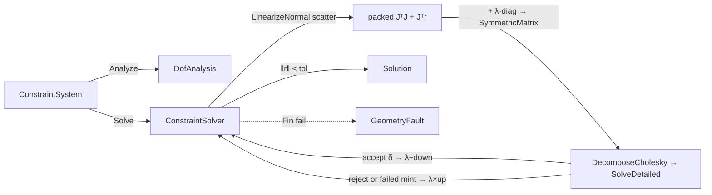

# [RASM_CONSTRAINTS_SOLVER]

ONE author-kernel geometric constraint solver that closes 2D/3D parametric-sketch solving over a `Constraint` `[Union]` (distance · angle · coincidence · parallel · perpendicular · tangent · horizontal/vertical · equal · symmetric) evaluated as ONE residual-and-Jacobian algebra and driven to a configuration by an author-kernel damped Gauss-Newton (Levenberg-Marquardt) iterate. No GPL solver is admitted (SolveSpace and NeoGeoSolver rejected), so the residual function, the per-constraint analytic partials, the normal-equations assembly, and the LM lambda-update loop are authored from first principles. The page owns `Entity` (the point/line/circle parametric primitive over a flat parameter vector), `Constraint` (the closed constraint algebra — every kind is a case, never a sibling solver), `DofAnalysis` (the structural rank/DOF verdict gating well-/under-/over-determination), `ConstraintSystem` (the entity-parameter ↔ constraint graph with its packed parameter vector), and `ConstraintSolver` (the LM `Solve` fold returning a `Solution`).

The solver composes `Vectors` `Point3d`/`Vector3d` coordinates as settled vocabulary (read, never re-mint) for entity geometry, composes the `Numerics/matrix.md` owners for every factorization — `SymmetricMatrix.DecomposeCholesky` → `CholeskyResult.SolveDetailed` for the SPD damped normal solve, `Matrix.DecomposeSvd` for the witness rank — because `MatrixKernel` is the ONE MathNet access path in the corpus and a direct `DenseMatrix`/`Cholesky` reach beside it is the named deleted form, routes every failure through the one `GeometryFault` union (band 2400, `Numerics/faults#FAULT_BAND`), and operates on raw `double` parameters inside the iterate because a sketch parameter is the domain's native scalar, not a unit-bearing quantity. The constraint graph, residual vector, Jacobian, and LM state never cross a transport; the only public output is a `Solution` carrier (converged parameter vector + the typed `ConstraintSolveReceipt` evidence — name-distinct from the `Rasm.Vectors` linear-solve `SolveReceipt` this page composes) consumed at the in-process seam.

## [01]-[INDEX]

- [01]-[CONSTRAINT_SOLVER]: Closed `Constraint` `[Union]` residual+Jacobian algebra over `Entity` parameters; `DofAnalysis` rank/DOF verdict; `ConstraintSystem` graph; author-kernel Levenberg-Marquardt `Solve` fold returning a `Solution`.

## [02]-[CONSTRAINT_SOLVER]

- Owner: `SketchEntityKind` `[SmartEnum<int>]` the parametric-primitive discriminant (`Point`/`Line`/`Circle`) carrying the per-kind parameter arity (a point is 2 params in 2D, a line is its two endpoints' 4 params, a circle is center+radius 3 params) — concept-specific so it never collides with the naming `EntityKind` (Vertex/Edge/Face) discriminant in the sibling `Rasm.Geometry.Naming` namespace; `Entity` the parametric primitive carrying its kind and its slice `[Offset, Offset+Arity)` into the system's flat `double[]` parameter vector — one entity algebra over every kind, the modality is the `Kind` column, never a `PointEntity`/`LineEntity`/`CircleEntity` triple; `Constraint` the closed `[Union]` constraint algebra (one case per geometric relation) whose ONE `Residual` member returns the constraint's scalar residual rows and whose ONE `Partials` member returns the analytic Jacobian entries for the parameters it touches — the constraint kind is a case, never a per-constraint solver; `ConstraintSystem` the immutable graph binding entities to their parameter offsets and carrying the constraint sequence plus the packed parameter vector; `DofAnalysis` the structural verdict (`free DOF = parameter count − independent constraint rows`) routing `WellConstrained`/`UnderConstrained`/`OverConstrained`; `LmState` the per-iterate carrier (parameters, residual norm, damping `lambda`); `Solution` the converged-parameter + `ConstraintSolveReceipt` result carrier; `ConstraintSolver` the static surface owning the `Analyze` DOF fold and the `Solve` LM iterate.
- Cases: `SketchEntityKind` rows `Point` (arity 2) · `Line` (arity 4) · `Circle` (arity 3) (3); `Constraint` cases `Distance` · `Angle` · `Coincident` · `Parallel` · `Perpendicular` · `Tangent` · `Axis` (horizontal/vertical, one case with an axis flag) · `Equal` · `Symmetric` (9); `DofAnalysis` verdicts `WellConstrained` · `UnderConstrained` · `OverConstrained` · `RedundantConsistent` (4 — the witness method's numeric-rank refinement adds `RedundantConsistent`, the redundant-but-consistent system the structural row count misclassifies as over-constrained); `SolveStatus` rows `Converged` · `Stalled` (2) — the singular outcome lives on the `Fin` failure rail as `GeometryFault.SingularSystem`, never a success-carrier status.
- Entry: `public static Fin<Solution> Solve(ConstraintSystem system, SolvePolicy policy)` — the ONE solve entrypoint; `Fin<T>` routes a band-2400 `GeometryFault.OverConstrained` when the DOF verdict is over-determined past the residual tolerance (a redundant-and-inconsistent system has no configuration and is a defect, never a silently-truncated solve) and `GeometryFault.SingularSystem` when the damped normal-equations matrix stays rank-deficient through the lambda ladder; a well- or under-constrained system always solves (an under-constrained system has a valid configuration manifold — LM finds the nearest one to the seed, never a fault). `public static DofAnalysis Analyze(ConstraintSystem system)` is the ONE pure total structural verdict folding the constraint rows against the free-parameter count. Both members are polymorphic over the `Constraint` union — no `SolveDistance`/`SolveAngle` sibling entrypoints.
- Auto: `Solve` folds every `Constraint.Residual` row over the current parameter vector into ONE sparse scatter that accumulates the packed-upper normal matrix `JᵀJ` and the gradient `Jᵀr` directly from the analytic partials (the dense `J` never materializes on the LM lane — only the witness rank builds it), then runs the author-kernel Levenberg-Marquardt iterate: each step forms the damped normal equations `(JᵀJ + λ·diag(JᵀJ))·δ = −Jᵀr` as a `matrix.md` `SymmetricMatrix` (the packed-upper owner whose `FlatIndex` addressing this scatter writes), solves for the step `δ` through `SymmetricMatrix.DecomposeCholesky` → `CholeskyResult.SolveDetailed` (the ONE MathNet access path — the minted linear-solve `SolveReceipt` gates the solution all-finite under its residual cap, so an indefinite-but-not-throwing factor FAILS the mint and the λ-ladder climbs instead of accepting a NaN step), and accepts the step when it reduces `‖r‖₂` — accepting divides `λ` by the down-factor (toward Gauss-Newton, fast quadratic convergence near the solution), rejecting multiplies `λ` by the up-factor (toward gradient descent, robust far from it) and re-solves without re-scattering; convergence is `‖r‖₂ < tolerance` or `‖δ‖₂` below the step floor (a stationary configuration), and the iterate stops at the policy cap with `Stalled`. Each `Constraint.Partials` writes only the columns its entities own, so a constraint never touches a parameter outside its entities' slices; the scatter ACCUMULATES rather than overwrites because a constraint arm legitimately emits one column twice for a shared or self-aliased entity, so the sparse sum into the packed entry never drops a partial. `Distance` and `Tangent` carry their residual in SQUARED form (`Δx²+Δy²−Target²`, `dist(center,line)²−radius²`) so the partials stay C¹ at coincident/zero-length configurations where the √-form Jacobian is undefined, and the LM step absorbs the scale. The `Constraint` union's `Residual`/`Partials` are ONE `Switch` fold each — the nine geometric relations are nine arms, never nine solver classes.
- Receipt: `Solve` returns the `Solution` carrying the converged parameter vector and the typed `ConstraintSolveReceipt` (final residual norm, iteration count, terminal `lambda`, the `SolveStatus`, the `DofAnalysis` verdict, and the per-constraint residual-row count) — the receipt is the solve evidence, never a generic `IReceipt`/ledger; a residual norm and an iteration count are the refined facts an LM run admits and the receipt carries exactly those, typed.
- Packages: `Rasm`/Vectors (`Point3d`/`Vector3d` — composed for entity geometry; `SymmetricMatrix`/`CholeskyResult`/`Matrix`/`SvdResult`/`Dimension` — the `Numerics/matrix.md` owners carrying the damped normal solve and the witness rank, composed never bypassed), Thinktecture.Runtime.Extensions (`[Union]`/`[SmartEnum]`), LanguageExt.Core (`Fin`/`Seq`/`Option`), BCL inbox.
- Growth: a new geometric relation (concentric, point-on-line, midpoint, the full parametric-sketch set) is ONE `Constraint` case carrying its `Residual` arm and its `Partials` arm over the same LM iterate — never a sibling solver; a new parametric primitive (arc, ellipse, spline control point) is ONE `SketchEntityKind` row with its parameter arity and one geometry accessor arm; a new convergence strategy (trust-region beside LM) is a `SolvePolicy` column on the same `Solve` fold, never a parallel `Solve` surface; a new DOF refinement (incremental DOF-based graph decomposition beside the witness rank verdict) is a `DofAnalysis` row or a `WitnessAnalyze` column, never a parallel analyzer; zero new surface.
- Boundary: the constraint set is ONE closed `Constraint` `[Union]` and a `DistanceConstraint`/`AngleConstraint`/`TangentConstraint` sibling-class family each carrying its own `Solve`/`Apply` is the named density defect collapsed here onto one union with one `Residual` fold and one `Partials` fold — the nine relations differ ONLY in their residual expression and their analytic partials, never in the iterate, so one LM `Solve` drives every kind; a per-constraint-type solver is the deleted form. The entity is ONE `Entity` over the `SketchEntityKind` discriminant and a `PointEntity`/`LineEntity`/`CircleEntity` triple is the deleted form — the modality is the `Kind` column and the parameter arity is its row value. The Jacobian is ANALYTIC (every `Partials` arm returns closed-form derivatives) and a finite-difference numerical Jacobian is the rejected form — a finite-difference perturbation loses precision and doubles the residual-eval count, so the analytic partials are mandatory and a numerically-differentiated constraint is the named defect. The linear solve composes the `Numerics/matrix.md` `SymmetricMatrix.DecomposeCholesky` → `CholeskyResult.SolveDetailed` owners over the SPD damped normal matrix — `MatrixKernel` is the ONE MathNet access path, so a direct `DenseMatrix`/`Cholesky` reach here, a hand-rolled Gaussian elimination, or a second dense factorization beside the owner is the deleted form; the normal-equations formulation `(JᵀJ + λD)` is chosen over a QR-on-J solve because the LM damping is naturally expressed on the normal matrix diagonal, the damped matrix is always SPD (factorizable by Cholesky without pivoting), and the packed-upper `SymmetricMatrix` IS its natural carrier. The DOF analysis is structural-rank-based (independent constraint rows vs free parameters) and gates the rail: an over-determined-and-inconsistent system routes `GeometryFault.OverConstrained` rather than returning a meaningless least-squares fit silently, while an under-determined system solves to the nearest configuration on its solution manifold (LM's Gauss-Newton step is the minimum-norm step under rank deficiency damped by `lambda`); a thrown solver exception is forbidden — every failure routes the `Fin` rail over the band-2400 `GeometryFault` union (`SingularSystem`, `OverConstrained` — the only two reachable solve faults, since the accept-only λ-ladder never grows the residual, so no divergence case exists), where `GeometryFault.SingularSystem(...).ToError()` is the `Fin<T>` failure channel and no separate error type sits in the rail. The parameters are raw `double` inside the iterate because a sketch coordinate is the domain's native scalar carried at the seam by `Point3d`, and a unit-bearing quantity in a residual or Jacobian signature is the named seam violation; the `ConstraintSystem` is immutable and `Solve` returns the converged parameter vector as a new packed array, never an in-place mutation of the seed.

```csharp signature
// --- [RUNTIME_PRELUDE] --------------------------------------------------------------------
using LanguageExt;
using LanguageExt.Common;
using Rasm.Vectors;
using Rhino.Geometry;
using Thinktecture;
using static LanguageExt.Prelude;

namespace Rasm.Geometry.Constraints;

// --- [TYPES] ------------------------------------------------------------------------------
[SmartEnum<int>]
public sealed partial class SketchEntityKind {
    public static readonly SketchEntityKind Point  = new(key: 0, arity: 2);
    public static readonly SketchEntityKind Line   = new(key: 1, arity: 4);
    public static readonly SketchEntityKind Circle = new(key: 2, arity: 3);

    public int Arity { get; }
}

[SmartEnum<int>]
public sealed partial class DofAnalysis {
    public static readonly DofAnalysis WellConstrained     = new(key: 0);
    public static readonly DofAnalysis UnderConstrained    = new(key: 1);
    public static readonly DofAnalysis OverConstrained     = new(key: 2);
    public static readonly DofAnalysis RedundantConsistent = new(key: 3);
}

[SmartEnum<int>]
public sealed partial class SolveStatus {
    public static readonly SolveStatus Converged = new(key: 0);
    public static readonly SolveStatus Stalled   = new(key: 1);
}

// --- [MODELS] -----------------------------------------------------------------------------
public readonly record struct Entity(SketchEntityKind Kind, int Offset) {
    public int Arity => Kind.Arity;

    public Point3d Origin(ReadOnlySpan<double> p) => new(p[Offset], p[Offset + 1], 0.0);

    public Point3d End(ReadOnlySpan<double> p) => new(p[Offset + 2], p[Offset + 3], 0.0);

    public Vector3d Direction(ReadOnlySpan<double> p) => End(p) - Origin(p);
    public double Radius(ReadOnlySpan<double> p) => p[Offset + 2];
}

public readonly record struct ResidualRow(double Value, Seq<(int Column, double Partial)> Partials);

[ValueObject<double>(KeyMemberName = "Value", KeyMemberAccessModifier = AccessModifier.Public)]
public readonly partial struct Tolerance {
    static partial void ValidateFactoryArguments(ref ValidationError? validationError, ref double value) =>
        validationError = value > 0.0 ? null : new ValidationError("Tolerance must be > 0.");
}

public sealed record SolvePolicy(
    double InitialLambda,
    double LambdaUp,
    double LambdaDown,
    Tolerance ResidualTolerance,
    double StepFloor,
    int MaxIterations) {
    public static readonly SolvePolicy Canonical = new(
        InitialLambda: 1e-3, LambdaUp: 10.0, LambdaDown: 10.0,
        ResidualTolerance: Tolerance.From(1e-10), StepFloor: 1e-12, MaxIterations: 100);
}

public sealed record ConstraintSystem(
    Seq<Entity> Entities,
    Seq<Constraint> Constraints,
    double[] Seed,
    int ParameterCount) {
    public static ConstraintSystem Build(Seq<(SketchEntityKind Kind, double[] Initial)> entities, Seq<Constraint> constraints) {
        int offset = 0;
        var placed = entities.Map(e => { var entity = new Entity(e.Kind, offset); offset += e.Kind.Arity; return entity; });
        var seed = new double[offset];
        int cursor = 0;
        foreach (var e in entities) { e.Initial.CopyTo(seed, cursor); cursor += e.Kind.Arity; }
        return new ConstraintSystem(placed, constraints, seed, offset);
    }
}

public readonly record struct LmState(double[] Parameters, double ResidualNorm, double Lambda);

public readonly record struct LmResult(double[] Parameters, double Norm, int Iterations, double Lambda, SolveStatus Status);

public sealed record ConstraintSolveReceipt(
    SolveStatus Status,
    DofAnalysis Dof,
    double ResidualNorm,
    int Iterations,
    double TerminalLambda,
    int ResidualRows);

public sealed record Solution(double[] Parameters, ConstraintSolveReceipt Receipt);

// --- [OPERATIONS] -------------------------------------------------------------------------
[Union(ConversionFromValue = ConversionOperatorsGeneration.None)]
public abstract partial record Constraint {
    private Constraint() { }

    public sealed record Distance(Entity A, Entity B, double Target) : Constraint;
    public sealed record Angle(Entity A, Entity B, double Radians) : Constraint;
    public sealed record Coincident(Entity A, Entity B) : Constraint;
    public sealed record Parallel(Entity A, Entity B) : Constraint;
    public sealed record Perpendicular(Entity A, Entity B) : Constraint;
    public sealed record Tangent(Entity Line, Entity Circle) : Constraint;
    public sealed record Axis(Entity Line, bool Horizontal) : Constraint;
    public sealed record Equal(Entity A, Entity B) : Constraint;
    public sealed record Symmetric(Entity A, Entity B, Entity Axis) : Constraint;

    public Seq<ResidualRow> Residual(ReadOnlySpan<double> p) =>
        this switch {
            Distance d   => Seq(DistanceRow(d.A, d.B, d.Target, p)),
            Angle a      => Seq(AngleRow(a.A, a.B, a.Radians, p)),
            Coincident c => CoincidentRows(c.A, c.B, p),
            Parallel pl  => Seq(CrossRow(pl.A, pl.B, p)),
            Perpendicular pp => Seq(DotRow(pp.A, pp.B, p)),
            Tangent t    => Seq(TangentRow(t.Line, t.Circle, p)),
            Axis ax      => Seq(AxisRow(ax.Line, ax.Horizontal, p)),
            Equal eq     => Seq(EqualRow(eq.A, eq.B, p)),
            Symmetric s  => SymmetricRows(s.A, s.B, s.Axis, p),
            _            => Seq<ResidualRow>(),
        };

    // --- [RESIDUAL_ROWS]
    static ResidualRow DistanceRow(Entity a, Entity b, double target, ReadOnlySpan<double> p) {
        Point3d pa = a.Origin(p), pb = b.Origin(p);
        double dx = pa.X - pb.X, dy = pa.Y - pb.Y;
        double r = dx * dx + dy * dy - target * target;
        return new ResidualRow(r, Seq(
            (a.Offset, 2.0 * dx), (a.Offset + 1, 2.0 * dy),
            (b.Offset, -2.0 * dx), (b.Offset + 1, -2.0 * dy)));
    }

    static ResidualRow AngleRow(Entity a, Entity b, double radians, ReadOnlySpan<double> p) {
        Vector3d u = a.Direction(p), v = b.Direction(p);
        double cross = u.X * v.Y - u.Y * v.X, dot = u.X * v.X + u.Y * v.Y;
        double denom = cross * cross + dot * dot;
        double inv = denom > 1e-18 ? 1.0 / denom : 0.0;
        double r = Math.Atan2(cross, dot) - radians;
        double dAux = (v.Y * dot - v.X * cross) * inv, dAuy = (-v.X * dot - v.Y * cross) * inv;
        double dBvx = (-u.Y * dot + u.X * cross) * inv, dBvy = (u.X * dot + u.Y * cross) * inv;
        return new ResidualRow(r, Seq(
            (a.Offset, -dAux), (a.Offset + 1, -dAuy), (a.Offset + 2, dAux), (a.Offset + 3, dAuy),
            (b.Offset, -dBvx), (b.Offset + 1, -dBvy), (b.Offset + 2, dBvx), (b.Offset + 3, dBvy)));
    }

    static Seq<ResidualRow> CoincidentRows(Entity a, Entity b, ReadOnlySpan<double> p) {
        Point3d pa = a.Origin(p), pb = b.Origin(p);
        return Seq(
            new ResidualRow(pa.X - pb.X, Seq((a.Offset, 1.0), (b.Offset, -1.0))),
            new ResidualRow(pa.Y - pb.Y, Seq((a.Offset + 1, 1.0), (b.Offset + 1, -1.0))));
    }

    static ResidualRow CrossRow(Entity a, Entity b, ReadOnlySpan<double> p) {
        Vector3d u = a.Direction(p), v = b.Direction(p);
        double r = u.X * v.Y - u.Y * v.X;
        return new ResidualRow(r, Seq(
            (a.Offset, -v.Y), (a.Offset + 1, v.X), (a.Offset + 2, v.Y), (a.Offset + 3, -v.X),
            (b.Offset, u.Y), (b.Offset + 1, -u.X), (b.Offset + 2, -u.Y), (b.Offset + 3, u.X)));
    }

    static ResidualRow DotRow(Entity a, Entity b, ReadOnlySpan<double> p) {
        Vector3d u = a.Direction(p), v = b.Direction(p);
        double r = u.X * v.X + u.Y * v.Y;
        return new ResidualRow(r, Seq(
            (a.Offset, -v.X), (a.Offset + 1, -v.Y), (a.Offset + 2, v.X), (a.Offset + 3, v.Y),
            (b.Offset, -u.X), (b.Offset + 1, -u.Y), (b.Offset + 2, u.X), (b.Offset + 3, u.Y)));
    }

    static ResidualRow TangentRow(Entity line, Entity circle, ReadOnlySpan<double> p) {
        Point3d s = line.Origin(p), e = line.End(p), c = circle.Origin(p);
        double radius = circle.Radius(p);
        double dx = e.X - s.X, dy = e.Y - s.Y;
        double cx = c.X - s.X, cy = c.Y - s.Y;
        double cross = dx * cy - dy * cx;
        double len2 = dx * dx + dy * dy;
        double invLen2 = len2 > 1e-18 ? 1.0 / len2 : 0.0;
        double r = cross * cross * invLen2 - radius * radius;
        double g = cross * cross, gh = g * invLen2 * invLen2;
        double dStartX = (2.0 * cross * (dy * 1.0 - cy * 0.0 + (-cy)) * invLen2) - gh * (-2.0 * dx);
        double dStartY = (2.0 * cross * (-dx + cx) * invLen2) - gh * (-2.0 * dy);
        double dEndX = (2.0 * cross * cy * invLen2) - gh * (2.0 * dx);
        double dEndY = (2.0 * cross * (-cx) * invLen2) - gh * (2.0 * dy);
        double dCenterX = 2.0 * cross * (-dy) * invLen2;
        double dCenterY = 2.0 * cross * dx * invLen2;
        return new ResidualRow(r, Seq(
            (line.Offset, dStartX), (line.Offset + 1, dStartY), (line.Offset + 2, dEndX), (line.Offset + 3, dEndY),
            (circle.Offset, dCenterX), (circle.Offset + 1, dCenterY), (circle.Offset + 2, -2.0 * radius)));
    }

    static ResidualRow AxisRow(Entity line, bool horizontal, ReadOnlySpan<double> p) {
        Point3d s = line.Origin(p), e = line.End(p);
        return horizontal
            ? new ResidualRow(e.Y - s.Y, Seq((line.Offset + 1, -1.0), (line.Offset + 3, 1.0)))
            : new ResidualRow(e.X - s.X, Seq((line.Offset, -1.0), (line.Offset + 2, 1.0)));
    }

    static ResidualRow EqualRow(Entity a, Entity b, ReadOnlySpan<double> p) {
        if (a.Kind == SketchEntityKind.Circle && b.Kind == SketchEntityKind.Circle) {
            double ra = a.Radius(p), rb = b.Radius(p);
            return new ResidualRow(ra - rb, Seq((a.Offset + 2, 1.0), (b.Offset + 2, -1.0)));
        }
        Vector3d u = a.Direction(p), v = b.Direction(p);
        double r = (u.X * u.X + u.Y * u.Y) - (v.X * v.X + v.Y * v.Y);
        return new ResidualRow(r, Seq(
            (a.Offset, -2.0 * u.X), (a.Offset + 1, -2.0 * u.Y), (a.Offset + 2, 2.0 * u.X), (a.Offset + 3, 2.0 * u.Y),
            (b.Offset, 2.0 * v.X), (b.Offset + 1, 2.0 * v.Y), (b.Offset + 2, -2.0 * v.X), (b.Offset + 3, -2.0 * v.Y)));
    }

    static Seq<ResidualRow> SymmetricRows(Entity a, Entity b, Entity axis, ReadOnlySpan<double> p) {
        Point3d pa = a.Origin(p), pb = b.Origin(p), s = axis.Origin(p), e = axis.End(p);
        double ax = e.X - s.X, ay = e.Y - s.Y;
        double mx = 0.5 * (pa.X + pb.X) - s.X, my = 0.5 * (pa.Y + pb.Y) - s.Y;
        double onAxis = ax * my - ay * mx;
        double chordX = pa.X - pb.X, chordY = pa.Y - pb.Y;
        double perp = chordX * ax + chordY * ay;
        return Seq(
            new ResidualRow(onAxis, Seq(
                (a.Offset, 0.5 * ax), (a.Offset + 1, -0.5 * ay), (b.Offset, 0.5 * ax), (b.Offset + 1, -0.5 * ay),
                (axis.Offset, my + ay), (axis.Offset + 1, -(mx + ax)), (axis.Offset + 2, -my), (axis.Offset + 3, mx))),
            new ResidualRow(perp, Seq(
                (a.Offset, ax), (a.Offset + 1, ay), (b.Offset, -ax), (b.Offset + 1, -ay),
                (axis.Offset, -chordX), (axis.Offset + 1, -chordY), (axis.Offset + 2, chordX), (axis.Offset + 3, chordY))));
    }
}

public static class ConstraintSolver {
    // λ past this ceiling proves the damped normal matrix stays rank-deficient through the ladder.
    const double LambdaCeiling = 1e12;

    public static DofAnalysis Analyze(ConstraintSystem system) => Analyze(system, ResidualRowCount(system));

    public static DofAnalysis Analyze(ConstraintSystem system, int residualRows) =>
        residualRows > system.ParameterCount ? DofAnalysis.OverConstrained
        : residualRows < system.ParameterCount ? DofAnalysis.UnderConstrained
        : DofAnalysis.WellConstrained;

    public static DofAnalysis WitnessAnalyze(ConstraintSystem system) {
        (int rows, double[] r, Fin<Matrix> jacobian) = LinearizeDense(system, system.Seed);
        return jacobian.Bind(static j => j.DecomposeSvd()).Match(
            Succ: svd => rows <= svd.Rank
                ? system.ParameterCount - svd.Rank > 0 ? DofAnalysis.UnderConstrained : DofAnalysis.WellConstrained
                : ConsistentAtWitness(svd, r, rows)
                    ? DofAnalysis.RedundantConsistent
                    : DofAnalysis.OverConstrained,
            Fail: _ => Analyze(system, rows));
    }

    // Left-null-space projection ‖U_tailᵀ·r‖ read off the owner's SvdResult: U columns past Rank span null(Jᵀ).
    static bool ConsistentAtWitness(SvdResult svd, double[] r, int rows) {
        double rNorm = 0.0;
        for (int i = 0; i < rows; i++) rNorm += r[i] * r[i];
        double tail = 0.0;
        for (int k = svd.Rank; k < rows; k++) {
            double dot = 0.0;
            for (int i = 0; i < rows; i++) dot += svd.U.At(i, k) * r[i];
            tail += dot * dot;
        }
        return Math.Sqrt(tail) <= 1e-9 * Math.Max(Math.Sqrt(rNorm), 1.0);
    }

    static int ResidualRowCount(ConstraintSystem system) {
        int rows = 0;
        foreach (Constraint constraint in system.Constraints) rows += constraint.Residual(system.Seed).Count;
        return rows;
    }

    public static Fin<Solution> Solve(ConstraintSystem system, SolvePolicy policy) {
        int rows = ResidualRowCount(system);
        DofAnalysis dof = WitnessAnalyze(system);
        var seed = (double[])system.Seed.Clone();
        var initial = new LmState(seed, ResidualNorm(system, seed), policy.InitialLambda);
        return Iterate(system, policy, initial, 0).Match(
            Succ: state => dof == DofAnalysis.OverConstrained && state.Norm >= policy.ResidualTolerance.Value
                ? Fin.Fail<Solution>(GeometryFault.OverConstrained(rows - system.ParameterCount, state.Norm).ToError())
                : Fin.Succ(new Solution(state.Parameters, new ConstraintSolveReceipt(state.Status, dof, state.Norm, state.Iterations, state.Lambda, rows))),
            Fail: error => Fin.Fail<Solution>(error));
    }

    static Fin<LmResult> Iterate(
        ConstraintSystem system, SolvePolicy policy, LmState state, int iteration) {
        if (state.ResidualNorm < policy.ResidualTolerance.Value)
            return Fin.Succ(new LmResult(state.Parameters, state.ResidualNorm, iteration, state.Lambda, SolveStatus.Converged));
        if (iteration >= policy.MaxIterations)
            return Fin.Succ(new LmResult(state.Parameters, state.ResidualNorm, iteration, state.Lambda, SolveStatus.Stalled));

        (double[] normal, double[] gradient) = LinearizeNormal(system, state.Parameters);
        return Step(system, policy, state, normal, gradient, iteration);
    }

    static Fin<LmResult> Step(
        ConstraintSystem system, SolvePolicy policy, LmState state,
        double[] packedNormal, double[] gradient, int iteration) {
        int n = system.ParameterCount;
        if (state.Lambda > LambdaCeiling) {
            (_, _, Fin<Matrix> jacobian) = LinearizeDense(system, state.Parameters);
            int rank = jacobian.Bind(static j => j.DecomposeSvd()).Match(Succ: static svd => svd.Rank, Fail: _ => 0);
            return Fin.Fail<LmResult>(GeometryFault.SingularSystem(rank, n).ToError());
        }

        double[] damped = (double[])packedNormal.Clone();
        for (int i = 0; i < n; i++) damped[PackedIndex(n, i, i)] = packedNormal[PackedIndex(n, i, i)] * (1.0 + state.Lambda);
        double[] rhs = new double[n];
        for (int i = 0; i < n; i++) rhs[i] = -gradient[i];

        // The ONE MathNet access path: the minted linear-solve SolveReceipt gates the step all-finite
        // under its residual cap, so an indefinite factor fails the mint and the λ-ladder climbs.
        Fin<Arr<double>> solve = SymmetricMatrix.Of(Dimension.Create(n), new Arr<double>(damped))
            .Bind(static spd => spd.DecomposeCholesky())
            .Bind(chol => chol.SolveDetailed(new Arr<double>(rhs)))
            .Map(static receipt => receipt.Solution);
        return solve.Match(
            Succ: delta => {
                var trial = Apply(state.Parameters, delta);
                double trialNorm = ResidualNorm(system, trial);
                double stepSquared = 0.0;
                for (int i = 0; i < n; i++) stepSquared += delta[i] * delta[i];
                return trialNorm < state.ResidualNorm
                    ? Math.Sqrt(stepSquared) < policy.StepFloor
                        ? Fin.Succ(new LmResult(trial, trialNorm, iteration + 1, state.Lambda, SolveStatus.Converged))
                        : Iterate(system, policy, new LmState(trial, trialNorm, state.Lambda / policy.LambdaDown), iteration + 1)
                    : Step(system, policy, state with { Lambda = state.Lambda * policy.LambdaUp }, packedNormal, gradient, iteration);
            },
            Fail: _ => Step(system, policy, state with { Lambda = state.Lambda * policy.LambdaUp }, packedNormal, gradient, iteration));
    }

    // ONE scatter, two folds: the LM lane accumulates packed-upper JᵀJ + Jᵀr straight from the analytic
    // partials (no dense J materializes); the witness lane below builds the dense J for the SVD rank.
    static (double[] PackedNormal, double[] Gradient) LinearizeNormal(ConstraintSystem system, double[] parameters) {
        int n = system.ParameterCount;
        double[] normal = new double[n * (n + 1) / 2];
        double[] gradient = new double[n];
        foreach (Constraint constraint in system.Constraints) {
            foreach (ResidualRow row in constraint.Residual(parameters)) {
                foreach ((int ci, double pi) in row.Partials) {
                    gradient[ci] += pi * row.Value;
                    foreach ((int cj, double pj) in row.Partials) {
                        if (cj >= ci) normal[PackedIndex(n, ci, cj)] += pi * pj;
                    }
                }
            }
        }
        return (normal, gradient);
    }

    static (int Rows, double[] Residual, Fin<Matrix> Jacobian) LinearizeDense(ConstraintSystem system, double[] parameters) {
        int n = system.ParameterCount;
        List<ResidualRow> allRows = [];
        foreach (Constraint constraint in system.Constraints) allRows.AddRange(constraint.Residual(parameters));
        double[] r = new double[allRows.Count];
        double[] j = new double[allRows.Count * n];
        for (int row = 0; row < allRows.Count; row++) {
            r[row] = allRows[row].Value;
            foreach (var (column, partial) in allRows[row].Partials) j[(row * n) + column] += partial;
        }
        return (allRows.Count, r, Matrix.Of(Dimension.Create(allRows.Count), Dimension.Create(n), new Arr<double>(j)));
    }

    // Mirrors the SymmetricMatrix packed-upper FlatIndex so the scatter writes the owner's own layout.
    static int PackedIndex(int n, int i, int j) => (i * n) - (i * (i - 1) / 2) + (j - i);

    static double[] Apply(double[] parameters, Arr<double> delta) {
        var next = (double[])parameters.Clone();
        for (int i = 0; i < next.Length; i++) next[i] += delta[i];
        return next;
    }

    static double ResidualNorm(ConstraintSystem system, double[] parameters) {
        double sum = 0.0;
        foreach (Constraint constraint in system.Constraints) {
            foreach (ResidualRow row in constraint.Residual(parameters)) sum += row.Value * row.Value;
        }
        return Math.Sqrt(sum);
    }
}
```



## [03]-[DENSITY_BAR]

One owner per axis; capability is a case or row, never a sibling surface. The `[RAIL]` cell names the one return rail each owner exposes — pure verdicts where the result is total (`Analyze`, `Residual`/`Partials`), `Fin` where a `GeometryFault` (band 2400) can route (`Solve`).

| [INDEX] | [AXIS/CONCERN]       | [OWNER]            | [KIND]                                                                                                        | [RAIL]                                                 | [CASES] |
| :-----: | :------------------- | :----------------- | :------------------------------------------------------------------------------------------------------------ | :----------------------------------------------------- | :-----: |
|  [01]   | Parametric primitive | `Entity`           | `record` over `SketchEntityKind` `[SmartEnum<int>]` (Point/Line/Circle) + slice accessors                     | `Entity.Origin → Point3d` (pure)                       |    3    |
|  [02]   | Constraint algebra   | `Constraint`       | `[Union]` (9 cases) + one `Residual` fold + analytic `Partials` per arm                                       | `Constraint.Residual → Seq<ResidualRow>` (pure)        |    9    |
|  [03]   | DOF verdict          | `DofAnalysis`      | `[SmartEnum<int>]` Well/Under/Over/RedundantConsistent + structural `Analyze` + numeric-rank `WitnessAnalyze` | `ConstraintSolver.WitnessAnalyze → DofAnalysis` (pure) |    4    |
|  [04]   | Constraint graph     | `ConstraintSystem` | immutable entity↔constraint graph + packed parameter vector + `Build`                                         | `ConstraintSystem.Build → ConstraintSystem` (pure)     |    —    |
|  [05]   | LM solver            | `ConstraintSolver` | static surface + `Solve` Levenberg-Marquardt iterate (damped normal eqns, λ ladder)                           | `ConstraintSolver.Solve → Fin<Solution>`               |    2    |

The closed `Constraint` union, the analytic residual+Jacobian algebra, the structural DOF verdict, and the Levenberg-Marquardt iterate are pure-managed author-kernel, fully transcribed and depending on no live-host member spelling (`Point3d.X/Y`, `Vector3d`, and the `Rasm.Vectors` `SymmetricMatrix`/`Matrix` owners are stable vocabulary). No tier-3 native gate: the solver is pure-managed, the linear solve composes the `Numerics/matrix.md` owners as the one MathNet access path, and the entire iterate is mathematically defined over IEEE-754 doubles.

## [04]-[RESEARCH]

- [LM_CONVERGENCE] — the configuration-reachability law-matrix the spec rail asserts. The harness is `ConstraintLaws` (a CsCheck property suite under `testing-cs`): it generates random well- and under-constrained sketches (entity sets plus a constraint graph whose residual-row count is ≤ parameter count) from a perturbed feasible seed and asserts (1) `Solve` returns `SolveStatus.Converged` with `‖r‖₂ < tolerance` for every feasible system — every analytic constraint residual reaches zero from the seed under the LM ladder; (2) the analytic Jacobian matches a central-finite-difference Jacobian at random parameter vectors to within the FD truncation bound (the analytic `Partials` are the correctness anchor — a drifted partial is caught here, never in production); (3) an over-constrained-inconsistent system (a distance and an axis constraint that cannot both hold) routes `GeometryFault.OverConstrained` rather than returning a meaningless fit; (4) the solve is invariant under a rigid transform of the seed (translating every entity offsets the converged solution by the same transform, never flips convergence); (5) idempotence — re-solving a converged system returns it unchanged at iteration 0. The harness needs NO live-host probe — `Point3d`, `Vector3d`, and the `Rasm.Vectors` matrix owners are stable. The one residual the harness watches is the singular-Jacobian path: a degenerate constraint graph (e.g. a zero-length line in a `Parallel` constraint) makes `JᵀJ` rank-deficient, and the λ-ladder must climb to `SingularSystem` rather than loop — confirming the ladder terminates on the rank-deficient damped matrix before the `LambdaCeiling` is the sole convergence-edge probe, and it gates the singular row, never the feasible-system path. The reject recursion in `Step` does NOT increment `iteration` (an LM reject is not an outer iteration), so the inner reject chain is bounded ONLY by the λ ceiling: the harness asserts an explicit worst-case step budget of `MaxIterations × ⌈log_{LambdaUp}(LambdaCeiling / InitialLambda)⌉` (≈ 100 × 15 inner solves under `Canonical`) and that the reject chain always terminates at the ceiling, never unbounded. The singular-recovery mechanism is now DOUBLE-gated through the owner: `MatrixKernel.CholeskySolve` mints its `SolveReceipt` only when the solution is all-finite under the `√SqrtEpsilon` residual cap, so an indefinite-but-not-throwing damped factor FAILS the mint (`Fin.Fail` ⇒ climb λ) before any trial evaluates, and the `trialNorm < state.ResidualNorm` accept test remains the second guard (NaN comparisons are false ⇒ reject ⇒ climb λ); the probe perturbs toward an indefinite damped matrix — not a throwing one — to confirm the receipt gate rejects it and the λ-climb recovers before the ceiling.
- [WITNESS_DOF] — `WitnessAnalyze` is the witness-configuration DOF refinement beside the structural `Analyze` row count: it linearizes the system at the seed (the witness — a known feasible configuration), reads the NUMERIC Jacobian rank `J(p₀).Rank()`, and computes the true DOF as `ParameterCount − numericRank`, then distinguishes the structurally-over-determined system the row count misclassifies — when the row count exceeds the parameter count but the numeric rank is full and the residual lies in the column space of `J` (`ConsistentAtWitness` projects the residual onto the left-null space via the `SvdResult.U` tail columns and checks it vanishes), the system is `RedundantConsistent` (redundant constraints that all hold — solvable, not a fault), otherwise it is genuinely `OverConstrained`. The witness rank distinguishes redundant-but-consistent from structurally-determined exactly where the structural count is blind (a distance constraint that duplicates a coincidence-implied distance is redundant-consistent; a distance that contradicts an axis is over-constrained-inconsistent). The `Solve` rail reads `WitnessAnalyze` so a `RedundantConsistent` system solves rather than routing `OverConstrained`, and the verdict feeds the UI over-constraint diagnosis (the specific over-constraining constraint is the one whose removal restores full rank — a future `DofAnalysis` column). The tier-2 law-matrix asserts `WitnessAnalyze` returns `RedundantConsistent` on a redundant-but-consistent system, `OverConstrained` on a redundant-and-inconsistent one, and agrees with the structural `Analyze` on full-rank well/under systems; the witness rank composes the `Numerics/matrix.md` `Matrix.DecomposeSvd`/`SvdResult.Rank` owners, no host probe.
