# [RASM_FITTING_FIT]

The robust geometric primitive-fit owner of `Rasm.Geometry.Fitting` — ONE `FitOp` request (a `Seq<FitKind>` kind set over one cloud) that recovers the best-fit analytic primitive from a noisy `Point3d` cloud by a Schnabel-Wahl-Klein efficient-RANSAC sampler under a truncated-cost robust consensus, then refines the winner to its geometric-orthogonal-distance minimum by INSTANTIATING the `Solving/solver#LM_FUNCTOR` `Lm.Minimize` λ-ladder through a `FitModel : ILmModel` — a primitive fit is ONE entity over a residual-row-per-point system, and this page owns ZERO iterate code: the λ seed, the up/down factors, the ceiling, the carry-down-on-accept, and the all-finite step gate all live on the functor. The kind axis is DATA, not case structure: a single-kind request passes one `FitKind`, a multi-kind detection passes several, and the lowest truncated cost under the shared threshold selects the winning model — the efficient-RANSAC multi-model discrimination the `Rasm.Bim` reconstruction reads (a wall segment competes plane-against-cylinder in one call).

The spatial-locality structure is the settled `Spatial/neighbors#NEIGHBOR_INDEX` kd-tree lane: `NeighborIndex.Of(NeighborSource.StaticCase)` builds the `Supercluster.KDTree.Net` static tier ONCE over the cloud, `NeighborKernel.GraphOf` serves the NAPSAC local-neighborhood draw (a seed point's neighborhood is far likelier all-inlier than a global uniform draw on a multi-structure scan) AND the bounded-support score prefilter (a sphere/torus candidate's inliers live inside one ball, so the truncated cost evaluates the ball population and charges every outside point exactly `t²` by the saturation identity — the full-cloud M-estimator reduce, pruned without approximation). The per-kind minimal solvers seed the cylinder/cone/torus axis from the per-point `FitOp.Normals` oriented-normal field — the `Vectors` `VectorCloudMetric.OrientedNormals` MST-oriented surface a scan pipeline computes UPSTREAM of the `FitOp` boundary — and the PROSAC quality prior reads that field's confidence when present, else the ONE `CloudKernel.CovarianceOf` covariance fold (composed, never a second covariance owner) ranks the draw front by global-principal-frame residual.

The owner composes `Vectors` `Point3d`/`Vector3d`/`Plane`/`Sphere`/`Cylinder`/`Cone`/`Line` values as SETTLED vocabulary — read, compose, never re-mint — routes the minimal-sphere `Matrix.SolveDetailed` 3×3 and the cone-apex `Matrix.LeastSquaresDetailed` thin-QR through the `Numerics/matrix` owners with the caller's `Op? key` threaded into every call, and routes every reachable failure through the band-2400 `GeometryFault` union (`FitFault` 2428, `DegenerateInput` 2400 with typed `Kind` discriminants). Every consensus draw is deterministic under the seeded `FitPolicy.Seed` `Random` so a scan-to-BIM reconstruction is reproducible. The `FitReceipt`/`FitPrimitive` records ARE the hash-friendly immutable records the `Spatial/reconciliation` `Encode` content-addresses through the `Vectors` seam; this owner computes no hash and mints no second identity.

## [01]-[INDEX]

- [02]-[FITTING]: `FitKind` the deep per-kind vocabulary (arity columns + `Carrier` + `NeedsNormals` + the `Minimal`/`Unpack` delegate rows); `FitPrimitive` `[Union]` (`Plane`/`Sphere`/`Cylinder`/`Cone`/`Torus`/`Line`) with generated-`Switch` `Distance`/`Gradient`/`Pack`/`Support` folds; `ConsensusScore`/`DrawOrder` the cost and draw vocabularies; `FitOp` the one request record; the `Fit.Apply` fold composing accumulating admission, the kd-tree lane, the truncated-cost sampler, and the `Lm.Minimize` instantiation; the typed `FitReceipt` evidence.

## [02]-[FITTING]

- Owner: `FitKind` `[SmartEnum<string>]` the primitive-kind vocabulary binding the shipped `ComparerAccessors.StringOrdinal` string-key comparer (`plane`/`sphere`/`cylinder`/`cone`/`torus`/`line`), each row carrying `MinimalSamples` (the smallest point set that pins a candidate — plane 3 · sphere 4 · cylinder 6 · cone 7 · torus 8 · line 2), `FreeParameters` (the LM chart dimension — plane 3 · sphere 4 · cylinder 6 · cone 6 · torus 7 · line 4), `NeedsNormals` (cone/torus demand the oriented-normal field), `Carrier` (the `Rasm.Domain` `Kind` row typed admission faults mint), and the two `[UseDelegateFromConstructor]` behavior rows — `Minimal` (the closed-form minimal solver) and `Unpack` (the chart-to-primitive rebuild) — so kind selection is vocabulary data and a kind-keyed dictionary restating these rows is the deleted form; `FitPrimitive` `[Union]` `Plane`/`Sphere`/`Cylinder`/`Cone`/`Torus`/`Line` each carrying its `Vectors` analytic value, with FOUR generated-`Switch` folds — `Kind` (discriminant), `Distance` (signed orthogonal distance), `Gradient` (the analytic orthogonal-distance-regression partials returned as a stack `PartialRow` `[InlineArray]` — the closed-form Jacobian row, filled in `Pack` order), `Pack` (chart projection), and `Support` (the bounded-support ball a sphere/torus candidate exposes for the score prefilter) — the fitted geometry is a case, never a `PlaneFit`/`SphereFit` parallel record family; `ConsensusScore` `[SmartEnum<int>]` the per-point cost row (`Mlesac` truncated quadratic as a `[UseDelegateFromConstructor]` `Cost` delegate — a MAGSAC marginalized cost is one future row on the same sampler); `DrawOrder` `[SmartEnum<int>]` the draw-strategy vocabulary (`Uniform` · `QualityFront` the PROSAC quality-ordered front · `Neighborhood` the NAPSAC seeded local draw) — cost and order are ORTHOGONAL axes over one sampler, never conflated rows; `FitPolicy` the policy record; `FitOp` the ONE request record (`Seq<FitKind> Kinds`, `Point3d[] Cloud`, `Option<Vector3d[]> Normals`, `FitPolicy Policy`) — six identical-payload kind cases collapse onto the kind-as-data field, and single-versus-multi-kind is the `Kinds` arity, never sibling requests; `Candidate` the consensus carrier; `FitModel` the `ILmModel` instantiation; `FitReceipt` the typed evidence; `Fit` the static surface.
- Cases: `FitKind` rows 6; `FitPrimitive` cases 6; `ConsensusScore` rows 1 (`Mlesac`); `DrawOrder` rows 3 (`Uniform`/`QualityFront`/`Neighborhood`). Every kind shares ONE sampler, ONE scorer, and ONE refine — a kind contributes exactly one `Minimal` row, one `Unpack` row, one `Distance` arm, one `Gradient` arm, and one `Support` arm.
- Entry: `public static Fin<FitReceipt> Apply(FitOp op, Context tolerance, Op? key = null)` — the ONE fitting entrypoint (`tolerance` is the model `Context` whose `Absolute` band sets the MLESAC inlier threshold through `FitPolicy.Threshold` and the LM convergence floor, never a domain-local epsilon literal). Admission ACCUMULATES: an empty kind set, a cloud smaller than the largest requested `MinimalSamples`, every non-finite cloud point BY INDEX, a normals/cloud arity mismatch, every non-finite normal by index, and a `NeedsNormals` kind requested without a normal field report TOGETHER through one `Validation<Error, T>` traverse exiting `.ToFin()` (`GeometryFault.DegenerateInput` with the kind's `Carrier` and the defect index — never first-defect-only, never an erased single-string witness). A consensus that never reaches `FitPolicy.InlierFloor` across every requested kind routes `GeometryFault.FitFault(achievedFraction, floor)` — a cloud with no primitive of the requested kinds is a typed defect, never a fabricated best-fit.
- Auto: `Apply` (1) builds `NeighborIndex.Of(new NeighborSource.StaticCase(toSeq(cloud)), key)` ONCE — the `Supercluster.KDTree.Net` exact-kNN/radius tier the draw and the prefilter share (the `Spatial/index` BVH broad-phase is the wrong altitude for point-NN and is not built here), (2) derives the draw order — `QualityFront` sorts descending by the normal-field confidence when `Normals` is present, else by the inverse global-principal-frame residual off the ONE `CloudKernel.CovarianceOf` → `DecomposeEigen` fold (pairs sort by `|λ|` descending, so the least axis is the global normal estimate); `Uniform`/`Neighborhood` shuffle under the seeded `Random`, (3) per requested kind runs `Draw`: the adaptive trial budget `⌈log(1 − Confidence) / log(1 − fraction^MinimalSamples)⌉` re-estimates downward as a better consensus raises the inlier fraction, each trial samples by the `DrawOrder` row — uniform distinct draws, the PROSAC growth draw (the newest point of the window `min(len, MinimalSamples + trial)` plus a distinct draw from the preceding front), or the NAPSAC seed-then-`NeighborKernel.GraphOf(index, [seed], count: Some(policy.Neighborhood), …)` local draw (seed excluded from its own ring) — fits the kind's closed-form `Minimal` row, and scores the truncated cost `Σ min(dᵢ², t²)`: a `Support`-bounded candidate (sphere/torus) scores through ONE `GraphOf` radius query — ball points evaluate, every outside point contributes exactly `t²` by saturation, cost IDENTICAL to the full reduce — while unbounded kinds (plane/cylinder/cone/line) reduce the full cloud, (4) keeps the lowest-cost candidate ACROSS kinds (the shared threshold makes the truncated cost the cross-kind model-selection criterion), gates `InlierFloor`, and (5) refines through `Lm.Minimize(new FitModel(primitive, cloud, inliers), ladder, key)` where the ladder derives from `SolvePolicy.Canonical` with `MaxIterations = policy.RefineMaxIterations` and `ResidualTolerance = max(policy.RefineTolerance, Absolute·√ε)` clamped into the `PositiveMagnitude` admission band — the scale-derived LM floor, total under any policy value. `FitModel` owns the per-inlier packed-upper `JᵀJ`/`Jᵀr` scatter from the analytic `Gradient` partials in `Lm.PackedIndex` layout and the 106-bit `ddouble` `Σd²` objective (`DoubleDoubleEnumerableExpand.Sum`); λ threads down on accept INSIDE the functor — no fit-local λ code exists. The refined primitive re-scores for the final mask and the `FitReceipt` binds the evidence.
- Receipt: `FitReceipt(Primitive, Inliers, Residual, Consensus, Trials, Iterations)` — the refined `FitPrimitive`, the consensus `BitArray` mask over the input cloud, the RMS orthogonal residual over the inliers (106-bit accumulated, narrowed at readout), the achieved inlier fraction, the adaptive-budget trial count, and the LM iteration count — `IValidityEvidence`, `IsValid` one `ValidityClaim.All` fold (primitive/mask present · residual finite and non-negative · fraction in `[0,1]` · trials ≥ 1 · iterations ≥ 0); never a generic `IReceipt`/ledger. The `Rasm.Bim` reconstruction reads `Primitive`+`Inliers` to mint a `ReconstructionPrimitive`+`ElementPredicate`, and the offline learned-segmentation peer graduates inward onto this SAME shape.
- Packages: `Rasm`/Vectors (`Point3d`/`Vector3d`/`Plane`/`Sphere`/`Cylinder`/`Cone`/`Line` primitive carriers; `CloudKernel.CovarianceOf` + `SymmetricMatrix.DecomposeEigen` — the ONE covariance fold, composed for the PROSAC prior, never re-minted; `Matrix.SolveDetailed`/`LeastSquaresDetailed` — the minimal-sphere 3×3 and cone-apex thin-QR through the `Numerics/matrix` owners; `EpsilonPolicy` — the tiny-vector and floor epsilons), `Rasm.Geometry.Constraints` (`Lm.Minimize`/`ILmModel`/`SolvePolicy`/`Lm.PackedIndex` — the ONE λ-ladder, instantiated never re-implemented), `Spatial/neighbors` (`NeighborIndex.Of`/`NeighborSource.StaticCase`/`NeighborKernel.GraphOf` — the kd-tree lane; the radius squares inside the `Static` arm, never here), TYoshimura.DoubleDouble (`ddouble`/`ddouble.Sqrt` + `DoubleDoubleEnumerableExpand.Sum` — the 106-bit `Σd²`), Thinktecture.Runtime.Extensions (`[Union]`/`[SmartEnum<string>]`/`[SmartEnum<int>]`/`[UseDelegateFromConstructor]`, generated `Switch`), LanguageExt.Core (`Fin`/`Validation`/`Seq`/`Option`, `TraverseM`/`Traverse`), BCL inbox (`BitArray`, seeded `System.Random`, `[InlineArray]`).
- Growth: a new fittable primitive (paraboloid, ellipsoid, swept profile) is ONE `FitKind` row (arity columns + `Minimal`/`Unpack` delegates) plus one `FitPrimitive` case with its `Distance`/`Gradient`/`Pack`/`Support` arms — never a parallel fitter class; a new consensus cost (MAGSAC marginalized) is ONE `ConsensusScore` row's `Cost` delegate over the SAME sampler; a new draw strategy is ONE `DrawOrder` row; a new refine knob is one `FitPolicy` column on the same functor instantiation; a full-cloud multi-primitive extraction (detect · subtract inliers · repeat) is a consumer fold over `Apply` with inlier masking, never a second sampler; zero new surface.
- Boundary: the fitting owner is ONE `Fit.Apply` over one `FitOp` record and a `PlaneFitter`/`SphereFitter`/`CylinderFitter` sibling-class family is the named density defect — the kinds differ ONLY in their vocabulary rows and their `FitPrimitive` arms, so six identical-payload request cases are equally rejected: the kind is DATA (`Seq<FitKind>`), the request is one record, and detection is the multi-element arity of the SAME entry, never a sibling `Detect` surface; every `FitPrimitive` dispatch is the generated compile-exhaustive `Switch` — a raw `this switch` with a dead `_ => PositiveInfinity` arm is the deleted form, and a seventh case breaks `Distance`/`Gradient`/`Pack`/`Support`/`Kind` loudly; the consensus is the truncated-cost robust M-estimator and a plain inlier-count RANSAC threshold is the rejected coarser form (the truncated quadratic grades a near-inlier continuously); the bounded-support prefilter is EXACT — `Σ min(d², t²) = Σ_ball min(d², t²) + t²·(N − |ball|)` because every point outside `Support(t)` saturates — and a lossy neighborhood-pruned cost on an unbounded kind is the forbidden approximation (plane/cylinder/cone/line always reduce the full cloud); the refine is the orthogonal-distance LM through `Lm.Minimize` and a fit-local `Iterate`/`Step`/λ re-implementation is the named double-owner defect this page deleted — the analytic `Gradient` partials are mandatory (a finite-difference Jacobian halves precision and doubles the distance evals; the FD form survives only as the test oracle), the azimuth/polar chart poles are λ-damped exactly as a rank-deficient `JᵀJ` is, and an algebraic-distance least-squares (implicit-form residual) is the rejected biased form; the `Line` chart anchors at the FOOT OF PERPENDICULAR from the origin in the direction-orthogonal plane (`a·u + b·v` over the azimuth/polar tangent frame — exactly the `Pack` treatment the plane's Hesse foot receives), so the chart is non-degenerate for every line orientation and `MinimalSamples` is the honest 2 the two-point minimal solver draws; the kd-tree lane composes `Spatial/neighbors` and a fit-local tree, a `Spatial/index` BVH build, or any built-never-queried acceleration structure is the deleted form; the cloud-PCA prior composes `CloudKernel.CovarianceOf` and a domain-local covariance/eigen loop is the deleted double-owner form; `Apply` is total over the `Fin` rail — a thrown exception is forbidden, admission accumulates every defect with typed `Kind`+index discriminants, and an unseeded `Random` is the named non-determinism defect; every minimal draw is DISTINCT — a with-replacement duplicate index degenerates the minimal solver and burns the trial, so all three `DrawOrder` arms draw without replacement; raw `double` crosses no public signature outside `Point3d`/`Vector3d`/`Plane`/`Sphere`/`Cylinder`/`Cone`/`Line` carriers and the typed receipt; the trial loop, the defect-collect pass, and the `Gradient` arm bodies are the named span-kernel statement exemption.

```csharp
// --- [RUNTIME_PRELUDE] --------------------------------------------------------------------
using System;
using System.Collections;
using System.Collections.Generic;
using System.Linq;
using System.Runtime.CompilerServices;
using DoubleDouble;
using LanguageExt;
using LanguageExt.Common;
using Rasm.Domain;
using Rasm.Geometry;
using Rasm.Geometry.Constraints;
using Rasm.Vectors;
using Rhino.Geometry;
using Thinktecture;
using static LanguageExt.Prelude;

namespace Rasm.Geometry.Fitting;

// --- [TYPES] ------------------------------------------------------------------------------
[SmartEnum<string>]
[KeyMemberEqualityComparer<ComparerAccessors.StringOrdinal, string>]
[KeyMemberComparer<ComparerAccessors.StringOrdinal, string>]
public sealed partial class FitKind {
    public static readonly FitKind Plane    = new("plane",    minimalSamples: 3, freeParameters: 3, needsNormals: false, carrier: Kind.Plane,    MinimalPlane,    UnpackPlane);
    public static readonly FitKind Sphere   = new("sphere",   minimalSamples: 4, freeParameters: 4, needsNormals: false, carrier: Kind.Sphere,   MinimalSphere,   UnpackSphere);
    public static readonly FitKind Cylinder = new("cylinder", minimalSamples: 6, freeParameters: 6, needsNormals: false, carrier: Kind.Cylinder, MinimalCylinder, UnpackCylinder);
    public static readonly FitKind Cone     = new("cone",     minimalSamples: 7, freeParameters: 6, needsNormals: true,  carrier: Kind.Cone,     MinimalCone,     UnpackCone);
    public static readonly FitKind Torus    = new("torus",    minimalSamples: 8, freeParameters: 7, needsNormals: true,  carrier: Kind.Torus,    MinimalTorus,    UnpackTorus);
    public static readonly FitKind Line     = new("line",     minimalSamples: 2, freeParameters: 4, needsNormals: false, carrier: Kind.Line,     MinimalLine,     UnpackLine);

    public int MinimalSamples { get; }
    public int FreeParameters { get; }
    public bool NeedsNormals { get; }
    public Kind Carrier { get; }

    // The kind IS the behavior row: solver + chart rebuild live on the vocabulary, never a kind-keyed table beside it.
    [UseDelegateFromConstructor]
    public partial Fin<FitPrimitive> Minimal(Point3d[] cloud, int[] draw, Option<Vector3d[]> normals, Context tolerance, Op key);

    [UseDelegateFromConstructor]
    public partial FitPrimitive Unpack(double[] parameters);

    // --- [MINIMAL_SOLVERS]
    static Fin<FitPrimitive> MinimalPlane(Point3d[] cloud, int[] draw, Option<Vector3d[]> normals, Context tolerance, Op key) {
        Point3d a = cloud[draw[0]], b = cloud[draw[1]], c = cloud[draw[2]];
        Vector3d normal = Vector3d.CrossProduct(b - a, c - a);
        return normal.IsTiny()
            ? Fin.Fail<FitPrimitive>(new GeometryFault.DegenerateInput(Kind.Plane, draw[0], "collinear-sample").ToError())
            : Fin.Succ((FitPrimitive)new FitPrimitive.Plane(new Rhino.Geometry.Plane(a, normal)));
    }

    static Fin<FitPrimitive> MinimalSphere(Point3d[] cloud, int[] draw, Option<Vector3d[]> normals, Context tolerance, Op key) {
        Point3d a = cloud[draw[0]], b = cloud[draw[1]], c = cloud[draw[2]], d = cloud[draw[3]];
        return Matrix.Of(
                Dimension.Create(3), Dimension.Create(3),
                new Arr<double>([b.X - a.X, b.Y - a.Y, b.Z - a.Z, c.X - a.X, c.Y - a.Y, c.Z - a.Z, d.X - a.X, d.Y - a.Y, d.Z - a.Z]), key)
            .Bind(lhs => lhs.SolveDetailed(new Arr<double>([0.5 * (Sq(b) - Sq(a)), 0.5 * (Sq(c) - Sq(a)), 0.5 * (Sq(d) - Sq(a))]), key))
            .MapFail(_ => new GeometryFault.DegenerateInput(Kind.Sphere, draw[0], "coplanar-sample").ToError())
            .Map(receipt => {
                var origin = new Point3d(receipt.Solution[0], receipt.Solution[1], receipt.Solution[2]);
                return (FitPrimitive)new FitPrimitive.Sphere(new Rhino.Geometry.Sphere(origin, origin.DistanceTo(a)));
            });
    }

    static Fin<FitPrimitive> MinimalCylinder(Point3d[] cloud, int[] draw, Option<Vector3d[]> normals, Context tolerance, Op key) {
        Vector3d axis = normals.Match(
            Some: field => AxisFromNormals(draw, field),
            None: () => cloud[draw[1]] - cloud[draw[0]]);
        return axis.IsTiny()
            ? Fin.Fail<FitPrimitive>(new GeometryFault.DegenerateInput(Kind.Cylinder, draw[0], "degenerate-axis").ToError())
            : RadiusAbout(cloud, draw, cloud[draw[0]], axis, key).Map(radius =>
                (FitPrimitive)new FitPrimitive.Cylinder(new Rhino.Geometry.Cylinder(new Circle(new Rhino.Geometry.Plane(cloud[draw[0]], axis), radius))));
    }

    static Fin<FitPrimitive> MinimalCone(Point3d[] cloud, int[] draw, Option<Vector3d[]> normals, Context tolerance, Op key) =>
        normals.Match(
            Some: field => {
                Vector3d axis = AxisFromNormals(draw, field);
                if (axis.IsTiny())
                    return Fin.Fail<FitPrimitive>(new GeometryFault.DegenerateInput(Kind.Cone, draw[0], "degenerate-axis").ToError());
                Point3d apex = ApexFromNormals(cloud, draw, field, key);
                double half = HalfAngle(cloud, draw, apex, axis);
                return Fin.Succ((FitPrimitive)new FitPrimitive.Cone(apex, Unit(axis), half));
            },
            None: () => Fin.Fail<FitPrimitive>(new GeometryFault.DegenerateInput(Kind.Cone, -1, "no-normal-field").ToError()));

    static Fin<FitPrimitive> MinimalTorus(Point3d[] cloud, int[] draw, Option<Vector3d[]> normals, Context tolerance, Op key) =>
        normals.Match(
            Some: field => {
                Vector3d axis = AxisFromNormals(draw, field);
                if (axis.IsTiny())
                    return Fin.Fail<FitPrimitive>(new GeometryFault.DegenerateInput(Kind.Torus, draw[0], "degenerate-axis").ToError());
                Point3d center = Centroid(cloud, draw);
                (double major, double minor) = TorusRadii(cloud, draw, center, axis);
                return Fin.Succ((FitPrimitive)new FitPrimitive.Torus(center, Unit(axis), major, minor));
            },
            None: () => Fin.Fail<FitPrimitive>(new GeometryFault.DegenerateInput(Kind.Torus, -1, "no-normal-field").ToError()));

    static Fin<FitPrimitive> MinimalLine(Point3d[] cloud, int[] draw, Option<Vector3d[]> normals, Context tolerance, Op key) {
        Point3d a = cloud[draw[0]], b = cloud[draw[1]];
        Vector3d direction = b - a;
        return direction.IsTiny()
            ? Fin.Fail<FitPrimitive>(new GeometryFault.DegenerateInput(Kind.Line, draw[0], "coincident-sample").ToError())
            : Fin.Succ((FitPrimitive)new FitPrimitive.Line(new Rhino.Geometry.Line(a, b)));
    }

    static Vector3d AxisFromNormals(int[] draw, Vector3d[] normals) {
        Vector3d cross = Vector3d.CrossProduct(normals[draw[0]], normals[draw[1]]);
        return cross.IsTiny() ? normals[draw[0]] : cross;
    }

    // Owner thin-QR least squares (the Gram-PseudoInverse form squares κ); a rank-deficient normal
    // field falls to the draw centroid instead of a garbage apex.
    static Point3d ApexFromNormals(Point3d[] cloud, int[] draw, Vector3d[] normals, Op key) {
        int n = draw.Length;
        double[] lhs = new double[n * 3];
        double[] rhs = new double[n];
        for (int i = 0; i < n; i++) {
            Vector3d nrm = Unit(normals[draw[i]]);
            (lhs[i * 3], lhs[(i * 3) + 1], lhs[(i * 3) + 2]) = (nrm.X, nrm.Y, nrm.Z);
            rhs[i] = nrm.X * cloud[draw[i]].X + nrm.Y * cloud[draw[i]].Y + nrm.Z * cloud[draw[i]].Z;
        }
        return Matrix.Of(Dimension.Create(n), Dimension.Create(3), new Arr<double>(lhs), key)
            .Bind(design => design.LeastSquaresDetailed(new Arr<double>(rhs), key))
            .Match(
                Succ: receipt => new Point3d(receipt.Solution[0], receipt.Solution[1], receipt.Solution[2]),
                Fail: _ => Centroid(cloud, draw));
    }

    static double HalfAngle(Point3d[] cloud, int[] draw, Point3d apex, Vector3d axis) {
        Vector3d unit = Unit(axis);
        double sum = 0.0;
        for (int i = 0; i < draw.Length; i++) {
            Vector3d rel = cloud[draw[i]] - apex;
            double along = Math.Abs(rel * unit);
            double radial = (rel - (rel * unit) * unit).Length;
            sum += Math.Atan2(radial, along);
        }
        return sum / draw.Length;
    }

    static Fin<double> RadiusAbout(Point3d[] cloud, int[] draw, Point3d origin, Vector3d axis, Op key) {
        Vector3d unit = Unit(axis);
        double sum = 0.0;
        for (int i = 0; i < draw.Length; i++) {
            Vector3d rel = cloud[draw[i]] - origin;
            sum += (rel - (rel * unit) * unit).Length;
        }
        double radius = sum / draw.Length;
        return radius <= 0.0
            ? Fin.Fail<double>(new GeometryFault.DegenerateInput(Kind.Cylinder, draw[0], "zero-radius").ToError())
            : Fin.Succ(radius);
    }

    static (double Major, double Minor) TorusRadii(Point3d[] cloud, int[] draw, Point3d center, Vector3d axis) {
        Vector3d unit = Unit(axis);
        double majorSum = 0.0;
        var radial = new double[draw.Length];
        for (int i = 0; i < draw.Length; i++) {
            Vector3d rel = cloud[draw[i]] - center;
            radial[i] = (rel - (rel * unit) * unit).Length;
            majorSum += radial[i];
        }
        double major = majorSum / draw.Length;
        double minorSum = 0.0;
        for (int i = 0; i < draw.Length; i++) {
            Vector3d rel = cloud[draw[i]] - center;
            double along = rel * unit;
            double inPlane = radial[i] - major;
            minorSum += Math.Sqrt(inPlane * inPlane + along * along);
        }
        return (major, minorSum / draw.Length);
    }

    static Point3d Centroid(Point3d[] cloud, int[] draw) {
        var sum = Vector3d.Zero;
        foreach (int i in draw) sum += cloud[i] - Point3d.Origin;
        return Point3d.Origin + (1.0 / draw.Length) * sum;
    }

    // --- [CHART_REBUILD]
    // Charts invert FitPrimitive.Pack: plane = Hesse foot vector; line = foot-of-perpendicular (a,b)
    // in the direction-orthogonal (u,v) frame + azimuth/polar — non-degenerate for every orientation.
    static FitPrimitive UnpackPlane(double[] p) {
        var foot = new Vector3d(p[0], p[1], p[2]);
        Vector3d unit = foot.IsTiny() ? Vector3d.ZAxis : Unit(foot);
        return new FitPrimitive.Plane(new Rhino.Geometry.Plane(Point3d.Origin + foot, unit));
    }

    static FitPrimitive UnpackSphere(double[] p) =>
        new FitPrimitive.Sphere(new Rhino.Geometry.Sphere(new Point3d(p[0], p[1], p[2]), Math.Max(p[3], 0.0)));

    static FitPrimitive UnpackCylinder(double[] p) =>
        new FitPrimitive.Cylinder(new Rhino.Geometry.Cylinder(
            new Circle(new Rhino.Geometry.Plane(new Point3d(p[0], p[1], p[2]), AxisFrom(p[3], p[4])), Math.Max(p[5], 0.0))));

    static FitPrimitive UnpackCone(double[] p) =>
        new FitPrimitive.Cone(new Point3d(p[0], p[1], p[2]), AxisFrom(p[3], p[4]), p[5]);

    static FitPrimitive UnpackTorus(double[] p) =>
        new FitPrimitive.Torus(new Point3d(p[0], p[1], p[2]), AxisFrom(p[3], p[4]), Math.Max(p[5], 0.0), Math.Max(p[6], 0.0));

    static FitPrimitive UnpackLine(double[] p) {
        Vector3d direction = AxisFrom(p[2], p[3]);
        Point3d anchor = Point3d.Origin + p[0] * AzimuthTangent(p[2]) + p[1] * PolarTangent(p[2], p[3]);
        return new FitPrimitive.Line(new Rhino.Geometry.Line(anchor, anchor + direction));
    }

    internal static Vector3d AxisFrom(double azimuth, double polar) =>
        new(Math.Sin(polar) * Math.Cos(azimuth), Math.Sin(polar) * Math.Sin(azimuth), Math.Cos(polar));

    // Orthonormal chart frame ⊥ the (azimuth, polar) direction: u = azimuth tangent, v = polar tangent.
    internal static Vector3d AzimuthTangent(double azimuth) => new(-Math.Sin(azimuth), Math.Cos(azimuth), 0.0);

    internal static Vector3d PolarTangent(double azimuth, double polar) =>
        new(Math.Cos(polar) * Math.Cos(azimuth), Math.Cos(polar) * Math.Sin(azimuth), -Math.Sin(polar));

    internal static Vector3d Unit(Vector3d v) { double len = v.Length; return len == 0.0 ? v : (1.0 / len) * v; }

    static double Sq(Point3d p) => p.X * p.X + p.Y * p.Y + p.Z * p.Z;
}

[SmartEnum<int>]
public sealed partial class ConsensusScore {
    public static readonly ConsensusScore Mlesac = new(key: 0, Truncated);

    // Per-point robust cost row: a MAGSAC marginalized cost is one more row on the same sampler.
    [UseDelegateFromConstructor]
    public partial double Cost(double squaredDistance, double squaredThreshold);

    static double Truncated(double d2, double t2) => Math.Min(d2, t2);
}

[SmartEnum<int>]
public sealed partial class DrawOrder {
    public static readonly DrawOrder Uniform      = new(key: 0);
    public static readonly DrawOrder QualityFront = new(key: 1);
    public static readonly DrawOrder Neighborhood = new(key: 2);
}

// Analytic Jacobian row: FreeParameters ≤ 7, filled in Pack order, spanned without allocation.
[InlineArray(7)]
public struct PartialRow {
    double element0;
}

// --- [CONSTANTS] --------------------------------------------------------------------------
public sealed record FitPolicy(
    ConsensusScore Score,
    DrawOrder Order,
    double InlierFloor,
    double Confidence,
    double InlierScale,
    int MaxTrials,
    int Seed,
    int Neighborhood,
    int RefineMaxIterations,
    double RefineTolerance) {
    // RefineTolerance rides PositiveMagnitude in Refine, whose floor is EpsilonPolicy.ZeroTolerance (2^-32).
    public static readonly FitPolicy Canonical = new(
        Score: ConsensusScore.Mlesac, Order: DrawOrder.Uniform,
        InlierFloor: 0.5, Confidence: 0.999, InlierScale: 2.5,
        MaxTrials: 1 << 16, Seed: 0x5EED, Neighborhood: 32,
        RefineMaxIterations: 60, RefineTolerance: 1e-9);

    public double Threshold(double absolute) => InlierScale * absolute;
}

// --- [MODELS] -----------------------------------------------------------------------------
[Union(ConversionFromValue = ConversionOperatorsGeneration.None)]
public abstract partial record FitPrimitive {
    private FitPrimitive() { }

    public sealed record Plane(Rhino.Geometry.Plane Surface) : FitPrimitive;
    public sealed record Sphere(Rhino.Geometry.Sphere Surface) : FitPrimitive;
    public sealed record Cylinder(Rhino.Geometry.Cylinder Surface) : FitPrimitive;
    public sealed record Cone(Point3d Apex, Vector3d Axis, double HalfAngle) : FitPrimitive;
    public sealed record Torus(Point3d Center, Vector3d Axis, double Major, double Minor) : FitPrimitive;
    public sealed record Line(Rhino.Geometry.Line Axis) : FitPrimitive;

    public FitKind Kind =>
        Switch(
            plane:    static _ => FitKind.Plane,
            sphere:   static _ => FitKind.Sphere,
            cylinder: static _ => FitKind.Cylinder,
            cone:     static _ => FitKind.Cone,
            torus:    static _ => FitKind.Torus,
            line:     static _ => FitKind.Line);

    public double Distance(Point3d query) =>
        Switch(
            state: query,
            plane:    static (q, pl) => pl.Surface.DistanceTo(q),
            sphere:   static (q, s) => q.DistanceTo(s.Surface.Center) - s.Surface.Radius,
            cylinder: static (q, c) => AxisDistance(c.Surface.Center.Origin, c.Surface.Axis, q) - c.Surface.Radius,
            cone:     static (q, k) => ConeDistance(k.Apex, k.Axis, k.HalfAngle, q),
            torus:    static (q, t) => TorusDistance(t.Center, t.Axis, t.Major, t.Minor, q),
            line:     static (q, ln) => AxisDistance(ln.Axis.From, ln.Axis.Direction, q));

    // Closed-form orthogonal-distance-regression partials against the kind's packed chart —
    // the analytic Jacobian row, returned by value; chart poles λ-damp inside the functor.
    public PartialRow Gradient(Point3d query) =>
        Switch(
            state: query,
            plane:    static (q, pl) => PlaneGradient(q, pl),
            sphere:   static (q, s) => SphereGradient(q, s),
            cylinder: static (q, c) => CylinderGradient(q, c),
            cone:     static (q, k) => ConeGradient(q, k),
            torus:    static (q, t) => TorusGradient(q, t),
            line:     static (q, ln) => LineGradient(q, ln));

    public double[] Pack() =>
        Switch(
            plane:    static pl => PackPlane(pl.Surface),
            sphere:   static s => [s.Surface.Center.X, s.Surface.Center.Y, s.Surface.Center.Z, s.Surface.Radius],
            cylinder: static c => [c.Surface.Center.Origin.X, c.Surface.Center.Origin.Y, c.Surface.Center.Origin.Z, Math.Atan2(c.Surface.Axis.Y, c.Surface.Axis.X), Math.Acos(Math.Clamp(FitKind.Unit(c.Surface.Axis).Z, -1.0, 1.0)), c.Surface.Radius],
            cone:     static k => [k.Apex.X, k.Apex.Y, k.Apex.Z, Math.Atan2(k.Axis.Y, k.Axis.X), Math.Acos(Math.Clamp(FitKind.Unit(k.Axis).Z, -1.0, 1.0)), k.HalfAngle],
            torus:    static t => [t.Center.X, t.Center.Y, t.Center.Z, Math.Atan2(t.Axis.Y, t.Axis.X), Math.Acos(Math.Clamp(FitKind.Unit(t.Axis).Z, -1.0, 1.0)), t.Major, t.Minor],
            line:     static ln => PackLine(ln.Axis));

    // Bounded-support ball for the score prefilter: every inlier of a sphere/torus candidate lies
    // inside it, so points outside contribute exactly t² by saturation — the exact pruned reduce.
    public Option<(Point3d Center, double Reach)> Support(double threshold) =>
        Switch(
            state: threshold,
            plane:    static (_, _) => Option<(Point3d, double)>.None,
            sphere:   static (t, s) => Some((s.Surface.Center, s.Surface.Radius + t)),
            cylinder: static (_, _) => Option<(Point3d, double)>.None,
            cone:     static (_, _) => Option<(Point3d, double)>.None,
            torus:    static (t, r) => Some((r.Center, r.Major + r.Minor + t)),
            line:     static (_, _) => Option<(Point3d, double)>.None);

    // --- [GRADIENT_ARMS]
    static PartialRow PlaneGradient(Point3d query, Plane pl) {
        var row = new PartialRow();
        Vector3d f = pl.Surface.Origin - Point3d.Origin;
        double rho = Math.Max(f.Length, EpsilonPolicy.ZeroTolerance);
        Vector3d u = (1.0 / rho) * f;
        Vector3d qv = query - Point3d.Origin;
        Vector3d perp = qv - (u * qv) * u;
        row[0] = perp.X / rho - u.X;
        row[1] = perp.Y / rho - u.Y;
        row[2] = perp.Z / rho - u.Z;
        return row;
    }

    static PartialRow SphereGradient(Point3d query, Sphere s) {
        var row = new PartialRow();
        Vector3d e = query - s.Surface.Center;
        double rho = Math.Max(e.Length, EpsilonPolicy.ZeroTolerance);
        row[0] = -e.X / rho;
        row[1] = -e.Y / rho;
        row[2] = -e.Z / rho;
        row[3] = -1.0;
        return row;
    }

    static PartialRow CylinderGradient(Point3d query, Cylinder c) {
        var row = new PartialRow();
        Vector3d axis = FitKind.Unit(c.Surface.Axis);
        (double along, double radial, Vector3d dir, Vector3d rel) = AxisFrame(c.Surface.Center.Origin, axis, query);
        double rg = Math.Max(radial, EpsilonPolicy.ZeroTolerance);
        Vector3d az = AxisAzimuth(axis), pol = AxisPolar(axis);
        row[0] = -dir.X;
        row[1] = -dir.Y;
        row[2] = -dir.Z;
        row[3] = -along * (rel * az) / rg;
        row[4] = -along * (rel * pol) / rg;
        row[5] = -1.0;
        return row;
    }

    static PartialRow ConeGradient(Point3d query, Cone k) {
        var row = new PartialRow();
        Vector3d axis = FitKind.Unit(k.Axis);
        (double along, double radial, Vector3d dir, Vector3d rel) = AxisFrame(k.Apex, axis, query);
        double rg = Math.Max(radial, EpsilonPolicy.ZeroTolerance);
        double cos = Math.Cos(k.HalfAngle), sin = Math.Sin(k.HalfAngle);
        Vector3d az = AxisAzimuth(axis), pol = AxisPolar(axis);
        double angular = cos * along / rg + sin;
        row[0] = -cos * dir.X + sin * axis.X;
        row[1] = -cos * dir.Y + sin * axis.Y;
        row[2] = -cos * dir.Z + sin * axis.Z;
        row[3] = -(rel * az) * angular;
        row[4] = -(rel * pol) * angular;
        row[5] = -sin * radial - cos * along;
        return row;
    }

    static PartialRow TorusGradient(Point3d query, Torus t) {
        var row = new PartialRow();
        Vector3d axis = FitKind.Unit(t.Axis);
        (double along, double radial, Vector3d dir, Vector3d rel) = AxisFrame(t.Center, axis, query);
        double inPlane = radial - t.Major;
        double w = Math.Max(Math.Sqrt(inPlane * inPlane + along * along), EpsilonPolicy.ZeroTolerance);
        double rg = Math.Max(radial, EpsilonPolicy.ZeroTolerance);
        Vector3d az = AxisAzimuth(axis), pol = AxisPolar(axis);
        double angular = along * t.Major / (w * rg);
        row[0] = -(inPlane * dir.X + along * axis.X) / w;
        row[1] = -(inPlane * dir.Y + along * axis.Y) / w;
        row[2] = -(inPlane * dir.Z + along * axis.Z) / w;
        row[3] = (rel * az) * angular;
        row[4] = (rel * pol) * angular;
        row[5] = -inPlane / w;
        row[6] = -1.0;
        return row;
    }

    // Foot chart p = [a, b, azimuth, polar]: anchor = a·u + b·v with (u, v) ⊥ n; total derivatives
    // carry the anchor's frame motion, so the chart is regular everywhere off the polar poles.
    static PartialRow LineGradient(Point3d query, Line ln) {
        var row = new PartialRow();
        double[] p = PackLine(ln.Axis);
        Vector3d n = FitKind.AxisFrom(p[2], p[3]);
        Vector3d u = FitKind.AzimuthTangent(p[2]);
        Vector3d v = FitKind.PolarTangent(p[2], p[3]);
        Point3d anchor = Point3d.Origin + p[0] * u + p[1] * v;
        (double along, double radial, Vector3d dir, Vector3d rel) = AxisFrame(anchor, n, query);
        double rg = Math.Max(radial, EpsilonPolicy.ZeroTolerance);
        double sinPolar = Math.Sin(p[3]), cosPolar = Math.Cos(p[3]);
        var w = new Vector3d(Math.Cos(p[2]), Math.Sin(p[2]), 0.0);
        row[0] = -(dir * u);
        row[1] = -(dir * v);
        row[2] = dir * (p[0] * w - p[1] * cosPolar * u) - along * sinPolar * (rel * u) / rg;
        row[3] = -along * (rel * v) / rg;
        return row;
    }

    // --- [DISTANCE_KERNELS]
    static double AxisDistance(Point3d origin, Vector3d axis, Point3d query) {
        Vector3d rel = query - origin;
        Vector3d unit = FitKind.Unit(axis);
        double along = rel * unit;
        return (rel - along * unit).Length;
    }

    static double ConeDistance(Point3d apex, Vector3d axis, double halfAngle, Point3d query) {
        Vector3d rel = query - apex;
        Vector3d unit = FitKind.Unit(axis);
        double along = rel * unit;
        double radial = (rel - along * unit).Length;
        return Math.Cos(halfAngle) * radial - Math.Sin(halfAngle) * along;
    }

    static double TorusDistance(Point3d center, Vector3d axis, double major, double minor, Point3d query) {
        Vector3d rel = query - center;
        Vector3d unit = FitKind.Unit(axis);
        double along = rel * unit;
        double radial = (rel - along * unit).Length;
        double inPlane = radial - major;
        return Math.Sqrt(inPlane * inPlane + along * along) - minor;
    }

    static (double Along, double Radial, Vector3d Dir, Vector3d Rel) AxisFrame(Point3d origin, Vector3d axis, Point3d query) {
        Vector3d rel = query - origin;
        double along = rel * axis;
        Vector3d g = rel - along * axis;
        double radial = g.Length;
        Vector3d dir = radial < EpsilonPolicy.ZeroTolerance ? Vector3d.Zero : (1.0 / radial) * g;
        return (along, radial, dir, rel);
    }

    static Vector3d AxisAzimuth(Vector3d axis) => new(-axis.Y, axis.X, 0.0);

    static Vector3d AxisPolar(Vector3d axis) {
        double rxy = Math.Max(Math.Sqrt(axis.X * axis.X + axis.Y * axis.Y), EpsilonPolicy.ZeroTolerance);
        return new Vector3d(axis.Z * axis.X / rxy, axis.Z * axis.Y / rxy, -rxy);
    }

    static double[] PackPlane(Rhino.Geometry.Plane plane) {
        Vector3d normal = FitKind.Unit(plane.Normal);
        double offset = normal * (plane.Origin - Point3d.Origin);
        return [normal.X * offset, normal.Y * offset, normal.Z * offset];
    }

    static double[] PackLine(Rhino.Geometry.Line line) {
        Vector3d n = FitKind.Unit(line.Direction);
        double azimuth = Math.Atan2(n.Y, n.X);
        double polar = Math.Acos(Math.Clamp(n.Z, -1.0, 1.0));
        Vector3d from = line.From - Point3d.Origin;
        Vector3d foot = from - (from * n) * n;
        return [foot * FitKind.AzimuthTangent(azimuth), foot * FitKind.PolarTangent(azimuth, polar), azimuth, polar];
    }
}

public sealed record FitOp(Seq<FitKind> Kinds, Point3d[] Cloud, Option<Vector3d[]> Normals, FitPolicy Policy);

public readonly record struct Candidate(FitPrimitive Primitive, BitArray Inliers, double Cost, int InlierCount, int Trials) {
    public static Candidate None(int count) => new(default!, new BitArray(count), double.PositiveInfinity, 0, 0);
}

public sealed record FitReceipt(
    FitPrimitive Primitive,
    BitArray Inliers,
    double Residual,
    double Consensus,
    int Trials,
    int Iterations) : IValidityEvidence {
    public bool IsValid => ValidityClaim.All(
        ValidityClaim.Of(Primitive is not null && Inliers is not null),
        ValidityClaim.Finite(Residual),
        ValidityClaim.Nonnegative(Residual),
        ValidityClaim.Of(Consensus is >= 0.0 and <= 1.0),
        ValidityClaim.Of(Trials >= 1 && Iterations >= 0));
}

// --- [OPERATIONS] -------------------------------------------------------------------------
// The orthogonal-distance instantiation of Solving/solver#LM_FUNCTOR: residuals are per-inlier
// signed distances, the Jacobian the analytic Gradient rows, the objective 106-bit Σd².
sealed class FitModel(FitPrimitive template, Point3d[] cloud, int[] inliers) : ILmModel {
    public int Dof => template.Kind.FreeParameters;

    public double[] Seed { get; } = template.Pack();

    public ddouble Norm(ReadOnlySpan<double> parameters) {
        FitPrimitive at = template.Kind.Unpack(parameters.ToArray());
        return ddouble.Sqrt(inliers
            .Select(index => { double d = at.Distance(cloud[index]); return (ddouble)d * d; })
            .Sum());
    }

    public (double[] PackedNormal, double[] Gradient) Linearize(ReadOnlySpan<double> parameters) {
        int m = Dof;
        double[] normal = new double[m * (m + 1) / 2];
        double[] gradient = new double[m];
        FitPrimitive at = template.Kind.Unpack(parameters.ToArray());
        foreach (int index in inliers) {
            Point3d q = cloud[index];
            double residual = at.Distance(q);
            PartialRow partials = at.Gradient(q);
            for (int a = 0; a < m; a++) {
                gradient[a] += partials[a] * residual;
                for (int b = a; b < m; b++) normal[Lm.PackedIndex(m, a, b)] += partials[a] * partials[b];
            }
        }
        return (normal, gradient);
    }
}

public static class Fit {
    public static Fin<FitReceipt> Apply(FitOp op, Context tolerance, Op? key = null) {
        Op ok = key.OrDefault();
        return Validate(op)
            .Bind(_ => NeighborIndex.Of(new NeighborSource.StaticCase(toSeq(op.Cloud)), ok))
            .Bind(index => Order(op.Cloud, op.Normals, op.Policy, tolerance, ok)
                .Bind(order => op.Kinds
                    .TraverseM(kind => Draw(op.Cloud, op.Normals, index, order, kind, op.Policy, tolerance, ok)).As()
                    .Map(candidates => candidates.Fold(
                        Candidate.None(op.Cloud.Length),
                        static (best, next) => next.Cost < best.Cost ? next : best))
                    .Bind(best => (double)best.InlierCount / op.Cloud.Length is var fraction && (fraction < op.Policy.InlierFloor || best.InlierCount == 0)
                        ? Fin.Fail<Candidate>(new GeometryFault.FitFault(fraction, op.Policy.InlierFloor).ToError())
                        : Fin.Succ(best))
                    .Bind(best => Refine(best, op.Cloud, index, op.Policy, tolerance, ok))));
    }

    // Accumulating admission: EVERY defect — kind set, cloud size, per-point finiteness, normals
    // arity/finiteness, normal-needing kinds without a field — reports in one typed verdict.
    static Fin<FitOp> Validate(FitOp op) {
        int minimal = op.Kinds.Map(static kind => kind.MinimalSamples).Fold(0, Math.Max);
        List<int> badPoints = [];
        for (int i = 0; i < op.Cloud.Length; i++) { if (!op.Cloud[i].IsValid) badPoints.Add(i); }
        List<int> badNormals = [];
        op.Normals.Iter(field => { for (int i = 0; i < field.Length; i++) { if (!field[i].IsValid) badNormals.Add(i); } });
        Seq<Validation<Error, Unit>> probes =
            (op.Kinds.IsEmpty
                ? Seq((Validation<Error, Unit>)new GeometryFault.DegenerateInput(Kind.PointCloud, -1, "empty-kind-set").ToError())
                : Seq<Validation<Error, Unit>>())
            + (op.Cloud.Length < minimal
                ? Seq((Validation<Error, Unit>)new GeometryFault.DegenerateInput(Kind.PointCloud, -1, $"fewer-than-minimal:{op.Cloud.Length}<{minimal}").ToError())
                : Seq<Validation<Error, Unit>>())
            + toSeq(badPoints).Map(index =>
                (Validation<Error, Unit>)new GeometryFault.DegenerateInput(Kind.Point, index, "non-finite").ToError())
            + op.Normals.Match(
                Some: field => field.Length != op.Cloud.Length
                    ? Seq((Validation<Error, Unit>)new GeometryFault.DegenerateInput(Kind.PointCloud, -1, $"normals-arity:{field.Length}!={op.Cloud.Length}").ToError())
                    : Seq<Validation<Error, Unit>>(),
                None: static () => Seq<Validation<Error, Unit>>())
            + toSeq(badNormals).Map(index =>
                (Validation<Error, Unit>)new GeometryFault.DegenerateInput(Kind.PointCloud, index, "non-finite-normal").ToError())
            + (op.Normals.IsNone
                ? op.Kinds.Filter(static kind => kind.NeedsNormals).Map(kind =>
                    (Validation<Error, Unit>)new GeometryFault.DegenerateInput(kind.Carrier, -1, "no-normal-field").ToError())
                : Seq<Validation<Error, Unit>>());
        return probes.Traverse(identity).As().Map(_ => op).ToFin();
    }

    // --- [CONSENSUS]
    static Fin<Candidate> Draw(Point3d[] cloud, Option<Vector3d[]> normals, NeighborIndex index, int[] order, FitKind kind, FitPolicy policy, Context tolerance, Op key) {
        var rng = new Random(policy.Seed);
        double threshold = policy.Threshold(tolerance.Absolute.Value);
        double t2 = threshold * threshold;
        Candidate best = Candidate.None(cloud.Length);
        int budget = policy.MaxTrials;
        for (int trial = 0; trial < budget; trial++) {
            Fin<int[]> drawn = Sample(order, cloud, index, kind, policy, trial, rng, key);
            if (drawn.IsFail) continue;
            int[] sample = drawn.IfFail(static _ => []);
            Fin<FitPrimitive> candidate = kind.Minimal(cloud, sample, normals, tolerance, key);
            if (candidate.IsFail) continue;
            FitPrimitive primitive = candidate.IfFail(static _ => default!);
            (double cost, BitArray inliers, int count) = Score(primitive, cloud, index, policy.Score, t2, threshold, key);
            if (cost >= best.Cost) continue;
            best = new Candidate(primitive, inliers, cost, count, trial + 1);
            budget = AdaptiveBudget(count, cloud.Length, kind.MinimalSamples, policy);
        }
        return Fin.Succ(best);
    }

    // Bounded-support prefilter (EXACT): ball points evaluate, outside points contribute exactly t²
    // by saturation — Σ min(d²,t²) = Σ_ball min(d²,t²) + t²·(N − |ball|). Unbounded kinds full-reduce.
    static (double Cost, BitArray Inliers, int Count) Score(FitPrimitive primitive, Point3d[] cloud, NeighborIndex index, ConsensusScore score, double t2, double threshold, Op key) =>
        primitive.Support(threshold).Match(
            Some: ball => NeighborKernel.GraphOf(index: index, needles: [ball.Center], count: Option<int>.None, radius: Some(ball.Reach), key: key).Match(
                Succ: graph => ShellScore(primitive, cloud, graph.Ids[0], score, t2, threshold),
                Fail: _ => FullScore(primitive, cloud, score, t2, threshold)),
            None: () => FullScore(primitive, cloud, score, t2, threshold));

    static (double Cost, BitArray Inliers, int Count) FullScore(FitPrimitive primitive, Point3d[] cloud, ConsensusScore score, double t2, double threshold) {
        var inliers = new BitArray(cloud.Length);
        double cost = 0.0;
        int count = 0;
        for (int i = 0; i < cloud.Length; i++) {
            double d = primitive.Distance(cloud[i]);
            cost += score.Cost(d * d, t2);
            if (Math.Abs(d) <= threshold) { inliers[i] = true; count++; }
        }
        return (cost, inliers, count);
    }

    static (double Cost, BitArray Inliers, int Count) ShellScore(FitPrimitive primitive, Point3d[] cloud, int[] shell, ConsensusScore score, double t2, double threshold) {
        var inliers = new BitArray(cloud.Length);
        double cost = t2 * (cloud.Length - shell.Length);
        int count = 0;
        foreach (int i in shell) {
            double d = primitive.Distance(cloud[i]);
            cost += score.Cost(d * d, t2);
            if (Math.Abs(d) <= threshold) { inliers[i] = true; count++; }
        }
        return (cost, inliers, count);
    }

    static int AdaptiveBudget(int inlierCount, int total, int minimalSamples, FitPolicy policy) {
        double fraction = (double)inlierCount / total;
        if (fraction <= 0.0) return policy.MaxTrials;
        double denom = Math.Log(1.0 - Math.Pow(fraction, minimalSamples));
        if (denom >= 0.0) return policy.MaxTrials;
        int estimate = (int)Math.Ceiling(Math.Log(1.0 - policy.Confidence) / denom);
        return Math.Clamp(estimate, minimalSamples, policy.MaxTrials);
    }

    // QualityFront ranks by normal confidence when supplied, else by inverse residual against the
    // global principal frame off the ONE CloudKernel covariance fold; other orders shuffle seeded.
    static Fin<int[]> Order(Point3d[] cloud, Option<Vector3d[]> normals, FitPolicy policy, Context tolerance, Op key) {
        int[] indices = Enumerable.Range(0, cloud.Length).ToArray();
        var rng = new Random(policy.Seed);
        return policy.Order == DrawOrder.QualityFront
            ? Quality(cloud, normals, tolerance, key).Map(quality => {
                Array.Sort(indices, (a, b) => quality[b].CompareTo(quality[a]));
                return indices;
            })
            : key.AcceptValue(Shuffled(indices, rng));
    }

    static Fin<double[]> Quality(Point3d[] cloud, Option<Vector3d[]> normals, Context tolerance, Op key) =>
        normals.Match(
            Some: field => key.AcceptValue(field.Select(static n => n.Length).ToArray()),
            None: () => CloudKernel.CovarianceOf(toSeq(cloud), Option<Arr<double>>.None, key)
                .Bind(stats => stats.Cov.DecomposeEigen(key).Map(eigen => (stats.Mean, Eigen: eigen)))
                .Bind(pca => pca.Eigen.Count >= 3
                    ? key.AcceptValue(PlanarityPrior(cloud, pca.Mean, pca.Eigen, tolerance))
                    : Fin.Fail<double[]>(key.InvalidResult())));

    // Eigen pairs sort |λ|-descending (owner law): [2] is the least axis — the global normal estimate.
    static double[] PlanarityPrior(Point3d[] cloud, Vector3d mean, Seq<(double Eigenvalue, Arr<double> Eigenvector)> eigen, Context tolerance) {
        var axis = new Vector3d(eigen[2].Eigenvector[0], eigen[2].Eigenvector[1], eigen[2].Eigenvector[2]);
        double floor = Math.Max(Math.Sqrt(Math.Abs(eigen[2].Eigenvalue)), tolerance.Absolute.Value);
        var quality = new double[cloud.Length];
        for (int i = 0; i < cloud.Length; i++) {
            Vector3d rel = cloud[i] - (Point3d.Origin + mean);
            quality[i] = 1.0 / (1.0 + Math.Abs(rel * axis) / floor);
        }
        return quality;
    }

    static Fin<int[]> Sample(int[] order, Point3d[] cloud, NeighborIndex index, FitKind kind, FitPolicy policy, int trial, Random rng, Op key) =>
        policy.Order.Switch(
            state: (Order: order, Cloud: cloud, Index: index, Kind: kind, Policy: policy, Trial: trial, Rng: rng, Key: key),
            uniform: static s => s.Key.AcceptValue(UniformDraw(s.Order, s.Kind.MinimalSamples, s.Rng)),
            qualityFront: static s => {
                // PROSAC growth draw: the newest front point enters every sample, the remainder
                // draws DISTINCT from the preceding window — trial 0 is exactly the top-m set.
                int window = Math.Min(s.Order.Length, s.Kind.MinimalSamples + s.Trial);
                var sample = new int[s.Kind.MinimalSamples];
                sample[0] = s.Order[window - 1];
                for (int i = 1; i < sample.Length; i++) {
                    int pick;
                    do { pick = s.Order[s.Rng.Next(window - 1)]; } while (Array.IndexOf(sample, pick, 0, i) >= 0);
                    sample[i] = pick;
                }
                return s.Key.AcceptValue(sample);
            },
            neighborhood: static s => {
                // NAPSAC: one uniform seed, remaining draws from its kd-tree neighborhood (seed
                // excluded — the kNN ring returns the seed itself at distance zero) — a local
                // minimal sample is far likelier all-inlier on a multi-structure scan.
                int seed = s.Order[s.Rng.Next(s.Order.Length)];
                return NeighborKernel.GraphOf(index: s.Index, needles: [s.Cloud[seed]], count: Some(s.Policy.Neighborhood), radius: Option<double>.None, key: s.Key)
                    .Bind(graph => graph.Ids[0].Where(id => id != seed).ToArray() is var pool && pool.Length >= s.Kind.MinimalSamples - 1
                        ? s.Key.AcceptValue(NeighborhoodDraw(seed, pool, s.Kind.MinimalSamples, s.Rng))
                        : s.Key.AcceptValue(UniformDraw(s.Order, s.Kind.MinimalSamples, s.Rng)));
            });

    // Distinct minimal draw: a with-replacement duplicate degenerates every minimal solver, so
    // membership rejection guarantees distinctness (admission pins order.Length >= count).
    static int[] UniformDraw(int[] order, int count, Random rng) {
        var sample = new int[count];
        for (int i = 0; i < count; i++) {
            int pick;
            do { pick = order[rng.Next(order.Length)]; } while (Array.IndexOf(sample, pick, 0, i) >= 0);
            sample[i] = pick;
        }
        return sample;
    }

    static int[] NeighborhoodDraw(int seed, int[] pool, int count, Random rng) {
        var sample = new int[count];
        sample[0] = seed;
        for (int i = 1; i < count; i++) {
            int pick = rng.Next(pool.Length - (i - 1));
            sample[i] = pool[pick];
            (pool[pick], pool[pool.Length - i]) = (pool[pool.Length - i], pool[pick]);
        }
        return sample;
    }

    static int[] Shuffled(int[] order, Random rng) {
        for (int i = order.Length - 1; i > 0; i--) {
            int j = rng.Next(i + 1);
            (order[i], order[j]) = (order[j], order[i]);
        }
        return order;
    }

    // --- [REFINE]
    // The whole λ-ladder lives on Lm.Minimize; the fit contributes ONLY the model. The LM floor
    // derives from the model Context, clamped into the PositiveMagnitude admission band so Create stays total.
    static Fin<FitReceipt> Refine(Candidate seed, Point3d[] cloud, NeighborIndex index, FitPolicy policy, Context tolerance, Op key) {
        int[] inliers = InlierIndices(seed.Inliers);
        SolvePolicy ladder = SolvePolicy.Canonical with {
            ResidualTolerance = PositiveMagnitude.Create(Math.Max(
                Math.Max(policy.RefineTolerance, tolerance.Absolute.Value * EpsilonPolicy.SqrtEpsilon),
                2.0 * EpsilonPolicy.ZeroTolerance)),
            MaxIterations = policy.RefineMaxIterations,
        };
        return Lm.Minimize(new FitModel(seed.Primitive, cloud, inliers), ladder, key).Map(result => {
            FitPrimitive refined = seed.Primitive.Kind.Unpack(result.Parameters);
            double threshold = policy.Threshold(tolerance.Absolute.Value);
            (double _, BitArray mask, int count) = Score(refined, cloud, index, policy.Score, threshold * threshold, threshold, key);
            return new FitReceipt(refined, mask, Rms(refined, cloud, InlierIndices(mask)), (double)count / cloud.Length, seed.Trials, result.Iterations);
        });
    }

    // 106-bit Σd² through the shipped aggregation extension, narrowed only at the RMS readout.
    static double Rms(FitPrimitive shape, Point3d[] cloud, int[] inliers) =>
        inliers.Length == 0
            ? 0.0
            : (double)ddouble.Sqrt(inliers.Select(i => { double d = shape.Distance(cloud[i]); return (ddouble)d * d; }).Sum()) / Math.Sqrt(inliers.Length);

    static int[] InlierIndices(BitArray mask) {
        var indices = new List<int>(mask.Count);
        for (int i = 0; i < mask.Count; i++) { if (mask[i]) indices.Add(i); }
        return [.. indices];
    }
}

file static class FitVectorExtensions {
    public static bool IsTiny(this Vector3d v) => v.SquareLength <= EpsilonPolicy.ZeroTolerance * EpsilonPolicy.ZeroTolerance;
}
```

```mermaid
flowchart LR
    Op["FitOp (Seq&lt;FitKind&gt; · cloud · normals · policy)"] -->|accumulating Validation| Admit
    Admit -->|"NeighborIndex.Of(StaticCase) once"| KdTree["Supercluster kd-tree lane"]
    KdTree -->|"NAPSAC seed → GraphOf neighborhood"| Draw["truncated-cost sampler per kind"]
    KdTree -->|"Support ball → GraphOf radius"| Shell["exact shell prefilter (sphere/torus)"]
    Draw -->|"lowest cost across kinds"| Best[Candidate]
    Shell --> Draw
    Best -->|"FitModel : ILmModel"| Lm["Solving/solver Lm.Minimize"]
    Lm -->|"refined primitive + mask"| FitReceipt
    FitReceipt -->|"Primitive + Inliers"| Bim["Rasm.Bim reconstruction"]
    Op -.->|"low inlier / degenerate"| GeometryFault
```



## [03]-[DENSITY_BAR]

One owner per axis; capability is a case, row, or fold arm, never a sibling surface. The `[RAIL]` cell names the one return rail each owner exposes — `Fin`/`GeometryFault` where the consensus or the refine can fail its post-condition, pure carriers and folds for the projections.

| [INDEX] | [AXIS/CONCERN]     | [OWNER]          | [KIND]                                                                                                             | [RAIL]                                    | [CASES] |
| :-----: | :----------------- | :--------------- | :------------------------------------------------------------------------------------------------------------------ | :----------------------------------------- | :-----: |
|  [01]   | Primitive fit      | `Fit` + `FitOp`  | ONE entry over one request record — kind-as-data (`Seq<FitKind>`), single/multi-kind by arity                      | `Fit.Apply → Fin<FitReceipt>`             |    —    |
|  [1a]   | Fit kind           | `FitKind`        | `[SmartEnum<string>]` 6 rows: arity columns + `NeedsNormals`/`Carrier` + `Minimal`/`Unpack` delegate rows          | `FitKind.Minimal → Fin<FitPrimitive>`     |    6    |
|  [1b]   | Fitted geometry    | `FitPrimitive`   | `[Union]` (6 cases) over `Vectors` values + generated-`Switch` `Distance`/`Gradient`/`Pack`/`Support`/`Kind` folds | `FitPrimitive.Distance`/`Gradient` (pure) |    6    |
|  [1c]   | Consensus cost     | `ConsensusScore` | `[SmartEnum<int>]` `Mlesac` + `[UseDelegateFromConstructor]` per-point `Cost` row                                  | `ConsensusScore.Cost` (pure)              |    1    |
|  [1d]   | Draw strategy      | `DrawOrder`      | `[SmartEnum<int>]` `Uniform`/`QualityFront`/`Neighborhood` over one sampler — cost and order orthogonal            | dispatch row (pure)                       |    3    |
|  [1e]   | Orthogonal refine  | `FitModel`       | `ILmModel` instantiation — packed `JᵀJ`/`Jᵀr` scatter + 106-bit `Σd²`; zero fit-local λ code                       | `Lm.Minimize → Fin<LmResult>` (composed)  |    —    |

The `Apply` fold, the `[CONSENSUS]` cluster (`Draw` adaptive-budget trials, `Score`/`FullScore`/`ShellScore` the truncated-cost reduce with the exact bounded-support prefilter, `AdaptiveBudget` re-estimation, `Order`/`Quality`/`Sample` the seeded reproducible draw over the three `DrawOrder` rows), the `[MINIMAL_SOLVERS]`/`[CHART_REBUILD]` vocabulary rows, and the `[REFINE]` instantiation are transcription-complete pure-managed fences composing the `Spatial/neighbors` kd-tree lane, the `CloudKernel` covariance fold, the `Numerics/matrix` owners, and the `Solving/solver` functor; none depends on a live-host member beyond the stable native `Point3d`/`Plane`/`Sphere`/`Cylinder`/`Cone`/`Line` surface the Vectors substrate pins.

## [04]-[RESEARCH]

- [EFFICIENT_RANSAC] — the `Draw` body is the Schnabel-Wahl-Klein efficient-RANSAC robust sampler under the truncated-cost M-estimator: the adaptive trial budget `⌈log(1 − Confidence) / log(1 − fraction^MinimalSamples)⌉` re-estimates downward as a better consensus raises the inlier fraction (a high-inlier cloud terminates in a fraction of `MaxTrials`), and the truncated quadratic `Σ min(dᵢ², t²)` grades a near-inlier continuously rather than thresholding a binary count — the property a plain RANSAC count loses on a noisy scan. The THREE draw rows are one axis: `Uniform` is the baseline; `QualityFront` (PROSAC) runs the growth draw over the quality-ordered front — the newest front point enters every sample and the remainder draws distinct from the preceding window, so trial 0 is exactly the top-`MinimalSamples` set — ranked by normal-field confidence when the scan carries it, the `CloudKernel` global-principal-frame prior otherwise, converging faster on a cloud with a clear quality gradient; `Neighborhood` (NAPSAC) seeds uniformly and completes the minimal sample from the seed's kd-tree neighborhood through `NeighborKernel.GraphOf`, the draw that dominates on multi-structure scans where a global minimal sample almost never lands on one primitive. The bounded-support prefilter is the exact pruned reduce: a sphere/torus candidate's `Support(t)` ball contains every point with `|d| ≤ t`, so ONE `GraphOf` radius query evaluates the ball and every outside point contributes exactly `t²` — cost IDENTICAL to the full-cloud reduce by the saturation identity, evaluation count `O(log N + |ball|)` instead of `O(N)` per candidate. Multi-kind detection folds the per-kind consensus under the SHARED threshold — the truncated cost is the cross-kind model-selection criterion, so a wall segment competes plane-against-cylinder in one `Apply`. The draw is seeded by `FitPolicy.Seed` so a scan-to-BIM reconstruction is deterministically reproducible. The tier-2 law-matrix (`FittingLaws`, a CsCheck property suite under `testing-cs`) generates a synthetic primitive of each kind, samples its surface with bounded Gaussian noise plus a controlled outlier fraction, and asserts (1) synthetic-primitive recovery within the noise-bounded tolerance, (2) determinism under the fixed seed (re-running `Apply` returns the identical `FitReceipt`), (3) inlier/outlier separation above the recall floor, (4) `ShellScore ≡ FullScore` on sphere/torus candidates (the saturation identity, asserted bit-comparable), (5) a cloud with no primitive of the requested kinds routes `GeometryFault.FitFault` carrying the achieved fraction, and (6) multi-kind detection on a synthetic cylinder ranks the cylinder below the plane on cost. No live-host probe — `Point3d`, the kd-tree, and the seeded `Random` are stable.
- [GEOMETRIC_REFINE] — the refine INSTANTIATES `Solving/solver#LM_FUNCTOR`: `FitModel : ILmModel` supplies the per-inlier orthogonal-distance residuals, the analytic `Gradient` Jacobian rows scattered packed-upper in `Lm.PackedIndex` layout, and the 106-bit `ddouble` `Σd²` objective; `Lm.Minimize` owns the λ-ladder — the seed, the up/down factors, the CARRY-DOWN on accept, the `SolveReceipt` all-finite step gate, and the `LambdaCeiling` singular guard — so the fit carries ZERO iterate code and the two nonlinear solves in the corpus are one functor. The residual is the TRUE geometric orthogonal distance and an algebraic implicit-form residual is the rejected biased form (it over-weights far points and biases radius/axis). The Jacobian is ANALYTIC per kind — the sphere partials are the unit center-offset and `−1`, the cylinder/cone/torus partials project onto the local radial/axial frame and the azimuth/polar axis tangents, and the LINE rides the foot-of-perpendicular chart `[a, b, azimuth, polar]` whose anchor `a·u + b·v` moves with the direction frame (the total-derivative arms carry the frame motion), regular for every orientation with only the polar poles λ-damped — the FD Jacobian is the test oracle, never the production form. The `FittingLaws` matrix asserts the analytic `Gradient` matches a central-finite-difference Jacobian at random parameter vectors within the FD truncation bound, the refined RMS is monotone non-increasing against the consensus seed (the accept-only ladder guarantees it), the refined primitive lands within the noise floor on synthetic inliers, rigid-transform invariance, and the LINE chart round-trip `Unpack(Pack(line)) ≡ line` up to direction-scale — the chart-inversion law that pins the foot frame. Convergence floors derive from the model `Context` (`max(RefineTolerance, Absolute·√ε)`) — never a bare literal.
- [CLOUD_PCA_SEED] — the per-kind `Minimal` rows seed from the draw points and the per-point oriented-normal field carried on `FitOp.Normals`, never from a domain-local covariance re-mint: the plane normal is the draw's cross product, the cylinder/cone/torus axis is the `AxisFromNormals`/`ApexFromNormals` Gauss-map estimate over the supplied normals (a cylinder's normals are perpendicular to its axis, a cone's normals intersect on its axis, a torus's normals span the axis plane). That field is the `Vectors` `VectorCloudMetric.OrientedNormals` MST-oriented surface a scan-to-BIM pipeline computes UPSTREAM of the `FitOp` boundary; the cone/torus rows gate its absence at admission through the `NeedsNormals` column (typed `DegenerateInput` with the kind's `Carrier`, accumulated with every other defect). The PROSAC prior composes the SAME upstream field's confidence when present; absent a field, the prior reads the ONE `CloudKernel.CovarianceOf` covariance fold — mean plus `DecomposeEigen` least axis (pairs sort `|λ|`-descending, so index 2 is the global normal estimate) — ranking points by nearness to the dominant structure. The `FittingLaws` matrix asserts the seeded minimal candidate lies within the LM convergence basin for every kind, and that `QualityFront` under the PCA prior converges in fewer trials than `Uniform` on a synthetic plane-plus-outliers cloud; no host probe.
- [FITTING_CONSUMERS] — the fitting substrate ALIGNS to its consumers through the typed `FitReceipt`, never by coupling into the sampler interior: the `Rasm.Bim` reality-capture reconstruction reads `FitReceipt.Primitive`+`Inliers` to mint a `ReconstructionPrimitive`+`ElementPredicate` (a wall is a plane fit, a column is a cylinder fit, a dome is a sphere/torus fit — the multi-kind `Kinds` request IS the per-cluster discrimination call), and the offline learned-segmentation peer graduates inward onto the SAME shape by feeding its label-grouped clusters as `FitOp` clouds and reading back refined typed primitives. A full-cloud multi-primitive extraction is the consumer's fold over `Apply` — detect, mask the receipt's inliers, re-apply on the remainder — never a second sampler surface here. Each consumer reaches the owner through `Apply` and the receipt, never the `Candidate` interior; the alignment is a future wire on the consuming `Rasm.Bim` task, never a coupling edit into this page.
