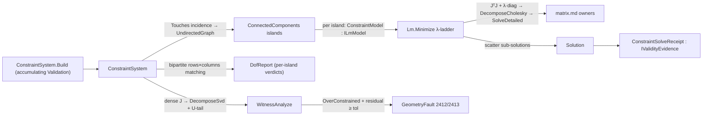

# [RASM_CONSTRAINTS_SOLVER]

The nonlinear least-squares owner of `Rasm.Solving` — TWO surfaces on one λ-ladder. `Lm.Minimize(ILmModel, SolvePolicy, Op?) → Fin<LmResult>` is the corpus's ONE damped Gauss-Newton (Levenberg-Marquardt) iterate: any residual-row system that supplies its DOF, its seed, its 106-bit `ddouble` objective, and its packed-upper `JᵀJ`/`Jᵀr` linearization through the `ILmModel` floor minimizes on the SAME accept/reject λ-ladder — accept divides `λ` by `LambdaDown` and CARRIES IT DOWN into the next iterate, reject multiplies by `LambdaUp` and re-solves without re-linearizing, the `LambdaCeiling` guard converts a ladder that climbs out of range into a typed `SingularSystem` verdict, and the owner-minted linear-solve `SolveReceipt` gates every step all-finite. `Solving/fit#FITTING` instantiates this functor for the geometric-orthogonal-distance regime; a second nonlinear least-squares loop anywhere in the corpus is the named double-owner defect this page deletes.

The second surface closes 2D parametric-sketch solving over that functor: a `Constraint` `[Union]` (distance · angle · coincidence · concentricity · parallel · perpendicular · tangent · point-on-line · midpoint · horizontal/vertical · equal · symmetric · ground · radius · point-on-circle) evaluated as ONE residual-and-Jacobian algebra, a `ConstraintSystem` whose entity↔constraint incidence folds into a transient QuikGraph `UndirectedGraph` so INDEPENDENT sub-sketches solve on small per-island normal matrices (the decomposition-recombination plan), a maximum-bipartite-matching STRUCTURAL rank beside the witness NUMERIC rank so locally-over- and locally-under-constrained islands are localized instead of averaged into a global row count, and a `ConstraintSolver.Solve` fold returning a `Solution`. No GPL solver is admitted (SolveSpace and NeoGeoSolver rejected), so the residual algebra, the analytic partials, the normal-equations scatter, and the λ-ladder are authored from first principles.

The solver composes `Rhino.Geometry` `Point3d`/`Vector3d` coordinates as settled vocabulary (read, never re-mint) for entity geometry, composes the `Numerics/matrix.md` owners for every factorization — `SymmetricMatrix.DecomposeCholesky` → `CholeskyResult.SolveDetailed` for the SPD damped normal solve, `SymmetricMatrix.DecomposeEigen` for the ceiling rank witness, `Matrix.DecomposeSvd` for the witness DOF — because `MatrixKernel` is the ONE MathNet access path and a direct `DenseMatrix`/`Cholesky` reach beside it is the named deleted form, threads the caller's `Op? key` through every owner call, accumulates the `Σr²` objective at 106-bit `ddouble` (`DoubleDoubleEnumerableExpand.Sum`) so the accept/reject monotone-decrease test keeps the digits `double` loses near convergence, and routes every failure through the band-2400 `GeometryFault` union (`OverConstrained` 2412, `SingularSystem` 2413, `DegenerateInput` 2400). Parameters are raw `double` inside the iterate because a sketch coordinate is the domain's native scalar; the only public output is a `Solution` (converged parameter vector + the typed `ConstraintSolveReceipt` — name-distinct from the `Rasm.Numerics` linear-solve `SolveReceipt` this page composes) consumed at the in-process seam. The naming `EntityKind` (Vertex/Edge/Face) in the sibling `Rasm.Spatial` namespace never collides with `SketchEntityKind` here — two vocabularies, two concepts.

## [01]-[INDEX]

- [02]-[LM_FUNCTOR]: `ILmModel` residual+Jacobian floor; `SolvePolicy` λ-ladder policy; `Lm.Minimize` the ONE damped Gauss-Newton iterate; `LmResult` evidence.
- [03]-[CONSTRAINT_SOLVER]: `SketchEntityKind`/`Entity` parametric primitives; the closed 15-case `Constraint` algebra; `ConstraintSystem` with accumulating admission + QuikGraph island decomposition; `DofAnalysis`/`DofReport` structural + witness verdicts; `ConstraintSolver.Solve` island fold returning `Solution`.

## [02]-[LM_FUNCTOR]

- Owner: `ILmModel` the residual+Jacobian floor — `Dof` (free-parameter count), `Seed` (start vector), `Norm(ReadOnlySpan<double>) → ddouble` (the 106-bit objective `‖r‖₂`), `Linearize(ReadOnlySpan<double>) → (double[] PackedNormal, double[] Gradient)` (packed-upper `JᵀJ` + `Jᵀr` in the layout `Lm.PackedIndex` fixes) — the open instance-interface seam any residual-row system implements (`ConstraintModel` here, `FitModel` in `Solving/fit`); `SolvePolicy` the λ-ladder policy record (`InitialLambda` · `LambdaUp` · `LambdaDown` · `ResidualTolerance` as the settled `PositiveMagnitude` · `StepFloor` · `MaxIterations`) with the `Canonical` row; `LmState` the internal per-iterate carrier (parameters · 106-bit norm · λ); `LmResult` the typed outcome (parameters · norm · iterations · terminal λ · `SolveStatus`) registering `IValidityEvidence`; `Lm` the static functor surface.
- Cases: `SolveStatus` rows `Converged` · `Stalled` (2) — the singular outcome lives on the `Fin` failure rail as `GeometryFault.SingularSystem`, never a success-carrier status.
- Entry: `public static Fin<LmResult> Lm.Minimize(ILmModel model, SolvePolicy policy, Op? key = null)` — the ONE nonlinear least-squares entrypoint. `Fin<T>` routes `GeometryFault.SingularSystem(rank, dof)` when the damped normal matrix stays rank-deficient through the λ-ladder past `LambdaCeiling`, the rank read as the `JᵀJ` eigen-rank through the `SymmetricMatrix.DecomposeEigen` owner (`rank(JᵀJ) = rank(J)`, counted spectral-radius-relative against `EpsilonPolicy.SqrtEpsilon` — a functor-computable singular witness needing no dense `J`); every other outcome is a success-carrier `LmResult` whose `Status` distinguishes the converged fixpoint from the budget stall.
- Auto: `Minimize` seeds `LmState` from `model.Seed` at `model.Norm(seed)` and `policy.InitialLambda`, then iterates: convergence is `‖r‖₂ < ResidualTolerance` or `‖δ‖₂ < StepFloor` (a stationary configuration), the budget cap stalls with best-so-far. Each step damps the packed diagonal `(JᵀJ + λ·diag(JᵀJ))` with the ZERO-DIAGONAL floor — a residual-untouched column damps on bare `λ` because multiplicative damping never regularizes an exact zero, and its zero gradient holds that coordinate at the seed (the under-constrained manifold behavior the entry promises) — solves `δ = −(JᵀJ + λD)⁻¹Jᵀr` through `SymmetricMatrix.Of` → `DecomposeCholesky` → `CholeskyResult.SolveDetailed` (the ONE MathNet access path — the minted `SolveReceipt` gates the solution all-finite under its residual cap, so an indefinite-but-not-throwing damped factor FAILS the mint and the ladder climbs instead of accepting a NaN step), and accepts when the 106-bit trial norm decreases: accepting divides `λ` by `LambdaDown` and the reduced `λ` rides `LmState` into the next iterate (toward Gauss-Newton — never a per-iterate restart), rejecting multiplies `λ` by `LambdaUp` and re-solves the SAME linearization without re-scattering. The reject recursion does NOT increment `iteration` (an LM reject is not an outer iteration), so the inner reject chain is bounded ONLY by the `LambdaCeiling` guard. The objective is `ddouble` end to end inside the accept test — two nearly equal norms near convergence differ in digits a `double` running sum has already lost — narrowing to `double` only at the `LmResult` readout.
- Receipt: `LmResult` carries the converged parameters, the final `double` norm, the outer iteration count, the terminal `λ`, and the `SolveStatus` — `IValidityEvidence` with `IsValid` one `ValidityClaim.All` fold (parameters finite · norm finite and non-negative · iterations non-negative · λ finite and positive · status present). A caller reads `Status` before consuming a stalled vector.
- Packages: `Rasm.Numerics` (`SymmetricMatrix`/`CholeskyResult`/`Dimension`/`PositiveMagnitude`/`EpsilonPolicy` — the `Numerics/matrix.md` + `Numerics/atoms.md` owners, composed never bypassed), TYoshimura.DoubleDouble (`ddouble`, `ddouble.Sqrt` — the 106-bit objective), Thinktecture.Runtime.Extensions (`[SmartEnum<int>]`), LanguageExt.Core (`Fin`), BCL inbox.
- Growth: a new descent strategy (trust-region dogleg beside the λ-ladder) is a `SolvePolicy` column selecting the step rule on the SAME `Minimize` fold, never a parallel `Minimize` surface; a new model is an `ILmModel` conformance, never an `Lm` edit; a new stop criterion is one policy column read at the convergence gate.
- Boundary: `Lm` is the ONE damped Gauss-Newton owner and a second `Iterate`/`Step` re-implementation beside it — a private LM loop in a fitting, registration, or parameterization page — is the named deleted form (the fit refine composes THIS functor); the packed-upper layout is the functor's contract — `Lm.PackedIndex` mirrors the `SymmetricMatrix` `FlatIndex` addressing so `Linearize` scatters the owner's own layout, and a model minting its own triangular indexing is the drift defect; `ILmModel.Norm` returns `ddouble` BY CONTRACT — a model narrowing its objective to `double` before return re-introduces the summation cancellation the contract exists to kill; the damped normal-equations form is chosen over QR-on-`J` because the damping is naturally expressed on the normal diagonal, the damped matrix is always SPD (Cholesky without pivoting), and the packed-upper `SymmetricMatrix` IS its carrier — the `√λ`-stacked thin-QR alternative activates only past a conditioning budget, recorded, not spelled; the damped assembly, sign-flip, and step-norm loops inside `Step` are the named span-kernel statement exemption; a thrown exception is forbidden — every failure routes `Fin` over band-2400.

```csharp
// --- [RUNTIME_PRELUDE] --------------------------------------------------------------------
using System;
using System.Linq;
using DoubleDouble;
using LanguageExt;
using LanguageExt.Common;
using Rasm.Domain;
using Rasm.Numerics;
using Thinktecture;
using static LanguageExt.Prelude;

namespace Rasm.Solving;

// --- [TYPES] ------------------------------------------------------------------------------
[SmartEnum<int>]
public sealed partial class SolveStatus {
    public static readonly SolveStatus Converged = new(key: 0);
    public static readonly SolveStatus Stalled   = new(key: 1);
}

// --- [MODELS] -----------------------------------------------------------------------------
public sealed record SolvePolicy(
    double InitialLambda,
    double LambdaUp,
    double LambdaDown,
    PositiveMagnitude ResidualTolerance,
    double StepFloor,
    int MaxIterations) {
    // PositiveMagnitude admits only > EpsilonPolicy.ZeroTolerance (2^-32 ≈ 2.33e-10); Canonical's 1e-9 clears the band.
    public static readonly SolvePolicy Canonical = new(
        InitialLambda: 1e-3, LambdaUp: 10.0, LambdaDown: 10.0,
        ResidualTolerance: PositiveMagnitude.Create(1e-9), StepFloor: 1e-12, MaxIterations: 100);
}

readonly record struct LmState(double[] Parameters, ddouble Norm, double Lambda);

public sealed record LmResult(double[] Parameters, double Norm, int Iterations, double Lambda, SolveStatus Status) : IValidityEvidence {
    public bool IsValid => ValidityClaim.All(
        ValidityClaim.Finite(Parameters.AsSpan()),
        ValidityClaim.Finite(Norm),
        ValidityClaim.Nonnegative(Norm),
        ValidityClaim.Of(Iterations >= 0),
        ValidityClaim.Finite(Lambda),
        ValidityClaim.Positive(Lambda),
        ValidityClaim.Of(Status is not null));
}

// --- [SERVICES] ---------------------------------------------------------------------------
// The residual+Jacobian floor: any residual-row system rides the ONE λ-ladder through this seam.
// PackedNormal/Gradient use Lm.PackedIndex addressing; Norm is the 106-bit objective by contract.
public interface ILmModel {
    int Dof { get; }
    double[] Seed { get; }
    ddouble Norm(ReadOnlySpan<double> parameters);
    (double[] PackedNormal, double[] Gradient) Linearize(ReadOnlySpan<double> parameters);
}

// --- [OPERATIONS] -------------------------------------------------------------------------
public static class Lm {
    // λ past this ceiling proves the damped normal matrix stays rank-deficient through the ladder.
    const double LambdaCeiling = 1e12;

    // Mirrors the SymmetricMatrix packed-upper FlatIndex so every model scatters the owner's own layout.
    internal static int PackedIndex(int n, int i, int j) => (i * n) - (i * (i - 1) / 2) + (j - i);

    public static Fin<LmResult> Minimize(ILmModel model, SolvePolicy policy, Op? key = null) {
        Op op = key.OrDefault();
        double[] seed = (double[])model.Seed.Clone();
        return Iterate(model, policy, new LmState(seed, model.Norm(seed), policy.InitialLambda), 0, op);
    }

    static Fin<LmResult> Iterate(ILmModel model, SolvePolicy policy, LmState state, int iteration, Op key) {
        if ((double)state.Norm < policy.ResidualTolerance.Value)
            return Fin.Succ(new LmResult(state.Parameters, (double)state.Norm, iteration, state.Lambda, SolveStatus.Converged));
        if (iteration >= policy.MaxIterations)
            return Fin.Succ(new LmResult(state.Parameters, (double)state.Norm, iteration, state.Lambda, SolveStatus.Stalled));
        (double[] normal, double[] gradient) = model.Linearize(state.Parameters);
        return Step(model, policy, state, normal, gradient, iteration, key);
    }

    static Fin<LmResult> Step(ILmModel model, SolvePolicy policy, LmState state, double[] packedNormal, double[] gradient, int iteration, Op key) {
        int n = model.Dof;
        if (state.Lambda > LambdaCeiling)
            return SymmetricMatrix.Of(Dimension.Create(n), new Arr<double>(packedNormal), key)
                .Bind(normal => normal.DecomposeEigen(key))
                .Map(static pairs => pairs.Map(static p => Math.Abs(p.Eigenvalue)))
                .Map(spectrum => spectrum.Fold(0.0, Math.Max) is var radius && radius <= 0.0
                    ? 0
                    : spectrum.Count(v => v > EpsilonPolicy.SqrtEpsilon * radius))
                .Match(
                    Succ: rank => Fin.Fail<LmResult>(new GeometryFault.SingularSystem(rank, n).ToError()),
                    Fail: _ => Fin.Fail<LmResult>(new GeometryFault.SingularSystem(0, n).ToError()));

        double[] damped = (double[])packedNormal.Clone();
        // Zero-diagonal columns (a residual-untouched DOF) damp on the bare λ floor: multiplicative
        // damping never regularizes an exact zero, and the gradient there is zero, so the step holds
        // the seed coordinate instead of climbing the ladder to a false SingularSystem.
        for (int i = 0; i < n; i++) {
            int di = PackedIndex(n, i, i);
            damped[di] = packedNormal[di] > 0.0 ? packedNormal[di] * (1.0 + state.Lambda) : state.Lambda;
        }
        double[] rhs = new double[n];
        for (int i = 0; i < n; i++) rhs[i] = -gradient[i];

        // The ONE MathNet access path: the minted linear-solve SolveReceipt gates the step all-finite
        // under its residual cap, so an indefinite factor fails the mint and the λ-ladder climbs.
        Fin<Arr<double>> solve = SymmetricMatrix.Of(Dimension.Create(n), new Arr<double>(damped), key)
            .Bind(spd => spd.DecomposeCholesky(key))
            .Bind(chol => chol.SolveDetailed(new Arr<double>(rhs), key))
            .Map(static receipt => receipt.Solution);
        return solve.Match(
            Succ: delta => {
                double[] trial = Advance(state.Parameters, delta);
                ddouble trialNorm = model.Norm(trial);
                double stepSquared = 0.0;
                for (int i = 0; i < n; i++) stepSquared += delta[i] * delta[i];
                // 106-bit accept test: the deciding digits of two nearly equal norms survive; accepted λ carries down.
                return trialNorm < state.Norm
                    ? Math.Sqrt(stepSquared) < policy.StepFloor
                        ? Fin.Succ(new LmResult(trial, (double)trialNorm, iteration + 1, state.Lambda, SolveStatus.Converged))
                        : Iterate(model, policy, new LmState(trial, trialNorm, state.Lambda / policy.LambdaDown), iteration + 1, key)
                    : Step(model, policy, state with { Lambda = state.Lambda * policy.LambdaUp }, packedNormal, gradient, iteration, key);
            },
            Fail: _ => Step(model, policy, state with { Lambda = state.Lambda * policy.LambdaUp }, packedNormal, gradient, iteration, key));
    }

    static double[] Advance(double[] parameters, Arr<double> delta) {
        double[] next = (double[])parameters.Clone();
        for (int i = 0; i < next.Length; i++) next[i] += delta[i];
        return next;
    }
}
```

## [03]-[CONSTRAINT_SOLVER]

- Owner: `SketchEntityKind` `[SmartEnum<int>]` the parametric-primitive discriminant (`Point`/`Line`/`Circle`) carrying the per-kind parameter `Arity` (point 2 · line 4 · circle 3) and the `Carrier` column binding each row to its `Rasm.Domain` `Kind` so admission faults mint typed discriminants; `Entity` the parametric primitive carrying its kind and its slice `[Offset, Offset+Arity)` into the flat parameter vector — one entity algebra over every kind, never a `PointEntity`/`LineEntity`/`CircleEntity` triple; `Constraint` the closed 15-case `[Union]` whose ONE generated-`Switch` `Residual` fold returns scalar residual rows with analytic partials, whose `Touches` fold names the incident entities for the graph decomposition, and whose `WellFormed` fold states the per-case operand-kind law (an arm reading `End`/`Direction`/`Radius` demands the owning `SketchEntityKind`; `Origin`-only arms are total); `ConstraintSystem` the immutable graph (entities · constraints · packed seed · parameter count) with the accumulating `Build` admission and the QuikGraph `Islands` decomposition fold; `DofAnalysis` the verdict vocabulary; `DofReport` the per-island structural evidence; `ConstraintModel` the island-scoped `ILmModel` instantiation; `ConstraintSolveReceipt`/`Solution` the solve outcome pair; `ConstraintSolver` the static surface owning `Analyze`/`StructuralAnalyze`/`WitnessAnalyze` and the island-folded `Solve`.
- Cases: `SketchEntityKind` rows `Point` (2) · `Line` (4) · `Circle` (3) (3); `Constraint` cases `Distance` · `Angle` · `Coincident` · `Concentric` · `Parallel` · `Perpendicular` · `Tangent` · `PointOnLine` · `Midpoint` · `Axis` (horizontal/vertical, one case with an axis flag) · `Equal` · `Symmetric` · `Ground` (the gauge anchor — dimensioning without grounding leaves the rigid-body freedoms honestly under-constrained) · `Radius` (the driving dimension on a circle) · `OnCircle` (squared membership, C¹ at the center) (15); `DofAnalysis` verdicts `WellConstrained` · `UnderConstrained` · `OverConstrained` · `RedundantConsistent` (4 — the witness numeric-rank refinement adds `RedundantConsistent`, the redundant-but-consistent system a row count misclassifies as over-constrained).
- Entry: `public static Fin<Solution> Solve(ConstraintSystem system, SolvePolicy policy, Op? key = null)` — the ONE solve entrypoint: decomposes into islands, instantiates `ConstraintModel : ILmModel` per island, runs `Lm.Minimize` on each small normal system, scatters the sub-solutions back into one parameter vector, and gates the assembled result — `GeometryFault.OverConstrained` when the witness verdict is over-determined AND the global residual stays past tolerance (a redundant-and-inconsistent system has no configuration, never a silently-truncated fit; the payload carries the DEPENDENT-ROW count `rows − rank(J)` at the witness — the honest `RedundantRows`, where the global row excess goes negative on a locally-over document), `GeometryFault.SingularSystem` bubbling from any island's ladder; a well- or under-constrained system always solves (an under-constrained island has a configuration manifold — LM finds the nearest point to the seed). `public static DofAnalysis Analyze(ConstraintSystem)` is the pure total structural row-count verdict; `public static DofReport StructuralAnalyze(ConstraintSystem)` the per-island maximum-matching refinement; `public static DofAnalysis WitnessAnalyze(ConstraintSystem, Op? key = null)` the numeric-rank adjudicator. `ConstraintSystem.Build(entities, constraints, Op? key = null)` is the accumulating admission — non-finite seed values (per entity, indexed), seed/arity length mismatches, dangling constraint entity references (membership tests the FULL `Entity` value, Kind + Offset — a mis-kinded reference forged at a valid offset is equally dangling), operand-kind mismatches (`WellFormed` — a `Tangent` over two points would silently read a foreign parameter slice, so the mismatch is an indexed admission defect, never a garbage residual), duplicate constraints, and the empty system report TOGETHER through one `Validation<Error, T>` traverse exiting `.ToFin()`, never first-defect-only.
- Auto: `Islands` folds the entity↔constraint incidence into a transient `UndirectedGraph<int, SEdge<int>>` (entity ordinals `0..E-1`, constraint ordinals `E..E+C-1`, one edge per `Touches` incidence) and reads `AlgorithmExtensions.ConnectedComponents` — each component is an independent sub-sketch whose damped normal matrix is `dof_island²` instead of `ParameterCount²`, the decomposition-recombination plan that makes a many-sketch document solve at the cost of its largest island; an entity no constraint touches forms a zero-row island that converges at iteration 0 with its seed untouched. Per island, `ConstraintModel` gathers the island columns into a compact local vector (local↔global column maps; a single-writer global scratch image the model scatters into — islands are column-disjoint by construction, so the scratch never races), `Norm` folds the island rows' `Σr²` at 106-bit `ddouble` through `DoubleDoubleEnumerableExpand.Sum`, and `Linearize` accumulates packed-upper `JᵀJ` + `Jᵀr` straight from the analytic partials with global→local column remap (the dense `J` never materializes on the LM lane — only the witness lane builds it). Each `Constraint.Residual` writes only the columns its entities own; the scatter ACCUMULATES rather than overwrites because an arm legitimately emits one column twice for a shared or self-aliased entity. `Distance` and `Tangent` carry their residual in SQUARED form (`Δx²+Δy²−Target²`, `dist(center,line)²−radius²`) so the partials stay C¹ at coincident/zero-length configurations where the `√`-form Jacobian is undefined, and the LM step absorbs the scale. `StructuralAnalyze` builds the per-island bipartite residual-row×parameter incidence and reads `MaximumBipartiteMatchingAlgorithm` — the matching cardinality is the structural rank (König), row deficiency localizes structural over-constraint to its island, column surplus localizes under-constraint — the locality a global `rows > ParameterCount` count is blind to (a locally-over plus locally-under document averages to a false `WellConstrained`). `WitnessAnalyze` stays the numeric adjudicator: dense `J(seed)` through `Matrix.Of` → `DecomposeSvd`, true DOF `ParameterCount − Rank`, and `ConsistentAtWitness` projects the residual onto the left-null space via the `SvdResult.U` tail columns — vanishing tail means `RedundantConsistent` (redundant constraints that all hold — solvable, not a fault).
- Receipt: `Solve` returns `Solution` carrying the converged parameter vector and the typed `ConstraintSolveReceipt` (`SolveStatus` folded across islands — all-converged or stalled — the witness `DofAnalysis`, the global recomputed residual norm, the summed iteration count, the maximum terminal `λ`, the residual-row count, and the island count) — `IValidityEvidence`, `IsValid` one `ValidityClaim.All` fold (norm finite and non-negative · iterations/rows non-negative · islands ≥ 1 · λ finite); `DofReport` (global verdict · structural rank · matching deficiency · per-island verdict rows with free DOF) is the diagnosis evidence a sketch UI reads to name WHICH island over-constrains — the specific island whose deficiency row is positive.
- Packages: `Rhino.Geometry` (`Point3d`/`Vector3d` composed for entity geometry), `Rasm.Numerics` (`SymmetricMatrix`/`CholeskyResult`/`Matrix`/`SvdResult`/`Dimension`/`PositiveMagnitude` — the `Numerics/matrix.md` + `Numerics/atoms.md` owners, composed never bypassed), QuikGraph (`UndirectedGraph<int, SEdge<int>>`, `AdjacencyGraph<int, SEdge<int>>`, `AlgorithmExtensions.ConnectedComponents`, `MaximumBipartiteMatchingAlgorithm<int, SEdge<int>>` — the incidence walks; the `Fin`-railed verdict stays the domain fold), TYoshimura.DoubleDouble (`ddouble` + `DoubleDoubleEnumerableExpand.Sum` — the 106-bit `Σr²`), Thinktecture.Runtime.Extensions (`[Union]`/`[SmartEnum<int>]`, generated `Switch`), LanguageExt.Core (`Fin`/`Validation`/`Seq`, the accumulating `.Traverse` admission), BCL inbox.
- Growth: a new geometric relation (equal-angle, colinear, the remaining parametric-sketch dialect) is ONE `Constraint` case carrying its `Residual`, `Touches`, and `WellFormed` arms over the same functor — never a sibling solver; a new parametric primitive (arc, ellipse, spline control point) is ONE `SketchEntityKind` row with its arity, `Carrier`, and geometry accessor arms; a new DOF refinement is a `DofReport` column, never a parallel analyzer; a 3D sketch tier is an `Entity` accessor widening over the SAME constraint algebra; zero new surface.
- Boundary: the constraint set is ONE closed `Constraint` `[Union]` and a `DistanceConstraint`/`AngleConstraint`/`TangentConstraint` sibling-class family each carrying its own `Solve` is the named density defect collapsed onto one union with one generated-`Switch` `Residual` fold — the fifteen relations differ ONLY in residual expression and analytic partials, never in the iterate, and the generated dispatch is compile-exhaustive: a sixteenth case breaks `Residual`, `Touches`, and `WellFormed` loudly, never a runtime-silent `_` arm (the raw `this switch` with a dead default is the deleted form); `Concentric` shares the center-coincidence rows — the case is sketch vocabulary, the algebra is one; a sketch without a `Ground` anchor reports its rigid-body freedoms as honest under-constraint — the gauge closes by grounding, never by a solver-silent gauge fix; the Jacobian is ANALYTIC and a finite-difference numerical Jacobian is the rejected form (halved precision, doubled residual evals) — the FD form survives only as the test oracle; the linear solve, the eigen rank, and the SVD witness compose the `Numerics/matrix.md` owners with the caller's `Op? key` threaded through EVERY call — a keyless owner call or a hand-rolled Gaussian elimination is the deleted form; QuikGraph owns the component and matching walks and a hand-rolled union-find or augmenting-path scan beside it is the deleted form, while graph verdicts always exit as typed domain values (`ConstraintIsland`/`DofReport`), never as leaked graph types; admission accumulates — `Build` reports every dangling reference, every operand-kind mismatch, every non-finite seed index, every arity mismatch, and every duplicate constraint in ONE verdict (`.Traverse` over the defect probes), because a sketch editor fixing admission defects one solve at a time is the rejected loop; a thrown solver exception is forbidden — every failure routes `Fin` over band-2400, `GeometryFault.<Case>(...).ToError()` the only failure spelling; the `ConstraintSystem` is immutable and `Solve` returns fresh packed arrays, never an in-place seed mutation — the `ConstraintModel` scratch is the single-writer run-local exception that never escapes the model; the graph-assembly and scatter loops are the named span-kernel statement exemption.

```csharp
// --- [RUNTIME_PRELUDE] --------------------------------------------------------------------
using System;
using System.Collections.Frozen;
using System.Collections.Generic;
using System.Linq;
using System.Numerics.Tensors;
using DoubleDouble;
using LanguageExt;
using LanguageExt.Common;
using QuikGraph;
using QuikGraph.Algorithms;
using QuikGraph.Algorithms.MaximumFlow;
using Rasm.Domain;
using Rasm.Numerics;
using Rhino.Geometry;
using Thinktecture;
using static LanguageExt.Prelude;

namespace Rasm.Solving;

// --- [TYPES] ------------------------------------------------------------------------------
[SmartEnum<int>]
public sealed partial class SketchEntityKind {
    public static readonly SketchEntityKind Point  = new(key: 0, arity: 2, carrier: Kind.Point);
    public static readonly SketchEntityKind Line   = new(key: 1, arity: 4, carrier: Kind.Line);
    public static readonly SketchEntityKind Circle = new(key: 2, arity: 3, carrier: Kind.Circle);

    public int Arity { get; }
    public Kind Carrier { get; }
}

[SmartEnum<int>]
public sealed partial class DofAnalysis {
    public static readonly DofAnalysis WellConstrained     = new(key: 0);
    public static readonly DofAnalysis UnderConstrained    = new(key: 1);
    public static readonly DofAnalysis OverConstrained     = new(key: 2);
    public static readonly DofAnalysis RedundantConsistent = new(key: 3);
}

// --- [MODELS] -----------------------------------------------------------------------------
public readonly record struct Entity(SketchEntityKind Kind, int Offset) {
    public int Arity => Kind.Arity;

    public Point3d Origin(ReadOnlySpan<double> p) => new(p[Offset], p[Offset + 1], 0.0);

    public Point3d End(ReadOnlySpan<double> p) => new(p[Offset + 2], p[Offset + 3], 0.0);

    public Vector3d Direction(ReadOnlySpan<double> p) => End(p) - Origin(p);
    public double Radius(ReadOnlySpan<double> p) => p[Offset + 2];
}

public readonly record struct ResidualRow(double Value, Seq<(int Column, double Partial)> Partials);

[Union(ConversionFromValue = ConversionOperatorsGeneration.None)]
public abstract partial record Constraint {
    private Constraint() { }

    public sealed record Distance(Entity A, Entity B, double Target) : Constraint;
    public sealed record Angle(Entity A, Entity B, double Radians) : Constraint;
    public sealed record Coincident(Entity A, Entity B) : Constraint;
    public sealed record Concentric(Entity A, Entity B) : Constraint;
    public sealed record Parallel(Entity A, Entity B) : Constraint;
    public sealed record Perpendicular(Entity A, Entity B) : Constraint;
    public sealed record Tangent(Entity Line, Entity Circle) : Constraint;
    public sealed record PointOnLine(Entity Point, Entity Line) : Constraint;
    public sealed record Midpoint(Entity Point, Entity Line) : Constraint;
    public sealed record Axis(Entity Line, bool Horizontal) : Constraint;
    public sealed record Equal(Entity A, Entity B) : Constraint;
    public sealed record Symmetric(Entity A, Entity B, Entity Axis) : Constraint;
    public sealed record Ground(Entity Point, double X, double Y) : Constraint;
    public sealed record Radius(Entity Circle, double Target) : Constraint;
    public sealed record OnCircle(Entity Point, Entity Circle) : Constraint;

    // Compile-exhaustive residual fold: a sixteenth case breaks this dispatch and Touches loudly.
    public Seq<ResidualRow> Residual(double[] p) =>
        Switch(
            state: p,
            distance:      static (p, d) => Seq(DistanceRow(d.A, d.B, d.Target, p)),
            angle:         static (p, a) => Seq(AngleRow(a.A, a.B, a.Radians, p)),
            coincident:    static (p, c) => CoincidentRows(c.A, c.B, p),
            concentric:    static (p, c) => CoincidentRows(c.A, c.B, p),
            parallel:      static (p, l) => Seq(CrossRow(l.A, l.B, p)),
            perpendicular: static (p, l) => Seq(DotRow(l.A, l.B, p)),
            tangent:       static (p, t) => Seq(TangentRow(t.Line, t.Circle, p)),
            pointOnLine:   static (p, o) => Seq(PointOnLineRow(o.Point, o.Line, p)),
            midpoint:      static (p, m) => MidpointRows(m.Point, m.Line, p),
            axis:          static (p, x) => Seq(AxisRow(x.Line, x.Horizontal, p)),
            equal:         static (p, e) => Seq(EqualRow(e.A, e.B, p)),
            symmetric:     static (p, s) => SymmetricRows(s.A, s.B, s.Axis, p),
            ground:        static (p, g) => GroundRows(g.Point, g.X, g.Y, p),
            radius:        static (p, r) => Seq(RadiusRow(r.Circle, r.Target, p)),
            onCircle:      static (p, o) => Seq(OnCircleRow(o.Point, o.Circle, p)));

    public Seq<Entity> Touches =>
        Switch(
            distance:      static d => Seq(d.A, d.B),
            angle:         static a => Seq(a.A, a.B),
            coincident:    static c => Seq(c.A, c.B),
            concentric:    static c => Seq(c.A, c.B),
            parallel:      static l => Seq(l.A, l.B),
            perpendicular: static l => Seq(l.A, l.B),
            tangent:       static t => Seq(t.Line, t.Circle),
            pointOnLine:   static o => Seq(o.Point, o.Line),
            midpoint:      static m => Seq(m.Point, m.Line),
            axis:          static x => Seq(x.Line),
            equal:         static e => Seq(e.A, e.B),
            symmetric:     static s => Seq(s.A, s.B, s.Axis),
            ground:        static g => Seq(g.Point),
            radius:        static r => Seq(r.Circle),
            onCircle:      static o => Seq(o.Point, o.Circle));

    // Operand-kind law: an arm reading End/Direction/Radius demands the owning kind; Origin-only
    // arms are total. A mismatched operand would silently read a FOREIGN parameter slice.
    public bool WellFormed =>
        Switch(
            distance:      static _ => true,
            angle:         static a => a.A.Kind == SketchEntityKind.Line && a.B.Kind == SketchEntityKind.Line,
            coincident:    static _ => true,
            concentric:    static _ => true,
            parallel:      static l => l.A.Kind == SketchEntityKind.Line && l.B.Kind == SketchEntityKind.Line,
            perpendicular: static l => l.A.Kind == SketchEntityKind.Line && l.B.Kind == SketchEntityKind.Line,
            tangent:       static t => t.Line.Kind == SketchEntityKind.Line && t.Circle.Kind == SketchEntityKind.Circle,
            pointOnLine:   static o => o.Line.Kind == SketchEntityKind.Line,
            midpoint:      static m => m.Line.Kind == SketchEntityKind.Line,
            axis:          static x => x.Line.Kind == SketchEntityKind.Line,
            equal:         static e => e.A.Kind == e.B.Kind && e.A.Kind != SketchEntityKind.Point,
            symmetric:     static s => s.Axis.Kind == SketchEntityKind.Line,
            ground:        static _ => true,
            radius:        static r => r.Circle.Kind == SketchEntityKind.Circle,
            onCircle:      static o => o.Circle.Kind == SketchEntityKind.Circle);

    // --- [RESIDUAL_ROWS]
    // Squared distance form: C¹ at coincident configurations where the √-form Jacobian is undefined.
    static ResidualRow DistanceRow(Entity a, Entity b, double target, ReadOnlySpan<double> p) {
        Point3d pa = a.Origin(p), pb = b.Origin(p);
        double dx = pa.X - pb.X, dy = pa.Y - pb.Y;
        double r = dx * dx + dy * dy - target * target;
        return new ResidualRow(r, Seq(
            (a.Offset, 2.0 * dx), (a.Offset + 1, 2.0 * dy),
            (b.Offset, -2.0 * dx), (b.Offset + 1, -2.0 * dy)));
    }

    static ResidualRow AngleRow(Entity a, Entity b, double radians, ReadOnlySpan<double> p) {
        Vector3d u = a.Direction(p), v = b.Direction(p);
        double cross = u.X * v.Y - u.Y * v.X, dot = u.X * v.X + u.Y * v.Y;
        double denom = cross * cross + dot * dot;
        double inv = denom > EpsilonPolicy.ZeroTolerance * EpsilonPolicy.ZeroTolerance ? 1.0 / denom : 0.0;
        double r = Math.Atan2(cross, dot) - radians;
        // ∂atan2(c,d)/∂θ = (d·∂c − c·∂d)·inv; the v-side cross terms carry the SAME minus sign as the u-side.
        double dAux = (v.Y * dot - v.X * cross) * inv, dAuy = (-v.X * dot - v.Y * cross) * inv;
        double dBvx = (-u.Y * dot - u.X * cross) * inv, dBvy = (u.X * dot - u.Y * cross) * inv;
        return new ResidualRow(r, Seq(
            (a.Offset, -dAux), (a.Offset + 1, -dAuy), (a.Offset + 2, dAux), (a.Offset + 3, dAuy),
            (b.Offset, -dBvx), (b.Offset + 1, -dBvy), (b.Offset + 2, dBvx), (b.Offset + 3, dBvy)));
    }

    static Seq<ResidualRow> CoincidentRows(Entity a, Entity b, ReadOnlySpan<double> p) {
        Point3d pa = a.Origin(p), pb = b.Origin(p);
        return Seq(
            new ResidualRow(pa.X - pb.X, Seq((a.Offset, 1.0), (b.Offset, -1.0))),
            new ResidualRow(pa.Y - pb.Y, Seq((a.Offset + 1, 1.0), (b.Offset + 1, -1.0))));
    }

    static ResidualRow CrossRow(Entity a, Entity b, ReadOnlySpan<double> p) {
        Vector3d u = a.Direction(p), v = b.Direction(p);
        double r = u.X * v.Y - u.Y * v.X;
        return new ResidualRow(r, Seq(
            (a.Offset, -v.Y), (a.Offset + 1, v.X), (a.Offset + 2, v.Y), (a.Offset + 3, -v.X),
            (b.Offset, u.Y), (b.Offset + 1, -u.X), (b.Offset + 2, -u.Y), (b.Offset + 3, u.X)));
    }

    static ResidualRow DotRow(Entity a, Entity b, ReadOnlySpan<double> p) {
        Vector3d u = a.Direction(p), v = b.Direction(p);
        double r = u.X * v.X + u.Y * v.Y;
        return new ResidualRow(r, Seq(
            (a.Offset, -v.X), (a.Offset + 1, -v.Y), (a.Offset + 2, v.X), (a.Offset + 3, v.Y),
            (b.Offset, -u.X), (b.Offset + 1, -u.Y), (b.Offset + 2, u.X), (b.Offset + 3, u.Y)));
    }

    // Squared tangency form: dist(center,line)² − radius², C¹ through the degenerate zero-length line.
    static ResidualRow TangentRow(Entity line, Entity circle, ReadOnlySpan<double> p) {
        Point3d s = line.Origin(p), e = line.End(p), c = circle.Origin(p);
        double radius = circle.Radius(p);
        double dx = e.X - s.X, dy = e.Y - s.Y;
        double cx = c.X - s.X, cy = c.Y - s.Y;
        double cross = dx * cy - dy * cx;
        double len2 = dx * dx + dy * dy;
        double invLen2 = len2 > EpsilonPolicy.ZeroTolerance * EpsilonPolicy.ZeroTolerance ? 1.0 / len2 : 0.0;
        double r = cross * cross * invLen2 - radius * radius;
        double g = cross * cross, gh = g * invLen2 * invLen2;
        double dStartX = (2.0 * cross * (dy - cy) * invLen2) - gh * (-2.0 * dx);
        double dStartY = (2.0 * cross * (cx - dx) * invLen2) - gh * (-2.0 * dy);
        double dEndX = (2.0 * cross * cy * invLen2) - gh * (2.0 * dx);
        double dEndY = (2.0 * cross * (-cx) * invLen2) - gh * (2.0 * dy);
        double dCenterX = 2.0 * cross * (-dy) * invLen2;
        double dCenterY = 2.0 * cross * dx * invLen2;
        return new ResidualRow(r, Seq(
            (line.Offset, dStartX), (line.Offset + 1, dStartY), (line.Offset + 2, dEndX), (line.Offset + 3, dEndY),
            (circle.Offset, dCenterX), (circle.Offset + 1, dCenterY), (circle.Offset + 2, -2.0 * radius)));
    }

    static ResidualRow PointOnLineRow(Entity point, Entity line, ReadOnlySpan<double> p) {
        Point3d q = point.Origin(p);
        Point3d s = line.Origin(p), e = line.End(p);
        double r = (e.X - s.X) * (q.Y - s.Y) - (e.Y - s.Y) * (q.X - s.X);
        return new ResidualRow(r, Seq(
            (point.Offset, s.Y - e.Y), (point.Offset + 1, e.X - s.X),
            (line.Offset, e.Y - q.Y), (line.Offset + 1, q.X - e.X),
            (line.Offset + 2, q.Y - s.Y), (line.Offset + 3, s.X - q.X)));
    }

    static Seq<ResidualRow> MidpointRows(Entity point, Entity line, ReadOnlySpan<double> p) {
        Point3d q = point.Origin(p);
        Point3d s = line.Origin(p), e = line.End(p);
        return Seq(
            new ResidualRow(q.X - 0.5 * (s.X + e.X), Seq((point.Offset, 1.0), (line.Offset, -0.5), (line.Offset + 2, -0.5))),
            new ResidualRow(q.Y - 0.5 * (s.Y + e.Y), Seq((point.Offset + 1, 1.0), (line.Offset + 1, -0.5), (line.Offset + 3, -0.5))));
    }

    static ResidualRow AxisRow(Entity line, bool horizontal, ReadOnlySpan<double> p) {
        Point3d s = line.Origin(p), e = line.End(p);
        return horizontal
            ? new ResidualRow(e.Y - s.Y, Seq((line.Offset + 1, -1.0), (line.Offset + 3, 1.0)))
            : new ResidualRow(e.X - s.X, Seq((line.Offset, -1.0), (line.Offset + 2, 1.0)));
    }

    static ResidualRow EqualRow(Entity a, Entity b, ReadOnlySpan<double> p) {
        if (a.Kind == SketchEntityKind.Circle && b.Kind == SketchEntityKind.Circle) {
            double ra = a.Radius(p), rb = b.Radius(p);
            return new ResidualRow(ra - rb, Seq((a.Offset + 2, 1.0), (b.Offset + 2, -1.0)));
        }
        Vector3d u = a.Direction(p), v = b.Direction(p);
        double r = (u.X * u.X + u.Y * u.Y) - (v.X * v.X + v.Y * v.Y);
        return new ResidualRow(r, Seq(
            (a.Offset, -2.0 * u.X), (a.Offset + 1, -2.0 * u.Y), (a.Offset + 2, 2.0 * u.X), (a.Offset + 3, 2.0 * u.Y),
            (b.Offset, 2.0 * v.X), (b.Offset + 1, 2.0 * v.Y), (b.Offset + 2, -2.0 * v.X), (b.Offset + 3, -2.0 * v.Y)));
    }

    static Seq<ResidualRow> SymmetricRows(Entity a, Entity b, Entity axis, ReadOnlySpan<double> p) {
        Point3d pa = a.Origin(p), pb = b.Origin(p), s = axis.Origin(p), e = axis.End(p);
        double ax = e.X - s.X, ay = e.Y - s.Y;
        double mx = 0.5 * (pa.X + pb.X) - s.X, my = 0.5 * (pa.Y + pb.Y) - s.Y;
        double onAxis = ax * my - ay * mx;
        double chordX = pa.X - pb.X, chordY = pa.Y - pb.Y;
        double perp = chordX * ax + chordY * ay;
        // onAxis = ax·my − ay·mx over m = ½(pa+pb) − s: ∂/∂pa.X = −½ay, ∂/∂pa.Y = ½ax (both endpoints
        // enter through the midpoint symmetrically); s couples through ax, ay, mx, my; e through ax, ay.
        return Seq(
            new ResidualRow(onAxis, Seq(
                (a.Offset, -0.5 * ay), (a.Offset + 1, 0.5 * ax), (b.Offset, -0.5 * ay), (b.Offset + 1, 0.5 * ax),
                (axis.Offset, ay - my), (axis.Offset + 1, mx - ax), (axis.Offset + 2, my), (axis.Offset + 3, -mx))),
            new ResidualRow(perp, Seq(
                (a.Offset, ax), (a.Offset + 1, ay), (b.Offset, -ax), (b.Offset + 1, -ay),
                (axis.Offset, -chordX), (axis.Offset + 1, -chordY), (axis.Offset + 2, chordX), (axis.Offset + 3, chordY))));
    }

    // Grounding pins the rigid-body gauge: an unanchored sketch reports its translation/rotation
    // freedoms as honest under-constraint, and Ground is how a sketch closes them.
    static Seq<ResidualRow> GroundRows(Entity point, double x, double y, ReadOnlySpan<double> p) {
        Point3d q = point.Origin(p);
        return Seq(
            new ResidualRow(q.X - x, Seq((point.Offset, 1.0))),
            new ResidualRow(q.Y - y, Seq((point.Offset + 1, 1.0))));
    }

    static ResidualRow RadiusRow(Entity circle, double target, ReadOnlySpan<double> p) =>
        new(circle.Radius(p) - target, Seq((circle.Offset + 2, 1.0)));

    // Squared membership |q − c|² − r²: C¹ at the center-coincident configuration.
    static ResidualRow OnCircleRow(Entity point, Entity circle, ReadOnlySpan<double> p) {
        Point3d q = point.Origin(p), c = circle.Origin(p);
        double radius = circle.Radius(p);
        double dx = q.X - c.X, dy = q.Y - c.Y;
        return new ResidualRow((dx * dx) + (dy * dy) - (radius * radius), Seq(
            (point.Offset, 2.0 * dx), (point.Offset + 1, 2.0 * dy),
            (circle.Offset, -2.0 * dx), (circle.Offset + 1, -2.0 * dy), (circle.Offset + 2, -2.0 * radius)));
    }
}

// Island = one weak component of the entity↔constraint incidence; ordinals index the owning system.
public readonly record struct ConstraintIsland(Seq<int> Entities, Seq<int> Constraints);

public sealed record DofReport(
    DofAnalysis Verdict,
    int StructuralRank,
    int MatchingDeficiency,
    Seq<(int Island, DofAnalysis Verdict, int FreeDof, int Deficiency)> Islands) : IValidityEvidence {
    public bool IsValid => ValidityClaim.All(
        ValidityClaim.Of(Verdict is not null),
        ValidityClaim.Of(StructuralRank >= 0 && MatchingDeficiency >= 0),
        ValidityClaim.Of(Islands.ForAll(static row => row.Verdict is not null && row.FreeDof >= 0 && row.Deficiency >= 0)));
}

public sealed record ConstraintSystem(
    Seq<Entity> Entities,
    Seq<Constraint> Constraints,
    double[] Seed,
    int ParameterCount) {
    // Accumulating admission: EVERY defect — non-finite seed, arity mismatch, dangling reference,
    // operand-kind mismatch, duplicate constraint, empty system — reports in one verdict, never first-defect-only.
    public static Fin<ConstraintSystem> Build(
        Seq<(SketchEntityKind Kind, double[] Initial)> entities, Seq<Constraint> constraints, Op? key = null) {
        // Eager placement pass: a lazy Map over a mutable offset capture reads offset before it advances.
        List<Entity> placedList = new(entities.Count);
        int offset = 0;
        foreach ((SketchEntityKind Kind, double[] Initial) e in entities) { placedList.Add(new Entity(e.Kind, offset)); offset += e.Kind.Arity; }
        Seq<Entity> placed = toSeq(placedList);
        double[] seed = new double[offset];
        int cursor = 0;
        foreach ((SketchEntityKind Kind, double[] Initial) e in entities) {
            if (e.Initial.Length == e.Kind.Arity) e.Initial.CopyTo(seed, cursor);
            cursor += e.Kind.Arity;
        }
        // Membership on the FULL Entity value (Kind + Offset): an offset-only probe admits a
        // mis-kinded reference whose own Kind satisfies WellFormed yet reads a foreign slice.
        LanguageExt.HashSet<Entity> placedSet = toHashSet(placed);
        Seq<Validation<Error, Unit>> probes =
            (entities.IsEmpty
                ? Seq((Validation<Error, Unit>)new GeometryFault.DegenerateInput(Kind.Point, -1, "empty-system").ToError())
                : Seq<Validation<Error, Unit>>())
            + entities.Map(static (item, index) => (Item: item, Index: index))
                .Filter(static row => row.Item.Initial.Length != row.Item.Kind.Arity)
                .Map(row => (Validation<Error, Unit>)new GeometryFault.DegenerateInput(row.Item.Kind.Carrier, row.Index, "seed-arity-mismatch").ToError())
            + entities.Map(static (item, index) => (Item: item, Index: index))
                .Filter(static row => !TensorPrimitives.IsFiniteAll<double>(row.Item.Initial))
                .Map(row => (Validation<Error, Unit>)new GeometryFault.DegenerateInput(row.Item.Kind.Carrier, row.Index, "non-finite-seed").ToError())
            + constraints.Map(static (constraint, index) => (Constraint: constraint, Index: index))
                .Filter(row => !row.Constraint.Touches.ForAll(entity => placedSet.Contains(entity)))
                .Map(row => (Validation<Error, Unit>)new GeometryFault.DegenerateInput(Kind.Point, row.Index, "dangling-entity-reference").ToError())
            + constraints.Map(static (constraint, index) => (Constraint: constraint, Index: index))
                .Filter(static row => !row.Constraint.WellFormed)
                .Map(row => (Validation<Error, Unit>)new GeometryFault.DegenerateInput(Kind.Point, row.Index, "operand-kind-mismatch").ToError())
            + toSeq(constraints.CountBy(static constraint => constraint))
                .Filter(static group => group.Value > 1)
                .Map(group => (Validation<Error, Unit>)new GeometryFault.DegenerateInput(Kind.Point, -1, $"duplicate-constraint:x{group.Value}").ToError());
        return probes.Traverse(identity).As()
            .Map(_ => new ConstraintSystem(placed, constraints, seed, offset))
            .ToFin();
    }

    // DR-planner decomposition: entity ordinals 0..E-1, constraint ordinals E..E+C-1, one transient
    // incidence graph; each weak component solves on its own small normal matrix. Total post-Build.
    internal Seq<ConstraintIsland> Islands() {
        FrozenDictionary<int, int> byOffset = Entities.Map(static (entity, ordinal) => (entity.Offset, Ordinal: ordinal))
            .ToDictionary(static row => row.Offset, static row => row.Ordinal)
            .ToFrozenDictionary();
        UndirectedGraph<int, SEdge<int>> graph = new(allowParallelEdges: false);
        graph.AddVertexRange(Enumerable.Range(0, Entities.Count + Constraints.Count));
        Constraints.Map(static (constraint, ordinal) => (Constraint: constraint, Ordinal: ordinal))
            .Iter(row => row.Constraint.Touches.Iter(entity =>
                graph.AddEdge(new SEdge<int>(byOffset[entity.Offset], Entities.Count + row.Ordinal))));
        Dictionary<int, int> component = new();
        int count = graph.ConnectedComponents(component);
        ConstraintSystem self = this;
        return toSeq(Enumerable.Range(0, count)).Map(island => new ConstraintIsland(
            Entities: toSeq(Enumerable.Range(0, self.Entities.Count).Where(e => component[e] == island)),
            Constraints: toSeq(Enumerable.Range(0, self.Constraints.Count).Where(c => component[self.Entities.Count + c] == island))));
    }
}

public sealed record ConstraintSolveReceipt(
    SolveStatus Status,
    DofAnalysis Dof,
    double ResidualNorm,
    int Iterations,
    double TerminalLambda,
    int ResidualRows,
    int Islands) : IValidityEvidence {
    public bool IsValid => ValidityClaim.All(
        ValidityClaim.Of(Status is not null && Dof is not null),
        ValidityClaim.Finite(ResidualNorm),
        ValidityClaim.Nonnegative(ResidualNorm),
        ValidityClaim.Of(Iterations >= 0 && ResidualRows >= 0 && Islands >= 1),
        ValidityClaim.Finite(TerminalLambda),
        ValidityClaim.Nonnegative(TerminalLambda));
}

public sealed record Solution(double[] Parameters, ConstraintSolveReceipt Receipt);

// --- [OPERATIONS] -------------------------------------------------------------------------
// Island-scoped ILmModel: local↔global column maps over a single-writer scratch image.
// Islands are column-disjoint by construction, so the scratch never races; column order = island entity order.
internal sealed class ConstraintModel : ILmModel {
    readonly ConstraintSystem system;
    readonly Seq<int> constraints;
    readonly int[] columns;
    readonly int[] globalToLocal;
    readonly double[] scratch;

    internal ConstraintModel(ConstraintSystem system, ConstraintIsland island, double[] current) {
        this.system = system;
        constraints = island.Constraints;
        columns = [.. island.Entities.Bind(ordinal => {
            Entity entity = system.Entities[ordinal];
            return toSeq(Enumerable.Range(entity.Offset, entity.Arity));
        })];
        globalToLocal = new int[system.ParameterCount];
        Array.Fill(globalToLocal, -1);
        for (int local = 0; local < columns.Length; local++) globalToLocal[columns[local]] = local;
        scratch = (double[])current.Clone();
        Seed = [.. columns.Select(column => current[column])];
    }

    public int Dof => columns.Length;

    public double[] Seed { get; }

    public ddouble Norm(ReadOnlySpan<double> parameters) {
        Scatter(parameters);
        double[] image = scratch;
        ConstraintSystem home = system;
        return ddouble.Sqrt(constraints
            .Bind(ordinal => home.Constraints[ordinal].Residual(image))
            .Map(static row => (ddouble)row.Value * row.Value)
            .Sum());
    }

    // ONE scatter: packed-upper JᵀJ + Jᵀr straight from the analytic partials with global→local remap;
    // the sum ACCUMULATES because an arm legitimately emits one column twice for a self-aliased entity.
    public (double[] PackedNormal, double[] Gradient) Linearize(ReadOnlySpan<double> parameters) {
        Scatter(parameters);
        int n = columns.Length;
        double[] normal = new double[n * (n + 1) / 2];
        double[] gradient = new double[n];
        foreach (int ordinal in constraints) {
            foreach (ResidualRow row in system.Constraints[ordinal].Residual(scratch)) {
                foreach ((int ci, double pi) in row.Partials) {
                    int li = globalToLocal[ci];
                    gradient[li] += pi * row.Value;
                    foreach ((int cj, double pj) in row.Partials) {
                        int lj = globalToLocal[cj];
                        if (lj >= li) normal[Lm.PackedIndex(n, li, lj)] += pi * pj;
                    }
                }
            }
        }
        return (normal, gradient);
    }

    void Scatter(ReadOnlySpan<double> parameters) {
        for (int local = 0; local < columns.Length; local++) scratch[columns[local]] = parameters[local];
    }
}

public static class ConstraintSolver {
    public static DofAnalysis Analyze(ConstraintSystem system) => Analyze(system, ResidualRowCount(system));

    static DofAnalysis Analyze(ConstraintSystem system, int residualRows) =>
        residualRows > system.ParameterCount ? DofAnalysis.OverConstrained
        : residualRows < system.ParameterCount ? DofAnalysis.UnderConstrained
        : DofAnalysis.WellConstrained;

    // Per-island König structural rank: matching deficiency localizes over-constraint, column surplus
    // localizes under-constraint — the locality a global row count averages away.
    public static DofReport StructuralAnalyze(ConstraintSystem system) {
        Seq<(int Island, DofAnalysis Verdict, int FreeDof, int Deficiency, int Rank)> islands = system.Islands().Map((island, ordinal) => {
            Seq<Seq<int>> rowColumns = island.Constraints
                .Bind(ci => system.Constraints[ci].Residual(system.Seed))
                .Map(static row => toSeq(row.Partials.Map(static partial => partial.Column).Distinct()));
            Seq<int> columns = toSeq(rowColumns.Bind(identity).Distinct());
            FrozenDictionary<int, int> local = columns.Map(static (column, index) => (Column: column, Index: index))
                .ToDictionary(static row => row.Column, static row => row.Index)
                .ToFrozenDictionary();
            int rows = rowColumns.Count, parameters = columns.Count;
            AdjacencyGraph<int, SEdge<int>> graph = new();
            graph.AddVertexRange(Enumerable.Range(0, rows + parameters));
            rowColumns.Map(static (touched, row) => (Touched: touched, Row: row))
                .Iter(entry => entry.Touched.Iter(column => graph.AddEdge(new SEdge<int>(entry.Row, rows + local[column]))));
            int next = rows + parameters;
            MaximumBipartiteMatchingAlgorithm<int, SEdge<int>> matching = new(
                graph,
                sourceToVertices: Enumerable.Range(0, rows),
                verticesToSink: Enumerable.Range(rows, parameters),
                vertexFactory: () => next++,
                edgeFactory: static (source, target) => new SEdge<int>(source, target));
            matching.Compute();
            int rank = matching.MatchedEdges.Length;
            int deficiency = rows - rank;
            int freeDof = island.Entities.Map(e => system.Entities[e].Arity).Fold(0, static (sum, arity) => sum + arity) - rank;
            DofAnalysis verdict = deficiency > 0 ? DofAnalysis.OverConstrained
                : freeDof > 0 ? DofAnalysis.UnderConstrained
                : DofAnalysis.WellConstrained;
            return (Island: ordinal, Verdict: verdict, FreeDof: freeDof, Deficiency: deficiency, Rank: rank);
        }).Strict();
        DofAnalysis global = islands.Exists(static row => row.Verdict == DofAnalysis.OverConstrained) ? DofAnalysis.OverConstrained
            : islands.Exists(static row => row.Verdict == DofAnalysis.UnderConstrained) ? DofAnalysis.UnderConstrained
            : DofAnalysis.WellConstrained;
        return new DofReport(
            Verdict: global,
            StructuralRank: islands.Map(static row => row.Rank).Fold(0, static (sum, rank) => sum + rank),
            MatchingDeficiency: islands.Map(static row => row.Deficiency).Fold(0, static (sum, deficiency) => sum + deficiency),
            Islands: islands.Map(static row => (row.Island, row.Verdict, row.FreeDof, row.Deficiency)));
    }

    public static DofAnalysis WitnessAnalyze(ConstraintSystem system, Op? key = null) =>
        Witness(system, key.OrDefault()).Verdict;

    // Witness core: the verdict plus the DEPENDENT-ROW count (rows − rank(J) at the witness) — the
    // honest RedundantRows payload; the global row excess goes negative on a locally-over document.
    static (DofAnalysis Verdict, int DependentRows) Witness(ConstraintSystem system, Op key) {
        (int rows, double[] r, Fin<Matrix> jacobian) = LinearizeDense(system, system.Seed, key);
        if (rows == 0) return (DofAnalysis.UnderConstrained, 0);  // constraint-free sketch: every DOF free
        return jacobian.Bind(j => j.DecomposeSvd(key)).Match(
            Succ: svd => rows <= svd.Rank
                ? (system.ParameterCount - svd.Rank > 0 ? DofAnalysis.UnderConstrained : DofAnalysis.WellConstrained, 0)
                : (ConsistentAtWitness(svd, r, rows) ? DofAnalysis.RedundantConsistent : DofAnalysis.OverConstrained, rows - svd.Rank),
            Fail: _ => (Analyze(system, rows), Math.Max(rows - system.ParameterCount, 0)));
    }

    // Left-null-space projection ‖U_tailᵀ·r‖ read off the owner's SvdResult: U columns past Rank span null(Jᵀ).
    static bool ConsistentAtWitness(SvdResult svd, double[] r, int rows) {
        double rNorm = 0.0;
        for (int i = 0; i < rows; i++) rNorm += r[i] * r[i];
        double tail = 0.0;
        for (int k = svd.Rank; k < rows; k++) {
            double dot = 0.0;
            for (int i = 0; i < rows; i++) dot += svd.U.At(i, k) * r[i];
            tail += dot * dot;
        }
        return Math.Sqrt(tail) <= EpsilonPolicy.SqrtEpsilon * Math.Max(Math.Sqrt(rNorm), 1.0);
    }

    static int ResidualRowCount(ConstraintSystem system) {
        int rows = 0;
        foreach (Constraint constraint in system.Constraints) rows += constraint.Residual(system.Seed).Count;
        return rows;
    }

    // Island fold: each component minimizes on its own small normal system through the ONE functor;
    // sub-solutions scatter back immutably (fresh array per island — the seed never mutates in place).
    public static Fin<Solution> Solve(ConstraintSystem system, SolvePolicy policy, Op? key = null) {
        Op op = key.OrDefault();
        int rows = ResidualRowCount(system);
        (DofAnalysis dof, int dependent) = Witness(system, op);
        Seq<ConstraintIsland> islands = system.Islands();
        return islands.Fold(
                Fin.Succ((Parameters: (double[])system.Seed.Clone(), Iterations: 0, Lambda: 0.0, Converged: true)),
                (acc, island) => acc.Bind(state =>
                    Lm.Minimize(new ConstraintModel(system, island, state.Parameters), policy, op).Map(result => (
                        Scatter(state.Parameters, system, island, result.Parameters),
                        state.Iterations + result.Iterations,
                        Math.Max(state.Lambda, result.Lambda),
                        state.Converged && result.Status == SolveStatus.Converged))))
            .Bind(state => {
                double norm = ResidualNorm(system, state.Parameters);
                SolveStatus status = state.Converged ? SolveStatus.Converged : SolveStatus.Stalled;
                return dof == DofAnalysis.OverConstrained && norm >= policy.ResidualTolerance.Value
                    ? Fin.Fail<Solution>(new GeometryFault.OverConstrained(dependent, norm).ToError())
                    : Fin.Succ(new Solution(
                        state.Parameters,
                        new ConstraintSolveReceipt(status, dof, norm, state.Iterations, state.Lambda, rows, islands.Count)));
            });
    }

    static double[] Scatter(double[] parameters, ConstraintSystem system, ConstraintIsland island, double[] local) {
        double[] next = (double[])parameters.Clone();
        int cursor = 0;
        foreach (int ordinal in island.Entities) {
            Entity entity = system.Entities[ordinal];
            for (int k = 0; k < entity.Arity; k++) next[entity.Offset + k] = local[cursor++];
        }
        return next;
    }

    static (int Rows, double[] Residual, Fin<Matrix> Jacobian) LinearizeDense(ConstraintSystem system, double[] parameters, Op key) {
        int n = system.ParameterCount;
        List<ResidualRow> allRows = [];
        foreach (Constraint constraint in system.Constraints) allRows.AddRange(constraint.Residual(parameters));
        if (allRows.Count == 0) return (0, [], Fin.Fail<Matrix>(key.InvalidInput()));  // Dimension admits >= 1 — never minted at zero rows
        double[] r = new double[allRows.Count];
        double[] j = new double[allRows.Count * n];
        for (int row = 0; row < allRows.Count; row++) {
            r[row] = allRows[row].Value;
            foreach ((int column, double partial) in allRows[row].Partials) j[(row * n) + column] += partial;
        }
        return (allRows.Count, r, Matrix.Of(Dimension.Create(allRows.Count), Dimension.Create(n), new Arr<double>(j), key));
    }

    // 106-bit Σr² through the shipped aggregation extension: two nearly equal norms near the
    // OverConstrained gate differ in digits a double running sum has already lost.
    static double ResidualNorm(ConstraintSystem system, double[] parameters) =>
        (double)ddouble.Sqrt(system.Constraints
            .Bind(constraint => constraint.Residual(parameters))
            .Map(static row => (ddouble)row.Value * row.Value)
            .Sum());
}
```



## [04]-[DENSITY_BAR]

One owner per axis; capability is a case, row, column, or fold arm, never a sibling surface. The `[RAIL]` cell names the one return rail each owner exposes — pure verdicts where the result is total, `Fin` where a band-2400 `GeometryFault` can route.

| [INDEX] | [AXIS/CONCERN]       | [OWNER]                   | [KIND]                                                                                                        | [RAIL]                                           | [CASES] |
| :-----: | :------------------- | :------------------------ | :------------------------------------------------------------------------------------------------------------ | :------------------------------------------------ | :-----: |
|  [01]   | Damped Gauss-Newton  | `Lm` + `ILmModel`         | the ONE λ-ladder functor over the residual+Jacobian floor; packed-upper contract via `Lm.PackedIndex`         | `Lm.Minimize → Fin<LmResult>`                     |    2    |
|  [02]   | Ladder policy        | `SolvePolicy`             | policy record (λ seed/up/down · `PositiveMagnitude` tolerance · step floor · budget) + `Canonical` row        | policy value (pure)                               |    —    |
|  [03]   | Parametric primitive | `Entity`                  | `record` over `SketchEntityKind` `[SmartEnum<int>]` (Point/Line/Circle + `Arity`/`Carrier` columns)           | `Entity.Origin → Point3d` (pure)                  |    3    |
|  [04]   | Constraint algebra   | `Constraint`              | `[Union]` (15 cases) + generated-`Switch` `Residual`/`Touches`/`WellFormed` folds, analytic partials per arm  | `Constraint.Residual → Seq<ResidualRow>` (pure)   |   15    |
|  [05]   | DOF verdict          | `DofAnalysis`/`DofReport` | `[SmartEnum<int>]` Well/Under/Over/RedundantConsistent + structural count + König matching + witness SVD rank | `StructuralAnalyze → DofReport` (pure)            |    4    |
|  [06]   | Constraint graph     | `ConstraintSystem`        | immutable graph + accumulating `Build` + QuikGraph `Islands` decomposition fold                               | `ConstraintSystem.Build → Fin<ConstraintSystem>`  |    —    |
|  [07]   | Sketch solve         | `ConstraintSolver`        | island fold instantiating `ConstraintModel : ILmModel` per component, scatter-recombine                       | `ConstraintSolver.Solve → Fin<Solution>`          |    —    |

The `Lm` functor, the closed `Constraint` union with its analytic residual algebra, the island decomposition, the matching-based structural rank, and the witness adjudicator are pure-managed author-kernel, fully transcribed and depending on no live-host member spelling (`Point3d.X/Y`, `Vector3d`, and the `Rasm.Numerics` matrix owners are stable vocabulary). No tier-3 native gate: the linear solve composes the `Numerics/matrix.md` owners as the one MathNet access path, QuikGraph owns the two graph walks, and the entire iterate is mathematically defined over IEEE-754 doubles with the objective at 106-bit `ddouble`.

## [05]-[RESEARCH]

- [LM_CONVERGENCE] — the configuration-reachability law-matrix the spec rail asserts. The harness is `ConstraintLaws` (a CsCheck property suite under `testing-cs`): it generates random well- and under-constrained sketches from a perturbed feasible seed and asserts (1) `Solve` returns `SolveStatus.Converged` with `‖r‖₂ < tolerance` for every feasible system; (2) the analytic Jacobian matches a central-finite-difference Jacobian at random parameter vectors within the FD truncation bound (the analytic `Residual` partials are the correctness anchor — a drifted partial is caught here, never in production); (3) an over-constrained-inconsistent system routes `GeometryFault.OverConstrained` rather than returning a meaningless fit; (4) the solve is invariant under a rigid transform of the seed; (5) idempotence — re-solving a converged system returns it unchanged at iteration 0; (6) λ-carry — a two-phase convergence trace shows `λ` monotonically descending across ACCEPTED iterates (the carried ladder, never a per-iterate re-seed). The reject recursion does NOT increment `iteration`, so the inner reject chain is bounded only by the λ ceiling: the harness asserts the worst-case step budget `MaxIterations × ⌈log_{LambdaUp}(LambdaCeiling / InitialLambda)⌉` (≈ 100 × 15 inner solves under `Canonical`) and that the reject chain terminates at the ceiling. The zero-diagonal floor is asserted structurally: a system carrying a residual-untouched column (a circle whose radius no constraint reads) converges with that coordinate AT ITS SEED — multiplicative damping alone never regularizes the exact-zero diagonal, so the un-floored ladder would climb to a false `SingularSystem`. The singular-recovery mechanism is DOUBLE-gated through the owner: `MatrixKernel.CholeskySolve` mints its `SolveReceipt` only when the solution is all-finite under its residual cap, so an indefinite-but-not-throwing damped factor FAILS the mint (`Fin.Fail` ⇒ climb λ) before any trial evaluates, and the 106-bit `trialNorm < state.Norm` accept test is the second guard (NaN comparisons are false ⇒ reject ⇒ climb); the probe perturbs toward an indefinite damped matrix — not a throwing one — to confirm the receipt gate rejects it and the climb recovers before the ceiling. The `ddouble` objective is asserted by a cancellation probe: a residual vector whose `Σr²` loses the accept-deciding digit under `double` accumulation still orders correctly under the 106-bit fold.
- [WITNESS_DOF] — `WitnessAnalyze` is the witness-configuration DOF adjudicator beside the structural rows: it linearizes at the seed (the witness — a known feasible configuration), reads the NUMERIC Jacobian rank off `Matrix.DecomposeSvd`, computes true DOF as `ParameterCount − Rank`, and distinguishes the structurally-over-determined system the row count misclassifies — when rows exceed parameters but the rank is full and the residual lies in the column space of `J` (`ConsistentAtWitness` projects onto the left-null space via the `SvdResult.U` tail columns and checks it vanishes), the system is `RedundantConsistent` (redundant constraints that all hold — solvable, not a fault), otherwise genuinely `OverConstrained`. The `Solve` rail reads the witness core behind `WitnessAnalyze` (verdict plus dependent-row count — the `OverConstrained` payload) so a `RedundantConsistent` system solves rather than routing `OverConstrained`, and a constraint-free system reads `UnderConstrained` without ever minting a zero-row dense Jacobian. The law-matrix asserts `WitnessAnalyze` returns `RedundantConsistent` on a redundant-but-consistent system (a distance duplicating a coincidence-implied distance), `OverConstrained` on a redundant-and-inconsistent one (a distance contradicting an axis), and agrees with structural `Analyze` on full-rank well/under systems; the witness rank composes the `Numerics/matrix.md` `Matrix.DecomposeSvd`/`SvdResult.Rank` owners, no host probe.
- [GRAPH_DECOMPOSITION] — the island fold is the decomposition-recombination plan over the entity↔constraint incidence: `ConnectedComponents` partitions the bipartite incidence graph so each weak component solves an independent normal system (`dof_island²` versus `ParameterCount²` — a document of K disjoint sketches solves at the cost of its largest island, not their sum), and the recombination is a pure column scatter because components share no parameter columns by construction. The structural tier reads `MaximumBipartiteMatchingAlgorithm` over per-island residual-row×parameter incidence: the matching cardinality is the structural rank (König — the maximum set of rows independently assignable to parameters), a row deficiency names the island carrying structurally dependent rows (the over-constraint localization a UI reads from `DofReport.Islands`), and a column surplus names the locally floppy island — the two verdicts a global `rows > ParameterCount` count averages into a false `WellConstrained` when one island is rigid-plus-redundant and another under-pinned. Structural verdicts are incidence-only (they cannot see numeric consistency), so `Solve` adjudicates through the witness rank while `DofReport` feeds the diagnosis; the law-matrix asserts (1) island-fold and monolithic solves converge to the same configuration on connected systems, (2) `StructuralRank ≤` witness rank with equality on generic configurations, (3) a two-island document with one over-constrained island reports `OverConstrained` exactly on that island's row, and (4) an entity no constraint touches converges at iteration 0 with its seed untouched. QuikGraph owns both walks; the verdict fold is the domain's.
