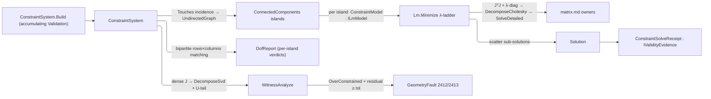

# [RASM_CONSTRAINTS_SOLVER]

`Rasm.Solving` owns one damped Gauss-Newton functor and the parametric-sketch algebra it serves. `Lm.Minimize` is the geometry kernel's one nonlinear least-squares iterate: every `ILmModel` minimizes on the same accept/reject λ-ladder under one attempt budget, routing ceiling-exhausted rank deficiency to `GeometryFault.SingularSystem` while `SolveReceipt` evidence gates each step all-finite. Parametric-sketch solving closes over that functor — a closed `Constraint` `[Union]` is one residual-and-Jacobian algebra, `ConstraintSystem` folds entity↔constraint incidence into QuikGraph islands, and `ConstraintSolver.Solve` returns `Solution`.

Solver geometry composes the settled `Point3d`/`Vector3d` vocabulary and routes every factorization through the `Numerics/matrix` owners. Caller `Op` keys thread through every owner, `ddouble` accumulates `Σr²`, and band-2400 `GeometryFault` cases carry every failure; parameters stay raw `double` and public output is `Solution` with its distinct `ConstraintSolveReceipt`. Sibling `EntityKind` and local `SketchEntityKind` stay separate vocabularies.

## [01]-[INDEX]

- [02]-[LM_FUNCTOR]: `Lm.Minimize` the one damped Gauss-Newton iterate over the `ILmModel` residual+Jacobian floor and `SolvePolicy` ladder.
- [03]-[CONSTRAINT_SOLVER]: `Constraint` algebra, QuikGraph island decomposition, structural and witness DOF verdicts, and `ConstraintSolver.Solve` returning `Solution`.

## [02]-[LM_FUNCTOR]

- Owner: `ILmModel` mints the residual+Jacobian floor — `Dof`, `Seed`, the 106-bit `Norm`, and packed-upper `Linearize` — the open instance-interface seam every residual-row system implements; `SolvePolicy` the λ-ladder policy record carrying the `Canonical` row and clamped `Lower`/`Raise` transitions; `LmState` the internal trial carrier; `LmResult` the typed outcome registering `IValidityEvidence`; `Lm` the static functor surface.
- Cases: `SolveStatus` closes over `Converged` and `Stalled`; the singular outcome rides the `Fin` failure rail as `GeometryFault.SingularSystem`, kept off the status vocabulary.
- Entry: `Lm.Minimize(ILmModel, SolvePolicy, Op?)` is the one nonlinear least-squares entrypoint. It routes `GeometryFault.SingularSystem(rank, dof)` when the damped normal matrix stays rank-deficient past `LambdaCeiling` — rank read as the `JᵀJ` eigen-rank through `SymmetricMatrix.DecomposeEigen`, counted spectral-radius-relative against `EpsilonPolicy.SqrtEpsilon`, a functor-computable witness needing no dense `J`; every other outcome is a success-carrier `LmResult` whose `Status` separates the converged fixpoint from the budget stall.
- Auto: every foreign model member executes inside the `Op.Catch` funnel — policy and model admission reject a non-finite, non-monotone, or budget-uncrossable policy and a mis-shaped or non-finite seed, and no member runs outside the boundary. Convergence is `‖r‖₂ < ResidualTolerance` or a `‖δ‖₂ < StepFloor` stationary step; a zero-diagonal column damps on the bare `λ` floor because multiplicative damping never regularizes an exact zero, holding that coordinate at the seed — the under-constrained manifold behavior the entry promises. One MathNet path `SymmetricMatrix.Of → DecomposeCholesky → SolveDetailed` mints `SolveReceipt` gating each step all-finite, so an indefinite non-throwing factor fails the mint and the ladder climbs rather than accept a NaN step. Every trial increments `Attempts`, accepted and rejected trials share `MaxIterations` so retry recursion cannot outlive the budget, and objective comparison stays `ddouble` until the one result mint admits a `double` readout.
- Receipt: `LmResult` carries the converged outcome; the result mint rejects a 106-bit norm outside the `double` range before construction, and a caller reads `Status` before consuming a stalled vector.
- Packages: `Rasm.Numerics` (`SymmetricMatrix`/`CholeskyResult`/`Dimension`/`PositiveMagnitude`/`EpsilonPolicy` — the `Numerics/matrix` + `Numerics/atoms` owners), TYoshimura.DoubleDouble (`ddouble`/`ddouble.Sqrt`, the 106-bit objective), System.Numerics.Tensors (`TensorPrimitives.Negate`/`Norm`/`Add`), Thinktecture.Runtime.Extensions (`[SmartEnum<int>]`), LanguageExt.Core (`Fin`), BCL inbox.
- Growth: a new descent strategy is a `SolvePolicy` column selecting the step rule on the same `Minimize` fold; a new model is an `ILmModel` conformance; a new stop criterion is one policy column read at the convergence gate.
- Boundary: packed-upper `Linearize` is the functor's contract — `Lm.PackedIndex` mirrors `SymmetricMatrix.FlatIndex` so a model scatters the owner's own layout; `ILmModel.Norm` returns `ddouble` by contract, a model narrowing its objective to `double` re-introducing the summation cancellation the contract kills. Damping expresses on the normal diagonal, the damped matrix is always SPD (Cholesky without pivoting), and the packed-upper `SymmetricMatrix` carries it, so the normal-equations form is chosen over QR-on-`J`, the `√λ`-stacked thin-QR alternative activating only past a conditioning budget. Damped-diagonal assembly inside `Step` is the named span-kernel statement exemption; every failure routes `Fin` over band-2400.

```csharp signature
// --- [RUNTIME_PRELUDE] --------------------------------------------------------------------
using System;
using System.Linq;
using System.Numerics.Tensors;
using DoubleDouble;
using LanguageExt;
using LanguageExt.Common;
using Rasm.Domain;
using Rasm.Numerics;
using Thinktecture;
using static LanguageExt.Prelude;

namespace Rasm.Solving;

// --- [TYPES] ------------------------------------------------------------------------------
[SmartEnum<int>]
public sealed partial class SolveStatus {
    public static readonly SolveStatus Converged = new(key: 0);
    public static readonly SolveStatus Stalled   = new(key: 1);
}

// --- [MODELS] -----------------------------------------------------------------------------
public sealed record SolvePolicy(
    double InitialLambda,
    double LambdaFloor,
    double LambdaCeiling,
    double LambdaUp,
    double LambdaDown,
    PositiveMagnitude ResidualTolerance,
    double StepFloor,
    int MaxIterations) {
    // PositiveMagnitude admits only > EpsilonPolicy.ZeroTolerance (2^-32 ≈ 2.33e-10); Canonical's 1e-9 clears the band.
    public static readonly SolvePolicy Canonical = new(
        InitialLambda: 1e-3, LambdaFloor: double.Epsilon, LambdaCeiling: 1e12,
        LambdaUp: 10.0, LambdaDown: 10.0,
        ResidualTolerance: PositiveMagnitude.Create(1e-9), StepFloor: 1e-12, MaxIterations: 100);

    internal Fin<SolvePolicy> Admit(Op key) {
        SolvePolicy self = this;
        return guard(
            double.IsFinite(self.InitialLambda)
            && double.IsFinite(self.LambdaFloor) && self.LambdaFloor > 0.0 && self.LambdaFloor <= self.InitialLambda
            && double.IsFinite(self.LambdaCeiling) && self.InitialLambda <= self.LambdaCeiling
            && double.IsFinite(self.LambdaUp) && self.LambdaUp > 1.0
            && double.IsFinite(self.LambdaDown) && self.LambdaDown > 1.0
            && double.IsFinite(self.ResidualTolerance.Value) && self.ResidualTolerance.Value > EpsilonPolicy.ZeroTolerance
            && double.IsFinite(self.StepFloor) && self.StepFloor > 0.0
            && self.MaxIterations >= 0
            && (self.MaxIterations == 0
                || Math.Log(self.LambdaCeiling / self.InitialLambda, self.LambdaUp) < self.MaxIterations),
            key.InvalidInput()).ToFin().Map(_ => self);
    }

    internal double Lower(double lambda) => double.Max(lambda / LambdaDown, LambdaFloor);
    internal double Raise(double lambda) => lambda * LambdaUp;
}

readonly record struct LmState(double[] Parameters, ddouble Norm, double Lambda, int Iterations, int Attempts);

public sealed record LmResult(double[] Parameters, double Norm, int Iterations, double Lambda, SolveStatus Status) : IValidityEvidence {
    public bool IsValid => ValidityClaim.All(
        ValidityClaim.Finite(Parameters.AsSpan()),
        ValidityClaim.Finite(Norm),
        ValidityClaim.Nonnegative(Norm),
        ValidityClaim.Of(Iterations >= 0),
        ValidityClaim.Finite(Lambda),
        ValidityClaim.Positive(Lambda),
        ValidityClaim.Of(Status is not null));
}

// --- [SERVICES] ---------------------------------------------------------------------------
// PackedNormal/Gradient use Lm.PackedIndex addressing; Norm is the 106-bit objective by contract.
public interface ILmModel {
    int Dof { get; }
    double[] Seed { get; }
    ddouble Norm(ReadOnlySpan<double> parameters);
    (double[] PackedNormal, double[] Gradient) Linearize(ReadOnlySpan<double> parameters);
}

// --- [OPERATIONS] -------------------------------------------------------------------------
public static class Lm {
    // Mirrors the SymmetricMatrix packed-upper FlatIndex so every model scatters the owner's own layout.
    internal static int PackedIndex(int n, int i, int j) =>
        checked((int)(((long)i * n) - ((long)i * (i - 1) / 2L) + (j - i)));

    public static Fin<LmResult> Minimize(ILmModel model, SolvePolicy policy, Op? key = null) {
        Op op = key.OrDefault();
        return from activeModel in Admit.NotNull(value: model, key: op)
               from activePolicy in Admit.NotNull(value: policy, key: op).Bind(active => active.Admit(key: op))
               from admitted in AdmitModel(model: activeModel, key: op)
               from norm in Objective(model: activeModel, parameters: admitted.Seed, key: op)
               from result in Iterate(model: activeModel, dof: admitted.Dof, policy: activePolicy,
                   state: new LmState(admitted.Seed, norm, activePolicy.InitialLambda, Iterations: 0, Attempts: 0), key: op)
               select result;
    }

    static Fin<(int Dof, double[] Seed)> AdmitModel(ILmModel model, Op key) => key.Catch(() => {
        int dof = model.Dof;
        double[]? source = model.Seed;
        return dof >= 0 && source is not null && source.Length == dof && TensorPrimitives.IsFiniteAll(source)
            ? Fin.Succ((Dof: dof, Seed: (double[])source.Clone()))
            : Fin.Fail<(int Dof, double[] Seed)>(key.InvalidInput());
    });

    static Fin<LmResult> Iterate(ILmModel model, int dof, SolvePolicy policy, LmState state, Op key) {
        if (state.Norm < policy.ResidualTolerance.Value)
            return Result(state, SolveStatus.Converged, key);
        if (dof == 0 || state.Attempts >= policy.MaxIterations)
            return Result(state, SolveStatus.Stalled, key);
        return Linearize(model: model, parameters: state.Parameters, dof: dof, key: key)
            .Bind(linear => Step(model: model, dof: dof, policy: policy, state: state,
                packedNormal: linear.PackedNormal, gradient: linear.Gradient, key: key));
    }

    static Fin<LmResult> Step(ILmModel model, int dof, SolvePolicy policy, LmState state, double[] packedNormal, double[] gradient, Op key) {
        int n = dof;
        if (state.Lambda > policy.LambdaCeiling)
            return SymmetricMatrix.Of(Dimension.Create(n), new Arr<double>(packedNormal), key)
                .Bind(normal => normal.DecomposeEigen(key))
                .Map(static pairs => pairs.Map(static p => Math.Abs(p.Eigenvalue)))
                .Map(spectrum => spectrum.Fold(0.0, Math.Max) is var radius && radius <= 0.0
                    ? 0
                    : spectrum.Count(v => v > EpsilonPolicy.SqrtEpsilon * radius))
                .Match(
                    Succ: rank => Fin.Fail<LmResult>(new GeometryFault.SingularSystem(rank, n).ToError()),
                    Fail: _ => Fin.Fail<LmResult>(new GeometryFault.SingularSystem(0, n).ToError()));
        if (state.Attempts >= policy.MaxIterations)
            return Result(state, SolveStatus.Stalled, key);

        double[] damped = (double[])packedNormal.Clone();
        // Zero-diagonal column (residual-untouched DOF) damps on bare λ — multiplicative damping never
        // regularizes an exact zero, and its zero gradient holds the seed short of a false SingularSystem.
        for (int i = 0; i < n; i++) {
            int di = PackedIndex(n, i, i);
            damped[di] = packedNormal[di] > 0.0 ? packedNormal[di] * (1.0 + state.Lambda) : state.Lambda;
        }
        double[] rhs = new double[n];
        TensorPrimitives.Negate<double>(gradient, rhs);

        // ONE MathNet path mints SolveReceipt gating each step all-finite, so an indefinite factor fails the mint and the λ-ladder climbs.
        Fin<Arr<double>> solve = SymmetricMatrix.Of(Dimension.Create(n), new Arr<double>(damped), key)
            .Bind(spd => spd.DecomposeCholesky(key))
            .Bind(chol => chol.SolveDetailed(new Arr<double>(rhs), key))
            .Map(static receipt => receipt.Solution);
        LmState attempted = state with { Attempts = state.Attempts + 1 };
        return solve.Match(
            Succ: delta => Advance(state.Parameters, delta, key).Bind(trial => {
                double stepNorm = TensorPrimitives.Norm<double>(delta.AsSpan());
                return Objective(model, trial, key).Bind(trialNorm =>
                    // 106-bit accept test: the deciding digits of two nearly equal norms survive; accepted λ carries down.
                    trialNorm < state.Norm
                        ? stepNorm < policy.StepFloor
                            ? Result(attempted with { Parameters = trial, Norm = trialNorm, Iterations = state.Iterations + 1 }, SolveStatus.Converged, key)
                            : Iterate(model, dof, policy, attempted with { Parameters = trial, Norm = trialNorm, Lambda = policy.Lower(state.Lambda), Iterations = state.Iterations + 1 }, key)
                        : Step(model, dof, policy, attempted with { Lambda = policy.Raise(state.Lambda) }, packedNormal, gradient, key));
            }),
            Fail: _ => Step(model, dof, policy, attempted with { Lambda = policy.Raise(state.Lambda) }, packedNormal, gradient, key));
    }

    static Fin<(double[] PackedNormal, double[] Gradient)> Linearize(ILmModel model, double[] parameters, int dof, Op key) =>
        key.Catch(() => {
            (double[] packedNormal, double[] gradient) = model.Linearize(parameters);
            long packedLength = (long)dof * (dof + 1L) / 2L;
            return packedLength <= int.MaxValue
                && packedNormal is not null && packedNormal.Length == packedLength && TensorPrimitives.IsFiniteAll(packedNormal)
                && gradient is not null && gradient.Length == dof && TensorPrimitives.IsFiniteAll(gradient)
                    ? Fin.Succ((PackedNormal: packedNormal, Gradient: gradient))
                    : Fin.Fail<(double[] PackedNormal, double[] Gradient)>(key.InvalidResult());
        });

    static Fin<ddouble> Objective(ILmModel model, double[] parameters, Op key) =>
        key.Catch(body: () => model.Norm(parameters) switch {
            ddouble norm when ddouble.IsFinite(norm) && ddouble.Sign(norm) >= 0 => Fin.Succ(norm),
            _ => Fin.Fail<ddouble>(key.InvalidResult()),
        });

    static Fin<double[]> Advance(double[] parameters, Arr<double> delta, Op key) {
        double[] next = (double[])parameters.Clone();
        TensorPrimitives.Add<double>(parameters, delta.AsSpan(), next);
        return TensorPrimitives.IsFiniteAll<double>(next)
            ? Fin.Succ(next)
            : Fin.Fail<double[]>(key.InvalidResult());
    }

    static Fin<LmResult> Result(LmState state, SolveStatus status, Op key) =>
        ddouble.IsFinite(state.Norm) && ddouble.Sign(state.Norm) >= 0 && state.Norm <= (ddouble)double.MaxValue
        && TensorPrimitives.IsFiniteAll<double>(state.Parameters)
        && double.IsFinite(state.Lambda) && state.Lambda > 0.0 && state.Iterations >= 0 && status is not null
            ? Fin.Succ(new LmResult(state.Parameters, (double)state.Norm, state.Iterations, state.Lambda, status))
            : Fin.Fail<LmResult>(key.InvalidResult());
}
```

## [03]-[CONSTRAINT_SOLVER]

- Owner: `SketchEntityKind` `[SmartEnum<int>]` discriminates the parametric primitive, each row carrying its parameter `Arity` and a `Carrier` binding to the `Rasm.Domain` `Kind` so admission faults mint typed discriminants; `Entity` is one parametric-primitive algebra over every kind, carrying its kind and its `[Offset, Offset+Arity)` slice into the flat parameter vector; `Constraint` the closed relation `[Union]` whose generated-`Switch` `Residual`, `Touches`, and `WellFormed` folds return residual rows with analytic partials, name the incident entities, and state the per-case operand-kind law; `ConstraintSystem` the immutable graph with accumulating `Build` admission and the QuikGraph `Islands` decomposition; `DofAnalysis`/`DofReport` the verdict and per-island evidence; `ConstraintModel` the island-scoped `ILmModel`; `ConstraintSolveReceipt`/`Solution` the outcome pair; `ConstraintSolver` the static surface owning `Analyze`/`StructuralAnalyze`/`WitnessAnalyze` and the island-folded `Solve`.
- Cases: `Constraint` is the closed relation `[Union]` the fence rosters; `Ground` is the gauge anchor whose absence leaves the rigid-body freedoms honestly under-constrained, and `Distance`, `Tangent`, and `OnCircle` carry squared residuals staying C¹ at coincident and zero-length configurations where the `√`-form Jacobian is undefined. `DofAnalysis` adds the witness-numeric `RedundantConsistent` to the three structural verdicts — the redundant-but-consistent system a row count misclassifies as over-constrained. `SketchEntityKind` discriminates the parametric primitives, each row carrying its parameter arity.
- Entry: `ConstraintSolver.Solve(ConstraintSystem, SolvePolicy, Op?)` decomposes into islands, instantiates `ConstraintModel : ILmModel` per island, runs `Lm.Minimize` on each small normal system, scatters the sub-solutions back into one parameter vector, and gates the assembled result: `GeometryFault.OverConstrained` when the witness verdict is over-determined and the global residual stays past tolerance — a redundant-and-inconsistent system has no configuration, its payload carrying the dependent-row count `rows − rank(J)` at the witness — with `GeometryFault.SingularSystem` bubbling from any island's ladder; a well- or under-constrained system always solves, LM finding the nearest point on the manifold to the seed. `Analyze` is the pure total structural row-count verdict, `StructuralAnalyze` the per-island maximum-matching refinement, `WitnessAnalyze` the numeric-rank adjudicator. `ConstraintSystem.Build` is the accumulating admission: every non-finite seed value, seed/arity mismatch, dangling reference (membership tests the full `Entity` value, so a mis-kinded reference at a valid offset is equally dangling), operand-kind mismatch, duplicate constraint, and the empty-system report exit together through one `Validation<Error, T>` traverse.
- Auto: `Islands` folds the entity↔constraint incidence into a transient `UndirectedGraph` and reads `ConnectedComponents` — each component solves on its own `dof_island²` normal matrix instead of `ParameterCount²`, the decomposition that makes a many-sketch document solve at the cost of its largest island; an untouched entity is a zero-row island converging at iteration 0. Per island, `ConstraintModel` gathers the columns into a compact local vector over a single-writer global scratch (islands are column-disjoint, so the scratch never races), folds `Σr²` at 106-bit `ddouble`, and accumulates packed-upper `JᵀJ` + `Jᵀr` from the analytic partials with global→local remap, so the dense `J` never materializes on the LM lane. Residual scatter accumulates rather than overwrites because an arm can emit one column twice for a shared or self-aliased entity. `StructuralAnalyze` reads `MaximumBipartiteMatchingAlgorithm` cardinality as the König structural rank — row deficiency localizes over-constraint to its island and column surplus under-constraint, the locality a global row count is blind to. `WitnessAnalyze` builds dense `J(seed)` through `DecomposeSvd`, reads true DOF `ParameterCount − Rank`, and projects the residual onto the left-null space via the `SvdResult.U` tail — a vanishing tail is `RedundantConsistent`, redundant constraints that all hold.
- Receipt: `Solve` returns `Solution` carrying the converged parameters and the typed `ConstraintSolveReceipt`; `DofReport` is the diagnosis evidence a sketch UI reads to name which island over-constrains — the island whose deficiency row is positive.
- Packages: `Rhino.Geometry` (`Point3d`/`Vector3d` for entity geometry), `Rasm.Numerics` (`SymmetricMatrix`/`CholeskyResult`/`Matrix`/`SvdResult`/`Dimension`/`PositiveMagnitude` — the `Numerics/matrix` + `Numerics/atoms` owners), QuikGraph (`UndirectedGraph`/`AdjacencyGraph`, `ConnectedComponents`, `MaximumBipartiteMatchingAlgorithm` — the incidence walks), TYoshimura.DoubleDouble (`ddouble` + `DoubleDoubleEnumerableExpand.Sum`, the 106-bit `Σr²`), Thinktecture.Runtime.Extensions (`[Union]`/`[SmartEnum<int>]`, generated `Switch`), LanguageExt.Core (`Fin`/`Validation`/`Seq`, the accumulating `.Traverse` admission), BCL inbox.
- Growth: a new geometric relation is one `Constraint` case carrying its `Residual`, `Touches`, and `WellFormed` arms over the same functor; a new parametric primitive is one `SketchEntityKind` row with its arity, `Carrier`, and geometry accessors; a new DOF refinement is a `DofReport` column; a 3D sketch tier is an `Entity` accessor widening over the same constraint algebra.
- Boundary: the relations differ only in residual expression and analytic partials, never in the iterate, so one `Constraint` `[Union]` with a generated-`Switch` fold owns them all — compile-exhaustive, a new case breaking `Residual`, `Touches`, and `WellFormed` loudly; `Concentric` reuses the center-coincidence rows as sketch vocabulary over the one algebra. Every arm's Jacobian is analytic. Every `Numerics/matrix` call threads the caller's `Op` key, QuikGraph owns the component and matching walks, and every graph verdict exits as a typed domain value. `ConstraintSystem` is immutable and `Solve` returns fresh packed arrays; the `ConstraintModel` scratch is the single-writer run-local exception that never escapes the model. Every failure routes `Fin` over band-2400 as `GeometryFault.<Case>.ToError()`, and the graph-assembly and scatter loops are the named span-kernel statement exemption.

```csharp signature
// --- [RUNTIME_PRELUDE] --------------------------------------------------------------------
using System;
using System.Collections.Frozen;
using System.Collections.Generic;
using System.Linq;
using System.Numerics.Tensors;
using DoubleDouble;
using LanguageExt;
using LanguageExt.Common;
using QuikGraph;
using QuikGraph.Algorithms;
using QuikGraph.Algorithms.MaximumFlow;
using Rasm.Domain;
using Rasm.Numerics;
using Rhino.Geometry;
using Thinktecture;
using static LanguageExt.Prelude;
// CS0104 guard: Rhino.Geometry.Matrix/Dimension collide with the Rasm.Numerics owners under the dual usings.
using Dimension = Rasm.Numerics.Dimension;
using Matrix = Rasm.Numerics.Matrix;

namespace Rasm.Solving;

// --- [TYPES] ------------------------------------------------------------------------------
[SmartEnum<int>]
public sealed partial class SketchEntityKind {
    public static readonly SketchEntityKind Point  = new(key: 0, arity: 2, carrier: Kind.Point);
    public static readonly SketchEntityKind Line   = new(key: 1, arity: 4, carrier: Kind.Line);
    public static readonly SketchEntityKind Circle = new(key: 2, arity: 3, carrier: Kind.Circle);

    public int Arity { get; }
    public Kind Carrier { get; }
}

[SmartEnum<int>]
public sealed partial class DofAnalysis {
    public static readonly DofAnalysis WellConstrained     = new(key: 0);
    public static readonly DofAnalysis UnderConstrained    = new(key: 1);
    public static readonly DofAnalysis OverConstrained     = new(key: 2);
    public static readonly DofAnalysis RedundantConsistent = new(key: 3);
}

// --- [MODELS] -----------------------------------------------------------------------------
public readonly record struct Entity(SketchEntityKind Kind, int Offset) {
    public int Arity => Kind.Arity;

    public Point3d Origin(ReadOnlySpan<double> p) => new(p[Offset], p[Offset + 1], 0.0);

    public Point3d End(ReadOnlySpan<double> p) => new(p[Offset + 2], p[Offset + 3], 0.0);

    public Vector3d Direction(ReadOnlySpan<double> p) => End(p) - Origin(p);
    public double Radius(ReadOnlySpan<double> p) => p[Offset + 2];
}

public readonly record struct ResidualRow(double Value, Seq<(int Column, double Partial)> Partials);

[Union(ConversionFromValue = ConversionOperatorsGeneration.None)]
public abstract partial record Constraint {
    private Constraint() { }

    public sealed record Distance(Entity A, Entity B, double Target) : Constraint;
    public sealed record Angle(Entity A, Entity B, double Radians) : Constraint;
    public sealed record Coincident(Entity A, Entity B) : Constraint;
    public sealed record Concentric(Entity A, Entity B) : Constraint;
    public sealed record Parallel(Entity A, Entity B) : Constraint;
    public sealed record Perpendicular(Entity A, Entity B) : Constraint;
    public sealed record Tangent(Entity Line, Entity Circle) : Constraint;
    public sealed record PointOnLine(Entity Point, Entity Line) : Constraint;
    public sealed record Midpoint(Entity Point, Entity Line) : Constraint;
    public sealed record Axis(Entity Line, bool Horizontal) : Constraint;
    public sealed record Equal(Entity A, Entity B) : Constraint;
    public sealed record Symmetric(Entity A, Entity B, Entity Axis) : Constraint;
    public sealed record Ground(Entity Point, double X, double Y) : Constraint;
    public sealed record Radius(Entity Circle, double Target) : Constraint;
    public sealed record OnCircle(Entity Point, Entity Circle) : Constraint;

    // Compile-exhaustive residual fold: a new case breaks this dispatch and Touches loudly.
    public Seq<ResidualRow> Residual(double[] p) =>
        Switch(
            state: p,
            distance:      static (p, d) => Seq(DistanceRow(d.A, d.B, d.Target, p)),
            angle:         static (p, a) => Seq(AngleRow(a.A, a.B, a.Radians, p)),
            coincident:    static (p, c) => CoincidentRows(c.A, c.B, p),
            concentric:    static (p, c) => CoincidentRows(c.A, c.B, p),
            parallel:      static (p, l) => Seq(CrossRow(l.A, l.B, p)),
            perpendicular: static (p, l) => Seq(DotRow(l.A, l.B, p)),
            tangent:       static (p, t) => Seq(TangentRow(t.Line, t.Circle, p)),
            pointOnLine:   static (p, o) => Seq(PointOnLineRow(o.Point, o.Line, p)),
            midpoint:      static (p, m) => MidpointRows(m.Point, m.Line, p),
            axis:          static (p, x) => Seq(AxisRow(x.Line, x.Horizontal, p)),
            equal:         static (p, e) => Seq(EqualRow(e.A, e.B, p)),
            symmetric:     static (p, s) => SymmetricRows(s.A, s.B, s.Axis, p),
            ground:        static (p, g) => GroundRows(g.Point, g.X, g.Y, p),
            radius:        static (p, r) => Seq(RadiusRow(r.Circle, r.Target, p)),
            onCircle:      static (p, o) => Seq(OnCircleRow(o.Point, o.Circle, p)));

    public Seq<Entity> Touches =>
        Switch(
            distance:      static d => Seq(d.A, d.B),
            angle:         static a => Seq(a.A, a.B),
            coincident:    static c => Seq(c.A, c.B),
            concentric:    static c => Seq(c.A, c.B),
            parallel:      static l => Seq(l.A, l.B),
            perpendicular: static l => Seq(l.A, l.B),
            tangent:       static t => Seq(t.Line, t.Circle),
            pointOnLine:   static o => Seq(o.Point, o.Line),
            midpoint:      static m => Seq(m.Point, m.Line),
            axis:          static x => Seq(x.Line),
            equal:         static e => Seq(e.A, e.B),
            symmetric:     static s => Seq(s.A, s.B, s.Axis),
            ground:        static g => Seq(g.Point),
            radius:        static r => Seq(r.Circle),
            onCircle:      static o => Seq(o.Point, o.Circle));

    // Operand-kind law: an arm reading End/Direction/Radius demands the owning kind (a mismatch reads a
    // FOREIGN slice); Origin-only arms are total; Equal names Line/Circle positively so a new kind rejects until its arm lands.
    public bool WellFormed =>
        Switch(
            distance:      static _ => true,
            angle:         static a => a.A.Kind == SketchEntityKind.Line && a.B.Kind == SketchEntityKind.Line,
            coincident:    static _ => true,
            concentric:    static _ => true,
            parallel:      static l => l.A.Kind == SketchEntityKind.Line && l.B.Kind == SketchEntityKind.Line,
            perpendicular: static l => l.A.Kind == SketchEntityKind.Line && l.B.Kind == SketchEntityKind.Line,
            tangent:       static t => t.Line.Kind == SketchEntityKind.Line && t.Circle.Kind == SketchEntityKind.Circle,
            pointOnLine:   static o => o.Line.Kind == SketchEntityKind.Line,
            midpoint:      static m => m.Line.Kind == SketchEntityKind.Line,
            axis:          static x => x.Line.Kind == SketchEntityKind.Line,
            equal:         static e => e.A.Kind == e.B.Kind && (e.A.Kind == SketchEntityKind.Line || e.A.Kind == SketchEntityKind.Circle),
            symmetric:     static s => s.Axis.Kind == SketchEntityKind.Line,
            ground:        static _ => true,
            radius:        static r => r.Circle.Kind == SketchEntityKind.Circle,
            onCircle:      static o => o.Circle.Kind == SketchEntityKind.Circle);

    // --- [RESIDUAL_ROWS]
    // Squared distance form: C¹ at coincident configurations where the √-form Jacobian is undefined.
    static ResidualRow DistanceRow(Entity a, Entity b, double target, ReadOnlySpan<double> p) {
        Point3d pa = a.Origin(p), pb = b.Origin(p);
        double dx = pa.X - pb.X, dy = pa.Y - pb.Y;
        double r = dx * dx + dy * dy - target * target;
        return new ResidualRow(r, Seq(
            (a.Offset, 2.0 * dx), (a.Offset + 1, 2.0 * dy),
            (b.Offset, -2.0 * dx), (b.Offset + 1, -2.0 * dy)));
    }

    static ResidualRow AngleRow(Entity a, Entity b, double radians, ReadOnlySpan<double> p) {
        Vector3d u = a.Direction(p), v = b.Direction(p);
        double cross = u.X * v.Y - u.Y * v.X, dot = u.X * v.X + u.Y * v.Y;
        double denom = cross * cross + dot * dot;
        double inv = denom > EpsilonPolicy.ZeroTolerance * EpsilonPolicy.ZeroTolerance ? 1.0 / denom : 0.0;
        double r = Math.Atan2(cross, dot) - radians;
        // ∂atan2(c,d)/∂θ = (d·∂c − c·∂d)·inv; the v-side cross terms carry the SAME minus sign as the u-side.
        double dAux = (v.Y * dot - v.X * cross) * inv, dAuy = (-v.X * dot - v.Y * cross) * inv;
        double dBvx = (-u.Y * dot - u.X * cross) * inv, dBvy = (u.X * dot - u.Y * cross) * inv;
        return new ResidualRow(r, Seq(
            (a.Offset, -dAux), (a.Offset + 1, -dAuy), (a.Offset + 2, dAux), (a.Offset + 3, dAuy),
            (b.Offset, -dBvx), (b.Offset + 1, -dBvy), (b.Offset + 2, dBvx), (b.Offset + 3, dBvy)));
    }

    static Seq<ResidualRow> CoincidentRows(Entity a, Entity b, ReadOnlySpan<double> p) {
        Point3d pa = a.Origin(p), pb = b.Origin(p);
        return Seq(
            new ResidualRow(pa.X - pb.X, Seq((a.Offset, 1.0), (b.Offset, -1.0))),
            new ResidualRow(pa.Y - pb.Y, Seq((a.Offset + 1, 1.0), (b.Offset + 1, -1.0))));
    }

    static ResidualRow CrossRow(Entity a, Entity b, ReadOnlySpan<double> p) {
        Vector3d u = a.Direction(p), v = b.Direction(p);
        double r = u.X * v.Y - u.Y * v.X;
        return new ResidualRow(r, Seq(
            (a.Offset, -v.Y), (a.Offset + 1, v.X), (a.Offset + 2, v.Y), (a.Offset + 3, -v.X),
            (b.Offset, u.Y), (b.Offset + 1, -u.X), (b.Offset + 2, -u.Y), (b.Offset + 3, u.X)));
    }

    static ResidualRow DotRow(Entity a, Entity b, ReadOnlySpan<double> p) {
        Vector3d u = a.Direction(p), v = b.Direction(p);
        double r = u.X * v.X + u.Y * v.Y;
        return new ResidualRow(r, Seq(
            (a.Offset, -v.X), (a.Offset + 1, -v.Y), (a.Offset + 2, v.X), (a.Offset + 3, v.Y),
            (b.Offset, -u.X), (b.Offset + 1, -u.Y), (b.Offset + 2, u.X), (b.Offset + 3, u.Y)));
    }

    // Squared tangency form: dist(center,line)² − radius², C¹ through the degenerate zero-length line.
    static ResidualRow TangentRow(Entity line, Entity circle, ReadOnlySpan<double> p) {
        Point3d s = line.Origin(p), e = line.End(p), c = circle.Origin(p);
        double radius = circle.Radius(p);
        double dx = e.X - s.X, dy = e.Y - s.Y;
        double cx = c.X - s.X, cy = c.Y - s.Y;
        double cross = dx * cy - dy * cx;
        double len2 = dx * dx + dy * dy;
        double invLen2 = len2 > EpsilonPolicy.ZeroTolerance * EpsilonPolicy.ZeroTolerance ? 1.0 / len2 : 0.0;
        double r = cross * cross * invLen2 - radius * radius;
        double g = cross * cross, gh = g * invLen2 * invLen2;
        double dStartX = (2.0 * cross * (dy - cy) * invLen2) - gh * (-2.0 * dx);
        double dStartY = (2.0 * cross * (cx - dx) * invLen2) - gh * (-2.0 * dy);
        double dEndX = (2.0 * cross * cy * invLen2) - gh * (2.0 * dx);
        double dEndY = (2.0 * cross * (-cx) * invLen2) - gh * (2.0 * dy);
        double dCenterX = 2.0 * cross * (-dy) * invLen2;
        double dCenterY = 2.0 * cross * dx * invLen2;
        return new ResidualRow(r, Seq(
            (line.Offset, dStartX), (line.Offset + 1, dStartY), (line.Offset + 2, dEndX), (line.Offset + 3, dEndY),
            (circle.Offset, dCenterX), (circle.Offset + 1, dCenterY), (circle.Offset + 2, -2.0 * radius)));
    }

    static ResidualRow PointOnLineRow(Entity point, Entity line, ReadOnlySpan<double> p) {
        Point3d q = point.Origin(p);
        Point3d s = line.Origin(p), e = line.End(p);
        double r = (e.X - s.X) * (q.Y - s.Y) - (e.Y - s.Y) * (q.X - s.X);
        return new ResidualRow(r, Seq(
            (point.Offset, s.Y - e.Y), (point.Offset + 1, e.X - s.X),
            (line.Offset, e.Y - q.Y), (line.Offset + 1, q.X - e.X),
            (line.Offset + 2, q.Y - s.Y), (line.Offset + 3, s.X - q.X)));
    }

    static Seq<ResidualRow> MidpointRows(Entity point, Entity line, ReadOnlySpan<double> p) {
        Point3d q = point.Origin(p);
        Point3d s = line.Origin(p), e = line.End(p);
        return Seq(
            new ResidualRow(q.X - 0.5 * (s.X + e.X), Seq((point.Offset, 1.0), (line.Offset, -0.5), (line.Offset + 2, -0.5))),
            new ResidualRow(q.Y - 0.5 * (s.Y + e.Y), Seq((point.Offset + 1, 1.0), (line.Offset + 1, -0.5), (line.Offset + 3, -0.5))));
    }

    static ResidualRow AxisRow(Entity line, bool horizontal, ReadOnlySpan<double> p) {
        Point3d s = line.Origin(p), e = line.End(p);
        return horizontal
            ? new ResidualRow(e.Y - s.Y, Seq((line.Offset + 1, -1.0), (line.Offset + 3, 1.0)))
            : new ResidualRow(e.X - s.X, Seq((line.Offset, -1.0), (line.Offset + 2, 1.0)));
    }

    static ResidualRow EqualRow(Entity a, Entity b, ReadOnlySpan<double> p) {
        if (a.Kind == SketchEntityKind.Circle && b.Kind == SketchEntityKind.Circle) {
            double ra = a.Radius(p), rb = b.Radius(p);
            return new ResidualRow(ra - rb, Seq((a.Offset + 2, 1.0), (b.Offset + 2, -1.0)));
        }
        Vector3d u = a.Direction(p), v = b.Direction(p);
        double r = (u.X * u.X + u.Y * u.Y) - (v.X * v.X + v.Y * v.Y);
        return new ResidualRow(r, Seq(
            (a.Offset, -2.0 * u.X), (a.Offset + 1, -2.0 * u.Y), (a.Offset + 2, 2.0 * u.X), (a.Offset + 3, 2.0 * u.Y),
            (b.Offset, 2.0 * v.X), (b.Offset + 1, 2.0 * v.Y), (b.Offset + 2, -2.0 * v.X), (b.Offset + 3, -2.0 * v.Y)));
    }

    static Seq<ResidualRow> SymmetricRows(Entity a, Entity b, Entity axis, ReadOnlySpan<double> p) {
        Point3d pa = a.Origin(p), pb = b.Origin(p), s = axis.Origin(p), e = axis.End(p);
        double ax = e.X - s.X, ay = e.Y - s.Y;
        double mx = 0.5 * (pa.X + pb.X) - s.X, my = 0.5 * (pa.Y + pb.Y) - s.Y;
        double onAxis = ax * my - ay * mx;
        double chordX = pa.X - pb.X, chordY = pa.Y - pb.Y;
        double perp = chordX * ax + chordY * ay;
        // onAxis = ax·my − ay·mx over m = ½(pa+pb) − s: ∂/∂pa.X = −½ay, ∂/∂pa.Y = ½ax (endpoints enter
        // through the midpoint symmetrically); s couples through ax, ay, mx, my; e through ax, ay.
        return Seq(
            new ResidualRow(onAxis, Seq(
                (a.Offset, -0.5 * ay), (a.Offset + 1, 0.5 * ax), (b.Offset, -0.5 * ay), (b.Offset + 1, 0.5 * ax),
                (axis.Offset, ay - my), (axis.Offset + 1, mx - ax), (axis.Offset + 2, my), (axis.Offset + 3, -mx))),
            new ResidualRow(perp, Seq(
                (a.Offset, ax), (a.Offset + 1, ay), (b.Offset, -ax), (b.Offset + 1, -ay),
                (axis.Offset, -chordX), (axis.Offset + 1, -chordY), (axis.Offset + 2, chordX), (axis.Offset + 3, chordY))));
    }

    // Grounding pins the rigid-body gauge: an unanchored sketch reports its translation/rotation freedoms as honest under-constraint.
    static Seq<ResidualRow> GroundRows(Entity point, double x, double y, ReadOnlySpan<double> p) {
        Point3d q = point.Origin(p);
        return Seq(
            new ResidualRow(q.X - x, Seq((point.Offset, 1.0))),
            new ResidualRow(q.Y - y, Seq((point.Offset + 1, 1.0))));
    }

    static ResidualRow RadiusRow(Entity circle, double target, ReadOnlySpan<double> p) =>
        new(circle.Radius(p) - target, Seq((circle.Offset + 2, 1.0)));

    // Squared membership |q − c|² − r²: C¹ at the center-coincident configuration.
    static ResidualRow OnCircleRow(Entity point, Entity circle, ReadOnlySpan<double> p) {
        Point3d q = point.Origin(p), c = circle.Origin(p);
        double radius = circle.Radius(p);
        double dx = q.X - c.X, dy = q.Y - c.Y;
        return new ResidualRow((dx * dx) + (dy * dy) - (radius * radius), Seq(
            (point.Offset, 2.0 * dx), (point.Offset + 1, 2.0 * dy),
            (circle.Offset, -2.0 * dx), (circle.Offset + 1, -2.0 * dy), (circle.Offset + 2, -2.0 * radius)));
    }
}

// Island = one weak component of the entity↔constraint incidence; ordinals index the owning system.
public readonly record struct ConstraintIsland(Seq<int> Entities, Seq<int> Constraints);

public sealed record DofReport(
    DofAnalysis Verdict,
    int StructuralRank,
    int MatchingDeficiency,
    Seq<(int Island, DofAnalysis Verdict, int FreeDof, int Deficiency)> Islands) : IValidityEvidence {
    public bool IsValid => ValidityClaim.All(
        ValidityClaim.Of(Verdict is not null),
        ValidityClaim.Of(StructuralRank >= 0 && MatchingDeficiency >= 0),
        ValidityClaim.Of(Islands.ForAll(static row => row.Verdict is not null && row.FreeDof >= 0 && row.Deficiency >= 0)));
}

public sealed record ConstraintSystem(
    Seq<Entity> Entities,
    Seq<Constraint> Constraints,
    double[] Seed,
    int ParameterCount) {
    // Accumulating admission: every defect reports in one verdict through the Validation traverse, never first-defect-only.
    public static Fin<ConstraintSystem> Build(
        Seq<(SketchEntityKind Kind, double[] Initial)> entities, Seq<Constraint> constraints, Op? key = null) {
        // Eager placement pass: a lazy Map over a mutable offset capture reads offset before it advances.
        List<Entity> placedList = new(entities.Count);
        int offset = 0;
        foreach ((SketchEntityKind Kind, double[] Initial) e in entities) { placedList.Add(new Entity(e.Kind, offset)); offset += e.Kind.Arity; }
        Seq<Entity> placed = toSeq(placedList);
        double[] seed = new double[offset];
        int cursor = 0;
        foreach ((SketchEntityKind Kind, double[] Initial) e in entities) {
            if (e.Initial.Length == e.Kind.Arity) e.Initial.CopyTo(seed, cursor);
            cursor += e.Kind.Arity;
        }
        // Membership on the FULL Entity value (Kind + Offset): an offset-only probe admits a mis-kinded reference that reads a foreign slice.
        LanguageExt.HashSet<Entity> placedSet = toHashSet(placed);
        Seq<Validation<Error, Unit>> probes =
            (entities.IsEmpty
                ? Seq((Validation<Error, Unit>)new GeometryFault.DegenerateInput(Kind.Point, -1, "empty-system").ToError())
                : Seq<Validation<Error, Unit>>())
            + entities.Map(static (item, index) => (Item: item, Index: index))
                .Filter(static row => row.Item.Initial.Length != row.Item.Kind.Arity)
                .Map(row => (Validation<Error, Unit>)new GeometryFault.DegenerateInput(row.Item.Kind.Carrier, row.Index, "seed-arity-mismatch").ToError())
            + entities.Map(static (item, index) => (Item: item, Index: index))
                .Filter(static row => !TensorPrimitives.IsFiniteAll<double>(row.Item.Initial))
                .Map(row => (Validation<Error, Unit>)new GeometryFault.DegenerateInput(row.Item.Kind.Carrier, row.Index, "non-finite-seed").ToError())
            + constraints.Map(static (constraint, index) => (Constraint: constraint, Index: index))
                .Filter(row => !row.Constraint.Touches.ForAll(entity => placedSet.Contains(entity)))
                .Map(row => (Validation<Error, Unit>)new GeometryFault.DegenerateInput(Kind.Point, row.Index, "dangling-entity-reference").ToError())
            + constraints.Map(static (constraint, index) => (Constraint: constraint, Index: index))
                .Filter(static row => !row.Constraint.WellFormed)
                .Map(row => (Validation<Error, Unit>)new GeometryFault.DegenerateInput(Kind.Point, row.Index, "operand-kind-mismatch").ToError())
            + toSeq(constraints.CountBy(static constraint => constraint))
                .Filter(static group => group.Value > 1)
                .Map(group => (Validation<Error, Unit>)new GeometryFault.DegenerateInput(Kind.Point, -1, $"duplicate-constraint:x{group.Value}").ToError());
        return probes.Traverse(identity).As()
            .Map(_ => new ConstraintSystem(placed, constraints, seed, offset))
            .ToFin();
    }

    // DR-planner decomposition: entity ordinals 0..E-1, constraint ordinals E..E+C-1; each weak component solves on its own small normal matrix.
    internal Seq<ConstraintIsland> Islands() {
        FrozenDictionary<int, int> byOffset = Entities.Map(static (entity, ordinal) => (entity.Offset, Ordinal: ordinal))
            .ToDictionary(static row => row.Offset, static row => row.Ordinal)
            .ToFrozenDictionary();
        UndirectedGraph<int, SEdge<int>> graph = new(allowParallelEdges: false);
        graph.AddVertexRange(Enumerable.Range(0, Entities.Count + Constraints.Count));
        Constraints.Map(static (constraint, ordinal) => (Constraint: constraint, Ordinal: ordinal))
            .Iter(row => row.Constraint.Touches.Iter(entity =>
                graph.AddEdge(new SEdge<int>(byOffset[entity.Offset], Entities.Count + row.Ordinal))));
        Dictionary<int, int> component = new();
        int count = graph.ConnectedComponents(component);
        ConstraintSystem self = this;
        return toSeq(Enumerable.Range(0, count)).Map(island => new ConstraintIsland(
            Entities: toSeq(Enumerable.Range(0, self.Entities.Count).Where(e => component[e] == island)),
            Constraints: toSeq(Enumerable.Range(0, self.Constraints.Count).Where(c => component[self.Entities.Count + c] == island))));
    }
}

public sealed record ConstraintSolveReceipt(
    SolveStatus Status,
    DofAnalysis Dof,
    double ResidualNorm,
    int Iterations,
    double TerminalLambda,
    int ResidualRows,
    int Islands) : IValidityEvidence {
    public bool IsValid => ValidityClaim.All(
        ValidityClaim.Of(Status is not null && Dof is not null),
        ValidityClaim.Finite(ResidualNorm),
        ValidityClaim.Nonnegative(ResidualNorm),
        ValidityClaim.Of(Iterations >= 0 && ResidualRows >= 0 && Islands >= 1),
        ValidityClaim.Finite(TerminalLambda),
        ValidityClaim.Nonnegative(TerminalLambda));
}

public sealed record Solution(double[] Parameters, ConstraintSolveReceipt Receipt);

// --- [OPERATIONS] -------------------------------------------------------------------------
// Island-scoped ILmModel over a single-writer scratch: islands are column-disjoint, so the scratch never races.
internal sealed class ConstraintModel : ILmModel {
    readonly ConstraintSystem system;
    readonly Seq<int> constraints;
    readonly int[] columns;
    readonly int[] globalToLocal;
    readonly double[] scratch;

    internal ConstraintModel(ConstraintSystem system, ConstraintIsland island, double[] current) {
        this.system = system;
        constraints = island.Constraints;
        columns = [.. island.Entities.Bind(ordinal => {
            Entity entity = system.Entities[ordinal];
            return toSeq(Enumerable.Range(entity.Offset, entity.Arity));
        })];
        globalToLocal = new int[system.ParameterCount];
        Array.Fill(globalToLocal, -1);
        for (int local = 0; local < columns.Length; local++) globalToLocal[columns[local]] = local;
        scratch = (double[])current.Clone();
        Seed = [.. columns.Select(column => current[column])];
    }

    public int Dof => columns.Length;

    public double[] Seed { get; }

    public ddouble Norm(ReadOnlySpan<double> parameters) {
        Scatter(parameters);
        double[] image = scratch;
        ConstraintSystem home = system;
        return ddouble.Sqrt(constraints
            .Bind(ordinal => home.Constraints[ordinal].Residual(image))
            .Map(static row => (ddouble)row.Value * row.Value)
            .Sum());
    }

    // Packed-upper JᵀJ + Jᵀr from the analytic partials with global→local remap; sums ACCUMULATE because an arm can emit one column twice for a self-aliased entity.
    public (double[] PackedNormal, double[] Gradient) Linearize(ReadOnlySpan<double> parameters) {
        Scatter(parameters);
        int n = columns.Length;
        double[] normal = new double[n * (n + 1) / 2];
        double[] gradient = new double[n];
        foreach (int ordinal in constraints) {
            foreach (ResidualRow row in system.Constraints[ordinal].Residual(scratch)) {
                foreach ((int ci, double pi) in row.Partials) {
                    int li = globalToLocal[ci];
                    gradient[li] += pi * row.Value;
                    foreach ((int cj, double pj) in row.Partials) {
                        int lj = globalToLocal[cj];
                        if (lj >= li) normal[Lm.PackedIndex(n, li, lj)] += pi * pj;
                    }
                }
            }
        }
        return (normal, gradient);
    }

    void Scatter(ReadOnlySpan<double> parameters) {
        for (int local = 0; local < columns.Length; local++) scratch[columns[local]] = parameters[local];
    }
}

public static class ConstraintSolver {
    public static DofAnalysis Analyze(ConstraintSystem system) => Analyze(system, ResidualRowCount(system));

    static DofAnalysis Analyze(ConstraintSystem system, int residualRows) =>
        residualRows > system.ParameterCount ? DofAnalysis.OverConstrained
        : residualRows < system.ParameterCount ? DofAnalysis.UnderConstrained
        : DofAnalysis.WellConstrained;

    // Per-island König structural rank: matching deficiency localizes over-constraint, column surplus under-constraint — the locality a global row count averages away.
    public static DofReport StructuralAnalyze(ConstraintSystem system) {
        Seq<(int Island, DofAnalysis Verdict, int FreeDof, int Deficiency, int Rank)> islands = system.Islands().Map((island, ordinal) => {
            Seq<Seq<int>> rowColumns = island.Constraints
                .Bind(ci => system.Constraints[ci].Residual(system.Seed))
                .Map(static row => toSeq(row.Partials.Map(static partial => partial.Column).Distinct()));
            Seq<int> columns = toSeq(rowColumns.Bind(identity).Distinct());
            FrozenDictionary<int, int> local = columns.Map(static (column, index) => (Column: column, Index: index))
                .ToDictionary(static row => row.Column, static row => row.Index)
                .ToFrozenDictionary();
            int rows = rowColumns.Count, parameters = columns.Count;
            AdjacencyGraph<int, SEdge<int>> graph = new();
            graph.AddVertexRange(Enumerable.Range(0, rows + parameters));
            rowColumns.Map(static (touched, row) => (Touched: touched, Row: row))
                .Iter(entry => entry.Touched.Iter(column => graph.AddEdge(new SEdge<int>(entry.Row, rows + local[column]))));
            int next = rows + parameters;
            MaximumBipartiteMatchingAlgorithm<int, SEdge<int>> matching = new(
                graph,
                sourceToVertices: Enumerable.Range(0, rows),
                verticesToSink: Enumerable.Range(rows, parameters),
                vertexFactory: () => next++,
                edgeFactory: static (source, target) => new SEdge<int>(source, target));
            matching.Compute();
            int rank = matching.MatchedEdges.Length;
            int deficiency = rows - rank;
            int freeDof = island.Entities.Map(e => system.Entities[e].Arity).Fold(0, static (sum, arity) => sum + arity) - rank;
            DofAnalysis verdict = deficiency > 0 ? DofAnalysis.OverConstrained
                : freeDof > 0 ? DofAnalysis.UnderConstrained
                : DofAnalysis.WellConstrained;
            return (Island: ordinal, Verdict: verdict, FreeDof: freeDof, Deficiency: deficiency, Rank: rank);
        }).Strict();
        DofAnalysis global = islands.Exists(static row => row.Verdict == DofAnalysis.OverConstrained) ? DofAnalysis.OverConstrained
            : islands.Exists(static row => row.Verdict == DofAnalysis.UnderConstrained) ? DofAnalysis.UnderConstrained
            : DofAnalysis.WellConstrained;
        return new DofReport(
            Verdict: global,
            StructuralRank: islands.Map(static row => row.Rank).Fold(0, static (sum, rank) => sum + rank),
            MatchingDeficiency: islands.Map(static row => row.Deficiency).Fold(0, static (sum, deficiency) => sum + deficiency),
            Islands: islands.Map(static row => (row.Island, row.Verdict, row.FreeDof, row.Deficiency)));
    }

    public static DofAnalysis WitnessAnalyze(ConstraintSystem system, Op? key = null) =>
        Witness(system, key.OrDefault()).Verdict;

    // Witness core: the verdict plus the DEPENDENT-ROW count (rows − rank(J) at the witness) — the honest payload where a global row excess goes negative on a locally-over document.
    static (DofAnalysis Verdict, int DependentRows) Witness(ConstraintSystem system, Op key) {
        (int rows, double[] r, Fin<Matrix> jacobian) = LinearizeDense(system, system.Seed, key);
        if (rows == 0) return (DofAnalysis.UnderConstrained, 0);  // constraint-free sketch: every DOF free
        return jacobian.Bind(j => j.DecomposeSvd(key)).Match(
            Succ: svd => rows <= svd.Rank
                ? (system.ParameterCount - svd.Rank > 0 ? DofAnalysis.UnderConstrained : DofAnalysis.WellConstrained, 0)
                : (ConsistentAtWitness(svd, r, rows) ? DofAnalysis.RedundantConsistent : DofAnalysis.OverConstrained, rows - svd.Rank),
            Fail: _ => (Analyze(system, rows), Math.Max(rows - system.ParameterCount, 0)));
    }

    // Left-null-space projection ‖U_tailᵀ·r‖: U columns past Rank span null(Jᵀ), and k ∈ [Rank, rows) is
    // in-bounds BECAUSE SvdResult.U is the FULL rows×rows factor (matrix.md wraps MathNet full U) — a thin-U swap breaks this loop.
    static bool ConsistentAtWitness(SvdResult svd, double[] r, int rows) {
        double rNorm = 0.0;
        for (int i = 0; i < rows; i++) rNorm += r[i] * r[i];
        double tail = 0.0;
        for (int k = svd.Rank; k < rows; k++) {
            double dot = 0.0;
            for (int i = 0; i < rows; i++) dot += svd.U.At(i, k) * r[i];
            tail += dot * dot;
        }
        return Math.Sqrt(tail) <= EpsilonPolicy.SqrtEpsilon * Math.Max(Math.Sqrt(rNorm), 1.0);
    }

    static int ResidualRowCount(ConstraintSystem system) {
        int rows = 0;
        foreach (Constraint constraint in system.Constraints) rows += constraint.Residual(system.Seed).Count;
        return rows;
    }

    // Island fold: each component minimizes on its own small normal system through the ONE functor; sub-solutions scatter back into a fresh array per island.
    public static Fin<Solution> Solve(ConstraintSystem system, SolvePolicy policy, Op? key = null) {
        Op op = key.OrDefault();
        int rows = ResidualRowCount(system);
        (DofAnalysis dof, int dependent) = Witness(system, op);
        Seq<ConstraintIsland> islands = system.Islands();
        return islands.Fold(
                Fin.Succ((Parameters: (double[])system.Seed.Clone(), Iterations: 0, Lambda: 0.0, Converged: true)),
                (acc, island) => acc.Bind(state =>
                    Lm.Minimize(new ConstraintModel(system, island, state.Parameters), policy, op).Map(result => (
                        Scatter(state.Parameters, system, island, result.Parameters),
                        state.Iterations + result.Iterations,
                        Math.Max(state.Lambda, result.Lambda),
                        state.Converged && result.Status == SolveStatus.Converged))))
            .Bind(state => {
                double norm = ResidualNorm(system, state.Parameters);
                SolveStatus status = state.Converged ? SolveStatus.Converged : SolveStatus.Stalled;
                return dof == DofAnalysis.OverConstrained && norm >= policy.ResidualTolerance.Value
                    ? Fin.Fail<Solution>(new GeometryFault.OverConstrained(dependent, norm).ToError())
                    : Fin.Succ(new Solution(
                        state.Parameters,
                        new ConstraintSolveReceipt(status, dof, norm, state.Iterations, state.Lambda, rows, islands.Count)));
            });
    }

    static double[] Scatter(double[] parameters, ConstraintSystem system, ConstraintIsland island, double[] local) {
        double[] next = (double[])parameters.Clone();
        int cursor = 0;
        foreach (int ordinal in island.Entities) {
            Entity entity = system.Entities[ordinal];
            for (int k = 0; k < entity.Arity; k++) next[entity.Offset + k] = local[cursor++];
        }
        return next;
    }

    static (int Rows, double[] Residual, Fin<Matrix> Jacobian) LinearizeDense(ConstraintSystem system, double[] parameters, Op key) {
        int n = system.ParameterCount;
        List<ResidualRow> allRows = [];
        foreach (Constraint constraint in system.Constraints) allRows.AddRange(constraint.Residual(parameters));
        if (allRows.Count == 0) return (0, [], Fin.Fail<Matrix>(key.InvalidInput()));  // Dimension admits >= 1 — never minted at zero rows
        double[] r = new double[allRows.Count];
        double[] j = new double[allRows.Count * n];
        for (int row = 0; row < allRows.Count; row++) {
            r[row] = allRows[row].Value;
            foreach ((int column, double partial) in allRows[row].Partials) j[(row * n) + column] += partial;
        }
        return (allRows.Count, r, Matrix.Of(Dimension.Create(allRows.Count), Dimension.Create(n), new Arr<double>(j), key));
    }

    // 106-bit Σr²: two nearly equal norms near the OverConstrained gate differ in digits a double running sum has already lost.
    static double ResidualNorm(ConstraintSystem system, double[] parameters) =>
        (double)ddouble.Sqrt(system.Constraints
            .Bind(constraint => constraint.Residual(parameters))
            .Map(static row => (ddouble)row.Value * row.Value)
            .Sum());
}
```



## [04]-[DENSITY_BAR]

One owner per axis; capability is a case, row, column, or fold arm, never a sibling surface. Each `[RAIL]` cell names one return rail: pure verdicts for total results and `Fin` for band-2400 faults.

| [INDEX] | [ROUTE]               | [AXIS_CONCERN]       | [OWNER]                   | [RAIL]                        |
| :-----: | :-------------------- | :------------------- | :------------------------ | :---------------------------- |
|  [01]   | `DAMPED_GAUSS_NEWTON` | Damped Gauss-Newton  | `Lm` + `ILmModel`         | `Minimize → Fin<LmResult>`    |
|  [02]   | `LADDER_POLICY`       | Ladder policy        | `SolvePolicy`             | policy value                  |
|  [03]   | `PARAMETRIC_ENTITY`   | Parametric primitive | `Entity`                  | `Origin → Point3d`            |
|  [04]   | `CONSTRAINT_ALGEBRA`  | Constraint algebra   | `Constraint`              | `Residual → Seq<ResidualRow>` |
|  [05]   | `DOF_VERDICT`         | DOF verdict          | `DofAnalysis`/`DofReport` | `StructuralAnalyze`           |
|  [06]   | `CONSTRAINT_GRAPH`    | Constraint graph     | `ConstraintSystem`        | `Build → Fin`                 |
|  [07]   | `SKETCH_SOLVE`        | Sketch solve         | `ConstraintSolver`        | `Solve → Fin<Solution>`       |

- [DAMPED_GAUSS_NEWTON]: one λ-ladder functor over the residual+Jacobian floor; packed-upper via `Lm.PackedIndex`.
- [LADDER_POLICY]: policy record (λ factors · `PositiveMagnitude` tolerance · step floor · budget) + `Canonical` row.
- [PARAMETRIC_ENTITY]: `record` over `SketchEntityKind` `[SmartEnum<int>]` with `Arity`/`Carrier` columns.
- [CONSTRAINT_ALGEBRA]: `[Union]` + generated-`Switch` `Residual`/`Touches`/`WellFormed` folds, analytic partials per arm.
- [DOF_VERDICT]: `[SmartEnum<int>]` structural row count + König matching + witness SVD rank.
- [CONSTRAINT_GRAPH]: immutable graph + accumulating `Build` + QuikGraph `Islands` decomposition fold.
- [SKETCH_SOLVE]: island fold instantiating `ConstraintModel : ILmModel` per component, scatter-recombine.

Every owner is pure-managed author-kernel composing the `Numerics/matrix` and QuikGraph substrate with `ddouble` as the objective; no tier-3 native gate applies.

## [05]-[RESEARCH]

<!-- source-only: research row template:
[TOKEN]-[OPEN|BLOCKED]: <exact question>; <verification route>.
[SPLIT_MEMBER]-[OPEN]: does `shape-core` expose `split_all`; verify against the member rail.
-->

(none)
