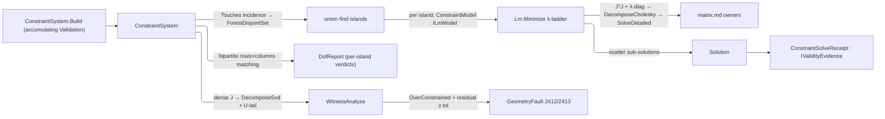

# [RASM_CONSTRAINTS_SOLVER]

`Rasm.Solving` owns one damped Gauss-Newton functor and the parametric-sketch algebra it serves. `Lm.Minimize` is the kernel's one nonlinear least-squares iterate: every `ILmModel` minimizes on one accept/reject λ-ladder under one attempt budget, rank deficiency past the ceiling routing to `GeometryFault.SingularSystem` and `SolveReceipt` evidence gating each step all-finite. A model states its Jacobian in closed form or states its residual alone in forward-mode dual arithmetic and lets `DualModel` derive it exactly. Sketch solving closes over that functor — one closed `Constraint` `[Union]` residual-and-Jacobian algebra, `ConstraintSystem` folding incidence into union-find islands, `ConstraintSolver.Solve` returning `Solution`.

Solver geometry composes the settled `Point3d`/`Vector3d` vocabulary and routes every factorization through the `Numerics/matrix` owners. Caller `Op` keys thread through every owner, `ddouble` accumulates `Σr²`, and band-2400 `GeometryFault` cases carry every failure; parameters stay raw `double` and public output is `Solution` with its distinct `ConstraintSolveReceipt`. Sibling `EntityKind` and local `SketchEntityKind` stay separate vocabularies.

## [01]-[INDEX]

- [02]-[LM_FUNCTOR]: `Lm.Minimize` the one damped Gauss-Newton iterate over the `ILmModel` residual+Jacobian floor and `SolvePolicy` ladder, with `Dual<T>`/`DualModel` deriving exact Jacobians from residual code alone.
- [03]-[CONSTRAINT_SOLVER]: `Constraint` algebra, union-find island decomposition, structural and witness DOF verdicts, and `ConstraintSolver.Solve` returning `Solution`.

## [02]-[LM_FUNCTOR]

- Owner: `ILmModel` mints the residual+Jacobian floor — `Dof`, `Seed`, the 106-bit `Norm`, and packed-upper `Linearize` — the open instance-interface seam every residual-row system implements; `IDualResidual` is the residual-only floor beside it and `DualModel` the adapter conforming one to the other; `Dual<T>` the forward-mode scalar those two differentiate through, satisfying `INumber`/`IRootFunctions`/`IPowerFunctions`/`IExponentialFunctions`/`ILogarithmicFunctions`/`ITrigonometricFunctions` at exactly the constraint set it demands of `T`; `SolvePolicy` the λ-ladder policy record carrying the `Canonical` row and clamped `Lower`/`Raise` transitions; `LmState` the internal trial carrier; `LmResult` the typed outcome registering `IValidityEvidence`; `Lm` the static functor surface.
- Cases: `SolveStatus` closes over `Converged` and `Stalled`; the singular outcome rides the `Fin` failure rail as `GeometryFault.SingularSystem`, kept off the status vocabulary.
- Entry: `Lm.Minimize(ILmModel, SolvePolicy, Op?)` is the one nonlinear least-squares entrypoint. It routes `GeometryFault.SingularSystem(rank, dof)` when the damped normal matrix stays rank-deficient past `LambdaCeiling` — rank read as the `JᵀJ` eigen-rank through `SymmetricMatrix.DecomposeEigenDetailed`, counted spectral-radius-relative against `EpsilonPolicy.SqrtEpsilon`, a functor-computable witness needing no dense `J`; every other outcome is a success-carrier `LmResult` whose `Status` separates the converged fixpoint from the budget stall.
- Auto: every foreign model member executes inside the `Op.Catch` funnel — policy and model admission reject a non-finite, non-monotone, or budget-uncrossable policy and a mis-shaped or non-finite seed, and no member runs outside the boundary. Convergence is `‖r‖₂ < ResidualTolerance` or a `‖δ‖₂ < StepFloor` stationary step; a zero-diagonal column damps on the bare `λ` floor because multiplicative damping never regularizes an exact zero, holding that coordinate at the seed — the under-constrained manifold behavior the entry promises. One MathNet path `SymmetricMatrix.Of → DecomposeCholesky → SolveDetailed` mints `SolveReceipt` gating each step all-finite, so an indefinite non-throwing factor fails the mint and the ladder climbs rather than accept a NaN step. Every trial increments `Attempts`, accepted and rejected trials share `MaxIterations` so retry recursion cannot outlive the budget, and objective comparison stays `ddouble` until the one result mint admits a `double` readout.
- Receipt: `LmResult` carries the converged outcome; the result mint rejects a 106-bit norm outside the `double` range before construction, and a caller reads `Status` before consuming a stalled vector. A derived Jacobian mints no second receipt — the adapter is a model, so its evidence is the one `LmResult` the functor already returns under its `ValidityClaim.All` fold.
- Packages: `Rasm.Numerics` (`SymmetricMatrix`/`CholeskyResult`/`Dimension`/`PositiveMagnitude`/`EpsilonPolicy` — the `Numerics/matrix` + `Numerics/atoms` owners), TYoshimura.DoubleDouble (`ddouble`/`ddouble.Sqrt`, the 106-bit objective the dual's value channel binds), System.Numerics.Tensors (`TensorPrimitives.Negate`/`Norm`/`Add`), Thinktecture.Runtime.Extensions (`[SmartEnum<int>]`), LanguageExt.Core (`Fin`), BCL inbox (`System.Numerics` generic math — the operator, `INumber`, and function-group interfaces `Dual<T>` both demands and satisfies; `System.Globalization` `NumberStyles` at its text boundary).
- Growth: a new descent strategy is a `SolvePolicy` column selecting the step rule on the same `Minimize` fold; a new model is an `ILmModel` conformance, or an `IDualResidual` wrapped by `DualModel` where the residual is easier to state than its partials; a new elementary function under differentiation is one `Dual<T>.Chain` row; a new stop criterion is one policy column read at the convergence gate.
- Boundary: packed-upper `Linearize` is the functor's contract — `Lm.PackedIndex` mirrors `SymmetricMatrix.FlatIndex` so a model scatters the owner's own layout, and the adapter delegates to that one owner rather than spelling a fourth copy of the index arithmetic; `ILmModel.Norm` returns `ddouble` by contract, a model narrowing its objective to `double` re-introducing the summation cancellation the contract kills. A Jacobian reaching the functor is EXACT from one of two sources — hand-coded closed form, or forward-mode duals, which differentiate rather than difference — and finite differencing halves the 106-bit objective, so it never mints a production Jacobian on this lane and stays the proof estate's differential oracle. `Dual<T>` closes that second source as a FIXPOINT of the generic-math floor — it satisfies precisely the six interfaces it constrains `T` by, so a kernel written once over that floor instantiates at `Dual<ddouble>` and a residual differentiates the very body its forward evaluation reads, one transcription rather than a double-precision model beside a dual-arithmetic copy of it; `Dual<Dual<T>>` is second-order forward mode falling out of the same closure. Three laws make that conformance honest. The tangent is derivative PAYLOAD and never identity, so ordering, comparison, equality, and the hash read the value alone and two duals sharing a value are one number carrying two directions — the record's field-wise equality would split a number by which column seeded it and leave `CompareTo` contradicting `==` at every tie. Finiteness reads BOTH channels because a finite value beside a dead tangent is a dead derivative: `IsNaN`/`IsInfinity`/`IsFinite` fold the pair, the directional infinities narrow by the value's own sign, and every other classification reads the value alone — so a poisoned partial fails the receipt at the dual instead of after the `double` cast that hides it. Conversion is asymmetric by construction: a scalar lifts in as a CONSTANT with zero tangent, which is what resolves a foreign kernel's `CreateChecked` anchors, while lowering out is defined only on the constant sub-algebra and a seeded dual refuses rather than discard the derivative its caller is mid-chain on. The adapter costs `rows × dof` row evaluations where a closed-form arm costs `rows`, so it serves the small-`dof` lane the island economy already bounds and a wide model keeps its analytic arm. Damping expresses on the normal diagonal, the damped matrix is always SPD (Cholesky without pivoting), and the packed-upper `SymmetricMatrix` carries it, so the normal-equations form is chosen over QR-on-`J`, the `√λ`-stacked thin-QR alternative activating only past a conditioning budget. Damped-diagonal assembly inside `Step` and the `Dual<T>` text boundary — the span writer and the backward cut its reader takes — are the named statement exemptions; every failure routes `Fin` over band-2400 except at the generic-math boundary itself, where the interface fixes the throwing contract and the scalar owner's own `Parse` and the `IComparable` mismatch carry it unwrapped.

```csharp signature
// --- [RUNTIME_PRELUDE] --------------------------------------------------------------------
using System;
using System.Globalization;
using System.Linq;
using System.Numerics;
using System.Numerics.Tensors;
using DoubleDouble;
using LanguageExt;
using LanguageExt.Common;
using Rasm.Domain;
using Rasm.Numerics;
using Thinktecture;
using static LanguageExt.Prelude;

namespace Rasm.Solving;

// --- [TYPES] ------------------------------------------------------------------------------
[SmartEnum<int>]
public sealed partial class SolveStatus {
    public static readonly SolveStatus Converged = new(key: 0);
    public static readonly SolveStatus Stalled   = new(key: 1);
}

// --- [MODELS] -----------------------------------------------------------------------------
public sealed record SolvePolicy(
    double InitialLambda,
    double LambdaFloor,
    double LambdaCeiling,
    double LambdaUp,
    double LambdaDown,
    PositiveMagnitude ResidualTolerance,
    double StepFloor,
    int MaxIterations) {
    // PositiveMagnitude admits only > EpsilonPolicy.ZeroTolerance (2^-32 ≈ 2.33e-10); Canonical's 1e-9 clears the band.
    public static readonly SolvePolicy Canonical = new(
        InitialLambda: 1e-3, LambdaFloor: double.Epsilon, LambdaCeiling: 1e12,
        LambdaUp: 10.0, LambdaDown: 10.0,
        ResidualTolerance: PositiveMagnitude.Create(1e-9), StepFloor: 1e-12, MaxIterations: 100);

    internal Fin<SolvePolicy> Admit(Op key) {
        SolvePolicy self = this;
        return guard(
            double.IsFinite(self.InitialLambda)
            && double.IsFinite(self.LambdaFloor) && self.LambdaFloor > 0.0 && self.LambdaFloor <= self.InitialLambda
            && double.IsFinite(self.LambdaCeiling) && self.InitialLambda <= self.LambdaCeiling
            && double.IsFinite(self.LambdaUp) && self.LambdaUp > 1.0
            && double.IsFinite(self.LambdaDown) && self.LambdaDown > 1.0
            && double.IsFinite(self.ResidualTolerance.Value) && self.ResidualTolerance.Value > EpsilonPolicy.ZeroTolerance
            && double.IsFinite(self.StepFloor) && self.StepFloor > 0.0
            && self.MaxIterations >= 0
            && (self.MaxIterations == 0
                || Math.Log(self.LambdaCeiling / self.InitialLambda, self.LambdaUp) < self.MaxIterations),
            key.InvalidInput()).ToFin().Map(_ => self);
    }

    internal double Lower(double lambda) => double.Max(lambda / LambdaDown, LambdaFloor);
    internal double Raise(double lambda) => lambda * LambdaUp;
}

readonly record struct LmState(double[] Parameters, ddouble Norm, double Lambda, int Iterations, int Attempts);

public sealed record LmResult(double[] Parameters, double Norm, int Iterations, double Lambda, SolveStatus Status) : IValidityEvidence {
    public bool IsValid => ValidityClaim.All(
        ValidityClaim.Finite(Parameters.AsSpan()),
        ValidityClaim.Finite(Norm),
        ValidityClaim.Nonnegative(Norm),
        ValidityClaim.Of(Iterations >= 0),
        ValidityClaim.Finite(Lambda),
        ValidityClaim.Positive(Lambda),
        ValidityClaim.Of(Status is not null));
}

// Forward-mode dual over generic math: `Value` carries the scalar and `Derivative` one seeded direction, so residual code
// written once evaluates EXACT partials with no tape and no differencing. `ddouble` satisfies every constraint listed, which
// is what keeps the 106-bit objective intact through differentiation — no admitted package ships a dual scalar.
// The conformance set IS the constraint set: `Dual<T>` implements exactly the six interfaces it demands of `T`, so any
// kernel written once over that floor INSTANTIATES at the dual and differentiates the very body it evaluates — a forward
// model and its Jacobian are then ONE transcription rather than two that drift. The fixpoint is closed, so `Dual<Dual<T>>`
// is second-order forward mode at zero new surface.
public readonly record struct Dual<T>(T Value, T Derivative)
    : INumber<Dual<T>>, IRootFunctions<Dual<T>>, IPowerFunctions<Dual<T>>,
      IExponentialFunctions<Dual<T>>, ILogarithmicFunctions<Dual<T>>, ITrigonometricFunctions<Dual<T>>
    where T : INumber<T>, IRootFunctions<T>, IPowerFunctions<T>, IExponentialFunctions<T>, ILogarithmicFunctions<T>, ITrigonometricFunctions<T> {
    // Chain-rule anchors materialize once per closed T at its own static init instead of at each slope read.
    static readonly T Two = T.CreateChecked(2);
    static readonly T Three = T.CreateChecked(3);
    static readonly T Ln2 = T.Log(Two);
    static readonly T Ln10 = T.Log(T.CreateChecked(10));
    const char Mark = 'ε';

    public static Dual<T> Of(T value) => new(Value: value, Derivative: T.Zero);
    public static Dual<T> Seeded(T value) => new(Value: value, Derivative: T.One);

    // --- [IDENTITY]
    // Every constant lifts with a ZERO tangent — a literal has no seeded direction, so `One`, the two algebraic
    // identities, and the transcendental constants are the one `Of` lift and never a second construction.
    public static Dual<T> Zero => Of(T.Zero);
    public static Dual<T> One => Of(T.One);
    public static Dual<T> AdditiveIdentity => Zero;
    public static Dual<T> MultiplicativeIdentity => One;
    public static Dual<T> E => Of(T.E);
    public static Dual<T> Pi => Of(T.Pi);
    public static Dual<T> Tau => Of(T.Tau);
    public static int Radix => T.Radix;

    // --- [ALGEBRA]
    public static Dual<T> operator +(Dual<T> left, Dual<T> right) => new(left.Value + right.Value, left.Derivative + right.Derivative);
    public static Dual<T> operator -(Dual<T> left, Dual<T> right) => new(left.Value - right.Value, left.Derivative - right.Derivative);
    public static Dual<T> operator +(Dual<T> value) => value;
    public static Dual<T> operator -(Dual<T> value) => new(-value.Value, -value.Derivative);
    public static Dual<T> operator *(Dual<T> left, Dual<T> right) =>
        new(left.Value * right.Value, (left.Value * right.Derivative) + (right.Value * left.Derivative));
    public static Dual<T> operator /(Dual<T> left, Dual<T> right) =>
        new(left.Value / right.Value, ((left.Derivative * right.Value) - (left.Value * right.Derivative)) / (right.Value * right.Value));
    // The remainder's own quotient is TRUNCATED by the `%` contract, so trunc(x/y) recovers from the remainder itself
    // and no IFloatingPoint-only rounding member enters the constraint set to state it.
    public static Dual<T> operator %(Dual<T> left, Dual<T> right) =>
        (left.Value % right.Value) switch {
            var rem => new(rem, left.Derivative - (right.Derivative * ((left.Value - rem) / right.Value))),
        };
    // Stepping by one moves the value and leaves the direction: the increment is a constant, so its tangent is zero.
    public static Dual<T> operator ++(Dual<T> value) => value with { Value = value.Value + T.One };
    public static Dual<T> operator --(Dual<T> value) => value with { Value = value.Value - T.One };

    // --- [ORDER]
    // IDENTITY LAW: the tangent is derivative payload and never identity, so ordering, comparison, equality, and the
    // hash all read the PRIMAL alone. Two duals sharing a value are the same number carrying two directions — the
    // record's field-wise equality would instead split one number by which column it was seeded on, and `CompareTo`
    // would then contradict `==` for every generic algorithm that ties on a value.
    public bool Equals(Dual<T> other) => Value.Equals(other.Value);
    public override int GetHashCode() => Value.GetHashCode();
    public int CompareTo(Dual<T> other) => Value.CompareTo(other.Value);
    public int CompareTo(object? value) => value switch {
        null => 1,
        Dual<T> other => CompareTo(other),
        _ => throw new ArgumentException($"expected {nameof(Dual<T>)}", nameof(value)),
    };

    public static bool operator <(Dual<T> left, Dual<T> right) => left.Value < right.Value;
    public static bool operator <=(Dual<T> left, Dual<T> right) => left.Value <= right.Value;
    public static bool operator >(Dual<T> left, Dual<T> right) => left.Value > right.Value;
    public static bool operator >=(Dual<T> left, Dual<T> right) => left.Value >= right.Value;

    // Magnitude selection returns the WINNING dual whole: the tangent belongs to the branch the comparison took, so
    // one selector over the scalar owner's own four verdicts keeps NaN propagation and the tie rule single-sourced.
    static Dual<T> Pick(Dual<T> x, Dual<T> y, T chosen) => chosen.Equals(x.Value) ? x : y;
    public static Dual<T> MaxMagnitude(Dual<T> x, Dual<T> y) => Pick(x, y, T.MaxMagnitude(x.Value, y.Value));
    public static Dual<T> MaxMagnitudeNumber(Dual<T> x, Dual<T> y) => Pick(x, y, T.MaxMagnitudeNumber(x.Value, y.Value));
    public static Dual<T> MinMagnitude(Dual<T> x, Dual<T> y) => Pick(x, y, T.MinMagnitude(x.Value, y.Value));
    public static Dual<T> MinMagnitudeNumber(Dual<T> x, Dual<T> y) => Pick(x, y, T.MinMagnitudeNumber(x.Value, y.Value));

    // --- [CLASSIFICATION]
    // POISON LAW: finiteness reads BOTH channels. A finite value beside a dead tangent is a DEAD DERIVATIVE, and a
    // caller's finiteness gate exists to catch precisely the quantity it is about to consume — so the functor's
    // all-finite receipt rejects a poisoned partial at the dual rather than after the cast that hides it. The
    // directional pair narrows `IsInfinity` by the value's own sign, so a tangent-only infinity is infinite without a
    // direction. Every other classification reads the PRIMAL alone: it asks which number this is, and the tangent is
    // not a number the question is about.
    public static bool IsFinite(Dual<T> value) => T.IsFinite(value.Value) && T.IsFinite(value.Derivative);
    public static bool IsNaN(Dual<T> value) => T.IsNaN(value.Value) || T.IsNaN(value.Derivative);
    public static bool IsInfinity(Dual<T> value) => !IsNaN(value) && (T.IsInfinity(value.Value) || T.IsInfinity(value.Derivative));
    public static bool IsPositiveInfinity(Dual<T> value) => IsInfinity(value) && T.IsPositiveInfinity(value.Value);
    public static bool IsNegativeInfinity(Dual<T> value) => IsInfinity(value) && T.IsNegativeInfinity(value.Value);
    public static bool IsCanonical(Dual<T> value) => T.IsCanonical(value.Value);
    public static bool IsComplexNumber(Dual<T> value) => T.IsComplexNumber(value.Value);
    public static bool IsEvenInteger(Dual<T> value) => T.IsEvenInteger(value.Value);
    public static bool IsImaginaryNumber(Dual<T> value) => T.IsImaginaryNumber(value.Value);
    public static bool IsInteger(Dual<T> value) => T.IsInteger(value.Value);
    public static bool IsNegative(Dual<T> value) => T.IsNegative(value.Value);
    public static bool IsNormal(Dual<T> value) => T.IsNormal(value.Value);
    public static bool IsOddInteger(Dual<T> value) => T.IsOddInteger(value.Value);
    public static bool IsPositive(Dual<T> value) => T.IsPositive(value.Value);
    public static bool IsRealNumber(Dual<T> value) => T.IsRealNumber(value.Value);
    public static bool IsSubnormal(Dual<T> value) => T.IsSubnormal(value.Value);
    public static bool IsZero(Dual<T> value) => T.IsZero(value.Value);

    // --- [CONVERSION]
    // LIFT IN is total — a foreign scalar is a CONSTANT here, so it enters with a zero tangent and every generic
    // kernel's `Dual<T>.CreateChecked` anchor resolves through this one rail. LOWER OUT is PARTIAL and says so: a
    // scalar carries no tangent, so only the constant sub-algebra has an image and a seeded dual refuses rather than
    // silently discarding the derivative its caller is mid-chain on. A static-abstract member is no method group on a
    // type parameter, so each mode rides a lambda over the one body.
    static bool Lift<TOther>(TOther value, Func<TOther, T> mode, out Dual<T> result) {
        result = Of(mode(arg: value));
        return true;
    }

    static bool Lower<TOther>(Dual<T> value, Func<T, TOther> mode, out TOther result) {
        bool constant = T.IsZero(value.Derivative);
        result = constant ? mode(arg: value.Value) : default!;
        return constant;
    }

    static bool INumberBase<Dual<T>>.TryConvertFromChecked<TOther>(TOther value, out Dual<T> result) => Lift(value, static v => T.CreateChecked(v), out result);
    static bool INumberBase<Dual<T>>.TryConvertFromSaturating<TOther>(TOther value, out Dual<T> result) => Lift(value, static v => T.CreateSaturating(v), out result);
    static bool INumberBase<Dual<T>>.TryConvertFromTruncating<TOther>(TOther value, out Dual<T> result) => Lift(value, static v => T.CreateTruncating(v), out result);
    static bool INumberBase<Dual<T>>.TryConvertToChecked<TOther>(Dual<T> value, out TOther result) => Lower(value, static v => TOther.CreateChecked(v), out result);
    static bool INumberBase<Dual<T>>.TryConvertToSaturating<TOther>(Dual<T> value, out TOther result) => Lower(value, static v => TOther.CreateSaturating(v), out result);
    static bool INumberBase<Dual<T>>.TryConvertToTruncating<TOther>(Dual<T> value, out TOther result) => Lower(value, static v => TOther.CreateTruncating(v), out result);

    // --- [CHAIN_RULE]
    // ONE chain-rule combinator: every elementary row below is its (value, slope) pair, so a new function is a row and
    // never a re-derived arm. The slope reads the argument AND the value the row just computed, so a row whose
    // derivative IS its own value — exp, tan, sqrt, cbrt — pays ONE transcendental evaluation rather than two. A
    // static-abstract member is no method group on a type parameter, so each half stays a lambda.
    public Dual<T> Chain(Func<T, T> value, Func<T, T, T> slope) =>
        value(arg: Value) switch { var v => new Dual<T>(Value: v, Derivative: slope(arg1: Value, arg2: v) * Derivative) };

    public static Dual<T> Abs(Dual<T> x) => x.Chain(static v => T.Abs(v), static (a, _) => T.IsNegative(a) ? -T.One : T.One);
    public static Dual<T> Sqrt(Dual<T> x) => x.Chain(static v => T.Sqrt(v), static (_, r) => T.One / (Two * r));
    public static Dual<T> Cbrt(Dual<T> x) => x.Chain(static v => T.Cbrt(v), static (_, r) => T.One / (Three * r * r));
    public static Dual<T> RootN(Dual<T> x, int n) => x.Chain(v => T.RootN(v, n), (a, r) => r / (T.CreateChecked(n) * a));

    public static Dual<T> Exp(Dual<T> x) => x.Chain(static v => T.Exp(v), static (_, e) => e);
    public static Dual<T> Exp2(Dual<T> x) => x.Chain(static v => T.Exp2(v), static (_, e) => Ln2 * e);
    public static Dual<T> Exp10(Dual<T> x) => x.Chain(static v => T.Exp10(v), static (_, e) => Ln10 * e);
    // The *M1/*P1 rows compose the scalar owner's own near-zero-accurate members rather than the generic-math default
    // that spells them as `Exp(x) − One`: the accuracy those variants exist for is exactly what a residual near its
    // root reads, and the slope recovers the unshifted exponential from the shifted value at no second evaluation.
    public static Dual<T> ExpM1(Dual<T> x) => x.Chain(static v => T.ExpM1(v), static (_, e) => e + T.One);
    public static Dual<T> Exp2M1(Dual<T> x) => x.Chain(static v => T.Exp2M1(v), static (_, e) => Ln2 * (e + T.One));
    public static Dual<T> Exp10M1(Dual<T> x) => x.Chain(static v => T.Exp10M1(v), static (_, e) => Ln10 * (e + T.One));

    public static Dual<T> Log(Dual<T> x) => x.Chain(static v => T.Log(v), static (a, _) => T.One / a);
    public static Dual<T> Log2(Dual<T> x) => x.Chain(static v => T.Log2(v), static (a, _) => T.One / (a * Ln2));
    public static Dual<T> Log10(Dual<T> x) => x.Chain(static v => T.Log10(v), static (a, _) => T.One / (a * Ln10));
    public static Dual<T> LogP1(Dual<T> x) => x.Chain(static v => T.LogP1(v), static (a, _) => T.One / (T.One + a));
    public static Dual<T> Log2P1(Dual<T> x) => x.Chain(static v => T.Log2P1(v), static (a, _) => T.One / ((T.One + a) * Ln2));
    public static Dual<T> Log10P1(Dual<T> x) => x.Chain(static v => T.Log10P1(v), static (a, _) => T.One / ((T.One + a) * Ln10));

    public static Dual<T> Sin(Dual<T> x) => x.Chain(static v => T.Sin(v), static (a, _) => T.Cos(a));
    public static Dual<T> Cos(Dual<T> x) => x.Chain(static v => T.Cos(v), static (a, _) => -T.Sin(a));
    public static Dual<T> Tan(Dual<T> x) => x.Chain(static v => T.Tan(v), static (_, t) => T.One + (t * t));
    public static Dual<T> Asin(Dual<T> x) => x.Chain(static v => T.Asin(v), static (a, _) => T.One / T.Sqrt(T.One - (a * a)));
    public static Dual<T> Acos(Dual<T> x) => x.Chain(static v => T.Acos(v), static (a, _) => -T.One / T.Sqrt(T.One - (a * a)));
    public static Dual<T> Atan(Dual<T> x) => x.Chain(static v => T.Atan(v), static (a, _) => T.One / (T.One + (a * a)));
    // A half-turn ARGUMENT scales the slope by π; a half-turn RESULT divides it.
    public static Dual<T> SinPi(Dual<T> x) => x.Chain(static v => T.SinPi(v), static (a, _) => T.Pi * T.CosPi(a));
    public static Dual<T> CosPi(Dual<T> x) => x.Chain(static v => T.CosPi(v), static (a, _) => -T.Pi * T.SinPi(a));
    public static Dual<T> TanPi(Dual<T> x) => x.Chain(static v => T.TanPi(v), static (_, t) => T.Pi * (T.One + (t * t)));
    public static Dual<T> AsinPi(Dual<T> x) => x.Chain(static v => T.AsinPi(v), static (a, _) => T.One / (T.Pi * T.Sqrt(T.One - (a * a))));
    public static Dual<T> AcosPi(Dual<T> x) => x.Chain(static v => T.AcosPi(v), static (a, _) => -T.One / (T.Pi * T.Sqrt(T.One - (a * a))));
    public static Dual<T> AtanPi(Dual<T> x) => x.Chain(static v => T.AtanPi(v), static (a, _) => T.One / (T.Pi * (T.One + (a * a))));

    // The paired and two-argument rows fold their own value rather than riding `Chain`: each slope REUSES the value it
    // just computed across both outputs or both operands, so a combinator here would re-evaluate one transcendental
    // three times to state what one argument reduction already answers.
    public static (Dual<T> Sin, Dual<T> Cos) SinCos(Dual<T> x) =>
        T.SinCos(x.Value) switch { var (s, c) => (new(s, c * x.Derivative), new(c, -s * x.Derivative)) };

    public static (Dual<T> SinPi, Dual<T> CosPi) SinCosPi(Dual<T> x) =>
        T.SinCosPi(x.Value) switch { var (s, c) => (new(s, T.Pi * c * x.Derivative), new(c, -T.Pi * s * x.Derivative)) };

    public static Dual<T> Hypot(Dual<T> x, Dual<T> y) =>
        T.Hypot(x.Value, y.Value) switch {
            var h => new(h, ((x.Value * x.Derivative) + (y.Value * y.Derivative)) / h),
        };

    // logᵦx = ln x / ln β differentiates on BOTH operands; the base's own partial is what a fitted base would ride.
    public static Dual<T> Log(Dual<T> x, Dual<T> newBase) =>
        T.Log(newBase.Value) switch {
            var lb => new(T.Log(x.Value) / lb,
                (x.Derivative / (x.Value * lb)) - (T.Log(x.Value) * newBase.Derivative / (newBase.Value * lb * lb))),
        };

    // x^y: the EXPONENT'S OWN tangent is what pulls ln x into the slope, so a constant exponent keeps the real power
    // rule over a negative base where the general form would poison the whole row with a 0·NaN product.
    public static Dual<T> Pow(Dual<T> x, Dual<T> y) =>
        T.Pow(x.Value, y.Value) switch {
            var v => new(v, (y.Value * T.Pow(x.Value, y.Value - T.One) * x.Derivative)
                            + (T.IsZero(y.Derivative) ? T.Zero : v * T.Log(x.Value) * y.Derivative)),
        };

    // --- [TEXT]
    // ONE text grammar both directions — `<value>±<derivative>ε`, a bare scalar lifting with a zero tangent. The
    // derivative's sign is always explicit so the reader's backward cut is unambiguous, and every remaining arity the
    // roster fixes is a style or width spelling of this pair; the UTF-8 arities are the generic-math defaults over them.
    string TangentSign => T.IsNegative(Derivative) ? string.Empty : "+";

    public override string ToString() => ToString(format: null, provider: null);

    public string ToString(string? format, IFormatProvider? provider) =>
        $"{Value.ToString(format, provider)}{TangentSign}{Derivative.ToString(format, provider)}{Mark}";

    public bool TryFormat(Span<char> destination, out int charsWritten, ReadOnlySpan<char> format, IFormatProvider? provider) {
        charsWritten = 0;
        if (!Value.TryFormat(destination, out int head, format, provider)) { return false; }
        charsWritten = head + TangentSign.Length;
        if (charsWritten > destination.Length) { return false; }
        TangentSign.CopyTo(destination[head..]);
        if (!Derivative.TryFormat(destination[charsWritten..], out int tail, format, provider)) { return false; }
        charsWritten += tail;
        if (charsWritten >= destination.Length) { return false; }
        destination[charsWritten++] = Mark;
        return true;
    }

    // The cut runs BACKWARD from the mark and skips a sign an exponent owns, so `1e-9-2e-3ε` splits at the derivative
    // and never inside the mantissa's exponent; an absent mark reads a bare scalar and a leading mark a pure tangent.
    static int Cut(ReadOnlySpan<char> s) {
        if (s.IsEmpty || s[^1] != Mark) { return -1; }
        for (int i = s.Length - 2; i > 0; i--) {
            if (s[i] is '+' or '-' && s[i - 1] is not ('e' or 'E')) { return i; }
        }
        return 0;
    }

    public static Dual<T> Parse(ReadOnlySpan<char> s, NumberStyles style, IFormatProvider? provider) =>
        Cut(s) switch {
            < 0 => new(T.Parse(s, style, provider), T.Zero),
            0 => new(T.Zero, T.Parse(s[..^1], style, provider)),
            var i => new(T.Parse(s[..i], style, provider), T.Parse(s[i..^1], style, provider)),
        };

    public static bool TryParse(ReadOnlySpan<char> s, NumberStyles style, IFormatProvider? provider, out Dual<T> result) {
        T value = T.Zero, slope = T.Zero;
        int cut = Cut(s);
        bool read = cut switch {
            < 0 => T.TryParse(s, style, provider, out value),
            0 => T.TryParse(s[..^1], style, provider, out slope),
            _ => T.TryParse(s[..cut], style, provider, out value) && T.TryParse(s[cut..^1], style, provider, out slope),
        };
        result = read ? new Dual<T>(value, slope) : default;
        return read;
    }

    public static Dual<T> Parse(string s, NumberStyles style, IFormatProvider? provider) => Parse(s.AsSpan(), style, provider);
    public static Dual<T> Parse(ReadOnlySpan<char> s, IFormatProvider? provider) => Parse(s, NumberStyles.Float | NumberStyles.AllowThousands, provider);
    public static Dual<T> Parse(string s, IFormatProvider? provider) => Parse(s.AsSpan(), provider);
    public static bool TryParse(string? s, NumberStyles style, IFormatProvider? provider, out Dual<T> result) => TryParse(s.AsSpan(), style, provider, out result);
    public static bool TryParse(ReadOnlySpan<char> s, IFormatProvider? provider, out Dual<T> result) => TryParse(s, NumberStyles.Float | NumberStyles.AllowThousands, provider, out result);
    public static bool TryParse(string? s, IFormatProvider? provider, out Dual<T> result) => TryParse(s.AsSpan(), provider, out result);
}

// --- [SERVICES] ---------------------------------------------------------------------------
// PackedNormal/Gradient use Lm.PackedIndex addressing; Norm is the 106-bit objective by contract.
public interface ILmModel {
    int Dof { get; }
    double[] Seed { get; }
    ddouble Norm(ReadOnlySpan<double> parameters);
    (double[] PackedNormal, double[] Gradient) Linearize(ReadOnlySpan<double> parameters);
}

// The residual-only floor beside it: a model states one row at a time in dual arithmetic and the adapter derives the
// Jacobian. The scalar is Dual<ddouble> because ILmModel.Norm is, and the row-at-a-time read is what keeps the dense J off
// this lane — a whole-vector read would hold rows x dof to accumulate one JᵀJ.
public interface IDualResidual {
    int Dof { get; }
    int Rows { get; }
    double[] Seed { get; }
    Dual<ddouble> Row(int index, ReadOnlySpan<Dual<ddouble>> parameters);
}

// --- [OPERATIONS] -------------------------------------------------------------------------
public static class Lm {
    // Packed-upper addressing delegates to the ONE SymmetricMatrix.FlatIndex owner — the formula lives there alone,
    // so a layout change is one all-owner edit by construction rather than by ruling.
    internal static int PackedIndex(int n, int i, int j) => SymmetricMatrix.FlatIndex(n: n, i: i, j: j);

    public static Fin<LmResult> Minimize(ILmModel model, SolvePolicy policy, Op? key = null) {
        Op op = key.OrDefault();
        return from activeModel in Admit.NotNull(value: model, key: op)
               from activePolicy in Admit.NotNull(value: policy, key: op).Bind(active => active.Admit(key: op))
               from admitted in AdmitModel(model: activeModel, key: op)
               from norm in Objective(model: activeModel, parameters: admitted.Seed, key: op)
               from result in Iterate(model: activeModel, dof: admitted.Dof, policy: activePolicy,
                   state: new LmState(admitted.Seed, norm, activePolicy.InitialLambda, Iterations: 0, Attempts: 0), key: op)
               select result;
    }

    static Fin<(int Dof, double[] Seed)> AdmitModel(ILmModel model, Op key) => key.Catch(() => {
        int dof = model.Dof;
        double[]? source = model.Seed;
        return dof >= 0 && source is not null && source.Length == dof && TensorPrimitives.IsFiniteAll(source)
            ? Fin.Succ((Dof: dof, Seed: (double[])source.Clone()))
            : Fin.Fail<(int Dof, double[] Seed)>(key.InvalidInput());
    });

    static Fin<LmResult> Iterate(ILmModel model, int dof, SolvePolicy policy, LmState state, Op key) {
        if (state.Norm < policy.ResidualTolerance.Value)
            return Result(state, SolveStatus.Converged, key);
        if (dof == 0 || state.Attempts >= policy.MaxIterations)
            return Result(state, SolveStatus.Stalled, key);
        return Linearize(model: model, parameters: state.Parameters, dof: dof, key: key)
            .Bind(linear => Step(model: model, dof: dof, policy: policy, state: state,
                packedNormal: linear.PackedNormal, gradient: linear.Gradient, key: key));
    }

    static Fin<LmResult> Step(ILmModel model, int dof, SolvePolicy policy, LmState state, double[] packedNormal, double[] gradient, Op key) {
        int n = dof;
        if (state.Lambda > policy.LambdaCeiling)
            return SymmetricMatrix.Of(Dimension.Create(n), new Arr<double>(packedNormal), key)
                .Bind(normal => normal.DecomposeEigenDetailed(key))
                .Map(static receipt => receipt.Pairs.Map(static p => Math.Abs(p.Eigenvalue)))   // order-independent: radius and count fold the whole spectrum
                .Map(spectrum => spectrum.Fold(0.0, Math.Max) is var radius && radius <= 0.0
                    ? 0
                    : spectrum.Count(v => v > EpsilonPolicy.SqrtEpsilon * radius))
                .Match(
                    Succ: rank => Fin.Fail<LmResult>(new GeometryFault.SingularSystem(rank, n).ToError()),
                    Fail: _ => Fin.Fail<LmResult>(new GeometryFault.SingularSystem(0, n).ToError()));
        if (state.Attempts >= policy.MaxIterations)
            return Result(state, SolveStatus.Stalled, key);

        double[] damped = (double[])packedNormal.Clone();
        // Zero-diagonal column (residual-untouched DOF) damps on bare λ — multiplicative damping never
        // regularizes an exact zero, and its zero gradient holds the seed short of a false SingularSystem.
        for (int i = 0; i < n; i++) {
            int di = PackedIndex(n, i, i);
            damped[di] = packedNormal[di] > 0.0 ? packedNormal[di] * (1.0 + state.Lambda) : state.Lambda;
        }
        double[] rhs = new double[n];
        TensorPrimitives.Negate<double>(gradient, rhs);

        // ONE MathNet path mints SolveReceipt gating each step all-finite, so an indefinite factor fails the mint and the λ-ladder climbs.
        Fin<Arr<double>> solve = SymmetricMatrix.Of(Dimension.Create(n), new Arr<double>(damped), key)
            .Bind(spd => spd.DecomposeCholesky(key))
            .Bind(chol => chol.SolveDetailed(new Arr<double>(rhs), key))
            .Map(static receipt => receipt.Solution);
        LmState attempted = state with { Attempts = state.Attempts + 1 };
        return solve.Match(
            Succ: delta => Advance(state.Parameters, delta, key).Bind(trial => {
                double stepNorm = TensorPrimitives.Norm<double>(delta.AsSpan());
                return Objective(model, trial, key).Bind(trialNorm =>
                    // 106-bit accept test: the deciding digits of two nearly equal norms survive; accepted λ carries down.
                    trialNorm < state.Norm
                        ? stepNorm < policy.StepFloor
                            ? Result(attempted with { Parameters = trial, Norm = trialNorm, Iterations = state.Iterations + 1 }, SolveStatus.Converged, key)
                            : Iterate(model, dof, policy, attempted with { Parameters = trial, Norm = trialNorm, Lambda = policy.Lower(state.Lambda), Iterations = state.Iterations + 1 }, key)
                        : Step(model, dof, policy, attempted with { Lambda = policy.Raise(state.Lambda) }, packedNormal, gradient, key));
            }),
            Fail: _ => Step(model, dof, policy, attempted with { Lambda = policy.Raise(state.Lambda) }, packedNormal, gradient, key));
    }

    static Fin<(double[] PackedNormal, double[] Gradient)> Linearize(ILmModel model, double[] parameters, int dof, Op key) =>
        key.Catch(() => {
            (double[] packedNormal, double[] gradient) = model.Linearize(parameters);
            long packedLength = (long)dof * (dof + 1L) / 2L;
            return packedLength <= int.MaxValue
                && packedNormal is not null && packedNormal.Length == packedLength && TensorPrimitives.IsFiniteAll(packedNormal)
                && gradient is not null && gradient.Length == dof && TensorPrimitives.IsFiniteAll(gradient)
                    ? Fin.Succ((PackedNormal: packedNormal, Gradient: gradient))
                    : Fin.Fail<(double[] PackedNormal, double[] Gradient)>(key.InvalidResult());
        });

    static Fin<ddouble> Objective(ILmModel model, double[] parameters, Op key) =>
        key.Catch(body: () => model.Norm(parameters) switch {
            ddouble norm when ddouble.IsFinite(norm) && ddouble.Sign(norm) >= 0 => Fin.Succ(norm),
            _ => Fin.Fail<ddouble>(key.InvalidResult()),
        });

    static Fin<double[]> Advance(double[] parameters, Arr<double> delta, Op key) {
        double[] next = (double[])parameters.Clone();
        TensorPrimitives.Add<double>(parameters, delta.AsSpan(), next);
        return TensorPrimitives.IsFiniteAll<double>(next)
            ? Fin.Succ(next)
            : Fin.Fail<double[]>(key.InvalidResult());
    }

    static Fin<LmResult> Result(LmState state, SolveStatus status, Op key) =>
        ddouble.IsFinite(state.Norm) && ddouble.Sign(state.Norm) >= 0 && state.Norm <= (ddouble)double.MaxValue
        && TensorPrimitives.IsFiniteAll<double>(state.Parameters)
        && double.IsFinite(state.Lambda) && state.Lambda > 0.0 && state.Iterations >= 0 && status is not null
            ? Fin.Succ(new LmResult(state.Parameters, (double)state.Norm, state.Iterations, state.Lambda, status))
            : Fin.Fail<LmResult>(key.InvalidResult());
}

// The auto-Jacobian adapter: an ILmModel conformance, never a second functor. One seeded evaluation per (row, column) yields
// an EXACT partial — forward-mode duals differentiate, they do not difference — and each row's partials accumulate straight
// into the packed-upper JᵀJ + Jᵀr through Lm.PackedIndex, so the dense J never materializes and the layout stays the owner's.
public sealed class DualModel(IDualResidual residual) : ILmModel {
    public int Dof => residual.Dof;

    public double[] Seed => residual.Seed;

    public ddouble Norm(ReadOnlySpan<double> parameters) {
        Dual<ddouble>[] frozen = Frozen(parameters: parameters);
        ddouble sum = ddouble.Zero;
        for (int index = 0; index < residual.Rows; index++) {
            ddouble value = residual.Row(index: index, parameters: frozen).Value;
            sum += value * value;
        }
        return ddouble.Sqrt(sum);
    }

    public (double[] PackedNormal, double[] Gradient) Linearize(ReadOnlySpan<double> parameters) {
        int n = residual.Dof;
        Dual<ddouble>[] seeded = Frozen(parameters: parameters);
        double[] normal = new double[n * (n + 1) / 2];
        double[] gradient = new double[n];
        double[] partials = new double[n];
        for (int index = 0; index < residual.Rows; index++) {
            double value = 0.0;
            for (int column = 0; column < n; column++) {
                seeded[column] = Dual<ddouble>.Seeded(value: seeded[column].Value);
                Dual<ddouble> evaluated = residual.Row(index: index, parameters: seeded);
                seeded[column] = Dual<ddouble>.Of(value: seeded[column].Value);
                partials[column] = (double)evaluated.Derivative;
                value = (double)evaluated.Value;  // seed-independent: the value channel reports the same row under every seed
            }
            for (int a = 0; a < n; a++) {
                gradient[a] += partials[a] * value;
                for (int b = a; b < n; b++) normal[Lm.PackedIndex(n: n, i: a, j: b)] += partials[a] * partials[b];
            }
        }
        return (PackedNormal: normal, Gradient: gradient);
    }

    static Dual<ddouble>[] Frozen(ReadOnlySpan<double> parameters) {
        Dual<ddouble>[] frozen = new Dual<ddouble>[parameters.Length];
        for (int index = 0; index < parameters.Length; index++) frozen[index] = Dual<ddouble>.Of(value: parameters[index]);
        return frozen;
    }
}
```

## [03]-[CONSTRAINT_SOLVER]

- Owner: `SketchEntityKind` `[SmartEnum<int>]` discriminates the parametric primitive, each row carrying its parameter `Arity` and a `Carrier` binding to the `Rasm.Domain` `Kind` so admission faults mint typed discriminants; `Entity` is one parametric-primitive algebra over every kind, carrying its kind and its `[Offset, Offset+Arity)` slice into the flat parameter vector; `Constraint` the closed relation `[Union]` whose generated-`Switch` `Residual`, `Touches`, and `WellFormed` folds return residual rows with analytic partials, name the incident entities, and state the per-case operand-kind law; `ConstraintSystem` the immutable graph with accumulating `Build` admission and the union-find `Islands` decomposition; `DofAnalysis`/`DofReport` the verdict and per-island evidence; `ConstraintModel` the island-scoped `ILmModel`; `ConstraintSolveReceipt`/`Solution` the outcome pair; `ConstraintSolver` the static surface owning `Analyze`/`StructuralAnalyze`/`WitnessAnalyze` and the island-folded `Solve`.
- Cases: `Constraint` is the closed relation `[Union]` the fence rosters; `Ground` is the gauge anchor whose absence leaves the rigid-body freedoms honestly under-constrained, and `Distance`, `Tangent`, and `OnCircle` carry squared residuals staying C¹ at coincident and zero-length configurations where the `√`-form Jacobian is undefined. `DofAnalysis` adds the witness-numeric `RedundantConsistent` to the three structural verdicts — the redundant-but-consistent system a row count misclassifies as over-constrained. `SketchEntityKind` discriminates the parametric primitives, each row carrying its parameter arity.
- Entry: `ConstraintSolver.Solve(ConstraintSystem, SolvePolicy, Op?)` decomposes into islands, instantiates `ConstraintModel : ILmModel` per island, runs `Lm.Minimize` on each small normal system, scatters the sub-solutions back into one parameter vector, and gates the assembled result: `GeometryFault.OverConstrained` when the witness verdict is over-determined and the global residual stays past tolerance — a redundant-and-inconsistent system has no configuration, its payload carrying the dependent-row count `rows − rank(J)` at the witness — with `GeometryFault.SingularSystem` bubbling from any island's ladder; a well- or under-constrained system always solves, LM finding the nearest point on the manifold to the seed. `Analyze` is the pure total structural row-count verdict, `StructuralAnalyze` the per-island maximum-matching refinement, `WitnessAnalyze` the numeric-rank adjudicator. `ConstraintSystem.Build` is the accumulating admission: every non-finite seed value, seed/arity mismatch, dangling reference (membership tests the full `Entity` value, so a mis-kinded reference at a valid offset is equally dangling), operand-kind mismatch, duplicate constraint, and the empty-system report exit together through one `Validation<Error, T>` traverse.
- Auto: `Islands` folds the entity↔constraint incidence through a transient `ForestDisjointSet` — every entity a singleton, every constraint one `Union` per operand past its head, `SetCount` the live island census and `FindSet` the grouping key — so the partition costs one near-constant-time pass and no container is minted for a question union-find answers directly; each component solves on its own `dof_island²` normal matrix instead of `ParameterCount²`, the decomposition that makes a many-sketch document solve at the cost of its largest island; an untouched entity is a zero-row island converging at iteration 0. Per island, `ConstraintModel` gathers the columns into a compact local vector over a single-writer global scratch (islands are column-disjoint, so the scratch never races), folds `Σr²` at 106-bit `ddouble`, and accumulates packed-upper `JᵀJ` + `Jᵀr` from the analytic partials with global→local remap, so the dense `J` never materializes on the LM lane. Residual scatter accumulates rather than overwrites because an arm can emit one column twice for a shared or self-aliased entity. `StructuralAnalyze` reads `MaximumBipartiteMatchingAlgorithm` cardinality as the König structural rank — row deficiency localizes over-constraint to its island and column surplus under-constraint, the locality a global row count is blind to. `WitnessAnalyze` runs PER ISLAND — `J(seed)` is block-diagonal under the island permutation, so each island's compact `rows_island × dof_island` dense block goes through `DecomposeSvd` and the fold is EQUAL to the global witness at `Σ dof_island²` cost, the same economy the solve fold buys; per island it reads true DOF `dof_island − Rank` and projects the residual onto the left-null space via the `SvdResult.U` tail — a vanishing tail is `RedundantConsistent`, redundant constraints that all hold — and verdicts fold `Over > RedundantConsistent > Under > Well` with dependent rows summed.
- Receipt: `Solve` returns `Solution` carrying the converged parameters and the typed `ConstraintSolveReceipt`; `DofReport` is the diagnosis evidence a sketch UI reads to name which island over-constrains — the island whose deficiency row is positive.
- Packages: `Rhino.Geometry` (`Point3d`/`Vector3d` for entity geometry), `Rasm.Numerics` (`SymmetricMatrix`/`CholeskyResult`/`Matrix`/`SvdResult`/`Dimension`/`PositiveMagnitude` — the `Numerics/matrix` + `Numerics/atoms` owners), QuikGraph (`ForestDisjointSet` the island partition; `AdjacencyGraph` + `MaximumBipartiteMatchingAlgorithm` the structural-rank walk), TYoshimura.DoubleDouble (`ddouble` + `DoubleDoubleEnumerableExpand.Sum`, the 106-bit `Σr²`), Thinktecture.Runtime.Extensions (`[Union]`/`[SmartEnum<int>]`, generated `Switch`), LanguageExt.Core (`Fin`/`Validation`/`Seq`, the accumulating `.Traverse` admission), BCL inbox.
- Growth: a new geometric relation is one `Constraint` case carrying its `Residual`, `Touches`, and `WellFormed` arms over the same functor; a new parametric primitive is one `SketchEntityKind` row with its arity, `Carrier`, and geometry accessors; a new DOF refinement is a `DofReport` column; a 3D sketch tier is an `Entity` accessor widening over the same constraint algebra.
- Boundary: the relations differ only in residual expression and analytic partials, never in the iterate, so one `Constraint` `[Union]` with a generated-`Switch` fold owns them all — compile-exhaustive, a new case breaking `Residual`, `Touches`, and `WellFormed` loudly; `Concentric` reuses the center-coincidence rows as sketch vocabulary over the one algebra. Every arm's Jacobian is EXACT and hand-coded closed form here, forward-mode duals being the functor's second exact source and a finite difference neither. Every `Numerics/matrix` call threads the caller's `Op` key, QuikGraph owns the partition and matching walks, and every graph verdict exits as a typed domain value. `ConstraintSystem` is immutable and `Solve` returns fresh packed arrays; the `ConstraintModel` scratch is the single-writer run-local exception that never escapes the model. Every failure routes `Fin` over band-2400 as `GeometryFault.<Case>.ToError()`, and the graph-assembly and scatter loops are the named span-kernel statement exemption.

```csharp signature
// --- [RUNTIME_PRELUDE] --------------------------------------------------------------------
using System;
using System.Collections.Frozen;
using System.Collections.Generic;
using System.Linq;
using System.Numerics.Tensors;
using DoubleDouble;
using LanguageExt;
using LanguageExt.Common;
using QuikGraph;
using QuikGraph.Algorithms;
using QuikGraph.Collections;
using Rasm.Domain;
using Rasm.Numerics;
using Rhino.Geometry;
using Thinktecture;
using static LanguageExt.Prelude;
// CS0104 guard: Rhino.Geometry.Matrix/Dimension collide with the Rasm.Numerics owners under the dual usings.
using Dimension = Rasm.Numerics.Dimension;
using Matrix = Rasm.Numerics.Matrix;

namespace Rasm.Solving;

// --- [TYPES] ------------------------------------------------------------------------------
[SmartEnum<int>]
public sealed partial class SketchEntityKind {
    public static readonly SketchEntityKind Point  = new(key: 0, arity: 2, carrier: Kind.Point);
    public static readonly SketchEntityKind Line   = new(key: 1, arity: 4, carrier: Kind.Line);
    public static readonly SketchEntityKind Circle = new(key: 2, arity: 3, carrier: Kind.Circle);

    public int Arity { get; }
    public Kind Carrier { get; }
}

[SmartEnum<int>]
public sealed partial class DofAnalysis {
    public static readonly DofAnalysis WellConstrained     = new(key: 0);
    public static readonly DofAnalysis UnderConstrained    = new(key: 1);
    public static readonly DofAnalysis OverConstrained     = new(key: 2);
    public static readonly DofAnalysis RedundantConsistent = new(key: 3);
}

// --- [MODELS] -----------------------------------------------------------------------------
public readonly record struct Entity(SketchEntityKind Kind, int Offset) {
    public int Arity => Kind.Arity;

    public Point3d Origin(ReadOnlySpan<double> p) => new(p[Offset], p[Offset + 1], 0.0);

    public Point3d End(ReadOnlySpan<double> p) => new(p[Offset + 2], p[Offset + 3], 0.0);

    public Vector3d Direction(ReadOnlySpan<double> p) => End(p) - Origin(p);
    public double Radius(ReadOnlySpan<double> p) => p[Offset + 2];
}

public readonly record struct ResidualRow(double Value, Seq<(int Column, double Partial)> Partials);

[Union(ConversionFromValue = ConversionOperatorsGeneration.None)]
public abstract partial record Constraint {
    private Constraint() { }

    public sealed record Distance(Entity A, Entity B, double Target) : Constraint;
    public sealed record Angle(Entity A, Entity B, double Radians) : Constraint;
    public sealed record Coincident(Entity A, Entity B) : Constraint;
    public sealed record Concentric(Entity A, Entity B) : Constraint;
    public sealed record Parallel(Entity A, Entity B) : Constraint;
    public sealed record Perpendicular(Entity A, Entity B) : Constraint;
    public sealed record Tangent(Entity Line, Entity Circle) : Constraint;
    public sealed record PointOnLine(Entity Point, Entity Line) : Constraint;
    public sealed record Midpoint(Entity Point, Entity Line) : Constraint;
    public sealed record Axis(Entity Line, bool Horizontal) : Constraint;
    public sealed record Equal(Entity A, Entity B) : Constraint;
    public sealed record Symmetric(Entity A, Entity B, Entity Axis) : Constraint;
    public sealed record Ground(Entity Point, double X, double Y) : Constraint;
    public sealed record Radius(Entity Circle, double Target) : Constraint;
    public sealed record OnCircle(Entity Point, Entity Circle) : Constraint;

    // Compile-exhaustive residual fold: a new case breaks this dispatch and Touches loudly.
    public Seq<ResidualRow> Residual(double[] p) =>
        Switch(
            state: p,
            distance:      static (p, d) => Seq(DistanceRow(d.A, d.B, d.Target, p)),
            angle:         static (p, a) => Seq(AngleRow(a.A, a.B, a.Radians, p)),
            coincident:    static (p, c) => CoincidentRows(c.A, c.B, p),
            concentric:    static (p, c) => CoincidentRows(c.A, c.B, p),
            parallel:      static (p, l) => Seq(CrossRow(l.A, l.B, p)),
            perpendicular: static (p, l) => Seq(DotRow(l.A, l.B, p)),
            tangent:       static (p, t) => Seq(TangentRow(t.Line, t.Circle, p)),
            pointOnLine:   static (p, o) => Seq(PointOnLineRow(o.Point, o.Line, p)),
            midpoint:      static (p, m) => MidpointRows(m.Point, m.Line, p),
            axis:          static (p, x) => Seq(AxisRow(x.Line, x.Horizontal, p)),
            equal:         static (p, e) => Seq(EqualRow(e.A, e.B, p)),
            symmetric:     static (p, s) => SymmetricRows(s.A, s.B, s.Axis, p),
            ground:        static (p, g) => GroundRows(g.Point, g.X, g.Y, p),
            radius:        static (p, r) => Seq(RadiusRow(r.Circle, r.Target, p)),
            onCircle:      static (p, o) => Seq(OnCircleRow(o.Point, o.Circle, p)));

    public Seq<Entity> Touches =>
        Switch(
            distance:      static d => Seq(d.A, d.B),
            angle:         static a => Seq(a.A, a.B),
            coincident:    static c => Seq(c.A, c.B),
            concentric:    static c => Seq(c.A, c.B),
            parallel:      static l => Seq(l.A, l.B),
            perpendicular: static l => Seq(l.A, l.B),
            tangent:       static t => Seq(t.Line, t.Circle),
            pointOnLine:   static o => Seq(o.Point, o.Line),
            midpoint:      static m => Seq(m.Point, m.Line),
            axis:          static x => Seq(x.Line),
            equal:         static e => Seq(e.A, e.B),
            symmetric:     static s => Seq(s.A, s.B, s.Axis),
            ground:        static g => Seq(g.Point),
            radius:        static r => Seq(r.Circle),
            onCircle:      static o => Seq(o.Point, o.Circle));

    // Operand-kind law: an arm reading End/Direction/Radius demands the owning kind (a mismatch reads a
    // FOREIGN slice); Origin-only arms are total; Equal names Line/Circle positively so a new kind rejects until its arm lands.
    public bool WellFormed =>
        Switch(
            distance:      static _ => true,
            angle:         static a => a.A.Kind == SketchEntityKind.Line && a.B.Kind == SketchEntityKind.Line,
            coincident:    static _ => true,
            concentric:    static _ => true,
            parallel:      static l => l.A.Kind == SketchEntityKind.Line && l.B.Kind == SketchEntityKind.Line,
            perpendicular: static l => l.A.Kind == SketchEntityKind.Line && l.B.Kind == SketchEntityKind.Line,
            tangent:       static t => t.Line.Kind == SketchEntityKind.Line && t.Circle.Kind == SketchEntityKind.Circle,
            pointOnLine:   static o => o.Line.Kind == SketchEntityKind.Line,
            midpoint:      static m => m.Line.Kind == SketchEntityKind.Line,
            axis:          static x => x.Line.Kind == SketchEntityKind.Line,
            equal:         static e => e.A.Kind == e.B.Kind && (e.A.Kind == SketchEntityKind.Line || e.A.Kind == SketchEntityKind.Circle),
            symmetric:     static s => s.Axis.Kind == SketchEntityKind.Line,
            ground:        static _ => true,
            radius:        static r => r.Circle.Kind == SketchEntityKind.Circle,
            onCircle:      static o => o.Circle.Kind == SketchEntityKind.Circle);

    // --- [RESIDUAL_ROWS]
    // Squared distance form: C¹ at coincident configurations where the √-form Jacobian is undefined.
    static ResidualRow DistanceRow(Entity a, Entity b, double target, ReadOnlySpan<double> p) {
        Point3d pa = a.Origin(p), pb = b.Origin(p);
        double dx = pa.X - pb.X, dy = pa.Y - pb.Y;
        double r = dx * dx + dy * dy - target * target;
        return new ResidualRow(r, Seq(
            (a.Offset, 2.0 * dx), (a.Offset + 1, 2.0 * dy),
            (b.Offset, -2.0 * dx), (b.Offset + 1, -2.0 * dy)));
    }

    static ResidualRow AngleRow(Entity a, Entity b, double radians, ReadOnlySpan<double> p) {
        Vector3d u = a.Direction(p), v = b.Direction(p);
        double cross = u.X * v.Y - u.Y * v.X, dot = u.X * v.X + u.Y * v.Y;
        double denom = cross * cross + dot * dot;
        double inv = denom > EpsilonPolicy.ZeroTolerance * EpsilonPolicy.ZeroTolerance ? 1.0 / denom : 0.0;
        double r = Math.Atan2(cross, dot) - radians;
        // ∂atan2(c,d)/∂θ = (d·∂c − c·∂d)·inv; the v-side cross terms carry the SAME minus sign as the u-side.
        double dAux = (v.Y * dot - v.X * cross) * inv, dAuy = (-v.X * dot - v.Y * cross) * inv;
        double dBvx = (-u.Y * dot - u.X * cross) * inv, dBvy = (u.X * dot - u.Y * cross) * inv;
        return new ResidualRow(r, Seq(
            (a.Offset, -dAux), (a.Offset + 1, -dAuy), (a.Offset + 2, dAux), (a.Offset + 3, dAuy),
            (b.Offset, -dBvx), (b.Offset + 1, -dBvy), (b.Offset + 2, dBvx), (b.Offset + 3, dBvy)));
    }

    static Seq<ResidualRow> CoincidentRows(Entity a, Entity b, ReadOnlySpan<double> p) {
        Point3d pa = a.Origin(p), pb = b.Origin(p);
        return Seq(
            new ResidualRow(pa.X - pb.X, Seq((a.Offset, 1.0), (b.Offset, -1.0))),
            new ResidualRow(pa.Y - pb.Y, Seq((a.Offset + 1, 1.0), (b.Offset + 1, -1.0))));
    }

    static ResidualRow CrossRow(Entity a, Entity b, ReadOnlySpan<double> p) {
        Vector3d u = a.Direction(p), v = b.Direction(p);
        double r = u.X * v.Y - u.Y * v.X;
        return new ResidualRow(r, Seq(
            (a.Offset, -v.Y), (a.Offset + 1, v.X), (a.Offset + 2, v.Y), (a.Offset + 3, -v.X),
            (b.Offset, u.Y), (b.Offset + 1, -u.X), (b.Offset + 2, -u.Y), (b.Offset + 3, u.X)));
    }

    static ResidualRow DotRow(Entity a, Entity b, ReadOnlySpan<double> p) {
        Vector3d u = a.Direction(p), v = b.Direction(p);
        double r = u.X * v.X + u.Y * v.Y;
        return new ResidualRow(r, Seq(
            (a.Offset, -v.X), (a.Offset + 1, -v.Y), (a.Offset + 2, v.X), (a.Offset + 3, v.Y),
            (b.Offset, -u.X), (b.Offset + 1, -u.Y), (b.Offset + 2, u.X), (b.Offset + 3, u.Y)));
    }

    // Squared tangency form: dist(center,line)² − radius², C¹ through the degenerate zero-length line.
    static ResidualRow TangentRow(Entity line, Entity circle, ReadOnlySpan<double> p) {
        Point3d s = line.Origin(p), e = line.End(p), c = circle.Origin(p);
        double radius = circle.Radius(p);
        double dx = e.X - s.X, dy = e.Y - s.Y;
        double cx = c.X - s.X, cy = c.Y - s.Y;
        double cross = dx * cy - dy * cx;
        double len2 = dx * dx + dy * dy;
        double invLen2 = len2 > EpsilonPolicy.ZeroTolerance * EpsilonPolicy.ZeroTolerance ? 1.0 / len2 : 0.0;
        double r = cross * cross * invLen2 - radius * radius;
        double g = cross * cross, gh = g * invLen2 * invLen2;
        double dStartX = (2.0 * cross * (dy - cy) * invLen2) - gh * (-2.0 * dx);
        double dStartY = (2.0 * cross * (cx - dx) * invLen2) - gh * (-2.0 * dy);
        double dEndX = (2.0 * cross * cy * invLen2) - gh * (2.0 * dx);
        double dEndY = (2.0 * cross * (-cx) * invLen2) - gh * (2.0 * dy);
        double dCenterX = 2.0 * cross * (-dy) * invLen2;
        double dCenterY = 2.0 * cross * dx * invLen2;
        return new ResidualRow(r, Seq(
            (line.Offset, dStartX), (line.Offset + 1, dStartY), (line.Offset + 2, dEndX), (line.Offset + 3, dEndY),
            (circle.Offset, dCenterX), (circle.Offset + 1, dCenterY), (circle.Offset + 2, -2.0 * radius)));
    }

    static ResidualRow PointOnLineRow(Entity point, Entity line, ReadOnlySpan<double> p) {
        Point3d q = point.Origin(p);
        Point3d s = line.Origin(p), e = line.End(p);
        double r = (e.X - s.X) * (q.Y - s.Y) - (e.Y - s.Y) * (q.X - s.X);
        return new ResidualRow(r, Seq(
            (point.Offset, s.Y - e.Y), (point.Offset + 1, e.X - s.X),
            (line.Offset, e.Y - q.Y), (line.Offset + 1, q.X - e.X),
            (line.Offset + 2, q.Y - s.Y), (line.Offset + 3, s.X - q.X)));
    }

    static Seq<ResidualRow> MidpointRows(Entity point, Entity line, ReadOnlySpan<double> p) {
        Point3d q = point.Origin(p);
        Point3d s = line.Origin(p), e = line.End(p);
        return Seq(
            new ResidualRow(q.X - 0.5 * (s.X + e.X), Seq((point.Offset, 1.0), (line.Offset, -0.5), (line.Offset + 2, -0.5))),
            new ResidualRow(q.Y - 0.5 * (s.Y + e.Y), Seq((point.Offset + 1, 1.0), (line.Offset + 1, -0.5), (line.Offset + 3, -0.5))));
    }

    static ResidualRow AxisRow(Entity line, bool horizontal, ReadOnlySpan<double> p) {
        Point3d s = line.Origin(p), e = line.End(p);
        return horizontal
            ? new ResidualRow(e.Y - s.Y, Seq((line.Offset + 1, -1.0), (line.Offset + 3, 1.0)))
            : new ResidualRow(e.X - s.X, Seq((line.Offset, -1.0), (line.Offset + 2, 1.0)));
    }

    static ResidualRow EqualRow(Entity a, Entity b, ReadOnlySpan<double> p) {
        if (a.Kind == SketchEntityKind.Circle && b.Kind == SketchEntityKind.Circle) {
            double ra = a.Radius(p), rb = b.Radius(p);
            return new ResidualRow(ra - rb, Seq((a.Offset + 2, 1.0), (b.Offset + 2, -1.0)));
        }
        Vector3d u = a.Direction(p), v = b.Direction(p);
        double r = (u.X * u.X + u.Y * u.Y) - (v.X * v.X + v.Y * v.Y);
        return new ResidualRow(r, Seq(
            (a.Offset, -2.0 * u.X), (a.Offset + 1, -2.0 * u.Y), (a.Offset + 2, 2.0 * u.X), (a.Offset + 3, 2.0 * u.Y),
            (b.Offset, 2.0 * v.X), (b.Offset + 1, 2.0 * v.Y), (b.Offset + 2, -2.0 * v.X), (b.Offset + 3, -2.0 * v.Y)));
    }

    static Seq<ResidualRow> SymmetricRows(Entity a, Entity b, Entity axis, ReadOnlySpan<double> p) {
        Point3d pa = a.Origin(p), pb = b.Origin(p), s = axis.Origin(p), e = axis.End(p);
        double ax = e.X - s.X, ay = e.Y - s.Y;
        double mx = 0.5 * (pa.X + pb.X) - s.X, my = 0.5 * (pa.Y + pb.Y) - s.Y;
        double onAxis = ax * my - ay * mx;
        double chordX = pa.X - pb.X, chordY = pa.Y - pb.Y;
        double perp = chordX * ax + chordY * ay;
        // onAxis = ax·my − ay·mx over m = ½(pa+pb) − s: ∂/∂pa.X = −½ay, ∂/∂pa.Y = ½ax (endpoints enter
        // through the midpoint symmetrically); s couples through ax, ay, mx, my; e through ax, ay.
        return Seq(
            new ResidualRow(onAxis, Seq(
                (a.Offset, -0.5 * ay), (a.Offset + 1, 0.5 * ax), (b.Offset, -0.5 * ay), (b.Offset + 1, 0.5 * ax),
                (axis.Offset, ay - my), (axis.Offset + 1, mx - ax), (axis.Offset + 2, my), (axis.Offset + 3, -mx))),
            new ResidualRow(perp, Seq(
                (a.Offset, ax), (a.Offset + 1, ay), (b.Offset, -ax), (b.Offset + 1, -ay),
                (axis.Offset, -chordX), (axis.Offset + 1, -chordY), (axis.Offset + 2, chordX), (axis.Offset + 3, chordY))));
    }

    // Grounding pins the rigid-body gauge: an unanchored sketch reports its translation/rotation freedoms as honest under-constraint.
    static Seq<ResidualRow> GroundRows(Entity point, double x, double y, ReadOnlySpan<double> p) {
        Point3d q = point.Origin(p);
        return Seq(
            new ResidualRow(q.X - x, Seq((point.Offset, 1.0))),
            new ResidualRow(q.Y - y, Seq((point.Offset + 1, 1.0))));
    }

    static ResidualRow RadiusRow(Entity circle, double target, ReadOnlySpan<double> p) =>
        new(circle.Radius(p) - target, Seq((circle.Offset + 2, 1.0)));

    // Squared membership |q − c|² − r²: C¹ at the center-coincident configuration.
    static ResidualRow OnCircleRow(Entity point, Entity circle, ReadOnlySpan<double> p) {
        Point3d q = point.Origin(p), c = circle.Origin(p);
        double radius = circle.Radius(p);
        double dx = q.X - c.X, dy = q.Y - c.Y;
        return new ResidualRow((dx * dx) + (dy * dy) - (radius * radius), Seq(
            (point.Offset, 2.0 * dx), (point.Offset + 1, 2.0 * dy),
            (circle.Offset, -2.0 * dx), (circle.Offset + 1, -2.0 * dy), (circle.Offset + 2, -2.0 * radius)));
    }
}

// Island = one weak component of the entity↔constraint incidence; ordinals index the owning system.
public readonly record struct ConstraintIsland(Seq<int> Entities, Seq<int> Constraints);

public sealed record DofReport(
    DofAnalysis Verdict,
    int StructuralRank,
    int MatchingDeficiency,
    Seq<(int Island, DofAnalysis Verdict, int FreeDof, int Deficiency)> Islands) : IValidityEvidence {
    public bool IsValid => ValidityClaim.All(
        ValidityClaim.Of(Verdict is not null),
        ValidityClaim.Of(StructuralRank >= 0 && MatchingDeficiency >= 0),
        ValidityClaim.Of(Islands.ForAll(static row => row.Verdict is not null && row.FreeDof >= 0 && row.Deficiency >= 0)));
}

public sealed record ConstraintSystem(
    Seq<Entity> Entities,
    Seq<Constraint> Constraints,
    double[] Seed,
    int ParameterCount) {
    // Accumulating admission: every defect reports in one verdict through the Validation traverse, never first-defect-only.
    public static Fin<ConstraintSystem> Build(
        Seq<(SketchEntityKind Kind, double[] Initial)> entities, Seq<Constraint> constraints, Op? key = null) {
        // Eager placement pass: a lazy Map over a mutable offset capture reads offset before it advances.
        List<Entity> placedList = new(entities.Count);
        int offset = 0;
        foreach ((SketchEntityKind Kind, double[] Initial) e in entities) { placedList.Add(new Entity(e.Kind, offset)); offset += e.Kind.Arity; }
        Seq<Entity> placed = toSeq(placedList);
        double[] seed = new double[offset];
        int cursor = 0;
        foreach ((SketchEntityKind Kind, double[] Initial) e in entities) {
            if (e.Initial.Length == e.Kind.Arity) e.Initial.CopyTo(seed, cursor);
            cursor += e.Kind.Arity;
        }
        // Membership on the FULL Entity value (Kind + Offset): an offset-only probe admits a mis-kinded reference that reads a foreign slice.
        LanguageExt.HashSet<Entity> placedSet = toHashSet(placed);
        Seq<Validation<Error, Unit>> probes =
            (entities.IsEmpty
                ? Seq((Validation<Error, Unit>)new GeometryFault.DegenerateInput(Kind.Point, None, "empty-system").ToError())
                : Seq<Validation<Error, Unit>>())
            + entities.Map(static (item, index) => (Item: item, Index: index))
                .Filter(static row => row.Item.Initial.Length != row.Item.Kind.Arity)
                .Map(row => (Validation<Error, Unit>)new GeometryFault.DegenerateInput(row.Item.Kind.Carrier, row.Index, "seed-arity-mismatch").ToError())
            + entities.Map(static (item, index) => (Item: item, Index: index))
                .Filter(static row => !TensorPrimitives.IsFiniteAll<double>(row.Item.Initial))
                .Map(row => (Validation<Error, Unit>)new GeometryFault.DegenerateInput(row.Item.Kind.Carrier, row.Index, "non-finite-seed").ToError())
            + constraints.Map(static (constraint, index) => (Constraint: constraint, Index: index))
                .Filter(row => !row.Constraint.Touches.ForAll(entity => placedSet.Contains(entity)))
                .Map(row => (Validation<Error, Unit>)new GeometryFault.DegenerateInput(Kind.Point, row.Index, "dangling-entity-reference").ToError())
            + constraints.Map(static (constraint, index) => (Constraint: constraint, Index: index))
                .Filter(static row => !row.Constraint.WellFormed)
                .Map(row => (Validation<Error, Unit>)new GeometryFault.DegenerateInput(Kind.Point, row.Index, "operand-kind-mismatch").ToError())
            + toSeq(constraints.CountBy(static constraint => constraint))
                .Filter(static group => group.Value > 1)
                .Map(group => (Validation<Error, Unit>)new GeometryFault.DegenerateInput(Kind.Point, None, $"duplicate-constraint:x{group.Value}").ToError());
        return probes.Traverse(identity).As()
            .Map(_ => new ConstraintSystem(placed, constraints, seed, offset))
            .ToFin();
    }

    // DR-planner decomposition over union-find: every entity is a singleton, every constraint unions the entities it touches,
    // and one ascending pass groups the partition — a representative's first entity fixes the island ordinal, so the census
    // costs one near-constant-time pass instead of a component-by-component rescan, and SetCount IS the island count.
    internal Seq<ConstraintIsland> Islands() {
        FrozenDictionary<int, int> byOffset = Entities.Map(static (entity, ordinal) => (entity.Offset, Ordinal: ordinal))
            .ToDictionary(static row => row.Offset, static row => row.Ordinal)
            .ToFrozenDictionary();
        ForestDisjointSet<int> partition = new(capacity: Entities.Count);
        for (int entity = 0; entity < Entities.Count; entity++) partition.MakeSet(entity);
        // Touches is non-empty on every case, so its head anchors the constraint and every other operand merges into it.
        int[] anchorOf = new int[Constraints.Count];
        for (int constraint = 0; constraint < Constraints.Count; constraint++) {
            Seq<Entity> touched = Constraints[constraint].Touches;
            anchorOf[constraint] = byOffset[touched[0].Offset];
            for (int index = 1; index < touched.Count; index++) partition.Union(anchorOf[constraint], byOffset[touched[index].Offset]);
        }
        Dictionary<int, int> ordinalOfRoot = new(capacity: partition.SetCount);
        int[] islandOf = new int[Entities.Count];
        for (int entity = 0; entity < Entities.Count; entity++) {
            int root = partition.FindSet(entity);
            if (!ordinalOfRoot.TryGetValue(root, out int ordinal)) { ordinal = ordinalOfRoot.Count; ordinalOfRoot.Add(root, ordinal); }
            islandOf[entity] = ordinal;
        }
        Seq<int>[] entityRows = new Seq<int>[partition.SetCount];
        Seq<int>[] constraintRows = new Seq<int>[partition.SetCount];
        Array.Fill(entityRows, Seq<int>());
        Array.Fill(constraintRows, Seq<int>());
        for (int entity = 0; entity < Entities.Count; entity++) entityRows[islandOf[entity]] = entityRows[islandOf[entity]].Add(entity);
        for (int constraint = 0; constraint < Constraints.Count; constraint++) {
            int ordinal = islandOf[anchorOf[constraint]];
            constraintRows[ordinal] = constraintRows[ordinal].Add(constraint);
        }
        return toSeq(entityRows.Select((rows, ordinal) => new ConstraintIsland(Entities: rows, Constraints: constraintRows[ordinal])));
    }
}

public sealed record ConstraintSolveReceipt(
    SolveStatus Status,
    DofAnalysis Dof,
    double ResidualNorm,
    int Iterations,
    double TerminalLambda,
    int ResidualRows,
    int Islands) : IValidityEvidence {
    public bool IsValid => ValidityClaim.All(
        ValidityClaim.Of(Status is not null && Dof is not null),
        ValidityClaim.Finite(ResidualNorm),
        ValidityClaim.Nonnegative(ResidualNorm),
        ValidityClaim.Of(Iterations >= 0 && ResidualRows >= 0 && Islands >= 1),
        ValidityClaim.Finite(TerminalLambda),
        ValidityClaim.Nonnegative(TerminalLambda));
}

public sealed record Solution(double[] Parameters, ConstraintSolveReceipt Receipt);

// --- [OPERATIONS] -------------------------------------------------------------------------
// Island-scoped ILmModel over a single-writer scratch: islands are column-disjoint, so the scratch never races.
internal sealed class ConstraintModel : ILmModel {
    readonly ConstraintSystem system;
    readonly Seq<int> constraints;
    readonly int[] columns;
    readonly int[] globalToLocal;
    readonly double[] scratch;

    internal ConstraintModel(ConstraintSystem system, ConstraintIsland island, double[] current) {
        this.system = system;
        constraints = island.Constraints;
        columns = [.. island.Entities.Bind(ordinal => {
            Entity entity = system.Entities[ordinal];
            return toSeq(Enumerable.Range(entity.Offset, entity.Arity));
        })];
        globalToLocal = new int[system.ParameterCount];
        Array.Fill(globalToLocal, -1);
        for (int local = 0; local < columns.Length; local++) globalToLocal[columns[local]] = local;
        scratch = (double[])current.Clone();
        Seed = [.. columns.Select(column => current[column])];
    }

    public int Dof => columns.Length;

    public double[] Seed { get; }

    public ddouble Norm(ReadOnlySpan<double> parameters) {
        Scatter(parameters);
        double[] image = scratch;
        ConstraintSystem home = system;
        return ddouble.Sqrt(constraints
            .Bind(ordinal => home.Constraints[ordinal].Residual(image))
            .Fold(ddouble.Zero, static (acc, row) => acc + ((ddouble)row.Value * row.Value)));
    }

    // Packed-upper JᵀJ + Jᵀr from the analytic partials with global→local remap; sums ACCUMULATE because an arm can emit one column twice for a self-aliased entity.
    public (double[] PackedNormal, double[] Gradient) Linearize(ReadOnlySpan<double> parameters) {
        Scatter(parameters);
        int n = columns.Length;
        double[] normal = new double[n * (n + 1) / 2];
        double[] gradient = new double[n];
        foreach (int ordinal in constraints) {
            foreach (ResidualRow row in system.Constraints[ordinal].Residual(scratch)) {
                foreach ((int ci, double pi) in row.Partials) {
                    int li = globalToLocal[ci];
                    gradient[li] += pi * row.Value;
                    foreach ((int cj, double pj) in row.Partials) {
                        int lj = globalToLocal[cj];
                        if (lj >= li) normal[Lm.PackedIndex(n, li, lj)] += pi * pj;
                    }
                }
            }
        }
        return (normal, gradient);
    }

    void Scatter(ReadOnlySpan<double> parameters) {
        for (int local = 0; local < columns.Length; local++) scratch[columns[local]] = parameters[local];
    }
}

public static class ConstraintSolver {
    public static DofAnalysis Analyze(ConstraintSystem system) => Analyze(system, ResidualRowCount(system));

    static DofAnalysis Analyze(ConstraintSystem system, int residualRows) =>
        residualRows > system.ParameterCount ? DofAnalysis.OverConstrained
        : residualRows < system.ParameterCount ? DofAnalysis.UnderConstrained
        : DofAnalysis.WellConstrained;

    // Per-island König structural rank: matching deficiency localizes over-constraint, column surplus under-constraint — the locality a global row count averages away.
    public static DofReport StructuralAnalyze(ConstraintSystem system) {
        Seq<(int Island, DofAnalysis Verdict, int FreeDof, int Deficiency, int Rank)> islands = system.Islands().Map((island, ordinal) => {
            Seq<Seq<int>> rowColumns = island.Constraints
                .Bind(ci => system.Constraints[ci].Residual(system.Seed))
                .Map(static row => toSeq(row.Partials.Map(static partial => partial.Column).Distinct()));
            Seq<int> columns = toSeq(rowColumns.Bind(identity).Distinct());
            FrozenDictionary<int, int> local = columns.Map(static (column, index) => (Column: column, Index: index))
                .ToDictionary(static row => row.Column, static row => row.Index)
                .ToFrozenDictionary();
            int rows = rowColumns.Count, parameters = columns.Count;
            AdjacencyGraph<int, SEdge<int>> graph = new();
            graph.AddVertexRange(Enumerable.Range(0, rows + parameters));
            rowColumns.Map(static (touched, row) => (Touched: touched, Row: row))
                .Iter(entry => entry.Touched.Iter(column => graph.AddEdge(new SEdge<int>(entry.Row, rows + local[column]))));
            int next = rows + parameters;
            MaximumBipartiteMatchingAlgorithm<int, SEdge<int>> matching = new(
                graph,
                sourceToVertices: Enumerable.Range(0, rows),
                verticesToSink: Enumerable.Range(rows, parameters),
                vertexFactory: () => next++,
                edgeFactory: static (source, target) => new SEdge<int>(source, target));
            matching.Compute();
            int rank = matching.MatchedEdges.Length;
            int deficiency = rows - rank;
            int freeDof = island.Entities.Map(e => system.Entities[e].Arity).Fold(0, static (sum, arity) => sum + arity) - rank;
            DofAnalysis verdict = deficiency > 0 ? DofAnalysis.OverConstrained
                : freeDof > 0 ? DofAnalysis.UnderConstrained
                : DofAnalysis.WellConstrained;
            return (Island: ordinal, Verdict: verdict, FreeDof: freeDof, Deficiency: deficiency, Rank: rank);
        }).Strict();
        DofAnalysis global = islands.Exists(static row => row.Verdict == DofAnalysis.OverConstrained) ? DofAnalysis.OverConstrained
            : islands.Exists(static row => row.Verdict == DofAnalysis.UnderConstrained) ? DofAnalysis.UnderConstrained
            : DofAnalysis.WellConstrained;
        return new DofReport(
            Verdict: global,
            StructuralRank: islands.Map(static row => row.Rank).Fold(0, static (sum, rank) => sum + rank),
            MatchingDeficiency: islands.Map(static row => row.Deficiency).Fold(0, static (sum, deficiency) => sum + deficiency),
            Islands: islands.Map(static row => (row.Island, row.Verdict, row.FreeDof, row.Deficiency)));
    }

    public static DofAnalysis WitnessAnalyze(ConstraintSystem system, Op? key = null) =>
        Witness(system, key.OrDefault()).Verdict;

    // Witness core, PER ISLAND: J(seed) is block-diagonal under the island permutation (islands share no entity
    // column and no constraint row), so its rank is the sum of island ranks and the left-null projection
    // decomposes island-by-island — the per-island SVD is EQUAL to the global witness at Σ dof_island² cost
    // instead of ParameterCount², preserving the island decomposition the solve fold exists for. Verdicts fold
    // Over > RedundantConsistent > Under > Well (the global SVD's own precedence: any inconsistent deficiency
    // makes the system over-determined regardless of free DOF elsewhere); DependentRows sums island deficiencies.
    static (DofAnalysis Verdict, int DependentRows) Witness(ConstraintSystem system, Op key) {
        bool over = false, redundant = false, under = false;
        int dependent = 0, witnessed = 0;
        foreach (ConstraintIsland island in system.Islands()) {
            (int rows, double[] r, Fin<Matrix> jacobian, int dofs) = LinearizeIsland(system, island, system.Seed, key);
            witnessed += rows;
            if (rows == 0) { under = under || dofs > 0; continue; }  // untouched island: every local DOF free
            (DofAnalysis verdict, int deficient) = jacobian.Bind(j => j.DecomposeSvd(key)).Match(
                Succ: svd => rows <= svd.Rank
                    ? (dofs - svd.Rank > 0 ? DofAnalysis.UnderConstrained : DofAnalysis.WellConstrained, 0)
                    : (ConsistentAtWitness(svd, r, rows) ? DofAnalysis.RedundantConsistent : DofAnalysis.OverConstrained, rows - svd.Rank),
                Fail: _ => rows > dofs ? (DofAnalysis.OverConstrained, rows - dofs)
                    : rows == dofs ? (DofAnalysis.WellConstrained, 0)
                    : (DofAnalysis.UnderConstrained, 0));  // SVD-refused island: the structural verdict at island grain
            over = over || verdict == DofAnalysis.OverConstrained;
            redundant = redundant || verdict == DofAnalysis.RedundantConsistent;
            under = under || verdict == DofAnalysis.UnderConstrained;
            dependent += deficient;
        }
        return witnessed == 0 && !under ? (DofAnalysis.UnderConstrained, 0)  // constraint-free sketch: every DOF free
            : over ? (DofAnalysis.OverConstrained, dependent)
            : redundant ? (DofAnalysis.RedundantConsistent, dependent)
            : under ? (DofAnalysis.UnderConstrained, 0)
            : (DofAnalysis.WellConstrained, 0);
    }

    // Island-grain dense linearization: local column remap over the island's own entity slices, so the SVD pays
    // rows_island × dof_island, never rows × ParameterCount. Residual scatter ACCUMULATES for the same reason the
    // LM lane's does — an arm can emit one column twice for a shared or self-aliased entity.
    static (int Rows, double[] Residual, Fin<Matrix> Jacobian, int LocalDofs) LinearizeIsland(ConstraintSystem system, ConstraintIsland island, double[] parameters, Op key) {
        Dictionary<int, int> local = [];
        int dofs = 0;
        foreach (int ordinal in island.Entities) {
            Entity entity = system.Entities[ordinal];
            for (int k = 0; k < entity.Arity; k++) local[entity.Offset + k] = dofs++;
        }
        List<ResidualRow> allRows = [];
        foreach (int ordinal in island.Constraints) allRows.AddRange(system.Constraints[ordinal].Residual(parameters));
        if (allRows.Count == 0) return (0, [], Fin.Fail<Matrix>(key.InvalidInput()), dofs);
        double[] r = new double[allRows.Count];
        double[] j = new double[allRows.Count * dofs];
        for (int row = 0; row < allRows.Count; row++) {
            r[row] = allRows[row].Value;
            foreach ((int column, double partial) in allRows[row].Partials) j[(row * dofs) + local[column]] += partial;
        }
        return (allRows.Count, r, Matrix.Of(Dimension.Create(allRows.Count), Dimension.Create(dofs), new Arr<double>(j), key), dofs);
    }

    // Left-null-space projection ‖U_tailᵀ·r‖: U columns past Rank span null(Jᵀ), and k ∈ [Rank, rows) is
    // in-bounds BECAUSE SvdResult.U is the FULL rows×rows factor (matrix.md wraps MathNet full U) — a thin-U swap breaks this loop.
    static bool ConsistentAtWitness(SvdResult svd, double[] r, int rows) {
        double rNorm = 0.0;
        for (int i = 0; i < rows; i++) rNorm += r[i] * r[i];
        double tail = 0.0;
        for (int k = svd.Rank; k < rows; k++) {
            double dot = 0.0;
            for (int i = 0; i < rows; i++) dot += svd.U.At(i, k) * r[i];
            tail += dot * dot;
        }
        return Math.Sqrt(tail) <= EpsilonPolicy.SqrtEpsilon * Math.Max(Math.Sqrt(rNorm), 1.0);
    }

    static int ResidualRowCount(ConstraintSystem system) {
        int rows = 0;
        foreach (Constraint constraint in system.Constraints) rows += constraint.Residual(system.Seed).Count;
        return rows;
    }

    // Island fold: each component minimizes on its own small normal system through the ONE functor; sub-solutions scatter back into a fresh array per island.
    public static Fin<Solution> Solve(ConstraintSystem system, SolvePolicy policy, Op? key = null) {
        Op op = key.OrDefault();
        int rows = ResidualRowCount(system);
        (DofAnalysis dof, int dependent) = Witness(system, op);
        Seq<ConstraintIsland> islands = system.Islands();
        return islands.Fold(
                Fin.Succ((Parameters: (double[])system.Seed.Clone(), Iterations: 0, Lambda: 0.0, Converged: true)),
                (acc, island) => acc.Bind(state =>
                    Lm.Minimize(new ConstraintModel(system, island, state.Parameters), policy, op).Map(result => (
                        Scatter(state.Parameters, system, island, result.Parameters),
                        state.Iterations + result.Iterations,
                        Math.Max(state.Lambda, result.Lambda),
                        state.Converged && result.Status == SolveStatus.Converged))))
            .Bind(state => {
                double norm = ResidualNorm(system, state.Parameters);
                SolveStatus status = state.Converged ? SolveStatus.Converged : SolveStatus.Stalled;
                return dof == DofAnalysis.OverConstrained && norm >= policy.ResidualTolerance.Value
                    ? Fin.Fail<Solution>(new GeometryFault.OverConstrained(dependent, norm).ToError())
                    : Fin.Succ(new Solution(
                        state.Parameters,
                        new ConstraintSolveReceipt(status, dof, norm, state.Iterations, state.Lambda, rows, islands.Count)));
            });
    }

    static double[] Scatter(double[] parameters, ConstraintSystem system, ConstraintIsland island, double[] local) {
        double[] next = (double[])parameters.Clone();
        int cursor = 0;
        foreach (int ordinal in island.Entities) {
            Entity entity = system.Entities[ordinal];
            for (int k = 0; k < entity.Arity; k++) next[entity.Offset + k] = local[cursor++];
        }
        return next;
    }

    // 106-bit Σr²: two nearly equal norms near the OverConstrained gate differ in digits a double running sum has already lost.
    static double ResidualNorm(ConstraintSystem system, double[] parameters) =>
        (double)ddouble.Sqrt(system.Constraints
            .Bind(constraint => constraint.Residual(parameters))
            .Fold(ddouble.Zero, static (acc, row) => acc + ((ddouble)row.Value * row.Value)));
}
```


```mermaid
---
config:
  layout: elk
  flowchart:
    curve: linear
    padding: 25
---
flowchart LR
    accTitle: Constraint solver dispatch
    accDescr: Constraint systems decompose into islands, route through the shared LM functor, and return typed evidence.
    Build["ConstraintSystem.Build (accumulating Validation)"] --> System[ConstraintSystem]
    System -->|"Touches incidence → ForestDisjointSet"| Islands["union-find islands"]
    System -->|"bipartite rows×columns matching"| DofReport["DofReport (per-island verdicts)"]
    System -->|"dense J → DecomposeSvd + U-tail"| Witness["WitnessAnalyze"]
    Islands -->|"per island: ConstraintModel : ILmModel"| Lm["Lm.Minimize λ-ladder"]
    Lm -->|"JᵀJ + λ·diag → DecomposeCholesky → SolveDetailed"| Matrix["matrix.md owners"]
    Lm -->|"scatter sub-solutions"| Solution
    Witness -->|"OverConstrained + residual ≥ tol"| Fault["GeometryFault 2412/2413"]
    Solution --> Receipt["ConstraintSolveReceipt : IValidityEvidence"]
```

## [04]-[DENSITY_BAR]

One owner per axis; capability is a case, row, column, or fold arm, never a sibling surface. Each `[RAIL]` cell names one return rail: pure verdicts for total results and `Fin` for band-2400 faults.

| [INDEX] | [ROUTE]               | [AXIS_CONCERN]       | [OWNER]                   | [RAIL]                        |
| :-----: | :-------------------- | :------------------- | :------------------------ | :---------------------------- |
|  [01]   | `DAMPED_GAUSS_NEWTON` | Damped Gauss-Newton  | `Lm` + `ILmModel`         | `Minimize → Fin<LmResult>`    |
|  [02]   | `LADDER_POLICY`       | Ladder policy        | `SolvePolicy`             | policy value                  |
|  [03]   | `PARAMETRIC_ENTITY`   | Parametric primitive | `Entity`                  | `Origin → Point3d`            |
|  [04]   | `CONSTRAINT_ALGEBRA`  | Constraint algebra   | `Constraint`              | `Residual → Seq<ResidualRow>` |
|  [05]   | `DOF_VERDICT`         | DOF verdict          | `DofAnalysis`/`DofReport` | `StructuralAnalyze`           |
|  [06]   | `CONSTRAINT_GRAPH`    | Constraint graph     | `ConstraintSystem`        | `Build → Fin`                 |
|  [07]   | `SKETCH_SOLVE`        | Sketch solve         | `ConstraintSolver`        | `Solve → Fin<Solution>`       |
|  [08]   | `AUTO_JACOBIAN`       | Derived Jacobian     | `Dual<T>` + `DualModel`   | `Linearize → packed JᵀJ/Jᵀr`  |

- [DAMPED_GAUSS_NEWTON]: one λ-ladder functor over the residual+Jacobian floor; packed-upper via `Lm.PackedIndex`.
- [LADDER_POLICY]: policy record (λ factors · `PositiveMagnitude` tolerance · step floor · budget) + `Canonical` row.
- [PARAMETRIC_ENTITY]: `record` over `SketchEntityKind` `[SmartEnum<int>]` with `Arity`/`Carrier` columns.
- [CONSTRAINT_ALGEBRA]: `[Union]` + generated-`Switch` `Residual`/`Touches`/`WellFormed` folds, analytic partials per arm.
- [DOF_VERDICT]: `[SmartEnum<int>]` structural row count + König matching + witness SVD rank.
- [CONSTRAINT_GRAPH]: immutable graph + accumulating `Build` + `ForestDisjointSet` `Islands` decomposition fold.
- [SKETCH_SOLVE]: island fold instantiating `ConstraintModel : ILmModel` per component, scatter-recombine.
- [AUTO_JACOBIAN]: forward-mode dual scalar closing the generic-math floor it constrains on + the `IDualResidual` adapter scattering through `Lm.PackedIndex`.

Every owner is pure-managed author-kernel composing the `Numerics/matrix` and QuikGraph substrate with `ddouble` as the objective; no tier-3 native gate applies.

## [05]-[RESEARCH]

<!-- source-only: research row template:
[TOKEN]-[OPEN|BLOCKED]: <exact question>; <verification route>.
[SPLIT_MEMBER]-[OPEN]: does `shape-core` expose `split_all`; verify against the member rail.
-->

(none)
