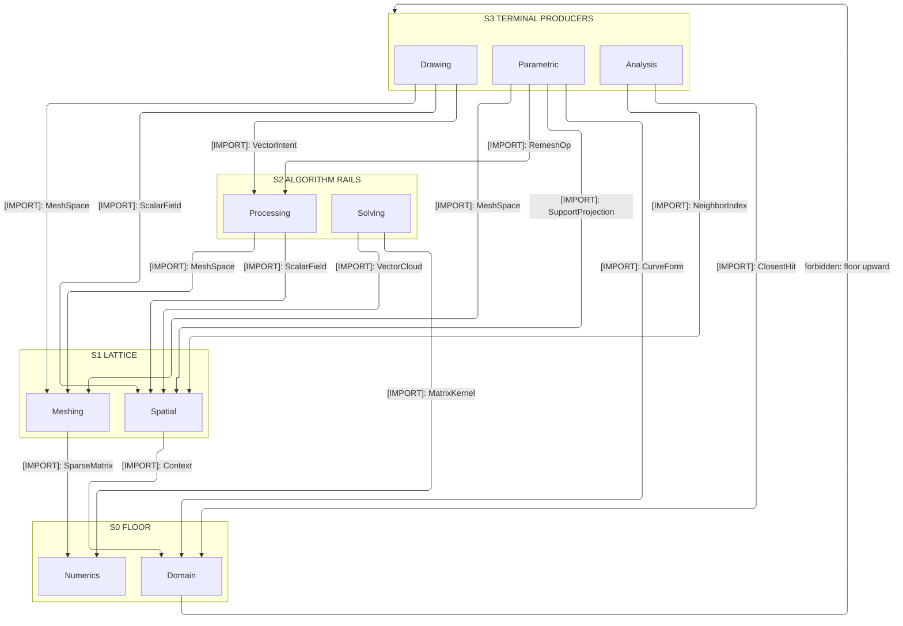
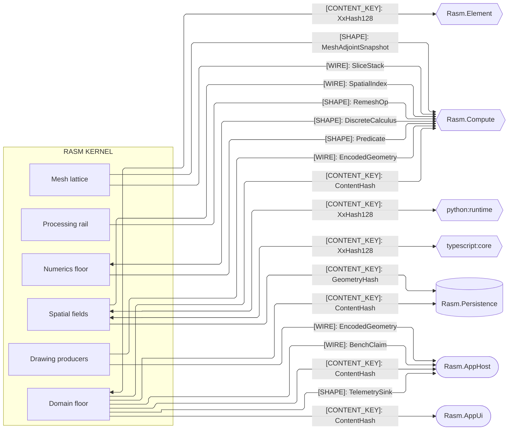
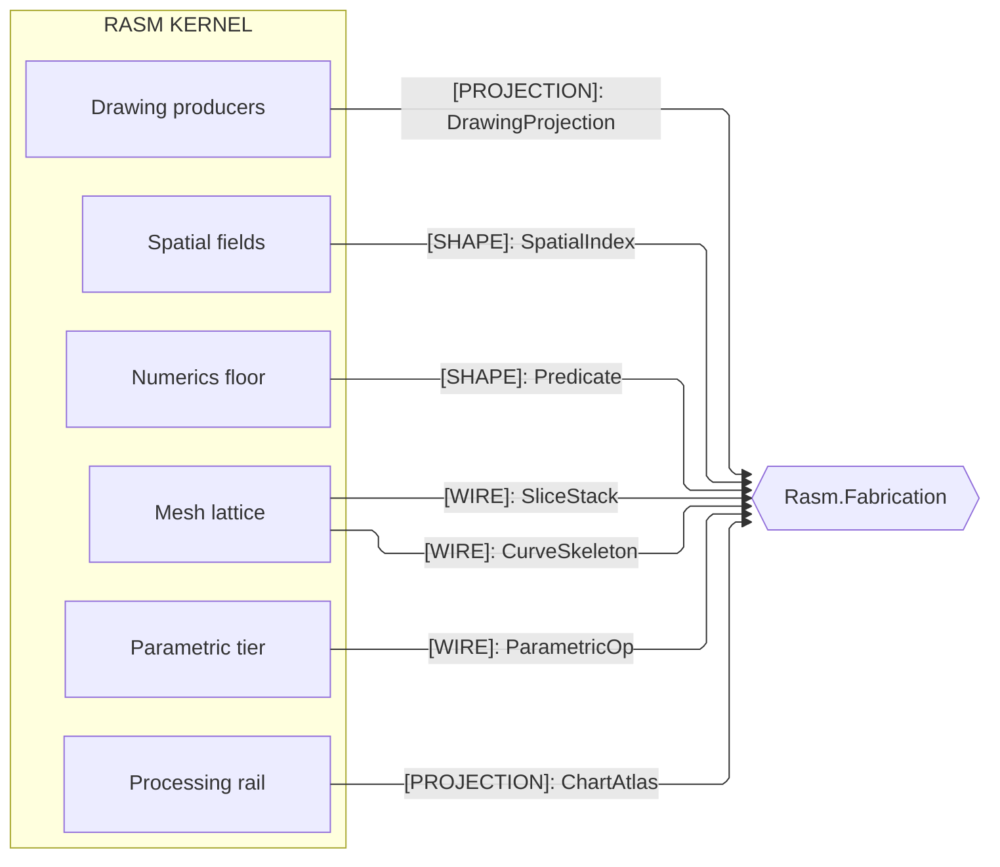
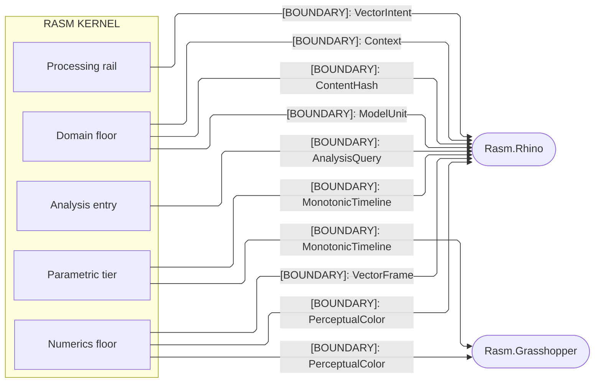

# [RASM_ARCHITECTURE]

`Rasm` maps the RhinoCommon-aware geometry and numeric kernel below the C# app strata: each sub-domain folder maps to exactly one namespace, and the kernel references no sibling. Kernel stays host-aware end to end under the Tier-0 universal-versus-capture law; the pure-numeric floor is host-neutral-shaped without minting a host-free assembly.

## [01]-[DOMAIN_MAP]

```text codemap
Rasm/
├── Domain/                  # Kernel substrate floor every sibling composes
│   ├── Rails.cs             # Op-key, result union, and rail algebra
│   ├── Context.cs           # Tolerance/units value objects and immutable context bundle
│   ├── Identity.cs          # One seed-zero XxHash128 content-key federation owner
│   ├── Validation.cs        # Readiness algebra and the one validity oracle
│   ├── Normalization.cs     # Topology/kind taxonomy and coercion lattice
│   ├── Evaluation.cs        # Closest-hit evaluation over frames, sampling, and signed distance
│   ├── Stats.cs             # Scalar-metric statistics vocabulary
│   └── Telemetry.cs         # Branch signal capsule, receipt-tap fabric, op-cost capsule, bench-claim ledger
├── Numerics/                # Exact-predicate floor and host-neutral-shaped numerics
│   ├── Predicates.cs        # Exact geometric-predicate precision ladder
│   ├── Faults.cs            # Consolidated band-2400 geometry fault family
│   ├── Atoms.cs             # Vector-algebra primitive floor and projection dispatch
│   ├── Matrix.cs            # Dense/sparse/complex linear-algebra kernel
│   ├── Integrate.cs         # Runge-Kutta integrator floor and field integrator
│   ├── Spectral.cs          # Discrete-calculus DEC bundle and spectral algebra
│   └── Calculus.cs          # Central-difference stencil and field-noise lattices
├── Spatial/                 # Proximity, clouds, neighborhoods, transport, fields, and naming
│   ├── Index.cs             # BVH/octree spatial index over the node store
│   ├── Naming.cs            # Topological-name lineage and re-anchoring
│   ├── Reconciliation.cs    # Geometry/naming content-hash reconcile fence
│   ├── Support.cs           # Gated support projection over the support-space adapter
│   ├── Cloud.cs             # Vector-cloud metric and PCA hull rail
│   ├── Neighbors.cs         # One kNN/radius/graph proximity substrate
│   ├── Transport.cs         # Log-domain Sinkhorn optimal-transport solver
│   └── Fields.cs            # Scalar/vector/tensor field and SDF vocabulary
├── Parametric/              # Vendored NURBS engine and host-neutral op tier
│   ├── Nurbs.cs             # One vendored NURBS evaluation engine
│   ├── Curve.cs             # Parametric curve-operation rail
│   ├── Surface.cs           # Parametric surface-operation rail
│   ├── Subdivide.cs         # Catmull-Clark/Loop subdivision fold
│   ├── Develop.cs           # Guaranteed-isometric developable-strip solver
│   ├── Panelize.cs          # Cross-field-guided surface panelization
│   ├── Patternmap.cs        # Wallpaper pattern-to-surface instancing
│   ├── Projections.cs       # Motion, easing, and monotonic-timing selectors
│   └── Locate.cs            # Location algebra with curvature extrema
├── Meshing/                 # Mesh substrate and construction lattice
│   ├── Delaunay.cs          # Constrained Delaunay and tetrahedralization
│   ├── Arrangement.cs       # Managed exact boolean/overlay cell complex
│   ├── Intersect.cs         # Predicate-exact intersection lattice
│   ├── Slice.cs             # Layered slicing fold and nesting forest
│   ├── Offset.cs            # Wavefront offset, skeleton, and clearance family
│   ├── Skeleton.cs          # Mean-curvature-flow curve-skeleton
│   ├── Mesh.cs              # Mesh snapshot, Laplacian cache, and intrinsic mesh
│   ├── Edit.cs              # Single-writer mesh build arena
│   ├── Dec.cs               # Discrete-exterior-calculus operators and Hodge decomposition
│   └── Reconstruct.cs       # Signed-heat surface-reconstruction spine
├── Processing/              # Algorithm pipelines over the floors
│   ├── Repair.cs            # Repair algebra and heal session fold
│   ├── Receipts.cs          # Typed rebuild-receipt chain and manifold status
│   ├── Decimate.cs          # Quadric-error mesh decimation
│   ├── Remesh.cs            # Isotropic and cross-field remeshing rewrite
│   ├── Flatten.cs           # UV-flattening parameterization over the DEC substrate
│   ├── Intent.cs            # Vector-intent consumer projection rail
│   ├── Sample.cs            # Sampling-kind domain dispatch
│   ├── Extract.cs           # Contour and iso-surface extraction ingress
│   ├── Flow.cs              # Dense-output flow tracing
│   ├── Register.cs          # ICP alignment dispatcher
│   ├── Geodesics.cs         # Heat-method and MMP geodesics
│   └── Segment.cs           # Descriptor-based mesh segmentation
├── Solving/                 # Nonlinear least-squares owners over the matrix floor
│   ├── Solver.cs            # One Gauss-Newton and constraint solver with island decomposition
│   └── Fit.cs               # MLESAC primitive-fit and orthogonal-distance refine
├── Drawing/                 # Kernel-quality 2D drawing-geometry producers
│   ├── View.cs              # Predicate-exact hidden-line and silhouette projection
│   └── Pack.cs              # Canonical geometry-encoding lattice
└── Analysis/                # Measured-query public entry
    ├── Query.cs             # Analysis-query request algebra and analyze facade
    ├── Measure.cs           # Mass-property, bounds, and conformance measures
    ├── Inspect.cs           # Topology and mesh-quality inspection folds
    ├── Select.cs            # Curve/face/point selection unions
    └── Relations.cs         # Rhino intersection lattice and classification
```

## [02]-[STRATA]

Four strata order the sub-domains; a co-recursive pair co-seats one stratum, so every cross-stratum consumption edge points down the ladder.

- S0 `Domain` + `Numerics` — co-recursive floor: `Op`, `Context`, `ContentHash`, `CurveForm`, and `TelemetrySink` beside `MatrixKernel`, `GeometryFault`, `PerceptualColor`, and `AtomProjection`; every sibling threads the rail and the exact-predicate floor, and the pair's mutual reach (`Op` into integration, `AtomProjection` into evaluation) is same-stratum fact.
- S1 `Spatial` + `Meshing` — co-recursive lattice composing the floor alone: `SpatialIndex`, `VectorCloud`, `GeometryHash`, and `ScalarField` beside `MeshSpace`, `MeshEdit`, `SliceStack`, and `CurveSkeleton`; intersection reads the index and reconciliation reads the mesh, both interior to the stratum.
- S2 `Processing` + `Solving` — co-recursive rails over the lattice: `HealOp`, `RemeshOp`, `ChartAtlas`, `VectorIntent`, and `SampleKind` beside the `Lm` solver and `FitReceipt`; the registration optimizer instantiating the `Lm` functor is the pair's same-stratum reach, and everything else consumes S0-S1 below.
- S3 `Parametric` + `Drawing` + `Analysis` — terminal producers nothing composes: `NurbsForm`, `MonotonicTimeline`, and `PanelField`; `DrawingProjection` and `EncodedGeometry`; `AnalysisQuery` and `Measure`.



## [03]-[SEAMS]







Content-key edges federate one hasher: `Domain/Identity` mints the seed-zero `XxHash128` entry every partner composes, and `Spatial/Reconciliation` reproduces that seed byte-for-byte with the Python and TypeScript peers so one content space addresses across runtimes. A second hasher or a non-zero seed is the named cross-folder drift.

Each partner edge carries its load-bearing shape on the graph; the owning sub-domain page enumerates the rest. Three invariants the graph cannot show: `Meshing` shares one 2D/3D clearance family with the fabrication toolpath planner rather than crossing a second boundary for it, `Drawing` encodes geometry once — one payload delivered as `EncodedGeometry` to the sandbox host and wrapped as `EncodedTensor` for compute residency, its `PackSchema` columnar identity (`ContentHash`-derived id over field/dtype/stride/null rows) riding the same wire as the one schema authority storage adapters read — and the signal fabric exits once: `Domain/Telemetry` owns the branch's one OTel-free signal capsule — hook point, modality, registry, instrument row and set, buckets, level cells, receipt fan, contributor port, identity mint — every stratum composes downward as instances, `TelemetrySink` is the kernel's own first-consumer arm the AppHost fan admits by name (`rasm.kernel` meter, `rasm.rasm.<domain>` sources), and `BenchClaim` rows are the enumeration its corpus gate ingests.

## [04]-[NAMESPACES]

Namespace mirrors folder path — `.editorconfig` `dotnet_style_namespace_match_folder = true:error`: every fence under `Rasm/<Folder>/` declares `namespace Rasm.<Folder>;`, one root namespace per sub-domain folder.

Kernel compiles as ONE assembly — the single `Rasm.csproj` — so internal members cross the sub-domain namespaces with no build edge; two recorded exceptions to strata direction ride that one-assembly law: the root-homed `GeometryFault` union composing upper-tier discriminants (`Numerics/Faults.cs`), and `TensorField.Curvature` (`Spatial/Fields.cs`) carrying the `Parametric` `SurfaceSpace` capsule so the one shape-operator owner stays `Parametric/Projections.cs`.

`Rasm.Domain.Fault` and the band-2400 `GeometryFault` family (`Numerics/Faults.cs`) are two families by explicit decision — kernel-substrate faults and robust-core geometry faults; `Numerics/Faults.cs` and `Domain/Rails.cs` each state the seam, and neither absorbs the other.
