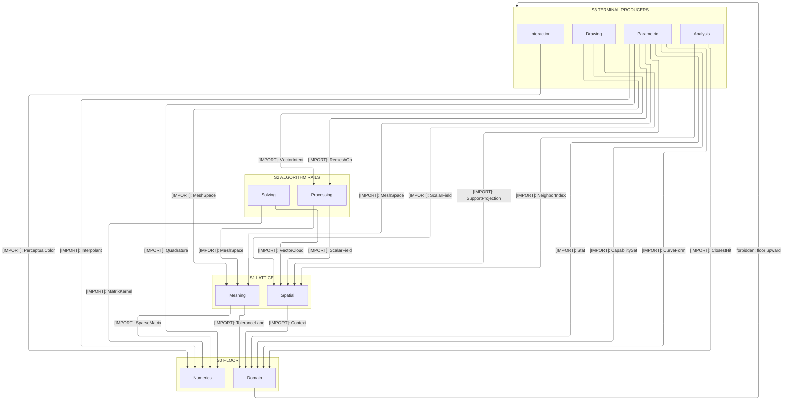
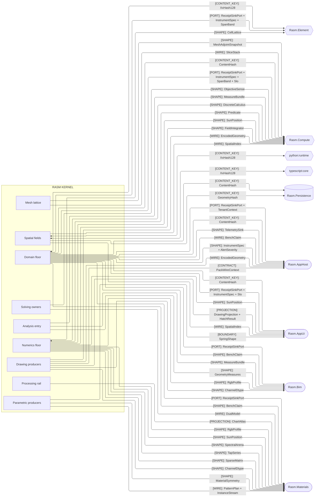
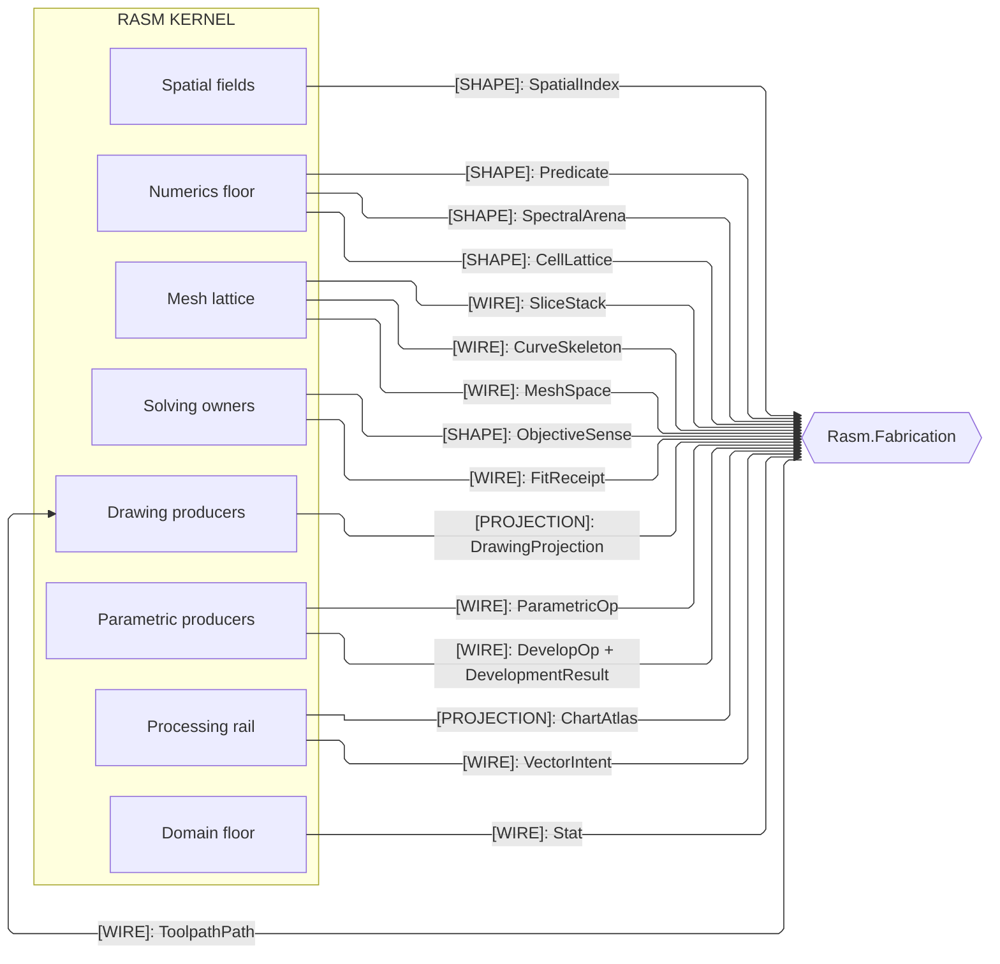
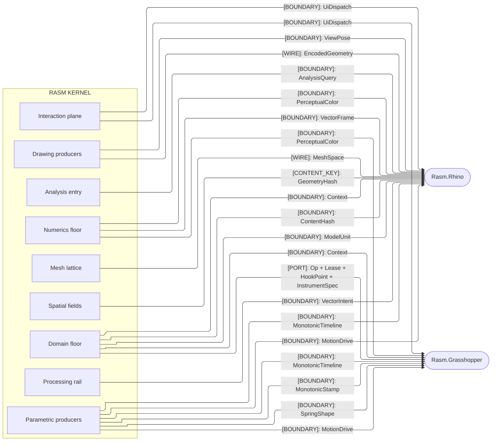

# [RASM_ARCHITECTURE]

`Rasm` maps the RhinoCommon- and Eto-aware geometry, numeric, and interaction kernel below the C# app strata: each sub-domain folder maps to exactly one namespace, and the kernel references no sibling. Kernel stays host-aware end to end under the Tier-0 universal-versus-capture law; the pure-numeric floor is host-neutral-shaped without minting a host-free assembly, and the interaction plane is the one owner of the host-boundary machinery both boundary packages compose.

## [01]-[DOMAIN_MAP]

```text codemap
Rasm/                      # Kernel below the C# app strata: exact-arithmetic floor, operational geometry, interaction machinery
├── Domain/                # Kernel substrate floor every sibling composes
│   ├── Rails.cs           # `Fault`, `Op`, `Retriability`, `Transition`, and `Lease<T>`; every fallible surface compiles against this floor
│   ├── Context.cs         # `ToleranceLane` rows bind `Band` and `BaseDimensions`; `Context.For(lane)` is the one read every gate threads
│   ├── Identity.cs        # `CanonicalWriter`, `ContentHash`, and the `Deterministic` splitmix64 owner; neither surface is cryptographic
│   ├── Validation.cs      # `OpAcceptance.ValidityOf` single validity oracle; `CapabilitySet<TCapability>` the one capability column
│   ├── Normalization.cs   # Erased-geometry conversion owner: `Lease<GeometryBase>` admission and the typed coercion lattice
│   ├── Evaluation.cs      # `ClosestHit` receipts over `Rhino.Geometry` values alone; document or view reach is the boundary violation
│   ├── Stats.cs           # One Welford four-moment recurrence and one order-statistic reader serve every measured carrier
│   ├── Hooks.cs           # `HookRail` capsule generic over each folder's `<Package>Point` roster; veto, observe, replay, and release law
│   ├── Frame.cs           # `TelemetrySource`, `CorrelationId`, `TenantContext`, `ReceiptEnvelope` with its HLC mint, session-GUC namespace
│   ├── Instrument.cs      # Declaration rows bind meters at mount; the backend-free tally answers a doctor verb with no exporter or store
│   ├── Objective.cs       # `Sli` family, burn rows, `AlertSeverity` ladder, `PanelSpec`, `BoardPack`, and `BenchClaim` as policy data
│   ├── Telemetry.cs       # `SignalFact`, `SpanBand`, `OpCost`, and `TelemetryContributorPort`; the port page tops the split, edges point down
│   └── Event.cs           # Branch's one message-envelope algebra every stratum composes; announcements gain no authority over facts
├── Numerics/              # Exact-predicate floor and host-neutral-shaped numerics
│   ├── Predicates.cs      # `Sign` total over explicit and constructed points; defining-point carriage rounds once at the emission seam
│   ├── Faults.cs          # `GeometryFault` `[Union]` and the `FaultCluster` stride taxonomy; `ToError()` lowers onto the LanguageExt rail
│   ├── Atoms.cs           # Guard `Band`s, `PerceptualColor`, `AtomProjection` rows with the identity fallthrough, primitive vector types
│   ├── Matrix.cs          # `MatrixKernel` partial with transform; receipts carry route, stop, residual — no raw `Matrix<double>` crosses
│   ├── Transform.cs       # `WindowTaper` roster, `Interpolant<TCap>`, `SpectralArena` over the four MathNet layouts, both convolution routes
│   ├── Integrate.cs       # `Step` is pure with no in-kernel reject loop; dense output localizes events on the solution curve
│   ├── Spectral.cs        # Mesh-free DEC carrier layer and eigen filter surface; `Meshing/dec` owns the mesh-bound assembly above it
│   └── Calculus.cs        # Sampler-generic differential operators and the closed-form site-and-instant almanac; no mesh type reaches here
├── Spatial/               # Proximity, clouds, neighborhoods, transport, fields, and naming
│   ├── Index.cs           # `SpatialIndex` `[Union]` kernels share one frozen `NodeStore`; primitive-AABB broad phase alone seats here
│   ├── Naming.cs          # `TopoName` `UInt128` lineage identity orthogonal to content hash; `Track` and `Resolve` fold one `NamingOp` union
│   ├── Reconciliation.cs  # `GeometryHash` and `TopoName` stay type-distinct so a cross-axis compare cannot compile
│   ├── Support.cs         # `SupportSpace` `[Union]` discriminated once at admission by proximity regime; `Project<TOut>` capability-gates reads
│   ├── Cloud.cs           # `VectorCloud` admission dedups by tolerance and renormalizes mass; metric rows name their `CloudKernel` fold
│   ├── Neighbors.cs       # `NeighborIndex` and `NeighborKernel` serve bare-point neighborhoods; broad phase stays with the spatial index
│   ├── Transport.cs       # One log-domain Sinkhorn iteration; balanced, unbalanced, and debiased marginals are policy columns, not bodies
│   └── Fields.cs          # `ScalarField`, `VectorField`, and `TensorField` closed unions whose case payloads are their admission structure
├── Parametric/            # Vendored NURBS engine and host-neutral op rail
│   ├── Nurbs.cs           # `Nurbs.Of` one polymorphic admission; homogeneous control nets on `Point3d`/`Vector3d`/`Plane` carriers
│   ├── Curve.cs           # `Parametric.Apply` folds ops over `NurbsForm.Curve` and the frame-local `PlanarPrimitive` run
│   ├── Surface.cs         # `Tessellate` mints `UvTessellation`, the frozen per-vertex `(u, v)` column consumers admit by type
│   ├── Subdivide.cs       # `SubdivisionScheme` stencil rows emit sparse operators; the Stam eigen lane makes limit evaluation mandatory
│   ├── Develop.cs         # Per-strip `ddouble` isometry witness; a strip over budget faults rather than shipping approximate flattening
│   ├── Panelize.cs        # `PanelFamily` rides the request as data; each panel leaves with origin, field-aligned x-axis, metric-true normal
│   ├── Patternmap.cs      # Wallpaper symmetry closed by theorem as data; the emitted `InstanceStream` is the Generation plane's exact input
│   ├── Projections.cs     # Selectors drain one `Project<TOut>` into `AtomProjection.Raw`; clock values stay branded to the injected timeline
│   └── Locate.cs          # `Operation<TGeometry, TOut>` under `Eff<Env, Seq<TOut>>`; `AnalysisQuery.Location` is the sole public route in
├── Meshing/               # Mesh substrate and construction lattice
│   ├── Delaunay.cs        # `Tessellation.Build` over one `SimplexStore` arena; `Implicit` carriage keeps exact signs to `ToMesh`
│   ├── Arrangement.cs     # `ArrangementOp` over subdivide, classify, keep, weld; four booleans are four data rows, `manifoldc` the companion
│   ├── Intersect.cs       # `CrossKey` interns adjacent-face crossings by integer equality; chains walk that adjacency into oriented loops
│   ├── Slice.cs           # `LayerPlan` generates the plane family as height-law data; crossing machinery composes the intersect owner
│   ├── Offset.cs          # Aichholzer-Aurenhammer wavefront; reflex, split, and ring decisions read exact `Orient2D` signs over input
│   ├── Skeleton.cs        # MCF contraction, collapse surgery to the 1D remnant, QuikGraph extraction; admission gates watertight manifolds
│   ├── Mesh.cs            # `MeshSource` discriminant, `MeshDraft` accumulator, `LaplacianCache`, intrinsic-triangulation witnesses
│   ├── Edit.cs            # Single-writer SoA arena and the `Kernels` weld/transform/diagonal primitives; publish is freeze into `MeshSpace`
│   ├── Dec.cs             # Mesh-bound assembly of the spectral bundle under the `∂∂ = 0` gate; assembles, never re-derives
│   └── Reconstruct.cs     # Each `ReconstructionPolicy` case builds a `fields` scalar field; native callbacks convert through `Op.Catch`
├── Processing/            # Algorithm pipelines over the floors
│   ├── Repair.cs          # Total over its input class: non-manifold and odd-Euler meshes heal rather than fail; mints no content hash
│   ├── Receipts.cs        # `ManifoldStatus`, per-op `RebuildReceipt`, `HealSession`, `RebuildLog`; interior types crossing to the naming fold
│   ├── Decimate.cs        # Exact `Orient3D` gate refuses flipped faces by construction; reversible vertex-split stream, Hausdorff budget
│   ├── Remesh.cs          # One projected-convexity exact flip gate over a single `MeshEdit` arena; first-principles rewrite, no host echo
│   ├── Flatten.cs         # Pinned solves eliminate boundary rows so the interior factors SPD; penalty forms are the refused class
│   ├── Intent.cs          # One `Project<TOut>(Context, Op?)` egress, the frozen signature `Rasm.Rhino` Camera binds while owners re-derive
│   ├── Sample.cs          # `PowerCcvtPolicy.Preset` mints tuning on the `Op` rail; every threshold reads its own tolerance row at the run
│   ├── Extract.cs         # `ContourPolicy` routes each domain to its named owner: host adapters, crossing lattice, or the marching lane
│   ├── Flow.cs            # `Termination` union decides every stop; `MorseAtlas.Of` folds the tracer into a frozen-column `MorseGraph`
│   ├── Register.cs        # Two `VectorCloud` clusters in, one gated `Transform` out; the Procrustes lane adds scale under the policy record
│   ├── Geodesics.cs       # Every solver runs against the shared `LaplacianCache`; `fields` case names delegate their bodies here
│   └── Segment.cs         # Host restructure is CAPTURE; this page owns the native surface and never re-derives the first-principles tier
├── Solving/               # Nonlinear least-squares owners over the matrix floor
│   ├── Solver.cs          # One λ-ladder under `Schedule.recurs`, rank deficiency typed; `ObjectiveSense` the branch direction rows
│   └── Fit.cs             # Truncated-cost robust consensus; `Kinds` arity alone separates a pinned fit from a multi-kind competition
├── Drawing/               # Kernel-quality 2D drawing-geometry producers
│   ├── View.cs            # Appel quantitative invisibility on exact signs; one QI solve over the part-roster offset union soup
│   ├── Pack.cs            # `ToolpathPath` retains line and circular spans; arc centre and sense survive packing as content, never chords
│   ├── Sheet.cs           # Series extents derive from each standard's own formula; frames, ladders, grammars publish beside host projections
│   └── Hatch.cs           # Courses generate against the region's own extent, clipped by exact winding parity; motifs orbit the wallpaper set
├── Analysis/              # Measured-query public entry
│   ├── Query.cs           # Call arity recovers from the case through `Single`/`Pair`/`Service` dispatchers, never a suffix or knob
│   ├── Measure.cs         # Every mass answer is a `(MassKind, MassProperty)` coordinate; `MeasureBundle` the kind-keyed multi-domain takeoff
│   ├── Inspect.cs         # One `OnGeometry` gate lowers brep-coercible inputs through the leased brep form
│   ├── Select.cs          # `EdgeDescriptor` data drives edge selection; `TopologyProjection` crosses under a leak-free transfer fold
│   └── Relations.cs       # Type-pair lattice rows bind admission predicate, result shape, and host compute delegate over the query `Env`
└── Interaction/           # Eto-shaped control, paint, transfer, and platform owners under the `[BoundaryAdapter]` carve
    ├── Dispatch.cs        # Crossing modality is the union case; every crossing gauges its lane's declared budget and never swallows a `Fin`
    ├── Clock.cs           # One leased clock over a host timer; the failure-posture row decides whether a failing tick halts or runs on
    ├── Transfer.cs        # Payload slots are a closed family with total one-shot release; drag is a CASE, a write to a host-carried bundle
    ├── Binding.cs         # Fusion legality is one closed source-flow-timing table; rigs answer a leased receipt owning refresh and unbind
    ├── Control.cs         # Leaf cases carry exactly their host widget's payload; modality lives in role rows, never sibling cases
    ├── Chrome.cs          # One verb ROW claims identity, gesture, availability, and every occurrence; the chromes project one row set
    ├── Paint.cs           # One ordered mark run bounds, hit-tests, and replays onto live and printed surfaces without re-description
    ├── Platform.cs        # Rows answer every platform question, never a scattered `IsMac`; seats capture and re-register prior factories
    ├── Asset.cs           # Origin is WHERE bytes come from; pose and filter are orthogonal axes, so a rotated tinted glyph is data
    └── Input.cs           # Raw device state crosses once at the seam as finiteness-admitted facts carrying both coordinate frames
```

## [02]-[STRATA]

Strata rank the kernel interior; seating rows carry only the law the fence cannot show.

- S0 co-seat — `Domain` and `Numerics` compose mutually at file grain: `Integrate` reads `Op`, `Evaluation` reads `AtomProjection`, no module cycle.
- S0 law — no floor file names an upper type; every upper stratum threads the exact-predicate ladder and the `Context` tolerance read.
- S1 interior — `Intersect` reads the spatial index and `Reconciliation` the mesh store inside the rank, so the lattice stays one stratum.
- S2 interior — the ICP registration optimizer instantiates the `Lm` functor inside the rank, so optimization mints no third stratum.
- S3 interior — `Drawing` reads `Parametric`'s wallpaper fold and `Interaction` the `Drawing` sheet vocabulary; every interior edge stays in-rank.
- S3 law — no lower stratum composes a terminal producer; the fence draws downward discriminating imports alone, and `f1` forbids the inversion.
- S0→S3 — root-homed `GeometryFault` declares arms for upper-stratum discriminants; the union is data riding the one-assembly law, never a build edge.
- S1→S3 — `TensorField.Curvature` carries the `Parametric` `SurfaceSpace` capsule, so the shape-operator owner stays `Projections.cs`.
- S1→S2 — the `Meshing/Mesh.cs` overlay seats `Processing/Geodesics.cs` `WalkChart` in `EdgeOverlay` mode, so one chart kernel serves every mode.


```mermaid
---
config:
  layout: elk
  flowchart:
    curve: linear
    padding: 25
---
flowchart TB
    accTitle: Rasm kernel interior strata
    accDescr: How each kernel stratum composes the ranks beneath it with no upward import.
    subgraph S3["S3 TERMINAL PRODUCERS"]
        Analysis[Analysis]
        Parametric[Parametric]
        Drawing[Drawing]
        Interaction[Interaction]
    end
    subgraph S2["S2 ALGORITHM RAILS"]
        Solving[Solving]
        Processing[Processing]
    end
    subgraph S1["S1 LATTICE"]
        Meshing[Meshing]
        Spatial[Spatial]
    end
    subgraph S0["S0 FLOOR"]
        Numerics[Numerics]
        Domain[Domain]
    end
    Parametric e1@-->|"[IMPORT]: RemeshOp"| Processing
    Drawing e2@-->|"[IMPORT]: VectorIntent"| Processing
    Parametric e3@-->|"[IMPORT]: MeshSpace"| Meshing
    Drawing e4@-->|"[IMPORT]: MeshSpace"| Meshing
    Drawing e5@-->|"[IMPORT]: ScalarField"| Spatial
    Parametric e6@-->|"[IMPORT]: SupportProjection"| Spatial
    Parametric e7@-->|"[IMPORT]: Interpolant"| Numerics
    Parametric e8@-->|"[IMPORT]: Quadrature"| Numerics
    Parametric e9@-->|"[IMPORT]: Stat"| Domain
    Parametric e10@-->|"[IMPORT]: CapabilitySet"| Domain
    Analysis e11@-->|"[IMPORT]: NeighborIndex"| Spatial
    Analysis e12@-->|"[IMPORT]: ClosestHit"| Domain
    Parametric e13@-->|"[IMPORT]: CurveForm"| Domain
    Processing e14@-->|"[IMPORT]: MeshSpace"| Meshing
    Processing e15@-->|"[IMPORT]: ScalarField"| Spatial
    Solving e16@-->|"[IMPORT]: MatrixKernel"| Numerics
    Solving e17@-->|"[IMPORT]: VectorCloud"| Spatial
    Meshing e18@-->|"[IMPORT]: SparseMatrix"| Numerics
    Meshing e19@-->|"[IMPORT]: ToleranceLane"| Domain
    Spatial e20@-->|"[IMPORT]: Context"| Domain
    Interaction e21@-->|"[IMPORT]: PerceptualColor"| Numerics
    Domain f1@-->|"forbidden: floor upward"| S3
```

## [03]-[SEAMS]


```mermaid
---
config:
  layout: elk
  flowchart:
    curve: linear
    padding: 25
---
flowchart LR
    accTitle: Kernel content-key and compute-plane seams
    accDescr: Which content keys, shapes, ports, and wires the kernel owners hand to same-branch and cross-runtime peers.
    subgraph rasm[RASM KERNEL]
        Domain[Domain floor]
        Numerics[Numerics floor]
        Spatial[Spatial fields]
        Meshing[Mesh lattice]
        Parametric[Parametric producers]
        Processing[Processing rail]
        Solving[Solving owners]
        Drawing[Drawing producers]
        Analysis[Analysis entry]
    end
    Element{{Rasm.Element}}
    Compute{{Rasm.Compute}}
    Runtime{{python:runtime}}
    Core{{typescript:core}}
    Persistence[(Rasm.Persistence)]
    AppHost([Rasm.AppHost])
    AppUi([Rasm.AppUi])
    Bim([Rasm.Bim])
    Materials([Rasm.Materials])
    Domain e1@<-->|"[CONTENT_KEY]: XxHash128"| Element
    Domain e2@-->|"[CONTENT_KEY]: ContentHash"| Persistence
    Domain e3@-->|"[CONTENT_KEY]: ContentHash"| Compute
    Domain e4@-->|"[CONTENT_KEY]: ContentHash"| AppHost
    Domain e5@-->|"[CONTENT_KEY]: ContentHash"| AppUi
    Spatial e6@-->|"[CONTENT_KEY]: GeometryHash"| Persistence
    Spatial e7@<-->|"[CONTENT_KEY]: XxHash128"| Runtime
    Spatial e8@<-->|"[CONTENT_KEY]: XxHash128"| Core
    Numerics e9@<-->|"[SHAPE]: DiscreteCalculus"| Compute
    Numerics e10@-->|"[SHAPE]: Predicate"| Compute
    Meshing e11@-->|"[SHAPE]: MeshAdjointSnapshot"| Compute
    Meshing e12@-->|"[WIRE]: SliceStack"| Compute
    Spatial e13@-->|"[WIRE]: SpatialIndex"| Compute
    Drawing e14@-->|"[WIRE]: EncodedGeometry"| Compute
    Drawing e15@-->|"[WIRE]: EncodedGeometry"| AppHost
    Drawing e16@-->|"[CONTRACT]: PackWireContext"| AppHost
    Domain e17@-->|"[SHAPE]: TelemetrySink"| AppHost
    Domain e18@-->|"[WIRE]: BenchClaim"| AppHost
    Domain e19@-->|"[SHAPE]: InstrumentSpec + AlertSeverity"| AppHost
    Domain e20@-->|"[PORT]: ReceiptSinkPort + TenantContext"| AppHost
    Domain e21@-->|"[PORT]: ReceiptSinkPort + InstrumentSpec + Slo"| AppUi
    Domain e22@-->|"[PORT]: ReceiptSinkPort + InstrumentSpec + SpanBand + Slo"| Compute
    Analysis e23@-->|"[SHAPE]: GeometryMeasures"| Bim
    Domain e24@-->|"[PORT]: ReceiptSinkPort + InstrumentSpec + SpanBand"| Element
    Domain e25@-->|"[PORT]: ReceiptSinkPort"| Bim
    Domain e26@-->|"[PORT]: ReceiptSinkPort"| Materials
    Domain e27@-->|"[SHAPE]: BenchClaim"| Materials
    Domain e28@-->|"[SHAPE]: BenchClaim"| Bim
    Numerics e29@-->|"[SHAPE]: CellLattice"| Element
    Numerics e30@-->|"[SHAPE]: RgbProfile"| Bim
    Numerics e31@-->|"[SHAPE]: RgbProfile"| Materials
    Numerics e32@-->|"[SHAPE]: SunPosition"| Compute
    Numerics e33@-->|"[SHAPE]: SunPosition"| AppUi
    Numerics e34@-->|"[SHAPE]: SunPosition"| Materials
    Numerics e35@-->|"[SHAPE]: SpectralArena"| Materials
    Numerics e36@-->|"[SHAPE]: TapSeries"| Materials
    Numerics e37@-->|"[SHAPE]: SparseMatrix"| Materials
    Numerics e38@-->|"[SHAPE]: FieldIntegrator"| Compute
    Drawing e39@-->|"[PROJECTION]: DrawingProjection + HatchResult"| AppUi
    Parametric e40@-->|"[BOUNDARY]: SpringShape"| AppUi
    Spatial e41@-->|"[WIRE]: SpatialIndex"| AppUi
    Solving e42@-->|"[WIRE]: DualModel"| Materials
    Drawing e43@-->|"[SHAPE]: ChannelDtype"| Materials
    Processing e44@-->|"[PROJECTION]: ChartAtlas"| Materials
    Parametric e45@-->|"[WIRE]: PatternPlan + InstanceStream"| Materials
    Parametric e46@-->|"[SHAPE]: MaterialSymmetry"| Materials
    Drawing e47@-->|"[SHAPE]: ChannelDtype"| Bim
    Analysis e48@-->|"[SHAPE]: MeasureBundle"| Compute
    Analysis e49@-->|"[SHAPE]: MeasureBundle"| Bim
    Solving e50@-->|"[SHAPE]: ObjectiveSense"| Compute
```


```mermaid
---
config:
  layout: elk
  flowchart:
    curve: linear
    padding: 25
---
flowchart LR
    accTitle: Kernel fabrication seams
    accDescr: Kernel owners projecting substrate, algorithm, and drawing shapes to the fabrication peer and reading its posted toolpath pack back.
    subgraph rasm[RASM KERNEL]
        Domain[Domain floor]
        Spatial[Spatial fields]
        Numerics[Numerics floor]
        Meshing[Mesh lattice]
        Parametric[Parametric producers]
        Processing[Processing rail]
        Solving[Solving owners]
        Drawing[Drawing producers]
    end
    Fabrication{{Rasm.Fabrication}}
    Spatial e1@-->|"[SHAPE]: SpatialIndex"| Fabrication
    Numerics e2@-->|"[SHAPE]: Predicate"| Fabrication
    Numerics e3@-->|"[SHAPE]: SpectralArena"| Fabrication
    Numerics e4@-->|"[SHAPE]: CellLattice"| Fabrication
    Meshing e5@-->|"[WIRE]: SliceStack"| Fabrication
    Meshing e6@-->|"[WIRE]: CurveSkeleton"| Fabrication
    Parametric e7@-->|"[WIRE]: ParametricOp"| Fabrication
    Processing e8@-->|"[PROJECTION]: ChartAtlas"| Fabrication
    Drawing e9@-->|"[PROJECTION]: DrawingProjection"| Fabrication
    Meshing e10@-->|"[WIRE]: MeshSpace"| Fabrication
    Parametric e11@-->|"[WIRE]: DevelopOp + DevelopmentResult"| Fabrication
    Processing e12@-->|"[WIRE]: VectorIntent"| Fabrication
    Domain e13@-->|"[WIRE]: Stat"| Fabrication
    Solving e14@-->|"[WIRE]: FitReceipt"| Fabrication
    Fabrication e15@-->|"[WIRE]: ToolpathPath"| Drawing
    Solving e16@-->|"[SHAPE]: ObjectiveSense"| Fabrication
```


```mermaid
---
config:
  layout: elk
  flowchart:
    curve: linear
    padding: 25
---
flowchart LR
    accTitle: Kernel host-UI boundary seams
    accDescr: Which boundary contracts, wires, and keys the kernel hands one-way down to the Rhino and Grasshopper host packages.
    subgraph rasm[RASM KERNEL]
        Domain[Domain floor]
        Numerics[Numerics floor]
        Spatial[Spatial fields]
        Meshing[Mesh lattice]
        Parametric[Parametric producers]
        Processing[Processing rail]
        Drawing[Drawing producers]
        Analysis[Analysis entry]
        Interaction[Interaction plane]
    end
    Rhino([Rasm.Rhino])
    Grasshopper([Rasm.Grasshopper])
    Numerics e1@-->|"[BOUNDARY]: PerceptualColor"| Rhino
    Numerics e2@-->|"[BOUNDARY]: PerceptualColor"| Grasshopper
    Domain e3@-->|"[BOUNDARY]: Context"| Rhino
    Domain e4@-->|"[BOUNDARY]: Context"| Grasshopper
    Domain e5@-->|"[BOUNDARY]: ContentHash"| Rhino
    Parametric e6@-->|"[BOUNDARY]: MonotonicTimeline"| Rhino
    Parametric e7@-->|"[BOUNDARY]: MonotonicTimeline"| Grasshopper
    Processing e8@-->|"[BOUNDARY]: VectorIntent"| Rhino
    Analysis e9@-->|"[BOUNDARY]: AnalysisQuery"| Rhino
    Domain e10@-->|"[BOUNDARY]: ModelUnit"| Rhino
    Numerics e11@-->|"[BOUNDARY]: VectorFrame"| Rhino
    Drawing e12@-->|"[BOUNDARY]: ViewPose"| Rhino
    Drawing e13@-->|"[WIRE]: EncodedGeometry"| Rhino
    Meshing e14@-->|"[WIRE]: MeshSpace"| Rhino
    Spatial e15@-->|"[CONTENT_KEY]: GeometryHash"| Rhino
    Parametric e16@-->|"[BOUNDARY]: MonotonicStamp"| Grasshopper
    Parametric e17@-->|"[BOUNDARY]: SpringShape"| Grasshopper
    Domain e18@-->|"[PORT]: Op + Lease + HookPoint + InstrumentSpec"| Grasshopper
    Parametric e19@-->|"[BOUNDARY]: MotionDrive"| Rhino
    Parametric e20@-->|"[BOUNDARY]: MotionDrive"| Grasshopper
    Interaction e21@-->|"[BOUNDARY]: UiDispatch"| Rhino
    Interaction e22@-->|"[BOUNDARY]: UiDispatch"| Grasshopper
```

Content-key edges federate one hasher: `Domain/Identity` mints the seed-zero `XxHash128` entry AND the `CanonicalWriter` preimage every partner composes; `Spatial/Reconciliation` writes its frames through that one writer, holding byte parity with the Python and TypeScript peers so one content space addresses across runtimes. Second hashers, second byte emitters, and non-zero seeds are the named cross-folder drift.

## [04]-[INTERNAL]

One crossing law rules the interior: identity mints once and everything downstream composes the mint.

- `Domain/Identity` mints the seed-zero hash and `CanonicalWriter` preimage; every framing and content key composes that one writer.
- `Drawing` encodes geometry once — one payload, `EncodedGeometry` to the sandbox host, wrapped as `EncodedTensor` for compute residency.
- `PackSchema` columnar identity, `ContentHash`-derived, rides that same wire as the one schema authority storage adapters read.
- Signal exits once: `Domain/Telemetry` owns the branch's OTel-free signal capsule, and every stratum composes it downward as instances.
- Causal frame names the receipt seam for every emitting stratum without an upward reference.
- `Meshing` shares one 2D/3D clearance family with the fabrication toolpath planner rather than crossing a second boundary for it.
- Every descriptor plane compiles one burn discipline and re-declares no panel row.

## [05]-[BOUNDARIES]

- `TelemetrySink` is the kernel's first-consumer arm the AppHost fan admits by name — `rasm.kernel` meter, `rasm.rasm.<domain>` sources.
- Causal-frame vocabulary seats here: `TelemetrySource` `CorrelationId` `TenantId`/`TenantContext` `ReceiptEnvelope` `ReceiptSinkPort`.
- OTel baggage store, foreign-source rows, and resource lacing register at the app platform as composition rows.
- Objectives are policy, not signal: the indicator family, burn table, routing severity, panel vocabulary, and `BoardPack` carrier seat here.
- Packs travel downward on `TelemetryContributorPort` beside the rows they name; the mounting root is the proving surface.
- `BenchClaim` rows are the enumeration the telemetry corpus gate ingests.

## [06]-[NAMESPACES]

Namespace mirrors folder path under `.editorconfig` `dotnet_style_namespace_match_folder = true:error`: every fence under `Rasm/<Folder>/` declares `namespace Rasm.<Folder>;`, one root namespace per sub-domain folder, `Rasm.Interaction` included.

Kernel compiles as ONE assembly, the single `Rasm.csproj`, so internal members cross the sub-domain namespaces with no build edge; recorded exceptions to strata direction ride that law as the `[02]-[STRATA]` cross-stratum rows.

`Rasm.Domain.Fault` and the band-2400 `GeometryFault` family (`Numerics/Faults.cs`) are two families by explicit decision: kernel-substrate faults and robust-core geometry faults; `Numerics/Faults.cs` and `Domain/Rails.cs` each state the seam, and neither absorbs the other.
