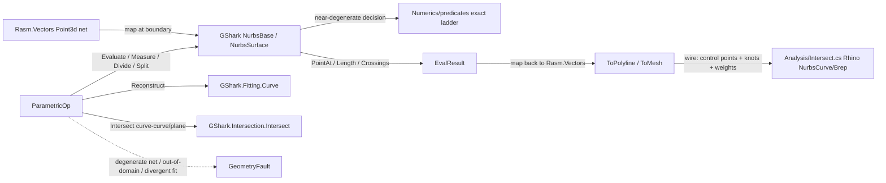

# [RASM_PARAMETRIC_CURVE]

The host-neutral parametric curve/surface evaluation owner — ONE `Parametric` `[Union]` (`Curve`/`Surface`) over a `GShark` pure-managed NURBS engine that evaluates, measures, divides, splits, re-degrees, intersects, and reconstructs rational B-spline curves and surfaces WITHOUT RhinoCommon, so a non-Rhino runtime reads the SAME parametric contract the Rhino host reads through `Analysis/Intersect.cs`'s `Rhino.Geometry.NurbsCurve`/`Brep` surface — the two owners meet at the wire (control points + knots + weights), never inside one runtime. The page retires the in-house NURBS-Book hand-roll (basis functions, knot insertion, De Boor recursion, Gauss-Legendre arc-length, Newton closest-point): `GShark` owns that textbook arithmetic, the kernel composes its `NurbsBase` instance algebra and maps `Rasm.Vectors` `Point3d`/`Vector3d`/`Plane` to GShark `Point3`/`Vector3`/`Plane` AT THE BOUNDARY only. The page owns the `ParametricKind` `[SmartEnum<string>]` discriminant (binding the sibling-owned `GeometryKeyPolicy` string-key comparer), the `Parametric` `[Union]` wrapping the GShark `NurbsBase`/`NurbsSurface` evaluable, the `ParametricOp` `[Union]` evaluation/measure/divide/reconstruct/intersect request algebra, the `EvalResult` typed result carrier, and the `ToMesh`/`ToPolyline` projections re-emitting through the `Vectors` seam.

The owner is `double`-domain parametric geometry: `GShark` carries NO exact/robust arithmetic, so any GShark result feeding a degeneracy-sensitive decision escalates to the `Numerics/predicates#ROBUST_PREDICATES` exact ladder — GShark's evaluation is the geometry, never the adjudication. The page composes `Vectors` `Point3d`/`Vector3d`/`Plane`/`Polyline`/`MeshSpace` coordinates as SETTLED vocabulary — read, map at the seam, never re-mint — operates on raw `double` only inside the GShark-boundary marshal (a parametric coordinate is the domain's native scalar), routes every reachable failure through the one band-2400 `GeometryFault` union (`ParameterizationFault` 2480 for a divergent reconstruction, `DegenerateInput` 2401 for a degenerate control net), and computes no hash and mints no second identity. The `Parametric`/`EvalResult` records ARE the hash-friendly carriers the `Spatial/reconciliation#NAMING_HASH` `Encode` content-addresses through the `MeshSpace`/`Polyline` projection; this owner content-addresses nothing itself.

## [01]-[INDEX]

- [01]-[PARAMETRIC]: `ParametricKind` discriminant; `Parametric` `[Union]` (`Curve`/`Surface`) wrapping the `GShark` `NurbsBase`/`NurbsSurface` evaluable; `ParametricOp` `[Union]` (`Evaluate`/`Measure`/`Divide`/`Split`/`Reconstruct`/`Intersect`) request algebra over one polymorphic `Apply`; the `EvalResult` typed carrier; `ToMesh`/`ToPolyline` projections re-emitting through the `Vectors` seam.

## [02]-[PARAMETRIC]

- Owner: `ParametricKind` `[SmartEnum<string>]` the curve-vs-surface discriminant (`curve`/`surface`) binding the sibling-owned `GeometryKeyPolicy` (`Numerics/faults#FAULT_BAND`) as its string-key comparer carrying the per-kind `ParameterArity` (a curve is `1` over `t∈[0,1]`, a surface is `2` over `(u,v)∈[0,1]²`) column; `Parametric` `[Union]` `Curve`/`Surface` each wrapping the `GShark` evaluable (`Curve` a `GShark.Geometry.NurbsBase` — the abstract curve algebra every concrete curve `NurbsCurve`/`Line`/`Arc`/`Circle`/`PolyLine`/`PolyCurve` derives, so one wrapper evaluates any curve through one reference — `Surface` a `GShark.Geometry.NurbsSurface`) plus the `Context` tolerance the projection threads; `ReconstructKind` `[SmartEnum<int>]` the curve-from-points reconstruction discriminant (`interpolate`/`approximate`/`bezier`) the `Reconstruct` op reads, never a parallel reconstructor; `ParametricOp` `[Union]` the request algebra `Evaluate` (point + derivatives + frame at a parameter), `Measure` (arc length, closest point/parameter, curvature), `Divide` (equal-count/max-length/chord subdivision), `Split` (sub-curve extraction at one/many parameters), `Reconstruct` (a curve THROUGH or NEAR a `Point3d` set via `GShark.Fitting.Curve`), `Intersect` (curve-curve/curve-line/curve-plane via the typed `GShark.Intersection.Intersect` family); `EvalResult` the typed carrier (`Sample` point+tangent+derivatives+frame, `Span` arc-length/closure scalars, `Division` the `(Point3d[] Points, double[] Parameters)` subdivision, `Pieces` the split sub-curves, `Crossings` the parameter+point intersection list); `Parametrics` the static surface whose `Apply` fold marshals the request to the GShark instance algebra and projects the typed result.
- Cases: `ParametricKind` rows `curve` · `surface` (2); `Parametric` cases `Curve` · `Surface` (2); `ReconstructKind` rows `interpolate` · `approximate` · `bezier` (3); `ParametricOp` cases `Evaluate` · `Measure` · `Divide` · `Split` · `Reconstruct` · `Intersect` (6); `EvalResult` cases `Sample` · `Span` · `Division` · `Pieces` · `Crossings` (5). The two kinds share ONE `Apply` fold — a curve op lowers to the `NurbsBase` instance algebra, a surface op to the `NurbsSurface` bidirectional `(u,v)` algebra — never two evaluator classes; the reconstruct/intersect ops are curve-only (a surface reconstruct routes through the `NurbsSurface.From*` factory family the `Build` entrypoint owns, never a `ParametricOp` case).
- Entry: `public static Fin<Parametric> CurveFrom(ReadOnlySpan<Point3d> controlPoints, ReadOnlySpan<double> weights, int degree)` mints the `Curve` wrapper from a `Rasm.Vectors` control net (mapped to GShark `Point3`/`Point4` AT THE BOUNDARY), `Fin<T>` routing `GeometryFault.DegenerateInput` when the net is empty, carries a non-finite control point, or `degree < 1`; `public static Fin<Parametric> SurfaceFrom(SurfaceFactory factory)` mints the `Surface` wrapper through the `NurbsSurface` factory family (`FromCorners`/`FromPoints`/`FromLoft`/`FromExtrusion`/`FromSweep`/`Ruled`/`Revolved`, the construction vocabulary carried in the `SurfaceFactory` `[Union]` so the factory choice is a case, never a `BuildLoft`/`BuildSweep` sibling family); `public Fin<EvalResult> Apply(ParametricOp op)` is the ONE polymorphic evaluation entrypoint discriminating by `ParametricOp` case, `Fin<T>` routing `GeometryFault.ParameterizationFault` when a reconstruction diverges (an approximation that cannot fit the point set within the GShark tolerance) and `GeometryFault.DegenerateInput` when a parameter is outside `[0,1]` or an intersect operand is degenerate. No `EvaluatePoint`/`MeasureLength`/`DivideByCount`/`SplitAt` sibling entrypoints — one polymorphic `Apply` discriminates by request case.
- Auto: `Apply` marshals each request to the GShark instance algebra over the wrapped `NurbsBase`/`NurbsSurface`, mapping `Rasm.Vectors` `Point3d`/`Vector3d`/`Plane` to GShark `Point3`/`Vector3`/`Plane` at the call boundary and back at the result. `Evaluate` reads `NurbsBase.PointAt(t)`/`TangentAt(t)`/`DerivativeAt(t, n)`/`CurvatureAt(t)`/`PerpendicularFrameAt(t)` (the rotation-minimizing sweep frame) for a curve, `NurbsSurface.PointAt(u,v)`/`EvaluateAt(u,v, direction)` for a surface — parameters are the NORMALIZED domain `[0,1]`/`[0,1]²`, NOT raw knots, so a parameter outside `[0,1]` routes `DegenerateInput`; `Measure` reads `NurbsBase.Length` (the Gauss-Legendre arc length GShark owns)/`LengthAt(t)`/`ParameterAtLength(d)`/`ClosestPoint(p)`/`ClosestParameter(p)` (the Newton foot-of-perpendicular projection — the single-curve continuous nearest point, distinct from the `Spatial/index#SPATIAL_INDEX` discrete cloud k-NN which routes a sampled curve through the kd-tree leaf); `Divide` reads `NurbsBase.Divide(numberOfSegments)`/`Divide(maxSegmentLength, equalSegmentLengths)`/`DivideByChordLength(d)` returning the `(List<Point3> Points, List<double> Parameters)` pair re-emitted as `EvalResult.Division`; `Split` reads `NurbsBase.SplitAt(t)`/`SplitAt(double[] parameters)`/`SubCurve(Interval)` returning the sub-curve list re-wrapped as `Parametric.Curve` `Pieces`; `Reconstruct` reads the genuinely-public `GShark.Fitting.Curve.Interpolated(pts, degree, startTangent, endTangent, centripetal)` (a curve THROUGH all points with optional end tangents)/`Approximate(pts, degree, centripetal)` (a least-squares curve NEAR the points, fewer control points than points)/`InterpolateBezier(pts)` (the piecewise cubic-Bézier segment list) keyed by the `ReconstructKind` row, the `centripetal` parameterization toggle a `ReconstructPolicy` column; `Intersect` reads the typed `GShark.Intersection.Intersect.CurveCurve(a, b, tolerance)`/`CurveLine(c, line)`/`CurvePlane(c, plane, tolerance)` family returning the `CurvesIntersectionResult`/`CurvePlaneIntersectionResult` parameter+point list re-emitted as `EvalResult.Crossings` (the BVH-accelerated parametric crossing GShark owns — distinct from the `Meshing/intersect#INTERSECTION` predicate-exact DISCRETE mesh/segment crossing, which owns the triangle-soup lattice; parametric curve∩curve is GShark, discrete mesh∩mesh is the intersection owner, they meet at no interior). The two kinds share ONE `Apply` marshal — only the GShark instance call and the parameter arity vary, never the request fold.
- Receipt: none on a dedicated rail — the `EvalResult` `[Union]` (`Sample`/`Span`/`Division`/`Pieces`/`Crossings`) IS the typed result the projection re-emits; the `Apply` rail returns the result itself, and the `Parametric`/`EvalResult` records ARE the hash-friendly immutable records the reconciliation `Encode` content-addresses through the `MeshSpace`/`Polyline` projection. The `ToPolyline(divisionCount)` projection samples the curve to a `Vectors` `Polyline` (the GShark `Divide` result mapped back), and `ToMesh(uvResolution, tolerance)` tessellates a surface to a `Vectors` `MeshSpace` (the `NurbsSurface.PointAt(u,v)` grid sampled, the messy-winding fill leg of a TRIMMED surface handing to the `Drawing/pack#ENCODING` fill owner, never re-filled here) — both at the in-process seam, mapping GShark `Point3` to `Rasm.Vectors` `Point3d` once.
- Packages: GShark (`NurbsBase`/`NurbsCurve`/`NurbsSurface` the parametric evaluable; `PointAt`/`TangentAt`/`DerivativeAt`/`CurvatureAt`/`PerpendicularFrameAt`/`ClosestPoint`/`ClosestParameter`/`Length`/`LengthAt`/`ParameterAtLength`/`Divide`/`DivideByChordLength`/`SplitAt`/`SubCurve`/`ElevateDegree`/`ReduceDegree`/`DecomposeIntoBeziers`/`Offset`/`Reverse`/`Close` instance algebra; `NurbsSurface.FromCorners`/`FromPoints`/`FromLoft`/`FromExtrusion`/`FromSweep`/`Ruled`/`Revolved`/`PointAt`/`EvaluateAt`/`IsoCurve`/`SplitAt` surface algebra; `GShark.Fitting.Curve.Interpolated`/`Approximate`/`InterpolateBezier` reconstruction; `GShark.Intersection.Intersect.CurveCurve`/`CurveLine`/`CurvePlane` typed intersection; `GShark.Core` `Interval`/`KnotVector`/`TransformMatrix` — the host-neutral pure-managed NURBS engine, composed at the `NurbsBase` instance surface never the `internal` `GShark.Sampling`/`Analyze`/`Modify` kernels), `Rasm`/Vectors (`Point3d`/`Vector3d`/`Plane`/`Polyline`/`MeshSpace` carriers — mapped to GShark `Point3`/`Vector3`/`Plane` AT THE BOUNDARY, never threaded internally), `Rasm.Geometry.Numerics` (`Predicate`/`Sign` — the exact-arithmetic escalation any degeneracy-sensitive GShark result climbs, composed never re-minted), `Rasm.Geometry` (`GeometryKeyPolicy` string-key comparer, `GeometryFault` band-2400 union — composed, never re-minted), Thinktecture.Runtime.Extensions (`[Union]`/`[SmartEnum]`), LanguageExt.Core (`Fin`/`Seq`/`Option`), BCL inbox (`List<T>`).
- Growth: a new parametric request (a `Elevate`/`Reduce` degree-change op, a `Offset` planar-offset op reading `NurbsBase.Offset(distance, plane)`, a `Trim` sub-domain op) is one `ParametricOp` case reading the SAME GShark instance algebra over the wrapped evaluable — never a parallel evaluator class; a new surface construction is one `SurfaceFactory` case reading one `NurbsSurface.From*` factory; a new reconstruction strategy (a tangent-constrained fit) is one `ReconstructKind` row plus one `Fitting.Curve` arm; a new result projection is one `EvalResult` case; zero new surface.
- Boundary: the parametric owner is the ONE polymorphic `Parametric` `[Union]` and a `CurveEvaluator`/`SurfaceEvaluator`/`CurveReconstructor`/`CurveIntersector` sibling-class family each carrying its own `Evaluate`/`Measure`/`Fit` surface is the named density defect collapsed here onto one union folded by one `Apply` entrypoint — a curve and a surface differ ONLY in their GShark instance call and their parameter arity, never in the request fold, so `Apply`/`ToMesh`/`ToPolyline` live on the union base and read the wrapped evaluable kind-agnostically; the engine is composed at the `NurbsBase`/`NurbsSurface` INSTANCE surface and reaching into `GShark.Sampling`/`Analyze`/`Modify` (the `internal static` algorithm kernels the README/manifest framing inaccurately names as composable namespaces) is the named defect — those are the textbook arithmetic GShark hides, reached ONLY through the public instance members; the GShark value vocabulary (`Point3`/`Vector3`/`Plane`/`Point4`) is mapped to `Rasm.Vectors` AT THE BOUNDARY and a GShark `Point3` leaking past the parametric seam as the kernel's primitive vocabulary is the named defect — the kernel uses canonical `Rasm.Vectors` names internally, GShark types are an evaluation detail; this owner is the HOST-NEUTRAL parametric contract for the non-Rhino runtime and RhinoCommon's `NurbsCurve`/`NurbsSurface`/`Brep` (`Analysis/Intersect.cs`) owns the SAME parametric concept Rhino-host-only — the split is RUNTIME (which host consumes the contract), NOT capability, and a curve crosses the GShark↔Rhino seam at the wire as control points + knots + weights, never as a shared live object, so running GShark as a second NURBS owner INSIDE the Rhino runtime where RhinoCommon already owns the surface is the named double-owner defect; GShark is `double`-only and carries NO exact arithmetic, so any GShark result feeding a degeneracy-sensitive predicate (orientation, in-circle, a near-tangent curve-curve crossing classification) escalates to the `Numerics/predicates` `double`→`ddouble`→`Expansion`→`Fraction` exact ladder and a GShark `double` result fed directly into a robustness-sensitive decision without escalation is the named precision-loss defect; the parametric curve∩curve/curve∩plane intersection is the GShark `Intersection.Intersect` family and the `Meshing/intersect#INTERSECTION` predicate-exact DISCRETE mesh/segment crossing owns the triangle-soup lattice — the two are disjoint owners (parametric vs discrete), a parametric crossing routed through the mesh intersection owner or a mesh crossing through GShark is the named cross-owner defect; the single-curve continuous closest point is GShark `ClosestPoint`/`ClosestParameter` (the Newton projection) and a dense closest-point query over many sampled curve points routes the `Spatial/index#SPATIAL_INDEX` kd-tree point-cloud leaf — the continuous single-curve projection stays in GShark, the discrete sampled-cloud nearest routes the kd-tree; `Apply` is total over the `Fin` rail and a thrown exception on a degenerate control net, an out-of-domain parameter, or a divergent reconstruction is forbidden — the defect routes `GeometryFault.DegenerateInput`/`ParameterizationFault(...).ToError()` over the band-2400 union; the result re-emits the canonical hash-friendly `MeshSpace`/`Polyline` the `Spatial/reconciliation#NAMING_HASH` `Encode` content-addresses and this owner mints NO second hash; the GShark marshal operates on raw `double` only at the boundary because a parametric coordinate is the domain's native scalar (a coordinate is not a unit-bearing quantity), and a `double` crossing a public parametric signature outside a `Point3d`/`Vector3d`/`Plane`/`Polyline` or a normalized parameter is the seam violation; the parametric owner preserves capability — a `Reconstruct` `Approximate` returns the least-squares curve rather than discarding outlier points, and a `Split` returns every sub-curve piece rather than the first, so no op drops a parametric feature.

```csharp signature
// --- [RUNTIME_PRELUDE] --------------------------------------------------------------------
using System;
using System.Collections.Generic;
using System.Linq;
using GShark.Geometry;
using LanguageExt;
using LanguageExt.Common;
using Rasm.Geometry;
using Rasm.Geometry.Numerics;
using Rasm.Vectors;
using Rhino.Geometry;
using Thinktecture;
using static LanguageExt.Prelude;
using GPoint3 = GShark.Geometry.Point3;
using GVector3 = GShark.Geometry.Vector3;
using GPlane = GShark.Geometry.Plane;

namespace Rasm.Geometry.Parametric;

// --- [TYPES] ------------------------------------------------------------------------------
[SmartEnum<string>]
[KeyMemberEqualityComparer<GeometryKeyPolicy, string>]
[KeyMemberComparer<GeometryKeyPolicy, string>]
public sealed partial class ParametricKind {
    public static readonly ParametricKind Curve   = new("curve", parameterArity: 1);
    public static readonly ParametricKind Surface = new("surface", parameterArity: 2);

    public int ParameterArity { get; }
}

[SmartEnum<int>]
public sealed partial class ReconstructKind {
    public static readonly ReconstructKind Interpolate = new(0); // GShark.Fitting.Curve.Interpolated — through all points
    public static readonly ReconstructKind Approximate = new(1); // GShark.Fitting.Curve.Approximate — least-squares near points
    public static readonly ReconstructKind Bezier      = new(2); // GShark.Fitting.Curve.InterpolateBezier — piecewise cubic
}

// --- [CONSTANTS] --------------------------------------------------------------------------
public sealed record ReconstructPolicy(ReconstructKind Kind, bool Centripetal, int Degree, Option<Vector3d> StartTangent, Option<Vector3d> EndTangent) {
    public static readonly ReconstructPolicy Canonical = new(ReconstructKind.Interpolate, Centripetal: false, Degree: 3, None, None);
}

// --- [MODELS] -----------------------------------------------------------------------------
// The surface construction vocabulary as a closed factory union — the choice is a case, never a
// BuildLoft/BuildSweep/BuildRevolve sibling family; each case lowers to one NurbsSurface.From* factory.
[Union(ConversionFromValue = ConversionOperatorsGeneration.None)]
public abstract partial record SurfaceFactory {
    private SurfaceFactory() { }

    public sealed record Corners(Point3d P1, Point3d P2, Point3d P3, Point3d P4) : SurfaceFactory;
    public sealed record Grid(int DegreeU, int DegreeV, Point3d[][] Points, double[][]? Weights) : SurfaceFactory;
    public sealed record Loft(Parametric[] Sections, LoftType LoftType) : SurfaceFactory;
    public sealed record Extrusion(Vector3d Direction, Parametric Profile) : SurfaceFactory;
    public sealed record Sweep(Parametric Rail, Parametric Profile, Option<Vector3d> StartTangent, Option<Vector3d> EndTangent) : SurfaceFactory;
    public sealed record RuledSurface(Parametric CurveA, Parametric CurveB) : SurfaceFactory;
    public sealed record Revolved(Parametric Profile, Ray3d Axis, double Angle) : SurfaceFactory;
}

[Union(ConversionFromValue = ConversionOperatorsGeneration.None)]
public abstract partial record EvalResult {
    private EvalResult() { }

    public sealed record Sample(Point3d Point, Vector3d Tangent, Seq<Vector3d> Derivatives, Plane Frame) : EvalResult;
    public sealed record Span(double Length, double Parameter, bool Closed, bool Periodic) : EvalResult;
    public sealed record Division(Point3d[] Points, double[] Parameters) : EvalResult;
    public sealed record Pieces(Seq<Parametric> Curves) : EvalResult;
    public sealed record Crossings(Seq<(Point3d Point, double ParameterA, double ParameterB)> Hits) : EvalResult;
}

// --- [OPERATIONS] -------------------------------------------------------------------------
[Union(ConversionFromValue = ConversionOperatorsGeneration.None)]
public abstract partial record ParametricOp {
    private ParametricOp() { }

    public sealed record Evaluate(double U, double V, int Derivatives) : ParametricOp;             // V ignored for a curve
    public sealed record Measure(Option<double> At, Option<Point3d> Near) : ParametricOp;          // length / closest-point
    public sealed record Divide(int Count, double MaxLength, bool ByChord) : ParametricOp;
    public sealed record Split(double[] Parameters) : ParametricOp;
    public sealed record Reconstruct(Point3d[] Points, ReconstructPolicy Policy) : ParametricOp;
    public sealed record Intersect(Parametric Other, Option<Plane> Plane, Context Tolerance) : ParametricOp;
}

[Union(ConversionFromValue = ConversionOperatorsGeneration.None)]
public abstract partial record Parametric {
    private Parametric() { }

    public sealed record Curve(NurbsBase Evaluable, Context Tolerance) : Parametric;
    public sealed record Surface(NurbsSurface Evaluable, Context Tolerance) : Parametric;

    public ParametricKind Kind =>
        Switch(curve: static _ => ParametricKind.Curve, surface: static _ => ParametricKind.Surface);

    // --- [CONSTRUCTION]
    public static Fin<Parametric> CurveFrom(ReadOnlySpan<Point3d> controlPoints, ReadOnlySpan<double> weights, int degree, Context tolerance);
    public static Fin<Parametric> SurfaceFrom(SurfaceFactory factory, Context tolerance);

    // --- [APPLY]
    // Marshals each request to the GShark NurbsBase / NurbsSurface instance algebra, mapping Rasm.Vectors
    // Point3d/Vector3d/Plane to GShark Point3/Vector3/Plane at the boundary and back at the result. A curve op
    // lowers to NurbsBase; a surface op to NurbsSurface bidirectional (u,v); Reconstruct/Intersect are curve-only.
    public Fin<EvalResult> Apply(ParametricOp op) =>
        this switch {
            Curve c   => CurveApply(c, op),
            Surface s => SurfaceApply(s, op),
            _         => Fin.Fail<EvalResult>(GeometryFault.DegenerateInput("parametric:unmatched-kind").ToError()),
        };

    Fin<EvalResult> CurveApply(Curve c, ParametricOp op);
    Fin<EvalResult> SurfaceApply(Surface s, ParametricOp op);

    // --- [PROJECTION]
    // ToPolyline samples a curve through NurbsBase.Divide and maps the GShark Point3 result to a Vectors Polyline;
    // ToMesh samples a surface on the NurbsSurface.PointAt(u,v) grid into a Vectors MeshSpace (a TRIMMED surface
    // hands its fill to Drawing/pack#ENCODING, never re-filled here). Both map GShark values to Rasm.Vectors once.
    public Fin<Polyline> ToPolyline(int divisions);
    public Fin<MeshSpace> ToMesh(int uvResolution);

    // --- [BOUNDARY_MARSHAL]
    internal static GPoint3 ToGShark(Point3d p) => new(p.X, p.Y, p.Z);
    internal static Point3d FromGShark(GPoint3 p) => new(p.X, p.Y, p.Z);
    internal static GVector3 ToGShark(Vector3d v) => new(v.X, v.Y, v.Z);
    internal static Vector3d FromGShark(GVector3 v) => new(v.X, v.Y, v.Z);
}

public static class Parametrics {
    // The curve reconstruction lowers to the genuinely-public GShark.Fitting.Curve statics keyed by ReconstructKind
    // — Interpolated (through points), Approximate (least-squares near points), InterpolateBezier (piecewise cubic).
    // A divergent approximation (cannot fit within the GShark tolerance) routes ParameterizationFault.
    public static Fin<EvalResult> Reconstruct(Point3d[] points, ReconstructPolicy policy);

    // The parametric intersection lowers to the typed GShark.Intersection.Intersect family — CurveCurve / CurveLine
    // / CurvePlane — returning the parameter+point list, the BVH-accelerated parametric crossing GShark owns,
    // disjoint from the Meshing/intersect#INTERSECTION discrete mesh/segment crossing lattice.
    public static Fin<EvalResult> Intersect(Parametric a, ParametricOp.Intersect op);
}
```



## [03]-[DENSITY_BAR]

One owner per axis; capability is a case, row, or fold arm, never a sibling surface. The `[RAIL]` cell names the one return rail each owner exposes — `Fin`/`GeometryFault` where construction or a request can fail its post-condition, pure carriers for the projection.

| [INDEX] | [AXIS/CONCERN]      | [OWNER]            | [KIND]                                                                                                          | [RAIL]                                  | [CASES] |
| :-----: | :------------------ | :----------------- | :------------------------------------------------------------------------------------------------------------- | :-------------------------------------- | :-----: |
|  [01]   | Parametric geometry | `Parametric`       | `[Union]` (`Curve`/`Surface`) wrapping the `GShark` `NurbsBase`/`NurbsSurface` evaluable + `Apply`             | `Parametric.Apply → Fin<EvalResult>`    |    2    |
|  [1a]   | Parametric kind     | `ParametricKind`   | `[SmartEnum<string>]` curve/surface + parameter-arity column                                                   | discriminant (pure)                     |    2    |
|  [1b]   | Request algebra     | `ParametricOp`     | `[Union]` (`Evaluate`/`Measure`/`Divide`/`Split`/`Reconstruct`/`Intersect`) folded by one `Apply`             | carrier (drained in `Apply`)            |    6    |
|  [1c]   | Surface factory     | `SurfaceFactory`   | `[Union]` (7 cases) over the `NurbsSurface.From*` construction family                                          | carrier (read in `SurfaceFrom`)         |    7    |
|  [1d]   | Result carrier      | `EvalResult`       | `[Union]` (`Sample`/`Span`/`Division`/`Pieces`/`Crossings`) re-emitting through the `Vectors` seam            | carrier (drained in `Apply`)            |    5    |

The `Apply` fold, the `CurveFrom`/`SurfaceFrom` construction, the `CurveApply`/`SurfaceApply` GShark instance marshals, and the `ToPolyline`/`ToMesh` projections are signature-fixed transcription targets composing the `GShark` `NurbsBase`/`NurbsSurface` instance algebra and the boundary marshal to `Rasm.Vectors`. The `[CONSTRUCTION]` cluster (`CurveFrom` control-net mapping + degree validation, `SurfaceFrom` `From*` factory dispatch), the `[APPLY]` cluster (`CurveApply` the `PointAt`/`Length`/`Divide`/`SplitAt`/`Reconstruct`/`Intersect` marshal, `SurfaceApply` the `(u,v)` `PointAt`/`EvaluateAt`/`IsoCurve` marshal), and the `[PROJECTION]` cluster (`ToPolyline` curve sampling, `ToMesh` surface grid tessellation) are transcription-complete over the GShark instance surface — the bodies are the boundary marshal the `[PARAMETRIC_CONTRACT]` and `[RECONSTRUCT_INTERSECT]` contracts specify. None depends on a live-host member spelling beyond the GShark `2.3.1` `netstandard2.0` instance surface and the stable native `Polyline`/`Mesh` projection target the spatial/topology siblings already pin.

## [04]-[RESEARCH]

- [PARAMETRIC_CONTRACT] — the `Parametric` owner is the host-neutral parametric curve/surface contract: `GShark` is the pure-managed `netstandard2.0` NURBS engine that retires the in-house NURBS-Book hand-roll (basis functions, knot insertion, De Boor recursion, Gauss-Legendre arc-length, Newton closest-point), composed at the `NurbsBase` INSTANCE surface — `PointAt`/`TangentAt`/`DerivativeAt`/`CurvatureAt`/`PerpendicularFrameAt`/`ClosestPoint`/`ClosestParameter`/`Length`/`LengthAt`/`ParameterAtLength`/`Divide`/`DivideByChordLength`/`SplitAt`/`SubCurve`/`ElevateDegree`/`ReduceDegree`/`DecomposeIntoBeziers`/`Offset`/`Reverse`/`Close` — never the `internal static` `GShark.Sampling`/`Analyze`/`Modify` kernels (the README/manifest framing of those as composable namespaces is inaccurate for the public API). The engine carries its OWN `double`-precision value vocabulary (`Point3`/`Point4`/`Vector3`/`Plane`/`Line`/`Arc`/`Circle`/`PolyLine`/`Polygon`/`PolyCurve`/`BoundingBox`) that the kernel maps to `Rasm.Vectors` AT THE BOUNDARY and never threads internally — a GShark `Point3` is an evaluation detail, not the kernel primitive. The split from RhinoCommon is RUNTIME, not capability: `Analysis/Intersect.cs`'s `Rhino.Geometry.NurbsCurve`/`Brep` owns the Rhino-host parametric surface, `GShark` owns the SAME parametric concept managed-only for the universal non-Rhino runtime, and a curve crosses the seam at the wire as control points + knots + weights — never two NURBS owners inside one runtime. The tier-2 law-matrix (`ParametricLaws`, a CsCheck property suite under `testing-cs`) asserts (1) `PointAt(0)`/`PointAt(1)` equal the curve's `StartPoint`/`EndPoint`, (2) `ParameterAtLength(LengthAt(t)·Length)` round-trips to `t` within the GShark Gauss-Legendre tolerance, (3) the `Divide(n)` parameters partition `[0,1]` monotonically, and (4) the boundary marshal `FromGShark(ToGShark(p)) == p` is identity for a finite `Point3d`. The harness rides the GShark `2.3.1` instance surface and the `Rasm.Vectors` marshal, no host probe.
- [RECONSTRUCT_INTERSECT] — the `Reconstruct` op lowers to the genuinely-public `GShark.Fitting.Curve` statics keyed by `ReconstructKind`: `Interpolated(pts, degree, startTangent, endTangent, centripetal)` builds a curve THROUGH all points with optional end tangents, `Approximate(pts, degree, centripetal)` builds a least-squares curve NEAR the points (fewer control points than points — the smoothing reconstruction), `InterpolateBezier(pts)` builds the piecewise cubic-Bézier segment list; the `centripetal` toggle is a `ReconstructPolicy` column selecting chord-length vs centripetal parameterization, and a divergent approximation (cannot fit within the GShark tolerance) routes `GeometryFault.ParameterizationFault`. The `Intersect` op lowers to the typed `GShark.Intersection.Intersect` family — `CurveCurve(a, b, tolerance)`/`CurveLine(c, line)`/`CurvePlane(c, plane, tolerance)` returning the `CurvesIntersectionResult`/`CurvePlaneIntersectionResult` parameter+point list (the BVH-accelerated parametric crossing GShark owns internally) — which is DISJOINT from the `Meshing/intersect#INTERSECTION` predicate-exact DISCRETE mesh/segment crossing lattice: a parametric curve∩curve is GShark, a discrete mesh∩mesh is the intersection owner, and they meet at no interior. Because GShark is `double`-only, a near-tangent curve-curve crossing whose classification is degeneracy-sensitive escalates the materialized crossing point to the `Numerics/predicates` exact ladder for the robust verdict — GShark's `double` crossing is the geometry, the exact ladder is the adjudication. The law-matrix asserts the interpolation reconstruction passes through every input point within tolerance, the approximation residual is bounded, and the curve-curve crossing parameters lie on both curves within the GShark tolerance; the GShark `Fitting`/`Intersection` statics are stable, no host probe.
- [PARAMETRIC_CONSUMERS] — the parametric owner ALIGNS to its consumers through the `Parametric`/`EvalResult` carrier and the `ToPolyline`/`ToMesh` projection, never by coupling into the wrapped GShark evaluable: the `Drawing/view#HIDDEN_LINE_PROJECTION` silhouette/section reads a `ToMesh` tessellation of a surface as its mesh input (the parametric surface becomes a discrete mesh at the seam, then the predicate-exact visibility solve runs on the mesh); the `Drawing/pack#ENCODING` `BrepPatch` reads a `ToMesh` surface patch for its channel materialization; the `Processing/fit#FITTING` reconstruction reads `ClosestPoint`/`ClosestParameter` for a parametric-surface fit seed (distinct from the discrete cloud fit); the AEC-domain `Rasm.Fabrication` toolpath and `Rasm.Bim` reads the parametric curve/surface through the `EvalResult.Division`/`Sample` and the `ToPolyline` seam. Each consumer reaches the owner through `Apply`/`EvalResult`/`ToPolyline`, never by reading the wrapped `NurbsBase`/`NurbsSurface` — the alignment is a future wire on the consuming task, never a coupling edit into this page. The `ParameterizationFault` band-2480 case the `Apply` rail routes is the named failure the `Numerics/faults#FAULT_BAND` family already carries (the `ParameterizationFault(string Detail)` case-row with `Code` 2480), composed here by `.ToError()`, shared with `Processing/flatten`'s UV-flattening divergence — one fault owner, two routers.
