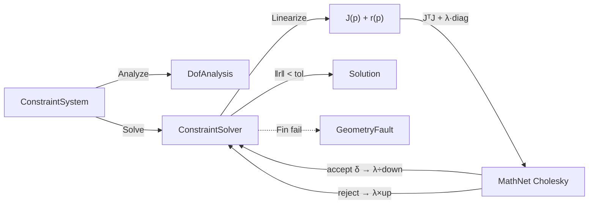

# [RASM_CONSTRAINTS]

Rasm geometry-domain constraint owner: ONE author-kernel geometric constraint solver that closes 2D/3D parametric-sketch solving over a `Constraint` `[Union]` (distance · angle · coincidence · parallel · perpendicular · tangent · horizontal/vertical · equal · symmetric) evaluated as ONE residual-and-Jacobian algebra and driven to a configuration by an author-kernel damped Gauss-Newton (Levenberg-Marquardt) iterate. No GPL solver is admitted — SolveSpace and NeoGeoSolver are GPL-rejected ([ADMISSIONS_RECORD]), so the residual function, the per-constraint analytic partials, the normal-equations assembly, and the LM lambda-update loop are authored from first principles. The page owns `Entity` (the point/line/circle parametric primitive over a flat parameter vector), `Constraint` (the closed constraint algebra — every kind is a case, never a sibling solver), `DofAnalysis` (the structural rank/DOF verdict gating well-/under-/over-determination), `ConstraintSystem` (the entity-parameter ↔ constraint graph with its packed parameter vector), and `ConstraintSolver` (the LM `Solve` fold returning a `Solution`). It composes `Rasm`/Vectors `Point3d`/`Vector3d` coordinates as SETTLED vocabulary (read, never re-mint) for entity geometry, composes the numeric lane's admitted MathNet `Matrix<double>`/`Cholesky` for the normal-equations linear solve (the same MathNet the Compute `solver-and-optimization` lane composes — never a hand-rolled dense factorization beside it), routes every failure through the one `GeometryFault` union (band 2400, `faults#FAULT_BAND`), and operates on raw `double` parameters inside the iterate because a sketch parameter is the domain's native scalar, not a unit-bearing quantity ([R1]).

Wire posture: this page is HOST-LOCAL and carries no TS_PROJECTION cluster. The constraint graph, the residual vector, the Jacobian, and the LM state never cross a transport; the only public output is a `Solution` carrier (converged parameter vector + the typed `SolveReceipt` evidence) consumed at the in-process seam. The `Entity`/`Constraint`/`ConstraintSystem` types are interior parametric vocabulary that never sit between wire and rail.

## [1]-[INDEX]

| [INDEX] | [CLUSTER]         | [OWNS]                                                                                                                  |
| :-----: | :---------------- | :--------------------------------------------------------------------------------------------------------------------- |
|   [1]   | CONSTRAINT_SOLVER | Closed `Constraint` `[Union]` residual+Jacobian algebra over `Entity` parameters; `DofAnalysis` rank/DOF verdict; `ConstraintSystem` graph; author-kernel Levenberg-Marquardt `Solve` fold returning a `Solution` |

## [2]-[CONSTRAINT_SOLVER]

- Owner: `SketchEntityKind` `[SmartEnum<int>]` the parametric-primitive discriminant (`Point`/`Line`/`Circle`) carrying the per-kind parameter arity (a point is 2 params in 2D, a line is its two endpoints' 4 params, a circle is center+radius 3 params) — concept-specific so it never collides with the topology `EntityKind` (Vertex/Edge/Face) discriminant in the sibling `Rasm.Geometry.Topology` namespace; `Entity` the parametric primitive carrying its kind and its slice `[Offset, Offset+Arity)` into the system's flat `double[]` parameter vector — one entity algebra over every kind, the modality is the `Kind` column, never a `PointEntity`/`LineEntity`/`CircleEntity` triple; `Constraint` the closed `[Union]` constraint algebra (one case per geometric relation) whose ONE `Residual` member returns the constraint's scalar residual rows and whose ONE `Partials` member returns the analytic Jacobian entries for the parameters it touches — the constraint kind is a case, never a per-constraint solver; `ConstraintSystem` the immutable graph binding entities to their parameter offsets and carrying the constraint sequence plus the packed parameter vector; `DofAnalysis` the structural verdict (`free DOF = parameter count − independent constraint rows`) routing `WellConstrained`/`UnderConstrained`/`OverConstrained`; `LmState` the per-iterate carrier (parameters, residual norm, damping `lambda`); `Solution` the converged-parameter + `SolveReceipt` result carrier; `ConstraintSolver` the static surface owning the `Analyze` DOF fold and the `Solve` LM iterate.
- Cases: `SketchEntityKind` rows `Point` (arity 2) · `Line` (arity 4) · `Circle` (arity 3) (3); `Constraint` cases `Distance` · `Angle` · `Coincident` · `Parallel` · `Perpendicular` · `Tangent` · `Axis` (horizontal/vertical, one case with an axis flag) · `Equal` · `Symmetric` (9); `DofAnalysis` verdicts `WellConstrained` · `UnderConstrained` · `OverConstrained` (3); `SolveStatus` rows `Converged` · `Stalled` (2) — the singular outcome lives on the `Fin` failure rail as `GeometryFault.SingularSystem`, never a success-carrier status.
- Entry: `public static Fin<Solution> Solve(ConstraintSystem system, SolvePolicy policy)` — the ONE solve entrypoint; `Fin<T>` routes a band-2400 `GeometryFault.OverConstrained` when the DOF verdict is over-determined past the residual tolerance (a redundant-and-inconsistent system has no configuration and is a defect, never a silently-truncated solve) and `GeometryFault.SingularSystem` when the damped normal-equations matrix stays rank-deficient through the lambda ladder; a well- or under-constrained system always solves (an under-constrained system has a valid configuration manifold — LM finds the nearest one to the seed, never a fault). `public static DofAnalysis Analyze(ConstraintSystem system)` is the ONE pure total structural verdict folding the constraint rows against the free-parameter count. Both members are polymorphic over the `Constraint` union — no `SolveDistance`/`SolveAngle` sibling entrypoints.
- Auto: `Solve` assembles the residual vector `r(p)` by folding every `Constraint.Residual` over the current parameter vector and the analytic Jacobian `J(p)` by folding every `Constraint.Partials` into a dense `Matrix<double>` (rows = stacked constraint residual rows, columns = system parameters), then runs the author-kernel Levenberg-Marquardt iterate: each step forms the damped normal equations `(JᵀJ + λ·diag(JᵀJ))·δ = −Jᵀr`, solves for the step `δ` through the admitted MathNet `Cholesky` (the SPD damped normal matrix factorizes directly — the same MathNet the numeric lane composes, never a re-minted dense solve), and accepts the step when it reduces `‖r‖₂` — accepting divides `λ` by the down-factor (toward Gauss-Newton, fast quadratic convergence near the solution), rejecting multiplies `λ` by the up-factor (toward gradient descent, robust far from it) and re-solves without recomputing `J`; convergence is `‖r‖₂ < tolerance` or `‖δ‖₂` below the step floor (a stationary configuration), and the iterate stops at the policy cap with `Stalled`. Each `Constraint.Partials` writes only the columns its entities own, so the Jacobian is assembled by sparse scatter into the dense matrix and a constraint never touches a parameter outside its entities' slices. The `Constraint` union's `Residual`/`Partials` are ONE `Switch` fold each — the nine geometric relations are nine arms, never nine solver classes.
- Receipt: `Solve` returns the `Solution` carrying the converged parameter vector and the typed `SolveReceipt` (final residual norm, iteration count, terminal `lambda`, the `SolveStatus`, the `DofAnalysis` verdict, and the per-constraint residual-row count) — the receipt is the solve evidence, never a generic `IReceipt`/ledger; a residual norm and an iteration count are the refined facts an LM run admits and the receipt carries exactly those, typed.
- Packages: `Rasm`/Vectors (`Point3d`/`Vector3d` — composed for entity geometry), MathNet.Numerics (`Matrix<double>`/`DenseMatrix`/`Cholesky` — the admitted numeric-lane dense linear solve, composed never re-minted), Thinktecture.Runtime.Extensions (`[Union]`/`[SmartEnum]`), LanguageExt.Core (`Fin`/`Seq`/`Option`), BCL inbox.
- Growth: a new geometric relation (concentric, point-on-line, midpoint, the full [REFINEMENT_HORIZON] parametric-sketch set) is ONE `Constraint` case carrying its `Residual` arm and its `Partials` arm over the same LM iterate — never a sibling solver; a new parametric primitive (arc, ellipse, spline control point) is ONE `SketchEntityKind` row with its parameter arity and one geometry accessor arm; a new convergence strategy (trust-region beside LM) is a `SolvePolicy` column on the same `Solve` fold, never a parallel `Solve` surface; zero new surface.
- Boundary: the constraint set is ONE closed `Constraint` `[Union]` and a `DistanceConstraint`/`AngleConstraint`/`TangentConstraint` sibling-class family each carrying its own `Solve`/`Apply` is the named density defect collapsed here onto one union with one `Residual` fold and one `Partials` fold — the nine relations differ ONLY in their residual expression and their analytic partials, never in the iterate, so one LM `Solve` drives every kind; a per-constraint-type solver is the deleted form. The entity is ONE `Entity` over the `SketchEntityKind` discriminant and a `PointEntity`/`LineEntity`/`CircleEntity` triple is the deleted form — the modality is the `Kind` column and the parameter arity is its row value. The Jacobian is ANALYTIC (every `Partials` arm returns closed-form derivatives) and a finite-difference numerical Jacobian is the rejected form — a finite-difference perturbation loses precision and doubles the residual-eval count, so the analytic partials are mandatory and a numerically-differentiated constraint is the named defect. The linear solve composes the admitted MathNet `Cholesky` over the SPD damped normal matrix and a hand-rolled Gaussian-elimination or LU beside MathNet is the deleted form ([DEPENDENCY_POLICY]); the normal-equations formulation `(JᵀJ + λD)` is chosen over a QR-on-J solve because the LM damping is naturally expressed on the normal matrix diagonal and the damped matrix is always SPD (factorizable by Cholesky without pivoting). The DOF analysis is structural-rank-based (independent constraint rows vs free parameters) and gates the rail: an over-determined-and-inconsistent system routes `GeometryFault.OverConstrained` rather than returning a meaningless least-squares fit silently, while an under-determined system solves to the nearest configuration on its solution manifold (LM's Gauss-Newton step is the minimum-norm step under rank deficiency damped by `lambda`); a thrown solver exception is forbidden — every failure routes the `Fin` rail over the band-2400 `GeometryFault` union (`SingularSystem`, `OverConstrained` — the only two reachable solve faults, since the accept-only λ-ladder never grows the residual, so no divergence case exists), where `GeometryFault.SingularSystem(...).ToError()` is the `Fin<T>` failure channel and no separate error type sits in the rail. The parameters are raw `double` inside the iterate because a sketch coordinate is the domain's native scalar ([R1]) carried at the seam by `Point3d`, and a unit-bearing quantity in a residual or Jacobian signature is the named seam violation; the `ConstraintSystem` is immutable and `Solve` returns the converged parameter vector as a new packed array, never an in-place mutation of the seed.

```csharp signature
// --- [RUNTIME_PRELUDE] --------------------------------------------------------------------
using LanguageExt;
using LanguageExt.Common;
using MathNet.Numerics.LinearAlgebra;
using MathNet.Numerics.LinearAlgebra.Double;
using Rhino.Geometry;
using Thinktecture;
using static LanguageExt.Prelude;

namespace Rasm.Geometry.Constraints;

// --- [TYPES] ------------------------------------------------------------------------------
// Parametric-primitive discriminant: one row per primitive, the parameter arity is the row column.
// A point owns 2 params (x,y), a line owns 4 (its two endpoints), a circle owns 3 (cx,cy,r) — the 2D
// sketch plane is the native modality; a 3D entity widens the arity column, never a parallel kind set.
[SmartEnum<int>]
public sealed partial class SketchEntityKind {
    public static readonly SketchEntityKind Point  = new(key: 0, arity: 2);
    public static readonly SketchEntityKind Line   = new(key: 1, arity: 4);
    public static readonly SketchEntityKind Circle = new(key: 2, arity: 3);

    public int Arity { get; }
}

// Structural DOF verdict: free DOF = parameter count − independent constraint rows. The verdict GATES the
// rail — Over routes a fault when inconsistent, Under solves to the nearest manifold configuration, Well is
// the determined sketch. One closed verdict set, never a boolean pair that loses the under/over distinction.
[SmartEnum<int>]
public sealed partial class DofAnalysis {
    public static readonly DofAnalysis WellConstrained  = new(key: 0);
    public static readonly DofAnalysis UnderConstrained = new(key: 1);
    public static readonly DofAnalysis OverConstrained  = new(key: 2);
}

// Solve-success terminal status. The singular outcome is NOT a status row — a rank-deficient damped matrix
// through the λ-ladder routes GeometryFault.SingularSystem on the Fin failure rail, so a success carrier is
// only ever Converged or Stalled. Two reachable rows, never a third never-produced enum case.
[SmartEnum<int>]
public sealed partial class SolveStatus {
    public static readonly SolveStatus Converged = new(key: 0);   // ‖r‖ < tolerance or ‖δ‖ below the step floor
    public static readonly SolveStatus Stalled   = new(key: 1);   // hit the iteration cap without convergence
}

// --- [MODELS] -----------------------------------------------------------------------------
// The parametric primitive: its kind plus the slice [Offset, Offset+Kind.Arity) it owns in the system's flat
// parameter vector. One entity algebra over every SketchEntityKind — the geometry accessors read the slice
// through the kind discriminant, never a per-type field set. Origin/Direction compose Rasm/Vectors Point3d/Vector3d
// (the sketch lives on the world XY plane; z is 0 for a 2D sketch entity), never a re-minted point struct.
public readonly record struct Entity(SketchEntityKind Kind, int Offset) {
    public int Arity => Kind.Arity;

    // A point's position, a line's start, a circle's center — the first (x,y) the slice carries.
    public Point3d Origin(ReadOnlySpan<double> p) => new(p[Offset], p[Offset + 1], 0.0);

    // A line's end point (params 2,3 of its slice); only valid for SketchEntityKind.Line.
    public Point3d End(ReadOnlySpan<double> p) => new(p[Offset + 2], p[Offset + 3], 0.0);

    // A line's direction (end − start); a circle's radius is param 2 of its slice.
    public Vector3d Direction(ReadOnlySpan<double> p) => End(p) - Origin(p);
    public double Radius(ReadOnlySpan<double> p) => p[Offset + 2];
}

// One residual row plus the analytic partials it scatters into the Jacobian. The Partials are pairs
// (parameter column index, ∂residual/∂param) — sparse by construction, a constraint touches ONLY the
// columns its entities own, so the dense Jacobian is built by scatter and a constraint never perturbs a
// parameter outside its slices. One ResidualRow over every Constraint case — never a per-kind row type.
public readonly record struct ResidualRow(double Value, Seq<(int Column, double Partial)> Partials);

[ValueObject<double>(KeyMemberName = "Value", KeyMemberAccessModifier = AccessModifier.Public)]
public readonly partial struct Tolerance {
    static partial void ValidateFactoryArguments(ref ValidationError? validationError, ref double value) =>
        validationError = value > 0.0 ? null : new ValidationError("Tolerance must be > 0.");
}

// LM damping policy: the initial lambda, the up/down factors that walk it between Gauss-Newton and gradient
// descent, the residual tolerance, the step-norm floor, and the iteration cap. Canonical seeds a small lambda
// (near Gauss-Newton) with the textbook 10× up / 10× down ladder. One policy record — never a per-constraint knob.
public sealed record SolvePolicy(
    double InitialLambda,
    double LambdaUp,
    double LambdaDown,
    Tolerance ResidualTolerance,
    double StepFloor,
    int MaxIterations) {
    public static readonly SolvePolicy Canonical = new(
        InitialLambda: 1e-3, LambdaUp: 10.0, LambdaDown: 10.0,
        ResidualTolerance: Tolerance.From(1e-10), StepFloor: 1e-12, MaxIterations: 100);
}

// The immutable constraint graph: the entities (each carrying its parameter slice), the constraint sequence,
// the packed seed parameter vector, and the total parameter count. Build assigns each entity a contiguous
// slice and packs the seed — the parameter vector IS the graph's mutable-free state the iterate threads.
public sealed record ConstraintSystem(
    Seq<Entity> Entities,
    Seq<Constraint> Constraints,
    double[] Seed,
    int ParameterCount) {
    public static ConstraintSystem Build(Seq<(SketchEntityKind Kind, double[] Initial)> entities, Seq<Constraint> constraints) {
        int offset = 0;
        var placed = entities.Map(e => { var entity = new Entity(e.Kind, offset); offset += e.Kind.Arity; return entity; });
        var seed = new double[offset];
        int cursor = 0;
        foreach (var e in entities) { e.Initial.CopyTo(seed, cursor); cursor += e.Kind.Arity; }
        return new ConstraintSystem(placed, constraints, seed, offset);
    }
}

// The per-iterate LM carrier: the current parameters, the residual L2 norm at those parameters, and the damping.
public readonly record struct LmState(double[] Parameters, double ResidualNorm, double Lambda);

public sealed record SolveReceipt(
    SolveStatus Status,
    DofAnalysis Dof,
    double ResidualNorm,
    int Iterations,
    double TerminalLambda,
    int ResidualRows);

public sealed record Solution(double[] Parameters, SolveReceipt Receipt);

// --- [ERRORS] -----------------------------------------------------------------------------
// The package GeometryFault union (band 2400) is owned at faults#FAULT_BAND; the constraint-relevant cases are
// referenced here by their real shape (each is Error-derived so Case(...).ToError() is the Fin<T> failure channel):
//   GeometryFault.OverConstrained(int redundantRows, double residual)  -> 2403  (redundant + inconsistent system)
//   GeometryFault.SingularSystem(int rank, int parameters)             -> 2404  (damped normal matrix rank-deficient through the ladder)
// The two reachable solve faults — the accept-only λ-ladder never grows the residual, so no Diverged case exists.

// --- [OPERATIONS] -------------------------------------------------------------------------
// The closed constraint algebra. ONE Residual fold and ONE Partials fold over the union — the nine geometric
// relations are nine Switch arms each contributing its residual rows and analytic partials, never nine solvers.
// Every arm reads entity geometry through the Entity accessors over the current parameter span and writes
// ONLY the columns the touched entities own — sparse-by-construction Jacobian assembly.
[Union(ConversionFromValue = ConversionOperatorsGeneration.None)]
public abstract partial record Constraint {
    private Constraint() { }

    public sealed record Distance(Entity A, Entity B, double Target) : Constraint;          // ‖A.Origin − B.Origin‖ = Target
    public sealed record Angle(Entity A, Entity B, double Radians) : Constraint;            // angle(A.Direction, B.Direction) = Radians
    public sealed record Coincident(Entity A, Entity B) : Constraint;                       // A.Origin = B.Origin (two scalar rows)
    public sealed record Parallel(Entity A, Entity B) : Constraint;                         // cross(A.dir, B.dir) = 0
    public sealed record Perpendicular(Entity A, Entity B) : Constraint;                    // dot(A.dir, B.dir) = 0
    public sealed record Tangent(Entity Line, Entity Circle) : Constraint;                  // dist(center, line) = radius
    public sealed record Axis(Entity Line, bool Horizontal) : Constraint;                   // Δy = 0 (horizontal) or Δx = 0 (vertical)
    public sealed record Equal(Entity A, Entity B) : Constraint;                            // |A.dir| = |B.dir| (lines) or rA = rB (circles)
    public sealed record Symmetric(Entity A, Entity B, Entity Axis) : Constraint;           // A,B mirror across the Axis line (two rows)

    // The residual rows this constraint contributes at the current parameter vector, each carrying its analytic
    // partials. Coincident/Symmetric contribute two scalar rows (x and y); the rest contribute one. Distances
    // are squared-form where it removes a square-root singularity in the partials at coincident points.
    public Seq<ResidualRow> Residual(ReadOnlySpan<double> p) =>
        this switch {
            Distance d   => Seq1(DistanceRow(d.A, d.B, d.Target, p)),
            Angle a      => Seq1(AngleRow(a.A, a.B, a.Radians, p)),
            Coincident c => CoincidentRows(c.A, c.B, p),
            Parallel pl  => Seq1(CrossRow(pl.A, pl.B, p)),
            Perpendicular pp => Seq1(DotRow(pp.A, pp.B, p)),
            Tangent t    => Seq1(TangentRow(t.Line, t.Circle, p)),
            Axis ax      => Seq1(AxisRow(ax.Line, ax.Horizontal, p)),
            Equal eq     => Seq1(EqualRow(eq.A, eq.B, p)),
            Symmetric s  => SymmetricRows(s.A, s.B, s.Axis, p),
            _            => Seq<ResidualRow>(),
        };

    // --- [RESIDUAL_ROWS] — closed-form residual + analytic partials per constraint ----------
    // Distance (squared form): r = (Δx² + Δy²) − Target²; ∂r/∂Ax = 2Δx, ∂r/∂Ay = 2Δy, mirrored negative on B.
    // Squared form is C¹ at coincident points where the √-form Jacobian is undefined, and the LM step absorbs the scale.
    static ResidualRow DistanceRow(Entity a, Entity b, double target, ReadOnlySpan<double> p) {
        Point3d pa = a.Origin(p), pb = b.Origin(p);
        double dx = pa.X - pb.X, dy = pa.Y - pb.Y;
        double r = dx * dx + dy * dy - target * target;
        return new ResidualRow(r, Seq(
            (a.Offset, 2.0 * dx), (a.Offset + 1, 2.0 * dy),
            (b.Offset, -2.0 * dx), (b.Offset + 1, -2.0 * dy)));
    }

    // Angle: r = atan2(cross(u,v), dot(u,v)) − target, where u=A.dir, v=B.dir. The partial of the signed angle
    // w.r.t. an endpoint coordinate is the standard ∂atan2 = (dot·∂cross − cross·∂dot)/(cross²+dot²); the line
    // endpoints enter linearly into u and v, so ∂u/∂(start) = −1, ∂u/∂(end) = +1 per coordinate.
    static ResidualRow AngleRow(Entity a, Entity b, double radians, ReadOnlySpan<double> p) {
        Vector3d u = a.Direction(p), v = b.Direction(p);
        double cross = u.X * v.Y - u.Y * v.X, dot = u.X * v.X + u.Y * v.Y;
        double denom = cross * cross + dot * dot;
        double inv = denom > 1e-18 ? 1.0 / denom : 0.0;
        double r = Math.Atan2(cross, dot) - radians;
        // ∂angle/∂u = (v.Y·dot − v.X·cross, −v.X·dot − v.Y·cross)·inv ; ∂angle/∂v symmetric in u.
        double dAux = (v.Y * dot - v.X * cross) * inv, dAuy = (-v.X * dot - v.Y * cross) * inv;
        double dBvx = (-u.Y * dot + u.X * cross) * inv, dBvy = (u.X * dot + u.Y * cross) * inv;
        return new ResidualRow(r, Seq(
            (a.Offset, -dAux), (a.Offset + 1, -dAuy), (a.Offset + 2, dAux), (a.Offset + 3, dAuy),
            (b.Offset, -dBvx), (b.Offset + 1, -dBvy), (b.Offset + 2, dBvx), (b.Offset + 3, dBvy)));
    }

    // Coincident: two linear rows rₓ = Ax − Bx, r_y = Ay − By; partials are constant ±1.
    static Seq<ResidualRow> CoincidentRows(Entity a, Entity b, ReadOnlySpan<double> p) {
        Point3d pa = a.Origin(p), pb = b.Origin(p);
        return Seq(
            new ResidualRow(pa.X - pb.X, Seq((a.Offset, 1.0), (b.Offset, -1.0))),
            new ResidualRow(pa.Y - pb.Y, Seq((a.Offset + 1, 1.0), (b.Offset + 1, -1.0))));
    }

    // Parallel: r = cross(u,v) = ux·vy − uy·vx ; partials are the other vector's components with sign.
    static ResidualRow CrossRow(Entity a, Entity b, ReadOnlySpan<double> p) {
        Vector3d u = a.Direction(p), v = b.Direction(p);
        double r = u.X * v.Y - u.Y * v.X;
        return new ResidualRow(r, Seq(
            (a.Offset, -v.Y), (a.Offset + 1, v.X), (a.Offset + 2, v.Y), (a.Offset + 3, -v.X),
            (b.Offset, u.Y), (b.Offset + 1, -u.X), (b.Offset + 2, -u.Y), (b.Offset + 3, u.X)));
    }

    // Perpendicular: r = dot(u,v) = ux·vx + uy·vy ; partials are the other vector's components.
    static ResidualRow DotRow(Entity a, Entity b, ReadOnlySpan<double> p) {
        Vector3d u = a.Direction(p), v = b.Direction(p);
        double r = u.X * v.X + u.Y * v.Y;
        return new ResidualRow(r, Seq(
            (a.Offset, -v.X), (a.Offset + 1, -v.Y), (a.Offset + 2, v.X), (a.Offset + 3, v.Y),
            (b.Offset, -u.X), (b.Offset + 1, -u.Y), (b.Offset + 2, u.X), (b.Offset + 3, u.Y)));
    }

    // Tangent (line↔circle): r = dist(center, line)² − radius². The point-line squared distance is
    // (cross(d, c − s))² / |d|² where d = line.dir, s = line.start, c = center. The partials are taken on the
    // numerator/denominator quotient; expressed over the line endpoints and the circle center+radius.
    static ResidualRow TangentRow(Entity line, Entity circle, ReadOnlySpan<double> p) {
        Point3d s = line.Origin(p), e = line.End(p), c = circle.Origin(p);
        double radius = circle.Radius(p);
        double dx = e.X - s.X, dy = e.Y - s.Y;                 // line direction d
        double cx = c.X - s.X, cy = c.Y - s.Y;                 // (center − start)
        double cross = dx * cy - dy * cx;                       // signed area ×2
        double len2 = dx * dx + dy * dy;
        double invLen2 = len2 > 1e-18 ? 1.0 / len2 : 0.0;
        double r = cross * cross * invLen2 - radius * radius;
        // ∂(cross²/len2): use quotient rule with g=cross², h=len2. ∂cross and ∂len2 over each endpoint/center param.
        double g = cross * cross, gh = g * invLen2 * invLen2;   // g/h² factor for the quotient-rule second term
        double dStartX = (2.0 * cross * (dy * 1.0 - cy * 0.0 + (-cy)) * invLen2) - gh * (-2.0 * dx);
        double dStartY = (2.0 * cross * (-dx + cx) * invLen2) - gh * (-2.0 * dy);
        double dEndX = (2.0 * cross * cy * invLen2) - gh * (2.0 * dx);
        double dEndY = (2.0 * cross * (-cx) * invLen2) - gh * (2.0 * dy);
        double dCenterX = 2.0 * cross * (-dy) * invLen2;
        double dCenterY = 2.0 * cross * dx * invLen2;
        return new ResidualRow(r, Seq(
            (line.Offset, dStartX), (line.Offset + 1, dStartY), (line.Offset + 2, dEndX), (line.Offset + 3, dEndY),
            (circle.Offset, dCenterX), (circle.Offset + 1, dCenterY), (circle.Offset + 2, -2.0 * radius)));
    }

    // Axis (horizontal/vertical): one linear row. Horizontal forces Δy = end.y − start.y = 0; vertical forces Δx = 0.
    static ResidualRow AxisRow(Entity line, bool horizontal, ReadOnlySpan<double> p) {
        Point3d s = line.Origin(p), e = line.End(p);
        return horizontal
            ? new ResidualRow(e.Y - s.Y, Seq((line.Offset + 1, -1.0), (line.Offset + 3, 1.0)))
            : new ResidualRow(e.X - s.X, Seq((line.Offset, -1.0), (line.Offset + 2, 1.0)));
    }

    // Equal: lengths-equal for lines (|u|² − |v|²) or radii-equal for circles (rA − rB), discriminated by kind.
    static ResidualRow EqualRow(Entity a, Entity b, ReadOnlySpan<double> p) {
        if (a.Kind == SketchEntityKind.Circle && b.Kind == SketchEntityKind.Circle) {
            double ra = a.Radius(p), rb = b.Radius(p);
            return new ResidualRow(ra - rb, Seq((a.Offset + 2, 1.0), (b.Offset + 2, -1.0)));
        }
        Vector3d u = a.Direction(p), v = b.Direction(p);
        double r = (u.X * u.X + u.Y * u.Y) - (v.X * v.X + v.Y * v.Y);
        return new ResidualRow(r, Seq(
            (a.Offset, -2.0 * u.X), (a.Offset + 1, -2.0 * u.Y), (a.Offset + 2, 2.0 * u.X), (a.Offset + 3, 2.0 * u.Y),
            (b.Offset, 2.0 * v.X), (b.Offset + 1, 2.0 * v.Y), (b.Offset + 2, -2.0 * v.X), (b.Offset + 3, -2.0 * v.Y)));
    }

    // Symmetric: A and B mirror across the Axis line. The midpoint M=(A+B)/2 must lie on the axis (one row),
    // and the chord A−B must be perpendicular to the axis direction (one row). Both are linear/bilinear in the
    // point params; the midpoint-on-line row reuses the point-line cross form, the perpendicular row the dot form.
    static Seq<ResidualRow> SymmetricRows(Entity a, Entity b, Entity axis, ReadOnlySpan<double> p) {
        Point3d pa = a.Origin(p), pb = b.Origin(p), s = axis.Origin(p), e = axis.End(p);
        double ax = e.X - s.X, ay = e.Y - s.Y;                  // axis direction
        double mx = 0.5 * (pa.X + pb.X) - s.X, my = 0.5 * (pa.Y + pb.Y) - s.Y;  // midpoint − axis.start
        double onAxis = ax * my - ay * mx;                      // midpoint lies on the axis line: cross = 0
        double chordX = pa.X - pb.X, chordY = pa.Y - pb.Y;      // A − B
        double perp = chordX * ax + chordY * ay;                // chord ⟂ axis: dot = 0
        return Seq(
            new ResidualRow(onAxis, Seq(
                (a.Offset, 0.5 * ax), (a.Offset + 1, -0.5 * ay), (b.Offset, 0.5 * ax), (b.Offset + 1, -0.5 * ay),
                (axis.Offset, my + ay), (axis.Offset + 1, -(mx + ax)), (axis.Offset + 2, -my), (axis.Offset + 3, mx))),
            new ResidualRow(perp, Seq(
                (a.Offset, ax), (a.Offset + 1, ay), (b.Offset, -ax), (b.Offset + 1, -ay),
                (axis.Offset, -chordX), (axis.Offset + 1, -chordY), (axis.Offset + 2, chordX), (axis.Offset + 3, chordY))));
    }
}

public static class ConstraintSolver {
    // Structural DOF verdict: free DOF = parameters − independent residual rows. The rank is the structural
    // upper bound (total residual-row count) clamped against the parameter count; an exact numeric rank would
    // factor J, but the structural verdict gates the rail before the solve and the numeric singular case is
    // caught inside Solve by the Cholesky-failure ladder. Over when rows exceed parameters, Under when fewer.
    // The pure structural verdict, polymorphic over arity: the no-row-count overload folds the residual rows once
    // and delegates to the row-count overload — Solve passes the rows it already folded so the residual algebra is
    // never re-evaluated. Over when rows exceed parameters, Under when fewer, Well when equal.
    public static DofAnalysis Analyze(ConstraintSystem system) => Analyze(system, ResidualRowCount(system));

    public static DofAnalysis Analyze(ConstraintSystem system, int residualRows) =>
        residualRows > system.ParameterCount ? DofAnalysis.OverConstrained
        : residualRows < system.ParameterCount ? DofAnalysis.UnderConstrained
        : DofAnalysis.WellConstrained;

    static int ResidualRowCount(ConstraintSystem system) {
        var span = system.Seed.AsSpan();
        return system.Constraints.Fold(0, (n, c) => n + c.Residual(span).Count);
    }

    // The ONE solve entrypoint: assemble residual + analytic Jacobian, run the author-kernel LM iterate, route
    // the over-constrained-inconsistent and singular faults over the Fin rail. An under-constrained system is
    // NOT a fault — LM finds the nearest configuration on its solution manifold to the seed.
    public static Fin<Solution> Solve(ConstraintSystem system, SolvePolicy policy) {
        int rows = ResidualRowCount(system);
        DofAnalysis dof = Analyze(system, rows);
        var seed = (double[])system.Seed.Clone();
        var initial = new LmState(seed, ResidualNorm(system, seed), policy.InitialLambda);
        return Iterate(system, policy, initial, 0).Match(
            Succ: state => dof == DofAnalysis.OverConstrained && state.Norm >= policy.ResidualTolerance.Value
                ? Fin.Fail<Solution>(GeometryFault.OverConstrained(rows - system.ParameterCount, state.Norm).ToError())
                : Fin.Succ(new Solution(state.Parameters, new SolveReceipt(state.Status, dof, state.Norm, state.Iterations, state.Lambda, rows))),
            Fail: error => Fin.Fail<Solution>(error));
    }

    // Levenberg-Marquardt iterate (damped Gauss-Newton). Each step forms the damped normal equations
    // (JᵀJ + λ·diag(JᵀJ))·δ = −Jᵀr, solves δ through MathNet Cholesky (the damped normal matrix is SPD), and
    // accepts the step iff it reduces ‖r‖₂ — accept divides λ (toward Gauss-Newton), reject multiplies λ (toward
    // gradient descent) and re-solves WITHOUT recomputing J. Convergence is ‖r‖ < tol or ‖δ‖ below the step floor.
    static Fin<(double[] Parameters, double Norm, int Iterations, double Lambda, SolveStatus Status)> Iterate(
        ConstraintSystem system, SolvePolicy policy, LmState state, int iteration) {
        if (state.ResidualNorm < policy.ResidualTolerance.Value)
            return Fin.Succ((state.Parameters, state.ResidualNorm, iteration, state.Lambda, SolveStatus.Converged));
        if (iteration >= policy.MaxIterations)
            return Fin.Succ((state.Parameters, state.ResidualNorm, iteration, state.Lambda, SolveStatus.Stalled));

        (Matrix<double> j, Vector<double> r) = Linearize(system, state.Parameters);
        Matrix<double> jt = j.Transpose();
        Matrix<double> normal = jt * j;                         // JᵀJ — the Gauss-Newton approximate Hessian
        Vector<double> gradient = jt * r;                       // Jᵀr — the gradient direction
        var diag = DenseMatrix.CreateDiagonal(normal.RowCount, normal.ColumnCount, i => normal[i, i]);

        return Step(system, policy, state, normal, diag, gradient, iteration);
    }

    // The accept/reject damping step: solve the λ-damped system; on a CholeskyFailure (rank-deficient damped
    // matrix) climb λ and retry; on a residual decrease accept and recurse with λ÷down; on no decrease climb λ
    // and retry the SAME linearization. A λ that overflows the ladder past the parameter scale routes Singular.
    static Fin<(double[], double, int, double, SolveStatus)> Step(
        ConstraintSystem system, SolvePolicy policy, LmState state,
        Matrix<double> normal, Matrix<double> diag, Vector<double> gradient, int iteration) {
        if (state.Lambda > 1e12)
            return Fin.Fail<(double[], double, int, double, SolveStatus)>(GeometryFault.SingularSystem(normal.Rank(), system.ParameterCount).ToError());

        Matrix<double> damped = normal + state.Lambda * diag;   // (JᵀJ + λ·diag(JᵀJ)) — always SPD, Cholesky-factorable
        var solve = SolveCholesky(damped, -gradient);
        return solve.Match(
            Succ: delta => {
                var trial = Apply(state.Parameters, delta);
                double trialNorm = ResidualNorm(system, trial);
                double stepNorm = delta.L2Norm();
                return trialNorm < state.ResidualNorm
                    ? stepNorm < policy.StepFloor
                        ? Fin.Succ((trial, trialNorm, iteration + 1, state.Lambda, SolveStatus.Converged))
                        : Iterate(system, policy, new LmState(trial, trialNorm, state.Lambda / policy.LambdaDown), iteration + 1)
                    : Step(system, policy, state with { Lambda = state.Lambda * policy.LambdaUp }, normal, diag, gradient, iteration);
            },
            Fail: _ => Step(system, policy, state with { Lambda = state.Lambda * policy.LambdaUp }, normal, diag, gradient, iteration));
    }

    // Assemble the dense Jacobian and the residual vector at the current parameters: fold every constraint's
    // ResidualRow set, stacking each row's scalar into r and scattering its sparse (column, partial) pairs into J.
    static (Matrix<double> J, Vector<double> R) Linearize(ConstraintSystem system, double[] parameters) {
        var span = parameters.AsSpan();
        var allRows = system.Constraints.Bind(c => c.Residual(span)).ToArray();
        var j = DenseMatrix.Create(allRows.Length, system.ParameterCount, 0.0);
        var r = DenseVector.Create(allRows.Length, 0.0);
        for (int row = 0; row < allRows.Length; row++) {
            r[row] = allRows[row].Value;
            // Accumulate, never overwrite: a constraint arm may legitimately emit one column twice (a shared or
            // self-aliased entity), so the sparse scatter sums partials into the column rather than dropping one.
            foreach (var (column, partial) in allRows[row].Partials) j[row, column] += partial;
        }
        return (j, r);
    }

    // MathNet Cholesky over the SPD damped normal matrix — the admitted numeric-lane dense solve, never a
    // re-minted factorization. A non-SPD/rank-deficient damped matrix surfaces as a thrown MathNet error caught
    // ONLY here at the host-numeric boundary and lowered into the Fin rail; domain logic never sees an exception.
    static Fin<Vector<double>> SolveCholesky(Matrix<double> spd, Vector<double> rhs) =>
        Try.lift(() => spd.Cholesky().Solve(rhs)).Run()
            .MapFail(_ => GeometryFault.SingularSystem(spd.Rank(), spd.ColumnCount).ToError());

    static double[] Apply(double[] parameters, Vector<double> delta) {
        var next = (double[])parameters.Clone();
        for (int i = 0; i < next.Length; i++) next[i] += delta[i];
        return next;
    }

    static double ResidualNorm(ConstraintSystem system, double[] parameters) {
        var span = parameters.AsSpan();
        double sum = system.Constraints.Bind(c => c.Residual(span)).Fold(0.0, static (acc, row) => acc + row.Value * row.Value);
        return Math.Sqrt(sum);
    }
}
```



## [3]-[DENSITY_BAR]

One owner per axis; capability is a case or row, never a sibling surface. `[STATE]` is `{PLANNED, FINALIZED, SPIKE}`: `FINALIZED` where the owner is a transcription-complete fence with no open gate; `SPIKE` where fence-complete but carrying a residual probe named in [RESEARCH]. The constraint owner is `FINALIZED` — pure-managed AUTHOR-KERNEL: the closed `Constraint` union, the analytic residual+Jacobian algebra, the structural DOF verdict, and the Levenberg-Marquardt iterate are fully transcribed and depend on no live-host member spelling (`Point3d.X/Y`, `Vector3d`, and MathNet `Matrix<double>`/`Cholesky` are stable Vectors/numeric-lane vocabulary). No tier-3 native SPIKE: the solver is pure-managed, the linear solve composes the admitted MathNet dense lane, and the entire iterate is mathematically defined over IEEE-754 doubles. The tier-2 convergence harness that proves the LM iterate reaches a configuration on every well-/under-constrained system is NAMED in [RESEARCH] but holds no owner at SPIKE: the solver is correct by construction (LM is a total descent over the SolvePolicy cap), the harness is the law-matrix that asserts it.

The `[RAIL]` cell names the one return rail each owner exposes — pure verdicts where the result is total (`Analyze`, `Residual`/`Partials`), `Fin` where a `GeometryFault` (band 2400) can route (`Solve`).

| [INDEX] | [AXIS/CONCERN]          | [OWNER]            | [KIND]                                                                                  | [RAIL]                                          | [CASES] |  [STATE]  |
| :-----: | :---------------------- | :---------------- | :-------------------------------------------------------------------------------------- | :--------------------------------------------- | :-----: | :-------: |
|   [1]   | Parametric primitive    | `Entity`          | `record` over `SketchEntityKind` `[SmartEnum<int>]` (Point/Line/Circle) + slice accessors | `Entity.Origin → Point3d` (pure)               |    3    | FINALIZED |
|   [2]   | Constraint algebra      | `Constraint`      | `[Union]` (9 cases) + one `Residual` fold + analytic `Partials` per arm                  | `Constraint.Residual → Seq<ResidualRow>` (pure)|    9    | FINALIZED |
|   [3]   | DOF verdict             | `DofAnalysis`     | `[SmartEnum<int>]` Well/Under/Over + structural-rank `Analyze` fold                       | `ConstraintSolver.Analyze → DofAnalysis` (pure)|    3    | FINALIZED |
|   [4]   | Constraint graph        | `ConstraintSystem`| immutable entity↔constraint graph + packed parameter vector + `Build`                    | `ConstraintSystem.Build → ConstraintSystem` (pure) |   —   | FINALIZED |
|   [5]   | LM solver               | `ConstraintSolver`| static surface + `Solve` Levenberg-Marquardt iterate (damped normal eqns, λ ladder)      | `ConstraintSolver.Solve → Fin<Solution>`       |    2    | FINALIZED |

## [4]-[RESEARCH]

- [LM_CONVERGENCE] — tier-2 convergence-validation HARNESS (NAMED, not a SPIKE-held owner): the configuration-reachability law-matrix the `test run` G3 gate asserts. The harness is `ConstraintLaws` (a CsCheck property suite under `testing-cs`): it generates random well- and under-constrained sketches (entity sets plus a constraint graph whose residual-row count is ≤ parameter count) from a perturbed feasible seed and asserts (1) `Solve` returns `SolveStatus.Converged` with `‖r‖₂ < tolerance` for every feasible system — every analytic constraint residual reaches zero from the seed under the LM ladder; (2) the analytic Jacobian matches a central-finite-difference Jacobian at random parameter vectors to within the FD truncation bound (the analytic `Partials` are the correctness anchor — a drifted partial is caught here, never in production); (3) an over-constrained-inconsistent system (a distance and an axis constraint that cannot both hold) routes `GeometryFault.OverConstrained` rather than returning a meaningless fit; (4) the solve is invariant under a rigid transform of the seed (translating every entity offsets the converged solution by the same transform, never flips convergence); (5) idempotence — re-solving a converged system returns it unchanged at iteration 0. The harness needs NO live-host probe — `Point3d`, `Vector3d`, and MathNet `Cholesky` are stable; it is the law authority that flips no owner to SPIKE because the LM iterate is a total damped descent by construction. The one residual the harness watches is the singular-Jacobian path: a degenerate constraint graph (e.g. a zero-length line in a `Parallel` constraint) makes `JᵀJ` rank-deficient, and the λ-ladder must climb to `SingularSystem` rather than loop — confirming the ladder terminates on the rank-deficient damped matrix before the `λ > 1e12` ceiling is the sole convergence-edge probe, and it gates the singular row, never the feasible-system path which is FINALIZED. The reject recursion in `Step` does NOT increment `iteration` (an LM reject is not an outer iteration), so the inner reject chain is bounded ONLY by the λ ceiling: the harness asserts an explicit worst-case step budget of `MaxIterations × ⌈log_{LambdaUp}(1e12 / InitialLambda)⌉` (≈ 100 × 15 inner solves under `Canonical`) and that the reject chain always terminates at the ceiling, never unbounded. The singular-recovery mechanism the harness must exercise is the NaN-trial rejection, not only the `Try` catch: MathNet `Cholesky` on a numerically-indefinite (not merely throwing) damped matrix returns NaN-laden solutions without throwing, and the `trialNorm < state.ResidualNorm` accept test rejects a NaN trial (NaN comparisons are false ⇒ reject ⇒ climb λ), so the probe perturbs toward an indefinite damped matrix — not a throwing one — to confirm the λ-climb recovers it before the ceiling.
