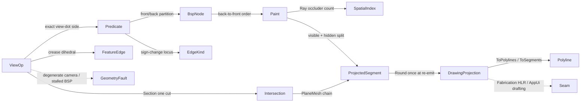

# [RASM_PROJECTION_VIEW]

The predicate-exact hidden-line/silhouette projection owner that closes silhouette extraction, hidden-line removal, planar section, and visible-outline assembly over ONE `ViewOp` `[Union]` (`Silhouette`/`HiddenLine`/`Section`/`Outline`) whose visibility is decided by a Newell-Newell-Sancha BSP painter and whose silhouette locus is the exact sign-change locus where a front-facing and a back-facing triangle meet — the per-face view-dot side computed by the `Numerics/predicates#ROBUST_PREDICATES` exact `Orient3D` sign against the eye point so a grazing edge never flickers between visible and hidden across a near-zero view dot. No external geometry library or host `Make2D` round-trip is admitted — the Appel quantitative-invisibility silhouette walk, the back-to-front BSP face ordering, and the segment-vs-occluder clip are authored from first principles over a flat `BspNode` partition store, and the section arm is exactly ONE `Meshing/intersect#INTERSECTION` `IntersectOp.PlaneMesh`/`Apply`, never a fourth inline crossing test. The page owns the `ViewKind` discriminant (binding the sibling-owned `GeometryKeyPolicy` string-key comparer), the `BspNode` struct-of-arrays partition memory, the `EdgeKind`/`Visibility` segment classification vocabulary, the `ViewOp` `[Union]` with its `Apply` rail, the `DrawingProjection` visible/hidden 2D-segment carrier, and the `ToPolylines`/`ToSegments` projections that re-emit the result through the `Vectors` `Polyline`/`Line` seam.

The owner composes `Vectors` `Point3d`/`Vector3d`/`Line`/`Plane`/`Polyline`/`MeshSpace` coordinates as settled vocabulary — read, compose, never re-mint — rides the `Predicate` exact-`Orient3D` floor so the front/back face partition and the silhouette locus are deterministic, composes the `Spatial/index#SPATIAL_INDEX` BVH `SpatialQuery.Ray` front-to-back traversal so the painter's per-segment visibility query runs against the broad-phase rather than a quadratic all-pairs occluder scan, composes the `Meshing/intersect#INTERSECTION` `IntersectOp.PlaneMesh` for the `Section` cut (the W3 dependency the spine forces), composes the `Vectors` `FeatureEdge`/`FeatureReceipt` dihedral classification for the crease `EdgeKind`, and operates on raw `double` only at the `Predicate` seam and the view-projection inner loop (the sanctioned interior-double scope the `Numerics/predicates#NUMERIC_DETERMINISM` `NumericsPolicy` names alongside `Expansion`/`ErrorBound`). The `DrawingProjection` is the one section/drawing carrier the `Rasm.Fabrication` hidden-line-removal sheet engine and the `Rasm.AppUi` drafting-sheet engine read at the seam (the kernel owns the predicate-exact visibility, Fabrication and AppUi own the sheet-side composition; they meet at the carrier, never the `BspNode` interior). Every failure routes the band-2400 `GeometryFault` union (the `ProjectionFault` 2490 sub-band the `Numerics/faults#FAULT_BAND` family carries); the kernel computes no hash and mints no second identity — the `DrawingProjection`/segment records ARE the hash-friendly immutable records the `Spatial/reconciliation#NAMING_HASH` `Encode` content-addresses through the `Polyline`/`Line` projection.

## [1]-[INDEX]

- [1]-[PROJECTION]: `ViewOp` `[Union]` (`Silhouette`/`HiddenLine`/`Section`/`Outline`) over one `BspNode` partition store; the exact `Orient3D` view-dot silhouette locus; the Newell-Newell-Sancha back-to-front BSP painter with Appel quantitative-invisibility visibility; the `Section` cut delegated to `Meshing/intersect#INTERSECTION` `IntersectOp.PlaneMesh`; the `DrawingProjection` visible/hidden 2D-segment carrier; `ToPolylines`/`ToSegments` projections re-emitting through the `Vectors` seam.

## [2]-[PROJECTION]

- Owner: `ViewKind` `[SmartEnum<string>]` the operation discriminant (`silhouette`/`hidden-line`/`section`/`outline`) binding the sibling-owned `GeometryKeyPolicy` (`Numerics/faults#FAULT_BAND`) as its string-key comparer carrying the per-kind `EmitsHidden` (the result retains the occluded segments for a dashed-hidden render, never discards them) / `NeedsBsp` (the case builds the back-to-front partition versus the `Section` case lowering straight to one `IntersectOp.Apply`) columns; `Camera` the projection frame value — eye point, view direction, an orthographic-or-perspective flag, and the screen `Plane` the 3D edges project to; `EdgeKind` `[SmartEnum<int>]` the silhouette/crease/boundary/intersection segment classification (the `Vectors` `FeatureEdge` dihedral lift); `Visibility` `[SmartEnum<int>]` the visible/hidden/clipped per-segment verdict the painter assigns; `BspNode` the struct-of-arrays flat partition memory the painter folds — `Plane` the per-node splitting-plane coefficient slots, `Front`/`Back` the half-space child ranges over the shared SoA layout the `Spatial/index#SPATIAL_INDEX` `NodeStore` precedent fixes, `Faces`/`FaceRange` the per-leaf coplanar face bucket, `Dead` plus the free list reuse a collapsed-node slot; `ProjectedSegment` the 2D screen segment carrier (the two screen-space endpoints, the per-segment depth key, the `EdgeKind` and `Visibility` columns, the source-edge provenance); `ViewOp` `[Union]` `Silhouette`/`HiddenLine`/`Section`/`Outline` carrying the input mesh, the `Camera`, and the per-op parameter; `DrawingProjection` the typed result carrier (the visible-segment set, the hidden-segment set, the `EdgeKind` histogram receipt); `Projection` the static surface whose `Apply` fold runs the silhouette extraction, the BSP painter, or the section cut and projects the requested `DrawingProjection`.
- Cases: `ViewKind` rows `silhouette` · `hidden-line` · `section` · `outline` (4); `ViewOp` cases `Silhouette` · `HiddenLine` · `Section` · `Outline` (4); `EdgeKind` rows `silhouette` · `crease` · `boundary` · `intersection` (4); `Visibility` rows `visible` · `hidden` · `clipped` (3). The `outline` row is the visible-boundary projection reading the SAME silhouette walk and the SAME BSP painter at the visible-segment slice (the outline is the visible silhouette plus boundary edges, no hidden set), never a parallel outliner — one `ViewKind`/`ViewOp` case projecting the visible slice of the shared visibility solve.
- Entry: `public static Fin<DrawingProjection> Apply(ViewOp op)` — the ONE projection entrypoint discriminating by `ViewOp` case, `Fin<T>` routing a band-2400 `GeometryFault.ProjectionFault` (sub-band 2490) when the input mesh is empty or non-finite, when the `Camera` view direction is degenerate (a zero-length direction cannot orient the front/back partition), when the BSP partition stalls past the node budget (a partition that cannot separate a coincident-face cluster within the budget is a defect, never a silent truncation), or when a silhouette extraction runs over a non-manifold view (a face with no consistent front/back neighbour across a non-manifold edge has no defined silhouette sign); the fold lowers each case: `Silhouette`/`Outline` extract the exact-sign silhouette locus then project; `HiddenLine` builds the `BspNode` partition, runs the back-to-front painter assigning each projected segment its `Visibility`, and retains BOTH the visible and hidden sets; `Section` lowers straight to one `Meshing/intersect#INTERSECTION` `IntersectOp.PlaneMesh`/`Apply` against the cutting plane and projects the section chain into the drawing plane. No `ExtractSilhouette`/`RemoveHiddenLines`/`SectionCut`/`ProjectOutline` sibling entrypoints — one polymorphic `Apply` discriminates by kind.
- Auto: `Apply` decides every front/back face side and every silhouette locus by the exact `Predicate.Orient3D` sign so no visibility verdict is decided by a float view-dot tolerance. The silhouette extraction (`SilhouetteEdges`) walks every mesh edge and classifies it a silhouette where its two incident faces lie on opposite sides of the eye — the side is the exact `Orient3D` sign of the eye point against each face's supporting plane, so a silhouette edge is exactly the sign-change locus and a grazing edge whose view dot is near zero never flickers (a float dot test classifies it visible on one frame and hidden on the next; the exact sign is stable); a boundary edge (one incident face) is always a silhouette, and a crease edge above the dihedral threshold is lifted from the `Vectors` `FeatureEdge`/`FeatureReceipt` classification. The `BspNode` partition is built by the Newell-Newell-Sancha recursive face split: a splitting face's supporting plane partitions the remaining faces into front/back half-spaces by the exact `Orient3D` sign of each face's vertices, a face straddling the plane is split on the plane (its sub-faces routed to both children), and the recursion terminates at a coplanar-face leaf bucket — the partition is the back-to-front total order the painter reads. The painter (`PaintBackToFront`) traverses the BSP in far-to-near order relative to the eye (at each node, the child on the far side of the splitting plane is painted first, then the node's coplanar faces, then the near child), projecting each silhouette/crease/boundary segment to the screen `Plane` and assigning its `Visibility` by the Appel quantitative-invisibility count — a segment's visibility changes only where it crosses a silhouette of an occluding face, so the painter tracks the running occlusion count along each projected segment and emits a `visible` sub-segment where the count is zero and a `hidden` sub-segment where it is positive; a segment partially behind an occluder is split at the silhouette crossing and BOTH sub-segments are retained (the hidden sub-segment carries `Visibility.Hidden`, never dropped). The occluder query for the quantitative-invisibility count rides the `Spatial/index#SPATIAL_INDEX` BVH `SpatialQuery.Ray` front-to-back traversal — the ray from the eye through a segment sample point returns the nearest occluding face, so the occlusion count is the broad-phase hit count rather than a quadratic all-pairs scan. The four kinds share ONE silhouette walk and ONE visibility solve — `Silhouette`/`Outline` read the silhouette set at the silhouette/visible slice, `HiddenLine` reads the full visible+hidden painter output, `Section` is the dual `IntersectOp.PlaneMesh` cut over the same screen `Plane` — never four visibility kernels.
- Receipt: none on a dedicated rail — the `DrawingProjection` (the visible-segment `Seq<ProjectedSegment>`, the hidden-segment `Seq<ProjectedSegment>`, the `EdgeKind` histogram) IS the typed result the projection re-emits; the `Apply` rail returns the result itself, and the `DrawingProjection`/`ProjectedSegment` records ARE the hash-friendly immutable records the reconciliation `Encode` content-addresses through the `Polyline`/`Line` projection. Each `ProjectedSegment` carries its exact-sign-derived `Visibility` and `EdgeKind` so a downstream dashed-hidden render reads the full visible+hidden set from one carrier, never two passes.
- Packages: `Rasm`/Vectors (`Point3d`/`Vector3d`/`Line`/`Plane`/`Polyline`/`MeshSpace`/`MeshEdit`/`FeatureEdge`/`FeatureReceipt` — composed for view geometry, the crease classification, and the result projection), `Rasm.Geometry.Numerics` (`Predicate` `Orient3D`, `Sign` — the exact view-dot/plane-side floor, composed never re-minted), `Rasm.Geometry.Spatial` (`SpatialIndex`/`SpatialQuery.Ray`/`QueryResult.RayHit` BVH front-to-back occluder traversal — composed, never re-minted), `Rasm.Geometry.Intersection` (`IntersectOp.PlaneMesh`/`Intersection.Apply`/`IntersectResult.Chains` — the `Section` cut, composed never re-minted as a fourth crossing test), `Rasm.Geometry` (`GeometryKeyPolicy` string-key comparer, `GeometryFault` band-2400 union — composed, never re-minted), Thinktecture.Runtime.Extensions, LanguageExt.Core, BCL inbox (`List<T>`, `Stack<T>`, `Dictionary<TKey,TValue>`).
- Growth: a new view modality (a wireframe-with-depth-cue projection, a cavalier/cabinet oblique, a two-point perspective view) is one `ViewKind` row plus one `ViewOp` case reading the SAME silhouette walk and the SAME visibility solve — the `outline` row IS this leaf's named growth, added as one case projecting the visible slice of the shared solve, never a parallel outliner; a fifth view kind is admitted only by a charter amendment, never widened silently from this page; a new edge classification is one `EdgeKind` row plus one `SilhouetteEdges` arm reading the `Vectors` `FeatureEdge` classification; a new visibility verdict is one `Visibility` row; a new camera projection (perspective vs orthographic) is one column on `Camera`; zero new surface.
- Boundary: the projection owner is the ONE polymorphic `ViewOp` `[Union]` and a `SilhouetteExtractor`/`HiddenLineRemover`/`Sectioner`/`OutlineProjector` sibling-class family each carrying its own `Extract`/`Remove`/`Cut`/`Project` surface is the named density defect collapsed here onto one union folded by one `Apply` entrypoint — the four cases differ ONLY in which slice of the shared silhouette/visibility solve they project (and `Section` in delegating to `IntersectOp.PlaneMesh`), never in the exact `Orient3D` partition, so `Apply`/`ToPolylines`/`ToSegments` live on the union base and read the shared `BspNode`/`DrawingProjection` kind-agnostically; the silhouette locus composes the `Predicate.Orient3D` exact view-dot sign and a hand-rolled epsilon-tolerant dot-product test (instead of `Predicate.Orient3D`) is the named correctness defect — a grazing-angle face mis-classified by a loosened float dot flickers between front and back across frames and the silhouette set is non-deterministic, exactly the non-robustness the predicate floor exists to eliminate; the back-to-front order composes the Newell-Newell-Sancha BSP partition and a float painter's-algorithm depth sort that cannot order interpenetrating or cyclically-overlapping faces is the deleted form — the BSP splits a straddling face on the plane so the order is total and cycle-free; the `Section` cut composes `Meshing/intersect#INTERSECTION` `IntersectOp.PlaneMesh`/`Apply` and a domain-local inline plane-mesh crossing test beside the intersection owner is the named double-owner defect (the section is ONE `IntersectOp.Apply`, the seam ALIGNS to the intersection owner through `Apply`/`Crossing`, never a reach into its `IntersectStore` interior, and never a host `Make2D` round-trip); the crease classification composes the `Vectors` `FeatureEdge`/`FeatureReceipt` dihedral and a domain-local dihedral re-implementation beside the Vectors owner is the deleted form; `Apply` is total over the `Fin` rail and a thrown exception on a degenerate camera, a stalled partition, or a non-manifold silhouette is forbidden — the defect routes `GeometryFault.ProjectionFault(...).ToError()` over the band-2400 union; the result re-emits the canonical hash-friendly `Polyline`/`Line` the `Spatial/reconciliation#NAMING_HASH` `Encode` content-addresses and this owner mints NO second hash; the view-dot signs, the screen projections, and the depth keys operate on raw `double` only at the `Predicate` seam and the view-projection inner loop because a coordinate, a view direction, and a screen depth are the domain's native scalars (a coordinate is not a unit-bearing quantity), and a `double` crossing a public projection signature outside a `Point3d`/`Vector3d`/`Plane`/`Line`/`Polyline` is the seam violation; the projection preserves capability — a hidden segment is classified `Visibility.Hidden` and RETAINED in the `DrawingProjection` hidden set rather than discarded, so a downstream dashed-hidden render reads the full set and no painter pass drops an occluded edge to satisfy a budget.

```csharp contract
// --- [RUNTIME_PRELUDE] --------------------------------------------------------------------
using System;
using System.Collections.Generic;
using System.Linq;
using LanguageExt;
using LanguageExt.Common;
using Rasm.Geometry;
using Rasm.Geometry.Healing;
using Rasm.Geometry.Intersection;
using Rasm.Geometry.Numerics;
using Rasm.Geometry.Spatial;
using Rasm.Vectors;
using Rhino.Geometry;
using Thinktecture;
using static LanguageExt.Prelude;

namespace Rasm.Geometry.Projection;

// --- [TYPES] ------------------------------------------------------------------------------
[SmartEnum<string>]
[KeyMemberEqualityComparer<GeometryKeyPolicy, string>]
[KeyMemberComparer<GeometryKeyPolicy, string>]
public sealed partial class ViewKind {
    public static readonly ViewKind Silhouette = new("silhouette", emitsHidden: false, needsBsp: false);
    public static readonly ViewKind HiddenLine = new("hidden-line", emitsHidden: true, needsBsp: true);
    public static readonly ViewKind Section    = new("section", emitsHidden: false, needsBsp: false);
    public static readonly ViewKind Outline    = new("outline", emitsHidden: false, needsBsp: true);

    public bool EmitsHidden { get; }
    public bool NeedsBsp { get; }
}

[SmartEnum<int>]
public sealed partial class EdgeKind {
    public static readonly EdgeKind Silhouette   = new(0);
    public static readonly EdgeKind Crease       = new(1);
    public static readonly EdgeKind Boundary     = new(2);
    public static readonly EdgeKind Intersection = new(3);
}

[SmartEnum<int>]
public sealed partial class Visibility {
    public static readonly Visibility Visible = new(0);
    public static readonly Visibility Hidden  = new(1);
    public static readonly Visibility Clipped = new(2);
}

// --- [CONSTANTS] --------------------------------------------------------------------------
public sealed record ViewPolicy(int MaxBspNodes, double CreaseDihedralRadians, double OcclusionBias, double SampleStep, IntersectPolicy Section, BuildPolicy Broad) {
    public static readonly ViewPolicy Canonical =
        new(MaxBspNodes: 1 << 20, CreaseDihedralRadians: 0.5235987755982988, OcclusionBias: 1e-7, SampleStep: 0.5, Section: IntersectPolicy.Canonical, Broad: BuildPolicy.Canonical);
}

// --- [MODELS] -----------------------------------------------------------------------------
public sealed record Camera(Point3d Eye, Vector3d Direction, Plane Screen, bool Perspective, Context Tolerance) {
    public Point3d Project(Point3d world) {
        Screen.ClosestParameter(world, out double u, out double v);
        return Perspective
            ? new Point3d(u / Depth(world), v / Depth(world), 0.0)
            : new Point3d(u, v, 0.0);
    }

    public double Depth(Point3d world) {
        double d = (world - Eye) * Direction;
        return d <= 0.0 ? double.Epsilon : d;
    }

    public Sign SideOf(Point3d a, Point3d b, Point3d c) => Predicate.Orient3D(a, b, c, Eye);
}

public sealed record BspNode(
    int[] Live,
    double[] PlaneOrigin,
    double[] PlaneNormal,
    int[] Front,
    int[] Back,
    int[] FaceRange,
    int[] Faces,
    bool[] Dead,
    Stack<int> FreeList) {
    public int Count => Live[0];

    public static BspNode Allocate(int nodeCapacity, int faceCapacity) =>
        new(new[] { 0 }, new double[3 * nodeCapacity], new double[3 * nodeCapacity], new int[nodeCapacity], new int[nodeCapacity],
            new int[2 * nodeCapacity], new int[faceCapacity], new bool[nodeCapacity], new Stack<int>());

    public Plane PlaneAt(int node) =>
        new(new Point3d(PlaneOrigin[3 * node], PlaneOrigin[3 * node + 1], PlaneOrigin[3 * node + 2]),
            new Vector3d(PlaneNormal[3 * node], PlaneNormal[3 * node + 1], PlaneNormal[3 * node + 2]));

    public ReadOnlySpan<int> LeafFaces(int node) => Faces.AsSpan(FaceRange[2 * node], FaceRange[2 * node + 1]);

    internal int Spawn(Plane plane, int faceStart, int faceLength) {
        int node = FreeList.Count > 0 ? FreeList.Pop() : Live[0]++;
        (PlaneOrigin[3 * node], PlaneOrigin[3 * node + 1], PlaneOrigin[3 * node + 2]) = (plane.OriginX, plane.OriginY, plane.OriginZ);
        (PlaneNormal[3 * node], PlaneNormal[3 * node + 1], PlaneNormal[3 * node + 2]) = (plane.Normal.X, plane.Normal.Y, plane.Normal.Z);
        (FaceRange[2 * node], FaceRange[2 * node + 1]) = (faceStart, faceLength);
        (Front[node], Back[node], Dead[node]) = (-1, -1, false);
        return node;
    }

    internal void Kill(int node) { Dead[node] = true; FreeList.Push(node); }
}

public sealed record ProjectedSegment(Point3d ScreenA, Point3d ScreenB, double Depth, EdgeKind Edge, Visibility State, int SourceA, int SourceB);

public sealed record DrawingProjection(Seq<ProjectedSegment> Visible, Seq<ProjectedSegment> Hidden, EdgeHistogram Histogram) {
    public Seq<Polyline> ToPolylines() =>
        Visible.Append(Hidden).GroupBy(static s => s.Edge.Key).Map(static g => {
            var loop = new Polyline();
            foreach (ProjectedSegment s in g) { loop.Add(s.ScreenA); loop.Add(s.ScreenB); }
            return loop;
        }).ToSeq();

    public Seq<Line> ToSegments() => Visible.Append(Hidden).Map(static s => new Line(s.ScreenA, s.ScreenB));
}

public sealed record EdgeHistogram(int Silhouette, int Crease, int Boundary, int Intersection, int VisibleCount, int HiddenCount) {
    public static readonly EdgeHistogram Empty = new(0, 0, 0, 0, 0, 0);

    public EdgeHistogram Add(ProjectedSegment s) {
        EdgeHistogram tally = s.Edge.Switch(
            silhouette:   _ => this with { Silhouette = Silhouette + 1 },
            crease:       _ => this with { Crease = Crease + 1 },
            boundary:     _ => this with { Boundary = Boundary + 1 },
            intersection: _ => this with { Intersection = Intersection + 1 });
        return s.State == Visibility.Hidden
            ? tally with { HiddenCount = tally.HiddenCount + 1 }
            : tally with { VisibleCount = tally.VisibleCount + 1 };
    }
}

// --- [OPERATIONS] -------------------------------------------------------------------------
[Union(ConversionFromValue = ConversionOperatorsGeneration.None)]
public abstract partial record ViewOp {
    private ViewOp() { }

    public sealed record Silhouette(MeshSpace Mesh, Camera Camera, ViewPolicy Policy) : ViewOp;
    public sealed record HiddenLine(MeshSpace Mesh, Camera Camera, ViewPolicy Policy) : ViewOp;
    public sealed record Section(MeshSpace Mesh, Plane Cut, Camera Camera, ViewPolicy Policy) : ViewOp;
    public sealed record Outline(MeshSpace Mesh, Camera Camera, ViewPolicy Policy) : ViewOp;

    public ViewKind Kind =>
        Switch(
            silhouette: static _ => ViewKind.Silhouette,
            hiddenLine: static _ => ViewKind.HiddenLine,
            section:    static _ => ViewKind.Section,
            outline:    static _ => ViewKind.Outline);

    MeshSpace Mesh =>
        Switch(
            silhouette: static s => s.Mesh,
            hiddenLine: static h => h.Mesh,
            section:    static c => c.Mesh,
            outline:    static o => o.Mesh);

    Camera Camera =>
        Switch(
            silhouette: static s => s.Camera,
            hiddenLine: static h => h.Camera,
            section:    static c => c.Camera,
            outline:    static o => o.Camera);

    ViewPolicy Policy =>
        Switch(
            silhouette: static s => s.Policy,
            hiddenLine: static h => h.Policy,
            section:    static c => c.Policy,
            outline:    static o => o.Policy);
}

public static class Projection {
    public static Fin<DrawingProjection> Apply(ViewOp op) =>
        Validate(op).Bind(soup => op switch {
            ViewOp.Section s     => Cut(s.Mesh, s.Cut, s.Camera, s.Policy),
            ViewOp.Silhouette si => Silhouettes(soup, si.Camera, si.Policy).Map(edges => Draw(soup, edges, si.Camera)),
            ViewOp.Outline o     => Render(soup, o.Camera, o.Policy, emitHidden: false),
            ViewOp.HiddenLine h  => Render(soup, h.Camera, h.Policy, emitHidden: true),
            _                    => Fin.Fail<DrawingProjection>(GeometryFault.ProjectionFault($"unmatched-op:{op.Kind.Key}").ToError()),
        });

    static Fin<(Point3d[] Vertices, (int A, int B, int C)[] Faces)> Validate(ViewOp op) {
        (Point3d[] vertices, (int A, int B, int C)[] faces) = Soup(op.Mesh);
        if (vertices.Length == 0 || faces.Length == 0)
            return Fin.Fail<(Point3d[], (int, int, int)[])>(GeometryFault.ProjectionFault($"projection:{op.Kind.Key}:empty-mesh").ToError());
        if (vertices.Any(static v => !v.IsValid))
            return Fin.Fail<(Point3d[], (int, int, int)[])>(GeometryFault.ProjectionFault($"projection:{op.Kind.Key}:non-finite-vertex").ToError());
        if (op.Camera.Direction.IsTiny())
            return Fin.Fail<(Point3d[], (int, int, int)[])>(GeometryFault.ProjectionFault($"projection:{op.Kind.Key}:degenerate-view-direction").ToError());
        return Fin.Succ((vertices, faces));
    }

    // --- [SILHOUETTE]
    static Fin<Seq<(int A, int B, EdgeKind Kind)>> Silhouettes((Point3d[] Vertices, (int A, int B, int C)[] Faces) soup, Camera camera, ViewPolicy policy) {
        var incident = new Dictionary<(int, int), List<int>>();
        for (int f = 0; f < soup.Faces.Length; f++) {
            (int a, int b, int c) = soup.Faces[f];
            Register(incident, a, b, f); Register(incident, b, c, f); Register(incident, c, a, f);
        }
        var creases = CreaseEdges(soup, camera.Tolerance, policy);
        var edges = new List<(int A, int B, EdgeKind Kind)>();
        foreach (((int u, int v) edge, List<int> faces) in incident) {
            if (faces.Count == 1) { edges.Add((edge.u, edge.v, EdgeKind.Boundary)); continue; }
            if (faces.Count != 2) continue;
            if (FacesOppose(soup, camera, faces[0], faces[1])) edges.Add((edge.u, edge.v, EdgeKind.Silhouette));
            else if (creases.Contains(Key(edge.u, edge.v))) edges.Add((edge.u, edge.v, EdgeKind.Crease));
        }
        return edges.Count == 0
            ? Fin.Fail<Seq<(int, int, EdgeKind)>>(GeometryFault.ProjectionFault("silhouette:empty-locus").ToError())
            : Fin.Succ(toSeq(edges));
    }

    static bool FacesOppose((Point3d[] V, (int A, int B, int C)[] F) soup, Camera camera, int f0, int f1) {
        (int a0, int b0, int c0) = soup.F[f0];
        (int a1, int b1, int c1) = soup.F[f1];
        Sign s0 = camera.SideOf(soup.V[a0], soup.V[b0], soup.V[c0]);
        Sign s1 = camera.SideOf(soup.V[a1], soup.V[b1], soup.V[c1]);
        return s0 != s1 && s0 != Sign.Zero && s1 != Sign.Zero;
    }

    static HashSet<long> CreaseEdges((Point3d[] Vertices, (int A, int B, int C)[] Faces) soup, Context tolerance, ViewPolicy policy) =>
        MeshSpace.Of(BuildNative(soup), tolerance)
            .Bind(space => VectorIntent.Features(space, policy.CreaseDihedralRadians))
            .Bind(intent => intent.Project<FeatureReceipt>(tolerance))
            .Map(static receipt => receipt.Edges.Filter(static e => e.Kind.Equals(MeshFeatureKind.Crease)).Map(static e => Key(e.A, e.B)).ToHashSet())
            .IfFail(new HashSet<long>());

    static void Register(Dictionary<(int, int), List<int>> incident, int a, int b, int face) {
        (int lo, int hi) = a < b ? (a, b) : (b, a);
        (incident.TryGetValue((lo, hi), out List<int>? list) ? list : incident[(lo, hi)] = new List<int>()).Add(face);
    }

    static long Key(int a, int b) { (int lo, int hi) = a < b ? (a, b) : (b, a); return ((long)lo << 32) | (uint)hi; }

    // --- [BSP_PAINTER]
    static Fin<DrawingProjection> Render((Point3d[] Vertices, (int A, int B, int C)[] Faces) soup, Camera camera, ViewPolicy policy, bool emitHidden) =>
        Silhouettes(soup, camera, policy).Bind(edges =>
            Build(soup, policy).Bind(index =>
                Partition(soup, policy).Map(bsp => Paint(soup, edges, camera, bsp, index, policy, emitHidden))));

    static Fin<BspNode> Partition((Point3d[] Vertices, (int A, int B, int C)[] Faces) soup, ViewPolicy policy) {
        var bsp = BspNode.Allocate(policy.MaxBspNodes, 4 * soup.Faces.Length);
        var faces = Enumerable.Range(0, soup.Faces.Length).ToList();
        var cursor = new int[] { 0 };
        Split(bsp, soup, faces, cursor, 0, policy);
        return bsp.Count > policy.MaxBspNodes
            ? Fin.Fail<BspNode>(GeometryFault.ProjectionFault($"bsp:partition-stalled:{bsp.Count}").ToError())
            : Fin.Succ(bsp);
    }

    static int Split(BspNode bsp, (Point3d[] V, (int A, int B, int C)[] F) soup, List<int> faces, int[] cursor, int depth, ViewPolicy policy) {
        if (faces.Count == 0 || depth > policy.MaxBspNodes) return -1;
        int pivot = faces[0];
        (int pa, int pb, int pc) = soup.F[pivot];
        Plane plane = new(soup.V[pa], soup.V[pb], soup.V[pc]);
        var front = new List<int>();
        var back = new List<int>();
        var coplanar = new List<int> { pivot };
        for (int i = 1; i < faces.Count; i++) {
            int f = faces[i];
            (int a, int b, int c) = soup.F[f];
            Sign sa = Predicate.Orient3D(soup.V[pa], soup.V[pb], soup.V[pc], soup.V[a]);
            Sign sb = Predicate.Orient3D(soup.V[pa], soup.V[pb], soup.V[pc], soup.V[b]);
            Sign sc = Predicate.Orient3D(soup.V[pa], soup.V[pb], soup.V[pc], soup.V[c]);
            bool anyFront = sa == Sign.Positive || sb == Sign.Positive || sc == Sign.Positive;
            bool anyBack = sa == Sign.Negative || sb == Sign.Negative || sc == Sign.Negative;
            if (anyFront && anyBack) { front.Add(f); back.Add(f); }
            else if (anyFront) front.Add(f);
            else if (anyBack) back.Add(f);
            else coplanar.Add(f);
        }
        int start = cursor[0];
        foreach (int f in coplanar) bsp.Faces[cursor[0]++] = f;
        int node = bsp.Spawn(plane, start, coplanar.Count);
        bsp.Front[node] = Split(bsp, soup, front, cursor, depth + 1, policy);
        bsp.Back[node] = Split(bsp, soup, back, cursor, depth + 1, policy);
        return node;
    }

    static DrawingProjection Paint((Point3d[] Vertices, (int A, int B, int C)[] Faces) soup, Seq<(int A, int B, EdgeKind Kind)> edges, Camera camera, BspNode bsp, SpatialIndex index, ViewPolicy policy, bool emitHidden) {
        var visible = new List<ProjectedSegment>();
        var hidden = new List<ProjectedSegment>();
        EdgeHistogram histogram = EdgeHistogram.Empty;
        foreach ((int a, int b, EdgeKind kind) in edges) {
            Point3d worldA = soup.Vertices[a], worldB = soup.Vertices[b];
            Point3d screenA = camera.Project(worldA), screenB = camera.Project(worldB);
            double depth = 0.5 * (camera.Depth(worldA) + camera.Depth(worldB));
            foreach ((Point3d sa, Point3d sb, Visibility state) in Clip(worldA, worldB, screenA, screenB, camera, index, policy)) {
                if (state == Visibility.Hidden && !emitHidden) continue;
                var segment = new ProjectedSegment(sa, sb, depth, kind, state, a, b);
                (state == Visibility.Hidden ? hidden : visible).Add(segment);
                histogram = histogram.Add(segment);
            }
        }
        return new DrawingProjection(toSeq(visible), toSeq(hidden), histogram);
    }

    static IEnumerable<(Point3d A, Point3d B, Visibility State)> Clip(Point3d worldA, Point3d worldB, Point3d screenA, Point3d screenB, Camera camera, SpatialIndex index, ViewPolicy policy) {
        int samples = Math.Max(1, (int)((screenB - screenA).Length / policy.SampleStep));
        var run = new List<(double T, Visibility State)>();
        for (int i = 0; i <= samples; i++) {
            double t = (double)i / samples;
            Point3d world = worldA + t * (worldB - worldA);
            run.Add((t, OccludedAt(world, camera, index, policy) ? Visibility.Hidden : Visibility.Visible));
        }
        int s = 0;
        while (s < run.Count) {
            int e = s;
            while (e + 1 < run.Count && run[e + 1].State == run[s].State) e++;
            Point3d a = screenA + run[s].T * (screenB - screenA);
            Point3d b = screenA + run[Math.Min(e + 1, run.Count - 1)].T * (screenB - screenA);
            yield return (a, b, run[s].State);
            s = e + 1;
        }
    }

    static bool OccludedAt(Point3d world, Camera camera, SpatialIndex index, ViewPolicy policy) {
        Vector3d toEye = camera.Eye - world;
        double distance = toEye.Length;
        if (distance <= policy.OcclusionBias) return false;
        var ray = new Ray3d(world + policy.OcclusionBias * (1.0 / distance) * toEye, (1.0 / distance) * toEye);
        QueryResult.RayHit hit = (QueryResult.RayHit)index.Query(new SpatialQuery.Ray(ray, distance - 2.0 * policy.OcclusionBias));
        return hit.Id.IsSome;
    }

    // --- [SECTION]
    static Fin<DrawingProjection> Cut(MeshSpace mesh, Plane plane, Camera camera, ViewPolicy policy) =>
        Intersection.Apply(new IntersectOp.PlaneMesh(plane, mesh, policy.Section)).Bind(result => result switch {
            IntersectResult.Chains chains => Fin.Succ(SectionDrawing(chains.Loops, camera)),
            _                             => Fin.Fail<DrawingProjection>(GeometryFault.ProjectionFault("section:non-chain-result").ToError()),
        });

    static DrawingProjection SectionDrawing(Seq<Polyline> loops, Camera camera) {
        var visible = new List<ProjectedSegment>();
        EdgeHistogram histogram = EdgeHistogram.Empty;
        foreach (Polyline loop in loops)
            for (int i = 0; i + 1 < loop.Count; i++) {
                Point3d worldA = loop[i], worldB = loop[i + 1];
                var segment = new ProjectedSegment(camera.Project(worldA), camera.Project(worldB), 0.5 * (camera.Depth(worldA) + camera.Depth(worldB)), EdgeKind.Intersection, Visibility.Visible, -1, -1);
                visible.Add(segment);
                histogram = histogram.Add(segment);
            }
        return new DrawingProjection(toSeq(visible), Seq<ProjectedSegment>(), histogram);
    }

    static DrawingProjection Draw((Point3d[] Vertices, (int A, int B, int C)[] Faces) soup, Seq<(int A, int B, EdgeKind Kind)> edges, Camera camera) {
        var visible = new List<ProjectedSegment>();
        EdgeHistogram histogram = EdgeHistogram.Empty;
        foreach ((int a, int b, EdgeKind kind) in edges) {
            Point3d worldA = soup.Vertices[a], worldB = soup.Vertices[b];
            var segment = new ProjectedSegment(camera.Project(worldA), camera.Project(worldB), 0.5 * (camera.Depth(worldA) + camera.Depth(worldB)), kind, Visibility.Visible, a, b);
            visible.Add(segment);
            histogram = histogram.Add(segment);
        }
        return new DrawingProjection(toSeq(visible), Seq<ProjectedSegment>(), histogram);
    }

    // --- [PRIMITIVES]
    static Fin<SpatialIndex> Build((Point3d[] Vertices, (int A, int B, int C)[] Faces) soup, ViewPolicy policy) {
        BoundingBox[] boxes = soup.Faces.Map(f => new BoundingBox(new[] { soup.Vertices[f.A], soup.Vertices[f.B], soup.Vertices[f.C] })).ToArray();
        return SpatialIndex.Build(SpatialKind.Bvh, boxes, policy.Broad);
    }

    static (Point3d[] Vertices, (int A, int B, int C)[] Faces) Soup(MeshSpace mesh) {
        MeshEdit edit = MeshEdit.OfMesh(mesh);
        return (edit.Vertices.ToArray(), edit.Faces.ToArray());
    }

    static Mesh BuildNative((Point3d[] Vertices, (int A, int B, int C)[] Faces) soup) {
        var mesh = new Mesh();
        foreach (Point3d v in soup.Vertices) mesh.Vertices.Add(v);
        foreach ((int a, int b, int c) in soup.Faces) mesh.Faces.AddFace(a, b, c);
        return mesh;
    }
}
```



## [3]-[DENSITY_BAR]

One owner per axis; capability is a case, row, or fold arm, never a sibling surface. The `[RAIL]` cell names the one return rail each owner exposes — `Fin`/`GeometryFault` where the silhouette extraction, the BSP partition, or the section cut can fail its post-condition, pure carriers for the projection.

| [INDEX] | [AXIS/CONCERN]      | [OWNER]            | [KIND]                                                                                                        | [RAIL]                                       | [CASES] |
| :-----: | :------------------ | :----------------- | :----------------------------------------------------------------------------------------------------------- | :------------------------------------------- | :-----: |
|   [1]   | Projection          | `ViewOp`           | `[Union]` (`Silhouette`/`HiddenLine`/`Section`/`Outline`) over one `BspNode` + `Apply`                        | `Projection.Apply → Fin<DrawingProjection>`  |    4    |
|  [1a]   | Operation kind      | `ViewKind`         | `[SmartEnum<string>]` four rows + emits-hidden/needs-bsp columns                                              | discriminant (pure)                          |    4    |
|  [1b]   | Edge classification | `EdgeKind`         | `[SmartEnum<int>]` silhouette/crease/boundary/intersection (the `Vectors` `FeatureEdge` dihedral lift)        | discriminant (pure)                          |    4    |
|  [1c]   | Segment visibility  | `Visibility`       | `[SmartEnum<int>]` visible/hidden/clipped (the Appel quantitative-invisibility verdict)                       | discriminant (pure)                          |    3    |
|  [1d]   | Partition store     | `BspNode`          | flat SoA front/back child ranges + coplanar leaf buckets + `Dead`/free list                                  | carrier (folded in `Paint`)                  |    —    |
|  [1e]   | Result carrier      | `DrawingProjection`| visible + hidden `ProjectedSegment` sets + `EdgeHistogram`, re-emitting through the `Vectors` seam            | carrier (drained in `Apply`)                 |    —    |

The `Apply` fold and the exact-sign-guarded `Validate`/`Silhouettes`/`FacesOppose`/`Partition`/`Split` primitives are transcription-complete pure-managed fences composing the `Numerics/predicates` exact-sign floor, the `Spatial/index` BVH `Ray` traversal, and the `Meshing/intersect` `PlaneMesh` cut. The `[SILHOUETTE]` cluster (`Silhouettes` exact-`Orient3D`-opposing-face locus, `CreaseEdges` `Vectors` `FeatureEdge` lift, `Register`/`Key` incidence map), the `[BSP_PAINTER]` cluster (`Render` orchestration, `Partition`/`Split` Newell-Newell-Sancha recursive face split over the exact `Orient3D` half-space sign, `Paint` per-edge projection + histogram, `Clip` quantitative-invisibility run-length segmentation, `OccludedAt` BVH ray occluder count), and the `[SECTION]` cluster (`Cut` one `IntersectOp.PlaneMesh`/`Apply`, `SectionDrawing` chain projection) are transcription-complete with their bodies the algorithm the `[NEWELL_BSP_PAINTER]` and `[EXACT_SILHOUETTE]` contracts specify — pure-managed over the shared `BspNode`/`DrawingProjection`. None depends on a live-host member spelling beyond the stable native `Mesh`/`MeshFace`/`Plane`/`Ray3d`/`Line`/`Polyline`/`BoundingBox` surface the spatial/intersection/topology siblings already pin.

## [4]-[RESEARCH]

- [EXACT_SILHOUETTE] — the `Silhouettes` body is the exact-sign silhouette extraction: every mesh edge is walked once over the incidence map, and an edge between two faces is a silhouette exactly where the eye lies on opposite sides of the two faces' supporting planes — the side decided by the `Predicate.Orient3D` exact sign of the eye against each face (`FacesOppose`), so the silhouette set is the exact sign-change locus and a grazing edge whose view dot is near zero never flickers between visible and hidden across frames. A boundary edge (one incident face) is always a silhouette, and a crease edge above the dihedral threshold is lifted from the `Vectors` `FeatureEdge`/`FeatureReceipt` classification (`CreaseEdges`) rather than re-deriving the dihedral. The entire robustness claim rides the exact sign — a float view-dot test classifies a near-tangent face inconsistently and the silhouette set is non-deterministic, exactly the non-robustness the predicate floor exists to eliminate. The tier-2 law-matrix (`ProjectionLaws`, a CsCheck property suite under `testing-cs`, the W5 `NEW_OWNER_LAW_MATRICES` obligation gated until the harness lands) asserts the silhouette edge separates a front-facing and a back-facing triangle by exact sign (the `FacesOppose` verdict agrees with a `System.Numerics.BigInteger` rational oracle of the eye-vs-plane determinant), the silhouette set is invariant under rigid transform of the mesh-and-camera pair, and the silhouette is closed (every silhouette vertex has an even silhouette degree on a closed manifold). The kernel is total over the `Fin` rail and needs NO live-host probe — `Predicate`, the `FeatureEdge` dihedral, and the incidence map are stable.
- [NEWELL_BSP_PAINTER] — the `Partition`/`Split`/`Paint` bodies are the Newell-Newell-Sancha BSP partition plus the Appel quantitative-invisibility hidden-line removal: `Split` recursively partitions the face soup on a pivot face's supporting plane into the flat `BspNode` SoA, routing each remaining face front/back by the exact `Predicate.Orient3D` sign of its three vertices and splitting a straddling face onto both children so the partition is the total, cycle-free back-to-front ordering substrate the float painter's algorithm cannot produce for interpenetrating or cyclically-overlapping faces (the BSP split is what makes the order total), terminating at a coplanar-face leaf bucket — the `Spawn` write cursor is the one-cell `Live[0]` slot so each partition node is a fresh monotone index and `Split` returns the subtree-root node index its parent stores as the `Front`/`Back` child link (`-1` for an empty half-space); `Paint` walks the silhouette/crease/boundary edge set, projects each segment to the screen `Plane`, and assigns each projected segment its `Visibility` by the Appel quantitative-invisibility count — `Clip` samples the world segment, `OccludedAt` casts a `Spatial/index` BVH `SpatialQuery.Ray` from the segment sample point toward the eye and the nearest-occluder hit is the occlusion verdict, and the run-length segmentation splits the segment at each visibility change so a partially-occluded edge yields a `visible` sub-segment and a `hidden` sub-segment, BOTH retained. The hidden segment is classified `Visibility.Hidden` and RETAINED in the `DrawingProjection` hidden set (the `emitHidden` flag controls only whether the `Outline`/`Silhouette` slice drops it, never the `HiddenLine` set) so a downstream dashed-hidden render reads the full set — the painter preserves capability, never discarding an occluded edge to satisfy a budget. A partition that cannot separate a coincident-face cluster within the node budget routes `GeometryFault.ProjectionFault` rather than truncating silently. The law-matrix asserts the BSP order is a valid back-to-front total order (no two faces violate the painter precedence under the partition), a hidden segment is occluded by at least one visible segment along the eye ray, and the painter output is deterministic under input face permutation; the occluder query rides the stable BVH `Ray` surface, no host probe.
- [SECTION_CUT_COLLAPSE] — the `Section` arm is exactly ONE `Meshing/intersect#INTERSECTION` `IntersectOp.PlaneMesh`/`Intersection.Apply` against the cutting plane (`Cut`), the resulting `IntersectResult.Chains` projected into the drawing plane as `EdgeKind.Intersection` segments (`SectionDrawing`) — the section is NOT a fourth inline plane-mesh crossing test beside the intersection owner and NOT a host `Make2D` round-trip; the projection page composes the one section owner through `Apply`/`Crossing`, never by reaching into the `IntersectStore` interior, exactly as the `Meshing/intersect#INTERSECTION_CONSUMERS` cluster names the `ViewOp.Section` consumer. The source-pass alignment is the `Cut` wire to `IntersectOp.PlaneMesh`; the AEC-domain section/elevation reads the same `PlaneMesh` section curve through the `Vectors` `Polyline` seam, never a second sectioner. The law-matrix asserts the section curve lies on both the cutting plane and the mesh (the property the `intersection` `[ORDERED_CROSSING_CHAIN]` row already owns) and closes into the screen-plane drawing; no host probe — the `IntersectOp.PlaneMesh` cut is the stable owner.
- [PROJECTION_CONSUMERS] — the projection owner ALIGNS to its consumers through the `DrawingProjection` carrier, never by coupling into the `BspNode` interior: the `Rasm.Fabrication` hidden-line-removal sheet engine (the single HLR owner the AEC-domain composes) reads the `DrawingProjection` visible/hidden segment sets and the `EdgeKind` classification as its drawing input, the `Rasm.AppUi` drafting-sheet engine reads the same carrier for the sheet-side layout, and both meet this kernel at the carrier — the kernel owns the predicate-exact visibility, the sheet engines own the page-side composition (title block, line weights, scale), and they never reach the partition store. The `Rasm.Fabrication` silhouette/NFP lane reads the `Silhouette`/`Outline` visible slice for its nest boundary. Each consumer reaches the owner through `Apply`/`DrawingProjection`/`ToPolylines`, never by reading the interior `BspNode` — the alignment is a future wire on the consuming task, never a coupling edit into this page. The `ProjectionFault` band-2490 case the `Apply` rail routes is the named failure the `Numerics/faults#FAULT_BAND` family carries (the case is LANDED on the consolidated fault union with `Code` 2490 and the `geometry:projection-fault:` `Message` arm), so the rail references `GeometryFault.ProjectionFault` as the sub-band-2490 failure this owner routes, exactly as the intersection owner references `IntersectionFault`.
