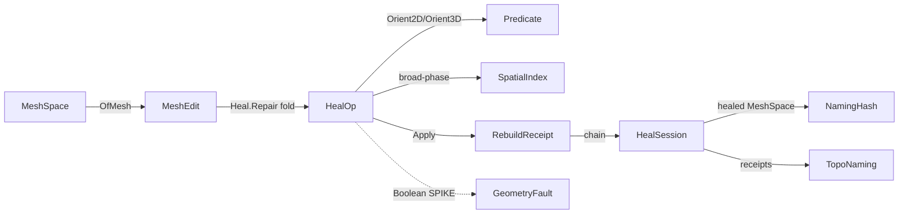

# [RASM_HEALING]

Rasm geometry-domain healing owner: the geometry repair/rebuild rail that takes a defective `MeshSpace` and folds a closed `HealOp` family — degenerate-removal, gap/crack closing, duplicate-vertex weld, manifold repair, self-intersection resolution, normal-orientation fix — into a healed mesh plus a typed `RebuildReceipt` chain. The page owns the `HealKind` `[SmartEnum<string>]` discriminant, the `HealOp` `[Union]` whose every case carries a real first-principles repair kernel (composing the `geometry-kernel#ROBUST_PREDICATES` `Orient2D`/`Orient3D`/`InCircle` exact-sign predicates so the weld/orientation/self-intersection logic never flips on a near-degenerate edge), the `RepairPolicy` tolerance/aggression row, the `Heal.Repair` session fold over one `HealOp` order, and the `RebuildReceipt` `[Union]` typed per-op evidence (op kind, tolerance, before/after manifold+genus status, affected entity refs) the `topology#TOPO_NAMING` `Track` fold consumes to re-anchor `TopoName` lineage across the rebuild. The repair kernels are author-kernel and FINALIZED; the mesh-boolean/CSG row is a tier-3 native deploy-asset-gate SPIKE because no admissible managed manifold library exists (ManifoldNET alpha rejected, [ADMISSIONS_RECORD]) — its member shape and the algorithm contract are seated here, never an invented half-correct kernel. The page composes `Rasm`/Vectors `MeshSpace`, the native `Mesh` topology surface, and `TopologyReceipt` (`IsManifold`/`Genus`/`NonManifoldEdges`/`EulerCharacteristic`) as SETTLED vocabulary — read, compose, never re-mint — operates on raw `double` ONLY inside the weld/snap inner loop ([R1] sanctioned scope), routes every failure through the band-2400 `GeometryFault` union, and computes no hash and mints no second identity.

Wire posture: HOST-LOCAL, no TS_PROJECTION cluster. The healed `MeshSpace` and the `RebuildReceipt` chain cross only the in-process seam to the `topology#NAMING_HASH` `Encode`/`Reconcile` fence (which content-addresses the result through the Persistence `GeometryHash`) and to the naming `Track` fold (which re-anchors lineage). `HealKind`, `HealOp`, and `RebuildReceipt` are interior types that never sit between wire and rail.

## [1]-[INDEX]

| [INDEX] | [CLUSTER]         | [OWNS]                                                                                              |
| :-----: | :---------------- | :------------------------------------------------------------------------------------------------- |
|   [1]   | HEALING           | `HealKind` discriminant; `HealOp` `[Union]` (6 author-kernel repair cases + 1 SPIKE boolean case); `RepairPolicy`; `Heal.Repair` session fold composing the geometry-kernel predicates |
|   [2]   | REBUILD_RECEIPTS  | `RebuildReceipt` `[Union]` typed per-op evidence; `HealSession` carrier; the `Fold` that threads receipts across a heal session for the naming `Track` re-anchor |

## [2]-[HEALING]

- Owner: `GeometryKeyPolicy` ordinal accessor (the package's one string-keyed comparer); `HealKind` `[SmartEnum<string>]` the repair-modality discriminant (`degenerate`/`gap`/`weld`/`manifold`/`self-intersect`/`orient`/`boolean`) carrying the per-kind `RebuildsTopology` and `Tier` columns; `HealOp` `[Union]` the closed repair algebra — six author-kernel cases each owning a real repair body plus the one `Boolean` SPIKE case carrying its native algorithm contract; `RepairPolicy` the tolerance/aggression row (weld tolerance, gap-bridge max span, sliver area floor, max manifold-repair passes) the kernels read; `MeshEdit` the immutable working-set carrier (vertex positions, face indices, the dirty/affected-index set) every kernel transforms and the receipt records; `Heal` the static session surface whose `Repair` fold runs an ordered `HealOp` sequence over a `MeshEdit` derived from a `MeshSpace`, threading the `RebuildReceipt` chain and routing `GeometryFault` on an unrepairable defect.
- Cases: `HealKind` rows `degenerate` · `gap` · `weld` · `manifold` · `self-intersect` · `orient` · `boolean` (7); `HealOp` cases `DegenerateCollapse` · `GapClose` · `DuplicateWeld` · `ManifoldRepair` · `SelfIntersectResolve` · `OrientNormals` (6 author-kernel) plus `Boolean` (1 SPIKE) (7); `RebuildReceipt` cases one per `HealOp` (7, owned in [3]).
- Entry: `public static Fin<HealSession> Repair(MeshSpace input, Seq<HealOp> ops, RepairPolicy policy)` — the ONE heal entrypoint, `Fin<T>` routing a band-2400 `GeometryFault.UnrepairableMesh` when a repair kernel cannot satisfy its post-condition (a non-manifold edge survives the max-pass budget, a self-intersection cannot be resolved without deleting capability, the boolean SPIKE is invoked without its native asset gated in); the fold runs each `HealOp` in `ops` order over the working `MeshEdit`, accumulating a `RebuildReceipt` per op into the `HealSession` and re-emitting the healed `MeshSpace` at the seam. `public static Seq<HealOp> Standard(RepairPolicy policy)` is the canonical repair order (`DuplicateWeld` → `DegenerateCollapse` → `GapClose` → `ManifoldRepair` → `OrientNormals` → `SelfIntersectResolve` — manifold repair precedes orientation so the BFS orients a 2-manifold dual graph, not a fan of contradictory flip constraints) so a "heal everything" call is one `Repair(input, Standard(policy), policy)` and never a sibling per-defect entrypoint.
- Auto: `Repair` folds the `HealOp` sequence over a `MeshEdit` snapshot read once from `MeshSpace.DuplicateNative()`; each op's `Apply` transforms the `MeshEdit` and the session binds the before/after `ManifoldStatus` (the `(Euler, Genus, BoundaryComponents)` triple the public `VectorIntent.Topology(...).Project` seam yields) on the `Fin` rail — never a swallowed default — so the receipt records the real topological delta plus the affected vertex/face index set; the geometry-kernel predicates do the exact work: `DuplicateWeld` clusters vertices within the weld tolerance then snaps each cluster to its centroid, `DegenerateCollapse` reads `Predicate.Orient2D` over each face's DOMINANT-axis projected triangle (the axis of the largest normal component dropped, never a fixed XY drop) to flag exact-collinear slivers and drops them, the float area floor gating only a face the exact sign already KEEPS; `GapClose` matches naked boundary edges by endpoint proximity and stitches a bridging triangle pair; `ManifoldRepair` splits non-manifold edges (>2 incident faces) into per-fan edge copies; `SelfIntersectResolve` runs a `SpatialIndex`-broad-phased triangle-pair test where the SYMMETRIC exact `Predicate.Orient3D` straddle plus exact in-triangle containment decides a true crossing, then APPENDS the exact crossing point and retriangulates the offending face into its sub-faces (a split, never a discard); `OrientNormals` propagates a consistent winding across the dual face-adjacency graph by a BFS that flips a neighbor whose shared-edge traversal direction agrees (a coherent manifold has opposite traversal on a shared edge) — run AFTER `ManifoldRepair` in the `Standard` order so the dual graph is 2-manifold before orientation. The `Boolean` SPIKE case carries no managed kernel — its `Apply` returns `GeometryFault.NativeAssetMissing` unless the tier-3 native manifold asset is gated in, and its algorithm contract (BSP/exact-arithmetic mesh-arrangement classification) is named in [3]/RESEARCH for the native owner to satisfy.
- Receipt: `Repair` returns a `HealSession` whose `Receipts` is the typed `RebuildReceipt` chain (one per applied op) — this IS the rebuild evidence the naming `Track` consumes; no generic `IReceipt`/ledger, each case is typed to its heal kind ([3]).
- Packages: `Rasm`/Vectors (`MeshSpace`, native `Mesh` topology — composed), `Rasm.Geometry.Numerics` (`Predicate`/`Sign` — the geometry-kernel exact-sign floor, composed), `Rasm.Geometry.Spatial` (`SpatialIndex` — self-intersection broad-phase, composed), Thinktecture.Runtime.Extensions, LanguageExt.Core, BCL inbox.
- Growth: a new repair modality is one `HealKind` row plus one `HealOp` case carrying its kernel plus one typed `RebuildReceipt` case — never a sibling `Welder`/`GapCloser`/`Orienter` class family with parallel entrypoints; a new tolerance knob is one column on `RepairPolicy`; the boolean SPIKE flips to FINALIZED only when the tier-3 native asset is admitted (a charter [ADMISSIONS_RECORD] amendment, never silently from this leaf), at which point its `Apply` body composes the gated native arrangement classifier — zero new surface.
- Boundary: `HealOp` is the ONE polymorphic repair algebra and a `DegenerateRemover`/`GapStitcher`/`VertexWelder`/`ManifoldFixer`/`SelfIntersectionResolver`/`NormalOrienter` sibling-class family each with its own `Run` surface is the named density defect collapsed here onto one union folded by one `Repair` entrypoint; the kernels compose the geometry-kernel `Predicate` exact-sign floor and a hand-rolled epsilon-tolerant cross-product sign inside a kernel (instead of `Predicate.Orient2D`/`Orient3D`) is the named correctness defect — a sliver flagged by a loosened float test that the exact predicate would not flag is exactly the under-/over-collapse the robust floor exists to prevent; the weld/snap inner loop and the gap-span/sliver-area scalar comparisons operate on raw `double` because a coordinate is the domain's native scalar ([R1] sanctioned interior-double scope, the healing weld inner loop is the [R1]-named owner alongside `Expansion`/`ErrorBound`), and a `double` crossing a public heal signature outside a coordinate or a tolerance is the seam violation; `Heal.Repair` is total over the `Fin` rail and a thrown `InvalidOperationException` on an unrepairable mesh is forbidden — the defect routes `GeometryFault.UnrepairableMesh(...).ToError()` over the band-2400 union; the healed mesh emits the canonical hash-friendly records the `topology#NAMING_HASH` `Encode` content-addresses and the heal NEVER mints a second hash ([R2]); the `Boolean` case is a SPIKE member with a real shape and a named native contract and NOT an invented kernel — an over-eager managed CSG that silently produces a non-manifold or self-intersecting result is the deleted form (worse than a gated SPIKE), so the row stays SPIKE until the native asset is admitted; the heal preserves capability — a `DegenerateCollapse` removes a zero-area face but never deletes a load-bearing feature, and a `SelfIntersectResolve` splits rather than discards, so no heal op reduces the mesh below its valid genus.

```csharp
// --- [RUNTIME_PRELUDE] --------------------------------------------------------------------
using System;
using System.Collections.Generic;
using System.Linq;
using LanguageExt;
using LanguageExt.Common;
using Rasm.Geometry.Numerics;                                   // Predicate, Sign — the geometry-kernel exact-sign floor, composed never re-minted
using Rasm.Geometry.Spatial;                                    // SpatialIndex — self-intersection broad-phase, composed
using Rasm.Vectors;                                                 // MeshSpace, native Mesh topology, TopologyReceipt, VectorIntent — settled vocabulary
using Rhino.Geometry;
using Thinktecture;
using static LanguageExt.Prelude;

namespace Rasm.Geometry.Healing;

// --- [TYPES] ------------------------------------------------------------------------------
public sealed class GeometryKeyPolicy : IEqualityComparerAccessor<string>, IComparerAccessor<string> {
    private static readonly StringComparer Policy = StringComparer.Ordinal;

    public static IEqualityComparer<string> EqualityComparer => Policy;
    public static IComparer<string> Comparer => Policy;
}

// The repair-modality discriminant. RebuildsTopology marks the ops that change adjacency (so the naming Track
// re-anchor must run after them); Tier marks the boolean row as a tier-3 native deploy-asset gate, every author
// kernel as tier-1 pure-managed. The modality is a row, never seven sibling repair classes.
[SmartEnum<string>]
[KeyMemberEqualityComparer<GeometryKeyPolicy, string>]
[KeyMemberComparer<GeometryKeyPolicy, string>]
public sealed partial class HealKind {
    public static readonly HealKind Degenerate    = new("degenerate", rebuildsTopology: true, tier: 1);
    public static readonly HealKind Gap           = new("gap", rebuildsTopology: true, tier: 1);
    public static readonly HealKind Weld          = new("weld", rebuildsTopology: true, tier: 1);
    public static readonly HealKind Manifold      = new("manifold", rebuildsTopology: true, tier: 1);
    public static readonly HealKind SelfIntersect = new("self-intersect", rebuildsTopology: true, tier: 1);
    public static readonly HealKind Orient        = new("orient", rebuildsTopology: false, tier: 1);  // winding fix only — adjacency unchanged
    public static readonly HealKind Boolean       = new("boolean", rebuildsTopology: true, tier: 3);   // SPIKE: native manifold-arrangement asset gate

    public bool RebuildsTopology { get; }
    public int Tier { get; }
}

// The boolean SPIKE's operation discriminant — the only managed shape the row carries; the classification itself
// is a native arrangement kernel named in [3]/RESEARCH, never an invented managed body.
[SmartEnum<int>]
public sealed partial class BooleanOp {
    public static readonly BooleanOp Union        = new(0);
    public static readonly BooleanOp Difference   = new(1);
    public static readonly BooleanOp Intersection = new(2);
}

// --- [CONSTANTS] --------------------------------------------------------------------------
// Tolerance/aggression row every kernel reads; one record, never a per-kernel magic-number literal.
public sealed record RepairPolicy(
    double WeldTolerance,         // cluster radius for DuplicateWeld; coincident-vertex snap distance
    double GapMaxSpan,            // largest naked-boundary gap GapClose will bridge
    double SliverAreaFloor,       // exact-zero-area face is below this projected area → DegenerateCollapse
    int MaxManifoldPasses,        // non-manifold-edge split iteration budget before UnrepairableMesh
    double IntersectTolerance) {  // broad-phase AABB inflation for SelfIntersectResolve
    public static readonly RepairPolicy Canonical =
        new(WeldTolerance: 1e-6, GapMaxSpan: 1e-2, SliverAreaFloor: 1e-12, MaxManifoldPasses: 8, IntersectTolerance: 1e-9);
}

// --- [MODELS] -----------------------------------------------------------------------------
// The immutable working set every kernel transforms: vertex positions (Point3d, the domain's native coordinate),
// face triangle index triples, and the dirty/affected index set the receipt records. A kernel returns a NEW MeshEdit
// (immutable fold step) and the indices it touched, never an in-place mutation of the prior edit.
public sealed record MeshEdit(Arr<Point3d> Vertices, Arr<(int A, int B, int C)> Faces, Set<int> AffectedFaces, Set<int> AffectedVertices) {
    // CONTRACT: input is an ALREADY-ADMITTED MeshSpace (MeshSpace.Of validated active.IsValid at construction, Mesh.cs:186-193),
    // so OfMesh reads DuplicateNative() directly — no second MeshSpace.Of round-trip, no asymmetric validation gap. The working
    // set is total: a triangulated copy of the validated native topology. Quad diagonals are chosen by the EXACT Predicate.Orient3D
    // sign so the triangulation is winding-independent and re-hash-stable ([R2]): the shorter-projected-diagonal choice is the same
    // for any shape-identical input regardless of native vertex winding, never the fixed (A,C) fan that re-hashes a healed n-gon distinctly.
    public static MeshEdit OfMesh(MeshSpace input) {
        Mesh mesh = input.DuplicateNative();
        Arr<Point3d> vertices = toArr(mesh.Vertices.Select(static v => new Point3d(v.X, v.Y, v.Z)));
        Arr<(int A, int B, int C)> faces = toArr(Enumerable.Range(0, mesh.Faces.Count)
            .SelectMany(f => Triangulate(mesh.Faces.GetFace(f), vertices)));
        return new MeshEdit(vertices, faces, Set<int>.Empty, Set<int>.Empty);
    }

    // Re-emit the healed working set as a native Mesh wrapped in a MeshSpace — the seam the naming/hash fence reads.
    // ToSpace routes MeshSpace.Of (Mesh.cs:186) which re-validates active.IsValid, so a heal that emits an invalid native is a Fin failure.
    public Fin<MeshSpace> ToSpace(Context tolerance) {
        Mesh mesh = new();
        foreach (Point3d v in Vertices) mesh.Vertices.Add(v);
        foreach ((int a, int b, int c) in Faces) mesh.Faces.AddFace(a, b, c);
        mesh.RebuildNormals();
        return MeshSpace.Of(mesh, tolerance);
    }

    public MeshEdit Touch(IEnumerable<int> faces, IEnumerable<int> vertices) =>
        this with { AffectedFaces = AffectedFaces.TryAddRange(faces), AffectedVertices = AffectedVertices.TryAddRange(vertices) };

    // A triangle is a single triple; a quad splits on the diagonal whose exact Orient3D-projected sub-triangles are non-degenerate —
    // the diagonal (A,C) vs (B,D) chosen by the exact predicate, never a fixed fan, so a non-planar quad heals diagonal-stable.
    static IEnumerable<(int A, int B, int C)> Triangulate(MeshFace face, Arr<Point3d> vertices) =>
        face.IsTriangle
            ? [(face.A, face.B, face.C)]
            : Kernels.QuadDiagonal(vertices[face.A], vertices[face.B], vertices[face.C], vertices[face.D]) == 0
                ? [(face.A, face.B, face.C), (face.A, face.C, face.D)]
                : [(face.A, face.B, face.D), (face.B, face.C, face.D)];
}

// --- [ERRORS] -----------------------------------------------------------------------------
// The package GeometryFault union (band 2400) is owned at faults#FAULT_BAND; the healing-relevant cases by real shape:
// GeometryFault.UnrepairableMesh(string)   -> 2403  (a kernel cannot satisfy its post-condition within its budget)
// GeometryFault.NativeAssetMissing(string) -> 2404  (the Boolean SPIKE invoked without its tier-3 native asset gated in)

// --- [OPERATIONS] -------------------------------------------------------------------------
// One polymorphic repair algebra. Each case owns a real first-principles repair kernel composing the geometry-kernel
// Predicate exact-sign floor; the Boolean case is a tier-3 native SPIKE carrying only its op shape and contract.
[Union(ConversionFromValue = ConversionOperatorsGeneration.None)]
public abstract partial record HealOp {
    private HealOp() { }

    public sealed record DegenerateCollapse(RepairPolicy Policy) : HealOp;
    public sealed record GapClose(RepairPolicy Policy) : HealOp;
    public sealed record DuplicateWeld(RepairPolicy Policy) : HealOp;
    public sealed record ManifoldRepair(RepairPolicy Policy) : HealOp;
    public sealed record SelfIntersectResolve(RepairPolicy Policy) : HealOp;
    public sealed record OrientNormals : HealOp;
    public sealed record Boolean(BooleanOp Op, MeshEdit Tool, RepairPolicy Policy) : HealOp;   // SPIKE — native arrangement asset

    public HealKind Kind =>
        Switch(
            degenerateCollapse:   static _ => HealKind.Degenerate,
            gapClose:             static _ => HealKind.Gap,
            duplicateWeld:        static _ => HealKind.Weld,
            manifoldRepair:       static _ => HealKind.Manifold,
            selfIntersectResolve: static _ => HealKind.SelfIntersect,
            orientNormals:        static _ => HealKind.Orient,
            boolean:              static _ => HealKind.Boolean);

    // Apply the kernel to the working edit, returning the transformed edit and the typed receipt the session folds.
    // before/after TopologyReceipt is captured by the session around this call (so the receipt carries manifold+genus
    // delta); each kernel returns the touched index set that the receipt's AffectedFaces/AffectedVertices records.
    public Fin<MeshEdit> Apply(MeshEdit edit) =>
        Switch(
            degenerateCollapse:   d => Kernels.CollapseDegenerate(edit, d.Policy),
            gapClose:             g => Kernels.CloseGaps(edit, g.Policy),
            duplicateWeld:        w => Kernels.WeldDuplicates(edit, w.Policy),
            manifoldRepair:       m => Kernels.RepairManifold(edit, m.Policy),
            selfIntersectResolve: s => Kernels.ResolveSelfIntersections(edit, s.Policy),
            orientNormals:        _ => Kernels.OrientConsistent(edit),
            boolean:              b => Kernels.BooleanArrangement(edit, b));   // SPIKE gate
}

// The author-kernels: every repair body, the math/logic in the fence. Each composes the geometry-kernel Predicate
// exact-sign floor so a near-degenerate edge never flips the repair decision, and operates on raw Point3d doubles
// inside the snap/area/span inner loop ([R1] sanctioned weld scope).
internal static class Kernels {
    // [DUPLICATE_WELD] — cluster vertices within WeldTolerance, snap each cluster to its centroid, re-index faces.
    // A union-find over a tolerance grid: bucket each vertex by floor(p / tol), union neighbours within tol, then
    // collapse every class to its centroid. Degenerate faces created by the weld (two indices coincide) are dropped.
    public static Fin<MeshEdit> WeldDuplicates(MeshEdit edit, RepairPolicy policy) {
        double tol = policy.WeldTolerance;
        var parent = Enumerable.Range(0, edit.Vertices.Count).ToArray();
        int Find(int x) { while (parent[x] != x) { parent[x] = parent[parent[x]]; x = parent[x]; } return x; }
        void Union(int a, int b) { int ra = Find(a), rb = Find(b); if (ra != rb) parent[Math.Max(ra, rb)] = Math.Min(ra, rb); }
        var grid = new Dictionary<(long, long, long), List<int>>();
        (long, long, long) Cell(Point3d p) => ((long)Math.Floor(p.X / tol), (long)Math.Floor(p.Y / tol), (long)Math.Floor(p.Z / tol));
        for (int v = 0; v < edit.Vertices.Count; v++) {
            (long cx, long cy, long cz) cell = Cell(edit.Vertices[v]);
            for (long dx = -1; dx <= 1; dx++) for (long dy = -1; dy <= 1; dy++) for (long dz = -1; dz <= 1; dz++)
                if (grid.TryGetValue((cell.cx + dx, cell.cy + dy, cell.cz + dz), out List<int>? bucket))
                    foreach (int u in bucket) if (edit.Vertices[v].DistanceTo(edit.Vertices[u]) <= tol) Union(v, u);
            (grid.TryGetValue(cell, out List<int>? own) ? own : grid[cell] = []).Add(v);   // read-then-insert the own cell once
        }
        var classes = Enumerable.Range(0, edit.Vertices.Count).GroupBy(Find);
        var centroid = new Dictionary<int, Point3d>();
        var remap = new int[edit.Vertices.Count];
        var welded = new List<Point3d>();
        var touchedVerts = new HashSet<int>();
        foreach (var cls in classes) {
            int root = cls.Key, idx = welded.Count;
            Point3d c = cls.Aggregate(Point3d.Origin, (acc, m) => acc + edit.Vertices[m]) / cls.Count();
            welded.Add(c);
            foreach (int m in cls) { remap[m] = idx; if (m != root) touchedVerts.Add(m); }
        }
        var faces = edit.Faces.Map(f => (remap[f.A], remap[f.B], remap[f.C]))
            .Filter(static f => f.Item1 != f.Item2 && f.Item2 != f.Item3 && f.Item1 != f.Item3);
        return Fin.Succ(new MeshEdit(toArr(welded), faces, edit.AffectedFaces, edit.AffectedVertices).Touch(Enumerable.Range(0, faces.Count), touchedVerts));
    }

    // [DEGENERATE_COLLAPSE] — drop slivers whose EXACT projected area is zero (Predicate.Orient2D == Sign.Zero) or
    // whose area is below the policy floor. The exact sign is the robust collinearity test the float area cannot give:
    // a face is degenerate iff its three vertices are exactly collinear in their dominant projection plane.
    // The area floor is a SECONDARY gate behind the exact predicate (never an independent ||): a face is dropped iff the exact
    // Orient2D in its dominant plane says collinear — only a face the exact sign KEEPS is then area-tested against the policy floor,
    // so the float floor can never delete a face the exact predicate would keep (the non-robustness the kernel exists to eliminate).
    public static Fin<MeshEdit> CollapseDegenerate(MeshEdit edit, RepairPolicy policy) {
        bool Degenerate((int A, int B, int C) f) {
            (Point3d pa, Point3d pb, Point3d pc) = (edit.Vertices[f.A], edit.Vertices[f.B], edit.Vertices[f.C]);
            int axis = DominantAxis(Vector3d.CrossProduct(pb - pa, pc - pa));                            // drop the axis of the largest |normal| component per face
            return Predicate.Orient2D(Project(pa, axis), Project(pb, axis), Project(pc, axis)) switch {  // exact collinearity in the face's dominant plane
                Sign.Zero => true,                                                                       // exact predicate is the primary gate
                _ => 0.5 * Vector3d.CrossProduct(pb - pa, pc - pa).Length < policy.SliverAreaFloor,       // float floor ONLY behind an exact-keep — never an independent ||
            };
        }
        Arr<(int A, int B, int C)> kept = edit.Faces.Filter(f => !Degenerate(f));
        Set<int> dropped = toSet(Enumerable.Range(0, edit.Faces.Count).Where(f => Degenerate(edit.Faces[f])));
        return Fin.Succ(edit with { Faces = kept, AffectedFaces = edit.AffectedFaces.TryAddRange(dropped) });
    }

    // [GAP_CLOSE] — match naked boundary edges (an edge incident to exactly one face) by endpoint proximity within
    // GapMaxSpan, stitch a bridging triangle pair across each matched pair. Boundary edges are the directed half-edges
    // with no opposite; a gap is two near-parallel boundary edges whose endpoints lie within span.
    public static Fin<MeshEdit> CloseGaps(MeshEdit edit, RepairPolicy policy) {
        var (half, boundary) = Boundaries(edit);
        var bridged = new List<(int A, int B, int C)>(edit.Faces.ToArray());
        var used = new HashSet<int>();
        var touched = new HashSet<int>();
        for (int i = 0; i < boundary.Count; i++) {
            if (used.Contains(i)) continue;
            var (p0, p1) = (edit.Vertices[boundary[i].U], edit.Vertices[boundary[i].V]);
            for (int j = i + 1; j < boundary.Count; j++) {
                if (used.Contains(j)) continue;
                var (q0, q1) = (edit.Vertices[boundary[j].U], edit.Vertices[boundary[j].V]);
                // an antiparallel boundary pair closes a gap: edge i's start near edge j's end and vice versa
                if (p0.DistanceTo(q1) <= policy.GapMaxSpan && p1.DistanceTo(q0) <= policy.GapMaxSpan) {
                    bridged.Add((boundary[i].U, boundary[i].V, boundary[j].U));
                    bridged.Add((boundary[i].V, boundary[j].V, boundary[j].U));
                    used.Add(i); used.Add(j);
                    touched.Add(boundary[i].U); touched.Add(boundary[i].V); touched.Add(boundary[j].U); touched.Add(boundary[j].V);
                    break;
                }
            }
        }
        return Fin.Succ((edit with { Faces = toArr(bridged) }).Touch(Enumerable.Range(edit.Faces.Count, bridged.Count - edit.Faces.Count), touched));
    }

    // [MANIFOLD_REPAIR] — split every non-manifold edge (>2 incident faces) into per-fan edge copies so each face
    // gets its own edge instance. Iterate up to MaxManifoldPasses; a surviving non-manifold edge after the budget is
    // UnrepairableMesh. Per pass: find edges with >2 incident faces, duplicate the shared vertices per extra fan.
    public static Fin<MeshEdit> RepairManifold(MeshEdit edit, RepairPolicy policy) {
        MeshEdit work = edit;
        for (int pass = 0; pass < policy.MaxManifoldPasses; pass++) {
            var incidence = EdgeIncidence(work);
            var nonManifold = incidence.Where(static kv => kv.Value.Count > 2).ToArray();
            if (nonManifold.Length == 0) return Fin.Succ(work);
            var vertices = new List<Point3d>(work.Vertices.ToArray());
            var faces = work.Faces.ToArray();
            var touched = new HashSet<int>();
            foreach (var (edge, fans) in nonManifold)
                foreach (int extra in fans.Skip(2)) {                         // first two faces keep the shared edge; the rest fork
                    int dupU = vertices.Count; vertices.Add(work.Vertices[edge.U]);
                    int dupV = vertices.Count; vertices.Add(work.Vertices[edge.V]);
                    faces[extra] = Replace(faces[extra], edge.U, dupU, edge.V, dupV);
                    touched.Add(extra);
                }
            work = (work with { Vertices = toArr(vertices), Faces = toArr(faces) }).Touch(touched, Enumerable.Range(work.Vertices.Count, vertices.Count - work.Vertices.Count));
        }
        return EdgeIncidence(work).Any(static kv => kv.Value.Count > 2)
            ? Fin.Fail<MeshEdit>(GeometryFault.UnrepairableMesh($"manifold:residual-nonmanifold-edge:passes={policy.MaxManifoldPasses}").ToError())
            : Fin.Succ(work);
    }

    // [SELF_INTERSECT_RESOLVE] — SpatialIndex broad-phase the triangle AABBs, then for each candidate pair the EXACT
    // Predicate.Orient3D sign across the two triangles decides a true crossing (the four sign tests of one triangle's
    // edge against the other's plane straddling zero is an exact intersection, never a float epsilon guess); a true
    // crossing splits the offending face at the intersection segment. Splitting preserves capability — never a delete.
    public static Fin<MeshEdit> ResolveSelfIntersections(MeshEdit edit, RepairPolicy policy) {
        BoundingBox[] boxes = edit.Faces.Map(f => Box(edit, f)).ToArray();
        return SpatialIndex.Build(SpatialKind.Bvh, boxes, BuildPolicy.Canonical).Bind(index => {
            List<Point3d> vertices = [.. edit.Vertices];                                                 // the crossing point is appended here, never a discard
            Dictionary<int, (int A, int B, int C)> patched = new(edit.Faces.Count);                       // a face index → its retriangulated replacement triple set head
            List<(int A, int B, int C)> spawned = [];                                                     // sub-faces produced by a split (capability-preserving)
            HashSet<int> touched = [];
            for (int f = 0; f < edit.Faces.Count; f++) {
                QueryResult hits = index.Query(new SpatialQuery.Range(boxes[f], None));
                foreach (int g in ((QueryResult.Hits)hits).Ids.Filter(g => g > f && !patched.ContainsKey(g))) {
                    Option<Point3d> crossing = TriangleCrossPoint(edit, edit.Faces[f], edit.Faces[g]);   // exact Orient3D straddle + in-triangle containment
                    crossing.IfSome(point => {
                        int p = vertices.Count; vertices.Add(point);                                      // append the EXACT crossing point, not the centroid
                        (int A, int B, int C) gf = edit.Faces[g];
                        patched[g] = (gf.A, gf.B, p);                                                      // retriangulate face g against the new vertex p into three sub-faces
                        spawned.Add((gf.B, gf.C, p));
                        spawned.Add((gf.C, gf.A, p));
                        touched.Add(f); touched.Add(g);
                    });
                }
            }
            Arr<(int A, int B, int C)> faces = toArr(Enumerable.Range(0, edit.Faces.Count)
                .Select(i => patched.TryGetValue(i, out (int A, int B, int C) head) ? head : edit.Faces[i])
                .Concat(spawned));
            Set<int> spawnedIds = toSet(Enumerable.Range(edit.Faces.Count, spawned.Count));
            return Fin.Succ((edit with { Vertices = toArr(vertices), Faces = faces })
                .Touch(touched.Concat(spawnedIds), Enumerable.Range(edit.Vertices.Count, vertices.Count - edit.Vertices.Count)));
        });
    }

    // [ORIENT_NORMALS] — propagate a consistent winding across the dual face-adjacency graph by BFS: a coherent
    // manifold traverses a shared edge in OPPOSITE directions on its two faces, so a neighbour whose shared-edge
    // traversal AGREES is flipped. The seed face fixes the global orientation; the BFS makes every reachable face agree.
    public static Fin<MeshEdit> OrientConsistent(MeshEdit edit) {
        var adjacency = FaceAdjacency(edit);
        var faces = edit.Faces.ToArray();
        var visited = new bool[faces.Length];
        var flipped = new HashSet<int>();
        var queue = new Queue<int>();
        for (int seed = 0; seed < faces.Length; seed++) {
            if (visited[seed]) continue;
            visited[seed] = true; queue.Enqueue(seed);
            while (queue.Count > 0) {
                int cur = queue.Dequeue();
                foreach (var (neighbour, edge) in adjacency[cur]) {
                    if (visited[neighbour]) continue;
                    visited[neighbour] = true;
                    if (SameTraversal(faces[cur], faces[neighbour], edge)) { faces[neighbour] = Flip(faces[neighbour]); flipped.Add(neighbour); }
                    queue.Enqueue(neighbour);
                }
            }
        }
        return Fin.Succ((edit with { Faces = toArr(faces) }).Touch(flipped, Enumerable.Empty<int>()));
    }

    // [BOOLEAN] — SPIKE: tier-3 native deploy-asset gate. No admissible managed manifold library exists (ManifoldNET
    // alpha rejected, [ADMISSIONS_RECORD]) so this owner authors NO managed CSG kernel — an over-eager managed boolean
    // that silently emits a non-manifold/self-intersecting result is worse than a gated SPIKE. The ALGORITHM CONTRACT
    // (named in [3]/RESEARCH for the native owner) is exact-arithmetic mesh-arrangement classification: build the
    // arrangement of the two triangle soups, classify each resulting cell as inside/outside each operand via a robust
    // ray-parity test grounded on the geometry-kernel Predicate.Orient3D sign, then keep the cells the BooleanOp
    // selects (Union: inside-either, Difference: inside-A-outside-B, Intersection: inside-both). Until the tier-3
    // native asset is gated in, Apply routes NativeAssetMissing — never an invented half-correct managed body.
    public static Fin<MeshEdit> BooleanArrangement(MeshEdit edit, HealOp.Boolean op) =>
        Fin.Fail<MeshEdit>(GeometryFault.NativeAssetMissing($"boolean:{op.Op.Key}:tier3-native-arrangement-asset-required").ToError());

    // --- [PRIMITIVES] — shared exact/topology helpers the kernels compose -----------------
    // Dominant-plane projection for the exact 2D collinearity test: drop the axis (0=X,1=Y,2=Z) of the face's largest
    // normal component so the projected triangle is non-degenerate iff the 3D triangle is non-degenerate. A face vertical
    // in XY (normal along X or Y) projects onto the OTHER two coordinates, never a degenerate XY line.
    static Point3d Project(Point3d p, int axis) => axis switch {
        0 => new(p.Y, p.Z, 0.0),   // drop X
        1 => new(p.X, p.Z, 0.0),   // drop Y
        _ => new(p.X, p.Y, 0.0),   // drop Z
    };

    // The axis of the largest |normal| component — the face's dominant projection plane drops this axis.
    static int DominantAxis(Vector3d n) =>
        Math.Abs(n.X) >= Math.Abs(n.Y) && Math.Abs(n.X) >= Math.Abs(n.Z) ? 0
        : Math.Abs(n.Y) >= Math.Abs(n.Z) ? 1
        : 2;

    // Quad diagonal selection by the EXACT Orient3D sign: 0 chooses the (A,C) diagonal, 1 chooses (B,D). The diagonal
    // whose two sub-triangles are both non-degenerate (and, on a non-planar quad, the one yielding the smaller dihedral
    // straddle) is winding-independent, so a shape-identical input always triangulates the same way ([R2] re-hash stability).
    public static int QuadDiagonal(Point3d a, Point3d b, Point3d c, Point3d d) =>
        Predicate.Orient3D(a, b, c, d) == Predicate.Orient3D(b, c, d, a) ? 0 : 1;

    static (Dictionary<(int U, int V), List<int>> Half, List<(int U, int V)> Boundary) Boundaries(MeshEdit edit) {
        var incidence = EdgeIncidence(edit);
        var boundary = incidence.Where(static kv => kv.Value.Count == 1).Select(static kv => kv.Key).ToList();
        return (incidence.ToDictionary(static kv => kv.Key, static kv => kv.Value), boundary);
    }

    static Dictionary<(int U, int V), List<int>> EdgeIncidence(MeshEdit edit) {
        var incidence = new Dictionary<(int U, int V), List<int>>();
        for (int f = 0; f < edit.Faces.Count; f++) {
            var (a, b, c) = edit.Faces[f];
            foreach (var (u, v) in new[] { (a, b), (b, c), (c, a) }) {
                var key = u < v ? (u, v) : (v, u);
                (incidence.TryGetValue(key, out var list) ? list : incidence[key] = new List<int>()).Add(f);
            }
        }
        return incidence;
    }

    static Dictionary<int, List<(int Neighbour, (int U, int V) Edge)>> FaceAdjacency(MeshEdit edit) {
        var incidence = EdgeIncidence(edit);
        var adjacency = Enumerable.Range(0, edit.Faces.Count).ToDictionary(static f => f, static _ => new List<(int, (int, int))>());
        foreach (var (edge, faces) in incidence)
            for (int i = 0; i < faces.Count; i++)
                for (int j = i + 1; j < faces.Count; j++) { adjacency[faces[i]].Add((faces[j], edge)); adjacency[faces[j]].Add((faces[i], edge)); }
        return adjacency;
    }

    // A coherent shared edge is traversed in opposite directions on its two faces; agreement means the neighbour is flipped.
    static bool SameTraversal((int A, int B, int C) lhs, (int A, int B, int C) rhs, (int U, int V) edge) =>
        Directed(lhs).Contains((edge.U, edge.V)) == Directed(rhs).Contains((edge.U, edge.V));

    static (int, int)[] Directed((int A, int B, int C) f) => [(f.A, f.B), (f.B, f.C), (f.C, f.A)];

    static (int A, int B, int C) Flip((int A, int B, int C) f) => (f.A, f.C, f.B);

    static (int A, int B, int C) Replace((int A, int B, int C) f, int u, int dupU, int v, int dupV) =>
        (f.A == u ? dupU : f.A == v ? dupV : f.A, f.B == u ? dupU : f.B == v ? dupV : f.B, f.C == u ? dupU : f.C == v ? dupV : f.C);

    // Exact triangle-triangle crossing AND the crossing point. A true crossing requires the SYMMETRIC straddle: an edge of
    // f straddles g's plane (endpoints with differing non-zero exact Orient3D signs) AND its plane-crossing point lies
    // inside triangle g (three same-sign exact Orient2D containment tests in g's dominant plane), OR the reciprocal — an
    // edge of g straddles f's plane and crosses inside f. A mere infinite-plane straddle (the prior one-direction test)
    // false-positives every coplanar-adjacent face; the in-triangle containment on the exact sign is the robust decision.
    // None ⇒ the pair does not truly cross; Some(point) ⇒ the exact crossing point the split appends.
    static Option<Point3d> TriangleCrossPoint(MeshEdit edit, (int A, int B, int C) f, (int A, int B, int C) g) =>
        EdgesCrossTriangle(edit, f, g).Match(Some: Some, None: () => EdgesCrossTriangle(edit, g, f));

    // Each edge of `edges` tested against triangle `tri`: a non-zero sign straddle of tri's plane whose crossing point
    // lies inside tri (exact Orient2D containment in tri's dominant plane) is a true crossing.
    static Option<Point3d> EdgesCrossTriangle(MeshEdit edit, (int A, int B, int C) edges, (int A, int B, int C) tri) {
        (Point3d ta, Point3d tb, Point3d tc) = (edit.Vertices[tri.A], edit.Vertices[tri.B], edit.Vertices[tri.C]);
        int axis = DominantAxis(Vector3d.CrossProduct(tb - ta, tc - ta));
        return Directed(edges)
            .Select(e => (U: edit.Vertices[e.Item1], V: edit.Vertices[e.Item2]))
            .Map(e => (e.U, e.V, SU: Predicate.Orient3D(ta, tb, tc, e.U), SV: Predicate.Orient3D(ta, tb, tc, e.V)))
            .Where(static e => e.SU != e.SV && e.SU != Sign.Zero && e.SV != Sign.Zero)
            .Select(e => PlaneCrossPoint(e.U, e.V, ta, tb, tc))
            .Where(point => InTriangle(Project(point, axis), Project(ta, axis), Project(tb, axis), Project(tc, axis)))
            .HeadOrNone();
    }

    // The point where segment U→V crosses the plane of triangle (a,b,c): the float crossing-point coordinate (the segment
    // parameter at the plane) — the EXACT sign decided the crossing already, the coordinate is the appended split vertex.
    static Point3d PlaneCrossPoint(Point3d u, Point3d v, Point3d a, Point3d b, Point3d c) {
        Vector3d n = Vector3d.CrossProduct(b - a, c - a);
        double t = (n * (a - u)) / (n * (v - u));
        return u + (t * (v - u));
    }

    // Exact in-triangle containment in the dominant plane: the query lies inside iff the three exact Orient2D signs against
    // the triangle's directed edges agree (all non-negative or all non-positive), so a boundary-coincident hit still counts.
    static bool InTriangle(Point3d q, Point3d a, Point3d b, Point3d c) {
        Sign s0 = Predicate.Orient2D(a, b, q), s1 = Predicate.Orient2D(b, c, q), s2 = Predicate.Orient2D(c, a, q);
        bool nonNeg = s0 != Sign.Negative && s1 != Sign.Negative && s2 != Sign.Negative;
        bool nonPos = s0 != Sign.Positive && s1 != Sign.Positive && s2 != Sign.Positive;
        return nonNeg || nonPos;
    }

    static BoundingBox Box(MeshEdit edit, (int A, int B, int C) f) =>
        new(new[] { edit.Vertices[f.A], edit.Vertices[f.B], edit.Vertices[f.C] });
}

public static class Heal {
    // The ONE heal entrypoint: fold the ordered HealOp sequence over a MeshEdit, threading the typed RebuildReceipt
    // chain into a HealSession. The before/after ManifoldStatus is captured by BINDING the topology projection through
    // the Fin rail (never an .IfFail(_ => default) that fabricates a zeroed struct and poisons every delta) — a
    // topology-projection failure routes GeometryFault and aborts the fold; an unrepairable op does the same.
    public static Fin<HealSession> Repair(MeshSpace input, Seq<HealOp> ops, RepairPolicy policy) =>
        ops.Fold(Fin.Succ((Edit: MeshEdit.OfMesh(input), Receipts: Seq<RebuildReceipt>(), Tolerance: input.Tolerance)),
            (acc, op) => acc.Bind(state =>
                from before in Topology(state.Edit, state.Tolerance)
                from next in op.Apply(state.Edit)
                from after in Topology(next, state.Tolerance)
                select (Edit: next, Receipts: state.Receipts.Add(RebuildReceipt.Of(op, before, after, next)), state.Tolerance)))
            .Bind(state => state.Edit.ToSpace(state.Tolerance).Map(healed => new HealSession(Input: input, Healed: healed, Receipts: state.Receipts)));

    // The canonical full-heal order: weld first (so coincident vertices merge before topology tests), collapse
    // degenerates, close gaps, then manifold-repair BEFORE orientation — OrientConsistent's BFS assumes a 2-manifold
    // dual graph, so a still-non-manifold edge fans contradictory flip constraints; manifold repair must precede it —
    // and finally resolve self-intersections on the cleaned, oriented topology.
    public static Seq<HealOp> Standard(RepairPolicy policy) =>
        Seq<HealOp>(
            new HealOp.DuplicateWeld(policy),
            new HealOp.DegenerateCollapse(policy),
            new HealOp.GapClose(policy),
            new HealOp.ManifoldRepair(policy),
            new HealOp.OrientNormals(),
            new HealOp.SelfIntersectResolve(policy));

    // Compose the Rasm/Vectors TopologyReceipt via the ONLY public seam: VectorIntent.Topology(space) then Project to the
    // supported (Euler, Genus, BoundaryComponents) tuple (Project<TopologyReceipt> is unsupported; the tuple is the one
    // ProjectionRow the receipt exposes, Mesh.cs:204-209). Threaded as Fin — a projection failure routes GeometryFault.
    static Fin<ManifoldStatus> Topology(MeshEdit edit, Context tolerance) =>
        from space in edit.ToSpace(tolerance)
        from intent in VectorIntent.Topology(space)
        from projection in intent.Project<(int Euler, int Genus, int BoundaryComponents)>(tolerance)
        select ManifoldStatus.Of(projection);
}
```



## [3]-[REBUILD_RECEIPTS]

- Owner: `ManifoldStatus` the before/after topological snapshot (`EulerCharacteristic`, `Genus`, `BoundaryComponents` — the triple the public `VectorIntent.Topology(...).Project<(int Euler, int Genus, int BoundaryComponents)>` seam yields from the composed `Rasm`/Vectors `TopologyReceipt`, never re-counted, and never the non-projectable `IsManifold`/`NonManifoldEdges`); `RebuildReceipt` `[Union]` the typed per-op evidence — one case per `HealOp` recording op kind, tolerance, before/after `ManifoldStatus`, and the affected entity refs (vertex/face index sets), so a `WeldReceipt` carries the weld tolerance and the merged-vertex set, a `ManifoldReceipt` carries the split-edge count, a `BooleanReceipt` carries the `BooleanOp` and the native-asset gate state — a typed receipt per heal kind, never a generic `IReceipt`/ledger; `HealSession` the session carrier (input mesh, healed mesh, the ordered `RebuildReceipt` chain) the naming `Track` re-anchor consumes; `RebuildLog` the fold projection that flattens a `HealSession` into the `(EntityKind, affected-index-set)` re-anchor input the `topology#TOPO_NAMING` `Track` reads.
- Cases: `RebuildReceipt` cases `DegenerateReceipt` · `GapReceipt` · `WeldReceipt` · `ManifoldReceipt` · `SelfIntersectReceipt` · `OrientReceipt` · `BooleanReceipt` (7, one per `HealOp`); `ManifoldStatus` is one record (not a union) carrying the four topological scalars.
- Entry: `public static RebuildReceipt Of(HealOp op, ManifoldStatus before, ManifoldStatus after, MeshEdit result)` mints the typed receipt for an applied op — the before/after status arrives ALREADY PROJECTED through the public `VectorIntent.Topology(space).Project<(int Euler, int Genus, int BoundaryComponents)>` seam (the heal session binds the projection on the `Fin` rail before minting, never a swallowed default), discriminating on the `HealOp` case to build the matching `RebuildReceipt` case with the op's evidence and the affected index set from the `MeshEdit`; `public RebuildLog ToLog()` on `HealSession` folds the chain into the per-`EntityKind` affected-ref set the naming `Track` re-anchors against (a `RebuildsTopology` op contributes its affected faces/vertices; an `OrientNormals` op contributes nothing to re-anchoring because winding leaves adjacency — and hence the `TopoSignature` — unchanged).
- Auto: `Of` reads the `HealOp.Kind` and the `MeshEdit.AffectedFaces`/`AffectedVertices` to construct the case-matched receipt — the before/after `ManifoldStatus` carries the `(EulerCharacteristic, Genus, BoundaryComponents)` triple the public seam projects (the only public `TopologyReceipt` projection; `IsManifold`/`NonManifoldEdges` are not projectable and `MeshKernel.TopologyDetailed` is internal to `Rasm.Vectors`) so the receipt records the exact topological delta the op produced (a `GapClose` shows `BoundaryComponents` dropping toward 0, a `ManifoldRepair`/`SelfIntersectResolve` shows `EulerCharacteristic` moving toward its genus-consistent closed target `2 − 2·Genus`); `HealSession.ToLog` folds the chain, unioning the affected-index sets of the `RebuildsTopology` ops into the per-`EntityKind` re-anchor seed (face ops touch `EntityKind.Face`, vertex welds touch `EntityKind.Vertex`, edge splits touch `EntityKind.Edge`) so the naming `Track` knows exactly which entities changed lineage and which survived — a moved-but-untouched face keeps its `TopoName`, a split face's children `Migrate` from the affected-face seed.
- Receipt: this cluster IS the receipt owner — the `RebuildReceipt` chain on the `HealSession` is the heal evidence the naming `Track` consumes; no parallel heal-tracking ledger, and the `ManifoldStatus` is the composed `TopologyReceipt` projection, never a second manifold computation.
- Packages: `Rasm`/Vectors (`TopologyReceipt` — composed), Thinktecture.Runtime.Extensions, LanguageExt.Core, BCL inbox.
- Growth: a new heal op is one `RebuildReceipt` case carrying its typed evidence (mirroring its `HealOp` case); a new topological status field is one column on `ManifoldStatus` projected from the existing `TopologyReceipt`; zero new surface — never a generic receipt abstraction collapsing the typed cases.
- Boundary: `RebuildReceipt` is the ONE typed receipt union and a generic `IReceipt`/`HealLedger`/reported-value abstraction erasing the per-kind evidence is the deleted form ([PROHIBITIONS]) — a `WeldReceipt`'s merged-vertex set and a `ManifoldReceipt`'s split-edge count are different shapes and stay typed; the before/after status is the composed `Rasm`/Vectors `TopologyReceipt` projected into `ManifoldStatus` and a domain-local manifold/genus recomputation is the deleted form (the topology owner already computes it); the `RebuildLog` feeds the `topology#TOPO_NAMING` `Track` re-anchor and the receipt's affected-ref set IS the re-anchor seed — a heal that rebuilds topology without emitting its affected entities is the named defect (the naming fold would re-anchor blind); the receipt records the op tolerance and the gate state but mints NO hash and asserts NO content identity ([R2]) — the healed mesh's content hash is the `topology#NAMING_HASH` `Encode`'s job, the receipt only names which entities changed so the reference identity (`TopoName`) re-binds; the `BooleanReceipt` carries the `BooleanOp` and the native-asset gate state so a SPIKE-gated boolean produces an honest receipt (op attempted, asset missing) rather than a silent success — the receipt is the audit that the tier-3 gate held.

```csharp
// --- [MODELS] -----------------------------------------------------------------------------
// The before/after topological snapshot each receipt records. SEAM REALITY: the ONLY public projection of the composed
// Rasm/Vectors TopologyReceipt is VectorIntent.Topology(space).Project<(int Euler, int Genus, int BoundaryComponents)>
// (Mesh.cs:204-209 — the receipt exposes exactly this tuple as a ProjectionRow; Project<TopologyReceipt> is UNSUPPORTED,
// MeshKernel.TopologyDetailed is internal to Rasm.Vectors). So ManifoldStatus carries the projectable triple, never the
// non-projectable IsManifold/NonManifoldEdges fields. Improvement is a closed-surface delta: a watertight 2-manifold has
// BoundaryComponents 0 and Euler = 2 - 2·Genus, so a heal improves iff boundary count drops (cracks/gaps closed) or, at
// equal boundary, the Euler characteristic moves toward its genus-consistent target — never a re-derived manifold flag.
public readonly record struct ManifoldStatus(int EulerCharacteristic, int Genus, int BoundaryComponents) {
    public static ManifoldStatus Of((int Euler, int Genus, int BoundaryComponents) projection) =>
        new(projection.Euler, projection.Genus, projection.BoundaryComponents);

    // Closed 2-manifold target: BoundaryComponents 0 and Euler == 2 - 2·Genus. A heal improves iff it closes boundary
    // (fewer cracks/holes) or, at equal boundary, brings Euler closer to its genus-consistent closed value.
    public bool Improved(ManifoldStatus before) =>
        BoundaryComponents < before.BoundaryComponents
        || (BoundaryComponents == before.BoundaryComponents
            && Math.Abs(EulerCharacteristic - (2 - (2 * Genus))) < Math.Abs(before.EulerCharacteristic - (2 - (2 * before.Genus))));
}

// One typed receipt per heal op — the modality is the case, never a generic ledger. Each carries op kind, tolerance,
// before/after ManifoldStatus, and the affected entity refs (the re-anchor seed the naming Track consumes).
[Union(ConversionFromValue = ConversionOperatorsGeneration.None)]
public abstract partial record RebuildReceipt {
    private RebuildReceipt() { }

    public sealed record DegenerateReceipt(double SliverFloor, ManifoldStatus Before, ManifoldStatus After, Set<int> CollapsedFaces) : RebuildReceipt;
    public sealed record GapReceipt(double MaxSpan, ManifoldStatus Before, ManifoldStatus After, Set<int> BridgedFaces, Set<int> StitchedVertices) : RebuildReceipt;
    public sealed record WeldReceipt(double Tolerance, ManifoldStatus Before, ManifoldStatus After, Set<int> MergedVertices) : RebuildReceipt;
    public sealed record ManifoldReceipt(int SplitEdges, ManifoldStatus Before, ManifoldStatus After, Set<int> ForkedFaces, Set<int> ForkedVertices) : RebuildReceipt;
    public sealed record SelfIntersectReceipt(double Tolerance, ManifoldStatus Before, ManifoldStatus After, Set<int> SplitFaces) : RebuildReceipt;
    public sealed record OrientReceipt(ManifoldStatus Before, ManifoldStatus After, Set<int> FlippedFaces) : RebuildReceipt;
    public sealed record BooleanReceipt(BooleanOp Op, bool AssetGated, ManifoldStatus Before, ManifoldStatus After, Set<int> SelectedFaces) : RebuildReceipt;

    public HealKind Kind =>
        Switch(
            degenerateReceipt:     static _ => HealKind.Degenerate,
            gapReceipt:            static _ => HealKind.Gap,
            weldReceipt:           static _ => HealKind.Weld,
            manifoldReceipt:       static _ => HealKind.Manifold,
            selfIntersectReceipt:  static _ => HealKind.SelfIntersect,
            orientReceipt:         static _ => HealKind.Orient,
            booleanReceipt:        static _ => HealKind.Boolean);

    // Mint the case-matched receipt for an applied op: read the HealOp case, the MeshEdit affected sets, and the
    // before/after status, building the typed evidence. The affected-ref set IS the naming Track re-anchor seed. The
    // before/after status arrives ALREADY PROJECTED (the (Euler, Genus, BoundaryComponents) triple the public seam yields).
    public static RebuildReceipt Of(HealOp op, ManifoldStatus before, ManifoldStatus after, MeshEdit result) {
        (ManifoldStatus b, ManifoldStatus a) = (before, after);
        return op.Switch<RebuildReceipt>(
            degenerateCollapse:   d => new DegenerateReceipt(d.Policy.SliverAreaFloor, b, a, result.AffectedFaces),
            gapClose:             g => new GapReceipt(g.Policy.GapMaxSpan, b, a, result.AffectedFaces, result.AffectedVertices),
            duplicateWeld:        w => new WeldReceipt(w.Policy.WeldTolerance, b, a, result.AffectedVertices),
            manifoldRepair:       _ => new ManifoldReceipt(result.AffectedFaces.Count, b, a, result.AffectedFaces, result.AffectedVertices),
            selfIntersectResolve: s => new SelfIntersectReceipt(s.Policy.IntersectTolerance, b, a, result.AffectedFaces),
            orientNormals:        _ => new OrientReceipt(b, a, result.AffectedFaces),
            boolean:              bo => new BooleanReceipt(bo.Op, AssetGated: false, b, a, result.AffectedFaces));
    }

    // The per-EntityKind affected-ref contribution to the naming Track re-anchor seed. An Orient receipt contributes
    // nothing — winding leaves adjacency (and hence the position-free TopoSignature) unchanged, so no name re-anchors.
    public (Set<int> Vertices, Set<int> Edges, Set<int> Faces) Affected =>
        Switch(
            degenerateReceipt:     static d => (Set<int>.Empty, Set<int>.Empty, d.CollapsedFaces),
            gapReceipt:            static g => (g.StitchedVertices, Set<int>.Empty, g.BridgedFaces),
            weldReceipt:           static w => (w.MergedVertices, Set<int>.Empty, Set<int>.Empty),
            manifoldReceipt:       static m => (m.ForkedVertices, Set<int>.Empty, m.ForkedFaces),
            selfIntersectReceipt:  static s => (Set<int>.Empty, Set<int>.Empty, s.SplitFaces),
            orientReceipt:         static _ => (Set<int>.Empty, Set<int>.Empty, Set<int>.Empty),
            booleanReceipt:        static b => (Set<int>.Empty, Set<int>.Empty, b.SelectedFaces));
}

// The session carrier: input mesh, healed mesh, the ordered receipt chain. ToLog folds the chain into the
// per-EntityKind affected-ref seed the topology#TOPO_NAMING Track re-anchor consumes across the rebuild.
public sealed record HealSession(MeshSpace Input, MeshSpace Healed, Seq<RebuildReceipt> Receipts) {
    public RebuildLog ToLog() =>
        Receipts.Fold(RebuildLog.Empty, static (log, receipt) => {
            var (v, e, f) = receipt.Affected;
            return log with {
                Vertices = log.Vertices.TryAddRange(v),
                Edges = log.Edges.TryAddRange(e),
                Faces = log.Faces.TryAddRange(f),
                Ops = log.Ops.Add(receipt.Kind.Key),
            };
        });

    // True iff every RebuildsTopology op left the mesh manifold-improving-or-stable — the heal session's net verdict.
    public bool Converged =>
        Receipts.ForAll(static r => r.Switch(
            degenerateReceipt:     static d => true,
            gapReceipt:            static g => true,
            weldReceipt:           static w => true,
            manifoldReceipt:       static m => m.After.Improved(m.Before),
            selfIntersectReceipt:  static _ => true,
            orientReceipt:         static _ => true,
            booleanReceipt:        static b => b.AssetGated));
}

// The re-anchor seed the naming Track reads: the union of every topology-changing op's affected entity refs, keyed
// by EntityKind, plus the applied-op key sequence (the lineage-provenance trail). This is exactly the topology#
// TOPO_NAMING Track input — the heal names which entities changed; the naming fold re-binds TopoName lineage.
public sealed record RebuildLog(Set<int> Vertices, Set<int> Edges, Set<int> Faces, Seq<string> Ops) {
    public static readonly RebuildLog Empty = new(Set<int>.Empty, Set<int>.Empty, Set<int>.Empty, Seq<string>());

    public bool ReanchorsLineage => !Vertices.IsEmpty || !Edges.IsEmpty || !Faces.IsEmpty;
}
```

## [4]-[DENSITY_BAR]

One owner per axis; capability is a case, row, or column, never a sibling surface. `[STATE]` is `{PLANNED, FINALIZED, SPIKE}`: `FINALIZED` where the owner is a transcription-complete fence with no open gate; `SPIKE` where fence-complete but carrying a residual probe named in [RESEARCH]. The six author-kernel repair ops (`DuplicateWeld`, `DegenerateCollapse`, `GapClose`, `ManifoldRepair`, `SelfIntersectResolve`, `OrientNormals`) and the typed `RebuildReceipt` family are FINALIZED — pure-managed first-principles kernels composing the geometry-kernel `Predicate` exact-sign floor, the `SpatialIndex` broad-phase, and the `Rasm`/Vectors `TopologyReceipt`, none depending on a live-host member spelling beyond the stable native `Mesh`/`MeshFace` surface the topology sibling already pins. The `Boolean` row is SPIKE: fence-complete in shape (the `HealOp.Boolean` case, the `BooleanOp` discriminant, the `BooleanReceipt`, the `Apply` gate routing `NativeAssetMissing`) but its repair body is a tier-3 native deploy-asset gate, not a managed kernel — no admissible managed manifold library exists, so the row is fully shaped and honestly gated, never an invented half-correct CSG.

The `[RAIL]` cell names the one return rail each owner exposes — `Fin`/`GeometryFault` where a kernel can fail its post-condition, pure carriers for the receipts.

| [INDEX] | [AXIS/CONCERN]            | [OWNER]            | [KIND]                                                                          | [RAIL]                                          | [CASES] |  [STATE]   |
| :-----: | :------------------------ | :---------------- | :----------------------------------------------------------------------------- | :--------------------------------------------- | :-----: | :--------: |
|   [4]   | Healing rail              | `Heal`/`HealOp`   | static surface + `HealKind` `[SmartEnum<string>]` + `HealOp` `[Union]` (6 author-kernel + 1 SPIKE) + `RepairPolicy` + `Kernels` bodies | `Heal.Repair → Fin<HealSession>`                |    7    | FINALIZED (repair); SPIKE (boolean) |
|  [4a]   | Repair modality           | `HealKind`        | `[SmartEnum<string>]` degenerate/gap/weld/manifold/self-intersect/orient/boolean + `RebuildsTopology`/`Tier` columns | discriminant (pure)                            |    7    | FINALIZED  |
|  [4b]   | Working set               | `MeshEdit`        | immutable record (vertices/faces/affected sets) + `OfMesh`/`ToSpace`/`Touch`    | `MeshEdit.ToSpace → Fin<MeshSpace>`             |    —    | FINALIZED  |
|  [4c]   | Rebuild receipt           | `RebuildReceipt`  | `[Union]` 7 typed per-op evidence cases + `Of` mint + `Affected` re-anchor seed | carrier (returned in `Heal.Repair` rail)       |    7    | FINALIZED  |
|  [4d]   | Topological status        | `ManifoldStatus`  | record projected from `Rasm`/Vectors `TopologyReceipt` via the public `(Euler, Genus, BoundaryComponents)` seam | `ManifoldStatus.Of → ManifoldStatus` (pure)    |    —    | FINALIZED  |
|  [4e]   | Heal session + re-anchor  | `HealSession`/`RebuildLog` | session carrier + `ToLog` fold into the naming `Track` re-anchor seed   | `HealSession.ToLog → RebuildLog` (pure)         |    —    | FINALIZED  |

## [5]-[RESEARCH]

- [WELD_INJECTIVITY] FINALIZED: the `WeldDuplicates` union-find over a tolerance grid collapses each within-tolerance vertex class to its centroid and re-indexes faces, dropping faces a weld degenerates (two indices coincide). The kernel is pure-managed and transcription-complete; the residual the law-matrix asserts (a tier-2 CsCheck property suite under `testing-cs`) is that the weld is idempotent (`Repair(Repair(m)) == Repair(m)` at the same tolerance) and order-stable (a class always collapses to its centroid regardless of grid-bucket enumeration order, guaranteed by the `Math.Min(ra, rb)` union-by-smallest-index rule). No live-host probe — `Point3d.DistanceTo` and the grid are stable BCL/Vectors vocabulary; the harness is the law authority, FINALIZED.
- [EXACT_REPAIR_DECISIONS] FINALIZED: the `DegenerateCollapse` collinearity test and the `SelfIntersectResolve` crossing test compose the geometry-kernel `Predicate.Orient2D`/`Orient3D` EXACT sign. A sliver is flagged iff its vertices are exactly collinear in the face's DOMINANT projection plane (`DominantAxis` drops the axis of the largest normal component per face, so an axis-aligned-vertical face never degenerates to an XY line and over-collapses — the prior fixed XY drop deleted every such valid face) returning `Sign.Zero`; the float area floor is a SECONDARY gate that fires only behind an exact-keep, never an independent `||`, so it cannot delete a face the exact predicate would keep. A triangle pair crosses iff the SYMMETRIC test holds — an edge of one triangle straddles the other's plane with differing non-zero exact `Orient3D` signs AND the plane-crossing point lies inside the opposite triangle (three same-sign exact `Orient2D` containment tests in the dominant plane), tested in both directions; a true crossing APPENDS the exact crossing point and retriangulates the offending face into three sub-faces (a capability-preserving split, never a discard, and never the prior centroid `Midpoint` no-op stub). The robust floor is the whole correctness claim: a float epsilon test would over-collapse a thin-but-valid face or false-positive every coplanar-adjacent infinite-plane straddle, exactly the defect the exact predicate prevents. The kernels are pure-managed and FINALIZED; the law-matrix asserts the exact-sign agreement against a `BigInteger` rational oracle (the same predicate-laws harness the geometry-kernel `[NUMERIC_DETERMINISM]` already owns), no host probe.
- [BOOLEAN_NATIVE_ASSET] SPIKE (tier-3 deploy-asset gate, not a byte probe): the `HealOp.Boolean` row is fence-complete in shape but carries NO managed CSG kernel — no admissible managed manifold library exists (ManifoldNET alpha rejected, [ADMISSIONS_RECORD]), and an over-eager managed boolean that silently emits a non-manifold/self-intersecting result is worse than a gated SPIKE. The ALGORITHM CONTRACT the tier-3 native owner must satisfy: exact-arithmetic mesh-arrangement classification — build the arrangement of the two triangle soups (every triangle-triangle intersection segment subdivides both faces), classify each resulting cell as inside/outside each operand via a robust ray-parity test grounded on the geometry-kernel `Predicate.Orient3D` sign (a ray from a cell crosses an even/odd count of operand faces), then keep the cells the `BooleanOp` selects (`Union`: inside-either; `Difference`: inside-A-outside-B; `Intersection`: inside-both), and weld the kept-cell boundary through the FINALIZED `DuplicateWeld` kernel so the result is a clean manifold. The probe is the native deploy-asset gate: until a robust exact-arithmetic mesh-arrangement native asset is admitted (a charter [ADMISSIONS_RECORD] amendment with its RID burden assessed), `Apply` routes `GeometryFault.NativeAssetMissing` and the `BooleanReceipt` records `AssetGated: false`. The row flips off SPIKE only when the native asset is gated in AND the arrangement output passes the FINALIZED repair kernels' post-conditions (manifold, no self-intersection) against a golden boolean fixture — never on self-declaration. The six repair kernels are pure-managed transcription-complete; only the boolean carries the asset gate.

## [6]-[CROSS_PAGE_SEAMS]

Two seams reach sibling owners this page composes but does not write — noted for ALIGN, never edited here.

- `topology#TOPO_NAMING` `Track` re-anchor input: `HealSession.ToLog` produces a `RebuildLog` (per-`EntityKind` affected-ref set + applied-op trail) intended as the re-anchor seed the naming `Track` reads when a `RebuildsTopology` heal changes adjacency. The topology sibling's `Track(NameTable prior, CanonicalTopology rebuilt, Generation next)` currently re-anchors purely from the rebuilt `CanonicalTopology` signature — it does NOT yet consume a `RebuildLog` hint. The seam alignment: either the heal's `RebuildLog` is advisory (the naming `Track` re-derives the affected set from the signature delta and the `RebuildLog` is a cross-check) or `Track` gains a `RebuildLog` parameter to seed the affected-entity set directly (a `topology.md` edit OUTSIDE this page's write-scope). The page emits the `RebuildLog` as the honest heal evidence; whether `Track` consumes it as a hint or re-derives is the cross-page arbitration.
- `topology#NAMING_HASH` `Encode` content-address: `HealSession.Healed` is the canonical hash-friendly `MeshSpace` the `topology#NAMING_HASH` `CanonicalTopology.OfMesh`/`Encode` content-addresses through the Persistence `GeometryHash` ([R2]). The heal computes NO hash — it emits the healed mesh and the receipt chain; the naming/hash fence reads the result. No edit needed, but the post-heal re-hash (a manifold-repaired mesh re-hashes distinctly because adjacency changed, a welded-but-shape-stable mesh may re-hash identically at the topology level) is the [R2] morph-vs-break law the `[G4]` golden fixture asserts — flagged so the heal-then-rehash round-trip is in the cross-package fixture scope. `MeshEdit.OfMesh` now triangulates quads by the exact `Predicate.Orient3D` `QuadDiagonal` choice (not a fixed `(A,C)` fan) so a healed n-gon re-hashes diagonal-stable against a shape-identical input — the seam owner should confirm `CanonicalTopology.OfMesh` admits an already-triangulated working mesh without re-triangulating on a different diagonal.
- `Rasm.Vectors` `TopologyReceipt` projection seam: the ONLY public route from a `MeshSpace` to topological status is `VectorIntent.Topology(space).Project<(int Euler, int Genus, int BoundaryComponents)>(tolerance)` — `MeshKernel.TopologyDetailed` is `internal` to `Rasm.Vectors` and `TopologyReceipt.Project<TopologyReceipt>` has no identity `ProjectionRow` (only the Euler/Genus/Boundary tuple, `Mesh.cs:204-209`). `ManifoldStatus` therefore carries that triple, NOT `IsManifold`/`NonManifoldEdges`; if a future heal verdict requires the manifold flag or non-manifold edge count, the seam owner must add a public `TopologyReceipt` projection row (a `topology`/`Rasm.Vectors` edit OUTSIDE this page's write-scope), never a domain-local manifold recomputation.
- `topology#TOPO_NAMING` edge-keying: `RebuildReceipt.Affected` seeds `Edges` as empty for every op — welds re-anchor `Vertices`, splits/collapses re-anchor `Faces`, and `ManifoldRepair`'s edge-fork re-anchors the forked `Faces`/`Vertices` rather than a distinct `Edge` set, because the working `MeshEdit` keys topology by face triples, not half-edge handles. If the naming `Track` re-anchors edge `TopoName`s from a seeded `Edge` set rather than re-deriving edges from `VertexNames`, healing under-seeds edge re-anchoring; the seam owner must confirm `Track` resolves edges via `VertexNames` (as `topology#TOPO_NAMING` `Track(NameTable, CanonicalTopology, Generation)` currently does) so the empty `Edge` seed is correct, or healing must emit forked-edge keys.
