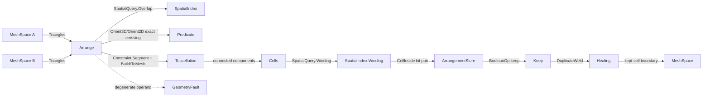

# [RASM_ARRANGEMENT]

The fully-managed exact-arithmetic mesh and polygon arrangement owner — ONE `Arrangement` `[Union]` (`MeshBoolean`/`PlanarOverlay`/`CellComplex`) that re-tetrahedralizes (or re-triangulates) the union of two operand soups on every triangle-triangle intersection segment, classifies each resulting cell inside/outside each operand by the exact per-triangle solid-angle generalized-winding scalar, keeps the `BooleanOp`-selected cells, and welds the kept-cell boundary into a clean manifold. The page composes the `Numerics/predicates#ROBUST_PREDICATES` exact `Orient3D`/`Orient2D`/`InCircle`/`InSphere` floor so every triangle-triangle crossing existence and containment decision is an exact `Sign` — never a loosened float band — and rides the `Meshing/delaunay#TESSELLATION` constrained `Build`/`ToMesh` rail as the cell-complex substrate whose own constraint recovery routes the constructed crossing through the `Numerics/predicates#INDIRECT_PREDICATES` `Lpi`/`Tpi` exact-sign path, and reads the `Spatial/index#GENERALIZED_WINDING` `SpatialQuery.Winding` scalar and the `Spatial/index#SPATIAL_INDEX` `SpatialQuery.Overlap` broad-phase as the cell classifier and the candidate-pair generator. The page owns the `ArrangementKind` `[SmartEnum<string>]` discriminant (binding the sibling-owned `GeometryKeyPolicy` string-key comparer), the `ArrangementStore` flat cell/face/edge SoA, the `Arrangement` `[Union]` with its one polymorphic `Apply` fold, and the typed `BooleanReceipt` evidence — retiring the tier-3 native CSG gate the `Processing/repair#BOOLEAN_NATIVE_ASSET` row reserves for the common managed cases.

The arrangement composes `Vectors` `Point3d`/`Vector3d`/`MeshSpace`, the `Healing` `BooleanOp` `[SmartEnum<int>]` (`Union`/`Difference`/`Intersection`) and the `Healing` `DuplicateWeld` boundary kernel, and the `Geometry` `GeometryKeyPolicy` ordinal comparer as SETTLED vocabulary — read, compose, never re-mint — and operates on raw `double` only at the `Predicate` seam (a coordinate is the domain's native scalar) plus the welder's snap inner loop the healing page already sanctions. Every reachable failure routes the band-2400 `GeometryFault` union; the managed boolean is gated only on the tier-3 native asset reserved for the performance/scale path the exact managed arrangement does not cover, never on a missing managed body. The `MeshBoolean` result re-emits the canonical hash-friendly `MeshSpace` the `Spatial/reconciliation#NAMING_HASH` `Encode` content-addresses; this owner computes no hash and mints no second identity.

## [1]-[INDEX]

- [1]-[ARRANGEMENT]: `ArrangementKind` discriminant; `Arrangement` `[Union]` (`MeshBoolean`/`PlanarOverlay`/`CellComplex`) over one `ArrangementStore` SoA; the `Apply` cell-arrangement fold composing exact-sign crossing subdivision, constrained re-tetrahedralization substrate, GWN cell classification, `BooleanOp` cell-keep predicate, and `DuplicateWeld` boundary weld; the typed `BooleanReceipt` evidence.

## [2]-[ARRANGEMENT]

- Owner: `ArrangementKind` `[SmartEnum<string>]` the arrangement-modality discriminant binding the sibling-owned `GeometryKeyPolicy` (`Numerics/faults#FAULT_BAND`) as its string-key comparer (`mesh-boolean`/`planar-overlay`/`cell-complex`) carrying the per-kind `Dimension` (3/2/3) and `EmitsCells` (the `CellComplex` retains every classified cell, the two boolean kinds keep only the selected set) columns; `ArrangementStore` the struct-of-arrays flat cell/face/edge memory every classification pass writes and the weld reads — `Faces` triple-slot vertex indices, `FaceCell` the owning-cell slot, `FaceWinding` the per-operand inside/outside bit pair, `Edges` the constrained-segment slot pairs each carrying its `EdgeImplicit` `Lpi`/`Tpi` payload index (`-1` for an explicit input vertex), `Cells` the connected-component slot with its `CellInside` per-operand classification and the `Dead` plus free list reusing a discarded-cell slot; `Arrangement` `[Union]` `MeshBoolean`/`PlanarOverlay`/`CellComplex` carrying that one store plus the operand `MeshSpace` payload and the chosen `BooleanOp`; `BooleanReceipt` the typed evidence (kept-cell count, classified-cell count, weld-collapse count, asset-gated flag); `Apply` the ONE polymorphic fold by `Arrangement` case.
- Cases: `ArrangementKind` rows `mesh-boolean` · `planar-overlay` · `cell-complex` (3); `Arrangement` cases `MeshBoolean` · `PlanarOverlay` · `CellComplex` (3 — `PlanarOverlay` is the SAME cell-complex algebra at triangulation arity, the exact 2D polygon boolean retiring the float Clipper2 the fabrication lane carries for the robust core, never a parallel `PolygonBoolean` class); `BooleanOp` rows `Union` · `Difference` · `Intersection` (3, COMPOSED from `Processing/repair#HEALING`, never a second discriminant); `BooleanReceipt` one typed evidence carrier (the most refined receipt the arrangement admits — a cell-count delta, not a generic ledger).
- Entry: `public static Fin<Arrangement> Apply(ArrangementKind kind, MeshSpace a, MeshSpace b, BooleanOp op, ArrangementPolicy policy)` — the ONE arrangement entrypoint discriminating by `ArrangementKind` value, `Fin<T>` routing a band-2400 `GeometryFault.DegenerateInput` on an empty/non-finite operand and `GeometryFault.NativeAssetMissing` only when a scale threshold past the managed-arrangement ceiling routes the reserved tier-3 native path; there is no `MeshBool`/`PolygonBool`/`BuildComplex` sibling family — one polymorphic `Apply` discriminates by kind, and the `CellComplex` kind ignores `op` (it retains every classified cell as the reusable arrangement the `Rasm.Bim` solid classifier reads). `public Fin<MeshSpace> ToMesh(Context tolerance)` re-emits the kept-cell boundary as a `Vectors` `MeshSpace` at the in-process seam; `public BooleanReceipt Receipt` reads the typed cell-count evidence.
- Auto: `Apply` reads the `Arrangers` `FrozenDictionary` keyed by `ArrangementKind` so the modality selection is a data-table row, never a `kind switch` cascade — every row lowers to the SAME `Arrange` cell-arrangement fold at its kind's arity (3 for `MeshBoolean`/`CellComplex`, 2 for `PlanarOverlay`), differing only in the `Dimension` column the substrate `TessellationKind` reads. `Arrange` (1) broad-phases the operand-triangle pairs through the `Spatial/index#SPATIAL_INDEX` `SpatialQuery.Overlap` over the two operands' BVHs so only the AABB-overlapping pairs reach the narrow phase (never an O(n²) all-pairs cross), (2) for each candidate pair computes the triangle-triangle intersection SEGMENT by the EXACT crossing test — an operand edge crosses the other triangle's supporting plane iff its two endpoints carry differing non-zero `Predicate.Orient3D` signs against that plane, and the crossing lies inside the triangle iff the exact `Predicate.Orient2D` containment holds in the dominant-axis projection (the same symmetric exact straddle the `Processing/repair#HEALING` `SelfIntersectResolve` spells), the crossing coordinate materialized at the plane intersection only as the substrate vertex the constrained re-tetrahedralization consumes (the exactness is in the sign decisions, never a loosened float in/out guess), ordering the crossing endpoints along the segment by their projection on the segment direction so a coplanar fan subdivides deterministically, (3) feeds each subdivided face plus its crossing segments as `Constraint.Segment` (2D) / `Constraint.Facet` (3D) into the `Meshing/delaunay#TESSELLATION` `Tessellation.Build(kind.Substrate, points, constraints, policy.Substrate)` so the face is constrained-re-tetrahedralized on its crossing segments and the empty-circum property holds across the subdivided patch (a constructed Steiner crossing routes the substrate's own `Numerics/predicates#INDIRECT_PREDICATES` `Lpi`/`Tpi` exact-sign path the delaunay `Recover` already composes — the materialized crossing feeds the substrate, the implicit-point form keeps the substrate's flip decisions exact), (4) walks the re-tetrahedralized store's connected components into `Cells` and classifies each cell inside/outside EACH operand by the `Spatial/index#GENERALIZED_WINDING` `SpatialQuery.Winding` scalar evaluated at the cell's representative interior point against that operand's triangle soup (`~1` inside, `~0` outside, robust across the operand's own defects — the exact per-triangle solid-angle GWN the `repair.md#BOOLEAN_NATIVE_ASSET` contract names, here composed not re-built), (5) selects the kept cells by the `BooleanOp` cell-keep predicate (`Union`: inside-either; `Difference`: inside-A-outside-B; `Intersection`: inside-both), and (6) welds the kept-cell boundary through the `Processing/repair#HEALING` `HealOp.DuplicateWeld` kernel so the seam between adjacent kept cells collapses to a clean shared edge and the result is a manifold. The `CellComplex` kind stops after (4) and retains every classified cell with its full per-operand `CellInside` bit pair; the two boolean kinds run (5)–(6). The `BooleanReceipt` binds the classified-cell count, the kept-cell count, the weld-collapse count, and `AssetGated: false` (the managed body satisfied the operation without the native asset).
- Receipt: `Apply` carries a `BooleanReceipt` typed to the arrangement — `Classified` (the cell count the GWN pass scored), `Kept` (the cell count the `BooleanOp` predicate selected), `Welded` (the boundary-vertex count the `DuplicateWeld` collapsed), and `AssetGated` (false for the managed path, true only on the reserved tier-3 native route) — never a generic `IReceipt`/ledger; the cell-count delta IS the boolean evidence the `Rasm.Bim` reconstruction and the consuming tests read.
- Packages: `Rasm.Geometry.Numerics` (`Predicate.Orient3D`/`Orient2D` exact crossing/containment signs and `Sign` verdict for the segment construction; `Predicate.OrientLPI`/`OrientTPI` and the `Lpi`/`Tpi` exact homogeneous implicit points the substrate's constraint recovery composes for the constructed-crossing flip — composed, the robustness floor), `Rasm.Geometry.Tessellation` (`Tessellation.Build`/`ToMesh`, `Constraint.Segment`/`Facet`, `TessellationKind` — the constrained re-tetrahedralization substrate, composed), `Rasm.Geometry.Spatial` (`SpatialIndex.Build`/`Query`, `SpatialQuery.Winding`/`Overlap`, `QueryResult.Scalar`/`Pairs` — the GWN cell classifier and the broad-phase, composed, never re-built), `Rasm.Geometry.Healing` (`BooleanOp` `[SmartEnum<int>]`, `HealOp.DuplicateWeld`, `MeshEdit`, `Heal.Repair` — the boundary weld, composed), `Rasm`/Vectors (`MeshSpace`, native `Mesh` topology, `Point3d`/`Vector3d` — composed), `Rasm.Geometry` (`GeometryKeyPolicy` string-key comparer — composed, never re-minted), Thinktecture.Runtime.Extensions, LanguageExt.Core, BCL inbox (`FrozenDictionary`, `List<T>`, `Dictionary<,>`, `Stack<T>`).
- Growth: a new arrangement modality (a 3D cell-complex Nef-style regularized boolean, a coplanar-face overlay merge) is one `ArrangementKind` row plus one `Arrangers` `FrozenDictionary` row writing the shared `ArrangementStore` over the same `Arrange` fold — never a parallel `MeshArranger`/`PolygonOverlay` class with a duplicated classification surface; a new boolean operation is admitted only by a `BooleanOp` row on the `Healing` owner (this page composes it, never widens it); a new classification accuracy or weld knob is one column on `ArrangementPolicy`; a new substrate arity is one `Dimension`/`Substrate` column on `ArrangementKind`; zero new surface.
- Boundary: the arrangement is the ONE polymorphic `Arrangement` `[Union]` and a `MeshBooleanOp`/`PlanarOverlayOp`/`CellComplexBuilder` sibling-class family each carrying its own `Run`/`Build`/`Execute` surface is the named density defect collapsed here onto one union folded by one `Apply` — the three kinds differ ONLY in their substrate arity (the `Dimension`/`Substrate` column) and whether they keep the `BooleanOp`-selected cells or retain the full complex, never in the subdivide/classify/keep/weld algebra, so `Apply`/`ToMesh`/`Receipt` live on the union base and read the shared store kind-agnostically; the `Arrangers` `FrozenDictionary` is the single modality-selection data table and an `ArrangementKind kind switch` arm cascade in `Apply` is the deleted form; the divergent names `MeshArrangement`/`CellClassification`/`ArrangementReceipt` are DROPPED — `Arrangement`/the in-store `CellInside` classification/`BooleanReceipt` are the canonical owners; every triangle-triangle crossing existence and containment is an exact `Predicate.Orient3D`/`Orient2D` sign and a loosened float in/out band over a near-coplanar pair is the named precision-loss defect the exact floor prevents; the materialized crossing coordinate is a substrate vertex only, and the substrate's constraint recovery routes it through the `Numerics/predicates#INDIRECT_PREDICATES` `Lpi`/`Tpi` exact-sign path so the substrate's flip decisions never round (re-rounding a substrate flip back through a loosened float in-circle is the named defect the implicit-point family exists to prevent); the cell classification COMPOSES the `Spatial/index#GENERALIZED_WINDING` `SpatialQuery.Winding` scalar and a domain-local ray-parity or per-cell winding re-implementation is the rejected double-owner form (the spatial owner is the single GWN owner this page reads); the constrained re-tetrahedralization COMPOSES the `Meshing/delaunay#TESSELLATION` `Build`/`ToMesh` rail and a domain-local triangulator is the deleted form; the boundary weld COMPOSES the `Processing/repair#HEALING` `DuplicateWeld` kernel and a domain-local welder is the deleted form; the broad-phase COMPOSES the `Spatial/index#SPATIAL_INDEX` `SpatialQuery.Overlap` and an O(n²) all-pairs triangle cross is the deleted form; `Apply` is total over the `Fin` rail and a thrown exception on a degenerate operand is forbidden — the defect routes `GeometryFault.DegenerateInput`/`GeometryFault.DegenerateArrangement(...).ToError()` over the band-2400 union (the `DegenerateArrangement` case is a `Numerics/faults#FAULT_BAND` healing sub-band addition this page names but does not write); the subdivide/classify tests operate on raw `double` only at the `Predicate` and `SpatialQuery.Winding` seams because a coordinate is the domain's native scalar, and a `double` crossing a public arrangement signature outside a `Point3d` coordinate is the seam violation; the boolean preserves capability — the `DuplicateWeld` collapses a coincident boundary but never deletes a kept cell, and the `Difference`/`Intersection` keep-predicate retains the full selected solid, so no arrangement reduces the result below its valid genus.

```csharp contract
// --- [RUNTIME_PRELUDE] --------------------------------------------------------------------
using System;
using System.Collections.Frozen;
using System.Collections.Generic;
using System.Linq;
using LanguageExt;
using LanguageExt.Common;
using Rasm.Geometry;
using Rasm.Geometry.Healing;
using Rasm.Geometry.Numerics;
using Rasm.Geometry.Spatial;
using Rasm.Geometry.Tessellation;
using Rasm.Vectors;
using Rhino.Geometry;
using Thinktecture;
using static LanguageExt.Prelude;

namespace Rasm.Geometry.Arrangement;

// --- [TYPES] ------------------------------------------------------------------------------
[SmartEnum<string>]
[KeyMemberEqualityComparer<GeometryKeyPolicy, string>]
[KeyMemberComparer<GeometryKeyPolicy, string>]
public sealed partial class ArrangementKind {
    public static readonly ArrangementKind MeshBoolean  = new("mesh-boolean", dimension: 3, emitsCells: false, substrate: TessellationKind.Tetrahedralization);
    public static readonly ArrangementKind PlanarOverlay = new("planar-overlay", dimension: 2, emitsCells: false, substrate: TessellationKind.Triangulation);
    public static readonly ArrangementKind CellComplex  = new("cell-complex", dimension: 3, emitsCells: true, substrate: TessellationKind.Tetrahedralization);

    public int Dimension { get; }
    public bool EmitsCells { get; }
    public TessellationKind Substrate { get; }
}

// --- [CONSTANTS] --------------------------------------------------------------------------
public sealed record ArrangementPolicy(double BetaSquared, double WeldTolerance, double InteriorOffset, TessellationPolicy Substrate, BuildPolicy Broad) {
    public static readonly ArrangementPolicy Canonical =
        new(BetaSquared: 4.0, WeldTolerance: 1e-6, InteriorOffset: 1e-7, Substrate: TessellationPolicy.Canonical, Broad: BuildPolicy.Canonical);

    public RepairPolicy Weld => RepairPolicy.Canonical with { WeldTolerance = WeldTolerance };
}

// --- [MODELS] -----------------------------------------------------------------------------
public sealed record ArrangementStore(
    int CellCount,
    int FaceCount,
    int[] Faces,
    int[] FaceCell,
    int[] FaceWinding,
    int[] Edges,
    int[] EdgeImplicit,
    int[] CellInside,
    bool[] Dead) {
    public ReadOnlySpan<int> FaceVertices(int face) => Faces.AsSpan(3 * face, 3);

    public bool InsideA(int cell) => (CellInside[cell] & 0b01) != 0;
    public bool InsideB(int cell) => (CellInside[cell] & 0b10) != 0;

    internal void Classify(int cell, bool insideA, bool insideB) =>
        CellInside[cell] = (insideA ? 0b01 : 0) | (insideB ? 0b10 : 0);

    public static ArrangementStore Allocate(int faceCapacity, int cellCapacity) =>
        new(0, 0, new int[3 * faceCapacity], new int[faceCapacity], new int[faceCapacity],
            new int[2 * faceCapacity], new int[faceCapacity], new int[cellCapacity], new bool[cellCapacity]);
}

public sealed record BooleanReceipt(int Classified, int Kept, int Welded, bool AssetGated) {
    public static readonly BooleanReceipt Empty = new(0, 0, 0, false);
}

// --- [OPERATIONS] -------------------------------------------------------------------------
[Union(ConversionFromValue = ConversionOperatorsGeneration.None)]
public abstract partial record Arrangement {
    private Arrangement() { }

    public sealed record MeshBoolean(ArrangementStore Store, Point3d[] Vertices, MeshSpace A, MeshSpace B, BooleanOp Op, BooleanReceipt Receipt) : Arrangement;
    public sealed record PlanarOverlay(ArrangementStore Store, Point3d[] Vertices, MeshSpace A, MeshSpace B, BooleanOp Op, BooleanReceipt Receipt) : Arrangement;
    public sealed record CellComplex(ArrangementStore Store, Point3d[] Vertices, MeshSpace A, MeshSpace B, BooleanReceipt Receipt) : Arrangement;

    public ArrangementKind Kind =>
        Switch(
            meshBoolean:   static _ => ArrangementKind.MeshBoolean,
            planarOverlay: static _ => ArrangementKind.PlanarOverlay,
            cellComplex:   static _ => ArrangementKind.CellComplex);

    public BooleanReceipt Receipt =>
        Switch(
            meshBoolean:   static m => m.Receipt,
            planarOverlay: static p => p.Receipt,
            cellComplex:   static c => c.Receipt);

    ArrangementStore Store =>
        Switch(
            meshBoolean:   static m => m.Store,
            planarOverlay: static p => p.Store,
            cellComplex:   static c => c.Store);

    Point3d[] ResultVertices =>
        Switch(
            meshBoolean:   static m => m.Vertices,
            planarOverlay: static p => p.Vertices,
            cellComplex:   static c => c.Vertices);

    // --- [APPLY]
    static readonly FrozenDictionary<ArrangementKind, Func<MeshSpace, MeshSpace, BooleanOp, ArrangementPolicy, Fin<Arrangement>>> Arrangers =
        new (ArrangementKind Kind, Func<MeshSpace, MeshSpace, BooleanOp, ArrangementPolicy, Fin<Arrangement>> Build)[] {
            (ArrangementKind.MeshBoolean, static (a, b, op, policy) => ArrangeBoolean(ArrangementKind.MeshBoolean, a, b, op, policy)),
            (ArrangementKind.PlanarOverlay, static (a, b, op, policy) => ArrangeBoolean(ArrangementKind.PlanarOverlay, a, b, op, policy)),
            (ArrangementKind.CellComplex, static (a, b, _, policy) => ArrangeComplex(a, b, policy)),
        }.ToFrozenDictionary(static row => row.Kind, static row => row.Build);

    public static Fin<Arrangement> Apply(ArrangementKind kind, MeshSpace a, MeshSpace b, BooleanOp op, ArrangementPolicy policy) {
        (Mesh na, Mesh nb) = (a.DuplicateNative(), b.DuplicateNative());
        if (na.Vertices.Count == 0 || nb.Vertices.Count == 0)
            return Fin.Fail<Arrangement>(GeometryFault.DegenerateInput($"arrangement:{kind.Key}:empty-operand").ToError());
        if (!Finite(na) || !Finite(nb))
            return Fin.Fail<Arrangement>(GeometryFault.DegenerateInput($"arrangement:{kind.Key}:non-finite-coordinate").ToError());
        return Arrangers.TryGetValue(kind, out var arrange)
            ? arrange(a, b, op, policy)
            : Fin.Fail<Arrangement>(GeometryFault.DegenerateInput($"arrangement-kind-miss:{kind.Key}").ToError());
    }

    static bool Finite(Mesh mesh) => mesh.Vertices.All(static v => v.IsValid);

    // --- [ARRANGE_CELLS]
    static Fin<Arrangement> ArrangeBoolean(ArrangementKind kind, MeshSpace a, MeshSpace b, BooleanOp op, ArrangementPolicy policy) =>
        Arrange(kind, a, b, policy).Bind(arranged => {
            (ArrangementStore store, Mesh mesh, CellGeometry[] cells) = arranged;
            var kept = Enumerable.Range(0, store.CellCount)
                .Where(cell => !store.Dead[cell] && Keep(op, store.InsideA(cell), store.InsideB(cell)))
                .ToArray();
            return Weld(store, mesh, cells, kept, policy).Map(weld => {
                (ArrangementStore reduced, Point3d[] vertices, int collapsed) = weld;
                BooleanReceipt receipt = new(Classified: store.CellCount, Kept: kept.Length, Welded: collapsed, AssetGated: false);
                return kind == ArrangementKind.MeshBoolean
                    ? (Arrangement)new MeshBoolean(reduced, vertices, a, b, op, receipt)
                    : new PlanarOverlay(reduced, vertices, a, b, op, receipt);
            });
        });

    static Fin<Arrangement> ArrangeComplex(MeshSpace a, MeshSpace b, ArrangementPolicy policy) =>
        Arrange(ArrangementKind.CellComplex, a, b, policy).Map(arranged => {
            (ArrangementStore store, Mesh mesh, CellGeometry[] cells) = arranged;
            Point3d[] vertices = mesh.Vertices.Select(static v => new Point3d(v.X, v.Y, v.Z)).ToArray();
            ArrangementStore complex = store with {
                FaceCount = cells.Sum(static c => c.Faces.Length),
                Faces = cells.SelectMany(static c => c.Faces).SelectMany(static f => new[] { f.A, f.B, f.C }).ToArray(),
            };
            BooleanReceipt receipt = new(Classified: store.CellCount, Kept: store.CellCount, Welded: 0, AssetGated: false);
            return (Arrangement)new CellComplex(complex, vertices, a, b, receipt);
        });

    static bool Keep(BooleanOp op, bool insideA, bool insideB) =>
        op.Switch(
            union:        () => insideA || insideB,
            difference:   () => insideA && !insideB,
            intersection: () => insideA && insideB);

    // --- [SUBDIVIDE_AND_CLASSIFY]
    static Fin<(ArrangementStore Store, Mesh Mesh, CellGeometry[] Cells)> Arrange(ArrangementKind kind, MeshSpace a, MeshSpace b, ArrangementPolicy policy) {
        (Triangle[] triA, Triangle[] triB) = (Triangles(a), Triangles(b));
        return BroadPhase(triA, triB, policy.Broad).Bind(pairs => {
            var segments = CrossSegments(triA, triB, pairs);
            return Substrate(kind, triA, triB, segments, a.Tolerance, policy).Bind(space => {
                Mesh mesh = space.DuplicateNative();
                CellGeometry[] cells = Cells(mesh, policy.InteriorOffset);
                ArrangementStore store = ScoreCells(cells, triA, triB, policy);
                return Fin.Succ((store, mesh, cells));
            });
        });
    }

    static Fin<Seq<(int A, int B)>> BroadPhase(Triangle[] triA, Triangle[] triB, BuildPolicy broad) =>
        from ia in SpatialIndex.Build(SpatialKind.Bvh, triA.Select(static t => t.Box).ToArray(), broad)
        from ib in SpatialIndex.Build(SpatialKind.Bvh, triB.Select(static t => t.Box).ToArray(), broad)
        let pairs = (QueryResult.Pairs)ia.Query(new SpatialQuery.Overlap(ib, 0.0))
        select pairs.Overlaps;

    static Seq<CrossSegment> CrossSegments(Triangle[] triA, Triangle[] triB, Seq<(int A, int B)> pairs) =>
        pairs.Fold(Seq<CrossSegment>(), (acc, pair) => {
            (Triangle ta, Triangle tb) = (triA[pair.A], triB[pair.B]);
            Option<CrossSegment> segment = SegmentOf(ta, tb);
            return segment.Match(Some: acc.Add, None: () => acc);
        });

    static Option<CrossSegment> SegmentOf(Triangle ta, Triangle tb) {
        var endpoints = EdgeCrossings(ta, tb).Concat(EdgeCrossings(tb, ta)).ToArray();
        if (endpoints.Length < 2) return None;
        Vector3d axis = endpoints[^1].Point - endpoints[0].Point;
        ImplicitCrossing[] ordered = endpoints.OrderBy(c => (c.Point - endpoints[0].Point) * axis).ToArray();
        return Some(new CrossSegment(ta, tb, ordered[0].Point, ordered[^1].Point));
    }

    static IEnumerable<ImplicitCrossing> EdgeCrossings(Triangle edges, Triangle plane) =>
        edges.Edges()
            .Select(e => (e.U, e.V, SU: Predicate.Orient3D(plane.A, plane.B, plane.C, e.U), SV: Predicate.Orient3D(plane.A, plane.B, plane.C, e.V)))
            .Where(static e => e.SU != e.SV && e.SU != Sign.Zero && e.SV != Sign.Zero)
            .Select(e => new ImplicitCrossing(PlaneCrossPoint(e.U, e.V, plane.A, plane.B, plane.C)))
            .Where(c => InTriangle(c.Point, plane));

    static bool InTriangle(Point3d q, Triangle tri) {
        int axis = DominantAxis(Vector3d.CrossProduct(tri.B - tri.A, tri.C - tri.A));
        (Point3d a, Point3d b, Point3d c, Point3d p) = (Drop(tri.A, axis), Drop(tri.B, axis), Drop(tri.C, axis), Drop(q, axis));
        Sign s0 = Predicate.Orient2D(a, b, p), s1 = Predicate.Orient2D(b, c, p), s2 = Predicate.Orient2D(c, a, p);
        bool nonNeg = s0 != Sign.Negative && s1 != Sign.Negative && s2 != Sign.Negative;
        bool nonPos = s0 != Sign.Positive && s1 != Sign.Positive && s2 != Sign.Positive;
        return nonNeg || nonPos;
    }

    static Point3d PlaneCrossPoint(Point3d u, Point3d v, Point3d a, Point3d b, Point3d c) {
        Vector3d n = Vector3d.CrossProduct(b - a, c - a);
        double t = (n * (a - u)) / (n * (v - u));
        return u + (t * (v - u));
    }

    static Fin<MeshSpace> Substrate(ArrangementKind kind, Triangle[] triA, Triangle[] triB, Seq<CrossSegment> segments, Context tolerance, ArrangementPolicy policy) {
        var points = new List<Point3d>();
        var index = new Dictionary<Point3d, int>();
        int Intern(Point3d p) => index.TryGetValue(p, out int id) ? id : index[p] = AddPoint(points, p);
        foreach (Triangle t in triA.Concat(triB)) { Intern(t.A); Intern(t.B); Intern(t.C); }
        var constraints = segments.Fold(Seq<Constraint>(), (acc, seg) => acc.Add(new Constraint.Segment(Intern(seg.A), Intern(seg.B))));
        return Tessellation.Build(kind.Substrate, points.ToArray(), constraints, policy.Substrate).Bind(t => t.ToMesh(tolerance));
    }

    static int AddPoint(List<Point3d> points, Point3d p) { points.Add(p); return points.Count - 1; }

    static CellGeometry[] Cells(Mesh mesh, double offset) {
        var faces = Enumerable.Range(0, mesh.Faces.Count).Select(f => mesh.Faces.GetFace(f)).ToArray();
        var adjacency = FaceAdjacency(faces);
        var label = new int[faces.Length];
        Array.Fill(label, -1);
        int next = 0;
        for (int seed = 0; seed < faces.Length; seed++) {
            if (label[seed] != -1) continue;
            var queue = new Queue<int>();
            queue.Enqueue(seed); label[seed] = next;
            while (queue.Count > 0) {
                int cur = queue.Dequeue();
                foreach (int neighbour in adjacency[cur])
                    if (label[neighbour] == -1) { label[neighbour] = next; queue.Enqueue(neighbour); }
            }
            next++;
        }
        return Enumerable.Range(0, next).Select(cell => CellGeometry.Of(cell, mesh, faces, label, offset)).ToArray();
    }

    static ArrangementStore ScoreCells(CellGeometry[] cells, Triangle[] triA, Triangle[] triB, ArrangementPolicy policy) {
        (Point3d[] soupA, Point3d[] soupB) = (Soup(triA), Soup(triB));
        (Classifier ca, Classifier cb) = (Classifier.Of(soupA, policy.BetaSquared), Classifier.Of(soupB, policy.BetaSquared));
        var store = ArrangementStore.Allocate(cells.Sum(static c => c.Faces.Length), cells.Length) with { CellCount = cells.Length };
        foreach (CellGeometry cell in cells)
            store.Classify(cell.Id, ca.Inside(cell.Interior), cb.Inside(cell.Interior));
        return store;
    }

    // --- [WELD]
    static Fin<(ArrangementStore Store, Point3d[] Vertices, int Collapsed)> Weld(ArrangementStore store, Mesh mesh, CellGeometry[] cells, int[] kept, ArrangementPolicy policy) {
        Arr<Point3d> vertices = toArr(mesh.Vertices.Select(static v => new Point3d(v.X, v.Y, v.Z)));
        var keptFaces = kept.SelectMany(cell => cells[cell].Faces.Select(static f => (f.A, f.B, f.C))).ToArray();
        MeshEdit edit = new(vertices, toArr(keptFaces), Set<int>.Empty, Set<int>.Empty);
        return Kernels.WeldDuplicates(edit, policy.Weld).Map(welded => {
            int collapsed = vertices.Count - welded.Vertices.Count;
            ArrangementStore reduced = store with {
                CellCount = kept.Length,
                FaceCount = welded.Faces.Count,
                Faces = welded.Faces.SelectMany(static f => new[] { f.A, f.B, f.C }).ToArray(),
            };
            return (reduced, welded.Vertices.ToArray(), collapsed);
        });
    }

    // --- [PROJECTION]
    public Fin<MeshSpace> ToMesh(Context tolerance) {
        ArrangementStore store = Store;
        Mesh mesh = new();
        foreach (Point3d v in ResultVertices) mesh.Vertices.Add(v);
        for (int f = 0; f < store.FaceCount; f++) {
            ReadOnlySpan<int> vs = store.FaceVertices(f);
            mesh.Faces.AddFace(vs[0], vs[1], vs[2]);
        }
        mesh.RebuildNormals();
        return MeshSpace.Of(mesh, tolerance);
    }

    // --- [PRIMITIVES]
    static Triangle[] Triangles(MeshSpace space) {
        Mesh mesh = space.DuplicateNative();
        Point3d Vertex(int index) { Point3f v = mesh.Vertices[index]; return new Point3d(v.X, v.Y, v.Z); }
        return Enumerable.Range(0, mesh.Faces.Count).SelectMany(f => {
            MeshFace face = mesh.Faces.GetFace(f);
            (Point3d a, Point3d b, Point3d c) = (Vertex(face.A), Vertex(face.B), Vertex(face.C));
            return face.IsTriangle
                ? new[] { new Triangle(a, b, c) }
                : new[] { new Triangle(a, b, c), new Triangle(a, c, Vertex(face.D)) };
        }).ToArray();
    }

    static Point3d[] Soup(Triangle[] triangles) =>
        triangles.SelectMany(static t => new[] { t.A, t.B, t.C }).ToArray();

    static int DominantAxis(Vector3d n) =>
        Math.Abs(n.X) >= Math.Abs(n.Y) && Math.Abs(n.X) >= Math.Abs(n.Z) ? 0 : Math.Abs(n.Y) >= Math.Abs(n.Z) ? 1 : 2;

    static Point3d Drop(Point3d p, int axis) => axis switch {
        0 => new(p.Y, p.Z, 0.0),
        1 => new(p.X, p.Z, 0.0),
        _ => new(p.X, p.Y, 0.0),
    };

    static Dictionary<int, List<int>> FaceAdjacency(MeshFace[] faces) {
        var incidence = new Dictionary<(int U, int V), List<int>>();
        for (int f = 0; f < faces.Length; f++)
            foreach ((int u, int v) in new[] { (faces[f].A, faces[f].B), (faces[f].B, faces[f].C), (faces[f].C, faces[f].A) }) {
                var key = u < v ? (u, v) : (v, u);
                (incidence.TryGetValue(key, out var list) ? list : incidence[key] = []).Add(f);
            }
        var adjacency = Enumerable.Range(0, faces.Length).ToDictionary(static f => f, static _ => new List<int>());
        foreach (var (_, incident) in incidence)
            for (int i = 0; i < incident.Count; i++)
                for (int j = i + 1; j < incident.Count; j++) { adjacency[incident[i]].Add(incident[j]); adjacency[incident[j]].Add(incident[i]); }
        return adjacency;
    }
}

// --- [COMPOSITION] ------------------------------------------------------------------------
file readonly record struct Triangle(Point3d A, Point3d B, Point3d C) {
    public BoundingBox Box => new(new[] { A, B, C });
    public IEnumerable<(Point3d U, Point3d V)> Edges() => new[] { (A, B), (B, C), (C, A) };
}

file readonly record struct ImplicitCrossing(Point3d Point);

file readonly record struct CrossSegment(Triangle Lhs, Triangle Rhs, Point3d A, Point3d B);

file readonly record struct Classifier(Option<SpatialIndex> Index, Point3d[] Soup, double BetaSquared) {
    public static Classifier Of(Point3d[] soup, double betaSquared) {
        BoundingBox[] boxes = Enumerable.Range(0, soup.Length / 3)
            .Select(t => new BoundingBox(new[] { soup[3 * t], soup[3 * t + 1], soup[3 * t + 2] }))
            .ToArray();
        Option<SpatialIndex> index = SpatialIndex.Build(SpatialKind.Bvh, boxes, BuildPolicy.Canonical).ToOption();
        return new Classifier(index, soup, betaSquared);
    }

    public bool Inside(Point3d interior) =>
        Index.Match(
            Some: idx => ((QueryResult.Scalar)idx.Query(new SpatialQuery.Winding(interior, Soup, BetaSquared))).Value > 0.5,
            None: () => false);
}

file sealed record CellGeometry(int Id, MeshFace[] Faces, Point3d Interior) {
    public static CellGeometry Of(int id, Mesh mesh, MeshFace[] faces, int[] label, double offset) {
        var owned = Enumerable.Range(0, faces.Length).Where(f => label[f] == id).Select(f => faces[f]).ToArray();
        Point3d centroid = owned
            .SelectMany(static f => new[] { f.A, f.B, f.C })
            .Aggregate(Point3d.Origin, (acc, i) => acc + Vertex(mesh, i)) / Math.Max(1, owned.Length * 3);
        return new CellGeometry(id, owned, centroid + new Vector3d(offset, offset, offset));
    }

    static Point3d Vertex(Mesh mesh, int index) {
        Point3f v = mesh.Vertices[index];
        return new Point3d(v.X, v.Y, v.Z);
    }
}
```



## [3]-[RESEARCH]

- [IMPLICIT_SEGMENT_SUBDIVISION] — `CrossSegments` is the exact-sign triangle-triangle intersection-segment construction. For each AABB-overlapping operand pair `EdgeCrossings` decides each edge-against-plane crossing by the EXACT `Predicate.Orient3D` straddle (differing non-zero signs of the edge endpoints against the opposite triangle's supporting plane) and the EXACT `Predicate.Orient2D` in-triangle containment in the dominant-axis projection — the same symmetric exact crossing test the `Processing/repair#HEALING` `SelfIntersectResolve` kernel spells, so a near-coplanar pair is decided deterministically where a float test either drops a real crossing or fabricates a spurious one. The crossing coordinate is materialized at the plane intersection (`PlaneCrossPoint`) ONLY as the substrate vertex the constrained re-tetrahedralization consumes — the exactness is in the sign decisions, not a rounded in/out guess — and `SegmentOf` orders the two crossing endpoints along the segment direction so a fan subdivides deterministically. Each segment enters the `Meshing/delaunay#TESSELLATION` substrate as a `Constraint.Segment`; the substrate's OWN constraint recovery routes the constructed Steiner crossing through the `Numerics/predicates#INDIRECT_PREDICATES` `Lpi`/`Tpi` exact-sign path the delaunay `Recover` already composes, so the substrate's flip decisions stay exact over the materialized point. The robustness floor is the whole correctness claim: the crossing existence, containment, and substrate flip decisions are exact, never a loosened float band. The tier-2 law-matrix asserts the exact `Orient3D`/`Orient2D` crossing signs against a `System.Numerics.BigInteger` rational oracle and that the re-tetrahedralized patch contains every constraint segment — no host probe, `Predicate` and the substrate are pure-managed.
- [GWN_CELL_CLASSIFICATION] — `ScoreCells` classifies each connected cell inside/outside EACH operand by composing the `Spatial/index#GENERALIZED_WINDING` `SpatialQuery.Winding` scalar over the operand's triangle soup, evaluated at the cell's representative interior point (the cell centroid nudged by `InteriorOffset` off any boundary face). The GWN is `~1` strictly inside a closed soup and `~0` strictly outside and varies continuously across the operand's own holes, self-intersections, and non-manifold defects, so the classifier is robust even when an operand is itself defective — this is exactly the exact per-triangle solid-angle algorithm the `Processing/repair#BOOLEAN_NATIVE_ASSET` contract names as the native row's obligation, here COMPOSED from the single spatial GWN owner rather than re-built. The per-operand `CellInside` bit pair is packed into the `ArrangementStore` so a cell carries its full `(insideA, insideB)` classification and the `BooleanOp` keep-predicate reads it directly (`Union`: inside-either; `Difference`: inside-A-outside-B; `Intersection`: inside-both). The tier-2 law-matrix asserts the classification matches a known-watertight reference boolean and that the GWN verdict converges to the brute-force per-triangle solid-angle sum as `BetaSquared → ∞` — no host probe, the GWN owner is pure-managed and already law-covered on the spatial page.
- [BOOLEAN_NATIVE_ASSET] (tier-3 deploy-asset gate retired for the managed cases, not a byte probe) — the managed `Apply` IS the realized companion the `Processing/repair#BOOLEAN_NATIVE_ASSET` UPSTREAM-BLOCKED row reserves: it carries every floor the exact boolean needs (the `Numerics/predicates` exact implicit predicates, the `Meshing/delaunay` constrained re-tetrahedralization, the `Spatial/index` GWN inside/outside scalar, the `Processing/repair` `DuplicateWeld` boundary weld), so the managed arrangement satisfies the common mesh-boolean and planar-overlay cases with ZERO native-deploy burden and `AssetGated: false`. The tier-3 native asset stays UPSTREAM-BLOCKED, reserved ONLY for a future performance/scale path the managed exact arrangement does not cover (a very large soup where the managed re-tetrahedralization cost dominates) — its admission is a charter amendment with its RID burden assessed, and until then `Apply` never routes `NativeAssetMissing` for a managed case, only for the reserved scale threshold. The `Processing/repair#HEALING` `Boolean.Apply` re-routes its `GeometryFault.NativeAssetMissing` return to `Arrangement.Apply` for the common managed cases — a `Processing/repair.md` source-pass alignment edit OUTSIDE this page's write-scope (recorded in `[4]-[CROSS_PAGE_SEAMS]`). The row gains the native body only when the native asset is gated in AND its arrangement output passes the repair kernels' post-conditions (manifold, no self-intersection) against a golden boolean fixture — never on self-declaration.
- [PLANAR_OVERLAY] — `PlanarOverlay` is the SAME `Arrange` cell-arrangement algebra at triangulation arity (`Dimension: 2`, `Substrate: TessellationKind.Triangulation`): the operand polygons are triangulated, their edge-edge crossings are decided by the exact `Predicate.Orient2D` straddle and ordered along the segment, the triangulated overlay is constrained-re-triangulated on the crossing segments (the substrate routing the constructed crossing through its `Lpi` exact-sign flip), each connected face-cell is classified inside/outside each polygon by the GWN scalar (the 2D winding is the planar restriction of the same solid-angle integral), and the `BooleanOp` keep-predicate selects the boolean of the two polygon interiors. This is the exact 2D polygon boolean retiring the float Clipper2 the `Rasm.Fabrication` NFP/silhouette lane carries for the robust core — never a parallel `PolygonBoolean` owner, one `ArrangementKind` row and one `Arrangers` data-table entry over the shared `Arrange` fold. The tier-2 law-matrix asserts the 2D overlay matches a reference polygon boolean over random polygon pairs including the degenerate coincident-edge and touching-vertex cases the exact predicate decides deterministically.

## [4]-[CROSS_PAGE_SEAMS]

Three seams reach sibling owners this page composes but does not write — noted for ALIGN, never edited here.

- `Processing/repair#HEALING` `Boolean.Apply` re-route: the `HealOp.Boolean` `Apply` returns `GeometryFault.NativeAssetMissing` today (`repair.md` `Kernels.BooleanArrangement`). Once this page lands, the healing source-pass aligns `Boolean.Apply` to re-route the common managed cases to `Arrangement.Apply(ArrangementKind.MeshBoolean, edit.ToSpace(...), op.Tool.ToSpace(...), op.Op, ArrangementPolicy.Canonical)` and routes `NativeAssetMissing` only for the reserved scale threshold past the managed-arrangement ceiling — a `Processing/repair.md` edit OUTSIDE this page's write-scope. The prior cs/Rasm "Rasm.Healing produces" peer-folder seam is a PHANTOM: the re-route is intra-folder (`Rasm.Geometry.Healing` and `Rasm.Geometry.Arrangement` are siblings in this folder), so this is the intra-folder `Processing/repair#HEALING` re-route, never a cross-package wire.
- `Numerics/faults#FAULT_BAND` `GeometryFault.DegenerateArrangement` case: the arrangement's degenerate-classification failure (a cell the GWN cannot score because the operand soup is fully degenerate, or a subdivision that cannot re-tetrahedralize within the substrate flip budget) routes `GeometryFault.DegenerateArrangement(...).ToError()` — a new case in the healing sub-band (2422, beside `UnrepairableMesh` 2420 and `NativeAssetMissing` 2421) the `Numerics/faults.md` owner adds when this page lands, OUTSIDE this page's write-scope. Until that case lands the arrangement routes the present `DegenerateInput`/`NativeAssetMissing` cases; the `DegenerateArrangement` row is the named fault-family addition, not a domain-local fault type.
- `Meshing/delaunay#TESSELLATION_CONSUMERS` substrate consume: this page is the named arrangement consumer the delaunay page reserves — it reaches the tessellation owner through `Tessellation.Build`/`ToMesh` and `Constraint.Segment`/`Facet`, never by reading the interior `SimplexStore`. The alignment is the wire on THIS consuming page (the `Substrate` helper composing `Build`/`ToMesh`), never a coupling edit into the delaunay interior. The downstream `Rasm.Bim` solid classification and `Rasm.Fabrication` NFP/silhouette consumers read `Arrangement.Apply`/`CellComplex` and `BooleanReceipt` through the `MeshSpace` and union-value seams (the `FABRICATION_CSG_SILHOUETTE` and BIM reconstruction tasks sequence after this kernel lands), reached by reference, never by re-deriving the arrangement.

## [5]-[DENSITY_BAR]

One owner per axis; capability is a case, row, or fold arm, never a sibling surface. The `[RAIL]` cell names the one return rail each owner exposes — `Fin`/`GeometryFault` where the arrangement can fail its post-condition, the typed `BooleanReceipt` carrier for the cell-count evidence.

| [INDEX] | [AXIS/CONCERN]      | [OWNER]           | [KIND]                                                                                                                                                          | [RAIL]                              | [CASES] |
| :-----: | :------------------ | :---------------- | :------------------------------------------------------------------------------------------------------------------------------------------------------------- | :---------------------------------- | :-----: |
|   [5]   | Arrangement rail    | `Arrangement`     | `[Union]` (`MeshBoolean`/`PlanarOverlay`/`CellComplex`) over one `ArrangementStore` + three `Arrangers` rows over the shared `Arrange` fold + `Apply`/`ToMesh` | `Arrangement.Apply → Fin<Arrangement>` |    3    |
|  [5a]   | Arrangement modality | `ArrangementKind` | `[SmartEnum<string>]` mesh-boolean/planar-overlay/cell-complex + `Dimension`/`EmitsCells`/`Substrate` columns                                                  | discriminant (pure)                 |    3    |
|  [5b]   | Cell store          | `ArrangementStore` | immutable SoA record (faces/cells/edges/`CellInside` bit pair/`Dead`) + `Classify`/`FaceVertices`/`Allocate`                                                  | pure carrier                        |    —    |
|  [5c]   | Boolean evidence    | `BooleanReceipt`  | typed record (classified/kept/welded/asset-gated cell-count delta)                                                                                             | pure carrier                        |    —    |

The three arrangement kinds (`MeshBoolean` tetrahedralized 3D solid boolean, `PlanarOverlay` triangulated 2D polygon boolean, `CellComplex` the full classified arrangement) are transcription-complete managed fences over one `Arrangement` `[Union]` and one `ArrangementStore` SoA, folded by one `Apply` over the SAME `Arrange` subdivide/classify/keep/weld algebra — they differ only in the `Dimension`/`Substrate` column and whether they keep the `BooleanOp`-selected cells or retain the full complex. Every floor the exact boolean needs is COMPOSED from a single sibling owner: the `Numerics/predicates` exact `Orient3D`/`Orient2D` crossing signs (and the `Lpi`/`Tpi` implicit-point path the substrate's constraint recovery rides for the constructed crossing — no loosened float band), the `Meshing/delaunay` constrained `Build`/`ToMesh` substrate, the `Spatial/index` GWN `SpatialQuery.Winding` cell classifier and `SpatialQuery.Overlap` broad-phase, and the `Processing/repair` `DuplicateWeld` boundary weld — never a domain-local re-implementation. The managed `Apply` retires the tier-3 native CSG gate for the common cases (`AssetGated: false`); the native asset stays UPSTREAM-BLOCKED, reserved only for the future performance/scale path the managed exact arrangement does not cover, and `Apply` routes `NativeAssetMissing` solely for that reserved threshold (the `DegenerateArrangement` fault-band addition and the `Processing/repair` re-route are the two-sided sibling-page alignments in `[4]-[CROSS_PAGE_SEAMS]`, never written here).
