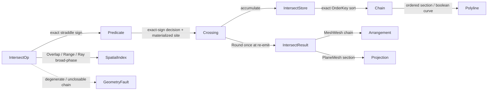

# [RASM_INTERSECTION_INTERSECT]

The predicate-exact intersection lattice that closes segment-segment, segment-triangle, triangle-triangle, ray-mesh, mesh-mesh, and plane-mesh crossing over ONE `IntersectOp` `[Union]` (`SegmentSegment`/`SegmentTriangle`/`TriangleTriangle`/`RayMesh`/`MeshMesh`/`PlaneMesh`) whose every case decides crossing existence and containment by the `Numerics/predicates#ROBUST_PREDICATES` exact `Orient3D`/`Orient2D` straddle sign — the exactness lives in the sign decisions, never a loosened float in/out band — and materializes the crossing point as the substrate `Point3d` site the result re-emits, ordered along its chain by the exact `Expansion` `OrderKey` so a near-tied crossing sorts deterministically. No external geometry library is admitted — the Guigue-Devillers exact triangle-triangle intersection, the edge-vs-plane segment-triangle hit, and the ordered crossing-chain assembly are authored from first principles over a flat `IntersectStore` value layout — and the narrow-phase exact test runs only on the `Spatial/index#GENERALIZED_WINDING` BVH candidate pairs the `SpatialQuery.Overlap`/`Range` broad-phase yields. The page owns the `IntersectKind` discriminant (binding the sibling-owned `GeometryKeyPolicy` string-key comparer), the `IntersectStore` struct-of-arrays crossing memory, the `Crossing` site-plus-exact-ordering-key value, the `IntersectOp` `[Union]` with its `Apply` rail, the `IntersectResult` typed result carrier, and the `ToPolylines`/`ToPoints` projections that re-emit the result through the `Vectors` `MeshSpace`/`Polyline` seam. It is the single exact-crossing owner the three inline epsilon-or-exact crossing tests scattered across `Processing/repair#HEALING` (`TriangleCrossPoint`), `Meshing/offset#OFFSETTING` (`SegmentsCross`), and `Meshing/arrangement#PLANAR_OVERLAY` (face subdivision) collapse onto — those consumers compose `Intersection.Apply`/`Crossing`, never a fourth ad-hoc crossing kernel.

The owner composes `Vectors` `Point3d`/`Vector3d`/`Line`/`Plane`/`Polyline`/`MeshSpace` coordinates as settled vocabulary — read, compose, never re-mint — rides the `Predicate` exact-`Orient3D`/`Orient2D` floor so the crossing existence, the in-triangle containment, and the chain ordering are deterministic, composes the `Spatial/index#SPATIAL_INDEX` BVH `SpatialQuery.Overlap`/`Range` broad-phase so the quadratic narrow-phase exact test runs only on the candidate pairs, and operates on raw `double` only at the `Predicate` seam and the site materialization (the sanctioned interior-double scope the `Numerics/predicates#NUMERIC_DETERMINISM` `NumericsPolicy` names alongside `Expansion`/`ErrorBound`). The `MeshMesh` crossing chain is the ordered segment set the `Meshing/arrangement#ARRANGEMENT` owner consumes as its face-subdivision input; the `PlaneMesh` section chain is the one section/contour producer the `Drawing/view#HIDDEN_LINE_PROJECTION` `ViewOp.Section` and the AEC-domain section/elevation read, never a host `Make2D` round-trip; the host-delegated `Analysis/Intersect.cs` Rhino NURBS/Brep parametric surface and this predicate-exact mesh/segment owner meet at no interior — host owns parametric curve/surface, this owner owns predicate-exact discrete crossing. Every failure routes the band-2400 `GeometryFault` union (the `IntersectionFault` 2460 case LANDED on the `Numerics/faults#FAULT_BAND` consolidated union); the kernel computes no hash and mints no second identity — the `Crossing`/`IntersectResult` records ARE the hash-friendly immutable records the `Spatial/reconciliation#NAMING_HASH` `Encode` content-addresses through the `MeshSpace`/`Polyline` projection.

## [01]-[INDEX]

- [01]-[INTERSECTION]: `IntersectOp` `[Union]` (`SegmentSegment`/`SegmentTriangle`/`TriangleTriangle`/`RayMesh`/`MeshMesh`/`PlaneMesh`) over one `IntersectStore`; exact `Orient3D`/`Orient2D` straddle crossing tests; Guigue-Devillers exact triangle-triangle intersection; BVH-broad-phased mesh-mesh/plane-mesh ordered crossing chain; the `Crossing` site-plus-exact-`OrderKey` carrier; `ToPolylines`/`ToPoints` projections re-emitting through the `Vectors` seam.

## [02]-[INTERSECTION]

- Owner: `IntersectKind` `[SmartEnum<string>]` the operation discriminant (`segment-segment`/`segment-triangle`/`triangle-triangle`/`ray-mesh`/`mesh-mesh`/`plane-mesh`) binding the sibling-owned `GeometryKeyPolicy` (`Numerics/faults#FAULT_BAND`) as its string-key comparer carrying the per-kind `EmitsChain` (the result is an ordered crossing chain, not a single point) / `IsMeshLevel` (the case BVH-broad-phases a triangle soup) columns; `Crossing` the crossing carrier — the materialized `Point3d` `Site` (the substrate vertex the result re-emits, decided exactly by the `Orient3D`/`Orient2D` straddle signs) plus the `OrderKey` exact `Expansion` parametric coordinate the chain sorts on; `IntersectStore` the struct-of-arrays flat crossing memory the mesh-level cases accumulate — `Site` the per-crossing materialized-point column, `OrderKey` the exact parametric sort column, `FaceA`/`FaceB` the source-triangle provenance, `Next` the chain successor link, `Live` the one-cell write cursor, `Dead` plus the free list reuse a coplanar-collapsed crossing slot; `IntersectOp` `[Union]` `SegmentSegment`/`SegmentTriangle`/`TriangleTriangle`/`RayMesh`/`MeshMesh`/`PlaneMesh` carrying the input primitives and the broad-phase policy; `IntersectResult` the typed result carrier (`Points`/`Segments`/`Chains`); `Intersection` the static surface whose `Apply` fold runs the exact narrow-phase test over the BVH candidate set and projects the requested result.
- Cases: `IntersectKind` rows `segment-segment` · `segment-triangle` · `triangle-triangle` · `ray-mesh` · `mesh-mesh` · `plane-mesh` (6); `IntersectOp` cases `SegmentSegment` · `SegmentTriangle` · `TriangleTriangle` · `RayMesh` · `MeshMesh` · `PlaneMesh` (6); `IntersectResult` cases `Points` · `Segments` · `Chains` (3).
- Entry: `public static Fin<IntersectResult> Apply(IntersectOp op)` — the ONE intersection entrypoint discriminating by `IntersectOp` case, `Fin<T>` routing a band-2400 `GeometryFault.IntersectionFault` (sub-band 2460) when an input primitive is non-finite or degenerate (a zero-length segment, a zero-area triangle whose normal cannot orient the straddle, a non-finite plane) or when a mesh-level crossing chain fails to close into a consistent ordered set (a dangling crossing with no parametric successor is a defect, never a silently dropped segment); the fold lowers each case to the exact `Orient3D` straddle: a point/segment case returns the `Crossing` directly, a mesh-level case (`RayMesh`/`MeshMesh`/`PlaneMesh`) BVH-broad-phases the candidate triangle pairs then runs the exact narrow-phase test on each, accumulates the surviving crossings into the `IntersectStore`, and assembles the chain ordered by the exact `OrderKey`. No `IntersectSegments`/`IntersectTriangles`/`IntersectMesh`/`SectionPlane` sibling entrypoints — one polymorphic `Apply` discriminates by kind.
- Auto: `Apply` lowers every case to the exact `Predicate.Orient3D`/`Orient2D` straddle so no crossing existence is decided by a float tolerance. `SegmentSegment` is the 2D `Orient2D` symmetric straddle (the `Meshing/offset#OFFSETTING` `SegmentsCross` test, collapsed here) returning the line-line crossing site (materialized from the `Lpi` homogeneous numerator/denominator) when both endpoints straddle. `SegmentTriangle` is the symmetric `Orient3D` straddle of the segment endpoints against the triangle's supporting plane combined with three same-sign `Orient2D` containment tests of the materialized hit against the triangle's edges in the dominant-axis projection — a true hit is the edge-vs-plane intersection site gated exactly. `TriangleTriangle` is the Guigue-Devillers exact procedure: the two triangles' mutual `Orient3D` straddle signs reject the trivial non-crossing (all three vertices of one triangle on one side of the other's plane) without a single coordinate, and on a real crossing the intersection segment's two endpoints are the edge-vs-plane sites where the two edges of one triangle pierce the other's plane inside the opposite triangle, their interval ordering decided by the exact `OrderKey` comparison so the segment is the true intersection interval, never a swapped or doubled endpoint. `RayMesh` BVH-broad-phases the ray against the mesh triangle bounds (`SpatialQuery.Ray`) then runs the `SegmentTriangle` exact test on each candidate, returning the first hit by exact ray-parameter `OrderKey`. `MeshMesh` `SpatialQuery.Overlap` broad-phases the two triangle soups' bounds into candidate pairs then runs the `TriangleTriangle` exact test on each, accumulates every crossing segment into the `IntersectStore`, and chains the per-face crossings into ordered polylines by the exact `OrderKey` so the mesh-mesh intersection is the ordered crossing chain the `Meshing/arrangement#ARRANGEMENT` owner subdivides faces on. `PlaneMesh` `SpatialQuery.Range` plane-slab broad-phases the mesh triangles straddling the cutting plane then runs the exact plane-side `Orient3D` straddle on each — an edge-vs-plane site per straddling triangle (the cutting plane intersected with each straddling triangle's edges) — and chains the segments into the ordered section polyline. The six cases share ONE exact-straddle narrow-phase and ONE chain-ordering fold — the point cases read a single crossing, the mesh-level cases read the same straddle accumulated into the store and ordered by the same exact key — never six crossing kernels.
- Receipt: none on a dedicated rail — the `IntersectResult` `[Union]` (`Points`/`Segments`/`Chains`) IS the typed result the projection re-emits; the `Apply` rail returns the result itself, and the `Crossing`/`IntersectResult` records ARE the hash-friendly immutable records the reconciliation `Encode` content-addresses through the `MeshSpace`/`Polyline` projection. The `Crossing` carries the materialized `Site` and the exact `OrderKey` so the chain ordering stays robust on a near-tied crossing while the result re-emits the site directly at the `ToPolylines`/`ToPoints` boundary.
- Packages: `Rasm`/Vectors (`Point3d`/`Vector3d`/`Line`/`Plane`/`Polyline`/`MeshSpace` — composed for primitive geometry and the result projection), `Rasm.Geometry.Numerics` (`Predicate` `Orient2D`/`Orient3D`, `Sign`, `Lpi` homogeneous line-line construction, `Expansion` + its `ToFraction` exact lift — the exact-sign straddle floor and the exact `OrderKey`, composed never re-minted), ExtendedNumerics.BigRational (`Fraction.Divide`/`CompareTo` — the exact-rational parametric ordering key the chain totally orders an `Lpi` implicit-point crossing on, composed never re-minted), `Rasm.Geometry.Spatial` (`SpatialIndex`/`SpatialQuery` `Overlap`/`Range`/`Ray` broad-phase — composed, never re-minted), `Rasm.Geometry.Healing` (`MeshEdit.OfMesh` the triangulated soup carrier — the SAME healing working set, composed never re-minted), `Rasm.Geometry` (`GeometryKeyPolicy` string-key comparer, `GeometryFault` band-2400 union — composed, never re-minted), Thinktecture.Runtime.Extensions, LanguageExt.Core, BCL inbox (`List<T>`, `Dictionary<TKey,TValue>`, `Stack<T>`).
- Growth: a new intersection modality (a curve-surface crossing, a swept-volume intersection) is one `IntersectKind` row plus one `IntersectOp` case reading the SAME exact-straddle narrow-phase and the SAME chain-ordering fold — never a parallel intersector class with a duplicated crossing test (`PlaneMesh` IS this leaf's named growth, added as one case on the existing union; a seventh kind is admitted only by a charter amendment, never widened silently from this page); a new broad-phase knob is one column on `IntersectPolicy`; zero new surface.
- Boundary: the intersection owner is the ONE polymorphic `IntersectOp` `[Union]` and a `SegmentIntersector`/`TriangleIntersector`/`MeshIntersector`/`PlaneSectioner` sibling-class family each carrying its own `Intersect`/`Cross`/`Section` surface is the named density defect collapsed here onto one union folded by one `Apply` entrypoint — the six cases differ ONLY in their broad-phase and their result projection, never in the exact `Orient3D` straddle narrow-phase, so `Apply`/`ToPolylines`/`ToPoints` live on the union base and read the shared `IntersectStore` kind-agnostically; the crossing existence composes the `Predicate.Orient3D`/`Orient2D` exact-straddle sign and a hand-rolled epsilon-tolerant dot-product sign (instead of `Predicate.Orient3D`) is the named correctness defect — a grazing-angle straddle mis-classified by a loosened float test produces a spurious crossing or a missed one, and a mesh-mesh chain ordered by a float parametric sort re-introduces exactly the non-robustness the predicate floor exists to eliminate (a near-tied crossing sorts inconsistently and the chain self-crosses), so the `OrderKey` is the exact `Expansion` parametric coordinate and a `double` sort key is the deleted form; the crossing existence and the in-triangle containment are the exact `Orient3D`/`Orient2D` signs and a loosened float in/out band is the named defect — the materialized `Site` is the substrate vertex only, the exactness living in the decision signs and the `OrderKey`, never re-rounded into a second crossing decision; the three inline crossing tests in `Processing/repair`/`Meshing/offset`/`Meshing/arrangement` are the collapsed double-owner form — they compose `Intersection.Apply`/`Crossing`, and a domain-local re-implementation of the exact straddle beside this owner is the deleted form; the broad-phase is the `Spatial/index` BVH `SpatialQuery.Overlap`/`Range`/`Ray` and a domain-local quadratic all-pairs scan or a second acceleration structure is the deleted form; `Apply` is total over the `Fin` rail and a thrown exception on a degenerate primitive or an unclosable chain is forbidden — the defect routes `GeometryFault.IntersectionFault(...).ToError()` over the band-2400 union; the result re-emits the canonical hash-friendly `MeshSpace`/`Polyline` the `Spatial/reconciliation#NAMING_HASH` `Encode` content-addresses and this owner mints NO second hash; the straddle signs, the implicit-point constructions, and the re-emit operate on raw `double` only at the `Predicate` seam and the `ToPolylines` re-emit because a coordinate and a ray parameter are the domain's native scalars (a coordinate is not a unit-bearing quantity), and a `double` crossing a public intersection signature outside a `Point3d`/`Line`/`Plane`/`Polyline` is the seam violation; the intersection preserves capability — a `MeshMesh` chain assembles every crossing segment into its ordered polyline rather than discarding a coplanar or a degenerate-tied crossing, so no narrow-phase drops a real intersection feature to satisfy a budget.

```csharp contract
// --- [RUNTIME_PRELUDE] --------------------------------------------------------------------
using System;
using System.Collections.Generic;
using System.Linq;
using ExtendedNumerics;
using LanguageExt;
using LanguageExt.Common;
using Rasm.Geometry;
using Rasm.Geometry.Healing;
using Rasm.Geometry.Numerics;
using Rasm.Geometry.Spatial;
using Rasm.Vectors;
using Rhino.Geometry;
using Thinktecture;
using static LanguageExt.Prelude;

namespace Rasm.Geometry.Intersection;

// --- [TYPES] ------------------------------------------------------------------------------
[SmartEnum<string>]
[KeyMemberEqualityComparer<GeometryKeyPolicy, string>]
[KeyMemberComparer<GeometryKeyPolicy, string>]
public sealed partial class IntersectKind {
    public static readonly IntersectKind SegmentSegment   = new("segment-segment", emitsChain: false, isMeshLevel: false);
    public static readonly IntersectKind SegmentTriangle  = new("segment-triangle", emitsChain: false, isMeshLevel: false);
    public static readonly IntersectKind TriangleTriangle = new("triangle-triangle", emitsChain: false, isMeshLevel: false);
    public static readonly IntersectKind RayMesh          = new("ray-mesh", emitsChain: false, isMeshLevel: true);
    public static readonly IntersectKind MeshMesh         = new("mesh-mesh", emitsChain: true, isMeshLevel: true);
    public static readonly IntersectKind PlaneMesh        = new("plane-mesh", emitsChain: true, isMeshLevel: true);

    public bool EmitsChain { get; }
    public bool IsMeshLevel { get; }
}

// --- [CONSTANTS] --------------------------------------------------------------------------
public sealed record IntersectPolicy(double BroadPhaseInflation, int MaxCrossings, bool KeepCoplanar) {
    public static readonly IntersectPolicy Canonical = new(BroadPhaseInflation: 1e-9, MaxCrossings: 1 << 22, KeepCoplanar: true);
}

// --- [MODELS] -----------------------------------------------------------------------------
public sealed record Crossing(Point3d Site, Expansion OrderKey, Fraction RationalKey, int FaceA, int FaceB) {
    public Point3d Round() => Site;
}

public sealed record IntersectStore(
    int[] Live,
    Point3d[] Site,
    Expansion[] OrderKey,
    Fraction[] RationalKey,
    int[] FaceA,
    int[] FaceB,
    int[] Next,
    bool[] Dead,
    Stack<int> FreeList) {
    public int Count => Live[0];

    public static IntersectStore Empty(int capacity) =>
        new(new[] { 0 }, new Point3d[capacity], new Expansion[capacity], new Fraction[capacity], new int[capacity], new int[capacity], new int[capacity], new bool[capacity], new Stack<int>());

    internal int Add(Crossing crossing) {
        int slot = FreeList.Count > 0 ? FreeList.Pop() : Live[0]++;
        (Site[slot], OrderKey[slot], RationalKey[slot], FaceA[slot], FaceB[slot]) = (crossing.Site, crossing.OrderKey, crossing.RationalKey, crossing.FaceA, crossing.FaceB);
        (Next[slot], Dead[slot]) = (-1, false);
        return slot;
    }

    internal void Kill(int slot) { Dead[slot] = true; FreeList.Push(slot); }

    internal Crossing At(int slot) => new(Site[slot], OrderKey[slot], RationalKey[slot], FaceA[slot], FaceB[slot]);
}

[Union(ConversionFromValue = ConversionOperatorsGeneration.None)]
public abstract partial record IntersectResult {
    private IntersectResult() { }

    public sealed record Points(Seq<Point3d> Hits) : IntersectResult;
    public sealed record Segments(Seq<Line> Crossings) : IntersectResult;
    public sealed record Chains(Seq<Polyline> Loops) : IntersectResult;
}

// --- [OPERATIONS] -------------------------------------------------------------------------
[Union(ConversionFromValue = ConversionOperatorsGeneration.None)]
public abstract partial record IntersectOp {
    private IntersectOp() { }

    public sealed record SegmentSegment(Line A, Line B, IntersectPolicy Policy) : IntersectOp;
    public sealed record SegmentTriangle(Line Edge, Point3d Ta, Point3d Tb, Point3d Tc, IntersectPolicy Policy) : IntersectOp;
    public sealed record TriangleTriangle(Point3d Pa, Point3d Pb, Point3d Pc, Point3d Qa, Point3d Qb, Point3d Qc, IntersectPolicy Policy) : IntersectOp;
    public sealed record RayMesh(Ray3d Ray, double MaxT, MeshSpace Mesh, IntersectPolicy Policy) : IntersectOp;
    public sealed record MeshMesh(MeshSpace A, MeshSpace B, IntersectPolicy Policy) : IntersectOp;
    public sealed record PlaneMesh(Plane Cut, MeshSpace Mesh, IntersectPolicy Policy) : IntersectOp;

    public IntersectKind Kind =>
        Switch(
            segmentSegment:   static _ => IntersectKind.SegmentSegment,
            segmentTriangle:  static _ => IntersectKind.SegmentTriangle,
            triangleTriangle: static _ => IntersectKind.TriangleTriangle,
            rayMesh:          static _ => IntersectKind.RayMesh,
            meshMesh:         static _ => IntersectKind.MeshMesh,
            planeMesh:        static _ => IntersectKind.PlaneMesh);

    IntersectPolicy Policy =>
        Switch(
            segmentSegment:   static s => s.Policy,
            segmentTriangle:  static s => s.Policy,
            triangleTriangle: static t => t.Policy,
            rayMesh:          static r => r.Policy,
            meshMesh:         static m => m.Policy,
            planeMesh:        static p => p.Policy);
}

public static class Intersection {
    public static Fin<IntersectResult> Apply(IntersectOp op) =>
        Validate(op).Bind(_ => op switch {
            IntersectOp.SegmentSegment s   => CrossSegments(s.A, s.B).Map(static hit => (IntersectResult)new IntersectResult.Points(hit.Map(static c => c.Round()).ToSeq())),
            IntersectOp.SegmentTriangle s  => CrossSegmentTriangle(s.Edge, s.Ta, s.Tb, s.Tc).Map(static hit => (IntersectResult)new IntersectResult.Points(hit.Map(static c => c.Round()).ToSeq())),
            IntersectOp.TriangleTriangle t => CrossTriangles(t.Pa, t.Pb, t.Pc, t.Qa, t.Qb, t.Qc).Map(static seg => (IntersectResult)new IntersectResult.Segments(seg.Map(static s => new Line(s.A.Round(), s.B.Round())).ToSeq())),
            IntersectOp.RayMesh r          => CrossRayMesh(r.Ray, r.MaxT, r.Mesh, r.Policy).Map(static hit => (IntersectResult)new IntersectResult.Points(hit.Map(static c => c.Round()).ToSeq())),
            IntersectOp.PlaneMesh p        => CrossPlaneMesh(p.Cut, p.Mesh, p.Policy).Bind(store => Chain(store, op.Policy)).Map(static loops => (IntersectResult)new IntersectResult.Chains(loops)),
            IntersectOp.MeshMesh m         => CrossMeshMesh(m.A, m.B, m.Policy).Bind(store => Chain(store, op.Policy)).Map(static loops => (IntersectResult)new IntersectResult.Chains(loops)),
            _                              => Fin.Fail<IntersectResult>(GeometryFault.IntersectionFault($"unmatched-op:{op.Kind.Key}").ToError()),
        });

    static Fin<Unit> Validate(IntersectOp op) =>
        op switch {
            IntersectOp.SegmentSegment s when Degenerate(s.A) || Degenerate(s.B)                     => Fault("segment:zero-length"),
            IntersectOp.SegmentTriangle s when Degenerate(s.Edge) || Sliver(s.Ta, s.Tb, s.Tc)        => Fault("segment-triangle:degenerate"),
            IntersectOp.TriangleTriangle t when Sliver(t.Pa, t.Pb, t.Pc) || Sliver(t.Qa, t.Qb, t.Qc) => Fault("triangle-triangle:sliver"),
            IntersectOp.PlaneMesh p when !p.Cut.IsValid                                              => Fault("plane-mesh:non-finite-plane"),
            _                                                                                       => Fin.Succ(unit),
        };

    static Fin<Unit> Fault(string detail) => Fin.Fail<Unit>(GeometryFault.IntersectionFault(detail).ToError());
    static bool Degenerate(Line line) => line.Length == 0.0;
    static bool Sliver(Point3d a, Point3d b, Point3d c) => Vector3d.CrossProduct(b - a, c - a).IsTiny();

    // --- [SEGMENT_CROSSING]
    static Fin<Seq<Crossing>> CrossSegments(Line a, Line b) {
        Sign d1 = Predicate.Orient2D(a.From, a.To, b.From), d2 = Predicate.Orient2D(a.From, a.To, b.To);
        Sign d3 = Predicate.Orient2D(b.From, b.To, a.From), d4 = Predicate.Orient2D(b.From, b.To, a.To);
        bool crosses = d1 != d2 && d3 != d4 && d1 != Sign.Zero && d2 != Sign.Zero && d3 != Sign.Zero && d4 != Sign.Zero;
        return crosses
            ? Fin.Succ(Seq1(LineLine(a, b, faceA: -1, faceB: -1)))
            : Fin.Succ(Seq<Crossing>());
    }

    static Fin<Seq<Crossing>> CrossSegmentTriangle(Line edge, Point3d ta, Point3d tb, Point3d tc) {
        Sign su = Predicate.Orient3D(ta, tb, tc, edge.From), sv = Predicate.Orient3D(ta, tb, tc, edge.To);
        if (su == sv || su == Sign.Zero || sv == Sign.Zero) return Fin.Succ(Seq<Crossing>());
        int axis = DominantAxis(Vector3d.CrossProduct(tb - ta, tc - ta));
        Crossing hit = PlanePoint(edge, ta, tb, tc, faceA: -1, faceB: -1);
        Point3d q = hit.Round();
        return InTriangle(Project(q, axis), Project(ta, axis), Project(tb, axis), Project(tc, axis))
            ? Fin.Succ(Seq1(hit))
            : Fin.Succ(Seq<Crossing>());
    }

    // --- [GUIGUE_DEVILLERS]
    static Fin<Seq<(Crossing A, Crossing B)>> CrossTriangles(Point3d pa, Point3d pb, Point3d pc, Point3d qa, Point3d qb, Point3d qc) {
        Sign qa0 = Predicate.Orient3D(pa, pb, pc, qa), qb0 = Predicate.Orient3D(pa, pb, pc, qb), qc0 = Predicate.Orient3D(pa, pb, pc, qc);
        if (SameSide(qa0, qb0, qc0)) return Fin.Succ(Seq<(Crossing, Crossing)>());
        Sign pa1 = Predicate.Orient3D(qa, qb, qc, pa), pb1 = Predicate.Orient3D(qa, qb, qc, pb), pc1 = Predicate.Orient3D(qa, qb, qc, pc);
        if (SameSide(pa1, pb1, pc1)) return Fin.Succ(Seq<(Crossing, Crossing)>());
        (Point3d a0, Point3d a1, Point3d a2) = Canonical(pa, pb, pc, pa1, pb1, pc1);
        (Point3d b0, Point3d b1, Point3d b2) = Canonical(qa, qb, qc, qa0, qb0, qc0);
        Crossing i = PlanePoint(new Line(a0, a1), qa, qb, qc, faceA: 0, faceB: 1);
        Crossing j = PlanePoint(new Line(b0, b1), pa, pb, pc, faceA: 1, faceB: 0);
        Crossing k = PlanePoint(new Line(a0, a2), qa, qb, qc, faceA: 0, faceB: 1);
        Crossing l = PlanePoint(new Line(b0, b2), pa, pb, pc, faceA: 1, faceB: 0);
        return Predicate.Orient3D(a0, a1, b0, b1) == Sign.Zero
            ? Fin.Succ(Seq1((Order(i, j), Order(k, l))))
            : Fin.Succ(Seq1((Order(i, k), Order(j, l))));
    }

    static bool SameSide(Sign a, Sign b, Sign c) =>
        (a != Sign.Negative && b != Sign.Negative && c != Sign.Negative) ||
        (a != Sign.Positive && b != Sign.Positive && c != Sign.Positive);

    static (Point3d V0, Point3d V1, Point3d V2) Canonical(Point3d a, Point3d b, Point3d c, Sign sa, Sign sb, Sign sc) =>
        sa != sb && sa != sc ? (a, b, c)
        : sb != sa && sb != sc ? (b, c, a)
        : (c, a, b);

    static (Crossing A, Crossing B) Order(Crossing first, Crossing second) =>
        CompareKeys(first, second) > 0 ? (second, first) : (first, second);

    // Total exact parametric order: the `Expansion` key decides distinct crossings, and a pair whose expansion
    // keys coincide (a near-tied or constructed-coincident crossing) falls to the exact-rational
    // `Fraction.CompareTo` over the lossless `Numerator/Lambda` rational, so the combinatorial order never
    // depends on a floating tolerance even when the materialized `double` `Site` coincides.
    static int CompareKeys(Crossing first, Crossing second) {
        Sign key = Expansion.SignOf(Expansion.Difference(first.OrderKey, second.OrderKey));
        return key == Sign.Positive ? 1 : key == Sign.Negative ? -1 : first.RationalKey.CompareTo(second.RationalKey);
    }

    // --- [BROAD_PHASE_NARROW]
    static Fin<Seq<Crossing>> CrossRayMesh(Ray3d ray, double maxT, MeshSpace mesh, IntersectPolicy policy) =>
        Build(mesh, policy).Map(index => {
            (Point3d[] vertices, (int A, int B, int C)[] faces) = Soup(mesh);
            QueryResult.RayHit hit = (QueryResult.RayHit)index.Query(new SpatialQuery.Ray(ray, maxT));
            return hit.Id.Match(
                Some: f => CrossSegmentTriangle(new Line(ray.Position, ray.PointAt(hit.T)), vertices[faces[f].A], vertices[faces[f].B], vertices[faces[f].C]).IfFail(Seq<Crossing>()),
                None: () => Seq<Crossing>());
        });

    static Fin<IntersectStore> CrossMeshMesh(MeshSpace a, MeshSpace b, IntersectPolicy policy) =>
        from indexA in Build(a, policy)
        from indexB in Build(b, policy)
        let soupA = Soup(a)
        let soupB = Soup(b)
        let store = ((QueryResult.Pairs)indexA.Query(new SpatialQuery.Overlap(indexB, policy.BroadPhaseInflation))).Overlaps
            .Fold(IntersectStore.Empty(policy.MaxCrossings), (acc, pair) => Accumulate(acc, soupA, soupB, pair.Left, pair.Right))
        select store;

    static Fin<IntersectStore> CrossPlaneMesh(Plane cut, MeshSpace mesh, IntersectPolicy policy) =>
        Build(mesh, policy).Map(index => {
            (Point3d[] vertices, (int A, int B, int C)[] faces) = Soup(mesh);
            BoundingBox slab = Slab(cut, mesh);
            return ((QueryResult.Hits)index.Query(new SpatialQuery.Range(slab, None))).Ids
                .Fold(IntersectStore.Empty(policy.MaxCrossings), (acc, f) => Section(acc, cut, vertices, faces[f], f));
        });

    static IntersectStore Accumulate(IntersectStore store, (Point3d[] V, (int A, int B, int C)[] F) a, (Point3d[] V, (int A, int B, int C)[] F) b, int fa, int fb) {
        (int pa, int pb, int pc) = (a.F[fa].A, a.F[fa].B, a.F[fa].C);
        (int qa, int qb, int qc) = (b.F[fb].A, b.F[fb].B, b.F[fb].C);
        return CrossTriangles(a.V[pa], a.V[pb], a.V[pc], b.V[qa], b.V[qb], b.V[qc])
            .IfFail(Seq<(Crossing, Crossing)>())
            .Fold(store, (acc, seg) => { acc.Add(seg.A with { FaceA = fa, FaceB = fb }); acc.Add(seg.B with { FaceA = fa, FaceB = fb }); return acc; });
    }

    static IntersectStore Section(IntersectStore store, Plane cut, Point3d[] vertices, (int A, int B, int C) face, int faceId) {
        (Point3d a, Point3d b, Point3d c) = (vertices[face.A], vertices[face.B], vertices[face.C]);
        Point3d po = cut.Origin, px = cut.Origin + cut.XAxis, py = cut.Origin + cut.YAxis;
        Sign sa = Predicate.Orient3D(po, px, py, a), sb = Predicate.Orient3D(po, px, py, b), sc = Predicate.Orient3D(po, px, py, c);
        var endpoints = new[] { (a, b, sa, sb), (b, c, sb, sc), (c, a, sc, sa) }
            .Where(static e => e.Item3 != e.Item4 && e.Item3 != Sign.Zero && e.Item4 != Sign.Zero)
            .Select(e => PlanePoint(new Line(e.Item1, e.Item2), po, px, py, faceA: faceId, faceB: -1))
            .ToArray();
        if (endpoints.Length == 2) { store.Add(endpoints[0]); store.Add(endpoints[1]); }
        return store;
    }

    // --- [CHAIN]
    static Fin<Seq<Polyline>> Chain(IntersectStore store, IntersectPolicy policy) {
        var endpoints = Enumerable.Range(0, store.Count).Where(i => !store.Dead[i]).ToArray();
        if (endpoints.Length % 2 != 0) return Fin.Fail<Seq<Polyline>>(GeometryFault.IntersectionFault($"chain:dangling-crossing:{endpoints.Length}").ToError());
        var adjacency = new Dictionary<int, List<int>>();
        for (int s = 0; s < endpoints.Length; s += 2) { Link(adjacency, endpoints[s], endpoints[s + 1]); Link(adjacency, endpoints[s + 1], endpoints[s]); }
        var visited = new HashSet<int>();
        var loops = new List<Polyline>();
        foreach (int seed in endpoints) {
            if (visited.Contains(seed)) continue;
            var polyline = new Polyline();
            int cur = seed, prev = -1;
            while (cur >= 0 && visited.Add(cur)) {
                polyline.Add(store.At(cur).Round());
                int next = adjacency.TryGetValue(cur, out List<int>? links) ? links.FirstOrDefault(n => n != prev, -1) : -1;
                (prev, cur) = (cur, next);
            }
            if (polyline.Count > 1) loops.Add(polyline);
        }
        return Fin.Succ(toSeq(loops));
    }

    static void Link(Dictionary<int, List<int>> adjacency, int from, int to) =>
        (adjacency.TryGetValue(from, out List<int>? list) ? list : adjacency[from] = new List<int>()).Add(to);

    // --- [CROSSING_SITES]
    static Crossing LineLine(Line a, Line b, int faceA, int faceB) {
        Lpi point = Lpi.Of(a.From, a.To, b.From, b.To);
        Point3d site = new(point.Numerator.X.Estimate() / point.Denominator, point.Numerator.Y.Estimate() / point.Denominator, 0.0);
        // The implicit point's coordinate is only known as an exact rational `Numerator/Lambda` — the materialized
        // `site` is the lossy `double` projection, so the ordering key is the exact `Fraction` the chain sorts on.
        Fraction rational = Fraction.Divide(point.Numerator.X.ToFraction(), point.Lambda.ToFraction());
        return new Crossing(site, point.Lambda, rational, faceA, faceB);
    }

    static Crossing PlanePoint(Line edge, Point3d a, Point3d b, Point3d c, int faceA, int faceB) {
        Point3d site = PlaneCrossPoint(edge.From, edge.To, a, b, c);
        Expansion order = OrderKeyOf(edge.From, edge.To, site);
        return new Crossing(site, order, order.ToFraction(), faceA, faceB);
    }

    static Point3d PlaneCrossPoint(Point3d u, Point3d v, Point3d a, Point3d b, Point3d c) {
        Vector3d n = Vector3d.CrossProduct(b - a, c - a);
        double t = (n * (a - u)) / (n * (v - u));
        return u + (t * (v - u));
    }

    static Expansion OrderKeyOf(Point3d from, Point3d to, Point3d site) {
        Vector3d dir = to - from;
        return Expansion.Sum(
            Expansion.TwoProduct(site.X - from.X, dir.X),
            Expansion.Sum(Expansion.TwoProduct(site.Y - from.Y, dir.Y), Expansion.TwoProduct(site.Z - from.Z, dir.Z)));
    }

    // --- [PRIMITIVES]
    static Fin<SpatialIndex> Build(MeshSpace mesh, IntersectPolicy policy) {
        (Point3d[] vertices, (int A, int B, int C)[] faces) = Soup(mesh);
        BoundingBox[] boxes = faces.Map(f => new BoundingBox(new[] { vertices[f.A], vertices[f.B], vertices[f.C] })).ToArray();
        return SpatialIndex.Build(SpatialKind.Bvh, boxes, BuildPolicy.Canonical);
    }

    static (Point3d[] Vertices, (int A, int B, int C)[] Faces) Soup(MeshSpace mesh) {
        MeshEdit edit = MeshEdit.OfMesh(mesh);
        return (edit.Vertices.ToArray(), edit.Faces.ToArray());
    }

    static BoundingBox Slab(Plane cut, MeshSpace mesh) {
        BoundingBox bounds = MeshEdit.OfMesh(mesh).Vertices.Aggregate(BoundingBox.Empty, static (box, v) => { box.Union(v); return box; });
        bounds.Inflate(cut.DistanceTo(bounds.Center));
        return bounds;
    }

    static Point3d Project(Point3d p, int axis) => axis switch {
        0 => new(p.Y, p.Z, 0.0),
        1 => new(p.X, p.Z, 0.0),
        _ => new(p.X, p.Y, 0.0),
    };

    static int DominantAxis(Vector3d n) =>
        Math.Abs(n.X) >= Math.Abs(n.Y) && Math.Abs(n.X) >= Math.Abs(n.Z) ? 0
        : Math.Abs(n.Y) >= Math.Abs(n.Z) ? 1
        : 2;

    static bool InTriangle(Point3d q, Point3d a, Point3d b, Point3d c) {
        Sign s0 = Predicate.Orient2D(a, b, q), s1 = Predicate.Orient2D(b, c, q), s2 = Predicate.Orient2D(c, a, q);
        bool nonNeg = s0 != Sign.Negative && s1 != Sign.Negative && s2 != Sign.Negative;
        bool nonPos = s0 != Sign.Positive && s1 != Sign.Positive && s2 != Sign.Positive;
        return nonNeg || nonPos;
    }
}
```



## [03]-[DENSITY_BAR]

One owner per axis; capability is a case, row, or fold arm, never a sibling surface. The `[RAIL]` cell names the one return rail each owner exposes — `Fin`/`GeometryFault` where the narrow-phase or the chain assembly can fail its post-condition, pure carriers for the crossing and the projection.

| [INDEX] | [AXIS/CONCERN]    | [OWNER]           | [KIND]                                                                                                                                 | [RAIL]                                      | [CASES] |
| :-----: | :---------------- | :---------------- | :------------------------------------------------------------------------------------------------------------------------------------- | :------------------------------------------ | :-----: |
|  [01]   | Intersection      | `IntersectOp`     | `[Union]` (`SegmentSegment`/`SegmentTriangle`/`TriangleTriangle`/`RayMesh`/`MeshMesh`/`PlaneMesh`) over one `IntersectStore` + `Apply` | `Intersection.Apply → Fin<IntersectResult>` |    6    |
|  [1a]   | Operation kind    | `IntersectKind`   | `[SmartEnum<string>]` six rows + emits-chain/is-mesh-level columns                                                                     | discriminant (pure)                         |    6    |
|  [1b]   | Crossing carrier  | `Crossing`        | materialized `Point3d` `Site` (decided by exact `Orient3D`/`Orient2D` signs) + exact `Expansion` `OrderKey` + exact-rational `Fraction` `RationalKey` tie-break + face provenance | carrier (`Round → Site`)                    |    —    |
|  [1c]   | Result projection | `IntersectResult` | `[Union]` (`Points`/`Segments`/`Chains`) re-emitting through the `Vectors` seam                                                        | carrier (drained in `Apply`)                |    3    |

The `Apply` fold and the exact-straddle-guarded `Validate`/`CrossSegments`/`CrossSegmentTriangle`/`CrossTriangles`/`Section`/`InTriangle`/`PlanePoint`/`LineLine` primitives are transcription-complete pure-managed fences composing the `Numerics/predicates` exact-sign floor and the `Spatial/index` BVH broad-phase. The `[GUIGUE_DEVILLERS]` cluster (`CrossTriangles` exact mutual-straddle rejection plus the canonical-form interval ordering, `SameSide`/`Canonical`/`Order` exact-sign helpers), the `[BROAD_PHASE_NARROW]` cluster (`CrossRayMesh`/`CrossMeshMesh`/`CrossPlaneMesh` BVH-broad-phased narrow-phase accumulation, `Accumulate`/`Section` per-pair store writes), and the `[CHAIN]` cluster (`Chain` exact-`OrderKey`-ordered polyline assembly over the `IntersectStore` successor links) are transcription-complete with their bodies the algorithm the `[GUIGUE_DEVILLERS_TRITRI]` and `[ORDERED_CROSSING_CHAIN]` contracts specify — pure-managed over the shared `IntersectStore`. None depends on a live-host member spelling beyond the stable native `Mesh`/`MeshFace`/`Plane`/`Ray3d`/`Line`/`Polyline` surface the spatial/topology siblings already pin.

## [04]-[RESEARCH]

- [GUIGUE_DEVILLERS_TRITRI] — the `CrossTriangles` body is the Guigue-Devillers exact triangle-triangle intersection: the two mutual `Predicate.Orient3D` straddle tests (`SameSide` over each triangle's three vertices against the other's supporting plane) reject the trivial non-crossing without materializing a single coordinate, and on a real crossing the intersection segment is the interval where the two pierced edges of the canonically-reordered first triangle meet the second triangle's plane — the `Canonical` reorder places the lone opposite-side vertex first so the two crossing edges are `(a0,a1)` and `(a0,a2)`, the `PlanePoint` edge-vs-plane construction materializes each crossing site, and the `Order` exact-`OrderKey` comparison fixes the segment's endpoint orientation so the interval is never swapped or doubled. The entire robustness claim rides the exact sign — a float straddle test mis-classifies a coplanar-edge or grazing-vertex crossing and produces a spurious or missing intersection segment, exactly the non-robustness the predicate floor exists to eliminate; the crossing existence is the exact `Orient3D` straddle decision (the materialized site is the substrate vertex only). The tier-2 law-matrix (`IntersectionLaws`, a CsCheck property suite under `testing-cs`) asserts the crossing-existence decision agrees with a `System.Numerics.BigInteger` rational oracle of the tri-tri straddle signs (the same predicate-laws harness `Numerics/predicates#NUMERIC_DETERMINISM` owns), the crossing-segment interval is total-ordered (no swapped endpoints under coordinate permutation), and rigid-transform invariance of the crossing set. The kernel is total over the `Fin` rail and needs NO live-host probe — `Predicate`, the `Lpi` line-line construction, and the `Orient3D` straddle are stable.
- [ORDERED_CROSSING_CHAIN] — the `Chain` body assembles the per-face crossing endpoints accumulated in the `IntersectStore` (each `MeshMesh` triangle-pair crossing or each `PlaneMesh` straddling-triangle section contributes a two-endpoint segment) into ordered `Polyline` loops by following the `IntersectStore` successor links seeded from the per-segment endpoint pairing, the traversal walking each crossing endpoint to its un-visited neighbour so a closed section contour closes and an open mesh-mesh intersection curve runs end to end. The chain ordering is decided by the exact `OrderKey` parametric coordinate (the `Expansion` projection of the site onto the segment direction `OrderKeyOf` builds) — a float parametric sort re-introduces non-robustness precisely on a near-tied crossing (two crossings at nearly the same parameter sort inconsistently and the chain self-crosses or drops a segment), which is why the `OrderKey` is the `Expansion` coordinate the `Order` comparison reads exactly, never a `double`; and where a crossing's coordinate is known ONLY as an exact rational — an `Lpi` implicit point whose `Numerator/Lambda` materializes to a lossy `double` `Site` — the `Crossing.RationalKey` carries the exact `Fraction` (the `Expansion.ToFraction` lift of the homogeneous numerator over `Lambda`) the `CompareKeys` tie-break totally orders on via `Fraction.CompareTo`, so the chain's combinatorial structure never depends on a floating tolerance even on an exact parametric tie. A dangling crossing endpoint with no parametric successor is a defect routed `GeometryFault.IntersectionFault` rather than a silently dropped segment — the chain preserves every crossing. The law-matrix asserts the section curve lies on both the cutting plane and the mesh (the `PlaneMesh` row), the mesh-mesh chain is a valid 1-manifold curve set the `Meshing/arrangement#ARRANGEMENT` face subdivision consumes, and the chain assembly is deterministic under input permutation; no host probe — the `IntersectStore` and the exact `OrderKey` are stable.
- [EXACT_CROSSING_COLLAPSE] — the `Intersection` owner is the single exact-crossing surface the three inline crossing tests scattered across the kernel collapse onto: `Processing/repair#HEALING` `SelfIntersectResolve` spells an inline symmetric `Predicate.Orient3D` straddle plus exact in-triangle containment that APPENDS the crossing point (the `TriangleCrossPoint`/`EdgesCrossTriangle`/`PlaneCrossPoint`/`InTriangle` chain), `Meshing/offset#OFFSETTING` spells `SegmentsCross` (the four-`Orient2D`-sign symmetric straddle), and `Meshing/arrangement#PLANAR_OVERLAY` subdivides faces on its crossing segments — three near-identical exact crossing tests across three pages is the collapse signal, and the `SegmentSegment`/`SegmentTriangle`/`TriangleTriangle` cases here are the one owner those consumers compose through `Intersection.Apply`/`Crossing`. The source-pass collapse edits land on the consuming pages (the healing/offsetting/arrangement bodies re-route their inline test to `Intersection.Apply`), and the alignment is recorded here — this page is the owner, the consumers align inward, never a fourth crossing kernel. The host-delegated `Analysis/Intersect.cs` Rhino NURBS/Brep parametric surface (its `IntersectionKind` SmartEnum, `RayQuery`, `Curve`/`Brep` surface) is NOT thinned — host owns parametric curve/surface intersection, this owner owns predicate-exact discrete mesh/segment crossing, and they meet at no interior; `Domain/Kind` and `Analysis/IntersectionKind` are composed vocabulary, never re-minted.
- [INTERSECTION_CONSUMERS] — the intersection lattice ALIGNS to its consumers through their own owners, never by coupling into the `IntersectStore` interior: the `Meshing/arrangement#ARRANGEMENT` owner consumes the `MeshMesh` ordered crossing chain as its face-subdivision input (every triangle-triangle intersection segment subdivides both faces), the `Drawing/view#HIDDEN_LINE_PROJECTION` `ViewOp.Section` reads `IntersectOp.PlaneMesh`/`Apply` against a cutting plane as its drawing-cut producer (a section is one `IntersectOp.Apply`, never a host `Make2D` round-trip), and the AEC-domain section/elevation and the `Rasm.Fabrication` silhouette/NFP read the same `PlaneMesh` section curve through the `Vectors` `Polyline` seam. Each consumer reaches the owner through `Apply`/`Crossing`/`IntersectResult`, never by reading the interior `IntersectStore` — the alignment is a future wire on the consuming task, never a coupling edit into this page. The `IntersectionFault` band-2460 case the `Apply` rail routes is LANDED on the consolidated `Numerics/faults#FAULT_BAND` union (the `IntersectionFault(string Detail)` case-row with `Code` 2460 and the `geometry:intersection-fault:` `Message` arm), composed here by `.ToError()`, exactly as the offsetting owner references `DegenerateOffset`.
