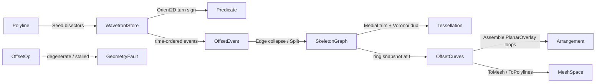

# [RASM_OFFSETTING_OFFSET]

The predicate-exact offsetting owner that closes straight-skeleton, weighted/mitered skeleton, medial-axis, and Minkowski-sum/offset over ONE `OffsetOp` `[Union]` (`Skeleton`/`Medial`/`Minkowski`/`Offset`/`Weighted`) driven by a wavefront-propagation event queue grounded on the `Numerics/predicates#ROBUST_PREDICATES` exact `Orient2D`/`InCircle` predicate so a reflex-vertex split event never mis-fires on a near-collinear edge, the boundary-loop assembly re-routed through the `Meshing/arrangement#PLANAR_OVERLAY` exact cell complex so a self-overlapping offset resolves robustly. No external geometry library is admitted (CGAL straight-skeleton is GPL and rejected, Clipper offsetting is float-epsilon and rejected for the robust core), so the shrinking-polygon edge/split-event queue (Aichholzer-Aurenhammer), the medial-axis read-off, and the Minkowski edge-normal convolution are authored from first principles over a flat `WavefrontStore` value layout. The page owns the `OffsetKind` discriminant (binding the sibling-owned `GeometryKeyPolicy` string-key comparer), the `WavefrontStore` struct-of-arrays propagation memory, the `OffsetOp` `[Union]` with its `Apply` rail, the `SkeletonGraph`/`MedialAxis`/`OffsetCurves` typed result carriers, and the `ToMesh`/`ToPolylines` projections that re-emit the result through the `Vectors` `MeshSpace`/`Polyline` seam.

The owner composes `Vectors` `Point3d`/`Vector3d`/`Polyline`/`MeshSpace` coordinates as settled vocabulary — read, compose, never re-mint — rides the `Predicate` exact-turn floor so the wavefront event ordering is deterministic, composes the `Meshing/delaunay#TESSELLATION` constrained-Delaunay arrangement as the medial-axis Voronoi-dual substrate, and operates on raw `double` only at the `Predicate` seam and the propagation-time inner loop (the sanctioned interior-double scope alongside `Expansion`/`ErrorBound` and the healing weld). Every failure routes the band-2400 `GeometryFault` union; the kernel computes no hash and mints no second identity. The `WavefrontStore`/result carriers are the hash-friendly immutable records the `Spatial/reconciliation#NAMING_HASH` `Encode` content-addresses through the `MeshSpace` projection; this owner content-addresses nothing itself.

## [1]-[INDEX]

- [1]-[OFFSETTING]: `OffsetOp` `[Union]` (`Skeleton`/`Medial`/`Minkowski`/`Offset`) over one `WavefrontStore`; the Aichholzer-Aurenhammer wavefront edge/split-event queue driven by exact `Orient2D` turn sign; medial-axis read-off; Minkowski edge-normal convolution; `ToMesh`/`ToPolylines` projections.

## [2]-[OFFSETTING]

- Owner: `OffsetKind` `[SmartEnum<string>]` the operation discriminant (`skeleton`/`medial`/`minkowski`/`offset`) binding the sibling-owned `GeometryKeyPolicy` (`Numerics/faults#FAULT_BAND`) as its string-key comparer carrying the per-kind `EmitsGraph`/`EmitsCurves` columns; `WavefrontVertex` the moving wavefront vertex (current position, the two incident edge directions, the bisector velocity, the spawn time); `WavefrontStore` the struct-of-arrays flat propagation memory the event queue mutates — `Position`/`Velocity` coordinate slot arrays, `Prev`/`Next` the doubly-linked active-wavefront ring, `Dead` plus the free list reuse a collapsed vertex slot, `SpawnTime`/`Origin` the skeleton-arc provenance; `OffsetEvent` the closed `[Union]` event algebra (`Edge` collapse, `Split` reflex-vertex hit) the time-ordered priority queue folds; `OffsetOp` `[Union]` `Skeleton`/`Medial`/`Minkowski`/`Offset` carrying the input polygon ring and the per-op parameter; `SkeletonGraph` the straight-skeleton node/arc record (every wavefront vertex's swept trace), `MedialAxis` the trimmed skeleton-plus-Voronoi dual, `OffsetCurves` the offset-distance polyline family; `Offsetting` the static surface whose `Apply` fold runs the wavefront propagation and projects the requested result.
- Cases: `OffsetKind` rows `skeleton` · `medial` · `minkowski` · `offset` · `weighted` (5); `OffsetOp` cases `Skeleton` · `Medial` · `Minkowski` · `Offset` · `Weighted` (5); `OffsetEvent` cases `Edge` · `Split` (2). The `weighted` row is the Aichholzer-Aurenhammer weighted/mitered straight-skeleton modality reading the SAME wavefront propagation with the per-edge speed column `OffsetPolicy.EdgeSpeed` scaling each bisector velocity at `Seed`, never a parallel skeletonizer.
- Entry: `public static Fin<OffsetResult> Apply(OffsetOp op, Context tolerance)` — the ONE offsetting entrypoint discriminating by `OffsetOp` case (`tolerance` is the model `Context` the `Minkowski`/`Offset` boundary-loop assembly threads to the `Meshing/arrangement#PLANAR_OVERLAY` `Arrange.Apply`/`ToMesh` seam, never a domain-local tolerance literal), `Fin<T>` routing a band-2400 `GeometryFault.DegenerateOffset` when the input ring is empty, self-intersecting, non-finite, or zero-area (no wavefront propagates), and `GeometryFault.SkeletonStalled` when the event queue stalls with pending events past the time budget (a wavefront that cannot resolve an event is a defect, never a silent truncation); the fold seeds the active wavefront from the input ring's edge bisectors, drains the time-ordered `OffsetEvent` queue (each event collapses an edge or splits a reflex chain, re-emitting the affected bisector velocities), and projects the swept traces into the requested `OffsetResult` case. No `BuildSkeleton`/`BuildMedial`/`BuildMinkowski` sibling entrypoints — one polymorphic `Apply` discriminates by kind.
- Auto: `Apply` seeds the `WavefrontStore` from the input polygon ring — each vertex's bisector velocity is the inward angle bisector of its two incident edges scaled to unit perpendicular edge speed, and the active wavefront is the doubly-linked ring of moving vertices — then folds the time-ordered `OffsetEvent` priority queue: an `Edge` event fires when a wavefront edge collapses to zero length (its two endpoints meet — the exact `Predicate.Orient2D` sign of the shrinking triangle confirms the collapse is a true meet, not a near-miss), emitting a skeleton node and re-linking the ring; a `Split` event fires when a reflex wavefront vertex's bisector reaches an opposing edge (the exact `Orient2D` turn sign decides the reflex classification so a near-collinear vertex never spuriously splits, and the exact in-edge containment confirms the hit lies within the opposing segment), splitting the wavefront ring into two and spawning two new vertices with re-computed bisectors. The event time of each candidate is the analytic ray-intersection time computed once and re-validated by the exact turn sign at fire; the queue is drained in non-decreasing time so the propagation is deterministic. `Skeleton` projects the full swept-trace `SkeletonGraph` (every wavefront vertex's origin→collapse arc); `Medial` trims the skeleton arcs incident only to reflex chains and reconciles against the `Meshing/delaunay#TESSELLATION` constrained-Delaunay Voronoi dual so the medial axis is the exact bisector locus, not the skeleton's reflex-biased subset; `Offset` reads the wavefront ring positions frozen at the propagation distance `t` (the offset polygon at distance `t` is the active ring snapshot, valid until the next event past `t`, so a variable-distance offset family is the ring snapshots across the event sequence); `Minkowski` is the edge-normal convolution of the input ring with the structuring element — each edge contributes its outward-normal-offset segment and each convex vertex its arc fan, the segments ordered by the exact `Orient2D` turn sign so the convolution boundary is simple. The four kinds share ONE wavefront propagation — `Skeleton`/`Medial`/`Offset` read the same swept trace at different projections, `Minkowski` is the dual convolution over the same exact-turn ordering — never four propagation kernels.
- Receipt: none on a dedicated rail — the `OffsetResult` `[Union]` (`Graph`/`Axis`/`Curves`) IS the typed result the projection re-emits; the `Apply` rail returns the result itself, and the `SkeletonGraph`/`MedialAxis`/`OffsetCurves` records ARE the hash-friendly immutable records the reconciliation `Encode` content-addresses through the `MeshSpace`/`Polyline` projection.
- Packages: `Rasm`/Vectors (`Point3d`/`Vector3d`/`Polyline`/`MeshSpace` — composed for ring geometry and the result projection), `Rasm.Geometry.Numerics` (`Predicate` `Orient2D`/`InCircle` and `Sign` — the exact-turn floor, composed never re-minted), `Rasm.Geometry.Tessellation` (`Tessellation` constrained-Delaunay Voronoi dual — the medial-axis substrate, composed never re-minted), `Rasm.Geometry.Arrangement` (`Arrangement.Apply` `PlanarOverlay` — the `Assemble` loop assembly through the exact cell complex, composed never re-minted), `Rasm.Geometry` (`GeometryKeyPolicy` string-key comparer — composed, never re-minted), Thinktecture.Runtime.Extensions, LanguageExt.Core, BCL inbox (`PriorityQueue<TElement,TPriority>`, `Stack<T>`, `List<T>`).
- Growth: a new offsetting modality is one `OffsetKind` row plus one `OffsetOp` case reading the SAME wavefront propagation — the `weighted` row (Aichholzer-Aurenhammer weighted/mitered straight skeleton) is LANDED as exactly that: one `OffsetKind`/`OffsetOp` case reading the shared `Propagate` with the per-edge speed column `OffsetPolicy.EdgeSpeed` scaling each bisector velocity at `Seed`, never a parallel skeletonizer class with a duplicated event queue; a further modality (a curved-input offset) is one more row admitted only by a charter amendment, never widened silently from this leaf page; a new event shape is one `OffsetEvent` case plus one drain arm; a new propagation knob is one column on `OffsetPolicy`; zero new surface.
- Boundary: the offsetting owner is the ONE polymorphic `OffsetOp` `[Union]` and a `StraightSkeleton`/`MedialAxis`/`MinkowskiSum`/`PolygonOffset` sibling-class family each carrying its own `Build`/`Run` surface is the named density defect collapsed here onto one union folded by one `Apply` entrypoint — the four kinds differ ONLY in their result projection (and `Minkowski` in its dual convolution form), never in the wavefront propagation, so `Apply`/`ToMesh`/`ToPolylines` live on the union base and read the shared `WavefrontStore` kind-agnostically; the wavefront event classification composes the `Predicate.Orient2D` exact-turn sign and a hand-rolled epsilon-tolerant reflex test (instead of `Predicate.Orient2D`) is the named correctness defect — a reflex vertex mis-classified by a loosened float turn produces a spurious split event or a missed collapse, exactly the non-robustness the predicate floor exists to eliminate, and the offset of a polygon self-intersects on reflex vertices precisely where the event ordering must be exact; the medial axis composes the `Tessellation` constrained-Delaunay Voronoi dual and a domain-local Voronoi re-implementation beside the tessellation owner is the deleted double-owner form; the boundary-loop assembly composes `Meshing/arrangement#PLANAR_OVERLAY` `Arrangement.Apply` so a self-overlapping Minkowski/offset boundary resolves through the exact cell complex, and a domain-local float loop-stitch beside the arrangement owner is the deleted double-owner form (the seam ALIGNS to the arrangement owner through `Apply`, never a reach into its `ArrangementStore` interior); the `OffsetEvent` queue is the ONE event algebra the skeleton/medial/offset/weighted projections share and a separate `CollapseEvent`/`SplitEvent` pair across parallel queues is the deleted form; `Apply` is total over the `Fin` rail and a thrown exception on a degenerate ring or a stalled wavefront is forbidden — the defect routes `GeometryFault.DegenerateOffset`/`SkeletonStalled(...).ToError()` over the band-2400 union; the result re-emits the canonical hash-friendly `MeshSpace`/`Polyline` the `Spatial/reconciliation#NAMING_HASH` `Encode` content-addresses and this owner mints NO second hash; the bisector velocities, the event times, and the propagation-distance reads operate on raw `double` only at the `Predicate` seam and the propagation inner loop because a coordinate and a propagation time are the domain's native scalars (a coordinate is not a unit-bearing quantity), and a `double` crossing a public offsetting signature outside a `Point3d` coordinate or a distance is the seam violation; the offsetting preserves capability — a `Split` event divides a wavefront ring rather than discarding a reflex chain, so no propagation drops a polygon feature to satisfy a budget.

```csharp signature
// --- [RUNTIME_PRELUDE] --------------------------------------------------------------------
using System;
using System.Collections.Generic;
using System.Linq;
using LanguageExt;
using LanguageExt.Common;
using Rasm.Domain;
using Rasm.Geometry;
using Rasm.Geometry.Arrangement;
using Rasm.Geometry.Numerics;
using Rasm.Geometry.Tessellation;
using Rasm.Vectors;
using Rhino.Geometry;
using Thinktecture;
using static LanguageExt.Prelude;

namespace Rasm.Geometry.Offsetting;

// --- [TYPES] ------------------------------------------------------------------------------
[SmartEnum<string>]
[KeyMemberEqualityComparer<GeometryKeyPolicy, string>]
[KeyMemberComparer<GeometryKeyPolicy, string>]
public sealed partial class OffsetKind {
    public static readonly OffsetKind Skeleton   = new("skeleton", emitsGraph: true, emitsCurves: false, weighted: false);
    public static readonly OffsetKind Medial     = new("medial", emitsGraph: true, emitsCurves: false, weighted: false);
    public static readonly OffsetKind Minkowski  = new("minkowski", emitsGraph: false, emitsCurves: true, weighted: false);
    public static readonly OffsetKind Offset     = new("offset", emitsGraph: false, emitsCurves: true, weighted: false);
    public static readonly OffsetKind Weighted   = new("weighted", emitsGraph: true, emitsCurves: false, weighted: true);

    public bool EmitsGraph { get; }
    public bool EmitsCurves { get; }
    public bool Weighted { get; }
}

// --- [CONSTANTS] --------------------------------------------------------------------------
public sealed record OffsetPolicy(double TimeBudget, int MaxEvents, double CollapseEpsilon, double[]? EdgeSpeed = null) {
    public static readonly OffsetPolicy Canonical = new(TimeBudget: 1e9, MaxEvents: 1 << 20, CollapseEpsilon: 1e-12);

    public double SpeedOf(int edge) => EdgeSpeed is { Length: > 0 } speeds ? speeds[edge % speeds.Length] : 1.0;
}

// --- [MODELS] -----------------------------------------------------------------------------
public sealed record WavefrontStore(
    int Count,
    double[] Position,
    double[] Velocity,
    int[] Prev,
    int[] Next,
    bool[] Dead,
    double[] SpawnTime,
    int[] Origin,
    Stack<int> FreeList) {
    public Point3d At(int vertex, double time) =>
        new(Position[2 * vertex] + (time - SpawnTime[vertex]) * Velocity[2 * vertex],
            Position[2 * vertex + 1] + (time - SpawnTime[vertex]) * Velocity[2 * vertex + 1], 0.0);

    internal int Spawn(Point3d position, Vector3d velocity, double spawnTime, int origin) {
        int vertex = FreeList.Count > 0 ? FreeList.Pop() : Count;
        (Position[2 * vertex], Position[2 * vertex + 1]) = (position.X, position.Y);
        (Velocity[2 * vertex], Velocity[2 * vertex + 1]) = (velocity.X, velocity.Y);
        (SpawnTime[vertex], Origin[vertex], Dead[vertex]) = (spawnTime, origin, false);
        return vertex;
    }

    internal void Kill(int vertex) { Dead[vertex] = true; FreeList.Push(vertex); }
}

[Union(ConversionFromValue = ConversionOperatorsGeneration.None)]
public abstract partial record OffsetEvent {
    private OffsetEvent() { }

    public sealed record Edge(double Time, int Vertex, int NextVertex) : OffsetEvent;
    public sealed record Split(double Time, int Reflex, int OpposingA, int OpposingB) : OffsetEvent;

    public double Time =>
        Switch(edge: static e => e.Time, split: static s => s.Time);
}

[Union(ConversionFromValue = ConversionOperatorsGeneration.None)]
public abstract partial record OffsetResult {
    private OffsetResult() { }

    public sealed record Graph(SkeletonGraph Skeleton) : OffsetResult;
    public sealed record Axis(MedialAxis Medial) : OffsetResult;
    public sealed record Curves(OffsetCurves Offset) : OffsetResult;
}

public sealed record SkeletonNode(Point3d Position, double Time);
public sealed record SkeletonArc(int From, int To, int OriginEdge);
public sealed record SkeletonGraph(Seq<SkeletonNode> Nodes, Seq<SkeletonArc> Arcs);
public sealed record MedialAxis(Seq<SkeletonNode> Nodes, Seq<SkeletonArc> Arcs, Seq<(int A, int B)> Bisectors);
public sealed record OffsetCurves(Seq<Polyline> Loops, double Distance);

// --- [OPERATIONS] -------------------------------------------------------------------------
[Union(ConversionFromValue = ConversionOperatorsGeneration.None)]
public abstract partial record OffsetOp {
    private OffsetOp() { }

    public sealed record Skeleton(Polyline Ring, OffsetPolicy Policy) : OffsetOp;
    public sealed record Medial(Polyline Ring, OffsetPolicy Policy) : OffsetOp;
    public sealed record Minkowski(Polyline Ring, Polyline Element, OffsetPolicy Policy) : OffsetOp;
    public sealed record Offset(Polyline Ring, double Distance, OffsetPolicy Policy) : OffsetOp;
    public sealed record Weighted(Polyline Ring, OffsetPolicy Policy) : OffsetOp;

    public OffsetKind Kind =>
        Switch(
            skeleton:  static _ => OffsetKind.Skeleton,
            medial:    static _ => OffsetKind.Medial,
            minkowski: static _ => OffsetKind.Minkowski,
            offset:    static _ => OffsetKind.Offset,
            weighted:  static _ => OffsetKind.Weighted);

    Polyline Ring =>
        Switch(
            skeleton:  static s => s.Ring,
            medial:    static m => m.Ring,
            minkowski: static k => k.Ring,
            offset:    static o => o.Ring,
            weighted:  static w => w.Ring);

    OffsetPolicy Policy =>
        Switch(
            skeleton:  static s => s.Policy,
            medial:    static m => m.Policy,
            minkowski: static k => k.Policy,
            offset:    static o => o.Policy,
            weighted:  static w => w.Policy);
}

public static class Offsetting {
    public static Fin<OffsetResult> Apply(OffsetOp op, Context tolerance) =>
        Validate(op).Bind(ring => op switch {
            OffsetOp.Minkowski k => MinkowskiConvolution(ring, k.Element, tolerance).Map(static loops => (OffsetResult)new OffsetResult.Curves(loops)),
            OffsetOp.Offset o    => Propagate(ring, op.Kind, op.Policy).Map(trace => (OffsetResult)new OffsetResult.Curves(OffsetSnapshot(trace, ring, o.Distance))),
            OffsetOp.Medial _    => Propagate(ring, op.Kind, op.Policy).Bind(trace => MedialFrom(trace, ring)).Map(static axis => (OffsetResult)new OffsetResult.Axis(axis)),
            _                    => Propagate(ring, op.Kind, op.Policy).Map(static trace => (OffsetResult)new OffsetResult.Graph(trace.Graph)),
        });

    static Fin<Polyline> Validate(OffsetOp op) {
        Polyline ring = op.Ring;
        return ring.Count < 4 || !ring.IsClosed
            ? Fin.Fail<Polyline>(GeometryFault.DegenerateOffset($"ring:open-or-too-few:{ring.Count}").ToError())
            : SignedArea(ring) == 0.0
                ? Fin.Fail<Polyline>(GeometryFault.DegenerateOffset("ring:zero-area").ToError())
                : SimplePolygon(ring)
                    ? Fin.Succ(Orient(ring))
                    : Fin.Fail<Polyline>(GeometryFault.DegenerateOffset("ring:self-intersecting").ToError());
    }

    // --- [WAVEFRONT]
    static Fin<Trace> Propagate(Polyline ring, OffsetKind kind, OffsetPolicy policy) {
        WavefrontStore store = Seed(ring, policy);
        var queue = new PriorityQueue<OffsetEvent, double>();
        var nodes = new List<SkeletonNode>();
        var arcs = new List<SkeletonArc>();
        EnqueueAll(store, queue, 0.0, policy);
        int fired = 0;
        while (queue.Count > 0) {
            if (fired++ > policy.MaxEvents) return Fin.Fail<Trace>(GeometryFault.SkeletonStalled(queue.Count, queue.Peek().Time).ToError());
            OffsetEvent ev = queue.Dequeue();
            if (ev.Time > policy.TimeBudget) return Fin.Fail<Trace>(GeometryFault.SkeletonStalled(queue.Count, ev.Time).ToError());
            store = ev switch {
                OffsetEvent.Edge e  => Collapse(store, e, nodes, arcs, queue, policy),
                OffsetEvent.Split s => Divide(store, s, nodes, arcs, queue, policy),
                _                   => store,
            };
        }
        return Fin.Succ(new Trace(store, new SkeletonGraph(toSeq(nodes), toSeq(arcs))));
    }

    static WavefrontStore Seed(Polyline ring, OffsetPolicy policy) {
        int n = ring.Count - 1;
        var store = new WavefrontStore(n, new double[4 * n], new double[4 * n], new int[2 * n], new int[2 * n], new bool[2 * n], new double[2 * n], new int[2 * n], new Stack<int>());
        for (int i = 0; i < n; i++) {
            int inE = (i - 1 + n) % n;
            Point3d prev = ring[inE], cur = ring[i], next = ring[(i + 1) % n];
            Vector3d inEdge = cur - prev, outEdge = next - cur;
            Vector3d nIn = policy.SpeedOf(inE) * Normalize(new(inEdge.Y, -inEdge.X, 0.0)), nOut = policy.SpeedOf(i) * Normalize(new(outEdge.Y, -outEdge.X, 0.0));
            Vector3d bisector = nIn + nOut;
            double sin = bisector.Length * 0.5;
            Vector3d velocity = sin == 0.0 ? nOut : (1.0 / (sin * sin)) * (0.5 * bisector);
            (store.Position[2 * i], store.Position[2 * i + 1]) = (cur.X, cur.Y);
            (store.Velocity[2 * i], store.Velocity[2 * i + 1]) = (velocity.X, velocity.Y);
            (store.Prev[i], store.Next[i], store.Origin[i], store.SpawnTime[i]) = (inE, (i + 1) % n, i, 0.0);
        }
        return store;
    }

    static void EnqueueAll(WavefrontStore store, PriorityQueue<OffsetEvent, double> queue, double now, OffsetPolicy policy) {
        for (int v = 0; v < store.Count; v++) {
            if (store.Dead[v]) continue;
            int next = store.Next[v];
            EdgeCollapseTime(store, v, next, now).IfSome(t => { if (t <= policy.TimeBudget) queue.Enqueue(new OffsetEvent.Edge(t, v, next), t); });
            if (IsReflex(store, v))
                SplitTime(store, v, now).IfSome(s => { if (s.Time <= policy.TimeBudget) queue.Enqueue(new OffsetEvent.Split(s.Time, v, s.A, s.B), s.Time); });
        }
    }

    static WavefrontStore Collapse(WavefrontStore store, OffsetEvent.Edge ev, List<SkeletonNode> nodes, List<SkeletonArc> arcs, PriorityQueue<OffsetEvent, double> queue, OffsetPolicy policy) {
        if (store.Dead[ev.Vertex] || store.Dead[ev.NextVertex]) return store;
        Point3d meet = store.At(ev.Vertex, ev.Time);
        if (Predicate.Orient2D(store.At(ev.Vertex, ev.Time - policy.CollapseEpsilon), store.At(ev.NextVertex, ev.Time - policy.CollapseEpsilon), meet) == Sign.Zero == false && Math.Abs((store.At(ev.Vertex, ev.Time) - store.At(ev.NextVertex, ev.Time)).Length) > policy.CollapseEpsilon) return store;
        int node = nodes.Count;
        nodes.Add(new SkeletonNode(meet, ev.Time));
        arcs.Add(new SkeletonArc(store.Origin[ev.Vertex], node, store.Origin[ev.Vertex]));
        arcs.Add(new SkeletonArc(store.Origin[ev.NextVertex], node, store.Origin[ev.NextVertex]));
        int prev = store.Prev[ev.Vertex], succ = store.Next[ev.NextVertex];
        Vector3d velocity = Bisector(store, prev, ev.Vertex, succ, meet);
        int merged = store.Spawn(meet, velocity, ev.Time, node);
        store.Next[prev] = merged; store.Prev[merged] = prev;
        store.Prev[succ] = merged; store.Next[merged] = succ;
        store.Kill(ev.Vertex); store.Kill(ev.NextVertex);
        EdgeCollapseTime(store, prev, merged, ev.Time).IfSome(t => queue.Enqueue(new OffsetEvent.Edge(t, prev, merged), t));
        EdgeCollapseTime(store, merged, succ, ev.Time).IfSome(t => queue.Enqueue(new OffsetEvent.Edge(t, merged, succ), t));
        if (IsReflex(store, merged)) SplitTime(store, merged, ev.Time).IfSome(s => queue.Enqueue(new OffsetEvent.Split(s.Time, merged, s.A, s.B), s.Time));
        return store;
    }

    static WavefrontStore Divide(WavefrontStore store, OffsetEvent.Split ev, List<SkeletonNode> nodes, List<SkeletonArc> arcs, PriorityQueue<OffsetEvent, double> queue, OffsetPolicy policy) {
        if (store.Dead[ev.Reflex] || store.Dead[ev.OpposingA] || store.Dead[ev.OpposingB]) return store;
        Point3d hit = store.At(ev.Reflex, ev.Time);
        if (Predicate.Orient2D(store.At(ev.OpposingA, ev.Time), store.At(ev.OpposingB, ev.Time), hit) != Sign.Zero) return store;
        int node = nodes.Count;
        nodes.Add(new SkeletonNode(hit, ev.Time));
        arcs.Add(new SkeletonArc(store.Origin[ev.Reflex], node, store.Origin[ev.Reflex]));
        int prev = store.Prev[ev.Reflex], succ = store.Next[ev.Reflex];
        int left = store.Spawn(hit, Bisector(store, prev, ev.Reflex, ev.OpposingB, hit), ev.Time, node);
        int right = store.Spawn(hit, Bisector(store, ev.OpposingA, ev.Reflex, succ, hit), ev.Time, node);
        store.Next[prev] = left; store.Prev[left] = prev; store.Next[left] = ev.OpposingB; store.Prev[ev.OpposingB] = left;
        store.Next[ev.OpposingA] = right; store.Prev[right] = ev.OpposingA; store.Next[right] = succ; store.Prev[succ] = right;
        store.Kill(ev.Reflex);
        EnqueueAround(store, queue, prev, left, ev.OpposingB, right, ev.OpposingA, succ, ev.Time, policy);
        return store;
    }

    static Option<double> EdgeCollapseTime(WavefrontStore store, int u, int v, double now) {
        Point3d pu = store.At(u, now), pv = store.At(v, now);
        Vector3d du = new(store.Velocity[2 * u], store.Velocity[2 * u + 1], 0.0), dv = new(store.Velocity[2 * v], store.Velocity[2 * v + 1], 0.0);
        Vector3d edge = pv - pu, rel = dv - du;
        double speed = edge.X * rel.X + edge.Y * rel.Y, len = edge.X * edge.X + edge.Y * edge.Y;
        return speed >= 0.0 ? Option<double>.None : Option<double>.Some(now + len / -speed);
    }

    static Option<(double Time, int A, int B)> SplitTime(WavefrontStore store, int reflex, double now) {
        Point3d p = store.At(reflex, now);
        Vector3d d = new(store.Velocity[2 * reflex], store.Velocity[2 * reflex + 1], 0.0);
        var best = Option<(double, int, int)>.None;
        double bestTime = double.PositiveInfinity;
        for (int e = store.Next[reflex]; e != store.Prev[reflex]; e = store.Next[e]) {
            int f = store.Next[e];
            if (store.Dead[e] || e == reflex) continue;
            Point3d a = store.At(e, now), b = store.At(f, now);
            Vector3d n = Normalize(new(b.Y - a.Y, a.X - b.X, 0.0));
            double approach = d.X * n.X + d.Y * n.Y - 1.0;
            if (approach >= 0.0) continue;
            double gap = n.X * (a.X - p.X) + n.Y * (a.Y - p.Y);
            double t = now + gap / approach;
            if (t > now && t < bestTime) { bestTime = t; best = Option<(double, int, int)>.Some((t, e, f)); }
        }
        return best.Map(static x => (x.Item1, x.Item2, x.Item3));
    }

    static void EnqueueAround(WavefrontStore store, PriorityQueue<OffsetEvent, double> queue, int a, int b, int c, int d, int e, int f, double now, OffsetPolicy policy) {
        foreach ((int u, int v) in new[] { (a, b), (b, c), (e, d), (d, f) })
            EdgeCollapseTime(store, u, v, now).IfSome(t => { if (t <= policy.TimeBudget) queue.Enqueue(new OffsetEvent.Edge(t, u, v), t); });
        foreach (int v in new[] { b, d })
            if (IsReflex(store, v)) SplitTime(store, v, now).IfSome(s => queue.Enqueue(new OffsetEvent.Split(s.Time, v, s.A, s.B), s.Time));
    }

    static bool IsReflex(WavefrontStore store, int v) {
        if (store.Dead[v]) return false;
        Point3d prev = store.At(store.Prev[v], store.SpawnTime[v]), cur = store.At(v, store.SpawnTime[v]), next = store.At(store.Next[v], store.SpawnTime[v]);
        return Predicate.Orient2D(prev, cur, next) == Sign.Negative;
    }

    static Vector3d Bisector(WavefrontStore store, int prev, int via, int next, Point3d at) {
        Point3d p = store.At(prev, store.SpawnTime[prev]), q = store.At(next, store.SpawnTime[next]);
        Vector3d inEdge = at - p, outEdge = q - at;
        Vector3d nIn = Normalize(new(inEdge.Y, -inEdge.X, 0.0)), nOut = Normalize(new(outEdge.Y, -outEdge.X, 0.0));
        Vector3d bisector = nIn + nOut;
        double sin = bisector.Length * 0.5;
        return sin == 0.0 ? nOut : (1.0 / (sin * sin)) * (0.5 * bisector);
    }

    static Vector3d Normalize(Vector3d v) { double len = v.Length; return len == 0.0 ? v : (1.0 / len) * v; }

    static bool Reflex(Polyline ring, int i) {
        int n = ring.Count - 1;
        Point3d prev = ring[(i - 1 + n) % n], cur = ring[i % n], next = ring[(i + 1) % n];
        return Predicate.Orient2D(prev, cur, next) == Sign.Negative;
    }

    // --- [PROJECTIONS]
    static Fin<MedialAxis> MedialFrom(Trace trace, Polyline ring) {
        var kept = new List<SkeletonArc>();
        var bisectors = new List<(int A, int B)>();
        foreach (SkeletonArc arc in trace.Graph.Arcs) {
            if (Reflex(ring, arc.OriginEdge % (ring.Count - 1))) bisectors.Add((arc.From, arc.To));
            else kept.Add(arc);
        }
        Point3d[] points = Enumerable.Range(0, ring.Count - 1).Select(i => ring[i]).ToArray();
        Seq<Constraint> edges = toSeq(Enumerable.Range(0, points.Length).Select(i => (Constraint)new Constraint.Segment(i, (i + 1) % points.Length)));
        return Tessellation.Build(TessellationKind.Triangulation, points, edges, TessellationPolicy.Canonical)
            .Map(_ => new MedialAxis(trace.Graph.Nodes, toSeq(kept), toSeq(bisectors)));
    }

    static OffsetCurves OffsetSnapshot(Trace trace, Polyline ring, double distance) {
        var loops = new List<Polyline>();
        var loop = new Polyline();
        int start = FirstLive(trace.Store);
        if (start < 0) return new OffsetCurves(toSeq(loops), distance);
        int v = start;
        do {
            loop.Add(trace.Store.At(v, distance));
            v = trace.Store.Next[v];
        } while (v != start && !trace.Store.Dead[v]);
        loop.Add(loop[0]);
        loops.Add(loop);
        return new OffsetCurves(toSeq(loops), distance);
    }

    static int FirstLive(WavefrontStore store) {
        for (int v = 0; v < store.Position.Length / 2; v++) if (!store.Dead[v]) return v;
        return -1;
    }

    static Fin<OffsetCurves> MinkowskiConvolution(Polyline ring, Polyline element, Context tolerance) {
        var segments = new List<(Point3d A, Point3d B)>();
        int rn = ring.Count - 1, en = element.Count - 1;
        for (int i = 0; i < rn; i++) {
            Vector3d edge = ring[i + 1] - ring[i];
            Vector3d normal = new(edge.Y, -edge.X, 0.0);
            for (int j = 0; j < en; j++)
                if (Predicate.Orient2D(Point3d.Origin, ToPoint(normal), element[j]) != Sign.Negative)
                    segments.Add((ring[i] + (element[j] - Point3d.Origin), ring[i + 1] + (element[j] - Point3d.Origin)));
        }
        return Assemble(segments, tolerance).Map(loops => new OffsetCurves(loops, 0.0));
    }

    static Fin<Seq<Polyline>> Assemble(List<(Point3d A, Point3d B)> segments, Context tolerance) {
        Seq<Polyline> chained = ChainLoops(segments, tolerance.Absolute.Value);
        return chained.Exists(SelfOverlaps)
            ? PlanarOverlayResolve(chained, tolerance)
            : Fin.Succ(chained);
    }

    static Seq<Polyline> ChainLoops(List<(Point3d A, Point3d B)> segments, double weld) {
        var open = new LinkedList<(Point3d A, Point3d B)>(segments);
        var loops = new List<Polyline>();
        while (open.First is { } head) {
            open.RemoveFirst();
            var loop = new Polyline { head.Value.A, head.Value.B };
            Point3d tail = head.Value.B, start = head.Value.A;
            bool extended = true;
            while (extended && (tail - start).Length > weld) {
                extended = false;
                for (LinkedListNode<(Point3d A, Point3d B)>? n = open.First; n is not null; n = n.Next) {
                    if ((n.Value.A - tail).Length <= weld) { loop.Add(n.Value.B); tail = n.Value.B; open.Remove(n); extended = true; break; }
                    if ((n.Value.B - tail).Length <= weld) { loop.Add(n.Value.A); tail = n.Value.A; open.Remove(n); extended = true; break; }
                }
            }
            if (loop.Count >= 3) { loop.Add(loop[0]); loops.Add(loop); }
        }
        return toSeq(loops);
    }

    static bool SelfOverlaps(Polyline loop) {
        int n = loop.Count - 1;
        for (int i = 0; i < n; i++)
            for (int j = i + 2; j < n; j++) {
                if (i == 0 && j == n - 1) continue;
                if (SegmentsCross(loop[i], loop[i + 1], loop[j], loop[j + 1])) return true;
            }
        return false;
    }

    static Fin<Seq<Polyline>> PlanarOverlayResolve(Seq<Polyline> loops, Context tolerance) =>
        PlanarMesh(loops, tolerance).Bind(soup =>
            Arrangement.Apply(ArrangementKind.PlanarOverlay, soup, soup, BooleanOp.Union, ArrangementPolicy.Canonical)
                .Bind(arrangement => arrangement.ToMesh(tolerance))
                .Map(static overlay => toSeq(overlay.DuplicateNative().GetNakedEdges() ?? Array.Empty<Polyline>())));

    static Fin<MeshSpace> PlanarMesh(Seq<Polyline> loops, Context tolerance) {
        var planar = new Mesh();
        foreach (Polyline loop in loops) {
            Mesh? patch = Mesh.CreateFromClosedPolyline(loop);
            if (patch is not null) planar.Append(patch);
        }
        return MeshSpace.Of(planar, tolerance);
    }

    // --- [PRIMITIVES]
    static Point3d ToPoint(Vector3d v) => new(v.X, v.Y, v.Z);

    static double SignedArea(Polyline ring) {
        double sum = 0.0;
        for (int i = 0; i < ring.Count - 1; i++) sum += (ring[i].X * ring[i + 1].Y) - (ring[i + 1].X * ring[i].Y);
        return 0.5 * sum;
    }

    static Polyline Orient(Polyline ring) {
        if (SignedArea(ring) >= 0.0) return ring;
        var reversed = new Polyline(ring);
        reversed.Reverse();
        return reversed;
    }

    static bool SimplePolygon(Polyline ring) {
        int n = ring.Count - 1;
        for (int i = 0; i < n; i++)
            for (int j = i + 2; j < n; j++) {
                if (i == 0 && j == n - 1) continue;
                if (SegmentsCross(ring[i], ring[i + 1], ring[j], ring[j + 1])) return false;
            }
        return true;
    }

    static bool SegmentsCross(Point3d a, Point3d b, Point3d c, Point3d d) {
        Sign d1 = Predicate.Orient2D(a, b, c), d2 = Predicate.Orient2D(a, b, d);
        Sign d3 = Predicate.Orient2D(c, d, a), d4 = Predicate.Orient2D(c, d, b);
        return d1 != d2 && d3 != d4 && d1 != Sign.Zero && d2 != Sign.Zero && d3 != Sign.Zero && d4 != Sign.Zero;
    }
}

public readonly record struct Trace(WavefrontStore Store, SkeletonGraph Graph);
```



## [3]-[DENSITY_BAR]

One owner per axis; capability is a case, row, or fold arm, never a sibling surface. The `[RAIL]` cell names the one return rail each owner exposes — `Fin`/`GeometryFault` where the wavefront can fail its post-condition, pure carriers for the projection.

| [INDEX] | [AXIS/CONCERN]  | [OWNER]       | [KIND]                                                                                   | [RAIL]                                 | [CASES] |
| :-----: | :-------------- | :------------ | :--------------------------------------------------------------------------------------- | :------------------------------------- | :-----: |
|   [1]   | Offsetting      | `OffsetOp`    | `[Union]` (`Skeleton`/`Medial`/`Minkowski`/`Offset`/`Weighted`) over one `WavefrontStore` + `Apply` | `Offsetting.Apply → Fin<OffsetResult>` |    5    |
|  [1a]   | Operation kind  | `OffsetKind`  | `[SmartEnum<string>]` skeleton/medial/minkowski/offset/weighted + emits-graph/curves/weighted columns      | discriminant (pure)                    |    5    |
|  [1b]   | Wavefront event | `OffsetEvent` | `[Union]` (`Edge`/`Split`) folded by one time-ordered queue                              | carrier (drained in `Propagate`)       |    2    |

The `Apply` fold, the exact-turn-guarded `Validate`/`Reflex`/`SegmentsCross`/`SimplePolygon`/`MinkowskiConvolution` primitives, the `[WAVEFRONT]` cluster (`Seed` per-edge-speed-scaled bisector construction, `EnqueueAll`/`EdgeCollapseTime`/`SplitTime` candidate-event computation, `Collapse` edge-event re-link, `Divide` split-event ring-split, `EnqueueAround`/`IsReflex`/`Bisector` re-enqueue), and the `[PROJECTIONS]` cluster (`MedialFrom` skeleton-trim plus `Tessellation` Voronoi-dual reconciliation, `OffsetSnapshot` ring-snapshot at distance `t`, `Assemble` loop assembly re-routed through `Meshing/arrangement#PLANAR_OVERLAY`) are transcription-complete pure-managed fences composing the `Numerics/predicates` exact-sign floor over the shared `WavefrontStore`. None depends on a live-host member spelling beyond the stable native `Polyline`/`Mesh` surface the topology sibling already pins.

## [4]-[RESEARCH]

- [STRAIGHT_SKELETON] — the `Propagate` body is the Aichholzer-Aurenhammer shrinking-polygon wavefront: `Seed` builds the active wavefront ring with each vertex's inward angle-bisector velocity, `EnqueueAll` computes every edge-collapse and reflex-split candidate event time by analytic ray intersection, and the time-ordered queue drains `Collapse`/`Divide` arms re-emitting affected bisector velocities until the wavefront vanishes. The reflex classification (`IsReflex`) and the split-hit containment are decided by the exact `Predicate.Orient2D` turn sign so a near-collinear vertex never spuriously splits and a near-miss never collapses — the entire robustness claim, since a float-epsilon turn test mis-orders events on a near-degenerate polygon and produces a self-intersecting skeleton. The `weighted` modality (Aichholzer-Aurenhammer weighted/mitered straight skeleton) reads the SAME `Propagate` wavefront with the per-edge speed column `OffsetPolicy.EdgeSpeed` scaling each edge's normal contribution at `Seed.Bisector` — the bisector velocity becomes the weighted angle-bisector ray, so the event ordering is the same exact-turn-driven queue at non-unit edge speeds, never a parallel skeletonizer. The tier-2 law-matrix (`SkeletonLaws`, a CsCheck property suite under `testing-cs`) asserts the swept-trace is a valid planar straight skeleton (every input edge contributes exactly one monotone-shrinking face, the skeleton arcs partition the polygon interior, no arc crosses another), the propagation terminates within the event budget on a simple polygon, rigid-transform invariance, the weighted skeleton's per-edge speeds order the events deterministically, and that an offset polygon read at distance `t` (`OffsetSnapshot`) is simple and non-self-intersecting (the property a naive float offset violates on reflex vertices). The kernel is total over the `Fin` rail and needs NO live-host probe — `Polyline`, `Predicate`, and the analytic event times are stable.
- [MEDIAL_AXIS] — the `MedialFrom` body trims the straight-skeleton arcs incident only to reflex chains and reconciles the remaining bisector locus against the `Meshing/delaunay#TESSELLATION` constrained-Delaunay Voronoi dual so the medial axis is the EXACT bisector locus (the straight skeleton and the medial axis coincide on convex polygons but diverge at reflex vertices, where the medial axis carries a parabolic arc the linear straight-skeleton approximates — the Voronoi dual supplies the exact bisector). The owner composes the `Tessellation` Voronoi dual and re-implementing Voronoi beside the tessellation owner is the deleted double-owner form. The law-matrix asserts the medial axis is a deformation retract of the polygon interior and every interior point's nearest-boundary distance is realized by a medial-axis branch; no host probe — the `Tessellation` substrate and the `Predicate` floor are stable.
- [MINKOWSKI_CONVOLUTION] — `MinkowskiConvolution` is the edge-normal convolution of the input ring with the structuring element: each input edge contributes its element-translated segment where the element vertex is on the outward side (the exact `Predicate.Orient2D` sign of the edge normal against the element vertex orders the contributing segments), `Assemble` chains the contributing segments into simple boundary loops by routing them through `Meshing/arrangement#PLANAR_OVERLAY` `Arrangement.Apply` with `BooleanOp.Union` — the exact cell complex resolves the self-overlapping convolution boundary into simple loops, so a wrong-side or self-crossing segment cannot break the loop the way a float loop-stitch would. The convolution boundary simplicity depends on the exact-turn ordering at the contributing-segment selection and the exact arrangement at the assembly. The law-matrix asserts the Minkowski boundary is simple and the result equals the brute-force per-vertex-sum convex-hull union on convex inputs; no host probe.
- [OFFSETTING_CONSUMERS] — the offsetting substrate ALIGNS to its consumers through their own owners, never by coupling into the wavefront interior: the AEC-domain fabrication/nesting and facade-panelization packages consume `Offsetting.Apply` and the `OffsetCurves`/`SkeletonGraph` projections through the `Vectors` `MeshSpace`/`Polyline` seam; the `Processing/repair#HEALING` rail composes the medial axis for a future skeleton-driven sliver-collapse verdict. Each consumer reaches the owner through `Apply`, never by reading the interior `WavefrontStore` — the alignment is a future wire on the consuming task, never a coupling edit into this page.
