# [RASM_SIMPLIFICATION_DECIMATE]

The predicate-guarded mesh decimation / LOD owner — ONE `SimplifyOp` `[Union]` (`QuadricCollapse`/`ProgressiveMesh`/`VoxelRemesh`/`FeaturePreserve`) that reduces a triangle mesh to a budgeted vertex/face count by a Garland-Heckbert quadric-error-metric edge-collapse priority queue whose every collapse is admitted ONLY when the exact `Numerics/predicates#ROBUST_PREDICATES` `Orient3D` sign of each incident face is preserved under the collapse — a decimation being ONE entity over a collapse-cost queue, never a face-count-blind `Mesh.Reduce` that silently flips a triangle or folds a non-manifold edge. The page composes the `Vectors` `MeshSpace`/`MeshEdit` triangulated-soup carrier (the SAME working set the `Processing/repair#HEALING` session threads, read once from `MeshEdit.OfMesh` and re-emitted through `MeshEdit.ToSpace`, never a re-minted vertex/face store), the `Vectors` `VectorCloudMetric.PrincipalCurvature` per-vertex curvature signal (the quadric-weight modulation a curvature-aware decimation reads, composed at its `VectorCloud.Cluster` handle never re-derived), the `Vectors` `FeatureEdge`/`FeatureReceipt` dihedral crease/boundary classification (`VectorIntent.Features`, the SAME feature lift the `Drawing/view#HIDDEN_LINE_PROJECTION` silhouette walk reads) so `FeaturePreserve` pins a crease rather than smoothing it away, and the `Vectors` `ScalarField.IsoSurfaceDetailed` SDF iso-surfacer over the `ScalarField.SignedDistanceFromMesh` field (the voxel-remesh resample), operating on raw `double` only inside the quadric accumulation, the collapse-cost solve, and the Hausdorff sampling because a quadric coefficient and a vertex coordinate are the domain's native scalars (a coordinate is not a unit-bearing quantity). The page owns the `SimplifyKind` `[SmartEnum<string>]` discriminant (binding the sibling-owned `GeometryKeyPolicy` string-key comparer, carrying the per-kind `Reversible`/`PreservesTopology` columns), the `QuadricStore` flat per-vertex 4×4 error-quadric SoA plus the collapse-cost priority-queue state, the `SimplifyOp` `[Union]` with its one polymorphic `Apply` rail, and the typed `DecimationReceipt` evidence the Compute tile-pyramid / coarse-solver-seed / meshlet-residency consumers read.

The owner composes `Vectors` `Point3d`/`Vector3d`/`Plane`/`MeshSpace`/`MeshEdit` coordinates and the `VectorCloudMetric.PrincipalCurvature` cloud-curvature and the `FeatureEdge`/`FeatureReceipt` dihedral surface as SETTLED vocabulary — read, compose, never re-mint — rides the `Numerics/predicates#ROBUST_PREDICATES` exact `Orient3D` floor so every collapse-validity decision is an exact `Sign` rather than a loosened float area test (a near-degenerate sliver is decided deterministically where a float area band either admits a fold or rejects a valid collapse), composes the `Spatial/index#SPATIAL_INDEX` BVH `SpatialQuery.Nearest` so the one-sided Hausdorff bound samples the simplified surface against the source in O(log n) rather than a quadratic all-pairs distance, and composes the `Vectors` `ScalarField.IsoSurfaceDetailed` marching-cubes iso-surfacer for the `VoxelRemesh` resample (the SAME SDF/iso lane the field substrate owns, never a domain-local marcher). Every reachable failure routes the one band-2400 `GeometryFault` union (`DecimationFault` 2500, carrying the `FaceBudget` versus the `Achieved` count when the topology-preservation gate cannot reach the requested budget — a budget a manifold-preserving collapse cannot satisfy is a typed defect, never a silently over-reduced mesh). The `DecimationReceipt` / vsplit-record records ARE the hash-friendly immutable records the `Spatial/reconciliation#NAMING_HASH` `Encode` content-addresses through the `MeshSpace`/`Polyline` seam; this owner computes no hash and mints no second identity. The mature `Vectors` `Mesh.Reduce` quick-reduce (the `RemeshKind.SimplifyCase` host path) stays the host's fast face-count reduce; this owner produces what the host produces neither of — the exact-`Orient3D` collapse-validity gate, the one-sided Hausdorff error budget, and the reversible vsplit stream that re-applies the recorded collapses for continuous LOD — so it never thins the host reduce and never deletes capability.

## [1]-[INDEX]

- [1]-[ROBUST_MESH_DECIMATION]: `SimplifyKind` discriminant; `VertexSplit` reversible-collapse record; `QuadricStore` flat per-vertex 4×4-quadric + collapse-cost priority-queue SoA; `SimplifyOp` `[Union]` (`QuadricCollapse`/`ProgressiveMesh`/`VoxelRemesh`/`FeaturePreserve`) over one `QuadricStore`; the `Apply` fold composing Garland-Heckbert QEM accumulation, exact-`Orient3D`-gated collapse loop, curvature/feature-weighted quadrics, SDF voxel resample, one-sided Hausdorff bound, and reversible vsplit stream; the typed `DecimationReceipt` evidence.

## [2]-[ROBUST_MESH_DECIMATION]

- Owner: `SimplifyKind` `[SmartEnum<string>]` the decimation-modality discriminant binding the sibling-owned `GeometryKeyPolicy` (`Numerics/faults#FAULT_BAND`) as its string-key comparer (`quadric-collapse`/`progressive-mesh`/`voxel-remesh`/`feature-preserve`) carrying the per-kind `Reversible` (`ProgressiveMesh`/`FeaturePreserve` record the full vsplit stream so the result re-expands to source; `QuadricCollapse` keeps only the final budgeted mesh; `VoxelRemesh` is a resample and reconstructs no source connectivity) and `PreservesTopology` (`QuadricCollapse`/`ProgressiveMesh`/`FeaturePreserve` admit a collapse only when the exact `Orient3D` sign and the manifold link-condition hold; `VoxelRemesh` re-meshes the SDF level set so its output genus follows the iso-surface, not the source) columns; `VertexSplit` the reversible-collapse record (the collapsed-edge endpoint pair, the survivor position, the displaced-vertex position, and the collapse cost — the exact inverse the continuous-LOD re-expansion replays); `QuadricStore` the struct-of-arrays flat decimation memory — `Quadric` the per-vertex 10-coefficient symmetric 4×4 error-quadric column (the `Q = Σ Kₚ` plane-quadric sum over a vertex's incident faces), `Position` the live vertex coordinate column, `Valid` the per-vertex live/collapsed bit, `Version` the per-vertex monotone counter the lazy priority queue reads to skip a stale edge, `Adjacency` the per-vertex one-ring neighbour set the link-condition and the re-enqueue walk read, `Pq` the BCL `PriorityQueue<EdgeRef, double>` of live edges keyed by quadric collapse cost (the popped `EdgeRef` carries the endpoint versions so a moved/dead edge is skipped without a decrease-key), `Splits` the recorded `VertexSplit` stream, and `Live` the one-cell live-face counter the budget loop decrements; `SimplifyPolicy` the budget/tolerance row (the target face count or fraction, the Hausdorff error ceiling, the boundary-quadric penalty weight, the crease dihedral threshold, the curvature-weight gain, the voxel resolution, and the deterministic collapse tie-break seed); `DecimationReceipt` the typed evidence (the simplified `MeshSpace`, the per-LOD vertex/face budget the collapse loop achieved, the one-sided Hausdorff distance bound from the simplified surface to the source, the preserved crease/boundary `FeatureEdge` set, and the reversible `VertexSplit` stream); `Simplification` the static surface whose `Apply` fold runs the quadric accumulation, the exact-gated collapse loop, and projects the typed receipt.
- Cases: `SimplifyKind` rows `quadric-collapse` · `progressive-mesh` · `voxel-remesh` · `feature-preserve` (4); `SimplifyOp` cases `QuadricCollapse` · `ProgressiveMesh` · `VoxelRemesh` · `FeaturePreserve` (4). The four kinds share ONE quadric accumulation, ONE exact-`Orient3D`-gated collapse loop, ONE Hausdorff bound, and ONE vsplit recorder — each kind contributes only its budget-termination column, its quadric-weight modulation (uniform for `QuadricCollapse`, curvature-scaled for `ProgressiveMesh`, feature-pinned for `FeaturePreserve`), and whether it resamples through the SDF iso-surfacer (`VoxelRemesh`) before the collapse loop runs — never four decimator classes with a duplicated collapse queue.
- Entry: `public static Fin<DecimationReceipt> Apply(SimplifyOp op, Context tolerance)` — the ONE decimation entrypoint discriminating by `SimplifyOp` case (`tolerance` is the model `Context` whose `Absolute` band sets the Hausdorff sampling resolution and the degenerate-area floor, never a domain-local epsilon literal), `Fin<T>` routing a band-2400 `GeometryFault.DecimationFault(faceBudget, achieved)` when the topology-preservation gate stalls with live collapses rejected before the requested budget is reached (a budget a manifold-preserving collapse cannot satisfy is a defect that routes the typed fault carrying the budget versus the achieved count rather than silently over-reducing) and `GeometryFault.DegenerateInput` when the mesh is empty, carries a non-finite vertex, or holds no faces; the fold reads the triangulated `MeshEdit` soup once, accumulates the per-vertex quadrics, seeds the per-edge collapse-cost priority queue, and pops the lowest-cost edge until the budget is met — admitting each collapse only when the exact `Orient3D` sign of every incident face is preserved and the manifold link-condition holds, recording each accepted collapse as a `VertexSplit`. No `Decimate`/`Simplify`/`ReduceTo`/`RemeshVoxel` sibling entrypoints — one polymorphic `Apply` discriminates by kind.
- Auto: `Apply` reads the `Decimators` `FrozenDictionary` keyed by `SimplifyKind` so the kind selection is a data-table row, never a `kind switch` cascade — every row lowers to the SAME `Collapse` quadric-error edge-collapse loop, differing only in the per-kind `QuadricWeight` modulation arm and the `Resample` SDF pre-pass (`VoxelRemesh` only). `Collapse` (1) reads the triangulated soup from `MeshEdit.OfMesh(space)` (the SAME healing working set, triangulated and de-quadded once) and builds the half-edge face-fan adjacency so a vertex's incident faces and its one-ring edges are O(1), (2) accumulates the per-vertex error quadric `Qᵥ = Σ_{f∋v} Kf` where each incident face `f` contributes its fundamental plane quadric `Kf = ppᵀ` over the homogeneous plane coefficient `p = (a,b,c,d)` (unit normal plus offset), the boundary one-ring adding a perpendicular boundary-constraint plane scaled by `SimplifyPolicy.BoundaryPenalty` so a naked edge resists collapse, and the `QuadricWeight` arm scales `Kf` by the per-kind modulation — uniform `1` for `QuadricCollapse`, `1 + gain·|κ|` from the `VectorCloudMetric.PrincipalCurvature` signal for `ProgressiveMesh` (a high-curvature region keeps more detail), and a large pin weight on a `FeatureReceipt.Crease`/`Boundary` edge for `FeaturePreserve` (the crease survives the budget), (3) for each edge `(u,v)` computes the optimal survivor position `v̄ = argmin xᵀ(Qᵤ+Qᵥ)x` by solving the 3×3 quadric sub-system through the admitted MathNet `Cholesky` (the midpoint fallback when the sub-system is singular) and the collapse cost `v̄ᵀ(Qᵤ+Qᵥ)v̄`, enqueuing the `EdgeRef` keyed by its cost into the BCL `PriorityQueue<EdgeRef,double>`, (4) pops the lowest-cost live edge and admits the collapse ONLY when `CollapseValid` holds — the exact `Orient3D` sign of every face in the merged fan is unchanged under the survivor position (no triangle flips its orientation), the manifold link-condition holds (the intersection of the two endpoints' vertex-links is exactly the two shared opposite vertices, so the collapse introduces no non-manifold fold), and no face degenerates to zero area — rejecting and discarding the edge otherwise, (5) applies the accepted collapse: the survivor takes `v̄`, the collapsed vertex is marked dead, the two incident degenerate faces are removed, the merged-fan quadrics become `Qᵤ ← Qᵤ + Qᵥ`, the affected edge costs are re-computed and re-enqueued (a lazy stale-entry skip on pop reads the live `QuadricStore.Valid`/`Version` so the queue needs no decrease-key), and the collapse is pushed onto the `Splits` stream as a `VertexSplit`, and (6) terminates when the live face count reaches the budget or no admissible collapse remains — routing `DecimationFault(budget, achieved)` when the budget is unmet because every remaining collapse fails the exact-`Orient3D`/link gate. `VoxelRemesh` runs `Resample` FIRST: it builds the `ScalarField.SignedDistanceFromMesh` SDF over the source `MeshSpace` and runs `ScalarField.IsoSurfaceDetailed(bounds, resolution, ...)` marching-cubes at the `SimplifyPolicy.VoxelResolution` to produce a topologically-clean re-meshed level set, THEN runs the SAME `Collapse` loop to the budget — so a self-intersecting or over-tessellated scan first becomes a clean manifold then decimates. The one-sided Hausdorff bound is the maximum over a stratified sample of the simplified surface of the `SpatialQuery.Nearest` distance to the source soup (the BVH built once over the source faces), the directed error the receipt carries. The four kinds share ONE `Collapse` loop and ONE `Hausdorff` bound — only the `QuadricWeight` arm and the `Resample` pre-pass vary per kind, never the collapse queue or the gate.
- Receipt: `Apply` carries a `DecimationReceipt` typed to the decimation — `Mesh` (the simplified `MeshSpace` re-emitted through `MeshEdit.ToSpace`), `VertexBudget`/`FaceBudget` (the achieved live vertex and face count at termination), `Hausdorff` (the one-sided directed distance bound from the simplified surface to the source — the error budget a LOD consumer thresholds), `Features` (the preserved `FeatureEdge` crease/boundary set that survived the budget), and `Splits` (the reversible `VertexSplit` stream the continuous-LOD re-expansion replays) — never a generic `IReceipt`/ledger; a per-LOD budget, a directed Hausdorff bound, a preserved-feature set, and a reversible vsplit stream are the facts a robust decimation admits and the receipt carries exactly those, typed. The Compute tile-pyramid reads `Mesh`+`Hausdorff` to seat a mesh at the LOD whose directed error fits the screen-space tolerance, the coarse-solver-seed reads the budgeted `Mesh` as the multigrid coarse level, the meshlet-residency reads the `FaceBudget`-budgeted `Mesh` per residency tier, and the continuous-LOD consumer replays `Splits` to re-expand toward source — each through `Apply` and the receipt, never the interior `QuadricStore`.
- Packages: `Rasm`/Vectors (`Point3d`/`Vector3d`/`Plane`/`MeshSpace` carriers; `MeshEdit.OfMesh`/`ToSpace` the triangulated working-set in/out, composed never re-minted; `VectorCloudMetric.PrincipalCurvature` the per-vertex curvature signal for the `ProgressiveMesh` quadric weight; `VectorIntent.Features`/`FeatureReceipt`/`FeatureEdge`/`MeshFeatureKind` the dihedral crease/boundary classification for `FeaturePreserve`; `ScalarField.IsoSurfaceDetailed`/`ScalarField.SignedDistanceFromMesh` the SDF iso-surfacer for `VoxelRemesh`, composed never re-marched), `Rasm.Geometry.Numerics` (`Predicate.Orient3D` exact collapse-validity sign and `Sign` verdict — the topology-preservation floor, composed never re-implemented as a float area test), `Rasm.Geometry.Spatial` (`SpatialIndex.Build`/`Query`, `SpatialQuery.Nearest`, `QueryResult.Nearest`/`Hits` — the source-distance BVH the Hausdorff bound samples, composed never re-built), `Rasm.Geometry` (`GeometryKeyPolicy` string-key comparer — composed, never re-minted), MathNet.Numerics (`Matrix<double>`/`DenseMatrix`/`Cholesky`/`Solve` — the 3×3 quadric optimal-position sub-solve, the one sanctioned dense linear boundary), Thinktecture.Runtime.Extensions (`[Union]`/`[SmartEnum]`), LanguageExt.Core (`Fin`/`Seq`/`Arr`/`Set`/`Option`), BCL inbox (`PriorityQueue<EdgeRef,double>` the collapse-cost queue, `Dictionary<,>`/`HashSet<>` the half-edge adjacency, `List<T>`, `FrozenDictionary`, `System.Random` the deterministic tie-break).
- Growth: a new decimation modality (an appearance-preserving decimation reading a per-vertex color/UV quadric, a uniform-resampling out-of-core decimation) is one `SimplifyKind` row carrying its `Reversible`/`PreservesTopology` columns plus one `SimplifyOp` case plus one `Decimators` `FrozenDictionary` row writing its `QuadricWeight` arm over the SAME `Collapse` loop — never a parallel decimator class with a duplicated queue; a new quadric weight (a visual-importance saliency weight, a view-dependent screen-error weight) is one `QuadricWeight` arm reading one `SimplifyPolicy` column; a new error-bound (a two-sided symmetric Hausdorff, a mean-distance L² bound) is one `DecimationReceipt` column over the SAME `SpatialQuery.Nearest` sampler; a new termination rule (an error-threshold-driven collapse rather than a face-budget) is one `SimplifyPolicy` column on the same loop; zero new surface.
- Boundary: the decimation owner is the ONE polymorphic `SimplifyOp` `[Union]` and a `QuadricDecimator`/`ProgressiveMeshBuilder`/`VoxelRemesher`/`FeaturePreservingSimplifier` sibling-class family each carrying its own `Run`/`Decimate`/`Build` surface is the named density defect collapsed here onto one union folded by one `Apply` — the four kinds differ ONLY in their `QuadricWeight` modulation arm, their budget-termination column, and whether `VoxelRemesh` resamples through the SDF first, never in the quadric accumulation, the collapse queue, the exact-`Orient3D` gate, the Hausdorff bound, or the vsplit recorder, so `Apply`/`Receipt` live on the union base and read the shared `QuadricStore` kind-agnostically; the `Decimators` `FrozenDictionary` is the single kind-selection data table and a `SimplifyKind kind switch` arm cascade in `Apply` is the deleted form; the collapse-validity gate is the exact `Predicate.Orient3D` sign over every incident face plus the manifold link-condition and a float triangle-area threshold is the rejected coarser form — a float area band either admits an orientation-flipping fold on a near-degenerate sliver or rejects a valid collapse, exactly the robustness a host face-count reduce loses, so the gate is the exact sign and a float area test is the named defect; the optimal-survivor position is the `argmin xᵀQx` quadric sub-solve through the `Processing/solver`-grade MathNet `Cholesky` and a fixed-midpoint collapse is the rejected biased form (the midpoint over-smooths a feature the quadric would preserve) admitted only as the singular-system fallback; the Hausdorff bound composes the `Spatial/index#SPATIAL_INDEX` BVH `SpatialQuery.Nearest` and a domain-local quadratic all-pairs source-distance scan is the deleted form; the voxel resample composes the `Vectors` `ScalarField.IsoSurfaceDetailed` SDF iso-surfacer and a domain-local marching-cubes beside the field substrate is the deleted double-owner form; the working set is the `Processing/repair#HEALING` `MeshEdit` triangulated soup and a re-minted vertex/face store beside it is the deleted form; the curvature weight composes the `Vectors` `VectorCloudMetric.PrincipalCurvature` and a domain-local curvature estimate is the deleted double-owner form; the crease pin composes the `Vectors` `FeatureEdge`/`FeatureReceipt` dihedral lift and a domain-local dihedral classifier is the deleted form; the mature host `Mesh.Reduce` quick-reduce is NOT thinned — this owner produces the exact-gated collapse, the directed Hausdorff bound, and the reversible vsplit stream the host reduce produces none of, so the two coexist and the decimation preserves capability (a `FeaturePreserve` budget pins a crease rather than smoothing it, and an unmet budget routes `DecimationFault(budget, achieved)` rather than silently over-reducing); `Apply` is total over the `Fin` rail and a thrown exception on a degenerate mesh or a stalled budget is forbidden — the defect routes `GeometryFault.DecimationFault(...)`/`GeometryFault.DegenerateInput(...).ToError()` over the band-2400 union; the quadric accumulation, the collapse-cost solve, and the Hausdorff sampling operate on raw `double` because a quadric coefficient and a vertex coordinate are the domain's native scalars, and a `double` crossing a public decimation signature outside a `Point3d`/`Vector3d`/`Plane`/`MeshSpace` is the seam violation.

```csharp contract
// --- [RUNTIME_PRELUDE] --------------------------------------------------------------------
using System;
using System.Collections.Frozen;
using System.Collections.Generic;
using System.Linq;
using LanguageExt;
using LanguageExt.Common;
using MathNet.Numerics.LinearAlgebra;
using MathNet.Numerics.LinearAlgebra.Double;
using Rasm.Domain;
using Rasm.Geometry;
using Rasm.Geometry.Healing;
using Rasm.Geometry.Numerics;
using Rasm.Geometry.Spatial;
using Rasm.Vectors;
using Rhino.Geometry;
using Thinktecture;
using static LanguageExt.Prelude;

namespace Rasm.Geometry.Simplification;

// --- [TYPES] ------------------------------------------------------------------------------
[SmartEnum<string>]
[KeyMemberEqualityComparer<GeometryKeyPolicy, string>]
[KeyMemberComparer<GeometryKeyPolicy, string>]
public sealed partial class SimplifyKind {
    public static readonly SimplifyKind QuadricCollapse  = new("quadric-collapse", reversible: false, preservesTopology: true);
    public static readonly SimplifyKind ProgressiveMesh  = new("progressive-mesh", reversible: true, preservesTopology: true);
    public static readonly SimplifyKind VoxelRemesh       = new("voxel-remesh", reversible: false, preservesTopology: false);
    public static readonly SimplifyKind FeaturePreserve   = new("feature-preserve", reversible: true, preservesTopology: true);

    public bool Reversible { get; }
    public bool PreservesTopology { get; }
}

// --- [CONSTANTS] --------------------------------------------------------------------------
public sealed record SimplifyPolicy(
    double TargetFraction,
    int TargetFaces,
    double HausdorffCeiling,
    double BoundaryPenalty,
    double CreaseDihedralRadians,
    double CurvatureGain,
    int VoxelResolution,
    int HausdorffSamplesPerFace,
    int Seed) {
    public static readonly SimplifyPolicy Canonical = new(
        TargetFraction: 0.25, TargetFaces: 0,
        HausdorffCeiling: double.PositiveInfinity, BoundaryPenalty: 1.0e3,
        CreaseDihedralRadians: 0.5235987755982988, CurvatureGain: 4.0,
        VoxelResolution: 128, HausdorffSamplesPerFace: 1, Seed: 0x5EED);

    public int BudgetFor(int sourceFaces) =>
        TargetFaces > 0 ? Math.Min(TargetFaces, sourceFaces) : Math.Max(4, (int)Math.Round(TargetFraction * sourceFaces));
}

// --- [MODELS] -----------------------------------------------------------------------------
public readonly record struct VertexSplit(int Survivor, int Collapsed, Point3d SurvivorAt, Point3d CollapsedAt, double Cost);

public sealed record QuadricStore(
    int Count,
    Quadric[] Quadric,
    Point3d[] Position,
    bool[] Valid,
    int[] Version,
    Dictionary<int, HashSet<int>> Adjacency,
    PriorityQueue<EdgeRef, double> Pq,
    List<VertexSplit> Splits,
    int[] Live) {
    public static QuadricStore Seed(MeshEdit edit) {
        int n = edit.Vertices.Count;
        var quadric = new Quadric[n];
        var position = new Point3d[n];
        var valid = new bool[n];
        for (int i = 0; i < n; i++) { quadric[i] = Quadric.Zero; position[i] = edit.Vertices[i]; valid[i] = true; }
        var adjacency = new Dictionary<int, HashSet<int>>(n);
        foreach ((int a, int b, int c) in edit.Faces) {
            Link(adjacency, a, b); Link(adjacency, b, c); Link(adjacency, c, a);
        }
        return new QuadricStore(n, quadric, position, valid, new int[n], adjacency,
            new PriorityQueue<EdgeRef, double>(), new List<VertexSplit>(edit.Faces.Count), new[] { edit.Faces.Count });
    }

    static void Link(Dictionary<int, HashSet<int>> adjacency, int a, int b) {
        Neighbours(adjacency, a).Add(b);
        Neighbours(adjacency, b).Add(a);
    }

    public static HashSet<int> Neighbours(Dictionary<int, HashSet<int>> adjacency, int v) =>
        adjacency.TryGetValue(v, out HashSet<int>? set) ? set : adjacency[v] = new HashSet<int>();

    public static long EdgeKey(int u, int v) { (int lo, int hi) = u < v ? (u, v) : (v, u); return ((long)lo << 32) | (uint)hi; }
}

public readonly record struct Quadric(
    double A00, double A01, double A02, double A03,
    double A11, double A12, double A13,
    double A22, double A23, double A33) {
    public static readonly Quadric Zero = default;

    public static Quadric OfPlane(double a, double b, double c, double d, double weight) =>
        new(weight * a * a, weight * a * b, weight * a * c, weight * a * d,
            weight * b * b, weight * b * c, weight * b * d,
            weight * c * c, weight * c * d, weight * d * d);

    public Quadric Add(Quadric o) =>
        new(A00 + o.A00, A01 + o.A01, A02 + o.A02, A03 + o.A03,
            A11 + o.A11, A12 + o.A12, A13 + o.A13,
            A22 + o.A22, A23 + o.A23, A33 + o.A33);

    public double Evaluate(Point3d p) {
        double x = p.X, y = p.Y, z = p.Z;
        return A00 * x * x + 2.0 * A01 * x * y + 2.0 * A02 * x * z + 2.0 * A03 * x
             + A11 * y * y + 2.0 * A12 * y * z + 2.0 * A13 * y
             + A22 * z * z + 2.0 * A23 * z
             + A33;
    }
}

public readonly record struct EdgeRef(int U, int V, int VersionU, int VersionV);

public sealed record DecimationReceipt(
    MeshSpace Mesh,
    int VertexBudget,
    int FaceBudget,
    double Hausdorff,
    Seq<FeatureEdge> Features,
    Seq<VertexSplit> Splits);

// --- [OPERATIONS] -------------------------------------------------------------------------
[Union(ConversionFromValue = ConversionOperatorsGeneration.None)]
public abstract partial record SimplifyOp {
    private SimplifyOp() { }

    public sealed record QuadricCollapse(MeshSpace Mesh, SimplifyPolicy Policy) : SimplifyOp;
    public sealed record ProgressiveMesh(MeshSpace Mesh, SimplifyPolicy Policy) : SimplifyOp;
    public sealed record VoxelRemesh(MeshSpace Mesh, SimplifyPolicy Policy) : SimplifyOp;
    public sealed record FeaturePreserve(MeshSpace Mesh, SimplifyPolicy Policy) : SimplifyOp;

    public SimplifyKind Kind =>
        Switch(
            quadricCollapse: static _ => SimplifyKind.QuadricCollapse,
            progressiveMesh: static _ => SimplifyKind.ProgressiveMesh,
            voxelRemesh:     static _ => SimplifyKind.VoxelRemesh,
            featurePreserve: static _ => SimplifyKind.FeaturePreserve);

    public MeshSpace Mesh =>
        Switch(
            quadricCollapse: static q => q.Mesh, progressiveMesh: static p => p.Mesh,
            voxelRemesh:     static v => v.Mesh, featurePreserve: static f => f.Mesh);

    public SimplifyPolicy Policy =>
        Switch(
            quadricCollapse: static q => q.Policy, progressiveMesh: static p => p.Policy,
            voxelRemesh:     static v => v.Policy, featurePreserve: static f => f.Policy);
}

public static class Simplification {
    static readonly FrozenDictionary<SimplifyKind, Func<MeshEdit, SimplifyOp, Context, double[]>> Weights =
        new Dictionary<SimplifyKind, Func<MeshEdit, SimplifyOp, Context, double[]>> {
            [SimplifyKind.QuadricCollapse] = static (edit, op, ctx) => Uniform(edit),
            [SimplifyKind.ProgressiveMesh] = static (edit, op, ctx) => Curvature(edit, op.Policy, ctx),
            [SimplifyKind.VoxelRemesh]     = static (edit, op, ctx) => Uniform(edit),
            [SimplifyKind.FeaturePreserve] = static (edit, op, ctx) => FeatureWeights(edit, op.Policy, ctx),
        }.ToFrozenDictionary();

    public static Fin<DecimationReceipt> Apply(SimplifyOp op, Context tolerance) =>
        Resample(op, tolerance).Bind(space =>
            Validate(space, op.Kind).Bind(edit =>
                Collapse(edit, op, op.Policy.BudgetFor(edit.Faces.Count), tolerance)
                    .Bind(state => Emit(state, edit, op, tolerance))));

    static Fin<MeshSpace> Resample(SimplifyOp op, Context tolerance) =>
        op is SimplifyOp.VoxelRemesh voxel
            ? Voxelize(voxel.Mesh, voxel.Policy, tolerance)
            : Fin.Succ(op.Mesh);

    static Fin<MeshEdit> Validate(MeshSpace space, SimplifyKind kind) {
        MeshEdit edit = MeshEdit.OfMesh(space);
        return edit.Faces.Count == 0
            ? Fin.Fail<MeshEdit>(GeometryFault.DegenerateInput($"decimation:{kind.Key}:no-faces").ToError())
            : edit.Vertices.Exists(static v => !v.IsValid)
                ? Fin.Fail<MeshEdit>(GeometryFault.DegenerateInput($"decimation:{kind.Key}:non-finite-vertex").ToError())
                : Fin.Succ(edit);
    }

    // --- [COLLAPSE]
    static Fin<QuadricStore> Collapse(MeshEdit edit, SimplifyOp op, int budget, Context tolerance) {
        QuadricStore store = QuadricStore.Seed(edit);
        double[] weights = Weights[op.Kind](edit, op, tolerance);
        Accumulate(store, edit, weights, op.Policy);
        EnqueueAll(store, edit);
        Drain(store, edit, budget, tolerance);
        return store.Live[0] > budget && NoAdmissibleCollapse(store, edit, op.Policy, tolerance)
            ? Fin.Fail<QuadricStore>(GeometryFault.DecimationFault(budget, store.Live[0]).ToError())
            : Fin.Succ(store);
    }

    static void Accumulate(QuadricStore store, MeshEdit edit, double[] weights, SimplifyPolicy policy) {
        foreach ((int a, int b, int c) in edit.Faces) {
            Point3d pa = store.Position[a], pb = store.Position[b], pc = store.Position[c];
            Vector3d normal = Vector3d.CrossProduct(pb - pa, pc - pa);
            double len = normal.Length;
            if (len <= 0.0) continue;
            normal = (1.0 / len) * normal;
            double d = -(normal.X * pa.X + normal.Y * pa.Y + normal.Z * pa.Z);
            double w = (weights[a] + weights[b] + weights[c]) / 3.0;
            Quadric k = Quadric.OfPlane(normal.X, normal.Y, normal.Z, d, w);
            store.Quadric[a] = store.Quadric[a].Add(k);
            store.Quadric[b] = store.Quadric[b].Add(k);
            store.Quadric[c] = store.Quadric[c].Add(k);
        }
        Boundaries(store, edit, policy);
    }

    static void Boundaries(QuadricStore store, MeshEdit edit, SimplifyPolicy policy) {
        var incident = new Dictionary<long, int>();
        foreach ((int a, int b, int c) in edit.Faces) {
            Bump(incident, a, b); Bump(incident, b, c); Bump(incident, c, a);
        }
        foreach ((long key, int count) in incident) {
            if (count != 1) continue;
            int u = (int)(key >> 32), v = (int)(key & 0xFFFFFFFF);
            Point3d pu = store.Position[u], pv = store.Position[v];
            Vector3d edge = pv - pu;
            Vector3d face = Vector3d.CrossProduct(edge, Vector3d.ZAxis.IsParallelTo(edge) != 0 ? Vector3d.XAxis : Vector3d.ZAxis);
            Vector3d plane = Vector3d.CrossProduct(edge, face);
            double len = plane.Length;
            if (len <= 0.0) continue;
            plane = (1.0 / len) * plane;
            double d = -(plane.X * pu.X + plane.Y * pu.Y + plane.Z * pu.Z);
            Quadric k = Quadric.OfPlane(plane.X, plane.Y, plane.Z, d, policy.BoundaryPenalty);
            store.Quadric[u] = store.Quadric[u].Add(k);
            store.Quadric[v] = store.Quadric[v].Add(k);
        }
    }

    static void EnqueueAll(QuadricStore store, MeshEdit edit) {
        var seen = new HashSet<long>();
        foreach ((int a, int b, int c) in edit.Faces)
            foreach ((int u, int v) in new[] { (a, b), (b, c), (c, a) })
                if (seen.Add(QuadricStore.EdgeKey(u, v)))
                    Enqueue(store, u, v);
    }

    static void Enqueue(QuadricStore store, int u, int v) {
        if (!store.Valid[u] || !store.Valid[v]) return;
        (Point3d target, double cost) = OptimalPosition(store.Quadric[u].Add(store.Quadric[v]), store.Position[u], store.Position[v]);
        store.Pq.Enqueue(new EdgeRef(u, v, store.Version[u], store.Version[v]), cost);
    }

    static void Drain(QuadricStore store, MeshEdit edit, int budget, Context tolerance) {
        while (store.Live[0] > budget && store.Pq.TryDequeue(out EdgeRef edge, out double cost)) {
            if (Stale(store, edge)) continue;
            (Point3d target, double _) = OptimalPosition(store.Quadric[edge.U].Add(store.Quadric[edge.V]), store.Position[edge.U], store.Position[edge.V]);
            if (!CollapseValid(store, edit, edge.U, edge.V, target, tolerance)) continue;
            ApplyCollapse(store, edit, edge.U, edge.V, target, cost);
        }
    }

    static bool Stale(QuadricStore store, EdgeRef edge) =>
        !store.Valid[edge.U] || !store.Valid[edge.V]
        || store.Version[edge.U] != edge.VersionU || store.Version[edge.V] != edge.VersionV;

    static bool CollapseValid(QuadricStore store, MeshEdit edit, int u, int v, Point3d target, Context tolerance) {
        if (!LinkCondition(store, u, v)) return false;
        foreach ((int a, int b, int c) in FanFaces(store, edit, u, v)) {
            if ((a == u || a == v) && (b == u || b == v)) continue;
            if ((b == u || b == v) && (c == u || c == v)) continue;
            if ((c == u || c == v) && (a == u || a == v)) continue;
            Point3d pa = Moved(store, a, u, v, target), pb = Moved(store, b, u, v, target), pc = Moved(store, c, u, v, target);
            Point3d oa = store.Position[a], ob = store.Position[b], oc = store.Position[c];
            Sign before = Predicate.Orient3D(oa, ob, oc, oa + Vector3d.CrossProduct(ob - oa, oc - oa));
            Sign after = Predicate.Orient3D(pa, pb, pc, pa + Vector3d.CrossProduct(pb - pa, pc - pa));
            if (after == Sign.Zero || (before != Sign.Zero && after != before)) return false;
        }
        return true;
    }

    static bool LinkCondition(QuadricStore store, int u, int v) {
        HashSet<int> lu = QuadricStore.Neighbours(store.Adjacency, u);
        HashSet<int> lv = QuadricStore.Neighbours(store.Adjacency, v);
        int shared = lu.Count(lv.Contains);
        return shared == 2;
    }

    static Point3d Moved(QuadricStore store, int vertex, int u, int v, Point3d target) =>
        vertex == u || vertex == v ? target : store.Position[vertex];

    static IEnumerable<(int A, int B, int C)> FanFaces(QuadricStore store, MeshEdit edit, int u, int v) {
        foreach ((int a, int b, int c) in edit.Faces)
            if ((a == u || b == u || c == u || a == v || b == v || c == v) && store.Valid[a] && store.Valid[b] && store.Valid[c])
                yield return (a, b, c);
    }

    static void ApplyCollapse(QuadricStore store, MeshEdit edit, int u, int v, Point3d target, double cost) {
        VertexSplit split = new(u, v, store.Position[u], store.Position[v], cost);
        store.Position[u] = target;
        store.Valid[v] = false;
        store.Quadric[u] = store.Quadric[u].Add(store.Quadric[v]);
        store.Version[u]++;
        foreach (int w in QuadricStore.Neighbours(store.Adjacency, v)) {
            HashSet<int> nbr = QuadricStore.Neighbours(store.Adjacency, w);
            nbr.Remove(v);
            if (w != u) { nbr.Add(u); QuadricStore.Neighbours(store.Adjacency, u).Add(w); store.Version[w]++; }
        }
        store.Adjacency[v] = new HashSet<int>();
        store.Live[0] -= CollapsedFaces(store, edit, u, v);
        store.Splits.Add(split);
        foreach (int w in QuadricStore.Neighbours(store.Adjacency, u))
            if (store.Valid[w]) Enqueue(store, u, w);
    }

    static int CollapsedFaces(QuadricStore store, MeshEdit edit, int u, int v) {
        int removed = 0;
        foreach ((int a, int b, int c) in edit.Faces)
            if (Incident(a, b, c, u) && Incident(a, b, c, v)) removed++;
        return removed;
    }

    static bool Incident(int a, int b, int c, int v) => a == v || b == v || c == v;

    static bool NoAdmissibleCollapse(QuadricStore store, MeshEdit edit, SimplifyPolicy policy, Context tolerance) {
        var seen = new HashSet<long>();
        foreach ((int a, int b, int c) in edit.Faces)
            foreach ((int u, int v) in new[] { (a, b), (b, c), (c, a) }) {
                if (!store.Valid[u] || !store.Valid[v] || !seen.Add(QuadricStore.EdgeKey(u, v))) continue;
                (Point3d target, double _) = OptimalPosition(store.Quadric[u].Add(store.Quadric[v]), store.Position[u], store.Position[v]);
                if (CollapseValid(store, edit, u, v, target, tolerance)) return false;
            }
        return true;
    }

    // --- [QUADRIC_SOLVE]
    static (Point3d Target, double Cost) OptimalPosition(Quadric q, Point3d u, Point3d v) {
        var lhs = DenseMatrix.OfArray(new double[,] {
            { q.A00, q.A01, q.A02 },
            { q.A01, q.A11, q.A12 },
            { q.A02, q.A12, q.A22 } });
        var rhs = DenseVector.OfArray(new[] { -q.A03, -q.A13, -q.A23 });
        return Solve(lhs, rhs).Match(
            Succ: x => { var p = new Point3d(x[0], x[1], x[2]); return (p, q.Evaluate(p)); },
            Fail: _ => { var mid = 0.5 * (u + new Vector3d(v.X, v.Y, v.Z)); var p = new Point3d(mid.X, mid.Y, mid.Z); return (p, q.Evaluate(p)); });
    }

    static Fin<Vector<double>> Solve(Matrix<double> spd, Vector<double> rhs) =>
        Try.lift(() => spd.Cholesky().Solve(rhs)).Run()
            .MapFail(_ => GeometryFault.SingularSystem(spd.Rank(), spd.ColumnCount).ToError())
            .Bind(solution => solution.Exists(double.IsNaN)
                ? Fin.Fail<Vector<double>>(GeometryFault.SingularSystem(spd.Rank(), spd.ColumnCount).ToError())
                : Fin.Succ(solution));

    // --- [WEIGHTS]
    static double[] Uniform(MeshEdit edit) {
        var weights = new double[edit.Vertices.Count];
        Array.Fill(weights, 1.0);
        return weights;
    }

    static double[] Curvature(MeshEdit edit, SimplifyPolicy policy, Context tolerance) {
        double[] weights = Uniform(edit);
        VectorCloud.Cluster(edit.Vertices.AsIterable().ToSeq(), tolerance)
            .Bind(cloud => VectorIntent.Cloud(cloud, VectorCloudMetric.PrincipalCurvature, Option<CloudMetricPolicy>.None))
            .Bind(intent => intent.Project<CloudCurvatureResult>(tolerance))
            .IfSucc(curvature => {
                foreach (CloudCurvatureSample sample in curvature.Samples)
                    if (sample.Index < weights.Length)
                        weights[sample.Index] = 1.0 + policy.CurvatureGain * Math.Max(Math.Abs(sample.K1), Math.Abs(sample.K2));
            });
        return weights;
    }

    static double[] FeatureWeights(MeshEdit edit, SimplifyPolicy policy, Context tolerance) {
        double[] weights = Uniform(edit);
        edit.ToSpace(tolerance)
            .Bind(space => VectorIntent.Features(space, policy.CreaseDihedralRadians))
            .Bind(intent => intent.Project<FeatureReceipt>(tolerance))
            .IfSucc(receipt => {
                foreach (FeatureEdge edge in receipt.Edges)
                    if (edge.Kind.Equals(MeshFeatureKind.Crease) || edge.Kind.Equals(MeshFeatureKind.Boundary)) {
                        if (edge.A < weights.Length) weights[edge.A] = policy.BoundaryPenalty;
                        if (edge.B < weights.Length) weights[edge.B] = policy.BoundaryPenalty;
                    }
            });
        return weights;
    }

    // --- [RESAMPLE]
    static Fin<MeshSpace> Voxelize(MeshSpace mesh, SimplifyPolicy policy, Context tolerance) {
        BoundingBox bounds = mesh.DuplicateNative().GetBoundingBox(accurate: true);
        bounds.Inflate(tolerance.Absolute.Value);
        return SdfMeshPolicy.GeneralizedWinding()
            .Bind(sdf => ScalarField.SignedDistanceFromMesh(mesh, sdf, tolerance))
            .Bind(field => field.IsoSurfaceDetailed(bounds, policy.VoxelResolution, maxRootSteps: 8, context: tolerance))
            .Bind(result => MeshSpace.Of(result.Mesh, tolerance));
    }

    // --- [EMIT]
    static Fin<DecimationReceipt> Emit(QuadricStore store, MeshEdit edit, SimplifyOp op, Context tolerance) {
        (MeshEdit compact, int vertices) = Compact(store, edit);
        return compact.ToSpace(tolerance).Bind(space =>
            Hausdorff(space, op.Mesh, op.Policy, tolerance).Map(bound =>
                new DecimationReceipt(
                    space,
                    vertices,
                    compact.Faces.Count,
                    bound,
                    Preserved(op, tolerance),
                    toSeq(store.Splits))));
    }

    static (MeshEdit Edit, int Vertices) Compact(QuadricStore store, MeshEdit edit) {
        var remap = new int[store.Count];
        var positions = new List<Point3d>(store.Count);
        for (int i = 0; i < store.Count; i++) {
            if (!store.Valid[i]) { remap[i] = -1; continue; }
            remap[i] = positions.Count;
            positions.Add(store.Position[i]);
        }
        var faces = new List<(int A, int B, int C)>(edit.Faces.Count);
        foreach ((int a, int b, int c) in edit.Faces) {
            if (!store.Valid[a] || !store.Valid[b] || !store.Valid[c]) continue;
            int ra = remap[a], rb = remap[b], rc = remap[c];
            if (ra == rb || rb == rc || rc == ra) continue;
            faces.Add((ra, rb, rc));
        }
        return (new MeshEdit(toArr(positions), toArr(faces), Set<int>.Empty, Set<int>.Empty), positions.Count);
    }

    static Fin<double> Hausdorff(MeshSpace simplified, MeshSpace source, SimplifyPolicy policy, Context tolerance) {
        MeshEdit src = MeshEdit.OfMesh(source);
        BoundingBox[] boxes = src.Faces.Map(f => new BoundingBox(new[] { src.Vertices[f.A], src.Vertices[f.B], src.Vertices[f.C] })).ToArray();
        return SpatialIndex.Build(SpatialKind.Bvh, boxes, BuildPolicy.Canonical).Map(index => {
            MeshEdit lod = MeshEdit.OfMesh(simplified);
            double worst = 0.0;
            foreach (Point3d sample in SamplePoints(lod, policy.HausdorffSamplesPerFace, policy.Seed)) {
                var hit = (QueryResult.Nearest)index.Query(new SpatialQuery.Nearest(sample, 1));
                double distance = hit.Ordered.HeadOrNone().Match(
                    Some: face => DistanceToFace(sample, src.Faces[face], src.Vertices),
                    None: static () => 0.0);
                worst = Math.Max(worst, distance);
            }
            return worst;
        });
    }

    static IEnumerable<Point3d> SamplePoints(MeshEdit edit, int perFace, int seed) {
        var rng = new Random(seed);
        foreach ((int a, int b, int c) in edit.Faces) {
            Point3d pa = edit.Vertices[a], pb = edit.Vertices[b], pc = edit.Vertices[c];
            yield return new Point3d((pa.X + pb.X + pc.X) / 3.0, (pa.Y + pb.Y + pc.Y) / 3.0, (pa.Z + pb.Z + pc.Z) / 3.0);
            for (int s = 1; s < perFace; s++) {
                double r1 = Math.Sqrt(rng.NextDouble()), r2 = rng.NextDouble();
                double wa = 1.0 - r1, wb = r1 * (1.0 - r2), wc = r1 * r2;
                yield return new Point3d(wa * pa.X + wb * pb.X + wc * pc.X, wa * pa.Y + wb * pb.Y + wc * pc.Y, wa * pa.Z + wb * pb.Z + wc * pc.Z);
            }
        }
    }

    static double DistanceToFace(Point3d query, (int A, int B, int C) face, Arr<Point3d> vertices) {
        Point3d a = vertices[face.A], b = vertices[face.B], c = vertices[face.C];
        Vector3d ab = b - a, ac = c - a, ap = query - a;
        double d1 = ab * ap, d2 = ac * ap;
        if (d1 <= 0.0 && d2 <= 0.0) return ap.Length;
        Vector3d bp = query - b;
        double d3 = ab * bp, d4 = ac * bp;
        if (d3 >= 0.0 && d4 <= d3) return bp.Length;
        Vector3d cp = query - c;
        double d5 = ab * cp, d6 = ac * cp;
        if (d6 >= 0.0 && d5 <= d6) return cp.Length;
        double vc = d1 * d4 - d3 * d2;
        if (vc <= 0.0 && d1 >= 0.0 && d3 <= 0.0) { double t = d1 / (d1 - d3); return (ap - t * ab).Length; }
        double vb = d5 * d2 - d1 * d6;
        if (vb <= 0.0 && d2 >= 0.0 && d6 <= 0.0) { double t = d2 / (d2 - d6); return (ap - t * ac).Length; }
        double va = d3 * d6 - d5 * d4;
        if (va <= 0.0 && d4 - d3 >= 0.0 && d5 - d6 >= 0.0) { double t = (d4 - d3) / (d4 - d3 + (d5 - d6)); return (query - (b + t * (c - b))).Length; }
        double denom = 1.0 / (va + vb + vc);
        double w = vc * denom, u = vb * denom;
        return (query - (a + u * ab + w * ac)).Length;
    }

    static Seq<FeatureEdge> Preserved(SimplifyOp op, Context tolerance) =>
        op is SimplifyOp.FeaturePreserve
            ? VectorIntent.Features(op.Mesh, op.Policy.CreaseDihedralRadians)
                .Bind(intent => intent.Project<FeatureReceipt>(tolerance))
                .Map(static receipt => receipt.Edges.Filter(static e => e.Kind.Equals(MeshFeatureKind.Crease) || e.Kind.Equals(MeshFeatureKind.Boundary)))
                .IfFail(Seq<FeatureEdge>())
            : Seq<FeatureEdge>();

    static void Bump(Dictionary<long, int> incident, int a, int b) {
        long key = QuadricStore.EdgeKey(a, b);
        incident[key] = incident.TryGetValue(key, out int n) ? n + 1 : 1;
    }
}
```

```mermaid
flowchart LR
    SimplifyOp -->|MeshEdit.OfMesh triangulated soup| MeshEdit
    SimplifyOp -.->|VoxelRemesh only| Resample["SignedDistanceFromMesh + IsoSurface"]
    Resample -->|clean level set| MeshEdit
    MeshEdit -->|Σ Kf plane quadrics| Quadric
    MeshEdit -->|curvature / crease weight| Weights["PrincipalCurvature / FeatureEdge"]
    Weights -->|Kf scale| Quadric
    Quadric -->|argmin xᵀQx via Cholesky| OptimalPosition
    OptimalPosition -->|cost-keyed| PriorityQueue
    PriorityQueue -->|pop lowest| CollapseValid
    CollapseValid -->|exact face-orientation sign + link| Predicate["Orient3D"]
    CollapseValid -->|admit| ApplyCollapse
    ApplyCollapse -->|VertexSplit record| Splits
    ApplyCollapse -->|re-enqueue fan| PriorityQueue
    ApplyCollapse -->|budget unmet, no admissible| GeometryFault["DecimationFault"]
    Splits -->|reversible stream| DecimationReceipt
    ApplyCollapse -->|MeshEdit.ToSpace| Simplified
    Simplified -->|nearest source distance| SpatialQuery["SpatialIndex Nearest"]
    SpatialQuery -->|one-sided bound| DecimationReceipt
    DecimationReceipt -.->|Compute tile-pyramid / coarse-seed / meshlet residency| Seam
```



## [3]-[DENSITY_BAR]

One owner per axis; capability is a case, row, or fold arm, never a sibling surface. The `[RAIL]` cell names the one return rail each owner exposes — `Fin`/`GeometryFault` where the collapse loop, the quadric solve, or the resample can fail its post-condition, pure carriers and accessors for the projection.

| [INDEX] | [AXIS/CONCERN]        | [OWNER]          | [KIND]                                                                                                              | [RAIL]                                       | [CASES] |
| :-----: | :-------------------- | :--------------- | :----------------------------------------------------------------------------------------------------------------- | :------------------------------------------- | :-----: |
|   [1]   | Mesh decimation       | `SimplifyOp`     | `[Union]` (`QuadricCollapse`/`ProgressiveMesh`/`VoxelRemesh`/`FeaturePreserve`) over one `QuadricStore` + `Apply`   | `Simplification.Apply → Fin<DecimationReceipt>` |    4    |
|  [1a]   | Decimation kind       | `SimplifyKind`   | `[SmartEnum<string>]` quadric/progressive/voxel/feature + `Reversible`/`PreservesTopology` columns                  | discriminant (pure)                          |    4    |
|  [1b]   | Error quadric         | `Quadric`        | symmetric 4×4 10-coefficient value + `OfPlane`/`Add`/`Evaluate`                                                     | `Quadric.Evaluate → double` (pure)           |    —    |
|  [1c]   | Reversible collapse   | `VertexSplit`    | per-collapse record (survivor/collapsed endpoint, survivor/displaced position, cost) — the continuous-LOD inverse   | carrier (pure)                               |    —    |

The `Apply` fold, the `[COLLAPSE]` cluster (`Collapse`/`Drain` the cost-keyed `PriorityQueue` pop loop, `Accumulate`/`Boundaries` the per-vertex plane-quadric sum, `EnqueueAll`/`Enqueue` the per-edge cost seed, `Stale` the lazy version-skip, `CollapseValid`/`LinkCondition`/`FanFaces` the exact-`Orient3D` plus manifold-link gate, `ApplyCollapse` the survivor merge plus vsplit record plus fan re-enqueue, `NoAdmissibleCollapse` the budget-stall verdict), the `[QUADRIC_SOLVE]` cluster (`OptimalPosition`/`Solve` the 3×3 `argmin xᵀQx` Cholesky sub-solve with the midpoint singular fallback), the `[WEIGHTS]` cluster (`Uniform`/`Curvature`/`FeatureWeights` the per-kind quadric-weight modulation reading `VectorCloudMetric.PrincipalCurvature` and `FeatureReceipt`), the `[RESAMPLE]` cluster (`Voxelize` the `SignedDistanceFromMesh` + `IsoSurfaceDetailed` SDF pre-pass), and the `[EMIT]` cluster (`Compact` the live-vertex remap, `Hausdorff`/`SamplePoints`/`DistanceToFace` the one-sided BVH-`Nearest` directed bound, `Preserved` the surviving-feature lift) are transcription-complete pure-managed fences composing the `Numerics/predicates` exact `Orient3D` floor, the `Spatial/index` BVH, the `Vectors` curvature/feature/SDF surface, and the MathNet dense linear lane over the shared `QuadricStore`. The `Cholesky`/`Solve` linear step is the one MathNet boundary the quadric optimal-position sub-solve uses; the `ScalarField.IsoSurfaceDetailed` and `ScalarField.SignedDistanceFromMesh` calls are the `Vectors` SDF lane this owner composes (the iso-surfacer's own native-mesh status routes back through its `Fin` rail), and the host `Mesh.Reduce` quick-reduce is NOT a dependency — this owner authors the exact-gated collapse the host reduce does not carry.

## [4]-[RESEARCH]

- [GARLAND_HECKBERT_QEM] — the `Collapse` body is the Garland-Heckbert quadric-error-metric edge-collapse decimation: `Accumulate` builds each vertex's error quadric `Qᵥ = Σ_{f∋v} Kf` where `Kf = ppᵀ` is the fundamental quadric of the incident face's homogeneous plane `p = (a,b,c,d)` (the squared distance of any point to that plane is `xᵀKf x`), so a vertex's accumulated quadric measures the squared distance to its supporting planes and the collapse cost `v̄ᵀ(Qᵤ+Qᵥ)v̄` is the geometric error the merge introduces. `OptimalPosition` places the survivor at the `argmin xᵀ(Qᵤ+Qᵥ)x` solving the 3×3 quadric gradient `[A00 A01 A02; A01 A11 A12; A02 A12 A22] x = -[A03 A13 A23]` through the admitted MathNet `Cholesky` (the midpoint of the two endpoints the singular-system fallback, where the quadric sub-system is rank-deficient on a flat region), so the optimal vertex minimizes the introduced error rather than snapping to a fixed midpoint that over-smooths a feature. `Drain` is the lazy-priority-queue collapse loop: each edge enters keyed by its current cost, a popped edge whose endpoints have moved or died since enqueue (the `Version` mismatch the `Stale` test reads) is skipped so the queue needs no decrease-key, and an accepted collapse merges the quadrics (`Qᵤ ← Qᵤ + Qᵥ`), bumps the survivor version, and re-enqueues the affected one-ring edges. The decimation is one entity over a single cost queue — a per-kind decimator class with a duplicated queue is the named density defect collapsed onto the one `Collapse` loop. The tier-2 law-matrix (`DecimationLaws`, a CsCheck property suite under `testing-cs`) asserts the collapse never increases the live face count, that the achieved budget is at most the requested budget when an admissible collapse sequence exists, and that the quadric cost is monotone non-decreasing across the popped sequence (the queue pops in cost order) — no live-host probe, the quadric algebra and `Cholesky` are stable pure-managed.
- [EXACT_COLLAPSE_GATE] — `CollapseValid` is the exact topology-preservation gate the page name turns on: a collapse is admitted ONLY when every face in the merged fan keeps its `Numerics/predicates#ROBUST_PREDICATES` `Predicate.Orient3D` orientation sign under the survivor position (no triangle flips, decided by the exact sign of the face's signed-volume determinant rather than a float area band that either admits an orientation-flipping fold on a near-degenerate sliver or rejects a valid collapse) AND the manifold link-condition holds (`LinkCondition` requires the intersection of the two endpoints' vertex-links to be exactly the two shared opposite vertices — the necessary-and-sufficient condition that an edge collapse preserves a 2-manifold without introducing a non-manifold fold or a topological pinch). The exact sign is the whole correctness claim: a host face-count reduce that decimates without the exact gate can silently flip a triangle or fold a non-manifold edge, exactly the defect the predicate floor prevents. `NoAdmissibleCollapse` is the budget-stall verdict — when the live face count exceeds the budget and every remaining edge fails the exact-`Orient3D`/link gate, the loop routes `GeometryFault.DecimationFault(budget, achieved)` carrying the unmet budget rather than silently over-reducing past the manifold-preservation floor. The `DecimationLaws` matrix asserts (1) the collapse never flips a face orientation against a `System.Numerics.BigInteger` rational `Orient3D` oracle on the merged fan, (2) the simplified mesh stays manifold (no edge gains a third incident face), and (3) a budget below the manifold-preservation floor routes `DecimationFault` carrying the achieved count rather than an over-reduced mesh — the `Orient3D` predicate is the exact pure-managed floor the harness oracles, no host probe.
- [HAUSDORFF_AND_VSPLIT] — the `DecimationReceipt` carries the one-sided directed Hausdorff bound and the reversible vsplit stream that distinguish this owner from a face-count-blind reduce. `Hausdorff` builds the `Spatial/index#SPATIAL_INDEX` BVH over the SOURCE faces once and, for a stratified sample of the simplified surface (the per-face centroid plus barycentric draws under the deterministic seed), takes the `SpatialQuery.Nearest` distance to the nearest source face (`DistanceToFace` the exact point-triangle closest distance) — the maximum over the sample is the directed `d(simplified → source)` error bound a LOD consumer thresholds against a screen-space tolerance, an O(n log n) BVH query rather than a quadratic all-pairs scan. The vsplit stream is the Hoppe progressive-mesh inverse: `ApplyCollapse` records each accepted collapse as a `VertexSplit` (the survivor/collapsed endpoint pair, the survivor and displaced positions, and the cost), so `DecimationReceipt.Splits` replayed in reverse re-expands the budgeted mesh continuously back toward the source — the continuous-LOD property a single budgeted reduce loses. `ProgressiveMesh` and `FeaturePreserve` carry the full stream (`Reversible: true`); `QuadricCollapse` keeps only the final budgeted mesh; `VoxelRemesh` resamples and reconstructs no source connectivity. The `DecimationLaws` matrix asserts the directed Hausdorff bound is monotone non-decreasing across successive LOD budgets (a coarser mesh is at least as far from the source — the budget-vs-error trade the receipt records), that the vsplit stream replayed in reverse reconstructs the pre-collapse vertex/face count exactly, and that a `FeaturePreserve` budget retains the source's `FeatureReceipt.Crease`/`Boundary` edges within the budget (the crease survives rather than smoothing away) — the BVH `Nearest` and the analytic point-triangle distance are stable, no host probe.
- [VOXEL_AND_FEATURE_COMPOSITION] — `VoxelRemesh` and the `ProgressiveMesh`/`FeaturePreserve` weight arms compose the `Vectors` substrate rather than re-minting it: `Voxelize` builds the `ScalarField.SignedDistanceFromMesh` SDF over the source `MeshSpace` and runs `ScalarField.IsoSurfaceDetailed` marching-cubes at the `SimplifyPolicy.VoxelResolution` to produce a topologically-clean re-meshed level set BEFORE the collapse loop — so a self-intersecting or over-tessellated scan first becomes a clean manifold (its output genus follows the iso-surface, hence `PreservesTopology: false`) then decimates through the SAME `Collapse` queue. The `Curvature` weight reads the `Vectors` `VectorCloudMetric.PrincipalCurvature` per-vertex signal and scales the plane quadric by `1 + gain·|κ|` so a high-curvature region keeps more detail through the budget (the curvature-aware progressive mesh), and the `FeatureWeights` arm reads the `VectorIntent.Features`/`FeatureReceipt` dihedral classification and pins a `Crease`/`Boundary` vertex with the boundary penalty so the feature survives — both composed at their public `Vectors` handles, never a domain-local curvature or dihedral re-implementation beside the cloud/mesh owners. The SDF iso-surfacer, the curvature metric, and the feature lift are the SAME `Vectors` surfaces the field, cloud, and projection lanes compose — a second marcher, a second curvature estimate, or a second dihedral classifier is the named double-owner defect. The `DecimationLaws` matrix asserts the `VoxelRemesh` output is manifold and within the voxel-resolution Hausdorff band of the source, that the `Curvature` weight keeps a high-curvature feature through a budget a uniform weight smooths away, and that the `FeaturePreserve` crease set is a superset of the budgeted-mesh crease set — the `ScalarField.IsoSurfaceDetailed` native iso-surfacer routes its own validity through its `Fin` rail, so the harness reads the receipt rather than probing the host marcher directly.
