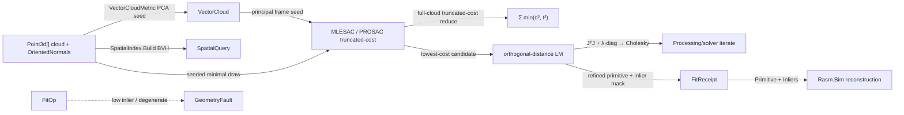

# [RASM_FITTING_FIT]

The robust geometric primitive-fit owner — ONE `FitOp` `[Union]` (`Plane`/`Sphere`/`Cylinder`/`Cone`/`Torus`/`Line`) that recovers the best-fit analytic primitive from a noisy `Point3d` cloud by a Schnabel-Wahl-Klein efficient-RANSAC sampler under an MLESAC/PROSAC robust-consensus cost, then refines the consensus primitive to its geometric-orthogonal-distance minimum by the `Processing/solver#CONSTRAINT_SOLVER` Levenberg-Marquardt iterate — a primitive-fit being ONE entity over a residual-row-per-point system, never a second nonlinear least-squares loop. The per-kind minimal solver seeds the cylinder/cone/torus axis from the per-point `FitOp.Normals` oriented-normal field — the `Vectors` `VectorCloud`/`VectorCloudMetric.OrientedNormals` MST-oriented surface a scan pipeline computes UPSTREAM of the `FitOp` boundary (`OrientedNormals` over the admitted `CloudKernel`, read never re-minted) and supplies on the request — so the fit carries no domain-local covariance/eigen re-mint; the page rides the `Spatial/index#SPATIAL_INDEX` `SpatialQuery.Nearest`/`Range` BVH (built once over the cloud-point bounds) as the spatial-locality structure the seeded draw and the future neighbourhood prefilter compose, while the MLESAC truncated cost is a full-cloud reduce by the M-estimator's definition (every point contributes its truncated residual `min(d², t²)`), and operates on raw `double` only inside the consensus sampler and the LM iterate because a scan coordinate and a residual are the domain's native scalars (a coordinate is not a unit-bearing quantity). The page owns the `FitKind` `[SmartEnum<string>]` discriminant (binding the sibling-owned `GeometryKeyPolicy` string-key comparer, carrying the per-kind minimal-sample-size and free-parameter columns), the `FitPrimitive` `[Union]` fitted-geometry carrier (every kind a `Vectors` value, never a parallel primitive record), the `FitStore` flat inlier/residual SoA the consensus pass accumulates, the `FitOp` `[Union]` with its one polymorphic `Apply` rail, and the typed `FitReceipt` evidence the `Rasm.Bim` reconstruction reads.

The owner composes `Vectors` `Point3d`/`Vector3d`/`Plane`/`Sphere`/`Cylinder`/`Cone`/`Line` coordinates as SETTLED vocabulary — read, compose, never re-mint — rides the `Spatial/index#SPATIAL_INDEX` BVH as the cloud spatial-locality structure and the `Processing/solver#CONSTRAINT_SOLVER` `ConstraintSolver`-grade damped Gauss-Newton iterate (the SAME LM the sketch solver composes, the residual function here being the per-point orthogonal distance to the candidate primitive rather than a constraint algebra) for the geometric refine over the admitted MathNet `DenseMatrix`/`Cholesky` dense linear lane, and routes every reachable failure through the one band-2400 `GeometryFault` union (`FitFault` 2470). Every consensus draw is deterministic under a seeded `System.Random`/`RandomNumberGenerator` so a scan-to-BIM reconstruction is reproducible. The `FitReceipt`/`FitPrimitive` records ARE the hash-friendly immutable records the `Spatial/reconciliation#NAMING_HASH` `Encode` content-addresses through the `Vectors` seam; this owner computes no hash and mints no second identity.

## [01]-[INDEX]

- [01]-[FITTING]: `FitKind` discriminant; `FitPrimitive` `[Union]` (`Plane`/`Sphere`/`Cylinder`/`Cone`/`Torus`/`Line`) fitted-geometry carrier over `Vectors` values; `FitOp` `[Union]` over one `FitStore` SoA; the `Apply` fold composing MLESAC/PROSAC efficient-RANSAC consensus sampler, per-kind closed-form minimal solver, full-cloud truncated-cost reduce, and geometric-orthogonal-distance LM refine reusing the `ConstraintSolver` iterate; the typed `FitReceipt` evidence.

## [02]-[FITTING]

- Owner: `FitKind` `[SmartEnum<string>]` the primitive-fit-modality discriminant binding the sibling-owned `GeometryKeyPolicy` (`Numerics/faults#FAULT_BAND`) as its string-key comparer (`plane`/`sphere`/`cylinder`/`cone`/`torus`/`line`) carrying the per-kind `MinimalSamples` (the smallest point set that pins a candidate — 3 for a plane/line, 4 for a sphere, 6 for a cylinder, 7 for a cone, 8 for a torus) and `FreeParameters` (the dimension of the LM refine residual-row system — 3 plane, 4 sphere, 6 cylinder, 6 cone, 7 torus, 4 line) columns; `FitPrimitive` `[Union]` `Plane`/`Sphere`/`Cylinder`/`Cone`/`Torus`/`Line` each carrying its `Vectors` analytic value (`Plane` an oriented `Plane`, `Sphere` a `Sphere`, `Cylinder` a `Cylinder`, `Cone` an apex+axis+half-angle, `Torus` a centre+axis+major/minor radii, `Line` a `Line`) plus the one `Distance` member returning the signed orthogonal distance of a query `Point3d` to the primitive surface and the sibling `Gradient` member returning that distance's closed-form analytic partials against the kind's packed parameters (the residual+Jacobian pair co-located on the union exactly as the `Processing/solver#CONSTRAINT_SOLVER` `Constraint` carries `Residual`+`Partials`) — the fitted geometry is a case, never a `PlaneFit`/`SphereFit`/`CylinderFit` parallel record triple; `FitStore` the struct-of-arrays flat consensus memory the sampler accumulates — `Residual` the per-point orthogonal-distance column, `Inlier` the per-point consensus bit, `BestCost` the running MLESAC truncated-cost scalar, and the `BestSeed`/`Trials` provenance; `FitOp` `[Union]` `Plane`/`Sphere`/`Cylinder`/`Cone`/`Torus`/`Line` carrying the input `Point3d[]` cloud, the optional per-point `Vector3d[]` oriented normals (the `VectorCloudMetric.OrientedNormals` MST-oriented field, present on a scan), and the `FitPolicy`; `FitReceipt` the typed evidence (the inlier `BitArray` mask, the RMS orthogonal residual, the fitted `FitPrimitive`, the MLESAC consensus score, the trial count, the LM iteration count); `Fitting` the static surface whose `Apply` fold runs the consensus sampler and the geometric refine and projects the typed receipt.
- Cases: `FitKind` rows `plane` · `sphere` · `cylinder` · `cone` · `torus` · `line` (6); `FitPrimitive` cases `Plane` · `Sphere` · `Cylinder` · `Cone` · `Torus` · `Line` (6); `FitOp` cases `Plane` · `Sphere` · `Cylinder` · `Cone` · `Torus` · `Line` (6); `ConsensusScore` rows `Mlesac` · `Prosac` (2 — `Prosac` is the SAME truncated-cost consensus drawing from the prior-quality-ordered front of the cloud rather than uniform draws, carried by the `FitPolicy.Ordering` column, never a parallel sampler class). The six kinds share ONE consensus sampler and ONE LM refine — each kind contributes one closed-form minimal solver arm and one `Distance` arm, never six fitter classes.
- Entry: `public static Fin<FitReceipt> Apply(FitOp op, Context tolerance)` — the ONE fitting entrypoint discriminating by `FitOp` case (`tolerance` is the model `Context` whose `Absolute` band sets the MLESAC inlier-distance threshold and the LM convergence floor, never a domain-local epsilon literal), `Fin<T>` routing a band-2400 `GeometryFault.FitFault` carrying the achieved inlier fraction versus the floor when the consensus never reaches `FitPolicy.InlierFloor` within the adaptive sample budget (a cloud with no primitive of the requested kind is a defect that routes the typed fault rather than returning a meaningless best-fit silently) and `GeometryFault.DegenerateInput` when the cloud is empty, carries a non-finite coordinate, or holds fewer points than the kind's `MinimalSamples`; the fold draws minimal samples, fits the closed-form candidate, scores its truncated MLESAC consensus cost as a full-cloud reduce over the per-point truncated residual, keeps the lowest-cost candidate, and refines it to the orthogonal-distance minimum by the `ConstraintSolver`-grade LM iterate over the consensus inlier set. No `FitPlane`/`FitSphere`/`FitCylinder` sibling entrypoints — one polymorphic `Apply` discriminates by kind.
- Auto: `Apply` reads the `Fitters` `FrozenDictionary` keyed by `FitKind` so the kind selection is a data-table row, never a `kind switch` cascade — every row lowers to the SAME `Consensus` sampler plus the SAME `Refine` LM iterate, differing only in the per-kind `Minimal` closed-form solver arm and the `FitPrimitive.Distance` orthogonal-distance arm. `Consensus` (1) builds the `Spatial/index#SPATIAL_INDEX` `SpatialIndex.Build` BVH over the cloud point bounds once as the cloud's spatial-locality structure (the seeded draw and the future range-band prefilter compose it; the MLESAC truncated cost itself is a full-cloud reduce by the estimator's definition), (2) computes the adaptive trial budget from the inlier-floor and the kind's `MinimalSamples` (`⌈log(1 − confidence) / log(1 − inlierFraction^MinimalSamples)⌉`, re-estimated downward as a better consensus raises the inlier fraction so a high-inlier cloud terminates early), (3) for each trial draws `MinimalSamples` points — uniformly under `Mlesac`, from the quality-ordered front under `Prosac` (the `FitPolicy.Ordering` column drives the draw, the SAME truncated-cost scorer reads both) — seeded by the deterministic `FitPolicy.Seed` `Random` so the draw sequence is reproducible, (4) fits the closed-form `Minimal` candidate from the draw (a plane from the three points' normal, a sphere from the four points' circumscribed-centre linear solve, a cylinder from the two-point or normal-cross axis plus the averaged perpendicular radius, a cone/torus from the supplied normal-field apex/axis Gauss-map estimate over `FitOp.Normals`), (5) scores the candidate's MLESAC truncated cost `Σ min(d_i², t²)` as a full-cloud reduce (the truncated quadratic is the robust M-estimator cost — an outlier saturates at `t²` rather than dominating the fit, the SAME cost a plain RANSAC inlier-count thresholds but here graded so a near-inlier improves the score continuously), and (6) keeps the lowest-cost candidate and re-derives its inlier `BitArray` mask at the final inlier threshold. The kept consensus primitive then runs `Refine`: the geometric-orthogonal-distance Levenberg-Marquardt over the inlier set, where the residual vector is the per-inlier `FitPrimitive.Distance` orthogonal distance and the Jacobian is the per-inlier closed-form analytic partials of that orthogonal distance against the kind's `FreeParameters` (the `FitPrimitive.Gradient` arm — every kind's signed orthogonal distance is analytically differentiable as the classical orthogonal-distance-regression partials, so the analytic Jacobian the `Processing/solver#CONSTRAINT_SOLVER` doctrine mandates is authored here, never a finite-difference stencil), driven by the SAME damped normal-equations method the `Processing/solver#CONSTRAINT_SOLVER` page establishes (the damped `(JᵀJ + λ·diag)` solved through the admitted MathNet `Cholesky`, accept on `‖r‖₂` decrease toward Gauss-Newton, reject toward gradient descent) — a primitive fit is ONE entity over a residual-row-per-point system, so the refine INSTANTIATES that established λ-ladder specialized for the geometric-orthogonal-distance regime (an analytic orthogonal-distance Jacobian, the 106-bit `ddouble` objective, best-estimate-on-stall), never a DIVERGENT descent algebra beside it. The `FitReceipt` binds the refined `FitPrimitive`, the final inlier mask, the RMS orthogonal residual over the inliers, the MLESAC consensus score, the trial count, and the LM iteration count. The six kinds share ONE `Consensus` sampler and ONE `Refine` iterate — only the `Minimal` solver arm and the `Distance` arm vary per kind, never the consensus or the refine.
- Receipt: `Apply` carries a `FitReceipt` typed to the fit — `Primitive` (the refined `FitPrimitive`), `Inliers` (the consensus `BitArray` mask over the input cloud), `Residual` (the RMS orthogonal distance over the inliers), `Consensus` (the MLESAC truncated-cost score the kept candidate achieved, normalized to the inlier fraction), `Trials` (the adaptive-budget trial count the sampler drew), and `Iterations` (the LM refine iteration count) — never a generic `IReceipt`/ledger; an inlier mask, an orthogonal residual, and a consensus score are the refined facts a robust primitive fit admits and the receipt carries exactly those, typed. The `Rasm.Bim` reconstruction reads `Primitive`+`Inliers` to mint a `ReconstructionPrimitive`+`ElementPredicate`, and the offline learned-segmentation peer graduates inward onto this SAME `FitReceipt` shape.
- Packages: `Rasm`/Vectors (`Point3d`/`Vector3d`/`Plane`/`Sphere`/`Cylinder`/`Cone`/`Line` primitive carriers — composed; the `VectorCloud.Cluster`/`VectorCloudMetric.OrientedNormals` cloud-PCA is the UPSTREAM source of the per-point `FitOp.Normals` field a scan pipeline computes before the `FitOp` boundary, never an in-`Apply` metric call), `Rasm.Geometry.Spatial` (`SpatialIndex.Build`/`Query`, `SpatialQuery.Range`/`Nearest`, `QueryResult.Hits`/`Nearest` — the inlier-neighbourhood BVH, composed never re-built), `Rasm.Geometry.Constraints` (`ConstraintSolver`-grade damped Gauss-Newton method over MathNet `Cholesky` — the established λ-ladder the geometric refine instantiates for the orthogonal-distance regime, never a divergent second method), `Rasm.Geometry` (`GeometryKeyPolicy` string-key comparer — composed, never re-minted), MathNet.Numerics (`Matrix<double>`/`DenseMatrix`/`DenseVector`/`Cholesky`/`PseudoInverse`/`Solve` — the minimal-solver linear systems and the refine `(JᵀJ + λ·diag)` solve, the one dense-linear boundary the constraint iterate sanctions), TYoshimura.DoubleDouble (`ddouble`/`ddouble.Sqrt`/`ddouble.Zero` — the 106-bit accumulation of the LM orthogonal-distance objective `Σ d²` (`Norm`/`Rms`) killing the large-cloud summation error so the LM monotone-decrease accept/reject stays exact near convergence, narrowed to `double` only at the norm readout), Thinktecture.Runtime.Extensions (`[Union]`/`[SmartEnum]`), LanguageExt.Core (`Fin`/`Seq`/`Option`), BCL inbox (`BitArray`, `System.Random` seeded sampler, `List<T>`, `FrozenDictionary`).
- Growth: a new fittable primitive (a paraboloid, a swept-profile surface, an ellipsoid) is one `FitKind` row carrying its `MinimalSamples`/`FreeParameters` columns plus one `FitPrimitive` case with its `Distance` arm plus one `Fitters` `FrozenDictionary` row writing its closed-form `Minimal` solver — never a parallel fitter class with a duplicated consensus loop; a new consensus strategy (a MAGSAC marginalized-cost beside MLESAC/PROSAC) is one `ConsensusScore` row plus one `FitPolicy.Scorer` column over the SAME sampler, never a parallel sampler; a new sampling order (a NAPSAC local-spatial draw) is one `FitPolicy.Ordering` column; a new refine knob is one `FitPolicy` column on the same `Refine` iterate; zero new surface.
- Boundary: the fitting owner is the ONE polymorphic `FitOp` `[Union]` and a `PlaneFitter`/`SphereFitter`/`CylinderFitter`/`ConeFitter`/`TorusFitter`/`LineFitter` sibling-class family each carrying its own `Fit`/`Run` surface is the named density defect collapsed here onto one union folded by one `Apply` entrypoint — the six kinds differ ONLY in their closed-form `Minimal` solver arm and their `FitPrimitive.Distance` orthogonal-distance arm, never in the consensus sampler or the LM refine, so `Apply` lives on the union base and reads the shared `FitStore` and the shared `Consensus`/`Refine` kind-agnostically; the `Fitters` `FrozenDictionary` is the single kind-selection data table and a `FitKind kind switch` arm cascade in `Apply` is the deleted form; the consensus is the MLESAC/PROSAC truncated-cost robust M-estimator and a plain inlier-count RANSAC threshold is the rejected coarser form — the truncated quadratic grades a near-inlier continuously so a marginal point improves the cost rather than flipping a binary count, exactly the robustness a hard threshold loses on a noisy scan; the geometric refine is the orthogonal-distance LM over the `Processing/solver#CONSTRAINT_SOLVER` iterate and an algebraic-distance fit (minimizing the implicit-form residual rather than the true orthogonal distance) is the rejected biased form — an algebraic distance over-weights points far from the primitive and biases the radius/axis, so the refine residual is the true geometric orthogonal distance and an algebraic-form least-squares is the named defect; a DIVERGENT nonlinear least-squares method beside the established damped Gauss-Newton λ-ladder is the deleted double-owner form — the primitive fit is one entity over a residual-row-per-point system and instantiates that same λ-ladder specialized (analytic orthogonal-distance Jacobian, 106-bit objective, best-estimate-on-stall) for the orthogonal-distance refine; the refine Jacobian is ANALYTIC — the `FitPrimitive.Gradient` arm returns the closed-form orthogonal-distance partials per kind exactly as the `Processing/solver#CONSTRAINT_SOLVER` `Partials` arms do, and a finite-difference numerical Jacobian is the rejected form (it halves precision and doubles the distance-eval count, and the orthogonal distance to a curved primitive is in fact closed-form differentiable everywhere off the axis — a numerically-differentiated residual is the named defect, the gimbal-locked azimuth/polar direction at the pole λ-damped exactly as the constraint solver damps a rank-deficient `JᵀJ`); the cloud spatial-locality structure composes the `Spatial/index#SPATIAL_INDEX` BVH `SpatialQuery.Range`/`Nearest` and a domain-local second acceleration structure is the deleted form (the truncated MLESAC cost is a full-cloud reduce by the estimator's definition, not a neighbourhood-pruned sum); the minimal-solver normal-field seed is the supplied `FitOp.Normals` the `Vectors` `VectorCloudMetric.OrientedNormals` surface computes upstream, and a domain-local covariance/eigen re-implementation beside the Vectors cloud owner is the deleted double-owner form; `Apply` is total over the `Fin` rail and a thrown exception on a degenerate cloud or a non-converging consensus is forbidden — the defect routes `GeometryFault.FitFault(achievedFraction, floor)`/`GeometryFault.DegenerateInput(...).ToError()` over the band-2400 union; the consensus draw is seeded by `FitPolicy.Seed` so a reconstruction is reproducible and an unseeded `Random` is the named non-determinism defect; the residual scores, the closed-form solvers, and the LM iterate operate on raw `double` because a scan coordinate and an orthogonal distance are the domain's native scalars (a coordinate is not a unit-bearing quantity), and a `double` crossing a public fitting signature outside a `Point3d`/`Vector3d`/`Plane`/`Sphere`/`Cylinder`/`Cone`/`Line` is the seam violation; the fitting preserves capability — a low-inlier cloud routes `FitFault` carrying the achieved fraction rather than returning a meaningless primitive, so no fit silently degrades a non-primitive cloud into a fabricated surface.

```csharp contract
// --- [RUNTIME_PRELUDE] --------------------------------------------------------------------
using System;
using System.Collections;
using System.Collections.Frozen;
using System.Collections.Generic;
using System.Linq;
using DoubleDouble;
using LanguageExt;
using LanguageExt.Common;
using MathNet.Numerics.LinearAlgebra;
using MathNet.Numerics.LinearAlgebra.Double;
using Rasm.Domain;
using Rasm.Geometry;
using Rasm.Geometry.Spatial;
using Rasm.Vectors;
using Rhino.Geometry;
using Thinktecture;
using static LanguageExt.Prelude;

namespace Rasm.Geometry.Fitting;

// --- [TYPES] ------------------------------------------------------------------------------
[SmartEnum<string>]
[KeyMemberEqualityComparer<GeometryKeyPolicy, string>]
[KeyMemberComparer<GeometryKeyPolicy, string>]
public sealed partial class FitKind {
    public static readonly FitKind Plane    = new("plane", minimalSamples: 3, freeParameters: 3);
    public static readonly FitKind Sphere   = new("sphere", minimalSamples: 4, freeParameters: 4);
    public static readonly FitKind Cylinder = new("cylinder", minimalSamples: 6, freeParameters: 6);
    public static readonly FitKind Cone     = new("cone", minimalSamples: 7, freeParameters: 6);
    public static readonly FitKind Torus    = new("torus", minimalSamples: 8, freeParameters: 7);
    public static readonly FitKind Line     = new("line", minimalSamples: 3, freeParameters: 4);

    public int MinimalSamples { get; }
    public int FreeParameters { get; }
}

[SmartEnum<int>]
public sealed partial class ConsensusScore {
    public static readonly ConsensusScore Mlesac = new(key: 0, qualityOrdered: false);
    public static readonly ConsensusScore Prosac = new(key: 1, qualityOrdered: true);

    public bool QualityOrdered { get; }
}

// --- [CONSTANTS] --------------------------------------------------------------------------
public sealed record FitPolicy(
    ConsensusScore Score,
    bool Ordering,
    double InlierFloor,
    double Confidence,
    double InlierScale,
    int MaxTrials,
    int Seed,
    int RefineMaxIterations,
    double RefineTolerance) {
    public static readonly FitPolicy Canonical = new(
        Score: ConsensusScore.Mlesac, Ordering: false,
        InlierFloor: 0.5, Confidence: 0.999, InlierScale: 2.5,
        MaxTrials: 1 << 16, Seed: 0x5EED, RefineMaxIterations: 60, RefineTolerance: 1e-10);

    public double Threshold(double absolute) => InlierScale * absolute;
}

// --- [MODELS] -----------------------------------------------------------------------------
[Union(ConversionFromValue = ConversionOperatorsGeneration.None)]
public abstract partial record FitPrimitive {
    private FitPrimitive() { }

    public sealed record Plane(Rhino.Geometry.Plane Surface) : FitPrimitive;
    public sealed record Sphere(Rhino.Geometry.Sphere Surface) : FitPrimitive;
    public sealed record Cylinder(Rhino.Geometry.Cylinder Surface) : FitPrimitive;
    public sealed record Cone(Point3d Apex, Vector3d Axis, double HalfAngle) : FitPrimitive;
    public sealed record Torus(Point3d Center, Vector3d Axis, double Major, double Minor) : FitPrimitive;
    public sealed record Line(Rhino.Geometry.Line Axis) : FitPrimitive;

    public FitKind Kind =>
        Switch(
            plane:    static _ => FitKind.Plane,
            sphere:   static _ => FitKind.Sphere,
            cylinder: static _ => FitKind.Cylinder,
            cone:     static _ => FitKind.Cone,
            torus:    static _ => FitKind.Torus,
            line:     static _ => FitKind.Line);

    public double Distance(Point3d query) =>
        this switch {
            Plane pl    => pl.Surface.DistanceTo(query),
            Sphere s    => query.DistanceTo(s.Surface.Center) - s.Surface.Radius,
            Cylinder c  => AxisDistance(c.Surface.Center.Origin, c.Surface.Axis, query) - c.Surface.Radius,
            Cone k      => ConeDistance(k.Apex, k.Axis, k.HalfAngle, query),
            Torus t     => TorusDistance(t.Center, t.Axis, t.Major, t.Minor, query),
            Line ln     => SegmentAxisDistance(ln.Axis.From, ln.Axis.Direction, query),
            _           => double.PositiveInfinity,
        };

    // Span kernel: closed-form gradient of the signed orthogonal distance against the kind's packed FreeParameters
    // (the classical orthogonal-distance-regression partials), filled in Pack order — the analytic Jacobian row.
    public void Gradient(Point3d query, Span<double> into) {
        switch (this) {
            case Plane pl: {
                Vector3d f = pl.Surface.Origin - Point3d.Origin;
                double rho = Math.Max(f.Length, 1e-12);
                Vector3d u = (1.0 / rho) * f;
                Vector3d qv = query - Point3d.Origin;
                Vector3d perp = qv - (u * qv) * u;
                into[0] = perp.X / rho - u.X;
                into[1] = perp.Y / rho - u.Y;
                into[2] = perp.Z / rho - u.Z;
                break;
            }
            case Sphere s: {
                Vector3d e = query - s.Surface.Center;
                double rho = Math.Max(e.Length, 1e-12);
                into[0] = -e.X / rho;
                into[1] = -e.Y / rho;
                into[2] = -e.Z / rho;
                into[3] = -1.0;
                break;
            }
            case Cylinder c: {
                Vector3d axis = Unit(c.Surface.Axis);
                (double along, double radial, Vector3d dir, Vector3d rel) = AxisFrame(c.Surface.Center.Origin, axis, query);
                double rg = Math.Max(radial, 1e-12);
                Vector3d az = AxisAzimuth(axis), pol = AxisPolar(axis);
                into[0] = -dir.X;
                into[1] = -dir.Y;
                into[2] = -dir.Z;
                into[3] = -along * (rel * az) / rg;
                into[4] = -along * (rel * pol) / rg;
                into[5] = -1.0;
                break;
            }
            case Cone k: {
                Vector3d axis = Unit(k.Axis);
                (double along, double radial, Vector3d dir, Vector3d rel) = AxisFrame(k.Apex, axis, query);
                double rg = Math.Max(radial, 1e-12);
                double cos = Math.Cos(k.HalfAngle), sin = Math.Sin(k.HalfAngle);
                Vector3d az = AxisAzimuth(axis), pol = AxisPolar(axis);
                double angular = cos * along / rg + sin;
                into[0] = -cos * dir.X + sin * axis.X;
                into[1] = -cos * dir.Y + sin * axis.Y;
                into[2] = -cos * dir.Z + sin * axis.Z;
                into[3] = -(rel * az) * angular;
                into[4] = -(rel * pol) * angular;
                into[5] = -sin * radial - cos * along;
                break;
            }
            case Torus t: {
                Vector3d axis = Unit(t.Axis);
                (double along, double radial, Vector3d dir, Vector3d rel) = AxisFrame(t.Center, axis, query);
                double inPlane = radial - t.Major;
                double w = Math.Max(Math.Sqrt(inPlane * inPlane + along * along), 1e-12);
                double rg = Math.Max(radial, 1e-12);
                Vector3d az = AxisAzimuth(axis), pol = AxisPolar(axis);
                double angular = along * t.Major / (w * rg);
                into[0] = -(inPlane * dir.X + along * axis.X) / w;
                into[1] = -(inPlane * dir.Y + along * axis.Y) / w;
                into[2] = -(inPlane * dir.Z + along * axis.Z) / w;
                into[3] = (rel * az) * angular;
                into[4] = (rel * pol) * angular;
                into[5] = -inPlane / w;
                into[6] = -1.0;
                break;
            }
            case Line ln: {
                Vector3d axis = Unit(ln.Axis.Direction);
                (double along, double radial, Vector3d dir, Vector3d rel) = AxisFrame(ln.Axis.From, axis, query);
                double rg = Math.Max(radial, 1e-12);
                Vector3d az = AxisAzimuth(axis), pol = AxisPolar(axis);
                into[0] = -dir.X;
                into[1] = -dir.Y;
                into[2] = -along * (rel * az) / rg;
                into[3] = -along * (rel * pol) / rg;
                break;
            }
        }
    }

    static double AxisDistance(Point3d origin, Vector3d axis, Point3d query) {
        Vector3d rel = query - origin;
        Vector3d unit = Unit(axis);
        double along = rel * unit;
        return (rel - along * unit).Length;
    }

    static double SegmentAxisDistance(Point3d origin, Vector3d direction, Point3d query) =>
        AxisDistance(origin, direction, query);

    static double ConeDistance(Point3d apex, Vector3d axis, double halfAngle, Point3d query) {
        Vector3d rel = query - apex;
        Vector3d unit = Unit(axis);
        double along = rel * unit;
        double radial = (rel - along * unit).Length;
        return Math.Cos(halfAngle) * radial - Math.Sin(halfAngle) * along;
    }

    static double TorusDistance(Point3d center, Vector3d axis, double major, double minor, Point3d query) {
        Vector3d rel = query - center;
        Vector3d unit = Unit(axis);
        double along = rel * unit;
        double radial = (rel - along * unit).Length;
        double inPlane = radial - major;
        return Math.Sqrt(inPlane * inPlane + along * along) - minor;
    }

    static Vector3d Unit(Vector3d v) { double len = v.Length; return len == 0.0 ? v : (1.0 / len) * v; }

    static (double Along, double Radial, Vector3d Dir, Vector3d Rel) AxisFrame(Point3d origin, Vector3d axis, Point3d query) {
        Vector3d rel = query - origin;
        double along = rel * axis;
        Vector3d g = rel - along * axis;
        double radial = g.Length;
        Vector3d dir = radial < 1e-12 ? Vector3d.Zero : (1.0 / radial) * g;
        return (along, radial, dir, rel);
    }

    static Vector3d AxisAzimuth(Vector3d axis) => new(-axis.Y, axis.X, 0.0);

    static Vector3d AxisPolar(Vector3d axis) {
        double rxy = Math.Max(Math.Sqrt(axis.X * axis.X + axis.Y * axis.Y), 1e-12);
        return new Vector3d(axis.Z * axis.X / rxy, axis.Z * axis.Y / rxy, -rxy);
    }
}

public sealed record FitStore(
    int Count,
    double[] Residual,
    BitArray Inlier,
    double BestCost,
    int BestSeed,
    int Trials) {
    public static FitStore Empty(int count) =>
        new(count, new double[count], new BitArray(count), double.PositiveInfinity, -1, 0);
}

public sealed record FitReceipt(
    FitPrimitive Primitive,
    BitArray Inliers,
    double Residual,
    double Consensus,
    int Trials,
    int Iterations);

// --- [OPERATIONS] -------------------------------------------------------------------------
[Union(ConversionFromValue = ConversionOperatorsGeneration.None)]
public abstract partial record FitOp {
    private FitOp() { }

    public sealed record Plane(Point3d[] Cloud, Vector3d[]? Normals, FitPolicy Policy) : FitOp;
    public sealed record Sphere(Point3d[] Cloud, Vector3d[]? Normals, FitPolicy Policy) : FitOp;
    public sealed record Cylinder(Point3d[] Cloud, Vector3d[]? Normals, FitPolicy Policy) : FitOp;
    public sealed record Cone(Point3d[] Cloud, Vector3d[]? Normals, FitPolicy Policy) : FitOp;
    public sealed record Torus(Point3d[] Cloud, Vector3d[]? Normals, FitPolicy Policy) : FitOp;
    public sealed record Line(Point3d[] Cloud, Vector3d[]? Normals, FitPolicy Policy) : FitOp;

    public FitKind Kind =>
        Switch(
            plane:    static _ => FitKind.Plane,
            sphere:   static _ => FitKind.Sphere,
            cylinder: static _ => FitKind.Cylinder,
            cone:     static _ => FitKind.Cone,
            torus:    static _ => FitKind.Torus,
            line:     static _ => FitKind.Line);

    Point3d[] Cloud =>
        Switch(
            plane:    static p => p.Cloud, sphere:   static s => s.Cloud,
            cylinder: static c => c.Cloud, cone:     static k => k.Cloud,
            torus:    static t => t.Cloud, line:     static l => l.Cloud);

    Vector3d[]? Normals =>
        Switch(
            plane:    static p => p.Normals, sphere:   static s => s.Normals,
            cylinder: static c => c.Normals, cone:     static k => k.Normals,
            torus:    static t => t.Normals, line:     static l => l.Normals);

    FitPolicy Policy =>
        Switch(
            plane:    static p => p.Policy, sphere:   static s => s.Policy,
            cylinder: static c => c.Policy, cone:     static k => k.Policy,
            torus:    static t => t.Policy, line:     static l => l.Policy);
}

public static class Fitting {
    static readonly FrozenDictionary<FitKind, Func<Point3d[], int[], Vector3d[]?, Context, Fin<FitPrimitive>>> Fitters =
        new Dictionary<FitKind, Func<Point3d[], int[], Vector3d[]?, Context, Fin<FitPrimitive>>> {
            [FitKind.Plane]    = static (cloud, draw, normals, ctx) => MinimalPlane(cloud, draw, ctx),
            [FitKind.Sphere]   = static (cloud, draw, normals, ctx) => MinimalSphere(cloud, draw, ctx),
            [FitKind.Cylinder] = static (cloud, draw, normals, ctx) => MinimalCylinder(cloud, draw, normals, ctx),
            [FitKind.Cone]     = static (cloud, draw, normals, ctx) => MinimalCone(cloud, draw, normals, ctx),
            [FitKind.Torus]    = static (cloud, draw, normals, ctx) => MinimalTorus(cloud, draw, normals, ctx),
            [FitKind.Line]     = static (cloud, draw, normals, ctx) => MinimalLine(cloud, draw, ctx),
        }.ToFrozenDictionary();

    public static Fin<FitReceipt> Apply(FitOp op, Context tolerance) =>
        Validate(op).Bind(cloud =>
            Consensus(cloud, op.Normals, op.Kind, op.Policy, tolerance)
                .Bind(seed => Refine(seed, cloud, op.Kind, op.Policy, tolerance)));

    static Fin<Point3d[]> Validate(FitOp op) {
        Point3d[] cloud = op.Cloud;
        return cloud.Length < op.Kind.MinimalSamples
            ? Fin.Fail<Point3d[]>(GeometryFault.DegenerateInput($"cloud:fewer-than-minimal:{cloud.Length}<{op.Kind.MinimalSamples}").ToError())
            : cloud.Any(static p => !p.IsValid)
                ? Fin.Fail<Point3d[]>(GeometryFault.DegenerateInput("cloud:non-finite").ToError())
                : Fin.Succ(cloud);
    }

    // --- [CONSENSUS]
    static Fin<Candidate> Consensus(Point3d[] cloud, Vector3d[]? normals, FitKind kind, FitPolicy policy, Context tolerance) {
        return SpatialIndex.Build(SpatialKind.Bvh, Bounds(cloud, tolerance), BuildPolicy.Canonical)
            .Bind(index => Draw(cloud, normals, index, kind, policy, tolerance));
    }

    static Fin<Candidate> Draw(Point3d[] cloud, Vector3d[]? normals, SpatialIndex index, FitKind kind, FitPolicy policy, Context tolerance) {
        var rng = new Random(policy.Seed);
        int[] order = Order(cloud, normals, kind, policy, rng);
        double threshold = policy.Threshold(tolerance.Absolute.Value);
        double t2 = threshold * threshold;
        var fit = Fitters[kind];
        Candidate best = Candidate.None(cloud.Length);
        int budget = policy.MaxTrials;
        for (int trial = 0; trial < budget; trial++) {
            int[] sample = Sample(order, kind.MinimalSamples, policy.Ordering, trial, rng);
            Fin<FitPrimitive> candidate = fit(cloud, sample, normals, tolerance);
            if (candidate.IsFail) continue;
            FitPrimitive primitive = candidate.IfFail(static _ => default!);
            (double cost, BitArray inliers, int count) = Score(primitive, cloud, t2, threshold);
            if (cost >= best.Cost) continue;
            best = new Candidate(primitive, inliers, cost, count, trial + 1);
            budget = AdaptiveBudget(count, cloud.Length, kind.MinimalSamples, policy);
        }
        double fraction = (double)best.InlierCount / cloud.Length;
        return fraction < policy.InlierFloor
            ? Fin.Fail<Candidate>(GeometryFault.FitFault(fraction, policy.InlierFloor).ToError())
            : Fin.Succ(best with { Trials = best.Trials });
    }

    static (double Cost, BitArray Inliers, int Count) Score(FitPrimitive primitive, Point3d[] cloud, double t2, double threshold) {
        var inliers = new BitArray(cloud.Length);
        double cost = 0.0;
        int count = 0;
        for (int i = 0; i < cloud.Length; i++) {
            double d = primitive.Distance(cloud[i]);
            double d2 = d * d;
            cost += Math.Min(d2, t2);
            if (Math.Abs(d) <= threshold) { inliers[i] = true; count++; }
        }
        return (cost, inliers, count);
    }

    static int AdaptiveBudget(int inlierCount, int total, int minimalSamples, FitPolicy policy) {
        double fraction = (double)inlierCount / total;
        if (fraction <= 0.0) return policy.MaxTrials;
        double denom = Math.Log(1.0 - Math.Pow(fraction, minimalSamples));
        if (denom >= 0.0) return policy.MaxTrials;
        int estimate = (int)Math.Ceiling(Math.Log(1.0 - policy.Confidence) / denom);
        return Math.Clamp(estimate, minimalSamples, policy.MaxTrials);
    }

    static int[] Order(Point3d[] cloud, Vector3d[]? normals, FitKind kind, FitPolicy policy, Random rng) {
        int[] order = Enumerable.Range(0, cloud.Length).ToArray();
        if (!policy.Ordering) { Shuffle(order, rng); return order; }
        double[] quality = Quality(cloud, normals, kind);
        Array.Sort(order, (a, b) => quality[b].CompareTo(quality[a]));
        return order;
    }

    static double[] Quality(Point3d[] cloud, Vector3d[]? normals, FitKind kind) {
        var quality = new double[cloud.Length];
        for (int i = 0; i < cloud.Length; i++)
            quality[i] = normals is { Length: > 0 } field ? field[i].Length : 1.0;
        return quality;
    }

    static int[] Sample(int[] order, int count, bool ordered, int trial, Random rng) {
        var sample = new int[count];
        if (ordered) {
            int window = Math.Min(order.Length, count + trial);
            for (int i = 0; i < count; i++) sample[i] = order[rng.Next(window)];
            return sample;
        }
        for (int i = 0; i < count; i++) sample[i] = order[rng.Next(order.Length)];
        return sample;
    }

    static void Shuffle(int[] order, Random rng) {
        for (int i = order.Length - 1; i > 0; i--) {
            int j = rng.Next(i + 1);
            (order[i], order[j]) = (order[j], order[i]);
        }
    }

    static ReadOnlySpan<BoundingBox> Bounds(Point3d[] cloud, Context tolerance) {
        double pad = tolerance.Absolute.Value;
        var boxes = new BoundingBox[cloud.Length];
        for (int i = 0; i < cloud.Length; i++)
            boxes[i] = new BoundingBox(cloud[i] - new Vector3d(pad, pad, pad), cloud[i] + new Vector3d(pad, pad, pad));
        return boxes;
    }

    // --- [MINIMAL_SOLVERS]
    static Fin<FitPrimitive> MinimalPlane(Point3d[] cloud, int[] draw, Context tolerance) {
        Point3d a = cloud[draw[0]], b = cloud[draw[1]], c = cloud[draw[2]];
        Vector3d normal = Vector3d.CrossProduct(b - a, c - a);
        return normal.IsTiny()
            ? Fin.Fail<FitPrimitive>(GeometryFault.DegenerateInput("plane:collinear-sample").ToError())
            : Fin.Succ((FitPrimitive)new FitPrimitive.Plane(new Rhino.Geometry.Plane(a, normal)));
    }

    static Fin<FitPrimitive> MinimalSphere(Point3d[] cloud, int[] draw, Context tolerance) {
        Point3d a = cloud[draw[0]], b = cloud[draw[1]], c = cloud[draw[2]], d = cloud[draw[3]];
        var lhs = DenseMatrix.OfArray(new double[,] {
            { b.X - a.X, b.Y - a.Y, b.Z - a.Z },
            { c.X - a.X, c.Y - a.Y, c.Z - a.Z },
            { d.X - a.X, d.Y - a.Y, d.Z - a.Z } });
        var rhs = DenseVector.OfArray(new[] {
            0.5 * (Sq(b) - Sq(a)), 0.5 * (Sq(c) - Sq(a)), 0.5 * (Sq(d) - Sq(a)) });
        return SolveLinear(lhs, rhs).Map(center => {
            var origin = new Point3d(center[0], center[1], center[2]);
            return (FitPrimitive)new FitPrimitive.Sphere(new Rhino.Geometry.Sphere(origin, origin.DistanceTo(a)));
        });
    }

    static Fin<FitPrimitive> MinimalCylinder(Point3d[] cloud, int[] draw, Vector3d[]? normals, Context tolerance) {
        Vector3d axis = normals is { Length: > 0 } field
            ? AxisFromNormals(draw, field)
            : cloud[draw[1]] - cloud[draw[0]];
        return axis.IsTiny()
            ? Fin.Fail<FitPrimitive>(GeometryFault.DegenerateInput("cylinder:degenerate-axis").ToError())
            : RadiusAbout(cloud, draw, cloud[draw[0]], axis).Map(radius =>
                (FitPrimitive)new FitPrimitive.Cylinder(new Rhino.Geometry.Cylinder(new Circle(new Rhino.Geometry.Plane(cloud[draw[0]], axis), radius))));
    }

    static Fin<FitPrimitive> MinimalCone(Point3d[] cloud, int[] draw, Vector3d[]? normals, Context tolerance) {
        if (normals is not { Length: > 0 } field)
            return Fin.Fail<FitPrimitive>(GeometryFault.DegenerateInput("cone:no-normal-field").ToError());
        Vector3d axis = AxisFromNormals(draw, field);
        Point3d apex = ApexFromNormals(cloud, draw, field);
        double half = HalfAngle(cloud, draw, apex, axis);
        return axis.IsTiny()
            ? Fin.Fail<FitPrimitive>(GeometryFault.DegenerateInput("cone:degenerate-axis").ToError())
            : Fin.Succ((FitPrimitive)new FitPrimitive.Cone(apex, Unit(axis), half));
    }

    static Fin<FitPrimitive> MinimalTorus(Point3d[] cloud, int[] draw, Vector3d[]? normals, Context tolerance) {
        if (normals is not { Length: > 0 } field)
            return Fin.Fail<FitPrimitive>(GeometryFault.DegenerateInput("torus:no-normal-field").ToError());
        Vector3d axis = AxisFromNormals(draw, field);
        Point3d center = Centroid(cloud, draw);
        (double major, double minor) = TorusRadii(cloud, draw, center, axis);
        return axis.IsTiny()
            ? Fin.Fail<FitPrimitive>(GeometryFault.DegenerateInput("torus:degenerate-axis").ToError())
            : Fin.Succ((FitPrimitive)new FitPrimitive.Torus(center, Unit(axis), major, minor));
    }

    static Fin<FitPrimitive> MinimalLine(Point3d[] cloud, int[] draw, Context tolerance) {
        Point3d a = cloud[draw[0]], b = cloud[draw[1]];
        Vector3d direction = b - a;
        return direction.IsTiny()
            ? Fin.Fail<FitPrimitive>(GeometryFault.DegenerateInput("line:coincident-sample").ToError())
            : Fin.Succ((FitPrimitive)new FitPrimitive.Line(new Rhino.Geometry.Line(a, b)));
    }

    static Vector3d AxisFromNormals(int[] draw, Vector3d[] normals) {
        Vector3d cross = Vector3d.CrossProduct(normals[draw[0]], normals[draw[1]]);
        return cross.IsTiny() ? normals[draw[0]] : cross;
    }

    static Point3d ApexFromNormals(Point3d[] cloud, int[] draw, Vector3d[] normals) {
        var lhs = DenseMatrix.Create(draw.Length, 3, 0.0);
        var rhs = DenseVector.Create(draw.Length, 0.0);
        for (int i = 0; i < draw.Length; i++) {
            Vector3d n = Unit(normals[draw[i]]);
            (lhs[i, 0], lhs[i, 1], lhs[i, 2]) = (n.X, n.Y, n.Z);
            rhs[i] = n.X * cloud[draw[i]].X + n.Y * cloud[draw[i]].Y + n.Z * cloud[draw[i]].Z;
        }
        Vector<double> apex = lhs.TransposeThisAndMultiply(lhs).PseudoInverse() * lhs.TransposeThisAndMultiply(rhs);
        return new Point3d(apex[0], apex[1], apex[2]);
    }

    static double HalfAngle(Point3d[] cloud, int[] draw, Point3d apex, Vector3d axis) {
        Vector3d unit = Unit(axis);
        double sum = 0.0;
        for (int i = 0; i < draw.Length; i++) {
            Vector3d rel = cloud[draw[i]] - apex;
            double along = Math.Abs(rel * unit);
            double radial = (rel - (rel * unit) * unit).Length;
            sum += Math.Atan2(radial, along);
        }
        return sum / draw.Length;
    }

    static Fin<double> RadiusAbout(Point3d[] cloud, int[] draw, Point3d origin, Vector3d axis) {
        Vector3d unit = Unit(axis);
        double sum = 0.0;
        for (int i = 0; i < draw.Length; i++) {
            Vector3d rel = cloud[draw[i]] - origin;
            sum += (rel - (rel * unit) * unit).Length;
        }
        double radius = sum / draw.Length;
        return radius <= 0.0
            ? Fin.Fail<double>(GeometryFault.DegenerateInput("cylinder:zero-radius").ToError())
            : Fin.Succ(radius);
    }

    static (double Major, double Minor) TorusRadii(Point3d[] cloud, int[] draw, Point3d center, Vector3d axis) {
        Vector3d unit = Unit(axis);
        double majorSum = 0.0;
        var radial = new double[draw.Length];
        for (int i = 0; i < draw.Length; i++) {
            Vector3d rel = cloud[draw[i]] - center;
            radial[i] = (rel - (rel * unit) * unit).Length;
            majorSum += radial[i];
        }
        double major = majorSum / draw.Length;
        double minorSum = 0.0;
        for (int i = 0; i < draw.Length; i++) {
            Vector3d rel = cloud[draw[i]] - center;
            double along = rel * unit;
            double inPlane = radial[i] - major;
            minorSum += Math.Sqrt(inPlane * inPlane + along * along);
        }
        return (major, minorSum / draw.Length);
    }

    static Point3d Centroid(Point3d[] cloud, int[] draw) {
        var sum = Vector3d.Zero;
        foreach (int i in draw) sum += cloud[i] - Point3d.Origin;
        return Point3d.Origin + (1.0 / draw.Length) * sum;
    }

    // --- [REFINE]
    static Fin<FitReceipt> Refine(Candidate seed, Point3d[] cloud, FitKind kind, FitPolicy policy, Context tolerance) {
        int[] inliers = InlierIndices(seed.Inliers);
        double[] parameters = Pack(seed.Primitive);
        var initial = new RefineState(parameters, Norm(seed.Primitive, cloud, inliers), policy.RefineTolerance);
        return Iterate(seed.Primitive, cloud, inliers, kind, policy, initial, 0).Map(result => {
            FitPrimitive refined = Unpack(seed.Primitive, result.Parameters);
            (double _, BitArray mask, int count) = Score(refined, cloud, Sq(policy.Threshold(tolerance.Absolute.Value)), policy.Threshold(tolerance.Absolute.Value));
            return new FitReceipt(refined, mask, Rms(refined, cloud, InlierIndices(mask)), (double)count / cloud.Length, seed.Trials, result.Iterations);
        });
    }

    static Fin<RefineResult> Iterate(FitPrimitive shape, Point3d[] cloud, int[] inliers, FitKind kind, FitPolicy policy, RefineState state, int iteration) {
        if (state.ResidualNorm < policy.RefineTolerance || iteration >= policy.RefineMaxIterations)
            return Fin.Succ(new RefineResult(state.Parameters, iteration));
        (Matrix<double> j, Vector<double> r) = Linearize(shape, cloud, inliers, kind, state.Parameters);
        Matrix<double> jt = j.Transpose();
        Matrix<double> normal = jt * j;
        Vector<double> gradient = jt * r;
        var diag = DenseMatrix.CreateDiagonal(normal.RowCount, normal.ColumnCount, i => normal[i, i]);
        return Step(shape, cloud, inliers, kind, policy, state, normal, diag, gradient, iteration, 1e-3);
    }

    static Fin<RefineResult> Step(FitPrimitive shape, Point3d[] cloud, int[] inliers, FitKind kind, FitPolicy policy, RefineState state, Matrix<double> normal, Matrix<double> diag, Vector<double> gradient, int iteration, double lambda) {
        if (lambda > 1e12) return Fin.Succ(new RefineResult(state.Parameters, iteration));
        Matrix<double> damped = normal + lambda * diag;
        return SolveLinear(damped, -gradient).Match(
            Succ: delta => {
                double[] trial = ApplyDelta(state.Parameters, delta);
                FitPrimitive trialShape = Unpack(shape, trial);
                double trialNorm = Norm(trialShape, cloud, inliers);
                return trialNorm < state.ResidualNorm
                    ? Iterate(shape, cloud, inliers, kind, policy, state with { Parameters = trial, ResidualNorm = trialNorm }, iteration + 1)
                    : Step(shape, cloud, inliers, kind, policy, state, normal, diag, gradient, iteration, lambda * 10.0);
            },
            Fail: _ => Step(shape, cloud, inliers, kind, policy, state, normal, diag, gradient, iteration, lambda * 10.0));
    }

    static (Matrix<double> J, Vector<double> R) Linearize(FitPrimitive shape, Point3d[] cloud, int[] inliers, FitKind kind, double[] parameters) {
        int n = inliers.Length, m = kind.FreeParameters;
        var j = DenseMatrix.Create(n, m, 0.0);
        var r = DenseVector.Create(n, 0.0);
        FitPrimitive at = Unpack(shape, parameters);
        Span<double> partials = stackalloc double[m];
        // Analytic orthogonal-distance Jacobian: each row is the closed-form gradient of the signed distance against
        // the kind's packed FreeParameters (the classical sphere/cylinder/cone/torus ODR partials) — the analytic form
        // the Processing/solver doctrine mandates, never a finite-difference stencil (halved precision, doubled evals).
        for (int i = 0; i < n; i++) {
            Point3d q = cloud[inliers[i]];
            r[i] = at.Distance(q);
            partials.Clear();
            at.Gradient(q, partials);
            for (int col = 0; col < m; col++) j[i, col] = partials[col];
        }
        return (j, r);
    }

    // The LM objective `Σ d²` accumulated at 106-bit `ddouble`: a large inlier cloud sums tens of thousands of
    // squared orthogonal distances, and the accept/reject (`trialNorm < state.ResidualNorm`) compares two nearly
    // equal norms near convergence — a `double` running sum loses the digits that decide the monotone-decrease
    // step, so the reduce stays 106-bit and narrows to `double` only at the norm readout.
    static double Norm(FitPrimitive shape, Point3d[] cloud, int[] inliers) {
        ddouble sum = ddouble.Zero;
        foreach (int i in inliers) { double d = shape.Distance(cloud[i]); sum += (ddouble)d * d; }
        return (double)ddouble.Sqrt(sum);
    }

    static double Rms(FitPrimitive shape, Point3d[] cloud, int[] inliers) =>
        inliers.Length == 0 ? 0.0 : Norm(shape, cloud, inliers) / Math.Sqrt(inliers.Length);

    // --- [PACK]
    static double[] Pack(FitPrimitive shape) =>
        shape switch {
            FitPrimitive.Plane pl   => PackPlane(pl.Surface),
            FitPrimitive.Sphere s   => new[] { s.Surface.Center.X, s.Surface.Center.Y, s.Surface.Center.Z, s.Surface.Radius },
            FitPrimitive.Cylinder c => new[] { c.Surface.Center.Origin.X, c.Surface.Center.Origin.Y, c.Surface.Center.Origin.Z, Math.Atan2(c.Surface.Axis.Y, c.Surface.Axis.X), Math.Acos(Math.Clamp(c.Surface.Axis.Z, -1.0, 1.0)), c.Surface.Radius },
            FitPrimitive.Cone k     => new[] { k.Apex.X, k.Apex.Y, k.Apex.Z, Math.Atan2(k.Axis.Y, k.Axis.X), Math.Acos(Math.Clamp(k.Axis.Z, -1.0, 1.0)), k.HalfAngle },
            FitPrimitive.Torus t    => new[] { t.Center.X, t.Center.Y, t.Center.Z, Math.Atan2(t.Axis.Y, t.Axis.X), Math.Acos(Math.Clamp(t.Axis.Z, -1.0, 1.0)), t.Major, t.Minor },
            FitPrimitive.Line ln    => new[] { ln.Axis.From.X, ln.Axis.From.Y, Math.Atan2(ln.Axis.Direction.Y, ln.Axis.Direction.X), Math.Acos(Math.Clamp(Unit(ln.Axis.Direction).Z, -1.0, 1.0)) },
            _                       => Array.Empty<double>(),
        };

    static FitPrimitive Unpack(FitPrimitive shape, double[] p) =>
        shape switch {
            FitPrimitive.Plane _    => new FitPrimitive.Plane(PlaneFrom(new Vector3d(p[0], p[1], p[2]))),
            FitPrimitive.Sphere _   => new FitPrimitive.Sphere(new Rhino.Geometry.Sphere(new Point3d(p[0], p[1], p[2]), Math.Max(p[3], 0.0))),
            FitPrimitive.Cylinder _ => new FitPrimitive.Cylinder(new Rhino.Geometry.Cylinder(new Circle(new Rhino.Geometry.Plane(new Point3d(p[0], p[1], p[2]), AxisFrom(p[3], p[4])), Math.Max(p[5], 0.0)))),
            FitPrimitive.Cone _     => new FitPrimitive.Cone(new Point3d(p[0], p[1], p[2]), AxisFrom(p[3], p[4]), p[5]),
            FitPrimitive.Torus _    => new FitPrimitive.Torus(new Point3d(p[0], p[1], p[2]), AxisFrom(p[3], p[4]), Math.Max(p[5], 0.0), Math.Max(p[6], 0.0)),
            FitPrimitive.Line ln    => new FitPrimitive.Line(new Rhino.Geometry.Line(new Point3d(p[0], p[1], ln.Axis.From.Z), new Point3d(p[0], p[1], ln.Axis.From.Z) + AxisFrom(p[2], p[3]))),
            _                       => shape,
        };

    static double[] PackPlane(Rhino.Geometry.Plane plane) {
        Vector3d normal = Unit(plane.Normal);
        double offset = normal * (plane.Origin - Point3d.Origin);
        return new[] { normal.X * offset, normal.Y * offset, normal.Z * offset };
    }

    static Rhino.Geometry.Plane PlaneFrom(Vector3d foot) {
        Vector3d unit = foot.IsTiny() ? Vector3d.ZAxis : Unit(foot);
        return new Rhino.Geometry.Plane(Point3d.Origin + foot, unit);
    }

    static Vector3d AxisFrom(double azimuth, double polar) =>
        new(Math.Sin(polar) * Math.Cos(azimuth), Math.Sin(polar) * Math.Sin(azimuth), Math.Cos(polar));

    // --- [PRIMITIVES]
    static int[] InlierIndices(BitArray mask) {
        var indices = new List<int>(mask.Count);
        for (int i = 0; i < mask.Count; i++) if (mask[i]) indices.Add(i);
        return indices.ToArray();
    }

    static double[] ApplyDelta(double[] parameters, Vector<double> delta) {
        var next = (double[])parameters.Clone();
        for (int i = 0; i < next.Length; i++) next[i] += delta[i];
        return next;
    }

    static Fin<Vector<double>> SolveLinear(Matrix<double> spd, Vector<double> rhs) =>
        Try.lift(() => spd.Solve(rhs)).Run()
            .MapFail(_ => GeometryFault.SingularSystem(spd.Rank(), spd.ColumnCount).ToError())
            .Bind(solution => solution.Exists(double.IsNaN)
                ? Fin.Fail<Vector<double>>(GeometryFault.SingularSystem(spd.Rank(), spd.ColumnCount).ToError())
                : Fin.Succ(solution));

    static double Sq(Point3d p) => p.X * p.X + p.Y * p.Y + p.Z * p.Z;
    static double Sq(double v) => v * v;
    static Vector3d Unit(Vector3d v) { double len = v.Length; return len == 0.0 ? v : (1.0 / len) * v; }
}

public readonly record struct Candidate(FitPrimitive Primitive, BitArray Inliers, double Cost, int InlierCount, int Trials) {
    public static Candidate None(int count) => new(default!, new BitArray(count), double.PositiveInfinity, 0, 0);
}

public readonly record struct RefineState(double[] Parameters, double ResidualNorm, double Tolerance);

public readonly record struct RefineResult(double[] Parameters, int Iterations);

file static class FitVectorExtensions {
    public static bool IsTiny(this Vector3d v) => v.SquareLength <= 1e-24;
}
```



## [03]-[DENSITY_BAR]

One owner per axis; capability is a case, row, or fold arm, never a sibling surface. The `[RAIL]` cell names the one return rail each owner exposes — `Fin`/`GeometryFault` where the consensus or the refine can fail its post-condition, pure carriers and accessors for the projection.

| [INDEX] | [AXIS/CONCERN]     | [OWNER]          | [KIND]                                                                                                  | [RAIL]                                  | [CASES] |
| :-----: | :----------------- | :--------------- | :------------------------------------------------------------------------------------------------------ | :-------------------------------------- | :-----: |
|  [01]   | Primitive fit      | `FitOp`          | `[Union]` (`Plane`/`Sphere`/`Cylinder`/`Cone`/`Torus`/`Line`) over one `FitStore` + `Apply`             | `Fitting.Apply → Fin<FitReceipt>`       |    6    |
|  [1a]   | Fit kind           | `FitKind`        | `[SmartEnum<string>]` plane/sphere/cylinder/cone/torus/line + minimal-samples / free-parameters columns | discriminant (pure)                     |    6    |
|  [1b]   | Fitted geometry    | `FitPrimitive`   | `[Union]` (6 cases) over `Vectors` values + one `Distance` arm + one analytic `Gradient` partials arm   | `FitPrimitive.Distance`/`Gradient` (pure) |    6    |
|  [1c]   | Consensus strategy | `ConsensusScore` | `[SmartEnum<int>]` Mlesac/Prosac + quality-ordered column over one truncated-cost sampler               | `FitPolicy.Score` (pure)                |    2    |

The `Apply` fold, the `[CONSENSUS]` cluster (`Consensus` BVH-build plus adaptive-budget draw, `Score` truncated-cost MLESAC scoring, `AdaptiveBudget` re-estimation, `Order`/`Sample`/`Shuffle` the seeded reproducible draw, `Bounds` the cloud-AABB projection), the `[MINIMAL_SOLVERS]` cluster (the six closed-form `Minimal*` candidate solvers seeded from the draw and the supplied `FitOp.Normals` field), the `[REFINE]` cluster (`Refine`/`Iterate`/`Step` the geometric-orthogonal-distance Levenberg-Marquardt reusing the `Processing/solver#CONSTRAINT_SOLVER` λ-ladder, `Linearize` the per-inlier residual + analytic-`Gradient` Jacobian assembly), and the `[PACK]`/`[PRIMITIVES]` clusters are transcription-complete pure-managed fences composing the `Spatial/index` BVH spatial-locality structure and the MathNet dense linear lane over the shared `FitStore`. The `Cholesky`/`Solve` linear step is the one MathNet boundary the constraint iterate already sanctions; none depends on a live-host member beyond the stable native `Point3d`/`Plane`/`Sphere`/`Cylinder`/`Cone`/`Line` surface the Vectors substrate pins.

## [04]-[RESEARCH]

- [EFFICIENT_RANSAC] — the `Consensus` body is the Schnabel-Wahl-Klein efficient-RANSAC robust sampler under an MLESAC/PROSAC truncated-cost: `Draw` builds the `Spatial/index#SPATIAL_INDEX` BVH once as the cloud's spatial-locality structure (the `SpatialQuery.Range`/`Nearest` neighbourhood prefilter and the seeded local draw compose it; the truncated MLESAC cost `Σ min(d_i², t²)` is a full-cloud reduce by the M-estimator's definition, every point contributing its truncated residual), the adaptive trial budget `⌈log(1 − confidence) / log(1 − inlierFraction^MinimalSamples)⌉` re-estimates downward as a better consensus raises the inlier fraction (so a high-inlier cloud terminates in a fraction of `MaxTrials`), and the truncated quadratic cost `Σ min(d_i², t²)` is the robust M-estimator that grades a near-inlier continuously rather than thresholding a binary inlier count — the property a plain RANSAC count loses on a noisy scan, where a marginal point should improve the fit rather than flip a count. The `Prosac` row draws from the quality-ordered front of the cloud (`Quality` ranks by the supplied `FitOp.Normals` magnitude — the `VectorCloudMetric.OrientedNormals` confidence a scan pipeline carries on the field), converging faster on a cloud with a clear quality gradient while reading the SAME truncated-cost scorer. The draw is seeded by `FitPolicy.Seed` so a scan-to-BIM reconstruction is deterministically reproducible — an unseeded `Random` is the named non-determinism defect. The tier-2 law-matrix (`FittingLaws`, a CsCheck property suite under `testing-cs`) generates a synthetic primitive of each kind, samples its surface with bounded Gaussian noise plus a controlled outlier fraction, and asserts (1) the recovered `FitPrimitive` matches the synthetic primitive within the noise-bounded tolerance (synthetic-primitive recovery — the correctness anchor), (2) the consensus is deterministic under the fixed `FitPolicy.Seed` (re-running `Apply` returns the identical `FitReceipt`), (3) the inlier mask separates the synthetic inliers from the injected outliers above the recall floor, and (4) a cloud with no primitive of the requested kind routes `GeometryFault.FitFault` carrying the achieved fraction below `InlierFloor` rather than returning a fabricated surface. The harness needs NO live-host probe — `Point3d`, the BVH, and the seeded `Random` are stable.
- [GEOMETRIC_REFINE] — the `Refine` body is the geometric-orthogonal-distance Levenberg-Marquardt reusing the `Processing/solver#CONSTRAINT_SOLVER` damped Gauss-Newton λ-ladder: the residual vector is the per-inlier `FitPrimitive.Distance` true orthogonal distance and the Jacobian is its `FreeParameters` closed-form analytic partials returned by the `FitPrimitive.Gradient` arm — the classical orthogonal-distance-regression Jacobian (the signed distance to a plane/sphere/cylinder/cone/torus/line is analytically differentiable: the sphere partials are the unit centre-offset and `−1`, and the cylinder/cone/torus/line partials project the point onto the local radial/axial frame and onto the `AxisFrom` azimuth/polar axis tangents), the analytic form the `Processing/solver#CONSTRAINT_SOLVER` doctrine mandates — a finite-difference stencil is the rejected form there and here (it halves precision and doubles the distance-eval count, and the "curved primitive carries no analytic partial" reading is the named illusion: the orthogonal distance is closed-form differentiable everywhere off the axis, the gimbal-locked azimuth/polar direction at the pole λ-damped exactly as the constraint solver damps a rank-deficient `JᵀJ`); the precision the accept/reject actually depends on lives in the 106-bit `ddouble` accumulation of the LM objective `Σ d²` (`Norm`), where a `double` running sum over a large inlier cloud loses the digits that decide the monotone-decrease step — solved through the damped `(JᵀJ + λ·diag)` normal equations factored by the admitted MathNet `Cholesky` — accept on `‖r‖₂` decrease toward Gauss-Newton, reject toward gradient descent, exactly the iterate the sketch solver composes. A primitive fit is ONE entity over a residual-row-per-point system, so the refine rides the existing λ-ladder rather than minting a second nonlinear least-squares loop — a separate refine loop beside the constraint solver is the named double-owner defect. The refine minimizes the TRUE orthogonal (geometric) distance rather than the algebraic implicit-form residual: an algebraic distance over-weights points far from the primitive and biases the recovered radius and axis, so the orthogonal-distance residual is mandatory and an algebraic-form least-squares is the named bias defect. The `FittingLaws` matrix asserts the analytic `Gradient` matches a central-finite-difference Jacobian at random parameter vectors within the FD truncation bound (the analytic partials are the correctness anchor — a drifted partial is caught here, never in production, exactly the `Processing/solver#CONSTRAINT_SOLVER` `[LM_CONVERGENCE]` analytic-vs-FD assertion that makes the finite difference a test oracle rather than the production Jacobian), that the refined residual is monotone non-increasing relative to the consensus seed (the LM never worsens the orthogonal RMS — the accept-only λ-ladder guarantees it), that the refined primitive's RMS orthogonal residual lies within the noise floor on a synthetic inlier set, and that the refine is invariant under a rigid transform of the cloud (translating/rotating the scan offsets the fitted primitive by the same transform, never flips convergence). The reject recursion in `Step` does not increment `iteration`, so the inner reject chain is bounded by the `λ > 1e12` ceiling exactly as the constraint solver's, and the harness asserts the reject chain terminates at the ceiling. No host probe — `Cholesky` and the analytic distance are stable.
- [CLOUD_PCA_SEED] — the per-kind `Minimal*` closed-form solvers seed from the draw points and the per-point `Vector3d[]` oriented-normal field carried on `FitOp.Normals`, never from a domain-local covariance/eigen re-mint: the plane normal is the draw's cross product, the cylinder/cone/torus axis is the `AxisFromNormals`/`ApexFromNormals` Gauss-map estimate over the supplied normals (a cylinder's normals are perpendicular to its axis, a cone's normals intersect on its axis, a torus's normals span the axis plane). The normal field is the one input that distinguishes a robust cone/torus fit from an ill-posed one (the cone/torus minimal solvers route `GeometryFault.DegenerateInput` when no normal field is supplied), and that field is the `Vectors` `VectorCloudMetric.OrientedNormals` MST-oriented surface a scan-to-BIM pipeline computes UPSTREAM of the `FitOp` boundary (composed at its public `VectorCloud.Cluster` + `VectorIntent.Cloud`/`Project<Seq<Vector3d>>` handle, never re-implemented as a domain-local covariance) and supplies as `FitOp.Normals`; the offline learned-segmentation peer graduates inward onto the SAME `FitOp.Normals` input shape. The `FittingLaws` matrix asserts the seeded minimal candidate is within the convergence basin of the LM refine for every kind (the seed plus the refine recovers the synthetic primitive), confirming the seed quality the consensus relies on; no host probe.
- [FITTING_CONSUMERS] — the fitting substrate ALIGNS to its consumers through the typed `FitReceipt`, never by coupling into the consensus interior: the `Rasm.Bim` reality-capture reconstruction reads `FitReceipt.Primitive`+`FitReceipt.Inliers` to mint a `ReconstructionPrimitive`+`ElementPredicate` (the scan-to-BIM segmentation primitive — a wall is a plane fit, a column is a cylinder fit, a dome is a sphere/torus fit), and the offline learned-segmentation peer (a future ML pre-segmenter that proposes per-point primitive labels) graduates inward onto the SAME `FitReceipt` shape by feeding its label-grouped clusters as `FitOp` clouds and reading back the refined typed primitives. Each consumer reaches the owner through `Apply` and the `FitReceipt`, never by reading the interior `FitStore` or the consensus sampler — the alignment is a future wire on the consuming `Rasm.Bim` task, never a coupling edit into this page.
