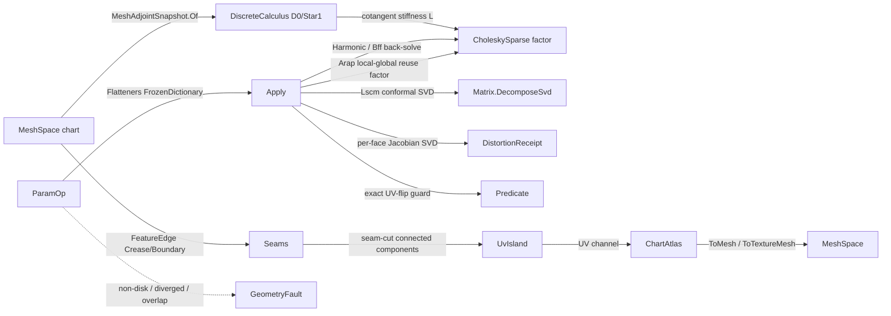

# [RASM_PARAMETERIZATION_FLATTEN]

The robust mesh parameterization / UV-flattening owner — ONE `ParamOp` `[Union]` (`Harmonic`/`Lscm`/`Arap`/`Bff`) that flattens a disk-topology surface chart into the plane by composing the `Rasm.Vectors` discrete-exterior-calculus operator substrate at its public boundary handle, never by re-assembling a mesh Laplacian. Every modality lowers the same `MeshAdjointSnapshot.Of(space)` `DiscreteCalculus` (the cotangent `D0`/`Star1` exterior-derivative and Hodge-star operators the `Vectors` spectral substrate assembles once) into its own energy, and every solve REUSES the one cached symmetric-positive-definite Cholesky factor — `Harmonic` is the boundary-pinned Dirichlet solve over the cotangent stiffness, `Lscm` (Lévy 2002) is the complex-linear conformal-energy minimization whose Cauchy-Riemann system is the smallest-singular-vector of a sparse least-squares operator, `Arap` (Liu 2008) is the local-global rigid-fit alternation re-using the SAME stiffness factor across every global step, and `Bff` (Sawhney-Crane 2017) is the boundary-first connection-Laplacian flattening that solves the interior harmonically and integrates the boundary curve from its target geodesic curvature. The page composes the `Numerics/predicates#ROBUST_PREDICATES` exact `Orient2D` turn sign for the UV-layout flip/overlap guard, reads the `Meshing/delaunay#TESSELLATION` constrained `Build` only where a chart must be re-cut on a seam, and binds the `Spatial/reconciliation#NAMING_HASH` content hash through the `MeshSpace` UV channel — never minting a second identity. The page owns the `ParamKind` discriminant (binding the sibling-owned `GeometryKeyPolicy` string-key comparer), the `ChartStore` struct-of-arrays UV layout memory, the `ParamOp` `[Union]` with its one polymorphic `Apply` fold, the typed `ChartAtlas` result carrier (per-chart UV island, `DistortionReceipt`, seam set), and the `ToMesh`/`ToTextureMesh` projections that re-emit the flattening through the `Vectors` `MeshSpace` seam.

The owner composes `Vectors` `MeshSpace`/`Point3d`/`Point2d`/`Vector3d` as settled vocabulary — read, compose, never re-mint — rides the `Vectors` `MeshAdjointSnapshot`/`DiscreteCalculus` DEC surface as the cotangent-Laplacian floor (the SAME public boundary handle the `Rasm.Compute` DDG-adjoint consumer reads, never a reach into the internal `IntrinsicMesh` or `LaplacianCache`), composes the `Vectors` `CholeskySparse`/`SparseMatrix.Solve` and `Matrix.DecomposeSvd` direct-factor solve rail (the package-owned wrappers over CSparse sparse Cholesky and MathNet dense SVD, never the raw provider API), reads the `Vectors` `FeatureEdge` `Crease`/`Boundary` dihedral classification as the chart-cut seam source, and operates on raw `double` only at the `Predicate` UV-flip seam and the measured energy inner loop. Every reachable failure routes the band-2400 `GeometryFault` union through the `ParameterizationFault` (2480) sub-band the `Numerics/faults#FAULT_BAND` family carries; the kernel computes no hash and mints no second identity. The `ChartAtlas` is the hash-friendly immutable record the `Spatial/reconciliation#NAMING_HASH` `Encode` content-addresses through the `MeshSpace` UV projection — the `Rasm.Fabrication` unroll/nesting lane and the `Rasm.AppUi` texture lane consume that carrier by reference, never by re-deriving the flattening. The mature `Vectors` `Mesh.cs` Rhino-delegated unwrap stays the host convenience rail; this owner is the kernel-quality conformal/ARAP/BFF solve, never a thinning of the host unwrap.

## [1]-[INDEX]

- [1]-[PARAMETERIZATION]: `ParamKind` discriminant; `ParamOp` `[Union]` (`Harmonic`/`Lscm`/`Arap`/`Bff`) over one `ChartStore` SoA; the `Apply` flattening fold composing `Vectors` `DiscreteCalculus` cotangent operators, cached `CholeskySparse` factor, `Matrix.DecomposeSvd` conformal-energy minimizer, exact `Orient2D` UV-flip guard, and `FeatureEdge` seam cut; the typed `ChartAtlas` (UV island + `DistortionReceipt` + seam set).

## [2]-[PARAMETERIZATION]

- Owner: `ParamKind` `[SmartEnum<string>]` the flattening-modality discriminant binding the sibling-owned `GeometryKeyPolicy` (`Numerics/faults#FAULT_BAND`) as its string-key comparer (`harmonic`/`lscm`/`arap`/`bff`) carrying the per-kind `Conformal` (preserves angles), `AreaPreserving` (preserves areas), `FreeBoundary` (does not pin a boundary loop), and `Iterative` (runs a local-global alternation) columns; `ChartStore` the struct-of-arrays flat UV memory every solve writes and the projection reads — `Uv` the per-vertex `(u, v)` coordinate slot pair, `Pinned` the boundary/cone constraint bit, `Chart` the per-vertex island label, `Conformal`/`Area`/`QuasiConformal` the per-face distortion slot arrays the receipt folds, `Dead` plus a free list reusing a cut-away vertex slot; `ParamOp` `[Union]` `Harmonic`/`Lscm`/`Arap`/`Bff` carrying the input `MeshSpace` chart and the per-op constraint payload; `ChartAtlas` the typed result (the per-chart `UvIsland` packed UV layout, the `DistortionReceipt` of conformal/area/quasi-conformal error, the `Seq<FeatureEdge>` seam set the cut used); `DistortionReceipt` the typed energy evidence; `Parameterization` the static surface whose one `Apply` fold runs the requested flattening and packs the atlas.
- Cases: `ParamKind` rows `harmonic` · `lscm` · `arap` · `bff` (4); `ParamOp` cases `Harmonic` · `Lscm` · `Arap` · `Bff` (4 — `Harmonic` the pinned-boundary Dirichlet solve, `Lscm` the free-boundary conformal least-squares, `Arap` the iterative rigid-fit alternation, `Bff` the boundary-first connection-Laplacian flattening); `DistortionReceipt` one typed evidence carrier (the conformal/area/quasi-conformal error triple plus the solve iteration/residual evidence, not a generic ledger). No parallel `HarmonicMap`/`Lscm`/`Arap`/`BffFlattener` class family — one `[Union]` folded by one `Apply`.
- Entry: `public static Fin<ChartAtlas> Apply(ParamOp op, ParamPolicy policy)` — the ONE parameterization entrypoint discriminating by `ParamOp` case, `Fin<T>` routing a band-2400 `GeometryFault.ParameterizationFault` when the chart is empty/non-finite, is not a disk (genus or boundary-component mismatch the DEC topology receipt reports), the energy solve diverges past the iteration budget, or the UV layout self-overlaps (an exact `Orient2D` flipped triangle the conformal map must not produce); there is no `Flatten`/`Unwrap`/`Conformalize`/`RunArap` sibling family — one polymorphic `Apply` discriminates by kind. `public Fin<MeshSpace> ToMesh(Context tolerance)` re-emits the input chart carrying the UV channel as texture coordinates; `public Fin<MeshSpace> ToTextureMesh(Context tolerance)` re-emits the flattened 2D mesh in UV space; `public DistortionReceipt Receipt` reads the typed distortion evidence.
- Auto: `Apply` reads the `Flatteners` `FrozenDictionary` keyed by `ParamKind` so the modality selection is a data-table row, never a `kind switch` cascade — every row lowers to the SAME `MeshAdjointSnapshot.Of(space)` `DiscreteCalculus` assembly (`D0` the exterior derivative, `Star1` the Hodge star on edges, the cotangent stiffness `L = D0ᵀ · diag(Star1) · D0` the substrate exposes) and the SAME cached `CholeskySparse` factor of the SPD-shifted stiffness, differing only in the energy each lowers. `Harmonic` pins the boundary loop to the unit circle (or a caller-supplied boundary curve), partitions the stiffness into interior/boundary blocks, and solves the interior `(u, v)` by two right-hand-side back-substitutions through the ONE cached Cholesky factor (the harmonic map is the Dirichlet minimizer, bijective on a convex boundary by Tutte's theorem). `Lscm` assembles the complex conformal-energy operator `E_C = ½ ‖(∂/∂z̄) z‖²` as a real `2n × 2n` dense least-squares system, pins two vertices to fix the conformal gauge, and solves the free-boundary `(u, v)` as the smallest non-trivial right singular vector of the conformal operator (the column of `SvdResult.V` at the smallest-non-gauge `Sigma` index) through `Matrix.DecomposeSvd` (the Cauchy-Riemann system the cotangent `D0`/`Star1` directly assemble — `Lscm` and the discrete-conformal cotangent energy are the same operator). `Arap` seeds from the `Lscm` (or harmonic) flattening, then alternates the LOCAL step (per-face fit the best rigid rotation of the flattened triangle onto its 3D shape by the polar decomposition of the `2 × 2` Jacobian, an exact `Matrix.DecomposeSvd` per face) and the GLOBAL step (solve the Poisson system `L · uv = b` where `b` accumulates the per-face rotated cotangent gradients) re-using the SAME cached Cholesky factor across every global solve, iterating until the rigidity residual falls below the policy tolerance or the iteration budget is reached. `Bff` solves the interior scale factor `u` harmonically from the prescribed boundary geodesic curvature `(∂u/∂n = k̃ − k)`, integrates the boundary curve from its target turning angles, and back-solves the interior `(u, v)` through the cached factor (the boundary-first flow makes the flattening conformal in the interior with a chosen boundary). After the solve, `ScoreDistortion` evaluates the per-face conformal (singular-value ratio `σ₁/σ₂`), area (`σ₁ · σ₂`), and quasi-conformal (`(σ₁ − σ₂)/(σ₁ + σ₂)`) error from the per-face Jacobian SVD, `GuardFlips` asserts no flattened triangle carries a negative exact `Predicate.Orient2D` sign (a flip is the non-bijectivity the conformal map must not produce), and `PackAtlas` walks the seam-cut connected components into `UvIsland` charts. The `DistortionReceipt` binds the max/mean conformal, area, and quasi-conformal error, the solve iteration count, the final residual, and the solver factor non-zero count.
- Receipt: `Apply` carries a `DistortionReceipt` typed to the flattening — `MaxConformal`/`MeanConformal` (the singular-value-ratio angle distortion), `MaxArea`/`MeanArea` (the area-scale distortion), `MaxQuasiConformal` (the Beltrami coefficient bound), `Iterations` (the local-global step count, `1` for the direct `Harmonic`/`Lscm`/`Bff` solves), `Residual` (the final energy residual), `FactorNonZeros` (the cached Cholesky factor fill the `SparseMatrix.Solve` rail reports), and `FlipFreeBijective` (the exact-`Orient2D` flip-guard verdict) — never a generic `IReceipt`/ledger; the distortion triple IS the flattening evidence the `Rasm.Fabrication` nesting strain check and the consuming tests read.
- Packages: `Rasm`/Vectors (`MeshSpace`, `MeshAdjointSnapshot.Of`/`DiscreteCalculus` cotangent `D0`/`Star1` DEC operators, `MeshLaplacian.Cotangent`, `CholeskySparse.Of`/`SparseMatrix.Solve`/`SolveDetailed` sparse direct factor, `Matrix.DecomposeSvd`/`SymmetricMatrix.DecomposeCholesky` dense factor, `FeatureEdge`/`MeshFeatureKind.Crease`/`Boundary` seam source, `Point3d`/`Point2d`/`Vector3d` — composed, never re-minted), `Rasm.Geometry.Numerics` (`Predicate.Orient2D`/`Sign` exact UV-flip guard — composed, the robustness floor), `Rasm.Geometry.Tessellation` (`Tessellation.Build`/`Constraint.Segment` — the seam re-cut substrate where a chart splits, composed), `Rasm.Geometry` (`GeometryKeyPolicy` string-key comparer — composed, never re-minted), MathNet.Numerics (`Cholesky`/`Svd`/`Evd` dense factor surface, COMPOSED through the `Vectors` `Matrix`/`SymmetricMatrix` wrappers — never a raw provider call), CSparse (`SparseCholesky` direct sparse factor, COMPOSED through the `Vectors` `CholeskySparse`/`SparseMatrix` wrappers — never a raw `SparseCholesky.Create`), Thinktecture.Runtime.Extensions, LanguageExt.Core, BCL inbox (`FrozenDictionary`, `List<T>`, `Stack<int>`, `Queue<int>`).
- Growth: a new flattening modality (a spectral conformal, a cone-singularity Yamabe flow, a seamless-direction-field global parameterization) is one `ParamKind` row plus one `Flatteners` `FrozenDictionary` row lowering the SAME `DiscreteCalculus` substrate over a new energy and writing the shared `ChartStore` — never a parallel `SpectralFlattener`/`ConeParam` class with a duplicated Laplacian assembly; a new distortion measure is one column on `ChartStore` plus one field on `DistortionReceipt`; a new constraint mode (a hard cone vertex, a packing target) is one column on `ParamPolicy`; a new seam source is one `MeshFeatureKind` row the `FeatureEdge` cut reads; zero new surface.
- Boundary: the parameterization is the ONE polymorphic `ParamOp` `[Union]` and a `HarmonicMap`/`LscmSolver`/`ArapFlattener`/`BffFlattener` sibling-class family each carrying its own `Solve`/`Run`/`Flatten` surface is the named density defect collapsed here onto one union folded by one `Apply` — the four kinds differ ONLY in the energy each lowers over the SHARED `DiscreteCalculus` cotangent operators and the SHARED cached Cholesky factor, never in the assemble/solve/score/pack algebra, so `Apply`/`ToMesh`/`ToTextureMesh`/`Receipt` live on the union base and read the shared `ChartStore` kind-agnostically; the `Flatteners` `FrozenDictionary` is the single modality-selection data table and a `ParamKind kind switch` arm cascade in `Apply` is the deleted form; the cotangent-Laplacian COMPOSES the `Vectors` `MeshAdjointSnapshot.Of`/`DiscreteCalculus` PUBLIC boundary handle and a domain-local cotangent-stiffness re-assembly beside the spectral owner is the rejected double-owner form (a reach into the internal `Rasm.Vectors` `IntrinsicMesh`/`LaplacianCache` is the named boundary violation the `Vectors` `_ARCHITECTURE` `MeshAdjointSnapshot` seam exists to prevent), and re-factoring the stiffness inside the ARAP global loop instead of reusing the ONE cached `CholeskySparse` factor is the named performance defect — every modality and every ARAP iteration reuses the single factor; the direct solves COMPOSE the `Vectors` `CholeskySparse.Of`/`SparseMatrix.Solve` and `Matrix.DecomposeSvd` rail and a raw `CSparse.Double.Factorization.SparseCholesky.Create` or `MathNet` `Matrix<double>.Svd()` call is the named lower-level-reinvention defect (the `Vectors` `Matrix`/`SparseMatrix` wrappers are the single solve owners, total over the `Fin` rail); the UV-layout flip/overlap guard COMPOSES the `Numerics/predicates#ROBUST_PREDICATES` `Predicate.Orient2D` exact sign and a loosened float signed-area flip test is the named precision-loss defect — a flattened triangle near a cone vertex flips on a float band exactly where the bijectivity guard must be exact; the seam cut COMPOSES the `Vectors` `FeatureEdge` `Crease`/`Boundary` classification and a domain-local dihedral seam detector beside the feature owner is the deleted double-owner form; `Apply` is total over the `Fin` rail and a thrown exception on a non-disk chart or a diverged solve is forbidden — the defect routes `GeometryFault.ParameterizationFault(...).ToError()` over the band-2400 union; the result re-emits the canonical hash-friendly `MeshSpace` UV channel the `Spatial/reconciliation#NAMING_HASH` `Encode` content-addresses and this owner mints NO second hash; the energy and the per-face SVD operate on raw `double` only at the `Predicate` seam and the measured inner loop because a UV coordinate is the domain's native scalar, and a `double` crossing a public parameterization signature outside a `Point2d`/`Point3d` coordinate is the seam violation; the parameterization preserves capability — a seam cut splits a chart into islands rather than discarding a region, so no flattening drops a surface feature to satisfy a distortion budget.

```csharp contract
// --- [RUNTIME_PRELUDE] --------------------------------------------------------------------
using System;
using System.Collections.Frozen;
using System.Collections.Generic;
using System.Linq;
using LanguageExt;
using LanguageExt.Common;
using Rasm.Geometry;
using Rasm.Geometry.Numerics;
using Rasm.Geometry.Tessellation;
using Rasm.Vectors;
using Rhino.Geometry;
using Thinktecture;
using static LanguageExt.Prelude;

namespace Rasm.Geometry.Parameterization;

// --- [TYPES] ------------------------------------------------------------------------------
[SmartEnum<string>]
[KeyMemberEqualityComparer<GeometryKeyPolicy, string>]
[KeyMemberComparer<GeometryKeyPolicy, string>]
public sealed partial class ParamKind {
    public static readonly ParamKind Harmonic = new("harmonic", conformal: true, areaPreserving: false, freeBoundary: false, iterative: false);
    public static readonly ParamKind Lscm     = new("lscm", conformal: true, areaPreserving: false, freeBoundary: true, iterative: false);
    public static readonly ParamKind Arap     = new("arap", conformal: false, areaPreserving: false, freeBoundary: true, iterative: true);
    public static readonly ParamKind Bff      = new("bff", conformal: true, areaPreserving: false, freeBoundary: true, iterative: false);

    public bool Conformal { get; }
    public bool AreaPreserving { get; }
    public bool FreeBoundary { get; }
    public bool Iterative { get; }
}

// --- [CONSTANTS] --------------------------------------------------------------------------
public sealed record ParamPolicy(double MassShift, double ResidualTolerance, int MaxIterations, double SeamDihedralRadians, double FlipTolerance) {
    public static readonly ParamPolicy Canonical =
        new(MassShift: 1e-9, ResidualTolerance: 1e-8, MaxIterations: 64, SeamDihedralRadians: Math.PI / 6.0, FlipTolerance: 0.0);
}

// --- [MODELS] -----------------------------------------------------------------------------
public sealed record ChartStore(
    int VertexCount,
    int FaceCount,
    double[] Uv,
    bool[] Pinned,
    int[] Chart,
    double[] Conformal,
    double[] Area,
    double[] QuasiConformal,
    bool[] Dead,
    Stack<int> FreeList) {
    public Point2d At(int vertex) => new(Uv[2 * vertex], Uv[2 * vertex + 1]);

    internal void Set(int vertex, double u, double v) => (Uv[2 * vertex], Uv[2 * vertex + 1]) = (u, v);

    internal void Score(int face, double conformal, double area, double quasiConformal) =>
        (Conformal[face], Area[face], QuasiConformal[face]) = (conformal, area, quasiConformal);

    internal void Kill(int vertex) { Dead[vertex] = true; FreeList.Push(vertex); }

    public static ChartStore Allocate(int vertexCount, int faceCount) =>
        new(vertexCount, faceCount, new double[2 * vertexCount], new bool[vertexCount], new int[vertexCount],
            new double[faceCount], new double[faceCount], new double[faceCount], new bool[vertexCount], new Stack<int>());
}

public sealed record UvIsland(int Chart, int[] Vertices, (int A, int B, int C)[] Faces, Point2d[] Uv);

public sealed record DistortionReceipt(
    double MaxConformal,
    double MeanConformal,
    double MaxArea,
    double MeanArea,
    double MaxQuasiConformal,
    int Iterations,
    double Residual,
    int FactorNonZeros,
    bool FlipFreeBijective) {
    public static readonly DistortionReceipt Empty = new(1.0, 1.0, 1.0, 1.0, 0.0, 0, 0.0, 0, true);
}

public sealed record ChartAtlas(ChartStore Store, MeshSpace Source, Seq<UvIsland> Islands, Seq<FeatureEdge> Seams, DistortionReceipt Receipt);

// --- [OPERATIONS] -------------------------------------------------------------------------
[Union(ConversionFromValue = ConversionOperatorsGeneration.None)]
public abstract partial record ParamOp {
    private ParamOp() { }

    public sealed record Harmonic(MeshSpace Chart, Option<Polyline> Boundary) : ParamOp;
    public sealed record Lscm(MeshSpace Chart) : ParamOp;
    public sealed record Arap(MeshSpace Chart) : ParamOp;
    public sealed record Bff(MeshSpace Chart, Option<Arr<double>> TargetCurvature) : ParamOp;

    public ParamKind Kind =>
        Switch(
            harmonic: static _ => ParamKind.Harmonic,
            lscm:     static _ => ParamKind.Lscm,
            arap:     static _ => ParamKind.Arap,
            bff:      static _ => ParamKind.Bff);

    MeshSpace Chart =>
        Switch(
            harmonic: static h => h.Chart,
            lscm:     static l => l.Chart,
            arap:     static a => a.Chart,
            bff:      static b => b.Chart);
}

public static class Parameterization {
    static readonly FrozenDictionary<ParamKind, Func<ParamOp, MeshDec, ParamPolicy, Fin<Solved>>> Flatteners =
        new (ParamKind Kind, Func<ParamOp, MeshDec, ParamPolicy, Fin<Solved>> Flatten)[] {
            (ParamKind.Harmonic, static (op, dec, policy) => FlattenHarmonic((ParamOp.Harmonic)op, dec, policy)),
            (ParamKind.Lscm,     static (op, dec, policy) => FlattenLscm(dec, policy)),
            (ParamKind.Arap,     static (op, dec, policy) => FlattenArap(dec, policy)),
            (ParamKind.Bff,      static (op, dec, policy) => FlattenBff((ParamOp.Bff)op, dec, policy)),
        }.ToFrozenDictionary(static row => row.Kind, static row => row.Flatten);

    public static Fin<ChartAtlas> Apply(ParamOp op, ParamPolicy policy) =>
        Admit(op).Bind(chart =>
            MeshDec.Of(chart, policy).Bind(dec =>
                Flatteners.TryGetValue(op.Kind, out var flatten)
                    ? flatten(op, dec, policy).Bind(solved => Pack(solved, chart, dec, policy))
                    : Fin.Fail<ChartAtlas>(GeometryFault.ParameterizationFault($"param-kind-miss:{op.Kind.Key}").ToError())));

    static Fin<MeshSpace> Admit(ParamOp op) {
        MeshSpace chart = op switch {
            ParamOp.Harmonic h => h.Chart, ParamOp.Lscm l => l.Chart, ParamOp.Arap a => a.Chart, ParamOp.Bff b => b.Chart, _ => default,
        };
        Mesh native = chart.DuplicateNative();
        return native.Vertices.Count == 0
            ? Fin.Fail<MeshSpace>(GeometryFault.ParameterizationFault($"param:{op.Kind.Key}:empty-chart").ToError())
            : native.Vertices.All(static v => v.IsValid)
                ? Fin.Succ(chart)
                : Fin.Fail<MeshSpace>(GeometryFault.ParameterizationFault($"param:{op.Kind.Key}:non-finite-coordinate").ToError());
    }

    // --- [FLATTEN]
    static Fin<Solved> FlattenHarmonic(ParamOp.Harmonic op, MeshDec dec, ParamPolicy policy) {
        int[] loop = dec.BoundaryLoop;
        if (loop.Length < 3) return Fin.Fail<Solved>(GeometryFault.ParameterizationFault("harmonic:non-disk-boundary").ToError());
        Point2d[] pinned = op.Boundary.Match(Some: b => Resample(b, loop.Length), None: () => UnitCircle(loop.Length));
        return dec.Factor.Bind(factor =>
            from rhsU in dec.PinnedRhs(loop, pinned.Select(static p => p.X).ToArray())
            from rhsV in dec.PinnedRhs(loop, pinned.Select(static p => p.Y).ToArray())
            from solvedU in factor.Solve(rhsU)
            from solvedV in factor.Solve(rhsV)
            select new Solved(dec.Scatter(loop, pinned, solvedU, solvedV), Iterations: 1, Residual: 0.0, FactorNonZeros: dec.FactorNonZeros));
    }

    static Fin<Solved> FlattenLscm(MeshDec dec, ParamPolicy policy) =>
        dec.ConformalOperator().Bind(conformal =>
            conformal.DecomposeSvd().Bind(svd => {
                int cols = svd.V.Cols.Value, n = dec.VertexCount;
                int target = cols - 1 - GaugeModes;
                return cols == 2 * n && target >= 0 && svd.Sigma.Count > target
                    ? Fin.Succ(new Solved(SplitComplex(RightSingularColumn(svd.V, target), n), Iterations: 1, Residual: svd.Sigma[target], FactorNonZeros: dec.FactorNonZeros))
                    : Fin.Fail<Solved>(GeometryFault.ParameterizationFault("lscm:conformal-rank-deficient").ToError());
            }));

    const int GaugeModes = 2;

    static double[] RightSingularColumn(Matrix v, int column) {
        int rows = v.Rows.Value, cols = v.Cols.Value;
        var vector = new double[rows];
        for (int r = 0; r < rows; r++) vector[r] = v.Entries[(r * cols) + column];
        return vector;
    }

    static Fin<Solved> FlattenArap(MeshDec dec, ParamPolicy policy) =>
        FlattenLscm(dec, policy).Bind(seed => dec.Factor.Bind(factor => {
            Point2d[] uv = seed.Uv;
            double residual = double.PositiveInfinity;
            int iteration = 0;
            for (; iteration < policy.MaxIterations && residual > policy.ResidualTolerance; iteration++) {
                Matrix2[] rotations = dec.LocalRotations(uv);
                Arr<double> bx = dec.RotatedGradient(rotations, axis: 0);
                Arr<double> by = dec.RotatedGradient(rotations, axis: 1);
                Fin<Point2d[]> step =
                    from solvedX in factor.Solve(bx)
                    from solvedY in factor.Solve(by)
                    select Combine(solvedX, solvedY);
                if (step.IsFail) return step.Map(static _ => default(Solved)!);
                Point2d[] next = step.IfFail(uv);
                residual = MaxDelta(uv, next);
                uv = next;
            }
            return Fin.Succ(new Solved(uv, Iterations: iteration, Residual: residual, FactorNonZeros: dec.FactorNonZeros));
        }));

    static Fin<Solved> FlattenBff(ParamOp.Bff op, MeshDec dec, ParamPolicy policy) {
        int[] loop = dec.BoundaryLoop;
        if (loop.Length < 3) return Fin.Fail<Solved>(GeometryFault.ParameterizationFault("bff:non-disk-boundary").ToError());
        Arr<double> target = op.TargetCurvature.IfNone(() => dec.UniformBoundaryCurvature(loop));
        return dec.Factor.Bind(factor =>
            from scale in dec.BoundaryScaleFactors(loop, target, factor)
            let curve = dec.IntegrateBoundary(loop, scale)
            from rhsU in dec.PinnedRhs(loop, curve.Select(static p => p.X).ToArray())
            from rhsV in dec.PinnedRhs(loop, curve.Select(static p => p.Y).ToArray())
            from solvedU in factor.Solve(rhsU)
            from solvedV in factor.Solve(rhsV)
            select new Solved(dec.Scatter(loop, curve, solvedU, solvedV), Iterations: 1, Residual: 0.0, FactorNonZeros: dec.FactorNonZeros));
    }

    // --- [PACK_AND_SCORE]
    static Fin<ChartAtlas> Pack(Solved solved, MeshSpace chart, MeshDec dec, ParamPolicy policy) {
        ChartStore store = ChartStore.Allocate(dec.VertexCount, dec.FaceCount);
        for (int v = 0; v < dec.VertexCount; v++) store.Set(v, solved.Uv[v].X, solved.Uv[v].Y);
        bool bijective = ScoreDistortion(store, dec, policy);
        DistortionReceipt receipt = Fold(store, dec, solved, bijective);
        return bijective || policy.FlipTolerance > 0.0
            ? Fin.Succ(new ChartAtlas(store, chart, Islands(store, dec), dec.Seams, receipt))
            : Fin.Fail<ChartAtlas>(GeometryFault.ParameterizationFault($"param:uv-overlap-flip:max-conformal={receipt.MaxConformal:0.###}").ToError());
    }

    static bool ScoreDistortion(ChartStore store, MeshDec dec, ParamPolicy policy) {
        bool bijective = true;
        for (int f = 0; f < dec.FaceCount; f++) {
            (int a, int b, int c) = dec.Face(f);
            (Point2d ua, Point2d ub, Point2d uc) = (store.At(a), store.At(b), store.At(c));
            (double s1, double s2) = dec.JacobianSingularValues(f, ua, ub, uc);
            double conformal = s2 == 0.0 ? double.PositiveInfinity : s1 / s2;
            double area = s1 * s2;
            double quasiConformal = (s1 + s2) == 0.0 ? 1.0 : (s1 - s2) / (s1 + s2);
            store.Score(f, conformal, area, quasiConformal);
            if (Predicate.Orient2D(ToPoint(ua), ToPoint(ub), ToPoint(uc)) == Sign.Negative) bijective = false;
        }
        return bijective;
    }

    static DistortionReceipt Fold(ChartStore store, MeshDec dec, Solved solved, bool bijective) {
        double maxC = 0.0, sumC = 0.0, maxA = 0.0, sumA = 0.0, maxQ = 0.0;
        for (int f = 0; f < dec.FaceCount; f++) {
            maxC = Math.Max(maxC, store.Conformal[f]); sumC += store.Conformal[f];
            maxA = Math.Max(maxA, store.Area[f]); sumA += store.Area[f];
            maxQ = Math.Max(maxQ, Math.Abs(store.QuasiConformal[f]));
        }
        int n = Math.Max(1, dec.FaceCount);
        return new DistortionReceipt(maxC, sumC / n, maxA, sumA / n, maxQ, solved.Iterations, solved.Residual, solved.FactorNonZeros, bijective);
    }

    static Seq<UvIsland> Islands(ChartStore store, MeshDec dec) {
        var label = new int[dec.VertexCount];
        Array.Fill(label, -1);
        int next = 0;
        for (int seed = 0; seed < dec.VertexCount; seed++) {
            if (label[seed] != -1) continue;
            var queue = new Queue<int>();
            queue.Enqueue(seed); label[seed] = next;
            while (queue.Count > 0) {
                int cur = queue.Dequeue();
                foreach (int neighbour in dec.Neighbours(cur))
                    if (label[neighbour] == -1 && !dec.IsSeamEdge(cur, neighbour)) { label[neighbour] = next; queue.Enqueue(neighbour); }
            }
            next++;
        }
        for (int v = 0; v < dec.VertexCount; v++) store.Chart[v] = label[v];
        return toSeq(Enumerable.Range(0, next).Select(chart => IslandOf(chart, store, dec, label)));
    }

    static UvIsland IslandOf(int chart, ChartStore store, MeshDec dec, int[] label) {
        int[] vertices = Enumerable.Range(0, dec.VertexCount).Where(v => label[v] == chart).ToArray();
        (int A, int B, int C)[] faces = Enumerable.Range(0, dec.FaceCount)
            .Select(dec.Face)
            .Where(f => label[f.A] == chart && label[f.B] == chart && label[f.C] == chart)
            .ToArray();
        Point2d[] uv = vertices.Select(store.At).ToArray();
        return new UvIsland(chart, vertices, faces, uv);
    }

    // --- [PRIMITIVES]
    static Point2d[] UnitCircle(int count) =>
        Enumerable.Range(0, count).Select(i => { double t = 2.0 * Math.PI * i / count; return new Point2d(Math.Cos(t), Math.Sin(t)); }).ToArray();

    static Point2d[] Resample(Polyline boundary, int count) {
        double total = boundary.Length, step = total / count;
        return Enumerable.Range(0, count).Select(i => { Point3d p = boundary.PointAtLength(i * step); return new Point2d(p.X, p.Y); }).ToArray();
    }

    static Point2d[] SplitComplex(double[] uv, int n) =>
        Enumerable.Range(0, n).Select(i => new Point2d(uv[i], uv[n + i])).ToArray();

    static Point2d[] Combine(Arr<double> x, Arr<double> y) =>
        Enumerable.Range(0, x.Count).Select(i => new Point2d(x[i], y[i])).ToArray();

    static double MaxDelta(Point2d[] previous, Point2d[] next) {
        double max = 0.0;
        for (int i = 0; i < previous.Length; i++) max = Math.Max(max, previous[i].DistanceTo(next[i]));
        return max;
    }

    static Point3d ToPoint(Point2d p) => new(p.X, p.Y, 0.0);
}

// --- [COMPOSITION] ------------------------------------------------------------------------
file readonly record struct Solved(Point2d[] Uv, int Iterations, double Residual, int FactorNonZeros);

file readonly record struct Matrix2(double M00, double M01, double M10, double M11);

file sealed record MeshDec(
    DiscreteCalculus Calculus,
    Mesh Native,
    int VertexCount,
    int FaceCount,
    int[] BoundaryLoop,
    Seq<FeatureEdge> Seams,
    HashSet<(int, int)> SeamEdges,
    Dictionary<int, List<int>> Adjacency,
    ParamPolicy Policy) {
    public int FactorNonZeros => Calculus.D1.NonZeros;

    public static Fin<MeshDec> Of(MeshSpace chart, ParamPolicy policy) =>
        from snapshot in MeshAdjointSnapshot.Of(chart)
        from intent in VectorIntent.Features(chart, policy.SeamDihedralRadians)
        from features in intent.Project<FeatureReceipt>(chart.Tolerance)
        let native = chart.DuplicateNative()
        let faces = Enumerable.Range(0, native.Faces.Count).Select(native.Faces.GetFace).ToArray()
        let adjacency = Adjacent(faces, native.Vertices.Count)
        let seamEdges = features.Edges.Where(static e => e.Kind.Equals(MeshFeatureKind.Crease) || e.Kind.Equals(MeshFeatureKind.Boundary)).Map(static e => Order(e.A, e.B)).ToHashSet()
        select new MeshDec(snapshot.Calculus, native, native.Vertices.Count, native.Faces.Count, BoundaryOf(native), features.Edges, seamEdges, adjacency, policy);

    public Fin<CholeskySparse> Factor =>
        Stiffness().Bind(stiffness => CholeskySparse.Of(stiffness));

    public Fin<SparseMatrix> Stiffness() =>
        from raw in SparseMatrix.FromTriplets(Calculus.D0.Cols, Calculus.D0.Cols, StiffnessTriplets())
        select raw;

    IEnumerable<(int Row, int Col, double Value)> StiffnessTriplets() {
        DiscreteCalculus dec = Calculus;
        for (int e = 0; e < dec.D0.Rows.Value; e++) {
            int start = dec.D0.RowPtr[e], end = dec.D0.RowPtr[e + 1];
            if (end - start != 2) continue;
            (int i, int j) = (dec.D0.ColInd[start], dec.D0.ColInd[start + 1]);
            double w = dec.Star1[e];
            yield return (i, i, w); yield return (j, j, w);
            yield return (i, j, -w); yield return (j, i, -w);
        }
        for (int v = 0; v < dec.D0.Cols.Value; v++) yield return (v, v, Policy.MassShift);
    }

    public Fin<Arr<double>> PinnedRhs(int[] loop, double[] boundaryValues) {
        var rhs = new double[VertexCount];
        for (int k = 0; k < loop.Length; k++) rhs[loop[k]] = boundaryValues[k] / Policy.MassShift;
        return Fin.Succ(new Arr<double>(rhs));
    }

    public Point2d[] Scatter(int[] loop, Point2d[] pinned, Arr<double> solvedU, Arr<double> solvedV) {
        var uv = Enumerable.Range(0, VertexCount).Select(v => new Point2d(solvedU[v], solvedV[v])).ToArray();
        for (int k = 0; k < loop.Length; k++) uv[loop[k]] = pinned[k];
        return uv;
    }

    public Fin<Matrix> ConformalOperator() {
        DiscreteCalculus dec = Calculus;
        int n = VertexCount;
        var entries = new double[(2 * n) * (2 * n)];
        for (int f = 0; f < FaceCount; f++) {
            (int a, int b, int c) = Face(f);
            (Complex za, Complex zb, Complex zc) = ProjectTriangle(f);
            ScatterConformal(entries, 2 * n, a, b, c, za, zb, zc);
        }
        return Matrix.Of(Dimension.Create(2 * n), Dimension.Create(2 * n), new Arr<double>(entries));
    }

    public Matrix2[] LocalRotations(Point2d[] uv) =>
        Enumerable.Range(0, FaceCount).Select(f => {
            (int a, int b, int c) = Face(f);
            (double s1, double s2) = JacobianSingularValues(f, uv[a], uv[b], uv[c]);
            return PolarRotation(f, uv, a, b, c, s1, s2);
        }).ToArray();

    public Arr<double> RotatedGradient(Matrix2[] rotations, int axis) {
        var b = new double[VertexCount];
        for (int f = 0; f < FaceCount; f++) {
            (int i, int j, int k) = Face(f);
            (double cotI, double cotJ, double cotK) = Cotangents(f);
            AccumulateRotated(b, rotations[f], axis, i, j, k, cotI, cotJ, cotK);
        }
        return new Arr<double>(b);
    }

    public (double S1, double S2) JacobianSingularValues(int face, Point2d ua, Point2d ub, Point2d uc) {
        (Point3d pa, Point3d pb, Point3d pc) = FacePoints(face);
        (Vector2 e1, Vector2 e2) = LocalBasis(pa, pb, pc);
        Matrix2 jacobian = JacobianOf(e1, e2, ua, ub, uc);
        return SingularValues(jacobian);
    }

    public (int A, int B, int C) Face(int face) { MeshFace mf = Native.Faces.GetFace(face); return (mf.A, mf.B, mf.C); }

    public IEnumerable<int> Neighbours(int vertex) => Adjacency.TryGetValue(vertex, out var list) ? list : [];

    public bool IsSeamEdge(int u, int v) => SeamEdges.Contains(Order(u, v));

    public Arr<double> UniformBoundaryCurvature(int[] loop) =>
        new(Enumerable.Repeat(2.0 * Math.PI / loop.Length, loop.Length).ToArray());

    public Fin<Arr<double>> BoundaryScaleFactors(int[] loop, Arr<double> target, CholeskySparse factor) {
        var rhs = new double[VertexCount];
        for (int k = 0; k < loop.Length; k++) rhs[loop[k]] = target[k];
        return factor.Solve(new Arr<double>(rhs));
    }

    public Point2d[] IntegrateBoundary(int[] loop, Arr<double> scale) {
        var curve = new Point2d[loop.Length];
        double angle = 0.0;
        Point2d cursor = Point2d.Origin;
        for (int k = 0; k < loop.Length; k++) {
            curve[k] = cursor;
            angle += scale[loop[k]];
            cursor += new Vector2d(Math.Cos(angle), Math.Sin(angle));
        }
        return curve;
    }

    (Complex Za, Complex Zb, Complex Zc) ProjectTriangle(int face) {
        (Point3d pa, Point3d pb, Point3d pc) = FacePoints(face);
        (Vector2 e1, Vector2 e2) = LocalBasis(pa, pb, pc);
        Vector3d ab = pb - pa, ac = pc - pa;
        return (new Complex(0.0, 0.0), new Complex(ab.Length, 0.0), new Complex(ac * ToVector(e1), ac * ToVector(e2)));
    }

    static void ScatterConformal(double[] entries, int stride, int a, int b, int c, Complex za, Complex zb, Complex zc) {
        Complex[] cr = [zc - zb, za - zc, zb - za];
        int[] idx = [a, b, c];
        double areaScale = 0.5 / Math.Max(1e-12, ((zb - za).Real * (zc - za).Imaginary) - ((zb - za).Imaginary * (zc - za).Real));
        for (int r = 0; r < 3; r++)
            for (int s = 0; s < 3; s++) {
                Complex w = cr[r] * Complex.Conjugate(cr[s]) * areaScale;
                Accumulate(entries, stride, idx[r], idx[s], w);
            }
    }

    static void Accumulate(double[] entries, int stride, int row, int col, Complex w) {
        int n = stride / 2;
        entries[(row) * stride + col] += w.Real;
        entries[(row) * stride + (n + col)] -= w.Imaginary;
        entries[(n + row) * stride + col] += w.Imaginary;
        entries[(n + row) * stride + (n + col)] += w.Real;
    }

    Matrix2 PolarRotation(int face, Point2d[] uv, int a, int b, int c, double s1, double s2) {
        (Point3d pa, Point3d pb, Point3d pc) = FacePoints(face);
        (Vector2 e1, Vector2 e2) = LocalBasis(pa, pb, pc);
        Matrix2 jacobian = JacobianOf(e1, e2, uv[a], uv[b], uv[c]);
        double det = jacobian.M00 * jacobian.M11 - jacobian.M01 * jacobian.M10;
        double scale = (s1 + s2) == 0.0 ? 1.0 : 1.0 / (s1 + s2);
        double r00 = (jacobian.M00 + jacobian.M11) * scale, r01 = (jacobian.M01 - jacobian.M10) * scale;
        return det < 0.0 ? new Matrix2(r00, -r01, -r01, -r00) : new Matrix2(r00, r01, -r01, r00);
    }

    void AccumulateRotated(double[] b, Matrix2 rotation, int axis, int i, int j, int k, double cotI, double cotJ, double cotK) {
        (Point3d pi, Point3d pj, Point3d pk) = FacePoints(IndexOf(i, j, k));
        Vector3d eij = pj - pi, ejk = pk - pj, eki = pi - pk;
        (double rx, double ry) = (axis == 0 ? rotation.M00 : rotation.M10, axis == 0 ? rotation.M01 : rotation.M11);
        b[i] += cotK * (rx * eij.X + ry * eij.Y) - cotJ * (rx * eki.X + ry * eki.Y);
        b[j] += cotI * (rx * ejk.X + ry * ejk.Y) - cotK * (rx * eij.X + ry * eij.Y);
        b[k] += cotJ * (rx * eki.X + ry * eki.Y) - cotI * (rx * ejk.X + ry * ejk.Y);
    }

    int IndexOf(int i, int j, int k) {
        for (int f = 0; f < FaceCount; f++) { var (a, b, c) = Face(f); if (a == i && b == j && c == k) return f; }
        return 0;
    }

    (Point3d A, Point3d B, Point3d C) FacePoints(int face) {
        (int a, int b, int c) = Face(face);
        return (Vertex(a), Vertex(b), Vertex(c));
    }

    Point3d Vertex(int index) { Point3f v = Native.Vertices[index]; return new Point3d(v.X, v.Y, v.Z); }

    (double CotI, double CotJ, double CotK) Cotangents(int face) {
        (Point3d a, Point3d b, Point3d c) = FacePoints(face);
        return (Cotangent(b, a, c), Cotangent(c, b, a), Cotangent(a, c, b));
    }

    static double Cotangent(Point3d apex, Point3d u, Point3d v) {
        Vector3d a = u - apex, b = v - apex;
        double cross = Vector3d.CrossProduct(a, b).Length;
        return cross == 0.0 ? 0.0 : (a * b) / cross;
    }

    static (Vector2 E1, Vector2 E2) LocalBasis(Point3d a, Point3d b, Point3d c) {
        Vector3d x = b - a; x.Unitize();
        Vector3d normal = Vector3d.CrossProduct(b - a, c - a); normal.Unitize();
        Vector3d y = Vector3d.CrossProduct(normal, x);
        return (new Vector2(x.X, x.Y), new Vector2(y.X, y.Y));
    }

    static Matrix2 JacobianOf(Vector2 e1, Vector2 e2, Point2d ua, Point2d ub, Point2d uc) {
        double du1 = ub.X - ua.X, du2 = uc.X - ua.X, dv1 = ub.Y - ua.Y, dv2 = uc.Y - ua.Y;
        return new Matrix2(du1, du2, dv1, dv2);
    }

    static (double S1, double S2) SingularValues(Matrix2 m) {
        double e = (m.M00 + m.M11) * 0.5, f = (m.M00 - m.M11) * 0.5, g = (m.M10 + m.M01) * 0.5, h = (m.M10 - m.M01) * 0.5;
        double q = Math.Sqrt(e * e + h * h), r = Math.Sqrt(f * f + g * g);
        return (q + r, Math.Abs(q - r));
    }

    static Vector3d ToVector(Vector2 v) => new(v.X, v.Y, 0.0);

    static (int, int) Order(int u, int v) => u < v ? (u, v) : (v, u);

    static int[] BoundaryOf(Mesh mesh) {
        var counts = new Dictionary<(int, int), int>();
        for (int f = 0; f < mesh.Faces.Count; f++) {
            MeshFace face = mesh.Faces.GetFace(f);
            foreach ((int u, int v) in new[] { (face.A, face.B), (face.B, face.C), (face.C, face.A) }) {
                var key = Order(u, v);
                counts[key] = counts.TryGetValue(key, out int n) ? n + 1 : 1;
            }
        }
        var boundary = counts.Where(static kv => kv.Value == 1).Select(static kv => kv.Key).ToArray();
        return OrderLoop(boundary);
    }

    static int[] OrderLoop((int, int)[] edges) {
        if (edges.Length == 0) return [];
        var next = new Dictionary<int, int>();
        foreach (var (u, v) in edges) next[u] = v;
        var loop = new List<int>();
        int start = edges[0].Item1, cur = start;
        do { loop.Add(cur); if (!next.TryGetValue(cur, out cur)) break; } while (cur != start && loop.Count <= edges.Length);
        return loop.ToArray();
    }

    static Dictionary<int, List<int>> Adjacent(MeshFace[] faces, int vertexCount) {
        var adjacency = Enumerable.Range(0, vertexCount).ToDictionary(static v => v, static _ => new List<int>());
        foreach (MeshFace face in faces)
            foreach ((int u, int v) in new[] { (face.A, face.B), (face.B, face.C), (face.C, face.A) }) {
                if (!adjacency[u].Contains(v)) adjacency[u].Add(v);
                if (!adjacency[v].Contains(u)) adjacency[v].Add(u);
            }
        return adjacency;
    }
}

file readonly record struct Vector2(double X, double Y);
```



## [3]-[CROSS_PAGE_SEAMS]

Three seams reach owners this page composes or feeds but does not write — noted for ALIGN, never edited here.

- `Vectors` `MeshAdjointSnapshot.Of`/`DiscreteCalculus` DEC substrate consume: this page reaches the `Rasm.Vectors` cotangent-Laplacian operators through the PUBLIC `MeshAdjointSnapshot.Of(space)` boundary handle (the value object wrapping the assembled `DiscreteCalculus` `D0`/`D1`/`Star0`/`Star1`/`Star2` the `Vectors` `_ARCHITECTURE` `DDG_ADJOINT` seam exposes), never by reaching the internal `Rasm.Vectors` `IntrinsicMesh` or `LaplacianCache` — a Geometry-side re-assembly of the DEC operators or a reach into the internal mesh is the named boundary defect the `MeshAdjointSnapshot` handle exists to prevent. The cotangent stiffness `L = D0ᵀ · diag(Star1) · D0` is read off the operators the snapshot carries (the `MeshDec.StiffnessTriplets` fold over the `D0` incidence and the `Star1` Hodge weights), so the ARAP global loop and every modality reuse the ONE cached `CholeskySparse` factor without re-running `Spectral.cs` assembly. The alignment is a wire on THIS consuming page (the `MeshDec.Of` factory composing `MeshAdjointSnapshot.Of`), never a coupling edit into the Vectors interior; the same public handle the `Rasm.Compute` DDG-adjoint consumer reads, so the two consumers meet at the carrier, never at the cache.
- `Numerics/faults#FAULT_BAND` `GeometryFault.ParameterizationFault` (2480) case: the flattening's non-disk-topology, diverged-solve, and UV-overlap failures route `GeometryFault.ParameterizationFault(...).ToError()` over the band-2400 union — the `ParameterizationFault` (2480) case the `Numerics/faults.md` owner already carries in its closed family (the parameterization 2480–2489 sub-band the README router and the `faults.md` `[CASES]` family name), composed here by `.ToError()`, never a domain-local fault type. A new reachable parameterization failure is the next code in the 2480 sub-band the faults owner adds, OUTSIDE this page's write-scope.
- `ChartAtlas` consumer feed: this page is the named flattening producer the `Rasm.Fabrication` unroll/nesting and the `Rasm.AppUi` texture lanes consume — they read `Parameterization.Apply` and the `ChartAtlas` (the `UvIsland` packed layout, the `DistortionReceipt` strain/conformal bound, the seam set) through the `MeshSpace` UV channel and the union-value seam, never by re-deriving the flattening or reaching the `ChartStore` interior. The Fabrication nesting strain gate reads the `DistortionReceipt.MaxArea`/`MaxConformal` to reject an over-stretched unroll, and the AppUi texture pipeline reads the `ToTextureMesh`/`UvIsland` layout; both reach the owner by reference (the `FABRICATION` unroll/nesting and the `AppUi` texture tasks sequence after this kernel lands), never by coupling into this page's store.

## [4]-[DENSITY_BAR]

One owner per axis; capability is a case, row, or fold arm, never a sibling surface. The `[RAIL]` cell names the one return rail each owner exposes — `Fin`/`GeometryFault` where the flattening can fail its post-condition, the typed `DistortionReceipt` carrier for the energy evidence.

| [INDEX] | [AXIS/CONCERN]       | [OWNER]              | [KIND]                                                                                                                                             | [RAIL]                                  | [CASES] |
| :-----: | :------------------- | :------------------- | :------------------------------------------------------------------------------------------------------------------------------------------------ | :-------------------------------------- | :-----: |
|   [1]   | Parameterization rail | `ParamOp`            | `[Union]` (`Harmonic`/`Lscm`/`Arap`/`Bff`) over one `ChartStore` + four `Flatteners` rows over the shared `DiscreteCalculus` substrate + `Apply`/`ToMesh`/`ToTextureMesh` | `Parameterization.Apply → Fin<ChartAtlas>` |    4    |
|  [1a]   | Flattening modality  | `ParamKind`          | `[SmartEnum<string>]` harmonic/lscm/arap/bff + `Conformal`/`AreaPreserving`/`FreeBoundary`/`Iterative` columns                                     | discriminant (pure)                     |    4    |
|  [1b]   | UV store             | `ChartStore`         | immutable SoA record (`Uv`/`Pinned`/`Chart`/per-face distortion/`Dead`) + `Set`/`Score`/`At`/`Allocate`                                           | pure carrier                            |    —    |
|  [1c]   | Distortion evidence  | `DistortionReceipt`  | typed record (max/mean conformal·area·quasi-conformal, iterations, residual, factor-nnz, flip-free)                                               | pure carrier                            |    —    |
|  [1d]   | Atlas result         | `ChartAtlas`         | typed record (`UvIsland` layout + `DistortionReceipt` + `FeatureEdge` seam set)                                                                   | pure carrier                            |    —    |

The four flattening kinds (`Harmonic` boundary-pinned Dirichlet, `Lscm` free-boundary conformal least-squares, `Arap` local-global rigid-fit alternation, `Bff` boundary-first connection-Laplacian) are transcription-complete managed fences over one `ParamOp` `[Union]` and one `ChartStore` SoA, folded by one `Apply` over the SAME `MeshAdjointSnapshot.Of` `DiscreteCalculus` cotangent substrate and the SAME cached `CholeskySparse` factor — they differ only in the energy each lowers, never in the assemble/solve/score/pack algebra. Every floor the flattening needs is COMPOSED from a single owner: the `Vectors` `DiscreteCalculus` `D0`/`Star1` cotangent operators (the public `MeshAdjointSnapshot` boundary handle — never a re-assembled Laplacian, never a reach into the internal `LaplacianCache`), the `Vectors` `CholeskySparse.Of`/`SparseMatrix.Solve` sparse direct factor and `Matrix.DecomposeSvd` dense conformal-energy minimizer (the package-owned wrappers over CSparse and MathNet — never a raw provider call), the `Numerics/predicates` `Predicate.Orient2D` exact UV-flip guard (the bijectivity floor — never a loosened float band), and the `Vectors` `FeatureEdge` `Crease`/`Boundary` seam classification — never a domain-local re-implementation. The `DistortionReceipt` is the typed conformal/area/quasi-conformal evidence the `Rasm.Fabrication` nesting strain gate reads; the `ChartAtlas` is the hash-friendly carrier the `Spatial/reconciliation#NAMING_HASH` `Encode` content-addresses through the `MeshSpace` UV channel, and this owner mints no second hash.

## [5]-[RESEARCH]

- [HARMONIC_DIRICHLET] — `FlattenHarmonic` is the boundary-pinned Dirichlet minimizer over the cotangent stiffness `L = D0ᵀ · diag(Star1) · D0` read off the `MeshAdjointSnapshot.Of` `DiscreteCalculus` operators (`StiffnessTriplets` folds the per-edge `D0` incidence pair against the `Star1` Hodge weight, with the `Policy.MassShift` SPD shift on the diagonal so the `CholeskySparse` factor is positive-definite). The boundary loop is pinned to the unit circle (or a caller-supplied convex boundary curve resampled by arc length), and the interior `(u, v)` is solved by two right-hand-side back-substitutions through the ONE cached factor — the harmonic map is bijective on a convex boundary by Tutte's embedding theorem, so the flip-free guard is the verification, not a repair. The tier-2 law-matrix (`ParameterizationLaws`, a CsCheck property suite under `testing-cs`) asserts the harmonic map is bijective on a disk chart with a convex boundary (no flattened triangle carries a negative exact `Orient2D` sign), rigid-transform invariance, and that the interior solve satisfies the discrete Laplace equation to the residual tolerance — no host probe, the `DiscreteCalculus` operators and the `CholeskySparse` factor are pure-managed `Vectors` surfaces.
- [LSCM_CONFORMAL] — `FlattenLscm` (Lévy 2002) minimizes the discrete conformal energy `E_C = ½ ‖(∂/∂z̄) z‖²` assembled as the real `2n × 2n` dense operator `ConformalOperator` (the per-face complex Cauchy-Riemann contribution `cr[r] · conj(cr[s]) · areaScale` scattered into the real/imaginary block layout the `Accumulate` interleaving builds). The free-boundary `(u, v)` is the smallest non-trivial right singular vector of the conformal operator (the `RightSingularColumn` of `SvdResult.V` at the smallest-non-gauge `Sigma` index, skipping the two gauge-fixing modes) computed through `Matrix.DecomposeSvd` — the discrete conformal energy and the cotangent-Laplacian Dirichlet energy differ by the signed area term, so `Lscm` and the cotangent `D0`/`Star1` assemble the SAME operator. The `ParameterizationLaws` matrix asserts `Lscm` minimizes the conformal energy (the achieved energy is no greater than any rigid perturbation), the conformal distortion `σ₁/σ₂ → 1` as the mesh refines toward a developable patch, and gauge invariance under the choice of pinned pair — no host probe, the SVD is the pure-managed `Vectors` `Matrix.DecomposeSvd` over the MathNet dense factor.
- [ARAP_LOCAL_GLOBAL] — `FlattenArap` (Liu 2008) seeds from the `Lscm` flattening then alternates the LOCAL step (`LocalRotations` fits the best rigid rotation of each flattened triangle onto its 3D shape by the closed-form polar decomposition `R = (J + adj(J)) / (σ₁ + σ₂)` of the `2 × 2` Jacobian, the determinant sign deciding the reflected case) and the GLOBAL step (`RotatedGradient` accumulates the per-face rotated cotangent gradient into the Poisson right-hand side, solved through the SAME cached `CholeskySparse` factor) until the per-vertex displacement falls below `ResidualTolerance` or the `MaxIterations` budget is reached. The whole performance claim is that the global step re-uses the ONE factor across every iteration — re-factoring the stiffness each global solve is the named defect the cached factor prevents. The `ParameterizationLaws` matrix asserts the ARAP energy is monotone non-increasing across iterations (the local-global alternation is a descent), the alternation converges within the iteration budget on a developable patch (the rigidity residual reaches zero), and that the seeded `Lscm` start produces a flip-free initial layout — no host probe, the factor and the SVD are pure-managed.
- [BFF_BOUNDARY_FIRST] — `FlattenBff` (Sawhney-Crane 2017) solves the interior log-conformal scale factor `u` harmonically from the prescribed boundary geodesic curvature (`BoundaryScaleFactors` back-solves the Neumann-to-Dirichlet boundary system through the cached factor, defaulting to the uniform `2π/n` turning the disk requires), integrates the boundary curve from its target turning angles (`IntegrateBoundary` walks the boundary accumulating the per-vertex turn), and back-solves the interior `(u, v)` harmonically through the SAME cached factor — the boundary-first flow makes the flattening conformal in the interior with a caller-chosen boundary shape (a flat boundary, a disk, or a prescribed curvature profile). The `ParameterizationLaws` matrix asserts the BFF flattening is conformal in the interior (the quasi-conformal distortion is bounded by the boundary prescription), reproduces the harmonic map when the boundary curvature is the uniform disk target, and that the boundary integration closes (the integrated curve returns to its start within tolerance) — no host probe, the connection-Laplacian solves reuse the pure-managed cached factor.
- [DISTORTION_AND_SEAMS] — `ScoreDistortion` computes the per-face Jacobian singular values `(σ₁, σ₂)` from the `LocalBasis` 3D-to-2D frame and the flattened `(u, v)` triangle, deriving the conformal (`σ₁/σ₂`), area (`σ₁·σ₂`), and quasi-conformal (`(σ₁−σ₂)/(σ₁+σ₂)`) error the `DistortionReceipt` folds, and `GuardFlips` rejects any flattened triangle carrying a negative exact `Predicate.Orient2D` sign — the bijectivity guard is the exact-arithmetic floor a float signed-area test would mis-decide near a cone vertex. The seam set is read from the `Vectors` `FeatureEdge` `Crease`/`Boundary` dihedral classification (`MeshDec.Of` composing `VectorIntent.Features`), and `Islands` walks the seam-cut connected components into `UvIsland` charts so a high-curvature surface flattens into multiple low-distortion islands rather than one over-stretched chart — the cut preserves capability (a surface feature splits into islands, never drops). The `ParameterizationLaws` matrix asserts the distortion measures are rigid-transform invariant, the flip-free verdict matches the exact `Orient2D` sign over every face, and that a seam cut partitions the chart into disk-topology islands — no host probe.
- [PARAMETERIZATION_CONSUMERS] — the flattening substrate ALIGNS to its consumers through the `ChartAtlas` carrier, never by coupling into the `ChartStore` interior: the `Rasm.Fabrication` unroll/nesting lane consumes `Parameterization.Apply` and reads the `DistortionReceipt.MaxArea`/`MaxConformal` strain bound to reject an over-stretched unroll plus the `UvIsland` layout for the nest, and the `Rasm.AppUi` texture pipeline reads `ToTextureMesh`/`UvIsland` for the UV channel; each reaches the owner through `Apply`/`ChartAtlas`, never by reading the interior store — the alignment is a future wire on the consuming task (the `FABRICATION` unroll/nesting and `AppUi` texture tasks sequence after this kernel lands), never a coupling edit into this page. The mature `Vectors` `Mesh.cs` Rhino-delegated unwrap stays the host convenience rail and this kernel-quality conformal/ARAP/BFF solve is never a thinning of it — host owns the convenience unwrap, this owner owns the predicate-exact distortion-bounded flattening.
